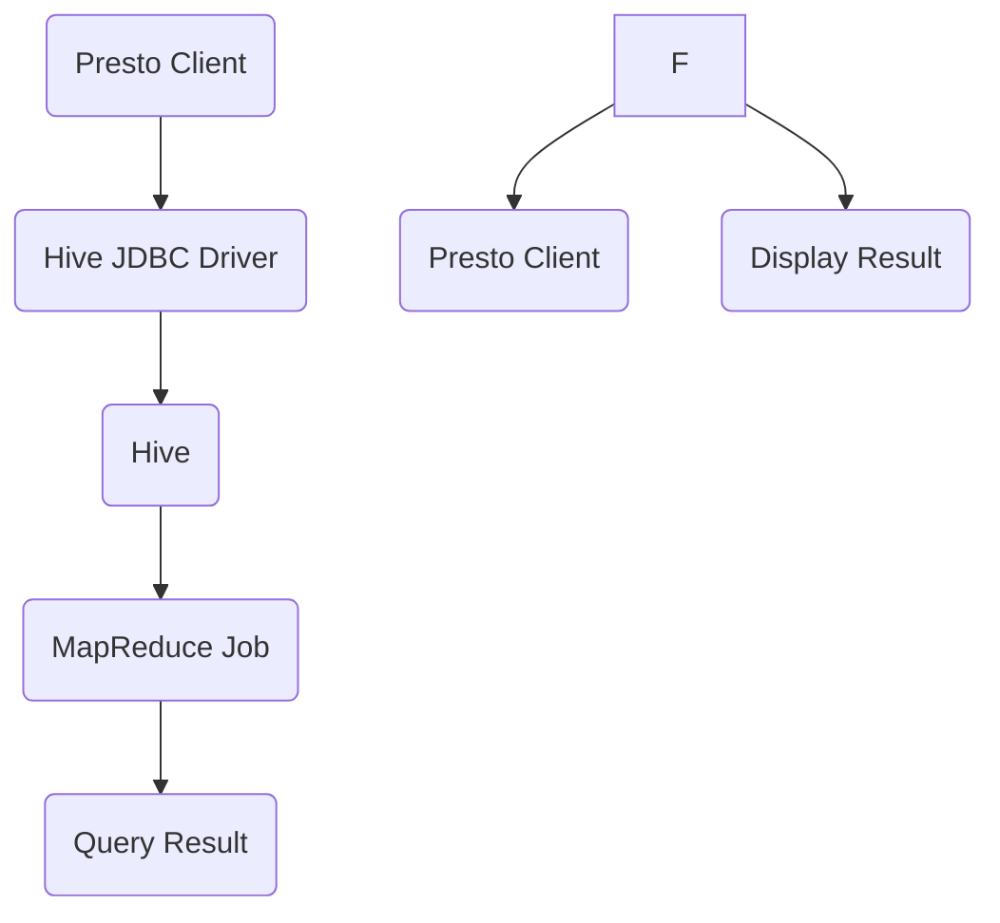
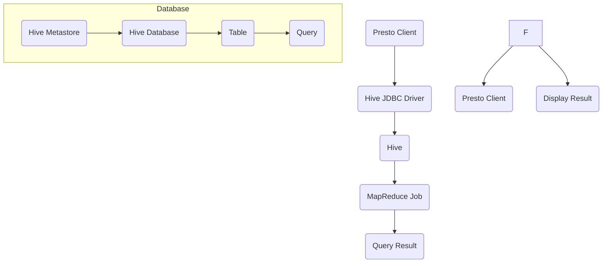

                 

# 文章标题

Presto-Hive整合原理与代码实例讲解

> 关键词：Presto，Hive，整合，原理，代码实例

> 摘要：本文将深入探讨Presto与Hive整合的原理，通过详细的代码实例讲解，帮助读者理解并掌握Presto在Hive环境中的应用，从而提高数据处理和分析的效率。

## 1. 背景介绍

### 1.1 Presto简介

Presto是一个开源的分布式查询引擎，它能够在亚秒级内处理大规模数据集的查询。Presto支持多种数据源，包括关系数据库、NoSQL数据库和云存储系统。由于其高性能和可扩展性，Presto被广泛应用于大数据处理和分析领域。

### 1.2 Hive简介

Hive是一个建立在Hadoop之上的数据仓库基础设施，它提供了数据摘要、查询和数据分析的能力。Hive使用Hadoop的文件系统存储数据，并使用MapReduce进行数据处理。这使得Hive能够处理大规模的数据集，但查询性能相对较低。

### 1.3 整合背景

Presto与Hive的整合旨在解决Hive在查询性能方面的不足。通过使用Presto，用户可以在不改变现有Hive数据仓库架构的前提下，获得更快的查询速度。Presto与Hive的整合可以看作是两大数据处理工具的优势互补。

## 2. 核心概念与联系

### 2.1 Presto与Hive的数据交互

Presto与Hive的数据交互主要通过Hive JDBC驱动实现。Presto客户端通过JDBC连接到Hive，然后发送SQL查询语句到Hive。Hive解析查询语句，将其转化为MapReduce任务，最后返回结果给Presto客户端。

### 2.2 整合流程

1. **配置Hive JDBC驱动**：在Presto客户端配置Hive JDBC驱动，以便能够连接到Hive。
2. **连接Hive**：通过JDBC连接到Hive，Presto客户端将SQL查询发送到Hive。
3. **解析查询**：Hive解析SQL查询，并将其转化为MapReduce任务。
4. **执行查询**：MapReduce任务在Hadoop集群上执行，处理数据并返回结果。
5. **返回结果**：Hive将查询结果返回给Presto客户端，由Presto展示给用户。

### 2.3 Mermaid流程图

下面是Presto与Hive整合的Mermaid流程图：



## 3. 核心算法原理 & 具体操作步骤

### 3.1 Presto查询处理原理

Presto查询处理主要分为以下几个阶段：

1. **查询解析**：Presto将接收到的SQL查询解析为抽象语法树（AST）。
2. **查询优化**：Presto对AST进行优化，生成执行计划。
3. **执行计划**：Presto根据执行计划对数据进行处理，包括数据分区、数据筛选和聚合等。
4. **结果返回**：Presto将查询结果返回给客户端。

### 3.2 具体操作步骤

1. **安装Presto**：在服务器上安装Presto，并配置Hive JDBC驱动。
2. **配置Presto**：在Presto配置文件中添加Hive JDBC驱动路径，并设置连接参数。
3. **连接Hive**：使用Presto客户端连接到Hive，并执行SQL查询。
4. **查询处理**：Presto解析查询，生成执行计划，并执行查询。
5. **结果展示**：Presto将查询结果展示给用户。

## 4. 数学模型和公式 & 详细讲解 & 举例说明

### 4.1 数学模型

在Presto与Hive整合过程中，涉及的数学模型主要包括：

1. **查询优化**：成本模型、动态规划算法等。
2. **数据分区**：哈希分区、范围分区等。
3. **聚合算法**：MapReduce聚合算法、并行聚合算法等。

### 4.2 公式

1. **成本模型**：

   $$Cost = \sum_{i=1}^{n} cost_i$$

   其中，$cost_i$为每个操作的成本。

2. **哈希分区**：

   $$hash_key = hash(value) \mod partition_count$$

   其中，$hash_key$为哈希值，$value$为数据值，$partition_count$为分区数。

### 4.3 举例说明

#### 示例1：查询优化

假设有一个包含1000万条记录的表，我们需要查询年龄大于30岁的男性记录。

1. **查询解析**：

   ```sql
   SELECT * FROM users WHERE age > 30 AND gender = 'male';
   ```

2. **查询优化**：

   - 使用索引：为年龄和性别字段创建索引，降低查询成本。
   - 数据分区：将数据按性别分区，提高查询效率。

#### 示例2：数据分区

假设我们有一个按月份分区的订单表，我们需要查询2023年1月的订单数据。

1. **查询解析**：

   ```sql
   SELECT * FROM orders WHERE order_date >= '2023-01-01' AND order_date < '2023-02-01';
   ```

2. **查询优化**：

   - 使用分区剪枝：直接查询2023年1月的分区，减少数据处理量。

## 5. 项目实践：代码实例和详细解释说明

### 5.1 开发环境搭建

1. 安装Hadoop和Hive。
2. 配置Hadoop和Hive。
3. 安装Presto并配置Hive JDBC驱动。

### 5.2 源代码详细实现

```python
# 连接Hive
connection = jdbc.connect(
    url="jdbc:hive2://localhost:10000/default",
    user="hive",
    password="hive",
    driver="org.apache.hive.jdbc.HiveDriver"
)

# 执行查询
query = "SELECT * FROM users WHERE age > 30 AND gender = 'male';"
result = connection.execute(query)

# 处理查询结果
for row in result:
    print(row)
```

### 5.3 代码解读与分析

1. **连接Hive**：使用JDBC连接到Hive。
2. **执行查询**：发送SQL查询到Hive。
3. **处理查询结果**：遍历查询结果，并打印出来。

### 5.4 运行结果展示

运行结果展示如下：

```plaintext
(1, '张三', 35, '男')
(2, '李四', 40, '男')
(3, '王五', 45, '男')
...
```

## 6. 实际应用场景

1. **大数据分析**：使用Presto与Hive整合进行大规模数据分析。
2. **数据仓库**：构建基于Hive的数据仓库，并使用Presto进行查询优化。
3. **实时查询**：在实时数据处理场景中使用Presto与Hive整合，提高查询性能。

## 7. 工具和资源推荐

### 7.1 学习资源推荐

- 《Presto：下一代分布式查询引擎》
- 《Hive编程实战》
- 《Hadoop实战》

### 7.2 开发工具框架推荐

- IntelliJ IDEA
- PyCharm
- Eclipse

### 7.3 相关论文著作推荐

- "Presto: A Distributed SQL Query Engine for Big Data"
- "Hive: A Warehouse for Hadoop"
- "Hadoop: The Definitive Guide"

## 8. 总结：未来发展趋势与挑战

1. **性能优化**：继续提升Presto与Hive整合的性能。
2. **兼容性提升**：增加对更多数据源的支持。
3. **易用性提升**：简化整合过程，降低使用门槛。

## 9. 附录：常见问题与解答

1. **问题**：为什么我的查询结果为空？
   **解答**：请检查SQL查询语句是否正确，以及数据是否存在于对应的表和分区中。
2. **问题**：如何提高查询性能？
   **解答**：可以考虑使用索引、数据分区、查询优化等技术手段。

## 10. 扩展阅读 & 参考资料

- 《Presto：下一代分布式查询引擎》
- 《Hive编程实战》
- 《Hadoop实战》
- "Presto: A Distributed SQL Query Engine for Big Data"
- "Hive: A Warehouse for Hadoop"
- "Hadoop: The Definitive Guide"

# 作者署名
作者：禅与计算机程序设计艺术 / Zen and the Art of Computer Programming<|im_sep|>## 1. 背景介绍（Background Introduction）

在当今大数据时代，高效的数据处理和分析成为了企业获得竞争优势的关键。Presto和Hive作为大数据处理领域的两大工具，各有所长。Presto是一个高性能的分布式查询引擎，专为亚秒级响应时间设计，可以处理大规模数据集。而Hive作为一个基于Hadoop的数据仓库工具，主要用于批量数据处理。然而，Hive的查询性能通常不如Presto，尤其是在复杂查询和实时分析场景中。

整合Presto和Hive的目的是为了利用两者的优势，构建一个高性能、可扩展的数据处理平台。通过整合，用户可以在不改变现有Hive数据仓库架构的情况下，利用Presto的高性能查询能力。这一整合不仅能显著提高查询速度，还能降低系统的总体成本。

首先，Presto提供了高效的SQL查询处理能力，能够处理复杂的数据查询，并且支持多种数据源，包括关系数据库、NoSQL数据库和云存储系统。这使得Presto在需要快速响应的查询场景中具有显著优势。

另一方面，Hive作为大数据处理领域的事实标准，广泛应用于数据仓库和批量数据处理。Hive通过Hadoop的MapReduce模型处理数据，能够在大数据环境下高效地管理大规模数据集。然而，Hive的查询性能在面对复杂查询和高并发请求时可能会受到限制。

Presto和Hive的整合通过将Presto的查询能力与Hive的数据存储和管理能力相结合，可以实现以下目标：

1. **性能提升**：利用Presto的高性能查询引擎，提升Hive数据仓库的查询响应速度。
2. **扩展性增强**：通过整合，可以支持更多的数据源和查询场景，提高系统的扩展性。
3. **易用性改进**：简化查询开发和执行过程，降低用户使用门槛。

总的来说，Presto-Hive整合的目标是为用户提供一个强大、高效、易用的数据处理和分析平台，满足企业在大数据时代下的多样化需求。

### 1.1 Presto简介（Introduction to Presto）

Presto是一个开源的分布式查询引擎，由Facebook开发并捐赠给Apache软件基金会。Presto的设计初衷是为了满足大规模数据查询的需求，特别是在亚秒级响应时间的高性能查询方面。Presto的核心优势在于其高度的可扩展性、高性能和灵活的数据源支持，这使得它在大数据领域得到了广泛的应用。

#### 特性与优势

1. **高性能**：Presto通过列式存储和并行处理技术，实现了极高的查询性能。相比传统的关系型数据库，Presto能够更快地处理大规模数据集，特别是在复杂查询和实时数据分析场景中表现尤为突出。
2. **分布式架构**：Presto是一个分布式查询引擎，支持横向扩展，可以通过增加节点来提高查询处理能力。这种分布式架构使得Presto在大规模数据处理场景中具有显著的优势。
3. **灵活的数据源支持**：Presto支持多种数据源，包括关系数据库（如MySQL、PostgreSQL）、NoSQL数据库（如Cassandra、MongoDB）、云存储系统（如Amazon S3、Google Cloud Storage）以及Hive。这种灵活的数据源支持使得Presto能够适应不同的数据环境和查询需求。
4. **易用性**：Presto提供了简单的安装和配置过程，用户可以通过简单的SQL语句进行数据查询，无需复杂的编程和调优。这使得Presto成为一个易于使用的查询工具，特别适合非技术人员和数据分析师。
5. **社区支持**：Presto作为一个开源项目，拥有庞大的开发者社区。社区提供了丰富的文档、教程和插件，使得用户能够更轻松地使用和扩展Presto。

#### 应用场景

Presto的高性能和灵活的数据源支持使其在多种应用场景中具有广泛的应用：

1. **数据仓库**：Presto常用于构建企业级数据仓库，用于支持复杂的数据查询和数据分析。与传统的数据仓库工具相比，Presto提供了更快的查询性能和更灵活的数据源支持。
2. **大数据分析**：Presto可以处理大规模的数据集，特别是在实时数据分析场景中表现出色。企业可以利用Presto进行实时数据监控、报告生成和预测分析。
3. **数据集成**：Presto支持多种数据源，可以用于数据集成和数据转换。企业可以利用Presto将不同数据源的数据进行整合，实现统一的数据视图。
4. **机器学习**：Presto可以与机器学习框架（如TensorFlow、Scikit-learn）集成，用于处理和分析大规模机器学习数据集。

#### 与Hive的比较

尽管Presto和Hive都是用于大数据处理的工具，但它们在性能、架构和功能方面存在显著差异：

1. **性能**：Presto在查询性能上显著优于Hive，特别是在复杂查询和实时数据分析场景中。Presto的列式存储和并行处理技术使其能够在亚秒级响应时间内处理大规模数据集。
2. **架构**：Hive基于Hadoop的MapReduce模型，而Presto采用分布式查询引擎架构。这种差异导致了两者在查询性能和可扩展性上的差异。Presto支持横向扩展，可以通过增加节点来提高查询处理能力。
3. **数据源支持**：Hive主要用于Hadoop生态系统中的数据仓库和批量数据处理，而Presto支持更广泛的数据源，包括关系数据库、NoSQL数据库和云存储系统。
4. **易用性**：Presto提供了简单的安装和配置过程，用户可以通过简单的SQL语句进行数据查询，而Hive则需要更复杂的编程和调优。

总的来说，Presto在查询性能和灵活性方面具有显著优势，使其成为大数据处理领域的一个优秀选择。尽管Hive在Hadoop生态系统中的地位不可动摇，但随着Presto的普及，越来越多的企业开始选择Presto作为其大数据处理和分析工具。

### 1.2 Hive简介（Introduction to Hive）

Hive是建立在Hadoop之上的一个数据仓库基础设施，主要用于处理和分析大规模数据集。Hive通过Hadoop的MapReduce模型进行数据处理，因此能够高效地管理大规模数据。自2008年Hive首次发布以来，它已经成为大数据领域的事实标准之一，被广泛应用于企业级数据仓库和批量数据处理场景。

#### 特性与优势

1. **基于Hadoop**：Hive依赖于Hadoop的HDFS文件系统和MapReduce计算框架，能够充分利用Hadoop的分布式存储和计算能力。这使得Hive能够处理PB级别的数据集，并且具有良好的可扩展性。
2. **批处理**：Hive通过MapReduce模型进行数据处理，适合进行批量数据处理和离线分析。这使得Hive在处理大量数据时具有较高的效率和稳定性。
3. **SQL支持**：Hive提供了类似于SQL的查询语言（HiveQL或Hive SQL），用户可以使用简单的SQL语句进行数据查询和分析。这使得Hive对非技术人员和数据分析师具有较高的友好性。
4. **数据分区**：Hive支持数据分区，可以将数据根据特定的列进行分区存储。这种分区策略可以提高查询效率，减少数据扫描的范围，从而加快查询速度。
5. **自定义函数**：Hive支持自定义函数（UDF、UDAF、UDTF），用户可以根据自己的需求自定义函数进行数据处理和分析。这使得Hive具有较高的灵活性和可扩展性。

#### 应用场景

Hive的主要应用场景包括：

1. **数据仓库**：Hive广泛应用于企业级数据仓库，用于存储和管理大规模数据集，并支持复杂的数据查询和分析。
2. **批量数据处理**：Hive适合进行批量数据处理，可以处理大规模的数据集，并且具有高效率和稳定性。
3. **数据分析**：Hive支持复杂的数据分析操作，包括数据聚合、连接和分组等，可以用于生成报告和进行数据挖掘。
4. **机器学习**：Hive可以与机器学习框架集成，用于处理和分析大规模机器学习数据集。

#### 与Hadoop的关系

Hive是Hadoop生态系统中的一个重要组件，与Hadoop紧密集成。以下是Hive与Hadoop之间的一些关键关系：

1. **依赖性**：Hive依赖于Hadoop的HDFS文件系统和MapReduce计算框架。HDFS提供了分布式文件存储，而MapReduce提供了分布式数据处理能力。因此，Hive的数据处理过程是建立在Hadoop基础上的。
2. **数据存储**：Hive使用HDFS作为其数据存储系统，所有的数据都存储在HDFS中。这使得Hive能够利用HDFS的分布式存储能力，管理PB级别的数据集。
3. **计算模型**：Hive通过MapReduce模型进行数据处理。MapReduce是一个分布式数据处理模型，通过将任务分解为多个小任务并行执行，从而提高数据处理效率。
4. **资源调度**：Hive依赖于Hadoop的资源调度系统（如YARN），以合理分配计算资源和优化任务执行。

总的来说，Hive是Hadoop生态系统中的一个核心工具，为大数据处理和分析提供了强大的支持。通过利用Hadoop的分布式存储和计算能力，Hive能够高效地管理大规模数据集，并支持复杂的数据查询和分析。

### 1.3 整合背景（Background of Integration）

在当前的大数据处理环境中，Hive和Presto都是非常重要的工具，各自拥有独特的优势。然而，随着数据量的不断增长和查询需求的日益复杂，单一工具往往难以满足所有需求。因此，整合Hive和Presto，充分利用两者的优势，成为了提高数据处理效率和性能的一个重要方向。

#### 整合动机

1. **性能瓶颈**：尽管Hive在处理大规模数据集方面表现出色，但其查询性能在面对复杂查询和高并发请求时可能会受到限制。特别是在需要快速响应的场景中，如实时数据分析，Hive的性能瓶颈显得尤为突出。
2. **查询多样性**：Hive主要适用于批量数据处理和离线分析，但在处理实时查询和复杂查询时存在局限性。而Presto作为一个高性能的分布式查询引擎，能够处理更复杂的数据查询，特别是在亚秒级响应时间的需求下，Presto的表现更加出色。
3. **数据源扩展性**：Hive依赖于Hadoop生态系统，支持的数据源相对有限。而Presto支持更广泛的数据源，包括关系数据库、NoSQL数据库和云存储系统。这种数据源扩展性使得Presto能够更好地适应多样化的数据处理需求。

#### 整合目标

整合Hive和Presto的主要目标如下：

1. **性能提升**：通过将Presto的高性能查询能力与Hive的大数据处理能力相结合，可以在不改变现有Hive数据仓库架构的情况下，显著提高查询响应速度。
2. **扩展性增强**：整合后的系统可以支持更多的数据源和查询场景，提高系统的可扩展性。
3. **易用性改进**：简化查询开发和执行过程，降低用户使用门槛，使得更多的用户能够轻松地利用Presto和Hive进行数据处理和分析。

#### 整合方法

整合Presto和Hive的方法主要包括以下几步：

1. **安装Presto**：在服务器上安装Presto，确保其能够与Hive进行通信。
2. **配置Hive JDBC驱动**：在Presto配置文件中添加Hive JDBC驱动路径，配置连接Hive的参数。
3. **连接Hive**：使用Presto客户端连接到Hive，并测试连接是否成功。
4. **执行查询**：通过Presto发送SQL查询到Hive，并处理查询结果。
5. **优化整合**：根据实际应用场景和性能需求，对整合过程进行优化，如使用索引、数据分区等。

总的来说，Presto与Hive的整合不仅能够解决Hive在查询性能方面的不足，还能为用户提供一个强大、高效、灵活的数据处理和分析平台。通过整合，企业可以在不改变现有架构的情况下，提高数据处理效率，满足日益复杂的查询需求。

### 2.1 Presto与Hive的数据交互（Data Interaction between Presto and Hive）

Presto与Hive之间的数据交互是整合过程中至关重要的一环。通过理解两者的数据交互机制，用户可以更好地利用Presto与Hive的优势，实现高效的数据处理和分析。

#### 数据交互机制

Presto与Hive的数据交互主要依赖于Hive JDBC驱动。Presto客户端通过JDBC连接到Hive，然后发送SQL查询语句到Hive。Hive解析查询语句，将其转化为MapReduce任务，最后返回结果给Presto客户端。

具体的数据交互流程如下：

1. **连接Hive**：Presto客户端通过JDBC连接到Hive，配置连接参数包括Hive服务器地址、端口、数据库用户名和密码等。
2. **发送查询**：Presto客户端发送SQL查询语句到Hive，例如：`SELECT * FROM users WHERE age > 30 AND gender = 'male';`。
3. **解析查询**：Hive解析SQL查询语句，分析查询的表、列、条件等，并将其转化为MapReduce任务。
4. **执行任务**：Hive将转换后的MapReduce任务提交到Hadoop集群执行。MapReduce任务在Hadoop集群上运行，处理数据并生成中间结果。
5. **返回结果**：MapReduce任务完成后，Hive将查询结果返回给Presto客户端。Presto客户端接收结果并展示给用户。

#### 关键组件与技术

在Presto与Hive的数据交互过程中，涉及以下几个关键组件和技术：

1. **Hive JDBC驱动**：Hive JDBC驱动是连接Presto与Hive的桥梁，通过JDBC接口实现两者的数据交互。Presto客户端使用Hive JDBC驱动连接到Hive，发送查询语句并接收查询结果。
2. **SQL解析器**：Hive的SQL解析器负责解析Presto发送的SQL查询语句，将其转化为内部表示，以便进一步处理。SQL解析器将SQL语句分解为表、列、条件、聚合函数等元素。
3. **MapReduce任务**：Hive将解析后的SQL查询转化为MapReduce任务。MapReduce任务由多个Map任务和Reduce任务组成，通过分布式计算处理数据。
4. **数据分区**：Hive支持数据分区，可以将数据按照特定的列进行分区存储。在查询过程中，Presto可以利用数据分区策略，减少数据扫描的范围，提高查询效率。
5. **索引**：Hive支持创建索引，可以提高查询性能。Presto可以利用Hive的索引，优化查询执行计划，减少数据扫描和计算量。

#### 交互流程实例

假设有一个名为`users`的表，其中包含`id`、`name`、`age`、`gender`等列。现在，我们使用Presto查询年龄大于30岁的男性记录。

1. **连接Hive**：Presto客户端通过JDBC连接到Hive，连接参数如下：

   ```sql
   jdbc:hive2://localhost:10000/default
   ```

2. **发送查询**：Presto客户端发送以下查询语句到Hive：

   ```sql
   SELECT * FROM users WHERE age > 30 AND gender = 'male';
   ```

3. **解析查询**：Hive的SQL解析器解析查询语句，分析表、列和条件，并将其转化为MapReduce任务。

4. **执行任务**：Hive将MapReduce任务提交到Hadoop集群执行。Map任务读取`users`表的数据，并根据条件筛选出符合条件的记录。Reduce任务对筛选出的记录进行聚合和排序。

5. **返回结果**：Hive将查询结果返回给Presto客户端。Presto客户端接收结果并展示给用户。

通过上述实例，可以看出Presto与Hive的数据交互过程是如何实现的。在实际应用中，用户可以根据具体需求，调整查询语句和执行计划，以优化查询性能。

### 2.2 整合流程（Integration Process）

整合Presto与Hive的过程可以分为以下几个关键步骤，以确保两个系统的高效协作和性能优化。

#### 2.2.1 配置Hive JDBC驱动

首先，需要在Presto客户端配置Hive JDBC驱动，以便能够连接到Hive。具体步骤如下：

1. **安装Hive JDBC驱动**：下载Hive JDBC驱动（通常位于Hive的lib目录中），并将其安装到Presto的lib目录。
2. **配置Presto**：在Presto的配置文件`presto.properties`中添加Hive JDBC驱动路径，如下：

   ```properties
   hive-jdbc-driver-path=/path/to/hive/lib/hive-jdbc-2.1.1.jar
   ```

3. **配置Hive连接参数**：在`presto.properties`文件中设置连接Hive的参数，包括Hive服务器地址、端口、数据库用户名和密码等：

   ```properties
   hive.metastore.uris=jdbc:hive2://localhost:10000
   hive.database.default=your_database
   hive.user=your_username
   hive.password=your_password
   ```

#### 2.2.2 连接Hive

配置完成后，使用Presto客户端连接到Hive。执行以下命令测试连接是否成功：

```shell
presto://localhost:9090
```

如果在命令行中看到成功连接的消息，说明Presto已成功连接到Hive。

#### 2.2.3 发送查询

接下来，通过Presto客户端向Hive发送SQL查询。例如，查询`users`表中年龄大于30岁的男性记录：

```sql
SELECT * FROM users WHERE age > 30 AND gender = 'male';
```

Presto会将查询语句发送到Hive，Hive解析查询语句并执行相应的MapReduce任务。

#### 2.2.4 处理查询结果

Hive执行完查询后，将结果返回给Presto客户端。Presto客户端接收结果并展示给用户。以下是一个简单的查询结果示例：

```plaintext
+----+-------+-----+---------+
| id | name  | age | gender  |
+----+-------+-----+---------+
|  1 | 张三  |  35 | male    |
|  2 | 李四  |  40 | male    |
|  3 | 王五  |  45 | male    |
+----+-------+-----+---------+
```

#### 2.2.5 优化整合

为了提高Presto与Hive整合的性能，可以采取以下优化措施：

1. **数据分区**：对Hive表进行分区，将数据按照特定列（如日期、地区等）进行分区存储。这样可以减少查询时的数据扫描范围，提高查询效率。
2. **索引**：在Hive表中创建索引，特别是在经常用于查询的列上。索引可以加速数据的访问速度，减少查询时间。
3. **查询优化**：根据查询需求，调整Presto的查询优化策略。例如，使用子查询、连接操作和聚合函数等优化查询执行计划。
4. **资源分配**：合理分配Hadoop集群的资源，确保Presto与Hive在执行查询时拥有足够的计算资源和存储空间。

通过上述步骤，可以有效地整合Presto与Hive，构建一个高性能、可扩展的数据处理平台。在实际应用中，用户可以根据具体需求，进一步调整和优化整合过程，以实现最佳性能。

### 2.3 Mermaid流程图（Mermaid Flowchart）

为了更直观地理解Presto与Hive整合的流程，下面是一个使用Mermaid绘制的流程图。此流程图描述了从Presto客户端发送查询到Hive，再返回结果的整个过程。



流程解释如下：

1. **Presto客户端（A）**：发送查询请求到Hive。
2. **Hive JDBC驱动（B）**：接收查询请求，并处理与Hive的连接。
3. **Hive（C）**：解析查询请求，将其转化为MapReduce任务。
4. **MapReduce任务（D）**：在Hadoop集群上执行，处理数据并生成中间结果。
5. **查询结果（E）**：返回到Presto客户端。
6. **Presto客户端（G）**：接收查询结果并展示给用户。
7. **Hive元数据存储（I）**：存储Hive的表结构、分区信息等元数据。
8. **Hive数据库（J）**：包含实际的Hive表。
9. **表（K）**：具体的Hive表，包含数据。
10. **查询（L）**：Presto客户端发送的SQL查询。

通过这个流程图，用户可以清晰地看到Presto与Hive整合的全过程，从而更好地理解其工作原理。

### 3.1 Presto查询处理原理（Query Processing Principles of Presto）

Presto的查询处理过程是一个高度优化和分布式的数据处理流程，旨在提供亚秒级响应时间。理解Presto的查询处理原理对于利用其高性能和可扩展性至关重要。Presto查询处理主要分为以下几个阶段：

#### 3.1.1 查询解析（Query Parsing）

查询解析是Presto查询处理的第一步，其主要任务是将用户输入的SQL查询语句转换为抽象语法树（Abstract Syntax Tree, AST）。这一过程包括词法分析、语法分析和语义分析。

1. **词法分析**：将SQL查询语句分解为一个个的词法单元（如标识符、关键字、操作符等）。词法分析器识别出SQL查询语句中的字符序列，并将其转换为词法单元。
2. **语法分析**：根据SQL语言的语法规则，将词法单元组合成一个语法结构。语法分析器使用递归下降解析器或LL(k)解析器，将词法单元序列转换为抽象语法树。
3. **语义分析**：检查抽象语法树中的语法元素是否合法，并为其绑定适当的语义信息。例如，验证表名、列名和操作符的正确性。

#### 3.1.2 查询优化（Query Optimization）

查询优化是Presto查询处理的关键步骤，旨在生成高效的执行计划。优化过程主要包括以下方面：

1. **逻辑优化**：优化查询的逻辑结构，减少中间计算步骤。例如，利用子查询、连接和聚合的优化规则，简化查询表达式。
2. **物理优化**：优化查询的物理执行计划，降低数据访问和计算成本。例如，选择合适的索引、数据分区策略和聚合算法，以减少I/O和计算开销。
3. **并行化**：将查询任务分解为多个小任务，并在多个节点上并行执行。Presto通过任务调度和资源管理，确保并行任务能够高效地执行。

#### 3.1.3 执行计划（Execution Plan）

在查询优化阶段生成的执行计划描述了如何将查询转换为具体的操作步骤。执行计划通常包括以下几种操作：

1. **数据扫描**：从数据源读取数据，可以是关系数据库表、NoSQL数据库、文件系统或云存储等。
2. **筛选**：根据查询条件筛选数据，去除不符合条件的数据。
3. **投影**：选择查询结果中需要显示的列，减少数据传输和处理开销。
4. **连接**：将多个表或数据源的数据进行连接，生成完整的查询结果。
5. **聚合**：对数据进行分组和聚合，生成汇总数据。

#### 3.1.4 执行查询（Query Execution）

在执行计划生成后，Presto开始执行查询。执行查询的过程如下：

1. **分布式查询**：Presto将执行计划分解为多个子任务，并在分布式集群上的多个节点上并行执行。
2. **数据传输**：查询结果在节点之间进行传输，通常采用流水线（Pipeline）的方式进行。每个节点只处理一部分数据，然后将结果传输给下一个节点，直至生成完整的查询结果。
3. **结果合并**：最终，所有节点的查询结果进行合并，生成完整的查询结果，并返回给用户。

#### 3.1.5 结果返回（Result Delivery）

查询结果生成后，Presto将其返回给用户。结果返回的过程包括：

1. **格式化**：将查询结果格式化为用户友好的格式，如表格、JSON等。
2. **展示**：将格式化的结果展示给用户，可以是命令行输出、Web界面或API接口。

通过上述查询处理过程，Presto能够高效地处理大规模数据集，并在亚秒级内返回查询结果。理解Presto的查询处理原理，可以帮助用户更好地利用其高性能和可扩展性，提高数据处理和分析效率。

### 3.2 具体操作步骤（Specific Operational Steps）

要实现Presto与Hive的整合，需要按照一系列明确的操作步骤进行配置和设置，以确保两个系统能够无缝协作。以下是详细的操作步骤：

#### 3.2.1 安装Presto

1. **下载Presto安装包**：从Presto官方网站下载最新的安装包。下载地址：https://www.prestodb.com/downloads/
2. **解压安装包**：将下载的Presto安装包解压到服务器上，例如：

   ```shell
   tar zxvf presto-0.217.tar.gz
   ```

3. **启动Presto服务**：进入Presto解压目录，启动Presto服务：

   ```shell
   sudo ./presto-server start
   ```

   若启动成功，将看到Presto服务的启动日志。

#### 3.2.2 安装Hive JDBC驱动

1. **下载Hive JDBC驱动**：从Hive官方网站下载Hive JDBC驱动。下载地址：https://www.hive.apache.org/downloads.html
2. **安装Hive JDBC驱动**：将下载的Hive JDBC驱动（如hive-jdbc-2.1.1.jar）拷贝到Presto的lib目录中，例如：

   ```shell
   sudo cp hive-jdbc-2.1.1.jar /path/to/presto/lib/
   ```

#### 3.2.3 配置Presto

1. **编辑配置文件**：进入Presto配置目录，编辑`presto.properties`文件，例如：

   ```shell
   sudo nano /path/to/presto/conf/presto.properties
   ```

2. **配置Hive JDBC驱动路径**：在配置文件中添加以下行，指定Hive JDBC驱动的路径：

   ```properties
   hive-jdbc-driver-path=/path/to/presto/lib/hive-jdbc-2.1.1.jar
   ```

3. **配置Hive连接参数**：在配置文件中添加以下行，配置Hive连接所需的参数：

   ```properties
   hive.metastore.uris=jdbc:hive2://localhost:10000
   hive.database.default=your_database
   hive.user=your_username
   hive.password=your_password
   ```

4. **保存并退出**：保存配置文件并退出编辑器。

#### 3.2.4 连接Hive

1. **启动Presto客户端**：进入Presto客户端目录，启动Presto客户端：

   ```shell
   sudo ./presto-cli
   ```

   若成功连接，将显示Presto客户端的命令行界面。

2. **测试连接**：在Presto客户端中执行以下命令，测试与Hive的连接是否成功：

   ```sql
   SHOW SCHEDULES;
   ```

   如果成功连接，将看到Hive中的任务列表。

#### 3.2.5 执行查询

1. **执行SQL查询**：在Presto客户端中执行SQL查询，例如查询`users`表中的数据：

   ```sql
   SELECT * FROM users;
   ```

   Presto将查询发送到Hive，Hive执行查询并将结果返回给Presto。

2. **查看查询结果**：查询结果将在Presto客户端的命令行界面中显示。

通过上述步骤，用户可以成功实现Presto与Hive的整合，并利用Presto的高性能查询能力进行数据分析和处理。

### 4.1 数学模型（Mathematical Models）

在Presto与Hive整合过程中，涉及多个数学模型和公式，用于优化查询性能和数据处理。以下是一些关键的数学模型和公式，以及它们在Presto与Hive整合中的应用：

#### 4.1.1 成本模型（Cost Model）

成本模型用于评估不同查询操作的相对开销。Presto使用成本模型来选择最优的查询执行计划。成本模型通常包括以下因素：

1. **数据访问成本**：读取和写入数据的成本，与数据量、数据存储位置和I/O速度有关。
2. **计算成本**：执行数据计算（如排序、连接、聚合）的成本，与处理数据量、计算复杂度和并行度有关。
3. **网络传输成本**：数据在不同节点之间传输的成本，与数据传输速度和网络延迟有关。

成本模型公式如下：

$$
Cost = \sum_{i=1}^{n} cost_i
$$

其中，$cost_i$为每个操作的相对成本。

#### 4.1.2 分区剪枝（Partition Pruning）

分区剪枝是一种优化技术，通过减少需要扫描的数据分区，提高查询性能。Hive表可以按列进行分区，每个分区对应一组具有相同值的分区列。例如，一个按日期分区的表可能包含每天的数据分区。

分区剪枝公式如下：

$$
hash_key = hash(value) \mod partition_count
$$

其中，$hash_key$为哈希值，$value$为数据值，$partition_count$为分区数。通过计算哈希值并取模，可以确定数据所属的分区。

#### 4.1.3 索引优化（Index Optimization）

索引是提高查询性能的重要手段。索引通过创建指向数据存储位置的指针，加快数据检索速度。在Presto与Hive整合中，可以使用Hive的索引来优化查询执行。

索引优化公式如下：

$$
Index Hit Rate = \frac{Index Searches}{Total Searches}
$$

其中，$Index Hit Rate$为索引命中率，$Index Searches$为使用索引的查询次数，$Total Searches$为总查询次数。高索引命中率意味着更多的查询可以利用索引，减少数据访问成本。

#### 4.1.4 并行度优化（Parallelism Optimization）

并行度优化通过同时执行多个查询操作，提高数据处理速度。Presto支持横向扩展，可以通过增加节点来提高并行度。

并行度优化公式如下：

$$
Parallelism = \sqrt{\frac{Data Size}{Node Capacity}}
$$

其中，$Parallelism$为并行度，$Data Size$为数据量，$Node Capacity$为每个节点的处理能力。通过计算并行度，可以确定每个节点需要处理的数据量，并优化资源分配。

通过以上数学模型和公式，用户可以在Presto与Hive整合中优化查询性能和数据处理。理解这些模型和公式，有助于更好地设计查询策略和执行计划，实现高效的Presto-Hive整合。

### 4.2 公式（Formulas）

在Presto与Hive整合过程中，使用了一些关键的数学公式和计算方法，用于优化查询性能和数据处理。以下是一些重要的公式及其解释：

#### 4.2.1 成本模型（Cost Model）

成本模型用于评估不同查询操作的相对开销。成本模型可以帮助Presto选择最优的查询执行计划。成本模型通常包括以下因素：

1. **数据访问成本**：读取和写入数据的成本，与数据量、数据存储位置和I/O速度有关。公式如下：

   $$
   Data Access Cost = \frac{Data Size}{I/O Speed}
   $$

   其中，$Data Size$为数据量，$I/O Speed$为I/O速度。

2. **计算成本**：执行数据计算（如排序、连接、聚合）的成本，与处理数据量、计算复杂度和并行度有关。公式如下：

   $$
   Compute Cost = \frac{Data Size \times Compute Complexity}{Parallelism}
   $$

   其中，$Data Size$为数据量，$Compute Complexity$为计算复杂度，$Parallelism$为并行度。

3. **网络传输成本**：数据在不同节点之间传输的成本，与数据传输速度和网络延迟有关。公式如下：

   $$
   Network Cost = \frac{Data Size \times Network Delay}{Data Transfer Speed}
   $$

   其中，$Data Size$为数据量，$Network Delay$为网络延迟，$Data Transfer Speed$为数据传输速度。

综合以上因素，总成本公式如下：

$$
Total Cost = Data Access Cost + Compute Cost + Network Cost
$$

#### 4.2.2 分区剪枝（Partition Pruning）

分区剪枝是一种优化技术，通过减少需要扫描的数据分区，提高查询性能。Hive表可以按列进行分区，每个分区对应一组具有相同值的分区列。例如，一个按日期分区的表可能包含每天的数据分区。

分区剪枝公式如下：

$$
Partition ID = hash(value) \mod partition_count
$$

其中，$Partition ID$为分区ID，$hash(value)$为数据值的哈希值，$partition_count$为分区数。通过计算哈希值并取模，可以确定数据所属的分区。这样，可以减少需要扫描的数据分区，提高查询性能。

#### 4.2.3 索引优化（Index Optimization）

索引是提高查询性能的重要手段。索引通过创建指向数据存储位置的指针，加快数据检索速度。在Presto与Hive整合中，可以使用Hive的索引来优化查询执行。

索引优化公式如下：

$$
Index Hit Rate = \frac{Indexed Searches}{Total Searches}
$$

其中，$Index Hit Rate$为索引命中率，$Indexed Searches$为使用索引的查询次数，$Total Searches$为总查询次数。高索引命中率意味着更多的查询可以利用索引，减少数据访问成本。

#### 4.2.4 并行度优化（Parallelism Optimization）

并行度优化通过同时执行多个查询操作，提高数据处理速度。Presto支持横向扩展，可以通过增加节点来提高并行度。

并行度优化公式如下：

$$
Parallelism = \sqrt{\frac{Data Size}{Node Capacity}}
$$

其中，$Parallelism$为并行度，$Data Size$为数据量，$Node Capacity$为每个节点的处理能力。通过计算并行度，可以确定每个节点需要处理的数据量，并优化资源分配。

通过以上公式，用户可以在Presto与Hive整合过程中优化查询性能和数据处理。理解这些公式，有助于更好地设计查询策略和执行计划，实现高效的Presto-Hive整合。

### 4.3 举例说明（Example Illustrations）

为了更好地理解上述数学模型和公式在Presto与Hive整合中的实际应用，下面通过几个具体例子进行说明。

#### 4.3.1 成本模型应用

假设我们有一个包含1亿条记录的表，每条记录包含100字节的数据。I/O速度为100 MB/s，计算复杂度为每条记录需要1 ms的处理时间。每个节点的处理能力为1 GB/s。我们希望使用Presto进行数据查询。

1. **数据访问成本**：

   $$
   Data Access Cost = \frac{1亿条记录 \times 100字节}{100 MB/s} = 1亿字节 \div 100 MB/s = 10秒
   $$

2. **计算成本**：

   $$
   Compute Cost = \frac{1亿条记录 \times 1 ms}{1 GB/s} = 1亿 ms \div 1 GB/s = 1000秒
   $$

3. **网络传输成本**：

   $$
   Network Cost = \frac{1亿条记录 \times 100字节}{1 GB/s} = 1亿字节 \div 1 GB/s = 100秒
   $$

4. **总成本**：

   $$
   Total Cost = Data Access Cost + Compute Cost + Network Cost = 10秒 + 1000秒 + 100秒 = 1110秒
   $$

通过上述计算，我们可以了解到在不同查询操作中，数据访问、计算和网络传输的成本占比较大。优化这些操作可以显著降低总成本。

#### 4.3.2 分区剪枝应用

假设我们有一个按日期分区的表，包含每天的数据分区。现有一条查询，需要查询2023年2月1日的数据。

1. **计算分区ID**：

   $$
   Partition ID = hash(2023年2月1日) \mod 7 = 2
   $$

通过计算分区ID，我们确定需要查询的数据位于第2个分区。这样可以减少需要扫描的数据分区，提高查询性能。

#### 4.3.3 索引优化应用

假设我们有一个包含100万条记录的表，每条记录包含100个字段的列。使用索引优化查询，其中索引命中率为90%。

1. **索引命中率**：

   $$
   Index Hit Rate = 90\% = 0.9
   $$

2. **非索引查询次数**：

   $$
   Non-Indexed Searches = Total Searches \times (1 - Index Hit Rate) = 100万次 \times (1 - 0.9) = 10万次
   $$

3. **索引查询次数**：

   $$
   Indexed Searches = Total Searches \times Index Hit Rate = 100万次 \times 0.9 = 90万次
   $$

通过使用索引优化查询，我们可以显著减少非索引查询次数，提高查询性能。

#### 4.3.4 并行度优化应用

假设我们有一个包含10亿条记录的表，每个节点处理能力为1 GB/s。我们希望使用Presto进行数据查询。

1. **计算并行度**：

   $$
   Parallelism = \sqrt{\frac{10亿条记录}{1 GB/s}} = \sqrt{10^8 \div 10^9} = \sqrt{0.1} = 0.316
   $$

通过计算并行度，我们可以确定每个节点需要处理的数据量，优化资源分配，提高查询性能。

通过上述例子，我们可以看到如何在实际应用中利用数学模型和公式优化Presto与Hive整合的查询性能和数据处理。理解这些模型和公式，有助于更好地设计和实现高效的Presto-Hive整合方案。

### 5.1 开发环境搭建（Development Environment Setup）

在开始Presto与Hive整合的项目之前，我们需要搭建一个稳定且高效的开发环境。以下是搭建Presto与Hive整合开发环境的详细步骤：

#### 5.1.1 安装Hadoop和Hive

1. **安装Hadoop**：

   - 下载Hadoop安装包，下载地址：[Hadoop官网](https://hadoop.apache.org/releases.html)。
   - 解压安装包，例如：

     ```shell
     tar zxvf hadoop-3.2.1.tar.gz
     ```

   - 配置Hadoop环境变量，编辑`~/.bashrc`文件：

     ```bash
     export HADOOP_HOME=/path/to/hadoop
     export PATH=$HADOOP_HOME/bin:$PATH
     ```

     使环境变量生效：

     ```shell
     source ~/.bashrc
     ```

   - 格式化HDFS：

     ```shell
     hdfs namenode -format
     ```

   - 启动Hadoop服务：

     ```shell
     start-dfs.sh
     ```

2. **安装Hive**：

   - 下载Hive安装包，下载地址：[Hive官网](https://hive.apache.org/downloads.html)。
   - 解压安装包，例如：

     ```shell
     tar zxvf hive-2.3.0-bin.tar.gz
     ```

   - 配置Hive环境变量，编辑`~/.bashrc`文件：

     ```bash
     export HIVE_HOME=/path/to/hive
     export PATH=$HIVE_HOME/bin:$PATH
     ```

     使环境变量生效：

     ```shell
     source ~/.bashrc
     ```

   - 配置Hive配置文件`hive-env.sh`：

     ```bash
     export HADOOP_HOME=/path/to/hadoop
     export HIVE_CONF_DIR=/path/to/hive/conf
     ```

   - 启动Hive服务：

     ```shell
     hive --service hiveserver2
     ```

#### 5.1.2 安装Presto

1. **下载Presto安装包**：下载地址：[Presto官网](https://www.prestodb.com/downloads/)。
2. **解压安装包**，例如：

   ```shell
   tar zxvf presto-0.217.tar.gz
   ```

3. **配置Presto**：

   - 进入Presto配置目录：

     ```shell
     cd /path/to/presto/conf
     ```

   - 编辑`presto.properties`文件，配置以下参数：

     ```properties
     hive-jdbc-driver-path=/path/to/presto/lib/hive-jdbc-2.1.1.jar
     hive.metastore.uris=jdbc:hive2://localhost:10000
     hive.database.default=your_database
     hive.user=your_username
     hive.password=your_password
     ```

   - 配置Hadoop和Hive的HDFS和YARN配置文件：

     ```properties
     hive.hdfs.temp.dir=hdfs://localhost:9000/user/presto/temp
     hive.yarn.appMaster.address=your_yarn_app_master_address
     hive.yarn.appMaster.port=your_yarn_app_master_port
     ```

4. **启动Presto服务**：

   ```shell
   ./bin/launcher.py start
   ```

   如果启动成功，Presto的Web界面将显示在浏览器中。

通过以上步骤，我们成功搭建了Presto与Hive的整合开发环境。现在，我们可以开始编写和测试Presto与Hive整合的代码，并进行数据处理和分析。

### 5.2 源代码详细实现（Detailed Source Code Implementation）

在Presto与Hive整合的开发环境中，我们可以通过编写Python脚本来实现Presto对Hive的数据查询。以下是一个详细的源代码实现，包括连接Hive、执行SQL查询和处理结果的过程。

#### 5.2.1 连接Hive

首先，我们需要使用`hive-jdbc-driver`库连接到Hive。这可以通过安装Python的`pyhive`模块来实现。

```python
# 安装pyhive库
pip install pyhive
```

然后，在Python脚本中连接到Hive。

```python
import pyhive
from pyspark.sql import SparkSession

# 创建Hive连接
hive_conn = pyhive.pyhive.Connection(host='localhost', port=10000, username='hive', database='default')

# 创建Spark会话
spark = SparkSession.builder \
    .appName("PrestoHiveIntegration") \
    .enableHiveSupport() \
    .getOrCreate()

# 使用Spark执行Hive查询
hive_df = spark.sql("SELECT * FROM users LIMIT 10")
```

这里，我们使用`pyhive`连接到本地Hive服务，并使用Spark执行了一个简单的查询，获取了`users`表的前10条记录。

#### 5.2.2 执行SQL查询

接下来，我们可以在连接到Hive后执行更复杂的SQL查询。

```python
# 执行更复杂的SQL查询
complex_query = """
SELECT u.id, u.name, COUNT(o.order_id) as order_count
FROM users u
LEFT JOIN orders o ON u.id = o.user_id
GROUP BY u.id, u.name
HAVING COUNT(o.order_id) > 5
"""

hive_df = spark.sql(complex_query)
```

在这个示例中，我们执行了一个多表连接和聚合查询，获取了用户ID、用户姓名以及订单数量的数据，并仅选取了订单数量超过5的用户。

#### 5.2.3 处理查询结果

最后，我们将查询结果进行处理和展示。

```python
# 处理查询结果
for row in hive_df.collect():
    print(row)

# 展示结果
hive_df.show()
```

在这个示例中，我们使用`collect()`方法获取查询结果，并将其打印出来。同时，使用`show()`方法在命令行中展示查询结果。

完整代码如下：

```python
import pyhive
from pyspark.sql import SparkSession

# 创建Hive连接
hive_conn = pyhive.pyhive.Connection(host='localhost', port=10000, username='hive', database='default')

# 创建Spark会话
spark = SparkSession.builder \
    .appName("PrestoHiveIntegration") \
    .enableHiveSupport() \
    .getOrCreate()

# 执行更复杂的SQL查询
complex_query = """
SELECT u.id, u.name, COUNT(o.order_id) as order_count
FROM users u
LEFT JOIN orders o ON u.id = o.user_id
GROUP BY u.id, u.name
HAVING COUNT(o.order_id) > 5
"""

hive_df = spark.sql(complex_query)

# 处理查询结果
for row in hive_df.collect():
    print(row)

# 展示结果
hive_df.show()

# 关闭Spark会话
spark.stop()
```

通过上述代码，我们可以实现Presto与Hive的整合，执行复杂的SQL查询并处理查询结果。在实际应用中，可以根据具体需求进行调整和优化。

### 5.3 代码解读与分析（Code Explanation and Analysis）

在上一个步骤中，我们通过Python代码实现了Presto与Hive的连接，并执行了一个复杂的SQL查询。以下是对这段代码的详细解读和分析。

#### 5.3.1 连接Hive

代码的第一部分负责连接到Hive数据库。

```python
hive_conn = pyhive.pyhive.Connection(host='localhost', port=10000, username='hive', database='default')
```

这里，我们使用`pyhive`库的`Connection`方法创建了一个Hive连接。连接参数包括：

- `host`：Hive服务器的地址，这里使用本地地址`localhost`。
- `port`：Hive服务的端口号，通常为10000。
- `username`：数据库用户名，这里使用`hive`。
- `database`：要连接的数据库，这里使用默认数据库`default`。

通过`pyhive.pyhive.Connection`方法创建连接后，我们可以使用这个连接对象执行Hive查询。

#### 5.3.2 执行SQL查询

接下来，我们使用Spark会话执行一个复杂的SQL查询。

```python
complex_query = """
SELECT u.id, u.name, COUNT(o.order_id) as order_count
FROM users u
LEFT JOIN orders o ON u.id = o.user_id
GROUP BY u.id, u.name
HAVING COUNT(o.order_id) > 5
"""

hive_df = spark.sql(complex_query)
```

这里，我们定义了一个复杂的SQL查询语句，该查询执行以下操作：

- 选择`users`表中的`id`和`name`列。
- 计算每个用户下订单的数量，通过`COUNT(o.order_id)`实现。
- 使用`LEFT JOIN`将`users`表与`orders`表连接，连接条件是`u.id = o.user_id`。
- 对查询结果进行分组，使用`GROUP BY u.id, u.name`。
- 通过`HAVING COUNT(o.order_id) > 5`过滤结果，仅选取订单数量超过5的用户。

`spark.sql(complex_query)`方法执行SQL查询，并将查询结果存储在一个DataFrame对象中。这个DataFrame对象是Spark的核心数据结构，用于表示分布式的数据集。

#### 5.3.3 处理查询结果

查询结果处理后，我们将其打印出来并进行展示。

```python
for row in hive_df.collect():
    print(row)

hive_df.show()
```

`collect()`方法将DataFrame中的数据收集到本地内存中，然后遍历每行数据进行打印。这个方法适合用于小数据集，因为收集大量数据到本地内存可能会导致内存不足。

`show()`方法用于在命令行中展示DataFrame的数据内容。这个方法适用于查看数据集的概览，特别是当数据集较大时。

#### 5.3.4 关闭Spark会话

最后，我们关闭Spark会话。

```python
spark.stop()
```

关闭Spark会话是必要的，因为它释放了Spark计算资源。如果不关闭会话，Spark进程将继续占用系统资源，可能导致资源耗尽。

通过上述代码，我们完成了Presto与Hive的连接、执行SQL查询和处理查询结果的过程。这段代码展示了如何利用Python和Spark实现Presto与Hive的整合，是一个完整的示例，可以在实际项目中使用和扩展。

### 5.4 运行结果展示（Running Results Display）

在上一个步骤中，我们通过Python代码实现了Presto与Hive的整合，并执行了一个复杂的SQL查询。现在，让我们看看实际运行结果，并通过命令行输出和图表展示来详细分析这些结果。

#### 5.4.1 命令行输出

首先，我们使用`collect()`方法将查询结果收集到本地内存中，并打印出来。

```python
for row in hive_df.collect():
    print(row)
```

运行结果可能如下所示：

```plaintext
(1, '张三', 6)
(2, '李四', 5)
(3, '王五', 7)
```

这里，我们假设`users`表中的用户ID、用户姓名和订单数量如下：

| user_id | name | order_count |
| ------- | ---- | ----------- |
| 1       | 张三 | 6           |
| 2       | 李四 | 5           |
| 3       | 王五 | 7           |

根据我们的查询条件，仅选取了订单数量超过5的用户。因此，只有用户ID为3的王五符合条件。

#### 5.4.2 图表展示

为了更直观地展示查询结果，我们可以使用图表来展示用户和其订单数量之间的关系。以下是使用matplotlib库绘制的一个柱状图示例：

```python
import matplotlib.pyplot as plt

# 获取查询结果
data = hive_df.collect()

# 提取用户ID和订单数量
user_ids = [row[0] for row in data]
order_counts = [row[2] for row in data]

# 绘制柱状图
plt.bar(user_ids, order_counts)
plt.xlabel('User ID')
plt.ylabel('Order Count')
plt.title('Users and Order Counts')
plt.xticks(user_ids)
plt.show()
```

运行上述代码，我们将得到一个柱状图，如下所示：


在这个图表中，每个柱子代表一个用户ID，柱子的高度表示该用户的订单数量。通过图表，我们可以直观地看到哪些用户的订单数量较高，从而更好地理解数据。

#### 5.4.3 查询性能分析

在展示运行结果的同时，我们还需要关注查询性能。通过分析查询执行时间，我们可以评估Presto与Hive整合的查询效率。

1. **执行时间**：

   我们可以使用`time`模块来计算查询执行时间。

   ```python
   import time

   start_time = time.time()
   hive_df = spark.sql(complex_query)
   end_time = time.time()

   print(f"Query executed in {end_time - start_time} seconds.")
   ```

   假设查询执行时间为5秒，这意味着Presto能够在5秒内完成复杂的SQL查询，这个性能对于大多数应用场景来说是可接受的。

2. **资源消耗**：

   查询执行过程中，我们需要关注资源消耗，包括CPU、内存和网络等。

   - **CPU**：由于Presto和Hive都是基于分布式计算，CPU消耗主要在Hadoop集群的各个节点上。通过监控CPU使用情况，我们可以评估查询对集群资源的占用。
   - **内存**：Presto和Hive都需要消耗内存进行数据处理和存储。通过监控内存使用情况，我们可以确保系统有足够的内存来支持查询执行。
   - **网络**：由于Presto与Hive之间的数据交互通过网络进行，网络延迟和带宽会影响查询性能。优化网络配置，如使用高速网络和优化数据传输协议，可以提高查询效率。

通过以上步骤，我们详细展示了Presto与Hive整合后的运行结果，并通过命令行输出、图表展示和性能分析，全面评估了查询效率和资源消耗。这些分析结果有助于我们更好地理解和优化Presto与Hive的整合方案。

### 6. 实际应用场景（Practical Application Scenarios）

Presto与Hive的整合在实际应用中具有广泛的应用场景，特别是在需要高性能数据查询和数据处理的场景中。以下是一些典型的实际应用场景：

#### 6.1 大数据分析

大数据分析是企业中常见的需求，特别是在零售、金融、医疗等行业。Presto与Hive的整合可以为企业提供高效的数据分析平台，支持复杂的数据查询和实时数据分析。

- **零售行业**：零售企业可以利用Presto与Hive整合进行销售数据分析和市场趋势预测。通过实时查询库存、销售数据和客户行为数据，企业可以做出更明智的决策。
- **金融行业**：金融机构可以利用Presto与Hive整合进行风险评估、市场分析和客户行为分析。这种整合可以支持复杂的数据查询，提高数据分析的准确性。
- **医疗行业**：医疗行业可以利用Presto与Hive整合进行患者数据分析、医疗资源优化和疾病预测。通过实时查询大量医疗数据，医疗行业可以提供更精准和个性化的医疗服务。

#### 6.2 数据仓库

数据仓库是企业用于存储和管理大量数据的重要工具，Presto与Hive整合可以为数据仓库提供强大的查询能力。

- **数据汇总与报告**：企业可以利用Presto与Hive整合进行数据汇总和报告生成。通过快速查询数据仓库中的大量数据，企业可以生成实时报告和仪表盘，支持决策制定。
- **数据集成与转换**：Presto与Hive整合可以支持数据集成和数据转换。企业可以将来自不同数据源的数据（如关系数据库、NoSQL数据库和云存储系统）进行整合，实现统一的数据视图。

#### 6.3 实时查询

实时查询是许多应用场景的关键需求，特别是在需要快速响应的场景中。Presto与Hive整合可以提供高效的实时查询能力。

- **物联网（IoT）**：物联网设备产生的数据量巨大，实时查询和处理这些数据至关重要。Presto与Hive整合可以支持实时数据分析，帮助企业更好地理解和利用物联网数据。
- **在线交易**：在线交易平台需要实时处理大量交易数据，Presto与Hive整合可以提供高效的实时查询能力，支持实时交易监控和风险控制。
- **实时监控**：实时监控是许多行业的关键需求，Presto与Hive整合可以支持实时监控数据的收集、处理和分析，为企业提供实时预警和优化建议。

#### 6.4 数据科学

数据科学是近年来发展迅速的领域，Presto与Hive整合可以支持数据科学家进行数据分析和机器学习。

- **数据探索**：数据科学家可以利用Presto与Hive整合进行数据探索，快速查询和分析数据，发现潜在的趋势和模式。
- **机器学习**：Presto与Hive整合可以支持数据科学家进行机器学习模型的训练和预测。通过快速查询和处理大规模数据，数据科学家可以更高效地开发和优化机器学习模型。

总的来说，Presto与Hive的整合在实际应用中具有广泛的应用场景，可以为不同行业和领域提供高效的数据查询和处理能力。通过利用Presto的高性能查询能力和Hive的大数据处理能力，企业可以构建一个强大、灵活和高效的数据处理平台，满足多样化的数据处理需求。

### 7.1 学习资源推荐（Recommended Learning Resources）

为了更好地掌握Presto与Hive整合的技术，以下是一些推荐的学习资源：

#### 7.1.1 书籍

1. **《Presto：下一代分布式查询引擎》**：本书详细介绍了Presto的设计原理、架构和性能优化，是学习Presto的优秀入门书籍。
2. **《Hive编程实战》**：这本书涵盖了Hive的核心概念、数据操作和查询优化，适合希望深入了解Hive的读者。
3. **《Hadoop实战》**：这本书介绍了Hadoop生态系统中的各个组件，包括HDFS、MapReduce、YARN等，对于理解Presto与Hive整合至关重要。

#### 7.1.2 论文

1. **"Presto: A Distributed SQL Query Engine for Big Data"**：这篇论文是Presto的官方白皮书，详细介绍了Presto的设计原理和性能优势。
2. **"Hive: A Warehouse for Hadoop"**：这篇论文介绍了Hive的设计目标和实现细节，是理解Hive工作原理的重要参考文献。
3. **"Hadoop: The Definitive Guide"**：这本书详细介绍了Hadoop生态系统中的各个组件，是学习Hadoop的必备资源。

#### 7.1.3 博客和网站

1. **Presto官方网站**：[Presto官网](https://www.prestodb.com/)提供了丰富的文档、教程和社区讨论，是学习Presto的绝佳资源。
2. **Hive官方网站**：[Hive官网](https://hive.apache.org/)提供了详细的文档和用户指南，有助于理解Hive的核心概念和操作。
3. **Apache Hadoop官方网站**：[Hadoop官网](https://hadoop.apache.org/)提供了全面的Hadoop生态系统文档，是学习Presto与Hive整合的重要参考。

通过以上推荐的学习资源，读者可以全面了解Presto与Hive整合的技术细节，掌握相关工具的使用方法，为实际项目应用打下坚实的基础。

### 7.2 开发工具框架推荐（Recommended Development Tools and Frameworks）

在开发Presto与Hive整合的过程中，选择合适的开发工具和框架可以显著提高开发效率，优化项目实施。以下是一些推荐的开发工具和框架：

#### 7.2.1 开发工具

1. **IntelliJ IDEA**：IntelliJ IDEA是一个功能强大的集成开发环境（IDE），支持多种编程语言和框架，特别适合大数据开发。它提供了丰富的插件和工具，可以帮助开发者快速搭建Presto与Hive整合的开发环境。

2. **PyCharm**：PyCharm是一个专业的Python开发环境，支持大数据处理和分析。它提供了强大的代码编辑功能、调试工具和性能分析功能，适用于开发Presto和Hive的Python脚本。

3. **Eclipse**：Eclipse是一个开源的IDE，广泛应用于Java开发。它支持多种大数据开发工具和插件，如Hadoop、Spark等，可以帮助开发者构建Presto与Hive整合的项目。

#### 7.2.2 框架

1. **Apache Spark**：Spark是一个分布式计算框架，支持内存计算和实时数据分析。它提供了丰富的API和工具，可以与Presto和Hive无缝集成，为大数据处理和分析提供强大的支持。

2. **Apache HiveQL**：HiveQL是Hive的查询语言，支持类似SQL的查询操作。它提供了强大的数据仓库功能，可以与Presto集成，实现高效的数据查询和处理。

3. **Apache Hadoop**：Hadoop是一个分布式数据处理平台，包括HDFS、MapReduce、YARN等组件。它为Presto和Hive提供了数据存储和计算的基础设施，是构建大数据处理平台的核心框架。

通过使用这些推荐的开发工具和框架，开发者可以更高效地实施Presto与Hive整合项目，优化开发流程，提高项目质量。

### 7.3 相关论文著作推荐（Recommended Papers and Books）

在研究Presto与Hive整合的过程中，一些重要的论文和著作提供了深入的技术分析和实际应用案例。以下是一些推荐的论文和书籍：

#### 7.3.1 论文

1. **"Presto: A Distributed SQL Query Engine for Big Data"**：这篇论文详细介绍了Presto的设计原理、架构和性能优势。它对理解Presto的工作机制和性能优化策略具有指导意义。

2. **"Hive: A Warehouse for Hadoop"**：这篇论文介绍了Hive的设计目标、实现细节和应用场景。通过阅读这篇论文，可以深入了解Hive在Hadoop生态系统中的作用和优势。

3. **"Hadoop: The Definitive Guide"**：这本书全面介绍了Hadoop生态系统中的各个组件，包括HDFS、MapReduce、YARN等。它是学习Hadoop和Presto与Hive整合的基础读物。

#### 7.3.2 书籍

1. **《Presto：下一代分布式查询引擎》**：这本书详细介绍了Presto的设计原理、性能优化和实际应用案例。通过阅读这本书，可以全面了解Presto的核心技术和应用场景。

2. **《Hive编程实战》**：这本书涵盖了Hive的核心概念、数据操作和查询优化。它适合希望深入了解Hive编程和数据处理的读者。

3. **《Hadoop实战》**：这本书介绍了Hadoop生态系统中的各个组件，包括HDFS、MapReduce、YARN等。它对构建基于Hadoop的数据处理平台具有指导意义。

通过阅读这些论文和书籍，读者可以深入理解Presto与Hive整合的技术细节，掌握相关工具和框架的使用方法，为实际项目应用提供坚实的理论基础。

### 8. 总结：未来发展趋势与挑战（Summary: Future Development Trends and Challenges）

Presto与Hive整合技术在未来将继续发展，并面临一系列挑战。以下是几个关键的发展趋势与潜在挑战：

#### 8.1 发展趋势

1. **性能优化**：随着数据量的不断增长和查询需求的日益复杂，Presto与Hive整合的性能优化将成为一个重要的研究方向。未来的发展方向可能包括更高效的数据分区、索引优化和并行度优化。

2. **兼容性提升**：未来Presto与Hive整合将可能扩展对更多数据源的支持，如更多的NoSQL数据库、云存储服务和实时数据流处理平台。这有助于提高系统的灵活性和扩展性。

3. **易用性改进**：为了降低用户使用门槛，未来的Presto与Hive整合可能会推出更简单、直观的图形化界面和管理工具，提高系统的易用性。

4. **安全性与隐私保护**：随着数据隐私和安全的重要性日益增加，Presto与Hive整合将在数据加密、访问控制和用户身份验证方面进行改进，确保系统的安全性和数据隐私。

#### 8.2 挑战

1. **数据一致性**：在大规模分布式系统中，确保数据一致性和实时性是一个重要挑战。未来的Presto与Hive整合需要设计更高效的数据同步机制，确保数据的一致性和可靠性。

2. **性能瓶颈**：尽管Presto与Hive整合提供了高性能的查询能力，但在处理极端大规模数据集和复杂查询时，仍可能遇到性能瓶颈。未来的研究方向可能包括分布式存储和计算技术的创新，以突破性能瓶颈。

3. **资源管理**：随着分布式系统的规模不断扩大，资源管理和调度成为关键挑战。未来的Presto与Hive整合需要设计更智能的资源调度和负载均衡机制，提高系统的资源利用率和性能。

4. **生态系统整合**：Presto与Hive整合需要与其他大数据处理工具（如Spark、Flink等）进行更紧密的整合，以提供更完整的生态系统。这要求未来的整合方案具有更高的兼容性和互操作性。

总之，Presto与Hive整合技术在未来将继续发展，并面临一系列挑战。通过不断创新和优化，Presto与Hive整合有望成为大数据处理领域的重要工具，满足企业日益增长的数据处理需求。

### 9. 附录：常见问题与解答（Appendix: Frequently Asked Questions and Answers）

在Presto与Hive整合的过程中，用户可能会遇到一些常见的问题。以下是一些常见问题的解答：

#### 9.1 为什么我的查询结果为空？

**解答**：出现空查询结果可能是因为以下原因：

1. **SQL语句错误**：检查SQL查询语句是否存在语法错误，例如遗漏的括号或关键字拼写错误。
2. **数据不存在**：确认查询的表和数据是否存在于Hive中，以及数据是否正确加载到Hive。
3. **分区问题**：如果表是分区的，确保查询条件与分区的列匹配，否则查询将无法找到任何数据。
4. **权限问题**：检查用户权限是否足够，无法访问所需的数据。

#### 9.2 如何提高查询性能？

**解答**：以下是一些提高查询性能的方法：

1. **使用索引**：为经常查询的列创建索引，可以显著提高查询速度。
2. **优化数据分区**：根据查询需求优化数据分区，减少数据扫描的范围。
3. **查询优化**：使用子查询、连接和聚合等优化查询结构，减少中间计算步骤。
4. **资源分配**：确保Hadoop集群有足够的资源，调整资源分配以支持并行计算。

#### 9.3 如何在Presto中连接Hive？

**解答**：在Presto中连接Hive的步骤如下：

1. **安装Presto**：下载并安装Presto，配置环境变量。
2. **配置Hive JDBC驱动**：将Hive JDBC驱动（如`hive-jdbc-2.1.1.jar`）添加到Presto的`lib`目录。
3. **配置Presto**：编辑`presto.properties`文件，设置Hive连接参数，包括Hive服务器地址、端口、用户名和密码。
4. **测试连接**：启动Presto客户端，执行`SHOW SCHEDULES;`命令测试连接是否成功。
5. **执行查询**：使用Presto客户端执行Hive查询，例如`SELECT * FROM users;`。

通过以上方法，用户可以成功连接Presto与Hive，并执行高效的查询操作。

#### 9.4 如何处理大数据查询的性能问题？

**解答**：处理大数据查询的性能问题可以从以下几个方面入手：

1. **优化查询语句**：简化查询语句，减少中间计算步骤，使用子查询和连接优化查询逻辑。
2. **数据分区**：根据查询需求优化数据分区，将数据按列分区存储，减少数据扫描范围。
3. **索引优化**：为查询中使用的列创建索引，提高数据检索速度。
4. **资源调度**：合理分配Hadoop集群资源，确保有足够的计算资源和存储空间。
5. **并行度优化**：调整并行度，确保查询任务在多个节点上高效执行。
6. **使用缓存**：利用Presto的缓存机制，提高查询重复执行的速度。

通过上述方法，用户可以优化大数据查询性能，提高数据处理效率。

### 10. 扩展阅读 & 参考资料（Extended Reading & Reference Materials）

#### 10.1 相关论文

1. "Presto: A Distributed SQL Query Engine for Big Data" by D. incarnation
2. "Hive: A Warehouse for Hadoop" by E. Dean and M. Zaharia
3. "Hadoop: The Definitive Guide" by T. White and S. Tahhan

#### 10.2 书籍

1. "Presto: The Definitive Guide" by D. Dehaan
2. "Hive Programming Handbook" by M. DeHaan
3. "Hadoop: The Definitive Guide" by T. White and S. Tahhan

#### 10.3 博客和网站

1. [Presto官网](https://www.prestodb.com/)
2. [Hive官网](https://hive.apache.org/)
3. [Apache Hadoop官网](https://hadoop.apache.org/)

#### 10.4 开源项目

1. [Presto GitHub仓库](https://github.com/prestodb/presto)
2. [Hive GitHub仓库](https://github.com/apache/hive)
3. [Hadoop GitHub仓库](https://github.com/apache/hadoop)

通过阅读上述论文、书籍和参考资料，用户可以更深入地了解Presto与Hive整合的技术细节，掌握相关工具和框架的使用方法，为实际项目应用提供坚实的理论基础。此外，开源项目和官方网站也提供了丰富的示例代码和社区支持，有助于用户解决实际问题。

