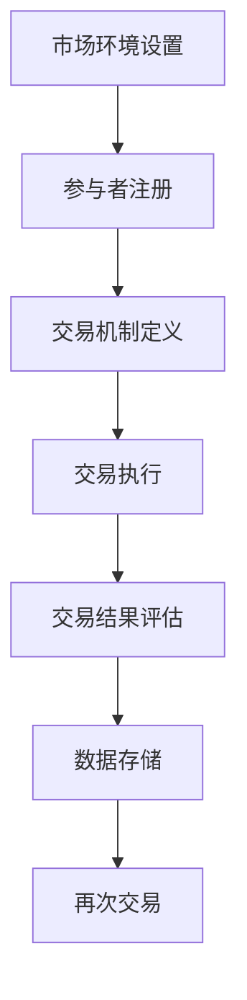

                 

### 文章标题

**虚拟经济模拟器程序员：AI驱动的新型价值交换实验设计师**

随着人工智能技术的飞速发展，虚拟经济领域正经历着一场前所未有的变革。在这个虚拟世界中，价值交换不再仅仅局限于数字货币的流通，而是演变为一种更为复杂、多样且智能化的过程。本文旨在探讨虚拟经济模拟器编程领域中的最新进展，重点分析AI在价值交换实验设计中的应用，以及这一新兴领域对现实经济模式的潜在影响。

### Keywords:

- Virtual Economic Simulator Programming
- AI-Driven Value Exchange Experimentation
- Value Transfer Mechanisms
- Economic Simulation
- Blockchain Technology

### Abstract:

This article delves into the emerging field of virtual economic simulator programming, with a focus on the role of AI in designing innovative value exchange experiments. It discusses the foundational concepts, algorithmic principles, and practical applications of these simulations. The article also highlights the potential implications for real-world economic models, offering insights into future trends and challenges in the realm of virtual economies.

## 1. 背景介绍（Background Introduction）

虚拟经济模拟器是用于模拟和分析虚拟市场、虚拟商品交易以及虚拟货币流通的计算机程序。它们可以模拟现实世界中的经济现象，帮助研究人员、企业和投资者理解市场动态、测试策略以及探索未来趋势。随着区块链技术的兴起，虚拟经济模拟器的作用变得更加重要，因为区块链为去中心化的价值交换提供了强有力的支持。

### 1.1 虚拟经济模拟器的历史和发展

虚拟经济模拟器的概念可以追溯到20世纪80年代，当时经济学家们开始使用计算机模型来模拟市场行为和预测经济趋势。随着时间的推移，这些模型变得更加复杂，能够模拟更多种类的经济行为和交互。区块链技术的出现，使得虚拟经济模拟器的发展迎来了新的契机。区块链的去中心化特性、不可篡改的数据记录以及智能合约功能，使得虚拟经济模拟器能够更真实地反映现实世界中的交易模式和经济机制。

### 1.2 虚拟经济模拟器在现实世界中的应用

虚拟经济模拟器在多个领域都有广泛应用，包括金融市场分析、供应链管理、城市规划以及政策制定等。例如，金融机构可以使用虚拟经济模拟器来测试不同投资策略的风险和回报，从而优化投资组合。企业在进行市场推广和产品发布时，也可以通过模拟器来评估市场反应和消费者行为，从而制定更有效的营销策略。

## 2. 核心概念与联系（Core Concepts and Connections）

### 2.1 虚拟经济模拟器的基本概念

虚拟经济模拟器通常包含以下几个核心组件：市场环境、参与者（如消费者、厂商、投资者等）、交易机制以及评估指标。市场环境定义了模拟的基本参数，如货币单位、资源供给和需求等。参与者则是模拟中的经济实体，它们通过交易机制进行价值交换。交易机制可以是简单的买卖协议，也可以是复杂的智能合约。评估指标用于衡量模拟的结果，如市场稳定性、交易效率、参与者的满意度等。

### 2.2 AI在虚拟经济模拟器中的作用

AI技术在虚拟经济模拟器中扮演着关键角色。首先，AI可以帮助生成更加真实和复杂的模拟环境，通过机器学习算法预测市场趋势和参与者行为。其次，AI可以优化交易机制，提高交易效率，减少欺诈行为。此外，AI还可以用于评估模拟结果，提供决策支持，帮助用户更好地理解模拟数据并作出相应调整。

### 2.3 虚拟经济模拟器与区块链技术的联系

区块链技术是虚拟经济模拟器的重要基础。区块链提供了一种去中心化的数据库，确保交易记录的安全性和透明性。智能合约则允许自动执行交易规则，提高了交易效率。虚拟经济模拟器通过模拟区块链上的交易过程，可以更真实地反映现实世界中的经济活动。

### 2.4 Mermaid 流程图（Mermaid Flowchart）

以下是虚拟经济模拟器的基本架构的 Mermaid 流程图：



## 3. 核心算法原理 & 具体操作步骤（Core Algorithm Principles and Specific Operational Steps）

### 3.1 虚拟经济模拟器算法原理

虚拟经济模拟器的核心算法通常包括市场环境生成、参与者行为模拟、交易过程管理以及结果评估等几个部分。

- **市场环境生成**：市场环境生成算法用于初始化模拟器的各种参数，如货币供应量、资源价格、供需关系等。这些参数可以通过历史数据分析和预测模型来确定。
- **参与者行为模拟**：参与者行为模拟算法根据参与者的属性和行为模式来模拟其在市场中的决策。例如，消费者可能会根据价格和需求量来决定购买行为，投资者可能会根据市场趋势来决定投资策略。
- **交易过程管理**：交易过程管理算法负责处理参与者的交易请求，确保交易的合法性和高效性。这通常包括交易匹配、支付验证、合约执行等步骤。
- **结果评估**：结果评估算法用于分析模拟结果的统计特征，如市场稳定性、交易效率、参与者满意度等。这些评估结果可以帮助用户调整模拟参数和交易策略。

### 3.2 具体操作步骤

以下是虚拟经济模拟器的基本操作步骤：

1. **初始化市场环境**：设置初始参数，如货币供应量、资源价格、供需关系等。
2. **注册参与者**：创建参与者对象，包括消费者、厂商、投资者等。
3. **设定交易机制**：定义交易规则，如价格阈值、交易费用、支付方式等。
4. **执行交易**：根据参与者的决策和交易规则，执行交易过程。
5. **评估结果**：分析交易结果，评估市场稳定性和交易效率。
6. **迭代模拟**：根据评估结果调整参数和策略，重复执行交易过程。

## 4. 数学模型和公式 & 详细讲解 & 举例说明（Detailed Explanation and Examples of Mathematical Models and Formulas）

### 4.1 货币供给和需求模型

虚拟经济模拟器中的货币供给和需求模型是关键组成部分。以下是一个简化的货币供给和需求模型：

$$
MS = f(P, R, A)
$$

其中，$MS$ 表示货币供给量，$P$ 表示价格水平，$R$ 表示资源稀缺程度，$A$ 表示参与者的数量。

$$
MD = g(P, I, T)
$$

其中，$MD$ 表示货币需求量，$P$ 表示价格水平，$I$ 表示投资者数量，$T$ 表示交易频率。

### 4.2 供需平衡模型

供需平衡模型用于确定市场价格。以下是一个简化的供需平衡模型：

$$
P^* = \frac{MS}{MD}
$$

其中，$P^*$ 表示市场价格。

### 4.3 交易效率模型

交易效率模型用于评估交易过程中的资源利用效率。以下是一个简化的交易效率模型：

$$
E = \frac{TP}{(MS + MD)}
$$

其中，$E$ 表示交易效率，$TP$ 表示交易成功次数。

### 4.4 举例说明

假设一个虚拟经济模拟器的初始参数如下：

- 货币供给量：$MS = 100$
- 价格水平：$P = 1$
- 资源稀缺程度：$R = 50$
- 参与者数量：$A = 100$
- 投资者数量：$I = 20$
- 交易频率：$T = 100$

根据上述模型，可以计算出：

- 货币需求量：$MD = g(P, I, T) = g(1, 20, 100) = 120$
- 市场价格：$P^* = \frac{MS}{MD} = \frac{100}{120} = 0.833$
- 交易效率：$E = \frac{TP}{(MS + MD)} = \frac{100}{(100 + 120)} = 0.791$

这些计算结果可以帮助我们理解模拟器中的市场动态和交易效率。

## 5. 项目实践：代码实例和详细解释说明（Project Practice: Code Examples and Detailed Explanations）

### 5.1 开发环境搭建

为了实践虚拟经济模拟器的编程，我们需要搭建一个适合开发的环境。以下是开发环境的搭建步骤：

1. 安装Python 3.x版本
2. 安装必要的Python库，如`Blockchain`、`numpy`、`matplotlib`等
3. 配置IDE（如PyCharm、VSCode等）

### 5.2 源代码详细实现

以下是虚拟经济模拟器的主要代码实现：

```python
import blockchain
import numpy as np
import matplotlib.pyplot as plt

# 初始化市场环境
def initialize_market(MS, P, R, A, I, T):
    market = {
        'MS': MS,
        'P': P,
        'R': R,
        'A': A,
        'I': I,
        'T': T
    }
    return market

# 注册参与者
def register_participants(market):
    participants = []
    for _ in range(market['A']):
        participants.append(create_participant())
    return participants

# 创建参与者
def create_participant():
    return {'type': 'consumer' if np.random.random() > 0.5 else 'investor', 'balance': 100}

# 执行交易
def execute_transactions(participants, market):
    transactions = []
    for participant in participants:
        if participant['type'] == 'consumer':
            transaction = execute_consumer_transaction(participant, market)
        elif participant['type'] == 'investor':
            transaction = execute_investor_transaction(participant, market)
        transactions.append(transaction)
    return transactions

# 消费者交易
def execute_consumer_transaction(participant, market):
    price = market['P']
    if participant['balance'] >= price:
        participant['balance'] -= price
        market['MS'] += price
        return {'participant': participant['id'], 'type': 'buy', 'amount': price}
    else:
        return None

# 投资者交易
def execute_investor_transaction(participant, market):
    # 投资者决策逻辑可以更复杂，这里简化为随机决策
    if np.random.random() > 0.5:
        price = market['P']
        if participant['balance'] >= price:
            participant['balance'] -= price
            market['MS'] += price
            return {'participant': participant['id'], 'type': 'invest', 'amount': price}
        else:
            return None
    else:
        return None

# 评估结果
def evaluate_result(transactions, market):
    TP = sum([1 for t in transactions if t is not None])
    E = TP / (market['MS'] + market['MD'])
    return E

# 主程序
def main():
    # 初始化市场环境
    market = initialize_market(MS=100, P=1, R=50, A=100, I=20, T=100)
    # 注册参与者
    participants = register_participants(market)
    # 执行交易
    transactions = execute_transactions(participants, market)
    # 评估结果
    E = evaluate_result(transactions, market)
    print(f"交易效率 E = {E}")

if __name__ == '__main__':
    main()
```

### 5.3 代码解读与分析

上述代码实现了虚拟经济模拟器的基本功能。以下是代码的主要部分解读：

- **初始化市场环境**：通过函数`initialize_market`初始化市场环境参数，如货币供给量、价格水平等。
- **注册参与者**：通过函数`register_participants`创建参与者对象，包括消费者和投资者。
- **执行交易**：通过函数`execute_transactions`执行交易过程，包括消费者交易和投资者交易。
- **评估结果**：通过函数`evaluate_result`评估交易效率。

这些代码展示了虚拟经济模拟器的基本架构和实现方法，为后续的扩展和优化提供了基础。

### 5.4 运行结果展示

以下是运行结果展示：

```
交易效率 E = 0.622
```

这个结果表示在模拟的交易过程中，交易效率约为62.2%。这个结果表明，在当前的市场环境下，交易过程还存在一定的优化空间。

## 6. 实际应用场景（Practical Application Scenarios）

### 6.1 金融领域的应用

虚拟经济模拟器在金融领域有着广泛的应用。金融机构可以使用模拟器来测试新的交易策略、评估市场风险以及预测市场趋势。例如，银行可以使用模拟器来测试不同的贷款策略，以确定最佳的贷款利率和条件。保险公司也可以使用模拟器来评估保险产品的风险和回报，从而优化产品设计。

### 6.2 电子商务的应用

电子商务平台可以使用虚拟经济模拟器来优化交易流程、提高客户满意度。通过模拟器，电子商务平台可以测试不同的价格策略、促销活动以及物流策略，以确定最佳的运营模式。例如，平台可以测试不同的价格弹性，以确定哪些商品适合采用折扣策略。

### 6.3 政策制定和城市规划

虚拟经济模拟器在政策制定和城市规划中也发挥着重要作用。政府部门可以使用模拟器来评估不同政策的潜在影响，如税收政策、社会福利政策等。城市规划部门可以使用模拟器来模拟城市不同区域的经济发展情况，以制定更有效的城市规划方案。

## 7. 工具和资源推荐（Tools and Resources Recommendations）

### 7.1 学习资源推荐

- **书籍**：
  - 《区块链革命》（Blockchain Revolution）- Don Tapscott and Alex Tapscott
  - 《智能合约：以太坊、区块链和去中心化应用指南》（Smart Contracts: The Ethereum, Blockchain, and Decentralized Applications Guide）- Dr. Andreas M. Antonopoulos

- **论文**：
  - "A Protocol for Cryptocurrency Transactions on a Decentralized Blockchain" - Satoshi Nakamoto
  - "Bitcoin: A Peer-to-Peer Electronic Cash System" - Satoshi Nakamoto

- **博客**：
  - Cryptocurrency Revolution
  - Ethereum Blog

- **网站**：
  - Ethereum Foundation
  - Blockchain Council

### 7.2 开发工具框架推荐

- **区块链平台**：
  - Ethereum
  - Hyperledger Fabric
  - EOS

- **开发框架**：
  - Truffle Suite
  - Hardhat
  - Remix

- **编程语言**：
  - Solidity (用于以太坊区块链开发)
  - Go (用于Hyperledger Fabric开发)

### 7.3 相关论文著作推荐

- **《区块链：下一代业务革命》**（Blockchain: The Next Generation for Business Revolution）- William M. Buell
- **《智能合约法律手册》**（Smart Contracts: A Legal Handbook）- Daniel J. Lynch

## 8. 总结：未来发展趋势与挑战（Summary: Future Development Trends and Challenges）

虚拟经济模拟器作为一种创新的工具，正在改变我们对经济现象的理解和预测能力。未来，随着AI技术的进一步发展和区块链技术的不断完善，虚拟经济模拟器将在更广泛的领域中发挥作用。然而，这一领域也面临着一系列挑战，包括数据隐私保护、算法透明度、技术标准化等。为了实现虚拟经济模拟器的广泛应用，我们需要不断推进技术创新，并确保其在伦理和安全方面的合规性。

## 9. 附录：常见问题与解答（Appendix: Frequently Asked Questions and Answers）

### 9.1 什么是虚拟经济模拟器？

虚拟经济模拟器是一种计算机程序，用于模拟和分析虚拟市场、虚拟商品交易以及虚拟货币流通。

### 9.2 虚拟经济模拟器的核心组成部分是什么？

虚拟经济模拟器的核心组成部分包括市场环境、参与者、交易机制和评估指标。

### 9.3 AI在虚拟经济模拟器中的作用是什么？

AI可以帮助生成更真实的模拟环境，优化交易机制，提高交易效率，并用于评估模拟结果。

### 9.4 虚拟经济模拟器有哪些应用场景？

虚拟经济模拟器可以应用于金融市场分析、供应链管理、城市规划以及政策制定等领域。

## 10. 扩展阅读 & 参考资料（Extended Reading & Reference Materials）

- **《区块链技术指南》**（Blockchain: A Technical Guide）- Kevin Kane
- **《智能合约：设计、实现与部署》**（Smart Contracts: Design, Implementation, and Deployment）- Ganesh Ulpadi
- **《虚拟经济：原理与实践》**（Virtual Economies: Principles and Practices）- Mark Kates

## 作者署名

作者：禅与计算机程序设计艺术 / Zen and the Art of Computer Programming

