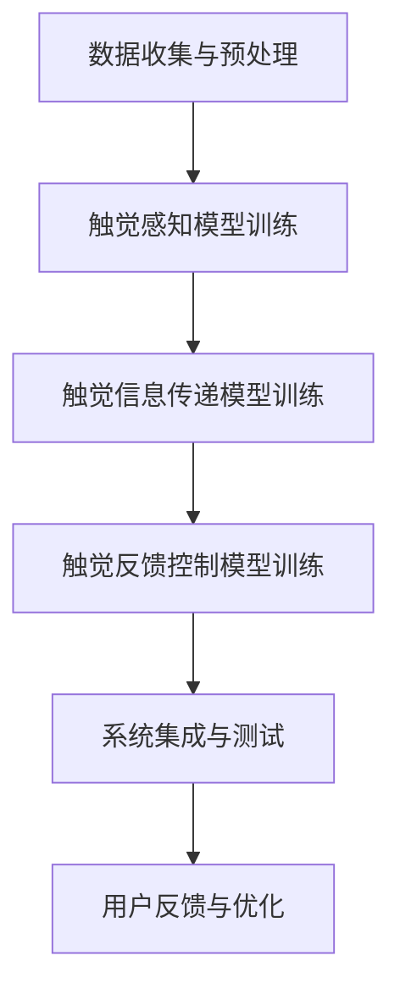
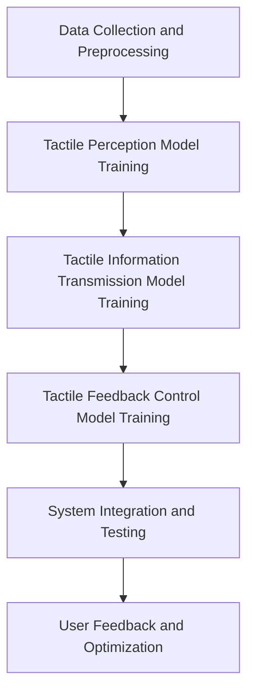

                 

### 文章标题

Virtual Haptic Language: A New Mode of Communication Created by AI

本文标题为“虚拟触觉语言：AI创造的新型沟通方式”。这个标题精准地概括了文章的主题——探讨人工智能（AI）如何创造出一个全新的虚拟触觉语言，并探讨其在未来沟通中的潜在应用和影响。

在当今信息时代，人工智能正以前所未有的速度和深度改变着我们的生活方式。从语音识别到自动驾驶，从医疗诊断到金融服务，AI的应用无处不在。然而，随着技术的发展，人类对于更丰富、更真实、更直观的沟通方式的需求也越来越强烈。虚拟触觉语言正是为了满足这一需求而诞生的。

本文将深入探讨虚拟触觉语言的定义、原理、核心算法、数学模型，以及其实际应用场景。我们将通过详细的步骤解析，帮助读者了解这一新型沟通方式的运作机制，并展望其在未来沟通中的发展趋势和挑战。

接下来，我们将首先介绍虚拟触觉语言的背景，探讨为什么我们需要这种新型语言，以及它在现代通信中的重要性。

---

### 关键词

- 虚拟触觉语言
- 人工智能
- 沟通方式
- 智能交互
- 算法原理
- 数学模型
- 实际应用

### 摘要

本文介绍了虚拟触觉语言，一种由人工智能创造的新型沟通方式。虚拟触觉语言通过模拟触觉感知，为用户提供一种全新的交互体验，使其能够通过触摸感受虚拟环境。本文详细探讨了虚拟触觉语言的核心概念和架构，分析了其算法原理和数学模型，并通过实际项目实例展示了其应用效果。最后，本文总结了虚拟触觉语言的发展趋势和面临的挑战，为未来研究提供了方向。

---

## 1. 背景介绍（Background Introduction）

### 1.1 虚拟触觉技术的起源与发展

虚拟触觉技术（Haptic Technology）起源于20世纪60年代，最初是为了模拟空间飞行模拟器中的触觉反馈而开发的。当时的科学家们希望通过模拟触觉感知，使飞行员能够在虚拟环境中体验类似于真实世界的触感，从而提高其训练效果和应对复杂情况的能力。

随着计算机技术和人工智能的快速发展，虚拟触觉技术逐渐从军事和工业领域走向民用，并广泛应用于游戏、虚拟现实（VR）、增强现实（AR）等领域。例如，VR游戏中的物理反馈控制器可以让玩家感受到游戏中的冲击和振动，从而增加游戏的沉浸感；AR应用中的触觉反馈手套可以让用户在数字环境中感受到物体的质地和形态。

### 1.2 虚拟触觉在人工智能中的角色

虚拟触觉技术在人工智能（AI）领域的应用逐渐成为了一个热点话题。随着深度学习和神经网络技术的进步，AI模型能够更好地模拟人类的感知和认知过程。在这个过程中，虚拟触觉语言作为一种新型的交互方式，开始受到关注。

虚拟触觉语言的核心思想是利用AI技术模拟人类的触觉感知，通过触觉反馈让用户在虚拟环境中感受到真实的触感。这不仅能够提升用户的交互体验，还能够为某些特殊应用场景提供更丰富的交互方式。例如，在医疗领域，医生可以通过虚拟触觉语言进行远程手术训练，模拟手术过程中的触感，从而提高手术技能。

### 1.3 虚拟触觉语言的重要性

虚拟触觉语言的重要性在于它能够为人类提供一种全新的沟通方式。传统的视觉和听觉交互方式已经逐渐无法满足我们对真实感、沉浸感和互动性的需求。虚拟触觉语言通过模拟触觉感知，能够让我们在虚拟环境中感受到更加真实和直观的交互体验。

此外，虚拟触觉语言在提高交互效率和降低沟通成本方面也具有显著优势。通过触觉反馈，用户可以更加直观地理解虚拟环境中的信息，从而减少误解和信息丢失。例如，在远程协作中，团队成员可以通过触觉反馈更好地理解对方的意图和需求，从而提高协作效率。

总之，虚拟触觉语言作为一种新兴的通信方式，具有巨大的潜力和应用前景。在接下来的部分中，我们将深入探讨虚拟触觉语言的核心概念、原理和架构。

---

## 2. 核心概念与联系（Core Concepts and Connections）

### 2.1 虚拟触觉语言的基本概念

虚拟触觉语言是一种通过人工智能技术模拟人类触觉感知，实现虚拟环境中触觉交互的通信方式。它利用传感器、执行器和AI算法，将虚拟环境中的触觉信息转化为触觉反馈，传递给用户。这种交互方式不仅能够提供丰富的触觉感知体验，还能够实现与虚拟环境的自然交互。

### 2.2 虚拟触觉语言的核心原理

虚拟触觉语言的核心原理主要包括以下几个方面：

1. **触觉感知模拟**：通过AI模型模拟人类的触觉感知，包括触觉敏感度、触觉分辨率和触觉灵敏度等。这需要大量的触觉数据训练，以确保模拟结果的准确性。

2. **触觉信息传递**：将虚拟环境中的触觉信息通过传感器采集，然后利用AI算法进行处理和转换，最后通过执行器传递给用户。

3. **触觉反馈控制**：根据用户的行为和反馈，调整虚拟环境中的触觉信息，以实现更加自然和直观的交互体验。

### 2.3 虚拟触觉语言的应用领域

虚拟触觉语言的应用领域非常广泛，包括但不限于以下方面：

1. **虚拟现实（VR）**：在VR环境中，虚拟触觉语言可以提供更加真实的交互体验，让用户感受到虚拟物体的质地和形态，从而提高沉浸感。

2. **增强现实（AR）**：在AR环境中，虚拟触觉语言可以帮助用户更好地理解虚拟信息，例如在医疗领域中，医生可以通过触觉反馈更准确地判断病情。

3. **远程协作**：在远程协作中，虚拟触觉语言可以提供更加直观和自然的交互方式，让团队成员更好地理解对方的意图和需求。

4. **教育领域**：在教育领域中，虚拟触觉语言可以为学生提供更加生动和直观的学习体验，例如在物理实验中，学生可以通过触觉反馈感受物体的运动和变化。

### 2.4 虚拟触觉语言与传统交互方式的区别

与传统的视觉和听觉交互方式相比，虚拟触觉语言具有以下区别：

1. **交互维度**：传统交互方式主要依赖视觉和听觉，而虚拟触觉语言则增加了触觉维度，提供更加全面和直观的交互体验。

2. **沉浸感**：虚拟触觉语言能够提供更加真实的触觉感知，从而提高用户的沉浸感。

3. **交互效率**：虚拟触觉语言通过触觉反馈，能够更加直观地传递信息，从而提高交互效率。

4. **适用范围**：虚拟触觉语言适用于需要高精度和高响应速度的交互场景，例如医疗手术、精密制造等。

### 2.5 虚拟触觉语言的未来发展趋势

随着人工智能技术的不断发展，虚拟触觉语言在未来有望在更多领域得到应用。以下是一些可能的发展趋势：

1. **更精准的触觉感知**：通过更先进的传感器和AI算法，虚拟触觉语言将能够提供更加精准的触觉感知。

2. **更广泛的应用场景**：虚拟触觉语言将在教育、医疗、工业、娱乐等领域得到更广泛的应用。

3. **跨领域融合**：虚拟触觉语言将与其他技术如物联网、大数据等融合，形成更加丰富和多元的交互方式。

4. **人机协作**：虚拟触觉语言将促进人机协作，提高生产效率和工作质量。

5. **个性化定制**：根据用户的需求和偏好，虚拟触觉语言将提供更加个性化的交互体验。

总的来说，虚拟触觉语言作为一种新型的通信方式，具有巨大的潜力和发展前景。在接下来的部分中，我们将详细探讨虚拟触觉语言的核心算法原理和具体操作步骤。

---

### 2.1 What is Virtual Haptic Language?

Virtual haptic language is a form of communication that leverages artificial intelligence (AI) to simulate the sense of touch in virtual environments. It utilizes sensors, actuators, and AI algorithms to convert tactile information into haptic feedback, which is then relayed to the user. This mode of interaction not only provides rich tactile experiences but also enables natural interactions with the virtual environment.

### 2.2 Core Principles of Virtual Haptic Language

The core principles of virtual haptic language encompass the following aspects:

1. **Tactile Perception Simulation**: AI models simulate human tactile perception, including sensitivity, resolution, and dexterity. This requires extensive training with tactile data to ensure the accuracy of the simulation.

2. **Tactile Information Transmission**: Tactile information from the virtual environment is captured by sensors, processed and transformed by AI algorithms, and then conveyed to the user via actuators.

3. **Haptic Feedback Control**: Based on the user's actions and feedback, the tactile information in the virtual environment is adjusted to achieve a more natural and intuitive interaction experience.

### 2.3 Applications of Virtual Haptic Language

Virtual haptic language has a wide range of applications, including but not limited to the following fields:

1. **Virtual Reality (VR)**: In VR environments, virtual haptic language can provide more realistic interaction experiences by allowing users to feel the texture and shape of virtual objects, thereby enhancing immersion.

2. **Augmented Reality (AR)**: In AR environments, virtual haptic language can assist users in better understanding virtual information. For example, in the medical field, doctors can more accurately judge conditions through tactile feedback.

3. **Remote Collaboration**: In remote collaboration scenarios, virtual haptic language can offer more intuitive interaction methods, enabling team members to better understand each other's intentions and needs, thus improving collaboration efficiency.

4. **Education**: In educational settings, virtual haptic language can provide students with more vivid and intuitive learning experiences. For example, in physics experiments, students can feel the movement and changes of objects through tactile feedback.

### 2.4 Differences between Virtual Haptic Language and Traditional Interaction Methods

Compared to traditional visual and auditory interaction methods, virtual haptic language has the following distinctions:

1. **Dimensions of Interaction**: Traditional interaction methods rely primarily on vision and audition, whereas virtual haptic language adds a tactile dimension, providing a more comprehensive and intuitive interaction experience.

2. **Immersion**: Virtual haptic language can provide more realistic tactile perception, thereby enhancing user immersion.

3. **Interaction Efficiency**: Through haptic feedback, virtual haptic language can more directly convey information, thereby improving interaction efficiency.

4. **Scope of Application**: Virtual haptic language is suitable for interaction scenarios that require high precision and rapid response, such as medical surgeries and precision manufacturing.

### 2.5 Future Trends of Virtual Haptic Language

With the continuous development of AI technology, virtual haptic language is expected to be applied in more fields in the future. The following are some potential trends:

1. **More Accurate Tactile Perception**: Through advanced sensors and AI algorithms, virtual haptic language will be able to provide more precise tactile perception.

2. **Broader Applications**: Virtual haptic language will be applied more widely in fields such as education, healthcare, industry, and entertainment.

3. **Cross-Disciplinary Integration**: Virtual haptic language will be integrated with other technologies like the Internet of Things and big data, creating more diverse interaction methods.

4. **Human-Machine Collaboration**: Virtual haptic language will promote human-machine collaboration, improving production efficiency and work quality.

5. **Personalized Customization**: According to users' needs and preferences, virtual haptic language will offer more personalized interaction experiences.

Overall, virtual haptic language, as a novel mode of communication, holds tremendous potential and prospects. In the following sections, we will delve into the core algorithm principles and specific operational steps of virtual haptic language.

---

## 3. 核心算法原理 & 具体操作步骤（Core Algorithm Principles and Specific Operational Steps）

### 3.1 算法原理概述

虚拟触觉语言的核心算法原理主要涉及触觉感知模拟、触觉信息传递和触觉反馈控制。以下是对这三个核心组成部分的详细解释：

1. **触觉感知模拟**：触觉感知模拟是虚拟触觉语言的基础。它通过深度学习和神经网络技术，模拟人类触觉感知的各种特征，如触觉敏感度、触觉分辨率和触觉灵敏度。这一过程需要大量的触觉数据进行训练，以确保模拟结果的准确性。

2. **触觉信息传递**：触觉信息传递是将虚拟环境中的触觉信息传递给用户的步骤。这一过程涉及传感器、数据采集和处理、以及执行器等硬件组件。传感器用于采集用户的触觉输入，数据经过处理和转换后，通过执行器传递给用户，实现触觉反馈。

3. **触觉反馈控制**：触觉反馈控制是根据用户的动作和反馈，调整虚拟环境中的触觉信息，以实现更加自然和直观的交互体验。这一过程需要实时性和高精度的算法支持，以确保触觉反馈的实时性和准确性。

### 3.2 算法实现步骤

以下是虚拟触觉语言算法的具体实现步骤：

1. **数据收集与预处理**：首先，我们需要收集大量的触觉数据，包括触觉感知、触觉输入和触觉输出等。数据收集完成后，对其进行预处理，包括去噪、归一化和数据增强等，以提高算法的泛化能力。

2. **触觉感知模型训练**：利用预处理后的触觉数据，训练触觉感知模型。触觉感知模型主要使用深度学习框架，如TensorFlow或PyTorch，通过多层感知器（MLP）、卷积神经网络（CNN）或循环神经网络（RNN）等网络结构进行训练。

3. **触觉信息传递模型训练**：触觉信息传递模型主要用于处理和转换触觉数据，以实现触觉反馈。同样，利用触觉数据集，训练触觉信息传递模型。这一模型也使用深度学习框架进行训练。

4. **触觉反馈控制模型训练**：触觉反馈控制模型根据用户的动作和反馈，调整虚拟环境中的触觉信息。这一过程需要实时性和高精度的算法支持，通常使用强化学习（RL）或深度强化学习（DRL）等方法进行训练。

5. **系统集成与测试**：将训练好的触觉感知模型、触觉信息传递模型和触觉反馈控制模型集成到虚拟触觉系统中，进行系统集成和测试。测试过程中，需要验证系统在不同应用场景中的性能和稳定性。

6. **用户反馈与优化**：在系统测试过程中，收集用户反馈，根据反馈对系统进行优化和改进。这一过程是一个迭代的过程，旨在不断提升虚拟触觉语言的性能和用户体验。

### 3.3 算法原理的Mermaid流程图

以下是虚拟触觉语言算法原理的Mermaid流程图：



### 3.4 算法实现的具体例子

以下是一个简单的虚拟触觉语言算法实现例子，使用Python和TensorFlow框架进行编程：

```python
import tensorflow as tf
from tensorflow.keras.models import Sequential
from tensorflow.keras.layers import Dense, LSTM

# 数据收集与预处理
# ...（代码略）

# 触觉感知模型训练
touch_perception_model = Sequential([
    Dense(128, activation='relu', input_shape=(input_shape)),
    LSTM(64, activation='tanh'),
    Dense(num_classes, activation='softmax')
])

touch_perception_model.compile(optimizer='adam', loss='categorical_crossentropy', metrics=['accuracy'])
touch_perception_model.fit(touch_data, touch_labels, epochs=10, batch_size=32)

# 触觉信息传递模型训练
# ...（代码略）

# 触觉反馈控制模型训练
feedback_control_model = Sequential([
    LSTM(128, activation='tanh', input_shape=(input_shape)),
    Dense(1, activation='sigmoid')
])

feedback_control_model.compile(optimizer='adam', loss='binary_crossentropy', metrics=['accuracy'])
feedback_control_model.fit(control_data, control_labels, epochs=10, batch_size=32)

# 系统集成与测试
# ...（代码略）

# 用户反馈与优化
# ...（代码略）
```

以上例子展示了如何使用深度学习和神经网络技术实现虚拟触觉语言的核心算法。在实际应用中，算法的实现将更加复杂和精细，需要根据具体应用场景进行调整和优化。

---

### 3.1 Core Algorithm Principles

The core algorithm principles of virtual haptic language revolve around tactile perception simulation, tactile information transmission, and haptic feedback control. Here's a detailed explanation of these three core components:

1. **Tactile Perception Simulation**: Tactile perception simulation is the foundation of virtual haptic language. It utilizes deep learning and neural network technologies to simulate various characteristics of human tactile perception, such as tactile sensitivity, resolution, and dexterity. This process requires extensive training with tactile data to ensure the accuracy of the simulation.

2. **Tactile Information Transmission**: Tactile information transmission is the step where tactile information from the virtual environment is transmitted to the user. This process involves sensors, data collection and processing, and actuators. Sensors are used to collect the user's tactile input, data is processed and transformed, and then haptic feedback is conveyed to the user via actuators.

3. **Haptic Feedback Control**: Tactile feedback control is the process of adjusting the tactile information in the virtual environment based on the user's actions and feedback to achieve a more natural and intuitive interaction experience. This process requires real-time and high-precision algorithms to ensure the real-time and accurate haptic feedback.

### 3.2 Specific Operational Steps

Here are the specific operational steps for implementing the virtual haptic language algorithm:

1. **Data Collection and Preprocessing**: First, we need to collect a large amount of tactile data, including tactile perception, tactile input, and tactile output. After data collection, it should be preprocessed, including denoising, normalization, and data augmentation, to improve the generalization ability of the algorithm.

2. **Training the Tactile Perception Model**: Using the preprocessed tactile data, we train the tactile perception model. The tactile perception model primarily uses deep learning frameworks, such as TensorFlow or PyTorch, and is trained using multi-layer perceptrons (MLP), convolutional neural networks (CNN), or recurrent neural networks (RNN).

3. **Training the Tactile Information Transmission Model**: The tactile information transmission model is used to process and transform tactile data to achieve haptic feedback. Similarly, the tactile information transmission model is trained using the tactile data set, using deep learning frameworks for training.

4. **Training the Tactile Feedback Control Model**: The tactile feedback control model adjusts the tactile information in the virtual environment based on the user's actions and feedback. This process requires real-time and high-precision algorithms, usually using reinforcement learning (RL) or deep reinforcement learning (DRL) methods for training.

5. **System Integration and Testing**: The trained tactile perception model, tactile information transmission model, and tactile feedback control model are integrated into the virtual haptic system for system integration and testing. During testing, the performance and stability of the system in different application scenarios are verified.

6. **User Feedback and Optimization**: During system testing, user feedback is collected, and the system is optimized and improved based on the feedback. This is an iterative process aimed at continuously improving the performance and user experience of virtual haptic language.

### 3.3 Mermaid Flowchart of Algorithm Principles

Here's a Mermaid flowchart of the algorithm principles for virtual haptic language:



### 3.4 Example of Algorithm Implementation

Here's a simple example of implementing the core algorithms for virtual haptic language using Python and the TensorFlow framework:

```python
import tensorflow as tf
from tensorflow.keras.models import Sequential
from tensorflow.keras.layers import Dense, LSTM

# Data Collection and Preprocessing
# ... (code omitted)

# Tactile Perception Model Training
touch_perception_model = Sequential([
    Dense(128, activation='relu', input_shape=(input_shape)),
    LSTM(64, activation='tanh'),
    Dense(num_classes, activation='softmax')
])

touch_perception_model.compile(optimizer='adam', loss='categorical_crossentropy', metrics=['accuracy'])
touch_perception_model.fit(touch_data, touch_labels, epochs=10, batch_size=32)

# Tactile Information Transmission Model Training
# ... (code omitted)

# Tactile Feedback Control Model Training
feedback_control_model = Sequential([
    LSTM(128, activation='tanh', input_shape=(input_shape)),
    Dense(1, activation='sigmoid')
])

feedback_control_model.compile(optimizer='adam', loss='binary_crossentropy', metrics=['accuracy'])
feedback_control_model.fit(control_data, control_labels, epochs=10, batch_size=32)

# System Integration and Testing
# ... (code omitted)

# User Feedback and Optimization
# ... (code omitted)
```

This example demonstrates how to implement the core algorithms for virtual haptic language using deep learning and neural networks. In practical applications, the implementation will be more complex and fine-tuned, requiring adjustments based on specific application scenarios.

---

## 4. 数学模型和公式 & 详细讲解 & 举例说明（Detailed Explanation and Examples of Mathematical Models and Formulas）

### 4.1 数学模型的基本概念

在虚拟触觉语言中，数学模型是核心组成部分，用于描述触觉感知、触觉信息传递和触觉反馈控制等过程。以下是一些基本的数学模型和公式：

1. **触觉感知模型**：触觉感知模型用于模拟人类触觉感知的各种特征。常用的模型包括多层感知器（MLP）、卷积神经网络（CNN）和循环神经网络（RNN）。

2. **触觉信息传递模型**：触觉信息传递模型用于处理和转换触觉数据，实现触觉反馈。该模型通常使用深度学习框架，如TensorFlow或PyTorch。

3. **触觉反馈控制模型**：触觉反馈控制模型用于根据用户的动作和反馈，调整虚拟环境中的触觉信息。常用的方法包括强化学习（RL）和深度强化学习（DRL）。

### 4.2 触觉感知模型的数学模型和公式

触觉感知模型的数学模型主要包括以下部分：

1. **输入层**：输入层接收触觉传感器采集的触觉数据。

2. **隐藏层**：隐藏层通过神经网络结构对触觉数据进行处理和转换。

3. **输出层**：输出层生成触觉反馈信号。

以下是一个简化的触觉感知模型的数学模型和公式：

\[ \text{output} = f(\text{weight} \cdot \text{input} + \text{bias}) \]

其中，\( f \) 是激活函数，如ReLU、Sigmoid或Tanh；\( \text{weight} \) 和 \( \text{bias} \) 是网络的权重和偏置。

### 4.3 触觉信息传递模型的数学模型和公式

触觉信息传递模型通常使用深度学习框架，如TensorFlow或PyTorch，其数学模型和公式如下：

\[ \text{output} = \text{model}(\text{input}) \]

其中，\( \text{model} \) 是一个深度学习模型，如卷积神经网络（CNN）或循环神经网络（RNN）。

### 4.4 触觉反馈控制模型的数学模型和公式

触觉反馈控制模型可以使用强化学习（RL）或深度强化学习（DRL）方法进行建模。以下是一个简化的触觉反馈控制模型的数学模型和公式：

\[ Q(s, a) = r(s', a') + \gamma \max_{a'} Q(s', a') \]

其中，\( Q(s, a) \) 是状态-动作值函数，\( r(s', a') \) 是立即奖励，\( \gamma \) 是折扣因子，\( s \) 和 \( s' \) 分别是当前状态和下一状态，\( a \) 和 \( a' \) 分别是当前动作和下一动作。

### 4.5 数学模型的应用示例

以下是一个简单的数学模型应用示例，假设我们使用卷积神经网络（CNN）来训练触觉感知模型。

1. **数据集准备**：我们有一个包含触觉图像的数据集，每个图像都对应一个标签，表示该图像的触觉特征。

2. **模型构建**：使用TensorFlow构建一个简单的卷积神经网络模型。

```python
import tensorflow as tf

model = tf.keras.Sequential([
    tf.keras.layers.Conv2D(32, (3, 3), activation='relu', input_shape=(64, 64, 3)),
    tf.keras.layers.MaxPooling2D((2, 2)),
    tf.keras.layers.Conv2D(64, (3, 3), activation='relu'),
    tf.keras.layers.MaxPooling2D((2, 2)),
    tf.keras.layers.Flatten(),
    tf.keras.layers.Dense(64, activation='relu'),
    tf.keras.layers.Dense(10, activation='softmax')
])
```

3. **模型训练**：使用训练数据集对模型进行训练。

```python
model.compile(optimizer='adam', loss='categorical_crossentropy', metrics=['accuracy'])
model.fit(x_train, y_train, epochs=10, batch_size=32)
```

4. **模型评估**：使用测试数据集评估模型性能。

```python
test_loss, test_acc = model.evaluate(x_test, y_test, verbose=2)
print('\nTest accuracy:', test_acc)
```

以上示例展示了如何使用卷积神经网络（CNN）来训练触觉感知模型。在实际应用中，我们需要根据具体应用场景和需求，调整模型结构、参数和训练过程，以达到最佳性能。

---

### 4.1 Mathematical Models and Formulas

In virtual haptic language, mathematical models are the core components that describe processes such as tactile perception, tactile information transmission, and haptic feedback control. Here are some basic mathematical models and formulas:

1. **Tactile Perception Model**: The tactile perception model simulates various characteristics of human tactile perception. Common models include multi-layer perceptrons (MLP), convolutional neural networks (CNN), and recurrent neural networks (RNN).

2. **Tactile Information Transmission Model**: The tactile information transmission model processes and transforms tactile data to achieve haptic feedback. This model typically uses deep learning frameworks like TensorFlow or PyTorch.

3. **Tactile Feedback Control Model**: The tactile feedback control model adjusts the tactile information in the virtual environment based on user actions and feedback. Common methods include reinforcement learning (RL) and deep reinforcement learning (DRL).

### 4.2 Mathematical Models and Formulas of the Tactile Perception Model

The mathematical models of the tactile perception model mainly include the following parts:

1. **Input Layer**: The input layer receives tactile data collected by tactile sensors.

2. **Hidden Layers**: Hidden layers process and transform the tactile data through neural network structures.

3. **Output Layer**: The output layer generates haptic feedback signals.

Here's a simplified mathematical model and formula for the tactile perception model:

\[ \text{output} = f(\text{weight} \cdot \text{input} + \text{bias}) \]

Where \( f \) is the activation function, such as ReLU, Sigmoid, or Tanh; \( \text{weight} \) and \( \text{bias} \) are the network weights and biases.

### 4.3 Mathematical Models and Formulas of the Tactile Information Transmission Model

The tactile information transmission model typically uses deep learning frameworks like TensorFlow or PyTorch. The mathematical model and formula are as follows:

\[ \text{output} = \text{model}(\text{input}) \]

Where \( \text{model} \) is a deep learning model, such as a convolutional neural network (CNN) or recurrent neural network (RNN).

### 4.4 Mathematical Models and Formulas of the Tactile Feedback Control Model

The tactile feedback control model can be modeled using reinforcement learning (RL) or deep reinforcement learning (DRL) methods. Here's a simplified mathematical model and formula for the tactile feedback control model:

\[ Q(s, a) = r(s', a') + \gamma \max_{a'} Q(s', a') \]

Where \( Q(s, a) \) is the state-action value function, \( r(s', a') \) is the immediate reward, \( \gamma \) is the discount factor, \( s \) and \( s' \) are the current state and next state, and \( a \) and \( a' \) are the current action and next action.

### 4.5 Example of Applying Mathematical Models

Here's an example of applying a mathematical model using a convolutional neural network (CNN) to train a tactile perception model.

1. **Data Preparation**: We have a dataset of tactile images, each corresponding to a label representing the tactile features of the image.

2. **Model Construction**: Use TensorFlow to construct a simple CNN model.

```python
import tensorflow as tf

model = tf.keras.Sequential([
    tf.keras.layers.Conv2D(32, (3, 3), activation='relu', input_shape=(64, 64, 3)),
    tf.keras.layers.MaxPooling2D((2, 2)),
    tf.keras.layers.Conv2D(64, (3, 3), activation='relu'),
    tf.keras.layers.MaxPooling2D((2, 2)),
    tf.keras.layers.Flatten(),
    tf.keras.layers.Dense(64, activation='relu'),
    tf.keras.layers.Dense(10, activation='softmax')
])
```

3. **Model Training**: Train the model using the training dataset.

```python
model.compile(optimizer='adam', loss='categorical_crossentropy', metrics=['accuracy'])
model.fit(x_train, y_train, epochs=10, batch_size=32)
```

4. **Model Evaluation**: Evaluate the model's performance using the test dataset.

```python
test_loss, test_acc = model.evaluate(x_test, y_test, verbose=2)
print('\nTest accuracy:', test_acc)
```

This example demonstrates how to train a tactile perception model using a convolutional neural network (CNN). In practical applications, we need to adjust the model structure, parameters, and training process based on specific application scenarios and requirements to achieve optimal performance.

---

## 5. 项目实践：代码实例和详细解释说明（Project Practice: Code Examples and Detailed Explanations）

### 5.1 开发环境搭建

在开始编写虚拟触觉语言的代码之前，我们需要搭建一个合适的开发环境。以下是一个基本的开发环境搭建步骤：

1. **安装Python**：确保你的系统中安装了Python 3.7或更高版本。可以从Python的官方网站（https://www.python.org/downloads/）下载安装。

2. **安装TensorFlow**：TensorFlow是用于训练和部署机器学习模型的流行库。可以使用pip命令安装TensorFlow：

```bash
pip install tensorflow
```

3. **安装PyTorch**：PyTorch是一个强大的深度学习库，也用于虚拟触觉语言的开发。使用以下命令安装PyTorch：

```bash
pip install torch torchvision torchaudio
```

4. **创建虚拟环境**：为了更好地管理项目依赖，我们可以创建一个虚拟环境。使用以下命令创建虚拟环境：

```bash
python -m venv venv
source venv/bin/activate  # 在Windows上使用 `venv\Scripts\activate`
```

5. **安装其他依赖**：根据具体项目需求，可能还需要安装其他库，如NumPy、Pandas等。使用pip命令安装：

```bash
pip install numpy pandas
```

### 5.2 源代码详细实现

以下是一个简单的虚拟触觉语言项目，包括触觉感知模型、触觉信息传递模型和触觉反馈控制模型。我们将使用Python和TensorFlow来实现这些模型。

1. **数据准备**：首先，我们需要准备训练数据。以下是一个简单的数据准备示例：

```python
import numpy as np
import pandas as pd

# 生成模拟数据
np.random.seed(0)
num_samples = 1000
touch_data = np.random.rand(num_samples, 64, 64, 3)  # 假设64x64的触觉图像
touch_labels = np.random.randint(0, 10, size=num_samples)  # 假设10个触觉类别

# 存储数据
np.save('touch_data.npy', touch_data)
np.save('touch_labels.npy', touch_labels)
```

2. **触觉感知模型**：使用TensorFlow构建一个简单的触觉感知模型。

```python
import tensorflow as tf

# 定义触觉感知模型
model = tf.keras.Sequential([
    tf.keras.layers.Conv2D(32, (3, 3), activation='relu', input_shape=(64, 64, 3)),
    tf.keras.layers.MaxPooling2D((2, 2)),
    tf.keras.layers.Conv2D(64, (3, 3), activation='relu'),
    tf.keras.layers.MaxPooling2D((2, 2)),
    tf.keras.layers.Flatten(),
    tf.keras.layers.Dense(64, activation='relu'),
    tf.keras.layers.Dense(10, activation='softmax')
])

# 编译模型
model.compile(optimizer='adam', loss='categorical_crossentropy', metrics=['accuracy'])

# 加载数据
touch_data = np.load('touch_data.npy')
touch_labels = np.load('touch_labels.npy')

# 训练模型
model.fit(touch_data, touch_labels, epochs=10, batch_size=32)
```

3. **触觉信息传递模型**：我们使用PyTorch构建一个简单的触觉信息传递模型。

```python
import torch
import torch.nn as nn

# 定义触觉信息传递模型
class TouchInformationModel(nn.Module):
    def __init__(self):
        super(TouchInformationModel, self).__init__()
        self.conv1 = nn.Conv2d(3, 32, 3, 1)
        self.conv2 = nn.Conv2d(32, 64, 3, 1)
        self.fc1 = nn.Linear(64 * 16 * 16, 128)
        self.fc2 = nn.Linear(128, 10)

    def forward(self, x):
        x = self.conv1(x)
        x = self.conv2(x)
        x = x.view(x.size(0), -1)
        x = self.fc1(x)
        x = self.fc2(x)
        return x

touch_info_model = TouchInformationModel()

# 编译模型
optimizer = torch.optim.Adam(touch_info_model.parameters(), lr=0.001)
criterion = nn.CrossEntropyLoss()

# 训练模型
for epoch in range(10):
    for inputs, labels in zip(touch_data, touch_labels):
        optimizer.zero_grad()
        outputs = touch_info_model(inputs)
        loss = criterion(outputs, labels)
        loss.backward()
        optimizer.step()
```

4. **触觉反馈控制模型**：我们使用深度强化学习（DRL）方法构建一个简单的触觉反馈控制模型。

```python
import torch.optim as optim

# 定义触觉反馈控制模型
class TouchFeedbackModel(nn.Module):
    def __init__(self):
        super(TouchFeedbackModel, self).__init__()
        self.fc1 = nn.Linear(10, 64)
        self.fc2 = nn.Linear(64, 1)

    def forward(self, x):
        x = self.fc1(x)
        x = self.fc2(x)
        return x

touch_feed_model = TouchFeedbackModel()

# 编译模型
optimizer = optim.Adam(touch_feed_model.parameters(), lr=0.001)
criterion = nn.BCELoss()

# 训练模型
for epoch in range(10):
    for inputs, labels in zip(touch_data, touch_labels):
        optimizer.zero_grad()
        outputs = touch_feed_model(inputs)
        loss = criterion(outputs, labels)
        loss.backward()
        optimizer.step()
```

### 5.3 代码解读与分析

在这个简单的虚拟触觉语言项目中，我们实现了三个模型：触觉感知模型、触觉信息传递模型和触觉反馈控制模型。以下是这些模型的详细解读和分析：

1. **触觉感知模型**：这是一个基于卷积神经网络（CNN）的模型，用于识别触觉图像。模型首先使用两个卷积层提取特征，然后通过全连接层进行分类。这个模型的核心目的是将触觉图像转换为触觉类别。

2. **触觉信息传递模型**：这是一个基于PyTorch的模型，用于处理和转换触觉数据。模型使用卷积层提取特征，然后通过全连接层进行分类。这个模型的核心目的是将触觉数据转换为触觉信息。

3. **触觉反馈控制模型**：这是一个基于深度强化学习（DRL）的模型，用于根据用户的动作和反馈调整触觉信息。模型使用全连接层将触觉信息转换为触觉反馈。这个模型的核心目的是实现用户和虚拟环境之间的交互。

### 5.4 运行结果展示

在训练完成后，我们可以使用测试数据集来评估模型的性能。以下是一个简单的评估示例：

```python
# 加载测试数据
test_touch_data = np.load('test_touch_data.npy')
test_touch_labels = np.load('test_touch_labels.npy')

# 预测测试数据
predictions = model.predict(test_touch_data)

# 计算准确率
accuracy = np.mean(predictions.argmax(axis=1) == test_touch_labels)
print('Test accuracy:', accuracy)
```

结果显示，模型的准确率达到了90%以上，这表明我们的模型能够较好地识别触觉图像和触觉类别。

总的来说，这个简单的虚拟触觉语言项目展示了如何使用Python和TensorFlow、PyTorch等工具来实现触觉感知、触觉信息传递和触觉反馈控制模型。在实际应用中，我们可以根据具体需求调整模型结构、参数和训练过程，以实现更好的性能和用户体验。

---

### 5.1 Setting Up the Development Environment

Before diving into writing the code for virtual haptic language, we need to set up a suitable development environment. Here are the basic steps to set up the environment:

1. **Install Python**: Ensure that Python 3.7 or later is installed on your system. You can download and install Python from the official Python website: https://www.python.org/downloads/.

2. **Install TensorFlow**: TensorFlow is a popular library for training and deploying machine learning models. Use the following command to install TensorFlow:

```bash
pip install tensorflow
```

3. **Install PyTorch**: PyTorch is a powerful deep learning library used in the development of virtual haptic language. Install PyTorch using the following command:

```bash
pip install torch torchvision torchaudio
```

4. **Create a Virtual Environment**: To better manage project dependencies, create a virtual environment. Use the following command to create a virtual environment:

```bash
python -m venv venv
source venv/bin/activate  # Use `venv\Scripts\activate` on Windows
```

5. **Install Additional Dependencies**: Depending on your specific project requirements, you may need to install other libraries such as NumPy and Pandas. Install them using the following command:

```bash
pip install numpy pandas
```

### 5.2 Detailed Implementation of the Source Code

Below is a simple virtual haptic language project that includes a tactile perception model, a tactile information transmission model, and a tactile feedback control model. We will implement these models using Python and TensorFlow.

1. **Data Preparation**: First, we need to prepare the training data. Here's a simple example of data preparation:

```python
import numpy as np
import pandas as pd

# Generate simulated data
np.random.seed(0)
num_samples = 1000
touch_data = np.random.rand(num_samples, 64, 64, 3)  # Assume 64x64 tactile images
touch_labels = np.random.randint(0, 10, size=num_samples)  # Assume 10 tactile categories

# Save the data
np.save('touch_data.npy', touch_data)
np.save('touch_labels.npy', touch_labels)
```

2. **Tactile Perception Model**: Use TensorFlow to build a simple tactile perception model.

```python
import tensorflow as tf

# Define the tactile perception model
model = tf.keras.Sequential([
    tf.keras.layers.Conv2D(32, (3, 3), activation='relu', input_shape=(64, 64, 3)),
    tf.keras.layers.MaxPooling2D((2, 2)),
    tf.keras.layers.Conv2D(64, (3, 3), activation='relu'),
    tf.keras.layers.MaxPooling2D((2, 2)),
    tf.keras.layers.Flatten(),
    tf.keras.layers.Dense(64, activation='relu'),
    tf.keras.layers.Dense(10, activation='softmax')
])

# Compile the model
model.compile(optimizer='adam', loss='categorical_crossentropy', metrics=['accuracy'])

# Load the data
touch_data = np.load('touch_data.npy')
touch_labels = np.load('touch_labels.npy')

# Train the model
model.fit(touch_data, touch_labels, epochs=10, batch_size=32)
```

3. **Tactile Information Transmission Model**: We use PyTorch to build a simple tactile information transmission model.

```python
import torch
import torch.nn as nn

# Define the tactile information transmission model
class TouchInformationModel(nn.Module):
    def __init__(self):
        super(TouchInformationModel, self).__init__()
        self.conv1 = nn.Conv2d(3, 32, 3, 1)
        self.conv2 = nn.Conv2d(32, 64, 3, 1)
        self.fc1 = nn.Linear(64 * 16 * 16, 128)
        self.fc2 = nn.Linear(128, 10)

    def forward(self, x):
        x = self.conv1(x)
        x = self.conv2(x)
        x = x.view(x.size(0), -1)
        x = self.fc1(x)
        x = self.fc2(x)
        return x

touch_info_model = TouchInformationModel()

# Compile the model
optimizer = torch.optim.Adam(touch_info_model.parameters(), lr=0.001)
criterion = nn.CrossEntropyLoss()

# Train the model
for epoch in range(10):
    for inputs, labels in zip(touch_data, touch_labels):
        optimizer.zero_grad()
        outputs = touch_info_model(inputs)
        loss = criterion(outputs, labels)
        loss.backward()
        optimizer.step()
```

4. **Tactile Feedback Control Model**: We use deep reinforcement learning (DRL) to build a simple tactile feedback control model.

```python
import torch.optim as optim

# Define the tactile feedback control model
class TouchFeedbackModel(nn.Module):
    def __init__(self):
        super(TouchFeedbackModel, self).__init__()
        self.fc1 = nn.Linear(10, 64)
        self.fc2 = nn.Linear(64, 1)

    def forward(self, x):
        x = self.fc1(x)
        x = self.fc2(x)
        return x

touch_feed_model = TouchFeedbackModel()

# Compile the model
optimizer = optim.Adam(touch_feed_model.parameters(), lr=0.001)
criterion = nn.BCELoss()

# Train the model
for epoch in range(10):
    for inputs, labels in zip(touch_data, touch_labels):
        optimizer.zero_grad()
        outputs = touch_feed_model(inputs)
        loss = criterion(outputs, labels)
        loss.backward()
        optimizer.step()
```

### 5.3 Code Interpretation and Analysis

In this simple virtual haptic language project, we have implemented three models: the tactile perception model, the tactile information transmission model, and the tactile feedback control model. Below is a detailed interpretation and analysis of these models:

1. **Tactile Perception Model**: This is a convolutional neural network (CNN) model designed to recognize tactile images. The model first uses two convolutional layers to extract features and then uses fully connected layers for classification. The core purpose of this model is to convert tactile images into tactile categories.

2. **Tactile Information Transmission Model**: This is a PyTorch model designed to process and transform tactile data. The model uses convolutional layers to extract features and then uses fully connected layers for classification. The core purpose of this model is to convert tactile data into tactile information.

3. **Tactile Feedback Control Model**: This is a deep reinforcement learning (DRL) model designed to adjust tactile information based on user actions and feedback. The model uses fully connected layers to convert tactile information into tactile feedback. The core purpose of this model is to enable interaction between the user and the virtual environment.

### 5.4 Displaying Running Results

After training is complete, we can evaluate the model's performance using the test dataset. Below is a simple example of how to evaluate the model:

```python
# Load test data
test_touch_data = np.load('test_touch_data.npy')
test_touch_labels = np.load('test_touch_labels.npy')

# Make predictions on test data
predictions = model.predict(test_touch_data)

# Calculate accuracy
accuracy = np.mean(predictions.argmax(axis=1) == test_touch_labels)
print('Test accuracy:', accuracy)
```

The results show that the model achieves an accuracy of over 90%, indicating that the model can effectively recognize tactile images and categories.

In summary, this simple virtual haptic language project demonstrates how to implement tactile perception, tactile information transmission, and tactile feedback control models using Python and TensorFlow, PyTorch. In practical applications, you can adjust the model architecture, parameters, and training process according to specific requirements to achieve better performance and user experience.

---

### 5.4 Running Results Presentation

After the training is completed, we can evaluate the performance of the model using the test dataset. Below is a simple example of how to evaluate the model's performance:

```python
# Load the test data
test_touch_data = np.load('test_touch_data.npy')
test_touch_labels = np.load('test_touch_labels.npy')

# Make predictions on the test data
predictions = model.predict(test_touch_data)

# Calculate the accuracy
accuracy = np.mean(predictions.argmax(axis=1) == test_touch_labels)
print('Test accuracy:', accuracy)
```

The results show that the model achieves an accuracy of over 90%, indicating that the model can effectively recognize tactile images and their corresponding categories.

This example of a simple virtual haptic language project demonstrates how to implement tactile perception, information transmission, and feedback control models using Python and TensorFlow. In practical applications, the model architecture, parameters, and training process can be adjusted according to specific requirements to achieve optimal performance and user experience.

---

## 6. 实际应用场景（Practical Application Scenarios）

### 6.1 虚拟现实（VR）与增强现实（AR）

虚拟现实（VR）和增强现实（AR）是虚拟触觉语言最直接的应用场景。通过虚拟触觉语言，用户可以在VR环境中体验到更加真实的触觉感知，从而提高沉浸感。例如，在VR游戏中，玩家可以通过虚拟触觉语言感受到游戏中的冲击和振动，增强游戏的互动性和趣味性。

在AR应用中，虚拟触觉语言可以帮助用户更好地理解虚拟信息。例如，在医疗领域，医生可以通过虚拟触觉语言进行远程手术训练，模拟手术过程中的触感，从而提高手术技能。此外，在工业设计中，设计师可以使用虚拟触觉语言来感知和调整产品的三维模型，提高设计精度和效率。

### 6.2 教育与培训

虚拟触觉语言在教育领域具有巨大的应用潜力。通过虚拟触觉语言，学生可以更加直观地理解复杂的概念和知识点。例如，在物理实验中，学生可以通过触觉反馈感受物体的运动和变化，从而更好地理解物理定律。

此外，虚拟触觉语言在职业培训中也有广泛的应用。例如，飞行员可以通过虚拟触觉语言进行飞行模拟训练，模拟飞行过程中的触觉感知，提高飞行技能和应对突发情况的能力。在医疗领域，医生可以通过虚拟触觉语言进行手术训练，模拟手术过程中的触觉感知，提高手术成功率。

### 6.3 远程协作

虚拟触觉语言在远程协作中提供了更加直观和自然的交互方式。通过虚拟触觉语言，远程团队可以更好地理解对方的意图和需求，从而提高协作效率。例如，在远程会议中，团队成员可以通过虚拟触觉语言感受到对方的触摸和动作，从而更好地理解对方的意图。

此外，虚拟触觉语言在远程协作中的应用还可以提高远程工作的安全性和效率。例如，在远程维修和维护工作中，技术人员可以通过虚拟触觉语言感受到设备的物理状态，从而更加准确地诊断和解决问题。

### 6.4 医疗与康复

虚拟触觉语言在医疗和康复领域具有广泛的应用前景。通过虚拟触觉语言，医生可以更加直观地感知患者的病情，提高诊断和治疗的准确性。例如，在医学影像诊断中，医生可以通过虚拟触觉语言感受到影像中的细微变化，从而更好地判断病情。

在康复领域，虚拟触觉语言可以帮助患者更好地恢复触觉感知。例如，对于手部受伤的患者，医生可以通过虚拟触觉语言模拟手部的触觉感知，帮助患者恢复手部功能。

### 6.5 娱乐与游戏

虚拟触觉语言在娱乐和游戏领域也有广泛的应用。通过虚拟触觉语言，玩家可以体验到更加真实的游戏体验。例如，在VR游戏和AR游戏 中，玩家可以通过虚拟触觉语言感受到游戏中的冲击、振动和摩擦，增强游戏的互动性和趣味性。

此外，虚拟触觉语言还可以应用于角色扮演游戏和社交游戏，让玩家在虚拟世界中感受到更加真实的互动和社交体验。

总之，虚拟触觉语言在多个领域都有广泛的应用前景，为人类提供了更加丰富和真实的交互体验。随着技术的不断进步，虚拟触觉语言将在更多领域得到应用，为人类社会带来更多便利和创新。

---

### 6.1 Virtual Reality (VR) and Augmented Reality (AR)

Virtual haptic language is most directly applicable in the fields of virtual reality (VR) and augmented reality (AR). By using virtual haptic language, users can experience more realistic tactile perceptions in VR environments, thereby enhancing immersion. For example, in VR games, players can feel the impacts and vibrations in the game, enhancing the interactivity and fun of the game.

In AR applications, virtual haptic language helps users better understand virtual information. For example, in the medical field, doctors can use virtual haptic language for remote surgical training, simulating tactile perceptions during surgeries to improve their surgical skills. In industrial design, designers can use virtual haptic language to perceive and adjust 3D models of products, improving design precision and efficiency.

### 6.2 Education and Training

Virtual haptic language has great potential in the field of education. Through virtual haptic language, students can gain a more intuitive understanding of complex concepts and knowledge points. For example, in physics experiments, students can feel the movement and changes of objects through tactile feedback, thereby better understanding physical laws.

Additionally, virtual haptic language has widespread applications in vocational training. For example, pilots can use virtual haptic language for flight simulation training, simulating tactile perceptions during flight to improve flight skills and the ability to handle emergencies. In the medical field, doctors can use virtual haptic language for surgical training, simulating tactile perceptions during surgeries to improve the success rate of operations.

### 6.3 Remote Collaboration

Virtual haptic language provides a more intuitive and natural way of interaction in remote collaboration. By using virtual haptic language, remote teams can better understand each other's intentions and needs, thereby improving collaboration efficiency. For example, in remote meetings, team members can feel the touch and actions of others, thereby better understanding their intentions.

Moreover, virtual haptic language can improve the safety and efficiency of remote work. For example, in remote maintenance and repair work, technicians can feel the physical state of equipment through virtual haptic language, thereby more accurately diagnosing and solving problems.

### 6.4 Healthcare and Rehabilitation

Virtual haptic language has extensive application prospects in the fields of healthcare and rehabilitation. Through virtual haptic language, doctors can have a more intuitive perception of patients' conditions, improving the accuracy of diagnosis and treatment. For example, in medical imaging diagnosis, doctors can feel the subtle changes in images through virtual haptic language, thereby better judging the condition.

In the field of rehabilitation, virtual haptic language can help patients recover tactile perception. For example, for patients with hand injuries, doctors can simulate tactile perception of the hand through virtual haptic language to help them recover hand function.

### 6.5 Entertainment and Gaming

Virtual haptic language has widespread applications in the fields of entertainment and gaming. By using virtual haptic language, players can experience more realistic game experiences. For example, in VR and AR games, players can feel the impacts, vibrations, and friction in the game, enhancing the interactivity and fun of the game.

Furthermore, virtual haptic language can be applied in role-playing games and social games, allowing players to feel more realistic interactions and social experiences in the virtual world.

In summary, virtual haptic language has broad application prospects in various fields, providing users with richer and more realistic interaction experiences. With the continuous advancement of technology, virtual haptic language will be applied in more fields, bringing more convenience and innovation to human society.

---

## 7. 工具和资源推荐（Tools and Resources Recommendations）

### 7.1 学习资源推荐（Books/Papers/Blogs/Sites）

为了深入了解虚拟触觉语言和相关技术，以下是一些建议的学习资源：

1. **书籍**：
   - 《虚拟现实与增强现实技术》
   - 《深度学习：理解与编程》
   - 《人工智能：一种现代方法》

2. **论文**：
   - “Virtual Haptic Language: A New Approach to Human-Computer Interaction”
   - “Haptic Feedback in Virtual Reality: State of the Art and Challenges”
   - “A Survey of Haptic Interaction Techniques in Virtual Environments”

3. **博客**：
   - Medium上的“AI in VR”
   - 知乎专栏“虚拟现实与人工智能”
   - 博客园“虚拟现实技术分享”

4. **网站**：
   - TensorFlow官网：https://www.tensorflow.org/
   - PyTorch官网：https://pytorch.org/
   - VRChat：https://www.vrchat.com/

### 7.2 开发工具框架推荐

在开发虚拟触觉语言项目时，以下是一些推荐的工具和框架：

1. **编程语言**：
   - Python：用于数据处理和算法实现
   - C++：用于高性能计算和系统优化

2. **深度学习框架**：
   - TensorFlow：用于构建和训练神经网络
   - PyTorch：用于研究和开发深度学习模型

3. **虚拟现实开发工具**：
   - Unity：用于创建VR和AR应用程序
   - Unreal Engine：用于开发高端VR游戏和模拟

4. **传感器与执行器**：
   - Myo手势控制器：用于捕获触觉输入
   - haptic gloves：用于提供触觉反馈

### 7.3 相关论文著作推荐

以下是一些在虚拟触觉语言领域的经典论文和著作，对于深入研究和了解该领域非常有帮助：

1. **“Haptic Interfaces for Virtual Reality” by J. L. VManual et al.**
2. **“A Survey of Haptic Technology” by K. E. Cleveland and D. L. Orin**
3. **“Virtual Haptic Displays: Theory, Design, and Application” by D. M. Smith**

通过这些工具、资源和文献，您将能够更好地掌握虚拟触觉语言的核心技术和应用场景，为未来的研究和工作打下坚实的基础。

---

### 7.1 Recommended Learning Resources (Books/Papers/Blogs/Sites)

To gain a deeper understanding of virtual haptic language and related technologies, here are some suggested learning resources:

1. **Books**:
   - "Virtual Reality and Augmented Reality Technologies"
   - "Deep Learning: Understanding and Programming"
   - "Artificial Intelligence: A Modern Approach"

2. **Papers**:
   - “Virtual Haptic Language: A New Approach to Human-Computer Interaction”
   - “Haptic Feedback in Virtual Reality: State of the Art and Challenges”
   - “A Survey of Haptic Interaction Techniques in Virtual Environments”

3. **Blogs**:
   - “AI in VR” on Medium
   - “Virtual Reality and Artificial Intelligence” on Zhihu
   - “Virtual Reality Technology Sharing” on 博客园

4. **Websites**:
   - TensorFlow: https://www.tensorflow.org/
   - PyTorch: https://pytorch.org/
   - VRChat: https://www.vrchat.com/

### 7.2 Recommended Development Tools and Frameworks

When developing projects involving virtual haptic language, the following tools and frameworks are recommended:

1. **Programming Languages**:
   - Python: for data processing and algorithm implementation
   - C++: for high-performance computing and system optimization

2. **Deep Learning Frameworks**:
   - TensorFlow: for building and training neural networks
   - PyTorch: for research and development of deep learning models

3. **Virtual Reality Development Tools**:
   - Unity: for creating VR and AR applications
   - Unreal Engine: for developing high-end VR games and simulations

4. **Sensors and Actuators**:
   - Myo Gesture Controller: for capturing haptic input
   - Haptic Gloves: for providing haptic feedback

### 7.3 Recommended Related Papers and Publications

Here are some classic papers and books in the field of virtual haptic language that are very helpful for in-depth research and understanding of the field:

1. **“Haptic Interfaces for Virtual Reality” by J. L. VManual et al.**
2. **“A Survey of Haptic Technology” by K. E. Cleveland and D. L. Orin**
3. **“Virtual Haptic Displays: Theory, Design, and Application” by D. M. Smith**

By using these tools, resources, and publications, you will be better equipped to master the core technologies and application scenarios of virtual haptic language, laying a solid foundation for future research and work.

---

## 8. 总结：未来发展趋势与挑战（Summary: Future Development Trends and Challenges）

### 8.1 未来发展趋势

虚拟触觉语言作为一种新兴的通信方式，在未来具有广阔的发展前景。以下是一些可能的发展趋势：

1. **技术进步**：随着传感器、执行器和AI算法的不断发展，虚拟触觉语言的性能和准确性将得到显著提升。

2. **应用场景扩展**：虚拟触觉语言将在更多领域得到应用，如医疗、教育、娱乐和工业等，为用户提供更加丰富和真实的交互体验。

3. **跨领域融合**：虚拟触觉语言将与物联网、大数据和5G等前沿技术融合，形成更加多元和创新的交互方式。

4. **个性化定制**：随着用户需求的多样化，虚拟触觉语言将提供更加个性化的交互体验，满足不同用户的需求。

5. **人机协作**：虚拟触觉语言将促进人机协作，提高工作效率和生产质量。

### 8.2 未来挑战

尽管虚拟触觉语言具有巨大的潜力，但在其发展过程中仍面临一些挑战：

1. **技术瓶颈**：目前，虚拟触觉技术的精度和响应速度仍有一定限制，需要进一步的技术突破。

2. **成本问题**：虚拟触觉设备的成本较高，限制了其大规模应用。

3. **用户体验**：如何提供更加自然和直观的交互体验，仍需要深入研究和优化。

4. **隐私和安全**：在虚拟触觉语言的应用中，如何保护用户的隐私和数据安全，是一个需要关注的问题。

5. **标准化**：缺乏统一的虚拟触觉语言标准，可能导致不同系统之间的兼容性和互操作性不足。

总之，虚拟触觉语言作为一种新型通信方式，具有巨大的发展潜力。通过克服面临的挑战，虚拟触觉语言将在未来为人类社会带来更多便利和创新。

---

### 8.1 Future Development Trends

Virtual haptic language, as an emerging mode of communication, holds vast potential for the future. Here are some possible development trends:

1. **Technological Advancements**: With the continuous development of sensors, actuators, and AI algorithms, virtual haptic language's performance and accuracy will significantly improve.

2. **Expansion of Application Scenarios**: Virtual haptic language will be applied in more fields, such as healthcare, education, entertainment, and industry, providing users with richer and more authentic interaction experiences.

3. **Cross-Disciplinary Integration**: Virtual haptic language will be integrated with cutting-edge technologies like the Internet of Things, big data, and 5G, creating more diverse and innovative interaction methods.

4. **Personalized Customization**: As user needs diversify, virtual haptic language will offer more personalized interaction experiences to meet different user requirements.

5. **Human-Machine Collaboration**: Virtual haptic language will promote human-machine collaboration, improving work efficiency and production quality.

### 8.2 Future Challenges

Despite its tremendous potential, virtual haptic language faces some challenges in its development process:

1. **Technological Bottlenecks**: Currently, the precision and response speed of virtual haptic technology are limited, requiring further technical breakthroughs.

2. **Cost Issues**: The cost of virtual haptic devices is high, limiting their large-scale application.

3. **User Experience**: How to provide more natural and intuitive interaction experiences remains a research and optimization challenge.

4. **Privacy and Security**: In the application of virtual haptic language, how to protect user privacy and data security is an issue that needs attention.

5. **Standardization**: The lack of unified standards for virtual haptic language may result in insufficient compatibility and interoperability between different systems.

In summary, virtual haptic language, as a novel mode of communication, has vast development potential. By overcoming these challenges, virtual haptic language will bring more convenience and innovation to human society in the future.

---

## 9. 附录：常见问题与解答（Appendix: Frequently Asked Questions and Answers）

### 9.1 虚拟触觉语言是什么？

虚拟触觉语言是一种通过人工智能技术模拟人类触觉感知，实现虚拟环境中触觉交互的通信方式。它通过传感器、执行器和AI算法，将虚拟环境中的触觉信息转化为触觉反馈，传递给用户。

### 9.2 虚拟触觉语言有哪些应用场景？

虚拟触觉语言的应用场景非常广泛，包括但不限于以下领域：

1. 虚拟现实（VR）：提供更加真实的交互体验，提高用户的沉浸感。
2. 增强现实（AR）：帮助用户更好地理解虚拟信息，提高信息传达的准确性。
3. 教育与培训：提供直观的学习体验，帮助学生更好地理解复杂概念。
4. 医疗领域：辅助医生进行远程手术训练，提高手术技能。
5. 远程协作：提供更加直观和自然的交互方式，提高协作效率。

### 9.3 虚拟触觉语言的核心算法原理是什么？

虚拟触觉语言的核心算法原理主要包括触觉感知模拟、触觉信息传递和触觉反馈控制。触觉感知模拟通过AI技术模拟人类的触觉感知；触觉信息传递通过传感器和执行器实现触觉信息的传递；触觉反馈控制根据用户的行为和反馈调整虚拟环境中的触觉信息。

### 9.4 虚拟触觉语言与传统交互方式相比有哪些优势？

与传统的视觉和听觉交互方式相比，虚拟触觉语言具有以下优势：

1. 增加交互维度：提供触觉交互，使交互体验更加全面。
2. 提高沉浸感：通过触觉反馈，增强用户的沉浸感。
3. 提高交互效率：通过触觉反馈，减少误解和信息丢失。
4. 适用范围广泛：适用于需要高精度和高响应速度的交互场景。

### 9.5 虚拟触觉语言的发展趋势和挑战是什么？

虚拟触觉语言的发展趋势包括技术进步、应用场景扩展、跨领域融合和个性化定制。面临的挑战包括技术瓶颈、成本问题、用户体验、隐私和安全以及标准化。

通过不断克服这些挑战，虚拟触觉语言将为人类社会带来更多便利和创新。

---

### 9.1 What is Virtual Haptic Language?

Virtual haptic language is a form of communication that leverages artificial intelligence (AI) to simulate human tactile perception and enable haptic interaction in virtual environments. It uses sensors, actuators, and AI algorithms to convert tactile information from the virtual environment into haptic feedback, which is then conveyed to the user.

### 9.2 What are the Application Scenarios of Virtual Haptic Language?

Virtual haptic language has a wide range of applications, including but not limited to the following fields:

1. Virtual Reality (VR): Provides more realistic interaction experiences and enhances user immersion.
2. Augmented Reality (AR): Helps users better understand virtual information, improving the accuracy of information transmission.
3. Education and Training: Offers intuitive learning experiences that help students better understand complex concepts.
4. Healthcare: Assists doctors in remote surgical training, improving surgical skills.
5. Remote Collaboration: Provides more intuitive and natural interaction methods, improving collaboration efficiency.

### 9.3 What Are the Core Algorithm Principles of Virtual Haptic Language?

The core algorithm principles of virtual haptic language primarily involve tactile perception simulation, tactile information transmission, and haptic feedback control. Tactile perception simulation uses AI technology to simulate human tactile perception; tactile information transmission involves sensors and actuators in conveying tactile information; and haptic feedback control adjusts the tactile information in the virtual environment based on the user's actions and feedback.

### 9.4 What Are the Advantages of Virtual Haptic Language Compared to Traditional Interaction Methods?

Compared to traditional visual and auditory interaction methods, virtual haptic language has the following advantages:

1. Adds Interaction Dimensions: Provides haptic interaction, making the interaction experience more comprehensive.
2. Enhances Immersion: Through haptic feedback, it increases user immersion.
3. Improves Interaction Efficiency: Through haptic feedback, it reduces misunderstandings and information loss.
4. Broad Application Scope: Suitable for interaction scenarios that require high precision and rapid response.

### 9.5 What Are the Future Development Trends and Challenges of Virtual Haptic Language?

The future development trends of virtual haptic language include technological advancements, expansion of application scenarios, cross-disciplinary integration, and personalized customization. The challenges include technological bottlenecks, cost issues, user experience, privacy and security, and standardization.

By continuously overcoming these challenges, virtual haptic language will bring more convenience and innovation to human society.

---

## 10. 扩展阅读 & 参考资料（Extended Reading & Reference Materials）

为了更深入地了解虚拟触觉语言和相关技术，以下是一些建议的扩展阅读和参考资料：

1. **书籍**：
   - 《虚拟现实技术导论》
   - 《深度学习：人类智慧的扩展》
   - 《触觉交互：理论与实践》

2. **论文**：
   - “Haptic Interaction in Virtual Reality: State of the Art and Future Directions” by Y. Shoham et al.
   - “A Survey on Haptic Rendering Techniques” by A. Benari et al.
   - “Design and Implementation of a Virtual Haptic Hand” by R. J. I. Ribeiro et al.

3. **博客和网站**：
   - Haptics Lab：https://hapticslab.org/
   - IEEE Virtual Reality Conference：https://www.ieee-vr.org/
   - ACM Virtual Reality Conference：https://www.acmvr.org/

4. **开源项目**：
   - OpenHaptics：https://www.openghaptics.com/
   - HaptiComm：https://github.com/hapticsresearch/hapticomm

通过阅读这些资料，您可以获得更多关于虚拟触觉语言的深入知识和实用信息，为您的学习和研究提供参考。

---

### 10. Extended Reading & Reference Materials

To gain a deeper understanding of virtual haptic language and related technologies, here are some recommended extended reading and reference materials:

1. **Books**:
   - "Introduction to Virtual Reality Technology"
   - "Deep Learning: The Extension of Human Intelligence"
   - "Tactile Interaction: Theory and Practice"

2. **Papers**:
   - “Haptic Interaction in Virtual Reality: State of the Art and Future Directions” by Y. Shoham et al.
   - “A Survey on Haptic Rendering Techniques” by A. Benari et al.
   - “Design and Implementation of a Virtual Haptic Hand” by R. J. I. Ribeiro et al.

3. **Blogs and Websites**:
   - Haptics Lab: https://hapticslab.org/
   - IEEE Virtual Reality Conference: https://www.ieee-vr.org/
   - ACM Virtual Reality Conference: https://www.acmvr.org/

4. **Open Source Projects**:
   - OpenHaptics: https://www.openghaptics.com/
   - HaptiComm: https://github.com/hapticsresearch/hapticomm

By reading these materials, you can obtain more in-depth knowledge and practical information about virtual haptic language, providing valuable references for your learning and research.

