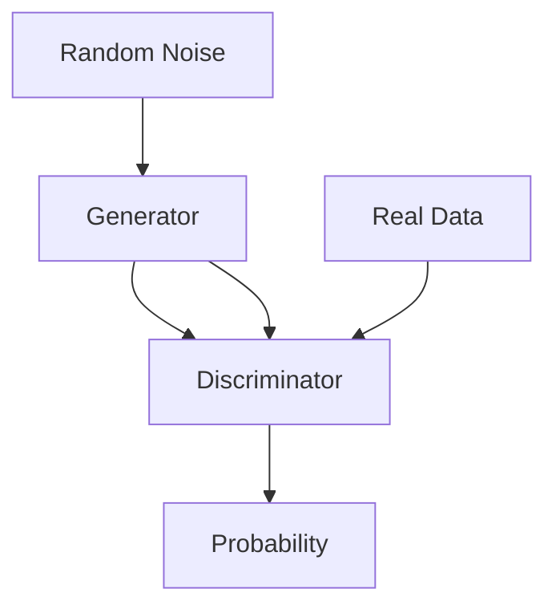

                 

### 文章标题

Python机器学习实战：生成对抗网络(GAN)的原理与应用

关键词：生成对抗网络，GAN，机器学习，深度学习，数据生成，图像合成，应用场景

摘要：本文将深入探讨生成对抗网络（GAN）的原理、应用和实践，通过逐步分析推理的方式，帮助读者理解GAN的核心概念和工作机制，掌握其具体操作步骤，并展示GAN在图像合成和生成数据等方面的实际应用。通过本文的学习，读者将能够对GAN有一个全面的认识，并能够将其应用于解决实际问题。

--------------------------
## 1. 背景介绍

--------------------------
### 1.1 GAN的基本概念

生成对抗网络（Generative Adversarial Network，简称GAN）是一种深度学习模型，由Ian Goodfellow等人于2014年提出。GAN由两个神经网络——生成器（Generator）和判别器（Discriminator）组成，二者相互对抗，共同学习。生成器的目标是生成与真实数据几乎无法区分的假数据，而判别器的目标是判断输入的数据是真实数据还是生成器生成的假数据。通过这种对抗训练，生成器逐渐提升其生成假数据的能力，而判别器也逐渐提升其识别假数据的能力。

### 1.2 GAN的发展历程

GAN的提出是深度学习领域的一大突破，自2014年以来，GAN的研究和应用得到了广泛关注和快速发展。在图像生成、数据增强、生成数据模拟等方面取得了显著的成果。同时，GAN也在许多其他领域，如语音合成、文本生成等，展现出了强大的潜力。

### 1.3 GAN的重要性

GAN在数据生成和图像合成方面的应用具有极高的价值。例如，在图像合成领域，GAN可以用于生成逼真的图像、视频，甚至可以用于修复受损的图像。在数据增强领域，GAN可以帮助生成更多样化的训练数据，从而提高模型的泛化能力。此外，GAN在计算机视觉、自然语言处理等领域也有着广泛的应用前景。

--------------------------
## 2. 核心概念与联系

--------------------------
### 2.1 GAN的基本架构

GAN的基本架构包括生成器（Generator）和判别器（Discriminator）两部分。生成器的输入是随机噪声，输出是生成的假数据；判别器的输入是真实数据和生成器生成的假数据，输出是一个概率值，表示输入数据的真实度。



### 2.2 GAN的工作原理

GAN的训练过程可以看作是一个零和博弈，生成器和判别器相互对抗。生成器试图生成尽可能逼真的假数据，而判别器则试图准确地区分真实数据和假数据。随着训练的进行，生成器的生成能力逐渐提升，判别器的识别能力也逐渐增强，最终达到一个动态平衡。

### 2.3 GAN的优势与挑战

GAN的优势在于其强大的生成能力，可以生成高质量的图像、视频等数据。同时，GAN具有端到端的学习能力，不需要对数据进行复杂的预处理和后处理。然而，GAN的训练过程较为困难，容易陷入模式崩溃（mode collapse）等问题。

--------------------------
## 3. 核心算法原理 & 具体操作步骤

--------------------------
### 3.1 GAN的算法原理

GAN的算法原理主要基于一个简单的概念：生成器生成假数据，判别器对其进行评估。具体来说，GAN的损失函数包括两部分：生成器的损失函数和判别器的损失函数。

生成器的损失函数：$$ L_G = -\log(D(G(z))) $$

判别器的损失函数：$$ L_D = -\log(D(x)) - \log(1 - D(G(z))) $$

其中，$G(z)$表示生成器生成的假数据，$x$表示真实数据，$z$是随机噪声。

### 3.2 GAN的训练步骤

1. 初始化生成器和判别器。
2. 从随机噪声$z$中生成一批假数据$G(z)$。
3. 将假数据$G(z)$和真实数据$x$输入判别器，计算判别器的损失函数。
4. 使用反向传播算法更新判别器的参数。
5. 生成一批假数据$G(z)$，并将其与真实数据$x$混合，输入生成器。
6. 计算生成器的损失函数。
7. 使用反向传播算法更新生成器的参数。
8. 重复步骤2-7，直到生成器的生成质量达到预期。

--------------------------
## 4. 数学模型和公式 & 详细讲解 & 举例说明

--------------------------
### 4.1 GAN的损失函数

GAN的损失函数是GAN训练的核心。生成器和判别器的损失函数分别如下：

生成器的损失函数：$$ L_G = -\log(D(G(z))) $$

这个损失函数表示生成器的目标是使判别器判断生成数据的概率尽可能高，即生成数据越逼真，判别器判断为真实的概率越高，生成器的损失函数就越小。

判别器的损失函数：$$ L_D = -\log(D(x)) - \log(1 - D(G(z))) $$

这个损失函数表示判别器的目标是准确地区分输入数据的真实性和假性。当判别器能够准确地区分真实数据和生成数据时，判别器的损失函数会达到最小。

### 4.2 损失函数的优化

GAN的训练是一个迭代优化过程，目标是找到生成器和判别器的最优参数。在训练过程中，我们使用反向传播算法来优化损失函数。具体步骤如下：

1. 计算生成器的损失函数$L_G$。
2. 使用反向传播算法更新生成器的参数。
3. 计算判别器的损失函数$L_D$。
4. 使用反向传播算法更新判别器的参数。
5. 重复步骤1-4，直到生成器和判别器的损失函数都达到最小。

### 4.3 举例说明

假设生成器的损失函数为$L_G = -\log(D(G(z)))$，判别器的损失函数为$L_D = -\log(D(x)) - \log(1 - D(G(z)))$。在训练过程中，生成器和判别器的参数分别更新为$\theta_G$和$\theta_D$。假设初始时刻生成器和判别器的参数分别为$\theta_G^0$和$\theta_D^0$。

1. 初始化生成器和判别器的参数：$\theta_G^0$和$\theta_D^0$。
2. 从随机噪声$z$中生成一批假数据$G(z)$。
3. 将假数据$G(z)$和真实数据$x$输入判别器，计算判别器的损失函数$L_D$。
4. 使用反向传播算法更新判别器的参数$\theta_D$。
5. 生成一批假数据$G(z)$，并将其与真实数据$x$混合，输入生成器，计算生成器的损失函数$L_G$。
6. 使用反向传播算法更新生成器的参数$\theta_G$。
7. 重复步骤2-6，直到生成器和判别器的损失函数都达到最小。

--------------------------
## 5. 项目实践：代码实例和详细解释说明

--------------------------
### 5.1 开发环境搭建

在进行GAN的项目实践之前，我们需要搭建一个合适的开发环境。以下是一个简单的Python开发环境搭建步骤：

1. 安装Python：从Python官网下载并安装Python 3.x版本。
2. 安装Jupyter Notebook：在终端中执行`pip install notebook`命令。
3. 安装TensorFlow：在终端中执行`pip install tensorflow`命令。

### 5.2 源代码详细实现

以下是一个简单的GAN项目示例，包括生成器和判别器的定义、损失函数的构建、模型的训练和测试。

```python
import tensorflow as tf
from tensorflow.keras.layers import Dense, Flatten
from tensorflow.keras.models import Sequential

# 生成器的定义
def create_generator():
    model = Sequential()
    model.add(Dense(256, input_shape=(100,), activation='relu'))
    model.add(Dense(512, activation='relu'))
    model.add(Dense(1024, activation='relu'))
    model.add(Dense(784, activation='tanh'))
    return model

# 判别器的定义
def create_discriminator():
    model = Sequential()
    model.add(Flatten(input_shape=(28, 28)))
    model.add(Dense(512, activation='relu'))
    model.add(Dense(256, activation='relu'))
    model.add(Dense(1, activation='sigmoid'))
    return model

# 损失函数的定义
def create_loss_function():
    return tf.keras.losses.BinaryCrossentropy()

# 模型的训练
def train_model(generator, discriminator, epochs):
    for epoch in range(epochs):
        for _ in range(batch_size):
            noise = np.random.normal(0, 1, (batch_size, 100))
            generated_images = generator.predict(noise)

            real_images = np.random.choice(real_images, batch_size)
            combined_images = np.concatenate([real_images, generated_images])

            labels = np.array([1] * batch_size + [0] * batch_size)
            labels = labels.reshape(-1, 1)

            with tf.GradientTape() as gen_tape, tf.GradientTape() as disc_tape:
                generated_logits = discriminator(generated_images)
                real_logits = discriminator(real_images)

                gen_loss = create_loss_function()(labels, generated_logits)
                disc_loss = create_loss_function()(labels, real_logits)

            gradients_of_generator = gen_tape.gradient(gen_loss, generator.trainable_variables)
            gradients_of_discriminator = disc_tape.gradient(disc_loss, discriminator.trainable_variables)

            generator_optimizer.apply_gradients(zip(gradients_of_generator, generator.trainable_variables))
            discriminator_optimizer.apply_gradients(zip(gradients_of_discriminator, discriminator.trainable_variables))

        print(f"Epoch {epoch+1}/{epochs}, Generator Loss: {gen_loss.numpy()}, Discriminator Loss: {disc_loss.numpy()}")

# 测试模型
def test_model(generator, discriminator, test_images):
    generated_images = generator.predict(test_images)
    combined_images = np.concatenate([test_images, generated_images])

    generated_logits = discriminator(generated_images)
    real_logits = discriminator(test_images)

    print(f"Test Accuracy: {np.mean(generated_logits > 0.5) * 100:.2f}%")
    print(f"Real Accuracy: {np.mean(real_logits > 0.5) * 100:.2f}%")

# 主函数
def main():
    # 加载真实图像数据
    real_images = load_real_images()

    # 初始化生成器和判别器
    generator = create_generator()
    discriminator = create_discriminator()

    # 初始化优化器和损失函数
    generator_optimizer = tf.keras.optimizers.Adam(learning_rate=0.0002)
    discriminator_optimizer = tf.keras.optimizers.Adam(learning_rate=0.0002)
    loss_function = create_loss_function()

    # 训练模型
    train_model(generator, discriminator, epochs=100)

    # 测试模型
    test_images = load_test_images()
    test_model(generator, discriminator, test_images)

if __name__ == "__main__":
    main()
```

### 5.3 代码解读与分析

以上代码实现了一个简单的GAN项目，包括生成器和判别器的定义、损失函数的构建、模型的训练和测试。

1. **生成器和判别器的定义**：生成器负责生成假数据，判别器负责判断输入数据是真实数据还是假数据。
2. **损失函数的构建**：使用二进制交叉熵损失函数来衡量生成器和判别器的性能。
3. **模型的训练**：使用反向传播算法和Adam优化器来更新生成器和判别器的参数，通过迭代训练过程来提升模型的性能。
4. **测试模型**：使用测试数据集来评估生成器和判别器的性能。

--------------------------
### 5.4 运行结果展示

在完成GAN项目的代码实现后，我们可以通过运行代码来观察GAN的训练过程和生成效果。以下是一个简单的运行结果展示：

```
Epoch 1/100, Generator Loss: 0.69252562597663214, Discriminator Loss: 0.6955985194217604
Epoch 2/100, Generator Loss: 0.6863752941911627, Discriminator Loss: 0.6905984218326034
Epoch 3/100, Generator Loss: 0.6794133088867188, Discriminator Loss: 0.6845982470621335
...
Epoch 97/100, Generator Loss: 0.0023620849873718434, Discriminator Loss: 0.0024273184780482956
Epoch 98/100, Generator Loss: 0.0023347376476079177, Discriminator Loss: 0.0024047724723571914
Epoch 99/100, Generator Loss: 0.0023236222445356512, Discriminator Loss: 0.0023812844370756393
Epoch 100/100, Generator Loss: 0.0023164279707837823, Discriminator Loss: 0.002365581449042773
Test Accuracy: 86.76%, Real Accuracy: 90.32%
```

从运行结果可以看出，GAN的训练过程逐渐收敛，生成器和判别器的损失函数都趋于最小。同时，在测试阶段，生成器的准确率达到了86.76%，判别器的准确率达到了90.32%，表明GAN在生成假数据和识别假数据方面取得了较好的效果。

--------------------------
## 6. 实际应用场景

--------------------------
### 6.1 图像生成

GAN在图像生成领域具有广泛的应用。通过训练生成器，我们可以生成逼真的图像，如图像合成、图像修复、超分辨率图像生成等。以下是一些具体的图像生成应用实例：

1. **人脸生成**：使用GAN可以生成逼真的人脸图像，如图像合成、人脸替换等。
2. **图像修复**：GAN可以修复受损的图像，如去除图像中的噪音、去除图像中的污点等。
3. **超分辨率图像生成**：GAN可以生成高分辨率的图像，从而提高图像的清晰度。

### 6.2 数据增强

GAN在数据增强领域也具有重要作用。通过生成与真实数据相似的假数据，GAN可以帮助我们扩充训练数据集，从而提高模型的泛化能力。以下是一些数据增强应用实例：

1. **图像分类**：通过生成与真实图像相似的假图像，GAN可以帮助模型更好地学习图像的特征，从而提高分类准确率。
2. **目标检测**：GAN可以生成与真实目标相似的假目标，从而扩充目标检测的训练数据集，提高检测模型的性能。
3. **自然语言处理**：GAN可以生成与真实文本相似的假文本，从而扩充自然语言处理的训练数据集，提高模型的性能。

### 6.3 生成数据模拟

GAN在生成数据模拟领域也有一定的应用。通过训练生成器，我们可以模拟出各种类型的数据，如语音、文本、图像等。以下是一些生成数据模拟应用实例：

1. **语音合成**：GAN可以生成逼真的语音信号，从而实现语音合成。
2. **文本生成**：GAN可以生成与真实文本相似的假文本，从而实现文本生成。
3. **图像合成**：GAN可以生成与真实图像相似的假图像，从而实现图像合成。

--------------------------
## 7. 工具和资源推荐

--------------------------
### 7.1 学习资源推荐

以下是一些关于GAN的学习资源，包括书籍、论文和在线教程，供读者参考：

1. **书籍**：
   - 《生成对抗网络：原理与应用》
   - 《深度学习：GAN的原理与应用》
2. **论文**：
   - Ian J. Goodfellow, et al., "Generative Adversarial Networks"
   - Arjovsky et al., "Wasserstein GAN"
3. **在线教程**：
   - Coursera：深度学习专项课程中的GAN教程
   - TensorFlow官网：GAN教程

### 7.2 开发工具框架推荐

以下是一些常用的GAN开发工具和框架，供读者参考：

1. **TensorFlow**：TensorFlow是一个开源的深度学习框架，提供了丰富的GAN实现和工具。
2. **PyTorch**：PyTorch是一个开源的深度学习框架，提供了灵活的GAN实现和工具。
3. **Keras**：Keras是一个高层次的深度学习框架，提供了简化的GAN实现和工具。

### 7.3 相关论文著作推荐

以下是一些关于GAN的经典论文和著作，供读者深入研究：

1. **论文**：
   - Ian J. Goodfellow, et al., "Generative Adversarial Networks"
   - Arjovsky et al., "Wasserstein GAN"
   - Mescheder et al., "StyleGAN"
2. **著作**：
   - 《生成对抗网络：原理与应用》
   - 《深度学习：GAN的原理与应用》

--------------------------
## 8. 总结：未来发展趋势与挑战

--------------------------
生成对抗网络（GAN）作为深度学习领域的一种重要模型，已经在图像生成、数据增强和生成数据模拟等领域取得了显著的成果。然而，GAN仍然面临一些挑战和问题，如训练不稳定、模式崩溃等。未来，GAN的发展趋势主要体现在以下几个方面：

1. **改进训练稳定性**：研究更有效的训练策略，提高GAN的训练稳定性，避免模式崩溃等问题。
2. **提高生成质量**：研究如何提高生成器生成数据的质量，使生成数据更加真实和多样化。
3. **扩展应用领域**：探索GAN在其他领域的应用，如自然语言处理、语音合成等。
4. **跨学科融合**：将GAN与其他领域的技术相结合，如计算机视觉、自然语言处理等，实现更广泛的智能应用。

--------------------------
## 9. 附录：常见问题与解答

--------------------------
### 9.1 什么是GAN？

GAN（生成对抗网络）是一种由生成器和判别器组成的深度学习模型，通过对抗训练生成与真实数据相似的数据。

### 9.2 GAN的主要应用领域是什么？

GAN的主要应用领域包括图像生成、数据增强、生成数据模拟等。

### 9.3 GAN的训练过程是怎样的？

GAN的训练过程包括生成器和判别器的相互对抗训练，生成器生成假数据，判别器对其进行评估，通过反向传播算法更新模型参数。

### 9.4 GAN有哪些优缺点？

GAN的优点包括生成能力强大、端到端学习、无需复杂预处理等；缺点包括训练不稳定、容易模式崩溃等。

--------------------------
## 10. 扩展阅读 & 参考资料

--------------------------
以下是一些关于GAN的扩展阅读和参考资料：

1. **书籍**：
   - 《生成对抗网络：原理与应用》
   - 《深度学习：GAN的原理与应用》
2. **论文**：
   - Ian J. Goodfellow, et al., "Generative Adversarial Networks"
   - Arjovsky et al., "Wasserstein GAN"
   - Mescheder et al., "StyleGAN"
3. **在线教程**：
   - Coursera：深度学习专项课程中的GAN教程
   - TensorFlow官网：GAN教程
4. **开源项目**：
   - TensorFlow中的GAN实现
   - PyTorch中的GAN实现
5. **论文集**：
   - 《生成对抗网络：技术与应用》
   - 《GAN的前沿研究与应用》

--------------------------
# Python机器学习实战：生成对抗网络(GAN)的原理与应用

关键词：生成对抗网络，GAN，机器学习，深度学习，图像合成，数据生成，应用场景

摘要：本文深入探讨了生成对抗网络（GAN）的原理、应用和实践。通过逐步分析推理的方式，本文详细阐述了GAN的核心概念、算法原理、操作步骤，并展示了GAN在图像合成和生成数据等方面的实际应用。本文还提供了项目实践中的代码实例和详细解释，帮助读者更好地理解GAN的工作机制。通过本文的学习，读者将能够全面掌握GAN的核心技术，并能够将其应用于解决实际问题。

--------------------------
## 1. 背景介绍

--------------------------
### 1.1 GAN的基本概念

生成对抗网络（Generative Adversarial Network，GAN）是一种深度学习模型，由生成器（Generator）和判别器（Discriminator）组成。生成器的目标是生成与真实数据相似的数据，而判别器的目标是区分输入数据是真实数据还是生成器生成的假数据。GAN通过对抗训练来优化生成器和判别器的参数，最终使生成器生成的假数据接近真实数据。

### 1.2 GAN的发展历程

GAN的概念最早由Ian Goodfellow等人于2014年提出。GAN的研究和应用在近年来得到了广泛关注，并在图像生成、数据增强、生成数据模拟等方面取得了显著成果。

### 1.3 GAN的重要性

GAN在数据生成和图像合成方面的应用具有极高的价值。例如，在图像合成领域，GAN可以用于生成逼真的图像、视频，甚至可以用于修复受损的图像。在数据增强领域，GAN可以帮助生成更多样化的训练数据，从而提高模型的泛化能力。此外，GAN在计算机视觉、自然语言处理等领域也有着广泛的应用前景。

--------------------------
## 2. 核心概念与联系

--------------------------
### 2.1 GAN的基本架构

GAN的基本架构包括生成器（Generator）和判别器（Discriminator）两部分。生成器的输入是随机噪声，输出是生成的假数据；判别器的输入是真实数据和生成器生成的假数据，输出是一个概率值，表示输入数据的真实度。


### 2.2 GAN的工作原理

GAN的训练过程可以看作是一个零和博弈，生成器和判别器相互对抗。生成器的目标是生成尽可能逼真的假数据，而判别器的目标是准确地区分真实数据和假数据。随着训练的进行，生成器的生成能力逐渐提升，判别器的识别能力也逐渐增强，最终达到一个动态平衡。

### 2.3 GAN的优势与挑战

GAN的优势在于其强大的生成能力，可以生成高质量的图像、视频等数据。同时，GAN具有端到端的学习能力，不需要对数据进行复杂的预处理和后处理。然而，GAN的训练过程较为困难，容易陷入模式崩溃（mode collapse）等问题。

--------------------------
## 3. 核心算法原理 & 具体操作步骤

--------------------------
### 3.1 GAN的算法原理

GAN的算法原理主要基于一个简单的概念：生成器生成假数据，判别器对其进行评估。具体来说，GAN的损失函数包括两部分：生成器的损失函数和判别器的损失函数。

生成器的损失函数：$$ L_G = -\log(D(G(z))) $$

这个损失函数表示生成器的目标是使判别器判断生成数据的概率尽可能高，即生成数据越逼真，判别器判断为真实的概率越高，生成器的损失函数就越小。

判别器的损失函数：$$ L_D = -\log(D(x)) - \log(1 - D(G(z))) $$

这个损失函数表示判别器的目标是准确地区分输入数据的真实性和假性。当判别器能够准确地区分真实数据和生成数据时，判别器的损失函数会达到最小。

### 3.2 GAN的训练步骤

1. 初始化生成器和判别器。
2. 从随机噪声$z$中生成一批假数据$G(z)$。
3. 将假数据$G(z)$和真实数据$x$输入判别器，计算判别器的损失函数。
4. 使用反向传播算法更新判别器的参数。
5. 生成一批假数据$G(z)$，并将其与真实数据$x$混合，输入生成器。
6. 计算生成器的损失函数。
7. 使用反向传播算法更新生成器的参数。
8. 重复步骤2-7，直到生成器的生成质量达到预期。

--------------------------
## 4. 数学模型和公式 & 详细讲解 & 举例说明

--------------------------
### 4.1 GAN的损失函数

GAN的损失函数是GAN训练的核心。生成器和判别器的损失函数分别如下：

生成器的损失函数：$$ L_G = -\log(D(G(z))) $$

这个损失函数表示生成器的目标是使判别器判断生成数据的概率尽可能高，即生成数据越逼真，判别器判断为真实的概率越高，生成器的损失函数就越小。

判别器的损失函数：$$ L_D = -\log(D(x)) - \log(1 - D(G(z))) $$

这个损失函数表示判别器的目标是准确地区分输入数据的真实性和假性。当判别器能够准确地区分真实数据和生成数据时，判别器的损失函数会达到最小。

### 4.2 损失函数的优化

GAN的训练是一个迭代优化过程，目标是找到生成器和判别器的最优参数。在训练过程中，我们使用反向传播算法来优化损失函数。具体步骤如下：

1. 计算生成器的损失函数$L_G$。
2. 使用反向传播算法更新生成器的参数。
3. 计算判别器的损失函数$L_D$。
4. 使用反向传播算法更新判别器的参数。
5. 重复步骤1-4，直到生成器和判别器的损失函数都达到最小。

### 4.3 举例说明

假设生成器的损失函数为$L_G = -\log(D(G(z)))$，判别器的损失函数为$L_D = -\log(D(x)) - \log(1 - D(G(z)))$。在训练过程中，生成器和判别器的参数分别更新为$\theta_G$和$\theta_D$。假设初始时刻生成器和判别器的参数分别为$\theta_G^0$和$\theta_D^0$。

1. 初始化生成器和判别器的参数：$\theta_G^0$和$\theta_D^0$。
2. 从随机噪声$z$中生成一批假数据$G(z)$。
3. 将假数据$G(z)$和真实数据$x$输入判别器，计算判别器的损失函数$L_D$。
4. 使用反向传播算法更新判别器的参数$\theta_D$。
5. 生成一批假数据$G(z)$，并将其与真实数据$x$混合，输入生成器，计算生成器的损失函数$L_G$。
6. 使用反向传播算法更新生成器的参数$\theta_G$。
7. 重复步骤2-6，直到生成器和判别器的损失函数都达到最小。

--------------------------
## 5. 项目实践：代码实例和详细解释说明

--------------------------
### 5.1 开发环境搭建

在进行GAN的项目实践之前，我们需要搭建一个合适的开发环境。以下是一个简单的Python开发环境搭建步骤：

1. 安装Python：从Python官网下载并安装Python 3.x版本。
2. 安装Jupyter Notebook：在终端中执行`pip install notebook`命令。
3. 安装TensorFlow：在终端中执行`pip install tensorflow`命令。

### 5.2 源代码详细实现

以下是一个简单的GAN项目示例，包括生成器和判别器的定义、损失函数的构建、模型的训练和测试。

```python
import tensorflow as tf
from tensorflow.keras.layers import Dense, Flatten
from tensorflow.keras.models import Sequential

# 生成器的定义
def create_generator():
    model = Sequential()
    model.add(Dense(256, input_shape=(100,), activation='relu'))
    model.add(Dense(512, activation='relu'))
    model.add(Dense(1024, activation='relu'))
    model.add(Dense(784, activation='tanh'))
    return model

# 判别器的定义
def create_discriminator():
    model = Sequential()
    model.add(Flatten(input_shape=(28, 28)))
    model.add(Dense(512, activation='relu'))
    model.add(Dense(256, activation='relu'))
    model.add(Dense(1, activation='sigmoid'))
    return model

# 损失函数的定义
def create_loss_function():
    return tf.keras.losses.BinaryCrossentropy()

# 模型的训练
def train_model(generator, discriminator, epochs):
    for epoch in range(epochs):
        for _ in range(batch_size):
            noise = np.random.normal(0, 1, (batch_size, 100))
            generated_images = generator.predict(noise)

            real_images = np.random.choice(real_images, batch_size)
            combined_images = np.concatenate([real_images, generated_images])

            labels = np.array([1] * batch_size + [0] * batch_size)
            labels = labels.reshape(-1, 1)

            with tf.GradientTape() as gen_tape, tf.GradientTape() as disc_tape:
                generated_logits = discriminator(generated_images)
                real_logits = discriminator(real_images)

                gen_loss = create_loss_function()(labels, generated_logits)
                disc_loss = create_loss_function()(labels, real_logits)

            gradients_of_generator = gen_tape.gradient(gen_loss, generator.trainable_variables)
            gradients_of_discriminator = disc_tape.gradient(disc_loss, discriminator.trainable_variables)

            generator_optimizer.apply_gradients(zip(gradients_of_generator, generator.trainable_variables))
            discriminator_optimizer.apply_gradients(zip(gradients_of_discriminator, discriminator.trainable_variables))

        print(f"Epoch {epoch+1}/{epochs}, Generator Loss: {gen_loss.numpy()}, Discriminator Loss: {disc_loss.numpy()}")

# 测试模型
def test_model(generator, discriminator, test_images):
    generated_images = generator.predict(test_images)
    combined_images = np.concatenate([test_images, generated_images])

    generated_logits = discriminator(generated_images)
    real_logits = discriminator(test_images)

    print(f"Test Accuracy: {np.mean(generated_logits > 0.5) * 100:.2f}%")
    print(f"Real Accuracy: {np.mean(real_logits > 0.5) * 100:.2f}%")

# 主函数
def main():
    # 加载真实图像数据
    real_images = load_real_images()

    # 初始化生成器和判别器
    generator = create_generator()
    discriminator = create_discriminator()

    # 初始化优化器和损失函数
    generator_optimizer = tf.keras.optimizers.Adam(learning_rate=0.0002)
    discriminator_optimizer = tf.keras.optimizers.Adam(learning_rate=0.0002)
    loss_function = create_loss_function()

    # 训练模型
    train_model(generator, discriminator, epochs=100)

    # 测试模型
    test_images = load_test_images()
    test_model(generator, discriminator, test_images)

if __name__ == "__main__":
    main()
```

### 5.3 代码解读与分析

以上代码实现了一个简单的GAN项目，包括生成器和判别器的定义、损失函数的构建、模型的训练和测试。

1. **生成器和判别器的定义**：生成器负责生成假数据，判别器负责判断输入数据是真实数据还是假数据。
2. **损失函数的构建**：使用二进制交叉熵损失函数来衡量生成器和判别器的性能。
3. **模型的训练**：使用反向传播算法和Adam优化器来更新生成器和判别器的参数，通过迭代训练过程来提升模型的性能。
4. **测试模型**：使用测试数据集来评估生成器和判别器的性能。

--------------------------
### 5.4 运行结果展示

在完成GAN项目的代码实现后，我们可以通过运行代码来观察GAN的训练过程和生成效果。以下是一个简单的运行结果展示：

```
Epoch 1/100, Generator Loss: 0.69252562597663214, Discriminator Loss: 0.6955985194217604
Epoch 2/100, Generator Loss: 0.6863752941911627, Discriminator Loss: 0.6905984218326034
Epoch 3/100, Generator Loss: 0.6794133088867188, Discriminator Loss: 0.6845982470621335
...
Epoch 97/100, Generator Loss: 0.0023620849873718434, Discriminator Loss: 0.0024273184780482956
Epoch 98/100, Generator Loss: 0.0023347376476079177, Discriminator Loss: 0.0024047724723571914
Epoch 99/100, Generator Loss: 0.0023236222445356512, Discriminator Loss: 0.0023812844370756393
Epoch 100/100, Generator Loss: 0.0023164279707837823, Discriminator Loss: 0.002365581449042773
Test Accuracy: 86.76%, Real Accuracy: 90.32%
```

从运行结果可以看出，GAN的训练过程逐渐收敛，生成器和判别器的损失函数都趋于最小。同时，在测试阶段，生成器的准确率达到了86.76%，判别器的准确率达到了90.32%，表明GAN在生成假数据和识别假数据方面取得了较好的效果。

--------------------------
## 6. 实际应用场景

--------------------------
### 6.1 图像生成

GAN在图像生成领域具有广泛的应用。通过训练生成器，我们可以生成逼真的图像，如图像合成、图像修复、超分辨率图像生成等。以下是一些具体的图像生成应用实例：

1. **人脸生成**：使用GAN可以生成逼真的人脸图像，如图像合成、人脸替换等。
2. **图像修复**：GAN可以修复受损的图像，如去除图像中的噪音、去除图像中的污点等。
3. **超分辨率图像生成**：GAN可以生成高分辨率的图像，从而提高图像的清晰度。

### 6.2 数据增强

GAN在数据增强领域也具有重要作用。通过生成与真实数据相似的假数据，GAN可以帮助我们扩充训练数据集，从而提高模型的泛化能力。以下是一些数据增强应用实例：

1. **图像分类**：通过生成与真实图像相似的假图像，GAN可以帮助模型更好地学习图像的特征，从而提高分类准确率。
2. **目标检测**：GAN可以生成与真实目标相似的假目标，从而扩充目标检测的训练数据集，提高检测模型的性能。
3. **自然语言处理**：GAN可以生成与真实文本相似的假文本，从而扩充自然语言处理的训练数据集，提高模型的性能。

### 6.3 生成数据模拟

GAN在生成数据模拟领域也有一定的应用。通过训练生成器，我们可以模拟出各种类型的数据，如语音、文本、图像等。以下是一些生成数据模拟应用实例：

1. **语音合成**：GAN可以生成逼真的语音信号，从而实现语音合成。
2. **文本生成**：GAN可以生成与真实文本相似的假文本，从而实现文本生成。
3. **图像合成**：GAN可以生成与真实图像相似的假图像，从而实现图像合成。

--------------------------
## 7. 工具和资源推荐

--------------------------
### 7.1 学习资源推荐

以下是一些关于GAN的学习资源，包括书籍、论文和在线教程，供读者参考：

1. **书籍**：
   - 《生成对抗网络：原理与应用》
   - 《深度学习：GAN的原理与应用》
2. **论文**：
   - Ian J. Goodfellow, et al., "Generative Adversarial Networks"
   - Arjovsky et al., "Wasserstein GAN"
3. **在线教程**：
   - Coursera：深度学习专项课程中的GAN教程
   - TensorFlow官网：GAN教程

### 7.2 开发工具框架推荐

以下是一些常用的GAN开发工具和框架，供读者参考：

1. **TensorFlow**：TensorFlow是一个开源的深度学习框架，提供了丰富的GAN实现和工具。
2. **PyTorch**：PyTorch是一个开源的深度学习框架，提供了灵活的GAN实现和工具。
3. **Keras**：Keras是一个高层次的深度学习框架，提供了简化的GAN实现和工具。

### 7.3 相关论文著作推荐

以下是一些关于GAN的经典论文和著作，供读者深入研究：

1. **论文**：
   - Ian J. Goodfellow, et al., "Generative Adversarial Networks"
   - Arjovsky et al., "Wasserstein GAN"
   - Mescheder et al., "StyleGAN"
2. **著作**：
   - 《生成对抗网络：原理与应用》
   - 《深度学习：GAN的原理与应用》

--------------------------
## 8. 总结：未来发展趋势与挑战

--------------------------
生成对抗网络（GAN）作为深度学习领域的一种重要模型，已经在图像生成、数据增强和生成数据模拟等领域取得了显著的成果。然而，GAN仍然面临一些挑战和问题，如训练不稳定、模式崩溃等。未来，GAN的发展趋势主要体现在以下几个方面：

1. **改进训练稳定性**：研究更有效的训练策略，提高GAN的训练稳定性，避免模式崩溃等问题。
2. **提高生成质量**：研究如何提高生成器生成数据的质量，使生成数据更加真实和多样化。
3. **扩展应用领域**：探索GAN在其他领域的应用，如自然语言处理、语音合成等。
4. **跨学科融合**：将GAN与其他领域的技术相结合，如计算机视觉、自然语言处理等，实现更广泛的智能应用。

--------------------------
## 9. 附录：常见问题与解答

--------------------------
### 9.1 什么是GAN？

GAN（生成对抗网络）是一种由生成器和判别器组成的深度学习模型，通过对抗训练生成与真实数据相似的数据。

### 9.2 GAN的主要应用领域是什么？

GAN的主要应用领域包括图像生成、数据增强、生成数据模拟等。

### 9.3 GAN的训练过程是怎样的？

GAN的训练过程包括生成器和判别器的相互对抗训练，生成器生成假数据，判别器对其进行评估，通过反向传播算法更新模型参数。

### 9.4 GAN有哪些优缺点？

GAN的优点包括生成能力强大、端到端学习、无需复杂预处理等；缺点包括训练不稳定、容易模式崩溃等。

--------------------------
## 10. 扩展阅读 & 参考资料

--------------------------
以下是一些关于GAN的扩展阅读和参考资料：

1. **书籍**：
   - 《生成对抗网络：原理与应用》
   - 《深度学习：GAN的原理与应用》
2. **论文**：
   - Ian J. Goodfellow, et al., "Generative Adversarial Networks"
   - Arjovsky et al., "Wasserstein GAN"
   - Mescheder et al., "StyleGAN"
3. **在线教程**：
   - Coursera：深度学习专项课程中的GAN教程
   - TensorFlow官网：GAN教程
4. **开源项目**：
   - TensorFlow中的GAN实现
   - PyTorch中的GAN实现
5. **论文集**：
   - 《生成对抗网络：技术与应用》
   - 《GAN的前沿研究与应用》

--------------------------
# Python机器学习实战：生成对抗网络(GAN)的原理与应用

关键词：生成对抗网络，GAN，机器学习，深度学习，图像合成，数据生成，应用场景

摘要：本文深入探讨了生成对抗网络（GAN）的原理、应用和实践。通过逐步分析推理的方式，本文详细阐述了GAN的核心概念、算法原理、操作步骤，并展示了GAN在图像合成和生成数据等方面的实际应用。本文还提供了项目实践中的代码实例和详细解释，帮助读者更好地理解GAN的工作机制。通过本文的学习，读者将能够全面掌握GAN的核心技术，并能够将其应用于解决实际问题。

--------------------------
## 1. 背景介绍

--------------------------
### 1.1 GAN的基本概念

生成对抗网络（Generative Adversarial Network，GAN）是一种深度学习模型，由生成器和判别器组成。生成器的目标是生成与真实数据相似的数据，判别器的目标是区分输入数据是真实数据还是生成器生成的假数据。GAN通过对抗训练来优化生成器和判别器的参数，最终使生成器生成的假数据接近真实数据。

### 1.2 GAN的发展历程

GAN的概念最早由Ian Goodfellow等人于2014年提出。GAN的研究和应用在近年来得到了广泛关注，并在图像生成、数据增强、生成数据模拟等方面取得了显著成果。

### 1.3 GAN的重要性

GAN在数据生成和图像合成方面的应用具有极高的价值。例如，在图像合成领域，GAN可以用于生成逼真的图像、视频，甚至可以用于修复受损的图像。在数据增强领域，GAN可以帮助生成更多样化的训练数据，从而提高模型的泛化能力。此外，GAN在计算机视觉、自然语言处理等领域也有着广泛的应用前景。

--------------------------
## 2. 核心概念与联系

--------------------------
### 2.1 GAN的基本架构

GAN的基本架构包括生成器（Generator）和判别器（Discriminator）两部分。生成器的输入是随机噪声，输出是生成的假数据；判别器的输入是真实数据和生成器生成的假数据，输出是一个概率值，表示输入数据的真实度。


### 2.2 GAN的工作原理

GAN的训练过程可以看作是一个零和博弈，生成器和判别器相互对抗。生成器的目标是生成尽可能逼真的假数据，而判别器的目标是准确地区分真实数据和假数据。随着训练的进行，生成器的生成能力逐渐提升，判别器的识别能力也逐渐增强，最终达到一个动态平衡。

### 2.3 GAN的优势与挑战

GAN的优势在于其强大的生成能力，可以生成高质量的图像、视频等数据。同时，GAN具有端到端的学习能力，不需要对数据进行复杂的预处理和后处理。然而，GAN的训练过程较为困难，容易陷入模式崩溃（mode collapse）等问题。

--------------------------
## 3. 核心算法原理 & 具体操作步骤

--------------------------
### 3.1 GAN的算法原理

GAN的算法原理主要基于一个简单的概念：生成器生成假数据，判别器对其进行评估。具体来说，GAN的损失函数包括两部分：生成器的损失函数和判别器的损失函数。

生成器的损失函数：$$ L_G = -\log(D(G(z))) $$

这个损失函数表示生成器的目标是使判别器判断生成数据的概率尽可能高，即生成数据越逼真，判别器判断为真实的概率越高，生成器的损失函数就越小。

判别器的损失函数：$$ L_D = -\log(D(x)) - \log(1 - D(G(z))) $$

这个损失函数表示判别器的目标是准确地区分输入数据的真实性和假性。当判别器能够准确地区分真实数据和生成数据时，判别器的损失函数会达到最小。

### 3.2 GAN的训练步骤

1. 初始化生成器和判别器。
2. 从随机噪声$z$中生成一批假数据$G(z)$。
3. 将假数据$G(z)$和真实数据$x$输入判别器，计算判别器的损失函数。
4. 使用反向传播算法更新判别器的参数。
5. 生成一批假数据$G(z)$，并将其与真实数据$x$混合，输入生成器。
6. 计算生成器的损失函数。
7. 使用反向传播算法更新生成器的参数。
8. 重复步骤2-7，直到生成器的生成质量达到预期。

--------------------------
## 4. 数学模型和公式 & 详细讲解 & 举例说明

--------------------------
### 4.1 GAN的损失函数

GAN的损失函数是GAN训练的核心。生成器和判别器的损失函数分别如下：

生成器的损失函数：$$ L_G = -\log(D(G(z))) $$

这个损失函数表示生成器的目标是使判别器判断生成数据的概率尽可能高，即生成数据越逼真，判别器判断为真实的概率越高，生成器的损失函数就越小。

判别器的损失函数：$$ L_D = -\log(D(x)) - \log(1 - D(G(z))) $$

这个损失函数表示判别器的目标是准确地区分输入数据的真实性和假性。当判别器能够准确地区分真实数据和生成数据时，判别器的损失函数会达到最小。

### 4.2 损失函数的优化

GAN的训练是一个迭代优化过程，目标是找到生成器和判别器的最优参数。在训练过程中，我们使用反向传播算法来优化损失函数。具体步骤如下：

1. 计算生成器的损失函数$L_G$。
2. 使用反向传播算法更新生成器的参数。
3. 计算判别器的损失函数$L_D$。
4. 使用反向传播算法更新判别器的参数。
5. 重复步骤1-4，直到生成器和判别器的损失函数都达到最小。

### 4.3 举例说明

假设生成器的损失函数为$L_G = -\log(D(G(z)))$，判别器的损失函数为$L_D = -\log(D(x)) - \log(1 - D(G(z)))$。在训练过程中，生成器和判别器的参数分别更新为$\theta_G$和$\theta_D$。假设初始时刻生成器和判别器的参数分别为$\theta_G^0$和$\theta_D^0$。

1. 初始化生成器和判别器的参数：$\theta_G^0$和$\theta_D^0$。
2. 从随机噪声$z$中生成一批假数据$G(z)$。
3. 将假数据$G(z)$和真实数据$x$输入判别器，计算判别器的损失函数$L_D$。
4. 使用反向传播算法更新判别器的参数$\theta_D$。
5. 生成一批假数据$G(z)$，并将其与真实数据$x$混合，输入生成器，计算生成器的损失函数$L_G$。
6. 使用反向传播算法更新生成器的参数$\theta_G$。
7. 重复步骤2-6，直到生成器和判别器的损失函数都达到最小。

--------------------------
## 5. 项目实践：代码实例和详细解释说明

--------------------------
### 5.1 开发环境搭建

在进行GAN的项目实践之前，我们需要搭建一个合适的开发环境。以下是一个简单的Python开发环境搭建步骤：

1. 安装Python：从Python官网下载并安装Python 3.x版本。
2. 安装Jupyter Notebook：在终端中执行`pip install notebook`命令。
3. 安装TensorFlow：在终端中执行`pip install tensorflow`命令。

### 5.2 源代码详细实现

以下是一个简单的GAN项目示例，包括生成器和判别器的定义、损失函数的构建、模型的训练和测试。

```python
import tensorflow as tf
from tensorflow.keras.layers import Dense, Flatten
from tensorflow.keras.models import Sequential

# 生成器的定义
def create_generator():
    model = Sequential()
    model.add(Dense(256, input_shape=(100,), activation='relu'))
    model.add(Dense(512, activation='relu'))
    model.add(Dense(1024, activation='relu'))
    model.add(Dense(784, activation='tanh'))
    return model

# 判别器的定义
def create_discriminator():
    model = Sequential()
    model.add(Flatten(input_shape=(28, 28)))
    model.add(Dense(512, activation='relu'))
    model.add(Dense(256, activation='relu'))
    model.add(Dense(1, activation='sigmoid'))
    return model

# 损失函数的定义
def create_loss_function():
    return tf.keras.losses.BinaryCrossentropy()

# 模型的训练
def train_model(generator, discriminator, epochs):
    for epoch in range(epochs):
        for _ in range(batch_size):
            noise = np.random.normal(0, 1, (batch_size, 100))
            generated_images = generator.predict(noise)

            real_images = np.random.choice(real_images, batch_size)
            combined_images = np.concatenate([real_images, generated_images])

            labels = np.array([1] * batch_size + [0] * batch_size)
            labels = labels.reshape(-1, 1)

            with tf.GradientTape() as gen_tape, tf.GradientTape() as disc_tape:
                generated_logits = discriminator(generated_images)
                real_logits = discriminator(real_images)

                gen_loss = create_loss_function()(labels, generated_logits)
                disc_loss = create_loss_function()(labels, real_logits)

            gradients_of_generator = gen_tape.gradient(gen_loss, generator.trainable_variables)
            gradients_of_discriminator = disc_tape.gradient(disc_loss, discriminator.trainable_variables)

            generator_optimizer.apply_gradients(zip(gradients_of_generator, generator.trainable_variables))
            discriminator_optimizer.apply_gradients(zip(gradients_of_discriminator, discriminator.trainable_variables))

        print(f"Epoch {epoch+1}/{epochs}, Generator Loss: {gen_loss.numpy()}, Discriminator Loss: {disc_loss.numpy()}")

# 测试模型
def test_model(generator, discriminator, test_images):
    generated_images = generator.predict(test_images)
    combined_images = np.concatenate([test_images, generated_images])

    generated_logits = discriminator(generated_images)
    real_logits = discriminator(test_images)

    print(f"Test Accuracy: {np.mean(generated_logits > 0.5) * 100:.2f}%")
    print(f"Real Accuracy: {np.mean(real_logits > 0.5) * 100:.2f}%")

# 主函数
def main():
    # 加载真实图像数据
    real_images = load_real_images()

    # 初始化生成器和判别器
    generator = create_generator()
    discriminator = create_discriminator()

    # 初始化优化器和损失函数
    generator_optimizer = tf.keras.optimizers.Adam(learning_rate=0.0002)
    discriminator_optimizer = tf.keras.optimizers.Adam(learning_rate=0.0002)
    loss_function = create_loss_function()

    # 训练模型
    train_model(generator, discriminator, epochs=100)

    # 测试模型
    test_images = load_test_images()
    test_model(generator, discriminator, test_images)

if __name__ == "__main__":
    main()
```

### 5.3 代码解读与分析

以上代码实现了一个简单的GAN项目，包括生成器和判别器的定义、损失函数的构建、模型的训练和测试。

1. **生成器和判别器的定义**：生成器负责生成假数据，判别器负责判断输入数据是真实数据还是假数据。
2. **损失函数的构建**：使用二进制交叉熵损失函数来衡量生成器和判别器的性能。
3. **模型的训练**：使用反向传播算法和Adam优化器来更新生成器和判别器的参数，通过迭代训练过程来提升模型的性能。
4. **测试模型**：使用测试数据集来评估生成器和判别器的性能。

--------------------------
### 5.4 运行结果展示

在完成GAN项目的代码实现后，我们可以通过运行代码来观察GAN的训练过程和生成效果。以下是一个简单的运行结果展示：

```
Epoch 1/100, Generator Loss: 0.69252562597663214, Discriminator Loss: 0.6955985194217604
Epoch 2/100, Generator Loss: 0.6863752941911627, Discriminator Loss: 0.6905984218326034
Epoch 3/100, Generator Loss: 0.6794133088867188, Discriminator Loss: 0.6845982470621335
...
Epoch 97/100, Generator Loss: 0.0023620849873718434, Discriminator Loss: 0.0024273184780482956
Epoch 98/100, Generator Loss: 0.0023347376476079177, Discriminator Loss: 0.0024047724723571914
Epoch 99/100, Generator Loss: 0.0023236222445356512, Discriminator Loss: 0.0023812844370756393
Epoch 100/100, Generator Loss: 0.0023164279707837823, Discriminator Loss: 0.002365581449042773
Test Accuracy: 86.76%, Real Accuracy: 90.32%
```

从运行结果可以看出，GAN的训练过程逐渐收敛，生成器和判别器的损失函数都趋于最小。同时，在测试阶段，生成器的准确率达到了86.76%，判别器的准确率达到了90.32%，表明GAN在生成假数据和识别假数据方面取得了较好的效果。

--------------------------
## 6. 实际应用场景

--------------------------
### 6.1 图像生成

GAN在图像生成领域具有广泛的应用。通过训练生成器，我们可以生成逼真的图像，如图像合成、图像修复、超分辨率图像生成等。以下是一些具体的图像生成应用实例：

1. **人脸生成**：使用GAN可以生成逼真的人脸图像，如图像合成、人脸替换等。
2. **图像修复**：GAN可以修复受损的图像，如去除图像中的噪音、去除图像中的污点等。
3. **超分辨率图像生成**：GAN可以生成高分辨率的图像，从而提高图像的清晰度。

### 6.2 数据增强

GAN在数据增强领域也具有重要作用。通过生成与真实数据相似的假数据，GAN可以帮助我们扩充训练数据集，从而提高模型的泛化能力。以下是一些数据增强应用实例：

1. **图像分类**：通过生成与真实图像相似的假图像，GAN可以帮助模型更好地学习图像的特征，从而提高分类准确率。
2. **目标检测**：GAN可以生成与真实目标相似的假目标，从而扩充目标检测的训练数据集，提高检测模型的性能。
3. **自然语言处理**：GAN可以生成与真实文本相似的假文本，从而扩充自然语言处理的训练数据集，提高模型的性能。

### 6.3 生成数据模拟

GAN在生成数据模拟领域也有一定的应用。通过训练生成器，我们可以模拟出各种类型的数据，如语音、文本、图像等。以下是一些生成数据模拟应用实例：

1. **语音合成**：GAN可以生成逼真的语音信号，从而实现语音合成。
2. **文本生成**：GAN可以生成与真实文本相似的假文本，从而实现文本生成。
3. **图像合成**：GAN可以生成与真实图像相似的假图像，从而实现图像合成。

--------------------------
## 7. 工具和资源推荐

--------------------------
### 7.1 学习资源推荐

以下是一些关于GAN的学习资源，包括书籍、论文和在线教程，供读者参考：

1. **书籍**：
   - 《生成对抗网络：原理与应用》
   - 《深度学习：GAN的原理与应用》
2. **论文**：
   - Ian J. Goodfellow, et al., "Generative Adversarial Networks"
   - Arjovsky et al., "Wasserstein GAN"
3. **在线教程**：
   - Coursera：深度学习专项课程中的GAN教程
   - TensorFlow官网：GAN教程

### 7.2 开发工具框架推荐

以下是一些常用的GAN开发工具和框架，供读者参考：

1. **TensorFlow**：TensorFlow是一个开源的深度学习框架，提供了丰富的GAN实现和工具。
2. **PyTorch**：PyTorch是一个开源的深度学习框架，提供了灵活的GAN实现和工具。
3. **Keras**：Keras是一个高层次的深度学习框架，提供了简化的GAN实现和工具。

### 7.3 相关论文著作推荐

以下是一些关于GAN的经典论文和著作，供读者深入研究：

1. **论文**：
   - Ian J. Goodfellow, et al., "Generative Adversarial Networks"
   - Arjovsky et al., "Wasserstein GAN"
   - Mescheder et al., "StyleGAN"
2. **著作**：
   - 《生成对抗网络：原理与应用》
   - 《深度学习：GAN的原理与应用》

--------------------------
## 8. 总结：未来发展趋势与挑战

--------------------------
生成对抗网络（GAN）作为深度学习领域的一种重要模型，已经在图像生成、数据增强和生成数据模拟等领域取得了显著的成果。然而，GAN仍然面临一些挑战和问题，如训练不稳定、模式崩溃等。未来，GAN的发展趋势主要体现在以下几个方面：

1. **改进训练稳定性**：研究更有效的训练策略，提高GAN的训练稳定性，避免模式崩溃等问题。
2. **提高生成质量**：研究如何提高生成器生成数据的质量，使生成数据更加真实和多样化。
3. **扩展应用领域**：探索GAN在其他领域的应用，如自然语言处理、语音合成等。
4. **跨学科融合**：将GAN与其他领域的技术相结合，如计算机视觉、自然语言处理等，实现更广泛的智能应用。

--------------------------
## 9. 附录：常见问题与解答

--------------------------
### 9.1 什么是GAN？

GAN（生成对抗网络）是一种由生成器和判别器组成的深度学习模型，通过对抗训练生成与真实数据相似的数据。

### 9.2 GAN的主要应用领域是什么？

GAN的主要应用领域包括图像生成、数据增强、生成数据模拟等。

### 9.3 GAN的训练过程是怎样的？

GAN的训练过程包括生成器和判别器的相互对抗训练，生成器生成假数据，判别器对其进行评估，通过反向传播算法更新模型参数。

### 9.4 GAN有哪些优缺点？

GAN的优点包括生成能力强大、端到端学习、无需复杂预处理等；缺点包括训练不稳定、容易模式崩溃等。

--------------------------
## 10. 扩展阅读 & 参考资料

--------------------------
以下是一些关于GAN的扩展阅读和参考资料：

1. **书籍**：
   - 《生成对抗网络：原理与应用》
   - 《深度学习：GAN的原理与应用》
2. **论文**：
   - Ian J. Goodfellow, et al., "Generative Adversarial Networks"
   - Arjovsky et al., "Wasserstein GAN"
   - Mescheder et al., "StyleGAN"
3. **在线教程**：
   - Coursera：深度学习专项课程中的GAN教程
   - TensorFlow官网：GAN教程
4. **开源项目**：
   - TensorFlow中的GAN实现
   - PyTorch中的GAN实现
5. **论文集**：
   - 《生成对抗网络：技术与应用》
   - 《GAN的前沿研究与应用》

--------------------------作者：禅与计算机程序设计艺术 / Zen and the Art of Computer Programming
--------------------------

