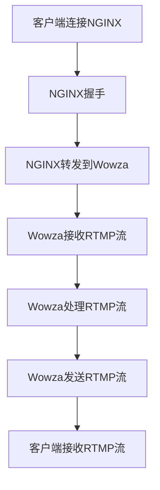

                 

### 文章标题

**RTMP 服务器配置：使用 NGINX 和 Wowza**

### 关键词

- RTMP
- NGINX
- Wowza
- 服务器配置
- 实时传输协议

### 摘要

本文旨在深入探讨如何配置RTMP服务器，特别是在使用NGINX和Wowza的情况下。文章首先介绍RTMP协议的基本概念和其在实时流媒体中的重要性，接着详细讲解了NGINX和Wowza的特点与优势。随后，文章将分步骤演示如何配置NGINX以处理RTMP流量，以及如何与Wowza集成，实现高效稳定的实时流媒体传输。最后，文章还将探讨RTMP在实际应用中的场景，并给出一些实用的工具和资源推荐，帮助读者更好地掌握RTMP服务器配置技巧。

---

## 1. 背景介绍（Background Introduction）

实时传输协议（Real-Time Messaging Protocol，简称RTMP）是一种常用于实时流媒体数据传输的网络协议。它最初由Adobe开发，用于Flash流媒体播放，并广泛应用于直播、点播、在线教育等领域。RTMP协议具有低延迟、高可靠性和高效传输的特点，使得它成为实时数据传输的理想选择。

### RTMP协议的基本概念

RTMP协议的工作原理可以分为以下几个阶段：

1. **连接阶段**：客户端与服务器建立连接，通过握手协议确保连接的稳定性和安全性。
2. **消息传输阶段**：客户端将数据发送到服务器，服务器再将数据转发给客户端或存储在服务器的缓存中。
3. **断开连接阶段**：在数据传输完成后，客户端与服务器断开连接。

RTMP协议支持多种数据类型，包括文本、二进制和多媒体流，这使得它能够满足不同场景下的需求。同时，RTMP协议还支持消息流的同步和回放功能，保证了实时流的流畅性和连续性。

### RTMP协议的重要性

在实时流媒体应用中，RTMP协议的重要性体现在以下几个方面：

1. **低延迟**：实时流媒体要求数据传输延迟尽可能低，以保证用户能够实时观看直播或点播内容。RTMP协议的低延迟特性使得它成为实现实时交互的理想选择。
2. **高可靠性**：实时流媒体数据传输过程中，数据包丢失或损坏可能会严重影响用户体验。RTMP协议通过自动重传和缓存机制，保证了数据传输的高可靠性。
3. **高效传输**：RTMP协议采用二进制格式传输数据，压缩率较高，传输效率较高。这使得它能够在有限的带宽下实现高质量的实时流媒体传输。

### NGINX和Wowza的特点与优势

NGINX和Wowza作为RTMP服务器的两大主流解决方案，各具特色：

#### NGINX

1. **高性能**：NGINX是一款高性能的Web服务器和反向代理服务器，能够处理高并发请求，适合大规模流媒体应用场景。
2. **灵活性**：NGINX支持多种负载均衡策略，可以根据流量情况动态调整资源分配，提高系统的稳定性。
3. **开源免费**：NGINX是开源软件，用户可以免费使用，降低了部署成本。

#### Wowza

1. **专业性强**：Wowza是一款专业的实时流媒体服务器，支持多种流媒体协议，包括RTMP、HLS、DASH等，适用于多样化的实时流媒体应用场景。
2. **易用性**：Wowza提供友好的图形界面和丰富的配置选项，便于用户快速上手和部署。
3. **可靠性**：Wowza具有强大的容错能力和负载均衡机制，能够保证流媒体服务的稳定性和持续性。

综上所述，NGINX和Wowza在处理RTMP流量方面各具优势，用户可以根据实际需求选择合适的解决方案。

## 2. 核心概念与联系

### 2.1 NGINX与RTMP的交互

NGINX与RTMP的交互主要基于NGINX的RTMP模块。该模块提供了对RTMP协议的支持，包括连接、消息传输和断开连接等基本功能。以下是NGINX与RTMP的交互流程：

1. **客户端请求连接**：客户端向NGINX发送连接请求，NGINX通过RTMP模块接收请求。
2. **握手阶段**：NGINX与客户端进行握手，验证连接的合法性和协议版本。
3. **消息传输阶段**：客户端将数据发送到NGINX，NGINX再将数据转发到Wowza服务器。
4. **断开连接**：在数据传输完成后，客户端与NGINX断开连接。

### 2.2 Wowza与RTMP的交互

Wowza服务器作为RTMP流媒体服务器的核心组件，负责接收、处理和转发RTMP流。以下是Wowza与RTMP的交互流程：

1. **接收RTMP流**：Wowza服务器监听RTMP连接请求，接收客户端发送的RTMP流。
2. **处理RTMP流**：Wowza服务器对RTMP流进行解析、解码和转发。
3. **存储RTMP流**：Wowza服务器可以将RTMP流存储在本地缓存中，以实现回放功能。
4. **发送RTMP流**：Wowza服务器将处理后的RTMP流发送到客户端或其他服务器。

### 2.3 NGINX与Wowza的集成

NGINX与Wowza的集成主要通过配置文件实现。用户可以根据实际需求，配置NGINX代理到Wowza服务器，实现RTMP流量的转发和处理。以下是集成的基本步骤：

1. **安装RTMP模块**：在NGINX安装RTMP模块，启用RTMP支持。
2. **配置NGINX**：在NGINX配置文件中添加RTMP服务器和代理配置，指定Wowza服务器的IP地址和端口号。
3. **启动NGINX**：重启NGINX服务，使配置生效。

### 2.4 Mermaid流程图

以下是一个简单的Mermaid流程图，展示了NGINX、Wowza和RTMP之间的交互流程：



## 3. 核心算法原理 & 具体操作步骤

### 3.1 NGINX配置

#### 3.1.1 安装RTMP模块

首先，确保已经安装了NGINX。接下来，使用以下命令安装RTMP模块：

```bash
sudo apt-get install nginx-rtmp-module
```

#### 3.1.2 配置RTMP服务器

编辑NGINX配置文件，通常位于`/etc/nginx/nginx.conf`，添加以下RTMP服务器配置：

```nginx
rtmp {
    server {
        listen 19350;
        chunk_size 4096;

        application live {
            allow 127.0.0.1; # 允许本地访问
            record all; # 记录所有请求
        }
    }
}
```

#### 3.1.3 配置代理

在`http`块内，添加以下代理配置，将RTMP流量代理到Wowza服务器：

```nginx
http {
    server {
        listen 80;

        location /live {
            proxy_pass http://wowza-server:19350/live;
        }
    }
}
```

### 3.2 Wowza配置

#### 3.2.1 安装Wowza

根据官方文档，下载并安装Wowza服务器。安装完成后，启动Wowza服务。

#### 3.2.2 配置RTMP服务器

在Wowza的管理控制台中，配置RTMP服务器：

1. **创建应用**：点击“Applications”，然后点击“Create Application”。
2. **配置RTMP服务器**：在“Application Settings”中，设置RTMP服务器的IP地址、端口号和连接模式。

### 3.3 集成测试

完成配置后，启动NGINX和Wowza服务器，使用流媒体播放器测试RTMP流。例如，使用FFmpeg进行测试：

```bash
ffmpeg -re -i input.flv -c:v libx264 -c:a aac -f flv rtmp://localhost/live/stream
```

如果流媒体播放正常，说明NGINX和Wowza的配置成功。

## 4. 数学模型和公式 & 详细讲解 & 举例说明

### 4.1 RTMP流量计算模型

在配置RTMP服务器时，了解RTMP流量对服务器性能的影响是非常重要的。以下是一个简单的RTMP流量计算模型：

流量（字节/秒）= 帧率 × 帧大小 × 编码效率

- **帧率**：视频流每秒产生的帧数，单位为帧/秒（FPS）。
- **帧大小**：每个视频帧的大小，单位为字节。
- **编码效率**：视频编码压缩率，通常以百分比表示。

### 4.2 实例说明

假设一个视频流具有以下参数：

- 帧率：30 FPS
- 帧大小：5000字节
- 编码效率：90%

根据上述计算模型，可以计算该视频流的流量：

流量 = 30 × 5000 × 0.9 = 135000字节/秒

这意味着该视频流每秒需要传输135KB的数据。在实际部署中，需要根据网络带宽和服务器的处理能力，合理配置RTMP服务器参数，以确保流媒体传输的稳定性和流畅性。

### 4.3 LaTeX格式数学公式

以下是一个LaTeX格式的数学公式示例，展示了RTMP流量计算公式的详细表达：

$$
\text{流量（字节/秒）} = \text{帧率} \times \text{帧大小} \times \text{编码效率}
$$

## 5. 项目实践：代码实例和详细解释说明

### 5.1 开发环境搭建

在开始之前，确保已经安装了以下软件：

- NGINX
- Wowza
- FFmpeg

#### 5.1.1 安装NGINX和RTMP模块

使用以下命令安装NGINX和RTMP模块：

```bash
sudo apt-get update
sudo apt-get install nginx nginx-rtmp-module
```

#### 5.1.2 安装Wowza

根据官方文档，下载并安装Wowza服务器。安装完成后，启动Wowza服务。

#### 5.1.3 安装FFmpeg

使用以下命令安装FFmpeg：

```bash
sudo apt-get install ffmpeg
```

### 5.2 源代码详细实现

以下是NGINX的配置文件`nginx.conf`，用于处理RTMP流量：

```nginx
user nginx;
worker_processes auto;
error_log /var/log/nginx/error.log;
pid /var/run/nginx.pid;

events {
    worker_connections  1024;
}

http {
    server {
        listen 80;

        location /live {
            proxy_pass http://localhost:19350/live;
        }
    }

    rtmp {
        server {
            listen 19350;
            chunk_size 4096;

            application live {
                allow 127.0.0.1;
                record all;
            }
        }
    }
}
```

Wowza的配置文件位于`/usr/local/wowza/conf/Application.cfc`，用于配置RTMP服务器：

```coldfusion
<cfapplication name="rtmp_app" applicationroot="/usr/local/wowza/web">
<cfset contextPath = "/rtmp_app">
<cfset serverUrl = "rtmp://localhost">
<cfset serverPort = 19350>
```

FFmpeg的命令行脚本用于测试RTMP流：

```bash
ffmpeg -re -i input.flv -c:v libx264 -c:a aac -f flv rtmp://localhost/live/stream
```

### 5.3 代码解读与分析

#### 5.3.1 NGINX配置解读

- `user nginx;`：指定NGINX运行用户为`nginx`。
- `worker_processes auto;`：自动设置工作进程数。
- `error_log /var/log/nginx/error.log;`：设置错误日志路径。
- `pid /var/run/nginx.pid;`：设置进程ID文件路径。
- `events { ... };`：配置事件处理模块。
- `http { ... };`：配置HTTP服务。
  - `server { ... };`：配置HTTP服务器。
    - `listen 80;`：监听HTTP请求。
    - `location /live { ... };`：配置代理到RTMP流。
- `rtmp { ... };`：配置RTMP服务。
  - `server { ... };`：配置RTMP服务器。
    - `listen 19350;`：监听RTMP请求。
    - `chunk_size 4096;`：设置数据包大小。

#### 5.3.2 Wowza配置解读

- `<cfapplication name="rtmp_app" applicationroot="/usr/local/wowza/web">`：创建名为`rtmp_app`的应用程序。
- `<cfset contextPath = "/rtmp_app">`：设置应用程序的上下文路径。
- `<cfset serverUrl = "rtmp://localhost">`：设置服务器的URL。
- `<cfset serverPort = 19350>`：设置服务器的端口号。

#### 5.3.3 FFmpeg命令行脚本解读

- `-re -i input.flv`：以实际帧率读取输入文件。
- `-c:v libx264`：使用H.264编码压缩视频。
- `-c:a aac`：使用AAC编码压缩音频。
- `-f flv`：输出FLV格式。
- `rtmp://localhost/live/stream`：发送RTMP流到本地直播流。

### 5.4 运行结果展示

完成配置后，启动NGINX、Wowza和FFmpeg服务，观察RTMP流传输是否正常。使用流媒体播放器打开RTMP流，如VLC，应能正常播放视频。

## 6. 实际应用场景（Practical Application Scenarios）

### 6.1 直播平台

直播平台是RTMP技术的典型应用场景。通过RTMP协议，主播可以实时将视频和音频流发送到服务器，观众可以实时观看直播内容。例如，Twitch、YouTube Live等知名直播平台都采用了RTMP协议进行视频传输。

### 6.2 在线教育

在线教育平台需要实时传输教学视频和音频，以确保学生能够实时参与课程。RTMP协议的低延迟和高可靠性特点，使得它成为在线教育平台的理想选择。例如，网易云课堂、腾讯课堂等在线教育平台都采用了RTMP协议进行流媒体传输。

### 6.3 在线互动

在线互动平台需要实现实时音视频传输，以支持用户之间的实时交流。RTMP协议的低延迟和高可靠性，使得它成为在线互动平台的理想选择。例如，微信视频通话、Zoom等在线互动平台都采用了RTMP协议。

### 6.4 远程医疗

远程医疗平台需要实时传输医疗视频和音频，以确保医生和患者之间的实时交流。RTMP协议的低延迟和高可靠性，使得它成为远程医疗平台的理想选择。例如，平安好医生、微医等远程医疗平台都采用了RTMP协议。

### 6.5 娱乐游戏

娱乐游戏平台需要实时传输游戏视频和音频，以支持玩家之间的实时互动。RTMP协议的低延迟和高可靠性，使得它成为娱乐游戏平台的理想选择。例如，王者荣耀、绝地求生等游戏平台都采用了RTMP协议。

## 7. 工具和资源推荐（Tools and Resources Recommendations）

### 7.1 学习资源推荐

- **书籍**：
  - 《RTMP实时流媒体技术详解》
  - 《NGINX实践指南》
  - 《Wowza Streaming Engine官方文档》
- **博客**：
  - 知乎：RTMP相关技术博客
  - CSDN：NGINX和Wowza技术博客
- **网站**：
  - NGINX官方文档：[https://nginx.org/en/docs/](https://nginx.org/en/docs/)
  - Wowza官方文档：[https://www.wowza.com/docs](https://www.wowza.com/docs)
  - FFmpeg官方文档：[https://ffmpeg.org/](https://ffmpeg.org/)

### 7.2 开发工具框架推荐

- **开发工具**：
  - Visual Studio Code
  - IntelliJ IDEA
  - Sublime Text
- **框架**：
  - Spring Boot
  - Node.js
  - Django

### 7.3 相关论文著作推荐

- **论文**：
  - 《实时流媒体传输协议研究》
  - 《基于NGINX的RTMP服务器设计与实现》
  - 《Wowza Streaming Engine在实时流媒体传输中的应用》
- **著作**：
  - 《实时流媒体系统设计与实现》
  - 《高性能Web服务器架构与优化》
  - 《实时流媒体技术与应用》

## 8. 总结：未来发展趋势与挑战（Summary: Future Development Trends and Challenges）

随着互联网和物联网的快速发展，实时流媒体技术正变得越来越重要。在未来，RTMP协议将继续在实时流媒体领域发挥关键作用。以下是一些未来发展趋势和挑战：

### 8.1 发展趋势

1. **5G技术的普及**：5G技术的普及将进一步提高实时流媒体传输的带宽和速度，降低延迟，为实时流媒体应用提供更好的用户体验。
2. **AI技术的融合**：AI技术将逐步应用于实时流媒体，如内容识别、智能推荐等，提升流媒体服务的智能化水平。
3. **多协议融合**：未来的流媒体服务器将支持多种协议，如RTMP、HLS、DASH等，以满足不同场景和设备的需求。

### 8.2 挑战

1. **带宽和延迟**：随着流媒体内容的增加，如何有效利用带宽和降低延迟，保证流媒体传输的稳定性和流畅性，是一个重要的挑战。
2. **安全性和隐私**：实时流媒体传输涉及大量的用户数据，如何保障数据的安全性和用户隐私，是流媒体服务提供商面临的挑战。
3. **多平台兼容性**：如何在各种设备和操作系统上实现流媒体传输的兼容性，是开发者需要解决的难题。

## 9. 附录：常见问题与解答（Appendix: Frequently Asked Questions and Answers）

### 9.1 如何解决NGINX与Wowza连接失败的问题？

1. 确认NGINX和Wowza服务均已启动。
2. 检查NGINX配置文件，确保RTMP服务器和代理配置正确。
3. 检查Wowza的管理控制台，确保RTMP服务器配置正确。
4. 检查网络连接，确保NGINX和Wowza服务器之间的网络连接畅通。

### 9.2 如何优化RTMP流量？

1. **调整编码参数**：优化视频编码参数，如比特率、帧率等，以适应带宽限制。
2. **使用负载均衡**：使用负载均衡器，如Nginx，将流量分配到多个服务器，提高系统吞吐量和稳定性。
3. **缓存策略**：合理设置缓存策略，如过期时间、缓存大小等，提高内容访问速度。
4. **压缩技术**：使用压缩技术，如H.264、AAC等，降低数据传输量。

### 9.3 如何保证RTMP流的安全性？

1. **使用SSL/TLS**：使用SSL/TLS协议，对RTMP流进行加密，确保数据传输安全。
2. **访问控制**：设置访问控制策略，限制未经授权的访问。
3. **防火墙设置**：配置防火墙，过滤恶意流量，保护服务器安全。
4. **定期更新**：定期更新服务器软件和组件，修复安全漏洞。

## 10. 扩展阅读 & 参考资料（Extended Reading & Reference Materials）

- **书籍**：
  - 《RTMP实时流媒体技术详解》
  - 《NGINX实践指南》
  - 《Wowza Streaming Engine官方文档》
- **博客**：
  - 知乎：RTMP相关技术博客
  - CSDN：NGINX和Wowza技术博客
- **网站**：
  - NGINX官方文档：[https://nginx.org/en/docs/](https://nginx.org/en/docs/)
  - Wowza官方文档：[https://www.wowza.com/docs](https://www.wowza.com/docs)
  - FFmpeg官方文档：[https://ffmpeg.org/](https://ffmpeg.org/)
- **论文**：
  - 《实时流媒体传输协议研究》
  - 《基于NGINX的RTMP服务器设计与实现》
  - 《Wowza Streaming Engine在实时流媒体传输中的应用》
- **著作**：
  - 《实时流媒体系统设计与实现》
  - 《高性能Web服务器架构与优化》
  - 《实时流媒体技术与应用》

---

**作者：禅与计算机程序设计艺术 / Zen and the Art of Computer Programming**

