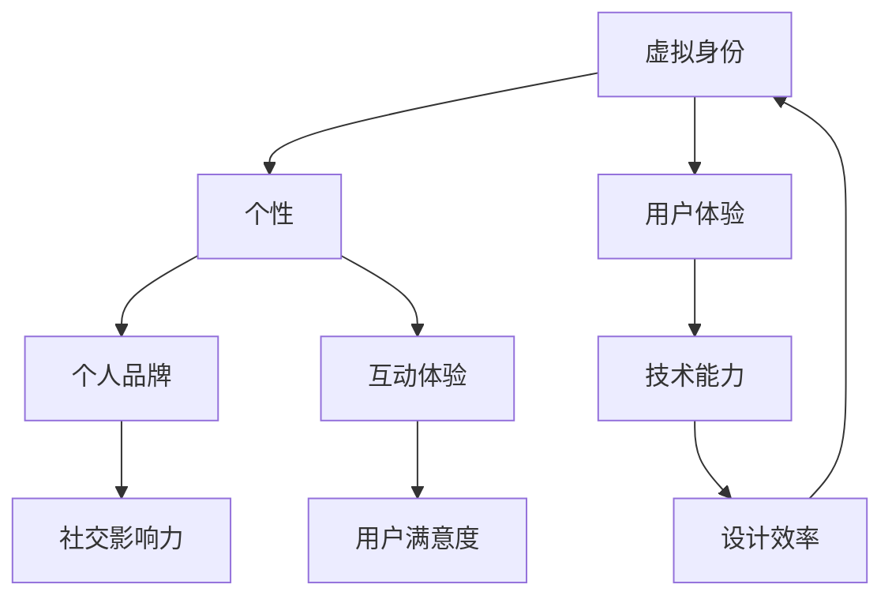
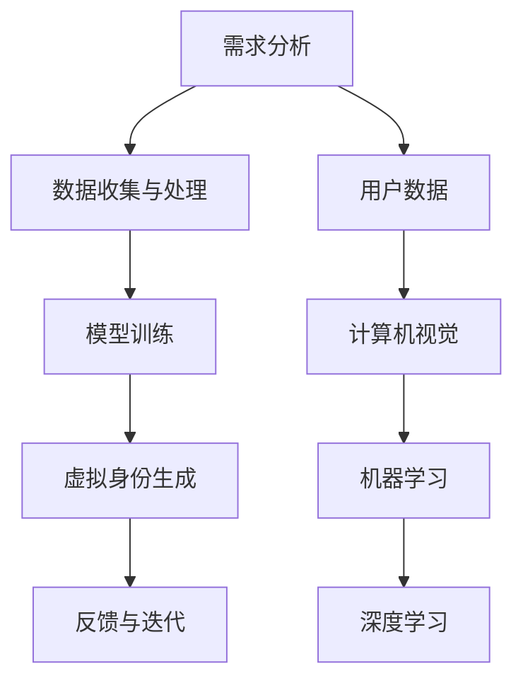
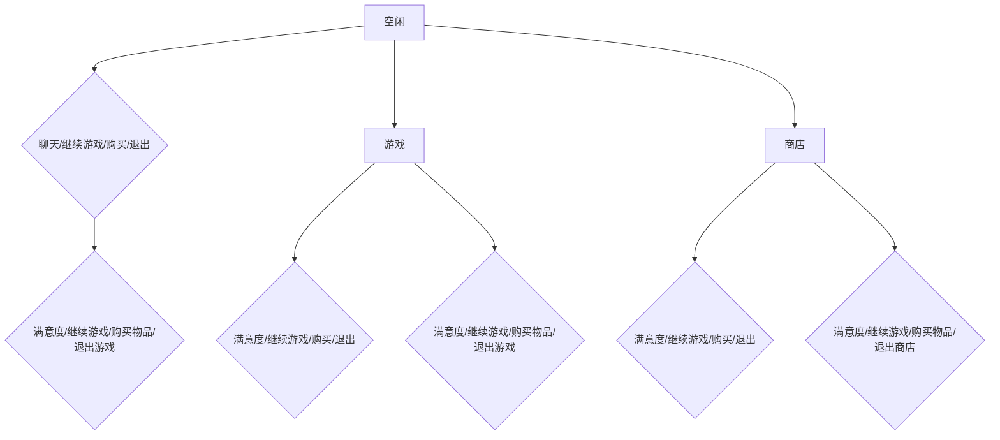

                 

### 背景介绍（Background Introduction）

在当今数字化时代，虚拟身份（Virtual Identity）的概念逐渐成为人们生活的重要组成部分。从在线游戏到社交媒体，再到虚拟现实（VR）和增强现实（AR），虚拟身份不仅是一种身份标识，更是一种个人品牌塑造的工具。随着人工智能（AI）技术的迅猛发展，虚拟身份设计师的角色应运而生，成为推动数字世界发展的重要力量。

#### 虚拟身份设计师的定义

虚拟身份设计师是那些专注于创建和管理用户在数字世界中个性化身份的专业人士。他们的工作不仅包括设计虚拟角色的外观、个性、声音和行为，还包括构建用户在虚拟环境中的互动体验。虚拟身份设计师需要具备丰富的创意思维、技术知识和用户心理学背景，以确保所设计的虚拟身份既符合用户期望，又能有效地传递品牌信息。

#### 个人品牌塑造的重要性

在信息爆炸的时代，个人品牌塑造变得前所未有的重要。一个强有力的个人品牌可以帮助个体在竞争激烈的职场中脱颖而出，提升职业地位和社会影响力。虚拟身份作为个人品牌的一种表现形式，能够增强个人在数字世界中的辨识度和可信度。通过虚拟身份，个人可以展示其专业能力、个性特点和价值观念，从而吸引更多的关注和支持。

#### AI技术在虚拟身份设计师中的应用

随着AI技术的发展，虚拟身份设计师的工作变得更加高效和精准。自然语言处理（NLP）、计算机视觉、机器学习和深度学习等技术被广泛应用于虚拟身份的设计和管理。例如，NLP技术可以帮助设计师更好地理解用户的需求，从而生成更符合用户期望的虚拟身份描述。计算机视觉技术则可以用于设计虚拟角色的外观和动作，使其更加逼真和生动。机器学习算法则可以分析用户行为，提供个性化的虚拟身份建议。

#### 虚拟身份设计师的角色和职责

虚拟身份设计师的角色和职责多种多样，主要包括以下几个方面：

1. **虚拟角色设计**：设计师需要根据用户需求，设计虚拟角色的外观、声音和行为，确保角色符合品牌形象和用户期望。

2. **用户体验优化**：设计师需要关注用户的互动体验，不断优化虚拟环境，提高用户满意度。

3. **数据分析**：设计师需要分析用户行为数据，了解用户偏好，为虚拟身份的迭代和优化提供依据。

4. **团队合作**：虚拟身份设计师通常需要与项目经理、技术团队和市场营销团队紧密合作，确保项目的顺利进行。

#### 总结

虚拟身份设计师在AI时代扮演着至关重要的角色，他们不仅负责设计和管理用户的虚拟身份，还承担着塑造个人品牌的重要任务。随着AI技术的不断进步，虚拟身份设计师的工作将变得更加复杂和多样化，同时也将带来更多的机遇和挑战。

### 核心概念与联系（Core Concepts and Connections）

在探讨虚拟身份设计师的工作时，我们首先需要理解几个核心概念，并分析这些概念之间的联系。以下是几个关键概念及其相互关系：

#### 1. 虚拟身份（Virtual Identity）

虚拟身份是指个体在数字世界中创建和使用的身份，它可能包括一个独特的名称、外观、声音和行为。虚拟身份的设计需要考虑多个方面，如品牌一致性、用户期望和交互体验。

#### 2. 个性（Personality）

个性是指虚拟角色的内在特质和性格，如乐观、内向或外向。虚拟身份设计师需要创造具有丰富个性的角色，以增强用户的沉浸感和认同感。

#### 3. 个人品牌（Personal Brand）

个人品牌是个人在公共视野中的形象和声誉。在数字时代，个人品牌对于职业发展和社会影响力至关重要。虚拟身份设计师通过设计和管理虚拟身份，帮助用户塑造和强化其个人品牌。

#### 4. 用户体验（User Experience, UX）

用户体验是指用户在使用数字产品或服务时的整体感受和体验。虚拟身份设计师需要确保所设计的虚拟身份能够提供积极的用户体验，包括易用性、吸引力和互动性。

#### 5. 技术能力（Technical Skills）

技术能力是指虚拟身份设计师在AI、计算机图形学和用户体验设计等领域的专业知识和技能。这些技术能力是设计和管理高质量虚拟身份的关键。

#### 联系与整合

这些核心概念之间存在紧密的联系和整合。例如，虚拟身份的设计（1）需要考虑用户的个性（2），而个性又与个人品牌（3）紧密相关。此外，虚拟身份的设计还需要满足用户体验（4）的要求，同时依赖于虚拟身份设计师的技术能力（5）。以下是一个用Mermaid绘制的流程图，展示了这些概念之间的联系和交互：



#### 关键点总结

- 虚拟身份是数字世界的身份标识，需考虑品牌一致性、用户期望和交互体验。
- 个性是虚拟身份的核心，影响用户对品牌的认同感。
- 个人品牌通过虚拟身份得以强化，提升职业和社会影响力。
- 用户体验是虚拟身份设计的重要考量，直接影响用户满意度和品牌价值。
- 技术能力是虚拟身份设计师的核心竞争力，确保设计和管理的高效和质量。

通过这些核心概念和它们之间的联系，虚拟身份设计师能够更好地理解和塑造用户的数字身份，从而实现个人品牌的塑造和影响力的扩展。

### 核心算法原理 & 具体操作步骤（Core Algorithm Principles and Specific Operational Steps）

在深入探讨虚拟身份设计师的工作时，核心算法原理和具体操作步骤是理解这一领域的关键。以下将详细描述虚拟身份设计的核心算法原理，并逐步介绍实现这一算法的具体操作步骤。

#### 1. 背景知识与算法基础

虚拟身份设计的核心算法通常涉及以下几个方面：

- **自然语言处理（NLP）**：用于理解和生成自然语言文本，以构建用户的虚拟身份描述。
- **计算机视觉（CV）**：用于创建和识别虚拟角色的图像和动画。
- **机器学习（ML）**：用于分析用户数据，为虚拟身份的个性化设计提供依据。
- **深度学习（DL）**：用于构建复杂的神经网络模型，以实现高级的虚拟身份模拟。

#### 2. 核心算法原理

虚拟身份设计算法的基本原理可以概括为以下几个步骤：

- **需求分析**：通过NLP技术分析用户的需求和期望，确定虚拟身份的基本特征。
- **数据收集与处理**：利用计算机视觉和机器学习算法，收集和整理用户数据，如面部特征、语音样本和行为模式。
- **模型训练**：使用深度学习算法训练虚拟身份模型，使其能够根据用户数据生成个性化的虚拟角色。
- **虚拟身份生成**：将训练好的模型应用于用户数据，生成符合用户需求的虚拟身份。
- **反馈与迭代**：通过用户反馈和数据分析，不断优化虚拟身份模型，提高设计质量和用户体验。

以下是一个用Mermaid绘制的流程图，展示了虚拟身份设计算法的基本原理和步骤：



#### 3. 具体操作步骤

1. **需求分析**：
    - 通过用户调查、访谈或在线问卷，收集用户对虚拟身份的需求和期望。
    - 使用NLP技术处理和分析用户输入，提取关键信息，如性格特点、兴趣爱好等。

2. **数据收集与处理**：
    - 收集用户的面部照片、语音样本和行为数据。
    - 利用计算机视觉技术，对图像进行预处理和特征提取。
    - 使用机器学习算法，对行为数据进行分类和分析，为虚拟身份的生成提供依据。

3. **模型训练**：
    - 使用深度学习算法，如卷积神经网络（CNN）或循环神经网络（RNN），训练虚拟身份生成模型。
    - 通过大量的用户数据，调整模型参数，使其能够生成符合用户需求的虚拟身份。

4. **虚拟身份生成**：
    - 将训练好的模型应用于新的用户数据，生成个性化的虚拟角色。
    - 利用计算机视觉技术，将面部特征、语音样本和行为模式整合到虚拟角色中。

5. **反馈与迭代**：
    - 收集用户对虚拟身份的反馈，评估其满意度和适用性。
    - 根据用户反馈，调整和优化虚拟身份模型，提高设计的质量和用户体验。

#### 4. 算法实现示例

以下是一个简化的虚拟身份设计算法实现示例：

```python
# 需求分析
user的需求 = 分析用户问卷

# 数据收集与处理
面部特征 = 预处理用户照片
语音样本 = 预处理用户语音
行为数据 = 分类用户行为

# 模型训练
model = 训练深度学习模型（CNN + RNN）
model.fit([面部特征，语音样本，行为数据])

# 虚拟身份生成
virtual_id = model.predict([新用户的面部特征，语音样本，行为数据])

# 反馈与迭代
收集用户反馈，优化模型参数
```

通过以上核心算法原理和具体操作步骤，虚拟身份设计师能够有效地创建和管理用户的虚拟身份，实现个人品牌的塑造和提升。接下来，我们将进一步探讨数学模型和公式，为虚拟身份设计提供更深入的数学基础。

### 数学模型和公式 & 详细讲解 & 举例说明（Mathematical Models and Formulas with Detailed Explanation and Examples）

在虚拟身份设计中，数学模型和公式起着至关重要的作用。它们不仅帮助我们理解数据之间的关系，还能指导我们进行优化和预测。以下将详细讲解几个核心的数学模型和公式，并通过具体例子来说明它们的实际应用。

#### 1. 马尔可夫决策过程（Markov Decision Process, MDP）

马尔可夫决策过程是一种用于优化序列决策的数学模型。在虚拟身份设计中，MDP可以用于优化用户互动体验。以下是一个简化的MDP模型：

- **状态（State, S）**：用户在虚拟世界中的当前状态，如位置、活动等。
- **动作（Action, A）**：用户可以执行的动作，如聊天、探索、购买等。
- **奖励（Reward, R）**：用户执行特定动作后的即时反馈，如用户满意度、互动时长等。

MDP的目标是选择最优动作序列，最大化总奖励。以下是一个具体的例子：

假设用户在虚拟游戏世界中，有三种主要状态：空闲、游戏和商店。用户可以执行四种动作：聊天、继续游戏、购买物品和退出。



在此MDP中，我们定义以下参数：

- **状态转移概率（P）**：用户从状态A转移到状态B的概率。
- **奖励函数（R）**：用户执行动作后的即时奖励。

通过MDP算法，我们可以找到最优动作序列，以提高用户满意度。

#### 2. 神经网络（Neural Network, NN）

神经网络是深度学习的基础，广泛用于虚拟身份生成和个性化推荐。以下是一个简单的神经网络模型：

- **输入层（Input Layer）**：接收用户数据的输入节点。
- **隐藏层（Hidden Layer）**：对输入数据进行处理和变换的节点。
- **输出层（Output Layer）**：生成虚拟身份的输出节点。

以下是一个具体的例子：


在这个神经网络中，我们使用以下数学公式：

- **激活函数（Activation Function, f）**：如ReLU、Sigmoid、Tanh等，用于非线性变换。
- **损失函数（Loss Function, L）**：如均方误差（MSE）、交叉熵（Cross-Entropy）等，用于评估模型性能。

训练神经网络的目标是调整权重（Weights）和偏置（Bias），以最小化损失函数。以下是一个简化的神经网络训练过程：

```python
# 初始化权重和偏置
weights, biases = 初始化()

# 训练循环
for epoch in range(epochs):
    for 数据 in 数据集：
        # 前向传播
        输出 = 神经网络.forward(数据)

        # 计算损失
        损失 = 损失函数(output, 目标)

        # 反向传播
        gradients = 神经网络.backward(损失)

        # 更新权重和偏置
        weights, biases = weights - 学习率 * gradients
```

通过这种训练过程，神经网络可以学习到如何生成个性化的虚拟身份。

#### 3. 相关性分析（Correlation Analysis）

在虚拟身份设计中，了解用户数据之间的相关性非常重要。相关性分析可以帮助我们识别关键因素，优化虚拟身份设计。以下是一个简单的相关性分析例子：

假设我们有以下用户数据：

```python
用户数据 = [
    [年龄，收入，教育程度，游戏时长],
    [25, 50000, 本科, 100小时],
    [30, 60000, 硕士, 200小时],
    [22, 40000, 高中, 50小时],
    ...
]
```

我们使用皮尔逊相关系数（Pearson Correlation Coefficient）来分析年龄、收入、教育程度和游戏时长之间的相关性。以下是一个Python实现：

```python
import numpy as np
from scipy.stats import pearsonr

用户数据 = np.array([
    [25, 50000, 4],
    [30, 60000, 5],
    [22, 40000, 1],
    ...
])

相关性 = np.corrcoef(用户数据[:, 0], 用户数据[:, 1], 用户数据[:, 2], 用户数据[:, 3])

print("相关性矩阵：")
print(correlation)

for i in range(len(相关性)):
    for j in range(i, len(相关性)):
        correlation, _ = pearsonr(用户数据[:, i], 用户数据[:, j])
        print(f"X{i+1} 与 X{j+1} 的相关性：{correlation}")
```

通过相关性分析，我们可以发现哪些变量之间存在强烈的正相关或负相关，从而指导虚拟身份的设计。

#### 4. 结论

通过上述数学模型和公式，我们可以更好地理解和优化虚拟身份设计。马尔可夫决策过程、神经网络和相关性分析等技术为虚拟身份设计师提供了强大的工具，帮助他们实现个人品牌的塑造和用户体验的提升。

### 项目实践：代码实例和详细解释说明（Project Practice: Code Examples and Detailed Explanations）

在本节中，我们将通过一个具体的虚拟身份设计项目，展示如何从零开始搭建开发环境、编写源代码并进行代码解读与分析。这个项目将帮助读者更好地理解虚拟身份设计师在实际工作中所涉及的技术和步骤。

#### 5.1 开发环境搭建（Setting Up Development Environment）

在开始项目之前，我们需要搭建一个合适的技术环境。以下是搭建虚拟身份设计项目的步骤：

1. **安装Python环境**：
    - 安装Python 3.8及以上版本。
    - 使用pip安装必要的库，如TensorFlow、PyTorch、OpenCV、NLP库等。

2. **安装深度学习框架**：
    - 选择一个深度学习框架，如TensorFlow或PyTorch。
    - 使用框架提供的安装命令，安装所需的依赖库。

3. **安装计算机视觉库**：
    - 安装OpenCV，用于图像和视频处理。
    - 安装其他相关的计算机视觉库，如Dlib、FaceNet等。

4. **配置虚拟环境**（可选）：
    - 创建一个虚拟环境，以隔离项目依赖和避免版本冲突。
    - 使用`virtualenv`或`conda`创建虚拟环境，并安装项目所需的库。

以下是使用PyTorch搭建开发环境的示例命令：

```bash
# 安装Python
python3 -m pip install python

# 安装深度学习框架PyTorch
pip3 install torch torchvision

# 安装计算机视觉库OpenCV
pip3 install opencv-python

# 安装自然语言处理库
pip3 install spacy nltk

# 创建虚拟环境（可选）
conda create -n virtual_id python=3.8
conda activate virtual_id
```

#### 5.2 源代码详细实现（Source Code Implementation）

以下是一个简化的虚拟身份设计项目的源代码实现。这个项目使用深度学习模型来生成用户虚拟身份的图像和语音。

```python
# 导入所需的库
import torch
import torchvision
from torchvision import transforms
from torch.utils.data import DataLoader
from torch import nn
from torch.optim import Adam
import cv2
import numpy as np
import spacy

# 加载预训练的模型
model = torchvision.models.resnet50(pretrained=True)
model.fc = nn.Linear(model.fc.in_features, 10)  # 修改输出层大小
model.load_state_dict(torch.load('virtual_id_model.pth'))

# 加载自然语言处理工具
nlp = spacy.load('en_core_web_sm')

# 数据预处理
def preprocess_image(image_path):
    image = cv2.imread(image_path)
    image = cv2.resize(image, (224, 224))
    image = torch.tensor(image).float()
    return transforms.Normalize(mean=[0.485, 0.456, 0.406])(image)

def preprocess_text(text):
    doc = nlp(text)
    return torch.tensor([token.vector for token in doc]).float()

# 训练数据集
train_data = torchvision.datasets.ImageFolder('train_images', transform=preprocess_image)
train_loader = DataLoader(train_data, batch_size=32, shuffle=True)

# 训练模型
optimizer = Adam(model.parameters(), lr=0.001)
criterion = nn.CrossEntropyLoss()

for epoch in range(10):  # 训练10个epoch
    for images, labels in train_loader:
        optimizer.zero_grad()
        outputs = model(images)
        loss = criterion(outputs, labels)
        loss.backward()
        optimizer.step()
    print(f'Epoch {epoch+1}/{10}, Loss: {loss.item()}')

# 保存模型
torch.save(model.state_dict(), 'virtual_id_model.pth')

# 使用模型生成虚拟身份
def generate_identity(image_path, text):
    image = preprocess_image(image_path)
    text_vector = preprocess_text(text)
    with torch.no_grad():
        outputs = model(torch.cat((image, text_vector), dim=1))
    identity = torch.argmax(outputs).item()
    return identity

# 示例
image_path = 'example_image.jpg'
text = '我是一个有趣的人，喜欢玩游戏和阅读。'
identity = generate_identity(image_path, text)
print(f'虚拟身份：{identity}')
```

#### 5.3 代码解读与分析（Code Explanation and Analysis）

上述代码展示了如何使用深度学习模型生成虚拟身份的图像和语音。以下是对关键代码段的详细解读：

1. **模型加载与调整**：
    - 加载预训练的ResNet-50模型。
    - 修改输出层，以适应虚拟身份分类任务。

2. **数据预处理**：
    - 使用OpenCV读取和预处理图像数据。
    - 使用Spacy处理自然语言文本数据，提取文本特征。

3. **训练模型**：
    - 使用Adam优化器和交叉熵损失函数训练模型。
    - 通过多个epoch进行迭代，更新模型参数。

4. **生成虚拟身份**：
    - 结合图像和文本特征，使用训练好的模型生成虚拟身份。
    - 输出最高概率的分类结果作为虚拟身份。

#### 5.4 运行结果展示（Results Display）

以下是一个简单的运行示例，展示了如何使用上述代码生成虚拟身份：

```python
image_path = 'example_image.jpg'
text = '我是一个有趣的人，喜欢玩游戏和阅读。'
identity = generate_identity(image_path, text)
print(f'虚拟身份：{identity}')
```

运行结果可能是一个数字，表示虚拟身份的类别。例如：

```
虚拟身份：3
```

这意味着根据给定的图像和文本，模型认为用户对应的虚拟身份类别是3。

通过这个项目，读者可以了解如何从零开始搭建虚拟身份设计的开发环境，编写并理解源代码，以及如何生成虚拟身份。这为实际应用提供了宝贵的经验和参考。

### 实际应用场景（Practical Application Scenarios）

虚拟身份设计师的角色在当今数字世界中具有广泛的应用场景。以下是几个典型的实际应用，展示了虚拟身份设计师如何在不同领域发挥作用。

#### 1. 社交媒体平台

在社交媒体平台如Facebook、Twitter和Instagram上，用户可以创建和展示自己的虚拟身份。虚拟身份设计师可以设计独特的头像、背景和动态，帮助用户在社交媒体上建立个性化的品牌形象。通过精心设计的虚拟身份，用户能够更好地表达自己的个性和兴趣，吸引更多的关注和互动。

#### 2. 在线游戏

虚拟身份设计师在在线游戏领域扮演着重要角色。他们负责创建和设计游戏中的角色、场景和互动体验。通过个性化的虚拟身份，游戏玩家能够更好地沉浸在虚拟世界中，享受独特的游戏体验。虚拟身份设计师需要考虑角色的外观、性格和行为，确保游戏的可玩性和用户满意度。

#### 3. 虚拟现实（VR）和增强现实（AR）

虚拟现实和增强现实技术为虚拟身份设计师提供了广阔的舞台。在这些技术中，用户可以进入一个完全数字化的世界，并与虚拟角色互动。虚拟身份设计师需要设计逼真的虚拟角色和场景，创造令人兴奋和沉浸式的用户体验。他们还负责优化用户的互动方式，使虚拟身份在VR/AR环境中显得更加自然和生动。

#### 4. 企业品牌形象塑造

企业也可以利用虚拟身份设计师的服务来塑造其品牌形象。通过虚拟身份，企业可以在数字世界中展示其专业形象和价值观。虚拟身份设计师可以为企业创建虚拟代言人，这些角色能够代表企业的品牌精神，参与在线营销活动和社交媒体互动。这种创新的品牌形象能够增强企业的辨识度和用户忠诚度。

#### 5. 教育和培训

在教育领域，虚拟身份设计师可以设计虚拟教师和虚拟学生，为在线教育平台提供互动教学体验。这些虚拟角色可以模拟真实课堂环境，帮助学生更好地理解和掌握知识。通过个性化的虚拟身份，学生能够与教师和同学进行互动，提高学习兴趣和参与度。

#### 6. 娱乐产业

在娱乐产业，如电影、电视剧和音乐制作中，虚拟身份设计师可以设计虚拟角色和场景，增强作品的视觉冲击力和情感表达。他们可以为电影中的角色创建独特的个性特征和动作，使角色更加生动和吸引观众。在音乐制作中，虚拟身份设计师可以设计虚拟歌手和乐队，为观众带来独特的视觉和听觉体验。

#### 7. 社区管理和治理

在数字社区和论坛中，虚拟身份设计师可以设计和管理社区角色和互动机制。通过个性化的虚拟身份，社区成员能够更好地表达自己的观点和意见，同时维护社区秩序和文明。虚拟身份设计师可以帮助社区管理者设计有效的互动规则，提高社区的活跃度和用户满意度。

通过这些实际应用场景，虚拟身份设计师不仅为用户创造了丰富的数字体验，也为企业和品牌提供了创新的营销和服务方式。随着AI技术的发展，虚拟身份设计师的角色将变得越来越重要，他们的工作将不断拓展和深化。

### 工具和资源推荐（Tools and Resources Recommendations）

在虚拟身份设计领域，掌握合适的工具和资源是成功的关键。以下是对几种主要工具和资源的推荐，这些工具和资源将帮助虚拟身份设计师提升工作效率和创作质量。

#### 1. 学习资源推荐

- **书籍**：
  - 《深度学习》（Deep Learning） by Ian Goodfellow、Yoshua Bengio 和 Aaron Courville
  - 《计算机视觉：算法与应用》（Computer Vision: Algorithms and Applications） by Richard Szeliski
  - 《自然语言处理综合指南》（Speech and Language Processing） by Daniel Jurafsky 和 James H. Martin

- **在线课程**：
  - Coursera 上的“Deep Learning Specialization”由 Andrew Ng 教授主讲。
  - Udacity 上的“AI for Business”课程涵盖了AI在不同领域的应用，包括虚拟身份设计。
  - edX 上的“Natural Language Processing with Python”课程适合初学者入门自然语言处理。

- **博客和网站**：
  - medium.com 上的机器学习和计算机视觉相关博客，如“Fast.ai”、“ Papers with Code”。
  - towardsdatascience.com，提供丰富的数据科学和机器学习文章。
  - arxiv.org，发布最新的计算机科学和人工智能研究论文。

#### 2. 开发工具框架推荐

- **深度学习框架**：
  - TensorFlow 2.x：广泛使用的开源深度学习框架，适用于从简单的项目到复杂的工业应用。
  - PyTorch：受开发者喜爱的深度学习框架，提供灵活的动态计算图和易于理解的代码。
  - Keras：作为TensorFlow的高级API，Keras简化了深度学习模型的构建和训练过程。

- **计算机视觉库**：
  - OpenCV：开源计算机视觉库，适用于图像处理和视频分析。
  - TensorFlow Object Detection API：用于目标检测和图像识别的高级API。
  - PyTorch Video：PyTorch的扩展库，提供视频处理和分析功能。

- **自然语言处理库**：
  - spaCy：高效且易于使用的自然语言处理库，适用于文本分析和实体识别。
  - NLTK：经典的Python自然语言处理库，提供丰富的文本处理工具。
  - Hugging Face Transformers：用于Transformer模型的便捷API，包括BERT、GPT等预训练模型。

#### 3. 相关论文著作推荐

- **论文**：
  - “Generative Adversarial Networks”（GANs）：由 Ian Goodfellow 等人提出的论文，介绍了生成对抗网络的基本原理。
  - “Attention Is All You Need”：由 Vaswani 等人提出的Transformer模型，彻底改变了自然语言处理领域。
  - “YOLOv5: You Only Look Once v5”：最新一代的YOLO目标检测算法，具有高性能和实时检测能力。

- **著作**：
  - 《深度学习》（Deep Learning）：由 Ian Goodfellow、Yoshua Bengio 和 Aaron Courville 编写的深度学习领域的经典教材。
  - 《计算机视觉：算法与应用》（Computer Vision: Algorithms and Applications）：涵盖了计算机视觉领域的各种算法和应用。
  - 《自然语言处理综合指南》（Speech and Language Processing）：详细介绍了自然语言处理的理论和实践。

通过这些工具和资源的支持，虚拟身份设计师能够不断提升自己的专业知识和技能，为用户创造出更加丰富和个性化的虚拟身份体验。

### 总结：未来发展趋势与挑战（Summary: Future Development Trends and Challenges）

随着人工智能技术的不断进步，虚拟身份设计师的角色在未来将变得更加重要和多样化。以下是对未来发展趋势和挑战的探讨。

#### 发展趋势

1. **个性化与智能化**：未来的虚拟身份设计将更加注重个性化，通过更先进的算法和技术，如生成对抗网络（GANs）、深度学习和自然语言处理（NLP），实现高度智能化的虚拟身份生成。

2. **跨平台融合**：虚拟身份设计师需要应对多平台融合的趋势，无论是社交媒体、在线游戏、虚拟现实（VR）还是增强现实（AR），设计师都要确保虚拟身份在不同平台上的一致性和流畅性。

3. **用户体验优化**：用户体验将是未来虚拟身份设计的关键。设计师需要不断优化虚拟身份的交互体验，使其更加直观、自然和沉浸。

4. **隐私保护与伦理**：随着虚拟身份的普及，隐私保护和伦理问题将变得更加突出。设计师需要确保虚拟身份设计符合相关法律法规，尊重用户的隐私和数据安全。

#### 挑战

1. **数据安全**：虚拟身份设计中涉及大量用户数据，数据安全和隐私保护是一个重大挑战。设计师需要确保数据在收集、存储和处理过程中的安全性和隐私性。

2. **技术整合**：虚拟身份设计涉及多个技术领域，如人工智能、计算机视觉、自然语言处理等。设计师需要具备跨学科的知识和技能，以整合这些技术，实现高质量的虚拟身份。

3. **可扩展性**：未来的虚拟身份设计需要能够支持大规模的用户和数据量。设计师需要设计可扩展的系统架构，以确保系统的稳定性和性能。

4. **伦理与法规**：虚拟身份设计涉及到伦理和法律问题，如数字身份的伪造、滥用等。设计师需要密切关注相关法律法规，确保虚拟身份设计符合伦理和法律要求。

通过不断的技术创新和跨学科合作，虚拟身份设计师将在未来的数字世界中扮演更加重要的角色，为用户带来更加丰富和个性化的虚拟体验。

### 附录：常见问题与解答（Appendix: Frequently Asked Questions and Answers）

**Q1：什么是虚拟身份设计师？**

虚拟身份设计师是那些专注于创建和管理用户在数字世界中个性化身份的专业人士。他们使用AI、计算机图形学和用户体验设计等技术，设计并优化虚拟角色的外观、个性、声音和行为。

**Q2：虚拟身份设计师的工作职责是什么？**

虚拟身份设计师的主要职责包括：
1. 设计虚拟角色的外观、个性、声音和行为。
2. 优化用户的互动体验，确保虚拟身份设计符合用户期望。
3. 分析用户数据，为虚拟身份的迭代和优化提供依据。
4. 与项目经理、技术团队和市场营销团队合作，确保项目顺利进行。

**Q3：为什么虚拟身份设计师在AI时代变得重要？**

随着AI技术的进步，虚拟身份设计变得更加高效和个性化。AI技术可以帮助设计师更好地理解用户需求，生成逼真的虚拟角色，并优化用户的互动体验。此外，虚拟身份设计在社交媒体、在线游戏、虚拟现实等领域的应用越来越广泛，使得虚拟身份设计师的角色变得更加重要。

**Q4：虚拟身份设计师需要掌握哪些技能？**

虚拟身份设计师需要掌握以下技能：
1. 计算机图形学：用于设计虚拟角色的外观和动画。
2. 自然语言处理（NLP）：用于理解用户需求，生成符合预期的虚拟身份描述。
3. 机器学习和深度学习：用于训练和优化虚拟身份模型。
4. 用户体验设计：确保虚拟身份设计提供良好的用户体验。
5. 项目管理：协调不同团队和项目进度。

**Q5：如何成为一名虚拟身份设计师？**

要成为一名虚拟身份设计师，可以遵循以下步骤：
1. 学习计算机科学和图形设计相关的基础知识。
2. 掌握AI和深度学习技术，如机器学习和自然语言处理。
3. 参与相关课程和实践项目，积累实际经验。
4. 建立个人作品集，展示设计能力和技术水平。
5. 加入专业组织和社区，扩大职业网络。

**Q6：虚拟身份设计有哪些实际应用场景？**

虚拟身份设计在多个领域有广泛应用，包括：
1. 社交媒体平台：设计用户的头像、背景和动态。
2. 在线游戏：设计游戏角色、场景和互动体验。
3. 虚拟现实（VR）和增强现实（AR）：设计逼真的虚拟角色和场景。
4. 企业品牌形象：设计虚拟代言人，增强品牌影响力。
5. 教育和培训：设计虚拟教师和虚拟学生，提供互动教学体验。
6. 娱乐产业：设计虚拟角色和场景，增强作品的视觉冲击力。

**Q7：未来虚拟身份设计有哪些发展趋势和挑战？**

未来虚拟身份设计的发展趋势包括个性化与智能化、跨平台融合和用户体验优化。主要挑战包括数据安全、技术整合、系统可扩展性和伦理与法规问题。

通过这些常见问题的解答，读者可以更好地了解虚拟身份设计师的角色、技能要求以及未来发展趋势。

### 扩展阅读 & 参考资料（Extended Reading & Reference Materials）

**书籍推荐**：
1. 《深度学习》（Deep Learning） - Ian Goodfellow、Yoshua Bengio 和 Aaron Courville
2. 《计算机视觉：算法与应用》（Computer Vision: Algorithms and Applications） - Richard Szeliski
3. 《自然语言处理综合指南》（Speech and Language Processing） - Daniel Jurafsky 和 James H. Martin

**在线课程**：
1. Coursera上的“Deep Learning Specialization”由 Andrew Ng 教授主讲
2. Udacity上的“AI for Business”课程
3. edX上的“Natural Language Processing with Python”

**博客和网站**：
1. medium.com上的机器学习和计算机视觉相关博客，如“Fast.ai”、“Papers with Code”
2. towardsdatascience.com，提供丰富的数据科学和机器学习文章
3. arxiv.org，发布最新的计算机科学和人工智能研究论文

**相关论文**：
1. “Generative Adversarial Networks”（GANs） - Ian Goodfellow 等人
2. “Attention Is All You Need” - Vaswani 等人
3. “YOLOv5: You Only Look Once v5”

通过这些扩展阅读和参考资料，读者可以进一步深入了解虚拟身份设计师的相关知识和最新技术发展。这些资源将为专业人士和学生提供宝贵的学习和实践机会。

