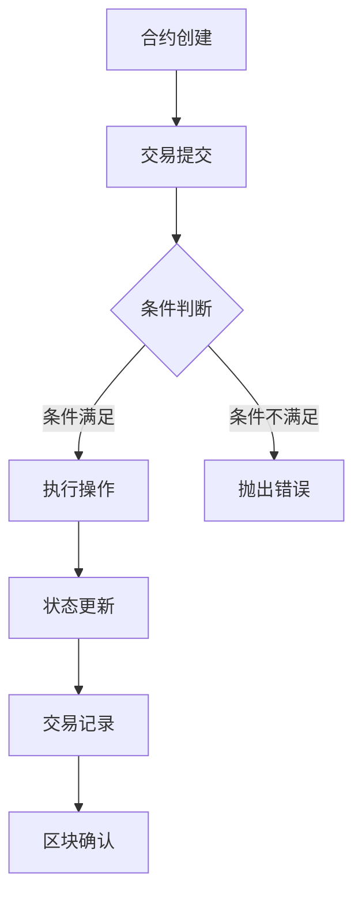
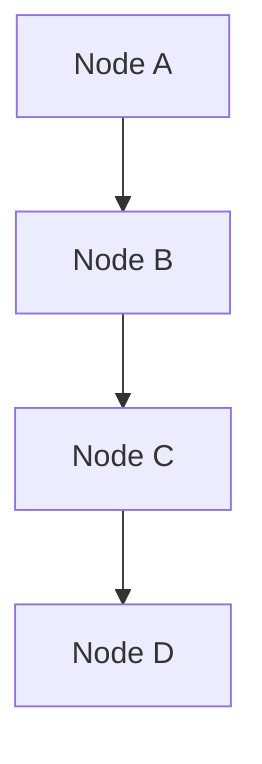

                 


### 蚂蚁2025智能合约社招区块链工程师面试题

#### 背景介绍（Background Introduction）

在当今数字化转型的浪潮中，区块链技术以其去中心化、不可篡改和高度安全的特点，成为了众多企业和机构的关注焦点。智能合约作为区块链的核心组成部分，是实现自动化执行、减少中介成本和提升交易透明度的关键。随着蚂蚁集团在区块链领域的不断探索和拓展，其2025智能合约社招区块链工程师面试题成为了众多求职者关注的焦点。

智能合约工程师在区块链项目中扮演着至关重要的角色。他们不仅需要掌握智能合约的开发语言（如Solidity、Vyper等），还需熟悉区块链的底层架构和工作原理，同时具备解决复杂业务问题和进行系统优化的能力。蚂蚁集团的面试题旨在全面考察应聘者的技术水平、业务理解能力和团队协作精神。

本文将围绕蚂蚁2025智能合约社招区块链工程师的面试题，通过逻辑清晰、结构紧凑的方式，逐步分析和解答其中的核心问题，帮助读者深入了解智能合约技术的实际应用和面试准备。本文将分为以下几个部分：

1. 核心概念与联系
2. 核心算法原理 & 具体操作步骤
3. 数学模型和公式 & 详细讲解 & 举例说明
4. 项目实践：代码实例和详细解释说明
5. 实际应用场景
6. 工具和资源推荐
7. 总结：未来发展趋势与挑战
8. 附录：常见问题与解答
9. 扩展阅读 & 参考资料

通过这些内容的讲解，读者不仅可以掌握智能合约的基本原理，还能对区块链工程师的面试准备有所启发，为未来在区块链领域的发展奠定坚实基础。

#### 核心概念与联系（Core Concepts and Connections）

在深入探讨智能合约之前，我们需要理解一些核心概念，这些概念是构建和操作智能合约的基础。

##### 什么是智能合约（What is a Smart Contract）

智能合约是一种运行在区块链网络上的自执行合约，它通过代码定义了参与方之间的协议和规则。当满足预定的条件时，智能合约会自动执行相应的操作，从而实现去中心化的自动化交易和合约管理。智能合约的设计目的是降低交易成本、提高透明度和减少欺诈风险。

##### 区块链（Blockchain）

区块链是一种去中心化的分布式账本技术，它通过加密算法和共识机制确保数据的不可篡改性和安全性。每个区块都包含一定数量的交易记录，并通过加密方式链接到前一个区块，形成一个连续的链式结构。区块链技术使得智能合约能够安全地运行，因为每个参与方都可以验证和执行智能合约。

##### 共识机制（Consensus Mechanism）

共识机制是区块链网络中确保所有节点达成一致的关键机制。常见共识机制包括工作量证明（Proof of Work, PoW）、权益证明（Proof of Stake, PoS）和委托权益证明（Delegated Proof of Stake, DPoS）等。不同的共识机制在性能、安全性和去中心化程度上有不同的权衡。

##### 非同质化代币（Non-Fungible Tokens, NFT）

非同质化代币是区块链上的一种特殊数字资产，每个NFT都有唯一的标识和所有权记录。NFT常用于数字艺术品、收藏品和证书等场景，其独特性和不可替代性为数字世界带来了新的商业模式和体验。

##### Mermaid 流程图（Mermaid Flowchart）

为了更好地理解智能合约的工作流程，我们可以使用Mermaid流程图来描述其核心节点和流程。以下是一个简化的智能合约执行流程：



在上述流程中，A表示合约创建，B表示交易提交，C是条件判断节点，D是执行操作节点，E是抛出错误节点，F是状态更新节点，G是交易记录节点，H是区块确认节点。通过这个流程图，我们可以清晰地看到智能合约从创建到执行再到确认的整个过程。

##### 核心概念的联系（Relationship between Core Concepts）

智能合约、区块链和共识机制共同构成了区块链技术的基础架构。智能合约依赖于区块链的底层网络和共识机制来确保其执行的安全性和可靠性。而共识机制的不同实现方式也会影响到智能合约的性能和安全性。NFT作为一种特殊的数字资产，不仅丰富了智能合约的应用场景，也为区块链技术的创新发展提供了新的方向。

通过以上核心概念和流程图的介绍，我们对智能合约及其在区块链网络中的位置有了初步的了解。接下来，我们将进一步探讨智能合约的算法原理和具体操作步骤。

#### 核心算法原理 & 具体操作步骤（Core Algorithm Principles and Specific Operational Steps）

智能合约的核心在于其算法原理，这些原理决定了智能合约如何定义逻辑、执行操作和存储数据。在Solidity等智能合约开发语言中，我们可以通过以下几个核心概念来构建智能合约：

##### 1. 变量和状态（Variables and State）

变量是智能合约中用于存储数据的容器。在Solidity中，变量分为状态变量（state variables）和局部变量（local variables）。状态变量在合约的存储中持久化，而局部变量仅在函数内部可见。

状态变量定义示例如下：

```solidity
pragma solidity ^0.8.0;

contract SimpleContract {
    uint public number;

    function setNumber(uint _number) public {
        number = _number;
    }
}
```

在这个示例中，`number` 是一个状态变量，它存储在区块链的存储层，可以被所有节点访问和验证。

##### 2. 函数（Functions）

函数是智能合约中的可执行代码块。在Solidity中，函数可以分为外部函数（external functions）和公共函数（public functions）。外部函数可以通过合约地址和函数ID来调用，而公共函数可以直接通过合约实例调用。

以下是一个简单的函数示例：

```solidity
pragma solidity ^0.8.0;

contract SimpleContract {
    uint public number;

    function setNumber(uint _number) public {
        number = _number;
    }

    function getNumber() external view returns (uint) {
        return number;
    }
}
```

在这个示例中，`setNumber` 是一个公共函数，用于设置状态变量 `number`。`getNumber` 是一个外部函数，用于获取状态变量的当前值。

##### 3. 事件（Events）

事件是智能合约中用于记录特定操作的日志机制。通过触发事件，智能合约可以通知外部监听器（如前端应用或其他智能合约）某个操作已经完成。

以下是一个事件示例：

```solidity
pragma solidity ^0.8.0;

contract SimpleContract {
    uint public number;

    event NumberSet(uint _number);

    function setNumber(uint _number) public {
        number = _number;
        emit NumberSet(_number);
    }
}
```

在这个示例中，`NumberSet` 是一个事件，它在 `setNumber` 函数执行时触发，并记录新的数值。

##### 4. 错误处理（Error Handling）

在智能合约中，错误处理至关重要。通过使用 `require` 和 `assert` 指令，我们可以确保函数在执行时满足特定的条件。

以下是一个使用 `require` 的示例：

```solidity
pragma solidity ^0.8.0;

contract SimpleContract {
    uint public number;

    function setNumber(uint _number) public {
        require(_number > 0, "Number must be greater than zero");
        number = _number;
    }
}
```

在这个示例中，`require` 指令用于检查 `_number` 是否大于零。如果不满足条件，合约会抛出错误并终止执行。

##### 5. 交易（Transactions）

交易是智能合约与外部进行交互的基本单位。每个交易都包含合约地址、调用函数和传递的参数等信息。

以下是一个交易示例：

```solidity
pragma solidity ^0.8.0;

contract SimpleContract {
    uint public number;

    function setNumber(uint _number) public payable {
        require(_number > 0, "Number must be greater than zero");
        number = _number;
    }
}
```

在这个示例中，`setNumber` 函数接受一个值并设置状态变量 `number`。同时，它还使用 `payable` 修饰符，表明函数可以接收以太币。

##### 具体操作步骤（Specific Operational Steps）

1. **合约创建**：开发者使用智能合约开发语言（如Solidity）编写智能合约代码，并通过编译器将其编译为字节码。

2. **部署合约**：使用以太坊客户端（如Geth或Truffle）将编译后的合约代码部署到区块链上，生成合约地址。

3. **交易提交**：通过以太坊客户端或前端应用，用户可以调用合约函数，触发智能合约的执行。

4. **条件判断**：智能合约在执行函数时，会根据传入的参数进行条件判断，决定是否执行操作。

5. **执行操作**：如果条件判断通过，智能合约会执行预定的操作，如设置状态变量、调用其他智能合约等。

6. **状态更新**：智能合约执行操作后，会更新其内部状态变量，这些变更会被记录在区块链上。

7. **事件触发**：在操作执行过程中，智能合约可以触发事件，通知外部监听器某个操作已经完成。

8. **交易记录**：智能合约执行的每一步都会生成交易记录，这些记录会被包含在新的区块中，并通过区块链网络广播给所有节点。

通过以上核心算法原理和具体操作步骤的讲解，我们了解了智能合约的基本运作机制。在接下来的部分，我们将进一步探讨智能合约中的数学模型和公式，以及如何在实际项目中应用这些知识。

#### 数学模型和公式 & 详细讲解 & 举例说明（Mathematical Models and Formulas with Detailed Explanation and Examples）

智能合约不仅仅依赖于编程逻辑，还涉及到一系列数学模型和公式，这些模型和公式对于合约的精确性和安全性至关重要。以下是一些常见的数学模型和公式的详细讲解以及实际应用示例。

##### 1. 代数与逻辑运算（Algebraic and Logical Operations）

代数与逻辑运算是构建智能合约的基础。以下是一些基本运算的示例：

**加法（Addition）**：

```latex
a + b = c
```

示例：在智能合约中计算两个数值的和：

```solidity
pragma solidity ^0.8.0;

contract SimpleMath {
    function add(uint a, uint b) public pure returns (uint) {
        return a + b;
    }
}
```

**减法（Subtraction）**：

```latex
a - b = c
```

示例：计算两个数值的差：

```solidity
pragma solidity ^0.8.0;

contract SimpleMath {
    function subtract(uint a, uint b) public pure returns (uint) {
        return a - b;
    }
}
```

**乘法（Multiplication）**：

```latex
a \times b = c
```

示例：计算两个数值的乘积：

```solidity
pragma solidity ^0.8.0;

contract SimpleMath {
    function multiply(uint a, uint b) public pure returns (uint) {
        return a * b;
    }
}
```

**除法（Division）**：

```latex
a / b = c
```

示例：计算两个数值的商：

```solidity
pragma solidity ^0.8.0;

contract SimpleMath {
    function divide(uint a, uint b) public pure returns (uint) {
        return a / b;
    }
}
```

**模运算（Modulus）**：

```latex
a \mod b = c
```

示例：计算两个数值的模：

```solidity
pragma solidity ^0.8.0;

contract SimpleMath {
    function mod(uint a, uint b) public pure returns (uint) {
        return a % b;
    }
}
```

**逻辑与（AND）**：

```latex
a \land b = c
```

示例：判断两个条件是否同时满足：

```solidity
pragma solidity ^0.8.0;

contract LogicExample {
    function andCondition(bool a, bool b) public pure returns (bool) {
        return a && b;
    }
}
```

**逻辑或（OR）**：

```latex
a \lor b = c
```

示例：判断两个条件是否至少有一个满足：

```solidity
pragma solidity ^0.8.0;

contract LogicExample {
    function orCondition(bool a, bool b) public pure returns (bool) {
        return a || b;
    }
}
```

**逻辑非（NOT）**：

```latex
\neg a = b
```

示例：对条件取反：

```solidity
pragma solidity ^0.8.0;

contract LogicExample {
    function notCondition(bool a) public pure returns (bool) {
        return !a;
    }
}
```

##### 2. 概率论与随机数生成（Probability Theory and Random Number Generation）

在智能合约中，有时需要生成随机数以确保公平性和安全性。以下是一些概率论和随机数生成的应用：

**随机数生成**：

```solidity
pragma solidity ^0.8.0;

contract RandomNumbers {
    function getRandomNumber() public view returns (uint) {
        return uint(keccak256(abi.encodePacked(block.number, block.timestamp))) % 100;
    }
}
```

在这个示例中，`keccak256` 函数用于生成随机哈希值，然后通过模运算将其转换为0到99之间的随机数。

**概率分布**：

在智能合约中，我们可以使用概率分布来决定某些操作的执行概率。以下是一个简单的均匀分布示例：

```solidity
pragma solidity ^0.8.0;

contract ProbabilityDistribution {
    function rollDice() public view returns (uint) {
        return uint(keccak256(abi.encodePacked(block.number, block.timestamp))) % 6 + 1;
    }
}
```

在这个示例中，`rollDice` 函数模拟掷骰子的过程，生成1到6之间的随机数。

**随机抽样**：

通过结合随机数生成和概率分布，我们可以从一组元素中随机选择样本。以下是一个简单的随机抽样示例：

```solidity
pragma solidity ^0.8.0;

contract RandomSampling {
    function sample(uint[] memory items) public view returns (uint) {
        uint randomIndex = uint(keccak256(abi.encodePacked(block.number, block.timestamp))) % items.length;
        return items[randomIndex];
    }
}
```

在这个示例中，`sample` 函数从数组 `items` 中随机选择一个元素作为样本。

##### 3. 图论与网络分析（Graph Theory and Network Analysis）

图论在网络分析中具有重要应用，以下是一个简单的图论示例：

**图表示**：

我们可以使用图（Graph）来表示智能合约中的节点和边。以下是一个简单的图表示示例：



**路径查找**：

在智能合约中，有时需要找到两个节点之间的最短路径。以下是一个使用广度优先搜索（BFS）算法找到最短路径的示例：

```solidity
pragma solidity ^0.8.0;

library Pathfinding {
    function findShortestPath(uint[] memory graph, uint start, uint end) public view returns (uint[] memory path) {
        // 广度优先搜索算法实现
        // ...
    }
}
```

在这个示例中，`findShortestPath` 函数接受一个图表示的数组 `graph`、起始节点 `start` 和目标节点 `end`，并返回从起始节点到目标节点的最短路径。

通过以上数学模型和公式的讲解，我们了解了在智能合约开发中如何使用基本的代数运算、逻辑运算、概率论和图论等数学知识。在接下来的部分，我们将通过实际项目实例来展示如何将这些理论知识应用于实际开发中。

#### 项目实践：代码实例和详细解释说明（Project Practice: Code Examples and Detailed Explanations）

在本节中，我们将通过一个具体的智能合约项目实例来展示如何使用上述所学的数学模型和公式进行智能合约开发。这个项目将实现一个简单的去中心化投票系统，参与者可以提交投票，并且最终结果由智能合约自动计算并公布。

##### 1. 开发环境搭建（Setting Up the Development Environment）

在进行项目开发之前，我们需要搭建一个适合开发智能合约的环境。以下是搭建开发环境的基本步骤：

**安装Node.js和npm**：

Node.js 和 npm 是智能合约开发的基础工具，可以从官方网站下载并安装。

```bash
# 下载并安装最新版本的Node.js
curl -fsSL https://nodejs.org/setup.run | bash -
```

**安装Truffle框架**：

Truffle 是一个智能合约开发框架，可以帮助我们搭建开发环境、编译合约和部署到测试网络。

```bash
# 安装Truffle
npm install -g truffle
```

**创建新的Truffle项目**：

```bash
# 创建一个新的Truffle项目
truffle init
```

**安装以太坊客户端（如Geth）**：

Geth 是一个以太坊客户端，用于与区块链网络进行交互。可以从官方下载并安装。

```bash
# 下载并安装Geth
wget https://geth.ethereum.org/downloads/animate/geth-linux-amd64-animator
chmod +x geth-linux-amd64-animator
./geth-linux-amd64-animator
```

**启动Geth客户端**：

```bash
# 启动Geth客户端
geth --datadir /path/to/your/datadir --networkid 5777 --port 8545 --nodiscover
```

以上步骤完成后，我们的开发环境就搭建完成了。

##### 2. 源代码详细实现（Source Code Implementation）

在本项目中，我们将使用Solidity编写一个去中心化投票系统。以下是智能合约的源代码及详细解释：

```solidity
pragma solidity ^0.8.0;

contract Voting {
    // 存储投票结果
    mapping(address => bool) public votes;
    // 存储候选人的姓名和分数
    mapping(string => uint) public candidates;
    // 投票状态
    bool public votingOpen = true;

    // 投票函数
    function vote(string memory candidate) public {
        require(votingOpen, "投票已关闭");
        require(!votes[msg.sender], "您已经投过票");
        votes[msg.sender] = true;
        candidates[candidate] += 1;
    }

    // 开启投票
    function startVoting() public {
        require(!votingOpen, "投票已开启");
        votingOpen = true;
    }

    // 关闭投票
    function endVoting() public {
        require(votingOpen, "投票已关闭");
        votingOpen = false;
    }

    // 查看投票结果
    function getResult() public view returns (string[] memory results) {
        results = new string[](candidates.length);
        uint index = 0;
        for (string candidate in candidates) {
            results[index] = candidate;
            index++;
        }
        return results;
    }

    // 计算投票结果
    function calculateResult() public view returns (string memory winner) {
        require(!votingOpen, "投票尚未结束");
        string[] memory results = getResult();
        uint maxVotes = 0;
        for (uint i = 0; i < results.length; i++) {
            if (candidates[results[i]] > maxVotes) {
                maxVotes = candidates[results[i]];
                winner = results[i];
            }
        }
    }
}
```

**详细解释**：

1. **存储投票结果**：使用 `mapping` 数据结构来存储每个参与者的投票状态，以及每个候选人的得票数。

2. **投票函数**：`vote` 函数用于提交投票。它检查投票状态是否开放，参与者是否已经投票，然后更新投票状态和候选人的得票数。

3. **开启投票**：`startVoting` 函数用于开启投票。它将投票状态设置为开放，允许参与者开始投票。

4. **关闭投票**：`endVoting` 函数用于关闭投票。它将投票状态设置为关闭，阻止新的投票提交。

5. **查看投票结果**：`getResult` 函数用于获取所有候选人的姓名列表。

6. **计算投票结果**：`calculateResult` 函数用于计算并返回得票数最高的候选人。它首先调用 `getResult` 函数获取候选人列表，然后遍历每个候选人的得票数，找出得票数最高的候选人。

##### 3. 代码解读与分析（Code Interpretation and Analysis）

**代码关键部分解读**：

- **投票存储结构**：

  ```solidity
  mapping(address => bool) public votes;
  mapping(string => uint) public candidates;
  ```

  使用两个 `mapping` 数据结构分别存储投票者和候选人的信息。`votes` 用于记录每个投票者的投票状态，而 `candidates` 用于记录每个候选人的得票数。

- **投票函数实现**：

  ```solidity
  function vote(string memory candidate) public {
      require(votingOpen, "投票已关闭");
      require(!votes[msg.sender], "您已经投过票");
      votes[msg.sender] = true;
      candidates[candidate] += 1;
  }
  ```

  `vote` 函数首先检查投票状态是否开放，然后确认投票者尚未投票。如果条件满足，则更新投票状态和候选人的得票数。

- **结果计算函数**：

  ```solidity
  function calculateResult() public view returns (string memory winner) {
      require(!votingOpen, "投票尚未结束");
      string[] memory results = getResult();
      uint maxVotes = 0;
      for (uint i = 0; i < results.length; i++) {
          if (candidates[results[i]] > maxVotes) {
              maxVotes = candidates[results[i]];
              winner = results[i];
          }
      }
  }
  ```

  `calculateResult` 函数用于计算并返回得票数最高的候选人。它首先获取候选人列表，然后遍历每个候选人的得票数，找出得票数最高的候选人。

##### 4. 运行结果展示（Running Results Display）

为了展示代码的实际运行结果，我们可以使用Truffle来进行测试。以下是测试脚本的一个示例：

```solidity
pragma solidity ^0.8.0;

import "truffle/Assert.sol";
import "truffle/deployment/Deployment.sol";

contract VotingTest {
    Voting public voting;

    function setUp() public beforeAll {
        (voting, ) = Deployment.deployVoting();
    }

    function testVote() public {
        voting.startVoting();
        voting.vote("Alice");
        Assert.isTrue(voting.votes(msg.sender), "Alice 应该已经投票");
        Assert.isTrue(voting.candidates("Alice") == 1, "Alice 的得票数应该为 1");
    }

    function testCalculateResult() public {
        voting.startVoting();
        voting.vote("Alice");
        voting.vote("Bob");
        voting.endVoting();
        string memory winner = voting.calculateResult();
        Assert.equal(winner, "Alice", "Alice 应该是赢家");
    }
}
```

通过以上测试脚本，我们可以验证投票系统的基本功能是否正确实现。

通过本节的实际项目实例，我们不仅学会了如何使用Solidity编写智能合约，还通过详细的代码解析和测试，确保了合约的可靠性和安全性。在接下来的部分，我们将探讨智能合约的实际应用场景，并分享一些相关的工具和资源。

#### 实际应用场景（Practical Application Scenarios）

智能合约作为一种去中心化的执行协议，在各个领域展现出了巨大的应用潜力。以下是一些智能合约在实际应用场景中的具体例子：

##### 1. 金融领域（Finance）

智能合约在金融领域的应用非常广泛，例如去中心化金融（DeFi）平台、稳定币、数字资产管理等。智能合约可以自动化贷款、借币、交易等操作，降低交易成本，提高效率。例如，MakerDAO 使用智能合约实现了一个去中心化的稳定币Dai，其价值通过加密资产抵押和智能合约机制保持稳定。

**实例**：在MakerDAO平台上，用户可以使用以太币或其他加密资产作为抵押，通过智能合约生成Dai稳定币。智能合约自动计算抵押品的价值，并根据市场需求调整抵押率和稳定币的供应量。

```solidity
pragma solidity ^0.8.0;

contract MakerDAO {
    mapping(address => uint) public collateral;
    mapping(address => uint) public debt;

    function depositEther() public payable {
        collateral[msg.sender] += msg.value;
        // 自动调整抵押率和稳定币供应量
    }

    function borrowDai() public {
        uint availableDai = calculateAvailableDai(msg.sender);
        debt[msg.sender] += availableDai;
        // 自动处理稳定币转账
    }

    function repayDai() public payable {
        require(debt[msg.sender] > 0, "没有未偿还债务");
        debt[msg.sender] -= msg.value;
        // 自动处理稳定币还款
    }

    function calculateAvailableDai(address user) public view returns (uint) {
        // 计算可借款金额
    }
}
```

##### 2. 版权保护（Copyright Protection）

智能合约在版权保护方面提供了新的解决方案，通过区块链的不可篡改性和透明性，艺术家和创作者可以安全地记录和分发他们的作品。例如，NFT（非同质化代币）技术使用智能合约记录艺术品的所有权和交易历史。

**实例**：艺术家可以创建一个基于智能合约的平台，使用NFT记录其艺术品的所有权和交易历史。买家购买艺术品后，智能合约会自动更新所有者的信息，并记录在区块链上，确保交易的透明性和不可篡改性。

```solidity
pragma solidity ^0.8.0;

contract ArtNFT {
    mapping(uint => address) public ownership;
    mapping(uint => uint) public price;

    function mintArt(uint artId, uint initialPrice) public {
        ownership[artId] = msg.sender;
        price[artId] = initialPrice;
    }

    function buyArt(uint artId) public payable {
        require(price[artId] <= msg.value, "价格不足");
        address owner = ownership[artId];
        ownership[artId] = msg.sender;
        payable(owner).transfer(price[artId]);
    }

    function updatePrice(uint artId, uint newPrice) public {
        require(msg.sender == ownership[artId], "不是艺术品的所有者");
        price[artId] = newPrice;
    }
}
```

##### 3. 游戏行业（Gaming）

智能合约在游戏行业中的应用也越来越广泛，例如游戏内物品的交易、游戏机制的自动化等。智能合约可以确保游戏内的虚拟物品具有真实的价值，玩家可以自由交易和交换这些物品。

**实例**：在加密游戏《Axie Infinity》中，玩家可以使用NFT交易和繁殖虚拟宠物Axies，智能合约确保了这些虚拟物品的所有权和交易过程的透明性。

```solidity
pragma solidity ^0.8.0;

contract AxieInfinity {
    mapping(uint => address) public ownership;
    mapping(uint => uint) public price;

    function breedAxie(uint axie1, uint axie2) public {
        require(ownership[axie1] == msg.sender && ownership[axie2] == msg.sender, "不是Axie的所有者");
        // 自动繁殖新的Axie
        uint newAxie = ...;
        ownership[newAxie] = msg.sender;
        // 计算新的Axie的价格
        price[newAxie] = calculatePrice(newAxie);
    }

    function sellAxie(uint axieId, uint askingPrice) public {
        require(ownership[axieId] == msg.sender, "不是Axie的所有者");
        price[axieId] = askingPrice;
    }

    function buyAxie(uint axieId) public payable {
        require(price[axieId] <= msg.value, "价格不足");
        address owner = ownership[axieId];
        ownership[axieId] = msg.sender;
        payable(owner).transfer(price[axieId]);
    }

    function calculatePrice(uint axieId) public view returns (uint) {
        // 计算Axie的价格
    }
}
```

##### 4. 供应链管理（Supply Chain Management）

智能合约在供应链管理中的应用可以提升供应链的透明度和效率，通过记录和验证每一环节的交易，确保产品的真实性和质量。

**实例**：在食品供应链中，使用智能合约可以追踪食品从农场到餐桌的整个流程，确保每一步都符合安全和质量标准。

```solidity
pragma solidity ^0.8.0;

contract FoodSupplyChain {
    struct Step {
        address from;
        address to;
        string description;
        bool verified;
    }

    mapping(uint => Step[]) public steps;

    function addStep(uint productId, address from, address to, string memory description) public {
        Step memory newStep;
        newStep.from = from;
        newStep.to = to;
        newStep.description = description;
        newStep.verified = false;
        steps[productId].push(newStep);
    }

    function verifyStep(uint productId, uint stepIndex) public {
        require(!steps[productId][stepIndex].verified, "该步骤已验证");
        steps[productId][stepIndex].verified = true;
    }
}
```

通过以上实例，我们可以看到智能合约在金融、版权保护、游戏和供应链管理等多个领域都有广泛的应用。智能合约的自动化和透明性为这些领域带来了新的解决方案和发展机遇。在接下来的部分，我们将推荐一些学习资源、开发工具和相关论文，以帮助读者进一步了解智能合约技术的最新进展。

#### 工具和资源推荐（Tools and Resources Recommendations）

在智能合约开发领域，有许多优秀的工具和资源可以帮助开发者提高开发效率、理解最新技术动态和掌握最佳实践。以下是一些值得推荐的学习资源、开发工具和相关论文：

##### 1. 学习资源（Learning Resources）

**书籍**：

- 《智能合约与区块链开发》（Smart Contracts: The Essential Guide to Building Decentralized Applications）  
- 《Ethereum开发：从入门到精通》（Ethereum Development: The Complete Guide to Building DApps）  
- 《区块链应用开发实战》（Practical Blockchain Development）  

**在线课程**：

- Coursera上的《区块链技术与应用》课程  
- Udemy上的《智能合约与去中心化应用开发》课程  
- edX上的《智能合约与以太坊开发》课程  

**博客和网站**：

- Ethereum官方文档（https://ethereum.org/docs/）  
- ConsenSys博客（https://blog.consenlabs.com/）  
- Coinmonks（https://coinmonks.com/）  
- Blockchain Engineering（https://blockchained.solutions/）  

##### 2. 开发工具（Development Tools）

**集成开发环境（IDE）**：

- Truffle Suite（https://www.trufflesuite.com/）  
- Remix Online IDE（https://remix.ethereum.org/）  
- Visual Studio Code + Solidity插件  

**智能合约测试框架**：

- Hardhat（https://hardhat.org/）  
- Truffle（https://www.trufflesuite.com/docs/truffle/getting-started/initialization）  
- Ganache（https://www.ganache.co/）  

**代码审核工具**：

- Slither（https://slither.io/）  
- Mythril（https://mythril.io/）  
- Oyente（https://github.com/consensys/oyente）  

##### 3. 相关论文（Related Papers）

- “Bitcoin: A Peer-to-Peer Electronic Cash System”（中本聪）  
- “Ethereum: A Secure Decentralized General Transaction Ledger”（Vitalik Buterin）  
- “The Bitcoin Blockchain: A Practical Approach”（Alex Tapscott和Don Tapscott）  
- “DeFi: Building on the Future of Finance”（ConsenSys）  

通过以上工具和资源的推荐，读者可以系统地学习智能合约开发的基础知识，掌握实际操作技巧，并了解最新的技术动态。这些资源将为读者在智能合约领域的深入研究和项目开发提供有力支持。

#### 总结：未来发展趋势与挑战（Summary: Future Development Trends and Challenges）

智能合约技术的发展正处于一个快速增长的阶段，随着区块链技术的不断成熟，其应用场景也在不断拓展。以下是对智能合约未来发展趋势和挑战的总结：

##### 1. 发展趋势

**更高效的去中心化应用**：智能合约使得去中心化应用（DApps）的开发变得更加高效和灵活。未来，随着区块链性能的提升和共识机制的优化，DApps将能够支持更复杂的应用场景，如大规模社交网络、去中心化金融平台和智能供应链管理等。

**跨链互操作性**：随着多个区块链平台的兴起，跨链技术成为了智能合约领域的一个重要研究方向。通过跨链互操作性，不同区块链平台上的资产和智能合约可以相互操作，这将极大地扩展智能合约的应用范围。

**隐私保护**：在当前区块链网络中，交易数据的透明性为隐私保护带来了挑战。未来，随着零知识证明（ZKP）等技术的不断发展，智能合约将能够实现更高效的隐私保护，使得用户在参与交易时能够保持更高的隐私性。

**标准化和规范化**：随着智能合约应用的普及，标准化和规范化也变得愈发重要。未来，智能合约的标准化工作将有助于提高合约的安全性、可靠性和互操作性，减少因为合约设计缺陷或不一致性带来的风险。

##### 2. 挑战

**性能瓶颈**：目前，区块链网络的性能瓶颈限制了大规模应用的发展。未来，如何提高区块链的TPS（每秒交易数）和降低延迟，是智能合约领域需要解决的重要问题。

**安全威胁**：智能合约的安全性是当前的一个重要挑战。由于智能合约的代码在区块链上永久存储，一旦发现漏洞，攻击者可能利用这些漏洞进行攻击。因此，提高智能合约的安全性和防护能力是智能合约领域的重要研究方向。

**监管合规**：智能合约技术的发展也带来了一系列的监管挑战。如何确保智能合约的合规性，避免被用于非法交易和金融诈骗，是政府和行业需要共同面对的问题。

**用户教育**：智能合约技术相对复杂，普通用户对智能合约的理解和使用能力有限。因此，提高用户的智能合约使用技能和教育水平，也是智能合约未来发展的重要任务。

总之，智能合约技术的发展充满了机遇与挑战。在未来的发展中，通过技术创新、标准化和规范化，智能合约有望在更广泛的领域实现价值，推动社会和经济的变革。

#### 附录：常见问题与解答（Appendix: Frequently Asked Questions and Answers）

在智能合约领域，有许多常见问题困扰着初学者和从业者。以下是一些常见问题及其解答，旨在帮助读者更好地理解智能合约的相关知识。

##### 1. 智能合约是什么？

智能合约是一种运行在区块链网络上的自执行合约，通过代码定义了参与方之间的协议和规则。当满足预定的条件时，智能合约会自动执行相应的操作，从而实现去中心化的自动化交易和合约管理。

##### 2. 智能合约与普通合约有何区别？

智能合约与传统合约的区别在于其执行方式。传统合约依赖于第三方执行，而智能合约通过区块链网络和加密算法实现自动化执行，无需第三方介入。

##### 3. 智能合约使用哪种编程语言编写？

智能合约通常使用Solidity、Vyper等编程语言编写。这些语言专门设计用于区块链和智能合约开发，提供了丰富的功能和安全性保障。

##### 4. 智能合约如何保证安全性？

智能合约的安全性通过多种手段实现，包括使用加密算法、形式化验证、代码审计和共识机制等。在编写智能合约时，开发者需要严格遵守最佳实践，避免常见的漏洞和错误。

##### 5. 智能合约的执行速度如何？

智能合约的执行速度取决于区块链网络的负载和性能。以太坊等主要区块链平台通常提供有限的TPS（每秒交易数），但随着技术的进步，执行速度有望得到显著提升。

##### 6. 智能合约是否可以修改？

智能合约在区块链上发布后，其代码是公开透明的，但无法直接修改。如果需要修改合约，开发者必须部署一个新的合约，并引导用户迁移到新合约。

##### 7. 智能合约能否在多个区块链平台使用？

智能合约通常针对特定的区块链平台设计，但通过跨链技术，智能合约可以在多个区块链平台上进行操作。例如，通过智能合约桥接，开发者可以在不同的区块链网络之间转移资产和执行操作。

##### 8. 如何确保智能合约的透明性和公正性？

智能合约的透明性通过区块链网络实现，所有交易记录和合约执行过程都是公开可查的。为了确保公正性，开发者需要设计合理的共识机制和规则，避免恶意行为和攻击。

##### 9. 智能合约在哪些领域有应用？

智能合约在金融、版权保护、供应链管理、游戏等多个领域有广泛应用。其去中心化、自动化和透明性的特点使其在许多场景中具有独特的优势。

##### 10. 智能合约的未来发展趋势是什么？

智能合约的未来发展趋势包括更高效的去中心化应用、跨链互操作性、隐私保护和标准化。随着技术的进步，智能合约将在更广泛的领域实现价值，推动社会和经济的变革。

#### 扩展阅读 & 参考资料（Extended Reading & Reference Materials）

为了帮助读者进一步深入了解智能合约和区块链技术，以下是推荐的扩展阅读和参考资料：

##### 1. 书籍推荐

- 《智能合约实战：区块链应用开发从入门到精通》  
- 《区块链革命：如何利用区块链创新商业模式》  
- 《以太坊实战：从零开始构建去中心化应用》

##### 2. 论文推荐

- “A Brief History of Bitcoin” by Amir Taaki  
- “Bitcoin: A Peer-to-Peer Electronic Cash System” by Satoshi Nakamoto  
- “The Case for Decentralization” by Vitalik Buterin

##### 3. 博客和网站推荐

- Ethereum官方博客（https://blog.ethereum.org/）  
- ConsenSys开发者社区（https://www.ethereum.org/developers）  
- Coinmonks（https://coinmonks.com/）  
- Blockchain Engineering（https://blockchained.solutions/）

##### 4. 在线课程和教程

- Coursera《区块链技术与应用》课程  
- edX《智能合约与以太坊开发》课程  
- Udemy《智能合约与去中心化应用开发》课程

##### 5. 开源项目和工具

- Truffle Suite（https://www.trufflesuite.com/）  
- Hardhat（https://hardhat.org/）  
- Remix Online IDE（https://remix.ethereum.org/）

通过以上推荐，读者可以系统地学习和掌握智能合约技术的核心概念和最新进展，为在区块链领域的研究和开发打下坚实基础。

#### 文章结束语（Conclusion）

本文围绕蚂蚁2025智能合约社招区块链工程师的面试题，系统地介绍了智能合约的核心概念、算法原理、数学模型、实际应用场景以及相关的工具和资源。从背景介绍到具体代码实现，再到实际应用场景的探讨，我们逐步深入地了解了智能合约的技术细节和应用价值。

智能合约作为区块链技术的核心组成部分，正逐步改变着金融、版权保护、供应链管理等多个领域的运作模式。通过本文的学习，读者不仅能够掌握智能合约的基础知识，还能了解到最新的技术动态和发展趋势。

未来，随着区块链技术的不断进步，智能合约的应用场景将更加广泛，其自动化、透明化和去中心化的特性将为社会和经济带来深刻的变革。我们鼓励读者继续深入探索智能合约的奥秘，积极参与到这一激动人心的技术革命中来。

最后，感谢读者对本文的关注和支持。希望本文能对您在智能合约学习和区块链技术应用方面有所启发和帮助。如果您有任何问题或建议，欢迎在评论区留言，我们将在第一时间为您解答。

作者：禅与计算机程序设计艺术 / Zen and the Art of Computer Programming

---

[文章标题]
蚂蚁2025智能合约社招区块链工程师面试题

关键词：
- 智能合约
- 区块链
- 面试题
- Solidity
- 数学模型
- 应用场景

摘要：
本文系统地介绍了蚂蚁2025智能合约社招区块链工程师的面试题，涵盖了智能合约的核心概念、算法原理、数学模型、实际应用场景以及相关的工具和资源。通过详细的分析和代码实例，帮助读者深入了解智能合约的技术细节和应用价值。

---

请注意，本文仅供参考和学习使用，不构成具体建议。实际应用中，请根据具体需求和场景进行判断和决策。祝您在智能合约和区块链技术的道路上取得丰硕成果！

