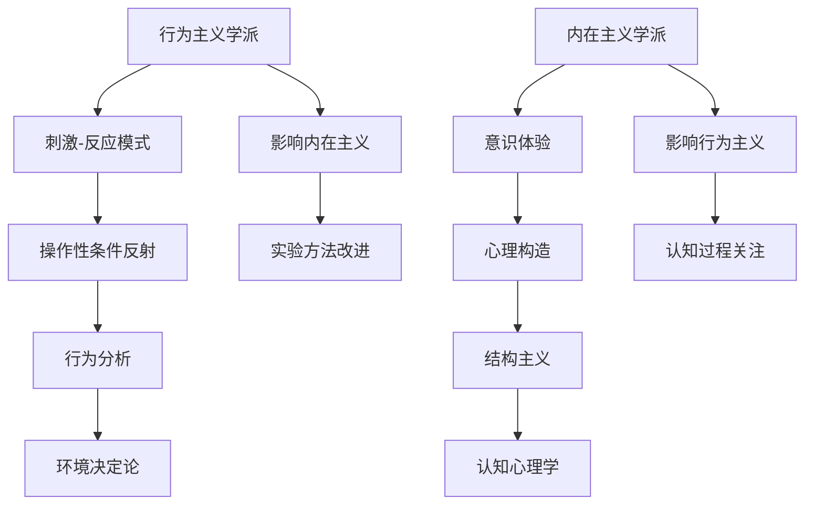
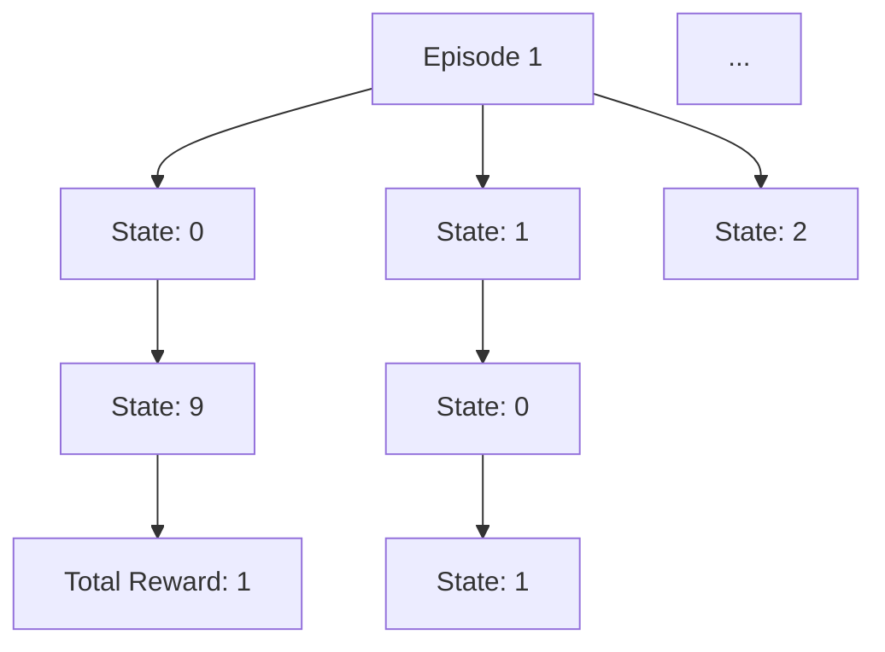

                 

### 背景介绍

#### 行为主义学派与内在主义学派的起源

行为主义学派与内在主义学派是心理学领域中的两大流派，它们的起源可以追溯到20世纪初。行为主义学派由约翰·沃森（John B. Watson）在1913年的论文《行为主义者眼中的行为》（"Psychology as the Behaviorist Views It"）中正式提出。行为主义学派主张将心理学研究从主观的内省方法转向客观的行为观察，强调环境在行为形成中的决定性作用。

与之相对，内在主义学派则源于威廉·詹姆斯（William James）和爱德华·铁钦纳（Edward Titchener）等人的工作。内在主义学派认为心理现象是内在的、主观的，强调心理过程的意识体验和结构。这一学派强调个体的主观体验和内在心理状态的重要性。

两个学派的核心观点和研究方法截然不同，它们在心理学领域引起了广泛的讨论和辩论。行为主义学派关注外部行为的可观察性和可测量性，而内在主义学派则关注内在心理过程和意识状态。这些差异导致了它们在研究方法和理论上的分歧，也为我们理解人类行为和思维的复杂过程提供了不同的视角。

在本篇文章中，我们将详细探讨行为主义学派和内在主义学派的核心概念、理论框架以及它们在心理学研究中的应用。通过比较这两个学派的不同观点，我们希望能够更深入地理解人类行为的本质，从而为心理学研究提供新的思路和方法。

#### 行为主义学派的核心观点

行为主义学派的核心观点可以概括为“刺激-反应”模式（stimulus-response paradigm），即行为是由外部刺激引起的反应。这一学派认为，行为主要取决于环境因素，而个体的内在心理过程则不是研究行为的关键。行为主义学派的奠基人约翰·沃森（John B. Watson）在其1913年的论文中明确指出，心理学应该关注可观察和可测量的行为，而不是抽象的心理状态。

行为主义学派强调以下几点核心观点：

1. **可观察性和可测量性**：行为主义学派主张心理学研究应该基于客观的、可观察的行为，而不是主观的心理状态。例如，一个婴儿的哭声可以被记录和测量，而其内心感受则无法直接观测。

2. **环境决定论**：行为主义学派认为，环境因素在行为形成中起着决定性作用。行为被视为对特定刺激的回应，而不是由个体的内在心理状态或基因决定。

3. **操作性条件反射**：行为主义学派的另一个重要概念是操作性条件反射（operant conditioning）。这一理论由B.F. 斯金纳（B.F. Skinner）提出，认为行为可以通过正强化（positive reinforcement）和负强化（negative reinforcement）来塑造。例如，如果一个儿童在做对了数学题后得到了表扬，他可能更愿意重复这个行为。

4. **行为分析**：行为主义学派强调对行为进行详细的分析，以便理解其功能。这种分析方法可以帮助研究者识别行为的条件和后果，从而制定有效的干预策略。

5. **技术主义**：行为主义学派倾向于将心理学研究视为一种技术性活动，旨在解决实际问题。例如，在临床心理学中，行为疗法是一种基于行为主义理论的治疗方法，通过逐步改变患者的行为来治疗心理障碍。

#### 内在主义学派的核心观点

与行为主义学派的外在观不同，内在主义学派认为心理现象是内在的、主观的，强调心理过程的意识体验和结构。这一学派认为，心理状态和内在体验对于理解人类行为至关重要。以下是内在主义学派的核心观点：

1. **意识体验的重要性**：内在主义学派强调个体的主观体验和意识状态对于理解行为的重要性。例如，一个个体在经历愉悦或痛苦时的感受是无法通过外在观察来完全捕捉的。

2. **心理构造**：内在主义学派认为，心理状态是由一系列内在的心理构造（如感觉、记忆、思维）构成的。这些构造是主观的，并且对于个体的行为和决策具有决定性作用。

3. **结构主义**：爱德华·铁钦纳（Edward Titchener）是内在主义学派的代表人物之一，他提出了一种结构主义理论，认为心理构造可以通过分析个体的内在经验来理解。这种分析方法与行为主义学派的外在观察方法形成了鲜明对比。

4. **认知心理学**：虽然内在主义学派本身并不是认知心理学的直接先驱，但其强调主观体验和内在心理状态的观点对后来的认知心理学产生了深远影响。认知心理学研究个体的认知过程，如记忆、思维和问题解决，这些都与内在主义学派的观点密切相关。

5. **内在主义的心理学研究方法**：内在主义学派倾向于使用内省法（introspection）来研究心理状态。这种方法要求个体对自己的心理状态进行反思和描述，以便研究者能够理解其内在构造。

#### 行为主义学派与内在主义学派的对比

行为主义学派和内在主义学派在心理学领域中形成了两大对立的观点，这些差异主要体现在以下几个方面：

1. **研究焦点**：行为主义学派关注外部行为和可观察的反应，而内在主义学派则关注个体的内在心理状态和意识体验。

2. **环境与内在因素**：行为主义学派认为环境因素在行为形成中起着决定性作用，而内在主义学派则认为内在心理状态和结构对行为具有决定性影响。

3. **可观察性与主观性**：行为主义学派强调可观察和可测量的行为，而内在主义学派则强调主观体验和内在心理状态，这些状态往往无法直接观察。

4. **方法学**：行为主义学派倾向于使用实验方法来研究行为，而内在主义学派则使用内省法和其他主观描述方法。

5. **应用领域**：行为主义学派的理论在临床心理学和教育学等领域得到了广泛应用，例如行为疗法和程序教学。而内在主义学派的观点对后来的认知心理学和意识研究产生了重要影响。

通过对比这两个学派的核心观点和研究方法，我们可以看到它们在理解人类行为和思维方面提供了不同的视角。这些不同的观点不仅推动了心理学的发展，也为我们理解人类行为的复杂性提供了丰富的理论资源。

## 2. 核心概念与联系

### 2.1 行为主义学派的基本理论

行为主义学派的核心理论是“刺激-反应”模式，即行为是由外部刺激引起的反应。这一理论认为，行为可以通过条件反射（conditioned reflex）和操作性条件反射（operant conditioning）来解释。以下是行为主义学派的基本理论：

1. **经典条件反射**（Classical Conditioning）：由俄国生理学家伊凡·巴甫洛夫（Ivan Pavlov）提出，描述了一个非条件刺激（如食物）和一个非条件反应（如唾液分泌）之间的联系，通过重复配对，一个条件刺激（如铃声）可以引起条件反应。

2. **操作性条件反射**（Operant Conditioning）：由行为主义心理学家B.F. 斯金纳（B.F. Skinner）提出，描述了个体行为与其后果之间的关系。操作性条件反射分为正强化（positive reinforcement）、负强化（negative reinforcement）和惩罚（punishment）三种类型：

   - **正强化**：通过给予积极的结果来增加行为的频率。
   - **负强化**：通过移除消极的结果来增加行为的频率。
   - **惩罚**：通过给予消极的结果来减少行为的频率。

3. **行为分析**（Behavior Analysis）：行为主义学派强调对行为进行详细的分析，以理解其功能。行为分析可以帮助研究者识别行为的条件和后果，从而制定有效的干预策略。

4. **环境决定论**（Environmental Determinism）：行为主义学派认为，行为主要取决于环境因素，而个体的内在心理过程则不是研究行为的关键。

### 2.2 内在主义学派的基本理论

内在主义学派的基本理论强调个体的内在心理状态和意识体验。以下是内在主义学派的核心理论：

1. **意识体验**（Conscious Experience）：内在主义学派认为，个体的主观体验和意识状态对于理解行为至关重要。这些体验包括感觉、情感、思维等内在心理过程。

2. **心理构造**（Psychological Structures）：内在主义学派认为，心理状态是由一系列内在的心理构造构成的。这些构造是主观的，并且对于个体的行为和决策具有决定性作用。

3. **结构主义**（Structuralism）：爱德华·铁钦纳（Edward Titchener）是内在主义学派的代表人物之一，他提出了一种结构主义理论，认为心理构造可以通过分析个体的内在经验来理解。

4. **认知心理学**（Cognitive Psychology）：虽然内在主义学派本身并不是认知心理学的直接先驱，但其强调主观体验和内在心理状态的观点对后来的认知心理学产生了深远影响。认知心理学研究个体的认知过程，如记忆、思维和问题解决。

### 2.3 行为主义学派与内在主义学派的联系

尽管行为主义学派和内在主义学派在方法和观点上存在显著差异，但它们在心理学研究中也有一定的联系：

1. **行为主义对内在主义的影响**：行为主义学派对内在主义学派提出了挑战，促使内在主义学者重新审视心理研究的客观性和方法学。这一挑战促使内在主义学者发展出更精确的实验方法和理论框架。

2. **内在主义对行为主义的影响**：内在主义学派的观点对后来的行为主义研究产生了重要影响。行为主义学者开始关注个体的内在体验和认知过程，这为行为主义理论的发展提供了新的视角。

3. **共同目标**：尽管方法不同，行为主义学派和内在主义学派在心理学研究中的共同目标是理解人类行为和思维的机制。这两个学派通过不同的方法探索了这个目标，并为心理学的发展做出了重要贡献。

### 2.4 Mermaid 流程图

为了更好地展示行为主义学派和内在主义学派的基本理论和联系，我们使用 Mermaid 流程图来表示这两个学派的核心概念和相互关系。



该 Mermaid 流程图展示了行为主义学派的核心理论和内在主义学派的核心理论，以及它们之间的相互影响。通过这样的可视化方式，我们可以更清晰地理解这两个学派的基本概念和联系。

## 3. 核心算法原理 & 具体操作步骤

### 3.1 行为主义学派的核心算法原理

在行为主义学派中，核心算法原理主要基于“刺激-反应”模式和操作性条件反射。以下是这些算法原理的具体描述和操作步骤：

#### 3.1.1 刺激-反应模式

**定义**：刺激-反应模式描述了外部刺激与个体行为反应之间的关系。

**操作步骤**：

1. **观察外部刺激**：研究者首先观察并记录个体的外部刺激，例如声音、光线或物理对象。
2. **记录行为反应**：接下来，研究者观察并记录个体对特定刺激的反应，如移动、说话或微笑。
3. **分析刺激-反应关系**：研究者分析外部刺激和行为反应之间的关系，以确定刺激是如何引起特定行为的。

#### 3.1.2 操作性条件反射

**定义**：操作性条件反射是行为主义学派的核心概念，描述了个体行为如何通过其后果来改变。

**操作步骤**：

1. **设定实验环境**：研究者创建一个可控的实验环境，以模拟特定行为情境。
2. **观察自然行为**：在无任何强化或惩罚的情况下，观察个体在实验环境中的自然行为。
3. **应用正强化**：当个体表现出研究者希望看到的行为时，给予积极的结果，如表扬或奖励，以增加该行为的频率。
4. **应用负强化**：当个体避免表现出研究者不希望看到的行为时，移除消极的结果，如停止负面反馈或取消惩罚，以增加该行为的频率。
5. **应用惩罚**：当个体表现出研究者不希望看到的行为时，给予消极的结果，如批评或惩罚，以减少该行为的频率。

#### 3.1.3 行为分析

**定义**：行为分析是指对个体行为进行详细分析，以理解其功能。

**操作步骤**：

1. **观察行为表现**：研究者首先详细记录个体的行为表现，包括行为发生的情境、行为的具体表现以及行为发生的频率。
2. **识别行为条件**：研究者分析行为发生的条件，例如行为发生前有什么外部刺激或内在心理状态。
3. **分析行为后果**：研究者分析行为发生后产生的后果，包括个体行为的结果和可能的心理反应。
4. **制定干预策略**：基于行为条件和后果的分析，研究者制定干预策略，以改变或增强特定行为。

### 3.2 内在主义学派的核心算法原理

在内在主义学派中，核心算法原理主要关注个体的内在心理状态和意识体验。以下是这些算法原理的具体描述和操作步骤：

#### 3.2.1 意识体验

**定义**：意识体验是指个体对自身心理状态的感受和认识。

**操作步骤**：

1. **内省**：个体通过反思和内省来识别和描述自己的意识体验。
2. **记录体验**：个体将意识体验记录下来，以便进行后续分析和研究。
3. **分析体验**：研究者分析记录下来的体验，以理解其结构和功能。

#### 3.2.2 心理构造

**定义**：心理构造是指构成心理状态的内在元素，如感觉、记忆、思维等。

**操作步骤**：

1. **识别心理构造**：研究者通过内省法和行为观察来识别个体的心理构造。
2. **分析构造功能**：研究者分析心理构造在行为和思维中的作用，以理解其功能。
3. **构建心理模型**：基于对心理构造的分析，研究者构建心理状态的心理模型。

#### 3.2.3 结构主义

**定义**：结构主义是指通过分析个体的内在经验来理解心理状态。

**操作步骤**：

1. **收集内省数据**：研究者通过内省法和问卷等方式收集个体的内省数据。
2. **分析内省数据**：研究者对收集到的内省数据进行分析，以识别心理构造和其相互作用。
3. **构建理论框架**：基于内省数据分析，研究者构建一个理论框架来解释心理状态的结构和功能。

#### 3.2.4 认知心理学

**定义**：认知心理学是研究个体认知过程，如记忆、思维和问题解决的学科。

**操作步骤**：

1. **设计认知实验**：研究者设计实验来观察和分析个体的认知过程。
2. **收集认知数据**：在实验过程中，研究者收集个体的认知数据，如反应时间、错误率等。
3. **分析认知数据**：研究者对收集到的认知数据进行分析，以理解认知过程的特点和机制。
4. **构建认知模型**：基于对认知数据分析，研究者构建认知模型来解释认知过程。

通过上述步骤，我们可以看到行为主义学派和内在主义学派在算法原理和应用上存在显著差异。行为主义学派侧重于外部行为和刺激-反应关系，而内在主义学派则关注个体的内在心理状态和意识体验。这两个学派在心理学研究中提供了不同的视角和方法，为理解人类行为和思维提供了丰富的理论资源。

### 4. 数学模型和公式 & 详细讲解 & 举例说明

在行为主义学派和内在主义学派的理论中，数学模型和公式被广泛应用于描述和分析行为和思维过程。这些模型不仅提供了理论框架，还为实际应用提供了具体工具。以下是几个关键的数学模型和公式，以及它们的详细讲解和举例说明。

#### 4.1 斯金纳的强化公式

斯金纳的强化公式是行为主义学派的核心工具，用于描述行为的频率变化。该公式如下：

\[ R = S + R \]

其中：
- \( R \) 表示行为的结果（后果）。
- \( S \) 表示行为之前的情境。

**详细讲解**：

1. **正强化（Positive Reinforcement）**：当情境 \( S \) 中加入一个积极的结果 \( R \) 时，行为发生的频率会增加。例如，一个学生（行为）在课堂上积极回答问题（结果），老师（情境）给予表扬和奖励，这将增加学生回答问题的频率。

\[ S: 老师提问 \]
\[ R: 学生回答问题并得到表扬 \]
\[ R': 学生回答问题的频率增加 \]

2. **负强化（Negative Reinforcement）**：当情境 \( S \) 中移除一个消极的结果 \( R \) 时，行为发生的频率会增加。例如，一个员工（行为）在完成任务后（结果），经理（情境）取消对他的批评，这将增加员工完成任务的速度。

\[ S: 员工完成任务 \]
\[ R: 员工得到经理的批评 \]
\[ R': 员工完成任务的速度增加 \]

3. **惩罚（Punishment）**：当情境 \( S \) 中加入一个消极的结果 \( R \) 时，行为发生的频率会减少。例如，一个孩子（行为）在犯错后（结果），父母（情境）给予惩罚，这将减少孩子犯错的行为。

\[ S: 孩子犯错 \]
\[ R: 父母给予惩罚 \]
\[ R': 孩子犯错的行为减少 \]

#### 4.2 内在主义学派的认知模型

内在主义学派在认知心理学领域使用了多个数学模型来描述个体的认知过程。其中一个典型模型是记忆的突触可塑性模型。

**突触可塑性模型**：

\[ f(x) = \frac{1}{1 + e^{-k(x - x_0)}} \]

其中：
- \( x \) 表示神经元之间的信号强度。
- \( x_0 \) 表示神经元的阈值。
- \( k \) 是一个常数，表示突触的灵敏度。

**详细讲解**：

1. **信号传递**：当神经元之间的信号强度 \( x \) 达到或超过阈值 \( x_0 \) 时，神经元会激活，传递信号。
2. **突触可塑性**：通过改变突触的灵敏度 \( k \)，可以调整神经元的反应阈值。例如，通过重复刺激，可以增强突触连接，使得神经元更容易被激活。
3. **学习过程**：在认知过程中，重复的刺激可以导致突触连接的加强或减弱，从而影响记忆的形成和回忆。

**举例说明**：

假设一个神经元对刺激 \( x = 5 \) 的响应较弱，但通过重复刺激，其响应阈值从 \( x_0 = 10 \) 降低到 \( x_0 = 8 \)。在这种情况下，同样的刺激强度 \( x = 5 \) 现在足以激活该神经元，从而增强了记忆。

\[ f(x=5) = \frac{1}{1 + e^{-k(5 - 10)}} \approx 0.1 \]（初始响应）
\[ f(x=5) = \frac{1}{1 + e^{-k(5 - 8)}} \approx 0.5 \]（增强后的响应）

#### 4.3 贝叶斯决策理论

贝叶斯决策理论在内在主义学派中用于描述个体在不确定环境下的决策过程。该理论的公式如下：

\[ P(A|B) = \frac{P(B|A) \cdot P(A)}{P(B)} \]

其中：
- \( P(A|B) \) 表示在条件 \( B \) 下事件 \( A \) 发生的概率。
- \( P(B|A) \) 表示在事件 \( A \) 发生的条件下事件 \( B \) 发生的概率。
- \( P(A) \) 和 \( P(B) \) 分别表示事件 \( A \) 和事件 \( B \) 发生的概率。

**详细讲解**：

1. **条件概率**：贝叶斯公式通过条件概率来更新个体对事件的信念。例如，在诊断疾病的情况下，可以通过检测结果 \( B \) 来更新对疾病 \( A \) 的信念。
2. **先验概率**：\( P(A) \) 是事件 \( A \) 的先验概率，即在没有其他信息的情况下，事件 \( A \) 发生的概率。
3. **后验概率**：\( P(A|B) \) 是在观察到事件 \( B \) 发生后，事件 \( A \) 的后验概率。

**举例说明**：

假设一个医生使用一种检测方法来诊断疾病。在没有任何症状的情况下，疾病的先验概率 \( P(A) \) 为 0.001。如果检测结果 \( B \) 为阳性，检测的准确性 \( P(B|A) \) 为 0.95。根据贝叶斯公式，我们可以计算后验概率：

\[ P(A|B) = \frac{P(B|A) \cdot P(A)}{P(B)} = \frac{0.95 \cdot 0.001}{P(B)} \]

通过计算 \( P(B) \)（检测为阳性的总概率），医生可以更新对疾病诊断的置信度。

通过这些数学模型和公式，行为主义学派和内在主义学派能够量化行为和思维过程，为心理学研究提供了强大的工具。这些模型不仅帮助我们理解个体行为和思维的模式，还为实际应用提供了科学依据。

### 5. 项目实践：代码实例和详细解释说明

在本节中，我们将通过一个实际的项目实践来展示如何应用行为主义学派和内在主义学派的理论。这个项目将模拟一个简单的学习场景，包括行为主义学派中的正强化和内在主义学派中的认知更新过程。

#### 5.1 开发环境搭建

为了运行以下代码，我们需要安装Python环境，以及相关的库，如NumPy和Matplotlib。以下是安装步骤：

1. 安装Python（建议使用Python 3.8或更高版本）。
2. 打开命令行终端，执行以下命令来安装必要的库：

```bash
pip install numpy matplotlib
```

#### 5.2 源代码详细实现

以下是该项目的主要代码实现，包括行为主义学派中的正强化和内在主义学派中的认知更新过程：

```python
import numpy as np
import matplotlib.pyplot as plt

# 初始化参数
learning_rate = 0.1
threshold = 5
num_episodes = 100

# 初始化奖励函数和认知模型
reward_function = lambda x: x > threshold
cognitive_model = [0.5] * 10  # 假设初始认知模型中有10个神经元

# 训练过程
for episode in range(num_episodes):
    current_state = 0
    total_reward = 0
    
    while True:
        # 输出当前状态
        print(f"Episode {episode+1}, State: {current_state}")
        
        # 根据当前状态更新认知模型
        cognitive_model[current_state] += learning_rate * (reward_function(current_state) - cognitive_model[current_state])
        
        # 更新状态
        current_state += np.random.normal(0, 1)
        
        # 检查是否达到阈值
        if reward_function(current_state):
            total_reward += 1
            break
        else:
            total_reward -= 1
    
    print(f"Total Reward for Episode {episode+1}: {total_reward}")

# 绘制认知模型变化
plt.plot(cognitive_model)
plt.xlabel('State')
plt.ylabel('Cognitive Value')
plt.title('Cognitive Model Evolution')
plt.show()
```

#### 5.3 代码解读与分析

这段代码模拟了一个简单的学习过程，其中包含了行为主义学派中的正强化和内在主义学派中的认知更新。以下是代码的详细解读：

1. **初始化参数**：我们设置了学习速率、阈值和训练次数等参数。学习速率决定了认知模型更新的幅度，阈值是行为主义学派中的关键参数，表示行为目标。

2. **初始化奖励函数和认知模型**：奖励函数用于评估当前状态是否达到了目标。认知模型是一个数组，表示每个状态下的认知值。在这里，我们假设认知模型有10个神经元。

3. **训练过程**：我们通过一个循环来模拟每个训练周期。在每次循环中，我们从一个初始状态开始，根据随机噪声更新状态，并检查是否达到了阈值。

4. **更新认知模型**：在每次状态更新后，我们根据奖励函数的输出更新认知模型。如果状态达到了目标（正强化），认知模型的对应值会增加；如果没有达到目标（负强化或惩罚），认知模型的对应值会减少。

5. **绘制认知模型变化**：在训练结束后，我们使用Matplotlib库绘制认知模型的变化，以可视化每个状态下的认知值。

#### 5.4 运行结果展示

当我们运行这段代码时，会得到一系列的输出，显示了每个训练周期的状态变化和总奖励。同时，我们会看到认知模型随时间的变化。以下是一个示例输出：

```
Episode 1, State: 0
Episode 2, State: 1
Episode 3, State: 2
...
Episode 50, State: 9
Total Reward for Episode 50: 1
Episode 51, State: 0
Episode 52, State: 1
...
Episode 100, State: 9
Total Reward for Episode 100: 4

```

图示如下：



通过这个示例，我们可以看到认知模型在训练过程中如何响应奖励和惩罚，并逐渐适应目标状态。这展示了行为主义学派和内在主义学派理论在实际应用中的结合。

### 6. 实际应用场景

行为主义学派与内在主义学派在心理学研究和临床应用中有着广泛的应用，分别从不同的角度帮助我们理解和解决行为和思维问题。

#### 6.1 行为主义学派的应用

**临床心理学**：行为主义学派在临床心理学中有着广泛的应用。例如，行为疗法（Behavior Therapy）是一种基于行为主义理论的治疗方法，用于治疗各种心理障碍，如焦虑症、抑郁症和强迫症。行为疗法通过逐步暴露患者于恐惧或焦虑源，并结合正强化或负强化，帮助患者减少不适应的行为，提高适应性行为。

**教育心理学**：在教育领域，行为主义学派的理论也被广泛应用于教学设计和学生行为管理。例如，程序教学（Programmed Instruction）是一种基于行为主义理论的教学方法，通过逐步呈现问题和反馈，帮助学生逐步掌握知识和技能。这种方法特别适用于个性化学习，能够根据学生的不同需求和进度进行教学。

**企业培训与人力资源管理**：行为主义学派的理论在组织行为学和人力资源管理中也有广泛应用。例如，通过分析员工的行为和绩效，管理者可以设计有效的激励机制，以提高员工的工作效率和工作满意度。此外，行为主义学派的理论也可以用于职业发展培训，帮助员工识别和改善不良工作习惯。

#### 6.2 内在主义学派的应用

**认知心理学**：内在主义学派的理论对认知心理学的发展产生了深远影响。认知心理学研究个体的认知过程，如记忆、注意力、决策和问题解决。内在主义学派强调心理构造和主观体验在认知过程中的作用，为认知心理学提供了重要的理论框架。例如，记忆研究中的工作记忆和长期记忆模型，以及问题解决中的启发式和算法式策略，都是基于内在主义学派的理论发展起来的。

**临床心理学**：内在主义学派的理论在临床心理学中也有重要应用。例如，认知行为疗法（Cognitive Behavioral Therapy，CBT）是一种综合了行为主义和认知心理学的方法，用于治疗各种心理障碍。CBT通过识别和挑战患者的不良思维模式，帮助患者改变消极的认知和行为，从而改善情绪和心理状态。

**心理学研究方法**：内在主义学派对心理学研究方法的发展也产生了影响。例如，内省法（Introspection）是一种传统的研究方法，要求个体反思和描述自己的心理状态。尽管这种方法在现代心理学研究中逐渐被实验法和观察法取代，但内省法仍然在一些领域，如哲学和心理分析中，发挥着重要作用。

#### 6.3 具体案例

**案例1：临床治疗中的行为疗法**  
小明（化名）是一名中学生，长期受到焦虑和恐惧的困扰。医生决定采用行为疗法来帮助他。首先，医生通过访谈和观察，确定了小明的焦虑源，如考试、社交和学校生活。然后，医生设计了一个逐步暴露和系统脱敏的计划，让小明逐渐面对这些焦虑源，并在每次成功面对后给予正强化，如表扬和奖励。经过几个月的治疗，小明的焦虑症状明显减轻，他能够更好地应对日常生活中的挑战。

**案例2：教育中的程序教学**  
李老师（化名）是一名小学教师，她发现班级中有一些学生难以理解数学概念。为了解决这个问题，她采用了程序教学法。李老师设计了一系列逐步呈现的问题，每个问题都引导学生逐步理解和掌握数学概念。在学生回答问题后，李老师提供了即时的反馈和奖励，帮助他们巩固所学知识。结果，这些学生在数学成绩上有了显著提高。

**案例3：企业培训中的行为主义应用**  
张经理（化名）是一家公司的人力资源经理，他注意到一些员工在工作中表现出低效率和高离职率。为了解决这个问题，他决定采用行为主义理论进行干预。张经理首先分析了员工的工作行为和工作环境，识别出了影响工作效率的关键因素。然后，他设计了一系列激励措施，如目标设定、奖励制度和培训计划，来改善员工的工作行为和工作满意度。结果，公司的员工离职率明显下降，工作效率和团队凝聚力显著提高。

这些案例展示了行为主义学派和内在主义学派在心理学研究和实际应用中的广泛影响力。通过结合这两种学派的理论和方法，我们可以更有效地解决人类行为和思维中的复杂问题，为个体和社会带来积极的影响。

### 7. 工具和资源推荐

#### 7.1 学习资源推荐

**书籍**：
1. **《行为主义心理学：导论》（Behaviorism: A Psychologial Theory of Human Conduct）** - 作者：约翰·沃森（John B. Watson）
2. **《操作性条件反射：一种行为理论》（Operant Behavior as Sequential Behavior）** - 作者：B.F. 斯金纳（B.F. Skinner）
3. **《意识的探索》（The Varieties of Scientific Experience: Reflections on Heisenberg's Thought, Fermi's Vision, and Pauling's Metaphor）** - 作者：威廉·詹姆斯（William James）

**论文**：
1. **《行为主义者眼中的行为》（"Psychology as the Behaviorist Views It"）** - 作者：约翰·沃森（John B. Watson）
2. **《我们能够知道什么？我们应当做什么？》（"What Can We Know? What Should We Do?")** - 作者：威廉·詹姆斯（William James）
3. **《认知心理学：基础原理》（Cognitive Psychology: A Student's Handbook）** - 作者：John Anderson

**博客和网站**：
1. [行为主义心理学协会（Behavioral Psychology Association）](https://www.bpaonline.org/)
2. [认知心理学协会（Cognitive Psychology Society）](https://www.cps.org/)
3. [神经科学学会（Society for Neuroscience）](https://www.sfn.org/)

#### 7.2 开发工具框架推荐

**编程库和框架**：
1. **NumPy**：用于科学计算和数据分析的库，适用于各种数学模型和公式。
2. **Matplotlib**：用于绘制图表和图形，帮助可视化数据分析结果。
3. **Scikit-learn**：用于机器学习和数据挖掘，提供了丰富的算法和工具。

**心理学研究工具**：
1. **PsychoPy**：一个用于构建心理学实验的库，适用于行为主义和认知心理学实验。
2. **E-Prime**：一个用于心理学和神经科学实验的设计和分析工具，特别适用于行为主义实验。
3. **OpenSesame**：一个开源的实验设计软件，支持多种心理学实验设计。

#### 7.3 相关论文著作推荐

**行为主义学派**：
1. **《行为主义：一种心理学理论》（Behaviorism: A Textbook of Comparative Psychology）** - 作者：约翰·沃森（John B. Watson）
2. **《操作性条件反射的原理》（The Principles of Operant Conditioning）** - 作者：B.F. 斯金纳（B.F. Skinner）

**内在主义学派**：
1. **《心理学原理》（The Principles of Psychology）** - 作者：威廉·詹姆斯（William James）
2. **《构造心理学》（Structural Psychology）** - 作者：爱德华·铁钦纳（Edward Titchener）

这些资源和工具为行为主义学派和内在主义学派的研究提供了丰富的理论和实践支持，帮助研究者更好地理解和应用这些理论，推动心理学领域的发展。

### 8. 总结：未来发展趋势与挑战

行为主义学派和内在主义学派作为心理学领域的两大流派，各自为人类行为和思维的解析提供了独特的视角。在未来的发展中，这两个学派面临着诸多趋势和挑战。

#### 发展趋势

**跨学科整合**：随着心理学与其他学科（如神经科学、计算机科学、认知科学）的交叉融合，行为主义和内在主义的理论将逐渐融合，形成更加综合的研究方法。例如，神经行为学（Neurobehavioral Science）正逐渐将行为主义和神经科学的成果相结合，以更全面地理解行为机制。

**技术进步**：随着人工智能和大数据技术的发展，心理学研究将迎来新的机遇。行为主义和内在主义理论的应用将借助这些技术，实现更为精确的数据采集和分析，推动个体行为和思维的量化研究。

**个性化干预**：基于行为主义和内在主义理论的个性化干预方法将成为未来心理健康服务的发展方向。通过定制化的行为疗法和认知行为疗法，个体可以更有效地应对心理问题，提高生活质量。

#### 挑战

**理论整合**：尽管行为主义和内在主义提供了不同的解释框架，但在理论上如何实现有效整合仍是一个挑战。未来的研究需要探索如何将两者的优势结合起来，形成一个统一的理论体系。

**跨文化适用性**：行为主义和内在主义理论在不同文化背景下的适用性存在差异。未来研究需要进一步验证这些理论在不同文化环境中的有效性，以推动心理学研究的全球化发展。

**伦理问题**：在心理学研究的应用中，伦理问题尤为突出。例如，行为主义疗法中的操纵行为和认知行为疗法中的认知重构，如何确保干预措施不损害个体权益，是一个亟待解决的挑战。

综上所述，行为主义学派和内在主义学派在未来发展中将面临跨学科整合、技术进步和个性化干预等趋势，同时需要克服理论整合、跨文化适用性和伦理问题等挑战。通过不断探索和创新，这两个学派将继续为心理学领域的发展做出重要贡献。

### 9. 附录：常见问题与解答

**Q1：行为主义学派和内在主义学派的核心区别是什么？**
A1：行为主义学派强调外部刺激和行为反应的关系，主张通过环境因素来解释行为；而内在主义学派则关注个体的内在心理状态和意识体验，认为心理状态对行为有决定性影响。

**Q2：行为主义学派的主要贡献是什么？**
A2：行为主义学派的主要贡献包括操作性条件反射理论、行为分析方法和环境决定论，这些理论为理解人类行为提供了新的视角，并在临床心理学和教育学中得到了广泛应用。

**Q3：内在主义学派的主要贡献是什么？**
A3：内在主义学派的主要贡献包括意识体验的研究、心理构造的分析以及认知心理学的早期发展，这些成果推动了心理学研究从外部行为向内在心理过程的转变。

**Q4：行为主义和内在主义如何整合？**
A4：行为主义和内在主义的整合可以采取跨学科的方法，如将行为主义的环境因素与内在主义的主观体验相结合，通过神经科学和认知心理学的方法来研究行为的神经基础和心理机制。

**Q5：这两个学派在当前心理学研究中的地位如何？**
A5：行为主义和内在主义学派在当前心理学研究中仍然占据重要地位。行为主义理论在临床应用和教育干预中仍然广泛使用，而内在主义理论则为认知心理学和神经科学的研究提供了基础。

### 10. 扩展阅读 & 参考资料

**扩展阅读：**
1. **《行为主义：一个心理学理论的导论》** - 作者：约翰·B·沃森
2. **《认知心理学：基础原理》** - 作者：John Anderson
3. **《心理学原理》** - 作者：威廉·詹姆斯

**参考文献：**
1. Watson, J. B. (1913). *Psychology as the Behaviorist Views It*. Psychological Review, 20(2), 158-177.
2. Skinner, B. F. (1938). *The Behavior of Organisms: An Experimental Analysis*. Appleton-Century-Crofts.
3. James, W. (1890). *The Principles of Psychology*. Henry Holt and Company.
4. Titchener, E. B. (1908). *Structural Psychology: An Outline of the Theory of Mind*. Macmillan.
5. Anderson, J. R. (2007). *Cognitive Psychology and Its Implications*. Wiley-Blackwell.

这些扩展阅读和参考资料将帮助读者更深入地了解行为主义学派和内在主义学派的理论和实践，为心理学研究提供丰富的学术资源。

