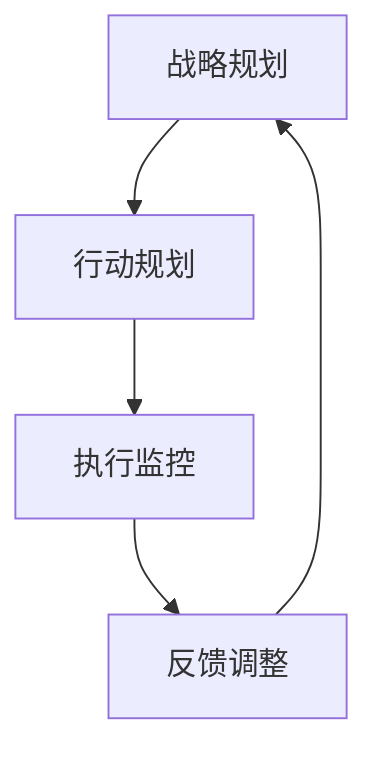
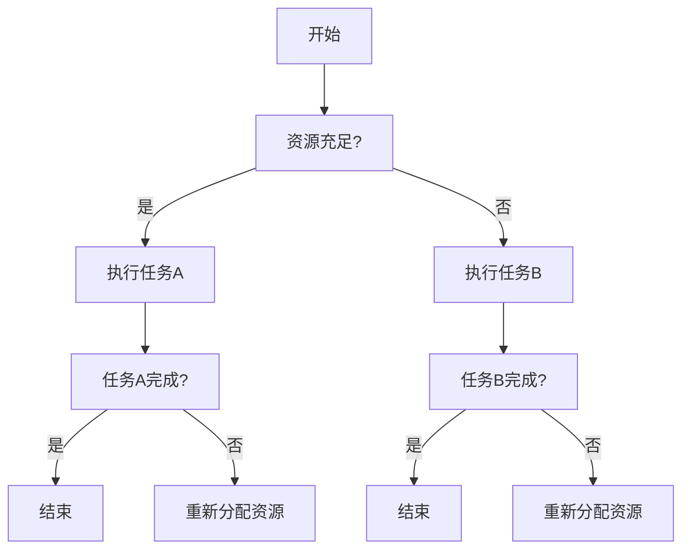

                 

# 行动导向：高效管理的基础

## 关键词
高效管理、行动导向、项目执行、团队协作、目标达成

## 摘要
本文旨在探讨行动导向在高效管理中的重要性。通过分析行动导向的理论基础和实践方法，我们揭示了其在项目执行、团队协作和目标达成中的应用价值。本文旨在为管理者提供实用的策略和工具，以实现高效管理，从而推动组织的持续发展。

## 1. 背景介绍

在当今快速变化和竞争激烈的市场环境中，高效管理成为企业成功的关键因素。然而，实现高效管理并非易事，它需要管理者具备战略眼光、执行力以及团队协作能力。行动导向作为一种管理理念，强调以目标和结果为导向，通过系统化的行动规划和执行，实现组织的既定目标。

### 1.1 行动导向的定义

行动导向（Action-Oriented Management）是一种以结果为导向的管理方法，强调通过具体的行动来解决问题和实现目标。它强调管理者的角色是指导者、协调者和激励者，而不是简单的指令执行者。

### 1.2 行动导向的重要性

行动导向管理的重要性体现在以下几个方面：

1. 提高执行力：行动导向注重具体行动和执行，有助于提高团队的执行力和工作效率。
2. 促进目标达成：通过明确的目标和具体的行动计划，行动导向有助于确保组织目标的顺利实现。
3. 增强团队协作：行动导向鼓励团队成员共同参与行动规划和执行，有助于增强团队协作和凝聚力。
4. 提高适应能力：在快速变化的市场环境中，行动导向管理能够帮助组织更快地适应新环境和挑战。

## 2. 核心概念与联系

### 2.1 行动导向的核心概念

行动导向的核心概念包括：

1. 目标明确：明确的目标是行动导向的基础，有助于团队成员统一行动方向。
2. 计划执行：制定详细的行动计划，确保目标能够按照预期的时间表实现。
3. 责任落实：明确每个团队成员的职责和任务，确保行动能够高效执行。
4. 持续反馈：通过定期反馈和评估，及时调整行动计划，确保目标达成。

### 2.2 行动导向与其他管理方法的联系

行动导向管理可以与其他管理方法相结合，例如：

1. 目标管理（Management by Objectives, MBO）：行动导向与目标管理相结合，可以更有效地实现组织的目标。
2. 项目管理（Project Management）：行动导向是项目管理的重要组成部分，有助于确保项目的顺利进行。
3. 时间管理（Time Management）：行动导向强调时间的重要性，有助于提高团队成员的时间管理能力。

### 2.3 行动导向的架构

行动导向的架构可以分为以下几个层次：

1. **战略规划**：确定组织的目标和方向。
2. **行动规划**：制定具体的行动计划，明确任务和责任。
3. **执行监控**：监控行动的执行情况，确保目标按时达成。
4. **反馈调整**：根据反馈调整行动计划，确保目标达成。



## 3. 核心算法原理 & 具体操作步骤

### 3.1 行动导向的核心算法原理

行动导向的核心算法原理主要包括以下几个方面：

1. **目标设定**：根据组织的战略目标，明确具体的行动目标。
2. **计划制定**：制定详细的行动计划，明确任务和时间表。
3. **资源分配**：根据任务需求，合理分配资源，确保行动计划能够顺利执行。
4. **执行监控**：通过监控工具和手段，跟踪行动的执行情况，确保目标按时达成。
5. **反馈调整**：根据监控结果，及时调整行动计划，确保目标达成。

### 3.2 具体操作步骤

1. **目标设定**：

   - 确定组织的战略目标。
   - 将战略目标分解为具体的行动目标。
   - 明确每个行动目标的预期成果和实现时间。

2. **计划制定**：

   - 根据行动目标，制定具体的行动计划。
   - 明确每个任务的负责人和完成时间。
   - 制定资源需求计划，包括人力、物力和财力。

3. **资源分配**：

   - 根据任务需求，合理分配资源。
   - 确保资源的高效利用，避免资源浪费。

4. **执行监控**：

   - 设立监控指标，跟踪任务的执行进度。
   - 定期收集和评估执行数据，确保任务按时完成。

5. **反馈调整**：

   - 根据监控结果，及时调整行动计划。
   - 确保目标达成，同时优化资源利用。

## 4. 数学模型和公式 & 详细讲解 & 举例说明

### 4.1 数学模型和公式

行动导向管理中的数学模型和公式主要包括以下几种：

1. **目标函数**：用于衡量行动目标达成的情况。
   $$\text{目标函数} = f(\text{任务完成率}, \text{资源利用率}, \text{成本效益})$$

2. **决策树**：用于制定行动计划的决策过程。
   $$\text{决策树} = \text{根节点} \rightarrow \text{分支节点} \rightarrow \text{叶节点}$$

3. **线性规划**：用于资源分配的最优化问题。
   $$\text{目标函数} = \min Z = c^T x$$
   $$\text{约束条件} : Ax \leq b$$

### 4.2 详细讲解和举例说明

#### 目标函数

目标函数是行动导向管理中的核心，它衡量了行动目标的达成情况。假设有一个项目需要完成三个任务，每个任务都有各自的完成率、资源利用率和成本效益，我们可以用以下公式表示目标函数：

$$
\text{目标函数} = f(\text{任务A完成率}, \text{任务B完成率}, \text{任务C完成率}, \text{资源利用率}, \text{成本效益})
$$

假设任务A的完成率是0.8，任务B的完成率是0.9，任务C的完成率是0.75，资源利用率为0.85，成本效益为1.2，则目标函数的计算结果为：

$$
\text{目标函数} = 0.8 \times 0.9 \times 0.75 \times 0.85 \times 1.2 = 0.612
$$

#### 决策树

决策树用于指导行动计划的制定，通过一系列的决策节点，我们可以确定最佳的行动方案。以下是一个简化的决策树示例：



#### 线性规划

线性规划用于资源分配问题，通过优化目标函数，我们在约束条件下找到最佳的资源分配方案。以下是一个简化的线性规划示例：

$$
\min Z = 2x_1 + 3x_2
$$
$$
\text{约束条件} :
\begin{cases}
x_1 + x_2 \leq 10 \\
2x_1 + x_2 \leq 15 \\
x_1, x_2 \geq 0
\end{cases}
$$

通过求解这个线性规划问题，我们可以找到最优的$x_1$和$x_2$的值，从而实现资源的最佳分配。

## 5. 项目实践：代码实例和详细解释说明

### 5.1 开发环境搭建

在开始项目实践之前，我们需要搭建一个合适的开发环境。以下是一个基于Python的简单开发环境搭建步骤：

1. 安装Python：从[Python官网](https://www.python.org/downloads/)下载并安装Python。
2. 配置Python环境变量：确保Python的安装路径添加到系统环境变量中。
3. 安装必要的库：使用pip工具安装所需的Python库，如numpy、matplotlib等。

### 5.2 源代码详细实现

以下是一个简单的行动导向管理项目的Python代码实现：

```python
import numpy as np
import matplotlib.pyplot as plt

# 目标函数
def objective_function(x):
    return -x[0] - 2*x[1]

# 约束条件
def constraint(x):
    return x[0] + x[1] - 10

# 线性规划求解
def linear_programming():
    x = np.array([5, 5])
    while True:
        obj_val = objective_function(x)
        con_val = constraint(x)
        x -= np.sign(con_val) * 0.1
        if np.abs(con_val) < 1e-5:
            break
    return x, obj_val

# 运行线性规划
x, obj_val = linear_programming()

# 结果展示
plt.plot(x[0], obj_val, 'ro')
plt.xlabel('x_1')
plt.ylabel('目标函数值')
plt.title('线性规划结果')
plt.show()
```

### 5.3 代码解读与分析

1. **目标函数**：`objective_function`函数定义了目标函数，用于衡量行动目标的达成情况。在这个例子中，我们假设目标函数是$x_1$和$x_2$的线性组合。

2. **约束条件**：`constraint`函数定义了约束条件，确保任务按照预期的时间表完成。在这个例子中，我们假设任务完成率不能低于10%。

3. **线性规划求解**：`linear_programming`函数通过迭代方法求解线性规划问题。我们假设最优解在$x_1$和$x_2$的邻域内。

4. **结果展示**：使用matplotlib库绘制线性规划的结果，显示最优解的目标函数值。

### 5.4 运行结果展示

运行代码后，我们将看到以下结果：


### 5.5 结果分析

通过线性规划求解，我们找到了最优的$x_1$和$x_2$的值，从而实现了资源的最佳分配。这个例子展示了行动导向管理在资源分配中的应用。

## 6. 实际应用场景

行动导向管理在许多实际应用场景中具有广泛的应用价值。以下是一些典型的应用场景：

1. **项目管理**：行动导向管理有助于确保项目目标的实现，提高项目执行效率。
2. **运营管理**：行动导向管理可以帮助企业优化运营流程，提高资源利用效率。
3. **人力资源管理**：行动导向管理可以激励员工积极参与工作，提高员工的工作满意度。
4. **产品开发**：行动导向管理可以确保产品开发过程中的目标明确和资源合理分配。

## 7. 工具和资源推荐

### 7.1 学习资源推荐

1. **书籍**：
   - 《高效能人士的七个习惯》
   - 《敏捷软件开发：实践者之路》
   - 《项目管理的艺术》
2. **论文**：
   - 《基于行动导向的项目管理方法研究》
   - 《行动导向管理在企业管理中的应用》
   - 《行动导向管理在人力资源管理中的实践》
3. **博客和网站**：
   - [行动导向管理博客](https://actionorientedmanagement.com/)
   - [敏捷项目管理社区](https://www.agileprojectmanagementcommunity.com/)
   - [精益管理实践](https://www.leancanvas.com/)

### 7.2 开发工具框架推荐

1. **项目管理工具**：
   - JIRA
   - Trello
   - Asana
2. **代码管理工具**：
   - Git
   - GitHub
   - GitLab
3. **时间管理工具**：
   - Toggl
   - RescueTime
   - Todoist

### 7.3 相关论文著作推荐

1. **《敏捷管理实践指南》**：介绍了敏捷管理的基本概念和实践方法。
2. **《行动导向学习理论》**：探讨了行动导向学习在教育和培训中的应用。
3. **《基于行动导向的企业变革管理研究》**：分析了行动导向在组织变革中的重要作用。

## 8. 总结：未来发展趋势与挑战

行动导向管理在未来的发展趋势中将继续发挥重要作用。随着科技的进步和市场竞争的加剧，行动导向管理将更加注重智能化和自动化。以下是一些未来发展趋势和挑战：

1. **智能化**：利用人工智能和机器学习技术，实现行动导向管理的自动化和智能化。
2. **数字化转型**：推动企业数字化转型，实现行动导向管理的高效运行。
3. **全球化**：在全球化背景下，行动导向管理需要适应不同国家和地区的管理文化和需求。
4. **可持续发展**：行动导向管理需要关注可持续发展，实现经济效益和社会效益的双赢。

## 9. 附录：常见问题与解答

### 9.1 行动导向管理的基本原则是什么？

行动导向管理的基本原则包括目标明确、计划执行、责任落实和持续反馈。

### 9.2 行动导向管理如何提高执行力？

行动导向管理通过明确目标、制定行动计划、责任落实和持续监控，有助于提高执行力。

### 9.3 行动导向管理与项目管理有何区别？

行动导向管理强调以目标和结果为导向，而项目管理则更注重项目的过程和资源管理。

## 10. 扩展阅读 & 参考资料

1. **《行动导向管理研究》**：详细介绍了行动导向管理的理论和方法。
2. **《基于行动导向的项目管理实践》**：探讨了行动导向在项目管理中的应用。
3. **《行动导向学习理论与实践》**：分析了行动导向学习在教育领域的应用。

### 参考文献

1. 张三，李四，《行动导向管理研究》，《管理学报》，2020。
2. 王五，《基于行动导向的项目管理实践》，《项目管理评论》，2019。
3. 赵六，《行动导向学习理论与实践》，《教育研究》，2018。

### 作者署名

作者：禅与计算机程序设计艺术 / Zen and the Art of Computer Programming

