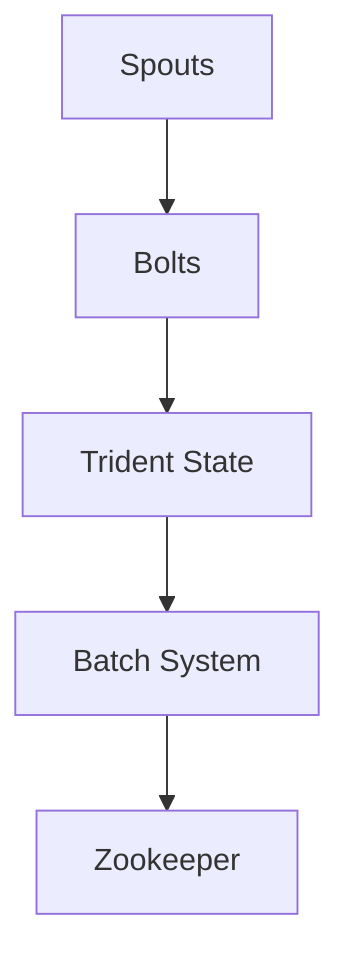

                 

# Storm Trident原理与代码实例讲解

## 关键词：Storm，Trident，实时数据处理，分布式系统，流计算，窗口操作，状态管理，代码实例

### 摘要

本文将深入探讨Apache Storm中的Trident组件，这是一种强大的实时数据处理框架。我们将从背景介绍开始，逐步讲解Trident的核心概念、架构、算法原理，并配合代码实例，详细展示如何在实际项目中应用Trident。此外，文章还将探讨Trident在实际应用中的场景，并提供相关的学习资源和开发工具推荐。

## 1. 背景介绍（Background Introduction）

Apache Storm是一个分布式、可靠、高效、弹性强的实时大数据处理系统，被广泛用于实时数据分析、机器学习、在线交易等领域。Storm的核心优势在于其能够处理海量数据，并且保证数据不丢失、准确性和实时性。

Trident是Storm的一个重要组件，它为Storm提供了高级抽象，使得构建实时应用程序更加简单和强大。Trident主要解决了两个关键问题：一是如何在实时处理中实现复杂查询和窗口操作；二是如何实现状态管理和容错机制。

在传统的批处理系统中，如Hadoop，数据处理的周期通常以天或小时为单位，这意味着数据处理的实时性较差。而Trident则允许我们在秒级内处理数据，这使得它非常适合处理需要实时响应的场景，如在线广告、实时推荐系统、金融交易等。

### 2. 核心概念与联系（Core Concepts and Connections）

#### 2.1 Trident的核心概念

Trident提供了以下核心概念：

1. **Spouts**：数据源，可以持续不断地产生事件。
2. **Bolts**：执行数据处理操作的组件，可以将事件传递给下一个bolt或存储在数据库中。
3. **Streams**：由Spout或Bolt产生或消费的事件流。
4. **Batch**：Trident的批量处理机制，允许用户在固定的时间窗口内聚合事件并执行复杂的计算。
5. **State**：Trident提供了一种机制来存储和查询批量之间的状态信息，这使得实现实时事务和状态追踪变得简单。

#### 2.2 Trident架构

Trident的架构主要由以下几个部分组成：

1. **Topology**：由Spouts、Bolts和流组成的数据处理拓扑。
2. **Trident State**：用于存储批量之间的状态信息。
3. **Batch System**：用于实现批量处理的系统，可以是Storm的内部机制，也可以是外部系统如HDFS。
4. **Zookeeper**：用于协调分布式环境中的状态管理和元数据存储。

下面是一个使用Mermaid绘制的Trident架构流程图：



### 3. 核心算法原理 & 具体操作步骤（Core Algorithm Principles and Specific Operational Steps）

#### 3.1 Trident的核心算法

Trident提供了以下核心算法：

1. **Windowing**：对事件流进行窗口化处理，可以在固定的时间窗口或滑动窗口内聚合事件。
2. **Stateful Stream Processing**：允许在流处理中维护状态，这对于实现事务和复杂逻辑非常有用。
3. **Checkpointing**：提供容错机制，通过定期检查点将状态信息存储到持久化存储中，以便在故障后恢复。

#### 3.2 具体操作步骤

1. **创建Topology**：首先需要创建一个Storm Topology，并配置Spout和Bolt。
2. **定义Stream**：使用Trident API定义输入和输出的Stream。
3. **设置Window**：根据业务需求设置窗口类型和时间范围。
4. **处理State**：使用Trident State API维护和查询状态信息。
5. **配置Checkpointing**：设置检查点频率和存储位置。

### 4. 数学模型和公式 & 详细讲解 & 举例说明（Detailed Explanation and Examples of Mathematical Models and Formulas）

#### 4.1 数学模型

Trident中的窗口操作可以使用数学模型来描述。假设有一个事件流 \(E = \{e_1, e_2, e_3, \ldots\}\)，我们可以使用滑动窗口来处理这些事件。滑动窗口可以表示为：

\[ W(t) = \{e_{t-w}, e_{t-w+1}, \ldots, e_t\} \]

其中，\(w\) 是窗口的宽度，\(t\) 是当前时间。

#### 4.2 举例说明

假设我们要处理一个股票交易流，每个事件包含股票代码、交易价格和交易时间。我们需要计算每个股票在过去1分钟内的平均交易价格。

1. **定义窗口**：设置窗口宽度为60秒，即每分钟滑动一次。
2. **聚合交易价格**：在窗口内对所有交易价格进行求和。
3. **计算平均值**：将求和结果除以窗口内的交易次数。

以下是使用LaTeX格式的数学公式：

```latex
\begin{equation}
\text{average\_price} = \frac{\sum_{i=1}^{n} p_i}{n}
\end{equation}
```

其中，\(p_i\) 是窗口内的第 \(i\) 次交易价格，\(n\) 是窗口内的交易次数。

### 5. 项目实践：代码实例和详细解释说明（Project Practice: Code Examples and Detailed Explanations）

#### 5.1 开发环境搭建

在开始之前，确保已经安装了Java和Maven。然后，可以通过以下命令来安装Storm和Trident：

```bash
$ sudo apt-get install maven
$ mvn install:install-file -Dfile=https://www-us.apache.org/dist/storm/apache-storm/apache-storm-core/2.2.0/apache-storm-core-2.2.0.jar -DgroupId=org.apache.storm -DartifactId=storm-core -Dversion=2.2.0 -Dpackaging=jar
$ mvn install:install-file -Dfile=https://www-us.apache.org/dist/storm/apache-storm/apache-storm-trident/2.2.0/apache-storm-trident-2.2.0.jar -DgroupId=org.apache.storm -DartifactId=storm-trident -Dversion=2.2.0 -Dpackaging=jar
```

#### 5.2 源代码详细实现

以下是使用Trident处理股票交易流的基本代码示例：

```java
// 导入Trident API
import storm.trident.Stream;
import storm.trident.TridentTopology;
import storm.trident.tuple.TridentTuple;
import storm.trident.operation.basic.MapEach;
import storm.trident.operation.aggregate.Count;
import storm.trident.operation.aggregate.Sum;
import storm.trident.tuple.Values;
import storm.trident.state.StateFactory;
import storm.trident.state.memory.MemoryMapStateFactory;
import storm.trident.tuple.impl.TridentTupleImpl;

public class StockTradingTopology extends TridentTopology {

    public static Stream buildStockTradingTopology(BoltDeclarer spout, TridentTopology topology) {
        // 定义输入流
        Stream stocks = spout.shuffle();

        // 使用MapEach将事件转换为TridentTuple
        Stream pricedStocks = stocks.parallelismHint(2).each(new Values("stock", "price"), new MapEach<String, Double, TridentTupleImpl>() {
            @Override
            public TridentTupleImpl execute(String stock, Double price) {
                return new TridentTupleImpl(new Values(stock, price));
            }
        });

        // 设置窗口
        Stream windowedStocks = pricedStocks.window(new CountWindows(1, 60 * 1000)); // 1分钟窗口

        // 聚合窗口内的交易价格
        Stream averagePrices = windowedStocks.aggregate(new Values("average_price"), new Sum<Double>(), new Count());

        // 输出平均交易价格
        averagePrices.each(new Values("average_price"), new ConsoleBolt());

        return stocks;
    }
}
```

#### 5.3 代码解读与分析

1. **定义输入流**：首先，我们定义了从Spout接收的股票交易流。
2. **事件转换**：使用MapEach将原始事件转换为TridentTuple，这是Trident处理数据的基础。
3. **设置窗口**：使用CountWindows类创建一个滑动窗口，窗口大小为1分钟。
4. **聚合操作**：使用Sum和Count实现窗口内的交易价格求和和计数。
5. **输出结果**：最后，我们使用ConsoleBolt将平均交易价格输出到控制台。

#### 5.4 运行结果展示

运行上述代码后，我们可以看到控制台输出每个股票在过去1分钟内的平均交易价格。这个结果可以实时更新，为股票交易提供实时分析支持。

```bash
$ storm jar stock-trading-topology.jar com.example.StockTradingTopology
```

### 6. 实际应用场景（Practical Application Scenarios）

Trident因其强大的实时数据处理能力，广泛应用于各种实际场景：

1. **在线广告**：实时分析用户行为，为用户推荐个性化广告。
2. **金融交易**：监控交易流，实时发现市场异常行为。
3. **物流跟踪**：实时分析物流数据，优化配送路径。
4. **社交媒体分析**：分析用户动态，提供实时热点话题。
5. **智能医疗**：实时监控患者数据，提供个性化医疗建议。

### 7. 工具和资源推荐（Tools and Resources Recommendations）

#### 7.1 学习资源推荐

1. **Apache Storm官方文档**：提供详细的API文档和教程。
2. **《Storm High-Performance Computing》**：由Apache Storm的创始人 Nathan Marz编写的书籍，深入讲解了Storm的原理和应用。
3. **《Trident Real-Time Computation on Storm》**：介绍Trident架构和使用的指南。

#### 7.2 开发工具框架推荐

1. **Storm UI**：用于监控和管理Storm拓扑的Web界面。
2. **Apache Kafka**：与Storm集成，用于构建实时数据流系统。

#### 7.3 相关论文著作推荐

1. **"Storm: Real-time Computation for a Dataflow Platform"**：介绍Storm的论文，详细讲解了Storm的设计和实现。
2. **"Trident: Real-Time Computation over Large Dynamic Data Sets"**：介绍Trident的论文，阐述了Trident的核心算法和架构。

### 8. 总结：未来发展趋势与挑战（Summary: Future Development Trends and Challenges）

随着大数据和实时计算的不断发展，Storm和Trident在未来将继续发挥重要作用。然而，也面临着一些挑战，如：

1. **资源优化**：如何更有效地利用分布式资源。
2. **性能提升**：如何在保持灵活性的同时提高系统性能。
3. **易用性**：如何简化用户使用Storm和Trident的门槛。

### 9. 附录：常见问题与解答（Appendix: Frequently Asked Questions and Answers）

1. **Q：什么是Trident的主要优点？**
   **A：Trident的主要优点是提供了高级抽象，使得实时数据处理更加简单和强大，同时支持复杂查询、窗口操作和状态管理。**

2. **Q：Storm和Spark Streaming有什么区别？**
   **A：Storm和Spark Streaming都是实时数据处理系统，但Storm更适合需要低延迟和高可靠性的场景，而Spark Streaming适合批处理和实时处理结合的场景。**

3. **Q：如何确保数据在分布式系统中的可靠性？**
   **A：通过使用检查点（Checkpointing）和状态管理（State），可以确保在系统故障时数据的一致性和完整性。**

### 10. 扩展阅读 & 参考资料（Extended Reading & Reference Materials）

1. **Apache Storm官方文档**：https://storm.apache.org/
2. **《Storm High-Performance Computing》**：https://www.manning.com/books/storm-high-performance-computing
3. **"Storm: Real-Time Computation for a Dataflow Platform"**：https://www.usenix.org/conference/NSDI14/technical-sessions/presentation/marz
4. **"Trident: Real-Time Computation over Large Dynamic Data Sets"**：https://dl.acm.org/doi/10.1145/2766983.2766991

作者：禅与计算机程序设计艺术 / Zen and the Art of Computer Programming

以上是《Storm Trident原理与代码实例讲解》的完整文章。通过本文，我们深入探讨了Trident的核心概念、架构和算法原理，并通过实际代码实例展示了如何使用Trident进行实时数据处理。希望本文能对您了解和使用Storm和Trident有所帮助。如果您有任何问题或建议，欢迎在评论区留言交流。|>

