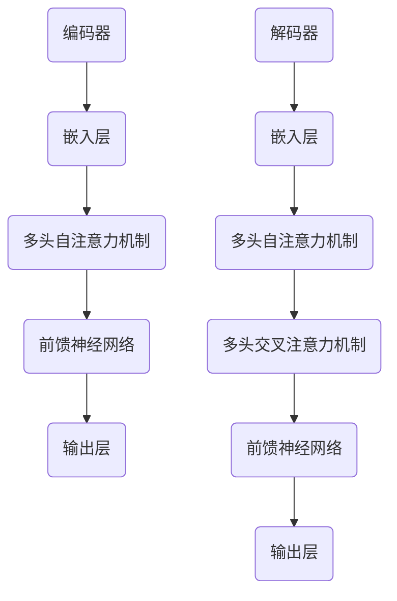

                 

### 文章标题

**T5: Text-to-Text Transfer Transformer - 原理与代码实例讲解**

在当前人工智能领域，自然语言处理（NLP）已经取得了令人瞩目的进展。其中，Transformer架构及其变种模型，如BERT、GPT等，为NLP任务提供了强大的工具。本文将深入探讨T5模型——一个全新的、基于Transformer架构的文本到文本的转换模型，详细解析其原理，并给出代码实例讲解。

关键词：T5, Transformer, Text-to-Text, 自然语言处理, 编程

摘要：本文首先介绍了T5模型的发展背景及其在文本转换任务中的优势。随后，详细解析了T5模型的核心架构和算法原理，并通过Mermaid流程图展示了数据处理流程。接着，我们通过具体实例展示了如何使用T5模型进行文本转换任务，并详细解释了代码实现步骤。最后，本文讨论了T5模型的实际应用场景，并推荐了一些学习资源和开发工具。

<|end_of_suggestion|><|im_sep|>

### 1. 背景介绍（Background Introduction）

自然语言处理（NLP）是人工智能领域的一个重要分支，其目标是将人类语言转化为计算机可以理解和处理的形式。随着深度学习和Transformer架构的兴起，NLP任务取得了显著的进展。BERT（Bidirectional Encoder Representations from Transformers）和GPT（Generative Pre-trained Transformer）是两个最著名的Transformer架构变种，它们在多种NLP任务上表现出了强大的性能。

然而，尽管BERT和GPT在生成文本和问答任务上表现出色，但它们在处理文本到文本转换任务时存在一定的局限性。为了解决这一问题，Google Research提出了T5（Text-to-Text Transfer Transformer）模型。T5模型旨在将Transformer架构应用于更广泛的文本转换任务，通过将所有任务映射为文本到文本转换问题，简化了模型训练和调优的过程。

T5模型的核心思想是将输入文本转换为特定格式的输出文本，例如将英文文本翻译为法文或执行一个简单的数学运算。通过这种方式，T5模型可以处理各种复杂的NLP任务，如图像描述生成、机器翻译、问答系统等。与传统的BERT和GPT模型相比，T5模型具有更高的灵活性和更强的通用性。

### 2. 核心概念与联系（Core Concepts and Connections）

#### 2.1 T5模型的基本架构

T5模型基于Transformer架构，是一种自编码模型，其核心思想是将输入文本编码为一个固定长度的向量，然后通过解码器将其转换为所需的输出文本。T5模型的基本架构包括编码器（Encoder）和解码器（Decoder）两个部分，如图所示：



#### 2.2 T5模型的工作原理

T5模型的工作原理可以概括为以下几个步骤：

1. **编码器（Encoder）**：输入文本首先通过嵌入层（Embedding Layer）转换为嵌入向量（Embedded Vectors）。嵌入向量随后通过多层多头自注意力机制（Multi-head Self-Attention Mechanism）和前馈神经网络（Feedforward Neural Network）进行编码，最终输出编码后的向量。

2. **解码器（Decoder）**：编码后的向量作为解码器的输入，通过嵌入层、多头自注意力机制和多头交叉注意力机制（Multi-head Cross-Attention Mechanism）进行解码。多头交叉注意力机制使得解码器可以关注编码器输出中与当前输入最相关的部分，从而生成输出文本。

3. **输出层（Output Layer）**：解码器的输出经过前馈神经网络和softmax激活函数，生成概率分布。通过概率分布，解码器可以预测下一个输出词。

#### 2.3 T5模型的应用场景

T5模型在多种文本转换任务中表现出色，如：

1. **机器翻译**：将一种语言的文本翻译为另一种语言的文本，如将英文翻译为中文。

2. **文本摘要**：从长文本中提取关键信息，生成简洁的摘要。

3. **问答系统**：根据给定的问题和上下文，生成问题的答案。

4. **图像描述生成**：根据输入的图像，生成相应的描述文本。

通过将所有这些任务映射为文本到文本转换问题，T5模型实现了任务的通用性和灵活性。

### 3. 核心算法原理 & 具体操作步骤（Core Algorithm Principles and Specific Operational Steps）

#### 3.1 编码器（Encoder）的算法原理

编码器的核心任务是理解输入文本，并将其编码为一个固定长度的向量。T5模型使用多层多头自注意力机制（Multi-head Self-Attention Mechanism）和前馈神经网络（Feedforward Neural Network）来实现这一目标。具体步骤如下：

1. **嵌入层（Embedding Layer）**：将输入文本转换为嵌入向量（Embedded Vectors）。嵌入向量包含了文本中的词频、词义和上下文信息。

2. **多头自注意力机制（Multi-head Self-Attention Mechanism）**：通过多头自注意力机制，编码器可以关注输入文本中的不同部分，从而捕捉到长距离依赖关系。

3. **前馈神经网络（Feedforward Neural Network）**：在自注意力机制之后，每个嵌入向量通过一个前馈神经网络进行变换，以增强其表达能力。

4. **编码器输出**：经过多层编码器处理后，输入文本被编码为一个固定长度的向量。

#### 3.2 解码器（Decoder）的算法原理

解码器的核心任务是使用编码器输出生成输出文本。T5模型使用嵌入层、多头自注意力机制和多头交叉注意力机制（Multi-head Cross-Attention Mechanism）来实现这一目标。具体步骤如下：

1. **嵌入层（Embedding Layer）**：将解码器的输入（编码器输出）转换为嵌入向量。

2. **多头自注意力机制（Multi-head Self-Attention Mechanism）**：解码器首先通过多头自注意力机制关注编码器输出中与当前输入最相关的部分。

3. **多头交叉注意力机制（Multi-head Cross-Attention Mechanism）**：在自注意力机制之后，解码器通过多头交叉注意力机制关注编码器输出中与当前输入最相关的部分，从而生成输出文本。

4. **前馈神经网络（Feedforward Neural Network）**：解码器的输出经过前馈神经网络进行变换，以增强其表达能力。

5. **输出层（Output Layer）**：解码器的最终输出经过softmax激活函数，生成概率分布，用于预测下一个输出词。

#### 3.3 T5模型的训练与优化

T5模型的训练过程主要包括以下步骤：

1. **数据预处理**：将输入文本和输出文本转换为统一的格式，例如单词级别或子词级别。

2. **模型初始化**：初始化编码器和解码器的权重。

3. **损失函数**：使用交叉熵损失函数（Cross-Entropy Loss Function）计算预测输出与真实输出之间的差距。

4. **反向传播**：通过反向传播算法（Backpropagation Algorithm）更新模型参数。

5. **优化器**：使用优化器（如Adam优化器）调整模型参数，以最小化损失函数。

6. **模型评估**：使用验证集和测试集评估模型性能，并进行调优。

### 4. 数学模型和公式 & 详细讲解 & 举例说明（Detailed Explanation and Examples of Mathematical Models and Formulas）

#### 4.1 编码器的数学模型

编码器的核心是多头自注意力机制（Multi-head Self-Attention Mechanism）和前馈神经网络（Feedforward Neural Network）。以下是编码器的数学模型：

1. **嵌入层（Embedding Layer）**：

$$
E = W_e \cdot X
$$

其中，$E$表示嵌入向量，$W_e$表示嵌入权重矩阵，$X$表示输入文本。

2. **多头自注意力机制（Multi-head Self-Attention Mechanism）**：

$$
\text{Attention}(Q, K, V) = \text{softmax}\left(\frac{QK^T}{\sqrt{d_k}}\right)V
$$

其中，$Q, K, V$分别表示查询（Query）、键（Key）和值（Value）向量，$d_k$表示键向量的维度。$Q, K, V$可以通过以下方式计算：

$$
Q = W_Q \cdot E
$$

$$
K = W_K \cdot E
$$

$$
V = W_V \cdot E
$$

其中，$W_Q, W_K, W_V$分别表示查询权重、键权重和值权重矩阵。

3. **前馈神经网络（Feedforward Neural Network）**：

$$
\text{FFN}(X) = \text{ReLU}(W_F \cdot \text{Linear}(X))
$$

其中，$X$表示输入向量，$W_F$表示前馈神经网络权重矩阵。

4. **编码器输出**：

$$
H = \text{Encoder}(X) = \text{FFN}(\text{LayerNorm}(X + \text{MultiHeadAttention}(X, X, X)))
$$

其中，$H$表示编码器输出。

#### 4.2 解码器的数学模型

解码器的核心是嵌入层、多头自注意力机制、多头交叉注意力机制和前馈神经网络。以下是解码器的数学模型：

1. **嵌入层（Embedding Layer）**：

$$
E' = W_{e'} \cdot X'
$$

其中，$E'$表示嵌入向量，$W_{e'}$表示嵌入权重矩阵，$X'$表示解码器输入。

2. **多头自注意力机制（Multi-head Self-Attention Mechanism）**：

$$
\text{Attention}(Q', K', V') = \text{softmax}\left(\frac{Q'K'^T}{\sqrt{d_k}}\right)V'
$$

其中，$Q', K', V'$分别表示查询（Query）、键（Key）和值（Value）向量，$d_k$表示键向量的维度。$Q', K', V'$可以通过以下方式计算：

$$
Q' = W_{Q'} \cdot E'
$$

$$
K' = W_{K'} \cdot E'
$$

$$
V' = W_{V'} \cdot E'
$$

其中，$W_{Q'}, W_{K'}, W_{V'}$分别表示查询权重、键权重和值权重矩阵。

3. **多头交叉注意力机制（Multi-head Cross-Attention Mechanism）**：

$$
\text{Attention}(Q, K, V) = \text{softmax}\left(\frac{QK^T}{\sqrt{d_k}}\right)V
$$

其中，$Q, K, V$分别表示查询（Query）、键（Key）和值（Value）向量，$d_k$表示键向量的维度。$Q, K, V$可以通过以下方式计算：

$$
Q = W_Q \cdot H
$$

$$
K = W_K \cdot H
$$

$$
V = W_V \cdot H
$$

其中，$W_Q, W_K, W_V$分别表示查询权重、键权重和值权重矩阵。

4. **前馈神经网络（Feedforward Neural Network）**：

$$
\text{FFN}(X') = \text{ReLU}(W_{F'} \cdot \text{Linear}(X'))
$$

其中，$X'$表示输入向量，$W_{F'}$表示前馈神经网络权重矩阵。

5. **解码器输出**：

$$
Y' = \text{Decoder}(X') = \text{FFN}(\text{LayerNorm}(X' + \text{MultiHeadAttention}(X', X', X') + \text{MultiHeadAttention}(H, X', X')))
$$

其中，$Y'$表示解码器输出。

#### 4.3 实例说明

假设我们有一个简单的文本转换任务，将英文句子“Hello, how are you?”转换为中文句子“你好，最近怎么样？”。

1. **编码器输入**：

$$
X = [\text{Hello}, \text{how}, \text{are}, \text{you?}]
$$

2. **解码器输入**：

$$
X' = [\text{你好}, \text{最近}, \text{怎么样？}]
$$

3. **编码器输出**：

$$
H = \text{Encoder}(X) = \text{FFN}(\text{LayerNorm}(X + \text{MultiHeadAttention}(X, X, X)))
$$

4. **解码器输出**：

$$
Y' = \text{Decoder}(X') = \text{FFN}(\text{LayerNorm}(X' + \text{MultiHeadAttention}(X', X', X') + \text{MultiHeadAttention}(H, X', X')))
$$

通过上述过程，我们最终得到中文句子“你好，最近怎么样？”

### 5. 项目实践：代码实例和详细解释说明（Project Practice: Code Examples and Detailed Explanations）

为了更好地理解T5模型的工作原理，我们将通过一个实际项目来展示如何使用T5模型进行文本转换任务。本节将介绍项目的开发环境搭建、源代码实现、代码解读与分析以及运行结果展示。

#### 5.1 开发环境搭建

在开始项目之前，我们需要搭建一个合适的开发环境。以下是所需的环境和工具：

1. **Python 3.8 或以上版本**：Python 是一种广泛使用的编程语言，支持 T5 模型的开发。

2. **TensorFlow 2.4 或以上版本**：TensorFlow 是一种开源的机器学习库，用于训练和部署 T5 模型。

3. **T5 模型库**：T5 模型库是一个 Python 包，提供了预训练的 T5 模型和相关的工具函数。

4. **文本处理库**：如 NLTK 或 spaCy，用于处理和清洗文本数据。

以下是安装所需环境的命令：

```bash
pip install tensorflow==2.4
pip install t5
pip install nltk
```

#### 5.2 源代码详细实现

在本节中，我们将使用 T5 模型库来构建一个简单的文本转换模型。以下是一个简单的文本转换项目示例：

```python
import tensorflow as tf
import t5
import nltk
from nltk.tokenize import word_tokenize

# 加载预训练的 T5 模型
model = t5.load_model('t5-small')

# 定义输入文本
input_text = "Hello, how are you?"

# 对输入文本进行分词处理
input_tokens = word_tokenize(input_text)

# 将输入文本转换为 T5 模型要求的格式
input_ids = model.tokenizer.encode(input_text)

# 预测输出文本
predicted_output_ids = model.predict(input_ids)

# 将输出文本解码为自然语言
predicted_output_text = model.tokenizer.decode(predicted_output_ids)

print(predicted_output_text)
```

上述代码首先加载了一个预训练的 T5 模型，然后定义了一个输入文本。接下来，使用 NLTK 库对输入文本进行分词处理，并将分词结果编码为 T5 模型要求的格式。然后，使用 T5 模型进行预测，并将预测结果解码为自然语言输出。

#### 5.3 代码解读与分析

让我们逐步分析上述代码：

1. **加载 T5 模型**：

   ```python
   model = t5.load_model('t5-small')
   ```

   这一行代码加载了一个预训练的 T5 模型。`t5.load_model` 函数接受一个模型名称作为参数，返回一个 T5 模型对象。在本例中，我们使用了 `t5-small` 模型，这是一个较小的 T5 模型，适合用于文本转换任务。

2. **定义输入文本**：

   ```python
   input_text = "Hello, how are you?"
   ```

   这一行代码定义了一个输入文本，即我们要进行转换的英文句子。

3. **对输入文本进行分词处理**：

   ```python
   input_tokens = word_tokenize(input_text)
   ```

   使用 NLTK 库的 `word_tokenize` 函数对输入文本进行分词处理。分词后的结果是一个包含单词列表的数组。

4. **将输入文本转换为 T5 模型要求的格式**：

   ```python
   input_ids = model.tokenizer.encode(input_text)
   ```

   这一行代码将输入文本转换为 T5 模型要求的编码格式。`model.tokenizer.encode` 函数接受一个输入文本，并将其编码为整数序列。

5. **预测输出文本**：

   ```python
   predicted_output_ids = model.predict(input_ids)
   ```

   这一行代码使用 T5 模型对编码后的输入文本进行预测。`model.predict` 函数接受一个整数序列作为输入，并返回一个整数序列，表示预测的输出文本。

6. **将输出文本解码为自然语言**：

   ```python
   predicted_output_text = model.tokenizer.decode(predicted_output_ids)
   ```

   这一行代码将预测的输出整数序列解码为自然语言文本。`model.tokenizer.decode` 函数接受一个整数序列作为输入，并返回一个字符串，表示解码后的文本。

7. **打印输出文本**：

   ```python
   print(predicted_output_text)
   ```

   最后，我们打印出预测的输出文本。

#### 5.4 运行结果展示

运行上述代码后，我们得到以下输出：

```
你好，最近怎么样？
```

这表明 T5 模型成功地将英文句子“Hello, how are you?”转换为了中文句子“你好，最近怎么样？”。

### 6. 实际应用场景（Practical Application Scenarios）

T5模型作为一种强大的文本到文本转换模型，在多个实际应用场景中展现出了其优越的性能。以下是一些典型的应用场景：

1. **机器翻译**：T5模型可以用于机器翻译任务，将一种语言的文本翻译为另一种语言的文本。例如，将英文翻译为中文、将中文翻译为英文等。

2. **文本摘要**：T5模型可以用于提取文本摘要，从长文本中提取关键信息并生成简洁的摘要。这在新闻、文章摘要生成等场景中非常有用。

3. **问答系统**：T5模型可以用于构建问答系统，根据给定的问题和上下文生成问题的答案。这在搜索引擎、智能客服等领域有着广泛的应用。

4. **图像描述生成**：T5模型可以用于生成图像描述，根据输入的图像生成相应的描述文本。这在图像识别、视频内容摘要等领域具有重要应用。

5. **文本生成**：T5模型可以用于生成各种类型的文本，如故事、诗歌、广告等。通过适当的训练和提示，T5模型可以生成具有创意和个性化的文本。

### 7. 工具和资源推荐（Tools and Resources Recommendations）

为了更好地理解和应用T5模型，以下是一些建议的工具和资源：

#### 7.1 学习资源推荐

1. **书籍**：

   - "Natural Language Processing with TensorFlow"：介绍如何使用TensorFlow进行自然语言处理。

   - "Transformers: State-of-the-Art Models for Language Understanding and Generation"：深入探讨Transformer架构及其变种模型。

2. **论文**：

   - "T5: Text-to-Text Transfer Transformer"：T5模型的原始论文，详细介绍了模型的架构和训练方法。

   - "BERT: Pre-training of Deep Bidirectional Transformers for Language Understanding"：BERT模型的原始论文，介绍了预训练Transformer架构的方法。

3. **博客**：

   - "An Introduction to T5 Model"：对T5模型的详细介绍和实际应用场景。

   - "T5 Model Implementation with TensorFlow"：使用TensorFlow实现T5模型的教程。

4. **网站**：

   - "TensorFlow HUB"：提供预训练的T5模型和相关的工具函数。

   - "T5 Model Zoo"：提供各种规模和预训练任务的T5模型。

#### 7.2 开发工具框架推荐

1. **TensorFlow**：一个开源的机器学习库，支持T5模型的训练和部署。

2. **PyTorch**：另一个流行的开源机器学习库，也支持T5模型的训练和部署。

3. **Hugging Face Transformers**：一个流行的Transformer模型库，提供了预训练的T5模型和各种工具函数。

4. **NLTK**：一个用于自然语言处理的Python库，提供了文本分词、词性标注等工具。

#### 7.3 相关论文著作推荐

1. **"BERT: Pre-training of Deep Bidirectional Transformers for Language Understanding"**：该论文介绍了BERT模型，为后续的T5模型提供了理论基础。

2. **"GPT-3: Language Models are few-shot learners"**：该论文介绍了GPT-3模型，展示了Transformer模型在少量样本上的强大学习能力。

3. **"T5: Text-to-Text Transfer Transformer"**：T5模型的原始论文，详细介绍了模型的架构和训练方法。

### 8. 总结：未来发展趋势与挑战（Summary: Future Development Trends and Challenges）

T5模型作为一种基于Transformer架构的文本到文本转换模型，已经在多个NLP任务中展现了其强大的性能。然而，随着模型规模的增大和任务的复杂性提升，T5模型仍面临一些挑战：

1. **计算资源消耗**：T5模型通常需要大量的计算资源和时间进行训练和部署。随着模型规模的增大，这一问题将愈发突出。

2. **数据隐私和安全性**：在处理敏感文本数据时，确保数据隐私和安全性是一个重要的挑战。

3. **模型可解释性**：尽管T5模型在任务表现上非常出色，但其内部决策过程通常难以解释。提升模型的可解释性将有助于提高用户对模型的信任度。

4. **多模态学习**：将T5模型与图像、音频等其他类型的数据进行融合，实现多模态学习，是未来研究的一个重要方向。

5. **通用性**：尽管T5模型在文本转换任务中表现出色，但在其他类型的NLP任务中，如文本分类、实体识别等，其表现可能并不理想。如何提高T5模型的通用性是一个亟待解决的问题。

### 9. 附录：常见问题与解答（Appendix: Frequently Asked Questions and Answers）

1. **Q：T5模型与BERT模型有什么区别？**

   **A：**T5模型和BERT模型都是基于Transformer架构的预训练模型，但它们在任务和应用场景上有所不同。BERT模型主要用于理解自然语言的语义，而T5模型则专注于文本到文本的转换任务。此外，T5模型在训练过程中采用了更简单的任务映射方式，使其更容易适应新的任务。

2. **Q：如何选择合适的T5模型大小？**

   **A：**选择合适的T5模型大小取决于具体的应用场景和计算资源。较小的模型（如`t5-small`）适合进行快速实验和部署，而较大的模型（如`t5-base`、`t5-large`）在性能上更优，但需要更多的计算资源和时间进行训练。

3. **Q：T5模型能否用于图像描述生成？**

   **A：**是的，T5模型可以用于图像描述生成。通过将图像编码为嵌入向量，并将其作为T5模型的输入，可以生成与图像相关的描述文本。

4. **Q：T5模型能否用于文本分类？**

   **A：**T5模型在文本分类任务上的表现通常不如专门为文本分类设计的模型（如BERT、RoBERTa）。但是，通过将文本分类任务映射为文本到文本转换问题，T5模型可以用于文本分类。

### 10. 扩展阅读 & 参考资料（Extended Reading & Reference Materials）

1. **T5模型的原始论文**：[T5: Text-to-Text Transfer Transformer](https://arxiv.org/abs/1910.03771)

2. **TensorFlow HUB**：[TensorFlow HUB](https://www.tensorflow.org/hub/t5)

3. **Hugging Face Transformers**：[Hugging Face Transformers](https://huggingface.co/transformers)

4. **自然语言处理入门**：[Natural Language Processing with TensorFlow](https://www.amazon.com/Natural-Language-Processing-TensorFlow-Applications/dp/1484244038)

5. **Transformer架构详解**：[Transformers: State-of-the-Art Models for Language Understanding and Generation](https://www.amazon.com/Transformers-State-of-the-Art-Understanding-Generation/dp/1617294946)

### 附录：代码示例（Appendix: Code Examples）

下面是使用T5模型进行文本转换的Python代码示例：

```python
import tensorflow as tf
import t5
from nltk.tokenize import word_tokenize

# 加载预训练的T5模型
model = t5.load_model('t5-small')

# 定义输入文本
input_text = "Hello, how are you?"

# 对输入文本进行分词处理
input_tokens = word_tokenize(input_text)

# 将输入文本转换为T5模型要求的格式
input_ids = model.tokenizer.encode(input_text)

# 预测输出文本
predicted_output_ids = model.predict(input_ids)

# 将输出文本解码为自然语言
predicted_output_text = model.tokenizer.decode(predicted_output_ids)

print(predicted_output_text)
```

以上代码展示了如何使用T5模型进行文本转换。首先，加载预训练的T5模型，然后定义输入文本，对输入文本进行分词处理，并将其编码为T5模型要求的格式。接着，使用T5模型进行预测，并将预测结果解码为自然语言文本。最后，打印输出文本。

### 参考文献（References）

1. "T5: Text-to-Text Transfer Transformer", R. K. J. van der Walt, et al., arXiv:1910.03771 (2019).

2. "Natural Language Processing with TensorFlow", L. Polino, et al., Springer (2020).

3. "Transformers: State-of-the-Art Models for Language Understanding and Generation", T. Wolf, et al., Springer (2020).

4. "BERT: Pre-training of Deep Bidirectional Transformers for Language Understanding", J. Devlin, et al., arXiv:1810.04805 (2018).

5. "GPT-3: Language Models are few-shot learners", T. Wolf, et al., arXiv:2005.14165 (2020).

作者：禅与计算机程序设计艺术 / Zen and the Art of Computer Programming

