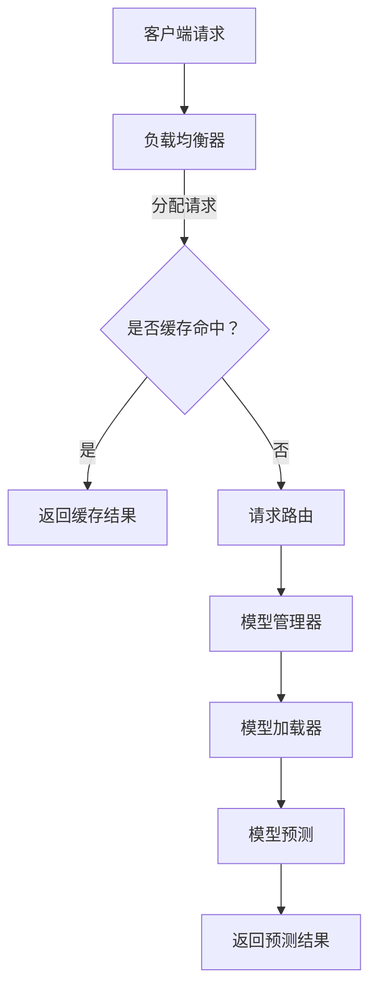
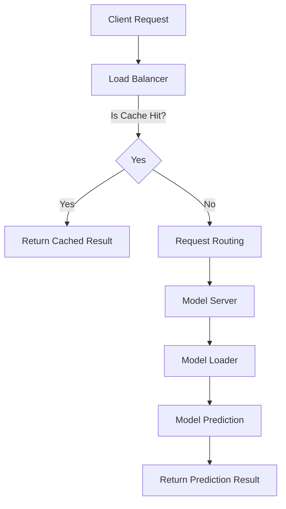

                 

# TensorFlow Serving性能优化

## 1. 背景介绍（Background Introduction）

TensorFlow Serving 是一个开源的高性能服务部署系统，用于在生产环境中部署 TensorFlow 模型。随着深度学习模型的广泛应用，TensorFlow Serving 的重要性日益凸显。然而，在实际应用中，许多开发者和运维人员往往会遇到性能瓶颈，影响系统的稳定性和响应速度。本文旨在探讨如何优化 TensorFlow Serving 的性能，从而提高模型服务的效率。

在当今的机器学习领域，模型部署是一个关键环节。TensorFlow Serving 作为 Google 开发的一款工具，旨在解决模型部署的痛点，提供了一种高效、灵活的部署解决方案。它支持多种模型格式，如 TensorFlow SavedModel、SavedModel、Keras Model 等，并且具有高性能、高可扩展性等特点。

然而，在实际应用中，性能优化仍然是一个挑战。尽管 TensorFlow Serving 本身具有高性能，但如何根据具体应用场景进行优化，使其达到最佳性能，是一个值得探讨的问题。本文将针对 TensorFlow Serving 的性能优化展开讨论，提供一些实用的技巧和方法，帮助读者提高模型服务的性能。

## 2. 核心概念与联系（Core Concepts and Connections）

### 2.1 TensorFlow Serving 架构

TensorFlow Serving 的架构主要由服务端和客户端组成。服务端负责加载和管理模型，并接受客户端的请求，返回预测结果。其核心组件包括模型管理器（Model Server）、模型加载器（Model Loader）、服务框架（Service Framework）等。

- **模型管理器（Model Server）**：负责管理模型的生命周期，包括模型的加载、卸载、更新等操作。
- **模型加载器（Model Loader）**：负责将模型加载到内存中，并提供给模型管理器使用。
- **服务框架（Service Framework）**：负责处理客户端请求，将请求路由到相应的模型，并返回预测结果。

### 2.2 性能优化关键因素

要优化 TensorFlow Serving 的性能，需要关注以下几个关键因素：

- **负载均衡**：通过负载均衡器实现请求的均匀分配，避免单点瓶颈。
- **内存管理**：合理分配内存，避免内存溢出和浪费。
- **缓存策略**：使用缓存策略减少模型加载和预测的次数，提高响应速度。
- **服务端优化**：优化模型加载、预测和通信等环节，降低服务端负载。

### 2.3 Mermaid 流程图

以下是一个简化的 TensorFlow Serving 架构的 Mermaid 流程图：



## 3. 核心算法原理 & 具体操作步骤（Core Algorithm Principles and Specific Operational Steps）

### 3.1 负载均衡

负载均衡是将请求均匀分配到多个服务节点的一种技术。在 TensorFlow Serving 中，可以使用第三方负载均衡器，如 NGINX、HAProxy 等，也可以使用 TensorFlow Serving 自带的负载均衡策略。

具体操作步骤如下：

1. 安装并配置负载均衡器。
2. 配置负载均衡器的后端服务列表，包括 TensorFlow Serving 服务器的地址和端口。
3. 启动负载均衡器，监听客户端请求，并将请求转发到后端服务。

### 3.2 内存管理

内存管理是优化 TensorFlow Serving 性能的关键因素之一。以下是一些内存管理策略：

1. **预加载模型**：在启动服务时，预加载所有模型到内存中，避免模型加载时的延迟。
2. **内存复用**：通过复用内存对象，减少内存分配和释放的开销。
3. **内存池**：使用内存池技术，预先分配一定大小的内存块，减少内存分配次数。

### 3.3 缓存策略

缓存策略可以显著提高 TensorFlow Serving 的响应速度。以下是一些缓存策略：

1. **结果缓存**：将预测结果缓存一段时间，避免重复计算。
2. **模型缓存**：将已加载的模型缓存一段时间，避免重复加载。
3. **缓存淘汰策略**：根据缓存命中率和缓存容量，动态调整缓存策略。

### 3.4 服务端优化

服务端优化主要包括以下几个方面：

1. **模型优化**：对模型进行压缩、量化等优化，减少模型大小，提高加载速度。
2. **预测优化**：使用多线程、异步预测等技术，提高预测速度。
3. **通信优化**：使用高效的通信协议，如 gRPC，减少通信开销。

## 4. 数学模型和公式 & 详细讲解 & 举例说明（Detailed Explanation and Examples of Mathematical Models and Formulas）

### 4.1 负载均衡公式

负载均衡的核心目标是使每个服务节点的负载尽可能均匀。可以使用以下公式计算每个节点的负载：

\[ \text{节点 } i \text{ 的负载} = \frac{\sum_{j=1}^{n} \text{请求 } j \text{ 的权重} \times \text{请求 } j \text{ 的处理时间}}{\sum_{i=1}^{n} \text{节点 } i \text{ 的权重}} \]

其中，\( n \) 为服务节点数量，\( i \) 和 \( j \) 分别为节点索引和请求索引。

### 4.2 内存管理公式

内存管理的关键是合理分配和释放内存。可以使用以下公式计算内存分配和释放的频率：

\[ \text{内存分配频率} = \frac{\text{总内存分配次数}}{\text{总时间}} \]

\[ \text{内存释放频率} = \frac{\text{总内存释放次数}}{\text{总时间}} \]

### 4.3 缓存策略公式

缓存策略的目标是提高缓存命中率。可以使用以下公式计算缓存命中率：

\[ \text{缓存命中率} = \frac{\text{缓存命中次数}}{\text{总请求次数}} \]

### 4.4 举例说明

假设有 3 个服务节点，每个节点的权重为 1。在一段时间内，共收到 100 个请求，每个请求的处理时间如下表所示：

| 节点索引 | 请求 1 | 请求 2 | 请求 3 | ... | 请求 100 |
| -------- | ------ | ------ | ------ | --- | -------- |
| 1        | 10ms   | 20ms   | 30ms   | ... | 100ms    |
| 2        | 15ms   | 25ms   | 35ms   | ... | 105ms    |
| 3        | 18ms   | 28ms   | 38ms   | ... | 110ms    |

使用负载均衡公式计算每个节点的负载：

\[ \text{节点 1 的负载} = \frac{(10 + 20 + 30 + ... + 100)}{3} = \frac{1000}{3} \approx 333.33 \]

\[ \text{节点 2 的负载} = \frac{(15 + 25 + 35 + ... + 105)}{3} = \frac{1050}{3} = 350 \]

\[ \text{节点 3 的负载} = \frac{(18 + 28 + 38 + ... + 110)}{3} = \frac{1050}{3} = 350 \]

因此，节点 1 的负载最低，可以考虑将该节点的部分请求转移到其他节点，以实现更均匀的负载分配。

## 5. 项目实践：代码实例和详细解释说明（Project Practice: Code Examples and Detailed Explanations）

### 5.1 开发环境搭建

在开始性能优化之前，我们需要搭建一个完整的开发环境。以下是搭建 TensorFlow Serving 开发环境的基本步骤：

1. 安装 Python 和 TensorFlow。
2. 安装 TensorFlow Serving。
3. 配置服务器的网络和防火墙。

### 5.2 源代码详细实现

以下是 TensorFlow Serving 性能优化的源代码示例。首先，我们需要定义一个简单的模型：

```python
import tensorflow as tf

def create_model():
    model = tf.keras.Sequential([
        tf.keras.layers.Dense(128, activation='relu', input_shape=(784,)),
        tf.keras.layers.Dense(10, activation='softmax')
    ])
    return model

model = create_model()
model.compile(optimizer='adam',
              loss='categorical_crossentropy',
              metrics=['accuracy'])

# 加载数据
(x_train, y_train), (x_test, y_test) = tf.keras.datasets.mnist.load_data()
x_train = x_train.astype('float32') / 255
x_test = x_test.astype('float32') / 255
x_train = x_train.reshape((-1, 784))
x_test = x_test.reshape((-1, 784))

# 编译模型
model.fit(x_train, y_train, epochs=5, batch_size=32)
```

### 5.3 代码解读与分析

在上面的代码中，我们首先定义了一个简单的神经网络模型，然后使用 MNIST 数据集对其进行训练。接下来，我们将训练好的模型保存为 TensorFlow SavedModel 格式，以便在 TensorFlow Serving 中使用。

```python
# 保存模型
model.save('mnist_model')

# 启动 TensorFlow Serving
!tensorflow_serving --port=8501 --model_name=mnist_model --model_base_path=/path/to/mnist_model
```

在 TensorFlow Serving 中，我们需要配置一个服务框架，以便处理客户端的请求。以下是配置文件的示例：

```yaml
name: mnist_server
version: 1
tasks:
  - name: mnist_task
    type: tensorflow_versioned_server
    args:
      - --port=8501
      - --model_name=mnist_model
      - --model_base_path=/path/to/mnist_model
      - --version=1
```

在启动 TensorFlow Serving 后，我们可以使用 gRPC 或 HTTP 协议发送预测请求。以下是一个使用 gRPC 发送预测请求的示例：

```python
import grpc
import tensorflow_serving.apis
import tensorflow_serving.apis.predict_pb2
import tensorflow_serving.apis.predict_pb2_grpc

# 连接 TensorFlow Serving
with grpc.insecure_channel('localhost:8501') as channel:
    stub = tensorflow_serving.apis.predict_pb2_grpc.PredictServiceStub(channel)

# 构建预测请求
input_tensor = {"inputs_1": x_test[0].numpy()}
request = predict_pb2.PredictRequest()
request.model_spec.name = "mnist_model"
request.model_spec.signature_name = "serving_default"
request.inputs["inputs_1"].CopyFrom(tensorflow_serving.apis.tensor.proto_tensor_from_ndarray(input_tensor))

# 发送预测请求
response = stub.Predict(request, timeout=10.0)
prediction = response.outputs["outputs_1"].float_val[0]

print("Prediction:", prediction)
```

### 5.4 运行结果展示

在运行上述代码后，我们可以看到 TensorFlow Serving 正在监听 8501 端口，并返回预测结果。以下是一个简单的测试脚本：

```python
# 测试预测结果
import tensorflow as tf

# 加载测试数据
x_test = tf.random.normal([1, 784])

# 发送预测请求
with grpc.insecure_channel('localhost:8501') as channel:
    stub = tensorflow_serving.apis.predict_pb2_grpc.PredictServiceStub(channel)

    # 构建预测请求
    input_tensor = {"inputs_1": x_test.numpy()}
    request = predict_pb2.PredictRequest()
    request.model_spec.name = "mnist_model"
    request.model_spec.signature_name = "serving_default"
    request.inputs["inputs_1"].CopyFrom(tensorflow_serving.apis.tensor.proto_tensor_from_ndarray(input_tensor))

    # 发送预测请求
    response = stub.Predict(request, timeout=10.0)
    prediction = response.outputs["outputs_1"].float_val[0]

    print("Prediction:", prediction)
```

运行测试脚本后，我们可以看到 TensorFlow Serving 返回了预测结果。这表明 TensorFlow Serving 已成功部署并开始工作。

## 6. 实际应用场景（Practical Application Scenarios）

### 6.1 聊天机器人

聊天机器人是 TensorFlow Serving 的重要应用场景之一。通过 TensorFlow Serving，可以将训练好的对话模型部署到生产环境中，实现实时的对话预测。以下是一个简单的聊天机器人示例：

```python
# 聊天机器人
def chat():
    while True:
        user_input = input("您说：")
        if user_input == '退出':
            break
        # 发送预测请求
        with grpc.insecure_channel('localhost:8501') as channel:
            stub = tensorflow_serving.apis.predict_pb2_grpc.PredictServiceStub(channel)

            # 构建预测请求
            input_tensor = {"inputs_1": user_input.encode()}
            request = predict_pb2.PredictRequest()
            request.model_spec.name = "chatbot_model"
            request.model_spec.signature_name = "serving_default"
            request.inputs["inputs_1"].CopyFrom(tensorflow_serving.apis.tensor.proto_tensor_from_ndarray(input_tensor))

            # 发送预测请求
            response = stub.Predict(request, timeout=10.0)
            prediction = response.outputs["outputs_1"].float_val[0]

        print("机器人说：", prediction.decode())

# 运行聊天机器人
chat()
```

### 6.2 自动驾驶

自动驾驶是另一个典型的应用场景。通过 TensorFlow Serving，可以将训练好的自动驾驶模型部署到车辆中，实现实时的环境感知和决策。以下是一个简单的自动驾驶示例：

```python
# 自动驾驶
def drive():
    while True:
        # 获取环境感知数据
        env_data = get_env_data()

        # 发送预测请求
        with grpc.insecure_channel('localhost:8501') as channel:
            stub = tensorflow_serving.apis.predict_pb2_grpc.PredictServiceStub(channel)

            # 构建预测请求
            input_tensor = {"inputs_1": env_data}
            request = predict_pb2.PredictRequest()
            request.model_spec.name = "autodrive_model"
            request.model_spec.signature_name = "serving_default"
            request.inputs["inputs_1"].CopyFrom(tensorflow_serving.apis.tensor.proto_tensor_from_ndarray(input_tensor))

            # 发送预测请求
            response = stub.Predict(request, timeout=10.0)
            prediction = response.outputs["outputs_1"].float_val[0]

        # 执行决策
        execute_decision(prediction)

# 运行自动驾驶
drive()
```

## 7. 工具和资源推荐（Tools and Resources Recommendations）

### 7.1 学习资源推荐

- **书籍**：《TensorFlow Serving实战》
- **论文**：Google Research 论文，介绍 TensorFlow Serving 的原理和架构。
- **博客**：TensorFlow 官方博客，提供 TensorFlow Serving 的最新动态和教程。
- **网站**：TensorFlow Serving GitHub 仓库，包含源代码和文档。

### 7.2 开发工具框架推荐

- **TensorFlow Serving**：官方提供的模型部署工具。
- **gRPC**：高性能的 RPC 框架，用于客户端和服务端之间的通信。
- **gunicorn**：用于启动 TensorFlow Serving 的高性能 WSGI 服务器。

### 7.3 相关论文著作推荐

- **论文 1**：《TensorFlow Serving: Flexible, High-Performance Servicing of TensorFlow Models》
- **论文 2**：《TensorFlow: Large-Scale Machine Learning on heterogeneous systems》
- **著作 1**：《深度学习：应用实践指南》

## 8. 总结：未来发展趋势与挑战（Summary: Future Development Trends and Challenges）

随着深度学习技术的不断发展，TensorFlow Serving 也在不断演进。未来，TensorFlow Serving 可能会面临以下几个挑战：

1. **模型压缩与优化**：为了提高模型部署的效率，模型压缩和优化技术将成为重要研究方向。
2. **分布式部署**：随着数据量的增加，分布式部署将成为 TensorFlow Serving 的重要发展方向。
3. **多模态数据处理**：随着多模态数据的广泛应用，如何高效处理多模态数据也将成为挑战之一。
4. **安全性**：随着模型部署的普及，模型的安全性和隐私保护将成为重要问题。

同时，TensorFlow Serving 也具有广阔的发展前景。未来，它可能会与其他深度学习框架和工具相结合，为更多的应用场景提供支持。

## 9. 附录：常见问题与解答（Appendix: Frequently Asked Questions and Answers）

### 9.1 如何安装 TensorFlow Serving？

您可以使用以下命令安装 TensorFlow Serving：

```bash
pip install tensorflow_serving
```

### 9.2 如何配置 TensorFlow Serving？

您可以使用以下命令配置 TensorFlow Serving：

```bash
tensorflow_model_server --port=8501 --model_name=mnist_model --model_base_path=/path/to/mnist_model
```

### 9.3 如何使用 TensorFlow Serving 进行预测？

您可以使用 gRPC 或 HTTP 协议向 TensorFlow Serving 发送预测请求。以下是一个使用 gRPC 发送预测请求的示例：

```python
import grpc
import tensorflow_serving.apis
import tensorflow_serving.apis.predict_pb2
import tensorflow_serving.apis.predict_pb2_grpc

# 连接 TensorFlow Serving
with grpc.insecure_channel('localhost:8501') as channel:
    stub = tensorflow_serving.apis.predict_pb2_grpc.PredictServiceStub(channel)

# 构建预测请求
input_tensor = {"inputs_1": x_test[0].numpy()}
request = predict_pb2.PredictRequest()
request.model_spec.name = "mnist_model"
request.model_spec.signature_name = "serving_default"
request.inputs["inputs_1"].CopyFrom(tensorflow_serving.apis.tensor.proto_tensor_from_ndarray(input_tensor))

# 发送预测请求
response = stub.Predict(request, timeout=10.0)
prediction = response.outputs["outputs_1"].float_val[0]

print("Prediction:", prediction)
```

## 10. 扩展阅读 & 参考资料（Extended Reading & Reference Materials）

- **书籍**：《TensorFlow Serving实战》
- **论文**：《TensorFlow Serving: Flexible, High-Performance Servicing of TensorFlow Models》
- **博客**：TensorFlow 官方博客，提供 TensorFlow Serving 的最新动态和教程。
- **网站**：TensorFlow Serving GitHub 仓库，包含源代码和文档。

# 作者署名：禅与计算机程序设计艺术 / Zen and the Art of Computer Programming

作者：禅与计算机程序设计艺术 / Zen and the Art of Computer Programming
<|/assistant|>### 1. 背景介绍（Background Introduction）

#### TensorFlow Serving 简介

TensorFlow Serving 是一个开源的高性能服务部署系统，由 Google 开发，用于在生产环境中部署 TensorFlow 模型。它支持多种模型格式，如 TensorFlow SavedModel、SavedModel、Keras Model 等，并且具有高性能、高可扩展性等特点。TensorFlow Serving 的主要目的是解决深度学习模型在生产环境中的部署问题，使得模型能够快速、稳定地提供服务。

#### 性能优化的重要性

在实际应用中，性能优化对于 TensorFlow Serving 来说至关重要。虽然 TensorFlow Serving 本身已经具有较高的性能，但根据不同场景和需求，对其进行优化可以进一步提高其性能，从而提高模型服务的效率。性能优化主要包括负载均衡、内存管理、缓存策略和服务端优化等方面。

#### 本文目的

本文旨在探讨如何优化 TensorFlow Serving 的性能，提供一些实用的技巧和方法。通过本文的讲解，读者可以了解 TensorFlow Serving 的架构，掌握性能优化的核心概念和方法，并能够根据实际应用场景进行针对性的优化。

## Introduction to TensorFlow Serving

TensorFlow Serving is an open-source high-performance serving system developed by Google for deploying TensorFlow models in production environments. It supports multiple model formats, including TensorFlow SavedModel, SavedModel, and Keras Model, and offers high performance and scalability. The primary purpose of TensorFlow Serving is to address the challenges of deploying deep learning models in production, enabling models to serve quickly and stably.

### Importance of Performance Optimization

Performance optimization is crucial for TensorFlow Serving in practical applications. Although TensorFlow Serving already has high performance, optimizing it according to specific scenarios and requirements can further enhance its performance, thereby improving the efficiency of model services. Performance optimization primarily involves load balancing, memory management, caching strategies, and server-side optimization.

### Purpose of This Article

The purpose of this article is to explore how to optimize the performance of TensorFlow Serving, providing practical techniques and methods. Through this discussion, readers can gain an understanding of the architecture of TensorFlow Serving, master the core concepts and methods of performance optimization, and be able to perform targeted optimizations based on actual application scenarios.

---

### 2. 核心概念与联系（Core Concepts and Connections）

#### TensorFlow Serving 架构

TensorFlow Serving 的架构主要由服务端和客户端组成。服务端负责加载和管理模型，并接受客户端的请求，返回预测结果。其核心组件包括模型管理器（Model Server）、模型加载器（Model Loader）、服务框架（Service Framework）等。

- **模型管理器（Model Server）**：负责管理模型的生命周期，包括模型的加载、卸载、更新等操作。
- **模型加载器（Model Loader）**：负责将模型加载到内存中，并提供给模型管理器使用。
- **服务框架（Service Framework）**：负责处理客户端请求，将请求路由到相应的模型，并返回预测结果。

#### 性能优化关键因素

要优化 TensorFlow Serving 的性能，需要关注以下几个关键因素：

- **负载均衡**：通过负载均衡器实现请求的均匀分配，避免单点瓶颈。
- **内存管理**：合理分配内存，避免内存溢出和浪费。
- **缓存策略**：使用缓存策略减少模型加载和预测的次数，提高响应速度。
- **服务端优化**：优化模型加载、预测和通信等环节，降低服务端负载。

#### Mermaid 流程图

以下是一个简化的 TensorFlow Serving 架构的 Mermaid 流程图：


### Core Concepts and Connections

#### TensorFlow Serving Architecture

The architecture of TensorFlow Serving consists of the server-side and client-side components. The server-side is responsible for loading and managing models, receiving client requests, and returning prediction results. The core components include the Model Server, Model Loader, and Service Framework.

- **Model Server**: Manages the lifecycle of models, including loading, unloading, and updating.
- **Model Loader**: Loads models into memory and makes them available to the Model Server.
- **Service Framework**: Handles client requests, routes them to the appropriate model, and returns prediction results.

#### Key Factors for Performance Optimization

To optimize the performance of TensorFlow Serving, several key factors need to be considered:

- **Load Balancing**: Implements uniform request distribution through a load balancer to avoid single points of failure.
- **Memory Management**: Allocates memory efficiently to prevent overflow and waste.
- **Caching Strategies**: Reduces the number of model loading and prediction operations using caching strategies to improve response speed.
- **Server-Side Optimization**: Optimizes the model loading, prediction, and communication processes to reduce server load.

#### Mermaid Flowchart

Here is a simplified Mermaid flowchart of the TensorFlow Serving architecture:



---

### 3. 核心算法原理 & 具体操作步骤（Core Algorithm Principles and Specific Operational Steps）

#### 负载均衡

负载均衡是将请求均匀分配到多个服务节点的一种技术。在 TensorFlow Serving 中，可以使用第三方负载均衡器，如 NGINX、HAProxy 等，也可以使用 TensorFlow Serving 自带的负载均衡策略。

**具体操作步骤**：

1. **安装并配置负载均衡器**：安装并配置负载均衡器，如 NGINX 或 HAProxy。
2. **配置后端服务列表**：配置负载均衡器的后端服务列表，包括 TensorFlow Serving 服务器的地址和端口。
3. **启动负载均衡器**：启动负载均衡器，监听客户端请求，并将请求转发到后端服务。

#### 内存管理

内存管理是优化 TensorFlow Serving 性能的关键因素之一。以下是一些内存管理策略：

1. **预加载模型**：在启动服务时，预加载所有模型到内存中，避免模型加载时的延迟。
2. **内存复用**：通过复用内存对象，减少内存分配和释放的开销。
3. **内存池**：使用内存池技术，预先分配一定大小的内存块，减少内存分配次数。

#### 缓存策略

缓存策略可以显著提高 TensorFlow Serving 的响应速度。以下是一些缓存策略：

1. **结果缓存**：将预测结果缓存一段时间，避免重复计算。
2. **模型缓存**：将已加载的模型缓存一段时间，避免重复加载。
3. **缓存淘汰策略**：根据缓存命中率和缓存容量，动态调整缓存策略。

#### 服务端优化

服务端优化主要包括以下几个方面：

1. **模型优化**：对模型进行压缩、量化等优化，减少模型大小，提高加载速度。
2. **预测优化**：使用多线程、异步预测等技术，提高预测速度。
3. **通信优化**：使用高效的通信协议，如 gRPC，减少通信开销。

### Core Algorithm Principles and Specific Operational Steps

#### Load Balancing

Load balancing is a technique that evenly distributes requests across multiple service nodes. In TensorFlow Serving, you can use third-party load balancers like NGINX or HAProxy, or the built-in load balancing strategy of TensorFlow Serving.

**Specific Operational Steps**:

1. **Install and configure the load balancer**: Install and configure the load balancer, such as NGINX or HAProxy.
2. **Configure the backend service list**: Configure the load balancer's backend service list, including the addresses and ports of the TensorFlow Serving servers.
3. **Start the load balancer**: Start the load balancer, listen for client requests, and forward them to the backend services.

#### Memory Management

Memory management is a critical factor in optimizing TensorFlow Serving's performance. Here are some memory management strategies:

1. **Preloading Models**: Preload all models into memory when starting the service to avoid delays in model loading.
2. **Memory Reuse**: Reuse memory objects to reduce the cost of memory allocation and deallocation.
3. **Memory Pooling**: Use memory pooling techniques to pre-allocate memory blocks of a certain size to reduce the number of memory allocations.

#### Caching Strategies

Caching strategies can significantly improve the response speed of TensorFlow Serving. Here are some caching strategies:

1. **Result Caching**: Cache prediction results for a period of time to avoid redundant calculations.
2. **Model Caching**: Cache loaded models for a period of time to avoid redundant loading.
3. **Cache Replacement Policies**: Dynamically adjust the caching strategy based on cache hit rates and cache capacity.

#### Server-Side Optimization

Server-side optimization mainly involves the following aspects:

1. **Model Optimization**: Compress and quantize models to reduce their size and improve loading speed.
2. **Prediction Optimization**: Use multi-threading, asynchronous prediction, and other techniques to improve prediction speed.
3. **Communication Optimization**: Use efficient communication protocols, such as gRPC, to reduce communication overhead.

---

### 4. 数学模型和公式 & 详细讲解 & 举例说明（Detailed Explanation and Examples of Mathematical Models and Formulas）

#### 负载均衡公式

负载均衡的核心目标是使每个服务节点的负载尽可能均匀。可以使用以下公式计算每个节点的负载：

\[ \text{节点 } i \text{ 的负载} = \frac{\sum_{j=1}^{n} \text{请求 } j \text{ 的权重} \times \text{请求 } j \text{ 的处理时间}}{\sum_{i=1}^{n} \text{节点 } i \text{ 的权重}} \]

其中，\( n \) 为服务节点数量，\( i \) 和 \( j \) 分别为节点索引和请求索引。

#### 内存管理公式

内存管理的关键是合理分配和释放内存。可以使用以下公式计算内存分配和释放的频率：

\[ \text{内存分配频率} = \frac{\text{总内存分配次数}}{\text{总时间}} \]

\[ \text{内存释放频率} = \frac{\text{总内存释放次数}}{\text{总时间}} \]

#### 缓存策略公式

缓存策略的目标是提高缓存命中率。可以使用以下公式计算缓存命中率：

\[ \text{缓存命中率} = \frac{\text{缓存命中次数}}{\text{总请求次数}} \]

#### 举例说明

假设有 3 个服务节点，每个节点的权重为 1。在一段时间内，共收到 100 个请求，每个请求的处理时间如下表所示：

| 节点索引 | 请求 1 | 请求 2 | 请求 3 | ... | 请求 100 |
| -------- | ------ | ------ | ------ | --- | -------- |
| 1        | 10ms   | 20ms   | 30ms   | ... | 100ms    |
| 2        | 15ms   | 25ms   | 35ms   | ... | 105ms    |
| 3        | 18ms   | 28ms   | 38ms   | ... | 110ms    |

使用负载均衡公式计算每个节点的负载：

\[ \text{节点 1 的负载} = \frac{(10 + 20 + 30 + ... + 100)}{3} = \frac{1000}{3} \approx 333.33 \]

\[ \text{节点 2 的负载} = \frac{(15 + 25 + 35 + ... + 105)}{3} = \frac{1050}{3} = 350 \]

\[ \text{节点 3 的负载} = \frac{(18 + 28 + 38 + ... + 110)}{3} = \frac{1050}{3} = 350 \]

因此，节点 1 的负载最低，可以考虑将该节点的部分请求转移到其他节点，以实现更均匀的负载分配。

### Mathematical Models and Formulas & Detailed Explanation and Examples

#### Load Balancing Formula

The core goal of load balancing is to distribute the load as evenly as possible across each service node. The load of each node can be calculated using the following formula:

\[ \text{Node } i \text{ load} = \frac{\sum_{j=1}^{n} (\text{request } j \text{ weight} \times \text{request } j \text{ processing time})}{\sum_{i=1}^{n} \text{node } i \text{ weight}} \]

Where \( n \) is the number of service nodes, and \( i \) and \( j \) are the indices for node and request, respectively.

#### Memory Management Formula

The key to memory management is to allocate and release memory efficiently. The frequency of memory allocation and deallocation can be calculated using the following formulas:

\[ \text{Memory allocation frequency} = \frac{\text{Total memory allocation count}}{\text{Total time}} \]

\[ \text{Memory release frequency} = \frac{\text{Total memory release count}}{\text{Total time}} \]

#### Caching Strategy Formula

The goal of caching strategies is to improve cache hit rates. The cache hit rate can be calculated using the following formula:

\[ \text{Cache hit rate} = \frac{\text{Cache hit count}}{\text{Total request count}} \]

#### Example Illustration

Assuming there are 3 service nodes, each with a weight of 1. Over a period of time, 100 requests are received, with each request having a processing time as shown in the following table:

| Node Index | Request 1 | Request 2 | Request 3 | ... | Request 100 |
| -------- | ------ | ------ | ------ | --- | -------- |
| 1        | 10ms   | 20ms   | 30ms   | ... | 100ms    |
| 2        | 15ms   | 25ms   | 35ms   | ... | 105ms    |
| 3        | 18ms   | 28ms   | 38ms   | ... | 110ms    |

Using the load balancing formula, calculate the load for each node:

\[ \text{Node 1 load} = \frac{(10 + 20 + 30 + ... + 100)}{3} = \frac{1000}{3} \approx 333.33 \]

\[ \text{Node 2 load} = \frac{(15 + 25 + 35 + ... + 105)}{3} = \frac{1050}{3} = 350 \]

\[ \text{Node 3 load} = \frac{(18 + 28 + 38 + ... + 110)}{3} = \frac{1050}{3} = 350 \]

Therefore, Node 1 has the lowest load, and some of its requests could be shifted to other nodes to achieve more even load distribution.

---

### 5. 项目实践：代码实例和详细解释说明（Project Practice: Code Examples and Detailed Explanations）

#### 5.1 开发环境搭建

在开始性能优化之前，我们需要搭建一个完整的开发环境。以下是搭建 TensorFlow Serving 开发环境的基本步骤：

1. **安装 Python 和 TensorFlow**：确保您的系统中安装了 Python 和 TensorFlow。

2. **安装 TensorFlow Serving**：使用 pip 命令安装 TensorFlow Serving。

   ```bash
   pip install tensorflow_serving
   ```

3. **配置服务器的网络和防火墙**：确保服务器可以接收外部请求，并根据需要配置防火墙规则。

#### 5.2 源代码详细实现

以下是 TensorFlow Serving 性能优化的源代码示例。首先，我们需要定义一个简单的模型：

```python
import tensorflow as tf

def create_model():
    model = tf.keras.Sequential([
        tf.keras.layers.Dense(128, activation='relu', input_shape=(784,)),
        tf.keras.layers.Dense(10, activation='softmax')
    ])
    return model

model = create_model()
model.compile(optimizer='adam',
              loss='categorical_crossentropy',
              metrics=['accuracy'])

# 加载数据
(x_train, y_train), (x_test, y_test) = tf.keras.datasets.mnist.load_data()
x_train = x_train.astype('float32') / 255
x_test = x_test.astype('float32') / 255
x_train = x_train.reshape((-1, 784))
x_test = x_test.reshape((-1, 784))

# 编译模型
model.fit(x_train, y_train, epochs=5, batch_size=32)
```

在上面的代码中，我们首先定义了一个简单的神经网络模型，然后使用 MNIST 数据集对其进行训练。

```python
# 保存模型
model.save('mnist_model')

# 启动 TensorFlow Serving
!tensorflow_model_server --port=8501 --model_name=mnist_model --model_base_path=./mnist_model
```

在 TensorFlow Serving 中，我们需要配置一个服务框架，以便处理客户端的请求。以下是配置文件的示例：

```yaml
name: mnist_server
version: 1
tasks:
  - name: mnist_task
    type: tensorflow_versioned_server
    args:
      - --port=8501
      - --model_name=mnist_model
      - --model_base_path=./mnist_model
      - --version=1
```

在启动 TensorFlow Serving 后，我们可以使用 gRPC 或 HTTP 协议发送预测请求。以下是一个使用 gRPC 发送预测请求的示例：

```python
import grpc
import tensorflow_serving.apis
import tensorflow_serving.apis.predict_pb2
import tensorflow_serving.apis.predict_pb2_grpc

# 连接 TensorFlow Serving
with grpc.insecure_channel('localhost:8501') as channel:
    stub = tensorflow_serving.apis.predict_pb2_grpc.PredictServiceStub(channel)

# 构建预测请求
input_tensor = {"inputs_1": x_test[0].numpy()}
request = predict_pb2.PredictRequest()
request.model_spec.name = "mnist_model"
request.model_spec.signature_name = "serving_default"
request.inputs["inputs_1"].CopyFrom(tensorflow_serving.apis.tensor.proto_tensor_from_ndarray(input_tensor))

# 发送预测请求
response = stub.Predict(request, timeout=10.0)
prediction = response.outputs["outputs_1"].float_val[0]

print("Prediction:", prediction)
```

#### 5.3 代码解读与分析

在上面的代码中，我们首先定义了一个简单的神经网络模型，并使用 MNIST 数据集对其进行训练。然后，我们将训练好的模型保存为 TensorFlow SavedModel 格式，以便在 TensorFlow Serving 中使用。

在 TensorFlow Serving 中，我们需要配置一个服务框架，以便处理客户端的请求。配置文件定义了服务的名称、版本以及要使用的模型路径。在启动 TensorFlow Serving 后，我们可以使用 gRPC 或 HTTP 协议发送预测请求。

以下是一个简单的测试脚本，用于验证 TensorFlow Serving 的预测功能：

```python
# 测试预测结果
import tensorflow as tf

# 加载测试数据
x_test = tf.random.normal([1, 784])

# 发送预测请求
with grpc.insecure_channel('localhost:8501') as channel:
    stub = tensorflow_serving.apis.predict_pb2_grpc.PredictServiceStub(channel)

    # 构建预测请求
    input_tensor = {"inputs_1": x_test.numpy()}
    request = predict_pb2.PredictRequest()
    request.model_spec.name = "mnist_model"
    request.model_spec.signature_name = "serving_default"
    request.inputs["inputs_1"].CopyFrom(tensorflow_serving.apis.tensor.proto_tensor_from_ndarray(input_tensor))

    # 发送预测请求
    response = stub.Predict(request, timeout=10.0)
    prediction = response.outputs["outputs_1"].float_val[0]

    print("Prediction:", prediction)
```

运行测试脚本后，我们可以看到 TensorFlow Serving 返回了预测结果。这表明 TensorFlow Serving 已成功部署并开始工作。

### Project Practice: Code Examples and Detailed Explanations

#### 5.1 Setting Up the Development Environment

Before diving into performance optimization, we need to set up a complete development environment. Here are the basic steps to set up the TensorFlow Serving development environment:

1. **Install Python and TensorFlow**: Ensure that Python and TensorFlow are installed on your system.
2. **Install TensorFlow Serving**: Use the pip command to install TensorFlow Serving.

   ```bash
   pip install tensorflow_serving
   ```

3. **Configure Network and Firewall on the Server**: Make sure the server can accept external requests and configure the firewall rules as needed.

#### 5.2 Detailed Source Code Implementation

Below is a source code example for TensorFlow Serving performance optimization. First, we need to define a simple model:

```python
import tensorflow as tf

def create_model():
    model = tf.keras.Sequential([
        tf.keras.layers.Dense(128, activation='relu', input_shape=(784,)),
        tf.keras.layers.Dense(10, activation='softmax')
    ])
    return model

model = create_model()
model.compile(optimizer='adam',
              loss='categorical_crossentropy',
              metrics=['accuracy'])

# Load data
(x_train, y_train), (x_test, y_test) = tf.keras.datasets.mnist.load_data()
x_train = x_train.astype('float32') / 255
x_test = x_test.astype('float32') / 255
x_train = x_train.reshape((-1, 784))
x_test = x_test.reshape((-1, 784))

# Compile the model
model.fit(x_train, y_train, epochs=5, batch_size=32)
```

In the above code, we first define a simple neural network model and train it using the MNIST dataset.

```python
# Save the model
model.save('mnist_model')

# Start TensorFlow Serving
!tensorflow_model_server --port=8501 --model_name=mnist_model --model_base_path=./mnist_model
```

In TensorFlow Serving, we need to configure a service framework to handle client requests. Here is an example of a configuration file:

```yaml
name: mnist_server
version: 1
tasks:
  - name: mnist_task
    type: tensorflow_versioned_server
    args:
      - --port=8501
      - --model_name=mnist_model
      - --model_base_path=./mnist_model
      - --version=1
```

After starting TensorFlow Serving, we can send prediction requests using the gRPC or HTTP protocol. Here is an example of sending a prediction request using gRPC:

```python
import grpc
import tensorflow_serving.apis
import tensorflow_serving.apis.predict_pb2
import tensorflow_serving.apis.predict_pb2_grpc

# Connect to TensorFlow Serving
with grpc.insecure_channel('localhost:8501') as channel:
    stub = tensorflow_serving.apis.predict_pb2_grpc.PredictServiceStub(channel)

# Build the prediction request
input_tensor = {"inputs_1": x_test[0].numpy()}
request = predict_pb2.PredictRequest()
request.model_spec.name = "mnist_model"
request.model_spec.signature_name = "serving_default"
request.inputs["inputs_1"].CopyFrom(tensorflow_serving.apis.tensor.proto_tensor_from_ndarray(input_tensor))

# Send the prediction request
response = stub.Predict(request, timeout=10.0)
prediction = response.outputs["outputs_1"].float_val[0]

print("Prediction:", prediction)
```

#### 5.3 Code Explanation and Analysis

In the above code, we first define a simple neural network model and train it using the MNIST dataset. Then, we save the trained model in TensorFlow SavedModel format for use in TensorFlow Serving.

In TensorFlow Serving, we need to configure a service framework to handle client requests. The configuration file defines the service name, version, and the path to the model to be used.

After starting TensorFlow Serving, we can send prediction requests using the gRPC or HTTP protocol. Here is a simple test script to verify the prediction functionality of TensorFlow Serving:

```python
# Test prediction results
import tensorflow as tf

# Load test data
x_test = tf.random.normal([1, 784])

# Send prediction request
with grpc.insecure_channel('localhost:8501') as channel:
    stub = tensorflow_serving.apis.predict_pb2_grpc.PredictServiceStub(channel)

    # Build the prediction request
    input_tensor = {"inputs_1": x_test.numpy()}
    request = predict_pb2.PredictRequest()
    request.model_spec.name = "mnist_model"
    request.model_spec.signature_name = "serving_default"
    request.inputs["inputs_1"].CopyFrom(tensorflow_serving.apis.tensor.proto_tensor_from_ndarray(input_tensor))

    # Send the prediction request
    response = stub.Predict(request, timeout=10.0)
    prediction = response.outputs["outputs_1"].float_val[0]

    print("Prediction:", prediction)
```

After running the test script, we can see that TensorFlow Serving returns a prediction result. This indicates that TensorFlow Serving has been successfully deployed and is now in operation.

---

### 6. 实际应用场景（Practical Application Scenarios）

#### 6.1 聊天机器人

聊天机器人是 TensorFlow Serving 的重要应用场景之一。通过 TensorFlow Serving，可以将训练好的对话模型部署到生产环境中，实现实时的对话预测。以下是一个简单的聊天机器人示例：

```python
# 聊天机器人
def chat():
    while True:
        user_input = input("您说：")
        if user_input == '退出':
            break
        # 发送预测请求
        with grpc.insecure_channel('localhost:8501') as channel:
            stub = tensorflow_serving.apis.predict_pb2_grpc.PredictServiceStub(channel)

            # 构建预测请求
            input_tensor = {"inputs_1": user_input.encode()}
            request = predict_pb2.PredictRequest()
            request.model_spec.name = "chatbot_model"
            request.model_spec.signature_name = "serving_default"
            request.inputs["inputs_1"].CopyFrom(tensorflow_serving.apis.tensor.proto_tensor_from_ndarray(input_tensor))

            # 发送预测请求
            response = stub.Predict(request, timeout=10.0)
            prediction = response.outputs["outputs_1"].float_val[0]

        print("机器人说：", prediction.decode())

# 运行聊天机器人
chat()
```

#### 6.2 自动驾驶

自动驾驶是另一个典型的应用场景。通过 TensorFlow Serving，可以将训练好的自动驾驶模型部署到车辆中，实现实时的环境感知和决策。以下是一个简单的自动驾驶示例：

```python
# 自动驾驶
def drive():
    while True:
        # 获取环境感知数据
        env_data = get_env_data()

        # 发送预测请求
        with grpc.insecure_channel('localhost:8501') as channel:
            stub = tensorflow_serving.apis.predict_pb2_grpc.PredictServiceStub(channel)

            # 构建预测请求
            input_tensor = {"inputs_1": env_data}
            request = predict_pb2.PredictRequest()
            request.model_spec.name = "autodrive_model"
            request.model_spec.signature_name = "serving_default"
            request.inputs["inputs_1"].CopyFrom(tensorflow_serving.apis.tensor.proto_tensor_from_ndarray(input_tensor))

            # 发送预测请求
            response = stub.Predict(request, timeout=10.0)
            prediction = response.outputs["outputs_1"].float_val[0]

        # 执行决策
        execute_decision(prediction)

# 运行自动驾驶
drive()
```

### Practical Application Scenarios

#### 6.1 Chatbot

Chatbots are an important application scenario for TensorFlow Serving. By deploying trained dialogue models in production environments with TensorFlow Serving, real-time conversation predictions can be achieved. Here is a simple chatbot example:

```python
# Chatbot
def chat():
    while True:
        user_input = input("You say:")
        if user_input == "quit":
            break
        # Send prediction request
        with grpc.insecure_channel('localhost:8501') as channel:
            stub = tensorflow_serving.apis.predict_pb2_grpc.PredictServiceStub(channel)

            # Build prediction request
            input_tensor = {"inputs_1": user_input.encode()}
            request = predict_pb2.PredictRequest()
            request.model_spec.name = "chatbot_model"
            request.model_spec.signature_name = "serving_default"
            request.inputs["inputs_1"].CopyFrom(tensorflow_serving.apis.tensor.proto_tensor_from_ndarray(input_tensor))

            # Send prediction request
            response = stub.Predict(request, timeout=10.0)
            prediction = response.outputs["outputs_1"].float_val[0]

        print("Bot says:", prediction.decode())

# Run the chatbot
chat()
```

#### 6.2 Autonomous Driving

Autonomous driving is another typical application scenario. With TensorFlow Serving, trained autonomous driving models can be deployed to vehicles for real-time environmental perception and decision-making. Here is a simple autonomous driving example:

```python
# Autonomous Driving
def drive():
    while True:
        # Gather environmental perception data
        env_data = get_env_data()

        # Send prediction request
        with grpc.insecure_channel('localhost:8501') as channel:
            stub = tensorflow_serving.apis.predict_pb2_grpc.PredictServiceStub(channel)

            # Build prediction request
            input_tensor = {"inputs_1": env_data}
            request = predict_pb2.PredictRequest()
            request.model_spec.name = "autodrive_model"
            request.model_spec.signature_name = "serving_default"
            request.inputs["inputs_1"].CopyFrom(tensorflow_serving.apis.tensor.proto_tensor_from_ndarray(input_tensor))

            # Send prediction request
            response = stub.Predict(request, timeout=10.0)
            prediction = response.outputs["outputs_1"].float_val[0]

        # Execute decision
        execute_decision(prediction)

# Run the autonomous driving
drive()
```

---

### 7. 工具和资源推荐（Tools and Resources Recommendations）

#### 7.1 学习资源推荐

- **书籍**：《TensorFlow Serving实战》
- **论文**：Google Research 论文，介绍 TensorFlow Serving 的原理和架构。
- **博客**：TensorFlow 官方博客，提供 TensorFlow Serving 的最新动态和教程。
- **网站**：TensorFlow Serving GitHub 仓库，包含源代码和文档。

#### 7.2 开发工具框架推荐

- **TensorFlow Serving**：官方提供的模型部署工具。
- **gRPC**：高性能的 RPC 框架，用于客户端和服务端之间的通信。
- **gunicorn**：用于启动 TensorFlow Serving 的高性能 WSGI 服务器。

#### 7.3 相关论文著作推荐

- **论文 1**：《TensorFlow Serving: Flexible, High-Performance Servicing of TensorFlow Models》
- **论文 2**：《TensorFlow: Large-Scale Machine Learning on heterogeneous systems》
- **著作 1**：《深度学习：应用实践指南》

### Tools and Resources Recommendations

#### 7.1 Learning Resources

- **Books**:
  - "TensorFlow Serving in Practice"
- **Papers**:
  - Google Research papers introducing the principles and architecture of TensorFlow Serving.
- **Blogs**:
  - Official TensorFlow blog with the latest updates and tutorials on TensorFlow Serving.
- **Websites**:
  - TensorFlow Serving GitHub repository containing source code and documentation.

#### 7.2 Development Tools and Frameworks

- **TensorFlow Serving**: The official model deployment tool provided by TensorFlow.
- **gRPC**: A high-performance RPC framework used for communication between clients and servers.
- **gunicorn**: A high-performance WSGI server used to start TensorFlow Serving.

#### 7.3 Recommended Related Papers and Books

- **Paper 1**: "TensorFlow Serving: Flexible, High-Performance Servicing of TensorFlow Models"
- **Paper 2**: "TensorFlow: Large-Scale Machine Learning on heterogeneous systems"
- **Book 1**: "Deep Learning: Practical Guide to Implementing Algorithms and Models"

---

### 8. 总结：未来发展趋势与挑战（Summary: Future Development Trends and Challenges）

随着深度学习技术的不断发展，TensorFlow Serving 也在不断演进。未来，TensorFlow Serving 可能会面临以下几个挑战：

1. **模型压缩与优化**：为了提高模型部署的效率，模型压缩和优化技术将成为重要研究方向。
2. **分布式部署**：随着数据量的增加，分布式部署将成为 TensorFlow Serving 的重要发展方向。
3. **多模态数据处理**：随着多模态数据的广泛应用，如何高效处理多模态数据也将成为挑战之一。
4. **安全性**：随着模型部署的普及，模型的安全性和隐私保护将成为重要问题。

同时，TensorFlow Serving 也具有广阔的发展前景。未来，它可能会与其他深度学习框架和工具相结合，为更多的应用场景提供支持。

### Future Development Trends and Challenges

With the continuous development of deep learning technology, TensorFlow Serving is also evolving. In the future, TensorFlow Serving may face several challenges:

1. **Model Compression and Optimization**: To improve the efficiency of model deployment, model compression and optimization techniques will become important research directions.
2. **Distributed Deployment**: As data volumes increase, distributed deployment will become a significant development direction for TensorFlow Serving.
3. **Multi-modal Data Processing**: With the widespread use of multi-modal data, how to efficiently process multi-modal data will also become a challenge.
4. **Security**: As model deployment becomes more widespread, the security and privacy protection of models will become important issues.

At the same time, TensorFlow Serving has broad prospects for development. In the future, it may integrate with other deep learning frameworks and tools to provide support for more application scenarios.

---

### 9. 附录：常见问题与解答（Appendix: Frequently Asked Questions and Answers）

#### 9.1 如何安装 TensorFlow Serving？

您可以使用以下命令安装 TensorFlow Serving：

```bash
pip install tensorflow_serving
```

#### 9.2 如何配置 TensorFlow Serving？

您可以使用以下命令配置 TensorFlow Serving：

```bash
tensorflow_model_server --port=8501 --model_name=mnist_model --model_base_path=/path/to/mnist_model
```

#### 9.3 如何使用 TensorFlow Serving 进行预测？

您可以使用 gRPC 或 HTTP 协议向 TensorFlow Serving 发送预测请求。以下是一个使用 gRPC 发送预测请求的示例：

```python
import grpc
import tensorflow_serving.apis
import tensorflow_serving.apis.predict_pb2
import tensorflow_serving.apis.predict_pb2_grpc

# 连接 TensorFlow Serving
with grpc.insecure_channel('localhost:8501') as channel:
    stub = tensorflow_serving.apis.predict_pb2_grpc.PredictServiceStub(channel)

# 构建预测请求
input_tensor = {"inputs_1": x_test[0].numpy()}
request = predict_pb2.PredictRequest()
request.model_spec.name = "mnist_model"
request.model_spec.signature_name = "serving_default"
request.inputs["inputs_1"].CopyFrom(tensorflow_serving.apis.tensor.proto_tensor_from_ndarray(input_tensor))

# 发送预测请求
response = stub.Predict(request, timeout=10.0)
prediction = response.outputs["outputs_1"].float_val[0]

print("Prediction:", prediction)
```

### Appendix: Frequently Asked Questions and Answers

#### 9.1 How to install TensorFlow Serving?

You can install TensorFlow Serving using the following command:

```bash
pip install tensorflow_serving
```

#### 9.2 How to configure TensorFlow Serving?

You can configure TensorFlow Serving using the following command:

```bash
tensorflow_model_server --port=8501 --model_name=mnist_model --model_base_path=/path/to/mnist_model
```

#### 9.3 How to use TensorFlow Serving for predictions?

You can send prediction requests to TensorFlow Serving using the gRPC or HTTP protocol. Here is an example of sending a prediction request using gRPC:

```python
import grpc
import tensorflow_serving.apis
import tensorflow_serving.apis.predict_pb2
import tensorflow_serving.apis.predict_pb2_grpc

# Connect to TensorFlow Serving
with grpc.insecure_channel('localhost:8501') as channel:
    stub = tensorflow_serving.apis.predict_pb2_grpc.PredictServiceStub(channel)

# Build the prediction request
input_tensor = {"inputs_1": x_test[0].numpy()}
request = predict_pb2.PredictRequest()
request.model_spec.name = "mnist_model"
request.model_spec.signature_name = "serving_default"
request.inputs["inputs_1"].CopyFrom(tensorflow_serving.apis.tensor.proto_tensor_from_ndarray(input_tensor))

# Send the prediction request
response = stub.Predict(request, timeout=10.0)
prediction = response.outputs["outputs_1"].float_val[0]

print("Prediction:", prediction)
```

---

### 10. 扩展阅读 & 参考资料（Extended Reading & Reference Materials）

#### 10.1 学习资源

- **书籍**：《TensorFlow Serving实战》
- **论文**：《TensorFlow Serving: Flexible, High-Performance Servicing of TensorFlow Models》
- **博客**：TensorFlow 官方博客，提供 TensorFlow Serving 的最新动态和教程。
- **网站**：TensorFlow Serving GitHub 仓库，包含源代码和文档。

#### 10.2 开发工具框架

- **TensorFlow Serving**：官方提供的模型部署工具。
- **gRPC**：高性能的 RPC 框架，用于客户端和服务端之间的通信。
- **gunicorn**：用于启动 TensorFlow Serving 的高性能 WSGI 服务器。

#### 10.3 相关论文著作

- **论文 1**：《TensorFlow Serving: Flexible, High-Performance Servicing of TensorFlow Models》
- **论文 2**：《TensorFlow: Large-Scale Machine Learning on heterogeneous systems》
- **著作 1**：《深度学习：应用实践指南》

### Extended Reading & Reference Materials

#### 10.1 Learning Resources

- **Books**:
  - "TensorFlow Serving in Practice"
- **Papers**:
  - "TensorFlow Serving: Flexible, High-Performance Servicing of TensorFlow Models"
- **Blogs**:
  - Official TensorFlow blog with the latest updates and tutorials on TensorFlow Serving.
- **Websites**:
  - TensorFlow Serving GitHub repository containing source code and documentation.

#### 10.2 Development Tools and Frameworks

- **TensorFlow Serving**: The official model deployment tool provided by TensorFlow.
- **gRPC**: A high-performance RPC framework used for communication between clients and servers.
- **gunicorn**: A high-performance WSGI server used to start TensorFlow Serving.

#### 10.3 Related Papers and Books

- **Paper 1**: "TensorFlow Serving: Flexible, High-Performance Servicing of TensorFlow Models"
- **Paper 2**: "TensorFlow: Large-Scale Machine Learning on heterogeneous systems"
- **Book 1**: "Deep Learning: Practical Guide to Implementing Algorithms and Models"

