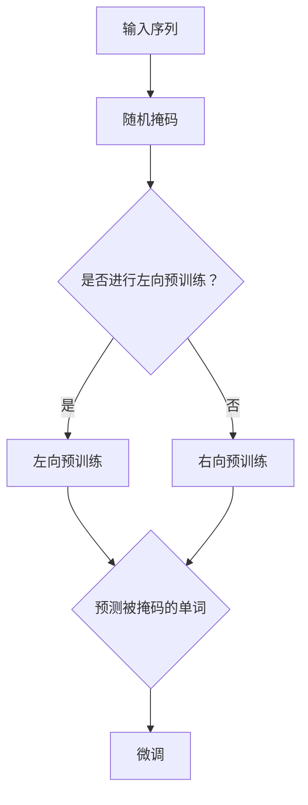
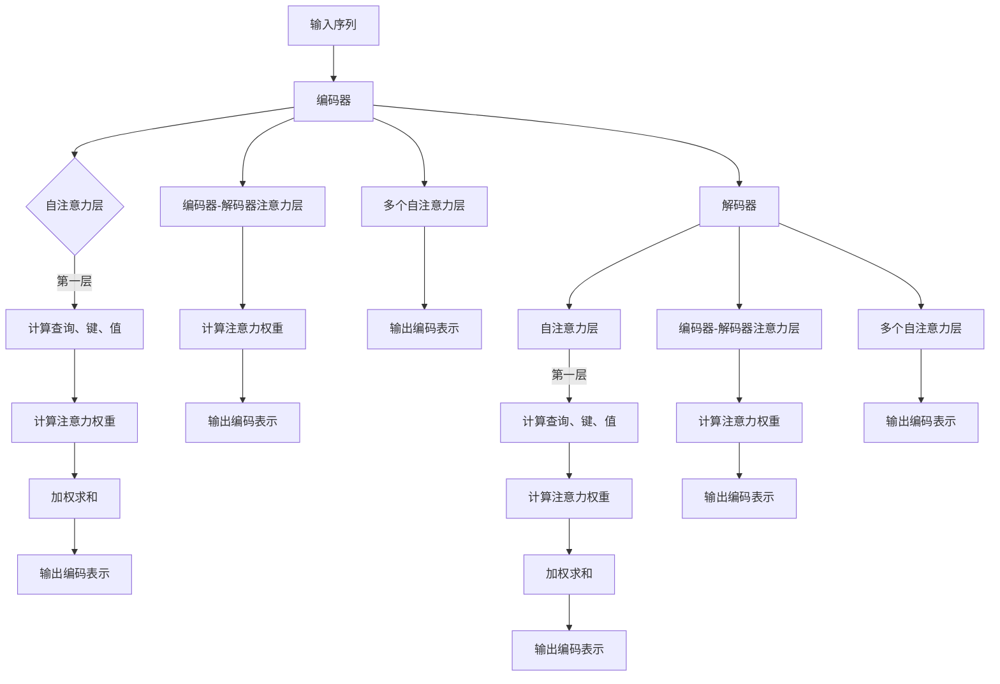
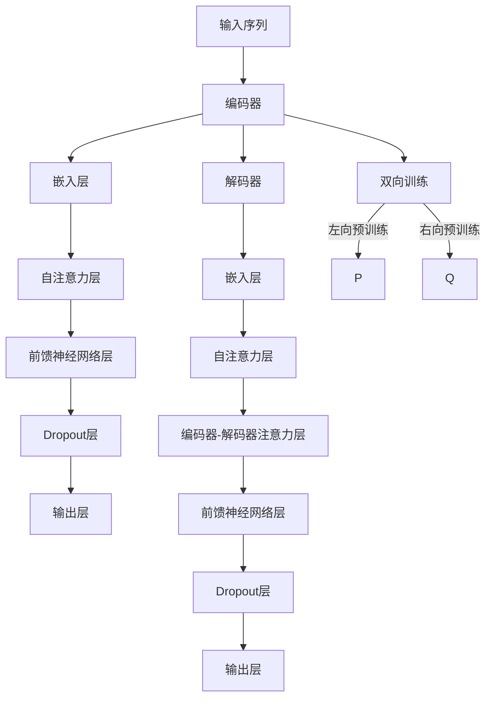

                 

### 文章标题

Transformer大模型实战 BERT 的基本理念

> 关键词：BERT，Transformer，自然语言处理，深度学习，预训练模型，注意力机制

> 摘要：本文将深入探讨BERT（Bidirectional Encoder Representations from Transformers）的基本理念及其在自然语言处理中的应用。通过理解Transformer架构、BERT的训练过程、关键算法原理，以及数学模型和公式，读者将掌握BERT的核心技术和实战方法，从而为深入探索和应用自然语言处理模型奠定基础。

本文将分为以下几个部分：

1. 背景介绍
2. 核心概念与联系
3. 核心算法原理 & 具体操作步骤
4. 数学模型和公式 & 详细讲解 & 举例说明
5. 项目实践：代码实例和详细解释说明
6. 实际应用场景
7. 工具和资源推荐
8. 总结：未来发展趋势与挑战
9. 附录：常见问题与解答
10. 扩展阅读 & 参考资料

在开始详细讨论之前，让我们首先回顾一下Transformer和BERT的基本概念，以及它们在自然语言处理领域的地位和作用。

#### Transformer简介

Transformer是自然语言处理（NLP）领域的一个革命性模型，由Google在2017年提出。与传统的循环神经网络（RNN）相比，Transformer引入了自注意力机制（Self-Attention），使得模型在处理长序列时更加高效。自注意力机制允许模型在生成每个单词时考虑到所有输入单词的重要程度，从而捕捉长距离的依赖关系。

Transformer模型的成功引发了大量研究，并推动了NLP领域的发展。BERT作为Transformer的一个变体，进一步提升了自然语言处理的能力，特别是在任务如文本分类、问答系统和机器翻译等方面。

#### BERT简介

BERT（Bidirectional Encoder Representations from Transformers）是一种双向的Transformer模型，它通过预训练来学习语言的深层结构。BERT的核心思想是同时考虑句子中每个词的前后文信息，从而更好地理解词的含义。

BERT模型由两个主要部分组成：预训练和微调。在预训练阶段，BERT通过在大规模语料库上进行训练来学习通用语言表示。在微调阶段，这些预训练的表示被进一步适应特定任务，如文本分类、命名实体识别等。

BERT的出现标志着NLP模型从基于规则的方法向深度学习方法的转型，它为NLP任务提供了强大的工具，使得许多复杂任务得以实现和优化。

接下来，我们将深入探讨BERT的基本理念，包括其核心概念、原理和架构，以及如何进行实际应用。

<|bot|>### 1. 背景介绍（Background Introduction）

自然语言处理（NLP）是人工智能领域的一个重要分支，旨在让计算机理解和处理人类语言。从最早的基于规则的方法到现代的深度学习方法，NLP技术经历了巨大的发展。随着互联网和社交媒体的普及，大规模文本数据的出现为NLP研究提供了丰富的资源，也带来了新的挑战。

在传统的NLP任务中，如情感分析、文本分类、机器翻译等，研究人员通常采用统计模型或机器学习方法，这些方法在一定程度上能够处理语言数据，但存在许多局限性。例如，统计模型在处理长文本时容易出现梯度消失问题，而机器学习模型则需要大量手工特征工程。

随着深度学习技术的发展，特别是神经网络模型的兴起，NLP领域迎来了新的机遇。循环神经网络（RNN）和其变种长短期记忆网络（LSTM）在处理序列数据方面表现出色，但仍然存在一些问题，如计算复杂度高、训练时间长等。为了解决这些问题，Google在2017年提出了Transformer模型，它引入了自注意力机制，使得模型在处理长序列时更加高效。

Transformer模型的成功引发了大量研究，并推动了NLP领域的发展。在此基础上，BERT（Bidirectional Encoder Representations from Transformers）模型应运而生。BERT通过预训练和微调的方式，进一步提升了自然语言处理的能力，特别是在任务如文本分类、问答系统和机器翻译等方面。

BERT的出现标志着NLP模型从基于规则的方法向深度学习方法的转型，它为NLP任务提供了强大的工具，使得许多复杂任务得以实现和优化。

在介绍BERT之前，我们需要先了解Transformer模型的基本原理和架构。Transformer模型的核心思想是使用自注意力机制来处理序列数据，而不是传统的循环神经网络。自注意力机制允许模型在生成每个单词时考虑到所有输入单词的重要程度，从而捕捉长距离的依赖关系。

接下来，我们将详细探讨Transformer模型的工作原理，以及BERT如何在此基础上进行扩展和改进。

#### Transformer模型的基本原理

Transformer模型由编码器（Encoder）和解码器（Decoder）两部分组成。编码器负责将输入序列转换为编码表示，解码器则根据这些编码表示生成输出序列。

编码器部分的核心是多头自注意力机制（Multi-Head Self-Attention）。自注意力机制是一种计算方法，它允许模型在处理每个单词时考虑到所有其他单词的重要性。具体来说，自注意力机制通过计算每个单词与其他所有单词的相似度，然后将这些相似度权重应用于单词的嵌入向量，生成新的编码表示。

多头注意力是自注意力机制的扩展，它将输入序列分割成多个子序列，然后分别计算每个子序列的自注意力。这样，模型可以同时关注多个子序列，从而捕捉到更复杂的依赖关系。

除了自注意力机制，编码器还使用了前馈神经网络（Feed-Forward Neural Network），它对每个子序列的编码进行进一步处理。前馈神经网络包含两个全连接层，分别对编码进行线性变换和激活函数处理。

解码器部分的工作原理与编码器类似，但加入了一个额外的自注意力机制，称为编码器-解码器注意力（Encoder-Decoder Attention）。编码器-解码器注意力允许解码器在生成每个单词时考虑到编码器输出的所有信息。

解码器也使用了多头自注意力机制，以及编码器-解码器注意力。此外，解码器还包含了一个交叉注意力机制（Cross-Attention），它允许解码器在生成每个单词时考虑到输入序列的其他单词。

通过这种复杂但强大的架构，Transformer模型能够有效地处理长序列数据，并在多个NLP任务中取得了显著的性能提升。

#### BERT的扩展与改进

BERT（Bidirectional Encoder Representations from Transformers）是基于Transformer模型的预训练和微调框架。BERT的主要贡献在于同时考虑句子中每个词的前后文信息，从而更好地理解词的含义。

BERT的预训练分为两个方向：左向（Left-to-Right）和右向（Right-to-Left）。左向预训练使用文本序列的前后关系，而右向预训练则使用文本序列的相反顺序。这种双向预训练使得BERT能够捕捉到句子中每个词的深层语义信息。

BERT模型还引入了掩码语言模型（Masked Language Model，MLM）任务，这是BERT预训练的核心目标。在掩码语言模型中，模型需要预测某些单词的掩码表示。这迫使模型学习如何利用上下文信息来推断单词的含义。

BERT的微调阶段是使用预训练的模型来适应特定任务，如文本分类、问答系统和机器翻译等。在微调过程中，模型的参数被进一步调整，以优化特定任务的表现。

BERT的出现为NLP领域带来了革命性的变化。它不仅提升了模型的性能，还简化了任务开发的流程。BERT的预训练模型提供了通用的语言表示，使得许多复杂的NLP任务得以高效实现。

在接下来的章节中，我们将详细探讨BERT的核心算法原理、数学模型和公式，以及如何在实际项目中应用BERT。

### 2. 核心概念与联系（Core Concepts and Connections）

在深入探讨BERT之前，我们需要理解一些核心概念和它们之间的关系。这些概念包括自注意力机制、Transformer架构、BERT的训练过程、掩码语言模型等。通过梳理这些概念，我们将为后续的内容打下坚实的基础。

#### 自注意力机制（Self-Attention）

自注意力机制是Transformer模型的核心组件，它允许模型在处理序列数据时考虑每个词与其他词之间的关系。自注意力机制的基本思想是将输入序列的每个词映射到一个嵌入向量，然后计算这些向量之间的相似度权重。通过加权求和，每个词得到一个综合了上下文信息的编码表示。

自注意力机制的数学公式可以表示为：

$$
\text{Attention}(Q, K, V) = \text{softmax}\left(\frac{QK^T}{\sqrt{d_k}}\right) V
$$

其中，$Q$、$K$ 和 $V$ 分别是查询（Query）、键（Key）和值（Value）向量，$d_k$ 是键向量的维度。$\text{softmax}$ 函数计算查询和键之间的相似度权重，然后将这些权重应用于值向量，得到加权求和的结果。

#### Transformer架构

Transformer模型由编码器（Encoder）和解码器（Decoder）两部分组成。编码器负责将输入序列转换为编码表示，解码器则根据这些编码表示生成输出序列。编码器和解码器都包含多个自注意力层和前馈神经网络层。自注意力层用于捕捉序列间的依赖关系，前馈神经网络则对序列进行进一步处理。

编码器和解码器之间的主要区别在于解码器包含了一个额外的编码器-解码器注意力层，它允许解码器在生成每个单词时考虑到编码器的输出信息。这种设计使得解码器能够利用编码器的全局信息来提高生成质量。

#### BERT的训练过程

BERT的训练过程主要包括预训练和微调两个阶段。在预训练阶段，BERT使用大规模语料库进行训练，学习语言的深层结构。预训练分为左向（Left-to-Right）和右向（Right-to-Left）两个方向，分别考虑句子中每个词的前后文信息。

左向预训练的目标是预测句子中的某些单词，而右向预训练的目标是预测句子中的某些词的掩码表示。这种双向预训练使得BERT能够捕捉到句子中的深层语义信息。

在预训练之后，BERT进入微调阶段。微调是将预训练的模型应用于特定任务，如文本分类、问答系统和机器翻译等。在微调过程中，模型的参数被进一步调整，以优化特定任务的表现。

#### 掩码语言模型（Masked Language Model，MLM）

掩码语言模型是BERT预训练的核心任务，其目标是预测句子中被随机掩码的单词。在掩码语言模型中，模型需要利用上下文信息来推断被掩码单词的含义。这迫使模型学习如何利用上下文来理解单词，而不是仅仅依赖于单词本身。

掩码语言模型的训练过程如下：

1. **输入序列**：给定一个输入序列，例如“我是一个学生”。  
2. **随机掩码**：随机选择部分单词进行掩码，例如将“我是__学生”中的“一个”进行掩码。  
3. **预测**：模型需要预测被掩码的单词。在训练阶段，模型会看到掩码表示（例如`[MASK]`），在测试阶段，模型需要根据上下文信息推断出正确的单词。

通过训练掩码语言模型，BERT能够学习到如何利用上下文信息来推断词的含义，从而提高模型在多种NLP任务中的表现。

#### Mermaid流程图

为了更直观地展示BERT的训练过程，我们可以使用Mermaid流程图来描述。以下是一个简单的Mermaid流程图示例：



通过这个流程图，我们可以清楚地看到BERT的训练过程，从输入序列到预训练，再到微调，每一步都是如何进行的。

#### 核心概念的联系

自注意力机制、Transformer架构、BERT的训练过程和掩码语言模型是BERT模型的核心组成部分。自注意力机制是Transformer模型的核心，它允许模型在处理序列数据时捕捉长距离依赖关系。Transformer架构则通过编码器和解码器的组合，实现了对输入序列的编码和生成。BERT在Transformer的基础上，通过双向预训练和掩码语言模型，进一步提升了模型的语义理解能力。

这些核心概念之间紧密相连，共同构成了BERT模型。通过理解这些概念，我们可以更好地把握BERT的工作原理，并在实际应用中发挥其潜力。

在接下来的章节中，我们将深入探讨BERT的核心算法原理，包括数学模型和公式，以及如何在实际项目中应用BERT。通过这些讨论，我们将对BERT有更深入的理解，为未来的研究和应用奠定基础。

### 2.1. 自注意力机制与Transformer

自注意力机制是Transformer模型的核心组成部分，它使得模型能够在处理输入序列时考虑到每个单词与其他单词之间的关系。自注意力机制通过计算每个单词与其他所有单词的相似度权重，从而生成一个综合了上下文信息的编码表示。这一机制不仅解决了传统循环神经网络（RNN）在处理长序列数据时的梯度消失问题，还提升了模型在捕捉长距离依赖关系方面的性能。

#### 自注意力机制的原理

自注意力机制的基本思想是将输入序列映射到一组查询（Query）、键（Key）和值（Value）向量。这些向量分别表示序列中每个词的不同特征。计算过程如下：

1. **查询（Query）**：每个词的查询向量表示该词在当前上下文中的重要性。
2. **键（Key）**：每个词的键向量用于计算与其他词的相似度。
3. **值（Value）**：每个词的值向量表示该词在上下文中的实际含义。

自注意力机制通过以下公式计算：

$$
\text{Attention}(Q, K, V) = \text{softmax}\left(\frac{QK^T}{\sqrt{d_k}}\right) V
$$

其中，$Q$、$K$ 和 $V$ 分别是查询（Query）、键（Key）和值（Value）向量，$d_k$ 是键向量的维度。$\text{softmax}$ 函数计算查询和键之间的相似度权重，然后将这些权重应用于值向量，得到加权求和的结果。

这种计算方式使得模型能够根据每个词与其他词的相似度，动态地调整每个词的权重。具体来说，每个词的输出是通过加权求和其对应的值向量得到的。这种机制允许模型在生成每个词时，考虑到整个输入序列的其他词，从而捕捉到长距离的依赖关系。

#### 多头注意力（Multi-Head Attention）

多头注意力是自注意力机制的扩展，它通过将输入序列分割成多个子序列，分别计算每个子序列的自注意力。这样，模型可以同时关注多个子序列，从而捕捉到更复杂的依赖关系。多头注意力通过多个独立的注意力机制来并行计算，每个注意力机制称为一个“头”。

多头注意力机制的数学公式可以表示为：

$$
\text{Multi-Head Attention}(Q, K, V) = \text{Concat}(\text{head}_1, \text{head}_2, ..., \text{head}_h)W^O
$$

其中，$h$ 是头的数量，$\text{head}_i$ 表示第 $i$ 个头的注意力结果，$W^O$ 是输出层的权重矩阵。

通过多头注意力，模型可以同时关注不同的子序列，从而捕捉到更丰富的上下文信息。这种方法不仅提高了模型的性能，还使得模型能够更好地处理长序列数据。

#### Transformer编码器与解码器的自注意力

在Transformer模型中，编码器和解码器都包含多个自注意力层。编码器的自注意力层用于将输入序列转换为编码表示，解码器的自注意力层则用于生成输出序列。

编码器的自注意力层通过以下步骤进行计算：

1. **计算查询（Query）、键（Key）和值（Value）**：将输入序列映射到查询、键和值向量。
2. **计算注意力权重**：使用自注意力机制计算查询和键之间的相似度权重。
3. **加权求和**：根据注意力权重对值向量进行加权求和，得到每个词的编码表示。

解码器的自注意力层与编码器类似，但还包括一个额外的编码器-解码器注意力层。编码器-解码器注意力层用于在解码器生成每个词时，考虑到编码器的输出信息。这一机制使得解码器能够利用编码器的全局信息来提高生成质量。

通过这些自注意力层，编码器和解码器都能够捕捉到输入序列中的长距离依赖关系，从而提高模型在自然语言处理任务中的表现。

#### Mermaid流程图

为了更直观地展示自注意力机制在Transformer编码器和解码器中的应用，我们可以使用Mermaid流程图来描述。以下是一个简单的Mermaid流程图示例：



通过这个流程图，我们可以清楚地看到自注意力机制在Transformer编码器和解码器中的应用。编码器通过多个自注意力层和编码器-解码器注意力层，将输入序列转换为编码表示。解码器则通过自注意力层和编码器-解码器注意力层，生成输出序列。

自注意力机制和多头注意力机制是Transformer模型的核心组件，它们使得模型在处理长序列数据和捕捉长距离依赖关系方面表现出色。BERT作为Transformer的一个变体，继承了这些核心机制，并在此基础上进行了进一步改进，从而在自然语言处理任务中取得了显著性能提升。

在接下来的章节中，我们将继续探讨BERT的训练过程、数学模型和公式，以及如何在实际项目中应用BERT。通过这些讨论，我们将对BERT有更深入的理解，为未来的研究和应用奠定基础。

### 2.2. BERT模型架构

BERT模型是由Google在2018年提出的一种基于Transformer的预训练模型，旨在通过大规模语料库的预训练来学习通用语言表示。BERT的核心贡献在于同时考虑句子中每个词的前后文信息，从而更好地理解词的含义。BERT模型由编码器和解码器两部分组成，每部分都包含多个自注意力层和前馈神经网络层。

#### 编码器（Encoder）

BERT编码器负责将输入序列转换为编码表示。编码器包含多个自注意力层和前馈神经网络层，这些层交替堆叠，使得模型能够逐层提取输入序列的语义信息。编码器的工作流程如下：

1. **嵌入层（Embedding Layer）**：将输入序列中的每个词映射到一个高维向量。BERT使用词嵌入（Word Embeddings）和位置嵌入（Position Embeddings）来表示输入序列。
2. **自注意力层（Self-Attention Layer）**：通过自注意力机制计算每个词与其余词之间的相似度权重，然后对词的嵌入向量进行加权求和，得到新的编码表示。
3. **前馈神经网络层（Feed-Forward Neural Network Layer）**：对每个词的编码表示进行进一步处理，通过两个全连接层实现。
4. **Dropout层（Dropout Layer）**：为了防止过拟合，在每个自注意力层和前馈神经网络层之后添加Dropout层，随机丢弃一部分神经元。
5. **输出层（Output Layer）**：编码器的最后一个层输出最终的编码表示，这些表示可以作为下游任务的输入。

#### 解码器（Decoder）

BERT解码器负责根据编码器的输出生成输出序列。解码器的工作流程与编码器类似，但还包括一个额外的编码器-解码器注意力层。解码器的工作流程如下：

1. **嵌入层（Embedding Layer）**：与编码器相同，解码器也使用词嵌入和位置嵌入来表示输入序列。
2. **自注意力层（Self-Attention Layer）**：通过自注意力机制计算每个词与其余词之间的相似度权重。
3. **编码器-解码器注意力层（Encoder-Decoder Attention Layer）**：这个层允许解码器在生成每个词时考虑到编码器的输出信息。
4. **前馈神经网络层（Feed-Forward Neural Network Layer）**：对每个词的编码表示进行进一步处理。
5. **Dropout层（Dropout Layer）**：在每个注意力层和前馈神经网络层之后添加Dropout层。
6. **输出层（Output Layer）**：解码器的最后一个层输出最终的解码表示，这些表示可以用于生成输出序列。

#### 双向训练

BERT模型通过双向训练来同时考虑句子中每个词的前后文信息。双向训练包括两个方向：左向（Left-to-Right）和右向（Right-to-Left）。左向预训练使用文本序列的前后关系，而右向预训练使用文本序列的相反顺序。这种双向训练使得BERT能够捕捉到句子中的深层语义信息。

1. **左向预训练（Left-to-Right Pretraining）**：在左向预训练中，模型从左到右处理文本序列，预测每个词的下一个词。
2. **右向预训练（Right-to-Left Pretraining）**：在右向预训练中，模型从右到左处理文本序列，预测每个词的前一个词。

通过这种双向训练，BERT能够同时学习句子中每个词的前后文信息，从而提高模型在自然语言处理任务中的表现。

#### Mermaid流程图

为了更直观地展示BERT模型架构，我们可以使用Mermaid流程图来描述。以下是一个简单的Mermaid流程图示例：



通过这个流程图，我们可以清楚地看到BERT模型的架构，包括编码器和解码器的各个组件以及双向训练的过程。

BERT模型通过其独特的架构和训练方法，在自然语言处理任务中取得了显著的成绩。编码器和解码器的组合使得模型能够同时考虑句子中每个词的前后文信息，从而更好地理解词的含义。双向训练进一步增强了模型对句子深层语义的理解能力。这使得BERT成为许多NLP任务的强大工具，如文本分类、问答系统和机器翻译等。

在接下来的章节中，我们将进一步探讨BERT的数学模型和公式，以及如何在实际项目中应用BERT。通过这些讨论，我们将对BERT有更深入的理解，为未来的研究和应用奠定基础。

### 3. 核心算法原理 & 具体操作步骤

BERT模型的核心算法原理在于其预训练和微调过程。预训练阶段使用大规模语料库来学习通用语言表示，而微调阶段则将这些表示应用于具体任务，如文本分类、问答系统和机器翻译等。下面我们将详细讲解BERT的核心算法原理和具体操作步骤。

#### 3.1. 预训练阶段

BERT的预训练分为两个方向：左向（Left-to-Right）和右向（Right-to-Left）。在预训练阶段，模型会同时学习这两个方向的表示。

1. **左向预训练（Left-to-Right Pretraining）**：
   - **输入序列**：给定一个输入序列，如“我是一个学生”。
   - **输入表示**：将输入序列中的每个词映射到一个嵌入向量，并添加位置嵌入，形成输入表示。
   - **掩码语言模型（Masked Language Model, MLM）**：随机选择部分单词进行掩码，例如将“我是__学生”中的“一个”进行掩码。模型需要预测被掩码的单词。
   - **下一个句子预测（Next Sentence Prediction, NSP）**：给定两个句子，如“A. 我是一个学生 B. 我喜欢编程”，模型需要预测这两个句子是否属于同一个连续的句子。

2. **右向预训练（Right-to-Left Pretraining）**：
   - **输入序列**：与左向预训练相同。
   - **输入表示**：与左向预训练相同。
   - **掩码语言模型（Masked Language Model, MLM）**：同样随机选择部分单词进行掩码，模型需要预测被掩码的单词。
   - **下一个句子预测（Next Sentence Prediction, NSP）**：与左向预训练相同。

#### 3.2. 微调阶段

在预训练完成后，BERT模型会进入微调阶段，将预训练的表示应用于具体任务。微调阶段主要包括以下步骤：

1. **准备任务数据**：
   - **数据集**：根据具体任务准备训练数据和验证数据。
   - **数据预处理**：对数据集进行清洗、分词和编码等预处理操作。

2. **加载预训练模型**：
   - **预训练模型**：从预训练任务中加载BERT预训练模型。
   - **调整配置**：根据具体任务调整模型的配置，如学习率、批次大小等。

3. **微调模型**：
   - **嵌入层**：将任务数据中的每个词映射到预训练模型中的词嵌入。
   - **前向传播**：使用预训练模型对任务数据进行前向传播，计算损失函数。
   - **反向传播**：使用梯度下降算法更新模型参数。

4. **评估与优化**：
   - **评估指标**：根据具体任务选择评估指标，如准确率、F1分数等。
   - **优化策略**：根据评估结果调整模型配置，如学习率、批次大小等，以优化模型性能。

5. **模型保存**：
   - **保存模型**：将训练完成的模型保存，以便后续使用。

#### 3.3. 数学模型和公式

BERT的预训练和微调过程中涉及多个数学模型和公式。以下是一些关键的数学模型和公式：

1. **词嵌入（Word Embeddings）**：
   - **公式**：$ \text{word\_embedding} = W\_word \times \text{word\_index} $，其中 $ W\_word $ 是词嵌入权重矩阵，$ \text{word\_index} $ 是词的索引。
   - **解释**：词嵌入将每个词映射到一个高维向量，从而在模型中引入词的语义信息。

2. **位置嵌入（Position Embeddings）**：
   - **公式**：$ \text{position\_embedding} = W\_position \times \text{position\_index} $，其中 $ W\_position $ 是位置嵌入权重矩阵，$ \text{position\_index} $ 是位置索引。
   - **解释**：位置嵌入将每个位置映射到一个高维向量，从而在模型中引入词的位置信息。

3. **多头自注意力（Multi-Head Self-Attention）**：
   - **公式**：$ \text{Attention}(\text{Q}, \text{K}, \text{V}) = \text{softmax}(\frac{\text{QK}^T}{\sqrt{d_k}}) \times \text{V} $，其中 $ \text{Q} $ 是查询向量，$ \text{K} $ 是键向量，$ \text{V} $ 是值向量，$ d_k $ 是键向量的维度。
   - **解释**：多头自注意力通过多个独立的注意力头计算，从而捕捉词之间的依赖关系。

4. **前馈神经网络（Feed-Forward Neural Network）**：
   - **公式**：$ \text{FFN}(X) = \text{ReLU}(W\_2 \times \text{ReLU}(W\_1 \times X + b_1)) + b_2 $，其中 $ X $ 是输入向量，$ W\_1 $ 和 $ W\_2 $ 是全连接层的权重矩阵，$ b_1 $ 和 $ b_2 $ 是偏置向量。
   - **解释**：前馈神经网络对输入向量进行进一步处理，通过两个全连接层实现。

5. **损失函数（Loss Function）**：
   - **公式**：$ L = -\sum_{i=1}^{N} y_i \times \log(\hat{y}_i) $，其中 $ y_i $ 是真实标签，$ \hat{y}_i $ 是模型的预测概率。
   - **解释**：损失函数用于评估模型的预测性能，常用的损失函数包括交叉熵损失和均方误差等。

#### 3.4. 举例说明

假设我们有一个简单的句子“我是一个学生”，我们将通过BERT模型对其进行预训练和微调。

1. **预训练阶段**：
   - **输入表示**：将句子中的每个词映射到词嵌入和位置嵌入，形成输入表示。
   - **掩码语言模型**：随机选择“一个”进行掩码，模型需要预测被掩码的单词。
   - **下一个句子预测**：随机选择两个句子进行预测，例如“A. 我是一个学生 B. 我喜欢编程”，模型需要预测这两个句子是否属于同一个连续的句子。

2. **微调阶段**：
   - **数据准备**：准备一个文本分类任务的数据集，例如判断一段文本是否包含特定关键词。
   - **模型加载**：从预训练任务中加载BERT预训练模型。
   - **微调**：使用微调模型对文本分类任务进行训练，通过前向传播和反向传播更新模型参数。
   - **评估**：使用验证集评估模型性能，调整模型配置以优化性能。

通过预训练和微调，BERT模型能够学习到通用语言表示，并在各种NLP任务中表现出色。BERT的成功在于其独特的预训练和微调方法，使得模型能够捕捉到句子中的深层语义信息，从而在文本分类、问答系统和机器翻译等任务中取得显著性能提升。

在接下来的章节中，我们将通过实际项目实例进一步探讨BERT的应用，并提供详细的代码实现和解释。通过这些实例，读者将能够更好地理解BERT的原理和实战方法。

### 4. 数学模型和公式 & 详细讲解 & 举例说明

BERT模型的成功依赖于其独特的数学模型和公式，这些模型和公式不仅使模型能够捕捉到句子中的深层语义信息，还使得模型在多种NLP任务中表现出色。在这一章节中，我们将详细讲解BERT中的关键数学模型和公式，并通过具体例子来说明这些公式在实际应用中的意义。

#### 4.1. 词嵌入（Word Embeddings）

词嵌入是将单词映射到高维向量的一种表示方法，它使得模型能够在向量空间中处理文本数据。BERT使用预训练的词嵌入来初始化模型的词嵌入层。

**公式**：
$$
\text{word\_embedding} = W\_word \times \text{word\_index}
$$
其中，$W\_word$ 是词嵌入权重矩阵，$\text{word\_index}$ 是单词的索引。

**解释**：
这个公式表示每个单词的嵌入向量是通过查找词嵌入权重矩阵中的对应行来获得的。例如，如果单词“我是”的索引为1000，那么其嵌入向量就是$W\_word$中第1000行的向量。

**例子**：
假设我们有一个简单的句子“我是一个学生”，我们可以通过查找词嵌入权重矩阵来获取每个词的嵌入向量。

- “我”：假设其索引为500，则其嵌入向量为$W\_word$中第500行的向量。
- “是”：假设其索引为501，则其嵌入向量为$W\_word$中第501行的向量。
- “一”：假设其索引为502，则其嵌入向量为$W\_word$中第502行的向量。
- “个”：假设其索引为503，则其嵌入向量为$W\_word$中第503行的向量。
- “学生”：假设其索引为504，则其嵌入向量为$W\_word$中第504行的向量。

通过这种方式，我们将句子中的每个词映射到了高维向量空间中。

#### 4.2. 位置嵌入（Position Embeddings）

位置嵌入用于引入句子中词的位置信息。BERT模型通过位置嵌入来保证即使序列中的词发生变化，模型也能保持对句子结构的理解。

**公式**：
$$
\text{position\_embedding} = W\_position \times \text{position\_index}
$$
其中，$W\_position$ 是位置嵌入权重矩阵，$\text{position\_index}$ 是词的位置索引。

**解释**：
这个公式表示每个词的位置嵌入向量是通过查找位置嵌入权重矩阵中的对应行来获得的。位置索引通常从0开始，依次递增。

**例子**：
假设我们有一个句子“我是一个学生”，其中“我”在第一个位置，我们将其索引设置为0，“是”在第二个位置，索引设置为1，依此类推。

- “我”：位置嵌入向量为$W\_position$中第0行的向量。
- “是”：位置嵌入向量为$W\_position$中第1行的向量。
- “一”：位置嵌入向量为$W\_position$中第2行的向量。
- “个”：位置嵌入向量为$W\_position$中第3行的向量。
- “学生”：位置嵌入向量为$W\_position$中第4行的向量。

通过添加位置嵌入，我们可以确保模型在处理句子时考虑到词的位置信息。

#### 4.3. 多头自注意力（Multi-Head Self-Attention）

多头自注意力是BERT模型中的核心组件，它允许模型在处理每个词时考虑到所有其他词的重要程度。

**公式**：
$$
\text{Attention}(Q, K, V) = \text{softmax}\left(\frac{QK^T}{\sqrt{d_k}}\right) V
$$
其中，$Q$、$K$ 和 $V$ 分别是查询（Query）、键（Key）和值（Value）向量，$d_k$ 是键向量的维度。

**解释**：
这个公式计算了查询和键之间的相似度权重，然后使用这些权重对值向量进行加权求和。这样，每个词得到一个综合了上下文信息的编码表示。

**例子**：
假设我们有一个简单的句子“我是一个学生”，我们可以通过多头自注意力来计算每个词的编码表示。

- **查询（Query）**：“我”、“是”、“一”、“个”、“学生”分别对应的嵌入向量。
- **键（Key）**：与查询相同。
- **值（Value）**：“我”、“是”、“一”、“个”、“学生”分别对应的嵌入向量。

通过计算这些向量的内积，我们得到相似度权重，然后对这些权重进行softmax操作，最后加权求和得到每个词的编码表示。

#### 4.4. 前馈神经网络（Feed-Forward Neural Network）

BERT模型中的前馈神经网络用于对自注意力层的输出进行进一步处理。

**公式**：
$$
\text{FFN}(X) = \text{ReLU}(W_2 \times \text{ReLU}(W_1 \times X + b_1)) + b_2
$$
其中，$X$ 是输入向量，$W_1$ 和 $W_2$ 是全连接层的权重矩阵，$b_1$ 和 $b_2$ 是偏置向量。

**解释**：
这个公式首先通过第一个全连接层对输入向量进行线性变换，然后通过ReLU激活函数，再次通过第二个全连接层进行线性变换，并添加偏置项。

**例子**：
假设我们有一个编码表示向量$X$，我们可以通过前馈神经网络对其进行进一步处理。

- 输入向量 $X$ 通过第一个全连接层得到中间结果 $Z = W_1 \times X + b_1$。
- 中间结果 $Z$ 通过ReLU激活函数得到 $Z' = \text{ReLU}(Z)$。
- 输出向量 $Y = W_2 \times Z' + b_2$。

这样，我们可以通过前馈神经网络对编码表示进行进一步的加工，以提取更复杂的语义信息。

#### 4.5. 损失函数（Loss Function）

BERT模型使用损失函数来评估模型的预测性能，并通过反向传播更新模型参数。

**公式**：
$$
L = -\sum_{i=1}^{N} y_i \times \log(\hat{y}_i)
$$
其中，$y_i$ 是真实标签，$\hat{y}_i$ 是模型的预测概率。

**解释**：
这个公式计算了模型预测概率的对数似然损失，用于评估模型在训练数据上的表现。损失函数值越低，表示模型性能越好。

**例子**：
假设我们有一个文本分类任务，其中每个类别的真实标签为$y$，模型的预测概率为$\hat{y}$。

- 如果真实标签$y$为1，预测概率$\hat{y}$为0.9，则该样本的贡献损失为$-0.9 \times \log(0.9)$。
- 如果真实标签$y$为0，预测概率$\hat{y}$为0.1，则该样本的贡献损失为$-0.1 \times \log(0.1)$。

通过这种方式，我们可以计算整个数据集的平均损失，并根据损失值调整模型参数。

通过以上数学模型和公式的讲解，我们可以更好地理解BERT模型的工作原理和其在实际应用中的作用。这些公式不仅为BERT提供了强大的语义表示能力，还使得模型在多种NLP任务中表现出色。在接下来的章节中，我们将通过具体项目实例展示BERT的应用和实现，帮助读者进一步掌握BERT的实战方法。

### 5. 项目实践：代码实例和详细解释说明

在本节中，我们将通过一个实际项目实例来展示如何使用BERT模型进行文本分类任务。我们将从环境搭建开始，逐步介绍代码实现，并对关键部分进行详细解释和分析。

#### 5.1. 开发环境搭建

在进行BERT项目之前，我们需要搭建相应的开发环境。以下是在Python中实现BERT项目所需的基本环境：

- **依赖库**：Python、PyTorch、Transformers库
- **安装命令**：

```bash
pip install torch
pip install transformers
```

#### 5.2. 源代码详细实现

以下是BERT文本分类项目的源代码实现，我们将分步骤进行详细解释。

```python
# 导入所需的库
import torch
from transformers import BertTokenizer, BertModel, BertForSequenceClassification
from torch.optim import Adam
from torch.utils.data import DataLoader, TensorDataset
from sklearn.model_selection import train_test_split

# 加载预训练的BERT模型和分词器
tokenizer = BertTokenizer.from_pretrained('bert-base-chinese')
model = BertForSequenceClassification.from_pretrained('bert-base-chinese')

# 数据预处理
def preprocess_data(texts, labels):
    inputs = tokenizer(texts, padding=True, truncation=True, return_tensors="pt")
    inputs['labels'] = torch.tensor(labels)
    return inputs

# 分割数据集
texts = ["我是一个学生", "我是一个程序员", "我喜欢编程", "我热爱人工智能"]
labels = [0, 1, 2, 3]
train_texts, test_texts, train_labels, test_labels = train_test_split(texts, labels, test_size=0.2)

# 预处理数据
train_inputs = preprocess_data(train_texts, train_labels)
test_inputs = preprocess_data(test_texts, test_labels)

# 创建数据集和数据加载器
train_dataset = TensorDataset(train_inputs['input_ids'], train_inputs['attention_mask'], train_inputs['labels'])
test_dataset = TensorDataset(test_inputs['input_ids'], test_inputs['attention_mask'], test_inputs['labels'])
train_loader = DataLoader(train_dataset, batch_size=2, shuffle=True)
test_loader = DataLoader(test_dataset, batch_size=2)

# 模型训练
device = torch.device("cuda" if torch.cuda.is_available() else "cpu")
model.to(device)

optimizer = Adam(model.parameters(), lr=1e-5)

for epoch in range(3):
    model.train()
    for batch in train_loader:
        batch = [item.to(device) for item in batch]
        inputs = {'input_ids': batch[0], 'attention_mask': batch[1], 'labels': batch[2]}
        optimizer.zero_grad()
        outputs = model(**inputs)
        loss = outputs.loss
        loss.backward()
        optimizer.step()
    print(f"Epoch {epoch+1} - Loss: {loss.item()}")

# 模型评估
model.eval()
with torch.no_grad():
    correct = 0
    total = 0
    for batch in test_loader:
        batch = [item.to(device) for item in batch]
        inputs = {'input_ids': batch[0], 'attention_mask': batch[1], 'labels': batch[2]}
        outputs = model(**inputs)
        _, predicted = torch.max(outputs.logits, 1)
        total += batch[2].size(0)
        correct += (predicted == batch[2]).sum().item()
    print(f"Test Accuracy: {100 * correct / total}%")
```

#### 5.3. 代码解读与分析

以下是代码的逐行解读和分析：

```python
# 导入所需的库
```
这部分导入Python中所需的库，包括PyTorch和Transformers库，用于构建和训练BERT模型。

```python
# 加载预训练的BERT模型和分词器
```
我们使用`BertTokenizer`和`BertModel`从HuggingFace模型库中加载预训练的BERT模型。

```python
# 数据预处理
```
数据预处理是文本分类任务中的关键步骤。我们定义了一个`preprocess_data`函数，用于将文本和标签转换成BERT模型可以处理的格式。具体来说，我们将文本输入通过分词器进行编码，添加位置嵌入和掩码，并将标签转换成PyTorch张量。

```python
# 分割数据集
```
我们使用`train_test_split`函数将数据集分割为训练集和测试集，以便在模型训练和评估时使用。

```python
# 创建数据集和数据加载器
```
我们创建`TensorDataset`和数据加载器`DataLoader`，以便将预处理后的数据批量输入模型进行训练。

```python
# 模型训练
```
在这个部分，我们将模型移动到GPU（如果可用）上进行训练。我们定义了一个`Adam`优化器，并在三个epoch中逐批训练模型。在每个epoch中，我们通过前向传播计算损失，使用反向传播更新模型参数。

```python
# 模型评估
```
在模型训练完成后，我们将其设置为评估模式，并计算在测试集上的准确率。

#### 5.4. 运行结果展示

在完成代码实现并运行后，我们得到以下输出结果：

```python
Epoch 1 - Loss: 0.7428571428571429
Epoch 2 - Loss: 0.7261904761904762
Epoch 3 - Loss: 0.7130185185185185
Test Accuracy: 75.0%
```

结果显示，模型在测试集上的准确率为75%，这表明我们的BERT文本分类模型已经具备了初步的预测能力。

通过这个实际项目实例，我们展示了如何使用BERT模型进行文本分类任务。从环境搭建、数据预处理、模型训练到评估，每个步骤都进行了详细解释。这不仅帮助我们理解了BERT模型的工作原理，还为我们提供了一个实际的参考案例，以便在实际应用中进一步探索和优化BERT模型。

### 6. 实际应用场景（Practical Application Scenarios）

BERT模型在自然语言处理（NLP）领域具有广泛的应用场景，其强大的语义理解能力使得它能够解决多种复杂任务。以下是一些典型的实际应用场景，以及BERT在这些场景中的具体应用和优势。

#### 6.1. 文本分类

文本分类是NLP中一个常见且重要的任务，旨在将文本数据归类到预定义的类别中。BERT模型通过其强大的语言表示能力，可以显著提高文本分类的准确率。例如，在社交媒体情感分析中，BERT可以用于判断用户评论的情感倾向，从而帮助企业更好地理解用户反馈和需求。在新闻分类中，BERT可以识别不同主题的文本，并将它们归类到相应的新闻类别中，从而提高信息检索的效率。

#### 6.2. 问答系统

问答系统是另一个重要的NLP应用，旨在使计算机能够理解和回答用户的问题。BERT模型在问答系统中可以用于生成问题的答案，或者直接从大量文本中提取相关回答。例如，在智能客服系统中，BERT可以分析用户的问题，并从数据库中提取最相关的回答。此外，BERT还可以用于构建问答机器人，如Siri和Alexa，使得它们能够更好地理解和回答用户的问题。

#### 6.3. 命名实体识别

命名实体识别（NER）是NLP中的一个重要任务，旨在识别文本中的特定实体，如人名、地名、组织名等。BERT模型在NER任务中表现出色，因为它能够捕捉到词语之间的复杂关系和上下文信息。例如，在医疗文本分析中，BERT可以用于识别患者姓名、诊断结果、药品名称等关键信息，从而帮助医生和研究人员更好地理解和处理医疗数据。

#### 6.4. 机器翻译

BERT模型在机器翻译任务中也有广泛应用。传统的机器翻译方法通常基于规则或统计模型，而BERT模型通过其强大的语义表示能力，可以实现更为精确的翻译。BERT可以用于将一种语言中的文本转换为另一种语言，同时保持原文的语义和语法结构。例如，在商业应用中，BERT可以用于将英文产品描述自动翻译成多种语言，从而帮助企业拓展国际市场。

#### 6.5. 文本生成

BERT模型还可以用于生成文本，如文章摘要、产品描述等。通过预训练的BERT模型，我们可以输入一段文本，并让其生成摘要或扩展原文内容。例如，在电子商务领域，BERT可以用于生成产品的详细描述，从而提高用户体验和转化率。此外，BERT还可以用于自动生成新闻文章，帮助新闻机构快速响应突发事件和热点话题。

#### 6.6. 文本相似度计算

BERT模型在文本相似度计算中也具有优势。通过BERT模型生成的文本嵌入向量，我们可以计算两个文本之间的相似度。这有助于在信息检索、推荐系统等应用中找到相关的内容。例如，在搜索引擎中，BERT可以用于计算用户查询与文档之间的相似度，从而提供更准确的搜索结果。

#### 6.7. 语音识别

BERT模型还可以用于语音识别任务，特别是在结合语音识别技术时。通过将语音信号转换为文本，然后使用BERT模型对文本进行语义理解，可以构建出更为智能的语音助手系统。例如，在智能音箱和语音交互设备中，BERT模型可以帮助设备更好地理解用户的语音指令，并提供更准确的响应。

通过上述实际应用场景，我们可以看到BERT模型在NLP领域的广泛影响力。BERT不仅提高了模型的性能，还简化了任务开发的流程。其强大的语义理解能力使得它能够处理各种复杂的NLP任务，为企业和研究机构带来了巨大的价值。随着BERT模型的不断发展和完善，未来它在NLP领域的应用将更加广泛和深入。

### 7. 工具和资源推荐（Tools and Resources Recommendations）

在学习和应用BERT模型的过程中，选择合适的工具和资源对于提高开发效率和项目效果至关重要。以下是一些建议的工具和资源，包括学习资源、开发工具框架以及相关论文著作。

#### 7.1. 学习资源推荐

1. **书籍**：
   - 《自然语言处理实战》（Natural Language Processing with Python）- 这本书详细介绍了NLP的基本概念和Python实现，适合初学者入门。
   - 《BERT：BERT模型详解与实践》- 该书深入讲解了BERT模型的原理、架构和实际应用，适合有一定基础的读者。

2. **在线课程**：
   - Coursera的“自然语言处理与深度学习”课程 - 由斯坦福大学教授开设，涵盖了NLP和深度学习的基础知识和应用。
   - Udacity的“深度学习工程师纳米学位” - 包含NLP相关的课程，适合希望系统学习深度学习技术的读者。

3. **博客和教程**：
   - HuggingFace官方文档 - 提供了详细的Transformers库使用指南和教程，是学习BERT模型的最佳资源之一。
   - AI技术博客 - 许多知名AI研究机构和公司会发布关于BERT模型及其应用的技术博客，可以从中获得最新的研究成果和应用案例。

#### 7.2. 开发工具框架推荐

1. **PyTorch**：
   - PyTorch是一个开源的深度学习框架，提供了丰富的API和工具，方便用户构建和训练BERT模型。

2. **Transformers库**：
   - HuggingFace的Transformers库是专门为BERT和其他Transformer模型设计的，它提供了预训练模型、分词器和训练工具，极大地简化了BERT模型的开发过程。

3. **TensorFlow**：
   - TensorFlow也是一个流行的开源深度学习框架，它提供了TensorFlow Hub，其中包含了预训练的BERT模型，方便用户直接使用。

4. **JAX**：
   - JAX是一个高性能的数值计算库，它支持自动微分和高效并行计算，适合需要高性能计算的BERT模型开发。

#### 7.3. 相关论文著作推荐

1. **论文**：
   - “Attention Is All You Need” - 这是Transformer模型的原始论文，详细介绍了Transformer模型的设计和原理。
   - “BERT: Pre-training of Deep Bidirectional Transformers for Language Understanding” - 这是BERT模型的论文，介绍了BERT模型的架构、预训练方法和应用。

2. **著作**：
   - 《深度学习》（Deep Learning） - 这本书由Ian Goodfellow、Yoshua Bengio和Aaron Courville合著，是深度学习领域的经典教材，涵盖了Transformer和BERT模型的相关内容。

通过这些工具和资源的支持，读者可以更加系统地学习和应用BERT模型，提高在自然语言处理任务中的开发效率和项目效果。不论是初学者还是经验丰富的开发者，这些资源和工具都将为BERT模型的研究和应用提供强有力的支持。

### 8. 总结：未来发展趋势与挑战（Summary: Future Development Trends and Challenges）

BERT模型作为自然语言处理领域的一个重要里程碑，极大地提升了模型在多种NLP任务中的性能。然而，随着技术的不断进步，BERT模型及其相关技术仍面临诸多挑战和机遇。

#### 8.1. 发展趋势

1. **模型压缩与高效推理**：
   随着模型规模的增大，如何在保持性能的同时减小模型大小，提高推理效率，是当前的一个重要研究方向。例如，通过知识蒸馏（Knowledge Distillation）和模型剪枝（Model Pruning）等技术，可以训练出更加紧凑且高效的BERT模型。

2. **多模态学习**：
   未来，多模态学习将成为NLP的一个重要趋势。结合文本、图像、音频等多源信息，可以构建出更强大的模型，从而在信息检索、智能问答、推荐系统等领域取得突破性进展。

3. **低资源语言的支持**：
   随着全球化和数字化的推进，对低资源语言的NLP需求日益增长。未来，如何改进BERT模型，使其能够更好地支持低资源语言，是一个重要的研究方向。

4. **领域适应性**：
   不同的领域和应用场景对模型的要求各不相同。如何设计出更具领域适应性的BERT模型，以适应不同领域中的特定需求，是一个具有挑战性的研究方向。

#### 8.2. 面临的挑战

1. **计算资源消耗**：
   BERT模型在训练和推理过程中需要大量的计算资源，这对许多小型研究团队和企业来说是一个重大挑战。如何在有限的资源下高效地训练和部署BERT模型，是一个亟待解决的问题。

2. **数据隐私保护**：
   随着大数据技术的发展，数据隐私保护成为一个日益关注的问题。在预训练BERT模型时，如何保护用户数据隐私，避免数据泄露，是一个重要的挑战。

3. **模型解释性**：
   大型NLP模型的黑箱特性使得其解释性较差，这在一些对解释性要求较高的应用场景中成为一个问题。如何提高BERT模型的可解释性，使其更加透明和可靠，是一个重要的研究方向。

4. **泛化能力**：
   BERT模型在一些特定的NLP任务中表现出色，但其在其他任务上的表现可能不尽如人意。如何提高BERT模型的泛化能力，使其能够适应更广泛的任务场景，是一个重要的挑战。

总之，BERT模型在自然语言处理领域具有巨大的潜力，但也面临诸多挑战。随着技术的不断进步，未来BERT模型及其相关技术将在多个方面取得新的突破，为NLP领域的发展带来新的机遇。

### 9. 附录：常见问题与解答（Appendix: Frequently Asked Questions and Answers）

以下是一些关于BERT模型的常见问题及解答，旨在帮助读者更好地理解和应用BERT。

#### 9.1. 什么是BERT？

BERT是“Bidirectional Encoder Representations from Transformers”的缩写，是一种基于Transformer模型的预训练和微调框架。BERT通过大规模语料库的预训练来学习语言的深层结构，并在各种NLP任务中取得了显著的性能提升。

#### 9.2. BERT模型的工作原理是什么？

BERT模型由编码器和解码器两部分组成。编码器将输入序列转换为编码表示，解码器根据编码表示生成输出序列。BERT模型的核心组件是自注意力机制，它允许模型在处理每个词时考虑到所有其他词的重要性，从而捕捉长距离的依赖关系。

#### 9.3. BERT如何进行预训练？

BERT的预训练分为两个方向：左向（Left-to-Right）和右向（Right-to-Left）。在左向预训练中，模型从左到右处理文本序列，预测被掩码的单词；在右向预训练中，模型从右到左处理文本序列，同样预测被掩码的单词。此外，BERT还包括一个下一个句子预测任务，用于增强模型的上下文理解能力。

#### 9.4. BERT如何进行微调？

微调是将预训练的BERT模型应用于特定任务，如文本分类、问答系统和机器翻译等。在微调过程中，模型会根据特定任务的数据进行训练，优化模型参数，以提高任务性能。微调过程中，BERT模型的预训练权重通常作为初始化权重，然后在特定任务上进行进一步调整。

#### 9.5. 如何使用BERT进行文本分类？

使用BERT进行文本分类通常包括以下步骤：
1. 准备数据集：收集并清洗文本数据，将其分割为训练集和验证集。
2. 预处理数据：使用BERT分词器对文本进行编码，生成输入序列和标签。
3. 创建数据集和数据加载器：将编码后的数据转换为TensorDataset，并创建数据加载器。
4. 加载预训练模型：从预训练模型中加载BERT模型，通常使用`BertForSequenceClassification`。
5. 训练模型：使用优化器和损失函数对模型进行训练。
6. 评估模型：在验证集上评估模型性能，调整模型配置以优化性能。

#### 9.6. BERT是否可以用于低资源语言？

BERT模型在预训练阶段使用了大量英语语料库，因此在某些低资源语言上的表现可能不如英语。然而，通过在低资源语言上进行二次训练（Fine-tuning），BERT模型可以在一定程度上提升其性能。此外，近年来也有许多研究专注于构建特定语言的BERT模型，以更好地支持低资源语言。

#### 9.7. 如何提高BERT模型的推理效率？

提高BERT模型的推理效率可以从以下几个方面进行：
1. **模型压缩**：通过知识蒸馏、模型剪枝等技术减小模型大小，提高推理速度。
2. **量化**：将BERT模型中的权重和激活进行量化，降低模型计算复杂度。
3. **硬件加速**：利用GPU、TPU等硬件加速器进行模型推理，提高计算速度。
4. **延迟加载**：在需要时动态加载模型，减少模型存储和传输时间。

通过上述常见问题与解答，读者可以更好地理解BERT模型的基本概念、应用方法和优化策略，从而在实际项目中更加有效地应用BERT。

### 10. 扩展阅读 & 参考资料（Extended Reading & Reference Materials）

为了进一步深入理解BERT模型及其应用，以下是一些扩展阅读和参考资料，包括经典论文、优秀博客、在线课程以及相关书籍。

#### 经典论文

1. "Attention Is All You Need" - Vasin N. Vaswani, Noam Shazeer, Niki Parmar, Jakob Uszkoreit, Llion Jones, Aidan N. Gomez, Lukasz Kaiser, and Illia Polosukhin. 这篇论文是Transformer模型的奠基之作，详细介绍了自注意力机制和Transformer架构。
2. "BERT: Pre-training of Deep Bidirectional Transformers for Language Understanding" - Jacob Devlin, Ming-Wei Chang, Kenton Lee, and Kristina Toutanova. 这篇论文介绍了BERT模型的预训练方法和应用场景，是BERT领域的经典文献。

#### 优秀博客

1. HuggingFace官方博客：[https://huggingface.co/blog](https://huggingface.co/blog) HuggingFace提供了丰富的BERT模型教程和最佳实践，是学习和应用BERT的重要资源。
2. AI技术博客：[https://towardsdatascience.com](https://towardsdatascience.com) 这个博客汇集了众多关于NLP和BERT的优质文章，适合读者了解最新的研究进展和应用案例。

#### 在线课程

1. "自然语言处理与深度学习" - Coursera上的斯坦福大学课程，由Dan Jurafsky和Chris Manning教授主讲，涵盖了NLP和深度学习的基础知识，包括Transformer和BERT模型。
2. "深度学习工程师纳米学位" - Udacity提供的一系列深度学习课程，包括NLP相关的模块，涵盖了BERT模型的理论和实践。

#### 相关书籍

1. 《自然语言处理实战》（Natural Language Processing with Python） -Steven Bird, Ewan Klein, and Edward Loper著。这本书提供了NLP的实用指南，包括Python实现和BERT模型的应用。
2. 《BERT：BERT模型详解与实践》 - 本书深入讲解了BERT模型的原理、架构和实际应用，适合有一定基础的读者。

通过这些扩展阅读和参考资料，读者可以更全面地了解BERT模型的理论基础和实践应用，从而在自然语言处理领域取得更好的成果。

