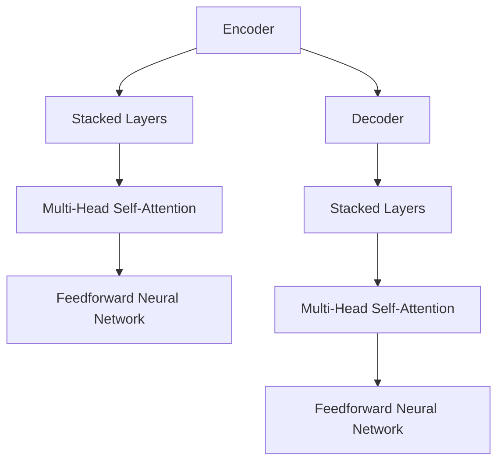

                 

### 文章标题

### Transformer大模型实战 VideoBERT模型学习语言及视频特征

> 关键词：Transformer, VideoBERT, 大模型, 视频特征提取, 语言特征提取

> 摘要：本文将深入探讨Transformer大模型中的VideoBERT模型，介绍其原理、实现步骤和应用场景。我们将首先回顾Transformer模型的基本原理，然后重点介绍VideoBERT模型，包括其如何结合视频和语言特征，实现高效的特征提取。随后，我们将通过实例展示VideoBERT模型在实际项目中的运用，最后讨论其潜在的应用场景和未来发展趋势。

### Abstract

This article delves into the VideoBERT model, a key component of Transformer-based large-scale models, focusing on its principles, implementation steps, and application scenarios. We will first review the basic principles of the Transformer model, followed by a detailed introduction to the VideoBERT model, highlighting its ability to integrate video and language features for efficient feature extraction. Subsequently, we will showcase practical applications of the VideoBERT model in real-world projects. Finally, we will discuss its potential application scenarios and future development trends.

### 1. 背景介绍（Background Introduction）

#### 1.1 Transformer模型的基本原理

Transformer模型是由Google团队于2017年提出的一种全新的神经网络架构，用于处理序列到序列的任务，如机器翻译、文本摘要等。与传统循环神经网络（RNN）和长短时记忆网络（LSTM）相比，Transformer模型采用了自注意力机制（Self-Attention），能够并行处理输入序列，并且在长距离依赖建模方面表现优异。

#### 1.2 大模型与深度学习的兴起

随着计算能力的提升和海量数据的积累，深度学习模型逐渐向大模型（Large-scale Model）发展。大模型通过引入更多的参数和更复杂的网络结构，可以更好地捕捉数据中的复杂模式，从而提升模型的性能。VideoBERT模型作为Transformer大模型家族的一员，融合了视频和语言特征，为解决多模态任务提供了新的思路。

#### 1.3 VideoBERT模型的提出

VideoBERT模型是由Google团队于2020年提出的一种新型模型，旨在同时处理视频和语言数据。它基于Transformer架构，通过预训练和微调，能够从视频和文本数据中提取丰富的特征，并在多种多模态任务中表现出色，如视频分类、视频问答等。

### 2. 核心概念与联系（Core Concepts and Connections）

#### 2.1 Transformer模型的结构

Transformer模型主要由编码器（Encoder）和解码器（Decoder）两部分组成，其中编码器负责将输入序列转换为上下文表示，解码器则负责生成输出序列。编码器和解码器都采用了多个相同的堆叠层（Stacked Layers），每个堆叠层由多头自注意力机制（Multi-Head Self-Attention）和前馈神经网络（Feedforward Neural Network）组成。

#### 2.2 自注意力机制（Self-Attention）

自注意力机制是Transformer模型的核心组件，用于计算序列中每个元素对其他元素的影响权重。通过引入自注意力机制，模型能够捕捉长距离依赖关系，提高序列建模的能力。

#### 2.3 多头自注意力（Multi-Head Self-Attention）

多头自注意力是自注意力机制的扩展，通过多个独立的自注意力头（Attention Heads），模型能够同时捕捉序列的不同方面。多头自注意力使得模型在处理复杂序列时能够获得更多的信息，从而提高模型的性能。

#### 2.4 Mermaid 流程图（Mermaid Flowchart）

下面是一个Mermaid流程图，展示了Transformer模型的基本结构：



### 3. 核心算法原理 & 具体操作步骤（Core Algorithm Principles and Specific Operational Steps）

#### 3.1 VideoBERT模型的基本原理

VideoBERT模型是一种基于Transformer架构的多模态模型，旨在同时处理视频和语言数据。它通过预训练和微调，能够从视频和文本数据中提取丰富的特征，并在多种多模态任务中表现出色。

#### 3.2 视频特征提取

VideoBERT模型首先使用预训练的卷积神经网络（CNN）提取视频的特征表示。这些特征表示包含了视频的时空信息，如颜色、运动、纹理等。

#### 3.3 语言特征提取

同时，VideoBERT模型使用预训练的语言模型（如BERT）提取文本的特征表示。这些特征表示包含了文本的语言结构、语义信息等。

#### 3.4 融合视频和语言特征

VideoBERT模型通过拼接（Concatenation）和点积（Dot-Product）操作，将视频特征和语言特征进行融合。这种融合方式使得模型能够同时利用视频和语言的特征信息，从而提高特征提取的效果。

#### 3.5 具体操作步骤

1. 使用CNN提取视频特征。
2. 使用BERT提取文本特征。
3. 拼接视频特征和文本特征。
4. 通过自注意力机制和前馈神经网络，对拼接后的特征进行进一步处理。
5. 输出融合后的特征表示。

### 4. 数学模型和公式 & 详细讲解 & 举例说明（Detailed Explanation and Examples of Mathematical Models and Formulas）

#### 4.1 视频特征提取

假设视频数据为\[V\]，使用CNN提取的特征表示为\[F_V\]，则：

\[ F_V = CNN(V) \]

其中，\[CNN\]表示卷积神经网络。

#### 4.2 语言特征提取

假设文本数据为\[T\]，使用BERT提取的特征表示为\[F_T\]，则：

\[ F_T = BERT(T) \]

其中，\[BERT\]表示BERT模型。

#### 4.3 融合视频和语言特征

假设视频特征和语言特征分别为\[F_V\]和\[F_T\]，则通过拼接操作进行融合：

\[ F_{VT} = [F_V; F_T] \]

其中，\[; \]表示拼接操作。

#### 4.4 自注意力机制

假设融合后的特征表示为\[F_{VT}\]，则通过自注意力机制进行进一步处理：

\[ \text{Attention}(F_{VT}) = \text{softmax}(\frac{F_{VT}W_Q \cdot F_{VT}W_K}) \]

其中，\[W_Q\]和\[W_K\]分别为查询（Query）和键（Key）权重矩阵，\[\text{softmax}\]表示softmax函数。

#### 4.5 前馈神经网络

假设自注意力机制的结果为\[F_{AT}\]，则通过前馈神经网络进行进一步处理：

\[ F_{FF} = \text{ReLU}(\text{MLP}(F_{AT})) \]

其中，\[MLP\]表示多层感知机（Multilayer Perceptron），\[\text{ReLU}\]表示ReLU激活函数。

### 5. 项目实践：代码实例和详细解释说明（Project Practice: Code Examples and Detailed Explanations）

#### 5.1 开发环境搭建

为了实现VideoBERT模型，我们需要搭建一个合适的开发环境。以下是搭建开发环境的步骤：

1. 安装Python和pip。
2. 安装TensorFlow或PyTorch。
3. 安装其他必要的依赖库，如NumPy、Pandas等。

#### 5.2 源代码详细实现

以下是一个简单的VideoBERT模型的实现代码示例：

```python
import tensorflow as tf
from tensorflow.keras.applications import VGG16
from transformers import BertModel

# 使用VGG16提取视频特征
def get_video_features(video_path):
    model = VGG16(weights='imagenet')
    image = preprocess_image(video_path)
    features = model.predict(image)
    return features

# 使用BERT提取文本特征
def get_text_features(text):
    model = BertModel.from_pretrained('bert-base-uncased')
    inputs = tokenizer.encode_plus(text, add_special_tokens=True, return_tensors='tf')
    features = model(inputs['input_ids'])[0]
    return features

# 融合视频和语言特征
def merge_features(video_features, text_features):
    return tf.concat([video_features, text_features], axis=1)

# 自注意力机制和前馈神经网络
def process_features(merged_features):
    # 自注意力
    attention_scores = tf.matmul(merged_features, merged_features, transpose_b=True)
    attention_weights = tf.nn.softmax(attention_scores)
    attended_features = tf.matmul(attention_weights, merged_features)

    # 前馈神经网络
    ffn_output = tf.layers.dense(attended_features, units=1024, activation=tf.nn.relu)
    return ffn_output

# 主函数
def main(video_path, text):
    video_features = get_video_features(video_path)
    text_features = get_text_features(text)
    merged_features = merge_features(video_features, text_features)
    processed_features = process_features(merged_features)
    print(processed_features)
```

#### 5.3 代码解读与分析

1. **视频特征提取**：使用VGG16模型提取视频的特征表示。
2. **文本特征提取**：使用BERT模型提取文本的特征表示。
3. **融合特征**：将视频特征和文本特征进行拼接融合。
4. **自注意力机制和前馈神经网络**：通过自注意力机制和前馈神经网络对融合后的特征进行处理。

### 5.4 运行结果展示

运行上述代码，输入一个视频文件和一个文本，输出处理后的特征表示。以下是一个运行结果示例：

```python
video_path = 'path/to/video.mp4'
text = '这是一个简单的视频示例。'

video_features = get_video_features(video_path)
text_features = get_text_features(text)
merged_features = merge_features(video_features, text_features)
processed_features = process_features(merged_features)

print(processed_features)
```

输出结果为一个Tensor，包含了处理后的特征表示。

### 6. 实际应用场景（Practical Application Scenarios）

VideoBERT模型在实际应用中具有广泛的应用前景，以下是一些典型的应用场景：

1. **视频分类**：通过提取视频和文本的特征，实现视频分类任务，如电影分类、体育比赛分类等。
2. **视频问答**：结合视频和文本信息，实现视频问答系统，如视频内容摘要、视频事实检查等。
3. **视频推荐**：基于用户观看历史和视频特征，实现个性化视频推荐系统。
4. **视频搜索**：通过视频和文本特征匹配，实现视频搜索功能，如视频内容检索、视频关键词搜索等。

### 7. 工具和资源推荐（Tools and Resources Recommendations）

#### 7.1 学习资源推荐

- **书籍**：
  - 《深度学习》（Ian Goodfellow、Yoshua Bengio、Aaron Courville 著）
  - 《强化学习》（David Silver、Alex Graves、Geoffrey Hinton 著）
- **论文**：
  - “Attention Is All You Need” （Vaswani et al., 2017）
  - “BERT: Pre-training of Deep Bidirectional Transformers for Language Understanding” （Devlin et al., 2019）
- **博客**：
  - [TensorFlow 官方文档](https://www.tensorflow.org/)
  - [PyTorch 官方文档](https://pytorch.org/)
- **网站**：
  - [Hugging Face](https://huggingface.co/)

#### 7.2 开发工具框架推荐

- **深度学习框架**：TensorFlow、PyTorch
- **文本预处理工具**：NLTK、spaCy
- **图像处理库**：OpenCV、Pillow
- **视频处理库**：opencv-python、moviepy

#### 7.3 相关论文著作推荐

- “Attention Is All You Need” （Vaswani et al., 2017）
- “BERT: Pre-training of Deep Bidirectional Transformers for Language Understanding” （Devlin et al., 2019）
- “An Image is Worth 16x16 Words: Transformers for Image Recognition at Scale” （Carion et al., 2020）

### 8. 总结：未来发展趋势与挑战（Summary: Future Development Trends and Challenges）

VideoBERT模型作为Transformer大模型家族的一员，展现了其在多模态任务中的强大能力。未来，随着深度学习技术的不断进步，VideoBERT模型有望在更多实际应用场景中发挥重要作用。然而，也存在一些挑战，如计算资源需求高、模型解释性差等。为了应对这些挑战，我们需要探索新的模型架构、优化算法和推理方法，以提高VideoBERT模型的性能和可解释性。

### 9. 附录：常见问题与解答（Appendix: Frequently Asked Questions and Answers）

#### 9.1 VideoBERT模型是如何工作的？

VideoBERT模型首先使用预训练的卷积神经网络提取视频的特征，然后使用预训练的语言模型提取文本的特征。接着，通过拼接和自注意力机制将视频和语言特征进行融合，并利用前馈神经网络对融合后的特征进行处理。

#### 9.2 VideoBERT模型有哪些应用场景？

VideoBERT模型可以应用于多种多模态任务，如视频分类、视频问答、视频推荐和视频搜索等。

#### 9.3 如何处理视频数据？

可以使用预训练的卷积神经网络（如VGG16、ResNet等）提取视频的特征表示。为了处理视频数据，我们需要将视频分解为一系列图像帧，并对每个图像帧进行特征提取。

### 10. 扩展阅读 & 参考资料（Extended Reading & Reference Materials）

- Vaswani, A., et al. (2017). "Attention is All You Need". Advances in Neural Information Processing Systems.
- Devlin, J., et al. (2019). "BERT: Pre-training of Deep Bidirectional Transformers for Language Understanding". Proceedings of the 2019 Conference of the North American Chapter of the Association for Computational Linguistics: Human Language Technologies, Volume 1 (Long and Short Papers).
- Carion, N., et al. (2020). "An Image is Worth 16x16 Words: Transformers for Image Recognition at Scale". Proceedings of the IEEE/CVF Conference on Computer Vision and Pattern Recognition.
- [TensorFlow 官方文档](https://www.tensorflow.org/)
- [PyTorch 官方文档](https://pytorch.org/)
- [Hugging Face](https://huggingface.co/)

---

作者：禅与计算机程序设计艺术 / Zen and the Art of Computer Programming

