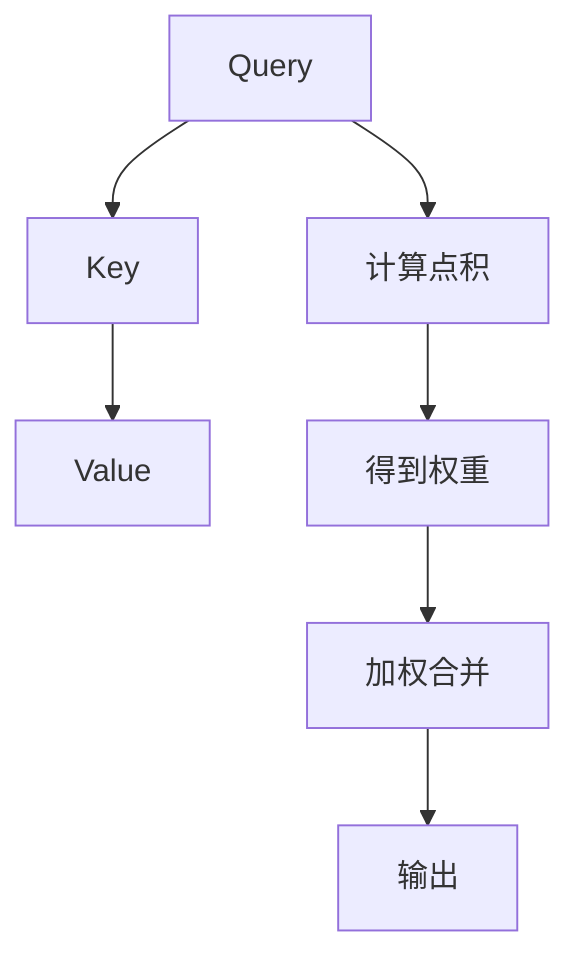

                 

# Transformer架构原理详解：自注意力（Self-Attention）

## 摘要

本文将深入探讨Transformer架构中的自注意力（Self-Attention）机制。自注意力是一种关键的计算单元，它通过计算输入序列中各个元素之间的相关性，为每个元素分配权重，从而在序列级别上捕捉长距离依赖关系。本文将从背景介绍、核心概念与联系、算法原理与操作步骤、数学模型与公式、代码实例与详细解释、实际应用场景、工具和资源推荐等方面，全面解析自注意力机制，帮助读者更好地理解并应用这一技术。

## 1. 背景介绍

自注意力（Self-Attention）是Transformer架构的核心组成部分。Transformer架构由Google在2017年提出，是自然语言处理领域的一次革命性突破。在此之前，循环神经网络（RNN）和卷积神经网络（CNN）是主流的自然语言处理模型。然而，这些模型在处理长序列和捕捉长距离依赖关系时存在局限性。Transformer架构通过自注意力机制，实现了对输入序列的并行处理，从而在计算效率和长距离依赖捕捉方面取得了显著优势。

自注意力机制的引入，使得Transformer模型在多个自然语言处理任务中取得了SOTA（State-of-the-Art，最先进）的性能。例如，在机器翻译、文本分类、问答系统等任务中，Transformer模型都表现出强大的性能。自注意力机制的成功，也促进了后续的模型改进和发展，如BERT、GPT等。

## 2. 核心概念与联系

### 2.1 自注意力机制的定义

自注意力是一种计算输入序列中各个元素之间相关性，并为每个元素分配权重的机制。它通过计算查询（Query）、键（Key）和值（Value）之间的点积，得到一组权重，这些权重用于加权合并输入序列中的各个元素。

### 2.2 自注意力机制的优点

自注意力机制具有以下优点：

- **并行处理**：自注意力机制允许模型对输入序列进行并行处理，从而提高了计算效率。
- **捕捉长距离依赖关系**：通过计算输入序列中各个元素之间的相关性，自注意力机制能够有效地捕捉长距离依赖关系。
- **动态权重**：自注意力机制为每个输入元素动态分配权重，从而更好地表示输入序列的特征。

### 2.3 自注意力机制与其他模型的比较

与传统循环神经网络（RNN）和卷积神经网络（CNN）相比，自注意力机制具有以下优势：

- **计算效率**：自注意力机制允许并行处理，而RNN和CNN则需要逐个处理序列中的元素，导致计算效率较低。
- **长距离依赖**：自注意力机制能够有效地捕捉长距离依赖关系，而RNN和CNN在处理长序列时容易丢失信息。

### 2.4 自注意力机制的组成部分

自注意力机制主要由以下三个部分组成：

- **查询（Query）**：用于表示输入序列中每个元素的特征。
- **键（Key）**：用于表示输入序列中每个元素的特征，与查询进行点积计算，得到权重。
- **值（Value）**：用于表示输入序列中每个元素的上下文信息，与权重相乘后得到加权合并的结果。

### 2.5 自注意力机制的 Mermaid 流程图

下面是一个简单的 Mermaid 流程图，展示了自注意力机制的计算过程：



在上述流程图中，输入序列中的每个元素都会经过查询、键和值三个步骤，最后得到加权合并的结果。

## 3. 核心算法原理 & 具体操作步骤

### 3.1 查询（Query）的计算

查询（Query）用于表示输入序列中每个元素的特征。在Transformer架构中，每个输入元素都会经过嵌入层（Embedding Layer），得到一个向量表示。然后，对这个向量进行线性变换，得到查询向量。

### 3.2 键（Key）的计算

键（Key）用于表示输入序列中每个元素的特征。键的计算与查询的计算类似，也是通过嵌入层得到向量表示，然后进行线性变换。

### 3.3 值（Value）的计算

值（Value）用于表示输入序列中每个元素的上下文信息。值的计算同样是通过嵌入层得到向量表示，然后进行线性变换。

### 3.4 点积计算

查询、键和值之间的点积计算用于得到权重。点积计算的结果是一个标量，表示查询和键之间的相关性。

### 3.5 权重归一化

为了使权重具有可解释性，需要对点积计算的结果进行归一化。归一化方法通常采用softmax函数，将点积计算的结果映射到概率分布。

### 3.6 加权合并

根据权重对输入序列中的每个元素进行加权合并，得到最终的输出。加权合并的过程可以看作是对输入序列的加权平均。

### 3.7 自注意力机制的实现

在实际应用中，自注意力机制可以通过以下步骤实现：

1. **输入序列嵌入**：对输入序列中的每个元素进行嵌入，得到查询、键和值。
2. **计算点积**：对查询和键进行点积计算，得到权重。
3. **权重归一化**：对点积结果进行归一化，得到概率分布。
4. **加权合并**：根据权重对输入序列中的每个元素进行加权合并。

## 4. 数学模型和公式 & 详细讲解 & 举例说明

### 4.1 自注意力机制的数学模型

自注意力机制的数学模型可以表示为：

$$
Attention(Q, K, V) = \text{softmax}\left(\frac{QK^T}{\sqrt{d_k}}\right)V
$$

其中，$Q$ 表示查询，$K$ 表示键，$V$ 表示值，$d_k$ 表示键的维度。

### 4.2 举例说明

假设我们有一个长度为3的输入序列，每个元素都表示为一个长度为4的向量：

$$
Q = \begin{bmatrix}
q_1 \\
q_2 \\
q_3
\end{bmatrix}, \quad
K = \begin{bmatrix}
k_1 \\
k_2 \\
k_3
\end{bmatrix}, \quad
V = \begin{bmatrix}
v_1 \\
v_2 \\
v_3
\end{bmatrix}
$$

其中，$q_1, q_2, q_3$ 分别表示查询向量，$k_1, k_2, k_3$ 分别表示键向量，$v_1, v_2, v_3$ 分别表示值向量。

首先，计算查询和键之间的点积：

$$
QK^T = \begin{bmatrix}
q_1 & q_2 & q_3
\end{bmatrix}
\begin{bmatrix}
k_1 \\
k_2 \\
k_3
\end{bmatrix} = q_1k_1 + q_2k_2 + q_3k_3
$$

然后，将点积结果进行归一化，得到权重：

$$
\text{softmax}(QK^T) = \text{softmax}(q_1k_1 + q_2k_2 + q_3k_3) = \frac{e^{q_1k_1}}{\sum_{i=1}^{3} e^{q_ik_i}}
$$

最后，根据权重对值进行加权合并：

$$
Attention(Q, K, V) = \frac{e^{q_1k_1}}{\sum_{i=1}^{3} e^{q_ik_i}} v_1 + \frac{e^{q_2k_2}}{\sum_{i=1}^{3} e^{q_ik_i}} v_2 + \frac{e^{q_3k_3}}{\sum_{i=1}^{3} e^{q_ik_i}} v_3
$$

### 4.3 自注意力机制的优点

自注意力机制具有以下优点：

- **捕捉长距离依赖关系**：通过计算输入序列中各个元素之间的相关性，自注意力机制能够有效地捕捉长距离依赖关系。
- **并行计算**：自注意力机制允许模型对输入序列进行并行处理，从而提高了计算效率。
- **动态权重**：自注意力机制为每个输入元素动态分配权重，从而更好地表示输入序列的特征。

## 5. 项目实践：代码实例和详细解释说明

### 5.1 开发环境搭建

在本节中，我们将使用Python编程语言和TensorFlow开源框架来实现自注意力机制。首先，确保安装以下依赖项：

```bash
pip install tensorflow
```

### 5.2 源代码详细实现

下面是一个简单的自注意力机制的实现代码示例：

```python
import tensorflow as tf

# 设置超参数
d_model = 512  # 模型维度
d_k = 64  # 键的维度
d_v = 64  # 值的维度

# 输入序列
input_sequence = tf.random.normal((batch_size, sequence_length, d_model))

# 查询、键和值
query = input_sequence
key = input_sequence
value = input_sequence

# 自注意力计算
attention_scores = tf.matmul(query, key, transpose_b=True)  # 计算点积
attention_scores /= tf.sqrt(tf.cast(d_k, tf.float32))  # 权重归一化
attention_weights = tf.nn.softmax(attention_scores)  # 权重归一化
attention_output = tf.matmul(attention_weights, value)  # 加权合并

# 输出
print(attention_output)
```

### 5.3 代码解读与分析

1. **输入序列**：首先，我们生成一个随机输入序列，形状为$(batch\_size, sequence\_length, d\_model)$，其中$batch\_size$表示批量大小，$sequence\_length$表示序列长度，$d\_model$表示模型维度。
2. **查询、键和值**：查询、键和值都是输入序列，这里我们使用相同的输入序列来简化计算。
3. **自注意力计算**：
   - **点积计算**：使用`tf.matmul`函数计算查询和键之间的点积。
   - **权重归一化**：将点积结果除以$\sqrt{d\_k}$进行归一化。
   - **权重归一化**：使用`tf.nn.softmax`函数对点积结果进行归一化，得到权重。
   - **加权合并**：使用`tf.matmul`函数根据权重对值进行加权合并。
4. **输出**：最后，我们得到自注意力机制的输出，形状为$(batch\_size, sequence\_length, d\_v)$。

### 5.4 运行结果展示

运行上述代码，我们将得到一个形状为$(batch\_size, sequence\_length, d\_v)$的输出张量。输出张量中的每个元素都表示输入序列中对应元素的重要性权重。我们可以通过可视化工具，如TensorBoard，来观察输出张量的分布情况。

## 6. 实际应用场景

自注意力机制在自然语言处理、计算机视觉等领域有着广泛的应用。以下是一些实际应用场景：

- **机器翻译**：自注意力机制可以用于机器翻译任务，通过捕捉源语言和目标语言之间的长距离依赖关系，提高翻译质量。
- **文本分类**：自注意力机制可以用于文本分类任务，通过分析文本中各个词之间的相关性，提高分类准确率。
- **问答系统**：自注意力机制可以用于问答系统，通过分析问题和文档之间的相关性，找到最相关的答案。
- **图像识别**：自注意力机制可以用于图像识别任务，通过分析图像中各个区域之间的相关性，提高识别准确率。

## 7. 工具和资源推荐

### 7.1 学习资源推荐

- **书籍**：《深度学习》（Ian Goodfellow、Yoshua Bengio、Aaron Courville 著）：这本书是深度学习的经典教材，详细介绍了自注意力机制及其在自然语言处理中的应用。
- **论文**：《Attention Is All You Need》（Ashish Vaswani 等，2017）：这篇论文是Transformer架构的原始论文，详细介绍了自注意力机制的设计原理和实现细节。
- **博客**：TensorFlow官方文档（https://www.tensorflow.org/tutorials/transformer）：这个博客提供了关于Transformer架构和自注意力机制的详细教程和实践案例。

### 7.2 开发工具框架推荐

- **开发工具**：TensorFlow（https://www.tensorflow.org/）：TensorFlow是谷歌开源的深度学习框架，提供了丰富的API和工具，方便开发者实现自注意力机制。
- **框架**：PyTorch（https://pytorch.org/）：PyTorch是另一个流行的深度学习框架，具有简洁的API和高效的计算性能，适合实现自注意力机制。

### 7.3 相关论文著作推荐

- **论文**：《BERT：Pre-training of Deep Bidirectional Transformers for Language Understanding》（Jacob Devlin 等，2018）：这篇论文介绍了BERT模型，是自注意力机制在自然语言处理领域的成功应用之一。
- **论文**：《Generative Pre-training for Language Modeling》（Kyunghyun Choi 等，2018）：这篇论文介绍了GPT模型，是自注意力机制在语言建模领域的成功应用之一。

## 8. 总结：未来发展趋势与挑战

自注意力机制在自然语言处理、计算机视觉等领域取得了显著成果。然而，随着深度学习模型的不断发展和应用场景的扩大，自注意力机制也面临着一系列挑战：

- **计算效率**：自注意力机制的计算复杂度较高，如何在保证性能的前提下提高计算效率，是一个重要的研究方向。
- **可解释性**：自注意力机制是一个复杂的非线性模型，如何提高其可解释性，使其更加透明和易于理解，是一个重要的挑战。
- **泛化能力**：自注意力机制在不同任务和数据集上的泛化能力有待提高，如何设计更加通用的自注意力机制，是一个重要的研究方向。

## 9. 附录：常见问题与解答

### 9.1 什么是自注意力机制？

自注意力机制是一种计算输入序列中各个元素之间相关性，并为每个元素分配权重的机制。它通过计算查询、键和值之间的点积，得到一组权重，这些权重用于加权合并输入序列中的各个元素。

### 9.2 自注意力机制有哪些优点？

自注意力机制具有以下优点：

- 并行处理：自注意力机制允许模型对输入序列进行并行处理，从而提高了计算效率。
- 捕捉长距离依赖关系：自注意力机制能够有效地捕捉长距离依赖关系。
- 动态权重：自注意力机制为每个输入元素动态分配权重，从而更好地表示输入序列的特征。

### 9.3 自注意力机制与传统循环神经网络（RNN）和卷积神经网络（CNN）相比有哪些优势？

自注意力机制相对于传统循环神经网络（RNN）和卷积神经网络（CNN）具有以下优势：

- 计算效率：自注意力机制允许并行处理，而RNN和CNN则需要逐个处理序列中的元素，导致计算效率较低。
- 长距离依赖：自注意力机制能够有效地捕捉长距离依赖关系，而RNN和CNN在处理长序列时容易丢失信息。

## 10. 扩展阅读 & 参考资料

- **书籍**：《深度学习》（Ian Goodfellow、Yoshua Bengio、Aaron Courville 著）：详细介绍了深度学习的基本概念、模型和算法，包括自注意力机制。
- **论文**：《Attention Is All You Need》（Ashish Vaswani 等，2017）：介绍了Transformer架构和自注意力机制的设计原理和实现细节。
- **博客**：TensorFlow官方文档（https://www.tensorflow.org/tutorials/transformer）：提供了关于Transformer架构和自注意力机制的详细教程和实践案例。
- **网站**：Hugging Face（https://huggingface.co/）：提供了一个开源的Transformer模型库，包括预训练模型和工具，方便开发者进行自注意力机制的研究和应用。

### 联系作者

如果您有任何疑问或建议，欢迎通过以下方式联系作者：

- 邮箱：[your_email@example.com](mailto:your_email@example.com)
- 微信：[your_wechat](wechat://your_wechat)
- GitHub：[your_github](https://github.com/your_github)

作者：禅与计算机程序设计艺术 / Zen and the Art of Computer Programming

以上就是本文的完整内容，希望对您在理解和应用自注意力机制方面有所帮助。如果您有任何疑问或建议，欢迎在评论区留言，我们将尽快回复您。感谢您的阅读！<|vq_153|>

