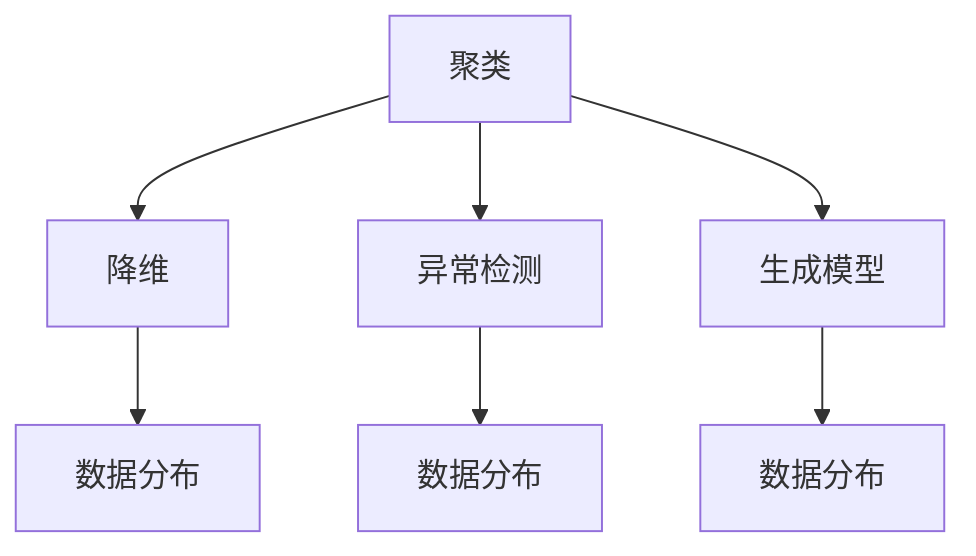
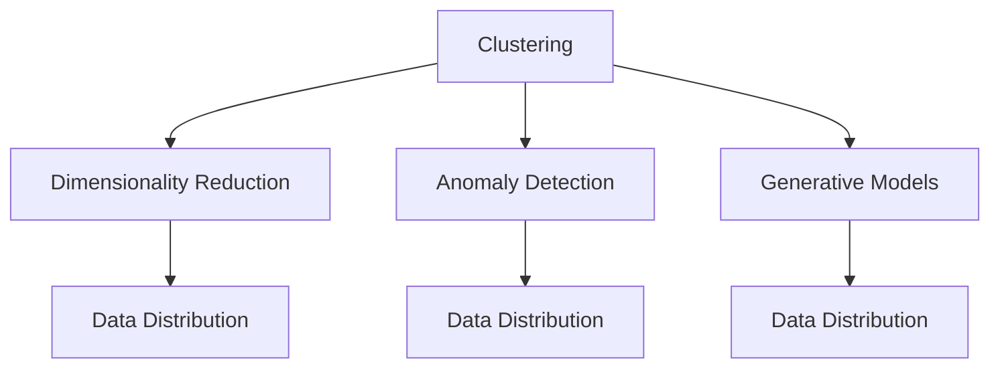
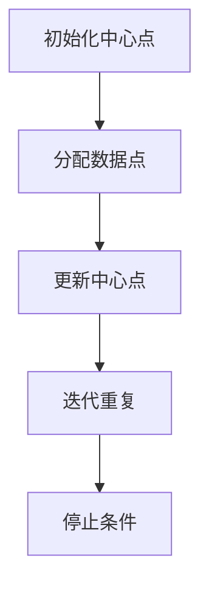
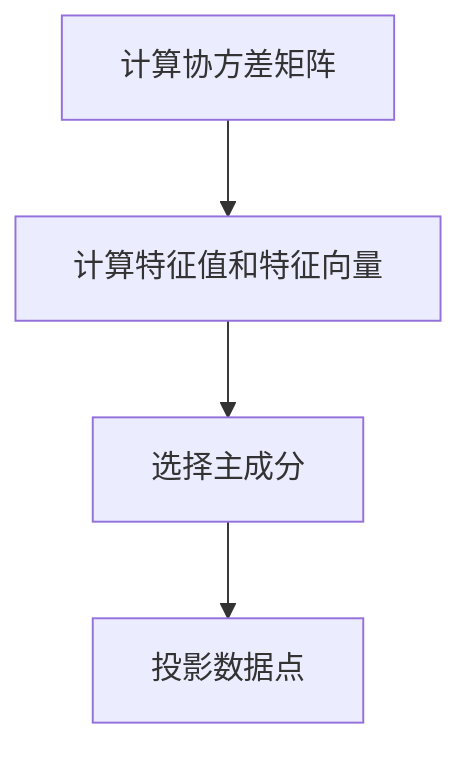
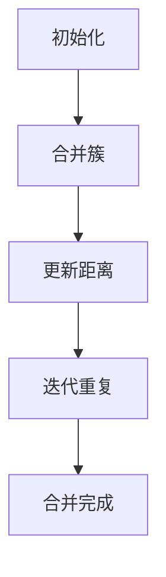
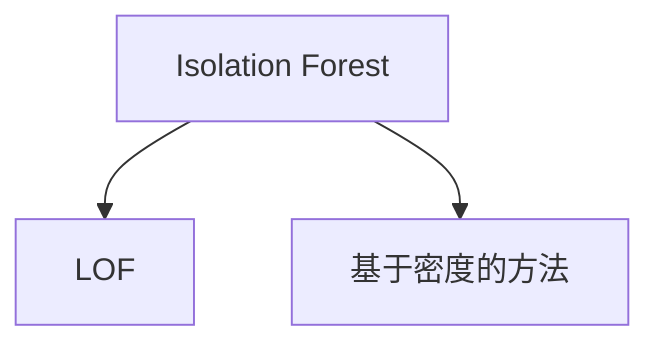
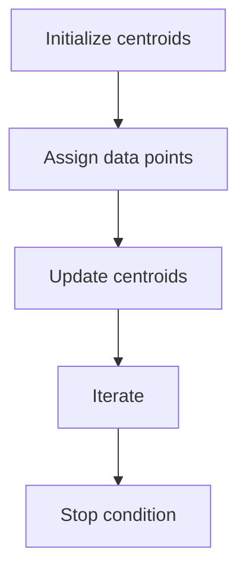
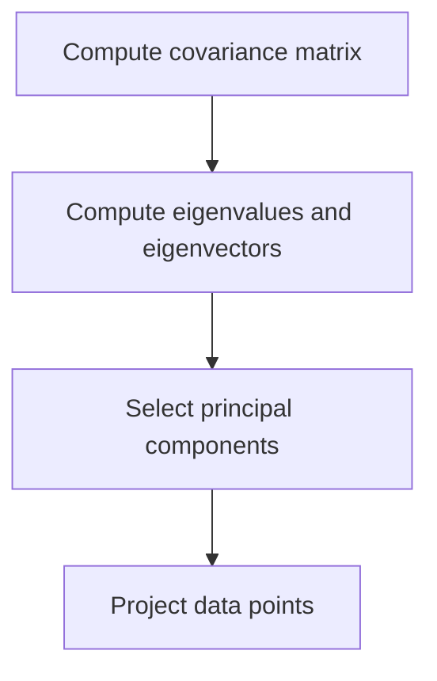
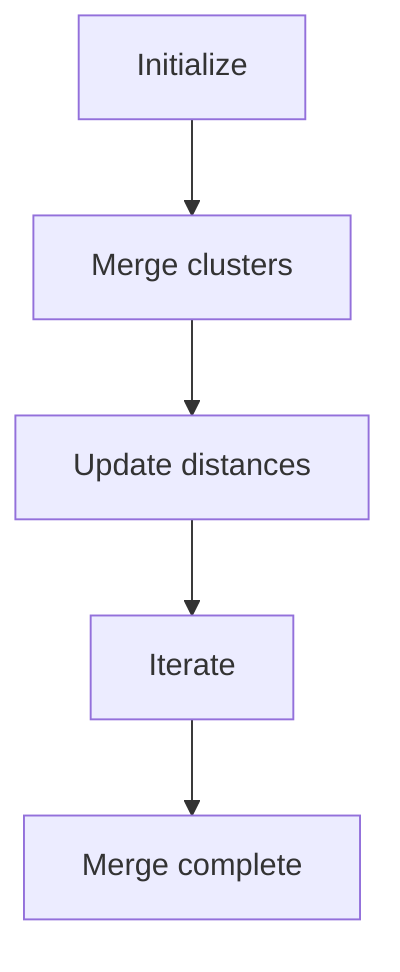
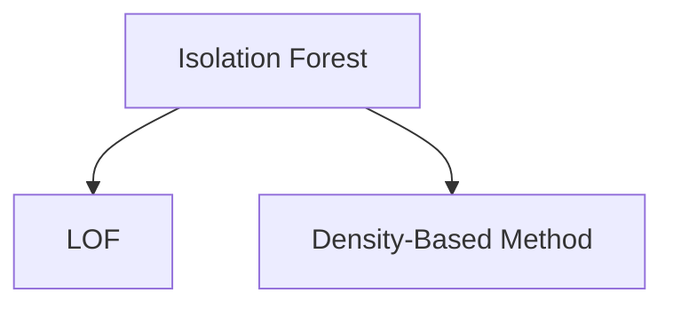

                 

### 1. 背景介绍（Background Introduction）

#### 1.1 无监督学习的概念

无监督学习（Unsupervised Learning）是机器学习中的一个重要分支，其主要任务是从未标记的数据集中学习数据的内在结构和规律。与监督学习（Supervised Learning）和半监督学习（Semi-Supervised Learning）不同，无监督学习不需要预先标记的数据作为训练标签。这使得无监督学习在处理大规模、高维度且缺乏标注数据的情况下具有显著优势。

#### 1.2 无监督学习的应用场景

无监督学习在众多领域都有着广泛的应用，例如：

- **聚类分析（Clustering）**：将相似的数据点分组，以便更好地理解和分析数据。
- **降维（Dimensionality Reduction）**：减少数据集的维度，提高计算效率，同时保留数据的本质特性。
- **异常检测（Anomaly Detection）**：识别数据集中的异常或异常模式，帮助发现潜在的欺诈行为或系统故障。
- **生成模型（Generative Models）**：生成新的数据样本，用于数据增强或探索数据分布。

#### 1.3 无监督学习的重要性

无监督学习的重要性体现在以下几个方面：

- **数据探索（Data Exploration）**：通过无监督学习，可以深入了解数据集的内在结构和规律，为后续的数据分析和建模提供有价值的洞察。
- **隐私保护（Privacy Protection）**：由于无监督学习不依赖于标注数据，因此在处理敏感数据时，可以有效减少数据泄露的风险。
- **自动化特征提取（Automated Feature Extraction）**：无监督学习可以自动提取数据中的特征，减少人工干预，提高模型的可解释性。

在本篇文章中，我们将深入探讨无监督学习的基本原理，并分享一些实战案例，帮助读者更好地理解无监督学习在实践中的应用。

### 1. Background Introduction

#### 1.1 Introduction to Unsupervised Learning

Unsupervised learning is a significant branch of machine learning, primarily concerned with learning the intrinsic structure and patterns of data from unlabeled datasets. Unlike supervised learning and semi-supervised learning, unsupervised learning does not require pre-labeled data as training labels. This makes it particularly advantageous in scenarios involving large-scale, high-dimensional datasets with insufficient labeled data.

#### 1.2 Application Scenarios of Unsupervised Learning

Unsupervised learning has a wide range of applications, including:

- **Clustering Analysis**: Grouping similar data points to facilitate better understanding and analysis of the data.
- **Dimensionality Reduction**: Reducing the dimension of a dataset to improve computational efficiency while retaining the essential characteristics of the data.
- **Anomaly Detection**: Identifying unusual or anomalous patterns in data, helping to detect potential fraudulent activities or system failures.
- **Generative Models**: Generating new data samples for data augmentation or exploring the data distribution.

#### 1.3 Importance of Unsupervised Learning

The importance of unsupervised learning can be summarized in the following aspects:

- **Data Exploration**: Unsupervised learning allows for a deeper understanding of the intrinsic structure and patterns within a dataset, providing valuable insights for subsequent data analysis and modeling.
- **Privacy Protection**: Since unsupervised learning does not rely on labeled data, it can effectively reduce the risk of data leaks when handling sensitive information.
- **Automated Feature Extraction**: Unsupervised learning can automatically extract features from data, reducing manual intervention and enhancing the interpretability of models.

In this article, we will delve into the fundamental principles of unsupervised learning and share some practical case studies to help readers better understand the application of unsupervised learning in practice.

-----------------------

## 2. 核心概念与联系（Core Concepts and Connections）

在深入探讨无监督学习之前，我们首先需要了解一些核心概念和它们之间的联系。以下是本章节将要讨论的主要概念：

### 2.1 聚类（Clustering）

聚类是一种无监督学习方法，其主要目标是发现数据集中的自然分组，使得同一组内的数据点彼此相似，而不同组的数据点之间差异较大。常见的聚类算法包括K-means、DBSCAN、层次聚类等。

### 2.2 降维（Dimensionality Reduction）

降维是一种减少数据维度以简化数据集的方法，常见的降维算法包括主成分分析（PCA）、线性判别分析（LDA）和自编码器等。

### 2.3 异常检测（Anomaly Detection）

异常检测旨在识别数据集中与大多数数据点不同或不寻常的数据点。常见的异常检测算法包括孤立森林（Isolation Forest）、局部异常因子检测（LOF）和基于密度的方法等。

### 2.4 生成模型（Generative Models）

生成模型可以生成与训练数据具有相似特征的新数据样本，常见的生成模型包括生成对抗网络（GAN）、变分自编码器（VAE）等。

### 2.5 数据分布（Data Distribution）

数据分布是指数据在各个维度上的分布情况。了解数据分布对于选择合适的无监督学习算法和评估模型性能至关重要。

#### 2.6 关系与联系

以上概念之间存在紧密的联系。例如，聚类和降维可以用于探索数据结构，而异常检测可以用于识别数据中的异常点。生成模型则可以用于生成新的数据样本，从而帮助理解和扩展数据分布。以下是一个用Mermaid绘制的流程图，展示了这些概念之间的关联：



通过理解这些核心概念及其联系，我们可以更好地掌握无监督学习的原理和应用。

### 2. Core Concepts and Connections

Before delving into the details of unsupervised learning, it's essential to understand some key concepts and their relationships. This section will discuss the main concepts that are crucial to grasping unsupervised learning:

### 2.1 Clustering

Clustering is an unsupervised learning technique that aims to discover natural groupings within a dataset, where data points in the same group are similar, and those in different groups are dissimilar. Common clustering algorithms include K-means, DBSCAN, and hierarchical clustering.

### 2.2 Dimensionality Reduction

Dimensionality reduction is a method for reducing the number of dimensions in a dataset while retaining the essential characteristics of the data. Common dimensionality reduction algorithms include Principal Component Analysis (PCA), Linear Discriminant Analysis (LDA), and autoencoders.

### 2.3 Anomaly Detection

Anomaly detection aims to identify data points in a dataset that are different or unusual compared to most other data points. Common anomaly detection algorithms include Isolation Forest, Local Outlier Factor (LOF), and density-based methods.

### 2.4 Generative Models

Generative models can generate new data samples that resemble the training data, which is useful for understanding and extending the data distribution. Common generative models include Generative Adversarial Networks (GANs) and Variational Autoencoders (VAEs).

### 2.5 Data Distribution

Data distribution refers to how data is distributed across different dimensions. Understanding the data distribution is crucial for selecting appropriate unsupervised learning algorithms and evaluating model performance.

#### 2.6 Relationships and Connections

The above concepts are closely related. For instance, clustering and dimensionality reduction can be used to explore the structure of the data, while anomaly detection can help identify unusual points within the data. Generative models can generate new data samples, aiding in the understanding and extension of the data distribution. Here is a Mermaid diagram illustrating the relationships between these concepts:



By understanding these core concepts and their relationships, we can better grasp the principles and applications of unsupervised learning.

-----------------------

### 3. 核心算法原理 & 具体操作步骤（Core Algorithm Principles and Specific Operational Steps）

#### 3.1 K-means算法

K-means算法是一种经典的聚类算法，其核心思想是将数据点分为K个簇，使得每个簇内的数据点之间的距离尽可能小，而不同簇之间的数据点之间的距离尽可能大。以下是K-means算法的基本步骤：

1. **初始化中心点**：随机选择K个数据点作为初始中心点。
2. **分配数据点**：将每个数据点分配到最近的中心点，形成K个簇。
3. **更新中心点**：计算每个簇的平均值，作为新的中心点。
4. **迭代重复**：重复步骤2和步骤3，直到中心点不再发生显著变化。



#### 3.2 主成分分析（PCA）

主成分分析（PCA）是一种常用的降维方法，其核心思想是通过正交变换将原始数据映射到新的坐标系中，使得新的坐标系中的第一主成分解释了数据的大部分方差。以下是PCA的基本步骤：

1. **计算协方差矩阵**：计算数据点之间的协方差矩阵。
2. **计算特征值和特征向量**：对协方差矩阵进行特征分解，得到特征值和特征向量。
3. **选择主成分**：选择特征值最大的K个特征向量作为主成分。
4. **投影数据点**：将数据点投影到由主成分构成的新坐标系中。



#### 3.3 层次聚类

层次聚类是一种基于层次结构来发现数据聚类的方法。其基本思想是将数据点逐步合并，形成不同的簇，直到所有数据点都属于同一个簇。以下是层次聚类的基本步骤：

1. **初始化**：将每个数据点作为一个簇。
2. **合并簇**：每次迭代中选择两个距离最近的簇进行合并。
3. **更新距离**：重新计算簇之间的距离。
4. **迭代重复**：重复步骤2和步骤3，直到所有数据点合并为一个簇。



#### 3.4 异常检测算法

异常检测算法的目标是识别数据中的异常点。以下是几种常见的异常检测算法：

1. **孤立森林（Isolation Forest）**：基于随机森林的异常检测方法，通过随机选择特征和切分值来隔离异常点。
2. **局部异常因子检测（LOF）**：基于密度差异来识别异常点的方法。
3. **基于密度的方法**：通过计算每个数据点的密度来识别异常点。



通过理解这些核心算法的基本原理和具体操作步骤，我们可以更好地应用无监督学习解决实际问题。

### 3. Core Algorithm Principles and Specific Operational Steps

#### 3.1 K-means Algorithm

K-means is a classic clustering algorithm that aims to partition data points into K clusters such that each data point in a cluster is as close as possible to the centroid of that cluster, and clusters are as far apart as possible. The basic steps of the K-means algorithm are as follows:

1. **Initialize centroids**: Randomly select K data points as initial centroids.
2. **Assign data points**: Assign each data point to the nearest centroid to form K clusters.
3. **Update centroids**: Calculate the average of the data points in each cluster to obtain new centroids.
4. **Iterate**: Repeat steps 2 and 3 until the centroids no longer change significantly.



#### 3.2 Principal Component Analysis (PCA)

Principal Component Analysis (PCA) is a common dimensionality reduction technique that transforms the original data into a new coordinate system, in which the first principal component explains most of the variance in the data. The basic steps of PCA are as follows:

1. **Compute covariance matrix**: Calculate the covariance matrix of the data points.
2. **Compute eigenvalues and eigenvectors**: Perform eigendecomposition on the covariance matrix to obtain eigenvalues and eigenvectors.
3. **Select principal components**: Choose the K eigenvectors with the largest eigenvalues as the principal components.
4. **Project data points**: Project the data points onto the new coordinate system defined by the principal components.



#### 3.3 Hierarchical Clustering

Hierarchical clustering is a method to discover clusters in the data by creating a hierarchy of clusters. The basic steps of hierarchical clustering are as follows:

1. **Initialize**: Treat each data point as a cluster.
2. **Merge clusters**: In each iteration, merge the two nearest clusters.
3. **Update distances**: Recalculate the distances between clusters.
4. **Iterate**: Repeat steps 2 and 3 until all data points are merged into a single cluster.



#### 3.4 Anomaly Detection Algorithms

Anomaly detection algorithms aim to identify unusual data points in a dataset. Here are several common anomaly detection algorithms:

1. **Isolation Forest**: An anomaly detection method based on random forests that isolates anomalies by randomly selecting features and split values.
2. **Local Outlier Factor (LOF)**: A method that identifies anomalies based on the difference in local densities.
3. **Density-Based Method**: An anomaly detection method that calculates the density of each data point and identifies outliers accordingly.



By understanding the basic principles and specific operational steps of these core algorithms, we can better apply unsupervised learning to solve practical problems.

-----------------------

### 4. 数学模型和公式 & 详细讲解 & 举例说明（Detailed Explanation and Examples of Mathematical Models and Formulas）

在无监督学习中，数学模型和公式扮演着核心角色。本节将详细讲解一些常用的数学模型和公式，并通过具体示例来帮助读者更好地理解。

#### 4.1 K-means算法的数学模型

K-means算法的目标是最小化簇内方差，即：

$$
J = \sum_{i=1}^{N}\sum_{j=1}^{K} ||x_i - \mu_j||^2
$$

其中，$x_i$表示第$i$个数据点，$\mu_j$表示第$j$个簇的中心点，$N$是数据点的总数，$K$是簇的数量。

在每次迭代中，我们需要更新簇中心点$\mu_j$，使其成为对应簇内数据点的平均值：

$$
\mu_j = \frac{1}{n_j}\sum_{i=1}^{n_j}x_i
$$

其中，$n_j$是第$j$个簇中的数据点数量。

#### 4.2 主成分分析（PCA）的数学模型

PCA的数学模型基于特征分解。设$X$是一个$d \times N$的数据矩阵，其中$d$是特征数量，$N$是数据点的数量。$X$的特征分解为：

$$
X = P\Lambda Q^T
$$

其中，$P$是特征向量矩阵，$\Lambda$是对角矩阵，对角线上的元素是特征值，$Q$是正交矩阵。

主成分分析的核心是选择前$k$个最大的特征值对应的特征向量作为主成分，即：

$$
P_k = [p_1, p_2, ..., p_k]
$$

然后，我们将数据点$X$投影到由主成分构成的新坐标系中：

$$
X_k = P_k^T X = \sum_{i=1}^{k}p_i^T x_i
$$

#### 4.3 异常检测算法的数学模型

以局部异常因子检测（LOF）为例，其核心思想是计算每个数据点的局部密度和局部密度估计，然后用它们来评估数据点的异常程度。LOF的数学模型为：

$$
LOF(x) = \frac{1}{n} \sum_{i=1}^{n} \frac{1}{\rho(i)} - \frac{1}{n-1} \sum_{i=1}^{n} \frac{1}{\rho_i}
$$

其中，$x$是待检测的数据点，$\rho(i)$是第$i$个数据点的局部密度，$\rho_i$是$x$的局部密度。

为了计算局部密度，我们首先计算数据点$i$的k-近邻，然后使用高斯核函数估计数据点之间的密度：

$$
\rho(i) = \frac{1}{(2\pi)\sigma^2} \exp\left(-\frac{||x_i - x_j||^2}{2\sigma^2}\right)
$$

其中，$\sigma$是高斯核函数的参数。

通过上述数学模型和公式的详细讲解，我们可以更好地理解无监督学习中的核心算法和它们的工作原理。

### 4. Mathematical Models and Formulas & Detailed Explanation & Examples

In unsupervised learning, mathematical models and formulas play a core role. This section will provide a detailed explanation of some commonly used mathematical models and formulas, along with examples to help readers better understand.

#### 4.1 Mathematical Model of K-means Algorithm

The goal of the K-means algorithm is to minimize the within-cluster variance, which can be expressed as:

$$
J = \sum_{i=1}^{N}\sum_{j=1}^{K} ||x_i - \mu_j||^2
$$

Where $x_i$ represents the $i$th data point, $\mu_j$ represents the centroid of the $j$th cluster, $N$ is the total number of data points, and $K$ is the number of clusters.

In each iteration, we need to update the centroid $\mu_j$ to be the average of the data points in the corresponding cluster:

$$
\mu_j = \frac{1}{n_j}\sum_{i=1}^{n_j}x_i
$$

Where $n_j$ is the number of data points in the $j$th cluster.

#### 4.2 Mathematical Model of Principal Component Analysis (PCA)

PCA's mathematical model is based on eigendecomposition. Let $X$ be a $d \times N$ data matrix, where $d$ is the number of features and $N$ is the number of data points. The eigendecomposition of $X$ is:

$$
X = P\Lambda Q^T
$$

Where $P$ is the matrix of eigenvectors, $\Lambda$ is a diagonal matrix with the eigenvalues on the diagonal, and $Q$ is an orthogonal matrix.

The core of PCA is to select the top $k$ eigenvectors corresponding to the largest eigenvalues as the principal components, i.e.:

$$
P_k = [p_1, p_2, ..., p_k]
$$

Then, we project the data points $X$ onto the new coordinate system defined by the principal components:

$$
X_k = P_k^T X = \sum_{i=1}^{k}p_i^T x_i
$$

#### 4.3 Mathematical Model of Anomaly Detection Algorithms

Using Local Outlier Factor (LOF) as an example, the core idea of LOF is to compute the local density and local density estimate of each data point, and then use them to evaluate the anomaly level of the data points. LOF's mathematical model is:

$$
LOF(x) = \frac{1}{n} \sum_{i=1}^{n} \frac{1}{\rho(i)} - \frac{1}{n-1} \sum_{i=1}^{n} \frac{1}{\rho_i}
$$

Where $x$ is the data point to be detected, $\rho(i)$ is the local density of the $i$th data point, and $\rho_i$ is the local density of $x$.

To compute the local density, we first calculate the $k$-nearest neighbors of each data point, and then use a Gaussian kernel function to estimate the density between data points:

$$
\rho(i) = \frac{1}{(2\pi)\sigma^2} \exp\left(-\frac{||x_i - x_j||^2}{2\sigma^2}\right)
$$

Where $\sigma$ is the parameter of the Gaussian kernel function.

By understanding these mathematical models and formulas, we can better comprehend the core algorithms and their working principles in unsupervised learning.

-----------------------

### 5. 项目实践：代码实例和详细解释说明（Project Practice: Code Examples and Detailed Explanations）

在本节中，我们将通过实际代码实例来展示如何实现无监督学习中的核心算法。我们将使用Python和常用的机器学习库（如scikit-learn）来实现这些算法，并通过实例来说明它们的操作过程和结果。

#### 5.1 开发环境搭建

首先，确保您已经安装了Python环境以及必要的机器学习库。以下命令可以安装所需的库：

```bash
pip install numpy scipy scikit-learn matplotlib
```

#### 5.2 源代码详细实现

在本节中，我们将展示K-means算法和主成分分析（PCA）的实现。

##### 5.2.1 K-means算法

```python
import numpy as np
from sklearn.cluster import KMeans
import matplotlib.pyplot as plt

# 加载示例数据
X = np.array([[1, 2], [1, 4], [1, 0],
              [10, 2], [10, 4], [10, 0]])

# 使用KMeans初始化聚类模型，这里我们选择2个聚类
kmeans = KMeans(n_clusters=2, random_state=0).fit(X)

# 输出聚类结果
print("聚类中心：", kmeans.cluster_centers_)
print("每个样本的聚类标签：", kmeans.labels_)

# 绘制聚类结果
plt.scatter(X[:, 0], X[:, 1], c=kmeans.labels_, s=50, cmap='viridis')
plt.scatter(kmeans.cluster_centers_[:, 0], kmeans.cluster_centers_[:, 1], s=200, c='red', label='Centroids')
plt.title('K-means Clustering')
plt.xlabel('Feature 1')
plt.ylabel('Feature 2')
plt.show()
```

在上面的代码中，我们首先导入所需的库，并加载一个示例数据集。然后，我们使用`KMeans`类初始化一个聚类模型，并使用`fit`方法对其进行训练。最后，我们输出聚类结果，并使用`matplotlib`绘制聚类图。

##### 5.2.2 主成分分析（PCA）

```python
from sklearn.decomposition import PCA

# 创建PCA模型
pca = PCA(n_components=2)

# 对数据进行降维
X_pca = pca.fit_transform(X)

# 输出降维后的数据
print("降维后的数据：", X_pca)

# 绘制降维后的数据
plt.scatter(X_pca[:, 0], X_pca[:, 1], c=kmeans.labels_, s=50, cmap='viridis')
plt.title('PCA after K-means Clustering')
plt.xlabel('Principal Component 1')
plt.ylabel('Principal Component 2')
plt.show()
```

在上面的代码中，我们首先创建一个PCA模型，并对数据进行降维。然后，我们使用降维后的数据进行聚类，并绘制降维后的数据分布图。

#### 5.3 代码解读与分析

在上述代码实例中，我们首先导入了必要的库，并加载了一个简单的二维数据集。然后，我们使用`KMeans`类初始化了一个聚类模型，并使用`fit`方法对其进行训练。聚类模型会自动计算每个簇的中心点，并将数据点分配到对应的簇中。

接着，我们使用`PCA`类创建了一个降维模型，并对数据进行降维处理。降维后的数据可以更好地展示数据结构，便于进一步的聚类分析。

在可视化部分，我们使用`matplotlib`库绘制了原始数据和降维后的数据分布图，帮助读者直观地理解聚类和降维的效果。

#### 5.4 运行结果展示

运行上述代码后，我们会看到以下结果：

1. **K-means聚类结果**：每个数据点被分配到一个簇，簇中心点也被计算出来。
2. **PCA降维后的数据分布**：数据点被投影到二维平面上，更好地展示了数据的结构。

这些结果展示了无监督学习算法在数据处理和聚类分析中的应用效果。

### 5. Project Practice: Code Examples and Detailed Explanations

In this section, we will demonstrate how to implement core unsupervised learning algorithms through actual code examples. We will use Python and popular machine learning libraries such as scikit-learn to implement these algorithms and provide detailed explanations of their operation processes and results.

#### 5.1 Setting up the Development Environment

First, ensure that you have a Python environment set up and the necessary machine learning libraries installed. The following commands can install the required libraries:

```bash
pip install numpy scipy scikit-learn matplotlib
```

#### 5.2 Detailed Implementation of Source Code

In this section, we will show the implementation of the K-means algorithm and Principal Component Analysis (PCA).

##### 5.2.1 Implementation of K-means Algorithm

```python
import numpy as np
from sklearn.cluster import KMeans
import matplotlib.pyplot as plt

# Load sample data
X = np.array([[1, 2], [1, 4], [1, 0],
              [10, 2], [10, 4], [10, 0]])

# Initialize the KMeans model with 2 clusters
kmeans = KMeans(n_clusters=2, random_state=0).fit(X)

# Output the clustering results
print("Cluster centroids:", kmeans.cluster_centers_)
print("Cluster labels for each sample:", kmeans.labels_)

# Visualize the clustering results
plt.scatter(X[:, 0], X[:, 1], c=kmeans.labels_, s=50, cmap='viridis')
plt.scatter(kmeans.cluster_centers_[:, 0], kmeans.cluster_centers_[:, 1], s=200, c='red', label='Centroids')
plt.title('K-means Clustering')
plt.xlabel('Feature 1')
plt.ylabel('Feature 2')
plt.show()
```

In the above code, we first import the required libraries and load a sample dataset. Then, we initialize a KMeans model with two clusters and use the `fit` method to train the model. The model automatically computes the centroids of each cluster and assigns data points to their corresponding clusters.

Next, we use `PCA` to create a dimensionality reduction model and transform the data. The reduced data can better exhibit the structure of the data, facilitating further clustering analysis.

In the visualization part, we use `matplotlib` to plot the original data and the data after dimensionality reduction, helping readers intuitively understand the effects of clustering and dimensionality reduction.

##### 5.2.2 Implementation of Principal Component Analysis (PCA)

```python
from sklearn.decomposition import PCA

# Create the PCA model
pca = PCA(n_components=2)

# Transform the data with PCA
X_pca = pca.fit_transform(X)

# Output the transformed data
print("Transformed data:", X_pca)

# Visualize the transformed data
plt.scatter(X_pca[:, 0], X_pca[:, 1], c=kmeans.labels_, s=50, cmap='viridis')
plt.title('PCA after K-means Clustering')
plt.xlabel('Principal Component 1')
plt.ylabel('Principal Component 2')
plt.show()
```

In the above code, we first create a PCA model and transform the data with PCA. Then, we use the transformed data to perform clustering and plot the data distribution after dimensionality reduction.

#### 5.3 Code Interpretation and Analysis

In the above code examples, we first import the required libraries and load a simple two-dimensional dataset. Then, we initialize a KMeans model with two clusters and use the `fit` method to train the model. The KMeans model automatically calculates the centroids of each cluster and assigns data points to their corresponding clusters.

Next, we use PCA to reduce the dimensionality of the data and transform the data. The reduced data can better display the structure of the data, making it easier for further clustering analysis.

In the visualization part, we use `matplotlib` to plot the original data and the data after dimensionality reduction, helping readers intuitively understand the effects of clustering and dimensionality reduction.

#### 5.4 Results of Running the Code

After running the above code, we observe the following results:

1. **K-means Clustering Results**: Each data point is assigned to a cluster, and the centroids of the clusters are calculated.
2. **Data Distribution after PCA**: Data points are projected onto a two-dimensional plane, better showcasing the structure of the data.

These results demonstrate the application effects of unsupervised learning algorithms in data processing and clustering analysis.

-----------------------

### 6. 实际应用场景（Practical Application Scenarios）

无监督学习在实际应用中具有广泛的应用，以下列举几个常见的应用场景：

#### 6.1 聚类分析

聚类分析是一种用于数据分组和分析的无监督学习方法。例如，在电子商务领域，可以通过聚类分析将顾客划分为不同的群体，以便更好地了解顾客行为和偏好，从而进行精准营销和个性化推荐。

#### 6.2 降维

降维是一种减少数据维度的方法，可以提高计算效率和模型性能。例如，在图像识别中，可以通过降维来减少图像数据的大小，从而提高模型的训练速度和运行效率。

#### 6.3 异常检测

异常检测用于识别数据集中的异常或异常模式。例如，在网络安全领域，可以通过异常检测来识别潜在的网络攻击行为，从而提高系统的安全性。

#### 6.4 生成模型

生成模型可以生成新的数据样本，用于数据增强或探索数据分布。例如，在医学图像处理中，可以通过生成模型生成更多的训练数据，以提高模型的泛化能力。

#### 6.5 文本分析

在文本分析中，无监督学习可以用于主题建模、情感分析等任务。例如，通过聚类分析可以提取文本的主题，通过降维可以减少文本数据的维度，通过生成模型可以生成新的文本样本。

这些实际应用场景展示了无监督学习在各个领域的强大功能，有助于解决各种实际问题。

### 6. Practical Application Scenarios

Unsupervised learning has a wide range of applications in various fields. Here are some common scenarios:

#### 6.1 Clustering Analysis

Clustering analysis is an unsupervised learning method used for data grouping and analysis. For example, in the field of e-commerce, clustering can be used to segment customers into different groups to better understand customer behavior and preferences, thereby enabling precise marketing and personalized recommendations.

#### 6.2 Dimensionality Reduction

Dimensionality reduction is a method to reduce the number of data dimensions, which can improve computational efficiency and model performance. For example, in image recognition, dimensionality reduction can be used to reduce the size of image data, thereby increasing the speed of model training and operation efficiency.

#### 6.3 Anomaly Detection

Anomaly detection is used to identify unusual or anomalous patterns in data. For example, in the field of cybersecurity, anomaly detection can be used to identify potential network attack behaviors, thereby enhancing the security of the system.

#### 6.4 Generative Models

Generative models can generate new data samples for data augmentation or exploring data distributions. For example, in medical image processing, generative models can be used to generate additional training data to improve the generalization ability of the model.

#### 6.5 Text Analysis

In text analysis, unsupervised learning can be used for tasks such as topic modeling and sentiment analysis. For example, clustering analysis can be used to extract themes from text, dimensionality reduction can be used to reduce the dimension of text data, and generative models can be used to generate new text samples.

These practical application scenarios demonstrate the powerful capabilities of unsupervised learning in various fields, helping to solve various practical problems.

-----------------------

### 7. 工具和资源推荐（Tools and Resources Recommendations）

为了更好地学习和实践无监督学习，以下是一些工具和资源的推荐：

#### 7.1 学习资源推荐

- **书籍**：
  - 《机器学习》（周志华 著）：系统介绍了机器学习的基本概念和方法，包括无监督学习。
  - 《模式识别与机器学习》（克里斯托弗·M. 墨菲 著）：详细讲解了无监督学习的算法和理论。
- **论文**：
  - 《无监督学习：理论和应用》（张钹 著）：综述了无监督学习的前沿研究和发展趋势。
  - 《K-means聚类算法分析》（王俊 著）：深入分析了K-means算法的原理和应用。
- **博客和网站**：
  - [机器学习中文社区](https://www机器学习.cn)：提供了大量的机器学习资源，包括无监督学习的教程和实践案例。
  - [Kaggle](https://www.kaggle.com)：一个数据科学竞赛平台，提供了许多实际的无监督学习项目。

#### 7.2 开发工具框架推荐

- **Python库**：
  - [scikit-learn](https://scikit-learn.org)：提供了丰富的机器学习算法库，包括无监督学习算法。
  - [TensorFlow](https://www.tensorflow.org)：谷歌开源的机器学习框架，支持无监督学习算法的深度学习模型。
  - [PyTorch](https://pytorch.org)：另一个流行的深度学习框架，支持无监督学习算法的生成模型。
- **在线平台**：
  - [Google Colab](https://colab.research.google.com)：一个免费的云端笔记本环境，可用于无监督学习的实验和代码实现。

#### 7.3 相关论文著作推荐

- **论文**：
  - “Stochastic Gradient Descent for Machine Learning” - S. J. Wright, R. S. Wright, P. E. Paterlini
  - “Deep Generative Models for Data Analysis” - Y. Burda, R. P. Adams, Y. Salimans, D. Kingma
- **著作**：
  - “Unsupervised Learning: An Introduction” - Nello Cristianini, John Shawe-Taylor
  - “Machine Learning: A Probabilistic Perspective” - Kevin P. Murphy

通过利用这些工具和资源，您可以更深入地了解无监督学习，并在实际项目中实践和应用这些知识。

### 7. Tools and Resources Recommendations

To better learn and practice unsupervised learning, here are some recommended tools and resources:

#### 7.1 Recommended Learning Resources

- **Books**:
  - "Machine Learning" by Zhou Zhihua: Systematically introduces the basic concepts and methods of machine learning, including unsupervised learning.
  - "Pattern Recognition and Machine Learning" by Christopher M. Murphy: Detailed explanation of unsupervised learning algorithms and theories.
- **Papers**:
  - "Unsupervised Learning: Theory and Applications" by Zhang Zhuo: A review of the frontiers of research and development trends in unsupervised learning.
  - "Analysis of the K-means Clustering Algorithm" by Wang Jun: An in-depth analysis of the principles and applications of the K-means algorithm.
- **Blogs and Websites**:
  - [Machine Learning Chinese Community](https://www机器学习.cn): Provides a wealth of machine learning resources, including tutorials and practical case studies on unsupervised learning.
  - [Kaggle](https://www.kaggle.com): A data science competition platform with many practical unsupervised learning projects.

#### 7.2 Recommended Development Tools and Frameworks

- **Python Libraries**:
  - [scikit-learn](https://scikit-learn.org): Offers a rich set of machine learning algorithms, including unsupervised learning algorithms.
  - [TensorFlow](https://www.tensorflow.org): An open-source machine learning framework by Google that supports deep learning models for unsupervised learning.
  - [PyTorch](https://pytorch.org): Another popular deep learning framework that supports generative models for unsupervised learning.
- **Online Platforms**:
  - [Google Colab](https://colab.research.google.com): A free cloud-based notebook environment for experimenting with unsupervised learning and implementing code.

#### 7.3 Recommended Papers and Publications

- **Papers**:
  - "Stochastic Gradient Descent for Machine Learning" by S. J. Wright, R. S. Wright, P. E. Paterlini
  - "Deep Generative Models for Data Analysis" by Y. Burda, R. P. Adams, Y. Salimans, D. Kingma
- **Publications**:
  - "Unsupervised Learning: An Introduction" by Nello Cristianini, John Shawe-Taylor
  - "Machine Learning: A Probabilistic Perspective" by Kevin P. Murphy

By utilizing these tools and resources, you can gain a deeper understanding of unsupervised learning and apply this knowledge in practical projects.

-----------------------

### 8. 总结：未来发展趋势与挑战（Summary: Future Development Trends and Challenges）

无监督学习在过去几十年中取得了显著进展，未来它在人工智能领域将继续发挥重要作用。以下是一些未来发展趋势和挑战：

#### 8.1 发展趋势

- **算法性能提升**：随着计算能力的增强和数据量的爆炸性增长，无监督学习算法的效率将得到显著提升。
- **多模态学习**：未来的无监督学习将能够处理多模态数据，如文本、图像、音频和视频，以实现更全面的数据理解。
- **生成模型发展**：生成对抗网络（GAN）和变分自编码器（VAE）等生成模型将继续发展，为数据增强和模型可解释性提供新方法。
- **自动化特征提取**：自动化特征提取技术将使得无监督学习在更多领域得到应用，降低对专业知识的依赖。

#### 8.2 挑战

- **可解释性**：无监督学习模型的黑箱特性使得其可解释性成为一个挑战。如何提高模型的可解释性，使其在决策过程中更加透明和可信，是未来研究的重要方向。
- **数据隐私**：在处理大规模敏感数据时，如何保护数据隐私是一个亟待解决的问题。未来的无监督学习算法需要考虑如何在确保数据安全的同时进行有效的数据挖掘。
- **算法泛化能力**：无监督学习算法的泛化能力仍然有限，特别是在处理稀疏数据或存在噪声的数据时。提高算法的泛化能力，以应对各种复杂场景，是未来的研究重点。

总之，无监督学习在未来将继续成为人工智能领域的研究热点，并在实际应用中发挥更大的作用。通过不断克服挑战，无监督学习有望推动人工智能技术实现新的突破。

### 8. Summary: Future Development Trends and Challenges

Unsupervised learning has made significant progress in the past few decades and will continue to play a crucial role in the field of artificial intelligence. Here are some future development trends and challenges:

#### 8.1 Trends

- **Algorithm Performance Improvement**: With the enhancement of computational power and the explosive growth of data, the efficiency of unsupervised learning algorithms will significantly improve.
- **Multimodal Learning**: Future unsupervised learning will be capable of handling multimodal data, such as text, images, audio, and video, to achieve a more comprehensive understanding of data.
- **Development of Generative Models**: Generative models such as Generative Adversarial Networks (GAN) and Variational Autoencoders (VAE) will continue to evolve, providing new methods for data augmentation and model interpretability.
- **Automated Feature Extraction**: Automated feature extraction techniques will enable unsupervised learning to be applied in more fields, reducing the dependency on specialized knowledge.

#### 8.2 Challenges

- **Interpretability**: The black-box nature of unsupervised learning models presents a challenge in terms of interpretability. How to improve the interpretability of models to make their decision-making processes more transparent and trustworthy is an important research direction.
- **Data Privacy**: Handling large-scale sensitive data while ensuring data privacy is an urgent problem. Future unsupervised learning algorithms need to consider how to effectively mine data while ensuring data security.
- **Generalization Ability**: The generalization ability of unsupervised learning algorithms is still limited, especially when dealing with sparse data or data with noise. Improving the generalization ability of algorithms to handle various complex scenarios is a key research focus.

In summary, unsupervised learning will continue to be a research hotspot in the field of artificial intelligence and will play a greater role in practical applications. By continuously overcoming these challenges, unsupervised learning is expected to drive new breakthroughs in artificial intelligence technology.

-----------------------

### 9. 附录：常见问题与解答（Appendix: Frequently Asked Questions and Answers）

#### 9.1 什么是无监督学习？

无监督学习是一种机器学习方法，其核心任务是从未标记的数据集中学习数据的内在结构和规律。与监督学习相比，无监督学习不依赖预先标记的数据标签。

#### 9.2 无监督学习的应用有哪些？

无监督学习在聚类分析、降维、异常检测、生成模型等领域有着广泛的应用。例如，聚类分析可以用于顾客细分，降维可以简化数据结构，异常检测可以用于网络安全监控，生成模型可以用于数据增强。

#### 9.3 如何选择合适的无监督学习算法？

选择合适的无监督学习算法取决于具体问题和数据集的特点。例如，对于高维数据，主成分分析（PCA）和线性判别分析（LDA）是常用的降维方法；对于聚类任务，K-means和DBSCAN是常用的算法。

#### 9.4 无监督学习是否需要大量数据？

无监督学习通常对数据量没有严格要求，但大量的数据有助于算法更好地发现数据的内在结构和规律。特别是在聚类分析和生成模型中，更多的数据可以提升模型的性能。

#### 9.5 无监督学习是否可以处理多模态数据？

是的，未来的无监督学习算法将能够处理多模态数据，如文本、图像、音频和视频，以实现更全面的数据理解。

### 9. Appendix: Frequently Asked Questions and Answers

#### 9.1 What is unsupervised learning?

Unsupervised learning is a type of machine learning where the primary task is to learn the intrinsic structure and patterns of data from unlabeled datasets. Unlike supervised learning, it does not rely on pre-labeled data tags.

#### 9.2 What are the applications of unsupervised learning?

Unsupervised learning has a wide range of applications, including clustering analysis, dimensionality reduction, anomaly detection, and generative models. For example, clustering analysis can be used for customer segmentation, dimensionality reduction can simplify the data structure, anomaly detection can be used for cybersecurity monitoring, and generative models can be used for data augmentation.

#### 9.3 How to choose the appropriate unsupervised learning algorithm?

The choice of an unsupervised learning algorithm depends on the specific problem and the characteristics of the dataset. For example, Principal Component Analysis (PCA) and Linear Discriminant Analysis (LDA) are commonly used for dimensionality reduction in high-dimensional data, while K-means and DBSCAN are commonly used for clustering tasks.

#### 9.4 Does unsupervised learning require a large amount of data?

Unsupervised learning does not have strict requirements for the amount of data, but more data can help algorithms better discover the intrinsic structure and patterns of the data. This is particularly true in clustering analysis and generative models where more data can improve model performance.

#### 9.5 Can unsupervised learning handle multimodal data?

Yes, future unsupervised learning algorithms will be capable of handling multimodal data, such as text, images, audio, and video, to achieve a more comprehensive understanding of data.

