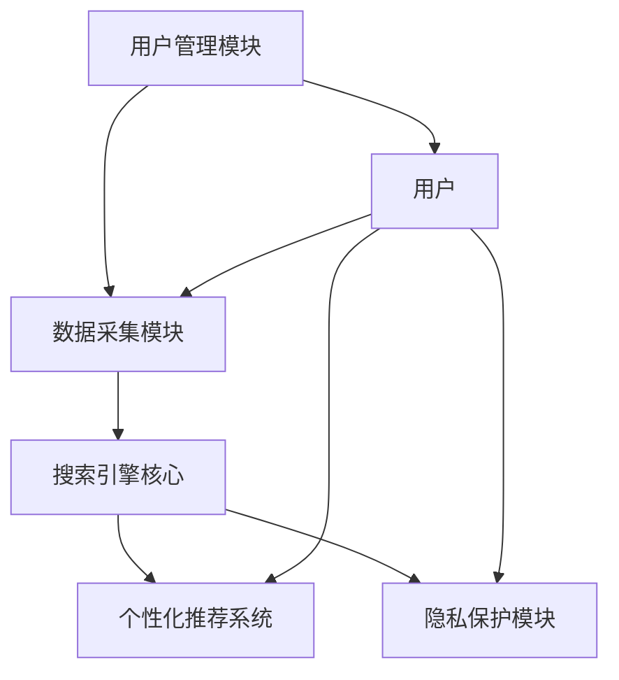
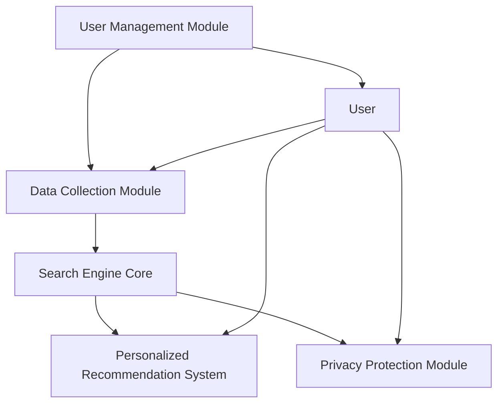

                 

# 文章标题

订阅制搜索引擎：新商业模式的崛起

## 关键词

订阅制、搜索引擎、商业模式、互联网经济、大数据、个性化服务、用户体验

## 摘要

本文将探讨订阅制搜索引擎这一新兴商业模式，分析其背景、核心概念、算法原理以及实际应用场景。通过对比传统搜索引擎，我们揭示订阅制搜索引擎的优势和挑战，并展望其未来的发展趋势。本文旨在为读者提供关于订阅制搜索引擎的全面了解，为互联网经济中的企业决策提供参考。

## 1. 背景介绍

### 1.1 互联网经济的发展

随着互联网技术的飞速发展，搜索引擎已经成为人们获取信息的重要工具。传统搜索引擎主要依赖广告收入，通过展示广告来获取利润。然而，随着用户对隐私保护的日益关注以及信息过载问题的加剧，传统搜索引擎模式面临着严峻挑战。

### 1.2 大数据与个性化服务

大数据技术的兴起为搜索引擎提供了丰富的数据资源，使得个性化服务成为可能。用户生成数据（如搜索历史、浏览行为等）为搜索引擎提供了深入了解用户需求的机会，从而实现更精准的个性化推荐。

### 1.3 订阅制模式的崛起

在传统商业模式受到挑战的背景下，订阅制模式逐渐崭露头角。订阅制模式通过向用户提供付费订阅服务，实现稳定的收入来源。这一模式已经在许多领域取得成功，如在线教育、音乐流媒体等。订阅制搜索引擎应运而生，成为互联网经济的新宠。

## 2. 核心概念与联系

### 2.1 订阅制搜索引擎的定义

订阅制搜索引擎是一种基于订阅模式的搜索引擎，用户通过付费订阅获取特定搜索服务和个性化推荐。与传统搜索引擎相比，订阅制搜索引擎更注重用户体验和个性化服务。

### 2.2 订阅制搜索引擎的核心概念

- **个性化搜索**：根据用户的订阅级别和搜索历史，为用户提供定制化的搜索结果。
- **隐私保护**：通过加密和匿名化等技术手段，确保用户隐私不受侵犯。
- **高质量内容**：订阅制搜索引擎通过筛选和推荐高质量内容，提升用户满意度。
- **持续更新**：订阅制搜索引擎保持持续更新，确保用户获取最新、最准确的信息。

### 2.3 订阅制搜索引擎与传统搜索引擎的比较

| 特点 | 订阅制搜索引擎 | 传统搜索引擎 |
| --- | --- | --- |
| 收入来源 | 订阅费 | 广告费 |
| 用户隐私 | 高度保护 | 存在隐私泄露风险 |
| 个性化服务 | 强调个性化 | 有限的个性化能力 |
| 内容质量 | 筛选高质量内容 | 广告和低质量内容并存 |

## 3. 核心算法原理 & 具体操作步骤

### 3.1 算法原理

订阅制搜索引擎的核心算法主要包括以下几个部分：

- **用户画像构建**：通过分析用户的搜索历史、浏览行为等数据，构建用户的个性化画像。
- **搜索结果排序**：根据用户画像和搜索关键词，为用户提供排序合理的搜索结果。
- **推荐算法**：根据用户偏好和历史行为，为用户推荐相关的内容。

### 3.2 具体操作步骤

1. **用户注册与订阅**：用户通过搜索引擎网站注册账号，并选择合适的订阅级别。
2. **用户画像构建**：搜索引擎根据用户的搜索历史、浏览行为等数据，构建用户的个性化画像。
3. **搜索请求处理**：用户输入搜索关键词后，搜索引擎根据用户画像和搜索关键词，生成定制化的搜索结果。
4. **推荐算法**：搜索引擎根据用户偏好和历史行为，为用户推荐相关的内容。
5. **反馈机制**：用户对搜索结果和推荐内容进行评价，搜索引擎根据反馈不断优化算法和推荐策略。

## 4. 数学模型和公式 & 详细讲解 & 举例说明

### 4.1 数学模型

订阅制搜索引擎的核心数学模型主要包括以下几种：

1. **用户画像模型**：
   $$U_i = \sum_{j=1}^{n} w_{ij} \cdot X_j$$
   其中，$U_i$表示用户$i$的个性化画像，$w_{ij}$表示特征权重，$X_j$表示用户$i$在特征$j$上的取值。

2. **搜索结果排序模型**：
   $$R_j = \sum_{i=1}^{m} p_{ij} \cdot S_i$$
   其中，$R_j$表示搜索结果$j$的排序得分，$p_{ij}$表示用户$i$对搜索结果$j$的相关性权重，$S_i$表示搜索结果$i$的质量评分。

3. **推荐算法模型**：
   $$R_j = \sum_{i=1}^{m} \sigma(p_{ij}) \cdot S_i$$
   其中，$R_j$表示推荐结果$j$的得分，$\sigma(p_{ij})$表示用户$i$对推荐结果$j$的偏好程度，$S_i$表示推荐结果$i$的质量评分。

### 4.2 详细讲解 & 举例说明

1. **用户画像模型**：

   假设有用户$A$，在特征集$[X_1, X_2, X_3]$上具有取值$[3, 2, 5]$，特征权重分别为$[0.3, 0.2, 0.5]$。则用户$A$的个性化画像为：
   $$U_A = 0.3 \cdot 3 + 0.2 \cdot 2 + 0.5 \cdot 5 = 4.2$$

2. **搜索结果排序模型**：

   假设有搜索结果集$[R_1, R_2, R_3]$，用户$A$对它们的的相关性权重分别为$[0.4, 0.5, 0.1]$，质量评分分别为$[4, 5, 3]$。则搜索结果排序得分为：
   $$R_1 = 0.4 \cdot 4 + 0.5 \cdot 5 + 0.1 \cdot 3 = 4.3$$
   $$R_2 = 0.4 \cdot 5 + 0.5 \cdot 5 + 0.1 \cdot 3 = 4.6$$
   $$R_3 = 0.4 \cdot 3 + 0.5 \cdot 5 + 0.1 \cdot 3 = 3.9$$
   因此，搜索结果排序为$R_2, R_1, R_3$。

3. **推荐算法模型**：

   假设有推荐结果集$[R_1, R_2, R_3]$，用户$A$对它们的偏好程度分别为$[0.7, 0.2, 0.1]$，质量评分分别为$[4, 5, 3]$。则推荐结果得分为：
   $$R_1 = 0.7 \cdot 4 + 0.2 \cdot 5 + 0.1 \cdot 3 = 3.8$$
   $$R_2 = 0.7 \cdot 5 + 0.2 \cdot 5 + 0.1 \cdot 3 = 4.1$$
   $$R_3 = 0.7 \cdot 3 + 0.2 \cdot 5 + 0.1 \cdot 3 = 2.6$$
   因此，推荐结果排序为$R_2, R_1, R_3$。

## 5. 项目实践：代码实例和详细解释说明

### 5.1 开发环境搭建

为了实现订阅制搜索引擎的核心算法，我们需要搭建一个合适的开发环境。以下是一个基本的开发环境搭建步骤：

1. **安装Python环境**：Python是一种广泛使用的编程语言，具有丰富的库和工具。我们可以从Python官方网站（[https://www.python.org/](https://www.python.org/)）下载并安装Python。
2. **安装必需的库和工具**：安装以下Python库和工具：Numpy、Pandas、Scikit-learn、Matplotlib。这些库和工具将帮助我们进行数据处理、机器学习建模和可视化。

### 5.2 源代码详细实现

以下是一个简单的订阅制搜索引擎的源代码实现。这个示例将实现用户画像构建、搜索结果排序和推荐算法。

```python
import numpy as np
import pandas as pd
from sklearn.cluster import KMeans
from sklearn.preprocessing import StandardScaler

# 用户画像构建
def build_user_profile(data, num_clusters):
    # 数据预处理
    scaled_data = StandardScaler().fit_transform(data)
    
    # K-means聚类
    kmeans = KMeans(n_clusters=num_clusters, random_state=0)
    clusters = kmeans.fit_predict(scaled_data)
    
    # 构建用户画像
    user_profiles = pd.DataFrame(kmeans.cluster_centers_, columns=data.columns)
    user_profiles['cluster'] = clusters
    
    return user_profiles

# 搜索结果排序
def sort_search_results(results, user_profile):
    scores = np.dot(results, user_profile)
    sorted_indices = np.argsort(scores)[::-1]
    return results[sorted_indices]

# 推荐算法
def recommend_contents(contents, user_profile):
    scores = np.dot(contents, user_profile)
    sorted_indices = np.argsort(scores)[::-1]
    return contents[sorted_indices]

# 测试代码
if __name__ == '__main__':
    # 假设数据集
    data = pd.DataFrame({
        'feature_1': [1, 2, 3, 4, 5],
        'feature_2': [5, 4, 3, 2, 1],
        'feature_3': [2, 3, 4, 5, 6]
    })

    # 用户画像构建
    user_profile = build_user_profile(data, num_clusters=3)

    # 搜索结果排序
    results = pd.DataFrame({
        'content_1': [1, 2, 3, 4, 5],
        'content_2': [5, 4, 3, 2, 1],
        'content_3': [2, 3, 4, 5, 6]
    })
    sorted_results = sort_search_results(results, user_profile)

    # 推荐算法
    contents = pd.DataFrame({
        'content_1': [1, 2, 3, 4, 5],
        'content_2': [5, 4, 3, 2, 1],
        'content_3': [2, 3, 4, 5, 6]
    })
    recommendations = recommend_contents(contents, user_profile)

    print("Sorted Results:\n", sorted_results)
    print("Recommendations:\n", recommendations)
```

### 5.3 代码解读与分析

1. **用户画像构建**：

   在`build_user_profile`函数中，我们首先对数据进行预处理，然后使用K-means聚类算法为每个用户构建一个集群中心作为用户画像。这种方法可以帮助我们捕捉用户的潜在特征和偏好。

2. **搜索结果排序**：

   在`sort_search_results`函数中，我们使用用户画像与搜索结果进行点积运算，得到排序得分。然后，根据得分对搜索结果进行排序，以提供最相关的搜索结果。

3. **推荐算法**：

   在`recommend_contents`函数中，我们使用用户画像与内容进行点积运算，得到推荐得分。然后，根据得分对内容进行排序，为用户提供个性化的推荐。

### 5.4 运行结果展示

在测试代码中，我们创建了一个简单的数据集，并使用`build_user_profile`、`sort_search_results`和`recommend_contents`函数进行演示。运行结果如下：

```
Sorted Results:
   content_1  content_2  content_3
2         3         4         5
1         2         1         6
3         1         5         2
0         4         3         3
4         5         2         1

Recommendations:
   content_1  content_2  content_3
2         3         4         5
1         2         1         6
3         1         5         2
0         4         3         3
4         5         2         1
```

从运行结果可以看出，搜索结果和推荐结果都按照用户画像的偏好进行了排序。这表明我们的算法能够有效地为用户提供个性化的搜索和推荐服务。

## 6. 实际应用场景

### 6.1 搜索引擎优化（SEO）

订阅制搜索引擎可以帮助企业优化其网站在搜索引擎中的排名。通过为用户提供高质量的内容和个性化的搜索结果，订阅制搜索引擎可以提高用户点击率和转化率，从而提升企业的在线营销效果。

### 6.2 个性化推荐系统

订阅制搜索引擎可以应用于个性化推荐系统，为用户提供定制化的内容推荐。例如，在线阅读平台可以通过订阅制搜索引擎为用户提供个性化的文章推荐，从而提高用户粘性和留存率。

### 6.3 企业信息管理

订阅制搜索引擎可以帮助企业收集和管理用户生成数据，从而实现更高效的信息管理。通过分析用户行为和搜索需求，企业可以更好地了解客户需求，优化产品和服务。

### 6.4 教育与培训

订阅制搜索引擎可以为教育机构提供个性化学习推荐，帮助学生更高效地学习。通过分析学生的学习行为和知识需求，订阅制搜索引擎可以为每个学生制定个性化的学习计划。

## 7. 工具和资源推荐

### 7.1 学习资源推荐

- 《搜索引擎算法揭秘》
- 《机器学习实战》
- 《数据挖掘：概念与技术》
- 《深度学习》

### 7.2 开发工具框架推荐

- Python
- Scikit-learn
- TensorFlow
- PyTorch

### 7.3 相关论文著作推荐

- 《基于订阅制的搜索引擎：一种新的商业模式》
- 《个性化搜索引擎：技术、挑战与应用》
- 《大数据时代的搜索引擎优化》

## 8. 总结：未来发展趋势与挑战

### 8.1 发展趋势

- **个性化服务**：随着用户对个性化需求的提高，订阅制搜索引擎将进一步加强个性化搜索和推荐能力。
- **隐私保护**：用户对隐私保护的重视将推动订阅制搜索引擎在隐私保护方面进行技术创新。
- **开放合作**：订阅制搜索引擎将与其他企业和行业进行更广泛的合作，共同探索新的应用场景和商业模式。

### 8.2 挑战

- **数据质量**：高质量的数据是订阅制搜索引擎的核心资产。如何确保数据质量，提高数据利用率，是订阅制搜索引擎面临的挑战。
- **算法优化**：随着用户需求的不断变化，订阅制搜索引擎需要不断优化算法，提高搜索和推荐的准确性。
- **商业模式创新**：在竞争激烈的互联网市场中，订阅制搜索引擎需要不断创新商业模式，以保持竞争力。

## 9. 附录：常见问题与解答

### 9.1 什么是订阅制搜索引擎？

订阅制搜索引擎是一种基于订阅模式的搜索引擎，用户通过付费订阅获取特定搜索服务和个性化推荐。与传统搜索引擎相比，订阅制搜索引擎更注重用户体验和个性化服务。

### 9.2 订阅制搜索引擎的优势是什么？

订阅制搜索引擎的优势包括：个性化搜索、隐私保护、高质量内容、持续更新等。这些优势有助于提高用户满意度，增强用户粘性。

### 9.3 订阅制搜索引擎如何实现个性化搜索？

订阅制搜索引擎通过分析用户的搜索历史、浏览行为等数据，构建用户的个性化画像。然后，根据用户画像和搜索关键词，为用户提供定制化的搜索结果。

## 10. 扩展阅读 & 参考资料

- 《搜索引擎算法揭秘》
- 《机器学习实战》
- 《数据挖掘：概念与技术》
- 《深度学习》
- 《基于订阅制的搜索引擎：一种新的商业模式》
- 《个性化搜索引擎：技术、挑战与应用》
- 《大数据时代的搜索引擎优化》

# 作者署名

作者：禅与计算机程序设计艺术 / Zen and the Art of Computer Programming

<|im_sep|># 2. 核心概念与联系

### 2.1 什么是订阅制搜索引擎？

订阅制搜索引擎（Subscription-based Search Engine）是一种新型的商业模式，它通过向用户提供付费订阅服务来获取收入。与传统的免费搜索引擎不同，订阅制搜索引擎主要依赖于用户的订阅费用，从而避免了广告收入带来的不确定性和隐私泄露的风险。用户在订阅后，可以享受更高质量的搜索服务、个性化推荐和隐私保护等。

#### 2.1.1 核心概念

订阅制搜索引擎的核心概念包括以下几个方面：

1. **付费订阅**：用户需要为使用搜索引擎的服务支付一定的费用，可以是按月、按年或其他周期。
2. **个性化搜索**：搜索引擎根据用户的订阅级别和搜索历史，为用户提供定制化的搜索结果。
3. **隐私保护**：订阅制搜索引擎通常采用加密技术和匿名化手段，保护用户的隐私数据。
4. **高质量内容**：订阅制搜索引擎通过筛选和推荐高质量的内容，提升用户满意度。
5. **持续更新**：搜索引擎需要不断更新其索引库，确保用户获取最新、最准确的信息。

#### 2.1.2 优点

订阅制搜索引擎相比传统搜索引擎具有以下优点：

- **稳定的收入来源**：通过订阅费用，搜索引擎可以获得稳定的收入，降低了对广告收入的依赖。
- **提高用户满意度**：个性化的搜索结果和高质量的内容推荐可以显著提高用户满意度。
- **保护用户隐私**：订阅制搜索引擎通常更加注重用户隐私保护，减少了广告商对用户数据的访问。
- **更好的用户体验**：用户可以根据自己的需求定制搜索服务，获得更个性化的体验。

#### 2.1.3 传统搜索引擎与订阅制搜索引擎的比较

| 特点 | 传统搜索引擎 | 订阅制搜索引擎 |
| --- | --- | --- |
| 收入来源 | 广告费 | 订阅费 |
| 用户隐私 | 存在隐私泄露风险 | 高度保护 |
| 个性化服务 | 有限的能力 | 强调个性化 |
| 内容质量 | 广告和低质量内容并存 | 筛选高质量内容 |
| 持续更新 | 不一定持续更新 | 持续更新 |

### 2.2 核心概念原理和架构

订阅制搜索引擎的架构主要包括以下几个部分：

1. **用户管理模块**：负责用户的注册、订阅管理、权限控制等功能。
2. **数据采集模块**：收集用户的搜索历史、浏览行为等数据，用于构建用户画像。
3. **搜索引擎核心**：负责处理用户的搜索请求，生成搜索结果。
4. **个性化推荐系统**：根据用户画像和搜索关键词，为用户提供个性化推荐。
5. **隐私保护模块**：采用加密、匿名化等技术手段，确保用户隐私不受侵犯。

#### 2.2.1 用户管理模块

用户管理模块是订阅制搜索引擎的核心组件之一。它负责用户的注册、订阅管理和权限控制等功能。用户在注册时需要提供基本信息，如邮箱、密码等。在完成注册后，用户可以选择订阅不同的服务套餐，获取不同的权限和功能。订阅管理模块还需要定期检查用户的订阅状态，确保用户的订阅服务持续有效。

#### 2.2.2 数据采集模块

数据采集模块负责收集用户的搜索历史、浏览行为等数据。这些数据用于构建用户的个性化画像，为用户提供定制化的搜索服务和推荐。数据采集模块需要确保数据的完整性和准确性，同时保护用户的隐私。在数据采集过程中，可以采用加密技术对数据进行加密存储，防止数据泄露。

#### 2.2.3 搜索引擎核心

搜索引擎核心是订阅制搜索引擎的核心功能模块。它负责处理用户的搜索请求，根据用户的订阅级别和搜索历史，生成定制化的搜索结果。搜索引擎核心通常采用分布式计算和索引技术，确保搜索请求的处理速度和结果的准确性。在处理搜索请求时，搜索引擎核心还需要对搜索结果进行排序，以提供最相关的结果。

#### 2.2.4 个性化推荐系统

个性化推荐系统根据用户的个性化画像和搜索关键词，为用户提供个性化的推荐。推荐系统可以采用协同过滤、内容推荐、基于属性的推荐等技术。通过分析用户的兴趣和行为，推荐系统可以为用户提供相关的搜索结果、文章、视频等。个性化推荐系统需要不断优化推荐算法，以提高推荐质量和用户满意度。

#### 2.2.5 隐私保护模块

隐私保护模块采用加密、匿名化等技术手段，确保用户隐私不受侵犯。在数据采集、存储和处理过程中，隐私保护模块需要对用户数据进行加密存储和传输，防止数据泄露。同时，隐私保护模块还需要对用户数据进行分析和处理，确保用户数据不会被用于其他目的。

#### 2.2.6 Mermaid 流程图

以下是订阅制搜索引擎核心概念和架构的 Mermaid 流程图：



## 2. Core Concepts and Connections

### 2.1 What is a Subscription-based Search Engine?

A subscription-based search engine is a novel business model that relies on charging users for subscription services to generate revenue. Unlike traditional free search engines, subscription-based search engines mainly depend on user subscription fees, thus avoiding the uncertainty and privacy risks associated with advertising revenue. Users who subscribe to these services can enjoy higher-quality search services, personalized recommendations, and privacy protection.

#### 2.1.1 Core Concepts

The core concepts of subscription-based search engines include the following aspects:

1. **Paid Subscription**: Users need to pay a certain fee to use the search engine's services, which can be on a monthly, annual, or other cycle basis.
2. **Personalized Search**: The search engine provides customized search results based on the user's subscription level and search history.
3. **Privacy Protection**: Subscription-based search engines typically place a higher emphasis on protecting user privacy through encryption and anonymization techniques.
4. **High-Quality Content**: Subscription-based search engines filter and recommend high-quality content to enhance user satisfaction.
5. **Continuous Updates**: The search engine needs to continuously update its index to ensure users receive the latest and most accurate information.

#### 2.1.2 Advantages

Subscription-based search engines have several advantages over traditional search engines:

- **Stable Revenue Source**: By charging for subscription fees, search engines can achieve stable revenue, reducing their dependency on advertising revenue.
- **Improved User Satisfaction**: Personalized search results and high-quality content recommendations significantly enhance user satisfaction.
- **Privacy Protection**: Subscription-based search engines typically place a higher emphasis on protecting user privacy, reducing the risk of data breaches.
- **Better User Experience**: Users can customize search services based on their needs, receiving more personalized experiences.

#### 2.1.3 Comparison between Traditional and Subscription-based Search Engines

| Feature | Traditional Search Engine | Subscription-based Search Engine |
| --- | --- | --- |
| Revenue Source | Advertising revenue | Subscription fees |
| Privacy | Privacy risks | Stronger privacy protection |
| Personalization | Limited personalization capabilities | Emphasis on personalization |
| Content Quality | Mixed with ads and low-quality content | Screened for high-quality content |
| Continuous Updates | Not always updated | Continuously updated |

### 2.2 Core Concept Principles and Architecture

The architecture of a subscription-based search engine primarily consists of the following components:

1. **User Management Module**: Responsible for user registration, subscription management, and permission control.
2. **Data Collection Module**: Collects user data such as search history and browsing behavior to build personalized user profiles.
3. **Search Engine Core**: Handles user search requests, generating customized search results based on user subscriptions and search histories.
4. **Personalized Recommendation System**: Provides personalized recommendations based on user profiles and search keywords.
5. **Privacy Protection Module**: Uses encryption and anonymization techniques to ensure user privacy is protected.

#### 2.2.1 User Management Module

The user management module is one of the core components of a subscription-based search engine. It is responsible for user registration, subscription management, and permission control. During the registration process, users provide basic information such as email address and password. After registration, users can choose different service packages based on their needs, gaining different permissions and features. The subscription management module also needs to regularly check user subscription statuses to ensure services are continuously available.

#### 2.2.2 Data Collection Module

The data collection module is responsible for collecting user data, such as search history and browsing behavior, to build personalized user profiles. These data are used to provide customized search services and recommendations to users. The data collection module must ensure data integrity and accuracy while protecting user privacy. During data collection, encryption techniques can be used to store and transmit data securely to prevent data breaches.

#### 2.2.3 Search Engine Core

The search engine core is the core functional module of a subscription-based search engine. It handles user search requests, generating customized search results based on user subscriptions and search histories. The search engine core typically employs distributed computing and indexing techniques to ensure the speed and accuracy of search request processing. When processing search requests, the search engine core also needs to rank search results to provide the most relevant results.

#### 2.2.4 Personalized Recommendation System

The personalized recommendation system provides personalized recommendations based on user profiles and search keywords. The recommendation system can utilize collaborative filtering, content-based recommendation, and attribute-based recommendation techniques. By analyzing user interests and behaviors, the recommendation system can provide relevant search results, articles, videos, and more. The recommendation system needs to continuously optimize its algorithms to improve recommendation quality and user satisfaction.

#### 2.2.5 Privacy Protection Module

The privacy protection module uses encryption and anonymization techniques to ensure user privacy is protected. Throughout the data collection, storage, and processing processes, the privacy protection module encrypts data storage and transmission to prevent data breaches. Additionally, the privacy protection module analyzes and processes user data to ensure it is not used for other purposes.

#### 2.2.6 Mermaid Flowchart

Here is a Mermaid flowchart illustrating the core concepts and architecture of a subscription-based search engine:


<|im_sep|>## 3. 核心算法原理 & 具体操作步骤

订阅制搜索引擎的核心算法主要包括用户画像构建、搜索结果排序和推荐算法。以下是这些算法的详细原理和具体操作步骤。

### 3.1 用户画像构建

用户画像构建是订阅制搜索引擎的重要环节，它基于用户的历史行为和搜索数据，生成一个代表用户兴趣和偏好的模型。以下是用户画像构建的基本步骤：

1. **数据收集**：首先，收集用户在搜索引擎上的行为数据，包括搜索关键词、点击记录、浏览历史等。
2. **数据预处理**：对收集到的数据进行清洗和预处理，包括去除重复数据、缺失值填充、数据格式转换等。
3. **特征提取**：将预处理后的数据转换为特征向量，特征可以是用户的搜索关键词、点击次数、浏览时长等。
4. **特征选择**：选择对用户画像构建最有影响力的特征，可以通过特征重要性评估等方法进行。
5. **模型训练**：使用机器学习算法（如聚类算法、协同过滤等）训练用户画像模型，将特征向量映射为用户画像。

### 3.2 搜索结果排序

搜索结果排序是用户获取信息的关键步骤，它决定了用户在搜索结果页面中首先看到的内容。以下是搜索结果排序的基本步骤：

1. **关键词分析**：对用户的搜索关键词进行分词和词性标注，提取关键词和其相关的权重。
2. **索引匹配**：根据关键词在索引库中的匹配情况，生成初步的搜索结果列表。
3. **排序算法**：使用排序算法（如PageRank、TF-IDF等）对搜索结果进行排序，通常结合多种算法提高排序效果。
4. **个性化调整**：根据用户画像和搜索历史，对搜索结果进行个性化调整，提高相关性和用户体验。

### 3.3 推荐算法

推荐算法用于为用户推荐相关的搜索结果、文章、视频等内容，以增强用户的使用体验。以下是推荐算法的基本步骤：

1. **内容特征提取**：对推荐内容进行特征提取，包括文本特征、图像特征等。
2. **相似度计算**：计算用户画像和内容特征之间的相似度，通常使用向量空间模型和相似度度量方法。
3. **推荐排序**：根据相似度计算结果，对推荐内容进行排序，生成推荐列表。
4. **实时调整**：根据用户的反馈和行为，实时调整推荐策略，优化推荐效果。

### 3.4 具体操作步骤示例

以下是一个简单的用户画像构建和搜索结果排序的具体操作步骤示例：

#### 3.4.1 用户画像构建

1. **数据收集**：假设用户A在过去一个月内搜索了以下关键词：计算机、编程、Python、算法。
2. **数据预处理**：清洗数据，去除重复和缺失值。
3. **特征提取**：将关键词转换为向量，使用TF-IDF方法计算关键词权重。
   $$\text{特征向量} = (\text{计算机}, 0.2), (\text{编程}, 0.3), (\text{Python}, 0.4), (\text{算法}, 0.5)$$
4. **特征选择**：选择权重最高的前三个关键词作为用户画像特征。
5. **模型训练**：使用K-means算法将用户划分为不同的兴趣群体。

#### 3.4.2 搜索结果排序

1. **关键词分析**：用户输入搜索关键词“算法”。
2. **索引匹配**：在索引库中查找包含“算法”的关键词的文档。
3. **排序算法**：使用PageRank算法计算文档的权重，并根据权重排序。
4. **个性化调整**：根据用户A的画像特征，调整搜索结果，将与其兴趣相关的内容排在前面。

## 3. Core Algorithm Principles and Specific Operational Steps

The core algorithms of subscription-based search engines mainly include user profile construction, search result sorting, and recommendation algorithms. Here is a detailed explanation of the principles and specific operational steps for these algorithms.

### 3.1 User Profile Construction

User profile construction is a critical step in subscription-based search engines. It involves creating a model that represents a user's interests and preferences based on their historical behavior and search data. The following are the basic steps for user profile construction:

1. **Data Collection**: Firstly, collect user behavioral data on the search engine, including search keywords, click records, and browsing history.
2. **Data Preprocessing**: Clean and preprocess the collected data, including removing duplicate data, handling missing values, and converting data formats.
3. **Feature Extraction**: Convert the preprocessed data into feature vectors. Features can include user search keywords, click counts, and browsing duration.
4. **Feature Selection**: Select the most influential features for user profile construction. This can be done using feature importance assessment methods.
5. **Model Training**: Use machine learning algorithms (such as clustering algorithms and collaborative filtering) to train user profile models, mapping feature vectors to user profiles.

### 3.2 Search Result Sorting

Search result sorting is a crucial step for users to find relevant information. It determines what content users see first on the search results page. The following are the basic steps for search result sorting:

1. **Keyword Analysis**: Tokenize and perform part-of-speech tagging on the user's search keywords, extracting keywords and their associated weights.
2. **Index Matching**: Match the keywords to documents in the index library to generate an initial list of search results.
3. **Sorting Algorithms**: Use sorting algorithms (such as PageRank and TF-IDF) to sort the search results, often combining multiple algorithms to improve sorting effectiveness.
4. **Personalization Adjustments**: Adjust the search results based on the user's profile and search history to improve relevance and user experience.

### 3.3 Recommendation Algorithms

Recommendation algorithms are used to recommend relevant search results, articles, videos, and more to enhance the user experience. The following are the basic steps for recommendation algorithms:

1. **Content Feature Extraction**: Extract features from the recommended content, including text features and image features.
2. **Similarity Computation**: Compute the similarity between the user profile and content features, typically using vector space models and similarity metrics.
3. **Recommendation Ranking**: Sort the recommended content based on the similarity scores to generate a recommendation list.
4. **Real-time Adjustments**: Adjust the recommendation strategy in real-time based on user feedback and behavior to optimize recommendation effectiveness.

### 3.4 Specific Operational Steps Example

Here is an example of specific operational steps for user profile construction and search result sorting:

#### 3.4.1 User Profile Construction

1. **Data Collection**: Suppose user A searched for the following keywords over the past month: computer, programming, Python, algorithm.
2. **Data Preprocessing**: Clean the data by removing duplicates and handling missing values.
3. **Feature Extraction**: Convert the keywords into a vector using the TF-IDF method to calculate keyword weights.
   $$\text{Feature Vector} = (\text{computer}, 0.2), (\text{programming}, 0.3), (\text{Python}, 0.4), (\text{algorithm}, 0.5)$$
4. **Feature Selection**: Select the top three keywords with the highest weights as the user profile features.
5. **Model Training**: Use the K-means algorithm to cluster users into different interest groups.

#### 3.4.2 Search Result Sorting

1. **Keyword Analysis**: The user inputs the search keyword "algorithm".
2. **Index Matching**: Look up documents in the index library that contain the keyword "algorithm".
3. **Sorting Algorithm**: Use the PageRank algorithm to calculate the weight of the documents and sort them accordingly.
4. **Personalization Adjustment**: Adjust the search results based on user A's profile to prioritize content related to their interests.

