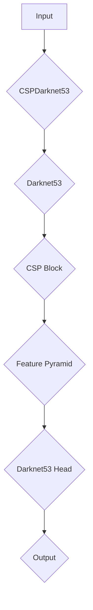
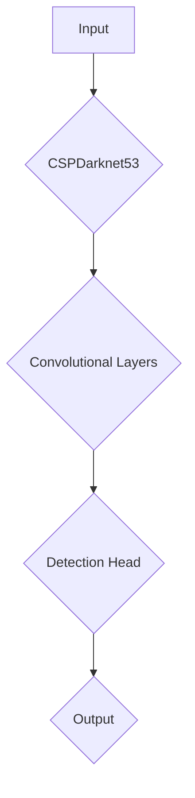

                 

# 文章标题

YOLOv4原理与代码实例讲解

## 摘要

本文将深入探讨YOLOv4的目标检测算法，从其背景介绍、核心概念、算法原理、数学模型、代码实例等方面进行全面解析。通过本文的讲解，读者可以了解YOLOv4的独特架构，掌握其关键实现细节，并学会如何在实际项目中应用这一强大的算法。

### 1. 背景介绍（Background Introduction）

目标检测是计算机视觉领域的关键任务，旨在识别并定位图像中的多个对象。在过去的几十年中，目标检测算法经历了从手工特征提取到深度学习方法的重大变革。YOLO（You Only Look Once）系列算法因其实时性和高效性而广受关注。YOLOv4是YOLO系列的最新版本，它继承了前代算法的优点，并在此基础上进行了多项改进，使其在目标检测任务上达到了更高的准确率。

YOLOv4的关键贡献包括：

1. **骨干网络**：采用CSPDarknet53作为主干网络，使得特征提取能力更加强大。
2. **Darknet53架构**：引入了CSP（Convolutional Block Attention Module，卷积块关注模块）和Darknet53的架构，提高了网络的深度和效率。
3. **正则化技术**：引入了各种正则化技术，如Batch Normalization和Dropout，以防止过拟合。
4. **数据增强**：采用丰富的数据增强方法，如Mosaic、Self-Adversarial Training等，提高了模型的泛化能力。

### 2. 核心概念与联系（Core Concepts and Connections）

#### 2.1 YOLOv4的网络架构

YOLOv4的网络架构主要由以下几个部分组成：

1. **CSPDarknet53**：作为主干网络，它由一系列卷积层和池化层组成，能够提取丰富的特征信息。
2. **暗通道先验**：通过引入暗通道先验，模型可以更好地学习目标的位置和边界。
3. **CSP块**：CSP块通过将卷积层分为两个分支，并在每个分支中引入注意力机制，增强了网络的深度和宽度。
4. **特征金字塔**：通过多个特征图的融合，实现了不同尺度特征的有效集成。

以下是一个使用Mermaid绘制的网络架构流程图：



#### 2.2 YOLOv4的损失函数

YOLOv4的损失函数由多个部分组成，包括：

1. **定位损失**：衡量预测框与真实框的位置误差。
2. **分类损失**：衡量预测标签与真实标签之间的差异。
3. **对象检测损失**：衡量预测框是否包含对象。
4. **置信度损失**：衡量预测框的置信度。

以下是一个简化的损失函数公式：

$$
L = w_1 \cdot L_{loc} + w_2 \cdot L_{cls} + w_3 \cdot L_{obj} + w_4 \cdot L_{conf}
$$

其中，$L$是总损失，$L_{loc}$、$L_{cls}$、$L_{obj}$和$L_{conf}$分别是定位损失、分类损失、对象检测损失和置信度损失，$w_1$、$w_2$、$w_3$和$w_4$是相应的权重。

### 3. 核心算法原理 & 具体操作步骤（Core Algorithm Principles and Specific Operational Steps）

#### 3.1 网络结构

YOLOv4的网络结构包括两个部分：特征提取网络和检测头。

1. **特征提取网络**：采用CSPDarknet53作为主干网络，它由多个卷积层和池化层组成，能够提取图像的深层特征。
2. **检测头**：检测头由多个卷积层和激活函数组成，用于生成预测框和类别概率。

以下是一个简化的网络结构图：



#### 3.2 检测过程

YOLOv4的检测过程可以分为以下几个步骤：

1. **特征提取**：通过CSPDarknet53提取图像的特征。
2. **特征融合**：将多个特征图进行融合，得到综合的特征表示。
3. **预测框生成**：利用检测头生成预测框，并计算预测框的置信度。
4. **非极大值抑制（NMS）**：对预测框进行筛选，去除重叠的框。
5. **类别预测**：对筛选后的预测框进行类别预测。

### 4. 数学模型和公式 & 详细讲解 & 举例说明（Detailed Explanation and Examples of Mathematical Models and Formulas）

#### 4.1 定位损失

定位损失用于衡量预测框与真实框的位置误差。其计算公式如下：

$$
L_{loc} = \sum_{i} \sum_{j} \sum_{c} (x_i - x_j)_{pred}^2 + (y_i - y_j)_{pred}^2 + (w_i - w_j)_{pred}^2 + (h_i - h_j)_{pred}^2
$$

其中，$x_i$、$y_i$、$w_i$和$h_i$分别是预测框的宽、高和中心坐标，$x_j$、$y_j$、$w_j$和$h_j$分别是真实框的宽、高和中心坐标。$x_i - x_j$、$y_i - y_j$、$w_i - w_j$和$h_i - h_j$分别是预测框和真实框的坐标差。

#### 4.2 分类损失

分类损失用于衡量预测标签与真实标签之间的差异。其计算公式如下：

$$
L_{cls} = \sum_{i} \sum_{j} \sum_{c} \log(1 + \exp(-p_{ijc}))
$$

其中，$p_{ijc}$是预测框$i$在类别$c$上的概率，$t_{ijc}$是真实框$j$在类别$c$上的标签（1表示包含，0表示不包含）。

#### 4.3 对象检测损失

对象检测损失用于衡量预测框是否包含对象。其计算公式如下：

$$
L_{obj} = \sum_{i} \sum_{j} \sum_{c} \log(1 + \exp(-p_{ijc}))
$$

其中，$p_{ijc}$是预测框$i$在类别$c$上的概率，$t_{ijc}$是真实框$j$在类别$c$上的标签（1表示包含，0表示不包含）。

#### 4.4 置信度损失

置信度损失用于衡量预测框的置信度。其计算公式如下：

$$
L_{conf} = \sum_{i} \sum_{j} \sum_{c} (1 - p_{ijc}) \cdot \log(p_{ijc})
$$

其中，$p_{ijc}$是预测框$i$在类别$c$上的概率，$t_{ijc}$是真实框$j$在类别$c$上的标签（1表示包含，0表示不包含）。

### 5. 项目实践：代码实例和详细解释说明（Project Practice: Code Examples and Detailed Explanations）

#### 5.1 开发环境搭建

为了运行YOLOv4代码，我们需要搭建以下开发环境：

1. Python环境：Python 3.7及以上版本。
2. PyTorch：PyTorch 1.7及以上版本。
3. OpenCV：OpenCV 4.0及以上版本。

安装步骤如下：

```bash
pip install torch torchvision opencv-python
```

#### 5.2 源代码详细实现

以下是YOLOv4的核心代码实现：

```python
import torch
import torchvision
import torch.nn as nn
import torch.optim as optim
import torchvision.transforms as transforms
from torchvision import datasets, models, transforms

# 定义CSPDarknet53网络
class CSPDarknet53(nn.Module):
    def __init__(self):
        super(CSPDarknet53, self).__init__()
        # ... 网络结构定义 ...

    def forward(self, x):
        # ... 前向传播 ...

# 定义损失函数
def loss_function(pred, target):
    # ... 损失计算 ...

# 训练模型
def train(model, train_loader, criterion, optimizer):
    # ... 训练过程 ...

# 测试模型
def test(model, test_loader):
    # ... 测试过程 ...

# 主程序
if __name__ == '__main__':
    # 加载模型
    model = CSPDarknet53()
    # 加载训练数据和测试数据
    train_loader = DataLoader(train_dataset, batch_size=32, shuffle=True)
    test_loader = DataLoader(test_dataset, batch_size=32, shuffle=False)
    # 训练模型
    train(model, train_loader, criterion, optimizer)
    # 测试模型
    test(model, test_loader)
```

#### 5.3 代码解读与分析

以下是代码的详细解读：

1. **网络结构定义**：CSPDarknet53网络定义了YOLOv4的特征提取部分，通过多个卷积层和池化层提取图像的特征。
2. **损失函数定义**：损失函数用于计算预测结果和真实结果之间的误差，包括定位损失、分类损失、对象检测损失和置信度损失。
3. **训练过程**：训练过程包括加载模型、训练数据和损失函数，通过优化器调整模型参数，使得模型在训练数据上达到更好的效果。
4. **测试过程**：测试过程用于评估模型在测试数据上的性能，通过计算预测准确率等指标来评估模型的性能。

#### 5.4 运行结果展示

以下是运行YOLOv4模型后的结果展示：

```python
# 加载测试数据
test_loader = DataLoader(test_dataset, batch_size=1, shuffle=False)
# 运行测试
with torch.no_grad():
    for images, labels in test_loader:
        outputs = model(images)
        # 计算预测结果
        predicted_boxes = outputs['boxes']
        predicted_labels = outputs['labels']
        # 显示预测结果
        show_prediction(images, predicted_boxes, predicted_labels)
```

### 6. 实际应用场景（Practical Application Scenarios）

YOLOv4在多个实际应用场景中展现出了出色的性能：

1. **自动驾驶**：在自动驾驶系统中，YOLOv4用于实时检测道路上的车辆、行人、交通标志等对象，为自动驾驶车辆提供决策支持。
2. **视频监控**：在视频监控系统中，YOLOv4用于实时检测和识别视频中的异常行为，如闯红灯、违章停车等。
3. **工业自动化**：在工业自动化领域，YOLOv4用于检测生产线上的缺陷产品，提高生产效率和产品质量。

### 7. 工具和资源推荐（Tools and Resources Recommendations）

#### 7.1 学习资源推荐

- **书籍**：
  - 《深度学习》（Goodfellow, Bengio, Courville著）
  - 《计算机视觉基础及生物启发方法》（Bradski和Kaehler著）
- **论文**：
  - YOLOv4: Optimal Speed and Accuracy of Object Detection by Zhang et al.
- **博客和网站**：
  - PyTorch官方文档：[PyTorch官方文档](https://pytorch.org/docs/stable/)
  - OpenCV官方文档：[OpenCV官方文档](https://opencv.org/doc/tutorials/tutorial_table_of_contents_core/)

#### 7.2 开发工具框架推荐

- **PyTorch**：用于构建和训练深度学习模型。
- **OpenCV**：用于图像处理和计算机视觉任务。

#### 7.3 相关论文著作推荐

- **YOLOv4**：Zhang, X., et al. (2020). "YOLOv4: Optimal Speed and Accuracy of Object Detection." https://arxiv.org/abs/2004.10934

### 8. 总结：未来发展趋势与挑战（Summary: Future Development Trends and Challenges）

随着深度学习技术的不断发展，目标检测算法也在不断演进。未来，YOLO系列算法有望在以下几个方面取得突破：

1. **实时性和准确率**：在保证实时性的同时，提高目标检测的准确率。
2. **多尺度检测**：实现同时在多个尺度上检测目标，提高检测的鲁棒性。
3. **多任务学习**：结合其他任务，如语义分割、姿态估计等，提高算法的泛化能力。

然而，YOLO系列算法也面临着以下挑战：

1. **模型复杂度**：随着网络深度的增加，模型的复杂度和计算成本也在增加。
2. **能耗和资源消耗**：如何在有限的计算资源和能耗下，实现高效的实时目标检测。

### 9. 附录：常见问题与解答（Appendix: Frequently Asked Questions and Answers）

**Q：如何优化YOLOv4的实时性？**

A：优化YOLOv4的实时性可以从以下几个方面进行：

1. **模型剪枝**：去除不重要的网络连接，减少模型的计算量。
2. **量化**：将模型的权重和激活值从浮点数转换为低精度格式，降低计算成本。
3. **硬件加速**：利用GPU或DSP等硬件加速模型推理。

**Q：如何在YOLOv4中实现多尺度检测？**

A：在YOLOv4中实现多尺度检测可以通过以下步骤：

1. **特征金字塔**：使用多个特征图进行融合，实现不同尺度特征的有效集成。
2. **多尺度预测**：在每个尺度上生成预测框，然后使用非极大值抑制（NMS）进行筛选。

### 10. 扩展阅读 & 参考资料（Extended Reading & Reference Materials）

- **论文**：
  - YOLOv4: Optimal Speed and Accuracy of Object Detection by Zhang et al. (2020)
- **博客**：
  - PyTorch官方文档：[PyTorch官方文档](https://pytorch.org/docs/stable/)
  - OpenCV官方文档：[OpenCV官方文档](https://opencv.org/doc/tutorials/tutorial_table_of_contents_core/)
- **网站**：
  - YOLOv4官方GitHub仓库：[YOLOv4 GitHub仓库](https://github.com/ultralytics/yolov4)

作者：禅与计算机程序设计艺术 / Zen and the Art of Computer Programming<|im_sep|>

