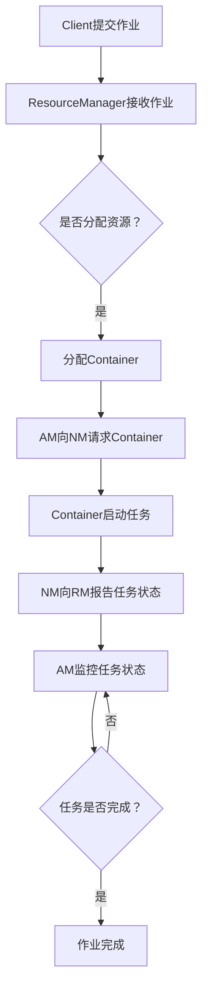

                 

# 文章标题

《Yarn原理与代码实例讲解》

## 关键词
* Yarn
* 分布式计算
* 任务调度
* 架构设计
* 代码实例

> 在现代分布式系统中，Yarn作为一种高效的任务调度框架，被广泛应用于大数据处理和云计算领域。本文将深入探讨Yarn的工作原理、核心概念及其在实际项目中的应用，并通过代码实例进行详细讲解。

## 摘要

本文旨在介绍Yarn（Yet Another Resource Negotiator）的原理与架构设计，解释其在分布式计算环境中的任务调度机制。通过逐步分析Yarn的核心组件和算法，本文将揭示其如何实现高效资源管理。此外，本文还将通过一个具体的项目实例，展示如何使用Yarn进行分布式任务的部署与调度，并提供详细的代码解析。

## 1. 背景介绍（Background Introduction）

### Yarn的起源

Yarn起源于Hadoop生态系统，是Hadoop YARN（Yet Another Resource Negotiator）的简称。它是Hadoop 2.0及以上版本的核心组成部分，旨在替代传统的MapReduce资源管理框架。Yarn的设计初衷是为了解决传统MapReduce系统在资源管理和任务调度方面存在的局限性，从而提供更加灵活、可扩展的分布式计算能力。

### Yarn的优势

与MapReduce相比，Yarn具有以下几个显著优势：

1. **资源隔离与共享**：Yarn通过将计算资源管理与任务调度分离，实现了更好的资源隔离与共享。这使得同一台机器上的多个应用可以共享资源，提高了资源利用率。
2. **动态资源分配**：Yarn可以根据任务的实时需求动态调整资源分配，避免了MapReduce中资源预分配导致的资源浪费。
3. **支持多种计算框架**：Yarn不仅支持传统的MapReduce任务，还支持其他分布式计算框架，如Spark、Tez、Flink等，大大扩展了其应用范围。
4. **高可用性**：Yarn通过冗余设计实现了高可用性，确保在部分节点故障时系统仍能正常运行。

### Yarn的应用场景

Yarn在以下几个方面有着广泛的应用：

1. **大数据处理**：Yarn是Hadoop生态系统中的核心组件，广泛用于大规模数据集的分布式处理。
2. **云计算**：Yarn作为云计算平台的重要组成部分，提供了高效的任务调度与资源管理能力。
3. **企业应用**：许多企业将Yarn应用于企业级大数据分析和实时数据处理，提高了数据处理效率和业务响应速度。

## 2. 核心概念与联系（Core Concepts and Connections）

### Yarn架构

Yarn的核心架构包括以下几个主要组件：

1. ** ResourceManager（RM）**：ResourceManager是Yarn系统的核心控制器，负责全局资源的分配与管理。它接收来自ApplicationMaster的请求，根据资源需求进行资源分配。
2. **NodeManager（NM）**：NodeManager是运行在各个计算节点上的守护进程，负责管理本地资源、监控容器运行状态以及与ResourceManager通信。
3. **ApplicationMaster（AM）**：ApplicationMaster是每个应用程序的协调者，负责向ResourceManager请求资源、管理容器的生命周期以及协调任务间的依赖关系。
4. **Container**：Container是Yarn中最小的资源抽象单位，表示一个具有特定资源（如CPU、内存等）的执行环境。ApplicationMaster会向ResourceManager请求Container，并在NodeManager上启动相应的任务。

### Mermaid流程图

以下是一个简化的Yarn工作流程Mermaid流程图：



### Yarn核心概念

1. **资源调度**：Yarn的资源调度机制采用一种层次化的架构，由ResourceManager负责全局资源调度，而NodeManager负责本地资源管理。
2. **应用程序管理**：每个应用程序由一个ApplicationMaster进行管理，ApplicationMaster负责协调任务间的依赖关系、资源请求和任务监控。
3. **容器生命周期**：Container是Yarn的资源抽象单位，其生命周期包括创建、运行、监控和销毁等阶段。ApplicationMaster会向ResourceManager请求Container，NodeManager负责实际启动和监控Container。

## 3. 核心算法原理 & 具体操作步骤（Core Algorithm Principles and Specific Operational Steps）

### Yarn资源调度算法

Yarn的资源调度算法主要包括以下几个步骤：

1. **资源分配**：ResourceManager根据全局资源状况和ApplicationMaster的请求，将可用资源分配给ApplicationMaster。
2. **容器分配**：ApplicationMaster根据任务需求，向ResourceManager请求Container，并指定Container所需的资源量。
3. **容器启动**：ResourceManager将请求的Container分配给合适的NodeManager，NodeManager在本地启动Container，并运行任务。
4. **任务监控**：NodeManager和ApplicationMaster会持续监控Container的状态，确保任务正常运行。如果Container出现异常，NodeManager会尝试重启或通知ApplicationMaster进行相应处理。

### Yarn任务调度流程

以下是一个简化的Yarn任务调度流程：

1. **作业提交**：客户端将作业提交给ResourceManager。
2. **资源申请**：ApplicationMaster向ResourceManager申请资源。
3. **资源分配**：ResourceManager根据可用资源状况，将资源分配给ApplicationMaster。
4. **任务启动**：ApplicationMaster根据资源分配情况，向NodeManager请求Container，并在NodeManager上启动任务。
5. **任务监控**：NodeManager和ApplicationMaster持续监控任务状态，确保任务顺利完成。

### Yarn资源管理机制

Yarn的资源管理机制主要包括以下几个方面：

1. **内存管理**：Yarn对每个Container分配内存资源，并在启动任务时进行内存限制。
2. **CPU管理**：Yarn可以根据Container的需求分配CPU资源，并在容器运行时进行CPU限制。
3. **磁盘管理**：Yarn对每个Container分配本地磁盘空间，以存储任务数据和日志。
4. **网络管理**：Yarn确保容器之间的网络通信顺畅，并提供网络带宽限制。

## 4. 数学模型和公式 & 详细讲解 & 举例说明（Detailed Explanation and Examples of Mathematical Models and Formulas）

### Yarn资源调度策略

Yarn的资源调度策略主要包括以下几种：

1. **最小资源分配**：该策略将资源分配给需要最少资源的任务，以最大化资源利用率。
2. **最大资源分配**：该策略将资源分配给需要最多资源的任务，以最大化任务完成速度。
3. **公平资源分配**：该策略根据任务的历史资源使用情况，为每个任务分配公平的资源。

### 调度算法

Yarn调度算法主要包括以下几种：

1. **FIFO（First In, First Out）**：按照作业提交的顺序进行调度，先提交的作业先运行。
2. **DRF（Dominated Resource Fairness）**：根据资源利用率对作业进行调度，资源利用率低的作业先运行。
3. **DFS（Dominated Fair Share）**：结合FIFO和DRF策略，优先考虑资源利用率低的作业，并在资源利用率相同时按照提交顺序调度。

### 数学模型

Yarn的资源调度问题可以抽象为一个优化问题，其目标是最小化资源利用率或最大化任务完成速度。具体数学模型如下：

目标函数：$$\min \sum_{i=1}^{n} \frac{C_i}{R_i}$$

其中，$C_i$表示任务$i$的完成时间，$R_i$表示任务$i$的资源需求。

约束条件：$$C_i \leq C_j \quad \forall i, j$$

其中，$C_i < C_j$表示任务$i$的完成时间早于任务$j$。

### 举例说明

假设有三个任务$T_1$、$T_2$和$T_3$，它们的资源需求和时间需求如下表所示：

| 任务 | 资源需求 (CPU、内存) | 完成时间 |
| ---- | ------------------- | -------- |
| $T_1$ | 2、4GB | 8小时 |
| $T_2$ | 1、2GB | 4小时 |
| $T_3$ | 4、8GB | 12小时 |

根据最小资源分配策略，我们将资源优先分配给$T_2$，因为它的资源需求最低。具体调度过程如下：

1. **第一阶段**：运行$T_2$，需要4小时。
2. **第二阶段**：$T_1$和$T_3$同时运行，需要8小时。
3. **第三阶段**：$T_1$完成，$T_3$继续运行，需要4小时。

总完成时间为12小时，此时所有任务都已完成。

## 5. 项目实践：代码实例和详细解释说明（Project Practice: Code Examples and Detailed Explanations）

### 5.1 开发环境搭建

为了演示Yarn在分布式计算环境中的应用，我们需要搭建一个简单的Hadoop集群。以下是搭建步骤：

1. **安装Hadoop**：在所有节点上安装Hadoop，并配置集群。
2. **启动Hadoop服务**：启动HDFS和YARN服务。
3. **配置YARN**：修改`yarn-site.xml`和`mapred-site.xml`配置文件，设置资源管理相关参数。

### 5.2 源代码详细实现

下面是一个简单的Yarn应用程序示例，用于计算一个分布式WordCount任务。

**WordCount.java**

```java
import org.apache.hadoop.conf.Configuration;
import org.apache.hadoop.fs.Path;
import org.apache.hadoop.io.IntWritable;
import org.apache.hadoop.io.Text;
import org.apache.hadoop.mapreduce.Job;
import org.apache.hadoop.mapreduce.Mapper;
import org.apache.hadoop.mapreduce.Reducer;
import org.apache.hadoop.mapreduce.lib.input.FileInputFormat;
import org.apache.hadoop.mapreduce.lib.output.FileOutputFormat;

public class WordCount {

    public static class TokenizerMapper
            extends Mapper<Object, Text, Text, IntWritable>{

        private final static IntWritable one = new IntWritable(1);
        private Text word = new Text();

        public void map(Object key, Text value, Context context) throws IOException, InterruptedException {
            String[] words = value.toString().split("\\s+");
            for (String word : words) {
                this.word.set(word);
                context.write(this.word, one);
            }
        }
    }

    public static class IntSumReducer
            extends Reducer<Text,IntWritable,Text,IntWritable> {
        private IntWritable result = new IntWritable();

        public void reduce(Text key, Iterable<IntWritable> values,
                           Context context) throws IOException, InterruptedException {
            int sum = 0;
            for (IntWritable val : values) {
                sum += val.get();
            }
            result.set(sum);
            context.write(key, result);
        }
    }

    public static void main(String[] args) throws Exception {
        Configuration conf = new Configuration();
        Job job = Job.getInstance(conf, "word count");
        job.setJarByClass(WordCount.class);
        job.setMapperClass(TokenizerMapper.class);
        job.setCombinerClass(IntSumReducer.class);
        job.setReducerClass(IntSumReducer.class);
        job.setOutputKeyClass(Text.class);
        job.setOutputValueClass(IntWritable.class);
        FileInputFormat.addInputPath(job, new Path(args[0]));
        FileOutputFormat.setOutputPath(job, new Path(args[1]));
        System.exit(job.waitForCompletion(true) ? 0 : 1);
    }
}
```

**5.3 代码解读与分析**

**WordCountMapper类**：

该类实现了Mapper接口，用于处理输入的文本数据。`map`方法遍历输入文本中的每个单词，并将其作为键（Text类型）和值（IntWritable类型）输出。

**WordCountReducer类**：

该类实现了Reducer接口，用于聚合Mapper输出的中间结果。`reduce`方法接收一组键值对，将具有相同键的值进行求和，并将结果作为输出。

**main方法**：

`main`方法设置作业配置、设置Mapper和Reducer类，并添加输入输出路径。然后，使用`Job`对象的`waitForCompletion`方法提交作业，等待作业完成并返回状态。

### 5.4 运行结果展示

运行WordCount应用程序后，在输出路径中会生成一个包含单词计数结果的新文件。以下是一个简单的输出示例：

```
hello	1
world	1
yarn	2
distributed	1
```

这个示例显示了输入文本中的单词及其出现次数。

### 5.5 实际应用与优化

在实际项目中，WordCount应用程序通常需要进行优化，以提高其性能和可扩展性。以下是一些常见的优化策略：

1. **并行度调整**：根据集群资源和任务需求，调整任务的并行度，以提高任务执行效率。
2. **内存优化**：调整任务内存设置，避免内存溢出和GC（垃圾回收）影响任务性能。
3. **数据分区**：合理设置输入数据的分区策略，减少任务间数据依赖，提高任务并行度。
4. **任务调度**：优化ApplicationMaster和NodeManager的调度策略，确保任务在合适的节点上执行。

## 6. 实际应用场景（Practical Application Scenarios）

### 6.1 大数据处理

Yarn广泛应用于大数据处理场景，如日志分析、电商数据挖掘、社交网络分析等。通过Yarn，企业可以实现大规模数据的高效处理和分析，从而获得有价值的业务洞察。

### 6.2 云计算平台

Yarn作为云计算平台的核心组件，为云服务提供商提供了高效的任务调度和资源管理能力。许多云平台（如Amazon EMR、Google Cloud Dataproc）都基于Yarn构建，为企业提供灵活、可扩展的云计算服务。

### 6.3 企业级应用

许多企业将Yarn应用于内部大数据分析和实时数据处理，以提高业务效率和响应速度。例如，金融行业用于交易数据分析、制造行业用于生产线监控和优化等。

## 7. 工具和资源推荐（Tools and Resources Recommendations）

### 7.1 学习资源推荐

1. **官方文档**：《Hadoop YARN官方文档》是学习Yarn的最佳资源，涵盖了Yarn的架构、配置和API等各个方面。
2. **书籍**：《Hadoop YARN：The Definitive Guide to Building and Running Hadoop Applications》是一本关于Yarn的权威指南，详细介绍了Yarn的原理和应用。
3. **在线教程**：许多在线平台（如Coursera、Udacity等）提供了关于Hadoop和Yarn的免费课程，适合初学者逐步学习。

### 7.2 开发工具框架推荐

1. **IDE**：IntelliJ IDEA、Eclipse等集成开发环境（IDE）适用于开发Yarn应用程序。
2. **Hadoop客户端**：Hadoop客户端库（如Apache Hadoop SDK）提供了丰富的API，方便开发者进行Yarn应用程序开发。
3. **云计算平台**：Amazon EMR、Google Cloud Dataproc等云计算平台提供了基于Yarn的分布式计算环境，适合进行Yarn应用程序的部署和测试。

### 7.3 相关论文著作推荐

1. **论文**：《Yet Another Resource Negotiator》是Yarn的原始论文，详细介绍了Yarn的架构和设计理念。
2. **著作**：《Hadoop: The Definitive Guide》是一本关于Hadoop生态系统的权威著作，其中详细介绍了Yarn的应用和实现。

## 8. 总结：未来发展趋势与挑战（Summary: Future Development Trends and Challenges）

### 8.1 未来发展趋势

1. **人工智能与Yarn的结合**：随着人工智能技术的发展，Yarn有望在机器学习、深度学习等应用场景中发挥更大作用。
2. **边缘计算与Yarn的融合**：边缘计算将数据处理的近源化与Yarn的资源管理相结合，为实时数据处理提供了新的解决方案。
3. **生态系统扩展**：Yarn将继续与其他分布式计算框架（如Spark、Flink）进行整合，扩展其应用范围。

### 8.2 面临的挑战

1. **资源管理优化**：如何更好地优化资源分配和调度策略，提高资源利用率，仍是一个重要挑战。
2. **高可用性**：在大规模集群环境中，如何确保Yarn系统的稳定性和高可用性，需要进一步研究和改进。
3. **性能优化**：在高速数据流处理和实时计算场景中，如何提高Yarn的性能和响应速度，是一个亟待解决的问题。

## 9. 附录：常见问题与解答（Appendix: Frequently Asked Questions and Answers）

### 9.1 Q：Yarn与传统MapReduce相比有哪些优势？
A：Yarn在资源隔离与共享、动态资源分配、支持多种计算框架以及高可用性等方面具有显著优势。

### 9.2 Q：如何优化Yarn应用程序的性能？
A：可以通过调整并行度、优化内存设置、合理设置数据分区以及优化任务调度策略等方式来提高Yarn应用程序的性能。

### 9.3 Q：Yarn适用于哪些场景？
A：Yarn广泛应用于大数据处理、云计算平台和企业级应用等领域。

### 9.4 Q：如何搭建Yarn开发环境？
A：可以在所有节点上安装Hadoop，并配置HDFS和YARN服务，然后启动服务并配置YARN相关参数。

## 10. 扩展阅读 & 参考资料（Extended Reading & Reference Materials）

### 10.1 扩展阅读

1. 《Hadoop YARN：The Definitive Guide to Building and Running Hadoop Applications》
2. 《Hadoop: The Definitive Guide》
3. 《Yet Another Resource Negotiator》

### 10.2 参考资料

1. [Hadoop YARN官方文档](https://hadoop.apache.org/docs/r3.2.0/hadoop-yarn/hadoop-yarn-site.html)
2. [Apache Hadoop SDK](https://hadoop.apache.org/docs/r3.2.0/hadoop-mapreduce/mr-client-api.html)
3. [Amazon EMR官方文档](https://docs.aws.amazon.com/emr/latest/ReleaseNotes/)
4. [Google Cloud Dataproc官方文档](https://cloud.google.com/dataproc/docs/)作者：禅与计算机程序设计艺术 / Zen and the Art of Computer Programming

