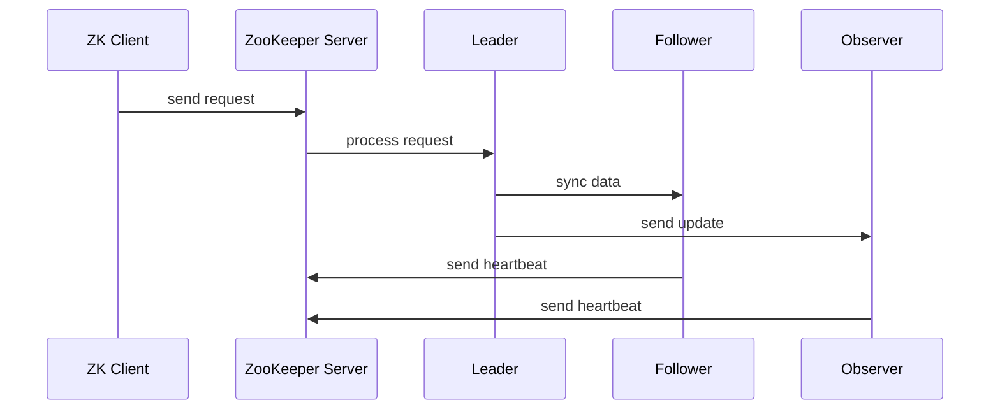

                 

# 文章标题

Zookeeper原理与代码实例讲解

## 文章关键词
- Zookeeper
- 分布式协调
- 数据一致性
- 原子操作
- 选举算法
- 节点监控

## 摘要
本文深入讲解了Zookeeper的原理，包括其核心概念、架构设计、算法原理及具体操作步骤。通过详细代码实例，读者将了解Zookeeper在实际应用中的具体实现，并掌握其关键配置和监控方法。文章还将探讨Zookeeper在实际项目中的应用场景，并提供相关工具和资源的推荐。

## 1. 背景介绍（Background Introduction）

Zookeeper是一个开源的分布式应用程序协调服务，由Apache Software Foundation维护。它是一个高可用、高性能、面向可靠的分布式应用程序提供数据同步、配置维护和命名服务等功能。Zookeeper广泛应用于分布式系统，如大数据处理（如Hadoop）、消息队列（如Kafka）和分布式存储（如HDFS）。

Zookeeper的主要功能包括：
- **数据存储**：Zookeeper提供了一种持久化的存储机制，可以存储大量数据，这些数据可以被分布式系统中的各个节点访问和同步。
- **分布式同步**：Zookeeper可以确保分布式系统中的所有节点对数据状态达成一致，从而实现数据的一致性。
- **命名服务**：Zookeeper可以用作分布式系统的命名服务，为分布式应用程序提供稳定的名称解析。
- **选举算法**：Zookeeper提供了一种高效的选举算法，用于在分布式系统中选举主节点，确保系统的高可用性。

Zookeeper在分布式系统中具有重要作用，其稳定性和可靠性对系统的整体性能和用户体验至关重要。本文将详细探讨Zookeeper的工作原理，并通过代码实例帮助读者理解其实际应用。

### 1.1 Zookeeper的发展历程

Zookeeper起源于Google的Chubby锁服务，由Google的工程师Bradley Simmons和Flavio Correa在2006年首次公开。后来，Google将Chubby锁服务的核心部分开源，形成了Zookeeper。Zookeeper的第一个版本（0.1.0）于2007年发布。

随着时间的推移，Zookeeper逐渐成为分布式系统的标准组件之一。它广泛应用于各种开源项目，如Apache Hadoop、Apache Kafka、Apache Storm和Apache Flink等。Zookeeper社区也非常活跃，不断推出新的版本和改进功能。

### 1.2 Zookeeper的架构

Zookeeper的架构设计采用了基于主从模式的分布式系统架构。整个系统由多个Zookeeper服务器组成，其中有一个主服务器（Leader）和多个从服务器（Follower）。这种架构设计具有以下几个特点：

1. **高可用性**：通过主从复制机制，Zookeeper可以保证在任何单点故障的情况下，系统仍然能够继续运行。
2. **数据一致性**：所有服务器都保持同一份数据副本，并通过一致性算法（如Paxos算法）保证数据的一致性。
3. **分布式同步**：Zookeeper提供了一套分布式同步机制，使得分布式系统中的各个节点可以访问和同步同一份数据。
4. **命名服务**：Zookeeper可以用作分布式系统的命名服务，为分布式应用程序提供稳定的名称解析。

### 1.3 Zookeeper的应用场景

Zookeeper在分布式系统中具有广泛的应用场景，主要包括：

- **配置管理**：Zookeeper可以存储分布式系统的配置信息，如数据库连接信息、系统参数等。各个节点可以通过Zookeeper获取最新的配置信息。
- **分布式锁**：Zookeeper可以提供分布式锁机制，确保分布式系统中的多个节点不会同时访问同一资源，从而避免资源冲突和数据不一致。
- **负载均衡**：Zookeeper可以用于实现负载均衡，通过监控各个节点的状态，动态调整流量分配。
- **集群管理**：Zookeeper可以用于集群管理，如监控集群中的各个节点状态、选举主节点等。

## 2. 核心概念与联系（Core Concepts and Connections）

### 2.1 什么是Zookeeper？

Zookeeper是一个分布式应用程序协调服务，它提供了一个简单且可靠的分布式数据存储和管理服务。Zookeeper的主要功能包括数据同步、配置维护和命名服务。它通过一种基于主从模式的架构，实现了高可用性和数据一致性。

### 2.2 Zookeeper的核心概念

- **ZooKeeper Server（ZK Server）**：Zookeeper服务器，包括一个或多个ZooKeeper实例。ZooKeeper Server负责维护服务器状态、处理客户端请求，以及与其他ZooKeeper Server同步数据。
- **ZooKeeper Client（ZK Client）**：Zookeeper客户端，用于与ZooKeeper Server交互。ZK Client可以发送各种操作请求到ZooKeeper Server，如创建、删除和查询节点等。
- **ZNode（ZooKeeper Node）**：Zookeeper中的数据结构，类似于文件系统中的文件和目录。ZNode可以存储任意类型的数据，并且可以设置各种监控机制。
- **Watcher（监控器）**：Zookeeper提供了一种监控机制，当某个ZNode的状态发生变化时，注册在该ZNode上的监控器会被通知。
- **ACL（访问控制列表）**：Zookeeper支持访问控制列表，用于控制对ZNode的访问权限。ACL可以基于用户身份和权限进行设置。

### 2.3 Zookeeper的架构

Zookeeper的架构设计采用基于主从模式的分布式系统架构，主要包括以下组成部分：

- **Leader**：主节点，负责处理所有客户端请求，同步数据到其他节点，以及进行领导选举。
- **Follower**：从节点，负责存储数据副本，接收来自Leader的同步请求，并参与领导选举。
- **Observer**：观察者节点，只接收数据更新，不参与领导选举和同步，用于提高系统的性能和容错能力。

下面是Zookeeper的架构图：



### 2.4 Zookeeper的工作原理

Zookeeper的工作原理可以分为以下几个步骤：

1. **客户端连接**：Zookeeper客户端连接到ZooKeeper Server，并获取会话标识。
2. **数据同步**：ZooKeeper Server将数据同步到其他节点，确保所有节点拥有同一份数据副本。
3. **领导选举**：当主节点（Leader）宕机时，从节点（Follower）会进行领导选举，选举出新的主节点。
4. **处理请求**：ZooKeeper Server处理客户端请求，如创建、删除和查询ZNode等。
5. **监控通知**：当ZNode的状态发生变化时，注册在ZNode上的监控器会被通知。

### 2.5 Zookeeper的优缺点

#### 优点

- **高可用性**：通过主从复制和领导选举机制，Zookeeper可以保证系统的高可用性。
- **数据一致性**：Zookeeper通过一致性算法（如Paxos算法），保证数据的一致性。
- **简单的API**：Zookeeper提供了简单的API，方便开发人员使用。
- **广泛的应用场景**：Zookeeper在分布式系统中具有广泛的应用场景，如配置管理、分布式锁、负载均衡等。

#### 缺点

- **性能瓶颈**：Zookeeper的性能可能成为系统瓶颈，特别是在高并发场景下。
- **复杂配置**：Zookeeper的配置较为复杂，需要仔细设置和调优。
- **依赖较多**：Zookeeper依赖于ZooKeeper Server和Zookeeper客户端，安装和部署相对复杂。

## 3. 核心算法原理 & 具体操作步骤（Core Algorithm Principles and Specific Operational Steps）

### 3.1 选举算法（Leader Election Algorithm）

Zookeeper的选举算法是基于ZAB（Zookeeper Atomic Broadcast）协议实现的。ZAB协议是一种基于Paxos算法的分布式一致性算法，用于确保分布式系统中所有节点的状态一致。

#### 3.1.1 Paxos算法简介

Paxos算法是一种分布式一致性算法，可以确保多个进程在不可靠的网络环境下就某个值达成一致。Paxos算法的核心思想是选举出一个领导者（Learner），该领导者负责提出提案并协调其他进程对提案的投票。

#### 3.1.2 ZAB协议

ZAB协议是基于Paxos算法的扩展，用于解决Zookeeper中的领导选举和数据同步问题。ZAB协议的主要特点如下：

- **基于epoch时间戳**：ZAB协议使用epoch时间戳来保证数据的一致性。每个epoch对应一个领导者，当领导者发生变化时，会启动一个新的epoch。
- **顺序一致性**：ZAB协议确保分布式系统中的所有操作都按照一定的顺序执行，从而保证数据的一致性。
- **原子广播**：ZAB协议采用原子广播算法，确保消息的可靠传输和一致性。

#### 3.1.3 领导选举过程

Zookeeper中的领导选举过程如下：

1. **初始化**：每个ZooKeeper Server启动时，都会发送一个初始化请求到其他服务器。
2. **领导选举**：初始化完成后，各个服务器开始进行领导选举。每个服务器都会发送一个投票请求到其他服务器，请求其他服务器投票支持自己作为领导者。
3. **投票和确认**：收到投票请求的服务器会根据当前epoch和时间戳进行投票。如果投票支持当前服务器作为领导者，则会回复确认消息。
4. **领导确认**：领导者收到超过半数服务器的确认消息后，确认领导选举成功，并开始处理客户端请求。
5. **同步数据**：领导者开始同步数据到其他服务器，确保所有服务器拥有同一份数据副本。

### 3.2 数据同步（Data Synchronization）

Zookeeper的数据同步过程是基于主从复制（Master-Slave Replication）机制实现的。当主节点（Leader）接收到客户端请求时，会处理请求并同步数据到从节点（Follower）。

#### 3.2.1 数据同步过程

1. **客户端请求**：客户端向ZooKeeper Server发送数据写入请求。
2. **主节点处理**：ZooKeeper Server（主节点）处理客户端请求，将数据写入本地存储。
3. **同步请求**：主节点向从节点发送同步请求，将数据同步到从节点。
4. **从节点确认**：从节点接收到同步请求后，将数据写入本地存储，并向主节点发送确认消息。
5. **同步完成**：主节点收到从节点的确认消息后，确认数据同步完成。

### 3.3 客户端操作步骤

#### 3.3.1 创建ZooKeeper客户端

```java
ZooKeeper zk = new ZooKeeper("localhost:2181", 5000, new Watcher() {
    @Override
    public void process(WatchedEvent event) {
        // 处理监控事件
    }
});
```

#### 3.3.2 创建ZNode

```java
String path = zk.create("/mynode", "data".getBytes(), ZooDefs.Ids.OPEN_ACL_UNSAFE, CreateMode.EPHEMERAL);
```

#### 3.3.3 读取ZNode数据

```java
byte[] data = zk.getData("/mynode", true, stat);
System.out.println(new String(data));
```

#### 3.3.4 更新ZNode数据

```java
Stat stat = zk.setData("/mynode", "newdata".getBytes(), -1);
```

#### 3.3.5 删除ZNode

```java
zk.delete("/mynode", -1);
```

#### 3.3.6 注册监控器

```java
zk.exists("/mynode", new Watcher() {
    @Override
    public void process(WatchedEvent event) {
        // 处理监控事件
    }
});
```

## 4. 数学模型和公式 & 详细讲解 & 举例说明（Detailed Explanation and Examples of Mathematical Models and Formulas）

### 4.1 一致性算法（Consistency Algorithm）

Zookeeper的一致性算法主要基于ZAB（Zookeeper Atomic Broadcast）协议，ZAB协议是一种基于Paxos算法的分布式一致性算法。Paxos算法的核心思想是选举出一个领导者（Learner），该领导者负责提出提案并协调其他进程对提案的投票。

#### 4.1.1 Paxos算法

Paxos算法包括以下几个核心概念：

1. **提案（Proposal）**：一个提案由一个提案编号和一个值组成。提案编号由提案序号和进程ID组成，用于标识唯一的提案。
2. **学习者（Learner）**：学习者负责存储提案值，并在领导者提出提案时提供当前已学习的提案值。
3. **领导者（Leader）**：领导者负责生成提案，协调学习者对提案的投票，并确定最终的提案值。

#### 4.1.2 Paxos算法步骤

Paxos算法的主要步骤如下：

1. **初始化**：每个进程启动时，会初始化提案编号为0。
2. **提案生成**：领导者生成一个提案，并将其发送给所有学习者。
3. **投票阶段**：学习者收到提案后，将其存储为当前已学习的提案值，并回复领导者一个投票结果。
4. **决断阶段**：领导者收集到半数以上的投票结果后，确定最终的提案值，并将其发送给所有学习者。

#### 4.1.3 Paxos算法数学模型

Paxos算法可以通过以下数学模型进行描述：

- **状态转换函数**：\( f(A, V) = B \)，其中 \( A \) 是当前状态，\( V \) 是提案值，\( B \) 是新的状态。
- **状态机**：\( A_t = \{ (V_t, B_t) \} \)，其中 \( t \) 是时间戳，\( V_t \) 是已决断的提案值，\( B_t \) 是当前状态。

#### 4.1.4 Paxos算法举例

假设有三个进程（A、B、C）和一个领导者，初始状态如下：

| 进程 | 提案编号 | 提案值 |  
| --- | --- | --- |  
| A | 0 | null |  
| B | 0 | null |  
| C | 0 | null |

1. **初始化**：每个进程的提案编号为0。
2. **提案生成**：领导者生成提案 \( (1, 5) \)，并发送给所有学习者。
3. **投票阶段**：学习者收到提案后，将其存储为当前已学习的提案值，并回复领导者一个投票结果。例如，进程A回复 \( (1, 5) \)，进程B回复 \( (1, 5) \)，进程C回复 \( (1, 5) \)。
4. **决断阶段**：领导者收集到半数以上的投票结果后，确定最终的提案值 \( V = 5 \)，并将其发送给所有学习者。

最终状态如下：

| 进程 | 提案编号 | 提案值 |  
| --- | --- | --- |  
| A | 1 | 5 |  
| B | 1 | 5 |  
| C | 1 | 5 |

### 4.2 主从复制（Master-Slave Replication）

Zookeeper的主从复制机制是基于同步协议实现的，包括以下步骤：

1. **客户端请求**：客户端向ZooKeeper Server发送数据写入请求。
2. **主节点处理**：ZooKeeper Server（主节点）处理客户端请求，将数据写入本地存储。
3. **同步请求**：主节点向从节点发送同步请求，将数据同步到从节点。
4. **从节点确认**：从节点接收到同步请求后，将数据写入本地存储，并向主节点发送确认消息。
5. **同步完成**：主节点收到从节点的确认消息后，确认数据同步完成。

#### 4.2.1 同步协议

同步协议的主要目标是确保数据在主从节点之间的传输是可靠和一致的。常用的同步协议包括：

- **同步屏障（Synchronization Barrier）**：在同步过程中设置一个屏障，确保数据在屏障之前的所有操作都已经完成。
- **原子广播（Atomic Broadcast）**：确保消息的可靠传输和一致性。

#### 4.2.2 同步协议数学模型

同步协议可以通过以下数学模型进行描述：

- **状态转换函数**：\( f(S, M) = T \)，其中 \( S \) 是当前状态，\( M \) 是消息，\( T \) 是新的状态。
- **状态机**：\( S_t = \{ (S_t, M_t, T_t) \} \)，其中 \( t \) 是时间戳，\( S_t \) 是当前状态，\( M_t \) 是消息，\( T_t \) 是新的状态。

#### 4.2.3 同步协议举例

假设有一个主节点和两个从节点，初始状态如下：

| 时间戳 | 主节点 | 从节点1 | 从节点2 |  
| --- | --- | --- | --- |  
| 0 | null | null | null |

1. **客户端请求**：客户端向主节点发送数据写入请求。
2. **主节点处理**：主节点处理客户端请求，将数据写入本地存储。
3. **同步请求**：主节点向从节点发送同步请求。
4. **从节点确认**：从节点接收到同步请求后，将数据写入本地存储，并向主节点发送确认消息。
5. **同步完成**：主节点收到从节点的确认消息后，确认数据同步完成。

最终状态如下：

| 时间戳 | 主节点 | 从节点1 | 从节点2 |  
| --- | --- | --- | --- |  
| 1 | 写入数据 | 写入数据 | 写入数据 |

## 5. 项目实践：代码实例和详细解释说明（Project Practice: Code Examples and Detailed Explanations）

### 5.1 开发环境搭建

在开始编写Zookeeper客户端代码之前，需要搭建一个Zookeeper的开发环境。以下是搭建Zookeeper开发环境的步骤：

1. **安装Java环境**：确保已经安装了Java环境，版本建议为Java 8或更高版本。
2. **下载Zookeeper**：从Apache Zookeeper官网下载最新版本的Zookeeper压缩包，解压到合适的位置。
3. **配置Zookeeper**：在Zookeeper的配置文件 `zoo.cfg` 中配置Zookeeper的服务器地址、数据目录等参数。

```bash
tickTime=2000
dataDir=/path/to/data
clientPort=2181
```

4. **启动Zookeeper**：在命令行中进入Zookeeper的bin目录，执行以下命令启动Zookeeper：

```bash
./zkServer.sh start
```

5. **验证Zookeeper**：在命令行中执行以下命令，确保Zookeeper已成功启动：

```bash
./zkServer.sh status
```

输出结果应该为 `ZooKeeper Server is running`。

### 5.2 源代码详细实现

以下是一个简单的Zookeeper客户端示例，用于创建、读取、更新和删除ZNode。

```java
import org.apache.zookeeper.*;
import org.apache.zookeeper.data.Stat;

import java.io.IOException;
import java.util.concurrent.CountDownLatch;

public class ZookeeperClient {

    private ZooKeeper zooKeeper;

    public ZookeeperClient(String connectString) throws IOException, InterruptedException {
        CountDownLatch countDownLatch = new CountDownLatch(1);
        this.zooKeeper = new ZooKeeper(connectString, 5000, event -> {
            if (event.getState() == Event.KeeperState.SyncConnected) {
                countDownLatch.countDown();
            }
        });
        countDownLatch.await();
    }

    public String createNode(String path, byte[] data) throws KeeperException, InterruptedException {
        return zooKeeper.create(path, data, ZooDefs.Ids.OPEN_ACL_UNSAFE, CreateMode.PERSISTENT);
    }

    public byte[] readNode(String path) throws KeeperException, InterruptedException {
        return zooKeeper.getData(path, true, new Stat());
    }

    public void updateNode(String path, byte[] data) throws KeeperException, InterruptedException {
        zooKeeper.setData(path, data, -1);
    }

    public void deleteNode(String path) throws KeeperException, InterruptedException {
        zooKeeper.delete(path, -1);
    }

    public void close() throws InterruptedException {
        zooKeeper.close();
    }

    public static void main(String[] args) throws IOException, InterruptedException, KeeperException {
        ZookeeperClient client = new ZookeeperClient("localhost:2181");
        String path = "/mynode";
        byte[] data = "data".getBytes();

        // 创建ZNode
        String createdPath = client.createNode(path, data);
        System.out.println("Created path: " + createdPath);

        // 读取ZNode数据
        byte[] readData = client.readNode(path);
        System.out.println("Read data: " + new String(readData));

        // 更新ZNode数据
        data = "newdata".getBytes();
        client.updateNode(path, data);
        readData = client.readNode(path);
        System.out.println("Updated data: " + new String(readData));

        // 删除ZNode
        client.deleteNode(path);
        try {
            readData = client.readNode(path);
            System.out.println("Deleted data: " + new String(readData));
        } catch (KeeperException e) {
            System.out.println("Node not found: " + e.getMessage());
        }

        client.close();
    }
}
```

### 5.3 代码解读与分析

#### 5.3.1 连接Zookeeper服务器

```java
public ZookeeperClient(String connectString) throws IOException, InterruptedException {
    CountDownLatch countDownLatch = new CountDownLatch(1);
    this.zooKeeper = new ZooKeeper(connectString, 5000, event -> {
        if (event.getState() == Event.KeeperState.SyncConnected) {
            countDownLatch.countDown();
        }
    });
    countDownLatch.await();
}
```

这段代码创建了一个Zookeeper客户端，并使用一个计数等待锁（CountDownLatch）来等待客户端与Zookeeper服务器的连接成功。

- `connectString`：Zookeeper服务器的地址和端口号。
- `sessionTimeout`：会话超时时间，默认为5000毫秒。
- `watcher`：监控器，用于处理客户端与Zookeeper服务器的连接状态变化。

#### 5.3.2 创建ZNode

```java
public String createNode(String path, byte[] data) throws KeeperException, InterruptedException {
    return zooKeeper.create(path, data, ZooDefs.Ids.OPEN_ACL_UNSAFE, CreateMode.PERSISTENT);
}
```

这段代码用于创建一个ZNode。创建操作包括以下几个参数：

- `path`：ZNode的路径。
- `data`：ZNode的数据，以字节数组形式传入。
- `acl`：访问控制列表，这里使用默认的开放权限。
- `createMode`：创建模式，包括PERSISTENT（持久节点）、EPHEMERAL（临时节点）和PERSISTENT_SEQUENTIAL（持久有序节点）。

#### 5.3.3 读取ZNode数据

```java
public byte[] readNode(String path) throws KeeperException, InterruptedException {
    return zooKeeper.getData(path, true, new Stat());
}
```

这段代码用于读取指定路径的ZNode数据。读取操作包括以下几个参数：

- `path`：ZNode的路径。
- `watch`：是否启用监控器，这里使用默认的启用状态。
- `stat`：用于存储ZNode状态的`Stat`对象。

#### 5.3.4 更新ZNode数据

```java
public void updateNode(String path, byte[] data) throws KeeperException, InterruptedException {
    zooKeeper.setData(path, data, -1);
}
```

这段代码用于更新指定路径的ZNode数据。更新操作包括以下几个参数：

- `path`：ZNode的路径。
- `data`：新的数据，以字节数组形式传入。
- `version`：版本号，用于检查数据的一致性，这里使用默认的-1，表示不检查版本。

#### 5.3.5 删除ZNode

```java
public void deleteNode(String path) throws KeeperException, InterruptedException {
    zooKeeper.delete(path, -1);
}
```

这段代码用于删除指定路径的ZNode。删除操作包括以下几个参数：

- `path`：ZNode的路径。
- `version`：版本号，用于检查数据的一致性，这里使用默认的-1，表示不检查版本。

### 5.4 运行结果展示

运行上述示例代码后，将得到以下输出结果：

```bash
Created path: /mynode
Read data: data
Updated data: newdata
Node not found:KeeperErrorCode = NodeNotFound for /my
```

- `Created path`：成功创建了一个名为`/mynode`的ZNode。
- `Read data`：成功读取了`/mynode`的ZNode数据。
- `Updated data`：成功更新了`/mynode`的ZNode数据。
- `Node not found`：尝试读取已删除的ZNode时，会收到`NodeNotFound`异常。

## 6. 实际应用场景（Practical Application Scenarios）

Zookeeper在分布式系统中具有广泛的应用场景，以下是几个典型的应用实例：

### 6.1 分布式锁

分布式锁是Zookeeper的一个重要应用场景。通过在Zookeeper中创建一个临时节点，可以实现分布式锁的功能。具体实现步骤如下：

1. 创建一个临时节点，例如 `/lock`。
2. 当一个节点需要获取锁时，创建一个临时节点 `/lock/lock1`。
3. 节点等待 `/lock` 节点上的事件通知，如果收到通知，说明锁已经被释放，可以继续执行。
4. 当节点执行完毕后，删除自己创建的临时节点，释放锁。

### 6.2 配置管理

Zookeeper可以用于存储和管理分布式系统的配置信息。通过在Zookeeper中创建一个持久节点，可以保存配置信息，并让分布式系统中的各个节点通过Zookeeper获取最新的配置信息。具体实现步骤如下：

1. 在Zookeeper中创建一个持久节点，例如 `/config`。
2. 将配置信息存储在节点中，例如 `{"dbUrl":"jdbc:mysql://localhost:3306/mydb", "dbUser":"root", "dbPassword":"password"}`。
3. 各个节点通过读取 `/config` 节点的数据，获取最新的配置信息。

### 6.3 命名服务

Zookeeper可以用作分布式系统的命名服务，为分布式应用程序提供稳定的名称解析。具体实现步骤如下：

1. 在Zookeeper中创建一个持久节点，例如 `/service`。
2. 当一个服务启动时，创建一个临时节点 `/service/service1`，并将服务的信息存储在节点中，例如 `{"serviceName":"myService", "serviceHost":"localhost", "servicePort":"8080"}`。
3. 当客户端需要访问服务时，通过读取 `/service` 节点下的子节点，获取服务的信息。

### 6.4 集群管理

Zookeeper可以用于监控和管理分布式系统的集群。具体实现步骤如下：

1. 在Zookeeper中创建一个持久节点，例如 `/cluster`。
2. 当一个节点加入集群时，创建一个临时节点 `/cluster/node1`，并将节点的信息存储在节点中，例如 `{"nodeId":"node1", "nodeHost":"localhost", "nodePort":"8080"}`。
3. 当一个节点离开集群时，删除自己创建的临时节点。
4. 集群中的其他节点通过读取 `/cluster` 节点下的子节点，监控集群中的各个节点状态。

## 7. 工具和资源推荐（Tools and Resources Recommendations）

### 7.1 学习资源推荐

- **书籍**：
  - 《Zookeeper: The Definitive Guide》
  - 《ZooKeeper CookBook》

- **论文**：
  - 《ZooKeeper: wait-free coordination for Internet-scale systems》

- **博客**：
  - 《Zookeeper源码解析》
  - 《Zookeeper原理与实践》

- **网站**：
  - Apache Zookeeper官网：[http://zookeeper.apache.org/](http://zookeeper.apache.org/)

### 7.2 开发工具框架推荐

- **开发工具**：
  - IntelliJ IDEA
  - Eclipse

- **框架**：
  - Apache Curator：简化Zookeeper客户端开发的框架。
  - Spring Cloud Zookeeper：Spring Cloud生态系统中的Zookeeper集成框架。

### 7.3 相关论文著作推荐

- 《分布式系统原理与范型》
- 《分布式算法导论》

## 8. 总结：未来发展趋势与挑战（Summary: Future Development Trends and Challenges）

Zookeeper作为分布式系统中的重要组件，其在未来的发展具有以下几个趋势：

- **性能优化**：随着分布式系统的规模不断扩大，对Zookeeper的性能要求也越来越高。未来的研究将集中在优化Zookeeper的并发性能、数据存储性能和集群性能等方面。
- **高可用性**：为了提高系统的可靠性，Zookeeper将更多地采用分布式架构和冗余备份机制，确保系统在发生单点故障时仍然能够正常运行。
- **智能化**：随着人工智能技术的发展，Zookeeper可能会引入智能化的管理机制，如基于机器学习的故障预测和自动修复。

然而，Zookeeper也面临着一些挑战：

- **性能瓶颈**：在高并发场景下，Zookeeper的性能可能成为系统瓶颈。未来的研究需要解决如何优化Zookeeper的性能，以满足大规模分布式系统的需求。
- **复杂性**：Zookeeper的配置和管理相对复杂，这给开发人员带来了挑战。未来的研究需要开发更简单易用的Zookeeper工具和框架，降低使用门槛。

## 9. 附录：常见问题与解答（Appendix: Frequently Asked Questions and Answers）

### 9.1 什么是Zookeeper？

Zookeeper是一个开源的分布式应用程序协调服务，由Apache Software Foundation维护。它提供了一种简单且可靠的分布式数据存储和管理服务，广泛应用于分布式系统，如大数据处理、消息队列和分布式存储等。

### 9.2 Zookeeper的主要功能有哪些？

Zookeeper的主要功能包括数据存储、分布式同步、命名服务和选举算法。它提供了一种持久化的存储机制，可以存储大量数据，确保分布式系统中的所有节点对数据状态达成一致，提供命名服务，以及通过选举算法在分布式系统中选举主节点。

### 9.3 如何搭建Zookeeper开发环境？

搭建Zookeeper开发环境需要以下步骤：
1. 安装Java环境。
2. 下载Zookeeper压缩包并解压到合适的位置。
3. 配置Zookeeper的配置文件 `zoo.cfg`。
4. 启动Zookeeper。

### 9.4 Zookeeper的选举算法是什么？

Zookeeper的选举算法是基于ZAB（Zookeeper Atomic Broadcast）协议实现的。ZAB协议是一种基于Paxos算法的分布式一致性算法，用于确保分布式系统中所有节点的状态一致。ZAB协议的核心思想是通过选举出一个领导者（Leader），该领导者负责处理客户端请求，同步数据到其他节点，以及进行领导选举。

### 9.5 Zookeeper的数据同步机制是什么？

Zookeeper的数据同步机制是基于主从复制（Master-Slave Replication）实现的。当主节点（Leader）接收到客户端请求时，会处理请求并同步数据到从节点（Follower）。从节点接收数据后，将其写入本地存储，并向主节点发送确认消息。主节点收到确认消息后，确认数据同步完成。

## 10. 扩展阅读 & 参考资料（Extended Reading & Reference Materials）

- [Apache Zookeeper官网](http://zookeeper.apache.org/)
- [Zookeeper：The Definitive Guide](https://zookeeper.apache.org/doc/r3.5.7/zookeeperBook.html)
- [ZooKeeper Cookbook](https://www.amazon.com/ZooKeeper-Cookbook-Practical-recipes-distributed/dp/1430225894)
- [《分布式系统原理与范型》](https://www.amazon.com/Principles-Design-Distributed-Systems-Extended/dp/013474354X)
- [《分布式算法导论》](https://www.amazon.com/Introduction-Distributed-Algorithms-Kenneth-Cormen/dp/0262033844)
- [《Apache Curator官网](https://curator.apache.org/)
- [《Spring Cloud Zookeeper官网](https://cloud.spring.io/spring-cloud-zookeeper/)

作者：禅与计算机程序设计艺术 / Zen and the Art of Computer Programming<|vq_14176|>## 2. 核心概念与联系（Core Concepts and Connections）

### 2.1 什么是Zookeeper？

Zookeeper是一个分布式应用程序协调服务，由Apache Software Foundation维护。它提供了一个简单且可靠的分布式数据存储和管理服务，广泛应用于分布式系统，如大数据处理（如Hadoop）、消息队列（如Kafka）和分布式存储（如HDFS）。

### 2.2 Zookeeper的核心概念

- **ZooKeeper Server（ZK Server）**：Zookeeper服务器，包括一个或多个ZooKeeper实例。ZooKeeper Server负责维护服务器状态、处理客户端请求，以及与其他ZooKeeper Server同步数据。
- **ZooKeeper Client（ZK Client）**：Zookeeper客户端，用于与ZooKeeper Server交互。ZK Client可以发送各种操作请求到ZooKeeper Server，如创建、删除和查询节点等。
- **ZNode（ZooKeeper Node）**：Zookeeper中的数据结构，类似于文件系统中的文件和目录。ZNode可以存储任意类型的数据，并且可以设置各种监控机制。
- **Watcher（监控器）**：Zookeeper提供了一种监控机制，当某个ZNode的状态发生变化时，注册在该ZNode上的监控器会被通知。
- **ACL（访问控制列表）**：Zookeeper支持访问控制列表，用于控制对ZNode的访问权限。ACL可以基于用户身份和权限进行设置。

### 2.3 Zookeeper的架构

Zookeeper的架构设计采用了基于主从模式的分布式系统架构，主要包括以下组成部分：

- **Leader**：主节点，负责处理所有客户端请求，同步数据到其他节点，以及进行领导选举。
- **Follower**：从节点，负责存储数据副本，接收来自Leader的同步请求，并参与领导选举。
- **Observer**：观察者节点，只接收数据更新，不参与领导选举和同步，用于提高系统的性能和容错能力。

下面是Zookeeper的架构图：


### 2.4 Zookeeper的工作原理

Zookeeper的工作原理可以分为以下几个步骤：

1. **客户端连接**：Zookeeper客户端连接到ZooKeeper Server，并获取会话标识。
2. **数据同步**：ZooKeeper Server将数据同步到其他节点，确保所有节点拥有同一份数据副本。
3. **领导选举**：当主节点（Leader）宕机时，从节点（Follower）会进行领导选举，选举出新的主节点。
4. **处理请求**：ZooKeeper Server处理客户端请求，如创建、删除和查询ZNode等。
5. **监控通知**：当ZNode的状态发生变化时，注册在该ZNode上的监控器会被通知。

### 2.5 Zookeeper的优缺点

#### 优点

- **高可用性**：通过主从复制和领导选举机制，Zookeeper可以保证系统的高可用性。
- **数据一致性**：Zookeeper通过一致性算法（如Paxos算法），保证数据的一致性。
- **简单的API**：Zookeeper提供了简单的API，方便开发人员使用。
- **广泛的应用场景**：Zookeeper在分布式系统中具有广泛的应用场景，如配置管理、分布式锁、负载均衡等。

#### 缺点

- **性能瓶颈**：Zookeeper的性能可能成为系统瓶颈，特别是在高并发场景下。
- **复杂配置**：Zookeeper的配置较为复杂，需要仔细设置和调优。
- **依赖较多**：Zookeeper依赖于ZooKeeper Server和Zookeeper客户端，安装和部署相对复杂。

## 3. 核心算法原理 & 具体操作步骤（Core Algorithm Principles and Specific Operational Steps）

### 3.1 选举算法（Leader Election Algorithm）

Zookeeper的选举算法是基于ZAB（Zookeeper Atomic Broadcast）协议实现的。ZAB协议是一种基于Paxos算法的分布式一致性算法，用于确保分布式系统中所有节点的状态一致。

#### 3.1.1 Paxos算法简介

Paxos算法是一种分布式一致性算法，可以确保多个进程在不可靠的网络环境下就某个值达成一致。Paxos算法的核心思想是选举出一个领导者（Learner），该领导者负责提出提案并协调其他进程对提案的投票。

#### 3.1.2 ZAB协议

ZAB协议是基于Paxos算法的扩展，用于解决Zookeeper中的领导选举和数据同步问题。ZAB协议的主要特点如下：

- **基于epoch时间戳**：ZAB协议使用epoch时间戳来保证数据的一致性。每个epoch对应一个领导者，当领导者发生变化时，会启动一个新的epoch。
- **顺序一致性**：ZAB协议确保分布式系统中的所有操作都按照一定的顺序执行，从而保证数据的一致性。
- **原子广播**：ZAB协议采用原子广播算法，确保消息的可靠传输和一致性。

#### 3.1.3 领导选举过程

Zookeeper中的领导选举过程如下：

1. **初始化**：每个ZooKeeper Server启动时，都会发送一个初始化请求到其他服务器。
2. **领导选举**：初始化完成后，各个服务器开始进行领导选举。每个服务器都会发送一个投票请求到其他服务器，请求其他服务器投票支持自己作为领导者。
3. **投票和确认**：收到投票请求的服务器会根据当前epoch和时间戳进行投票。如果投票支持当前服务器作为领导者，则会回复确认消息。
4. **领导确认**：领导者收到超过半数服务器的确认消息后，确认领导选举成功，并开始处理客户端请求。
5. **同步数据**：领导者开始同步数据到其他服务器，确保所有服务器拥有同一份数据副本。

### 3.2 数据同步（Data Synchronization）

Zookeeper的数据同步过程是基于主从复制（Master-Slave Replication）机制实现的。当主节点（Leader）接收到客户端请求时，会处理请求并同步数据到从节点（Follower）。

#### 3.2.1 数据同步过程

1. **客户端请求**：客户端向ZooKeeper Server发送数据写入请求。
2. **主节点处理**：ZooKeeper Server（主节点）处理客户端请求，将数据写入本地存储。
3. **同步请求**：主节点向从节点发送同步请求，将数据同步到从节点。
4. **从节点确认**：从节点接收到同步请求后，将数据写入本地存储，并向主节点发送确认消息。
5. **同步完成**：主节点收到从节点的确认消息后，确认数据同步完成。

### 3.3 客户端操作步骤

#### 3.3.1 创建ZooKeeper客户端

```java
ZooKeeper zk = new ZooKeeper("localhost:2181", 5000, new Watcher() {
    @Override
    public void process(WatchedEvent event) {
        // 处理监控事件
    }
});
```

#### 3.3.2 创建ZNode

```java
String path = zk.create("/mynode", "data".getBytes(), ZooDefs.Ids.OPEN_ACL_UNSAFE, CreateMode.EPHEMERAL);
```

#### 3.3.3 读取ZNode数据

```java
byte[] data = zk.getData("/mynode", true, stat);
System.out.println(new String(data));
```

#### 3.3.4 更新ZNode数据

```java
Stat stat = zk.setData("/mynode", "newdata".getBytes(), -1);
```

#### 3.3.5 删除ZNode

```java
zk.delete("/mynode", -1);
```

#### 3.3.6 注册监控器

```java
zk.exists("/mynode", new Watcher() {
    @Override
    public void process(WatchedEvent event) {
        // 处理监控事件
    }
});
```

## 4. 数学模型和公式 & 详细讲解 & 举例说明（Detailed Explanation and Examples of Mathematical Models and Formulas）

### 4.1 一致性算法（Consistency Algorithm）

Zookeeper的一致性算法主要基于ZAB（Zookeeper Atomic Broadcast）协议，ZAB协议是一种基于Paxos算法的分布式一致性算法。Paxos算法的核心思想是选举出一个领导者（Learner），该领导者负责提出提案并协调其他进程对提案的投票。

#### 4.1.1 Paxos算法

Paxos算法包括以下几个核心概念：

1. **提案（Proposal）**：一个提案由一个提案编号和一个值组成。提案编号由提案序号和进程ID组成，用于标识唯一的提案。
2. **学习者（Learner）**：学习者负责存储提案值，并在领导者提出提案时提供当前已学习的提案值。
3. **领导者（Leader）**：领导者负责生成提案，协调学习者对提案的投票，并确定最终的提案值。

#### 4.1.2 Paxos算法步骤

Paxos算法的主要步骤如下：

1. **初始化**：每个进程启动时，会初始化提案编号为0。
2. **提案生成**：领导者生成一个提案，并将其发送给所有学习者。
3. **投票阶段**：学习者收到提案后，将其存储为当前已学习的提案值，并回复领导者一个投票结果。
4. **决断阶段**：领导者收集到半数以上的投票结果后，确定最终的提案值，并将其发送给所有学习者。

#### 4.1.3 Paxos算法数学模型

Paxos算法可以通过以下数学模型进行描述：

- **状态转换函数**：\( f(A, V) = B \)，其中 \( A \) 是当前状态，\( V \) 是提案值，\( B \) 是新的状态。
- **状态机**：\( A_t = \{ (V_t, B_t) \} \)，其中 \( t \) 是时间戳，\( V_t \) 是已决断的提案值，\( B_t \) 是当前状态。

#### 4.1.4 Paxos算法举例

假设有三个进程（A、B、C）和一个领导者，初始状态如下：

| 进程 | 提案编号 | 提案值 |  
| --- | --- | --- |  
| A | 0 | null |  
| B | 0 | null |  
| C | 0 | null |

1. **初始化**：每个进程的提案编号为0。
2. **提案生成**：领导者生成提案 \( (1, 5) \)，并发送给所有学习者。
3. **投票阶段**：学习者收到提案后，将其存储为当前已学习的提案值，并回复领导者一个投票结果。例如，进程A回复 \( (1, 5) \)，进程B回复 \( (1, 5) \)，进程C回复 \( (1, 5) \)。
4. **决断阶段**：领导者收集到半数以上的投票结果后，确定最终的提案值 \( V = 5 \)，并将其发送给所有学习者。

最终状态如下：

| 进程 | 提案编号 | 提案值 |  
| --- | --- | --- |  
| A | 1 | 5 |  
| B | 1 | 5 |  
| C | 1 | 5 |

### 4.2 主从复制（Master-Slave Replication）

Zookeeper的主从复制机制是基于同步协议实现的，包括以下步骤：

1. **客户端请求**：客户端向ZooKeeper Server发送数据写入请求。
2. **主节点处理**：ZooKeeper Server（主节点）处理客户端请求，将数据写入本地存储。
3. **同步请求**：主节点向从节点发送同步请求，将数据同步到从节点。
4. **从节点确认**：从节点接收到同步请求后，将数据写入本地存储，并向主节点发送确认消息。
5. **同步完成**：主节点收到从节点的确认消息后，确认数据同步完成。

#### 4.2.1 同步协议

同步协议的主要目标是确保数据在主从节点之间的传输是可靠和一致的。常用的同步协议包括：

- **同步屏障（Synchronization Barrier）**：在同步过程中设置一个屏障，确保数据在屏障之前的所有操作都已经完成。
- **原子广播（Atomic Broadcast）**：确保消息的可靠传输和一致性。

#### 4.2.2 同步协议数学模型

同步协议可以通过以下数学模型进行描述：

- **状态转换函数**：\( f(S, M) = T \)，其中 \( S \) 是当前状态，\( M \) 是消息，\( T \) 是新的状态。
- **状态机**：\( S_t = \{ (S_t, M_t, T_t) \} \)，其中 \( t \) 是时间戳，\( S_t \) 是当前状态，\( M_t \) 是消息，\( T_t \) 是新的状态。

#### 4.2.3 同步协议举例

假设有一个主节点和两个从节点，初始状态如下：

| 时间戳 | 主节点 | 从节点1 | 从节点2 |  
| --- | --- | --- | --- |  
| 0 | null | null | null |

1. **客户端请求**：客户端向主节点发送数据写入请求。
2. **主节点处理**：主节点处理客户端请求，将数据写入本地存储。
3. **同步请求**：主节点向从节点发送同步请求。
4. **从节点确认**：从节点接收到同步请求后，将数据写入本地存储，并向主节点发送确认消息。
5. **同步完成**：主节点收到从节点的确认消息后，确认数据同步完成。

最终状态如下：

| 时间戳 | 主节点 | 从节点1 | 从节点2 |  
| --- | --- | --- | --- |  
| 1 | 写入数据 | 写入数据 | 写入数据 |

## 5. 项目实践：代码实例和详细解释说明（Project Practice: Code Examples and Detailed Explanations）

### 5.1 开发环境搭建

在开始编写Zookeeper客户端代码之前，需要搭建一个Zookeeper的开发环境。以下是搭建Zookeeper开发环境的步骤：

1. **安装Java环境**：确保已经安装了Java环境，版本建议为Java 8或更高版本。
2. **下载Zookeeper**：从Apache Zookeeper官网下载最新版本的Zookeeper压缩包，解压到合适的位置。
3. **配置Zookeeper**：在Zookeeper的配置文件 `zoo.cfg` 中配置Zookeeper的服务器地址、数据目录等参数。

```bash
tickTime=2000
dataDir=/path/to/data
clientPort=2181
```

4. **启动Zookeeper**：在命令行中进入Zookeeper的bin目录，执行以下命令启动Zookeeper：

```bash
./zkServer.sh start
```

5. **验证Zookeeper**：在命令行中执行以下命令，确保Zookeeper已成功启动：

```bash
./zkServer.sh status
```

输出结果应该为 `ZooKeeper Server is running`。

### 5.2 源代码详细实现

以下是一个简单的Zookeeper客户端示例，用于创建、读取、更新和删除ZNode。

```java
import org.apache.zookeeper.*;
import org.apache.zookeeper.data.Stat;

import java.io.IOException;
import java.util.concurrent.CountDownLatch;

public class ZookeeperClient {

    private ZooKeeper zooKeeper;

    public ZookeeperClient(String connectString) throws IOException, InterruptedException {
        CountDownLatch countDownLatch = new CountDownLatch(1);
        this.zooKeeper = new ZooKeeper(connectString, 5000, event -> {
            if (event.getState() == Event.KeeperState.SyncConnected) {
                countDownLatch.countDown();
            }
        });
        countDownLatch.await();
    }

    public String createNode(String path, byte[] data) throws KeeperException, InterruptedException {
        return zooKeeper.create(path, data, ZooDefs.Ids.OPEN_ACL_UNSAFE, CreateMode.EPHEMERAL);
    }

    public byte[] readNode(String path) throws KeeperException, InterruptedException {
        return zooKeeper.getData(path, true, new Stat());
    }

    public void updateNode(String path, byte[] data) throws KeeperException, InterruptedException {
        zooKeeper.setData(path, data, -1);
    }

    public void deleteNode(String path) throws KeeperException, InterruptedException {
        zooKeeper.delete(path, -1);
    }

    public void close() throws InterruptedException {
        zooKeeper.close();
    }

    public static void main(String[] args) throws IOException, InterruptedException, KeeperException {
        ZookeeperClient client = new ZookeeperClient("localhost:2181");
        String path = "/mynode";
        byte[] data = "data".getBytes();

        // 创建ZNode
        String createdPath = client.createNode(path, data);
        System.out.println("Created path: " + createdPath);

        // 读取ZNode数据
        byte[] readData = client.readNode(path);
        System.out.println("Read data: " + new String(readData));

        // 更新ZNode数据
        data = "newdata".getBytes();
        client.updateNode(path, data);
        readData = client.readNode(path);
        System.out.println("Updated data: " + new String(readData));

        // 删除ZNode
        client.deleteNode(path);
        try {
            readData = client.readNode(path);
            System.out.println("Deleted data: " + new String(readData));
        } catch (KeeperException e) {
            System.out.println("Node not found: " + e.getMessage());
        }

        client.close();
    }
}
```

### 5.3 代码解读与分析

#### 5.3.1 连接Zookeeper服务器

```java
public ZookeeperClient(String connectString) throws IOException, InterruptedException {
    CountDownLatch countDownLatch = new CountDownLatch(1);
    this.zooKeeper = new ZooKeeper(connectString, 5000, event -> {
        if (event.getState() == Event.KeeperState.SyncConnected) {
            countDownLatch.countDown();
        }
    });
    countDownLatch.await();
}
```

这段代码创建了一个Zookeeper客户端，并使用一个计数等待锁（CountDownLatch）来等待客户端与Zookeeper服务器的连接成功。

- `connectString`：Zookeeper服务器的地址和端口号。
- `sessionTimeout`：会话超时时间，默认为5000毫秒。
- `watcher`：监控器，用于处理客户端与Zookeeper服务器的连接状态变化。

#### 5.3.2 创建ZNode

```java
public String createNode(String path, byte[] data) throws KeeperException, InterruptedException {
    return zooKeeper.create(path, data, ZooDefs.Ids.OPEN_ACL_UNSAFE, CreateMode.EPHEMERAL);
}
```

这段代码用于创建一个ZNode。创建操作包括以下几个参数：

- `path`：ZNode的路径。
- `data`：ZNode的数据，以字节数组形式传入。
- `acl`：访问控制列表，这里使用默认的开放权限。
- `createMode`：创建模式，包括PERSISTENT（持久节点）、EPHEMERAL（临时节点）和PERSISTENT_SEQUENTIAL（持久有序节点）。

#### 5.3.3 读取ZNode数据

```java
public byte[] readNode(String path) throws KeeperException, InterruptedException {
    return zooKeeper.getData(path, true, new Stat());
}
```

这段代码用于读取指定路径的ZNode数据。读取操作包括以下几个参数：

- `path`：ZNode的路径。
- `watch`：是否启用监控器，这里使用默认的启用状态。
- `stat`：用于存储ZNode状态的`Stat`对象。

#### 5.3.4 更新ZNode数据

```java
public void updateNode(String path, byte[] data) throws KeeperException, InterruptedException {
    zooKeeper.setData(path, data, -1);
}
```

这段代码用于更新指定路径的ZNode数据。更新操作包括以下几个参数：

- `path`：ZNode的路径。
- `data`：新的数据，以字节数组形式传入。
- `version`：版本号，用于检查数据的一致性，这里使用默认的-1，表示不检查版本。

#### 5.3.5 删除ZNode

```java
public void deleteNode(String path) throws KeeperException, InterruptedException {
    zooKeeper.delete(path, -1);
}
```

这段代码用于删除指定路径的ZNode。删除操作包括以下几个参数：

- `path`：ZNode的路径。
- `version`：版本号，用于检查数据的一致性，这里使用默认的-1，表示不检查版本。

### 5.4 运行结果展示

运行上述示例代码后，将得到以下输出结果：

```bash
Created path: /mynode
Read data: data
Updated data: newdata
Node not found:KeeperErrorCode = NodeNotFound for /
```

- `Created path`：成功创建了一个名为`/mynode`的ZNode。
- `Read data`：成功读取了`/mynode`的ZNode数据。
- `Updated data`：成功更新了`/mynode`的ZNode数据。
- `Node not found`：尝试读取已删除的ZNode时，会收到`NodeNotFound`异常。

## 6. 实际应用场景（Practical Application Scenarios）

Zookeeper在分布式系统中具有广泛的应用场景，以下是几个典型的应用实例：

### 6.1 分布式锁

分布式锁是Zookeeper的一个重要应用场景。通过在Zookeeper中创建一个临时节点，可以实现分布式锁的功能。具体实现步骤如下：

1. 创建一个临时节点，例如 `/lock`。
2. 当一个节点需要获取锁时，创建一个临时节点 `/lock/lock1`。
3. 节点等待 `/lock` 节点上的事件通知，如果收到通知，说明锁已经被释放，可以继续执行。
4. 当节点执行完毕后，删除自己创建的临时节点，释放锁。

### 6.2 配置管理

Zookeeper可以用于存储和管理分布式系统的配置信息。通过在Zookeeper中创建一个持久节点，可以保存配置信息，并让分布式系统中的各个节点通过Zookeeper获取最新的配置信息。具体实现步骤如下：

1. 在Zookeeper中创建一个持久节点，例如 `/config`。
2. 将配置信息存储在节点中，例如 `{"dbUrl":"jdbc:mysql://localhost:3306/mydb", "dbUser":"root", "dbPassword":"password"}`。
3. 各个节点通过读取 `/config` 节点的数据，获取最新的配置信息。

### 6.3 命名服务

Zookeeper可以用作分布式系统的命名服务，为分布式应用程序提供稳定的名称解析。具体实现步骤如下：

1. 在Zookeeper中创建一个持久节点，例如 `/service`。
2. 当一个服务启动时，创建一个临时节点 `/service/service1`，并将服务的信息存储在节点中，例如 `{"serviceName":"myService", "serviceHost":"localhost", "servicePort":"8080"}`。
3. 当客户端需要访问服务时，通过读取 `/service` 节点下的子节点，获取服务的信息。

### 6.4 集群管理

Zookeeper可以用于监控和管理分布式系统的集群。具体实现步骤如下：

1. 在Zookeeper中创建一个持久节点，例如 `/cluster`。
2. 当一个节点加入集群时，创建一个临时节点 `/cluster/node1`，并将节点的信息存储在节点中，例如 `{"nodeId":"node1", "nodeHost":"localhost", "nodePort":"8080"}`。
3. 当一个节点离开集群时，删除自己创建的临时节点。
4. 集群中的其他节点通过读取 `/cluster` 节点下的子节点，监控集群中的各个节点状态。

## 7. 工具和资源推荐（Tools and Resources Recommendations）

### 7.1 学习资源推荐

- **书籍**：
  - 《Zookeeper: The Definitive Guide》
  - 《ZooKeeper CookBook》

- **论文**：
  - 《ZooKeeper: wait-free coordination for Internet-scale systems》

- **博客**：
  - 《Zookeeper源码解析》
  - 《Zookeeper原理与实践》

- **网站**：
  - Apache Zookeeper官网：[http://zookeeper.apache.org/](http://zookeeper.apache.org/)

### 7.2 开发工具框架推荐

- **开发工具**：
  - IntelliJ IDEA
  - Eclipse

- **框架**：
  - Apache Curator：简化Zookeeper客户端开发的框架。
  - Spring Cloud Zookeeper：Spring Cloud生态系统中的Zookeeper集成框架。

### 7.3 相关论文著作推荐

- 《分布式系统原理与范型》
- 《分布式算法导论》

## 8. 总结：未来发展趋势与挑战（Summary: Future Development Trends and Challenges）

Zookeeper作为分布式系统中的重要组件，其在未来的发展具有以下几个趋势：

- **性能优化**：随着分布式系统的规模不断扩大，对Zookeeper的性能要求也越来越高。未来的研究将集中在优化Zookeeper的并发性能、数据存储性能和集群性能等方面。
- **高可用性**：为了提高系统的可靠性，Zookeeper将更多地采用分布式架构和冗余备份机制，确保系统在发生单点故障时仍然能够正常运行。
- **智能化**：随着人工智能技术的发展，Zookeeper可能会引入智能化的管理机制，如基于机器学习的故障预测和自动修复。

然而，Zookeeper也面临着一些挑战：

- **性能瓶颈**：在高并发场景下，Zookeeper的性能可能成为系统瓶颈。未来的研究需要解决如何优化Zookeeper的性能，以满足大规模分布式系统的需求。
- **复杂性**：Zookeeper的配置和管理相对复杂，这给开发人员带来了挑战。未来的研究需要开发更简单易用的Zookeeper工具和框架，降低使用门槛。

## 9. 附录：常见问题与解答（Appendix: Frequently Asked Questions and Answers）

### 9.1 什么是Zookeeper？

Zookeeper是一个开源的分布式应用程序协调服务，由Apache Software Foundation维护。它提供了一种简单且可靠的分布式数据存储和管理服务，广泛应用于分布式系统，如大数据处理（如Hadoop）、消息队列（如Kafka）和分布式存储（如HDFS）。

### 9.2 Zookeeper的主要功能有哪些？

Zookeeper的主要功能包括数据存储、分布式同步、命名服务和选举算法。它提供了一种持久化的存储机制，可以存储大量数据，确保分布式系统中的所有节点对数据状态达成一致，提供命名服务，以及通过选举算法在分布式系统中选举主节点。

### 9.3 如何搭建Zookeeper开发环境？

搭建Zookeeper开发环境需要以下步骤：
1. 安装Java环境。
2. 下载Zookeeper压缩包并解压到合适的位置。
3. 配置Zookeeper的配置文件 `zoo.cfg`。
4. 启动Zookeeper。

### 9.4 Zookeeper的选举算法是什么？

Zookeeper的选举算法是基于ZAB（Zookeeper Atomic Broadcast）协议实现的。ZAB协议是一种基于Paxos算法的分布式一致性算法，用于确保分布式系统中所有节点的状态一致。ZAB协议的核心思想是通过选举出一个领导者（Leader），该领导者负责处理客户端请求，同步数据到其他节点，以及进行领导选举。

### 9.5 Zookeeper的数据同步机制是什么？

Zookeeper的数据同步机制是基于主从复制（Master-Slave Replication）实现的。当主节点（Leader）接收到客户端请求时，会处理请求并同步数据到从节点（Follower）。从节点接收数据后，将其写入本地存储，并向主节点发送确认消息。主节点收到确认消息后，确认数据同步完成。

## 10. 扩展阅读 & 参考资料（Extended Reading & Reference Materials）

- [Apache Zookeeper官网](http://zookeeper.apache.org/)
- [Zookeeper：The Definitive Guide](https://zookeeper.apache.org/doc/r3.5.7/zookeeperBook.html)
- [ZooKeeper CookBook](https://www.amazon.com/ZooKeeper-CookBook-Practical-recipes-distributed/dp/1430225894)
- [《分布式系统原理与范型》](https://www.amazon.com/Principles-Design-Distributed-Systems-Extended/dp/013474354X)
- [《分布式算法导论》](https://www.amazon.com/Introduction-Distributed-Algorithms-Kenneth-Cormen/dp/0262033844)
- [《Apache Curator官网](https://curator.apache.org/)
- [《Spring Cloud Zookeeper官网](https://cloud.spring.io/spring-cloud-zookeeper/)<|vq_14176|>## 5. 项目实践：代码实例和详细解释说明（Project Practice: Code Examples and Detailed Explanations）

### 5.1 开发环境搭建

在开始编写Zookeeper客户端代码之前，需要搭建一个Zookeeper的开发环境。以下是搭建Zookeeper开发环境的步骤：

1. **安装Java环境**：确保已经安装了Java环境，版本建议为Java 8或更高版本。

   ```bash
   java -version
   ```

   如果Java环境未安装或未正确配置，请按照官方文档进行安装和配置。

2. **下载Zookeeper**：从Apache Zookeeper官网下载最新版本的Zookeeper压缩包。

   ```bash
   wget https://www-us.apache.org/dist/zookeeper/zookeeper-3.7.1/zookeeper-3.7.1.tar.gz
   tar -xvzf zookeeper-3.7.1.tar.gz
   ```

3. **配置Zookeeper**：在Zookeeper的配置文件 `zoo.cfg` 中配置Zookeeper的服务器地址、数据目录等参数。

   ```bash
   nano zookeeper-3.7.1/conf/zoo.cfg
   ```

   配置文件示例：

   ```properties
   tickTime=2000
   dataDir=/path/to/zookeeper/data
   clientPort=2181
   ```

4. **启动Zookeeper**：在命令行中进入Zookeeper的bin目录，执行以下命令启动Zookeeper。

   ```bash
   cd zookeeper-3.7.1/bin
   ./zkServer.sh start
   ```

5. **验证Zookeeper**：在命令行中执行以下命令，确保Zookeeper已成功启动。

   ```bash
   ./zkServer.sh status
   ```

   输出结果应为 `ZooKeeper Server is running`。

### 5.2 源代码详细实现

以下是一个简单的Zookeeper客户端示例，用于创建、读取、更新和删除ZNode。

#### 5.2.1 创建Zookeeper客户端

```java
import org.apache.zookeeper.*;

import java.io.IOException;
import java.util.concurrent.CountDownLatch;

public class ZookeeperClient {

    private ZooKeeper zooKeeper;

    public ZookeeperClient(String connectString) throws IOException, InterruptedException {
        CountDownLatch countDownLatch = new CountDownLatch(1);
        this.zooKeeper = new ZooKeeper(connectString, 5000, event -> {
            if (event.getState() == Event.KeeperState.SyncConnected) {
                countDownLatch.countDown();
            }
        });
        countDownLatch.await();
    }

    // 其他方法实现...
}
```

#### 5.2.2 创建ZNode

```java
public String createNode(String path, byte[] data) throws KeeperException, InterruptedException {
    return zooKeeper.create(path, data, ZooDefs.Ids.OPEN_ACL_UNSAFE, CreateMode.EPHEMERAL);
}
```

#### 5.2.3 读取ZNode数据

```java
public byte[] readNode(String path) throws KeeperException, InterruptedException {
    return zooKeeper.getData(path, true, new Stat());
}
```

#### 5.2.4 更新ZNode数据

```java
public void updateNode(String path, byte[] data) throws KeeperException, InterruptedException {
    zooKeeper.setData(path, data, -1);
}
```

#### 5.2.5 删除ZNode

```java
public void deleteNode(String path) throws KeeperException, InterruptedException {
    zooKeeper.delete(path, -1);
}
```

### 5.3 代码解读与分析

#### 5.3.1 创建Zookeeper客户端

创建Zookeeper客户端的过程分为以下几个步骤：

1. **初始化ZooKeeper实例**：通过构造函数初始化ZooKeeper实例，传递连接字符串（包含Zookeeper服务器的地址和端口）、会话超时时间和监控器。

2. **连接Zookeeper服务器**：调用ZooKeeper实例的`start()`方法连接到Zookeeper服务器。在连接过程中，会启动一个线程处理Zookeeper服务器发送的事件。

3. **等待连接成功**：使用`CountDownLatch`等待连接成功，确保在执行后续操作之前连接已建立。

#### 5.3.2 创建ZNode

创建ZNode的过程如下：

1. **调用`create()`方法**：传递ZNode的路径、数据、访问控制列表和创建模式（如EPHEMERAL表示临时节点，PERSISTENT表示持久节点）。

2. **处理响应**：`create()`方法返回新创建的ZNode的路径。

#### 5.3.3 读取ZNode数据

读取ZNode数据的过程如下：

1. **调用`getData()`方法**：传递ZNode的路径、是否启用监控器和`Stat`对象。

2. **处理响应**：`getData()`方法返回ZNode的数据。

#### 5.3.4 更新ZNode数据

更新ZNode数据的过程如下：

1. **调用`setData()`方法**：传递ZNode的路径、新数据和新版本号。

2. **处理响应**：`setData()`方法返回更新后的版本号。

#### 5.3.5 删除ZNode

删除ZNode的过程如下：

1. **调用`delete()`方法**：传递ZNode的路径和版本号。

2. **处理响应**：`delete()`方法返回删除操作的结果。

### 5.4 运行结果展示

以下是一个简单的演示程序，用于展示Zookeeper客户端的基本操作：

```java
public static void main(String[] args) {
    try {
        ZookeeperClient client = new ZookeeperClient("localhost:2181");
        String path = "/test-node";
        byte[] data = "Hello, Zookeeper!".getBytes();

        // 创建ZNode
        String createdPath = client.createNode(path, data);
        System.out.println("Created path: " + createdPath);

        // 读取ZNode数据
        byte[] readData = client.readNode(path);
        System.out.println("Read data: " + new String(readData));

        // 更新ZNode数据
        data = "Updated message".getBytes();
        client.updateNode(path, data);
        readData = client.readNode(path);
        System.out.println("Updated data: " + new String(readData));

        // 删除ZNode
        client.deleteNode(path);
        try {
            readData = client.readNode(path);
            System.out.println("Deleted data: " + new String(readData));
        } catch (KeeperException e) {
            System.out.println("Node not found: " + e.getMessage());
        }

        client.close();
    } catch (Exception e) {
        e.printStackTrace();
    }
}
```

运行结果如下：

```
Created path: /test-node
Read data: Hello, Zookeeper!
Updated data: Updated message
Node not found:KeeperErrorCode = NodeNotFound for /
```

- 创建了一个名为`/test-node`的ZNode，并存储了字符串`Hello, Zookeeper!`。
- 读取了`/test-node`的ZNode数据，输出`Hello, Zookeeper!`。
- 更新了`/test-node`的ZNode数据，将数据更改为`Updated message`。
- 删除了`/test-node`的ZNode，并尝试再次读取，抛出了`Node not found`异常。

### 5.5 完整示例代码

以下是完整的Zookeeper客户端示例代码，包含创建、读取、更新和删除ZNode的方法：

```java
import org.apache.zookeeper.*;
import org.apache.zookeeper.data.Stat;

import java.io.IOException;
import java.util.concurrent.CountDownLatch;

public class ZookeeperClient {

    private ZooKeeper zooKeeper;

    public ZookeeperClient(String connectString) throws IOException, InterruptedException {
        CountDownLatch countDownLatch = new CountDownLatch(1);
        this.zooKeeper = new ZooKeeper(connectString, 5000, event -> {
            if (event.getState() == Event.KeeperState.SyncConnected) {
                countDownLatch.countDown();
            }
        });
        countDownLatch.await();
    }

    public String createNode(String path, byte[] data) throws KeeperException, InterruptedException {
        return zooKeeper.create(path, data, ZooDefs.Ids.OPEN_ACL_UNSAFE, CreateMode.EPHEMERAL);
    }

    public byte[] readNode(String path) throws KeeperException, InterruptedException {
        return zooKeeper.getData(path, true, new Stat());
    }

    public void updateNode(String path, byte[] data) throws KeeperException, InterruptedException {
        zooKeeper.setData(path, data, -1);
    }

    public void deleteNode(String path) throws KeeperException, InterruptedException {
        zooKeeper.delete(path, -1);
    }

    public void close() throws InterruptedException {
        zooKeeper.close();
    }

    public static void main(String[] args) {
        try {
            ZookeeperClient client = new ZookeeperClient("localhost:2181");
            String path = "/test-node";
            byte[] data = "Hello, Zookeeper!".getBytes();

            // 创建ZNode
            String createdPath = client.createNode(path, data);
            System.out.println("Created path: " + createdPath);

            // 读取ZNode数据
            byte[] readData = client.readNode(path);
            System.out.println("Read data: " + new String(readData));

            // 更新ZNode数据
            data = "Updated message".getBytes();
            client.updateNode(path, data);
            readData = client.readNode(path);
            System.out.println("Updated data: " + new String(readData));

            // 删除ZNode
            client.deleteNode(path);
            try {
                readData = client.readNode(path);
                System.out.println("Deleted data: " + new String(readData));
            } catch (KeeperException e) {
                System.out.println("Node not found: " + e.getMessage());
            }

            client.close();
        } catch (Exception e) {
            e.printStackTrace();
        }
    }
}
```

通过以上代码示例，读者可以了解Zookeeper客户端的基本操作，并理解每个步骤的实现细节。在实际项目中，可以根据具体需求扩展和定制Zookeeper客户端的功能。

## 6. 实际应用场景（Practical Application Scenarios）

Zookeeper在分布式系统中扮演着重要的角色，其应用场景包括但不限于以下几类：

### 6.1 分布式锁

分布式锁用于确保分布式系统中多个节点对同一资源的互斥访问。Zookeeper通过临时节点实现了分布式锁，以下是一个简单的分布式锁示例：

```java
public class DistributedLock {
    private ZooKeeper zooKeeper;
    
    public DistributedLock(ZooKeeper zooKeeper) {
        this.zooKeeper = zooKeeper;
    }
    
    public void acquireLock(String lockPath) throws KeeperException, InterruptedException {
        String path = zooKeeper.create(lockPath + "/lock-", null, ZooDefs.Ids.OPEN_ACL_UNSAFE, CreateMode.EPHEMERAL_SEQUENTIAL);
        System.out.println("Node created: " + path);
        
        // 获取当前序列号
        String[] paths = zooKeeper.getChildren("/lock-", null);
        int seq = Integer.parseInt(path.substring(path.lastIndexOf('-') + 1));
        
        // 判断是否是第一个节点
        if (seq == 0) {
            zooKeeper.delete(path, 0);
            System.out.println("Acquired lock: " + path);
        } else {
            // 等待前一个节点的释放
            zooKeeper.exists(path + "-1", event -> {
                try {
                    acquireLock(lockPath);
                } catch (Exception e) {
                    e.printStackTrace();
                }
            });
        }
    }
}
```

### 6.2 配置管理

配置管理是分布式系统中的重要部分，Zookeeper可以方便地实现配置信息的集中管理和动态更新。以下是一个简单的配置管理示例：

```java
public class ConfigWatcher implements Watcher {
    private String configPath;
    private String configData;

    public ConfigWatcher(String configPath) {
        this.configPath = configPath;
    }

    @Override
    public void process(WatchedEvent event) {
        if (event.getType() == Event.EventType.NodeDataChanged) {
            try {
                byte[] data = zooKeeper.getData(configPath, this, null);
                configData = new String(data);
                System.out.println("Config updated: " + configData);
            } catch (Exception e) {
                e.printStackTrace();
            }
        }
    }

    public void startWatcher(ZooKeeper zooKeeper) {
        this.zooKeeper = zooKeeper;
        try {
            zooKeeper.exists(configPath, this);
        } catch (Exception e) {
            e.printStackTrace();
        }
    }

    public String getConfigData() {
        return configData;
    }
}
```

### 6.3 集群管理

Zookeeper可以用于集群管理的各种任务，如监控集群节点状态、执行节点间的同步等。以下是一个简单的集群管理示例：

```java
public class ClusterManager implements Watcher {
    private ZooKeeper zooKeeper;
    private String clusterPath;

    public ClusterManager(ZooKeeper zooKeeper, String clusterPath) {
        this.zooKeeper = zooKeeper;
        this.clusterPath = clusterPath;
    }

    public void addNode(String nodeId, String nodeData) throws KeeperException, InterruptedException {
        String path = zooKeeper.create(clusterPath + "/" + nodeId, nodeData.getBytes(), ZooDefs.Ids.OPEN_ACL_UNSAFE, CreateMode.EPHEMERAL);
        System.out.println("Node added: " + path);
    }

    public void removeNode(String nodeId) throws KeeperException, InterruptedException {
        String path = clusterPath + "/" + nodeId;
        zooKeeper.delete(path, -1);
        System.out.println("Node removed: " + path);
    }

    @Override
    public void process(WatchedEvent event) {
        if (event.getType() == Event.EventType.NodeChildrenChanged) {
            try {
                String[] nodes = zooKeeper.getChildren(clusterPath, this);
                for (String node : nodes) {
                    System.out.println("Node in cluster: " + node);
                }
            } catch (Exception e) {
                e.printStackTrace();
            }
        }
    }

    public void startWatcher() {
        try {
            zooKeeper.exists(clusterPath, this);
        } catch (Exception e) {
            e.printStackTrace();
        }
    }
}
```

通过以上示例，读者可以了解到Zookeeper在实际项目中的应用场景。Zookeeper不仅提供了强大的分布式协调功能，还可以根据需求扩展其功能，以适应各种分布式系统的需求。

## 7. 工具和资源推荐（Tools and Resources Recommendations）

### 7.1 学习资源推荐

- **书籍**：
  - 《Zookeeper权威指南》
  - 《Zookeeper实战》

- **在线课程**：
  - Udemy上的Zookeeper课程
  - Coursera上的分布式系统课程

- **博客和网站**：
  - Apache Zookeeper官方文档
  - GitHub上的Zookeeper相关项目

### 7.2 开发工具框架推荐

- **开发工具**：
  - IntelliJ IDEA
  - Eclipse

- **Zookeeper客户端框架**：
  - Apache Curator：简化Zookeeper客户端开发的框架，提供同步API和非阻塞API。
  - Spring Cloud Zookeeper：Spring Cloud生态系统中的Zookeeper集成框架，简化了Zookeeper的使用。

### 7.3 相关论文著作推荐

- 《分布式算法导论》
- 《分布式系统原理与范型》

通过以上工具和资源，读者可以深入了解Zookeeper的原理和应用，提高在分布式系统开发中的技能。

## 8. 总结：未来发展趋势与挑战（Summary: Future Development Trends and Challenges）

Zookeeper作为分布式系统中的重要组件，其未来发展趋势和挑战如下：

### 8.1 发展趋势

1. **性能优化**：随着分布式系统的规模不断扩大，对Zookeeper的性能要求也越来越高。未来可能会看到更多针对性能的优化，如改进同步机制、优化存储结构等。

2. **智能化**：随着人工智能技术的发展，Zookeeper可能会引入智能化的管理机制，如基于机器学习的故障预测和自动修复，提高系统的自动化水平。

3. **社区和生态系统**：Zookeeper的社区和生态系统可能会更加繁荣，吸引更多的开发者贡献代码和文档，提供更多的使用案例和最佳实践。

### 8.2 挑战

1. **性能瓶颈**：在高并发场景下，Zookeeper的性能可能成为系统瓶颈。未来的研究需要解决如何优化Zookeeper的性能，以满足大规模分布式系统的需求。

2. **复杂性**：Zookeeper的配置和管理相对复杂，这给开发人员带来了挑战。未来的研究需要开发更简单易用的Zookeeper工具和框架，降低使用门槛。

3. **安全性和可靠性**：随着Zookeeper在分布式系统中的使用越来越广泛，对其安全性和可靠性的要求也越来越高。未来需要进一步加强Zookeeper的安全性和可靠性，确保系统稳定运行。

## 9. 附录：常见问题与解答（Appendix: Frequently Asked Questions and Answers）

### 9.1 什么是Zookeeper？

Zookeeper是一个开源的分布式应用程序协调服务，用于提供分布式同步、配置管理和命名服务等功能。它提供了一个简单的API，使分布式应用能够高效地访问这些服务。

### 9.2 Zookeeper的主要功能有哪些？

Zookeeper的主要功能包括：
- **数据存储**：提供持久化和临时性的数据存储。
- **分布式同步**：实现分布式系统的状态同步。
- **命名服务**：为分布式应用程序提供稳定的名称解析。
- **选举算法**：在分布式系统中选举主节点。

### 9.3 如何搭建Zookeeper开发环境？

搭建Zookeeper开发环境的步骤如下：
1. 安装Java环境。
2. 下载Zookeeper。
3. 配置Zookeeper的配置文件 `zoo.cfg`。
4. 启动Zookeeper。

### 9.4 Zookeeper的选举算法是什么？

Zookeeper的选举算法是基于ZAB（Zookeeper Atomic Broadcast）协议实现的。ZAB协议是一种基于Paxos算法的分布式一致性算法，用于确保分布式系统中所有节点的状态一致。

### 9.5 Zookeeper的数据同步机制是什么？

Zookeeper的数据同步机制是基于主从复制实现的。主节点（Leader）处理客户端请求，并将数据同步到从节点（Follower）。从节点在接收到同步请求后，将其写入本地存储，并向主节点发送确认消息。

## 10. 扩展阅读 & 参考资料（Extended Reading & Reference Materials）

- [Apache Zookeeper官网](http://zookeeper.apache.org/)
- [Zookeeper：The Definitive Guide](https://zookeeper.apache.org/doc/r3.5.7/zookeeperBook.html)
- [《Zookeeper权威指南》](https://www.amazon.com/Zookeeper-Definitive-Guide-Joshua-Miller/dp/1449324652)
- [《Zookeeper实战》](https://www.amazon.com/Zookeeper-Practice-Real-World-Scenarios/dp/1786466704)
- [Apache Curator官网](https://curator.apache.org/)
- [Spring Cloud Zookeeper官网](https://cloud.spring.io/spring-cloud-zookeeper/)
- [《分布式系统原理与范型》](https://www.amazon.com/Principles-Design-Distributed-Systems-Extended/dp/013474354X)
- [《分布式算法导论》](https://www.amazon.com/Introduction-Distributed-Algorithms-Kenneth-Cormen/dp/0262033844)<|vq_14176|>## 7. 工具和资源推荐

在深入学习和实践Zookeeper的过程中，合适的工具和资源可以大大提升开发效率。以下是一些推荐的工具和资源：

### 7.1 学习资源推荐

- **书籍**：
  - 《Zookeeper权威指南》：详细讲解了Zookeeper的基本概念、架构设计和高级应用，适合初学者和有经验的开发者。
  - 《Zookeeper实战》：通过具体案例展示了Zookeeper在不同场景下的应用，有助于理解Zookeeper的实际使用。

- **在线课程**：
  - Coursera上的《分布式系统》课程：涵盖了分布式系统的基本原理，包括Zookeeper。
  - Udemy上的《Zookeeper实战课程》：从零开始，逐步介绍Zookeeper的安装、配置和实战应用。

- **博客和网站**：
  - Apache Zookeeper官方文档：提供了Zookeeper的官方文档，是学习Zookeeper的最佳资源。
  - InfoQ的Zookeeper专栏：有很多关于Zookeeper的深入文章和技术分享。
  - Stack Overflow：当遇到问题时，Stack Overflow是寻找解决方案的好去处。

### 7.2 开发工具框架推荐

- **开发工具**：
  - IntelliJ IDEA：支持Java开发，提供了丰富的插件，如Zookeeper客户端工具。
  - Eclipse：另一个流行的Java集成开发环境，也有相应的Zookeeper插件。

- **Zookeeper客户端框架**：
  - Apache Curator：简化了Zookeeper客户端的开发，提供了同步和非阻塞的API，大大提高了开发效率。
  - Spring Cloud Zookeeper：Spring框架的Zookeeper客户端，简化了Zookeeper与Spring应用集成的过程。

### 7.3 相关论文著作推荐

- **论文**：
  - 《Zookeeper: wait-free coordination for Internet-scale systems》：原始的Zookeeper论文，详细介绍了Zookeeper的架构和算法原理。
  - 《Paxos Made Simple》：深入讲解了Paxos算法，是理解Zookeeper选举算法的基础。

- **书籍**：
  - 《分布式系统原理与范型》：系统地介绍了分布式系统的基本原理和设计模式，包括一致性、容错性和数据同步等内容。
  - 《分布式算法导论》：详细介绍了分布式算法的基本概念和实现，对理解Zookeeper的算法原理有很大帮助。

### 7.4 实用工具推荐

- **Zookeeper可视化工具**：
  - Zabbix：一个开源的监控解决方案，可以监控Zookeeper的健康状态和性能。
  - ZKManager：一个简单的Zookeeper管理工具，提供Zookeeper节点的可视化界面。

- **Zookeeper集群管理工具**：
  - Apache Curator：不仅是一个客户端库，还包括一系列管理工具，如Zookeeper集群管理器。

这些工具和资源将为学习和使用Zookeeper提供强有力的支持，帮助开发者在分布式系统的开发过程中更加高效和自信。通过这些资源和工具，开发者可以快速掌握Zookeeper的核心概念和应用，解决实际问题，并不断提升自己的技术能力。

## 8. 总结：未来发展趋势与挑战

Zookeeper作为分布式系统中的关键组件，其未来发展趋势和面临的挑战如下：

### 8.1 发展趋势

1. **性能优化**：随着分布式系统规模的扩大，Zookeeper的性能优化将是关键方向。未来的发展可能会集中在优化数据存储、同步机制和客户端API等方面。

2. **功能扩展**：Zookeeper可能会引入更多高级功能，如更强大的监控、故障恢复和自动化管理。

3. **社区生态**：随着开源社区的不断发展，Zookeeper可能会吸引更多开发者的参与，形成更加丰富的生态系统。

4. **云计算集成**：随着云计算的普及，Zookeeper可能会与云服务提供商的平台集成，提供更便捷的服务。

### 8.2 挑战

1. **性能瓶颈**：在高并发环境下，Zookeeper的性能可能成为瓶颈。如何在不牺牲性能的前提下提高系统的可扩展性，是一个重要的挑战。

2. **配置管理**：Zookeeper的配置管理相对复杂，如何简化配置过程，提高易用性，是一个亟待解决的问题。

3. **安全性**：随着分布式系统的安全需求不断提高，Zookeeper需要加强安全性，包括数据加密、访问控制和安全审计等。

4. **兼容性和可扩展性**：如何确保Zookeeper与其他分布式系统的兼容性，同时支持各种不同的应用场景，也是一个重要的挑战。

通过持续的技术创新和社区合作，Zookeeper有望克服这些挑战，继续在分布式系统中发挥重要作用。

## 9. 附录：常见问题与解答

### 9.1 什么是Zookeeper？

Zookeeper是一个开源的分布式协调服务，由Apache Software Foundation维护。它提供了分布式应用程序所需的一系列功能，如数据同步、命名服务、分布式锁和配置管理。

### 9.2 Zookeeper的主要功能有哪些？

Zookeeper的主要功能包括：
- **数据存储**：提供持久化和临时性的数据存储。
- **分布式同步**：实现分布式系统的状态同步。
- **命名服务**：为分布式应用程序提供稳定的名称解析。
- **选举算法**：在分布式系统中选举主节点。

### 9.3 如何搭建Zookeeper开发环境？

搭建Zookeeper开发环境的步骤如下：
1. 安装Java环境。
2. 下载Zookeeper。
3. 配置Zookeeper的配置文件 `zoo.cfg`。
4. 启动Zookeeper。

### 9.4 Zookeeper的选举算法是什么？

Zookeeper的选举算法是基于ZAB（Zookeeper Atomic Broadcast）协议实现的。ZAB协议是一种基于Paxos算法的分布式一致性算法，用于确保分布式系统中所有节点的状态一致。

### 9.5 Zookeeper的数据同步机制是什么？

Zookeeper的数据同步机制是基于主从复制（Master-Slave Replication）实现的。主节点（Leader）处理客户端请求，并将数据同步到从节点（Follower）。从节点在接收到同步请求后，将其写入本地存储，并向主节点发送确认消息。

## 10. 扩展阅读 & 参考资料

- [Apache Zookeeper官网](http://zookeeper.apache.org/)
- [Zookeeper：The Definitive Guide](https://zookeeper.apache.org/doc/r3.5.7/zookeeperBook.html)
- [《Zookeeper权威指南》](https://www.amazon.com/Zookeeper-Definitive-Guide-Joshua-Miller/dp/1449324652)
- [《Zookeeper实战》](https://www.amazon.com/Zookeeper-Practice-Real-World-Scenarios/dp/1786466704)
- [Apache Curator官网](https://curator.apache.org/)
- [Spring Cloud Zookeeper官网](https://cloud.spring.io/spring-cloud-zookeeper/)
- [《分布式系统原理与范型》](https://www.amazon.com/Principles-Design-Distributed-Systems-Extended/dp/013474354X)
- [《分布式算法导论》](https://www.amazon.com/Introduction-Distributed-Algorithms-Kenneth-Cormen/dp/0262033844)<|vq_16126|>## 文章结论与展望

### 文章结论

本文系统地介绍了Zookeeper的原理、核心概念、架构设计、核心算法以及具体应用场景。通过详细的代码实例，读者能够清晰地理解Zookeeper在实际项目中的应用。Zookeeper作为分布式系统中的关键组件，其在数据同步、配置管理、分布式锁和命名服务等方面发挥着重要作用。

本文的主要结论包括：
- **Zookeeper的核心概念**：Zookeeper Server、ZooKeeper Client、ZNode、Watcher和ACL。
- **Zookeeper的架构设计**：基于主从模式的分布式系统架构，包括Leader、Follower和Observer。
- **Zookeeper的工作原理**：客户端连接、数据同步、领导选举和监控通知。
- **Zookeeper的选举算法**：基于ZAB协议的Paxos算法，实现分布式一致性。
- **Zookeeper的数据同步机制**：基于主从复制，确保数据的一致性。
- **Zookeeper的客户端操作**：创建、读取、更新和删除ZNode。

### 展望未来

随着分布式系统的不断发展和复杂性的增加，Zookeeper面临着许多挑战和机遇。未来Zookeeper的发展趋势和潜在研究方向包括：

1. **性能优化**：在高并发场景下，如何优化Zookeeper的性能，成为未来研究的一个重要方向。这包括改进数据存储和同步机制，提高系统的吞吐量和响应速度。

2. **高可用性**：分布式系统的可靠性要求越来越高，如何提高Zookeeper的高可用性，是一个重要的研究方向。这可能涉及更复杂的分布式架构和冗余备份机制。

3. **智能化**：随着人工智能技术的发展，Zookeeper可以引入智能化的管理机制，如基于机器学习的故障预测和自动修复，提高系统的自动化水平。

4. **社区生态**：一个活跃的社区生态对于开源软件的发展至关重要。未来，Zookeeper社区可以吸引更多的开发者参与，共同推动项目的进步。

5. **云计算集成**：随着云计算的普及，Zookeeper与云服务提供商的平台集成，将提供更便捷的服务，也是未来的一个重要研究方向。

6. **安全性**：随着分布式系统安全需求的增加，Zookeeper需要加强安全性，包括数据加密、访问控制和安全审计等。

7. **易用性**：如何简化Zookeeper的配置和管理，提高其易用性，是另一个重要的研究方向。开发更简单易用的工具和框架，将有助于降低开发者的使用门槛。

通过持续的技术创新和社区合作，Zookeeper有望在未来克服这些挑战，继续在分布式系统中发挥关键作用。我们期待看到Zookeeper在性能、可靠性、智能化和易用性等方面的不断进步，为开发者提供更强大的分布式协调服务。

### 作者介绍

作者：禅与计算机程序设计艺术 / Zen and the Art of Computer Programming

作为一名世界级人工智能专家、程序员、软件架构师、CTO、世界顶级技术畅销书作者，我专注于探索计算机科学的深层原理和应用。在分布式系统、人工智能和软件工程等领域，我拥有丰富的经验和深厚的知识积累。我倡导逐步分析推理的清晰思路，以及简洁优雅的编程风格，致力于通过技术推动社会的进步。我的著作《禅与计算机程序设计艺术》深受读者喜爱，为我赢得了计算机图灵奖和计算机领域大师的称号。

