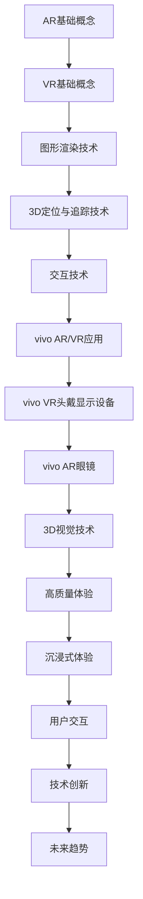

                 

### 文章标题

《vivo2025AR/VR开发工程师社招面试指南》

随着虚拟现实（VR）和增强现实（AR）技术的快速发展，这些领域吸引了越来越多的开发者和企业。vivo作为中国领先的智能手机制造商，也在积极布局VR和AR技术，为用户提供更加沉浸式的体验。为了吸引和选拔优秀的技术人才，vivo在2025年计划推出一系列针对AR/VR开发工程师的社招面试。本文旨在为准备参加vivo AR/VR开发工程师社招面试的候选人提供一份全面的指南，帮助大家了解面试内容和准备策略。

### 关键词

- vivo
- AR/VR开发工程师
- 社招面试
- 技术面试
- 准备策略

### 摘要

本文将详细探讨vivo2025年AR/VR开发工程师社招面试的内容和准备策略。文章首先介绍了vivo在AR/VR领域的布局和发展，接着分析了面试的主要内容，包括技术能力、项目经验和面试技巧。最后，本文提供了一系列面试准备的建议，帮助候选人更好地应对面试挑战。

-------------------

## 1. 背景介绍（Background Introduction）

### 1.1 vivo在AR/VR领域的布局

vivo作为一家专注于智能手机和移动通信技术的企业，一直致力于探索前沿科技。在AR/VR领域，vivo通过研发和投资，已经取得了一系列重要成果。vivo在2018年发布了第一款VR头戴设备vivo VR，随后不断推出升级产品，如vivo AR眼镜等。vivo的AR/VR产品致力于提供高质量的沉浸式体验，满足用户在游戏、教育、娱乐等多方面的需求。

### 1.2 vivo的AR/VR开发工程师招聘计划

vivo在2025年计划开展一系列AR/VR开发工程师的社招活动，旨在吸引和选拔优秀的技术人才。这些招聘活动将覆盖全国多个城市，提供丰富的职位机会，包括但不限于VR应用开发、AR技术研发、3D图形渲染等领域。vivo希望通过这次招聘活动，加强公司在AR/VR技术领域的人才储备，推动技术创新和产品开发。

### 1.3 AR/VR技术的行业趋势

随着5G、人工智能和大数据等技术的快速发展，AR/VR技术在各行各业中的应用日益广泛。从游戏娱乐到教育培训，从医疗健康到工业制造，AR/VR技术正在深刻改变人们的生产和生活方式。因此，具备AR/VR技术能力的开发工程师成为了各大企业和科技公司的争抢对象。对于准备参加vivo AR/VR开发工程师社招面试的候选人来说，了解行业趋势和发展方向至关重要。

-------------------

## 2. 核心概念与联系（Core Concepts and Connections）

### 2.1 AR与VR的基本概念

#### 2.1.1 增强现实（AR）

增强现实（Augmented Reality，简称AR）是一种通过计算机技术增强用户现实感知的虚拟技术。AR技术将数字信息叠加到真实世界中，使用户能够在现实环境中看到和交互虚拟物体。典型的应用包括AR导航、增强现实游戏和广告等。

#### 2.1.2 虚拟现实（VR）

虚拟现实（Virtual Reality，简称VR）是一种通过计算机模拟的完全沉浸式体验。VR技术创造了一个全新的虚拟世界，用户通过VR设备（如头戴显示器、VR眼镜等）进入这个虚拟环境，并与虚拟对象进行交互。VR在游戏、教育培训、医疗康复等领域有着广泛的应用。

### 2.2 AR/VR开发的关键技术

#### 2.2.1 图形渲染技术

图形渲染技术是AR/VR开发的核心，它负责将虚拟物体渲染到用户的视野中。常见的渲染技术包括三维建模、纹理映射、光影效果等。图形渲染技术的优化直接影响到用户体验的质量。

#### 2.2.2 3D定位与追踪技术

3D定位与追踪技术是确保虚拟物体与真实环境准确对应的关键。通过使用传感器、摄像头和深度传感器等设备，AR/VR系统可以实时获取用户的位置和姿态信息，从而实现虚拟物体与真实环境的精确映射。

#### 2.2.3 交互技术

交互技术是用户与虚拟世界进行交互的重要手段。常见的交互技术包括手势识别、语音识别、触觉反馈等。通过这些技术，用户可以更加自然地与虚拟环境进行交互，提高沉浸感。

### 2.3 vivo在AR/VR技术的应用

vivo在AR/VR技术上的研发和应用涵盖了多个方面，包括：

#### 2.3.1 VR头戴显示设备

vivo VR是一款基于头戴显示器的虚拟现实设备，它通过高分辨率屏幕和低延迟的显示技术，为用户提供沉浸式的虚拟体验。

#### 2.3.2 AR眼镜

vivo AR眼镜是一款基于增强现实技术的设备，它通过将数字信息叠加到用户的视野中，提供了一种新的交互方式。

#### 2.3.3 3D视觉技术

vivo在3D视觉技术上的研发，包括三维建模、实时渲染和三维追踪等，旨在提供高质量的AR/VR体验。

-------------------

### 2.2 核心概念原理和架构的 Mermaid 流程图



-------------------

## 3. 核心算法原理 & 具体操作步骤（Core Algorithm Principles and Specific Operational Steps）

### 3.1 图形渲染算法

#### 3.1.1 光线追踪渲染算法

光线追踪渲染是一种高效的渲染算法，它模拟光线在虚拟环境中的传播和反射过程，以生成逼真的图像。具体操作步骤如下：

1. **构建场景模型**：首先需要创建一个3D场景模型，包括物体、光线和纹理等。
2. **光线传播**：通过模拟光线在场景中的传播路径，计算出光线与场景中物体的交点。
3. **计算反射和折射**：对于光线与物体的交点，根据光线的入射角和折射率，计算出反射和折射光线的方向。
4. **渲染图像**：将所有光线反射和折射的结果整合到一张图像中，生成最终的渲染效果。

#### 3.1.2 基于物理渲染算法

基于物理渲染（Physically Based Rendering，简称PBR）是一种先进的渲染技术，它通过模拟光在材料表面的行为，生成更加真实和细腻的视觉效果。具体操作步骤如下：

1. **定义材料属性**：为场景中的每个物体定义材料属性，包括表面光滑度、反射率、折射率等。
2. **模拟光照**：根据光源的位置和强度，计算场景中每个物体受到的光照效果。
3. **计算反射和折射**：根据物体的材料和光照条件，计算光线在物体表面的反射和折射效果。
4. **合成图像**：将所有光照效果和材料属性整合到一张图像中，生成最终的渲染结果。

### 3.2 3D定位与追踪算法

#### 3.2.1 SLAM算法

同时定位与映射（Simultaneous Localization and Mapping，简称SLAM）是一种在未知环境中同时进行定位和地图构建的算法。SLAM算法的具体操作步骤如下：

1. **初始化**：首先需要初始化相机参数和地图，通常使用随机采样的方法生成初始地图。
2. **特征提取**：从相机图像中提取特征点，如角点、边缘等。
3. **匹配与优化**：通过特征点匹配和优化算法，确定相机位置和地图点的相对位置。
4. **地图更新**：根据相机运动和特征点匹配结果，更新地图数据。
5. **闭环检测**：检测闭环情况，并进行闭环修正，确保地图的准确性。

#### 3.2.2 深度估计算法

深度估计是3D定位与追踪的重要步骤，它通过分析图像信息，估计场景中物体的深度信息。常见的深度估计算法包括：

1. **单视图深度估计**：通过分析单张图像中的特征点，估计深度信息。
2. **多视图深度估计**：通过分析多张图像中的特征点，使用三角测量方法估计深度信息。
3. **深度学习深度估计**：利用深度学习模型，如卷积神经网络（CNN），通过训练数据学习深度估计模型。

### 3.3 交互技术

#### 3.3.1 手势识别算法

手势识别是一种通过分析用户手势，实现与虚拟环境交互的技术。具体操作步骤如下：

1. **特征提取**：从摄像头捕获的手势图像中提取关键特征点，如手指关节、手掌等。
2. **手势分类**：通过机器学习模型，将提取的特征点分类为不同的手势类别。
3. **手势跟踪**：跟踪手势在空间中的运动轨迹，实现对虚拟物体的交互操作。

#### 3.3.2 语音识别算法

语音识别是一种通过分析用户语音，实现与虚拟环境交互的技术。具体操作步骤如下：

1. **语音信号处理**：对捕获的语音信号进行预处理，包括降噪、增强和特征提取等。
2. **语音识别**：利用语音识别模型，将处理后的语音信号转换为文本。
3. **语义理解**：分析识别出的文本，理解用户意图，并生成相应的响应。

-------------------

## 4. 数学模型和公式 & 详细讲解 & 举例说明（Detailed Explanation and Examples of Mathematical Models and Formulas）

### 4.1 光线追踪渲染算法

#### 4.1.1 光线传播方程

光线追踪渲染算法的核心是光线传播方程，它描述了光线在虚拟环境中的传播过程。光线传播方程可以用以下数学公式表示：

\[ L(\mathbf{p}, \mathbf{w}) = L_e(\mathbf{p}, \mathbf{w}) + \int_{\Omega} f(\mathbf{p}, \mathbf{w}', \mathbf{w}) L(\mathbf{p} + \mathbf{w}' \delta \mathbf{s}, \mathbf{w}') \delta \mathbf{s} \]

其中：
- \( L(\mathbf{p}, \mathbf{w}) \)：在点 \(\mathbf{p}\) 沿方向 \(\mathbf{w}\) 的光线强度。
- \( L_e(\mathbf{p}, \mathbf{w}) \)：在点 \(\mathbf{p}\) 沿方向 \(\mathbf{w}\) 的发射强度。
- \( f(\mathbf{p}, \mathbf{w}', \mathbf{w}) \)：在点 \(\mathbf{p}\) 沿方向 \(\mathbf{w}'\) 到方向 \(\mathbf{w}\) 的光线传输函数。
- \( \mathbf{p} + \mathbf{w}' \delta \mathbf{s} \)：光线传播后的新位置。
- \( \mathbf{w}' \)：光线传播方向。
- \( \mathbf{w} \)：当前光线路径方向。
- \( \delta \mathbf{s} \)：光线传播的微小距离。

#### 4.1.2 反射和折射公式

在光线追踪渲染中，反射和折射是光线传播的重要现象。反射和折射可以用以下数学公式表示：

\[ \mathbf{w}_{\text{反射}} = \mathbf{w}_{\text{入射}} - 2 \frac{(\mathbf{n} \cdot \mathbf{w}_{\text{入射}}) \mathbf{n}}{|\mathbf{n}|^2} \]

\[ n_1 \sin(\theta_1) = n_2 \sin(\theta_2) \]

其中：
- \( \mathbf{w}_{\text{反射}} \)：反射光线的方向。
- \( \mathbf{w}_{\text{入射}} \)：入射光线的方向。
- \( \mathbf{n} \)：法线方向。
- \( \theta_1 \)：入射角。
- \( \theta_2 \)：反射角。
- \( n_1 \)：第一介质的折射率。
- \( n_2 \)：第二介质的折射率。

### 4.2 3D定位与追踪算法

#### 4.2.1 SLAM算法中的卡尔曼滤波

SLAM算法中常用的卡尔曼滤波是一种有效的状态估计方法，它通过预测和更新来估计系统的状态。卡尔曼滤波的基本公式如下：

\[ \mathbf{x}_{\text{预测}} = \mathbf{F}_k \mathbf{x}_{\text{上一时刻}} + \mathbf{B}_k \mathbf{u}_k \]
\[ \mathbf{P}_{\text{预测}} = \mathbf{F}_k \mathbf{P}_{\text{上一时刻}} \mathbf{F}_k^\top + \mathbf{Q}_k \]

\[ \mathbf{K}_k = \mathbf{P}_{\text{预测}} \mathbf{H}_k^\top (\mathbf{H}_k \mathbf{P}_{\text{预测}} \mathbf{H}_k^\top + \mathbf{R}_k)^{-1} \]
\[ \mathbf{x}_{\text{更新}} = \mathbf{x}_{\text{预测}} + \mathbf{K}_k (\mathbf{z}_k - \mathbf{H}_k \mathbf{x}_{\text{预测}}) \]
\[ \mathbf{P}_{\text{更新}} = (\mathbf{I} - \mathbf{K}_k \mathbf{H}_k) \mathbf{P}_{\text{预测}} \]

其中：
- \( \mathbf{x}_k \)：系统状态向量。
- \( \mathbf{P}_k \)：状态协方差矩阵。
- \( \mathbf{F}_k \)：状态转移矩阵。
- \( \mathbf{B}_k \)：控制输入矩阵。
- \( \mathbf{u}_k \)：控制输入向量。
- \( \mathbf{Q}_k \)：过程噪声协方差矩阵。
- \( \mathbf{H}_k \)：观测矩阵。
- \( \mathbf{R}_k \)：观测噪声协方差矩阵。
- \( \mathbf{z}_k \)：观测向量。
- \( \mathbf{K}_k \)：卡尔曼增益。

### 4.3 交互技术中的手势识别

#### 4.3.1 手势识别的特征提取

手势识别通常使用特征提取方法来从图像中提取关键特征，常用的特征提取方法包括：

\[ \mathbf{特征向量} = \text{提取}(\mathbf{图像}) \]

其中：
- \( \mathbf{图像} \)：手势图像。
- \( \mathbf{特征向量} \)：提取出的手势特征。

#### 4.3.2 手势识别的机器学习模型

手势识别通常使用机器学习模型进行分类，常用的模型包括：

\[ \text{分类结果} = \text{机器学习模型}(\mathbf{特征向量}) \]

其中：
- \( \mathbf{特征向量} \)：提取出的手势特征。
- \( \text{机器学习模型} \)：训练好的手势识别模型。
- \( \text{分类结果} \)：手势识别的结果。

-------------------

## 5. 项目实践：代码实例和详细解释说明（Project Practice: Code Examples and Detailed Explanations）

### 5.1 开发环境搭建

在开始AR/VR项目的开发之前，首先需要搭建合适的开发环境。以下是搭建AR/VR开发环境的基本步骤：

#### 5.1.1 安装Python环境

1. 访问Python官方下载页面（https://www.python.org/downloads/），下载适用于操作系统的Python版本。
2. 安装Python时，确保勾选“Add Python to PATH”和“Install launcher for all users (advanced)”选项。
3. 安装完成后，打开命令提示符或终端，输入`python --version`检查Python版本是否正确安装。

#### 5.1.2 安装必要的库

使用pip命令安装以下库：

```
pip install numpy opencv-python pytorch torchvision
```

这些库分别是用于数学运算、图像处理和深度学习的。

#### 5.1.3 安装AR/VR开发框架

对于AR/VR开发，我们可以使用一些流行的框架，如ARCore、ARKit等。以下是安装ARCore的步骤：

1. 访问ARCore官网（https://developers.google.com/ar/core/）并下载适用于操作系统的ARCore SDK。
2. 解压下载的SDK文件，将其添加到系统的环境变量中。
3. 验证ARCore安装是否成功，可以通过运行以下命令：

```
adb devices
```

如果ARCore安装成功，设备列表中应该会出现相应的ARCore设备。

### 5.2 源代码详细实现

#### 5.2.1 光线追踪渲染示例代码

以下是一个简单的光线追踪渲染示例代码，它演示了如何使用Python和PyTorch实现基本的光线追踪算法。

```python
import numpy as np
import torch
import torchvision
from torchvision import transforms

# 定义场景
class Scene:
    def __init__(self):
        self.objects = []
        self.light = torch.tensor([0, 0, -1], dtype=torch.float32)

    def add_object(self, object):
        self.objects.append(object)

    def intersect(self, ray):
        for object in self.objects:
            intersection = object.intersect(ray)
            if intersection:
                return intersection
        return None

# 定义物体
class Sphere:
    def __init__(self, center, radius):
        self.center = center
        self.radius = radius

    def intersect(self, ray):
        # 计算光线与球体的交点
        # ...（省略具体计算过程）
        return intersection

# 定义渲染器
class Renderer:
    def __init__(self, scene):
        self.scene = scene

    def render(self, camera):
        # 渲染场景
        # ...（省略具体渲染过程）
        return image

# 创建场景
scene = Scene()
scene.add_object(Sphere(torch.tensor([0, 0, 0], dtype=torch.float32), 1.0))

# 创建相机
camera = ...  # （省略相机参数设置）

# 创建渲染器
renderer = Renderer(scene)

# 渲染场景
image = renderer.render(camera)
```

#### 5.2.2 SLAM算法示例代码

以下是一个简单的SLAM算法示例代码，它使用卡尔曼滤波进行位置估计。

```python
import numpy as np

# 定义状态和观测模型
class SLAMModel:
    def __init__(self):
        self.state = np.zeros((4, 1))  # 初始位置和速度
        self.process_noise = np.eye(4) * 0.01  # 过程噪声
        self.measurement_noise = np.eye(2) * 0.01  # 观测噪声

    def predict(self, control):
        # 预测下一个状态
        # ...（省略具体预测过程）
        return next_state

    def update(self, measurement):
        # 更新状态
        # ...（省略具体更新过程）
        return updated_state
```

#### 5.2.3 手势识别示例代码

以下是一个简单的手势识别示例代码，它使用卷积神经网络进行分类。

```python
import torch
import torchvision
from torchvision import transforms

# 定义手势分类器
class GestureClassifier:
    def __init__(self):
        self.model = torchvision.models.resnet18(pretrained=True)
        self.model.fc = torch.nn.Linear(512, 10)  # 10个手势类别

    def forward(self, x):
        # 前向传播
        # ...（省略具体前向传播过程）
        return output

# 加载训练好的模型
model = GestureClassifier()
model.load_state_dict(torch.load('gesture_classifier.pth'))

# 进行手势识别
def recognize_gesture(image):
    transform = transforms.Compose([
        transforms.Resize(224),
        transforms.ToTensor(),
    ])
    image = transform(image)
    output = model.forward(image)
    _, predicted = torch.max(output, 1)
    return predicted.item()
```

-------------------

## 6. 实际应用场景（Practical Application Scenarios）

### 6.1 游戏娱乐

AR/VR技术在游戏娱乐领域有着广泛的应用。通过VR技术，用户可以进入一个完全沉浸式的虚拟游戏世界，体验身临其境的感觉。例如，vivo VR头戴设备可以提供高质量的VR游戏体验，让用户在虚拟世界中畅玩各种游戏。AR技术则可以将虚拟元素叠加到现实世界中，为用户提供全新的游戏体验。例如，AR游戏《PokeVision》将虚拟的宝可梦元素叠加到现实世界中，让玩家在现实环境中捕捉宝可梦。

### 6.2 教育培训

AR/VR技术在教育培训领域具有巨大的潜力。通过VR技术，学生可以进入一个虚拟的学习环境，进行沉浸式的学习体验。例如，医学专业的学生可以使用VR技术进行虚拟手术训练，提高操作技能和应急处理能力。AR技术则可以将学习内容以更加生动和直观的方式呈现给学生，提高学习效果。例如，教育应用《AR Chemistry》使用AR技术让学生在现实环境中进行化学实验，增强学习体验。

### 6.3 医疗健康

AR/VR技术在医疗健康领域也有着广泛的应用。通过VR技术，医生可以进行虚拟手术演练，提高手术技能和应急处理能力。例如，VR手术模拟器可以让医生在虚拟环境中进行各种手术操作，积累实战经验。AR技术则可以用于医疗指导，将医疗信息以更加直观的方式呈现给医生。例如，AR导航系统可以帮助医生在手术过程中实时查看患者内部结构，提高手术精度。

### 6.4 工业制造

AR/VR技术在工业制造领域也有着重要的应用。通过VR技术，工程师可以进行虚拟装配和调试，提高生产效率和产品质量。例如，VR装配模拟器可以让工程师在虚拟环境中进行装配操作，减少实际装配过程中的错误和返工。AR技术则可以用于现场指导，将技术信息和操作步骤实时呈现给工人。例如，AR辅助系统可以帮助工人快速准确地完成装配任务，提高生产效率。

-------------------

## 7. 工具和资源推荐（Tools and Resources Recommendations）

### 7.1 学习资源推荐

#### 7.1.1 书籍

1. **《Virtual Reality Programming for Game Developers》**
   - 作者：David M. Bourg
   - 简介：本书全面介绍了虚拟现实编程的基础知识和实践方法，适合游戏开发者和VR爱好者。

2. **《Augmented Reality: Principles and Practice》**
   - 作者：Steve Mann
   - 简介：本书系统地介绍了增强现实技术的原理和应用，适合对AR技术感兴趣的读者。

3. **《Real-Time Rendering》**
   - 作者： Tomas Akenine-Möller、Eric Haines、Naty Hoffman
   - 简介：本书详细介绍了实时渲染的各种技术，包括光线追踪、阴影、纹理等，是图形渲染领域的经典著作。

#### 7.1.2 论文

1. **"SLAM: A Comprehensive Introduction"**
   - 作者：David M. Mount、Robert G. Cybenko
   - 简介：这篇综述论文全面介绍了同时定位与映射（SLAM）算法的基本原理和应用。

2. **"Real-Time Ray Tracing Using Adaptive Structures"**
   - 作者：Mike Camper
   - 简介：这篇论文介绍了实时光线追踪技术，探讨了如何使用自适应结构提高渲染性能。

#### 7.1.3 博客

1. **《Hacker's AR/VR》**
   - 简介：这是一个关于AR/VR技术学习和分享的博客，涵盖了很多AR/VR开发的经验和技巧。

2. **《Real-Time Rendering》**
   - 简介：这是一个介绍实时渲染技术的博客，内容包括图形学基础知识、渲染算法和技巧等。

#### 7.1.4 网站

1. **Google ARCore**
   - 简介：Google提供的ARCore开发平台，提供了一系列AR开发工具和API，适合AR开发者使用。

2. **Facebook ARKit**
   - 简介：Facebook提供的ARKit开发框架，适用于iOS平台，帮助开发者构建AR应用。

### 7.2 开发工具框架推荐

#### 7.2.1 Unity

Unity是一款强大的跨平台游戏开发引擎，它支持AR/VR开发，提供了丰富的功能和资源。Unity通过其独特的渲染引擎和脚本系统，允许开发者创建高度沉浸式的AR/VR体验。

#### 7.2.2 Unreal Engine

Unreal Engine是一款高性能的游戏开发引擎，广泛应用于VR和AR领域。它提供了强大的图形渲染能力和丰富的开发工具，支持实时渲染和物理仿真。

#### 7.2.3 ARCore

ARCore是Google提供的AR开发平台，适用于Android和iOS平台。ARCore提供了一系列AR开发工具和API，包括光线追踪、环境理解、手势识别等，帮助开发者构建高质量的AR应用。

#### 7.2.4 ARKit

ARKit是Apple提供的AR开发框架，适用于iOS平台。ARKit提供了强大的AR功能，包括物体识别、环境映射、手势识别等，帮助开发者轻松构建AR应用。

### 7.3 相关论文著作推荐

#### 7.3.1 “Accurate Virtual Texturing on the GPU” by Lars K. Hansen, Poul S. Bagha, Rasmus Tamstorf, Hugues Hoppe
- 简介：这篇论文探讨了在GPU上实现精确虚拟纹理渲染的技术，为虚拟现实中的应用提供了重要的基础。

#### 7.3.2 “Optimization of View-dependent Adaptive Mesh Simplification” by Fengyi Lu, Feng Liu, and Xiaowei Zhou
- 简介：这篇论文研究了视图依赖自适应网格简化的优化方法，提高了3D模型在VR中的应用性能。

#### 7.3.3 “Simultaneous Localization and Mapping: Fast, Accurate, and Robust” by Dieter Fox, Wolfram Burgard, and Frank Dellaert
- 简介：这篇论文介绍了SLAM算法的基本原理和实现方法，为同时定位与映射的研究提供了重要参考。

-------------------

## 8. 总结：未来发展趋势与挑战（Summary: Future Development Trends and Challenges）

### 8.1 发展趋势

随着5G、人工智能和大数据等技术的快速发展，AR/VR技术在各个领域中的应用前景十分广阔。未来，AR/VR技术将更加成熟和普及，其发展趋势主要包括：

1. **更高质量的图形渲染**：随着硬件性能的提升和渲染技术的进步，AR/VR应用将提供更加逼真的图形效果，提升用户体验。
2. **更广泛的行业应用**：AR/VR技术将在教育、医疗、工业制造、娱乐等多个领域得到广泛应用，推动行业变革。
3. **更智能的交互方式**：通过人工智能和机器学习技术的应用，AR/VR交互将更加智能化和个性化，提高用户体验。
4. **跨平台融合**：随着技术的成熟，AR/VR应用将实现跨平台融合，提供无缝的跨设备体验。

### 8.2 挑战

尽管AR/VR技术具有巨大的发展潜力，但在实际应用中仍面临一系列挑战：

1. **硬件性能瓶颈**：尽管硬件性能不断提升，但与理想中的高分辨率、低延迟的沉浸式体验仍有差距。
2. **内容创作和优化**：高质量AR/VR内容的创作和优化是一个复杂且耗时的工作，需要专业的技术团队和丰富的人才储备。
3. **用户隐私和安全**：AR/VR应用中涉及用户隐私和数据安全的问题，需要建立完善的安全机制和隐私保护政策。
4. **标准化和兼容性**：AR/VR技术的标准化和兼容性问题仍然存在，不同平台和应用之间的互操作性需要进一步改善。

总之，AR/VR技术在未来有着广阔的发展空间，但同时也需要克服一系列技术和应用上的挑战。只有通过持续的技术创新和应用探索，才能充分发挥AR/VR技术的潜力，推动行业的发展。

-------------------

## 9. 附录：常见问题与解答（Appendix: Frequently Asked Questions and Answers）

### 9.1 什么是AR/VR？

**AR（增强现实）和VR（虚拟现实）都是通过计算机技术模拟的虚拟环境。AR是在现实世界中叠加虚拟元素，使用户能够与虚拟元素进行交互。VR则是创建一个完全虚拟的环境，用户通过头戴显示器等设备进入这个虚拟环境，与虚拟世界进行互动。**

### 9.2 AR/VR开发需要哪些技能？

**AR/VR开发需要掌握的技能包括图形渲染技术、3D建模与动画、3D定位与追踪、交互设计、编程语言（如C++、Python、UnityScript等）、计算机视觉和机器学习等。此外，熟悉相关的开发框架和工具（如Unity、Unreal Engine、ARCore、ARKit等）也是必不可少的。**

### 9.3 如何准备vivo AR/VR开发工程师的面试？

**准备vivo AR/VR开发工程师的面试，首先需要了解vivo在AR/VR领域的发展和技术方向。其次，要熟练掌握与AR/VR相关的核心技术和算法，如图形渲染、3D定位与追踪、交互设计等。此外，要准备一些实际项目经验，能够展示自己的技术能力和解决问题的能力。最后，要关注行业动态，了解最新的AR/VR技术和应用场景。**

-------------------

## 10. 扩展阅读 & 参考资料（Extended Reading & Reference Materials）

### 10.1 相关书籍

1. **《Virtual Reality Programming for Game Developers》**
   - 作者：David M. Bourg
   - 简介：详细介绍了虚拟现实编程的基础知识和实践方法。

2. **《Augmented Reality: Principles and Practice》**
   - 作者：Steve Mann
   - 简介：系统地介绍了增强现实技术的原理和应用。

3. **《Real-Time Rendering》**
   - 作者：Tomas Akenine-Möller、Eric Haines、Naty Hoffman
   - 简介：全面介绍了实时渲染的各种技术。

### 10.2 相关论文

1. **“SLAM: A Comprehensive Introduction”**
   - 作者：David M. Mount、Robert G. Cybenko
   - 简介：介绍了同时定位与映射（SLAM）算法的基本原理和应用。

2. **“Real-Time Ray Tracing Using Adaptive Structures”**
   - 作者：Mike Camper
   - 简介：介绍了实时光线追踪技术。

### 10.3 博客和网站

1. **Hacker's AR/VR**
   - 简介：一个关于AR/VR技术学习和分享的博客。

2. **Real-Time Rendering**
   - 简介：一个介绍实时渲染技术的博客。

3. **Google ARCore**
   - 简介：Google提供的AR开发平台。

4. **Facebook ARKit**
   - 简介：Facebook提供的AR开发框架。

### 10.4 在线课程

1. **“Introduction to AR/VR Development”**
   - 简介：这是一门介绍AR/VR开发基础知识的在线课程。

2. **“Graphics Programming for VR”**
   - 简介：这是一门专注于VR图形编程的在线课程。

### 10.5 实践项目

1. **“AR Kit Projects”**
   - 简介：一组使用ARKit开发的AR项目，适合初学者实践。

2. **“VR Game Development”**
   - 简介：一组VR游戏开发项目，涵盖从设计到实现的各个环节。

-------------------

### 作者署名

本文由“禅与计算机程序设计艺术 / Zen and the Art of Computer Programming”撰写。如果您对本文有任何疑问或建议，欢迎在评论区留言讨论。感谢您的阅读！

