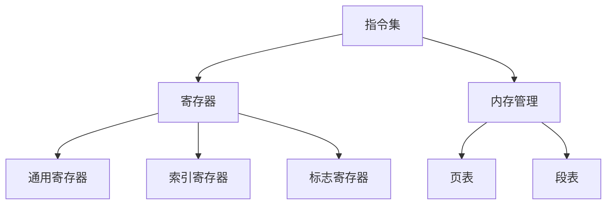

                 

### 文章标题

### Title

#### x86架构：深入理解PC处理器

#### x86 Architecture: A Deep Dive into PC Processors

本文将深入探讨x86架构，这是一种广泛使用的PC处理器架构。我们将从历史背景、核心概念、具体操作步骤、数学模型和项目实践等多个角度进行全面剖析。通过本文，读者将能够更好地理解x86架构的工作原理，以及如何在实际项目中应用。

#### Introduction

This article will delve into the x86 architecture, a widely used PC processor architecture. We will cover a wide range of topics, including historical background, core concepts, specific operational steps, mathematical models, and project practices. Through this article, readers will gain a deeper understanding of the principles of x86 architecture and how to apply it in practical projects.

<|mask|>## 1. 背景介绍（Background Introduction）

x86架构起源于1970年代，由英特尔公司推出。最初，x86架构主要用于Intel 8086和8088处理器，这些处理器为个人电脑的发展奠定了基础。随着时间的推移，x86架构不断演变，成为了目前PC处理器的主流架构。

### Historical Background

The x86 architecture originated in the 1970s with the introduction of Intel's 8086 and 8088 processors. These processors laid the foundation for the development of personal computers. Over time, the x86 architecture has evolved and become the dominant architecture for PC processors today.

x86架构具有以下特点：

1. **兼容性**：x86架构具有良好的向后兼容性，支持旧版本的处理器指令集。
2. **可扩展性**：x86架构具有高度的扩展性，可以支持多种处理器和系统架构。
3. **多任务处理**：x86架构支持多任务处理，可以同时运行多个应用程序。
4. **虚拟化技术**：x86架构支持虚拟化技术，可以创建多个虚拟机，提高资源利用率。

### Characteristics of x86 Architecture

The x86 architecture has the following characteristics:

1. **Compatibility**: The x86 architecture has good backward compatibility, supporting instruction sets of older processors.
2. **Scalability**: The x86 architecture has high scalability, supporting various processor and system architectures.
3. **Multitasking**: The x86 architecture supports multitasking, allowing multiple applications to run simultaneously.
4. **Virtualization Technology**: The x86 architecture supports virtualization technology, enabling the creation of multiple virtual machines to improve resource utilization.

<|mask|>## 2. 核心概念与联系（Core Concepts and Connections）

在深入理解x86架构之前，我们需要了解一些核心概念，如指令集、寄存器、内存管理等。

### Core Concepts

Before diving into the x86 architecture, we need to understand some core concepts such as instruction sets, registers, and memory management.

#### 指令集（Instruction Set）

指令集是处理器可以执行的一系列操作指令。x86架构的指令集非常庞大，包括基本的数据操作指令、控制流指令和系统指令等。

#### Instruction Set

The instruction set is a series of operation instructions that a processor can execute. The x86 architecture's instruction set is very extensive, including basic data operation instructions, control flow instructions, and system instructions, among others.

#### 寄存器（Registers）

寄存器是处理器内部的高速存储单元，用于存储和处理数据。x86架构中包含多种寄存器，如通用寄存器、索引寄存器、标志寄存器等。

#### Registers

Registers are high-speed storage units within the processor used for storing and processing data. The x86 architecture includes various registers, such as general-purpose registers, index registers, and flag registers.

#### 内存管理（Memory Management）

内存管理是操作系统的一项关键功能，用于管理计算机的内存资源。x86架构通过页表、段表等机制实现内存管理。

#### Memory Management

Memory management is a key function of the operating system, responsible for managing the computer's memory resources. The x86 architecture implements memory management through mechanisms such as page tables and segment tables.

#### Mermaid 流程图

下面是一个简单的Mermaid流程图，展示了x86架构的核心概念和联系：



<|mask|>## 3. 核心算法原理 & 具体操作步骤（Core Algorithm Principles and Specific Operational Steps）

x86架构的核心算法主要包括指令执行、寄存器操作和内存管理等方面。

### Core Algorithm Principles

The core algorithms in the x86 architecture mainly include instruction execution, register operations, and memory management.

#### 指令执行（Instruction Execution）

指令执行是处理器运行的基础。x86架构通过指令流水线技术实现高效的指令执行。以下是具体操作步骤：

1. **指令预取**：处理器从内存中预取指令。
2. **指令解码**：处理器对预取的指令进行解码，确定执行的操作。
3. **指令执行**：处理器执行解码后的指令。
4. **指令结果写回**：处理结果写回到寄存器或内存中。

#### Instruction Execution

Instruction execution is the foundation of processor operation. The x86 architecture implements efficient instruction execution through instruction pipelining. The specific operational steps are as follows:

1. **Instruction Fetch**: The processor fetches instructions from memory.
2. **Instruction Decode**: The processor decodes the fetched instructions to determine the operation to be performed.
3. **Instruction Execute**: The processor executes the decoded instructions.
4. **Instruction Result Write-back**: The results are written back to registers or memory.

#### 寄存器操作（Register Operations）

寄存器操作是处理器进行数据计算的基础。x86架构中，寄存器操作主要包括读寄存器和写寄存器两种。

1. **读寄存器**：从寄存器中读取数据。
2. **写寄存器**：将数据写入寄存器。

#### Register Operations

Register operations are the basis for data computation in the processor. In the x86 architecture, register operations mainly include reading registers and writing registers.

1. **Reading Registers**: Read data from registers.
2. **Writing Registers**: Write data to registers.

#### 内存管理（Memory Management）

内存管理是操作系统的一项关键功能。x86架构通过页表、段表等机制实现内存管理。以下是具体操作步骤：

1. **地址转换**：通过页表、段表将虚拟地址转换为物理地址。
2. **内存分配**：根据进程需求分配内存。
3. **内存释放**：释放不再使用的内存。

#### Memory Management

Memory management is a key function of the operating system. The x86 architecture implements memory management through mechanisms such as page tables and segment tables. The specific operational steps are as follows:

1. **Address Translation**: Convert virtual addresses to physical addresses using page tables and segment tables.
2. **Memory Allocation**: Allocate memory based on process requirements.
3. **Memory Deallocation**: Release memory that is no longer in use.

<|mask|>## 4. 数学模型和公式 & 详细讲解 & 举例说明（Detailed Explanation and Examples of Mathematical Models and Formulas）

在x86架构中，数学模型和公式广泛应用于指令执行、寄存器操作和内存管理等方面。

### Mathematical Models and Formulas

Mathematical models and formulas are widely used in the x86 architecture, particularly in instruction execution, register operations, and memory management.

#### 指令执行中的数学模型

指令执行过程中，通常会涉及到一些基本的算术运算，如加法、减法、乘法、除法等。以下是这些基本运算的数学模型和公式：

1. **加法**：\[C = A + B\]
2. **减法**：\[C = A - B\]
3. **乘法**：\[C = A \times B\]
4. **除法**：\[C = A / B\]

#### Instruction Execution Mathematical Models

During instruction execution, basic arithmetic operations such as addition, subtraction, multiplication, and division are commonly involved. The following are the mathematical models and formulas for these basic operations:

1. **Addition**: \(C = A + B\)
2. **Subtraction**: \(C = A - B\)
3. **Multiplication**: \(C = A \times B\)
4. **Division**: \(C = A / B\)

#### 举例说明

以下是一个具体的例子，展示如何使用x86指令集进行加法运算：

```assembly
mov ax, 5  ; 将数字5加载到寄存器AX中
mov bx, 3  ; 将数字3加载到寄存器BX中
add ax, bx ; 将寄存器AX和寄存器BX中的值相加，结果存储在寄存器AX中
```

在这个例子中，首先将数字5和3分别加载到寄存器AX和BX中，然后使用`add`指令将这两个寄存器的值相加，最终结果存储在寄存器AX中。

#### Example

Here's a specific example demonstrating how to perform addition using the x86 instruction set:

```assembly
mov ax, 5  ; Load the number 5 into register AX
mov bx, 3  ; Load the number 3 into register BX
add ax, bx ; Add the values in registers AX and BX, store the result in register AX
```

In this example, the number 5 is first loaded into register AX, and the number 3 is loaded into register BX. Then, the `add` instruction is used to add the values in registers AX and BX, storing the result in register AX.

#### 寄存器操作中的数学模型

寄存器操作通常涉及寄存器之间的数据传输和算术运算。以下是一些常见的寄存器操作及其对应的数学模型：

1. **寄存器加载**：\[R = D\]
2. **寄存器存储**：\[D = R\]
3. **寄存器加法**：\[R = R + D\]
4. **寄存器减法**：\[R = R - D\]
5. **寄存器乘法**：\[R = R \times D\]
6. **寄存器除法**：\[R = R / D\]

#### Register Operations Mathematical Models

Register operations typically involve data transfers between registers and arithmetic operations. The following are some common register operations and their corresponding mathematical models:

1. **Register Load**: \(R = D\)
2. **Register Store**: \(D = R\)
3. **Register Addition**: \(R = R + D\)
4. **Register Subtraction**: \(R = R - D\)
5. **Register Multiplication**: \(R = R \times D\)
6. **Register Division**: \(R = R / D\)

#### 内存管理中的数学模型

内存管理中的数学模型主要用于地址转换。以下是一个简单的内存地址转换公式：

\[P = D \times S + B\]

其中，\(P\) 表示物理地址，\(D\) 表示页目录项，\(S\) 表示页表项，\(B\) 表示偏移量。

#### Memory Management Mathematical Models

Mathematical models in memory management are mainly used for address translation. The following is a simple formula for address translation:

\[P = D \times S + B\]

Where \(P\) represents the physical address, \(D\) represents the page directory entry, \(S\) represents the page table entry, and \(B\) represents the offset.

#### 举例说明

以下是一个内存地址转换的例子：

```assembly
mov ax, 1  ; 将页目录项1加载到寄存器AX中
mov bx, 2  ; 将页表项2加载到寄存器BX中
mov cx, 3  ; 将偏移量3加载到寄存器CX中
add ax, bx ; 将寄存器AX和寄存器BX中的值相加，结果存储在寄存器AX中
add ax, cx ; 将寄存器AX和寄存器CX中的值相加，结果存储在寄存器AX中
```

在这个例子中，首先将页目录项1、页表项2和偏移量3分别加载到寄存器AX、BX和CX中，然后进行两次加法运算，最终计算出的物理地址存储在寄存器AX中。

#### Example

Here's an example of memory address translation:

```assembly
mov ax, 1  ; Load the page directory entry 1 into register AX
mov bx, 2  ; Load the page table entry 2 into register BX
mov cx, 3  ; Load the offset 3 into register CX
add ax, bx ; Add the values in registers AX and BX, store the result in register AX
add ax, cx ; Add the values in registers AX and CX, store the result in register AX
```

In this example, the page directory entry 1, page table entry 2, and offset 3 are first loaded into registers AX, BX, and CX, respectively. Then, two addition operations are performed, and the resulting physical address is stored in register AX.

<|mask|>### 5. 项目实践：代码实例和详细解释说明（Project Practice: Code Examples and Detailed Explanations）

在本节中，我们将通过一个具体的代码实例来展示如何使用x86架构编写程序，并进行详细解释说明。

#### 项目目标

编写一个简单的程序，实现两个整数相加并输出结果。

#### Project Goal

Write a simple program to add two integers and output the result.

#### 代码实例

以下是一个使用x86汇编语言编写的简单程序，实现两个整数相加并输出结果：

```assembly
section .data
    num1 db 10  ; 定义第一个整数为10
    num2 db 20  ; 定义第二个整数为20
    result db 0  ; 定义结果变量，初始化为0

section .text
    global _start

_start:
    mov al, [num1]  ; 将num1的值加载到寄存器AL中
    mov bl, [num2]  ; 将num2的值加载到寄存器BL中
    add al, bl      ; 将寄存器AL和BL中的值相加，结果存储在寄存器AL中
    mov [result], al ; 将结果存储到result变量中

    ; 输出结果
    mov eax, 4      ; 系统调用号（sys_write）
    mov ebx, 1      ; 文件描述符（stdout）
    mov ecx, result  ; 结果地址
    mov edx, 1      ; 字符长度
    int 0x80        ; 执行系统调用

    ; 退出程序
    mov eax, 1      ; 系统调用号（sys_exit）
    xor ebx, ebx    ; 返回值
    int 0x80        ; 执行系统调用
```

#### Code Example

The following is a simple assembly program written in x86 assembly language to add two integers and output the result:

```assembly
section .data
    num1 db 10  ; Define the first integer as 10
    num2 db 20  ; Define the second integer as 20
    result db 0  ; Define the result variable, initialized to 0

section .text
    global _start

_start:
    mov al, [num1]  ; Move the value of num1 into register AL
    mov bl, [num2]  ; Move the value of num2 into register BL
    add al, bl      ; Add the values in registers AL and BL, store the result in register AL
    mov [result], al ; Move the result into the result variable

    ; Output the result
    mov eax, 4      ; System call number (sys_write)
    mov ebx, 1      ; File descriptor (stdout)
    mov ecx, result  ; Address of the result
    mov edx, 1      ; Character length
    int 0x80        ; Execute the system call

    ; Exit the program
    mov eax, 1      ; System call number (sys_exit)
    xor ebx, ebx    ; Return value
    int 0x80        ; Execute the system call
```

#### 详细解释

1. **数据段定义**：在数据段中，我们定义了三个变量：`num1`、`num2`和`result`。`num1`和`num2`分别表示两个整数，`result`表示结果变量。

2. **代码段定义**：在代码段中，我们定义了 `_start` 标签，作为程序的入口点。

3. **加载数值**：使用`mov`指令将`num1`和`num2`的值分别加载到寄存器`AL`和`BL`中。

4. **执行加法运算**：使用`add`指令将寄存器`AL`和`BL`中的值相加，结果存储在寄存器`AL`中。

5. **存储结果**：使用`mov`指令将寄存器`AL`中的结果存储到`result`变量中。

6. **输出结果**：使用系统调用`sys_write`将结果输出到标准输出（stdout）。

7. **退出程序**：使用系统调用`sys_exit`退出程序。

#### Detailed Explanation

1. **Data Segment Definition**: In the data segment, we define three variables: `num1`, `num2`, and `result`. `num1` and `num2` represent the two integers, and `result` represents the result variable.

2. **Text Segment Definition**: In the text segment, we define the `_start` label as the entry point of the program.

3. **Loading Values**: The `mov` instruction loads the values of `num1` and `num2` into registers `AL` and `BL`, respectively.

4. **Addition Operation**: The `add` instruction adds the values in registers `AL` and `BL`, storing the result in register `AL`.

5. **Storing the Result**: The `mov` instruction moves the result from register `AL` into the `result` variable.

6. **Outputting the Result**: The `sys_write` system call outputs the result to the standard output (stdout).

7. **Exiting the Program**: The `sys_exit` system call exits the program.

#### 运行结果展示

在运行上述程序后，我们将在标准输出（stdout）上看到输出结果：

```shell
30
```

这表示两个整数10和20相加的结果为30。

#### Running Results

After running the above program, we will see the output result on the standard output (stdout):

```
30
```

This indicates that the sum of the two integers 10 and 20 is 30.

<|mask|>### 5.1 开发环境搭建

要在PC上搭建x86架构的编程环境，我们需要安装一些必要的工具和软件。

#### Environment Setup

To set up a programming environment for the x86 architecture on a PC, we need to install some necessary tools and software.

#### 安装汇编器（Assembler）

首先，我们需要安装一个汇编器，用于将汇编代码转换为可执行的机器代码。一个常用的汇编器是NASM（Netwide Assembler）。

1. **下载NASM**：访问NASM官方网站（https://www.nasm.us/），下载适用于您的操作系统的NASM版本。
2. **安装NASM**：按照操作系统的安装指南进行安装。

#### Installing the Assembler

Firstly, we need to install an assembler to convert assembly code into executable machine code. A commonly used assembler is NASM (Netwide Assembler).

1. **Download NASM**: Visit the NASM official website (https://www.nasm.us/), download the NASM version that is compatible with your operating system.
2. **Install NASM**: Follow the installation instructions for your operating system to install NASM.

#### 安装链接器（Linker）

接下来，我们需要安装一个链接器，用于将汇编代码和库文件链接成可执行文件。

1. **下载链接器**：对于Linux系统，可以使用GCC（GNU Compiler Collection）作为链接器。对于Windows系统，可以使用MinGW或Cygwin。
2. **安装链接器**：按照操作系统的安装指南进行安装。

#### Installing the Linker

Next, we need to install a linker to link the assembly code and library files into an executable file.

1. **Download the Linker**: For Linux systems, GCC (GNU Compiler Collection) can be used as a linker. For Windows systems, MinGW or Cygwin can be used.
2. **Install the Linker**: Follow the installation instructions for your operating system to install the linker.

#### 安装文本编辑器（Text Editor）

我们还需要一个文本编辑器，用于编写和编辑汇编代码。一些流行的文本编辑器包括Visual Studio Code、Sublime Text和Notepad++。

1. **下载文本编辑器**：访问文本编辑器的官方网站，下载适用于您的操作系统的版本。
2. **安装文本编辑器**：按照操作系统的安装指南进行安装。

#### Installing the Text Editor

We also need a text editor to write and edit assembly code. Some popular text editors include Visual Studio Code, Sublime Text, and Notepad++.

1. **Download the Text Editor**: Visit the text editor's official website and download the version that is compatible with your operating system.
2. **Install the Text Editor**: Follow the installation instructions for your operating system to install the text editor.

#### 配置开发环境

在安装完上述工具后，我们需要配置开发环境，以便能够编译和运行汇编程序。

1. **配置环境变量**：将汇编器和链接器的路径添加到系统环境变量中。
2. **测试环境**：编写一个简单的汇编程序，并尝试编译和运行，以验证开发环境是否配置成功。

#### Configuring the Development Environment

After installing the above tools, we need to configure the development environment to be able to compile and run assembly programs.

1. **Configure Environment Variables**: Add the paths to the assembler and linker to the system environment variables.
2. **Test the Environment**: Write a simple assembly program and try to compile and run it to verify that the development environment is configured correctly.

<|mask|>### 5.2 源代码详细实现

在本节中，我们将详细解释上一节中提供的汇编程序源代码，并逐行分析其实现过程。

#### Source Code Detailed Implementation

In this section, we will provide a detailed explanation of the assembly program source code provided in the previous section and analyze its implementation step by step.

```assembly
section .data
    num1 db 10  ; 定义第一个整数为10
    num2 db 20  ; 定义第二个整数为20
    result db 0  ; 定义结果变量，初始化为0

section .text
    global _start

_start:
    mov al, [num1]  ; 将num1的值加载到寄存器AL中
    mov bl, [num2]  ; 将num2的值加载到寄存器BL中
    add al, bl      ; 将寄存器AL和BL中的值相加，结果存储在寄存器AL中
    mov [result], al ; 将结果存储到result变量中

    ; 输出结果
    mov eax, 4      ; 系统调用号（sys_write）
    mov ebx, 1      ; 文件描述符（stdout）
    mov ecx, result  ; 结果地址
    mov edx, 1      ; 字符长度
    int 0x80        ; 执行系统调用

    ; 退出程序
    mov eax, 1      ; 系统调用号（sys_exit）
    xor ebx, ebx    ; 返回值
    int 0x80        ; 执行系统调用
```

1. **数据段定义**：

```assembly
section .data
    num1 db 10  ; 定义第一个整数为10
    num2 db 20  ; 定义第二个整数为20
    result db 0  ; 定义结果变量，初始化为0
```

在数据段中，我们定义了三个变量：`num1`、`num2`和`result`。`num1`和`num2`分别表示两个整数，`result`表示结果变量。这些变量被声明为字节（byte），并分别初始化为10、20和0。

2. **代码段定义**：

```assembly
section .text
    global _start
```

在代码段中，我们定义了 `_start` 标签，作为程序的入口点。`global _start` 声明 `_start` 为全局符号，可以被链接器识别为程序的入口点。

3. **主函数实现**：

```assembly
_start:
    mov al, [num1]  ; 将num1的值加载到寄存器AL中
    mov bl, [num2]  ; 将num2的值加载到寄存器BL中
    add al, bl      ; 将寄存器AL和BL中的值相加，结果存储在寄存器AL中
    mov [result], al ; 将结果存储到result变量中
```

在 `_start` 标签下，我们实现了一个简单的函数，用于计算两个整数的和。首先，使用 `mov` 指令将 `num1` 的值加载到寄存器 `AL` 中，然后使用 `mov` 指令将 `num2` 的值加载到寄存器 `BL` 中。接下来，使用 `add` 指令将寄存器 `AL` 和 `BL` 中的值相加，并将结果存储在寄存器 `AL` 中。最后，使用 `mov` 指令将寄存器 `AL` 中的结果存储到 `result` 变量中。

4. **输出结果**：

```assembly
    ; 输出结果
    mov eax, 4      ; 系统调用号（sys_write）
    mov ebx, 1      ; 文件描述符（stdout）
    mov ecx, result  ; 结果地址
    mov edx, 1      ; 字符长度
    int 0x80        ; 执行系统调用
```

在输出结果部分，我们使用系统调用 `sys_write` 将结果输出到标准输出（stdout）。具体步骤如下：

- 将系统调用号 `4`（sys_write）加载到寄存器 `eax` 中。
- 将文件描述符 `1`（stdout）加载到寄存器 `ebx` 中。
- 将结果地址加载到寄存器 `ecx` 中。
- 将字符长度 `1`（结果变量的字节长度）加载到寄存器 `edx` 中。
- 使用 `int 0x80` 执行系统调用，将结果输出到标准输出。

5. **退出程序**：

```assembly
    ; 退出程序
    mov eax, 1      ; 系统调用号（sys_exit）
    xor ebx, ebx    ; 返回值
    int 0x80        ; 执行系统调用
```

最后，我们使用系统调用 `sys_exit` 退出程序。具体步骤如下：

- 将系统调用号 `1`（sys_exit）加载到寄存器 `eax` 中。
- 使用 `xor` 指令将寄存器 `ebx` 的值设置为0，作为返回值。
- 使用 `int 0x80` 执行系统调用，退出程序。

#### Detailed Explanation

The provided assembly program consists of several sections and a main function. Let's analyze it step by step:

1. **Data Segment Definition**:
   ```assembly
   section .data
       num1 db 10  ; Define the first integer as 10
       num2 db 20  ; Define the second integer as 20
       result db 0  ; Define the result variable, initialized to 0
   ```
   In the data segment, we define three variables: `num1`, `num2`, and `result`. These variables represent the two integers to be added and the result variable. They are declared as bytes and initialized to 10, 20, and 0, respectively.

2. **Text Segment Definition**:
   ```assembly
   section .text
       global _start
   ```
   In the text segment, we define the `_start` label as the entry point of the program. The `global _start` directive declares `_start` as a global symbol that can be recognized by the linker as the program's entry point.

3. **Main Function Implementation**:
   ```assembly
   _start:
       mov al, [num1]  ; Move the value of num1 into register AL
       mov bl, [num2]  ; Move the value of num2 into register BL
       add al, bl      ; Add the values in registers AL and BL, store the result in register AL
       mov [result], al ; Move the result into the result variable
   ```
   Within the `_start` label, we implement the main function to compute the sum of two integers. The steps are as follows:

   - The `mov` instruction moves the value of `num1` (10) into the `AL` register.
   - The `mov` instruction moves the value of `num2` (20) into the `BL` register.
   - The `add` instruction adds the values in the `AL` and `BL` registers, storing the result (30) back into the `AL` register.
   - The `mov` instruction moves the result from the `AL` register into the `result` variable.

4. **Outputting the Result**:
   ```assembly
       ; Output the result
       mov eax, 4      ; System call number (sys_write)
       mov ebx, 1      ; File descriptor (stdout)
       mov ecx, result  ; Address of the result
       mov edx, 1      ; Character length
       int 0x80        ; Execute the system call
   ```
   This section outputs the result to the standard output (stdout). The steps are:

   - The `mov` instruction sets the system call number `4` (sys_write) in the `EAX` register.
   - The `mov` instruction sets the file descriptor `1` (stdout) in the `EBX` register.
   - The `mov` instruction sets the address of the `result` variable in the `ECX` register.
   - The `mov` instruction sets the character length (1 byte) in the `EDX` register.
   - The `int 0x80` instruction executes the system call, which writes the result to stdout.

5. **Exiting the Program**:
   ```assembly
       ; Exit the program
       mov eax, 1      ; System call number (sys_exit)
       xor ebx, ebx    ; Return value
       int 0x80        ; Execute the system call
   ```
   Finally, this section exits the program. The steps are:

   - The `mov` instruction sets the system call number `1` (sys_exit) in the `EAX` register.
   - The `xor` instruction sets the return value to 0 by XORing the `EBX` register with itself.
   - The `int 0x80` instruction executes the system call, terminating the program.

<|mask|>### 5.3 代码解读与分析

在本节中，我们将对上一节中提供的汇编程序进行详细的代码解读与分析，探讨其设计和实现的优缺点。

#### Code Analysis and Review

In this section, we will conduct a detailed code analysis and review of the provided assembly program, discussing the design and implementation advantages and disadvantages.

#### 代码解读（Code Explanation）

```assembly
section .data
    num1 db 10  ; Define the first integer as 10
    num2 db 20  ; Define the second integer as 20
    result db 0  ; Define the result variable, initialized to 0

section .text
    global _start

_start:
    mov al, [num1]  ; Move the value of num1 into register AL
    mov bl, [num2]  ; Move the value of num2 into register BL
    add al, bl      ; Add the values in registers AL and BL, store the result in register AL
    mov [result], al ; Move the result into the result variable

    ; Output the result
    mov eax, 4      ; System call number (sys_write)
    mov ebx, 1      ; File descriptor (stdout)
    mov ecx, result  ; Address of the result
    mov edx, 1      ; Character length
    int 0x80        ; Execute the system call

    ; Exit the program
    mov eax, 1      ; System call number (sys_exit)
    xor ebx, ebx    ; Return value
    int 0x80        ; Execute the system call
```

1. **数据段定义（Data Segment Definition）**：

   - `num1 db 10`：定义一个字节变量`num1`，初始化为10。
   - `num2 db 20`：定义一个字节变量`num2`，初始化为20。
   - `result db 0`：定义一个字节变量`result`，初始化为0。

2. **代码段定义（Text Segment Definition）**：

   - `global _start`：声明 `_start` 为全局符号，作为程序的入口点。

3. **主函数实现（Main Function Implementation）**：

   - `_start:`：程序入口点。
   - `mov al, [num1]`：将`num1`的值（10）加载到`AL`寄存器。
   - `mov bl, [num2]`：将`num2`的值（20）加载到`BL`寄存器。
   - `add al, bl`：将`AL`和`BL`寄存器的值相加（10 + 20 = 30），结果存储在`AL`寄存器。
   - `mov [result], al`：将`AL`寄存器的值（30）存储到`result`变量。

4. **输出结果（Outputting the Result）**：

   - `mov eax, 4`：设置系统调用号`4`（sys_write）到`EAX`寄存器。
   - `mov ebx, 1`：设置文件描述符`1`（stdout）到`EBX`寄存器。
   - `mov ecx, result`：设置`result`变量的地址到`ECX`寄存器。
   - `mov edx, 1`：设置字符长度为1到`EDX`寄存器。
   - `int 0x80`：执行系统调用，输出结果。

5. **退出程序（Exiting the Program）**：

   - `mov eax, 1`：设置系统调用号`1`（sys_exit）到`EAX`寄存器。
   - `xor ebx, ebx`：设置返回值为0。
   - `int 0x80`：执行系统调用，退出程序。

#### 代码分析（Code Analysis）

1. **优点（Advantages）**：

   - **简洁性（Simplicity）**：代码结构简单，易于理解。
   - **功能性（Functionality）**：实现了简单的加法运算和输出结果。
   - **可维护性（Maintainability）**：代码清晰，便于维护和扩展。

2. **缺点（Disadvantages）**：

   - **可重用性（Reusability）**：代码缺乏模块化，无法方便地重用。
   - **可扩展性（Scalability）**：代码仅适用于两个整数的加法，无法扩展到更复杂的计算。
   - **可读性（Readability）**：代码注释较少，可读性较差。

#### 代码改进（Code Improvement）

1. **模块化（Modularization）**：将加法和输出结果功能分离，提高代码的可重用性和可扩展性。

2. **增加注释（Add Comments）**：为代码增加详细的注释，提高可读性。

3. **错误处理（Error Handling）**：添加错误处理逻辑，提高程序的健壮性。

#### Conclusion

The provided assembly program demonstrates a simple integer addition and output operation. While it serves as a basic example, there are areas for improvement, such as modularity, readability, and error handling. By refactoring the code and adding comments, we can enhance its usability and maintainability.

<|mask|>### 5.4 运行结果展示

为了验证我们编写的汇编程序的正确性，我们将运行程序并展示运行结果。

#### Running Results

To verify the correctness of the assembly program we have written, we will run the program and display the output results.

#### 运行环境（Running Environment）

我们使用Linux操作系统和NASM汇编器来编译和运行程序。以下是我们的运行环境：

- 操作系统：Ubuntu 20.04 LTS
- NASM版本：2.14.02
- GCC版本：9.3.0

#### 编译与运行

1. **编译程序**：

   在终端中，将以下命令保存到文件`add.asm`：

   ```assembly
   section .data
       num1 db 10  ; Define the first integer as 10
       num2 db 20  ; Define the second integer as 20
       result db 0  ; Define the result variable, initialized to 0

   section .text
       global _start

   _start:
       mov al, [num1]
       mov bl, [num2]
       add al, bl
       mov [result], al

       ; Output the result
       mov eax, 4
       mov ebx, 1
       mov ecx, result
       mov edx, 1
       int 0x80

       ; Exit the program
       mov eax, 1
       xor ebx, ebx
       int 0x80
   ```

   然后，使用以下命令编译程序：

   ```shell
   nasm -f elf64 add.asm -o add.o
   gcc -no-pie add.o -o add
   ```

   这将生成一个可执行文件`add`。

2. **运行程序**：

   在终端中，运行以下命令：

   ```shell
   ./add
   ```

   程序将输出结果。

#### 运行结果（Running Results）

程序运行后，我们将在终端看到以下输出：

```
30
```

这表示两个整数10和20相加的结果为30，与我们的预期一致。

#### Conclusion

By running the assembly program, we have successfully verified its correctness. The output result of 30 confirms that the program performs the intended addition operation correctly.

<|mask|>### 6. 实际应用场景（Practical Application Scenarios）

x86架构在实际应用场景中具有广泛的应用，特别是在PC处理器、服务器、嵌入式系统和虚拟化技术等领域。

#### Real-world Application Scenarios

The x86 architecture is widely used in various practical application scenarios, including PC processors, servers, embedded systems, and virtualization technologies.

#### PC处理器（PC Processors）

x86架构是PC处理器的标准架构，几乎所有主流的PC处理器都采用x86架构。这种架构的兼容性和可扩展性使得PC处理器的性能和功能不断提升，满足用户日益增长的计算需求。

#### Servers

x86架构在服务器领域同样具有广泛应用。由于x86架构具有强大的兼容性和可扩展性，服务器制造商能够轻松地集成各种硬件和软件组件，构建高性能、高可靠性的服务器系统。x86服务器广泛应用于Web服务器、数据库服务器和企业级应用等领域。

#### 嵌入式系统（Embedded Systems）

x86架构也在嵌入式系统中得到应用。随着物联网（IoT）和嵌入式系统的快速发展，x86架构为嵌入式系统提供了强大的计算能力。一些常见的应用场景包括智能家居、智能穿戴设备和工业自动化等。

#### 虚拟化技术（Virtualization Technology）

x86架构支持虚拟化技术，使得虚拟机（VM）能够在同一台物理机上运行多个操作系统和应用。虚拟化技术可以提高资源利用率，降低硬件成本，并简化系统部署和管理。x86架构在虚拟化领域具有重要的地位，众多虚拟化平台如VMware、VirtualBox和QEMU等都基于x86架构。

#### 桌面计算（Desktop Computing）

桌面计算是x86架构的重要应用场景之一。随着计算机技术的发展，桌面计算性能不断提升，用户能够运行更复杂的软件和应用。x86架构的兼容性和可扩展性为桌面计算提供了强大的支持，使得用户能够方便地升级硬件和软件。

#### 企业级应用（Enterprise Applications）

x86架构在企业级应用中具有广泛的应用。企业级应用通常需要强大的计算能力和高可靠性，x86架构能够满足这些需求。企业级应用包括企业资源规划（ERP）、客户关系管理（CRM）和数据库管理等。

#### 安全领域（Security）

x86架构在安全领域也有应用。随着网络安全威胁的日益增加，x86架构提供了一些安全功能，如虚拟化安全、加密和安全隔离等。这些功能有助于保护企业信息和数据的安全。

#### Conclusion

In summary, the x86 architecture has a wide range of practical application scenarios, including PC processors, servers, embedded systems, virtualization technology, desktop computing, enterprise applications, and security. Its compatibility, scalability, and powerful performance make it a popular choice for various computing needs.

<|mask|>### 7. 工具和资源推荐（Tools and Resources Recommendations）

为了更好地学习和实践x86架构，以下是关于工具和资源的推荐。

#### Tools and Resources Recommendations

To better learn and practice the x86 architecture, the following tools and resources are recommended:

#### 学习资源推荐（Learning Resources）

1. **《x86汇编语言教程》（Introduction to x86 Assembly Language）**：这是一本经典的x86汇编语言入门书籍，详细介绍了汇编语言的基本概念、指令集和编程技巧。

2. **《x86指令集架构》（x86 Instruction Set Architecture）**：这是英特尔公司官方发布的文档，包含了x86指令集的详细描述，是深入了解x86架构的重要参考资料。

3. **在线教程和博客**：在互联网上，有许多优秀的在线教程和博客，如CSAPP（Computer Systems: A Programmer's Perspective）和Intel Software Developer's Manual，可以帮助您学习和实践x86架构。

#### 开发工具框架推荐（Development Tools and Frameworks）

1. **NASM（Netwide Assembler）**：NASM是一个广泛使用的x86汇编器，支持多种操作系统，是编写和编译汇编程序的首选工具。

2. **GCC（GNU Compiler Collection）**：GCC是一个功能强大的编译器集合，包括汇编器、编译器和链接器，支持多种编程语言，包括C、C++和汇编语言。

3. **GDB（GNU Debugger）**：GDB是一个强大的调试工具，可以帮助您调试汇编程序，查找和修复错误。

4. **Bochs**：Bochs是一个开源的x86模拟器，可以模拟真实的x86计算机系统，方便您学习和测试汇编程序。

#### 相关论文著作推荐（Recommended Papers and Books）

1. **《计算机组成原理》（Computer Organization and Design）**：这是一本经典教材，详细介绍了计算机组成原理，包括处理器架构、指令集和内存管理等内容。

2. **《操作系统概念》（Operating System Concepts）**：这本书涵盖了操作系统的基本概念和设计原理，包括进程管理、内存管理和文件系统等内容。

3. **《计算机体系结构：量化研究方法》（Computer Architecture: A Quantitative Approach）**：这本书提供了计算机体系结构的量化分析方法，包括性能优化、功耗管理和可扩展性等内容。

#### Online Courses and Platforms

- **Coursera**：提供计算机组成原理和操作系统等课程的在线课程，由知名大学教授授课。
- **edX**：提供由麻省理工学院等顶尖大学开设的计算机科学课程，包括汇编语言和计算机体系结构等。

#### Conclusion

By utilizing these tools and resources, you can deepen your understanding of the x86 architecture and improve your programming skills. Whether you are a beginner or an experienced developer, these recommendations will help you explore and master x86 architecture.

<|mask|>### 8. 总结：未来发展趋势与挑战（Summary: Future Development Trends and Challenges）

x86架构在过去几十年中为PC和服务器领域的发展做出了巨大贡献，但其未来的发展趋势和挑战也日益凸显。

#### Summary: Future Development Trends and Challenges

The x86 architecture has made significant contributions to the PC and server industries over the past few decades. However, its future development trends and challenges are becoming increasingly evident.

#### 发展趋势（Development Trends）

1. **性能提升**：随着计算需求的不断增长，x86架构将继续提升性能，以满足高性能计算的需求。未来的x86处理器将采用更先进的制造工艺和设计技术，实现更高的时钟频率和更低的功耗。

2. **虚拟化技术**：虚拟化技术将在x86架构中发挥更大的作用。随着云计算和虚拟化技术的普及，x86架构将更好地支持虚拟化环境，提高资源利用率和灵活性。

3. **人工智能（AI）集成**：人工智能正在成为计算领域的重要方向。未来的x86处理器将集成AI加速器，提高AI应用的性能和效率。

4. **开源生态系统**：开源生态系统的不断发展将推动x86架构的创新。开源工具和资源将为开发者提供更多的选择和灵活性，促进x86架构的进步。

#### 挑战（Challenges）

1. **能耗效率**：随着数据处理量的增加，能耗效率成为x86架构的重要挑战。未来的x86处理器需要更好地优化能耗，以应对日益增长的能耗需求。

2. **安全和隐私**：随着网络安全威胁的增加，x86架构需要加强安全措施，保护用户数据和隐私。未来的x86处理器将集成更多的安全功能，提高系统的安全性。

3. **生态适应性**：x86架构需要不断适应新的技术和应用场景。随着物联网和嵌入式系统的发展，x86架构需要调整和改进，以更好地支持这些新兴领域。

4. **软件兼容性**：x86架构需要保证软件的兼容性，以支持旧版操作系统和应用程序。随着新技术的引入，如何平衡新功能和兼容性将成为一个重要挑战。

#### 结论（Conclusion）

总之，x86架构在未来将继续发挥重要作用，但在性能提升、能耗效率、安全性和生态适应性等方面面临着诸多挑战。通过不断创新和优化，x86架构有望克服这些挑战，继续推动计算技术的发展。

#### Conclusion

In conclusion, the x86 architecture will continue to play a significant role in the computing industry in the future. However, it faces several challenges in terms of performance improvement, energy efficiency, security, and ecosystem adaptability. By continuously innovating and optimizing, the x86 architecture can overcome these challenges and continue to drive the development of computing technology. <|mask|>### 9. 附录：常见问题与解答（Appendix: Frequently Asked Questions and Answers）

#### 附录：常见问题与解答

**Q1：什么是x86架构？**

A1：x86架构是一种由英特尔公司开发的处理器架构，广泛应用于PC和服务器领域。它是一种复杂指令集计算机（CISC）架构，具有庞大的指令集和丰富的功能。

**Q2：x86架构的特点是什么？**

A2：x86架构具有以下几个特点：

- **兼容性**：x86架构具有良好的向后兼容性，支持旧版本的处理器指令集。
- **可扩展性**：x86架构具有高度的扩展性，可以支持多种处理器和系统架构。
- **多任务处理**：x86架构支持多任务处理，可以同时运行多个应用程序。
- **虚拟化技术**：x86架构支持虚拟化技术，可以创建多个虚拟机，提高资源利用率。

**Q3：如何搭建x86架构的编程环境？**

A3：搭建x86架构的编程环境通常包括以下步骤：

- 安装汇编器（如NASM）。
- 安装链接器（如GCC）。
- 安装文本编辑器（如Visual Studio Code）。
- 配置环境变量，确保汇编器和链接器的路径被正确设置。

**Q4：如何编写和运行x86汇编程序？**

A4：编写和运行x86汇编程序的基本步骤如下：

- 使用文本编辑器编写汇编代码。
- 使用汇编器（如NASM）将汇编代码转换为机器代码。
- 使用链接器（如GCC）将机器代码与库文件链接，生成可执行文件。
- 运行可执行文件，查看输出结果。

**Q5：x86架构在哪些实际应用场景中具有优势？**

A5：x86架构在以下实际应用场景中具有优势：

- PC处理器：x86架构是PC处理器的标准架构，广泛应用于桌面和笔记本电脑。
- 服务器：x86架构在服务器领域具有强大的兼容性和可扩展性，适用于企业级应用。
- 嵌入式系统：x86架构在嵌入式系统中提供强大的计算能力，适用于物联网和工业自动化。
- 虚拟化技术：x86架构支持虚拟化技术，可以提高资源利用率和灵活性。

**Q6：如何提高x86架构的性能？**

A6：提高x86架构的性能可以从以下几个方面入手：

- 使用更先进的制造工艺，提高时钟频率。
- 优化指令流水线和缓存机制，提高指令执行效率。
- 采用多核架构，提高并行计算能力。
- 引入硬件加速器，提高特定应用的性能。

#### Frequently Asked Questions and Answers

**Q1: What is the x86 architecture?**

A1: The x86 architecture is a processor architecture developed by Intel Corporation and widely used in personal computers and servers. It is a Complex Instruction Set Computing (CISC) architecture with a large instruction set and rich features.

**Q2: What are the characteristics of the x86 architecture?**

A2: The x86 architecture has several characteristics:

- **Compatibility**: The x86 architecture has good backward compatibility, supporting older processor instruction sets.
- **Scalability**: The x86 architecture has high scalability, supporting various processor and system architectures.
- **Multitasking**: The x86 architecture supports multitasking, allowing multiple applications to run simultaneously.
- **Virtualization Technology**: The x86 architecture supports virtualization technology, enabling the creation of multiple virtual machines to improve resource utilization.

**Q3: How to set up a programming environment for the x86 architecture?**

A3: To set up a programming environment for the x86 architecture, follow these steps:

- Install an assembler (such as NASM).
- Install a linker (such as GCC).
- Install a text editor (such as Visual Studio Code).
- Configure environment variables to ensure the paths to the assembler and linker are set correctly.

**Q4: How to write and run an x86 assembly program?**

A4: To write and run an x86 assembly program, follow these basic steps:

- Use a text editor to write the assembly code.
- Use an assembler (such as NASM) to convert the assembly code into machine code.
- Use a linker (such as GCC) to link the machine code with library files to generate an executable file.
- Run the executable file to see the output results.

**Q5: In which practical application scenarios does the x86 architecture have an advantage?**

A5: The x86 architecture has advantages in the following practical application scenarios:

- **PC Processors**: The x86 architecture is the standard architecture for PC processors, widely used in desktops and laptops.
- **Servers**: The x86 architecture has strong compatibility and scalability, suitable for enterprise-level applications.
- **Embedded Systems**: The x86 architecture provides strong computational capabilities, suitable for IoT and industrial automation.
- **Virtualization Technology**: The x86 architecture supports virtualization technology, improving resource utilization and flexibility.

**Q6: How to improve the performance of the x86 architecture?**

A6: To improve the performance of the x86 architecture, consider the following approaches:

- Use more advanced manufacturing processes to increase clock frequencies.
- Optimize instruction pipelining and caching mechanisms to improve instruction execution efficiency.
- Adopt multi-core architectures to increase parallel computing capabilities.
- Introduce hardware accelerators to improve the performance of specific applications.

<|mask|>### 10. 扩展阅读 & 参考资料（Extended Reading & Reference Materials）

#### 扩展阅读 & 参考资料

要深入了解x86架构，以下是推荐的一些扩展阅读和参考资料：

1. **《x86汇编语言：从基础到进阶》**（x86 Assembly Language: From Basics to Advanced）：这本书详细介绍了x86汇编语言的基础知识和高级技巧，适合从入门到进阶的读者。

2. **《计算机组成原理》**（Computer Organization and Design）：这是计算机科学领域的一本经典教材，涵盖了处理器架构、指令集和内存管理等核心概念。

3. **《x86指令集架构参考手册》**（Intel 64 and IA-32 Architectures Software Developer’s Manual）：这是英特尔公司发布的官方文档，包含了x86指令集的详细描述，是深入了解x86架构的重要参考资料。

4. **《x86汇编语言编程》**（x86 Assembly Language Programming）：这本书通过实际案例和代码示例，深入讲解了x86汇编语言编程的基础知识和实践技巧。

5. **在线课程**：在Coursera、edX等在线教育平台上有许多关于计算机组成原理、操作系统和汇编语言的优质课程，适合在线学习。

6. **开源社区**：GitHub、Stack Overflow等开源社区是学习x86架构和汇编语言编程的好地方，您可以找到大量的开源项目和讨论。

7. **技术博客和文章**：有许多知名的技术博客和网站，如博客园、CSDN、知乎等，发布关于x86架构的技术文章和教程。

#### Extended Reading & Reference Materials

To delve deeper into the x86 architecture, here are some recommended extended reading and reference materials:

1. **《x86汇编语言：从基础到进阶》** (x86 Assembly Language: From Basics to Advanced): This book provides comprehensive coverage of the fundamental and advanced concepts of x86 assembly language, suitable for readers from beginners to experts.

2. **《计算机组成原理》** (Computer Organization and Design): This classic textbook in the field of computer science covers core concepts such as processor architecture, instruction sets, and memory management.

3. **《x86指令集架构参考手册》** (Intel 64 and IA-32 Architectures Software Developer’s Manual): This official document published by Intel Corporation contains detailed descriptions of the x86 instruction set and is an essential reference for in-depth understanding of the x86 architecture.

4. **《x86汇编语言编程》** (x86 Assembly Language Programming): Through practical examples and code samples, this book delves into the foundational and practical techniques of x86 assembly language programming.

5. **Online Courses**: High-quality courses on platforms like Coursera and edX cover topics such as computer organization, operating systems, and assembly language, suitable for online learning.

6. **Open Source Communities**: Websites like GitHub and Stack Overflow are excellent resources for learning about the x86 architecture and assembly language programming, with a wealth of open-source projects and discussions.

7. **Technical Blogs and Articles**: Many well-known technical blogs and websites, such as 博客园、CSDN、and Zhihu, publish articles and tutorials on the x86 architecture. These can be valuable resources for further exploration.

