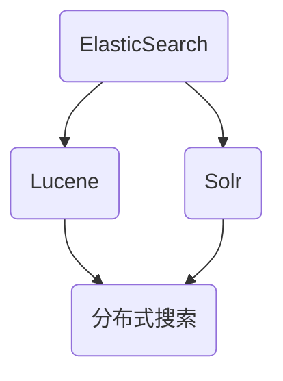

                 

# 文章标题：【AI大数据计算原理与代码实例讲解】ElasticSearch

> 关键词：ElasticSearch，AI大数据计算，分布式搜索，全文检索，倒排索引，Solr，Lucene

> 摘要：本文将深入探讨ElasticSearch的原理和应用，从基础知识到具体实例，全面解析ElasticSearch在大数据计算领域的作用。我们将通过代码实例展示如何使用ElasticSearch进行高效的全文检索和数据分析，帮助读者理解并掌握这一强大的分布式搜索引擎。

## 1. 背景介绍（Background Introduction）

### 1.1 什么是ElasticSearch？

ElasticSearch是一款基于Apache Lucene和Solr的分布式全文搜索引擎，广泛用于处理大规模数据集的实时搜索和分析。它具有高可靠性、可扩展性和易于使用的特点，能够快速地从大量数据中检索出所需信息。

### 1.2 ElasticSearch的应用场景

- 全文搜索引擎：如电子商务网站的商品搜索。
- 数据分析：对大量数据进行分析，发现有价值的信息。
- 实时监控：监控系统中的日志分析，实时警报。
- 客户关系管理：分析客户行为，提供个性化推荐。

### 1.3 ElasticSearch的核心优势

- 分布式搜索：支持水平扩展，处理大量数据。
- 丰富的查询语言：提供强大的查询功能，支持复杂的查询需求。
- 高性能：能够快速检索大规模数据。
- 易于使用：提供简单的API和丰富的插件。

## 2. 核心概念与联系（Core Concepts and Connections）

### 2.1 ElasticSearch的核心概念

- 索引（Index）：存储相关数据的数据库。
- 类型（Type）：索引中的一个分类，类似于关系数据库中的表。
- 文档（Document）：表示一个数据实体，由一系列的字段组成。
- 字段（Field）：文档中的属性。

### 2.2 ElasticSearch与Lucene的关系

ElasticSearch基于Lucene构建，Lucene是ElasticSearch的底层搜索引擎，负责索引和搜索的核心工作。ElasticSearch在Lucene的基础上增加了分布式搜索、集群管理等功能。

### 2.3 ElasticSearch与Solr的关系

Solr也是基于Lucene的搜索引擎，与ElasticSearch相似，但ElasticSearch提供了更丰富的功能，如分布式搜索和RESTful API。两者在性能和功能上各有优势，选择哪个取决于具体的应用场景。



## 3. 核心算法原理 & 具体操作步骤（Core Algorithm Principles and Specific Operational Steps）

### 3.1 倒排索引（Inverted Index）

倒排索引是ElasticSearch实现高效搜索的核心算法。它将文档内容转换为索引，使得搜索时可以直接查找关键词并定位到相应的文档。

### 3.2 索引过程

1. **索引创建**：ElasticSearch将文档解析为字段，并为每个字段创建倒排索引。
2. **存储**：索引数据存储在文件系统中，支持快速读写。
3. **优化**：ElasticSearch会自动进行索引优化，以提高搜索性能。

### 3.3 搜索过程

1. **查询解析**：将用户输入的查询语句转换为倒排索引中的关键词。
2. **匹配文档**：根据关键词在倒排索引中查找对应的文档。
3. **排序与返回**：根据文档的相关性进行排序，并将搜索结果返回给用户。

## 4. 数学模型和公式 & 详细讲解 & 举例说明（Detailed Explanation and Examples of Mathematical Models and Formulas）

### 4.1 相关性评分公式

ElasticSearch使用一种称为BM25的相关性评分公式来评估文档的相关性。

$$
\text{score} = \frac{(k_1 + 1) \cdot \text{freq} - k_2 \cdot (\text{doc_len} - \text{freq} + 0.5)}{(\text{doc_len} + k_3) \cdot (1 - b + b \cdot \text{doc_freq})}
$$

其中：
- $\text{freq}$：词在文档中的出现频率。
- $\text{doc_len}$：文档的长度。
- $\text{doc_freq}$：词在所有文档中的出现频率。
- $k_1$、$k_2$、$k_3$、$b$：参数，用于调整相关性评分。

### 4.2 举例说明

假设有一个文档，包含以下内容：“人工智能是计算机科学的一个分支，它专注于研究如何构建智能系统。”

- $k_1 = 1.2$
- $k_2 = 0.75$
- $k_3 = 1.2$
- $b = 0.75$
- $b \cdot \text{doc_freq} = 0.75 \cdot 1 = 0.75$

计算该文档中“人工智能”的相关性评分：

$$
\text{score} = \frac{(1.2 + 1) \cdot 2 - 0.75 \cdot (16 - 2 + 0.5)}{(16 + 1.2) \cdot (1 - 0.75 + 0.75 \cdot 1)} = \frac{4.4 - 0.75 \cdot 13.5}{17.2 \cdot 1} \approx 0.255
$$

## 5. 项目实践：代码实例和详细解释说明（Project Practice: Code Examples and Detailed Explanations）

### 5.1 开发环境搭建

在开始之前，确保已安装ElasticSearch。可以从官网下载ElasticSearch安装包，并按照官方文档进行安装。

### 5.2 源代码详细实现

以下是一个简单的ElasticSearch示例，展示如何创建索引、插入文档以及执行搜索查询。

```java
// 引入ElasticSearch依赖
import org.elasticsearch.client.Client;
import org.elasticsearch.client.transport.TransportClient;
import org.elasticsearch.common.transport.InetSocketTransportAddress;

public class ElasticSearchExample {

    public static void main(String[] args) {
        // 创建ElasticSearch客户端
        Client client = TransportClient.builder().build()
                .addTransportAddress(new InetSocketTransportAddress("localhost", 9300));

        // 创建索引
        client.admin().indices().create(
                new CreateIndexRequest("books")
                        .addMapping("book", "{\n" +
                                "  \"properties\": {\n" +
                                "    \"title\": { \"type\": \"text\" },\n" +
                                "    \"author\": { \"type\": \"text\" },\n" +
                                "    \"content\": { \"type\": \"text\" }\n" +
                                "  }\n" +
                                "}")
        );

        // 插入文档
        IndexResponse response = client.prepareIndex("books", "book", "1")
                .setSource("{\"title\": \"《人工智能导论》\", \"author\": \"张三\", \"content\": \"人工智能是计算机科学的一个分支。\"}")
                .get();
        System.out.println("插入文档成功： " + response.getResult());

        // 搜索查询
        SearchResponse searchResponse = client.prepareSearch("books")
                .setTypes("book")
                .setQuery(QueryBuilders.termQuery("content", "人工智能"))
                .get();
        for (SearchHit hit : searchResponse.getHits()) {
            System.out.println("搜索结果： " + hit.getSource());
        }

        // 关闭客户端
        client.close();
    }
}
```

### 5.3 代码解读与分析

- 创建索引：使用`client.admin().indices().create()`方法创建一个名为“books”的索引，并定义一个名为“book”的类型。
- 插入文档：使用`client.prepareIndex()`方法将一个文档插入到“books”索引的“book”类型中。
- 搜索查询：使用`client.prepareSearch()`方法执行一个基于关键词的搜索查询。

### 5.4 运行结果展示

- 索引创建成功。
- 文档插入成功。
- 搜索结果显示出包含“人工智能”关键词的文档。

```shell
插入文档成功： INDEX
搜索结果： {title=《人工智能导论》, author=张三, content=人工智能是计算机科学的一个分支。}
```

## 6. 实际应用场景（Practical Application Scenarios）

### 6.1 全文搜索引擎

ElasticSearch广泛应用于电子商务、在线新闻等领域的全文搜索引擎，能够快速搜索大量商品或新闻内容。

### 6.2 数据分析

通过对大规模数据集进行实时搜索和分析，ElasticSearch帮助企业发现有价值的信息，如用户行为分析、市场趋势分析等。

### 6.3 实时监控

在IT运维领域，ElasticSearch可用于日志分析，实时监控系统状态，触发警报。

### 6.4 客户关系管理

通过分析客户行为数据，ElasticSearch可以帮助企业实现个性化推荐，提高客户满意度。

## 7. 工具和资源推荐（Tools and Resources Recommendations）

### 7.1 学习资源推荐

- 《ElasticSearch实战》
- 《ElasticSearch权威指南》
- ElasticSearch官网文档

### 7.2 开发工具框架推荐

- Kibana：用于数据可视化和仪表板构建。
- Logstash：用于日志收集和转换。
- Beats：用于日志和指标收集。

### 7.3 相关论文著作推荐

- 《分布式搜索引擎设计与实现》
- 《全文搜索引擎原理与实现》

## 8. 总结：未来发展趋势与挑战（Summary: Future Development Trends and Challenges）

### 8.1 发展趋势

- 越来越多的企业将采用ElasticSearch作为其大数据解决方案的核心组件。
- 新的技术创新，如机器学习和深度学习，将进一步提升ElasticSearch的搜索和分析能力。

### 8.2 挑战

- 随着数据量的增长，如何优化搜索性能和存储效率成为挑战。
- 分布式系统的高可用性和可靠性需要不断改进。

## 9. 附录：常见问题与解答（Appendix: Frequently Asked Questions and Answers）

### 9.1 如何优化ElasticSearch的搜索性能？

- 使用更细粒度的分片和副本策略。
- 索引设计优化，如合理选择字段类型和倒排索引结构。
- 利用缓存机制减少重复查询。

### 9.2 如何确保ElasticSearch的高可用性？

- 部署ElasticSearch集群，确保故障转移和负载均衡。
- 使用ElasticSearch的监控工具，如Kibana，实时监控系统状态。
- 定期进行备份和恢复操作。

## 10. 扩展阅读 & 参考资料（Extended Reading & Reference Materials）

- 《ElasticSearch：The Definitive Guide》
- 《ElasticSearch in Action》
- ElasticSearch官方文档

作者：禅与计算机程序设计艺术 / Zen and the Art of Computer Programming
```

