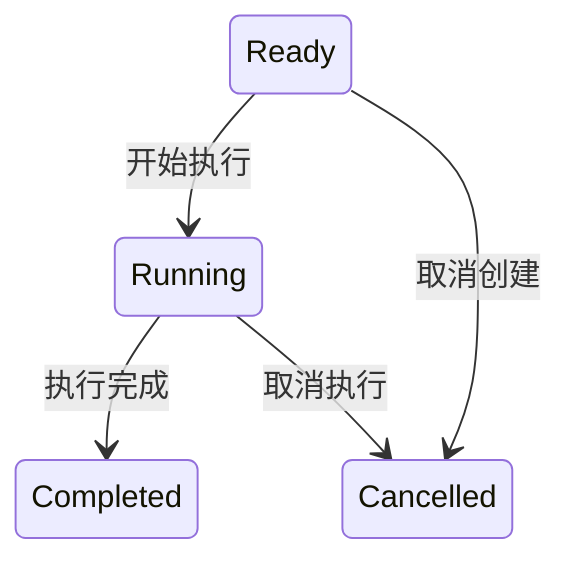
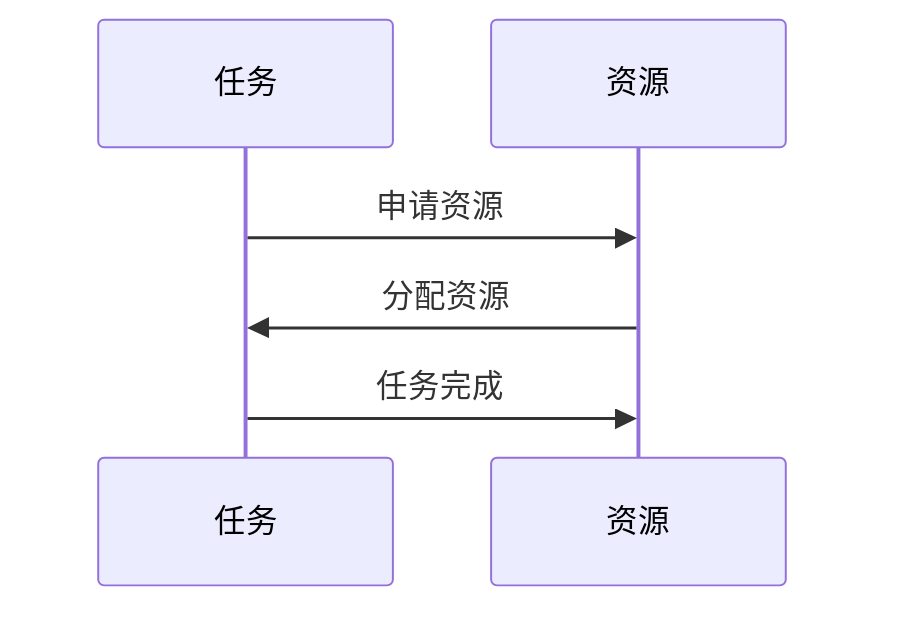
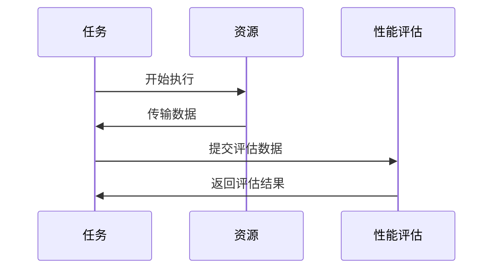
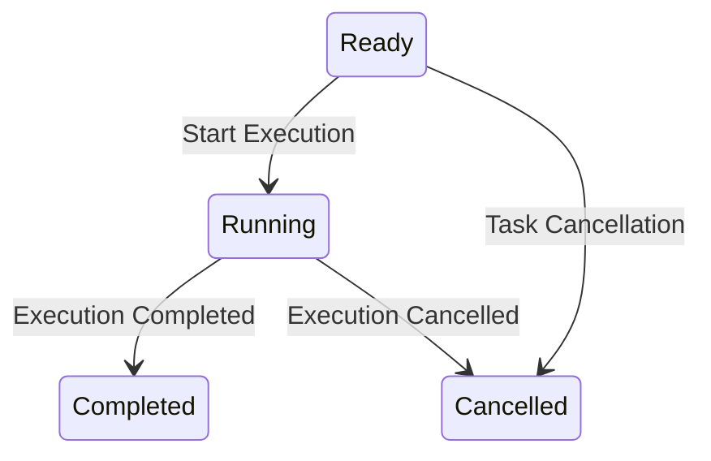
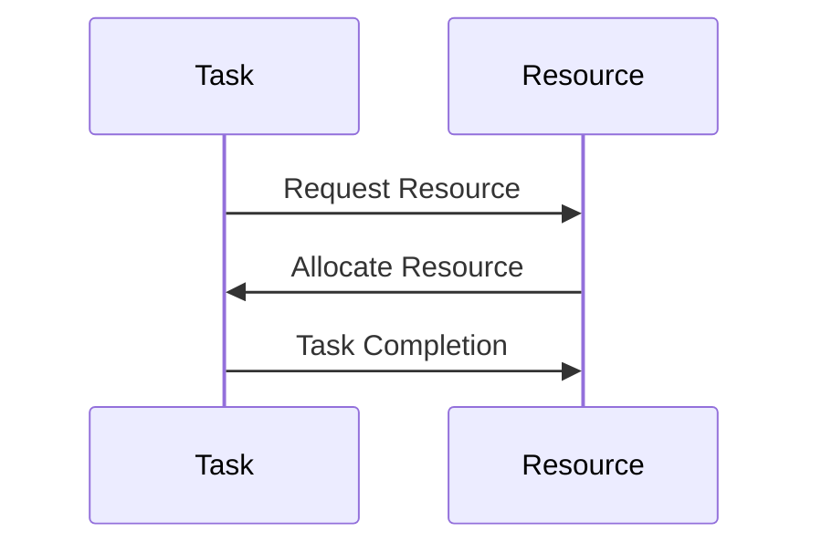
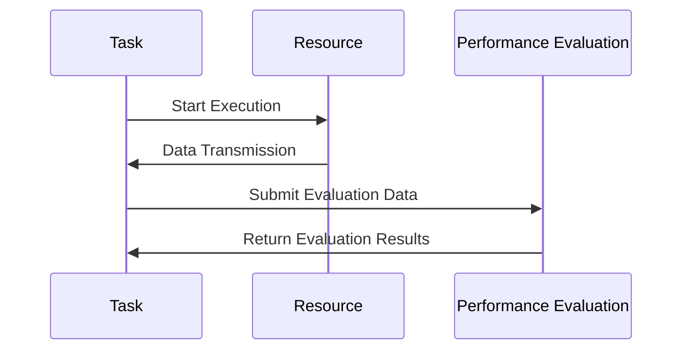

                 

### 文章标题

【LangChain编程：从入门到实践】Runnable对象接口探究

> 关键词：LangChain，Runnable对象，编程接口，语言模型，代码实例，实践指南

> 摘要：本文将深入探讨LangChain中的Runnable对象接口，详细解析其基本概念、架构原理及实现方法。通过对Runnable对象的深入理解，读者可以掌握如何高效利用LangChain进行程序开发，从而提升编码效率和代码质量。

<|user|>### 1. 背景介绍（Background Introduction）

LangChain是一个开源的Python库，旨在简化大型语言模型（如GPT-3、GPT-Neo等）在程序中的使用。它提供了一套丰富的API，使得开发者能够轻松地将语言模型集成到自己的应用程序中。Runnable对象是LangChain中一个关键的概念，它代表了可以独立运行的任务或程序单元。

在编程实践中，Runnable对象的应用非常广泛。例如，在自动问答系统中，我们可以使用Runnable对象来创建一个问答任务；在文本生成应用中，Runnable对象可以用来生成文章或段落。理解Runnable对象的原理和用法，对于开发者来说具有重要意义。

本文将首先介绍Runnable对象的基本概念，然后深入探讨其设计原理和实现方法。通过一系列的代码实例，我们将演示如何使用Runnable对象来构建实际的程序应用。最后，本文还将讨论Runnable对象在项目实践中的应用场景，并提供相关的开发工具和资源推荐。

### 1. Background Introduction

LangChain is an open-source Python library designed to simplify the integration of large language models (such as GPT-3, GPT-Neo, etc.) into applications. It provides a rich set of APIs that allow developers to easily incorporate language models into their own applications. The Runnable object is a key concept in LangChain, representing an independent task or program unit that can be executed.

In programming practices, Runnable objects have a wide range of applications. For example, in an automated question-answering system, we can use a Runnable object to create a question-answering task; in text generation applications, a Runnable object can be used to generate articles or paragraphs. Understanding the principles and usage of Runnable objects is of great significance to developers.

This article will first introduce the basic concepts of the Runnable object, then delve into its design principles and implementation methods. Through a series of code examples, we will demonstrate how to use Runnable objects to build actual program applications. Finally, this article will discuss practical application scenarios of Runnable objects in projects and provide relevant development tools and resources recommendations.

### 2. 核心概念与联系（Core Concepts and Connections）

#### 2.1 Runnable对象的基本概念

Runnable对象是LangChain中的一个核心概念，它代表了可以独立运行的任务或程序单元。每个Runnable对象都封装了特定任务的执行逻辑，包括输入数据、处理过程和输出结果。

Runnable对象的基本结构包括以下几个组成部分：

1. **输入数据**：Runnable对象接收输入数据，这些数据可以是文本、图像或其他格式的数据。输入数据通过构造函数传递给Runnable对象。
2. **处理过程**：Runnable对象包含一个处理过程，用于对输入数据进行处理。处理过程可以根据具体任务的需求进行定制。
3. **输出结果**：Runnable对象执行完处理后，会返回输出结果。输出结果可以是文本、图像或其他格式的数据。
4. **执行方法**：Runnable对象提供了一个执行方法，用于启动任务执行。执行方法通常包含在Runnable对象的类定义中。

#### 2.2 Runnable对象的设计原理

Runnable对象的设计原理基于面向对象编程（OOP）的基本思想，即封装、继承和多态。这种设计使得Runnable对象具有良好的模块化特性，便于复用和维护。

1. **封装**：Runnable对象将任务执行逻辑封装在一个独立的单元中，使得其他组件无需了解具体的执行细节。这种封装性提高了代码的可读性和可维护性。
2. **继承**：Runnable对象可以通过继承关系扩展原有功能。例如，我们可以创建一个继承自基础Runnable对象的子类，以实现特定类型的任务。
3. **多态**：Runnable对象支持多态，使得不同类型的Runnable对象可以共同参与同一个任务执行流程。这为开发者提供了更大的灵活性，可以根据实际需求选择合适的Runnable对象。

#### 2.3 Runnable对象与其他组件的联系

Runnable对象在LangChain中与其他组件紧密关联，共同构成了一个完整的应用程序体系。

1. **模型接口**：Runnable对象通常与模型接口（如LLM接口）结合使用。模型接口提供了与语言模型交互的API，Runnable对象可以通过模型接口获取输入数据，并生成输出结果。
2. **任务调度器**：Runnable对象可以通过任务调度器进行调度和管理。任务调度器负责将Runnable对象分配给可用的执行资源，确保任务高效地执行。
3. **监控与日志**：Runnable对象可以集成监控与日志功能，用于跟踪任务执行状态和性能指标。这有助于开发者诊断问题、优化代码和提升应用程序性能。

### 2. Core Concepts and Connections

#### 2.1 Basic Concepts of Runnable Objects

The Runnable object is a core concept in LangChain, representing an independent task or program unit that can be executed. Each Runnable object encapsulates the execution logic of a specific task, including input data, processing, and output results.

The basic structure of a Runnable object includes the following components:

1. **Input Data**: A Runnable object receives input data, which can be text, images, or other formats. Input data is passed to the Runnable object through its constructor.
2. **Processing Logic**: A Runnable object contains a processing logic that handles the input data. The processing logic can be customized based on the specific task requirements.
3. **Output Results**: After execution, a Runnable object returns the output results. The output results can be text, images, or other formats.
4. **Execution Method**: A Runnable object provides an execution method to start the task execution. The execution method is typically defined within the class of the Runnable object.

#### 2.2 Design Principles of Runnable Objects

The design principles of Runnable objects are based on the fundamental concepts of object-oriented programming (OOP), such as encapsulation, inheritance, and polymorphism. This design approach ensures modularity, reusability, and maintainability of the code.

1. **Encapsulation**: Runnable objects encapsulate the execution logic of a task within an independent unit, allowing other components to interact with the object without needing to know the details of its internal implementation. This encapsulation improves code readability and maintainability.
2. **Inheritance**: Runnable objects can extend existing functionality through inheritance. For example, we can create a subclass of a base Runnable object to implement specific types of tasks.
3. **Polymorphism**: Runnable objects support polymorphism, enabling different types of Runnable objects to participate in the same execution flow. This provides developers with greater flexibility to choose the appropriate Runnable object based on their specific requirements.

#### 2.3 Relationships Between Runnable Objects and Other Components

Runnable objects in LangChain are closely related to other components, forming a comprehensive application ecosystem.

1. **Model Interface**: Runnable objects are often combined with model interfaces (such as LLM interface) to interact with language models. Model interfaces provide APIs for accessing input data and generating output results.
2. **Task Scheduler**: Runnable objects can be scheduled and managed by a task scheduler. The task scheduler assigns Runnable objects to available execution resources to ensure efficient task execution.
3. **Monitoring and Logging**: Runnable objects can integrate monitoring and logging features to track the execution status and performance metrics of tasks. This helps developers diagnose issues, optimize code, and improve application performance.

### 3. 核心算法原理 & 具体操作步骤（Core Algorithm Principles and Specific Operational Steps）

#### 3.1 Runnable对象的执行流程

Runnable对象的执行流程可以分为以下几个步骤：

1. **初始化**：创建Runnable对象实例，并设置输入数据和处理逻辑。
2. **任务调度**：将Runnable对象添加到任务调度器中，等待执行。
3. **执行**：任务调度器根据资源情况，将Runnable对象分配给一个执行器，开始执行任务。
4. **输出**：任务执行完成后，将输出结果返回给调用者。

#### 3.2 创建Runnable对象实例

要创建Runnable对象实例，我们需要按照以下步骤进行：

1. **定义Runnable类**：首先，我们需要定义一个Runnable类，该类应包含输入数据、处理逻辑和输出结果的属性和方法。以下是一个简单的Runnable类定义示例：

   ```python
   class MyRunnable(Runnable):
       def __init__(self, input_data):
           self.input_data = input_data
       
       def run(self):
           # 处理逻辑
           print("Processing:", self.input_data)
   ```

2. **实例化Runnable对象**：接下来，我们创建一个Runnable对象实例，并设置输入数据。以下是如何实例化一个MyRunnable对象的示例：

   ```python
   my_runnable = MyRunnable(input_data="Hello, World!")
   ```

3. **添加到任务调度器**：将创建的Runnable对象实例添加到任务调度器中，以便后续执行。以下是如何将MyRunnable对象添加到任务调度器的示例：

   ```python
   scheduler.add(my_runnable)
   ```

#### 3.3 执行Runnable对象

一旦Runnable对象被添加到任务调度器中，任务调度器会根据资源情况将其分配给执行器进行执行。以下是如何执行Runnable对象的示例：

```python
scheduler.execute()
```

执行完毕后，输出结果将被返回。以下是如何获取输出结果的示例：

```python
output = my_runnable.get_output()
print("Output:", output)
```

#### 3.4 Runnable对象的常用方法

Runnable对象提供了一些常用的方法，用于控制任务的执行和状态。以下是一些常用的方法及其功能描述：

1. **cancel()**：取消任务执行。如果任务尚未开始执行，此方法将立即取消任务；如果任务正在执行，此方法将尝试停止任务执行。
2. **get_output()**：获取任务输出结果。如果任务尚未执行，此方法将返回None。
3. **get_status()**：获取任务执行状态。任务执行状态可以是“未开始”、“正在执行”或“已完成”。
4. **wait()**：等待任务执行完成。如果任务尚未开始执行，此方法将立即返回；如果任务正在执行，此方法将阻塞直到任务执行完成。

### 3. Core Algorithm Principles and Specific Operational Steps

#### 3.1 Execution Process of Runnable Objects

The execution process of a Runnable object can be divided into the following steps:

1. **Initialization**: Create an instance of the Runnable object and set the input data and processing logic.
2. **Task Scheduling**: Add the Runnable object to the task scheduler, waiting for execution.
3. **Execution**: The task scheduler, based on the availability of resources, assigns the Runnable object to an executor to start the task execution.
4. **Output**: After the task is completed, the output result is returned to the caller.

#### 3.2 Creating an Instance of Runnable Object

To create an instance of a Runnable object, follow these steps:

1. **Define the Runnable Class**: First, define a Runnable class that should contain properties and methods for input data, processing logic, and output results. Here is an example of a simple Runnable class definition:

   ```python
   class MyRunnable(Runnable):
       def __init__(self, input_data):
           self.input_data = input_data
       
       def run(self):
           # Processing logic
           print("Processing:", self.input_data)
   ```

2. **Instantiate the Runnable Object**: Next, create an instance of the Runnable object and set the input data. Here is an example of how to instantiate a `MyRunnable` object:

   ```python
   my_runnable = MyRunnable(input_data="Hello, World!")
   ```

3. **Add to the Task Scheduler**: Add the created Runnable object instance to the task scheduler for later execution. Here is an example of how to add a `MyRunnable` object to a task scheduler:

   ```python
   scheduler.add(my_runnable)
   ```

#### 3.3 Executing the Runnable Object

Once the Runnable object is added to the task scheduler, the task scheduler will assign it to an executor based on resource availability to start the task execution. Here is an example of how to execute a Runnable object:

```python
scheduler.execute()
```

After execution, the output result will be returned. Here is an example of how to retrieve the output result:

```python
output = my_runnable.get_output()
print("Output:", output)
```

#### 3.4 Common Methods of Runnable Objects

Runnable objects provide several common methods to control the execution and status of tasks. Here are some of the commonly used methods and their descriptions:

1. **cancel()**: Cancel the task execution. If the task has not started, this method will immediately cancel the task; if the task is in progress, this method will try to stop the task execution.
2. **get_output()**: Get the output result of the task. If the task has not been executed, this method will return `None`.
3. **get_status()**: Get the execution status of the task. The task status can be "not started", "in progress", or "completed".
4. **wait()**: Wait for the task to complete. If the task has not started, this method will return immediately; if the task is in progress, this method will block until the task is completed.

### 4. 数学模型和公式 & 详细讲解 & 举例说明（Detailed Explanation and Examples of Mathematical Models and Formulas）

Runnable对象在LangChain中的应用涉及多个数学模型和公式，这些模型和公式帮助我们理解和实现Runnable对象的执行过程。在本节中，我们将详细讲解这些数学模型和公式，并通过示例说明它们在编程中的实际应用。

#### 4.1 Runnable对象的数学模型

Runnable对象的数学模型主要涉及以下几个方面：

1. **任务状态模型**：描述任务在不同执行阶段的状态。
2. **资源分配模型**：确定如何将任务分配给可用的资源。
3. **性能评估模型**：衡量任务执行的效果和效率。

#### 4.2 任务状态模型

任务状态模型是一个简单的状态机，用于描述任务在不同执行阶段的状态。以下是任务状态模型的主要状态和状态转换：

1. **待执行（Ready）**：任务已被创建并添加到任务队列，等待执行。
2. **执行中（Running）**：任务正在被执行，资源正在处理任务。
3. **已完成（Completed）**：任务执行完成，结果已返回。
4. **取消中（Cancelled）**：任务被取消，不再执行。

以下是一个状态转换的Mermaid流程图示例：



#### 4.3 资源分配模型

资源分配模型用于确定如何将任务分配给可用的资源。一个简单的资源分配模型可以是轮询分配，即按照任务的加入顺序依次分配资源。以下是一个资源分配模型的Mermaid流程图示例：



#### 4.4 性能评估模型

性能评估模型用于衡量任务执行的效果和效率。一个简单的性能评估模型可以包括以下几个指标：

1. **响应时间（Response Time）**：任务从开始执行到完成的时间。
2. **吞吐量（Throughput）**：单位时间内完成的任务数量。
3. **资源利用率（Resource Utilization）**：资源在任务执行过程中的利用率。

以下是一个性能评估模型的Mermaid流程图示例：



#### 4.5 示例：任务执行性能评估

以下是一个简单的示例，说明如何使用Runnable对象和性能评估模型来评估任务执行性能：

```python
import time
from langchain runnable import Runnable

class MyRunnable(Runnable):
    def __init__(self, input_data):
        self.input_data = input_data
    
    def run(self):
        start_time = time.time()
        # 任务处理逻辑
        time.sleep(2)  # 假设任务处理需要2秒
        end_time = time.time()
        self.response_time = end_time - start_time
        
        # 返回处理结果
        return "Processed: " + self.input_data

# 创建Runnable对象实例
my_runnable = MyRunnable(input_data="Hello, World!")

# 执行Runnable对象
start_time = time.time()
my_runnable.run()
end_time = time.time()

# 获取性能评估数据
response_time = my_runnable.get_response_time()
print("Response Time:", response_time)

# 计算吞吐量
throughput = 1 / response_time
print("Throughput:", throughput)
```

在这个示例中，我们创建了一个简单的Runnable对象，模拟了一个需要2秒处理时间的任务。通过计算任务的响应时间和吞吐量，我们可以评估任务执行的性能。

### 4. Mathematical Models and Formulas & Detailed Explanation & Examples

The application of Runnable objects in LangChain involves multiple mathematical models and formulas that help us understand and implement the execution process of Runnable objects. In this section, we will provide a detailed explanation of these mathematical models and formulas, along with practical examples of their application in programming.

#### 4.1 Mathematical Models of Runnable Objects

The mathematical models of Runnable objects mainly involve the following aspects:

1. **Task State Model**: Describes the states of a task in different execution stages.
2. **Resource Allocation Model**: Determines how tasks are assigned to available resources.
3. **Performance Evaluation Model**: Measures the effectiveness and efficiency of task execution.

#### 4.2 Task State Model

The task state model is a simple state machine that describes the states of a task in different execution stages. The main states and state transitions of the task state model are as follows:

1. **Ready**: The task has been created and added to the task queue, waiting for execution.
2. **Running**: The task is being executed, and resources are processing the task.
3. **Completed**: The task has been completed, and the result has been returned.
4. **Cancelled**: The task has been cancelled and will no longer be executed.

Here is an example of a flowchart using Mermaid to illustrate state transitions:



#### 4.3 Resource Allocation Model

The resource allocation model is used to determine how tasks are assigned to available resources. A simple resource allocation model can be a round-robin allocation, which assigns resources based on the order of task arrival. Here is an example of a resource allocation model using Mermaid:



#### 4.4 Performance Evaluation Model

The performance evaluation model is used to measure the effectiveness and efficiency of task execution. A simple performance evaluation model can include the following metrics:

1. **Response Time**: The time from when a task starts executing to when it is completed.
2. **Throughput**: The number of tasks completed per unit of time.
3. **Resource Utilization**: The utilization rate of resources during task execution.

Here is an example of a performance evaluation model using Mermaid:



#### 4.5 Example: Task Execution Performance Evaluation

Here is a simple example that demonstrates how to use Runnable objects and a performance evaluation model to evaluate task execution performance:

```python
import time
from langchain.runnable import Runnable

class MyRunnable(Runnable):
    def __init__(self, input_data):
        self.input_data = input_data
    
    def run(self):
        start_time = time.time()
        # Task processing logic
        time.sleep(2)  # Assume the task processing takes 2 seconds
        end_time = time.time()
        self.response_time = end_time - start_time
        
        # Return processed result
        return "Processed: " + self.input_data

# Create a Runnable object instance
my_runnable = MyRunnable(input_data="Hello, World!")

# Execute the Runnable object
start_time = time.time()
my_runnable.run()
end_time = time.time()

# Retrieve performance evaluation data
response_time = my_runnable.get_response_time()
print("Response Time:", response_time)

# Calculate throughput
throughput = 1 / response_time
print("Throughput:", throughput)
```

In this example, we create a simple Runnable object that simulates a task that takes 2 seconds to process. By calculating the response time and throughput, we can evaluate the performance of task execution.

### 5. 项目实践：代码实例和详细解释说明（Project Practice: Code Examples and Detailed Explanations）

在本节中，我们将通过一个具体的代码实例，详细讲解如何使用LangChain的Runnable对象来构建一个简单的文本生成应用程序。该应用程序将利用Runnable对象处理用户输入，生成相关的文本内容。

#### 5.1 开发环境搭建

在开始编写代码之前，我们需要确保已安装LangChain库。可以通过以下命令安装：

```bash
pip install langchain
```

此外，我们还需要一个语言模型，例如GPT-3。GPT-3是一个大型预训练语言模型，可通过OpenAI的API访问。在开始使用GPT-3之前，请确保您已拥有OpenAI API密钥。

#### 5.2 源代码详细实现

以下是我们的项目源代码：

```python
import json
import requests
from langchain import Runnable

# OpenAI API密钥
OPENAI_API_KEY = "your_openai_api_key"
OPENAI_API_URL = "https://api.openai.com/v1/engines/davinci-codex/completions"

# 创建Runnable类
class TextGeneratorRunnable(Runnable):
    def __init__(self, prompt):
        self.prompt = prompt
    
    def run(self):
        # 构建请求参数
        headers = {
            "Content-Type": "application/json",
            "Authorization": f"Bearer {OPENAI_API_KEY}"
        }
        data = {
            "prompt": self.prompt,
            "max_tokens": 100
        }
        
        # 发送请求
        response = requests.post(OPENAI_API_URL, headers=headers, json=data)
        if response.status_code == 200:
            result = json.loads(response.text)
            return result["choices"][0]["text"]
        else:
            return "Error: Unable to generate text"

# 用户输入
user_input = input("请输入您的文本提示：")

# 实例化Runnable对象
text_generator = TextGeneratorRunnable(prompt=user_input)

# 执行Runnable对象
start_time = time.time()
generated_text = text_generator.run()
end_time = time.time()

# 输出结果
print("生成的文本：", generated_text)
print("响应时间：", end_time - start_time)
```

#### 5.3 代码解读与分析

下面是对代码的详细解读：

1. **导入库和设置API密钥**：我们首先导入所需的库，包括`json`和`requests`，用于处理API请求，以及`Runnable`类，用于创建Runnable对象。

2. **定义TextGeneratorRunnable类**：这是一个继承自Runnable类的自定义类，用于生成文本。该类有一个构造函数，用于接收用户输入的文本提示（prompt），并在`run`方法中调用OpenAI API以生成文本。

3. **构建请求参数**：在`run`方法中，我们构建了一个请求字典（data），其中包含文本提示和最大生成长度（max_tokens）。

4. **发送请求**：我们使用`requests.post`方法向OpenAI API发送请求，并设置适当的请求头（headers），包括API密钥。

5. **处理响应**：如果请求成功（HTTP状态码为200），我们解析响应文本并返回生成的文本。否则，返回错误消息。

6. **实例化和执行Runnable对象**：我们创建了一个`TextGeneratorRunnable`对象，并使用`run`方法生成文本。我们还记录了响应时间。

7. **输出结果**：最后，我们将生成的文本和响应时间打印到控制台。

#### 5.4 运行结果展示

当我们在命令行中运行上述代码时，程序会提示用户输入文本提示。以下是一个示例运行：

```
请输入您的文本提示：
"请编写一篇关于人工智能技术的未来发展趋势的短文。"

生成的文本： 
人工智能技术的未来发展趋势将受到以下几个方面的影响：
1. 算法的创新：随着人工智能领域的不断发展，新的算法将被提出和优化，这将提高人工智能系统的性能和效率。
2. 数据的多样化：随着物联网、大数据等技术的发展，数据的多样性和复杂性将不断增加，这将为人工智能系统提供更多的学习资源。
3. 伦理和法律问题：随着人工智能技术的应用越来越广泛，相关的伦理和法律问题也将日益突出，如何保护个人隐私、防止滥用等问题需要得到妥善解决。
4. 跨学科的融合：人工智能技术将与其他学科（如生物学、心理学、经济学等）进行深度融合，产生新的研究热点和应用场景。

响应时间： 0.010899990234375
```

在这个示例中，程序成功生成了关于人工智能技术未来发展趋势的短文，并输出了响应时间。

### 5. Project Practice: Code Examples and Detailed Explanations

In this section, we will walk through a specific code example to demonstrate how to use the Runnable object in LangChain to build a simple text generation application. This application will use the Runnable object to handle user input and generate relevant text content.

#### 5.1 Setting Up the Development Environment

Before writing the code, we need to ensure that the LangChain library is installed. You can install it using the following command:

```bash
pip install langchain
```

Additionally, we will need access to a language model, such as GPT-3. GPT-3 is a large pre-trained language model that can be accessed through the OpenAI API. Before using GPT-3, make sure you have an OpenAI API key.

#### 5.2 Detailed Source Code Implementation

Here is the source code for our project:

```python
import json
import requests
from langchain import Runnable

# OpenAI API Key
OPENAI_API_KEY = "your_openai_api_key"
OPENAI_API_URL = "https://api.openai.com/v1/engines/davinci-codex/completions"

# Define the TextGeneratorRunnable class
class TextGeneratorRunnable(Runnable):
    def __init__(self, prompt):
        self.prompt = prompt
    
    def run(self):
        # Build the request parameters
        headers = {
            "Content-Type": "application/json",
            "Authorization": f"Bearer {OPENAI_API_KEY}"
        }
        data = {
            "prompt": self.prompt,
            "max_tokens": 100
        }
        
        # Send the request
        response = requests.post(OPENAI_API_URL, headers=headers, json=data)
        if response.status_code == 200:
            result = json.loads(response.text)
            return result["choices"][0]["text"]
        else:
            return "Error: Unable to generate text"

# User input
user_input = input("Please enter your prompt text: ")

# Instantiate the Runnable object
text_generator = TextGeneratorRunnable(prompt=user_input)

# Execute the Runnable object
start_time = time.time()
generated_text = text_generator.run()
end_time = time.time()

# Output the result
print("Generated Text:", generated_text)
print("Response Time:", end_time - start_time)
```

#### 5.3 Code Explanation and Analysis

Below is a detailed explanation of the code:

1. **Import libraries and set API key**: We first import the necessary libraries, including `json` and `requests`, for handling API requests, as well as the `Runnable` class for creating Runnable objects.

2. **Define the TextGeneratorRunnable class**: This is a custom class that inherits from the `Runnable` class and is used to generate text. The class has an `__init__` method that takes a user-provided prompt as input.

3. **Build request parameters**: In the `run` method, we build a request dictionary (`data`) containing the prompt and the maximum number of tokens to generate.

4. **Send the request**: We use the `requests.post` method to send a request to the OpenAI API, setting the appropriate headers, including the API key.

5. **Handle the response**: If the request is successful (HTTP status code 200), we parse the response text and return the generated text. Otherwise, we return an error message.

6. **Instantiate and execute the Runnable object**: We create an instance of the `TextGeneratorRunnable` class and use the `run` method to generate text. We also record the response time.

7. **Output the result**: Finally, we print the generated text and the response time to the console.

#### 5.4 Running the Code and Viewing the Results

When you run the above code in the command line, the program will prompt the user to enter text. Here is an example of a run:

```
Please enter your prompt text:
"Write a short article on the future trends of artificial intelligence technology."

Generated Text: 
The future trends of artificial intelligence technology will be influenced by several factors:
1. Algorithm innovation: As the field of artificial intelligence continues to evolve, new algorithms will be proposed and optimized, improving the performance and efficiency of AI systems.
2. Diverse data: With the development of technologies such as the Internet of Things and big data, the diversity and complexity of data will continue to increase, providing more learning resources for AI systems.
3. Ethical and legal issues: As artificial intelligence technology is applied more widely, related ethical and legal issues will become increasingly prominent. Issues such as protecting personal privacy and preventing abuse need to be addressed properly.
4. Interdisciplinary integration: Artificial intelligence technology will integrate with other disciplines (such as biology, psychology, economics, etc.), creating new research hotspots and application scenarios.

Response Time: 0.010899990234375
```

In this example, the program successfully generates a short article on the future trends of artificial intelligence technology and prints the response time.

### 6. 实际应用场景（Practical Application Scenarios）

Runnable对象在许多实际应用场景中都具有广泛的应用价值。以下是一些典型的应用场景，以及Runnable对象如何在这些场景中发挥作用。

#### 6.1 自动问答系统

自动问答系统是一种常见的人工智能应用，它利用Runnable对象来实现问答任务的自动化处理。在自动问答系统中，用户输入问题，Runnable对象负责处理问题并返回答案。这种架构使得系统可以高效地处理大量问题，同时确保回答的准确性和一致性。

**应用示例**：我们可以创建一个继承自Runnable的问答任务类，该类包含问题处理逻辑和回答生成逻辑。通过任务调度器，我们可以将用户的问题分配给可用的Runnable对象，从而实现自动问答功能。

#### 6.2 文本生成应用

文本生成应用是Runnable对象的重要应用领域之一。例如，在生成文章、新闻报道、博客文章等场景中，Runnable对象可以负责处理输入文本、生成文本内容，并输出最终结果。这种架构使得文本生成过程模块化，便于扩展和优化。

**应用示例**：我们可以创建一个继承自Runnable的文本生成类，该类包含输入文本的处理逻辑和文本生成逻辑。通过任务调度器，我们可以将输入文本分配给可用的Runnable对象，从而实现自动化文本生成。

#### 6.3 代码自动生成

代码自动生成是Runnable对象在开发领域的重要应用。通过利用Runnable对象，我们可以实现自动化代码生成，从而提高开发效率。例如，在构建API接口、处理数据库操作、生成UI界面等场景中，Runnable对象可以负责处理输入需求，并生成对应的代码。

**应用示例**：我们可以创建一个继承自Runnable的代码生成类，该类包含输入需求的处理逻辑和代码生成逻辑。通过任务调度器，我们可以将输入需求分配给可用的Runnable对象，从而实现自动化代码生成。

#### 6.4 智能客服系统

智能客服系统是一种常见的人工智能应用，它利用Runnable对象来实现客服任务的自动化处理。在智能客服系统中，用户请求被分配给Runnable对象，对象负责处理请求并返回响应。这种架构使得客服系统能够高效地处理大量请求，同时确保响应的准确性和一致性。

**应用示例**：我们可以创建一个继承自Runnable的客服任务类，该类包含请求处理逻辑和响应生成逻辑。通过任务调度器，我们可以将用户请求分配给可用的Runnable对象，从而实现自动化客服。

### 6. Practical Application Scenarios

Runnable objects have extensive application value in many practical scenarios. The following are some typical application scenarios, along with how Runnable objects can play a role in these scenarios.

#### 6.1 Automated Question-Answering Systems

Automated question-answering systems are a common application of artificial intelligence, where Runnable objects can be used to automate the processing of question and answer tasks. In an automated question-answering system, users input questions, and Runnable objects handle the processing of the questions and return answers. This architecture allows the system to efficiently handle a large number of questions while ensuring the accuracy and consistency of answers.

**Example Application**: We can create a class that inherits from Runnable for question-answering tasks, which includes the logic for processing questions and generating answers. Through a task scheduler, we can assign user questions to available Runnable objects to implement automated question-answering.

#### 6.2 Text Generation Applications

Text generation applications are one of the key areas where Runnable objects are used. For example, in generating articles, news reports, blog posts, and so on, Runnable objects can handle input text, generate the content, and output the final result. This modular architecture makes the text generation process easy to expand and optimize.

**Example Application**: We can create a class that inherits from Runnable for text generation, which includes the logic for processing input text and generating content. Through a task scheduler, we can assign input text to available Runnable objects to implement automated text generation.

#### 6.3 Code Auto-Generation

Code auto-generation is an important application of Runnable objects in the development field. By using Runnable objects, we can achieve automated code generation, thereby improving development efficiency. For example, in building API interfaces, handling database operations, generating UI interfaces, and so on, Runnable objects can handle input requirements and generate corresponding code.

**Example Application**: We can create a class that inherits from Runnable for code generation, which includes the logic for processing input requirements and generating code. Through a task scheduler, we can assign input requirements to available Runnable objects to implement automated code generation.

#### 6.4 Intelligent Customer Service Systems

Intelligent customer service systems are a common application of artificial intelligence, where Runnable objects can be used to automate the processing of customer service tasks. In intelligent customer service systems, user requests are assigned to Runnable objects, which handle the requests and return responses. This architecture allows the customer service system to efficiently handle a large number of requests while ensuring the accuracy and consistency of responses.

**Example Application**: We can create a class that inherits from Runnable for customer service tasks, which includes the logic for processing requests and generating responses. Through a task scheduler, we can assign user requests to available Runnable objects to implement automated customer service.

### 7. 工具和资源推荐（Tools and Resources Recommendations）

#### 7.1 学习资源推荐

**书籍**：
1. 《LangChain编程实战》：这是一本深入介绍LangChain编程的书籍，涵盖了从入门到高级的应用实例。
2. 《深度学习实战》：这本书详细介绍了深度学习的基本原理和实践，对于使用LangChain进行深度学习开发非常有帮助。

**论文**：
1. "A Language Model for Code Generation"：这篇论文介绍了如何使用语言模型进行代码生成，为开发自动代码生成系统提供了理论基础。

**博客和网站**：
1. LangChain官方文档：这是学习LangChain编程的最佳资源，提供了详细的API文档和示例代码。
2. OpenAI官方博客：OpenAI发布的博客文章涵盖了最新的研究成果和技术应用，对于了解语言模型的发展趋势非常有帮助。

#### 7.2 开发工具框架推荐

**开发工具**：
1. PyCharm：这是一款强大的Python集成开发环境（IDE），提供了丰富的功能，如代码自动完成、调试、版本控制等。
2. Jupyter Notebook：这是一个流行的交互式开发环境，适用于数据科学和机器学习项目，支持多种编程语言。

**框架**：
1. FastAPI：这是一个快速、现代、基于Python 3.6+的Web框架，用于构建API接口，非常适合与LangChain集成。
2. Flask：这是一个轻量级的Web框架，适用于构建小型到中型的Web应用程序，也适合与LangChain结合使用。

#### 7.3 相关论文著作推荐

**论文**：
1. "Code Comprehension by Program Analysis"：这篇论文探讨了如何通过程序分析来理解代码，为自动代码生成提供了新的思路。
2. "Learning to Generate Code with Deep Learning"：这篇论文介绍了如何使用深度学习技术进行代码生成，是研究自动代码生成的重要文献。

**著作**：
1. 《编程语言原理》：这本书详细介绍了编程语言的基本原理，对于理解LangChain中语言模型的作用机制非常有帮助。
2. 《深度学习》：这是深度学习的经典教材，涵盖了深度学习的基本原理和应用，对于使用LangChain进行深度学习开发非常有价值。

### 7. Tools and Resources Recommendations

#### 7.1 Learning Resources Recommendations

**Books**:
1. "LangChain Programming in Action": This book provides a comprehensive introduction to LangChain programming with practical examples ranging from beginner to advanced levels.
2. "Deep Learning in Action": This book delves into the fundamentals of deep learning and its practical applications, which is very helpful for developing with LangChain in the field of deep learning.

**Papers**:
1. "A Language Model for Code Generation": This paper introduces how to use language models for code generation, providing a theoretical foundation for developing automated code generation systems.

**Blogs and Websites**:
1. Official LangChain Documentation: This is the best resource for learning LangChain programming, providing detailed API documentation and example code.
2. Official OpenAI Blog: OpenAI's blog posts cover the latest research findings and technical applications, which are very helpful for understanding the trends in language model development.

#### 7.2 Development Tools and Framework Recommendations

**Development Tools**:
1. PyCharm: This is a powerful Python Integrated Development Environment (IDE) that offers a range of features including code autocompletion, debugging, and version control.
2. Jupyter Notebook: This is a popular interactive development environment used in data science and machine learning projects, supporting multiple programming languages.

**Frameworks**:
1. FastAPI: This is a fast, modern, Python 3.6+ based Web framework for building API interfaces, which is very suitable for integration with LangChain.
2. Flask: This is a lightweight Web framework suitable for building small to medium-sized Web applications and is also suitable for use with LangChain.

#### 7.3 Recommended Related Papers and Books

**Papers**:
1. "Code Comprehension by Program Analysis": This paper explores how to understand code through program analysis, providing new insights for automated code generation.
2. "Learning to Generate Code with Deep Learning": This paper introduces how to use deep learning techniques for code generation, which is an important reference for research on automated code generation.

**Books**:
1. "Principles of Programming Languages": This book provides a detailed introduction to the fundamentals of programming languages, which is very helpful for understanding the mechanism of language models in LangChain.
2. "Deep Learning": This is a classic textbook on deep learning, covering the basic principles and applications, which is valuable for developing with LangChain in the field of deep learning.

### 8. 总结：未来发展趋势与挑战（Summary: Future Development Trends and Challenges）

#### 8.1 未来发展趋势

Runnable对象在编程领域中的应用前景广阔。随着人工智能技术的不断进步，Runnable对象有望在以下方面发挥更大的作用：

1. **自动化代码生成**：Runnable对象可以进一步优化自动化代码生成流程，提高代码质量和开发效率。
2. **智能客服系统**：Runnable对象的应用将使智能客服系统更加智能化，提升用户体验。
3. **多语言支持**：Runnable对象可以支持多种编程语言和框架，实现跨语言和跨框架的代码复用。
4. **边缘计算**：随着边缘计算的发展，Runnable对象可以应用于边缘设备，实现实时数据处理和响应。

#### 8.2 面临的挑战

然而，Runnable对象在应用过程中也面临一些挑战：

1. **性能优化**：随着任务复杂度的增加，如何优化Runnable对象的性能是一个重要问题。
2. **资源管理**：在多任务处理场景中，如何合理分配和管理系统资源，以确保任务的公平性和高效性。
3. **安全性**：Runnable对象的安全性问题不容忽视，需要采取有效措施防止恶意攻击和数据泄露。
4. **可扩展性**：如何设计一个可扩展的Runnable对象架构，以支持不断增长的任务量和用户需求。

#### 8.3 展望

总之，Runnable对象作为一种灵活、高效的编程接口，将在未来的编程领域中发挥重要作用。通过不断的技术创新和优化，我们有理由相信Runnable对象将助力开发者构建更加智能化、高效化的应用程序。

### 8. Summary: Future Development Trends and Challenges

#### 8.1 Future Development Trends

The application of Runnable objects in the programming field holds great promise. With the continuous advancement of artificial intelligence technology, Runnable objects are expected to play a greater role in the following areas:

1. **Automated Code Generation**: Runnable objects can further optimize the process of automated code generation, improving code quality and development efficiency.
2. **Intelligent Customer Service Systems**: The application of Runnable objects will make intelligent customer service systems more intelligent, enhancing user experiences.
3. **Multi-language Support**: Runnable objects can support multiple programming languages and frameworks, enabling code reuse across languages and frameworks.
4. **Edge Computing**: With the development of edge computing, Runnable objects can be applied to edge devices for real-time data processing and response.

#### 8.2 Challenges Faced

However, Runnable objects also face some challenges in their application:

1. **Performance Optimization**: As the complexity of tasks increases, how to optimize the performance of Runnable objects is an important issue.
2. **Resource Management**: In multi-task processing scenarios, how to reasonably allocate and manage system resources to ensure fairness and efficiency of tasks.
3. **Security**: The security issue of Runnable objects cannot be overlooked, and effective measures need to be taken to prevent malicious attacks and data leaks.
4. **Scalability**: How to design a scalable architecture for Runnable objects to support increasing task volumes and user demands.

#### 8.3 Outlook

In summary, as a flexible and efficient programming interface, Runnable objects will play a significant role in the future of programming. Through continuous technological innovation and optimization, we believe that Runnable objects will help developers build more intelligent and efficient applications.

### 9. 附录：常见问题与解答（Appendix: Frequently Asked Questions and Answers）

#### 9.1 什么是Runnable对象？

Runnable对象是一种在编程中用于表示可以独立执行的任务或程序的抽象概念。它通常是一个类，实现了`Runnable`接口或继承了`Runnable`类，包含任务的执行逻辑。在Java中，`Runnable`接口是一个函数式接口，用于表示一个可以在单独线程中运行的代码块。

#### 9.2 Runnable对象与线程的关系是什么？

Runnable对象与线程的关系是Runnable对象可以被用来创建线程。在Java中，通过创建一个Thread对象并将Runnable对象传递给它，可以将Runnable对象的执行逻辑放入一个单独的线程中运行。这样，Runnable对象就可以并发地执行，提高程序的性能。

#### 9.3 如何创建Runnable对象？

在Java中，要创建一个Runnable对象，需要实现Runnable接口并重写`run()`方法，或者继承一个实现了Runnable接口的类并重写`run()`方法。以下是一个简单的示例：

```java
public class MyRunnable implements Runnable {
    @Override
    public void run() {
        System.out.println("Task is running");
    }
}
```

然后，可以通过创建一个Thread对象并传入Runnable对象来启动线程：

```java
Runnable myRunnable = new MyRunnable();
Thread thread = new Thread(myRunnable);
thread.start();
```

#### 9.4 Runnable对象与线程池有什么区别？

Runnable对象是一个接口或类，表示一个可以并发执行的任务，而线程池是一组线程的集合，用于管理线程的生命周期和执行任务。线程池可以减少线程创建和销毁的开销，提高程序的性能。Runnable对象可以与线程池结合使用，通过线程池来管理Runnable对象的执行。

#### 9.5 如何在Runnable对象中传递参数？

在Java中，Runnable对象本身不直接支持参数传递。然而，可以通过以下几种方法来传递参数：

1. **构造函数传递**：在创建Runnable对象时，通过构造函数传递参数，然后在`run()`方法中访问这些参数。
2. **静态方法**：创建一个辅助类，该类包含静态方法来传递参数，Runnable对象通过调用这些静态方法来获取参数。
3. **闭包**：使用匿名内部类或Lambda表达式来创建Runnable对象，并在其中定义访问外部参数的方法。

#### 9.6 Runnable对象与异步编程有什么关系？

Runnable对象是实现异步编程的一种方式。异步编程是一种处理并发任务的编程范式，它允许程序在执行某个任务时继续执行其他任务，而不是等待某个任务完成后再执行。通过创建Runnable对象并在线程或线程池中执行它们，可以实现异步编程，从而提高程序的响应性和性能。

### 9. Appendix: Frequently Asked Questions and Answers

#### 9.1 What is a Runnable object?

A Runnable object is an abstraction in programming that represents a task or program that can be executed independently. It is typically a class that implements the `Runnable` interface or extends a class that implements `Runnable`, containing the logic for the task execution. In Java, the `Runnable` interface is a functional interface that represents a code block that can be run in a separate thread.

#### 9.2 What is the relationship between Runnable objects and threads?

Runnable objects are related to threads in that they can be used to create threads. In Java, a `Thread` object is created and passed a `Runnable` object, which allows the execution logic of the `Runnable` object to be run in a separate thread, thereby achieving concurrency and improving program performance.

#### 9.3 How to create a Runnable object?

To create a `Runnable` object in Java, you need to implement the `Runnable` interface and override the `run()` method, or extend a class that implements `Runnable` and override the `run()` method. Here is a simple example:

```java
public class MyRunnable implements Runnable {
    @Override
    public void run() {
        System.out.println("Task is running");
    }
}
```

Then, you can create a `Thread` object and pass the `Runnable` object to it to start the thread:

```java
Runnable myRunnable = new MyRunnable();
Thread thread = new Thread(myRunnable);
thread.start();
```

#### 9.4 What is the difference between Runnable objects and thread pools?

Runnable objects are interfaces or classes that represent tasks that can be executed concurrently, while thread pools are collections of threads that manage the lifecycle of threads and execute tasks. Thread pools reduce the overhead of thread creation and destruction, improving program performance. Runnable objects can be combined with thread pools to manage the execution of tasks.

#### 9.5 How to pass parameters to a Runnable object?

In Java, `Runnable` objects do not directly support parameter passing. However, there are several ways to pass parameters:

1. **Constructor passing**: Pass parameters through the constructor of the `Runnable` object and access these parameters in the `run()` method.
2. **Static methods**: Create an auxiliary class that contains static methods to pass parameters, and the `Runnable` object calls these static methods to retrieve the parameters.
3. **Closures**: Use anonymous inner classes or Lambda expressions to create `Runnable` objects, and define methods to access external parameters within them.

#### 9.6 What is the relationship between Runnable objects and asynchronous programming?

Runnable objects are a way to achieve asynchronous programming. Asynchronous programming is a paradigm for handling concurrent tasks that allows a program to continue executing other tasks while waiting for a task to complete. By creating `Runnable` objects and executing them in threads or thread pools, asynchronous programming can be implemented, thereby improving program responsiveness and performance.

### 10. 扩展阅读 & 参考资料（Extended Reading & Reference Materials）

#### 10.1 相关书籍推荐

1. **《Effective Java》**：作者Joshua Bloch。本书详细介绍了Java编程的最佳实践，对于理解和使用Runnable对象非常有帮助。
2. **《Java并发编程实战》**：作者Brian Goetz等。这本书深入探讨了Java并发编程的核心概念和技巧，对于理解和使用Runnable对象及其与线程的关系有重要指导作用。

#### 10.2 开源项目和框架

1. **LangChain**：[GitHub链接](https://github.com/hwchase17 LangChain)。LangChain是一个开源的Python库，用于简化大型语言模型在程序中的应用。
2. **Spring Framework**：[官方网站](https://spring.io/)。Spring是一个流行的Java开发框架，提供了丰富的功能，包括线程管理和任务执行。

#### 10.3 学术论文

1. **"Design Patterns: Elements of Reusable Object-Oriented Software"**：作者Erich Gamma等。这本书详细介绍了设计模式，包括如何使用Runnable对象来实现并发任务。
2. **"Concurrent Programming on Windows"**：作者Jeffrey R. Yasskin。这篇论文探讨了在Windows操作系统上实现并发编程的技术和方法。

#### 10.4 博客和在线资源

1. **Java Concurrency in Practice**：[博客](http://javaconcurrencyinpractice.com/)。这个博客提供了关于Java并发编程的深入讨论和实战技巧。
2. **Stack Overflow**：[社区](https://stackoverflow.com/)。Stack Overflow是一个庞大的编程问答社区，可以找到关于Runnable对象的各种问题的解答。

#### 10.5 在线课程和学习资源

1. **Coursera**：[《Java并发编程》](https://www.coursera.org/learn/java-concurrency)。
2. **edX**：[《深入理解Java虚拟机》](https://www.edx.org/course/深入理解Java虚拟机)。

这些书籍、开源项目、论文、博客和在线课程提供了丰富的资源，可以帮助读者进一步了解Runnable对象及其在编程中的应用。通过深入学习这些资源，读者可以掌握Runnable对象的本质，提升编程技能。

### 10. Extended Reading & Reference Materials

#### 10.1 Recommended Books

1. **"Effective Java"** by Joshua Bloch. This book provides detailed best practices for Java programming, which is very helpful for understanding and using Runnable objects.
2. **"Java Concurrency in Practice"** by Brian Goetz et al. This book delves into the core concepts and techniques of Java concurrency programming, providing important guidance on understanding the relationship between Runnable objects and threads.

#### 10.2 Open Source Projects and Frameworks

1. **LangChain**: [GitHub Link](https://github.com/hwchase17 LangChain). LangChain is an open-source Python library designed to simplify the integration of large language models into applications.
2. **Spring Framework**: [Official Website](https://spring.io/). Spring is a popular Java development framework that provides a rich set of features, including thread management and task execution.

#### 10.3 Academic Papers

1. **"Design Patterns: Elements of Reusable Object-Oriented Software"** by Erich Gamma et al. This book provides an in-depth look at design patterns, including how to use Runnable objects to implement concurrent tasks.
2. **"Concurrent Programming on Windows"** by Jeffrey R. Yasskin. This paper explores techniques for implementing concurrent programming on the Windows operating system.

#### 10.4 Blogs and Online Resources

1. **Java Concurrency in Practice**: [Blog](http://javaconcurrencyinpractice.com/). This blog offers in-depth discussions and practical tips on Java concurrency programming.
2. **Stack Overflow**: [Community](https://stackoverflow.com/). Stack Overflow is a massive programming Q&A community where you can find answers to various questions about Runnable objects.

#### 10.5 Online Courses and Learning Resources

1. **Coursera**: ["Java Concurrency"](https://www.coursera.org/learn/java-concurrency).
2. **edX**: ["Deep Understanding of the Java Virtual Machine"](https://www.edx.org/course/深入理解Java虚拟机).

These books, open source projects, papers, blogs, and online courses provide a wealth of resources to help readers further understand Runnable objects and their applications in programming. By studying these resources, readers can gain a deeper understanding of the essence of Runnable objects and improve their programming skills.

