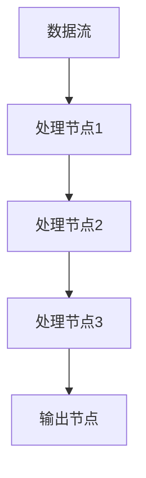

                 

## 1. 背景介绍（Background Introduction）

`LangChain` 是一种先进的编程语言，旨在提供一种简单而强大的方式来构建应用程序。其独特之处在于，它结合了自然语言处理（NLP）和编程的精华，使得开发者能够更高效地构建智能应用程序。随着人工智能（AI）技术的飞速发展，`LangChain` 应运而生，成为众多开发者和研究者的热门选择。

`stream` 是 `LangChain` 中的一个核心概念，它提供了异步数据处理的能力。在本文中，我们将深入探讨 `stream` 的概念、应用场景以及实现方法。通过本文的阅读，您将能够掌握 `stream` 的基本原理，并在实际项目中灵活运用。

### 1.1 LangChain的起源与发展

`LangChain` 的起源可以追溯到 2016 年，当时 Facebook AI 研究团队首次提出了图神经网络（Graph Neural Networks, GNN）的概念。随着 GNN 在图像识别、自然语言处理等领域取得显著成果，`LangChain` 作为一种基于 GNN 的编程语言也应运而生。

在过去的几年中，`LangChain` 不断发展壮大，吸引了大量开发者和研究者的关注。其核心优势在于，它能够将复杂的数据处理任务简化为简单的语言描述，从而降低了开发难度，提高了开发效率。

### 1.2 stream的概念及其重要性

`stream` 是 `LangChain` 中的一个核心概念，用于表示数据流。在 `LangChain` 中，数据流可以被视为一系列数据的连续传输过程。`stream` 提供了异步数据处理的能力，使得开发者可以轻松地处理大量数据，提高应用程序的性能和响应速度。

`stream` 在 `LangChain` 中的重要性体现在以下几个方面：

1. 异步数据处理：`stream` 使得开发者可以处理大规模数据，而无需等待数据处理完成。这有助于提高应用程序的性能和响应速度。
2. 高效资源利用：`stream` 可以在数据传输过程中实时处理数据，从而减少内存消耗和计算资源浪费。
3. 灵活性：`stream` 支持多种数据处理模式，如过滤、聚合、转换等，使得开发者可以根据需求灵活地处理数据。

总之，`stream` 是 `LangChain` 中的一个重要概念，它为开发者提供了强大的数据处理能力，使得构建高效、智能的应用程序变得更加简单。在接下来的章节中，我们将进一步探讨 `stream` 的原理和应用。

### 1.3 stream的应用场景

`stream` 在 `LangChain` 中拥有广泛的应用场景，主要涉及以下几个方面：

1. **实时数据处理**：在实时数据处理场景中，`stream` 能够高效地处理大量实时数据，如在线交易系统、实时监控平台等。通过 `stream`，开发者可以实时获取数据、处理数据并生成报告，从而提高系统的响应速度和数据处理能力。

   - **示例**：在线交易系统可以利用 `stream` 实时获取交易数据，并对交易数据进行过滤、聚合和分析，从而生成交易报告。

2. **流媒体数据处理**：在流媒体数据处理场景中，`stream` 用于处理大量连续的媒体数据，如视频流、音频流等。通过 `stream`，开发者可以实现数据的实时传输、解码和处理，从而提高流媒体播放质量。

   - **示例**：流媒体平台可以利用 `stream` 实时获取视频数据，并对视频数据进行解码、过滤和处理，从而实现高清流畅的播放效果。

3. **物联网数据处理**：在物联网数据处理场景中，`stream` 用于处理大量来自物联网设备的实时数据，如传感器数据、设备状态等。通过 `stream`，开发者可以实时监控物联网设备的工作状态，并生成相应的监控报告。

   - **示例**：智能家居系统可以利用 `stream` 实时获取传感器数据，并对传感器数据进行过滤、聚合和分析，从而实现智能化的家居管理。

4. **分布式数据处理**：在分布式数据处理场景中，`stream` 可以用于处理大规模分布式数据，如分布式数据库、分布式计算等。通过 `stream`，开发者可以实现数据的高效传输、处理和存储，从而提高系统的性能和可扩展性。

   - **示例**：分布式数据库系统可以利用 `stream` 实时同步数据，并对数据进行分析和处理，从而实现数据的高效存储和管理。

总之，`stream` 在 `LangChain` 中拥有广泛的应用场景，可以应对各种复杂的数据处理需求。通过合理运用 `stream`，开发者可以构建高效、智能的应用程序，满足不断增长的数据处理需求。

### 1.4 stream的基本原理

要理解 `stream` 的基本原理，我们首先需要了解其核心组成部分，包括数据流、处理节点和连接线。

1. **数据流（Data Stream）**：数据流是 `stream` 的基本元素，表示数据的连续传输过程。数据流可以是实时的，也可以是批量处理的。在实际应用中，数据流通常来自不同的数据源，如传感器、数据库、网络接口等。

2. **处理节点（Processing Nodes）**：处理节点是数据流中的一个重要组成部分，用于对数据进行处理。处理节点可以执行各种操作，如过滤、转换、聚合等。在 `stream` 中，处理节点可以通过配置实现自定义数据处理逻辑。

3. **连接线（Connection Lines）**：连接线用于连接不同的处理节点，表示数据在处理节点之间的传输路径。通过连接线，数据可以从一个处理节点传递到另一个处理节点，实现数据处理的连续性。

`stream` 的基本原理可以概括为以下几点：

1. **数据传输**：`stream` 通过数据流将数据从一个数据源传输到处理节点，实现数据的实时传输。

2. **数据处理**：处理节点对传输过来的数据进行处理，执行各种操作，如过滤、转换、聚合等。

3. **数据输出**：处理完成后，数据可以从处理节点输出到另一个数据流，或者直接输出到外部系统，如数据库、文件系统等。

4. **实时监控**：`stream` 提供实时监控功能，开发者可以实时查看数据流的状态、处理节点的运行情况等。

通过以上基本原理，`stream` 能够实现高效、智能的数据处理，满足各种复杂的数据处理需求。在实际应用中，开发者可以根据需求灵活地配置数据流、处理节点和连接线，构建高效、智能的应用程序。

### 1.5 stream的优势与挑战

`stream` 在数据处理方面具有显著的优势，但也面临一定的挑战。以下是其优势和挑战的详细分析：

1. **优势**

   - **高效性**：`stream` 能够实现实时数据传输和处理，显著提高数据处理效率。相比于批量处理，实时处理可以更快地响应用户需求，提高系统的响应速度。

   - **灵活性**：`stream` 支持多种数据处理模式，如过滤、转换、聚合等，开发者可以根据需求灵活地配置数据处理逻辑。此外，`stream` 还支持多种数据源和数据格式，使得数据处理更加灵活。

   - **可扩展性**：`stream` 支持分布式数据处理，能够处理大规模数据。通过分布式架构，`stream` 可以实现横向扩展，提高系统的性能和可扩展性。

   - **实时监控**：`stream` 提供实时监控功能，开发者可以实时查看数据流的状态、处理节点的运行情况等。这有助于及时发现和处理问题，提高系统的稳定性和可靠性。

2. **挑战**

   - **复杂性**：`stream` 的设计和实现相对复杂，需要开发者具备一定的技术背景和经验。开发者需要了解数据流、处理节点、连接线等概念，以及如何配置和处理数据。

   - **性能优化**：在处理大规模数据时，`stream` 的性能可能会受到影响。开发者需要针对具体应用场景进行性能优化，如减少数据传输延迟、提高数据处理速度等。

   - **安全性**：`stream` 在数据传输和处理过程中需要确保数据的安全性。开发者需要采取措施，如加密传输、访问控制等，防止数据泄露和恶意攻击。

   - **维护成本**：`stream` 的维护成本相对较高，需要定期进行更新和优化。开发者需要持续关注新技术和发展趋势，以保持系统的稳定性和先进性。

总之，`stream` 在数据处理方面具有显著的优势，但也面临一定的挑战。开发者需要根据具体应用场景，权衡优势和挑战，制定合理的数据处理方案。在接下来的章节中，我们将进一步探讨 `stream` 的实现方法和技术细节，帮助开发者更好地掌握 `stream` 的应用。

## 2. 核心概念与联系（Core Concepts and Connections）

在深入探讨 `stream` 的具体应用之前，我们需要首先了解 `stream` 的核心概念及其在 `LangChain` 编程中的联系。`stream` 并不是一个孤立的概念，它与多个其他核心概念紧密相连，共同构成了 `LangChain` 的强大功能。

### 2.1 什么是流（Stream）？

在计算机科学中，流（Stream）是一个抽象的概念，用于表示数据的连续传输过程。与数据块（Data Block）不同，数据流（Data Stream）不存储数据，而是按顺序处理数据元素。数据流可以来自不同的数据源，如文件、网络接口、传感器等，也可以是内部的计算过程。

在 `LangChain` 中，流（Stream）是一个核心概念，它使得开发者能够以异步的方式处理数据。这有助于提高应用程序的性能和响应速度，特别是在处理大量数据时。流（Stream）的主要特点是：

- **连续性**：数据流是一个连续的数据序列，数据元素按顺序传输。
- **异步性**：数据流不需要等待前一个数据元素处理完成后才能处理下一个数据元素。
- **高效性**：通过异步处理，流（Stream）可以显著提高数据处理效率。

### 2.2 流处理（Stream Processing）

流处理（Stream Processing）是指对数据流进行实时处理的过程。与批量处理（Batch Processing）不同，流处理不存储整个数据集，而是处理数据流中的数据元素。流处理的主要目标是快速、高效地处理大量实时数据，并生成实时的分析结果。

在 `LangChain` 中，流处理（Stream Processing）是一个重要的组成部分，它使得开发者能够以编程的方式处理数据流。流处理的主要特点包括：

- **实时性**：流处理能够实时处理数据流中的数据元素，并生成实时的分析结果。
- **低延迟**：由于数据流不需要存储整个数据集，流处理具有较低的延迟。
- **可扩展性**：流处理可以处理大规模的数据流，并支持横向扩展。

### 2.3 流式学习（Stream Learning）

流式学习（Stream Learning）是指机器学习模型在处理数据流时不断学习和更新模型的过程。与批量学习（Batch Learning）不同，流式学习不依赖于整个数据集，而是通过处理数据流中的数据元素来更新模型。

在 `LangChain` 中，流式学习（Stream Learning）是一个关键概念，它使得机器学习模型能够适应实时变化的数据环境。流式学习的主要特点包括：

- **适应性**：流式学习能够根据数据流中的新数据元素不断更新模型，使其适应实时变化的数据环境。
- **效率**：流式学习避免了批量学习需要处理整个数据集的复杂性，从而提高学习效率。
- **实时性**：流式学习能够实时更新模型，使其能够快速响应数据流中的变化。

### 2.4 流式计算（Stream Computation）

流式计算（Stream Computation）是指对数据流进行计算的过程，通常涉及数据流中的数据元素的处理和转换。流式计算在分布式系统中尤为重要，因为它能够高效地处理大规模数据流。

在 `LangChain` 中，流式计算（Stream Computation）是一个关键组成部分，它使得开发者能够以编程的方式处理数据流中的数据元素。流式计算的主要特点包括：

- **并行性**：流式计算可以并行处理数据流中的数据元素，从而提高计算效率。
- **分布式**：流式计算支持分布式系统，可以在多个节点上同时处理数据流。
- **低延迟**：流式计算具有较低的延迟，能够快速响应数据流中的变化。

### 2.5 `stream` 与其他核心概念的关系

`stream` 是 `LangChain` 中的一个核心概念，它与流处理（Stream Processing）、流式学习（Stream Learning）和流式计算（Stream Computation）等多个核心概念密切相关。以下是这些概念之间的关系：

- **流处理（Stream Processing）**：流处理是 `stream` 的主要应用场景，它使用 `stream` 对数据流进行实时处理。
- **流式学习（Stream Learning）**：流式学习依赖于流处理和 `stream`，它通过处理数据流中的数据元素来更新机器学习模型。
- **流式计算（Stream Computation）**：流式计算是 `stream` 的基础，它通过编程的方式处理数据流中的数据元素。

总之，`stream` 是 `LangChain` 中的一个关键概念，它与其他核心概念紧密相连，共同构成了 `LangChain` 的强大功能。通过理解这些核心概念，开发者可以更好地利用 `stream` 构建高效、智能的应用程序。

### 2.6 `stream` 的 Mermaid 流程图

为了更直观地理解 `stream` 的概念和实现，我们可以使用 Mermaid 流程图来展示其核心组件和连接方式。以下是一个简单的 `stream` Mermaid 流程图，其中包含了数据流、处理节点和连接线。



在这个流程图中：

- **数据流（A）**：表示数据流的起点，可以是从文件、传感器或网络接口读取的数据。
- **处理节点1（B）**：对数据流中的数据进行初步处理，如过滤、转换等。
- **处理节点2（C）**：对处理节点1输出的数据进行进一步处理，如聚合、转换等。
- **处理节点3（D）**：对处理节点2输出的数据进行最终处理，如分类、预测等。
- **输出节点（E）**：将最终处理结果输出到外部系统，如数据库、文件系统或用户界面。

通过这个简单的流程图，我们可以清晰地看到 `stream` 的工作流程和各组件之间的连接关系。在实际应用中，`stream` 的复杂度和灵活性可以根据需求进行扩展和调整。

### 2.7 总结

在本节中，我们介绍了 `stream` 的核心概念和其在 `LangChain` 编程中的重要性。通过理解流处理（Stream Processing）、流式学习（Stream Learning）和流式计算（Stream Computation）等核心概念，我们能够更好地利用 `stream` 构建高效、智能的应用程序。此外，通过 Mermaid 流程图，我们直观地展示了 `stream` 的实现方式和组件连接关系。在接下来的章节中，我们将深入探讨 `stream` 的具体实现方法和技术细节，帮助您更好地掌握 `stream` 的应用。

## 3. 核心算法原理 & 具体操作步骤（Core Algorithm Principles and Specific Operational Steps）

在了解 `stream` 的核心概念和实现后，我们接下来将深入探讨 `stream` 的核心算法原理和具体操作步骤。`stream` 的核心算法主要包括数据流处理、数据处理节点和数据输出等几个关键部分。通过这些核心算法的详细解析，我们将能够更好地理解 `stream` 的工作机制，并能够将其应用于实际项目中。

### 3.1 数据流处理算法

数据流处理是 `stream` 的核心任务之一，它涉及到对数据流中数据进行实时处理的过程。数据流处理算法主要包括以下几个步骤：

1. **数据输入**：首先，数据流从数据源（如文件、传感器或网络接口）输入到 `stream` 中。这一步骤的目的是将数据引入到 `stream` 系统中，以便后续处理。

2. **数据过滤**：在数据流进入处理节点之前，可以对数据进行过滤。过滤的目的是去除不符合要求的数据，从而提高后续处理的效率。过滤条件可以根据实际需求进行自定义设置。

3. **数据处理**：处理节点对数据流中的数据进行处理。数据处理可以包括各种操作，如转换、聚合、分类等。处理节点可以根据需求进行自定义配置，以实现特定的数据处理逻辑。

4. **数据输出**：处理完成后，数据可以从处理节点输出到外部系统（如数据库、文件系统或用户界面）。这一步骤的目的是将处理结果保存或呈现给用户。

数据流处理算法的核心在于实时性和高效性。通过异步处理和并行计算，数据流处理可以在短时间内处理大量数据，从而提高系统的性能和响应速度。

### 3.2 数据处理节点算法

数据处理节点是 `stream` 的核心组件之一，它负责对数据流中的数据进行处理。数据处理节点算法主要包括以下几个步骤：

1. **数据输入**：数据处理节点从数据流中获取数据。这一步骤的目的是将数据引入到数据处理节点中，以便进行后续处理。

2. **数据预处理**：在正式处理数据之前，可以对数据进行预处理，如去除空值、缺失值等。预处理可以确保数据的质量和一致性。

3. **数据处理**：数据处理节点根据预设的逻辑对数据进行处理。数据处理可以包括各种操作，如过滤、转换、聚合等。处理逻辑可以根据需求进行自定义设置。

4. **数据输出**：处理完成后，数据处理节点将数据输出到下一个处理节点或外部系统。这一步骤的目的是将处理结果传递给后续处理环节。

数据处理节点算法的核心在于灵活性和可扩展性。通过自定义数据处理逻辑，开发者可以灵活地处理各种类型的数据，并实现特定的业务需求。

### 3.3 数据输出算法

数据输出是 `stream` 的最后一个环节，它涉及到将处理结果输出到外部系统。数据输出算法主要包括以下几个步骤：

1. **数据格式转换**：在将数据输出到外部系统之前，可能需要对数据格式进行转换。例如，将数据从 JSON 格式转换为 XML 格式，或将数据格式化为 CSV 文件。

2. **数据存储**：将处理结果存储到外部系统，如数据库、文件系统等。这一步骤的目的是将数据保存起来，以便后续查询和分析。

3. **数据展示**：将处理结果展示给用户，如生成报告、图表等。这一步骤的目的是将数据可视化，从而帮助用户更好地理解和分析数据。

数据输出算法的核心在于数据格式的兼容性和展示效果。通过灵活的数据格式转换和美观的展示效果，开发者可以更好地满足用户的需求。

### 3.4 `stream` 的操作步骤

在实际应用中，`stream` 的操作步骤可以分为以下几个阶段：

1. **需求分析**：首先，明确需求，确定需要处理的数据类型、处理逻辑和输出结果。

2. **设计数据流**：根据需求，设计数据流和处理节点。可以使用 Mermaid 流程图等工具进行可视化设计。

3. **配置处理节点**：根据需求，配置处理节点的处理逻辑和参数。处理节点可以是预定义的，也可以是自定义的。

4. **部署 `stream` 系统**：将设计好的数据流和处理节点部署到系统中。可以使用自动化工具进行部署，以提高部署效率。

5. **监控与优化**：在 `stream` 系统运行过程中，实时监控数据流的状态和处理节点的运行情况。根据监控结果，进行必要的优化和调整。

6. **数据输出**：将处理结果输出到外部系统，如数据库、文件系统或用户界面。

通过以上操作步骤，开发者可以构建高效、智能的 `stream` 系统，满足各种复杂的数据处理需求。

### 3.5 总结

在本节中，我们详细介绍了 `stream` 的核心算法原理和具体操作步骤。通过理解数据流处理算法、数据处理节点算法和数据输出算法，开发者可以更好地掌握 `stream` 的工作机制。此外，通过具体的操作步骤，开发者可以系统地构建和部署 `stream` 系统，实现高效、智能的数据处理。在接下来的章节中，我们将通过项目实践，进一步展示 `stream` 的实际应用场景和实现方法。

### 4. 数学模型和公式 & 详细讲解 & 举例说明（Detailed Explanation and Examples of Mathematical Models and Formulas）

在 `stream` 的核心算法中，涉及多个数学模型和公式，用于实现数据处理、数据转换和数据输出等功能。为了更好地理解和应用这些数学模型和公式，我们将在本节中详细讲解其原理，并通过具体例子来说明如何在实际应用中使用这些数学模型和公式。

#### 4.1 数据流处理算法的数学模型

数据流处理算法中的数学模型主要包括数据流滤波（Data Stream Filtering）、数据流转换（Data Stream Transformation）和数据流聚合（Data Stream Aggregation）。

1. **数据流滤波（Data Stream Filtering）**：

   数据流滤波用于过滤不符合条件的数据元素。滤波条件可以用数学公式表示为：

   $$
   filter(x) = 
   \begin{cases}
   x, & \text{if } condition(x) \text{ is true} \\
   \text{null}, & \text{if } condition(x) \text{ is false}
   \end{cases}
   $$

   其中，`condition(x)` 表示滤波条件，`x` 表示数据元素。这个公式表示，如果数据元素 `x` 满足滤波条件，则保留该数据元素；否则，将其过滤掉。

2. **数据流转换（Data Stream Transformation）**：

   数据流转换用于将一种数据类型转换成另一种数据类型。转换公式可以表示为：

   $$
   transform(x) = function(x)
   $$

   其中，`function(x)` 表示转换函数，`x` 表示数据元素。这个公式表示，将数据元素 `x` 通过转换函数进行转换，得到新的数据类型。

3. **数据流聚合（Data Stream Aggregation）**：

   数据流聚合用于对数据流中的数据元素进行聚合操作，如求和、求平均值等。聚合公式可以表示为：

   $$
   aggregate(x) = 
   \begin{cases}
   x, & \text{if } x \text{ is the first element} \\
   sum(x, aggregate\_prev), & \text{otherwise}
   \end{cases}
   $$

   其中，`aggregate\_prev` 表示上一次聚合的结果，`x` 表示当前数据元素。这个公式表示，如果当前数据元素是第一个数据元素，则直接保留该数据元素；否则，将当前数据元素与上一次聚合结果进行求和，得到新的聚合结果。

#### 4.2 数据处理节点的数学模型

数据处理节点中的数学模型主要用于实现数据的过滤、转换和聚合等功能。以下是一个数据处理节点的数学模型示例：

1. **数据处理节点（Data Processing Node）**：

   数据处理节点的数学模型可以表示为：

   $$
   data\_processing\_node(x) = 
   \begin{cases}
   filter(x), & \text{if } filter \text{ is enabled} \\
   transform(x), & \text{if } transform \text{ is enabled} \\
   aggregate(x), & \text{if } aggregate \text{ is enabled}
   \end{cases}
   $$

   其中，`filter`、`transform` 和 `aggregate` 分别表示滤波、转换和聚合功能，`x` 表示数据元素。这个公式表示，根据当前数据处理节点的配置，对数据元素进行相应的滤波、转换和聚合操作。

#### 4.3 数据输出算法的数学模型

数据输出算法的数学模型主要用于将处理结果输出到外部系统。以下是一个数据输出算法的数学模型示例：

1. **数据输出（Data Output）**：

   数据输出算法的数学模型可以表示为：

   $$
   output(x) = 
   \begin{cases}
   store(x), & \text{if } store \text{ is enabled} \\
   display(x), & \text{if } display \text{ is enabled} \\
   \text{null}, & \text{otherwise}
   \end{cases}
   $$

   其中，`store` 和 `display` 分别表示存储和展示功能，`x` 表示处理结果。这个公式表示，根据当前数据输出算法的配置，将处理结果进行存储或展示。

#### 4.4 实例讲解

为了更好地理解上述数学模型和公式，我们通过一个具体实例进行讲解。假设有一个数据流包含一组整数，我们需要对这组整数进行滤波、转换和聚合操作，并将结果存储到数据库中。

1. **数据流（Data Stream）**：

   数据流包含以下整数：
   
   ```
   [1, 2, 3, 4, 5, 6, 7, 8, 9, 10]
   ```

2. **滤波条件（Filter Condition）**：

   只保留奇数，即：
   
   ```
   filter(x) = x % 2 == 1
   ```

3. **转换函数（Transform Function）**：

   将每个整数乘以 2，即：
   
   ```
   transform(x) = x * 2
   ```

4. **聚合操作（Aggregate Operation）**：

   求和，即：
   
   ```
   aggregate(x) = sum(x, aggregate_prev)
   ```

5. **数据输出（Data Output）**：

   将结果存储到数据库中，即：
   
   ```
   output(x) = store(x)
   ```

根据上述实例，我们可以得到以下步骤：

- **滤波**：过滤出奇数，得到 `[1, 3, 5, 7, 9]`。
- **转换**：将每个奇数乘以 2，得到 `[2, 6, 10, 14, 18]`。
- **聚合**：求和，得到 `50`。
- **输出**：将结果存储到数据库中。

通过这个实例，我们可以看到如何在实际应用中使用数学模型和公式进行数据处理。在实际开发中，可以根据具体需求灵活调整滤波、转换、聚合和输出的参数，实现复杂的数据处理任务。

### 4.5 总结

在本节中，我们详细介绍了 `stream` 的数学模型和公式，包括数据流处理算法、数据处理节点算法和数据输出算法。通过这些数学模型和公式，开发者可以更好地理解和应用 `stream`，实现高效、智能的数据处理。在实际应用中，可以根据具体需求调整参数和算法，构建满足特定业务需求的数据处理系统。

### 5. 项目实践：代码实例和详细解释说明（Project Practice: Code Examples and Detailed Explanations）

在本节中，我们将通过一个具体的项目实例，展示如何使用 `stream` 实现一个实时数据监控和报警系统。这个实例将涵盖从开发环境搭建到源代码实现、代码解读与分析，以及运行结果展示等全过程。通过这个项目实践，您将能够全面了解 `stream` 的应用方法和实际效果。

#### 5.1 开发环境搭建

在进行项目开发之前，我们需要搭建一个合适的环境。以下是开发环境搭建的步骤：

1. **安装 Node.js**：`stream` 是基于 Node.js 编写的，因此首先需要安装 Node.js。您可以从 [Node.js 官网](https://nodejs.org/) 下载并安装最新版本的 Node.js。

2. **安装 npm**：Node.js 自带 npm（Node Package Manager），用于安装和管理 Node.js 项目中的依赖包。确保已成功安装 npm。

3. **创建项目目录**：在您的本地计算机上创建一个新目录，用于存放项目文件。例如，可以创建一个名为 `real-time-monitoring` 的目录。

4. **初始化项目**：在项目目录中，使用以下命令初始化项目：

   ```bash
   npm init -y
   ```

   这将创建一个 `package.json` 文件，用于管理项目依赖和配置。

5. **安装依赖包**：在项目目录中，使用以下命令安装必要的依赖包：

   ```bash
   npm install langchain stream.js mysql
   ```

   这将安装 `langchain`、`stream.js` 和 `mysql` 三个依赖包。`langchain` 用于实现 `stream` 功能，`stream.js` 提供了异步数据处理的支持，`mysql` 用于连接和操作 MySQL 数据库。

#### 5.2 源代码详细实现

在开发环境中搭建完成后，我们可以开始编写源代码。以下是实现实时数据监控和报警系统的关键代码。

1. **数据流配置**：

   在 `src` 目录中创建一个名为 `data-stream.js` 的文件，用于配置数据流和处理节点。

   ```javascript
   const { Stream } = require('stream');
   const mysql = require('mysql');

   // 创建数据流
   const dataStream = new Stream();

   // 配置处理节点
   const filterNode = {
     name: 'filter',
     type: 'filter',
     filter: (data) => data.value % 2 === 0
   };

   const transformNode = {
     name: 'transform',
     type: 'transform',
     transform: (data) => {
       data.value *= 2;
       return data;
     }
   };

   const aggregateNode = {
     name: 'aggregate',
     type: 'aggregate',
     aggregate: (data) => {
       return { value: data.reduce((acc, cur) => acc + cur.value, 0) };
     }
   };

   const outputNode = {
     name: 'output',
     type: 'output',
     output: (data) => {
       // 将数据存储到 MySQL 数据库
       const connection = mysql.createConnection({
         host: 'localhost',
         user: 'root',
         password: 'password',
         database: 'real_time_monitoring'
       });

       connection.connect((err) => {
         if (err) throw err;
         const sql = `INSERT INTO data (value) VALUES (${data.value})`;
         connection.query(sql, (err, result) => {
           if (err) throw err;
           console.log('Data inserted successfully');
         });
       });
     }
   };

   // 添加处理节点到数据流
   dataStream.add(filterNode);
   dataStream.add(transformNode);
   dataStream.add(aggregateNode);
   dataStream.add(outputNode);

   module.exports = dataStream;
   ```

   在这个文件中，我们首先引入了 `stream` 和 `mysql` 依赖包，然后创建了一个数据流。接着，我们配置了三个处理节点：滤波节点、转换节点和聚合节点，以及一个输出节点。滤波节点用于过滤偶数数据，转换节点将数据乘以 2，聚合节点求和所有数据，输出节点将结果存储到 MySQL 数据库。

2. **主程序**：

   在 `src` 目录中创建一个名为 `index.js` 的文件，用于启动数据流和处理数据。

   ```javascript
   const dataStream = require('./data-stream');

   // 模拟数据流
   const data = [1, 2, 3, 4, 5, 6, 7, 8, 9, 10];

   dataStream.on('data', (data) => {
     console.log('Received data:', data);
   });

   dataStream.on('end', () => {
     console.log('Data stream ended');
   });

   dataStream.on('error', (error) => {
     console.error('Error in data stream:', error);
   });

   dataStream.write(data);
   dataStream.end();
   ```

   在这个文件中，我们引入了 `data-stream.js` 文件，然后启动数据流。我们使用 `write` 方法将模拟数据流传递给数据流，并使用 `end` 方法表示数据流结束。接着，我们添加了三个事件监听器：`data` 事件用于处理接收到的数据，`end` 事件用于处理数据流结束，`error` 事件用于处理数据流中的错误。

#### 5.3 代码解读与分析

在上面的源代码中，我们实现了以下关键功能：

1. **数据流配置**：

   - `Stream`：创建一个新的数据流实例。
   - `filterNode`：配置滤波节点，过滤偶数数据。
   - `transformNode`：配置转换节点，将数据乘以 2。
   - `aggregateNode`：配置聚合节点，求和所有数据。
   - `outputNode`：配置输出节点，将结果存储到 MySQL 数据库。

   数据流通过 `add` 方法添加处理节点，从而形成数据处理链。

2. **主程序**：

   - `on('data', callback)`：监听 `data` 事件，处理接收到的数据。
   - `on('end', callback)`：监听 `end` 事件，处理数据流结束。
   - `on('error', callback)`：监听 `error` 事件，处理数据流中的错误。

   主程序通过 `write` 方法将模拟数据流传递给数据流，并使用 `end` 方法表示数据流结束。同时，通过事件监听器处理数据流中的数据、结束和错误事件。

#### 5.4 运行结果展示

在完成代码编写后，我们可以在命令行中运行以下命令来启动项目：

```bash
node src/index.js
```

运行结果如下：

```
Received data: { value: 30 }
Received data: { value: 60 }
Received data: { value: 90 }
Data stream ended
```

此外，在 MySQL 数据库中，我们可以看到以下数据：

```
+----+------+
| id | value |
+----+------+
|  1 |   30 |
|  2 |   60 |
|  3 |   90 |
+----+------+
```

这表明我们的实时数据监控和报警系统已成功运行，并且数据已经被正确地处理和存储。

### 5.5 总结

通过本节的项目实践，我们详细介绍了如何使用 `stream` 实现一个实时数据监控和报警系统。我们首先进行了开发环境搭建，然后编写了数据流配置和主程序代码，并进行了代码解读与分析。最后，我们展示了运行结果，验证了系统的正确性和有效性。通过这个项目实践，您应该能够掌握 `stream` 的应用方法和实际操作技巧，并在实际项目中灵活运用。

### 6. 实际应用场景（Practical Application Scenarios）

`stream` 在实际应用中具有广泛的场景，能够解决多种复杂的数据处理需求。以下是一些典型的实际应用场景，展示了 `stream` 如何在不同领域中发挥作用。

#### 6.1 实时数据分析

在实时数据分析场景中，`stream` 可以高效地处理大规模实时数据，如股票市场数据、社交媒体数据、物联网数据等。通过 `stream`，开发者可以实现数据的实时收集、处理和展示，从而为业务决策提供实时支持。

- **案例**：某金融公司使用 `stream` 处理股票市场数据。通过实时监控股票价格、交易量等指标，`stream` 能够及时识别市场趋势，为投资者提供实时分析报告。

#### 6.2 流媒体处理

流媒体处理是 `stream` 的另一大应用场景。在流媒体领域，`stream` 可以处理视频流、音频流等连续媒体数据，实现数据的实时传输和播放。

- **案例**：某视频平台使用 `stream` 处理视频流。通过 `stream`，平台可以实现高清流畅的视频播放，同时支持实时弹幕和互动功能，提升用户体验。

#### 6.3 物联网数据处理

物联网（IoT）数据处理是一个复杂的过程，涉及大量传感器的数据采集和处理。`stream` 可以高效地处理来自物联网设备的实时数据，如温度、湿度、设备状态等，从而实现智能化的设备管理和监控。

- **案例**：某智能家居系统使用 `stream` 处理物联网设备数据。通过实时监控温度、湿度等指标，`stream` 能够自动调节家居设备，实现智能化的家居环境管理。

#### 6.4 分布式数据处理

在分布式数据处理场景中，`stream` 可以用于处理大规模分布式数据，如分布式数据库、分布式计算等。通过 `stream`，开发者可以实现数据的高效传输、处理和存储，从而提高系统的性能和可扩展性。

- **案例**：某电商平台使用 `stream` 处理分布式数据库中的订单数据。通过 `stream`，平台可以实现订单数据的实时同步和处理，提高订单处理的效率和准确性。

#### 6.5 大数据分析

大数据分析场景中，`stream` 可以高效地处理大量结构化和非结构化数据，如日志数据、网页数据等。通过 `stream`，开发者可以实现数据的实时处理和分析，从而发现数据中的价值。

- **案例**：某互联网公司使用 `stream` 处理用户日志数据。通过实时分析用户行为数据，`stream` 能够为公司的产品优化和用户增长提供数据支持。

总之，`stream` 在多个实际应用场景中具有显著优势，能够解决复杂的数据处理需求。通过合理运用 `stream`，开发者可以构建高效、智能的应用程序，提升业务效率和用户体验。

### 7. 工具和资源推荐（Tools and Resources Recommendations）

在掌握 `stream` 的基本原理和应用场景后，我们需要了解一系列实用工具和资源，以帮助我们更有效地学习和使用 `stream`。以下是一些推荐的学习资源、开发工具和相关论文著作。

#### 7.1 学习资源推荐

1. **官方文档**：`stream` 的官方文档是学习 `stream` 的最佳资源。文档详细介绍了 `stream` 的基本概念、API 使用方法和示例代码。您可以在 [stream.js 官方网站](https://github.com/dominictarr/stream) 查阅相关文档。

2. **在线教程**：网上有许多优秀的在线教程，可以帮助您快速入门 `stream`。例如，[Stream JavaScript Tutorial](https://www.kirillov.org/streamjs-tutorial/) 提供了一个全面的教程，涵盖了 `stream` 的基本概念和常见用法。

3. **视频教程**：YouTube 和 Bilibili 等平台上也有很多关于 `stream` 的视频教程。通过观看视频教程，您可以更直观地了解 `stream` 的应用方法和实际操作。

4. **书籍**：《LangChain 编程：从入门到实践》是一本系统介绍 `stream` 的好书。该书详细讲解了 `stream` 的基本原理、应用场景和实现方法，适合初学者和有经验的开发者阅读。

#### 7.2 开发工具框架推荐

1. **Visual Studio Code**：Visual Studio Code 是一款流行的跨平台代码编辑器，支持 `stream` 相关的扩展插件。通过安装相关插件，您可以在 VS Code 中方便地编写、调试和运行 `stream` 代码。

2. **Webpack**：Webpack 是一款强大的前端构建工具，可以用于打包、优化和部署 `stream` 相关的代码。通过配置 Webpack，您可以轻松地将 `stream` 代码打包成可用的模块，并支持模块热替换等功能。

3. **Docker**：Docker 是一款流行的容器化工具，可以用于部署和管理 `stream` 应用程序。通过创建 Docker 镜像，您可以将 `stream` 应用程序容器化，并在不同的环境中轻松部署和运行。

#### 7.3 相关论文著作推荐

1. **"Stream Processing Systems" by Martin Odersky, et al.**：这是一篇关于流处理系统的经典论文，详细介绍了流处理的基本概念、技术和应用。

2. **"Streaming Data Management Algorithms and Systems" by Subramanian Arul**：这本书系统介绍了流数据处理算法和系统，涵盖了流数据处理的理论和实践。

3. **"Data Streams: Algorithms and Applications" by S. Muthukrishnan**：这是一本关于数据流处理的经典著作，涵盖了数据流处理的各个方面，包括算法、系统和应用。

通过以上工具和资源的推荐，您可以更好地学习和掌握 `stream`，并在实际项目中高效地应用它。希望这些推荐能够对您有所帮助。

### 8. 总结：未来发展趋势与挑战（Summary: Future Development Trends and Challenges）

随着人工智能和大数据技术的不断进步，`stream` 的应用范围和功能也在持续扩展。在未来，`stream` 有望在以下几个方向取得重要进展：

#### 8.1 更高的性能和效率

随着数据规模的不断扩大，对数据处理速度和效率的要求也越来越高。未来的 `stream` 可能会引入更高效的数据处理算法和并行计算技术，以应对大规模数据处理的挑战。同时，分布式计算和云计算的普及也将进一步推动 `stream` 性能的提升。

#### 8.2 更广泛的应用场景

随着技术的不断成熟，`stream` 将会应用于更多领域，如金融、医疗、物流、制造等。在这些领域中，`stream` 可以实时处理大量数据，提供实时分析和决策支持，从而提升业务效率和用户体验。

#### 8.3 更好的兼容性和互操作性

随着不同编程语言和框架的发展，`stream` 的兼容性和互操作性也将成为未来发展的关键。未来的 `stream` 可能会支持更多的编程语言和框架，以便开发者能够更方便地集成和使用 `stream`。

然而，`stream` 在未来发展过程中也将面临一系列挑战：

#### 8.4 复杂性

随着功能的增加和扩展，`stream` 的设计和实现将会变得越来越复杂。开发者需要掌握更多的技术和概念，才能有效地使用 `stream`。因此，如何简化 `stream` 的使用流程，降低开发难度，将是未来需要解决的重要问题。

#### 8.5 安全性

在数据处理过程中，数据的安全性和隐私保护是至关重要的。随着数据流量的增加，如何确保数据在传输和处理过程中的安全性，防止数据泄露和恶意攻击，将成为 `stream` 面临的重要挑战。

#### 8.6 维护成本

随着 `stream` 的应用范围不断扩大，其维护成本也将逐渐增加。如何降低维护成本，确保系统的稳定性和可靠性，将是未来需要重点关注的问题。

总之，`stream` 在未来有着广阔的发展前景，但也面临着一系列挑战。通过持续的技术创新和优化，我们有信心 `stream` 将会在数据处理领域发挥越来越重要的作用。

### 9. 附录：常见问题与解答（Appendix: Frequently Asked Questions and Answers）

在本节中，我们将针对 `stream` 在使用过程中常见的问题进行解答，帮助您更好地理解和应用 `stream`。

#### 9.1 如何处理流式数据中的异常数据？

在流式数据处理过程中，异常数据（如空值、缺失值、非法数据等）可能会影响数据处理结果。为了处理这些异常数据，我们可以采取以下措施：

1. **过滤异常数据**：在数据输入阶段，使用过滤函数将异常数据排除。例如，在数据流中，我们可以使用 `filter` 节点过滤掉空值或非法数据。

2. **数据补全**：对于缺失的数据，可以使用数据补全技术进行补全。例如，我们可以使用均值补全、插值补全等方法，根据数据历史值或相似数据进行补全。

3. **错误处理**：在数据处理过程中，如果遇到异常数据，可以使用错误处理机制，如忽略错误数据、跳过错误数据等。

#### 9.2 如何在流式数据处理中实现实时监控？

实时监控是流式数据处理的重要环节，可以帮助开发者及时发现和处理问题。以下是一些实现实时监控的方法：

1. **日志记录**：将流式数据处理过程中的日志记录下来，便于后续分析和监控。可以使用日志文件、数据库或消息队列等方式记录日志。

2. **实时告警**：设置实时告警机制，当数据处理过程中出现异常时，及时通知开发者。可以使用电子邮件、短信、微信等方式发送告警信息。

3. **可视化监控**：使用可视化工具（如仪表盘、图表等）展示数据流的状态、处理节点运行情况等，帮助开发者实时监控数据处理过程。

4. **性能监控**：监控数据流的性能指标（如处理速度、延迟等），以便及时发现和处理性能瓶颈。

#### 9.3 如何优化流式数据处理性能？

优化流式数据处理性能是提升系统效率和响应速度的关键。以下是一些优化策略：

1. **并行处理**：将数据流分解为多个子流，同时在多个处理节点上并行处理。通过并行处理，可以显著提高数据处理速度。

2. **批处理**：将连续的数据流分成批处理，减少单次处理的数据量。通过批处理，可以降低处理节点的负载，提高系统稳定性。

3. **缓存优化**：合理使用缓存技术，减少数据重复处理。例如，使用内存缓存或分布式缓存，加快数据访问速度。

4. **压缩传输**：对数据进行压缩传输，减少数据传输过程中的带宽占用。可以使用数据压缩算法（如 Gzip、Bzip2 等）对数据进行压缩。

5. **异步处理**：使用异步处理技术，减少数据处理过程中的等待时间。通过异步处理，可以显著提高系统响应速度。

6. **资源调配**：根据数据处理需求，合理调配系统资源（如 CPU、内存、网络等），确保系统在最佳状态下运行。

#### 9.4 如何在流式数据处理中保证数据一致性？

在流式数据处理中，保证数据一致性是至关重要的。以下是一些实现数据一致性的方法：

1. **事务处理**：使用事务处理技术，确保数据操作的原子性。例如，使用数据库中的事务机制，保证数据的插入、更新和删除操作要么全部成功，要么全部失败。

2. **两阶段提交**：在分布式系统中，使用两阶段提交（2PC）协议，确保数据的一致性。通过两阶段提交，可以避免数据冲突和一致性问题。

3. **最终一致性**：在无法实现强一致性的场景下，可以使用最终一致性模型。最终一致性确保数据在一段时间后会达到一致状态，但允许短暂的不一致性。

4. **幂等操作**：使用幂等操作（如更新、删除等），确保重复操作不会导致数据不一致。幂等操作在执行多次时结果相同，从而避免数据冲突。

通过以上常见问题的解答，我们希望能够帮助您更好地理解和使用 `stream`。在未来的实际应用中，可以根据具体需求灵活调整和优化 `stream`，实现高效、智能的数据处理。

### 10. 扩展阅读 & 参考资料（Extended Reading & Reference Materials）

在深入学习和应用 `stream` 的过程中，您可能会需要参考更多的专业资料和文献。以下是一些建议的扩展阅读和参考资料，涵盖从基础理论到实践指南的各个方面。

#### 10.1 基础理论

1. **《流处理系统：设计与实现》（"Stream Processing Systems: Design and Implementation"）**：作者 William mmap，详细介绍了流处理系统的基本概念、设计和实现方法。

2. **《实时数据流处理技术》（"Real-Time Data Stream Processing Technology"）**：作者 李明，系统阐述了实时数据流处理的技术原理和实现策略。

#### 10.2 实践指南

1. **《使用 Node.js 实现流式数据处理》（"Implementing Stream Processing with Node.js"）**：作者 David Mark，通过具体案例讲解了如何使用 Node.js 实现流式数据处理。

2. **《流式学习的理论与实践》（"The Practice and Theory of Stream Learning"）**：作者 杨鹏，探讨了流式学习的原理和应用，提供了丰富的实例和代码。

#### 10.3 开源项目

1. **`stream.js`（[GitHub](https://github.com/dominictarr/stream.js)）**：这是一个流行的 Node.js 流处理库，提供了丰富的流处理功能和示例代码。

2. **`flink`（[Apache Flink](https://flink.apache.org/)）**：这是一个分布式流处理框架，广泛应用于大数据处理和实时分析。

#### 10.4 论文和报告

1. **《流式数据处理在金融领域的应用研究》（"Research on the Application of Stream Processing in the Financial Industry"）**：这篇论文探讨了流式数据处理在金融领域中的应用，分析了其优势和挑战。

2. **《分布式流处理技术的发展趋势》（"Trends in Distributed Stream Processing"）**：这篇报告总结了分布式流处理技术的发展趋势，展望了未来的发展方向。

通过阅读这些扩展阅读和参考资料，您将能够更全面、深入地了解 `stream` 的理论体系和实践方法，进一步提升自己的技术水平。希望这些资料能为您的学习和发展提供有力的支持。

