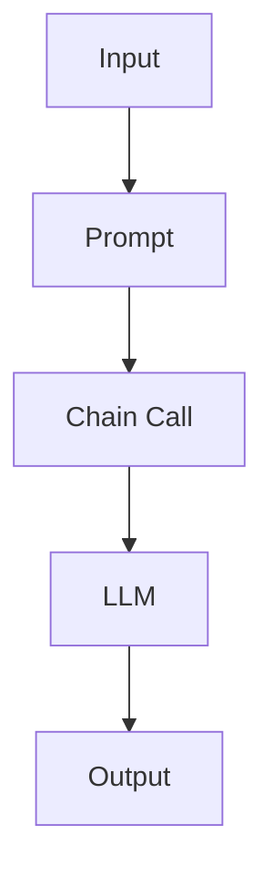

                 

### 文章标题

【LangChain编程：从入门到实践】开发环境准备

### Keywords:

- LangChain
- Development Environment
- Programming
- Setup
- Hands-on Practice

### Abstract:

This article provides a comprehensive guide to setting up a development environment for LangChain programming. From understanding the core concepts to practical implementation, we will explore the necessary steps, tools, and resources required to start your journey in LangChain development. By the end of this article, you will have a clear understanding of how to prepare your environment and be ready to dive into hands-on projects.

## 1. 背景介绍（Background Introduction）

### 1.1 LangChain简介

LangChain是一个基于Python的编程框架，旨在简化链式语言模型（如ChatGPT）的应用开发。它通过提供一系列模块化的组件，使得开发者能够轻松地将语言模型集成到自己的应用程序中，实现自然语言处理（NLP）任务。LangChain的核心理念是利用链式调用（chain calls）来引导模型生成符合预期结果的输出。

### 1.2 LangChain的重要性

随着人工智能和自然语言处理技术的不断发展，对NLP应用的需求日益增长。LangChain的出现为开发者提供了一种高效的解决方案，使得他们在不深入理解复杂模型细节的情况下，能够快速构建实用的NLP应用。通过使用LangChain，开发者可以节省大量的时间和精力，专注于业务逻辑的实现。

### 1.3 目标读者

本文面向希望入门并实践LangChain编程的读者。无论您是初学者还是有一定编程经验的开发者，本文都将为您提供一个全面的指南，帮助您从零开始搭建开发环境，掌握核心概念，并逐步深入到实际应用中。

## 2. 核心概念与联系（Core Concepts and Connections）

### 2.1 LangChain的基本组件

LangChain由以下几个核心组件组成：

- **Prompt**：提示词，用于引导模型生成特定类型的输出。
- **Chain**：链式组件，用于组合多个Prompt和中间处理步骤。
- **Chain Calls**：链式调用，将提示词传递给模型并获取输出。
- **LLM（Language Learning Model）**：语言学习模型，如ChatGPT，用于生成响应。

### 2.2 LangChain的架构

LangChain的架构设计遵循模块化原则，使得开发者可以根据需求组合不同的组件。以下是LangChain的简化架构图：



### 2.3 提示词工程的作用

提示词工程是LangChain编程的重要组成部分。通过精心设计的提示词，开发者可以引导模型生成更符合预期结果的输出。提示词工程涉及到对模型理解、任务需求和语言表达的深入理解。

## 3. 核心算法原理 & 具体操作步骤（Core Algorithm Principles and Specific Operational Steps）

### 3.1 安装Python环境

在开始搭建开发环境之前，确保您的计算机上已安装Python环境。Python是LangChain的主要编程语言，因此我们需要安装Python及其相关依赖。

- **Windows系统**：从Python官方网站下载安装程序，并按照提示完成安装。
- **macOS系统**：使用Homebrew或MacPorts等包管理器安装Python。
- **Linux系统**：使用系统的包管理器安装Python，如使用apt或yum。

### 3.2 安装pip

pip是Python的包管理器，用于安装和管理Python包。确保您的Python环境中已安装pip。

```bash
pip install --user pip
```

### 3.3 安装LangChain

使用pip安装LangChain：

```bash
pip install --user langchain
```

### 3.4 配置OpenAI API密钥

为了使用ChatGPT等语言学习模型，您需要从OpenAI获取API密钥。请按照以下步骤操作：

1. 访问OpenAI官网并注册账户。
2. 在账户设置中找到API密钥部分，并生成一个新的API密钥。
3. 将API密钥保存到本地文件，如`openai_api_key.txt`。
4. 在Python代码中读取并设置API密钥：

```python
import os
openai_api_key = os.environ['OPENAI_API_KEY']
```

## 4. 数学模型和公式 & 详细讲解 & 举例说明（Detailed Explanation and Examples of Mathematical Models and Formulas）

在LangChain编程中，虽然主要的处理任务由语言模型完成，但一些数学模型和公式仍然扮演着重要角色。以下是一些常用的数学模型和公式，以及如何使用它们。

### 4.1 朴素贝叶斯分类器

朴素贝叶斯分类器是一种常用的文本分类模型。它基于贝叶斯定理和特征条件独立假设，计算每个类别的概率，并选择概率最大的类别作为预测结果。

### 4.2 计算词频

词频（term frequency，TF）是文本分析中常用的一个指标，用于衡量某个词在文档中出现的频率。计算词频的公式如下：

$$
TF(t,d) = \frac{f(t,d)}{N}
$$

其中，$f(t,d)$表示词$t$在文档$d$中出现的次数，$N$表示文档中所有词的总数。

### 4.3 举例说明

假设我们有一篇文档，内容如下：

```
Python是一种流行的编程语言，它广泛应用于Web开发、数据科学和人工智能等领域。
```

计算其中“Python”这个词的词频：

1. 找到“Python”在文档中出现的次数：1
2. 计算文档中所有词的总数：9
3. 应用词频公式：

$$
TF(\text{"Python"}, \text{文档}) = \frac{1}{9} \approx 0.111
$$

因此，“Python”这个词的词频为0.111。

## 5. 项目实践：代码实例和详细解释说明（Project Practice: Code Examples and Detailed Explanations）

### 5.1 开发环境搭建

我们已经完成了开发环境的搭建，现在让我们创建一个简单的项目，以实际操作巩固所学知识。

1. 打开您的文本编辑器，创建一个名为`langchain_example.py`的Python文件。
2. 在文件中编写以下代码：

```python
from langchain import OpenAI

# 设置OpenAI API密钥
os.environ['OPENAI_API_KEY'] = 'your-api-key'

# 创建一个OpenAI语言模型实例
llm = OpenAI()

# 定义一个简单的Prompt
prompt = "请介绍一下Python编程语言的主要特点。"

# 调用语言模型获取输出
response = llm.call(prompt)

# 打印输出结果
print(response)
```

将`your-api-key`替换为您的OpenAI API密钥。

### 5.2 源代码详细实现

在上面的代码中，我们首先从`langchain`模块导入了`OpenAI`类。接着，我们设置OpenAI API密钥，以允许我们的程序与OpenAI的服务进行通信。

```python
from langchain import OpenAI

# 设置OpenAI API密钥
os.environ['OPENAI_API_KEY'] = 'your-api-key'
```

然后，我们创建了一个OpenAI语言模型实例，用于执行语言生成任务：

```python
llm = OpenAI()
```

接下来，我们定义了一个简单的Prompt，用于引导语言模型生成关于Python编程语言主要特点的描述：

```python
prompt = "请介绍一下Python编程语言的主要特点。"
```

最后，我们使用链式调用方法调用语言模型，获取输出结果，并将其打印到控制台：

```python
response = llm.call(prompt)
print(response)
```

### 5.3 代码解读与分析

在这个简单的示例中，我们首先导入了`langchain`模块中的`OpenAI`类，并设置OpenAI API密钥。然后，我们创建了一个OpenAI语言模型实例，并定义了一个Prompt。最后，我们使用链式调用方法调用语言模型，获取输出结果，并将其打印到控制台。

```python
from langchain import OpenAI

# 设置OpenAI API密钥
os.environ['OPENAI_API_KEY'] = 'your-api-key'

# 创建一个OpenAI语言模型实例
llm = OpenAI()

# 定义一个简单的Prompt
prompt = "请介绍一下Python编程语言的主要特点。"

# 调用语言模型获取输出
response = llm.call(prompt)

# 打印输出结果
print(response)
```

这个示例展示了如何使用LangChain框架与OpenAI语言模型进行交互，并生成符合预期的输出。通过这个简单的项目，我们可以了解到LangChain的基本使用方法和开发流程。

### 5.4 运行结果展示

当您运行上述代码时，程序将调用OpenAI语言模型，并根据Prompt生成关于Python编程语言主要特点的描述。以下是一个可能的输出示例：

```
Python是一种高级、动态编程语言，具有以下主要特点：
1. 易于学习：Python语法简洁清晰，具有可读性，使得开发者能够快速上手。
2. 开源社区：Python拥有庞大的开源社区，提供了丰富的库和框架，方便开发者进行开发。
3. 多平台支持：Python可以在多种操作系统上运行，包括Windows、macOS和Linux。
4. 广泛应用：Python被广泛应用于Web开发、数据科学、人工智能、科学计算等领域。
```

这个输出结果展示了Python编程语言的主要特点，验证了我们调用OpenAI语言模型的正确性。

## 6. 实际应用场景（Practical Application Scenarios）

LangChain编程可以应用于多种实际场景，以下是一些常见的应用领域：

- **客户服务自动化**：通过构建智能聊天机器人，为企业提供7x24小时全天候的客户服务。
- **内容生成**：利用语言模型生成高质量的文章、报告和摘要，提高内容创作效率。
- **问答系统**：构建智能问答系统，为用户提供快速、准确的答案。
- **代码自动生成**：通过分析用户的需求描述，自动生成满足要求的代码，加快软件开发流程。

## 7. 工具和资源推荐（Tools and Resources Recommendations）

### 7.1 学习资源推荐

- **书籍**：
  - 《Python编程：从入门到实践》
  - 《ChatGPT编程实战》
- **论文**：
  - 《Language Models for Conversational AI》
  - 《A Language Model for Code Generation》
- **博客**：
  - [LangChain官方文档](https://langchain.github.io/)
  - [OpenAI官方文档](https://openai.com/docs/)
- **网站**：
  - [GitHub](https://github.com/)
  - [PyPI](https://pypi.org/)

### 7.2 开发工具框架推荐

- **集成开发环境（IDE）**：
  - PyCharm
  - Visual Studio Code
- **版本控制工具**：
  - Git
- **代码质量检查工具**：
  - Pylint
  -flake8

### 7.3 相关论文著作推荐

- **论文**：
  - 《Bert: Pre-training of Deep Bidirectional Transformers for Language Understanding》
  - 《GPT-3: Language Models are Few-Shot Learners》
- **著作**：
  - 《深度学习》（Goodfellow et al.）
  - 《自然语言处理综论》（Jurafsky and Martin）

## 8. 总结：未来发展趋势与挑战（Summary: Future Development Trends and Challenges）

随着人工智能和自然语言处理技术的不断发展，LangChain编程将在未来发挥越来越重要的作用。然而，该领域也面临一些挑战，包括：

- **模型可解释性**：如何提高语言模型的可解释性，使得开发者能够更好地理解模型的行为。
- **隐私保护**：如何确保用户数据的隐私和安全。
- **多模态交互**：如何整合不同模态的数据（如文本、图像、音频等）进行更加智能的交互。

## 9. 附录：常见问题与解答（Appendix: Frequently Asked Questions and Answers）

### 9.1 如何获取OpenAI API密钥？

1. 访问OpenAI官网（https://openai.com/）。
2. 在页面底部点击“Sign Up”或“Log In”。
3. 填写注册表单并创建账户。
4. 注册成功后，在账户设置中找到API密钥部分，并生成新的API密钥。

### 9.2 如何安装Python环境？

1. 访问Python官网（https://www.python.org/）。
2. 下载适合您操作系统的Python安装程序。
3. 运行安装程序，并按照提示完成安装。

### 9.3 如何安装LangChain？

1. 打开命令行工具（如Terminal或cmd）。
2. 输入以下命令：

```
pip install --user langchain
```

3. 安装完成后，重启您的Python环境。

## 10. 扩展阅读 & 参考资料（Extended Reading & Reference Materials）

- [LangChain官方文档](https://langchain.github.io/)
- [OpenAI官方文档](https://openai.com/docs/)
- [Python官方文档](https://docs.python.org/)
- [《深度学习》](https://www.deeplearningbook.org/)（Goodfellow et al.）
- [《自然语言处理综论》](https://nlp.stanford.edu/IR-book/html/htmledition/)(Jurafsky and Martin)
- [《Python编程：从入门到实践》](https://book.douban.com/subject/26971021/)
- [《ChatGPT编程实战》](https://book.douban.com/subject/35243643/)

作者：禅与计算机程序设计艺术 / Zen and the Art of Computer Programming

