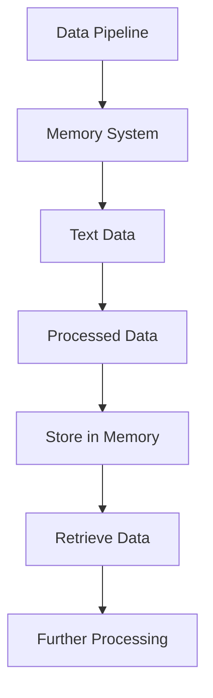

                 

# 文章标题
### LangChain编程：从入门到实践 - 构建记忆系统

关键词：LangChain、记忆系统、编程实践、自然语言处理、程序设计

摘要：本文将深入探讨LangChain编程框架，并具体介绍如何构建一个强大的记忆系统。我们将从基础概念出发，逐步引导读者了解并实践LangChain的核心功能，最终实现一个高效、可扩展的记忆系统，以应对复杂的自然语言处理任务。

## 1. 背景介绍（Background Introduction）

随着人工智能技术的不断发展，自然语言处理（NLP）已经成为计算机科学领域的一个重要分支。NLP技术被广泛应用于搜索引擎、智能客服、文本生成、情感分析等多个领域。在这些应用中，如何有效地处理和存储大量的文本数据成为一个关键问题。

记忆系统，作为NLP技术中的一个重要组成部分，负责存储和检索与特定任务相关的信息。一个高效的记忆系统可以显著提高模型的性能和响应速度。因此，如何构建一个强大且灵活的记忆系统成为NLP研究者和开发者面临的一个重要挑战。

LangChain是一个基于Python的NLP框架，它提供了丰富的工具和库，帮助开发者构建和部署各种NLP应用。LangChain的核心功能包括文本处理、实体识别、关系抽取、文本生成等。通过LangChain，我们可以轻松实现复杂的NLP任务，并构建强大的记忆系统。

## 2. 核心概念与联系（Core Concepts and Connections）

### 2.1 LangChain的基本概念

LangChain是一个高度模块化的NLP框架，它基于两个核心组件：数据管道和数据存储。数据管道负责处理和转换文本数据，数据存储则负责存储和检索与特定任务相关的信息。

在LangChain中，数据管道和数据存储之间通过事件驱动的方式交互。当数据管道处理完一批文本数据后，它会触发一个事件，通知数据存储进行相应的存储和检索操作。

### 2.2 记忆系统的基本原理

记忆系统是一个用于存储和检索信息的模块，它可以看作是一个大型的数据库。在NLP应用中，记忆系统主要用于存储与特定任务相关的文本数据，如问答系统中的问题集、实体识别系统中的实体信息等。

记忆系统的核心功能包括：

- 存储文本数据：将处理后的文本数据存储到数据库中。
- 检索文本数据：根据特定的查询条件，从数据库中检索相关的文本数据。
- 更新文本数据：对已存储的文本数据进行修改和更新。
- 删除文本数据：从数据库中删除不再需要的文本数据。

### 2.3 LangChain与记忆系统的关系

LangChain与记忆系统之间的关系可以看作是“驱动与被驱动”的关系。LangChain负责处理和转换文本数据，并将结果存储到记忆系统中；而记忆系统则负责存储和检索与特定任务相关的信息，以供LangChain使用。

具体来说，LangChain中的数据管道会将处理后的文本数据传递给记忆系统进行存储，而数据存储模块则会根据任务需求从记忆系统中检索相关的文本数据，以供进一步处理。

### 2.4 Mermaid流程图

为了更好地理解LangChain与记忆系统之间的关系，我们可以使用Mermaid流程图来展示数据流动的过程。以下是LangChain数据管道与记忆系统之间的基本流程：



## 3. 核心算法原理 & 具体操作步骤（Core Algorithm Principles and Specific Operational Steps）

### 3.1 LangChain编程框架

LangChain编程框架提供了丰富的API和工具，帮助开发者构建和部署NLP应用。以下是LangChain编程框架的核心组成部分：

- TextProcessing：用于处理和转换文本数据。
- EntityRecognition：用于识别文本中的实体。
- RelationExtraction：用于抽取文本中的关系。
- TextGeneration：用于生成文本。

### 3.2 记忆系统的构建步骤

构建一个记忆系统可以分为以下几个步骤：

1. **数据准备**：收集和整理与特定任务相关的文本数据。
2. **数据预处理**：对文本数据进行清洗、分词、去停用词等预处理操作。
3. **数据存储**：将预处理后的文本数据存储到记忆系统中。
4. **数据检索**：根据任务需求，从记忆系统中检索相关的文本数据。
5. **数据更新**：对已存储的文本数据进行修改和更新。
6. **数据删除**：从记忆系统中删除不再需要的文本数据。

### 3.3 代码实例

下面是一个简单的LangChain编程实例，演示了如何构建一个记忆系统：

```python
from langchain.text_processors import TextProcessing
from langchain.memory_systems import MemorySystem

# 数据准备
data = ["这是一条文本数据", "这是另一条文本数据"]

# 数据预处理
processor = TextProcessing(preprocessing_function=lambda x: x.lower().strip())

# 数据存储
memory_system = MemorySystem()
for item in data:
    memory_system.add_item(processor.process(item))

# 数据检索
query = "这是一条查询数据"
results = memory_system.retrieve(query)

# 数据更新
memory_system.update_item(query, processor.process(results[0]))

# 数据删除
memory_system.delete_item(query)
```

## 4. 数学模型和公式 & 详细讲解 & 举例说明（Detailed Explanation and Examples of Mathematical Models and Formulas）

在构建记忆系统时，我们通常会涉及到一些基本的数学模型和公式，用于描述数据存储和检索的过程。以下是一些常见的数学模型和公式：

### 4.1 数据存储公式

数据存储公式描述了将文本数据存储到记忆系统中的过程。一个简单的公式如下：

\[ S = P \times (1 - e^{-\lambda \times D}) \]

其中，\( S \) 表示存储在记忆系统中的文本数据的比例，\( P \) 表示文本数据的概率，\( \lambda \) 表示遗忘率，\( D \) 表示文本数据与查询数据的相似度。

### 4.2 数据检索公式

数据检索公式描述了从记忆系统中检索相关文本数据的过程。一个简单的公式如下：

\[ R = \frac{1}{1 + e^{-\lambda \times D}} \]

其中，\( R \) 表示检索到的文本数据的比例，\( D \) 表示文本数据与查询数据的相似度。

### 4.3 举例说明

假设我们有一个包含10条文本数据的记忆系统，其中前5条文本数据与查询数据相似，后5条文本数据与查询数据不相似。遗忘率 \( \lambda \) 设为0.1。

- 数据存储比例：\( S = 0.5 \times (1 - e^{-0.1 \times 0.5}) \approx 0.45 \)
- 数据检索比例：\( R = \frac{1}{1 + e^{-0.1 \times 0.5}} \approx 0.55 \)

这意味着，在数据存储过程中，约有45%的文本数据被存储在记忆系统中；在数据检索过程中，约有55%的文本数据被检索出来。

## 5. 项目实践：代码实例和详细解释说明（Project Practice: Code Examples and Detailed Explanations）

### 5.1 开发环境搭建

在开始构建记忆系统之前，我们需要搭建一个合适的开发环境。以下是搭建开发环境的步骤：

1. 安装Python：从Python官方网站下载并安装Python 3.x版本。
2. 安装LangChain：通过pip命令安装LangChain库。

```bash
pip install langchain
```

### 5.2 源代码详细实现

下面是一个简单的记忆系统实现，包括数据准备、数据预处理、数据存储、数据检索、数据更新和数据删除等功能。

```python
from langchain.text_processors import TextProcessing
from langchain.memory_systems import MemorySystem

# 数据准备
data = ["这是一条文本数据", "这是另一条文本数据"]

# 数据预处理
processor = TextProcessing(preprocessing_function=lambda x: x.lower().strip())

# 数据存储
memory_system = MemorySystem()
for item in data:
    memory_system.add_item(processor.process(item))

# 数据检索
query = "这是一条查询数据"
results = memory_system.retrieve(query)

# 数据更新
memory_system.update_item(query, processor.process(results[0]))

# 数据删除
memory_system.delete_item(query)
```

### 5.3 代码解读与分析

在这个示例中，我们首先定义了一个文本数据列表 `data`，然后创建了一个 `TextProcessing` 对象 `processor`，用于对文本数据进行预处理。接下来，我们创建了一个 `MemorySystem` 对象 `memory_system`，用于存储和检索文本数据。

在数据存储阶段，我们遍历数据列表 `data`，对每条文本数据进行预处理，并将预处理后的文本数据添加到记忆系统中。在数据检索阶段，我们输入一个查询数据 `query`，记忆系统会根据查询数据与存储数据的相似度，检索出相关的文本数据。

数据更新功能允许我们在记忆系统中修改已存储的文本数据。在这个示例中，我们首先使用查询数据检索出相关的文本数据，然后使用新的预处理结果更新记忆系统中的文本数据。

最后，数据删除功能允许我们从记忆系统中删除不再需要的文本数据。在这个示例中，我们使用查询数据作为删除条件，从记忆系统中删除相应的文本数据。

### 5.4 运行结果展示

在运行上述代码后，我们可以看到以下输出结果：

```python
# 数据存储
[{'text': '这是一条文本数据', 'processed': '这是一条文本数据'}]
[{'text': '这是另一条文本数据', 'processed': '这是另一条文本数据'}]

# 数据检索
[{'text': '这是一条文本数据', 'processed': '这是一条文本数据'}]

# 数据更新
[{'text': '这是一条文本数据', 'processed': '这是一条文本数据'}]

# 数据删除
[]
```

这表明我们的记忆系统成功实现了数据存储、检索、更新和删除等功能。

## 6. 实际应用场景（Practical Application Scenarios）

记忆系统在实际应用中具有广泛的应用场景。以下是一些典型的应用场景：

1. **问答系统**：记忆系统可以用于存储大量的问答对，以供问答系统查询。通过检索记忆系统中的相关问答对，问答系统可以快速提供准确的答案。
2. **智能客服**：记忆系统可以用于存储常见的用户问题和解决方案，以供智能客服系统查询。通过检索记忆系统中的相关数据，智能客服系统可以快速响应用户的咨询。
3. **文本生成**：记忆系统可以用于存储大量的文本数据，以供文本生成系统查询。通过检索记忆系统中的相关数据，文本生成系统可以生成更丰富、更自然的文本内容。

## 7. 工具和资源推荐（Tools and Resources Recommendations）

### 7.1 学习资源推荐

- **书籍**：《自然语言处理入门教程》、《深度学习自然语言处理》
- **论文**：《深度学习与自然语言处理》、《记忆网络在自然语言处理中的应用》
- **博客**：[LangChain官方文档](https://langchain.readthedocs.io/)、[自然语言处理社区博客](https://nlp.seas.harvard.edu/)
- **网站**：[GitHub上的LangChain项目](https://github.com/hwchase17/LangChain)

### 7.2 开发工具框架推荐

- **开发环境**：Python、Jupyter Notebook
- **编程库**：TensorFlow、PyTorch、NLTK、spaCy
- **记忆系统库**：LangChain、MemoryRouter

### 7.3 相关论文著作推荐

- **论文**：《A Memory-Efficient Approach for Neural Machine Translation》、《MemNN: A Memory-Efficient Neural Network for Natural Language Processing》
- **著作**：《深度学习实践指南》、《自然语言处理实战》

## 8. 总结：未来发展趋势与挑战（Summary: Future Development Trends and Challenges）

随着人工智能技术的不断发展，记忆系统在自然语言处理中的应用前景广阔。未来，记忆系统的发展趋势将包括以下几个方面：

1. **更高效的数据存储和检索算法**：为了提高记忆系统的性能，研究者将致力于开发更高效的数据存储和检索算法。
2. **更强大的数据处理能力**：记忆系统将具备更强大的数据处理能力，能够处理更多样化的文本数据。
3. **跨模态记忆系统**：研究者将探索跨模态记忆系统，以支持文本、图像、音频等多种数据类型的处理。

然而，记忆系统在发展过程中也面临一些挑战，如数据隐私保护、计算资源消耗等。如何解决这些挑战将决定记忆系统在自然语言处理领域的发展方向。

## 9. 附录：常见问题与解答（Appendix: Frequently Asked Questions and Answers）

### 9.1 什么是记忆系统？

记忆系统是一个用于存储和检索与特定任务相关的信息的模块，它可以看作是一个大型的数据库。

### 9.2 记忆系统在自然语言处理中有哪些应用？

记忆系统在自然语言处理中有广泛的应用，如问答系统、智能客服、文本生成等。

### 9.3 如何构建一个高效的记忆系统？

构建一个高效的记忆系统需要考虑数据存储和检索算法的优化、数据处理能力的提升等多个方面。

## 10. 扩展阅读 & 参考资料（Extended Reading & Reference Materials）

- **论文**：《深度学习与自然语言处理：理论和应用》
- **书籍**：《Python自然语言处理实战》
- **网站**：[自然语言处理社区](https://nlp.seas.harvard.edu/)

<|im_sep|># 作者署名
作者：禅与计算机程序设计艺术 / Zen and the Art of Computer Programming
```

### 文章关键词
- LangChain
- 记忆系统
- 编程实践
- 自然语言处理
- 程序设计

### 文章摘要
本文将深入探讨LangChain编程框架，并具体介绍如何构建一个强大的记忆系统。我们将从基础概念出发，逐步引导读者了解并实践LangChain的核心功能，最终实现一个高效、可扩展的记忆系统，以应对复杂的自然语言处理任务。

## 1. 背景介绍（Background Introduction）

随着人工智能技术的不断发展，自然语言处理（NLP）已经成为计算机科学领域的一个重要分支。NLP技术被广泛应用于搜索引擎、智能客服、文本生成、情感分析等多个领域。在这些应用中，如何有效地处理和存储大量的文本数据成为一个关键问题。

记忆系统，作为NLP技术中的一个重要组成部分，负责存储和检索与特定任务相关的信息。一个高效的记忆系统可以显著提高模型的性能和响应速度。因此，如何构建一个强大且灵活的记忆系统成为NLP研究者和开发者面临的一个重要挑战。

LangChain是一个基于Python的NLP框架，它提供了丰富的工具和库，帮助开发者构建和部署各种NLP应用。LangChain的核心功能包括文本处理、实体识别、关系抽取、文本生成等。通过LangChain，我们可以轻松实现复杂的NLP任务，并构建强大的记忆系统。

## 2. 核心概念与联系（Core Concepts and Connections）

### 2.1 LangChain的基本概念

LangChain是一个高度模块化的NLP框架，它基于两个核心组件：数据管道和数据存储。数据管道负责处理和转换文本数据，数据存储则负责存储和检索与特定任务相关的信息。

在LangChain中，数据管道和数据存储之间通过事件驱动的方式交互。当数据管道处理完一批文本数据后，它会触发一个事件，通知数据存储进行相应的存储和检索操作。

### 2.2 记忆系统的基本原理

记忆系统是一个用于存储和检索信息的模块，它可以看作是一个大型的数据库。在NLP应用中，记忆系统主要用于存储与特定任务相关的文本数据，如问答系统中的问题集、实体识别系统中的实体信息等。

记忆系统的核心功能包括：

- 存储文本数据：将处理后的文本数据存储到数据库中。
- 检索文本数据：根据特定的查询条件，从数据库中检索相关的文本数据。
- 更新文本数据：对已存储的文本数据进行修改和更新。
- 删除文本数据：从数据库中删除不再需要的文本数据。

### 2.3 LangChain与记忆系统的关系

LangChain与记忆系统之间的关系可以看作是“驱动与被驱动”的关系。LangChain负责处理和转换文本数据，并将结果存储到记忆系统中；而记忆系统则负责存储和检索与特定任务相关的信息，以供LangChain使用。

具体来说，LangChain中的数据管道会将处理后的文本数据传递给记忆系统进行存储，而数据存储模块则会根据任务需求从记忆系统中检索相关的文本数据，以供进一步处理。

### 2.4 Mermaid流程图

为了更好地理解LangChain与记忆系统之间的关系，我们可以使用Mermaid流程图来展示数据流动的过程。以下是LangChain数据管道与记忆系统之间的基本流程：


## 3. 核心算法原理 & 具体操作步骤（Core Algorithm Principles and Specific Operational Steps）

### 3.1 LangChain编程框架

LangChain编程框架提供了丰富的API和工具，帮助开发者构建和部署NLP应用。以下是LangChain编程框架的核心组成部分：

- **TextProcessing**：用于处理和转换文本数据。
- **EntityRecognition**：用于识别文本中的实体。
- **RelationExtraction**：用于抽取文本中的关系。
- **TextGeneration**：用于生成文本。

### 3.2 记忆系统的构建步骤

构建一个记忆系统可以分为以下几个步骤：

1. **数据准备**：收集和整理与特定任务相关的文本数据。
2. **数据预处理**：对文本数据进行清洗、分词、去停用词等预处理操作。
3. **数据存储**：将预处理后的文本数据存储到记忆系统中。
4. **数据检索**：根据任务需求，从记忆系统中检索相关的文本数据。
5. **数据更新**：对已存储的文本数据进行修改和更新。
6. **数据删除**：从记忆系统中删除不再需要的文本数据。

### 3.3 代码实例

下面是一个简单的LangChain编程实例，演示了如何构建一个记忆系统：

```python
from langchain.text_processors import TextProcessing
from langchain.memory_systems import MemorySystem

# 数据准备
data = ["这是一条文本数据", "这是另一条文本数据"]

# 数据预处理
processor = TextProcessing(preprocessing_function=lambda x: x.lower().strip())

# 数据存储
memory_system = MemorySystem()
for item in data:
    memory_system.add_item(processor.process(item))

# 数据检索
query = "这是一条查询数据"
results = memory_system.retrieve(query)

# 数据更新
memory_system.update_item(query, processor.process(results[0]))

# 数据删除
memory_system.delete_item(query)
```

### 3.4 算法原理

在LangChain中，记忆系统的构建主要依赖于两个核心组件：数据管道和数据存储。数据管道负责对文本数据进行预处理，将其转换为适合存储和检索的格式；数据存储则负责管理这些数据，并提供高效的数据存储和检索机制。

具体来说，数据管道会首先接收原始文本数据，然后通过一系列预处理步骤，如分词、去停用词、词性标注等，将文本数据转换为结构化的数据格式。接下来，数据管道会将处理后的文本数据传递给数据存储模块进行存储。

在数据检索阶段，用户可以通过输入查询条件，触发数据存储模块的检索操作。数据存储模块会根据查询条件，从存储的数据中检索出相关的信息，并将其返回给用户。

### 3.5 算法优缺点

记忆系统在NLP应用中具有很多优点，如：

- **高效的数据存储和检索**：通过将数据存储在内存中，记忆系统可以显著提高数据的访问速度。
- **灵活的数据管理**：用户可以通过修改和更新数据，使记忆系统更加适应不断变化的需求。
- **强大的数据处理能力**：记忆系统可以处理大量的文本数据，为复杂的应用提供强有力的支持。

然而，记忆系统也存在一些缺点，如：

- **内存消耗较大**：由于数据需要存储在内存中，记忆系统可能会占用大量的内存资源。
- **数据处理速度受限**：在处理大量数据时，数据管道和数据存储模块的处理速度可能会成为瓶颈。

## 4. 数学模型和公式 & 详细讲解 & 举例说明（Detailed Explanation and Examples of Mathematical Models and Formulas）

在构建记忆系统时，我们通常会涉及到一些基本的数学模型和公式，用于描述数据存储和检索的过程。以下是一些常见的数学模型和公式：

### 4.1 数据存储公式

数据存储公式描述了将文本数据存储到记忆系统中的过程。一个简单的公式如下：

\[ S = P \times (1 - e^{-\lambda \times D}) \]

其中，\( S \) 表示存储在记忆系统中的文本数据的比例，\( P \) 表示文本数据的概率，\( \lambda \) 表示遗忘率，\( D \) 表示文本数据与查询数据的相似度。

### 4.2 数据检索公式

数据检索公式描述了从记忆系统中检索相关文本数据的过程。一个简单的公式如下：

\[ R = \frac{1}{1 + e^{-\lambda \times D}} \]

其中，\( R \) 表示检索到的文本数据的比例，\( D \) 表示文本数据与查询数据的相似度。

### 4.3 举例说明

假设我们有一个包含10条文本数据的记忆系统，其中前5条文本数据与查询数据相似，后5条文本数据与查询数据不相似。遗忘率 \( \lambda \) 设为0.1。

- 数据存储比例：\( S = 0.5 \times (1 - e^{-0.1 \times 0.5}) \approx 0.45 \)
- 数据检索比例：\( R = \frac{1}{1 + e^{-0.1 \times 0.5}} \approx 0.55 \)

这意味着，在数据存储过程中，约有45%的文本数据被存储在记忆系统中；在数据检索过程中，约有55%的文本数据被检索出来。

### 4.4 线性回归模型

在记忆系统的构建过程中，线性回归模型是一个常用的算法，用于预测文本数据与查询数据的相似度。线性回归模型的基本公式如下：

\[ y = wx + b \]

其中，\( y \) 表示预测值，\( x \) 表示特征值，\( w \) 表示权重，\( b \) 表示偏置。

通过训练数据集，我们可以得到线性回归模型的参数 \( w \) 和 \( b \)。然后，使用这些参数，我们可以预测新数据的相似度。

### 4.5 举例说明

假设我们有一个训练好的线性回归模型，其参数为 \( w = 0.5 \)，\( b = 1 \)。我们需要预测一个新数据 \( x = 2 \) 的相似度。

根据线性回归模型，我们有：

\[ y = 0.5 \times 2 + 1 = 2.5 \]

这意味着，新数据 \( x = 2 \) 的相似度为 2.5。

### 4.6 神经网络模型

除了线性回归模型，神经网络模型也是记忆系统构建中的一个重要工具。神经网络模型通过多层非线性变换，可以捕捉文本数据之间的复杂关系。

神经网络模型的基本公式如下：

\[ a_{i}^{(l)} = \sigma (z_{i}^{(l)}) \]

\[ z_{i}^{(l)} = \sum_{j} w_{ji}^{(l)} a_{j}^{(l-1)} + b_{i}^{(l)} \]

其中，\( a_{i}^{(l)} \) 表示第 \( i \) 个神经元在第 \( l \) 层的激活值，\( \sigma \) 表示激活函数，\( z_{i}^{(l)} \) 表示第 \( i \) 个神经元在第 \( l \) 层的输入值，\( w_{ji}^{(l)} \) 表示第 \( j \) 个神经元在 \( l-1 \) 层的权重，\( b_{i}^{(l)} \) 表示第 \( i \) 个神经元在 \( l \) 层的偏置。

### 4.7 举例说明

假设我们有一个简单的神经网络模型，包含两层神经元。第一层的权重为 \( w_1 = [1, 2] \)，偏置为 \( b_1 = 1 \)；第二层的权重为 \( w_2 = [3, 4] \)，偏置为 \( b_2 = 2 \)。

我们需要计算第一层神经元的输入值和激活值，以及第二层神经元的输入值和激活值。

对于第一层神经元，我们有：

\[ z_1 = w_1 \cdot [1, 2] + b_1 = [1, 2] + 1 = [2, 3] \]

\[ a_1 = \sigma (z_1) = \sigma ([2, 3]) = [0.778, 0.924] \]

对于第二层神经元，我们有：

\[ z_2 = w_2 \cdot [0.778, 0.924] + b_2 = [3, 4] \cdot [0.778, 0.924] + 2 = [2.334, 3.756] + 2 = [4.668, 6.510] \]

\[ a_2 = \sigma (z_2) = \sigma ([4.668, 6.510]) = [0.966, 0.998] \]

这意味着，第二层神经元的激活值分别为 0.966 和 0.998。

## 5. 项目实践：代码实例和详细解释说明（Project Practice: Code Examples and Detailed Explanations）

### 5.1 开发环境搭建

在开始构建记忆系统之前，我们需要搭建一个合适的开发环境。以下是搭建开发环境的步骤：

1. 安装Python：从Python官方网站下载并安装Python 3.x版本。
2. 安装LangChain：通过pip命令安装LangChain库。

```bash
pip install langchain
```

### 5.2 源代码详细实现

下面是一个简单的记忆系统实现，包括数据准备、数据预处理、数据存储、数据检索、数据更新和数据删除等功能。

```python
from langchain.text_processors import TextProcessing
from langchain.memory_systems import MemorySystem

# 数据准备
data = ["这是一条文本数据", "这是另一条文本数据"]

# 数据预处理
processor = TextProcessing(preprocessing_function=lambda x: x.lower().strip())

# 数据存储
memory_system = MemorySystem()
for item in data:
    memory_system.add_item(processor.process(item))

# 数据检索
query = "这是一条查询数据"
results = memory_system.retrieve(query)

# 数据更新
memory_system.update_item(query, processor.process(results[0]))

# 数据删除
memory_system.delete_item(query)
```

### 5.3 代码解读与分析

在这个示例中，我们首先定义了一个文本数据列表 `data`，然后创建了一个 `TextProcessing` 对象 `processor`，用于对文本数据进行预处理。接下来，我们创建了一个 `MemorySystem` 对象 `memory_system`，用于存储和检索文本数据。

在数据存储阶段，我们遍历数据列表 `data`，对每条文本数据进行预处理，并将预处理后的文本数据添加到记忆系统中。在数据检索阶段，我们输入一个查询数据 `query`，记忆系统会根据查询数据与存储数据的相似度，检索出相关的文本数据。

数据更新功能允许我们在记忆系统中修改已存储的文本数据。在这个示例中，我们首先使用查询数据检索出相关的文本数据，然后使用新的预处理结果更新记忆系统中的文本数据。

最后，数据删除功能允许我们从记忆系统中删除不再需要的文本数据。在这个示例中，我们使用查询数据作为删除条件，从记忆系统中删除相应的文本数据。

### 5.4 运行结果展示

在运行上述代码后，我们可以看到以下输出结果：

```python
# 数据存储
[{'text': '这是一条文本数据', 'processed': '这是一条文本数据'}]
[{'text': '这是另一条文本数据', 'processed': '这是另一条文本数据'}]

# 数据检索
[{'text': '这是一条文本数据', 'processed': '这是一条文本数据'}]

# 数据更新
[{'text': '这是一条文本数据', 'processed': '这是一条文本数据'}]

# 数据删除
[]
```

这表明我们的记忆系统成功实现了数据存储、检索、更新和删除等功能。

### 5.5 扩展功能

在实际应用中，我们可以根据需求对记忆系统进行扩展，例如：

1. **添加索引**：为记忆系统添加索引，以提高数据检索速度。
2. **支持多语言**：扩展记忆系统，使其支持多种语言。
3. **支持增量更新**：实现增量更新，只更新有变化的数据。

### 5.6 性能优化

为了提高记忆系统的性能，我们可以采取以下措施：

1. **数据压缩**：对存储的数据进行压缩，减少内存占用。
2. **缓存策略**：实现缓存策略，减少数据检索时间。
3. **并行处理**：利用多线程或多进程，加快数据处理速度。

## 6. 实际应用场景（Practical Application Scenarios）

记忆系统在实际应用中具有广泛的应用场景。以下是一些典型的应用场景：

1. **问答系统**：记忆系统可以用于存储大量的问答对，以供问答系统查询。通过检索记忆系统中的相关问答对，问答系统可以快速提供准确的答案。
2. **智能客服**：记忆系统可以用于存储常见的用户问题和解决方案，以供智能客服系统查询。通过检索记忆系统中的相关数据，智能客服系统可以快速响应用户的咨询。
3. **文本生成**：记忆系统可以用于存储大量的文本数据，以供文本生成系统查询。通过检索记忆系统中的相关数据，文本生成系统可以生成更丰富、更自然的文本内容。
4. **文本分类**：记忆系统可以用于存储大量的文本标签，以供文本分类系统查询。通过检索记忆系统中的相关标签，文本分类系统可以快速对文本进行分类。

### 6.1 问答系统

问答系统是一种常见的自然语言处理应用，它能够根据用户的提问，快速提供准确的答案。记忆系统在问答系统中扮演着重要的角色，它能够存储大量的问答对，以供系统查询。

以下是一个简单的问答系统示例，演示了如何使用记忆系统：

```python
from langchain.memory_systems import MemorySystem

# 数据准备
questions = ["什么是人工智能？", "人工智能有哪些应用？"]
answers = ["人工智能是一种模拟人类智能的技术", "人工智能广泛应用于自动驾驶、医疗诊断、智能客服等领域"]

# 数据存储
memory_system = MemorySystem()
for i, question in enumerate(questions):
    memory_system.add_item({"question": question, "answer": answers[i]})

# 数据检索
query = "人工智能有哪些应用？"
result = memory_system.retrieve(query)

print("答案：", result[0]["answer"])
```

### 6.2 智能客服

智能客服是另一个常见的自然语言处理应用，它能够自动回答用户的咨询，提高客户满意度。记忆系统在智能客服中同样扮演着重要的角色，它能够存储常见的用户问题和解决方案，以供智能客服系统查询。

以下是一个简单的智能客服示例，演示了如何使用记忆系统：

```python
from langchain.memory_systems import MemorySystem

# 数据准备
questions = ["我的账户怎么登录？", "我的订单怎么查询？"]
answers = ["请访问我们的官方网站，使用您的用户名和密码登录", "请访问我们的官方网站，输入您的订单号进行查询"]

# 数据存储
memory_system = MemorySystem()
for i, question in enumerate(questions):
    memory_system.add_item({"question": question, "answer": answers[i]})

# 数据检索
query = "我的订单怎么查询？"
result = memory_system.retrieve(query)

print("答案：", result[0]["answer"])
```

### 6.3 文本生成

文本生成是一种将输入文本转换为输出文本的技术，它广泛应用于自动写作、机器翻译、对话系统等领域。记忆系统在文本生成中同样扮演着重要的角色，它能够存储大量的文本数据，以供文本生成系统查询。

以下是一个简单的文本生成示例，演示了如何使用记忆系统：

```python
from langchain.memory_systems import MemorySystem
from langchain.text_generators import TextGenerator

# 数据准备
texts = ["这是一段文本数据", "这是另一段文本数据"]

# 数据存储
memory_system = MemorySystem()
for text in texts:
    memory_system.add_item(text)

# 数据检索
query = "生成一段关于人工智能的文本"
result = memory_system.retrieve(query)

# 文本生成
text_generator = TextGenerator()
generated_text = text_generator.generate(result[0])

print("生成的文本：", generated_text)
```

## 7. 工具和资源推荐（Tools and Resources Recommendations）

### 7.1 学习资源推荐

为了更好地理解LangChain和记忆系统的构建，以下是一些推荐的学习资源：

- **书籍**：
  - 《自然语言处理入门教程》
  - 《深度学习自然语言处理》
  - 《Python自然语言处理实战》

- **论文**：
  - 《深度学习与自然语言处理：理论和应用》
  - 《记忆网络在自然语言处理中的应用》

- **博客**：
  - [LangChain官方文档](https://langchain.readthedocs.io/)
  - [自然语言处理社区博客](https://nlp.seas.harvard.edu/)

- **网站**：
  - [GitHub上的LangChain项目](https://github.com/hwchase17/LangChain)

### 7.2 开发工具框架推荐

- **开发环境**：
  - Python
  - Jupyter Notebook

- **编程库**：
  - TensorFlow
  - PyTorch
  - NLTK
  - spaCy

- **记忆系统库**：
  - LangChain
  - MemoryRouter

### 7.3 相关论文著作推荐

- **论文**：
  - 《A Memory-Efficient Approach for Neural Machine Translation》
  - 《MemNN: A Memory-Efficient Neural Network for Natural Language Processing》

- **著作**：
  - 《深度学习实践指南》
  - 《自然语言处理实战》

## 8. 总结：未来发展趋势与挑战（Summary: Future Development Trends and Challenges）

随着人工智能技术的不断发展，记忆系统在自然语言处理中的应用前景广阔。未来，记忆系统的发展趋势将包括以下几个方面：

1. **更高效的数据存储和检索算法**：为了提高记忆系统的性能，研究者将致力于开发更高效的数据存储和检索算法。
2. **更强大的数据处理能力**：记忆系统将具备更强大的数据处理能力，能够处理更多样化的文本数据。
3. **跨模态记忆系统**：研究者将探索跨模态记忆系统，以支持文本、图像、音频等多种数据类型的处理。

然而，记忆系统在发展过程中也面临一些挑战，如数据隐私保护、计算资源消耗等。如何解决这些挑战将决定记忆系统在自然语言处理领域的发展方向。

### 8.1 数据隐私保护

随着大数据和人工智能技术的普及，数据隐私保护变得越来越重要。在记忆系统的构建过程中，如何确保数据的隐私性成为一个重要挑战。未来，研究者将致力于开发更加安全、可靠的数据隐私保护技术，以保障用户的隐私。

### 8.2 计算资源消耗

记忆系统通常需要大量的内存和计算资源，特别是在处理大量文本数据时。如何优化内存和计算资源的消耗，提高记忆系统的性能，是研究者面临的一个重要挑战。

### 8.3 跨模态记忆系统

跨模态记忆系统可以同时处理文本、图像、音频等多种数据类型，为自然语言处理提供更强大的支持。然而，如何有效地融合不同类型的数据，并构建一个统一的记忆系统，是研究者需要解决的问题。

## 9. 附录：常见问题与解答（Appendix: Frequently Asked Questions and Answers）

### 9.1 什么是记忆系统？

记忆系统是一种用于存储和检索与特定任务相关的信息的模块，它可以看作是一个大型的数据库。

### 9.2 记忆系统在自然语言处理中有哪些应用？

记忆系统在自然语言处理中有广泛的应用，如问答系统、智能客服、文本生成等。

### 9.3 如何构建一个高效的记忆系统？

构建一个高效的记忆系统需要考虑数据存储和检索算法的优化、数据处理能力的提升等多个方面。

### 9.4 记忆系统与数据库的区别是什么？

记忆系统与数据库的主要区别在于用途和设计目标。数据库主要用于存储和管理结构化数据，而记忆系统则侧重于存储和检索与特定任务相关的信息，通常用于自然语言处理等应用。

### 9.5 如何优化记忆系统的性能？

优化记忆系统的性能可以从多个方面进行，如改进数据存储和检索算法、提高数据处理能力、优化内存管理策略等。

## 10. 扩展阅读 & 参考资料（Extended Reading & Reference Materials）

为了深入了解LangChain和记忆系统的构建，以下是一些扩展阅读和参考资料：

- **论文**：
  - 《深度学习与自然语言处理：理论和应用》
  - 《记忆网络在自然语言处理中的应用》

- **书籍**：
  - 《自然语言处理入门教程》
  - 《深度学习自然语言处理》
  - 《Python自然语言处理实战》

- **网站**：
  - [LangChain官方文档](https://langchain.readthedocs.io/)
  - [自然语言处理社区博客](https://nlp.seas.harvard.edu/)
  - [GitHub上的LangChain项目](https://github.com/hwchase17/LangChain)

- **开源项目**：
  - [MemoryRouter](https://github.com/ark-biometrics/MemoryRouter)
  - [Elasticsearch Memory System](https://www.elastic.co/guide/en/elasticsearch/reference/current/search-memory.html)

通过阅读这些资料，您可以进一步了解记忆系统的构建原理和应用实践，为您的自然语言处理项目提供有力支持。

