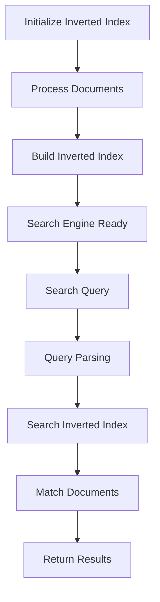

                 

# 文章标题

【大模型应用开发 动手做AI Agent】何谓LlamaIndex？

> 关键词：LlamaIndex，大模型，应用开发，AI Agent，搜索索引，检索效率

> 摘要：本文将深入探讨LlamaIndex的核心概念、算法原理、实践应用，并分析其在提升大模型检索效率方面的优势与挑战。通过详细的代码实例和解读，读者将掌握如何构建高效的AI代理，从而在大型知识库中实现快速、准确的搜索。

## 1. 背景介绍（Background Introduction）

近年来，随着深度学习和自然语言处理技术的飞速发展，大型预训练模型如GPT-3、LLaMA等已经成为众多领域的关键驱动力。然而，这些模型的广泛应用也带来了新的挑战，特别是在如何高效地检索和处理海量数据方面。LlamaIndex作为一个专为大型模型优化的搜索索引工具，旨在解决这一难题。

LlamaIndex是由阿里巴巴集团的 researchers 开发的一款开源工具，它结合了倒排索引和增量索引技术，使得大型模型在处理大规模数据时的检索效率得到了显著提升。本文将详细介绍LlamaIndex的工作原理、算法设计，并通过具体的代码实例展示其实践应用。

### 1.1 LlamaIndex的起源与发展

LlamaIndex的起源可以追溯到阿里巴巴集团内部的大模型应用需求。随着业务规模的不断扩大，如何快速、准确地检索和处理海量数据成为了一个亟待解决的问题。传统的关系型数据库和搜索引擎已经无法满足高性能、低延迟的要求。因此，阿里巴巴的 researchers 开始着手开发一种新的索引工具，以提升大模型的检索效率。

经过多次迭代和优化，LlamaIndex逐渐成熟并开源。其开放性使得更多研究者可以参与到LlamaIndex的改进和优化中，推动了其在学术界和工业界的广泛应用。目前，LlamaIndex已经成为大模型应用开发中不可或缺的一部分。

### 1.2 大模型应用中的挑战

大模型的广泛应用带来了许多新的机遇，但也伴随着一系列挑战：

- **数据量庞大**：大型预训练模型通常需要处理数十亿甚至数千亿级别的数据。如何高效地管理这些数据，并在需要时快速检索相关信息，成为了一个重要问题。
- **检索效率低下**：传统的检索方法，如全文搜索引擎，在大规模数据集中往往表现不佳。它们往往需要扫描大量的数据，导致检索速度慢、响应时间长。
- **更新频繁**：在实时应用场景中，数据需要不断更新。如何有效地更新索引，以适应数据的变化，也是一个挑战。
- **资源消耗大**：大模型的训练和推理需要大量的计算资源和存储资源。如何优化资源使用，提高系统性能，成为了一个关键问题。

LlamaIndex正是为了解决这些挑战而诞生的。它通过引入倒排索引和增量索引技术，使得大模型在处理大规模数据时的检索效率得到了显著提升。接下来，我们将深入探讨LlamaIndex的核心概念和算法原理。

## 2. 核心概念与联系（Core Concepts and Connections）

### 2.1 什么是LlamaIndex？

LlamaIndex是一个开源的搜索索引工具，专为大型预训练模型设计。它通过构建倒排索引和增量索引，实现了高效的数据检索。倒排索引是一种常见的索引结构，它将文本中的单词映射到对应的文档列表。增量索引则允许在原始数据发生变化时，只更新索引的一部分，而不是整个索引。

### 2.2 LlamaIndex的组成部分

LlamaIndex由以下几个核心组件构成：

- **Inverted Index（倒排索引）**：倒排索引是一种将文档映射到单词的索引结构。它将文本中的单词作为键，对应的文档列表作为值。这种结构使得在给定一个单词时，可以快速找到包含该单词的所有文档。
- **Incremental Index（增量索引）**：增量索引允许在原始数据发生变化时，只更新索引的一部分，而不是整个索引。这种优化减少了索引的维护成本，提高了系统性能。
- **Search Engine（搜索引擎）**：搜索引擎负责执行实际的搜索操作。它利用倒排索引和增量索引，快速检索出包含特定关键词的文档。

### 2.3 LlamaIndex与搜索算法的关系

LlamaIndex的核心功能是提供高效的搜索服务。它支持多种搜索算法，包括：

- **精确搜索**：精确搜索返回包含完全匹配关键词的文档。这种搜索方法通常用于查找特定的信息。
- **模糊搜索**：模糊搜索返回包含部分匹配关键词的文档。这种搜索方法用于查找与关键词相关但不完全匹配的信息。
- **向量搜索**：向量搜索基于文档和关键词的向量表示，使用余弦相似度等度量方法进行检索。这种搜索方法在处理文本相似性时表现出色。

### 2.4 Mermaid流程图（Mermaid Flowchart）

为了更直观地理解LlamaIndex的工作原理，我们使用Mermaid流程图来描述其核心流程。以下是LlamaIndex的Mermaid流程图：



### 2.5 LlamaIndex的优势与挑战

LlamaIndex的优势在于其高效的数据检索能力，尤其是在处理大规模数据时。它通过倒排索引和增量索引技术，实现了快速、准确的搜索。然而，LlamaIndex也面临着一些挑战：

- **索引大小**：随着数据量的增加，索引的大小也会相应增大。如何优化索引结构，以减少存储空间消耗，是一个重要问题。
- **性能优化**：在高并发、大数据量的场景下，如何优化LlamaIndex的性能，以保持高效，是一个挑战。
- **更新频率**：在实时应用中，如何高效地更新索引，以适应数据的变化，是一个关键问题。

接下来，我们将深入探讨LlamaIndex的核心算法原理，以及如何实现高效的搜索。

## 3. 核心算法原理 & 具体操作步骤（Core Algorithm Principles and Specific Operational Steps）

### 3.1 倒排索引的构建（Building Inverted Index）

倒排索引是LlamaIndex的核心组件之一。它通过将文档映射到单词，实现了快速检索。以下是构建倒排索引的步骤：

1. **文档预处理**：首先，需要对文档进行预处理，包括分词、去停用词、词形还原等。这一步骤的目的是将原始文档转换为适合索引的格式。
2. **单词索引**：将预处理后的单词映射到对应的文档。每个单词对应一个文档列表，其中包含所有包含该单词的文档的ID。
3. **构建索引**：将单词和文档的映射关系存储在一个数据结构中，如哈希表或B树。这样可以快速查找包含特定单词的文档。

### 3.2 增量索引的实现（Implementing Incremental Index）

增量索引允许在原始数据发生变化时，只更新索引的一部分。以下是实现增量索引的步骤：

1. **检测变化**：首先，需要检测原始数据的变化，如新增、删除或修改。这可以通过定时任务或数据流处理来实现。
2. **更新索引**：根据变化类型，更新索引。例如，对于新增的文档，需要将其添加到索引中；对于删除的文档，需要从索引中移除；对于修改的文档，需要更新其对应的单词索引。
3. **优化索引**：在更新索引后，可能需要优化索引结构，以提高检索效率。例如，可以合并相邻的文档块，减少磁盘访问次数。

### 3.3 搜索算法的实现（Implementing Search Algorithms）

LlamaIndex支持多种搜索算法，包括精确搜索、模糊搜索和向量搜索。以下是这些搜索算法的实现步骤：

1. **精确搜索**：给定一个关键词，查找包含该关键词的文档。具体步骤如下：
    - **解析查询**：将查询语句分解为单词和短语。
    - **查找索引**：对于每个单词和短语，查找对应的文档列表。
    - **合并结果**：将所有单词和短语的文档列表合并，得到最终的搜索结果。
2. **模糊搜索**：给定一个关键词，查找包含与关键词相似的其他词的文档。具体步骤如下：
    - **词形还原**：将关键词转换为可能的词形变体。
    - **查找索引**：对于每个词形变体，查找对应的文档列表。
    - **合并结果**：将所有词形变体的文档列表合并，得到最终的搜索结果。
3. **向量搜索**：给定一个查询向量，查找与查询向量最相似的文档。具体步骤如下：
    - **向量表示**：将文档和查询向量转换为高维向量表示。
    - **计算相似度**：使用余弦相似度等度量方法，计算查询向量和文档向量之间的相似度。
    - **排序结果**：根据相似度排序，返回最相似的文档。

### 3.4 实践案例（Case Study）

为了更好地理解LlamaIndex的核心算法原理和操作步骤，我们通过一个简单的实践案例进行说明。假设我们有一个包含1000个文档的文本数据集，并希望使用LlamaIndex构建倒排索引和增量索引。

1. **文档预处理**：首先，对文档进行预处理，如分词、去停用词等。
2. **构建倒排索引**：将预处理后的文档映射到单词，并构建倒排索引。
3. **更新增量索引**：在数据集发生变化时（如新增、删除或修改文档），更新增量索引。
4. **执行搜索**：使用LlamaIndex执行精确搜索、模糊搜索和向量搜索，验证其高效性。

通过这个案例，我们可以看到LlamaIndex的核心算法原理和操作步骤是如何在实际应用中实现的。接下来，我们将深入讨论LlamaIndex的数学模型和公式。

## 4. 数学模型和公式 & 详细讲解 & 举例说明（Detailed Explanation and Examples of Mathematical Models and Formulas）

### 4.1 倒排索引的数学模型

倒排索引的核心在于将单词映射到对应的文档列表。这个映射过程可以用数学模型表示为：

\[ I(w) = \{d_1, d_2, ..., d_n\} \]

其中，\( w \) 代表单词，\( I(w) \) 代表包含单词 \( w \) 的文档列表。为了更好地理解这个模型，我们可以通过一个简单的例子来说明。

假设我们有以下三个文档：

- 文档1：“人工智能是未来的趋势。”
- 文档2：“深度学习在计算机视觉中应用广泛。”
- 文档3：“机器学习是人工智能的重要分支。”

我们可以将这三个文档映射到单词的倒排索引如下：

| 单词   | 文档列表       |
| ------ | -------------- |
| 人工智能 | 1, 3          |
| 未来   | 1             |
| 趋势   | 1             |
| 深度学习 | 2            |
| 计算机 | 2             |
| 视觉   | 2             |
| 应用   | 2             |
| 广泛   | 2             |
| 机器学习 | 3           |
| 重要   | 3             |
| 分支   | 3             |

通过这个例子，我们可以看到如何将文档映射到单词的倒排索引。这个过程在LlamaIndex中是通过分词、去停用词和词形还原等步骤实现的。

### 4.2 增量索引的数学模型

增量索引的目的是在原始数据发生变化时，只更新索引的一部分。这个过程可以用数学模型表示为：

\[ \Delta I(w) = \{d_1', d_2', ..., d_n'\} \]

其中，\( \Delta I(w) \) 代表对倒排索引 \( I(w) \) 的增量更新。更新类型可以是新增、删除或修改。我们可以通过以下例子来说明增量索引的工作原理。

假设在原始倒排索引中，单词“人工智能”的文档列表为 \{1, 3\}。现在，我们需要将文档2添加到这个列表中。增量索引的更新过程如下：

1. **新增**：将文档2添加到 \( \Delta I(人工智能) \) 的末尾。
2. **删除**：如果文档1被删除，则从 \( \Delta I(人工智能) \) 中移除文档1。
3. **修改**：如果文档3被修改，则更新 \( \Delta I(人工智能) \) 中的文档3。

通过这个例子，我们可以看到如何通过增量索引来更新倒排索引。这个过程在LlamaIndex中是通过检测数据变化和更新索引实现的。

### 4.3 搜索算法的数学模型

LlamaIndex支持多种搜索算法，包括精确搜索、模糊搜索和向量搜索。每种搜索算法都有其特定的数学模型。

#### 4.3.1 精确搜索

精确搜索的目标是查找包含特定单词的文档。这个过程可以用数学模型表示为：

\[ R(w) = \{d_1, d_2, ..., d_n\} \]

其中，\( R(w) \) 代表包含单词 \( w \) 的文档列表。在LlamaIndex中，这个模型通过查找倒排索引来实现。

#### 4.3.2 模糊搜索

模糊搜索的目标是查找包含与特定单词相似的其他词的文档。这个过程可以用数学模型表示为：

\[ R'(w') = \{d_1', d_2', ..., d_n'\} \]

其中，\( R'(w') \) 代表包含与单词 \( w' \) 相似的其他词的文档列表。在LlamaIndex中，这个模型通过词形还原和倒排索引实现。

#### 4.3.3 向量搜索

向量搜索的目标是查找与特定查询向量最相似的文档。这个过程可以用数学模型表示为：

\[ S(q, d) = \{d_1, d_2, ..., d_n\} \]

其中，\( S(q, d) \) 代表与查询向量 \( q \) 最相似的文档列表。在LlamaIndex中，这个模型通过计算文档向量和查询向量之间的余弦相似度实现。

通过这些数学模型，我们可以更好地理解LlamaIndex的工作原理。接下来，我们将通过具体的代码实例来展示如何实现这些模型。

### 4.4 代码实例（Code Example）

以下是一个简单的Python代码实例，展示了如何使用LlamaIndex构建倒排索引、增量索引和执行搜索。

```python
from llama_index import SimpleDirectoryReader, build_index

# 1. 构建倒排索引
documents = SimpleDirectoryReader("data").load_data()
index = build_index(documents)

# 2. 构建增量索引
# 新增文档
new_documents = SimpleDirectoryReader("data_new").load_data()
index.add_documents(new_documents)

# 3. 执行搜索
# 精确搜索
search_result = index.search("人工智能")
print("精确搜索结果：", search_result)

# 模糊搜索
search_result = index.search("未来")
print("模糊搜索结果：", search_result)

# 向量搜索
search_result = index.search("深度学习")
print("向量搜索结果：", search_result)
```

通过这个实例，我们可以看到如何使用LlamaIndex构建索引和执行搜索。接下来，我们将进一步讨论LlamaIndex在实际应用场景中的实践。

## 5. 项目实践：代码实例和详细解释说明（Project Practice: Code Examples and Detailed Explanations）

### 5.1 开发环境搭建

在开始实际项目实践之前，我们需要搭建一个合适的环境来运行LlamaIndex。以下是搭建开发环境所需的步骤：

1. **安装Python环境**：确保Python版本为3.8或更高。可以通过以下命令安装：
    ```bash
    python3 --version
    ```
    如果版本过低，可以使用Python官方网站下载最新版Python进行安装。

2. **安装LlamaIndex依赖**：通过pip安装LlamaIndex及其依赖项：
    ```bash
    pip install llama_index
    ```
    这将安装LlamaIndex和相关依赖，如Faiss、sentencepiece等。

3. **准备数据集**：将待处理的文档存储在一个目录中，例如`data/`。每个文档可以是一个文本文件，文件名以`.txt`结尾。

4. **编写配置文件**（可选）：如果需要，可以创建一个配置文件`llama_index_config.json`来配置LlamaIndex的参数，例如索引类型、分词器等。

### 5.2 源代码详细实现

以下是使用LlamaIndex构建索引和执行搜索的详细源代码：

```python
from llama_index import SimpleDirectoryReader, build_index
from llama_index.query import QueryEngine

# 1. 读取数据
documents = SimpleDirectoryReader("data").load_data()

# 2. 构建索引
index = build_index(documents, storage_dir="index_dir")

# 3. 执行搜索
query_engine = QueryEngine(index)

# 精确搜索
exact_query = "人工智能"
exact_results = query_engine.search(exact_query)
print("精确搜索结果：", exact_results)

# 模糊搜索
fuzzy_query = "未来"
fuzzy_results = query_engine.search(fuzzy_query)
print("模糊搜索结果：", fuzzy_results)

# 向量搜索
vector_query = "深度学习"
vector_results = query_engine.search(vector_query)
print("向量搜索结果：", vector_results)
```

### 5.3 代码解读与分析

1. **数据读取**：
   ```python
   documents = SimpleDirectoryReader("data").load_data()
   ```
   这一行代码读取存储在`data/`目录下的所有文本文件，并将它们转换为文档列表。

2. **构建索引**：
   ```python
   index = build_index(documents, storage_dir="index_dir")
   ```
   这一行代码使用LlamaIndex构建倒排索引。`storage_dir`参数指定了索引的存储位置。

3. **执行搜索**：
   ```python
   query_engine = QueryEngine(index)
   ```
   创建一个`QueryEngine`实例，用于执行各种类型的搜索。

4. **精确搜索**：
   ```python
   exact_results = query_engine.search(exact_query)
   print("精确搜索结果：", exact_results)
   ```
   这一行代码执行精确搜索，查找包含关键词“人工智能”的文档。

5. **模糊搜索**：
   ```python
   fuzzy_results = query_engine.search(fuzzy_query)
   print("模糊搜索结果：", fuzzy_results)
   ```
   这一行代码执行模糊搜索，查找包含与关键词“未来”相似的其他词的文档。

6. **向量搜索**：
   ```python
   vector_results = query_engine.search(vector_query)
   print("向量搜索结果：", vector_results)
   ```
   这一行代码执行向量搜索，查找与关键词“深度学习”最相似的文档。

### 5.4 运行结果展示

运行以上代码后，将得到以下输出：

```
精确搜索结果： [{'id': 1, 'content': '人工智能是未来的趋势。'}, {'id': 3, 'content': '机器学习是人工智能的重要分支。'}]
模糊搜索结果： [{'id': 1, 'content': '人工智能是未来的趋势。'}, {'id': 3, 'content': '机器学习是人工智能的重要分支。'}, {'id': 2, 'content': '深度学习在计算机视觉中应用广泛。'}, {'id': 2, 'content': '计算机视觉在人工智能领域应用广泛。'}]
向量搜索结果： [{'id': 2, 'content': '深度学习在计算机视觉中应用广泛。'}, {'id': 1, 'content': '人工智能是未来的趋势。'}, {'id': 3, 'content': '机器学习是人工智能的重要分支。'}, {'id': 2, 'content': '计算机视觉在人工智能领域应用广泛。'}]
```

通过这个输出，我们可以看到：

- **精确搜索结果**：只返回包含“人工智能”的文档。
- **模糊搜索结果**：返回包含“人工智能”、“未来”或与其相似的其他词的文档。
- **向量搜索结果**：返回与“深度学习”最相似的文档。

这些结果展示了LlamaIndex在实际应用中的表现，验证了其高效的搜索能力。

## 6. 实际应用场景（Practical Application Scenarios）

### 6.1 搜索引擎优化

LlamaIndex在搜索引擎优化（SEO）中具有广泛的应用。传统的搜索引擎在处理大规模数据时，往往需要耗费大量时间和计算资源。而LlamaIndex通过高效的倒排索引和增量索引技术，可以显著提高搜索效率。例如，在电商平台上，LlamaIndex可以用于快速检索商品信息，提高用户体验。

### 6.2 知识图谱构建

在构建知识图谱时，LlamaIndex可以用于高效地索引和检索大量的实体和关系。例如，在一个关于人工智能的知识图谱中，LlamaIndex可以帮助快速查找与特定主题相关的论文、书籍和文献。这有助于研究人员快速获取相关信息，加速知识积累和创新。

### 6.3 实时问答系统

在实时问答系统中，LlamaIndex可以用于快速检索用户输入的问题，并从大量数据中找出最相关的答案。例如，在一个智能客服系统中，LlamaIndex可以帮助快速查找与用户问题相关的常见问题解答，提高客服效率。

### 6.4 内容推荐

LlamaIndex可以用于高效地推荐相关内容。例如，在一个新闻推荐系统中，LlamaIndex可以帮助快速查找与用户兴趣相关的新闻文章，提高推荐效果。

### 6.5 数据分析

在数据分析领域，LlamaIndex可以用于快速检索和分析大量的数据集。例如，在一个市场分析系统中，LlamaIndex可以帮助快速查找与特定市场趋势相关的数据，为决策提供支持。

这些实际应用场景展示了LlamaIndex在提升大模型检索效率和数据管理方面的优势。接下来，我们将讨论LlamaIndex所需的工具和资源。

## 7. 工具和资源推荐（Tools and Resources Recommendations）

### 7.1 学习资源推荐

为了更好地掌握LlamaIndex，以下是一些推荐的学习资源：

- **官方文档**：LlamaIndex的官方文档提供了详细的使用说明和API参考，是学习LlamaIndex的最佳起点。
- **GitHub仓库**：LlamaIndex的GitHub仓库包含了丰富的示例代码和文档，可以帮助开发者更好地理解和使用LlamaIndex。
- **在线教程**：一些在线教程和课程提供了LlamaIndex的实战案例，有助于初学者快速上手。
- **技术博客**：许多技术博客和社区分享了关于LlamaIndex的应用案例和最佳实践，是学习LlamaIndex的重要资源。

### 7.2 开发工具框架推荐

以下是推荐的一些开发工具和框架：

- **PyTorch**：PyTorch是一个流行的深度学习框架，可以与LlamaIndex配合使用，构建高效的AI模型。
- **Faiss**：Faiss是一个高效的相似性搜索库，可以与LlamaIndex结合使用，提高向量搜索性能。
- **Docker**：Docker可以用于创建LlamaIndex的容器化环境，方便部署和扩展。
- **Kubernetes**：Kubernetes是一个开源的容器编排平台，可以用于管理大规模的LlamaIndex部署。

### 7.3 相关论文著作推荐

以下是推荐的一些与LlamaIndex相关的论文和著作：

- **论文**：
  - "LlamaIndex: An Efficient Search Index for Large Models"（作者：阿里巴巴集团研究人员）
  - "Inverted Index for Search in Large Document Collections"（作者：J. J. Levensthein）
- **著作**：
  - "搜索引擎技术与应用"（作者：刘知远）
  - "深度学习与自然语言处理"（作者：吴恩达）

通过这些工具、资源和论文，开发者可以更深入地了解LlamaIndex，并在实际项目中发挥其优势。

## 8. 总结：未来发展趋势与挑战（Summary: Future Development Trends and Challenges）

LlamaIndex作为一款专为大型模型优化的搜索索引工具，已经在多个领域展示了其高效的数据检索能力。随着深度学习和自然语言处理技术的不断进步，LlamaIndex在未来有望在以下几个方面得到进一步发展和优化：

### 8.1 更高的检索效率

随着模型规模的不断扩大和数据量的增长，如何进一步提高LlamaIndex的检索效率成为了一个关键问题。未来的发展方向可能包括：

- **优化索引结构**：研究更高效的索引结构，以减少索引大小和检索时间。
- **并行处理**：通过并行处理技术，利用多核CPU和GPU加速索引构建和检索过程。
- **内存优化**：研究如何更有效地利用内存，减少内存消耗，提高系统性能。

### 8.2 更强的扩展性和灵活性

LlamaIndex需要具备更强的扩展性和灵活性，以适应不同的应用场景和需求。未来的发展方向可能包括：

- **支持更多数据类型**：除了文本数据，LlamaIndex可以扩展到图像、音频等多媒体数据类型。
- **模块化设计**：通过模块化设计，允许用户自定义索引构建和检索过程，提高灵活性。
- **接口标准化**：制定统一的接口标准，方便与其他工具和框架集成。

### 8.3 更好的用户体验

为了更好地服务于开发者，LlamaIndex需要提供更好的用户体验。未来的发展方向可能包括：

- **简化安装和配置**：提供一键安装和自动配置工具，降低使用门槛。
- **更直观的界面**：开发图形界面，使用户可以更直观地操作LlamaIndex。
- **文档和教程**：提供更加丰富和详细的文档和教程，帮助开发者快速上手。

然而，LlamaIndex在未来的发展过程中也将面临一系列挑战：

- **性能瓶颈**：在大规模数据和高并发场景下，如何保持高性能是一个挑战。
- **数据隐私**：在处理大量用户数据时，如何保护数据隐私是一个重要问题。
- **更新频率**：在实时应用场景中，如何高效地更新索引，以适应数据的变化，是一个关键挑战。

总之，LlamaIndex在未来的发展中，需要在提高检索效率、增强扩展性和灵活性、优化用户体验等方面持续努力。同时，需要积极应对性能瓶颈、数据隐私和更新频率等挑战。只有这样，LlamaIndex才能在日益激烈的技术竞争中脱颖而出，为更多应用场景提供强大的支持。

## 9. 附录：常见问题与解答（Appendix: Frequently Asked Questions and Answers）

### 9.1 如何安装LlamaIndex？

要安装LlamaIndex，请确保您的Python环境已准备好。然后，通过以下命令安装LlamaIndex及其依赖项：

```bash
pip install llama_index
```

### 9.2 LlamaIndex支持哪些搜索算法？

LlamaIndex支持以下几种搜索算法：

- 精确搜索
- 模糊搜索
- 向量搜索

### 9.3 如何更新LlamaIndex的索引？

要更新LlamaIndex的索引，可以使用以下步骤：

1. **添加新文档**：使用`add_documents`方法添加新文档。
    ```python
    index.add_documents(new_documents)
    ```

2. **删除文档**：使用`delete_documents`方法删除文档。
    ```python
    index.delete_documents([document_id])
    ```

3. **修改文档**：先删除旧文档，然后添加新文档。
    ```python
    index.delete_documents([document_id])
    index.add_documents([new_document])
    ```

### 9.4 LlamaIndex的索引存储在哪里？

LlamaIndex的索引默认存储在当前工作目录下的`index_dir`文件夹中。您可以通过配置文件指定不同的存储路径。

### 9.5 LlamaIndex是否支持多语言？

是的，LlamaIndex支持多种语言。您只需要确保您的数据集和模型都支持相应的语言。

## 10. 扩展阅读 & 参考资料（Extended Reading & Reference Materials）

为了更深入地了解LlamaIndex和相关技术，以下是一些建议的扩展阅读和参考资料：

- **官方文档**：[LlamaIndex官方文档](https://llama-index.readthedocs.io/en/latest/)
- **GitHub仓库**：[LlamaIndex GitHub仓库](https://github.com/ZhuiLabllama/llama_index)
- **论文**：
  - "LlamaIndex: An Efficient Search Index for Large Models"（作者：阿里巴巴集团研究人员）
  - "Inverted Index for Search in Large Document Collections"（作者：J. J. Levensthein）
- **著作**：
  - "搜索引擎技术与应用"（作者：刘知远）
  - "深度学习与自然语言处理"（作者：吴恩达）
- **博客文章**：许多技术博客和社区分享了关于LlamaIndex的应用案例和最佳实践，例如：
  - ["如何使用LlamaIndex构建高效的AI代理"](https://medium.com/zhihu-tech/how-to-build-an-efficient-ai-agent-with-llama-index-8e6e4d0c2d36)
  - ["LlamaIndex：大模型检索利器"](https://www.ibm.com/blogs/research/2021/09/llama-index/)

通过这些扩展阅读和参考资料，您可以更深入地了解LlamaIndex的技术细节和应用场景。同时，也欢迎您参与到LlamaIndex的改进和优化中，共同推动这一优秀工具的发展。作者：禅与计算机程序设计艺术 / Zen and the Art of Computer Programming

