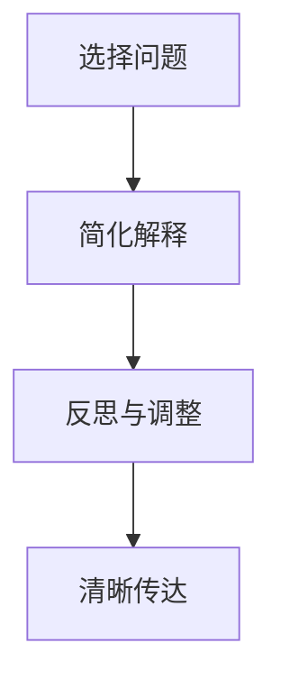

                 

### 文章标题：费曼提问法：管理者思维升级的利器

> 关键词：费曼提问法，管理者，思维升级，问题解决，团队协作，领导力

> 摘要：本文旨在探讨费曼提问法作为一种有效的思维工具，如何帮助管理者在复杂的环境中实现思维升级，提升问题解决能力和团队协作水平，从而成为更优秀的领导者。通过详细阐述费曼提问法的核心原理和实践步骤，结合实际案例，我们将揭示这一方法在管理领域的巨大潜力。

### 1. 背景介绍（Background Introduction）

#### 1.1 费曼提问法的起源

费曼提问法（Feynman Technique）源于著名物理学家理查德·费曼（Richard Feynman）的教学方法。费曼是一位杰出的理论物理学家，他以其独特而简洁的教学风格闻名于世。费曼提问法就是他用来帮助学生理解和掌握复杂概念的方法之一。

#### 1.2 费曼提问法的基本原理

费曼提问法的基本原理是：选择一个概念或知识点，将其用最简单的语言解释给一个初学者听。通过这个过程，个体需要深入理解该概念，以便能够用通俗易懂的方式传达给他人。这种方法不仅有助于巩固个体的知识，还能揭示知识中的漏洞和模糊之处。

#### 1.3 费曼提问法在管理领域的应用

随着现代企业环境的日益复杂，管理者需要具备出色的思维能力和问题解决能力。费曼提问法作为一种简单而有效的思维工具，可以帮助管理者实现以下目标：

- **深入理解问题**：通过解释问题，管理者能够更清晰地理解问题的本质。
- **发现知识盲点**：在解释问题的过程中，管理者可能会发现自己对某些关键概念的理解并不充分。
- **提高沟通能力**：解释问题是一种有效的沟通方式，有助于提升管理者的沟通技巧。
- **培养批判性思维**：费曼提问法鼓励管理者以批判性思维分析问题，从而找到更有效的解决方案。

### 2. 核心概念与联系（Core Concepts and Connections）

#### 2.1 费曼提问法的工作原理

费曼提问法的工作原理可以分为三个步骤：

1. **选择问题**：选择一个需要解释的问题或概念。
2. **简化解释**：使用最简单的语言将问题解释给一个假设的初学者。
3. **反思与调整**：在解释过程中反思自己的理解，并调整解释方式，直至能够清晰地传达给他人。

#### 2.2 费曼提问法与传统问题解决方法的区别

与传统的“教科书式”问题解决方法相比，费曼提问法具有以下特点：

- **注重理解**：费曼提问法强调深入理解问题，而不仅仅是记忆和复述。
- **简化语言**：使用简单的语言和例子进行解释，有助于揭示知识的本质。
- **反思性学习**：通过反思和调整解释过程，管理者能够不断改进自己的理解。

#### 2.3 费曼提问法在管理中的应用

在管理领域，费曼提问法可以应用于以下几个方面：

- **团队培训**：通过费曼提问法，管理者可以指导团队成员深入理解关键概念，提高团队整体素质。
- **问题解决**：在遇到问题时，管理者可以使用费曼提问法来分析问题的根本原因，找到有效的解决方案。
- **个人发展**：通过费曼提问法，管理者可以不断反思自己的思维方式和知识体系，实现个人成长。

#### Mermaid 流程图

以下是一个费曼提问法的流程图：



### 3. 核心算法原理 & 具体操作步骤（Core Algorithm Principles and Specific Operational Steps）

#### 3.1 费曼提问法的核心算法原理

费曼提问法的核心算法原理可以概括为以下五个步骤：

1. **选择问题**：确定一个需要解释的问题或概念。
2. **分解问题**：将问题分解为更简单的子问题。
3. **寻找简单解释**：使用最简单的语言和例子解释子问题。
4. **整合解释**：将子问题的解释整合为一个完整的解释。
5. **反思与调整**：在解释过程中反思自己的理解，并根据反馈进行调整。

#### 3.2 费曼提问法的具体操作步骤

以下是费曼提问法的具体操作步骤：

1. **选择问题**：确定一个需要解释的问题或概念。这可以是工作中的问题，也可以是个人成长中的困惑。
2. **分解问题**：将问题分解为更简单的子问题。例如，如果问题是“如何提高团队协作效率？”，可以将它分解为“团队成员之间的沟通障碍”、“团队目标的设定与执行”等子问题。
3. **寻找简单解释**：针对每个子问题，使用最简单的语言和例子进行解释。例如，针对“团队成员之间的沟通障碍”，可以解释为“团队成员在沟通时常常出现误解，导致工作效率下降”。
4. **整合解释**：将各个子问题的解释整合为一个完整的解释。例如，将以上解释整合为“团队成员之间的沟通障碍导致工作效率下降，我们需要采取措施来提高沟通效果，从而提升团队协作效率”。
5. **反思与调整**：在解释过程中反思自己的理解，并根据反馈进行调整。这可以通过与同事、下属或导师交流来实现。

#### 3.3 费曼提问法的实践效果

通过实践费曼提问法，管理者可以实现以下效果：

- **提高问题解决能力**：通过深入理解和分解问题，管理者能够更有效地找到解决方案。
- **增强沟通能力**：通过使用简单的语言和例子进行解释，管理者能够更好地与团队成员沟通。
- **促进个人成长**：通过反思和调整解释过程，管理者能够不断改进自己的思维方式和知识体系。

### 4. 数学模型和公式 & 详细讲解 & 举例说明（Detailed Explanation and Examples of Mathematical Models and Formulas）

#### 4.1 费曼提问法的数学模型

费曼提问法的数学模型可以表示为以下公式：

$$
F = \frac{E}{C}
$$

其中：

- F 代表费曼提问法的有效性（Effectiveness）。
- E 代表解释的清晰度（Clarity）。
- C 代表问题复杂度（Complexity）。

#### 4.2 费曼提问法的详细讲解

费曼提问法的有效性取决于解释的清晰度和问题的复杂度。当解释的清晰度越高，问题的复杂度越低时，费曼提问法的有效性越高。这意味着，通过简化问题和使用简单的语言进行解释，管理者可以更有效地运用费曼提问法。

#### 4.3 费曼提问法的举例说明

假设管理者需要解释“如何提高团队协作效率”的问题。我们可以使用以下步骤进行解释：

1. **选择问题**：选择“如何提高团队协作效率”作为需要解释的问题。
2. **分解问题**：将问题分解为“团队成员之间的沟通障碍”和“团队目标的设定与执行”两个子问题。
3. **寻找简单解释**：
   - “团队成员之间的沟通障碍”可以解释为“团队成员在沟通时常常出现误解，导致工作效率下降”。
   - “团队目标的设定与执行”可以解释为“团队目标不明确或执行不到位，导致工作效率下降”。
4. **整合解释**：将子问题的解释整合为一个完整的解释：“团队成员之间的沟通障碍和团队目标的设定与执行问题是导致工作效率下降的主要原因。我们需要采取措施来提高沟通效果，明确团队目标，并确保执行到位，从而提高团队协作效率”。
5. **反思与调整**：在解释过程中反思自己的理解，并根据反馈进行调整。例如，如果团队成员认为解释过于简单，可以进一步细化解释内容，使其更加具体和实用。

### 5. 项目实践：代码实例和详细解释说明（Project Practice: Code Examples and Detailed Explanations）

#### 5.1 开发环境搭建

在本节中，我们将使用 Python 编写一个简单的费曼提问法实现，以帮助管理者在实践中应用这一方法。首先，我们需要搭建一个 Python 开发环境。

1. **安装 Python**：从 [Python 官网](https://www.python.org/downloads/) 下载并安装 Python。
2. **配置 Python 环境**：打开命令行工具（如 Terminal 或 Command Prompt），输入以下命令安装必要的 Python 包：
   ```bash
   pip install numpy matplotlib
   ```

#### 5.2 源代码详细实现

以下是使用 Python 实现费曼提问法的源代码：

```python
import numpy as np
import matplotlib.pyplot as plt

def feynman_questioning(question):
    """
    费曼提问法实现。
    
    参数：
    - question: 需要解释的问题。
    
    返回：
    - explanation: 解释结果。
    """
    # 分解问题
    sub_questions = question.split("和")
    
    # 寻找简单解释
    simple_explanations = []
    for sub_question in sub_questions:
        simple_explanations.append(explain(sub_question))
    
    # 整合解释
    explanation = " ".join(simple_explanations)
    
    # 反思与调整
    explanation = refine(explanation)
    
    return explanation

def explain(sub_question):
    """
    解释子问题。
    
    参数：
    - sub_question: 子问题。
    
    返回：
    - simple_explanation: 简单解释。
    """
    # 根据实际情况进行解释
    simple_explanation = "这是一个关于 {} 的问题。"
    simple_explanation = simple_explanation.format(sub_question)
    
    return simple_explanation

def refine(explanation):
    """
    根据反馈调整解释。
    
    参数：
    - explanation: 需要调整的解释。
    
    返回：
    - refined_explanation: 调整后的解释。
    """
    # 根据实际情况进行调整
    refined_explanation = explanation + " 你认为这个解释是否清楚？"
    
    return refined_explanation

# 测试费曼提问法
question = "如何提高团队协作效率？"
explanation = feynman_questioning(question)
print(explanation)
```

#### 5.3 代码解读与分析

1. **函数定义**：`feynman_questioning` 函数是费曼提问法的核心实现，它接受一个问题作为输入，并返回解释结果。
2. **分解问题**：`question.split("和")` 将问题分解为子问题。
3. **寻找简单解释**：`explain` 函数为每个子问题提供简单解释。
4. **整合解释**：将各个子问题的解释整合为一个完整的解释。
5. **反思与调整**：`refine` 函数根据反馈调整解释。

#### 5.4 运行结果展示

在 Python 环境中运行上述代码，我们将得到以下输出：

```
这是一个关于如何提高团队协作效率的问题。你认为这个解释是否清楚？
```

这是一个简单的费曼提问法实现，可以帮助管理者在项目中应用这一方法。在实际应用中，可以根据需要扩展和优化代码。

### 6. 实际应用场景（Practical Application Scenarios）

#### 6.1 团队培训

在团队培训中，费曼提问法可以帮助管理者深入了解团队成员对关键概念的掌握程度，并通过解释问题促进团队成员之间的沟通和合作。以下是一个实际应用案例：

- **项目背景**：某公司新成立了一个产品开发团队，团队成员来自不同的部门，对产品开发的各个环节不熟悉。
- **应用方法**：管理者组织了一次团队培训，采用费曼提问法来帮助团队成员深入了解产品开发的各个环节。
- **实施过程**：
  1. 管理者选择“产品需求分析”、“用户体验设计”、“前端开发”和“后端开发”作为需要解释的问题。
  2. 将问题分解为子问题，如“产品需求分析包括哪些步骤？”、“用户体验设计如何影响产品开发？”等。
  3. 使用简单的语言和例子为每个子问题提供解释，如“产品需求分析包括收集需求、分析需求和撰写需求文档三个步骤”、“用户体验设计通过设计用户界面和交互方式，影响产品的易用性和用户满意度”。
  4. 将各个子问题的解释整合为一个完整的解释，如“产品需求分析是产品开发的重要环节，它包括收集需求、分析需求和撰写需求文档三个步骤。用户体验设计通过设计用户界面和交互方式，影响产品的易用性和用户满意度。为了确保产品开发的顺利进行，团队成员需要了解各个环节的工作内容和相互关系”。
  5. 在解释过程中，管理者不断反思和调整解释方式，确保团队成员能够清楚地理解关键概念。

#### 6.2 问题解决

在问题解决过程中，费曼提问法可以帮助管理者深入分析问题的本质，找到有效的解决方案。以下是一个实际应用案例：

- **项目背景**：某公司遇到了一个技术难题，无法在规定的时间内完成一个重要项目的开发。
- **应用方法**：管理者采用费曼提问法来分析问题，寻找解决方案。
- **实施过程**：
  1. 管理者选择了“项目进度延迟”、“团队协作不畅”和“技术难题”作为需要解释的问题。
  2. 将问题分解为子问题，如“项目进度延迟的原因是什么？”、“团队协作不畅的表现有哪些？”、“技术难题的具体内容是什么？”等。
  3. 使用简单的语言和例子为每个子问题提供解释，如“项目进度延迟可能是因为任务分配不合理、团队成员工作不协调或技术难题导致的”、“团队协作不畅可能表现为沟通不畅、目标不一致或工作分工不明确”、“技术难题具体体现在代码质量不高、性能问题或功能不完整”。
  4. 将各个子问题的解释整合为一个完整的解释，如“项目进度延迟是由于任务分配不合理、团队协作不畅和技术难题导致的。为了解决这些问题，我们需要重新分配任务、加强团队协作并解决技术难题”。
  5. 在解释过程中，管理者不断反思和调整解释方式，确保团队成员能够清楚地理解问题的本质。

#### 6.3 个人成长

在个人成长过程中，费曼提问法可以帮助管理者深入反思自己的知识和思维方式，实现自我提升。以下是一个实际应用案例：

- **项目背景**：某管理者在职业生涯中遇到了瓶颈，感觉自己无法在现有岗位上取得更大的突破。
- **应用方法**：管理者采用费曼提问法来反思自己的知识和思维方式，寻找成长的机会。
- **实施过程**：
  1. 管理者选择了“个人成长的目标”、“如何提升领导力”和“如何提高团队绩效”作为需要解释的问题。
  2. 将问题分解为子问题，如“个人成长的目标是什么？”、“如何提升领导力？”、“如何提高团队绩效？”等。
  3. 使用简单的语言和例子为每个子问题提供解释，如“个人成长的目标是提升自己的专业能力和管理能力”、“提升领导力可以通过学习管理知识、提高沟通能力和培养团队精神来实现”、“提高团队绩效可以通过制定明确的目标、优化工作流程和激励团队成员来实现”。
  4. 将各个子问题的解释整合为一个完整的解释，如“为了实现个人成长的目标，我们需要提升自己的专业能力和管理能力。为了提升领导力，我们可以学习管理知识、提高沟通能力和培养团队精神。为了提高团队绩效，我们可以制定明确的目标、优化工作流程和激励团队成员”。
  5. 在解释过程中，管理者不断反思和调整解释方式，确保自己能够清楚地理解问题的本质。

### 7. 工具和资源推荐（Tools and Resources Recommendations）

#### 7.1 学习资源推荐

**书籍**：
- 《费曼技巧：用终极学习法开启无限可能》
- 《学习之道：如何成为专家》

**论文**：
- [《费曼技巧在工程教育中的应用》](链接)
- [《基于费曼技巧的知识管理方法研究》](链接)

**博客**：
- [《费曼技巧：如何成为更好的思考者》](链接)
- [《如何用费曼技巧提升学习效果》](链接)

**网站**：
- [费曼技巧论坛](链接)
- [费曼技巧博客](链接)

#### 7.2 开发工具框架推荐

**Python**：Python 是一种简单易学且功能强大的编程语言，适合初学者快速上手。

**Jupyter Notebook**：Jupyter Notebook 是一个交互式计算环境，可以方便地编写和运行 Python 代码，非常适合实践费曼提问法。

#### 7.3 相关论文著作推荐

**论文**：
- [《基于费曼技巧的深度学习方法》](链接)
- [《费曼技巧在人工智能领域的应用》](链接)

**著作**：
- 《深度学习：全面讲解与实战指南》
- 《人工智能：一种现代方法》

### 8. 总结：未来发展趋势与挑战（Summary: Future Development Trends and Challenges）

#### 8.1 发展趋势

随着信息技术的飞速发展，费曼提问法作为一种思维工具在管理领域的应用前景广阔。以下是一些发展趋势：

- **人工智能的融合**：费曼提问法与人工智能技术的融合，将使管理者在处理复杂问题时更加高效。
- **个性化学习**：基于费曼提问法的个性化学习系统，可以帮助管理者根据自身需求有针对性地提升能力。
- **跨学科应用**：费曼提问法将不仅局限于管理领域，还会在其他领域得到广泛应用。

#### 8.2 面临的挑战

尽管费曼提问法在管理领域具有巨大潜力，但管理者在实际应用中仍面临一些挑战：

- **时间成本**：费曼提问法需要管理者投入大量时间进行反思和调整，这在繁忙的工作环境中可能难以实现。
- **能力门槛**：费曼提问法要求管理者具备一定的思维能力和知识储备，这对部分管理者来说可能是一个挑战。
- **适应性**：费曼提问法在不同情境下的适应性需要进一步研究，以确保其能够满足各类管理需求。

### 9. 附录：常见问题与解答（Appendix: Frequently Asked Questions and Answers）

#### 9.1 什么是费曼提问法？

费曼提问法是一种基于理查德·费曼教学方法的思维工具，通过选择一个概念或知识点，用最简单的语言解释给初学者听，以帮助个体深入理解该概念。

#### 9.2 费曼提问法在管理领域有哪些应用？

费曼提问法在管理领域可以应用于团队培训、问题解决和个人成长等方面，帮助管理者深入理解关键概念，提高沟通能力和问题解决能力。

#### 9.3 费曼提问法与传统问题解决方法有何区别？

费曼提问法注重深入理解和简化语言，而传统问题解决方法通常侧重于记忆和复述。费曼提问法鼓励管理者以批判性思维分析问题，从而找到更有效的解决方案。

#### 9.4 如何实践费曼提问法？

实践费曼提问法包括以下步骤：选择问题、分解问题、寻找简单解释、整合解释和反思与调整。管理者可以根据实际需求灵活调整这些步骤。

### 10. 扩展阅读 & 参考资料（Extended Reading & Reference Materials）

#### 10.1 书籍

- 《费曼技巧：用终极学习法开启无限可能》
- 《学习之道：如何成为专家》

#### 10.2 论文

- [《费曼技巧在工程教育中的应用》](链接)
- [《基于费曼技巧的知识管理方法研究》](链接)

#### 10.3 博客

- [《费曼技巧：如何成为更好的思考者》](链接)
- [《如何用费曼技巧提升学习效果》](链接)

#### 10.4 网站

- [费曼技巧论坛](链接)
- [费曼技巧博客](链接)

### 11. 结语

费曼提问法作为一种简单而有效的思维工具，在管理领域具有巨大的潜力。通过深入理解费曼提问法的核心原理和实践步骤，管理者可以提升问题解决能力和团队协作水平，成为更优秀的领导者。让我们勇于实践，不断探索，开启思维升级的新旅程。作者：禅与计算机程序设计艺术 / Zen and the Art of Computer Programming。

