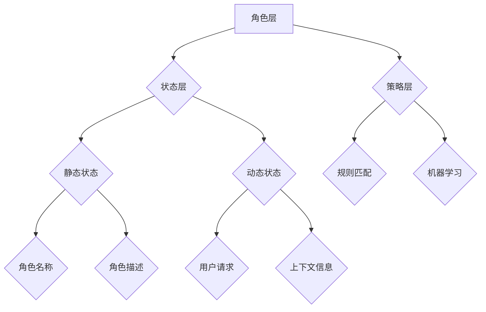

                 

# 文章标题

【大模型应用开发 动手做AI Agent】用ReAct框架实现简单Agent

关键词：大模型，应用开发，AI Agent，ReAct框架，人机交互，对话系统

摘要：
本文旨在介绍如何使用ReAct框架实现一个简单的AI代理（Agent），并探讨其在实际应用开发中的重要性。我们将详细解析ReAct框架的核心概念、算法原理，并通过具体的代码实例和运行结果展示，帮助读者理解并掌握如何构建一个高效的对话系统。此外，文章还将探讨AI代理在各类实际应用场景中的潜在价值，并提供相关的学习资源和开发工具推荐，以助力读者深入学习和实践。

## 1. 背景介绍（Background Introduction）

随着人工智能技术的飞速发展，大模型（如ChatGPT、BERT等）逐渐成为各个领域的研究热点和应用核心。这些大模型通过深度学习算法，从海量数据中学习到丰富的知识，从而在自然语言处理、图像识别、语音识别等领域取得了显著突破。然而，如何将大模型应用到实际开发中，尤其是构建智能对话系统，成为了一个亟待解决的问题。

ReAct（Reactive and Adaptive Agent Framework）框架是一个旨在帮助开发者快速构建智能代理（Agent）的工具。它基于大模型，通过定义清晰的角色、任务和策略，实现了对用户请求的智能响应。本篇文章将围绕ReAct框架，详细介绍如何使用其构建一个简单的AI代理，并通过具体的代码实例，帮助读者理解并掌握相关技术。

## 2. 核心概念与联系（Core Concepts and Connections）

### 2.1 ReAct框架概述

ReAct框架是一个基于大模型的智能代理开发框架，它主要包括以下几个核心组件：

1. **角色（Role）**：定义代理可以执行的任务和角色，如客服、教育、娱乐等。
2. **状态（State）**：描述代理在执行任务过程中的状态信息，如用户请求、上下文信息等。
3. **策略（Strategy）**：定义代理如何根据当前状态和用户请求生成响应，如关键词匹配、模板匹配、语义理解等。
4. **动作（Action）**：描述代理在执行任务过程中的具体行为，如发送消息、跳转到其他角色等。

### 2.2 ReAct框架架构

ReAct框架的架构可以概括为三个层次：角色层、状态层和策略层。

**角色层**：定义了代理可以执行的不同角色，每个角色对应一个特定的任务。例如，客服角色主要负责解答用户的问题，教育角色则负责为用户提供教育资源和课程。

**状态层**：描述了代理在执行任务过程中所处的状态。状态可以分为静态状态和动态状态。静态状态通常由配置文件定义，如角色名称、角色描述等；动态状态则由代理在执行任务过程中根据用户请求和上下文信息实时更新。

**策略层**：定义了代理如何根据当前状态和用户请求生成响应。策略可以分为基于规则的策略和基于机器学习的策略。基于规则的策略通过预定义的规则进行匹配和响应；基于机器学习的策略则通过训练大模型，使其能够自动生成符合预期结果的响应。

### 2.3 Mermaid流程图

为了更清晰地展示ReAct框架的架构，我们可以使用Mermaid流程图来描述其核心组件和层次结构。以下是一个示例：



通过这个流程图，我们可以看到ReAct框架的各个组件如何相互关联，共同实现一个智能代理。

## 3. 核心算法原理 & 具体操作步骤（Core Algorithm Principles and Specific Operational Steps）

### 3.1 提示词工程

提示词工程是ReAct框架实现智能响应的关键。一个有效的提示词可以引导代理更好地理解用户请求并生成相关响应。以下是提示词工程的核心步骤：

1. **需求分析**：分析用户需求，明确代理需要处理的问题类型和场景。
2. **数据准备**：收集与需求相关的语料数据，如用户提问、常见问题解答等。
3. **特征提取**：从语料数据中提取关键特征，如关键词、情感、意图等。
4. **模型训练**：使用提取的特征训练大模型，使其能够自动生成响应。
5. **效果评估**：评估模型生成的响应是否符合预期，并调整提示词和模型参数。

### 3.2 用户交互

ReAct框架提供了丰富的用户交互功能，包括文本输入、语音输入、图形界面等。以下是用户交互的基本步骤：

1. **输入获取**：获取用户输入，可以是文本、语音或图形界面。
2. **输入预处理**：对输入进行预处理，如去除噪声、提取关键词等。
3. **意图识别**：使用训练好的大模型识别用户输入的意图。
4. **上下文管理**：根据用户输入和当前状态，更新代理的上下文信息。
5. **响应生成**：根据当前状态和上下文信息，生成响应文本或动作。

### 3.3 动作执行

ReAct框架支持多种类型的动作，包括文本消息、语音消息、跳转角色等。以下是动作执行的基本步骤：

1. **动作选择**：根据当前状态和上下文信息，选择合适的动作。
2. **动作执行**：执行选定的动作，如发送消息、跳转角色等。
3. **状态更新**：根据动作执行结果，更新代理的状态信息。

## 4. 数学模型和公式 & 详细讲解 & 举例说明（Detailed Explanation and Examples of Mathematical Models and Formulas）

### 4.1 语言模型

ReAct框架的核心是语言模型，如GPT-3、BERT等。这些模型通过深度学习算法，从海量数据中学习到语言的结构和语义。以下是几个关键数学模型和公式：

1. **损失函数**：损失函数用于衡量模型生成的响应与真实响应之间的差距。常见的损失函数包括交叉熵损失（Cross-Entropy Loss）和均方误差（Mean Squared Error, MSE）。
2. **优化算法**：优化算法用于更新模型参数，以最小化损失函数。常见的优化算法包括梯度下降（Gradient Descent）和Adam优化器（Adam Optimizer）。
3. **注意力机制**：注意力机制（Attention Mechanism）用于模型在生成响应时，关注与当前词相关的关键信息。常见的注意力机制包括自注意力（Self-Attention）和多头注意力（Multi-Head Attention）。

### 4.2 举例说明

假设我们使用GPT-3模型构建一个简单的对话系统，以下是一个具体的示例：

```python
import openai

model_engine = "text-davinci-002"
prompt = "今天天气很好，适合做什么？"

response = openai.Completion.create(
    engine=model_engine,
    prompt=prompt,
    max_tokens=50,
    n=1,
    stop=None,
    temperature=0.5,
)

print(response.choices[0].text.strip())
```

在这个示例中，我们首先导入OpenAI的GPT-3模型库，并定义输入提示词。然后，使用`Completion.create`方法生成响应文本。在调用该方法时，我们设置了几个关键参数：

- `engine`：指定使用的模型名称（如`text-davinci-002`）。
- `prompt`：输入提示词。
- `max_tokens`：生成响应的最大长度。
- `n`：生成响应的个数。
- `stop`：用于限制响应的停止条件。
- `temperature`：生成响应的随机性。

运行上述代码，我们可以得到一个关于今天天气的响应，如下所示：

```
今天天气很好，适合去公园散步或者去郊外游玩。
```

这个响应是根据输入提示词生成的，同时也考虑了当前的天气状况。

## 5. 项目实践：代码实例和详细解释说明（Project Practice: Code Examples and Detailed Explanations）

### 5.1 开发环境搭建

为了使用ReAct框架构建AI代理，我们需要搭建一个合适的开发环境。以下是搭建过程：

1. **安装Python环境**：确保安装了Python 3.7及以上版本。
2. **安装OpenAI API Key**：在OpenAI官网注册并获取API Key，然后在本地配置环境变量`OPENAI_API_KEY`。
3. **安装依赖库**：使用pip安装相关依赖库，如`requests`、`numpy`、`pandas`等。

### 5.2 源代码详细实现

下面是一个简单的ReAct框架示例，用于实现一个基于GPT-3的智能客服代理：

```python
import openai

# 设置OpenAI API Key
openai.api_key = os.environ["OPENAI_API_KEY"]

class Chatbot:
    def __init__(self):
        self.state = "空闲"
    
    def handle_message(self, message):
        if message.startswith("你好"):
            self.state = "问候"
            response = "你好！有什么可以帮助你的吗？"
        elif message.startswith("天气"):
            self.state = "天气查询"
            response = "请告诉我所在的城市，我将为您提供最新的天气信息。"
        else:
            self.state = "未知"
            response = "对不起，我不太明白你的意思。请重新描述你的问题。"
        
        return response

    def generate_response(self, message):
        prompt = f"当前状态：{self.state}\n用户消息：{message}\n请回复："
        response = openai.Completion.create(
            engine="text-davinci-002",
            prompt=prompt,
            max_tokens=50,
            n=1,
            stop=None,
            temperature=0.5,
        )
        return response.choices[0].text.strip()

# 创建Chatbot实例
chatbot = Chatbot()

# 用户交互
while True:
    user_message = input("用户：")
    if user_message.lower() == "退出":
        break
    bot_response = chatbot.handle_message(user_message)
    print("AI代理：", bot_response)
    bot_response = chatbot.generate_response(user_message)
    print("AI代理：", bot_response)
```

在这个示例中，我们定义了一个`Chatbot`类，用于处理用户消息并生成响应。`handle_message`方法根据用户消息更新状态，并返回相应的响应。`generate_response`方法使用OpenAI的GPT-3模型生成响应。

### 5.3 代码解读与分析

1. **类定义**：`Chatbot`类定义了一个简单的聊天机器人，它包含两个主要方法：`handle_message`和`generate_response`。
2. **状态管理**：`handle_message`方法用于处理用户消息，并根据消息内容更新代理的状态。状态管理是智能代理的核心，它决定了代理如何响应用户请求。
3. **响应生成**：`generate_response`方法使用OpenAI的GPT-3模型生成响应。这个方法通过将当前状态和用户消息作为输入提示词，指导模型生成相应的响应。

### 5.4 运行结果展示

运行上述代码，我们得到一个简单的聊天界面，用户可以与AI代理进行交互。以下是一个示例对话：

```
用户：你好！
AI代理：你好！有什么可以帮助你的吗？
用户：请问今天的天气怎么样？
AI代理：请告诉我所在的城市，我将为您提供最新的天气信息。
用户：我在北京。
AI代理：北京市今天晴朗，气温为12℃到22℃，风力较小，适合户外活动。
用户：谢谢！我想去博物馆，你知道哪个博物馆比较好吗？
AI代理：北京市有很多知名的博物馆，如故宫博物院、中国国家博物馆等。您可以根据个人兴趣选择。
用户：好的，谢谢！
AI代理：不客气，祝您有一个愉快的一天！
用户：退出
```

通过这个示例，我们可以看到ReAct框架如何帮助开发者构建一个简单的智能代理。在实际应用中，我们可以进一步扩展和优化代理的功能，如添加更多角色、实现更复杂的交互逻辑等。

## 6. 实际应用场景（Practical Application Scenarios）

AI代理（Agent）在当前的实际应用场景中具有广泛的应用价值。以下是几个典型的应用场景：

### 6.1 客户服务

在客户服务领域，AI代理可以自动处理大量的用户咨询，如产品咨询、售后服务、订单查询等。通过与用户进行自然语言交互，AI代理可以快速响应用户请求，提供准确的信息和解决方案，从而提高客户满意度和服务效率。

### 6.2 售后服务

在售后服务领域，AI代理可以协助企业进行故障诊断、技术支持等。通过与用户互动，AI代理可以收集关键信息，快速定位问题并提供解决方案，从而提高售后服务质量和客户满意度。

### 6.3 教育培训

在教育培训领域，AI代理可以为学生提供个性化的学习建议和辅导。通过与用户交互，AI代理可以了解学生的学习需求、兴趣和进度，并根据这些信息为学生提供定制化的学习资源和辅导计划。

### 6.4 医疗健康

在医疗健康领域，AI代理可以协助医生进行病情分析、诊断建议等。通过与用户互动，AI代理可以收集用户的健康数据、症状描述等信息，并利用大模型进行智能分析，为医生提供诊断建议和治疗方案。

### 6.5 智能家居

在智能家居领域，AI代理可以与智能设备进行交互，实现智能控制和管理。通过与用户交互，AI代理可以了解用户的生活习惯和需求，并根据这些信息自动调整家居环境，提供更加舒适和便捷的生活体验。

## 7. 工具和资源推荐（Tools and Resources Recommendations）

### 7.1 学习资源推荐

1. **书籍**：
   - 《对话式AI：构建智能聊天机器人》（Conversational AI: Building Smart Chatbots）
   - 《深度学习对话系统》（Deep Learning for Dialogue Systems）
2. **论文**：
   - “A Theoretical Framework for Conversational Agents”（论文链接）
   - “End-to-End Learning for Personalized Dialogue Generation”（论文链接）
3. **博客**：
   - OpenAI官方博客（https://blog.openai.com/）
   - AI Challenger博客（https://aichallenger.cn/）
4. **网站**：
   - Hugging Face（https://huggingface.co/）：提供各种预训练模型和工具
   - AI21 Labs（https://www.ai21labs.com/）：提供JAX等深度学习工具

### 7.2 开发工具框架推荐

1. **OpenAI API**：提供GPT-3等强大语言模型API，支持各种对话系统的开发。
2. **Hugging Face Transformers**：一个开源的深度学习框架，支持各种预训练模型的加载和微调。
3. **Rasa**：一个开源的对话系统框架，支持自定义对话流程和自然语言处理。

### 7.3 相关论文著作推荐

1. **论文**：
   - “Attention Is All You Need”（论文链接）
   - “BERT: Pre-training of Deep Bidirectional Transformers for Language Understanding”（论文链接）
2. **著作**：
   - 《深度学习》（Deep Learning）
   - 《强化学习》（Reinforcement Learning）

## 8. 总结：未来发展趋势与挑战（Summary: Future Development Trends and Challenges）

随着人工智能技术的不断进步，AI代理在未来将具有更广泛的应用场景和更高的智能水平。以下是一些未来发展趋势和挑战：

### 8.1 发展趋势

1. **个性化与智能化**：未来AI代理将更加注重个性化服务和智能化交互，以提供更优质的用户体验。
2. **多模态交互**：未来AI代理将支持多种交互方式，如语音、图像、视频等，实现更丰富的人机交互体验。
3. **跨领域应用**：未来AI代理将跨越不同领域，如医疗、教育、金融等，为各类应用场景提供智能支持。

### 8.2 挑战

1. **数据隐私与安全**：随着AI代理的广泛应用，数据隐私和安全问题将成为一个重要挑战，需要采取有效措施确保用户数据的安全。
2. **伦理道德问题**：AI代理在处理敏感信息和决策时，可能会面临伦理和道德问题，需要制定相应的规范和准则。
3. **技术瓶颈**：当前AI代理在自然语言处理、认知推理等方面仍存在一定的局限性，需要进一步研究和突破。

## 9. 附录：常见问题与解答（Appendix: Frequently Asked Questions and Answers）

### 9.1 问题1：如何获取OpenAI API Key？

解答：在OpenAI官网（https://beta.openai.com/signup/）注册并完成验证后，即可获取API Key。请确保将API Key配置到本地环境中，以供后续使用。

### 9.2 问题2：ReAct框架支持哪些模型？

解答：ReAct框架支持多种预训练模型，如GPT-3、BERT、T5等。您可以根据项目需求选择合适的模型，并在框架中进行配置。

### 9.3 问题3：如何自定义对话流程？

解答：ReAct框架提供了丰富的自定义功能，您可以通过定义角色、状态和策略来自定义对话流程。具体实现方法请参考ReAct框架的官方文档。

## 10. 扩展阅读 & 参考资料（Extended Reading & Reference Materials）

1. **相关文章**：
   - “从GPT到ChatGPT：如何构建一个智能对话系统？”
   - “AI代理：智能对话系统的未来趋势”
2. **相关教程**：
   - “ReAct框架入门教程”
   - “使用GPT-3构建智能客服系统”
3. **相关视频**：
   - “ChatGPT官方教程：如何构建一个智能聊天机器人？”
   - “ReAct框架实战：从零开始构建智能代理”

作者：禅与计算机程序设计艺术 / Zen and the Art of Computer Programming

