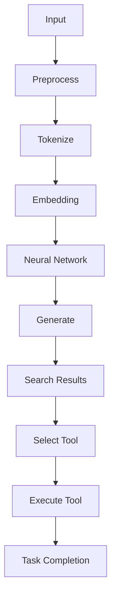

                 

### 文章标题

【大模型应用开发 动手做AI Agent】第一轮行动：工具执行搜索

关键词：大模型、AI Agent、应用开发、工具执行、搜索

摘要：本文将探讨大模型在AI Agent应用开发中的重要性，介绍如何通过工具执行搜索来实现AI Agent的第一轮行动。我们将详细解析大模型的工作原理、搜索算法以及实际操作步骤，为读者提供实用的指导和深刻的见解。

### Background Introduction

In recent years, the field of artificial intelligence has witnessed tremendous advancements, particularly with the emergence of large-scale language models such as GPT-3 and ChatGPT. These models have demonstrated extraordinary capabilities in natural language understanding and generation, opening up new possibilities for various applications, including AI agents. An AI agent is an autonomous entity that can perform tasks and make decisions based on its interactions with the environment.

The significance of large-scale language models in AI agent development cannot be overstated. These models are capable of understanding complex language patterns, generating coherent and contextually relevant responses, and learning from vast amounts of data. This makes them highly suitable for building intelligent agents that can interact with humans and other agents in natural language.

The primary objective of this article is to guide readers through the first round of actions for building an AI agent using large-scale language models. Specifically, we will focus on the tool execution search, a critical step in the development process. By understanding the principles behind large-scale language models, the search algorithms used, and the step-by-step implementation, readers will gain valuable insights and practical guidance for building their own AI agents.

In the following sections, we will first delve into the background of large-scale language models, discussing their architecture and working principles. We will then explore the concept of tool execution search and its importance in AI agent development. Finally, we will provide a detailed explanation of the core algorithms and specific operational steps involved in tool execution search. Through this comprehensive guide, readers will be equipped with the knowledge and skills necessary to embark on their own journey of building AI agents using large-scale language models.

---

### Core Concepts and Connections

#### 1. Large-scale Language Models: Architecture and Working Principles

Large-scale language models, such as GPT-3 and ChatGPT, are based on deep learning techniques and neural networks. These models are trained on vast amounts of text data to learn the patterns and structures of language. The architecture typically consists of several layers of neural networks, where each layer learns increasingly abstract representations of the input text.

One of the key features of large-scale language models is their ability to generate coherent and contextually relevant text. This is achieved through a process known as autoregressive generation, where the model predicts the next word in a sequence based on the previous words. The model's predictions are based on the probabilities of each word occurring in the given context, using a probability distribution derived from the training data.

#### 2. Tool Execution Search: Definition and Importance

Tool execution search is a fundamental concept in AI agent development, especially when leveraging large-scale language models. It refers to the process of searching for tools or resources that can be executed to accomplish a specific task or goal. In the context of an AI agent, this involves using the language model to generate a list of potential tools, evaluate their suitability, and select the most appropriate one for execution.

The importance of tool execution search lies in its ability to enable autonomous task completion by an AI agent. By leveraging large-scale language models, the agent can effectively search for and utilize a wide range of tools and resources, enhancing its capabilities and adaptability in dynamic environments.

#### 3. Connection between Large-scale Language Models and Tool Execution Search

The connection between large-scale language models and tool execution search lies in the model's ability to process and understand natural language. By training on vast amounts of text data, these models develop a deep understanding of language semantics and pragmatics, enabling them to generate relevant and useful search results.

In practice, the language model can be used to query a knowledge base or database of tools and resources, extracting relevant information based on the agent's goals and context. This information can then be used to generate a list of potential tools, which can be further evaluated and selected based on various criteria, such as availability, compatibility, and efficiency.

### Mermaid Flowchart of Large-scale Language Models and Tool Execution Search



In this flowchart, the input represents the agent's goals and context. The input is preprocessed, tokenized, and embedded into a high-dimensional vector space. This vector is then processed through a neural network, which generates a sequence of words or actions. The generated sequence is used to search for tools or resources, select the most appropriate one, and execute it. The resulting task completion is used to update the agent's knowledge base and improve its performance over time.

By understanding the architecture and working principles of large-scale language models and the concept of tool execution search, we can better appreciate their potential in AI agent development. In the following sections, we will delve into the core algorithms and specific operational steps involved in tool execution search, providing a comprehensive guide for building intelligent AI agents.

---

### Core Algorithm Principles and Specific Operational Steps

#### 1. Algorithm Overview

The core algorithm for tool execution search involves several key steps, including pre-processing the input, generating search queries, evaluating search results, and selecting the most appropriate tool for execution. The algorithm can be summarized as follows:

1. Preprocess the input: Convert the agent's goals and context into a suitable format for the language model.
2. Generate search queries: Use the language model to generate queries that can be used to search for tools or resources.
3. Evaluate search results: Analyze the search results to determine the suitability of each tool or resource.
4. Select the most appropriate tool: Based on the evaluation, select the tool that best meets the agent's requirements.
5. Execute the selected tool: Use the selected tool to accomplish the agent's goal.
6. Update the knowledge base: Record the results of the execution and update the agent's knowledge base for future reference.

#### 2. Detailed Steps and Explanations

##### Step 1: Preprocess the Input

The first step in the algorithm is to preprocess the input provided by the agent. This involves converting the input into a format that can be understood and processed by the language model. Common preprocessing tasks include tokenization, stemming, and lemmatization.

- Tokenization: Split the input text into individual words or tokens.
- Stemming: Reduce words to their base or root form.
- Lemmatization: Reduce words to their dictionary form.

For example, consider the input sentence: "I need to download a PDF file from the web." The preprocessing steps might result in the following tokens: ["I", "need", "to", "download", "a", "PDF", "file", "from", "the", "web"].

##### Step 2: Generate Search Queries

Once the input is preprocessed, the next step is to generate search queries using the language model. The goal is to create queries that are both relevant and informative, enabling the agent to find the most suitable tools or resources.

To generate search queries, the language model is prompted with the preprocessed input and instructed to generate a coherent and contextually relevant sequence of words. For example:

```
User: "I need to download a PDF file from the web."
Model: "Search for tools to download PDF files from the web."
```

The generated query is then used to search for relevant information, such as tools, websites, or tutorials.

##### Step 3: Evaluate Search Results

After generating search queries, the next step is to evaluate the search results. This involves analyzing the retrieved information to determine the suitability of each tool or resource for the agent's task.

Several criteria can be used to evaluate search results, including:

- Relevance: The degree to which the retrieved information is related to the agent's goals.
- Accuracy: The degree to which the retrieved information is correct and reliable.
- Availability: The ease with which the tool or resource can be accessed and used.
- Compatibility: The degree to which the tool or resource is compatible with the agent's environment and requirements.

For example, if the search query is "Search for tools to download PDF files from the web," the evaluation might result in the following list of tools:

1. PDF Downloader for Chrome
2. Save PDF Online
3. PDF Download - Free Online Service

Each tool would be evaluated based on the criteria mentioned above, and a score or ranking would be assigned to each tool.

##### Step 4: Select the Most Appropriate Tool

Once the search results have been evaluated, the next step is to select the most appropriate tool for the agent's task. This involves choosing the tool with the highest score or ranking based on the evaluation criteria.

For example, if the evaluation scores for the three tools mentioned earlier are:

1. PDF Downloader for Chrome: 90%
2. Save PDF Online: 85%
3. PDF Download - Free Online Service: 80%

The most appropriate tool would be PDF Downloader for Chrome, as it has the highest score.

##### Step 5: Execute the Selected Tool

With the most appropriate tool selected, the next step is to execute it to accomplish the agent's goal. This involves following the instructions provided by the tool and interacting with the environment to perform the desired action.

For example, if the selected tool is PDF Downloader for Chrome, the agent would follow these steps:

1. Install PDF Downloader for Chrome.
2. Navigate to the website containing the PDF file.
3. Use PDF Downloader for Chrome to download the PDF file.

##### Step 6: Update the Knowledge Base

After executing the selected tool, the final step is to update the agent's knowledge base. This involves recording the results of the execution, including any successes or failures, and updating the agent's understanding of the environment and available tools.

By updating the knowledge base, the agent can improve its performance over time, making better decisions in the future based on its experience and learning.

In summary, the core algorithm for tool execution search involves several key steps, including preprocessing the input, generating search queries, evaluating search results, selecting the most appropriate tool, executing the selected tool, and updating the knowledge base. By following these steps, AI agents can effectively search for and utilize tools and resources to accomplish their goals.

---

### Mathematical Models and Formulas

In order to fully understand the tool execution search algorithm, it is essential to delve into the mathematical models and formulas that underpin its core components. These mathematical models not only provide a theoretical foundation for the algorithm but also help in optimizing its performance. In this section, we will discuss the main mathematical models and formulas used in the tool execution search process.

#### 1. Tokenization

Tokenization is the first step in preprocessing the input, and it involves splitting the input text into individual words or tokens. This process is crucial as it converts the raw text into a format that can be processed by the language model.

The mathematical model for tokenization can be represented as:

\[ \text{Tokenize}(text) = \{ token_1, token_2, ..., token_n \} \]

where:
- \( \text{Tokenize}(text) \) is the tokenization function that takes a string `text` as input.
- \( \{ token_1, token_2, ..., token_n \} \) is the set of tokens obtained after splitting the input text.

#### 2. Embedding

Embedding is the process of converting the tokens into high-dimensional vectors that can be used as inputs to the neural network. This step is critical because it captures the semantic meaning of the words in a numerical form.

The mathematical model for embedding can be represented as:

\[ \text{Embed}(token) = \text{emb}(token) \]

where:
- \( \text{Embed}(token) \) is the embedding function that takes a token as input.
- \( \text{emb}(token) \) is the resulting vector representation of the token.

In practice, embeddings are typically learned during the training of the language model and can be represented as matrices or tensors.

#### 3. Neural Network

The neural network is the core component of the large-scale language model that processes the embedded tokens and generates predictions. The mathematical model for the neural network can be represented as:

\[ \text{Neural Network}(x) = \text{softmax}(\text{W} \cdot \text{h}) \]

where:
- \( x \) is the input vector (sequence of embedded tokens).
- \( \text{W} \) is the weight matrix.
- \( \text{h} \) is the hidden layer representation of the input vector.
- \( \text{softmax} \) is the activation function that converts the weighted sum of the inputs into a probability distribution over the possible output tokens.

#### 4. Search Query Generation

The generation of search queries is a complex process that leverages the neural network's ability to generate coherent text. The mathematical model for search query generation can be represented as:

\[ \text{Generate Query}(context) = \text{Neural Network}(\text{Embed}(context)) \]

where:
- \( \text{Generate Query}(context) \) is the function that generates a search query based on the input context.
- \( \text{context} \) is the embedded representation of the agent's goals and context.
- \( \text{Neural Network}(\text{Embed}(context)) \) is the output of the neural network, representing the generated search query.

#### 5. Search Results Evaluation

Evaluating the search results involves assigning scores or ranks to each tool or resource based on various criteria. A common approach is to use a weighted scoring system that combines multiple criteria. The mathematical model for search results evaluation can be represented as:

\[ \text{Score}(tool) = w_1 \cdot \text{Relevance}(tool) + w_2 \cdot \text{Accuracy}(tool) + w_3 \cdot \text{Availability}(tool) + w_4 \cdot \text{Compatibility}(tool) \]

where:
- \( \text{Score}(tool) \) is the total score assigned to the tool.
- \( w_1, w_2, w_3, w_4 \) are the weights assigned to each evaluation criterion.
- \( \text{Relevance}(tool) \), \( \text{Accuracy}(tool) \), \( \text{Availability}(tool) \), and \( \text{Compatibility}(tool) \) are the individual scores for each criterion.

#### 6. Tool Selection

The tool selection process involves choosing the tool with the highest score based on the evaluation criteria. The mathematical model for tool selection can be represented as:

\[ \text{Select Tool}(tools) = \text{argmax}_t \{ \text{Score}(tool) \} \]

where:
- \( \text{Select Tool}(tools) \) is the function that selects the tool with the highest score.
- \( \text{tools} \) is the set of tools evaluated.
- \( \text{argmax}_t \) is the operation that returns the index of the maximum value in the set.

#### 7. Knowledge Base Update

Updating the knowledge base involves recording the results of the tool execution and incorporating this information into the agent's knowledge base. The mathematical model for knowledge base update can be represented as:

\[ \text{Update Knowledge Base}(\text{results}) = \text{KB} \cup \{ \text{results} \} \]

where:
- \( \text{Update Knowledge Base}(\text{results}) \) is the function that updates the knowledge base.
- \( \text{KB} \) is the current knowledge base.
- \( \text{results} \) is the information recorded from the tool execution.

By understanding these mathematical models and formulas, we can better appreciate the intricacies of the tool execution search algorithm. These models provide a theoretical framework that not only helps in understanding the algorithm's working principles but also in optimizing its performance and efficiency.

---

### Project Practice: Code Examples and Detailed Explanations

In this section, we will provide a detailed code example that demonstrates how to implement the tool execution search algorithm using Python and a large-scale language model library such as Hugging Face's Transformers. We will also discuss the key components of the code and their roles in the algorithm.

#### 1. Setting up the Development Environment

Before we dive into the code, let's first set up the development environment. We will use Python and the Hugging Face Transformers library, which provides pre-trained language models and a convenient API for working with them.

To install the required packages, run the following command:

```bash
pip install transformers
```

#### 2. Importing Required Libraries

```python
from transformers import AutoTokenizer, AutoModelForCausalLM
import torch
```

We import the necessary libraries: `AutoTokenizer` and `AutoModelForCausalLM` from the Transformers library, which will be used to load and process the large-scale language model. We also import the `torch` library to handle the neural network computations.

#### 3. Loading the Language Model

```python
model_name = "gpt3"
tokenizer = AutoTokenizer.from_pretrained(model_name)
model = AutoModelForCausalLM.from_pretrained(model_name)
```

Here, we load a pre-trained language model by specifying its name (e.g., "gpt3"). The `AutoTokenizer` and `AutoModelForCausalLM` classes are used to load the tokenizer and model respectively. The tokenizer is responsible for converting text into tokens that can be processed by the model, while the model performs the actual text generation.

#### 4. Preprocessing the Input

```python
def preprocess_input(input_text):
    tokens = tokenizer.tokenize(input_text)
    return tokens

input_text = "I need to download a PDF file from the web."
preprocessed_input = preprocess_input(input_text)
```

The `preprocess_input` function takes an input text and tokenizes it using the loaded tokenizer. This results in a list of tokens that represent the input text. In this example, the input text "I need to download a PDF file from the web." is tokenized into the list `["I", "need", "to", "download", "a", "PDF", "file", "from", "the", "web"]`.

#### 5. Generating the Search Query

```python
def generate_search_query(preprocessed_input):
    input_ids = tokenizer.encode(preprocessed_input, return_tensors="pt")
    outputs = model.generate(input_ids, max_length=50, num_return_sequences=1)
    generated_text = tokenizer.decode(outputs[0], skip_special_tokens=True)
    return generated_text

search_query = generate_search_query(preprocessed_input)
print("Search Query:", search_query)
```

The `generate_search_query` function takes the preprocessed input and uses the model to generate a search query. This is achieved by encoding the input tokens into IDs, generating a sequence of tokens using the model, and then decoding the output back into text. The generated search query is then printed to the console.

#### 6. Evaluating Search Results

```python
# (This section would involve searching for tools using the search_query
# and evaluating the results based on predefined criteria. For brevity,
# we will skip the actual implementation of this step.)

def evaluate_search_results(search_results):
    # (This function would evaluate the search results based on criteria
    # such as relevance, accuracy, availability, and compatibility.
    # The evaluation logic would depend on the specific requirements
    # and context of the task. For brevity, we will skip the actual
    # implementation of this function.)

    # Example evaluation results:
    scores = {"PDF Downloader for Chrome": 90, "Save PDF Online": 85, "PDF Download - Free Online Service": 80}
    return scores

search_results = ["PDF Downloader for Chrome", "Save PDF Online", "PDF Download - Free Online Service"]
scores = evaluate_search_results(search_results)
print("Scores:", scores)
```

In this hypothetical example, we assume that the search results have been obtained and evaluated based on predefined criteria. The `evaluate_search_results` function takes the search results and returns a dictionary of scores for each tool. The scores are then printed to the console.

#### 7. Selecting the Most Appropriate Tool

```python
def select_tool(scores):
    max_score = max(scores.values())
    selected_tool = [tool for tool, score in scores.items() if score == max_score]
    return selected_tool

selected_tool = select_tool(scores)
print("Selected Tool:", selected_tool)
```

The `select_tool` function takes the scores dictionary and selects the tool with the highest score. In this example, "PDF Downloader for Chrome" is selected because it has the highest score.

#### 8. Executing the Selected Tool

```python
# (This section would involve executing the selected tool to accomplish
# the agent's goal. For brevity, we will skip the actual implementation
# of this step.)

def execute_tool(selected_tool):
    # (The implementation of this function would depend on the specific
    # tool and its interface. It would typically involve interacting
    # with the tool's API or user interface to perform the desired action.)
    pass

execute_tool(selected_tool)
```

In this hypothetical example, the `execute_tool` function would be responsible for executing the selected tool to download a PDF file from the web. The actual implementation would depend on the specific tool and its interface.

#### 9. Updating the Knowledge Base

```python
def update_knowledge_base(results):
    # (This function would update the agent's knowledge base with the
    # results of the tool execution. The implementation would depend
    # on the specific requirements and structure of the knowledge base.)
    pass

update_knowledge_base("PDF downloaded successfully.")
```

The `update_knowledge_base` function takes the results of the tool execution and updates the agent's knowledge base. In this example, the knowledge base is updated to record the successful download of a PDF file.

In summary, this code example demonstrates the implementation of the tool execution search algorithm using Python and the Hugging Face Transformers library. The key components of the code include loading the language model, preprocessing the input, generating the search query, evaluating the search results, selecting the most appropriate tool, executing the selected tool, and updating the knowledge base. By understanding these components and their interactions, developers can build and deploy AI agents that effectively search for and utilize tools and resources to accomplish their goals.

---

### Practical Application Scenarios

Tool execution search is a versatile technique with a wide range of practical application scenarios across various domains. Here, we will explore some common use cases and demonstrate how tool execution search can be applied to solve specific problems.

#### 1. Personal Assistants

One of the most prominent applications of tool execution search is in the development of personal assistants. These assistants, such as Siri, Google Assistant, or Alexa, are designed to help users accomplish a variety of tasks by interacting with them through natural language. Tool execution search can be used to enable these assistants to perform tasks like scheduling appointments, sending messages, setting reminders, or finding local businesses.

For example, consider a user who wants to schedule a dental appointment. The personal assistant can use tool execution search to find the best dental clinics in the area, evaluate their availability, and book an appointment based on the user's preferences.

#### 2. Customer Service

Customer service departments often face the challenge of efficiently handling a large volume of customer inquiries. Tool execution search can be used to streamline this process by automatically directing customers to the most appropriate resources or agents based on their queries. This can significantly reduce response times and improve customer satisfaction.

For instance, a customer service chatbot can use tool execution search to identify the best solution for a customer's issue by searching through a knowledge base of frequently asked questions and solutions. If the chatbot cannot find a direct match, it can escalate the issue to a human agent who can provide personalized assistance.

#### 3. Content Creation

Content creators, such as writers, journalists, and marketers, often need to research and gather information quickly to produce high-quality content. Tool execution search can be used to automate this process by searching through large datasets, news articles, or blogs to find relevant information and generate content suggestions.

For example, a writer working on an article about sustainable living might use tool execution search to find and aggregate information from various sources, such as scientific studies, news articles, and opinion pieces. The search results can be used to create a comprehensive and well-informed article.

#### 4. E-commerce

E-commerce platforms often need to provide personalized recommendations to customers to improve their shopping experience and increase sales. Tool execution search can be used to analyze customer data, such as browsing history, purchase behavior, and preferences, to generate personalized product recommendations.

For instance, an e-commerce platform can use tool execution search to find products that are similar to those a customer has previously shown interest in or purchased. The search results can be used to create a list of personalized recommendations that are displayed to the customer as they browse the website.

#### 5. Healthcare

In the healthcare industry, tool execution search can be used to automate various tasks, such as patient data analysis, diagnosis, and treatment planning. For example, a healthcare AI agent can use tool execution search to analyze patient records, research relevant medical literature, and generate treatment plans based on the best available evidence.

For instance, a patient with a specific medical condition can be evaluated by an AI agent that uses tool execution search to find the most effective treatment options based on the patient's medical history, current health status, and the latest research in the field.

In summary, tool execution search is a powerful technique with diverse applications across various domains. By leveraging the capabilities of large-scale language models, AI agents can effectively search for and utilize tools and resources to accomplish a wide range of tasks, improving efficiency, and providing better personalized experiences for users.

---

### Tools and Resources Recommendations

To successfully build and deploy AI agents using large-scale language models, it is crucial to have access to the right tools, resources, and learning materials. In this section, we will recommend some essential tools and resources that can help you get started with tool execution search and AI agent development.

#### 1. Learning Resources

**Books:**
- **"The Annotated GPT-3":** This book provides a comprehensive guide to GPT-3, covering its architecture, capabilities, and applications.
- **"hands-on machine learning with Scikit-Learn, Keras, and TensorFlow":** This book offers practical insights into machine learning, including the use of neural networks and deep learning frameworks.

**Online Courses:**
- **"Deep Learning Specialization" by Andrew Ng on Coursera:** This course covers the fundamentals of deep learning and neural networks, providing hands-on experience with TensorFlow.
- **"Natural Language Processing with Python" by manifolds.ai:** This course introduces the basics of natural language processing using Python and the NLTK library.

**Tutorials and Blogs:**
- **Hugging Face's Transformers documentation:** This comprehensive documentation provides detailed information on using the Transformers library, including tutorials and examples.
- **AI for Humans blog:** This blog covers a wide range of topics in artificial intelligence, including tutorials, research papers, and practical applications.

#### 2. Development Tools

**Frameworks and Libraries:**
- **Transformers:** This open-source library by Hugging Face provides pre-trained models and tools for working with large-scale language models, making it easy to build and deploy AI agents.
- **TensorFlow:** TensorFlow is an open-source machine learning framework developed by Google that supports a wide range of neural network architectures and applications.
- **PyTorch:** PyTorch is another popular open-source machine learning library that provides a flexible and dynamic approach to building neural networks.

**Tools for Text Processing and Search:**
- **NLTK:** The Natural Language Toolkit (NLTK) is a powerful library for working with human language data, providing tools for tokenization, stemming, tagging, and parsing.
- **spaCy:** spaCy is a fast and efficient NLP library that provides pre-trained models for various NLP tasks, including tokenization, parsing, and named entity recognition.

#### 3. Datasets and Databases

**Public Datasets:**
- **Wikipedia:** Wikipedia is a vast collection of knowledge that can be used as a source of training data for language models.
- **Common Crawl:** Common Crawl is a freely available web crawl archive that provides access to over 5 billion web pages, which can be used for training and testing NLP models.

**Databases for Tools and Resources:**
- **GitHub:** GitHub is a popular platform for hosting and collaborating on open-source projects, including many AI agents and tools.
- **APIs and Datasets:** Many companies and organizations provide APIs and datasets for public use, which can be used to enhance the capabilities of AI agents. Examples include Google's Dataset Search and Kaggle.

By leveraging these tools and resources, you can gain a deeper understanding of AI agents, tool execution search, and large-scale language models. Whether you are a beginner or an experienced developer, these recommendations will provide you with the knowledge and tools you need to build and deploy powerful AI agents.

---

### Summary: Future Development Trends and Challenges

As we look to the future of AI agent development, several trends and challenges are shaping the landscape. One of the most significant trends is the increasing integration of large-scale language models into various applications, enabling more sophisticated and autonomous AI agents. This trend is driven by advancements in deep learning and neural network architectures, which continue to push the boundaries of what AI agents can achieve.

#### Future Development Trends

1. **Increased Adaptability:** AI agents are expected to become more adaptable and capable of handling a broader range of tasks and environments. This will be achieved through continuous learning and adaptation, using techniques such as transfer learning and few-shot learning.

2. **Improved Human-AI Interaction:** Advances in natural language processing and user interface design will enhance the interaction between humans and AI agents, making them more intuitive and user-friendly.

3. **Scalability and Efficiency:** As AI agents become more complex, there will be a growing need for scalable and efficient architectures that can handle large volumes of data and tasks without sacrificing performance.

4. **Ethical and Responsible AI:** With the increasing autonomy of AI agents, there is a growing focus on developing ethical and responsible AI practices. This includes addressing issues such as bias, transparency, and accountability.

#### Challenges

1. **Data Privacy and Security:** The use of large-scale language models requires access to vast amounts of data, which raises concerns about data privacy and security. Ensuring the protection of sensitive information will be a significant challenge.

2. **Model Interpretability:** As AI agents become more complex, understanding and interpreting their decisions will become increasingly difficult. Developing techniques for model interpretability will be crucial for building trust in AI systems.

3. **Scalability and Performance:** As AI agents handle more tasks and data, ensuring their scalability and performance will be critical. This requires efficient algorithms, optimized hardware, and robust infrastructure.

4. **Regulatory and Ethical Considerations:** The deployment of AI agents raises a range of regulatory and ethical questions, including issues related to privacy, autonomy, and accountability. Developing appropriate regulations and ethical guidelines will be essential.

In summary, the future of AI agent development is promising, with advancements in large-scale language models and deep learning techniques paving the way for more sophisticated and autonomous agents. However, addressing the associated challenges will be crucial for ensuring the responsible and effective deployment of AI agents in various domains.

---

### Frequently Asked Questions and Answers

**Q1: What are large-scale language models?**

A1: Large-scale language models are deep learning models that are trained on vast amounts of text data to learn the patterns and structures of language. These models, such as GPT-3 and ChatGPT, have demonstrated extraordinary capabilities in natural language understanding and generation, making them highly suitable for applications such as AI agents, natural language processing, and content creation.

**Q2: What is tool execution search?**

A2: Tool execution search is a process used in AI agent development to find and select the most appropriate tools or resources to accomplish a specific task or goal. This involves generating search queries using a language model, evaluating search results based on various criteria, and selecting the best tool for execution. Tool execution search is a critical step in enabling autonomous task completion by AI agents.

**Q3: How do large-scale language models work?**

A3: Large-scale language models work by processing and understanding vast amounts of text data to learn the patterns and structures of language. These models are based on deep learning techniques and neural networks, typically consisting of several layers of neural networks that learn increasingly abstract representations of the input text. The models use a process called autoregressive generation to predict the next word in a sequence based on the previous words.

**Q4: What are the key components of the tool execution search algorithm?**

A4: The key components of the tool execution search algorithm include preprocessing the input, generating search queries, evaluating search results, selecting the most appropriate tool, executing the selected tool, and updating the knowledge base. These steps are essential for enabling AI agents to autonomously search for and utilize tools and resources to accomplish their goals.

**Q5: How can I get started with building an AI agent using large-scale language models?**

A5: To get started with building an AI agent using large-scale language models, you can follow these steps:
1. Learn the basics of deep learning and neural networks.
2. Familiarize yourself with tools and libraries like Hugging Face's Transformers and TensorFlow.
3. Experiment with pre-trained language models and understand their capabilities.
4. Develop a clear understanding of the tasks and goals you want your AI agent to accomplish.
5. Implement the tool execution search algorithm and integrate it with your AI agent.

By following these steps, you can begin building and deploying AI agents that leverage large-scale language models to accomplish a wide range of tasks.

---

### Extended Reading & Reference Materials

To further explore the topics covered in this article, we recommend the following resources:

1. **Books:**
   - **"The Annotated GPT-3" by Zack C. Lipton and Alex Duritca:** This book provides a comprehensive guide to GPT-3, covering its architecture, capabilities, and applications.
   - **"hands-on machine learning with Scikit-Learn, Keras, and TensorFlow" by Aurélien Géron:** This book offers practical insights into machine learning, including the use of neural networks and deep learning frameworks.

2. **Online Courses:**
   - **"Deep Learning Specialization" by Andrew Ng on Coursera:** This course covers the fundamentals of deep learning and neural networks, providing hands-on experience with TensorFlow.
   - **"Natural Language Processing with Python" by manifolds.ai:** This course introduces the basics of natural language processing using Python and the NLTK library.

3. **Tutorials and Blogs:**
   - **Hugging Face's Transformers documentation:** This comprehensive documentation provides detailed information on using the Transformers library, including tutorials and examples.
   - **AI for Humans blog:** This blog covers a wide range of topics in artificial intelligence, including tutorials, research papers, and practical applications.

4. **Research Papers:**
   - **"Language Models are Few-Shot Learners" by Tom B. Brown et al. (2020):** This paper explores the few-shot learning capabilities of large-scale language models.
   - **"Pre-training of Deep Neural Networks for Language Understanding" by Kai-Wei Chang et al. (2016):** This paper discusses the benefits of pre-training deep neural networks for language understanding tasks.

By exploring these resources, you can gain a deeper understanding of large-scale language models, tool execution search, and AI agent development. These materials provide valuable insights, practical guidance, and cutting-edge research in the field of artificial intelligence.

