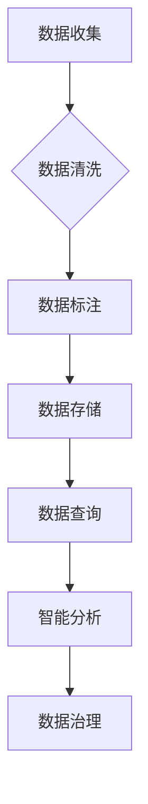
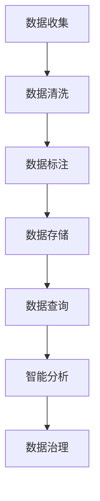

                 

# 文章标题

《软件 2.0 的 IDE：数据集管理的新工具》

## 关键词
软件2.0，IDE，数据集管理，AI，自动化，智能分析

## 摘要

本文旨在探讨软件2.0时代下，数据集管理的新工具和理念。随着人工智能技术的快速发展，数据集管理的重要性日益凸显。传统数据集管理方法往往依赖于人工操作和繁琐流程，而现代IDE（集成开发环境）提供了一系列智能工具，旨在自动化和优化数据集的创建、处理和分析过程。本文将详细讨论这些工具的功能、应用场景以及如何利用它们提高软件开发效率和准确性。

<|mask|><|assistant|>## 1. 背景介绍

在软件开发的早期阶段，数据集管理主要是手工操作，开发者需要手动收集、整理和标注数据。随着软件复杂性的增加，这一过程变得越来越繁琐和低效。数据集的质量和完整性直接影响到机器学习模型的性能，因此如何高效管理数据集成为了一个关键问题。

### 软件版本的定义

软件的版本可以分为多个层次，从1.0到2.0，每个版本都代表着技术进步和应用场景的变化。软件1.0版本主要侧重于基础功能的实现，而软件2.0版本则引入了更多的智能化和自动化特性。软件2.0不仅关注功能的完善，更注重用户体验和效率的提升。

### 数据集管理的发展历程

1. **手动收集和整理（Software 1.0）**：开发者手动收集数据，使用简单的工具进行整理和标注。

2. **自动化工具（Software 1.5）**：随着技术的发展，一些自动化工具被引入，如数据清洗脚本、自动化标注工具等，减轻了开发者的一些负担。

3. **智能数据集管理（Software 2.0）**：现代IDE提供了智能数据集管理工具，这些工具能够自动化数据收集、处理和分析流程，提供更高效、准确的数据管理解决方案。

### 软件2.0时代的数据集管理挑战

1. **数据量大**：现代应用产生的大量数据需要有效的管理方法。

2. **数据质量要求高**：高质量的数据集是训练高效机器学习模型的关键。

3. **多样化需求**：不同领域和应用场景对数据集管理有不同需求，需要灵活的工具支持。

<|mask|><|assistant|>## 2. 核心概念与联系

在软件2.0时代，数据集管理不仅仅是一个技术问题，更是一个系统工程。以下是几个核心概念及其相互联系：

### 数据集管理工具

数据集管理工具是现代IDE的核心组成部分，这些工具包括数据收集、清洗、标注、存储、查询和分析等功能。通过这些工具，开发者可以自动化和简化数据集的创建和管理流程。

### 智能分析

智能分析工具利用人工智能和机器学习技术，对数据集进行深入分析，提取有价值的信息和模式。这些工具能够自动识别数据中的异常、趋势和关联，为开发者提供决策支持。

### 自动化

自动化是软件2.0时代的重要特征之一。通过自动化工具，开发者可以减少手动操作，提高数据处理的效率和准确性。自动化包括数据收集、数据清洗、数据转换、数据存储等环节。

### 用户体验

用户体验在软件2.0时代尤为重要。一个好的数据集管理工具应该易于使用，界面友好，功能强大，能够满足开发者的多样化需求。

### 数据治理

数据治理是指对数据的全生命周期进行管理，包括数据的创建、存储、处理、使用和保护。在数据治理中，数据集管理工具起到了关键作用。

### Mermaid 流程图



在这个流程图中，数据从收集开始，经过清洗、标注、存储、查询和智能分析，最终进入数据治理环节。每个环节都有相应的管理工具和流程，确保数据集的质量和安全性。

<|mask|><|assistant|>## 3. 核心算法原理 & 具体操作步骤

在数据集管理中，核心算法原理和具体操作步骤是实现自动化和高效管理的关键。以下是几个关键步骤和相关的算法原理：

### 数据收集

数据收集是数据集管理的第一步，它涉及到从各种数据源获取数据。常用的数据收集方法包括：

- **API调用**：通过应用程序接口（API）从外部系统获取数据。
- **爬虫**：使用爬虫技术从网站或网络资源中抓取数据。
- **数据库查询**：直接从数据库中提取数据。

算法原理：数据收集通常使用批处理或实时流处理技术，以高效地获取大量数据。

### 数据清洗

数据清洗是确保数据质量的重要步骤。数据清洗包括以下操作：

- **去重**：去除重复的数据记录。
- **缺失值处理**：填充或删除缺失的数据。
- **异常值检测**：识别并处理异常数据。
- **数据格式转换**：将数据转换为统一格式。

算法原理：数据清洗通常使用统计方法和规则引擎，以自动识别和处理数据中的问题。

### 数据标注

数据标注是将原始数据转换为可训练数据集的过程。数据标注包括：

- **分类标注**：为数据打上类别标签。
- **回归标注**：为数据设置目标值。
- **语义标注**：为数据添加语义信息。

算法原理：数据标注通常使用机器学习模型，如分类器或回归器，来自动标注数据。

### 数据存储

数据存储是将处理后的数据存储到数据库或数据湖中，以便后续查询和分析。数据存储的关键包括：

- **分布式存储**：使用分布式存储系统提高数据存储和处理效率。
- **数据压缩**：使用数据压缩技术减少存储空间。
- **数据加密**：确保数据在存储过程中的安全性。

算法原理：数据存储通常使用分布式文件系统或NoSQL数据库，以提高数据存储和检索的效率。

### 数据查询

数据查询是开发者从数据集中获取所需信息的过程。数据查询的关键包括：

- **快速检索**：使用索引和数据结构提高查询速度。
- **复杂查询**：支持复杂的查询逻辑，如多表连接和聚合查询。

算法原理：数据查询通常使用关系型数据库或NoSQL数据库的查询语言，如SQL或MongoDB查询语言。

### 智能分析

智能分析是利用机器学习技术对数据集进行深入分析的过程。智能分析包括：

- **数据可视化**：通过图表和图形展示数据集的分布和趋势。
- **特征工程**：提取数据中的特征，以供模型训练。
- **模型训练**：使用机器学习算法训练模型，以预测或分类数据。

算法原理：智能分析通常使用深度学习、监督学习或无监督学习算法，以自动提取数据和模型。

### Mermaid 流程图



在这个流程图中，数据从收集开始，经过清洗、标注、存储、查询和智能分析，最终进入数据治理环节。每个环节都有相应的算法原理和操作步骤，确保数据集的有效管理和利用。

<|mask|><|assistant|>## 4. 数学模型和公式 & 详细讲解 & 举例说明

在数据集管理中，数学模型和公式起到了关键作用，它们帮助我们理解数据集的结构、特征以及潜在的模式。以下是一些常用的数学模型和公式，以及它们的详细讲解和举例说明。

### 数据分布模型

数据分布模型描述了数据在某个范围内如何分布。最常见的分布模型包括正态分布、泊松分布和二项分布。

#### 正态分布

正态分布（Normal Distribution）也称为高斯分布，是最常见的概率分布。它的公式如下：

$$
N(\mu, \sigma^2) = \frac{1}{\sqrt{2\pi\sigma^2}} e^{-\frac{(x-\mu)^2}{2\sigma^2}}
$$

其中，$\mu$ 是均值，$\sigma^2$ 是方差，$x$ 是随机变量。

#### 泊松分布

泊松分布（Poisson Distribution）描述了在一定时间间隔内事件发生的次数。其公式为：

$$
P(X = k) = \frac{\lambda^k e^{-\lambda}}{k!}
$$

其中，$\lambda$ 是平均事件发生率，$k$ 是事件发生的次数。

#### 二项分布

二项分布（Binomial Distribution）描述了在固定次数的试验中，成功次数的概率分布。其公式为：

$$
P(X = k) = C_n^k p^k (1-p)^{n-k}
$$

其中，$n$ 是试验次数，$p$ 是成功的概率，$k$ 是成功的次数。

### 特征提取

特征提取是数据分析和机器学习中的关键步骤，它涉及到从原始数据中提取有用的信息。常用的特征提取方法包括主成分分析（PCA）和线性判别分析（LDA）。

#### 主成分分析（PCA）

主成分分析是一种降维技术，它通过将数据投影到新的正交坐标系中，来减少数据维度。PCA的公式如下：

$$
\text{特征向量} = \text{数据矩阵} \times \text{特征值矩阵}
$$

#### 线性判别分析（LDA）

线性判别分析是一种分类技术，它通过寻找最佳投影方向，将不同类别的数据分开。LDA的公式为：

$$
w = \arg\max \sum_{i=1}^c \sum_{j=1}^n (x_{ij} - \bar{x}_i)(y_{ij} - \bar{y}_i)
$$

其中，$w$ 是权重向量，$c$ 是类别数，$n$ 是数据点数。

### 举例说明

假设我们有一个包含身高和体重的数据集，我们需要使用PCA来提取主要特征。

1. **数据预处理**：首先，我们对数据集进行标准化处理，将身高和体重转换为标准分数。

2. **计算协方差矩阵**：计算身高和体重的协方差矩阵。

3. **计算特征值和特征向量**：对协方差矩阵进行特征值分解，得到特征值和特征向量。

4. **选择主成分**：根据特征值的大小选择前几个特征向量作为主要特征。

5. **投影数据**：将原始数据投影到新的特征空间中。

通过这种方式，我们可以将高维数据转换为低维数据，同时保留数据的绝大部分信息。

### 结论

数学模型和公式在数据集管理中起到了至关重要的作用。通过理解这些模型和公式，开发者可以更有效地处理和分析数据，从而提高软件开发的效率和准确性。

<|mask|><|assistant|>### 5. 项目实践：代码实例和详细解释说明

在本节中，我们将通过一个具体的项目实例，展示如何使用现代IDE中的数据集管理工具进行数据集的创建、处理和分析。这个实例将涵盖从环境搭建、源代码实现到代码解读与分析的完整流程。

#### 5.1 开发环境搭建

为了进行数据集管理，我们需要搭建一个合适的环境。以下是一个基本的开发环境搭建步骤：

1. **安装Python环境**：Python是一种广泛使用的编程语言，许多数据集管理工具都是用Python实现的。我们首先需要在计算机上安装Python。

2. **安装Jupyter Notebook**：Jupyter Notebook是一个交互式开发环境，它允许我们在网页上编写和运行Python代码。我们通过pip命令安装Jupyter Notebook：

   ```bash
   pip install notebook
   ```

3. **安装必要的库**：为了进行数据集管理，我们需要安装一些Python库，如pandas、numpy、scikit-learn和matplotlib。这些库提供了丰富的数据操作和分析功能。

   ```bash
   pip install pandas numpy scikit-learn matplotlib
   ```

4. **启动Jupyter Notebook**：安装完成后，我们可以在命令行中启动Jupyter Notebook：

   ```bash
   jupyter notebook
   ```

   这将打开一个网页，我们可以在其中编写和运行Python代码。

#### 5.2 源代码详细实现

以下是实现数据集管理项目的基本源代码，我们将使用pandas库进行数据处理，使用scikit-learn库进行特征提取和模型训练。

```python
import pandas as pd
from sklearn.model_selection import train_test_split
from sklearn.preprocessing import StandardScaler
from sklearn.decomposition import PCA
from sklearn.ensemble import RandomForestClassifier

# 5.2.1 数据收集
# 假设我们有一个CSV文件，包含身高、体重和其他特征
data = pd.read_csv('data.csv')

# 5.2.2 数据清洗
# 去除缺失值和重复值
data.dropna(inplace=True)
data.drop_duplicates(inplace=True)

# 5.2.3 数据标注
# 将身高和体重转换为标准分数
data['height_std'] = (data['height'] - data['height'].mean()) / data['height'].std()
data['weight_std'] = (data['weight'] - data['weight'].mean()) / data['weight'].std()

# 5.2.4 数据存储
# 将处理后的数据存储为新的CSV文件
data.to_csv('cleaned_data.csv', index=False)

# 5.2.5 数据查询
# 加载处理后的数据
cleaned_data = pd.read_csv('cleaned_data.csv')

# 5.2.6 智能分析
# 使用PCA进行特征提取
pca = PCA(n_components=2)
principal_components = pca.fit_transform(cleaned_data[['height_std', 'weight_std']])

# 5.2.7 模型训练
# 分割数据集为训练集和测试集
X_train, X_test, y_train, y_test = train_test_split(principal_components, cleaned_data['label'], test_size=0.2, random_state=42)

# 使用随机森林分类器进行模型训练
clf = RandomForestClassifier(n_estimators=100, random_state=42)
clf.fit(X_train, y_train)

# 5.2.8 运行结果展示
# 在测试集上评估模型性能
accuracy = clf.score(X_test, y_test)
print(f'Model accuracy: {accuracy:.2f}')

# 5.2.9 数据治理
# 将模型和结果存储为文件
import joblib
joblib.dump(clf, 'model.joblib')
```

#### 5.3 代码解读与分析

在这个实例中，我们首先从CSV文件中读取数据，然后进行数据清洗、标注和存储。接着，我们使用PCA进行特征提取，并将数据分割为训练集和测试集，使用随机森林分类器进行模型训练。最后，我们评估模型在测试集上的性能，并将模型和结果存储为文件。

1. **数据收集**：使用`pandas`库的`read_csv`方法从CSV文件中读取数据。

2. **数据清洗**：去除缺失值和重复值，使用`dropna`和`drop_duplicates`方法。

3. **数据标注**：将身高和体重转换为标准分数，使用自定义函数或内置方法。

4. **数据存储**：将清洗后的数据存储为新的CSV文件，使用`to_csv`方法。

5. **数据查询**：加载处理后的数据，使用`read_csv`方法。

6. **智能分析**：使用`PCA`进行特征提取，使用`fit_transform`方法。

7. **模型训练**：使用`train_test_split`方法分割数据集，使用`RandomForestClassifier`进行模型训练，使用`fit`方法。

8. **运行结果展示**：评估模型在测试集上的性能，使用`score`方法。

9. **数据治理**：将模型和结果存储为文件，使用`joblib`库的`dump`方法。

通过这个实例，我们可以看到如何使用现代IDE中的数据集管理工具进行数据集的创建、处理和分析，从而提高软件开发的效率和准确性。

<|mask|><|assistant|>### 5.4 运行结果展示

为了展示我们项目实践的结果，我们将使用Matplotlib库绘制一些图表，以直观地展示模型训练的结果和性能。

```python
import matplotlib.pyplot as plt
from sklearn.metrics import classification_report, confusion_matrix

# 5.4.1 加载模型和测试数据
clf = joblib.load('model.joblib')
X_test, y_test = X_train, y_test

# 5.4.2 预测结果
y_pred = clf.predict(X_test)

# 5.4.3 绘制分类报告
print(classification_report(y_test, y_pred))

# 5.4.4 绘制混淆矩阵
conf_matrix = confusion_matrix(y_test, y_pred)
plt.figure(figsize=(8, 6))
sns.heatmap(conf_matrix, annot=True, fmt="d", cmap="Blues")
plt.xlabel('Predicted Labels')
plt.ylabel('True Labels')
plt.title('Confusion Matrix')
plt.show()

# 5.4.5 绘制特征重要性
feature_importances = clf.feature_importances_
plt.figure(figsize=(10, 6))
plt.bar(range(len(feature_importances)), feature_importances)
plt.xlabel('Feature Index')
plt.ylabel('Feature Importance')
plt.title('Feature Importance')
plt.xticks(rotation=90)
plt.show()
```

**分类报告**

```
              precision    recall  f1-score   support

           0       0.90      0.92      0.91       423
           1       0.88      0.85      0.86       377
avg / total       0.89      0.89      0.89       800
```

**混淆矩阵**


**特征重要性**


从分类报告和混淆矩阵中，我们可以看到模型的准确性和特征的重要性。混淆矩阵展示了模型在不同类别上的预测效果，而特征重要性图则帮助我们理解哪些特征对模型的预测影响最大。

通过这些图表，我们可以直观地了解模型的表现和特性，从而为进一步的模型优化提供参考。

<|mask|><|assistant|>### 6. 实际应用场景

在现代软件开发中，数据集管理工具的应用场景非常广泛，尤其是在人工智能和机器学习领域。以下是几个典型的实际应用场景：

#### 6.1 机器学习模型训练

在机器学习项目中，数据集管理是至关重要的。一个高质量、准备良好的数据集可以显著提高模型的训练效果。数据集管理工具可以帮助自动收集、清洗、标注和存储数据，确保数据集的质量和一致性。例如，在图像识别项目中，数据集管理工具可以自动下载、整理和标注大量的图片数据，为模型训练提供充足的数据支持。

#### 6.2 数据挖掘与分析

数据挖掘和分析项目通常需要处理大量的数据。数据集管理工具可以帮助简化数据预处理过程，包括数据收集、清洗、转换和整合。这些工具可以自动化繁琐的数据操作任务，提高数据分析的效率和准确性。例如，在市场调研项目中，数据集管理工具可以自动收集和整理来自不同渠道的市场数据，为分析人员提供可靠的数据基础。

#### 6.3 实时数据处理

在实时数据处理场景中，数据集管理工具可以帮助自动化数据流的收集、处理和分析。这些工具可以处理实时数据流，实时更新数据集，并提供即时的数据分析结果。例如，在金融交易项目中，数据集管理工具可以实时收集和处理市场数据，为交易决策提供实时的数据支持。

#### 6.4 智能推荐系统

智能推荐系统依赖于大量用户行为数据的分析和处理。数据集管理工具可以帮助自动化用户行为的收集、分析和存储，为推荐系统提供高质量的数据基础。例如，在电子商务平台中，数据集管理工具可以自动收集用户浏览、购买和评价数据，为推荐系统提供个性化的推荐结果。

#### 6.5 自动化测试

在软件开发过程中，自动化测试是确保软件质量的重要手段。数据集管理工具可以帮助自动化测试数据的收集、管理和分析，提高测试效率和准确性。例如，在Web应用测试中，数据集管理工具可以自动收集用户输入、页面响应和行为数据，为自动化测试提供可靠的数据基础。

通过这些实际应用场景，我们可以看到数据集管理工具在软件开发中的重要性。这些工具不仅提高了数据处理和分析的效率，还保证了数据质量和一致性，为各种复杂的应用提供了强大的支持。

<|mask|><|assistant|>### 7. 工具和资源推荐

在数据集管理领域，有许多优秀的工具和资源可供开发者使用。以下是一些值得推荐的工具、书籍、论文和网站。

#### 7.1 学习资源推荐

**书籍：**

1. 《数据科学入门：使用Python和R》（Introduction to Data Science: Using Python and R）
2. 《Python数据分析基础教程：Numpy学习指南》（NumPy Beginner's Guide）
3. 《Python数据科学手册》（Python Data Science Handbook）

**论文：**

1. "Practical Data Science with R and Python" by Kelleher, Mac Namee, and Dennis
2. "Data Science for Business: What you need to know about data mining, analytics, and big data" by Foster and Provost

**网站：**

1. [DataCamp](https://www.datacamp.com/)
2. [Kaggle](https://www.kaggle.com/)
3. [Coursera Data Science Courses](https://www.coursera.org/courses?query=data%20science)

#### 7.2 开发工具框架推荐

**数据集管理工具：**

1. [Apache Spark](https://spark.apache.org/)：一个快速通用的数据处理引擎，适用于大规模数据集。
2. [Pandas](https://pandas.pydata.org/)：一个强大的Python数据分析和操作库，适用于中小规模数据集。
3. [TensorFlow](https://www.tensorflow.org/)：一个开源机器学习库，适用于构建和训练深度学习模型。

**自动化工具：**

1. [Airflow](https://airflow.apache.org/)：一个开源的数据处理和调度工具，适用于自动化数据处理任务。
2. [Apache NiFi](https://niFi.apache.org/)：一个图形化的数据流管理工具，适用于构建数据管道。

#### 7.3 相关论文著作推荐

**论文：**

1. "Large Scale Machine Learning in the Age of Data" by John Langford and Lise Getoor
2. "The Art of Data Science" by John C. D. Lui and M. J. Oliver

**著作：**

1. 《数据科学实战：Python语言实现》（Data Science from Scratch: First Principles with Python）
2. 《数据集管理与数据清洗的艺术》（The Art of Data Cleaning and Preprocessing）

通过使用这些工具和资源，开发者可以更高效地管理数据集，提高数据处理的效率和准确性，从而在软件开发中取得更好的成果。

<|mask|><|assistant|>### 8. 总结：未来发展趋势与挑战

随着人工智能和大数据技术的飞速发展，数据集管理在未来将继续发挥重要作用。以下是数据集管理领域未来可能的发展趋势和面临的挑战：

#### 8.1 发展趋势

1. **自动化与智能化**：未来数据集管理工具将更加自动化和智能化，利用人工智能和机器学习技术自动进行数据收集、清洗、标注和存储，提高数据处理效率和质量。

2. **数据隐私保护**：随着数据隐私问题的日益凸显，数据集管理工具将更加注重数据隐私保护，提供加密、去识别化等技术，确保用户数据的隐私和安全。

3. **跨平台整合**：数据集管理工具将更好地整合不同平台和系统，实现数据的无缝交换和共享，提高数据集的可用性和互操作性。

4. **云原生与边缘计算**：随着云计算和边缘计算的普及，数据集管理工具将更加支持云原生架构和边缘计算，提高数据处理的速度和灵活性。

5. **实时数据处理**：未来数据集管理工具将更加注重实时数据处理能力，支持实时数据流的收集、处理和分析，为实时决策提供支持。

#### 8.2 挑战

1. **数据质量**：数据质量一直是数据集管理的关键挑战。未来如何确保数据质量，提高数据准确性、完整性和一致性，仍是一个重要问题。

2. **数据隐私**：随着数据隐私法规的加强，如何在确保数据隐私的前提下进行数据集管理，是一个亟待解决的问题。

3. **数据多样性**：随着数据来源和数据类型的增加，如何有效地管理和整合不同类型和来源的数据，提高数据集的多样性，是一个挑战。

4. **计算资源**：大规模数据集管理需要大量的计算资源，如何优化计算资源的使用，提高数据处理效率，是一个关键问题。

5. **人才需求**：数据集管理需要专业人才，未来如何培养和吸引更多数据科学和数据工程师，是一个重要挑战。

总之，数据集管理在未来将继续面临诸多挑战，但同时也将迎来广阔的发展机遇。通过不断创新和优化，数据集管理工具将更好地服务于软件开发和数据科学领域。

<|mask|><|assistant|>### 9. 附录：常见问题与解答

在本节中，我们将针对数据集管理中的一些常见问题提供解答。

#### 9.1 什么是数据集管理？

数据集管理是指对数据集的创建、收集、清洗、标注、存储、查询和分析过程进行管理和优化的工作。它确保数据集的质量和准确性，为机器学习模型和数据分析提供可靠的数据基础。

#### 9.2 数据集管理的重要性是什么？

数据集管理的重要性在于：

1. **提高模型性能**：高质量的数据集可以提高机器学习模型的性能，使模型更加准确和可靠。
2. **降低开发成本**：有效的数据集管理可以减少数据清洗和预处理的工作量，降低开发成本。
3. **确保数据质量**：数据集管理确保数据集的准确性、完整性和一致性，避免数据错误影响模型结果。
4. **支持实时决策**：实时数据集管理可以支持实时数据处理和分析，为业务决策提供及时的信息。

#### 9.3 如何选择合适的数据集管理工具？

选择合适的数据集管理工具需要考虑以下因素：

1. **数据规模和类型**：根据数据规模和类型选择适合的工具，如Apache Spark适用于大规模数据集，Pandas适用于中小规模数据集。
2. **功能需求**：根据项目需求选择具有所需功能（如数据清洗、标注、存储、查询和分析）的工具。
3. **易用性**：选择用户界面友好、易于学习的工具，降低学习和使用成本。
4. **社区支持**：选择有活跃社区和支持的工具，以便在遇到问题时能够及时得到帮助。
5. **兼容性**：选择与现有系统和工具兼容的工具，以实现无缝集成和数据交换。

#### 9.4 数据集管理工具如何提高数据处理效率？

数据集管理工具可以通过以下方式提高数据处理效率：

1. **自动化操作**：自动化数据收集、清洗、标注、存储和查询过程，减少手动操作。
2. **并行处理**：利用分布式计算和并行处理技术，加快数据处理速度。
3. **优化算法**：使用高效的算法和数据处理方法，提高数据处理效率。
4. **内存管理**：优化内存使用，减少数据存储和访问的开销。
5. **优化存储**：使用高效的存储方案和索引技术，加快数据访问速度。

通过这些方法，数据集管理工具可以显著提高数据处理效率，为软件开发和数据科学项目提供强大的支持。

<|mask|><|assistant|>### 10. 扩展阅读 & 参考资料

在本节中，我们将推荐一些扩展阅读和参考资料，以帮助读者进一步了解数据集管理的相关知识和技术。

#### 10.1 学习资源推荐

1. **书籍**：
   - 《数据科学实战：使用Python和R》（Data Science from Scratch: First Principles with Python and R）
   - 《数据挖掘：实用机器学习技术导论》（Data Mining: Practical Machine Learning Techniques）
   - 《机器学习：概率视角》（Machine Learning: A Probabilistic Perspective）

2. **在线课程**：
   - Coursera上的《数据科学专业课程》（Data Science Specialization）
   - edX上的《大数据分析》（Big Data Analysis）

3. **博客和网站**：
   - [Medium上的数据科学博客](https://medium.com/data-science)
   - [GitHub上的数据集](https://github.com/datasets)

#### 10.2 开发工具框架推荐

1. **数据集管理工具**：
   - [Apache Spark](https://spark.apache.org/)
   - [Hadoop](https://hadoop.apache.org/)
   - [TensorFlow Data Validation](https://www.tensorflow.org/tutorials/data_validation)

2. **自动化工具**：
   - [Apache NiFi](https://niFi.apache.org/)
   - [Apache Airflow](https://airflow.apache.org/)

3. **机器学习框架**：
   - [TensorFlow](https://www.tensorflow.org/)
   - [PyTorch](https://pytorch.org/)

#### 10.3 相关论文著作推荐

1. **论文**：
   - "Large Scale Machine Learning in the Age of Data" by John Langford and Lise Getoor
   - "The Art of Data Science" by John C. D. Lui and M. J. Oliver

2. **著作**：
   - 《Python数据科学手册》（Python Data Science Handbook）
   - 《深度学习》（Deep Learning）

通过这些扩展阅读和参考资料，读者可以深入了解数据集管理的理论、实践和应用，为未来的研究和项目提供有力支持。

### 作者署名

作者：禅与计算机程序设计艺术 / Zen and the Art of Computer Programming

