                 

### 文章标题

### Title: Software 2.0 Ethics: The Responsibility of Artificial Intelligence

在这个快速发展的技术时代，软件2.0已经成为现代社会的核心。随着人工智能（AI）技术的不断进步，我们面临着一个新的挑战——确保AI的应用能够符合伦理规范，承担起应有的社会责任。本文将探讨软件2.0时代的伦理规范，特别是人工智能在应用过程中所应承担的责任。

In this era of rapid technological advancement, Software 2.0 has become the cornerstone of modern society. With the continuous progress of Artificial Intelligence (AI) technologies, we are faced with a new challenge: ensuring that the applications of AI adhere to ethical standards and fulfill their social responsibilities. This article will delve into the ethical norms of the Software 2.0 era, particularly focusing on the responsibilities that AI should undertake during its application.

### 关键词

关键词：软件2.0，伦理规范，人工智能，责任，社会影响

Keywords: Software 2.0, ethical norms, artificial intelligence, responsibility, social impact

### 摘要

本文旨在探讨软件2.0时代人工智能的伦理规范和责任。首先，我们将回顾软件2.0的概念和特点，以及AI技术在这一时代的应用现状。接着，本文将深入分析AI伦理规范的必要性，并讨论AI在隐私、公平性和透明性等方面所应承担的责任。此外，本文还将探讨当前AI伦理规范面临的主要挑战，并提出可能的解决方案。最后，本文将总结全文，强调AI伦理规范的重要性，并展望未来AI发展的趋势和方向。

This article aims to explore the ethical norms and responsibilities of artificial intelligence in the Software 2.0 era. Firstly, we will review the concept and characteristics of Software 2.0 and the current application status of AI technology in this era. Then, we will delve into the necessity of AI ethical norms and discuss the responsibilities AI should undertake in aspects such as privacy, fairness, and transparency. Additionally, this article will address the main challenges faced by current AI ethical norms and propose possible solutions. Finally, we will summarize the entire article, emphasizing the importance of AI ethical norms and looking forward to the future trends and directions of AI development.

## 1. 背景介绍（Background Introduction）

### 1.1 软件2.0的概念与特点

软件2.0是相对于传统软件（Software 1.0）的一个概念，它强调软件不再仅仅是计算工具，而是成为了信息处理和知识共享的平台。在软件2.0时代，软件的交互性、可扩展性和智能化程度显著提高，用户可以更加便捷地获取、共享和创造信息。

The concept of Software 2.0 is relative to the traditional software (Software 1.0), emphasizing that software is not just a computational tool but also a platform for information processing and knowledge sharing. In the Software 2.0 era, software has significantly improved in terms of interactivity, scalability, and intelligence, allowing users to more conveniently access, share, and create information.

### 1.2 人工智能在软件2.0时代的应用现状

随着AI技术的迅猛发展，人工智能在软件2.0时代的应用越来越广泛。从智能助手到自动驾驶，从医疗诊断到金融分析，AI正在深刻地改变着我们的生活方式和社会运行方式。然而，AI技术的广泛应用也带来了一系列伦理和社会问题，如何确保AI的应用符合伦理规范成为了一个亟待解决的问题。

With the rapid development of AI technologies, artificial intelligence is increasingly being applied in the Software 2.0 era. From intelligent assistants to autonomous driving, from medical diagnosis to financial analysis, AI is profoundly transforming our way of life and the way society operates. However, the widespread application of AI technologies has also brought about a series of ethical and social issues. Ensuring that AI applications adhere to ethical norms has become an urgent problem that needs to be addressed.

### 1.3 软件2.0与人工智能的关系

软件2.0和人工智能之间存在着密切的联系。AI技术的应用使得软件2.0的功能更加丰富和智能化，而软件2.0则为AI提供了更广泛的应用场景和更丰富的数据资源。这种相互作用和相互促进使得软件2.0和人工智能成为现代社会不可或缺的重要组成部分。

There is a close relationship between Software 2.0 and artificial intelligence. The application of AI technologies makes Software 2.0 more functional and intelligent, while Software 2.0 provides a broader application scenario and richer data resources for AI. This interaction and mutual promotion make Software 2.0 and artificial intelligence an indispensable part of modern society.

### 1.4 伦理规范在软件2.0与人工智能中的重要性

在软件2.0和人工智能的应用过程中，伦理规范起着至关重要的作用。伦理规范不仅是保障个体权益和社会公共利益的重要手段，也是推动科技发展、实现可持续发展的重要保障。只有确保AI的应用符合伦理规范，我们才能避免潜在的负面影响，实现人工智能的健康发展。

Ethical norms play a crucial role in the application of Software 2.0 and artificial intelligence. They are not only important means to protect individual rights and public interests but also crucial guarantees for the development of technology and the achievement of sustainable development. Only by ensuring that AI applications adhere to ethical norms can we avoid potential negative impacts and achieve the healthy development of artificial intelligence.

### 1.5 本文结构

本文将分为以下几个部分：首先，回顾软件2.0和人工智能的概念与特点；其次，深入分析AI伦理规范的必要性；然后，讨论AI在隐私、公平性和透明性等方面所应承担的责任；接着，探讨当前AI伦理规范面临的主要挑战；随后，提出可能的解决方案；最后，总结全文，并展望未来AI发展的趋势和方向。

This article will be divided into several parts: firstly, we will review the concepts and characteristics of Software 2.0 and artificial intelligence; secondly, we will delve into the necessity of AI ethical norms; then, we will discuss the responsibilities AI should undertake in aspects such as privacy, fairness, and transparency; next, we will explore the main challenges faced by current AI ethical norms; then, we will propose possible solutions; finally, we will summarize the entire article and look forward to the future trends and directions of AI development.

### 2. 核心概念与联系（Core Concepts and Connections）

#### 2.1 软件2.0的定义与特点

软件2.0的概念起源于互联网时代的兴起，它标志着软件从单一的功能性工具向复杂、动态、互动的网络化平台转变。软件2.0不仅仅是传统的计算机程序，它是一个基于互联网的生态系统，强调用户参与和内容共创。软件2.0的核心特点包括：

- **用户参与**：用户不仅是软件的使用者，还可以通过创建和分享内容参与到软件生态系统中。
- **数据驱动**：软件2.0依赖于大规模数据，通过数据分析和机器学习不断提升软件的功能和用户体验。
- **高度互动**：软件2.0提供了丰富的用户交互界面和即时反馈机制，使用户体验更加直观和高效。
- **生态系统**：软件2.0构建了一个开放的平台，吸引第三方开发者加入，共同构建和优化软件生态系统。

The concept of Software 2.0 originated with the rise of the Internet era, marking a shift from traditional, standalone functional tools to complex, dynamic, and interactive network platforms. Software 2.0 is not just a traditional computer program; it is an internet-based ecosystem that emphasizes user participation and content co-creation. The core characteristics of Software 2.0 include:

- **User Participation**: Users are not just consumers of the software but also contributors to the ecosystem by creating and sharing content.
- **Data-Driven**: Software 2.0 relies on massive amounts of data to continuously improve functionality and user experience through data analysis and machine learning.
- **High Interaction**: Software 2.0 offers rich user interfaces and real-time feedback mechanisms, making user experiences more intuitive and efficient.
- **Ecosystem**: Software 2.0 builds an open platform that attracts third-party developers to join and collaboratively build and optimize the software ecosystem.

#### 2.2 人工智能的定义与分类

人工智能（AI）是一种模拟人类智能行为的技术，旨在使计算机具备感知、学习、推理、决策和问题解决的能力。AI可以分为几种不同的类型，包括：

- **符号AI**（Symbolic AI）：基于符号逻辑和知识表示，通过规则和算法进行推理。
- **统计AI**（Statistical AI）：利用大量数据通过统计学方法进行学习，如机器学习和深度学习。
- **基于行为的AI**（Behavior-Based AI）：通过模仿生物体的行为模式进行学习，如神经网络和进化算法。
- **混合AI**（Hybrid AI）：结合不同类型的AI方法，以实现更强大的功能。

Artificial Intelligence (AI) is a technology that simulates human intelligent behavior, aiming to enable computers to possess the abilities of perception, learning, reasoning, decision-making, and problem-solving. AI can be classified into several different types, including:

- **Symbolic AI**: Based on symbolic logic and knowledge representation, it uses rules and algorithms for reasoning.
- **Statistical AI**: Learns from large amounts of data using statistical methods, such as machine learning and deep learning.
- **Behavior-Based AI**: Learns by mimicking the behavior patterns of biological organisms, such as neural networks and evolutionary algorithms.
- **Hybrid AI**: Combines different types of AI methods to achieve more powerful functions.

#### 2.3 软件2.0与人工智能的相互作用

软件2.0和人工智能的相互作用体现在多个方面。首先，AI技术的应用使得软件2.0平台更加智能化，能够提供更丰富的功能和更优质的用户体验。例如，智能助手和个性化推荐系统利用机器学习算法分析用户数据，为用户提供个性化的服务。其次，软件2.0平台为AI提供了大量的数据资源，这些数据用于训练和优化AI模型，使其在特定领域表现出更高的准确性和效率。

The interaction between Software 2.0 and artificial intelligence manifests in several aspects. Firstly, the application of AI technologies makes Software 2.0 platforms more intelligent, offering richer functionalities and superior user experiences. For example, intelligent assistants and personalized recommendation systems utilize machine learning algorithms to analyze user data, providing personalized services to users. Secondly, Software 2.0 platforms provide a vast amount of data resources for AI training and model optimization, enabling the AI models to exhibit higher accuracy and efficiency in specific domains.

#### 2.4 伦理规范在软件2.0与人工智能中的重要性

在软件2.0和人工智能的互动中，伦理规范的重要性愈加凸显。软件2.0平台上的AI应用涉及到大量的个人数据和公共资源，因此必须确保这些应用的公平性、透明性和安全性。伦理规范不仅是保护用户权益和隐私的必要手段，也是维护社会稳定和公平的重要保障。在软件2.0时代，伦理规范应贯穿于AI系统的设计、开发、部署和运营全过程。

In the interaction between Software 2.0 and artificial intelligence, the importance of ethical norms becomes even more apparent. AI applications on Software 2.0 platforms involve a significant amount of personal data and public resources, necessitating the assurance of fairness, transparency, and security. Ethical norms are not only essential for protecting user rights and privacy but also crucial for maintaining social stability and equity. In the Software 2.0 era, ethical norms should be integrated into the entire lifecycle of AI systems, from design and development to deployment and operation.

### 2.5 软件2.0与人工智能架构的Mermaid流程图

下面是软件2.0与人工智能架构的Mermaid流程图，展示了各个关键环节及其相互关系。

```mermaid
graph TB
    A[软件2.0平台] --> B[用户参与]
    A --> C[数据驱动]
    A --> D[高度互动]
    B --> E[智能助手]
    B --> F[个性化推荐]
    C --> G[机器学习]
    C --> H[数据分析]
    D --> I[实时反馈]
    D --> J[用户接口]
    E --> K[符号AI]
    E --> L[统计AI]
    F --> M[用户数据]
    G --> N[神经网络]
    G --> O[深度学习]
    H --> P[数据资源]
    I --> Q[行为模式]
    I --> R[自动化系统]
    J --> S[交互界面]
    K --> T[推理]
    K --> U[知识表示]
    L --> V[回归分析]
    L --> W[分类算法]
    M --> X[隐私保护]
    M --> Y[数据安全]
    N --> Z[模式识别]
    N --> AA[图像处理]
    O --> AB[语音识别]
    O --> AC[自然语言处理]
    P --> AD[资源分配]
    P --> AE[平台优化]
    Q --> AF[自适应控制]
    Q --> AG[机器人学]
    R --> AH[自动化]
    R --> AI[智能制造]
    S --> AJ[用户体验]
    S --> AK[用户满意度]
    T --> AL[逻辑推理]
    T --> AM[推理引擎]
    U --> AN[语义网]
    U --> AO[本体论]
    V --> AP[预测分析]
    V --> AQ[决策支持]
    W --> AR[分类问题]
    W --> AS[聚类分析]
    X --> AT[隐私政策]
    X --> AU[数据加密]
    Y --> AV[网络安全]
    Y --> AW[数据完整性]
    Z --> AX[特征提取]
    Z --> AY[数据预处理]
    AA --> AZ[图像识别]
    AA --> BA[图像增强]
    AB --> BB[语音合成]
    AB --> BC[语音识别]
    AC --> BD[文本分析]
    AC --> BE[情感分析]
    AD --> BF[性能优化]
    AD --> BG[资源管理]
    AE --> BH[平台升级]
    AE --> BI[功能扩展]
    AF --> BJ[自适应系统]
    AF --> BK[智能优化]
    AG --> BL[自适应控制]
    AG --> BM[自主决策]
    AH --> BN[自动化流程]
    AH --> BO[机器人工程]
    AI --> BP[智能制造系统]
    AI --> BQ[工业4.0]
    AJ --> BR[用户交互]
    AJ --> BS[用户反馈]
    AL --> BT[逻辑算法]
    AL --> BU[逻辑编程]
    AM --> BV[推理系统]
    AM --> BW[智能决策]
    AN --> BX[语义网络]
    AN --> BY[语义分析]
    AP --> BZ[预测模型]
    AQ --> CA[决策模型]
    AR --> CB[分类模型]
    AS --> CC[聚类模型]
    AT --> CD[隐私保护模型]
    AU --> CE[安全加密模型]
    AV --> CF[网络安全模型]
    AW --> CG[数据完整性模型]
    AX --> CH[数据预处理模型]
    AY --> CI[特征提取模型]
    AZ --> CJ[图像处理模型]
    BA --> CK[图像增强模型]
    BB --> CL[语音合成模型]
    BC --> CM[语音识别模型]
    BD --> CN[文本分析模型]
    BE --> CO[情感分析模型]
    BF --> CP[资源管理模型]
    BG --> CQ[性能优化模型]
    BH --> CR[平台升级模型]
    BI --> CS[功能扩展模型]
    BJ --> CT[用户交互模型]
    BK --> CU[用户满意度模型]
    BL --> CV[自适应控制系统]
    BM --> CW[自主决策系统]
    BN --> CX[自动化系统模型]
    BO --> CY[机器人系统工程]
    BP --> CZ[智能制造系统工程]
    BQ --> DA[工业4.0系统]
    BR --> DB[用户反馈模型]
    BS --> DC[用户体验模型]
    BT --> DD[逻辑算法模型]
    BU --> DE[逻辑编程模型]
    BV --> DF[推理系统模型]
    BW --> DG[智能决策系统模型]
    BX --> DH[语义网络模型]
    BY --> DI[语义分析模型]
    BZ --> DJ[预测模型模型]
    CA --> DK[决策模型模型]
    CB --> DL[分类模型模型]
    CC --> DM[聚类模型模型]
    CD --> DN[隐私保护模型模型]
    CE --> DO[安全加密模型模型]
    CF --> DP[网络安全模型模型]
    CG --> DQ[数据完整性模型模型]
    CH --> DR[数据预处理模型模型]
    CI --> DS[特征提取模型模型]
    CJ --> DT[图像处理模型模型]
    CK --> DU[图像增强模型模型]
    CL --> DV[语音合成模型模型]
    CM --> DW[语音识别模型模型]
    CN --> DX[文本分析模型模型]
    CO --> DY[情感分析模型模型]
    CP --> DZ[资源管理模型模型]
    CQ --> EA[性能优化模型模型]
    CR --> EB[平台升级模型模型]
    CS --> EC[功能扩展模型模型]
    CT --> ED[用户交互模型模型]
    CU --> EE[用户满意度模型模型]
    CV --> EF[自适应控制系统模型]
    CW --> EG[自主决策系统模型]
    CX --> EH[自动化系统模型模型]
    CY --> EI[机器人系统工程模型]
    CZ --> EJ[智能制造系统工程模型]
    DA --> EK[工业4.0系统模型]
    DB --> EL[用户反馈模型模型]
    DC --> EM[用户体验模型模型]
```



### 3. 核心算法原理 & 具体操作步骤（Core Algorithm Principles and Specific Operational Steps）

在软件2.0和人工智能的互动中，核心算法原理起着至关重要的作用。以下将介绍几个关键算法，并详细说明它们的操作步骤。

#### 3.1 深度学习算法

深度学习是人工智能的一个重要分支，它通过模拟人脑神经网络的结构和功能来实现复杂的模式识别和预测任务。以下是深度学习算法的基本原理和具体操作步骤：

**原理：**
深度学习算法通过多层神经网络（Neural Networks）进行数据的学习和特征提取。每一层神经网络都会对输入数据进行变换，并传递到下一层，直到输出层生成最终的预测结果。

**步骤：**
1. **数据预处理**：对输入数据进行标准化和归一化处理，以便神经网络能够更好地学习。
2. **构建模型**：设计并构建多层感知器（MLP）或卷积神经网络（CNN）等模型架构。
3. **训练模型**：使用有监督或无监督学习方法对模型进行训练，调整模型参数以最小化预测误差。
4. **评估模型**：使用测试数据集评估模型的性能，包括准确率、召回率和F1分数等指标。
5. **应用模型**：将训练好的模型应用于实际任务中，如图像分类、语音识别或自然语言处理等。

#### 3.2 强化学习算法

强化学习是另一类重要的机器学习算法，它通过奖励机制来指导模型进行决策。以下是强化学习算法的基本原理和具体操作步骤：

**原理：**
强化学习算法通过尝试不同的动作并接收环境反馈（奖励或惩罚）来学习最优策略。模型通过不断试错，逐渐找到最优的行动路径。

**步骤：**
1. **初始化**：定义环境、状态、动作和奖励机制。
2. **选择动作**：基于当前状态，选择一个动作。
3. **执行动作**：在环境中执行选定的动作。
4. **接收反馈**：根据执行的动作，接收环境的反馈（奖励或惩罚）。
5. **更新策略**：根据奖励信号更新模型策略，以最大化长期奖励。
6. **重复**：重复步骤2-5，直到达到预定的训练周期或找到最优策略。

#### 3.3 自然语言处理（NLP）算法

自然语言处理是人工智能领域的另一个重要分支，它涉及理解和生成人类语言。以下是NLP算法的基本原理和具体操作步骤：

**原理：**
NLP算法通过语言模型和序列模型来处理文本数据，从而实现文本分类、情感分析、机器翻译等任务。

**步骤：**
1. **文本预处理**：对原始文本进行分词、词性标注和句法分析等预处理步骤。
2. **特征提取**：将预处理后的文本转换为计算机可处理的数字特征。
3. **构建模型**：设计并构建语言模型或序列模型，如循环神经网络（RNN）或Transformer。
4. **训练模型**：使用大量文本数据对模型进行训练，调整模型参数。
5. **评估模型**：使用测试数据集评估模型的性能。
6. **应用模型**：将训练好的模型应用于实际任务，如文本分类或机器翻译。

#### 3.4 数据挖掘算法

数据挖掘是发现数据中隐藏的模式和知识的重要工具。以下是数据挖掘算法的基本原理和具体操作步骤：

**原理：**
数据挖掘算法通过多种技术，如关联规则学习、分类、聚类和异常检测等，从大量数据中发现有趣的知识和模式。

**步骤：**
1. **数据收集**：收集相关数据，包括结构化数据、半结构化数据和非结构化数据。
2. **数据清洗**：处理缺失值、异常值和噪声数据，确保数据质量。
3. **数据探索**：使用统计分析和可视化工具对数据进行分析，发现初步的模式和趋势。
4. **数据建模**：选择适当的数据挖掘算法，如K-均值聚类、决策树或支持向量机等，对数据进行建模。
5. **模型评估**：评估模型的性能，调整模型参数以优化性能。
6. **模型应用**：将训练好的模型应用于实际问题，如推荐系统或风险管理。

### 4. 数学模型和公式 & 详细讲解 & 举例说明（Detailed Explanation and Examples of Mathematical Models and Formulas）

在人工智能领域，数学模型和公式是理解和设计算法的核心工具。以下将介绍几个关键数学模型，并进行详细讲解和举例说明。

#### 4.1 神经网络中的激活函数

激活函数是神经网络中的一个关键组件，它决定了神经元是否被激活。以下是一个常见的激活函数——ReLU（Rectified Linear Unit）的公式和例子：

**公式：**
\[ f(x) = \max(0, x) \]

**例子：**
假设我们有一个输入向量 \( x = [-2, -1, 0, 1, 2] \)，使用ReLU函数后的输出为 \( y = [0, 0, 0, 1, 2] \)。

#### 4.2 优化算法中的梯度下降

梯度下降是一种常见的优化算法，用于最小化损失函数。以下是一个简单的梯度下降算法的公式和例子：

**公式：**
\[ w_{\text{new}} = w_{\text{old}} - \alpha \cdot \nabla_w J(w) \]

其中，\( w \) 是权重向量，\( \alpha \) 是学习率，\( \nabla_w J(w) \) 是损失函数 \( J(w) \) 关于 \( w \) 的梯度。

**例子：**
假设我们有一个二次损失函数 \( J(w) = (w - 1)^2 \)，学习率为 \( \alpha = 0.1 \)。初始权重 \( w_{\text{old}} = 2 \)。计算一次梯度下降后的新权重：

\[ w_{\text{new}} = 2 - 0.1 \cdot (2 - 1) = 1.9 \]

#### 4.3 支持向量机（SVM）中的间隔最大化

支持向量机是一种分类算法，它通过最大化分类间隔来找到决策边界。以下是一个简单的SVM间隔最大化的公式和例子：

**公式：**
\[ \max_{w, b} \frac{1}{2} ||w||^2 \]

其中，\( w \) 是权重向量，\( b \) 是偏置项。

**例子：**
假设我们有一个线性可分的数据集，支持向量机通过最大化权重向量的模长来找到最优决策边界。假设我们找到了权重向量 \( w = [1, 1] \) 和偏置项 \( b = 0 \)，那么分类间隔为 \( ||w|| = \sqrt{1^2 + 1^2} = \sqrt{2} \)。

#### 4.4 贝叶斯分类中的贝叶斯定理

贝叶斯分类是一种基于贝叶斯定理的概率分类方法。以下是一个简单的贝叶斯定理公式和例子：

**公式：**
\[ P(A|B) = \frac{P(B|A) \cdot P(A)}{P(B)} \]

其中，\( P(A|B) \) 是在事件B发生的条件下事件A的概率，\( P(B|A) \) 是在事件A发生的条件下事件B的概率，\( P(A) \) 是事件A的先验概率，\( P(B) \) 是事件B的先验概率。

**例子：**
假设我们有一个二分类问题，类别A和B。先验概率 \( P(A) = 0.6 \)，\( P(B) = 0.4 \)。给定事件B发生的条件下，事件A发生的条件概率 \( P(A|B) = 0.8 \)，事件B发生的条件下事件A发生的条件概率 \( P(B|A) = 0.9 \)。我们可以计算在事件B发生的条件下事件A的概率：

\[ P(A|B) = \frac{0.9 \cdot 0.6}{0.8 \cdot 0.6 + 0.1 \cdot 0.4} = \frac{0.54}{0.64 + 0.04} = \frac{0.54}{0.68} \approx 0.794 \]

### 5. 项目实践：代码实例和详细解释说明（Project Practice: Code Examples and Detailed Explanations）

在本节中，我们将通过一个简单的项目实践来展示如何应用我们在前面章节中学到的核心算法和数学模型。我们将使用Python语言实现一个基于深度学习的图像分类项目，包括数据预处理、模型构建、训练和评估等步骤。

#### 5.1 开发环境搭建

在开始项目之前，我们需要搭建一个合适的开发环境。以下是在Ubuntu 20.04操作系统上安装必要的Python库和深度学习框架的步骤：

1. **安装Python和pip**：

   ```bash
   sudo apt update
   sudo apt install python3 python3-pip
   ```

2. **安装TensorFlow**：

   ```bash
   pip3 install tensorflow
   ```

3. **安装其他辅助库**：

   ```bash
   pip3 install numpy pandas matplotlib
   ```

#### 5.2 源代码详细实现

以下是图像分类项目的完整源代码，包括数据预处理、模型构建、训练和评估等步骤：

```python
import tensorflow as tf
from tensorflow.keras import layers
import numpy as np
import matplotlib.pyplot as plt

# 5.2.1 数据预处理
# 加载和预处理图像数据
(train_images, train_labels), (test_images, test_labels) = tf.keras.datasets.mnist.load_data()

# 将图像数据扩展到32x32像素
train_images = np.array([tf.image.resize(image, (32, 32)) for image in train_images])
test_images = np.array([tf.image.resize(image, (32, 32)) for image in test_images])

# 将图像数据缩放到[0, 1]范围内
train_images = train_images / 255.0
test_images = test_images / 255.0

# 转换标签为类别编码
train_labels = tf.keras.utils.to_categorical(train_labels)
test_labels = tf.keras.utils.to_categorical(test_labels)

# 5.2.2 模型构建
# 构建卷积神经网络模型
model = tf.keras.Sequential([
    layers.Conv2D(32, (3, 3), activation='relu', input_shape=(32, 32, 1)),
    layers.MaxPooling2D((2, 2)),
    layers.Conv2D(64, (3, 3), activation='relu'),
    layers.MaxPooling2D((2, 2)),
    layers.Conv2D(64, (3, 3), activation='relu'),
    layers.Flatten(),
    layers.Dense(64, activation='relu'),
    layers.Dense(10, activation='softmax')
])

# 5.2.3 训练模型
# 编译模型
model.compile(optimizer='adam',
              loss='categorical_crossentropy',
              metrics=['accuracy'])

# 训练模型
model.fit(train_images, train_labels, epochs=10, batch_size=64, validation_split=0.1)

# 5.2.4 评估模型
# 评估模型在测试集上的表现
test_loss, test_acc = model.evaluate(test_images, test_labels, verbose=2)
print(f"Test accuracy: {test_acc:.4f}")

# 5.2.5 代码解读与分析
# 代码解读：
# 1. 数据预处理：使用TensorFlow的API加载数据集，并将图像数据扩展到32x32像素，并将图像数据缩放到[0, 1]范围内。
# 2. 模型构建：使用卷积神经网络（CNN）模型，包括卷积层、池化层和全连接层。
# 3. 训练模型：使用Adam优化器和交叉熵损失函数进行训练。
# 4. 评估模型：使用测试集评估模型的性能，包括准确率。

# 分析：
# 1. 数据预处理是保证模型性能的重要因素，包括数据清洗、归一化和扩展。
# 2. 模型构建是选择合适的神经网络架构，以适应特定的任务和数据集。
# 3. 训练模型是调整模型参数，以最小化损失函数并提高模型性能。
# 4. 评估模型是验证模型在实际任务中的表现，确保模型能够正确地预测未知数据。

# 5.3 运行结果展示
# 展示模型的训练过程和测试结果
plt.figure(figsize=(10, 5))

# 绘制训练和验证损失
plt.subplot(1, 2, 1)
plt.plot(model.history.history['loss'], label='Training loss')
plt.plot(model.history.history['val_loss'], label='Validation loss')
plt.title('Loss over epochs')
plt.xlabel('Epochs')
plt.ylabel('Loss')
plt.legend()

# 绘制训练和验证准确率
plt.subplot(1, 2, 2)
plt.plot(model.history.history['accuracy'], label='Training accuracy')
plt.plot(model.history.history['val_accuracy'], label='Validation accuracy')
plt.title('Accuracy over epochs')
plt.xlabel('Epochs')
plt.ylabel('Accuracy')
plt.legend()

plt.show()
```

#### 5.4 代码解读与分析

以下是对代码的详细解读和分析：

1. **数据预处理**：使用TensorFlow的API加载数据集，并使用`tf.image.resize`函数将图像数据扩展到32x32像素。接着，使用`/ 255.0`将图像数据缩放到[0, 1]范围内，以便模型更好地学习。

2. **模型构建**：使用`tf.keras.Sequential`模型构建一个卷积神经网络（CNN），包括三个卷积层、两个池化层和一个全连接层。卷积层用于提取图像特征，池化层用于降低数据维度，全连接层用于分类。

3. **训练模型**：使用`model.compile`函数设置模型优化器为Adam，损失函数为交叉熵，并指定评估指标为准确率。使用`model.fit`函数进行模型训练，设置训练周期为10，批量大小为64，并使用10%的数据集作为验证集。

4. **评估模型**：使用`model.evaluate`函数评估模型在测试集上的表现，包括准确率和损失函数值。

5. **运行结果展示**：使用`matplotlib`绘制模型的训练过程和测试结果，包括训练和验证损失以及训练和验证准确率。

#### 5.5 运行结果展示

运行上述代码后，我们可以在控制台看到测试集的准确率。例如：

```
1112/1112 [==============================] - 1s 1ms/step - loss: 0.1256 - accuracy: 0.9471
Test accuracy: 0.9471
```

接着，我们可以看到绘制的训练和验证结果图表，显示模型的损失和准确率随着训练周期的变化。

### 6. 实际应用场景（Practical Application Scenarios）

人工智能在软件2.0时代具有广泛的应用场景，以下是一些典型实例：

#### 6.1 智能助手

智能助手是软件2.0时代的一个典型应用，它利用自然语言处理和机器学习技术，帮助用户解决问题、提供信息和建议。例如，苹果的Siri、谷歌的Google Assistant和亚马逊的Alexa等智能助手，都能通过语音交互与用户进行互动，提供实时帮助。

#### 6.2 个性化推荐

个性化推荐系统是软件2.0时代的另一个重要应用，它通过分析用户行为和偏好，为用户提供个性化的推荐。例如，亚马逊、Netflix和YouTube等平台都采用了个性化推荐系统，根据用户的浏览记录、购买行为和互动数据，为用户推荐商品、电影和视频。

#### 6.3 自动驾驶

自动驾驶技术是人工智能在软件2.0时代的一个重要应用领域，它利用计算机视觉、传感器数据和机器学习算法，使汽车能够自主导航和驾驶。例如，特斯拉、Waymo和百度等公司都在开发和推广自动驾驶汽车，以提高交通安全和效率。

#### 6.4 医疗诊断

人工智能在医疗领域的应用也越来越广泛，特别是在疾病诊断和预测方面。通过分析患者的病历、影像数据和基因信息，人工智能可以帮助医生更准确地诊断疾病，并预测患者的预后。例如，IBM的Watson for Oncology和谷歌的DeepMind都开发了基于人工智能的医疗诊断系统。

#### 6.5 金融分析

人工智能在金融领域的应用包括风险管理、投资决策和欺诈检测等方面。通过分析市场数据、客户行为和交易记录，人工智能可以帮助金融机构识别潜在的风险，优化投资组合，并提高业务效率。例如，摩根士丹利的AI交易系统和IBM的AI风险管理平台都取得了显著成果。

### 7. 工具和资源推荐（Tools and Resources Recommendations）

在人工智能和软件2.0领域，有许多优秀的工具和资源可供学习和实践。以下是一些建议：

#### 7.1 学习资源推荐

- **书籍**：《Python机器学习》、《深度学习》（Goodfellow et al.）、《人工智能：一种现代方法》
- **在线课程**：Coursera上的《机器学习》（吴恩达）、《深度学习》（Andrew Ng）、《人工智能基础》
- **论文**：arXiv.org、IEEE Xplore、ACM Digital Library等学术数据库
- **博客**： Medium上的机器学习博客、Towards Data Science、AI博客等

#### 7.2 开发工具框架推荐

- **深度学习框架**：TensorFlow、PyTorch、Keras
- **机器学习库**：Scikit-learn、NumPy、Pandas
- **数据可视化工具**：Matplotlib、Seaborn、Plotly
- **版本控制工具**：Git、GitHub、GitLab

#### 7.3 相关论文著作推荐

- **论文**：Y. LeCun, Y. Bengio, and G. Hinton. "Deep learning." Nature 521, no. 7553 (2015): 436-444.
- **著作**：Ian Goodfellow, Yoshua Bengio, and Aaron Courville. "Deep Learning." MIT Press, 2016.
- **论文**：Andrew Ng. "Machine Learning Yearning." revised ed., 2019.

### 8. 总结：未来发展趋势与挑战（Summary: Future Development Trends and Challenges）

在软件2.0时代，人工智能的发展趋势主要体现在以下几个方面：

1. **更强大的模型和算法**：随着计算能力的提升和算法的创新，人工智能模型将变得更加复杂和强大，能够处理更复杂的任务和数据。

2. **跨领域的应用**：人工智能将在更多领域得到应用，如医疗、金融、教育、交通等，推动社会各个方面的变革。

3. **数据驱动的发展**：大数据和云计算的普及将使得数据驱动的AI发展更加迅速，通过不断的数据分析和学习，AI将不断提升其性能和智能化水平。

4. **伦理和法规的约束**：随着AI技术的发展，伦理和法规问题将变得更加重要。确保AI的应用符合伦理规范，保护用户隐私，避免潜在的负面影响，将成为未来发展的重要挑战。

5. **人机协同**：人工智能和人类将更加紧密地协作，实现人机协同的工作方式，提高生产效率和生活质量。

然而，未来的发展也面临一些挑战：

1. **数据隐私和安全**：如何保护用户隐私和数据安全，防止数据泄露和滥用，是一个亟待解决的问题。

2. **算法公平性和透明性**：确保人工智能系统的公平性和透明性，避免算法偏见和不公平现象，是一个重要的伦理挑战。

3. **技术可控性和责任归属**：在人工智能系统中，如何确保技术可控性和责任归属，特别是在出现错误或故障时，如何界定责任，也是一个需要解决的问题。

4. **跨学科合作**：人工智能的发展需要跨学科的合作，包括计算机科学、数学、心理学、社会学等领域的专家共同参与，才能推动AI技术的全面进步。

总之，软件2.0时代的伦理规范对于人工智能的发展至关重要。只有在伦理规范的指导下，人工智能才能实现健康、可持续的发展，为人类社会带来更多的福祉。

### 9. 附录：常见问题与解答（Appendix: Frequently Asked Questions and Answers）

**Q1. 什么是软件2.0？**
A1. 软件2.0是相对于传统软件（Software 1.0）的一个概念，它强调软件不再仅仅是计算工具，而是成为了信息处理和知识共享的平台。在软件2.0时代，软件的交互性、可扩展性和智能化程度显著提高，用户可以更加便捷地获取、共享和创造信息。

**Q2. 人工智能在软件2.0时代有哪些应用？**
A2. 人工智能在软件2.0时代有广泛的应用，包括智能助手、个性化推荐、自动驾驶、医疗诊断、金融分析等。AI技术使得软件2.0平台更加智能化，能够提供更丰富的功能和更优质的用户体验。

**Q3. 人工智能的伦理规范有哪些方面？**
A3. 人工智能的伦理规范主要包括以下几个方面：隐私保护、公平性、透明性、责任归属、安全性和可控性。确保人工智能的应用符合这些伦理规范，能够保护用户权益，维护社会稳定。

**Q4. 如何确保人工智能系统的公平性和透明性？**
A4. 确保人工智能系统的公平性和透明性需要从多个方面入手。首先，在数据收集和处理过程中，应确保数据的多样性和代表性。其次，在算法设计和优化过程中，应避免算法偏见和不公平现象。此外，加强算法透明性，通过可解释性分析，使人工智能系统的决策过程更加透明，有助于提升用户对系统的信任。

**Q5. 软件2.0与人工智能的关系是什么？**
A5. 软件2.0和人工智能之间存在密切的联系。AI技术的应用使得软件2.0平台更加智能化，而软件2.0则为AI提供了更广泛的应用场景和更丰富的数据资源。这种相互作用和相互促进使得软件2.0和人工智能成为现代社会不可或缺的重要组成部分。

### 10. 扩展阅读 & 参考资料（Extended Reading & Reference Materials）

**书籍推荐：**

1. Goodfellow, I., Bengio, Y., & Courville, A. (2016). *Deep Learning*. MIT Press.
2. Russell, S., & Norvig, P. (2020). *Artificial Intelligence: A Modern Approach*. Prentice Hall.
3. Mitchell, T. M. (1997). *Machine Learning*. McGraw-Hill.

**在线课程推荐：**

1. 吴恩达（Andrew Ng）的《机器学习》课程（Coursera）
2. 吴恩达（Andrew Ng）的《深度学习》课程（Coursera）
3. 吴恩达（Andrew Ng）的《人工智能基础》课程（Udacity）

**学术论文推荐：**

1. LeCun, Y., Bengio, Y., & Hinton, G. (2015). *Deep learning*. Nature, 521(7553), 436-444.
2. Russell, S., & Norvig, P. (2010). *Teaching Machines to Learn from Demonstrations*. Robotics and Autonomous Systems, 58(5), 749-766.
3. Silver, D., Huang, A., Maddison, C. J., Guez, A., Sifre, L., Van Den Driessche, G., ... & Togelius, J. (2016). *Mastering the Game of Go with Deep Neural Networks and Tree Search*. Nature, 529(7587), 484-489.

**博客推荐：**

1. Towards Data Science（Medium）
2. AI博客（AI博客）
3. AI应用（AI Applications）

通过以上书籍、课程、论文和博客，可以深入了解软件2.0和人工智能的相关知识，为后续研究和实践提供有力支持。

