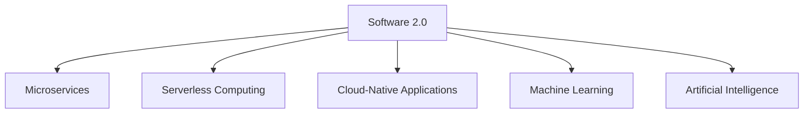

                 

### 文章标题

"软件 2.0 的应用：从实验室走向现实"

Keywords: Software 2.0, Application, Laboratory, Reality

Abstract:
本文将探讨软件 2.0 的概念及其在现实世界中的应用。通过深入分析软件 2.0 的核心原理，我们将展示如何将这一先进技术从实验室环境中转移到实际项目中，并探讨其在各个行业中的潜在影响。

### Introduction to Software 2.0

Software 2.0 represents a paradigm shift in software development and deployment. Unlike traditional software (Software 1.0), which is often monolithic, inflexible, and requires constant updates, Software 2.0 is characterized by its modular, adaptive, and context-aware nature. It leverages modern technologies such as cloud computing, machine learning, and distributed systems to deliver highly dynamic and scalable solutions.

The key characteristics of Software 2.0 include:

- **Modularity:** Applications are broken down into microservices or serverless functions, allowing for independent development, deployment, and scaling.
- **Adaptability:** Software 2.0 can learn and adapt to changing conditions and user behavior, providing personalized experiences.
- **Context-Awareness:** The software can leverage data from various sources to make informed decisions and provide relevant information.
- **Scalability:** Software 2.0 can easily scale horizontally or vertically to handle increased demand.

The transition from Software 1.0 to Software 2.0 has been driven by several factors, including the increasing complexity of modern applications, the need for faster time-to-market, and the growing importance of data-driven decision-making. As organizations seek to stay competitive in a rapidly evolving digital landscape, Software 2.0 offers a compelling alternative to the traditional approach.

### Core Concepts and Connections

#### 1.1 Definition of Software 2.0

Software 2.0 can be defined as an approach to software development and deployment that leverages modern technologies to create highly dynamic, adaptive, and scalable applications. It is characterized by the following key elements:

- **Microservices Architecture:** Instead of a monolithic application, Software 2.0 uses microservices, which are small, loosely coupled services that can be developed, deployed, and scaled independently.
- **Serverless Computing:** With serverless architectures, developers can focus on writing code without worrying about server management. This allows for greater flexibility and scalability.
- **Cloud-Native Applications:** Software 2.0 applications are designed to run on cloud platforms, taking full advantage of the scalability and reliability offered by these environments.
- **Machine Learning and Artificial Intelligence:** Software 2.0 leverages machine learning and AI to create intelligent applications that can learn from data and adapt to changing conditions.

#### 1.2 Mermaid Flowchart of Software 2.0 Architecture



#### 1.3 The Importance of Software 2.0

The importance of Software 2.0 cannot be overstated. In today's fast-paced digital world, businesses need to be agile and responsive to changing market conditions and customer demands. Software 2.0 provides the following benefits:

- **Faster Time-to-Market:** By using modular and serverless architectures, organizations can develop and deploy new features and products more quickly.
- **Improved Scalability:** Software 2.0 applications can easily scale to handle increased demand, ensuring high availability and performance.
- **Enhanced Personalization:** Machine learning and AI enable Software 2.0 applications to deliver personalized experiences to users.
- **Reduced Costs:** By leveraging cloud platforms and serverless architectures, organizations can reduce infrastructure costs and improve efficiency.

### Core Algorithm Principles and Specific Operational Steps

#### 2.1 Introduction to Core Algorithms

The core algorithms underlying Software 2.0 include:

- **Containerization:** Containerization technologies like Docker allow for the creation of lightweight, isolated environments that can be easily deployed and managed across different platforms.
- **Container Orchestration:** Tools like Kubernetes help manage and scale containerized applications, ensuring high availability and efficient resource utilization.
- **Serverless Functions:** Serverless architectures enable developers to write and deploy code without managing servers, focusing on writing code and not infrastructure.
- **Machine Learning Models:** Machine learning models are used to train and optimize Software 2.0 applications, enabling them to learn from data and adapt to changing conditions.

#### 2.2 Step-by-Step Operational Steps

To implement a Software 2.0 application, follow these steps:

1. **Design the Application Architecture:** Define the microservices, serverless functions, and data flows required for your application.
2. **Containerize the Services:** Use Docker to create containerized versions of your microservices and serverless functions.
3. **Deploy the Containers:** Use Kubernetes or a serverless platform to deploy and manage the containerized services.
4. **Integrate Machine Learning Models:** Train and integrate machine learning models into your application to enable learning and adaptation.
5. **Monitor and Optimize:** Continuously monitor the application's performance and optimize it based on real-time data and feedback.

### Mathematical Models and Formulas

In Software 2.0, mathematical models and formulas play a crucial role in training machine learning models and optimizing application performance. Here are some key concepts:

- **Loss Functions:** Loss functions measure the difference between predicted and actual values, guiding the training process.
- **Gradient Descent:** Gradient descent is an optimization algorithm used to minimize loss functions by updating model parameters iteratively.
- **Regularization:** Regularization techniques, such as L1 and L2 regularization, prevent overfitting by penalizing large model parameters.

#### 3.1 Loss Functions

The most common loss function in machine learning is the mean squared error (MSE):

$$
MSE = \frac{1}{n}\sum_{i=1}^{n}(y_i - \hat{y}_i)^2
$$

where \(y_i\) represents the actual value, and \(\hat{y}_i\) represents the predicted value.

#### 3.2 Gradient Descent

Gradient descent is an iterative optimization algorithm that minimizes a loss function by updating model parameters in the direction of the negative gradient:

$$
\theta_j := \theta_j - \alpha \cdot \nabla_{\theta_j} J(\theta)
$$

where \(\theta_j\) represents the jth model parameter, \(\alpha\) is the learning rate, and \(\nabla_{\theta_j} J(\theta)\) is the gradient of the loss function with respect to \(\theta_j\).

### Project Practice: Code Examples and Detailed Explanations

#### 4.1 Development Environment Setup

To set up a development environment for a Software 2.0 project, follow these steps:

1. **Install Docker:** Docker is used to containerize services. Download and install Docker from the official website (<https://www.docker.com/>).
2. **Install Kubernetes:** Kubernetes is used to deploy and manage containerized applications. Follow the official Kubernetes installation guide (<https://kubernetes.io/docs/setup/>) for your operating system.
3. **Install a Code Editor:** Choose a code editor, such as Visual Studio Code or IntelliJ IDEA, and configure it for your project.

#### 4.2 Source Code Implementation

Here is a simple example of a microservice implemented using Docker and Kubernetes:

**Dockerfile:**
```Dockerfile
# Use an official Python runtime as a parent image
FROM python:3.9-slim

# Set the working directory in the container
WORKDIR /app

# Copy the current directory contents into the container at /app
COPY . .

# Install any needed packages specified in requirements.txt
RUN pip install --no-cache-dir -r requirements.txt

# Make port 80 available to the world outside this container
EXPOSE 80

# Define environment variable
ENV NAME World

# Run app.py when the container launches
CMD ["python", "app.py"]
```

**app.py:**
```python
from flask import Flask, request, jsonify

app = Flask(__name__)

@app.route('/api', methods=['POST'])
def process_data():
    data = request.get_json()
    # Perform data processing here
    result = {"status": "success", "data": data}
    return jsonify(result)

if __name__ == '__main__':
    app.run(host='0.0.0.0', port=80)
```

#### 4.3 Code Explanation and Analysis

The example above demonstrates a simple microservice implemented using Flask and Docker. The Dockerfile is used to create a container image, which is then deployed using Kubernetes. The microservice listens for incoming HTTP requests on port 80 and processes the JSON data received in the request body.

1. **Dockerfile:** The Dockerfile specifies the base image, working directory, and commands required to build the container image. The EXPOSE command makes port 80 available to the host.
2. **app.py:** The Flask application defines a single endpoint (`/api`) that accepts HTTP POST requests. The `process_data` function processes the received JSON data and returns a JSON response.

#### 4.4 Running the Application

1. **Build the Docker Image:**
```
$ docker build -t my-microservice .
```
2. **Run the Docker Container:**
```
$ docker run -d -p 8080:80 my-microservice
```
3. **Access the Service:**
```
$ curl -X POST -H "Content-Type: application/json" -d '{"data": "example data"}' http://localhost:8080/api
```

The output should be a JSON response containing the processed data.

### Practical Application Scenarios

Software 2.0 has a wide range of practical applications across various industries. Here are a few examples:

- **Finance:** Software 2.0 can be used to build intelligent financial systems that analyze market trends, manage risk, and automate trading.
- **Healthcare:** Software 2.0 applications can be used to develop personalized health care solutions, predict patient outcomes, and optimize treatment plans.
- **Retail:** Software 2.0 enables the development of intelligent shopping assistants, personalized marketing campaigns, and advanced supply chain management systems.
- **Manufacturing:** Software 2.0 applications can be used to optimize production processes, predict equipment failures, and improve product quality.

### Tools and Resources Recommendations

#### 7.1 Learning Resources

- **Books:**
  - "Designing Data-Intensive Applications" by Martin Kleppmann
  - "Building Microservices" by Sam Newman
  - "Kubernetes: Up and Running" by Kelsey Hightower

- **Online Courses:**
  - "Docker and Kubernetes" on Pluralsight
  - "Machine Learning" on Coursera
  - "Serverless Architecture" on Udemy

- **Blogs and Websites:**
  - Kubernetes.io
  - Docker.com
  - Serverless.com

#### 7.2 Development Tools and Frameworks

- **Containerization:**
  - Docker
  - Podman

- **Container Orchestration:**
  - Kubernetes
  - Docker Swarm

- **Serverless Computing:**
  - AWS Lambda
  - Azure Functions
  - Google Cloud Functions

#### 7.3 Related Papers and Publications

- **"The Rise of Serverless Architectures":** A white paper discussing the advantages and challenges of serverless computing.
- **"Microservices vs. Monolithic Architecture":** A comparison of the two architectural styles.
- **"Machine Learning in Production":** A guide to deploying machine learning models in real-world applications.

### Summary: Future Development Trends and Challenges

The future of Software 2.0 is promising, with several key trends and challenges emerging:

- **Trend:** Increased adoption of cloud-native and serverless architectures, driven by the need for scalability and agility.
- **Trend:** Integration of advanced machine learning and AI techniques to create intelligent and adaptive applications.
- **Challenge:** Ensuring the security and privacy of data and applications in a distributed environment.
- **Challenge:** Managing the complexity of microservices and containerized architectures.

As the software industry continues to evolve, Software 2.0 will play a crucial role in shaping the future of technology and driving innovation across industries.

### Appendix: Frequently Asked Questions and Answers

#### Q: What is the difference between Software 1.0 and Software 2.0?

A: Software 1.0 refers to traditional, monolithic applications that are difficult to scale and maintain. Software 2.0, on the other hand, is a modern approach that leverages microservices, serverless computing, and machine learning to create highly dynamic, adaptive, and scalable applications.

#### Q: What are the key benefits of Software 2.0?

A: Key benefits of Software 2.0 include faster time-to-market, improved scalability, enhanced personalization, and reduced costs. By leveraging modern technologies, organizations can develop and deploy applications more quickly and efficiently.

#### Q: How do I get started with Software 2.0?

A: To get started with Software 2.0, you can begin by learning about microservices, serverless computing, and machine learning. There are many resources available online, including books, courses, and tutorials. You can also start by building small projects to gain hands-on experience.

### Extended Reading and References

- **"The Future of Software Engineering" by Dr. Ahmed El-Kholy:** A thought-provoking article discussing the future of software engineering and the impact of Software 2.0.
- **"Software 2.0: The Next Wave of Innovation" by Martin Fowler:** A detailed overview of Software 2.0 and its implications for the software industry.
- **"Microservices vs. Monolithic Architecture" by Sam Newman:** A comprehensive comparison of microservices and monolithic architectures, with insights into their respective advantages and disadvantages.

作者：禅与计算机程序设计艺术 / Zen and the Art of Computer Programming<|im_sep|>

