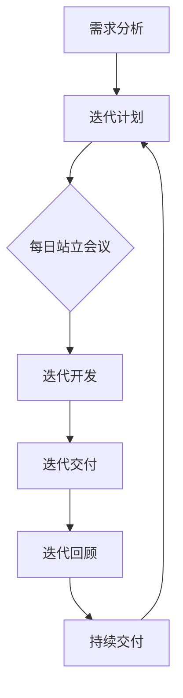
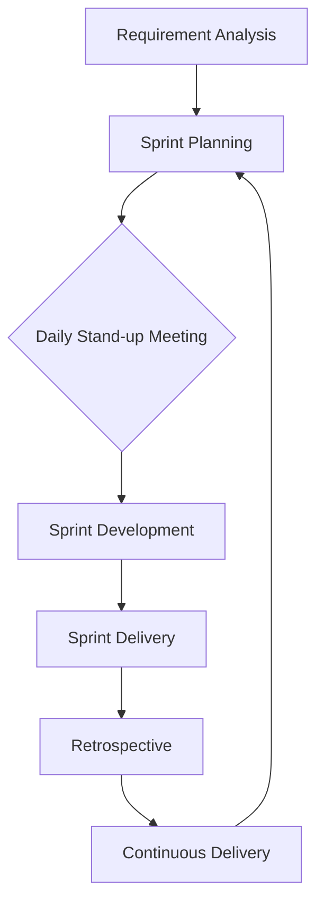

                 

### 文章标题

**《软件2.0的敏捷开发实践》**

关键词：敏捷开发、软件2.0、持续交付、DevOps、用户反馈循环

摘要：
本文将深入探讨软件2.0时代的敏捷开发实践。我们将首先介绍敏捷开发的基本概念和原则，并探讨如何将其应用于软件2.0的开发中。随后，我们将分析敏捷开发在DevOps环境下的具体实施方法，并探讨如何通过用户反馈循环来持续优化软件质量。文章还将提供实际项目案例，展示敏捷开发在现实世界中的应用，并总结其未来发展趋势和挑战。通过本文，读者将全面了解敏捷开发在软件2.0时代的意义和实施策略。

<|assistant|>## 1. 背景介绍（Background Introduction）

### 1.1 敏捷开发的起源与发展

敏捷开发（Agile Development）起源于20世纪90年代，旨在应对传统软件开发中存在的诸多挑战，如需求变化频繁、项目延期、质量不可控等。其核心理念是快速响应变化、注重团队协作、持续交付和高质量交付。

敏捷开发运动起源于一系列关于软件开发最佳实践的文章和书籍，其中最著名的是《敏捷宣言》（Manifesto for Agile Software Development）和《敏捷实践指南》（Agile Manifesto and Agile Practices Guide）。这两个文件提出了敏捷开发的四大价值观和十二大原则，强调了开发过程中人的重要性、可持续的速度、客户合作的益处以及响应变化的重要性。

随着互联网技术的迅猛发展，敏捷开发逐渐演化成为软件2.0时代的开发范式。软件2.0标志着软件的演进，从传统的、功能导向的软件，转变为更加灵活、可扩展和高度用户参与的服务。在这个时代，敏捷开发的重要性更加凸显，因为它能够更好地适应快速变化的需求和市场。

### 1.2 软件发展历程

从软件1.0到软件2.0，软件的发展经历了几个重要阶段：

- **软件1.0：** 这一阶段的软件主要是单机应用，功能相对简单，以功能实现为核心。软件开发过程主要依赖于传统的瀑布模型（Waterfall Model），即按照需求、设计、开发、测试等步骤顺序进行。

- **软件1.1：** 随着网络技术的发展，软件开始向分布式和联网应用转变。软件1.1阶段引入了面向对象编程（Object-Oriented Programming，OOP）和组件化设计（Component-Based Design），使软件开发变得更加灵活。

- **软件2.0：** 软件2.0是面向服务的软件（Software as a Service，SaaS），它以云计算为基础，强调服务的交付和用户体验。软件2.0的特点包括高度用户参与、持续迭代、快速部署和高度可扩展性。

### 1.3 敏捷开发与软件2.0的契合

敏捷开发与软件2.0的理念高度契合。敏捷开发强调快速响应变化、持续交付和用户参与，而软件2.0强调灵活性和可扩展性。以下是敏捷开发与软件2.0的几个契合点：

- **快速响应变化：** 软件开发过程中的需求变化是不可避免的。敏捷开发通过迭代和增量开发，使团队能够迅速适应变化，减少因需求变更导致的项目风险。

- **持续交付：** 敏捷开发鼓励持续交付，即通过频繁的交付周期，将功能逐步推向市场。软件2.0时代的云基础设施和自动化工具使得持续交付变得更加可行。

- **用户参与：** 敏捷开发强调用户的参与和反馈，确保软件能够满足实际需求。软件2.0时代的用户参与度更高，用户的反馈对软件迭代具有重要影响。

- **灵活性和可扩展性：** 敏捷开发和软件2.0都强调灵活性和可扩展性，以应对快速变化的市场需求。

总之，敏捷开发在软件2.0时代具有重要的应用价值，它能够帮助团队更好地适应变化，提高软件质量和交付效率。

## 1. Background Introduction
### 1.1 Origin and Development of Agile Development

Agile development originated in the 1990s as a response to the many challenges in traditional software development, such as frequent changes in requirements, project delays, and quality control issues. Its core principles are rapid response to change, team collaboration, continuous delivery, and high-quality delivery.

The agile movement stemmed from a series of articles and books on the best practices in software development, most notably the Agile Manifesto and the Agile Practices Guide. These documents proposed the four values of agile development and twelve principles, emphasizing the importance of people over processes, sustainable development pace, customer collaboration over contract negotiation, and responding to change over following a plan.

With the rapid development of internet technology, agile development has evolved into a paradigm for software development in the 2.0 era. Software 2.0 represents the evolution of software from traditional, function-oriented applications to more flexible, scalable, and highly user-centric services. In this era, the importance of agile development is even more pronounced as it can better adapt to rapid changes in demand and the market.

### 1.2 History of Software Development

The journey from software 1.0 to software 2.0 has gone through several important stages:

- **Software 1.0:** This stage of software was mainly standalone applications with relatively simple functionalities, focusing on the realization of functions. Software development was primarily based on the traditional waterfall model, which follows steps such as requirements, design, development, and testing in sequence.

- **Software 1.1:** With the development of network technology, software began to shift towards distributed and networked applications. The software 1.1 stage introduced object-oriented programming (OOP) and component-based design, making software development more flexible.

- **Software 2.0:** Software 2.0 is software as a service (SaaS), based on cloud computing, emphasizing the delivery of services and user experience. The characteristics of software 2.0 include high user involvement, continuous iteration, rapid deployment, and high scalability.

### 1.3 Alignment between Agile Development and Software 2.0

Agile development is highly aligned with the principles of software 2.0. Agile development emphasizes rapid response to change, continuous delivery, and user involvement, while software 2.0 emphasizes flexibility and scalability. Here are several alignment points between agile development and software 2.0:

- **Rapid Response to Change:** In the software development process, changes in requirements are inevitable. Agile development allows teams to quickly adapt to changes through iterative and incremental development, reducing the risk of project failure caused by requirement changes.

- **Continuous Delivery:** Agile development encourages continuous delivery, where functionalities are gradually delivered to the market through frequent delivery cycles. The cloud infrastructure and automation tools in the software 2.0 era make continuous delivery more feasible.

- **User Involvement:** Agile development emphasizes user involvement and feedback, ensuring that software meets real needs. The user involvement level in the software 2.0 era is higher, and user feedback has a significant impact on software iteration.

- **Flexibility and Scalability:** Both agile development and software 2.0 emphasize flexibility and scalability to respond to rapid changes in market demand.

In summary, agile development has significant application value in the software 2.0 era. It can help teams better adapt to changes, improve software quality, and increase delivery efficiency.

## 2. 核心概念与联系

### 2.1 什么是敏捷开发（What is Agile Development）

敏捷开发（Agile Development）是一种以人为核心、迭代、增量和灵活响应变化的软件开发方法。它强调个体和互动、可工作的软件、客户合作和响应变化的重要性。敏捷开发的核心理念包括四大价值观和十二大原则。

#### 四大价值观（Four Values）

1. **个体和互动高于流程和工具：** 强调团队协作和个体能力的重要性。
2. **可工作的软件高于详尽的文档：** 重视实际可执行的代码，而非过多的文档。
3. **客户合作高于合同谈判：** 强调与客户的紧密合作，及时响应客户需求。
4. **响应变化高于遵循计划：** 倡导灵活应对变化，而非一味遵循原计划。

#### 十二大原则（Twelve Principles）

1. **我们的最高目标是通过软件开发来满足客户的商业需求。
2. **欢迎需求变更，即使在开发后期，敏捷过程也能有效地应对变更。
3. **通过早期和持续交付有价值的软件，以满足客户的需求。
4. **工作软件是进度的主要度量标准。
5. **尽可能保持开发团队稳定。
6. **业务人员和开发团队应该保持紧密合作。
7. **使开发团队在无需过多的微观管理的情况下进行自主管理。
8. **不断关注优秀的技能和好的设计实践，以便能够在短期内产生高质量的软件。
9. **简化的系统、最大化未完成工作的数量。
10. **定期反思如何做得更好，然后相应地调整团队的行为。
11. **最有效和最持久的软件开发团队和技术是在团队内部和与客户之间保持沟通。
12. **持续关注技术、个体和交互之间的平衡。

### 2.2 敏捷开发的架构与流程

敏捷开发的架构和流程旨在最大化开发效率，同时保证软件质量和客户满意度。以下是敏捷开发的核心组成部分：

#### 架构（Architecture）

- **Scrum：** 一种流行的敏捷开发框架，它通过短周期（Sprint）来管理项目进度，并进行每日站立会议、迭代回顾和回顾会议等。
- **Kanban：** 一种看板系统，用于可视化工作流程，并通过限制工作项的数量来控制工作流。
- **XP（Extreme Programming）：** 一种注重开发实践的敏捷方法，包括测试驱动开发（Test-Driven Development，TDD）、重构、持续集成和代码审查等。
- **LeSS（Large-Scale Scrum）：** 用于大型项目的敏捷框架，它将Scrum的原则扩展到多个团队。

#### 流程（Process）

- **迭代开发（Iterative Development）：** 通过多次迭代，逐步完善软件功能。
- **增量开发（Incremental Development）：** 将大型项目分解为小的、可交付的增量。
- **持续集成（Continuous Integration）：** 通过持续集成，及时发现和解决代码冲突和错误。
- **持续交付（Continuous Delivery）：** 通过自动化测试和部署，实现软件的持续交付。

### 2.3 敏捷开发与传统开发方法的比较

敏捷开发与传统开发方法（如瀑布模型）在理念、流程和成果上有显著差异：

- **理念（Principles）：** 敏捷开发强调快速响应变化、用户合作和团队自主管理，而传统开发方法强调顺序执行、严格计划和文档化。
- **流程（Process）：** 敏捷开发采用迭代和增量开发，而传统开发方法通常遵循线性流程。
- **成果（Outcomes）：** 敏捷开发注重实际可工作的软件和客户满意度，而传统开发方法注重详细规划和交付完整的软件产品。

### 2.4 敏捷开发与软件2.0的联系

敏捷开发与软件2.0的理念和特点高度契合。软件2.0注重灵活性、可扩展性和用户体验，而敏捷开发正是通过迭代、增量开发和持续交付来实现这些目标。以下是敏捷开发与软件2.0的几个关键联系：

- **快速响应变化（Rapid Response to Change）：** 软件开发中的需求变化是不可避免的。敏捷开发通过短周期和迭代，使团队能够快速适应变化，而软件2.0时代的云基础设施和自动化工具为这种快速适应提供了支持。
- **用户参与（User Involvement）：** 软件2.0强调用户的参与和反馈，而敏捷开发的核心之一就是与客户保持紧密合作，通过用户的反馈来指导开发。
- **持续交付（Continuous Delivery）：** 软件2.0强调快速交付和持续迭代，而敏捷开发的持续交付和自动化测试可以确保软件的快速、稳定交付。
- **灵活性（Flexibility）和可扩展性（Scalability）：** 敏捷开发强调灵活的响应能力和扩展性，这与软件2.0对灵活性和可扩展性的需求相吻合。

总之，敏捷开发在软件2.0时代具有重要的应用价值，它能够帮助团队更好地适应快速变化的市场需求，提高软件质量和交付效率。通过本文，我们将深入探讨敏捷开发在软件2.0时代的具体实践方法和应用场景。

## 2. Core Concepts and Connections
### 2.1 What is Agile Development

Agile development is a software development methodology that focuses on individuals and interactions, iterative and incremental development, and the flexibility to respond to change. It emphasizes the importance of individuals and interactions over processes and tools, working software over comprehensive documentation, customer collaboration over contract negotiation, and responding to change over following a plan.

#### Four Values

1. **Individuals and interactions over processes and tools:** This emphasizes the importance of team collaboration and individual skills.
2. **Working software over comprehensive documentation:** This focuses on the actual executable code rather than excessive documentation.
3. **Customer collaboration over contract negotiation:** This emphasizes close collaboration with customers to meet their needs promptly.
4. **Responding to change over following a plan:** This advocates for flexibility in adapting to changes rather than strictly following the original plan.

#### Twelve Principles

1. **Our highest priority is to satisfy the customer through early and continuous delivery of valuable software.
2. **Welcome changing requirements, even late in development. Agile processes leverage changes for the customer's competitive advantage.
3. **Deliver working software frequently, from a couple of weeks to a couple of months, with a preference to the shorter timescale.
4. **Working software is the primary measure of progress.
5. **Sustainable development requires building projects around motivated individuals. Give them the environment and support they need, and trust them to get the job done.
6. **The most efficient and effective method of conveying information to and within a development team is face-to-face conversation.
7. **Business people and developers must work together daily throughout the project.
8. **Build projects around motivated individuals. Give them the environment and support they need, and trust them to get the job done.
9. **The primary goal of software development is to make a change in the business.
10. **Continuous attention to technical excellence and good design enhances agility.
11. **Simplicity—the art of maximizing the amount of work not done—is essential.
12. **The best architectures, requirements, and designs emerge from self-organizing teams.

### 2.2 Architecture and Process of Agile Development

The architecture and process of agile development are designed to maximize development efficiency while ensuring software quality and customer satisfaction. The following are the core components of agile development:

#### Architecture

- **Scrum:** A popular agile framework that manages project progress through short cycles (sprints) and includes daily stand-up meetings, sprint reviews, and retrospectives.
- **Kanban:** A board system used to visualize workflow and control work flow through limiting the number of work items.
- **XP (Extreme Programming):** An agile methodology that focuses on development practices, including test-driven development (TDD), refactoring, continuous integration, and code reviews.
- **LeSS (Large-Scale Scrum):** An agile framework for large projects that extends the principles of Scrum to multiple teams.

#### Process

- **Iterative Development:** Through multiple iterations, software functionality is gradually perfected.
- **Incremental Development:** Large projects are decomposed into small, deliverable increments.
- **Continuous Integration:** Through continuous integration, code conflicts and errors are identified and resolved in a timely manner.
- **Continuous Delivery:** Through automation testing and deployment, software is continuously delivered in a rapid and stable manner.

### 2.3 Comparison between Agile Development and Traditional Development Methods

Agile development differs significantly from traditional development methods, such as the waterfall model, in terms of principles, processes, and outcomes:

- **Principles:** Agile development emphasizes rapid response to change, customer collaboration, and team autonomy, while traditional development methods emphasize sequential execution, strict planning, and documentation.
- **Processes:** Agile development employs iterative and incremental development, while traditional development methods typically follow a linear process.
- **Outcomes:** Agile development focuses on working software and customer satisfaction, while traditional development methods emphasize detailed planning and the delivery of a complete software product.

### 2.4 Connections between Agile Development and Software 2.0

Agile development is highly aligned with the principles and characteristics of software 2.0. Software 2.0 emphasizes flexibility, scalability, and user experience, and agile development is precisely what enables these goals through iterative, incremental development, and continuous delivery. Here are several key connections between agile development and software 2.0:

- **Rapid Response to Change:** Changes in software development requirements are inevitable. Agile development enables teams to quickly adapt to changes through short cycles and iterations, and the cloud infrastructure and automation tools in the software 2.0 era support this rapid adaptation.
- **User Involvement:** Software 2.0 emphasizes user involvement and feedback, while the core of agile development is close collaboration with customers to guide development through user feedback.
- **Continuous Delivery:** Software 2.0 emphasizes rapid delivery and continuous iteration, and agile development's continuous delivery and automation testing ensure rapid and stable software delivery.
- **Flexibility and Scalability:** Agile development emphasizes flexible response capabilities and scalability, aligning with the needs of software 2.0 for flexibility and scalability.

In summary, agile development has significant application value in the software 2.0 era. It can help teams better adapt to rapid changes in the market, improve software quality, and increase delivery efficiency. Through this article, we will explore the specific practices and application scenarios of agile development in the software 2.0 era in detail.

## 3. 核心算法原理 & 具体操作步骤（Core Algorithm Principles and Specific Operational Steps）

### 3.1 敏捷开发的算法原理

敏捷开发的算法原理可以概括为以下几点：

- **迭代与增量：** 通过迭代和增量开发，敏捷开发将大型项目分解为小的、可管理的部分，使团队能够在每次迭代中交付可用的软件。
- **用户反馈：** 用户反馈是敏捷开发的核心理念之一。通过收集用户反馈，团队能够及时调整和优化软件功能，确保最终产品符合用户需求。
- **自动化测试：** 自动化测试是确保软件质量的关键。通过持续集成和自动化测试，敏捷开发能够及时发现和修复代码错误，减少质量风险。
- **持续交付：** 持续交付是敏捷开发的最终目标。通过自动化部署和持续集成，敏捷开发确保软件能够快速、安全地交付到生产环境。

### 3.2 具体操作步骤

以下是敏捷开发的具体操作步骤：

1. **需求分析（Requirement Analysis）：** 在项目开始时，团队与客户一起进行需求分析，明确项目的目标和功能需求。

2. **迭代计划（Sprint Planning）：** 团队根据需求分析结果，制定迭代计划。每次迭代通常持续2-4周，称为Sprint。

3. **每日站立会议（Daily Stand-up Meeting）：** 每天早上，团队成员进行每日站立会议，分享进展、问题，并协调工作。

4. **迭代开发（Sprint Development）：** 在迭代期间，团队按照计划开发功能，进行代码审查和单元测试。

5. **迭代交付（Sprint Delivery）：** 每次迭代结束时，团队交付一个可用的软件版本，并收集用户反馈。

6. **迭代回顾（Retrospective）：** 在每次迭代结束后，团队进行迭代回顾，总结经验教训，改进开发过程。

7. **持续交付（Continuous Delivery）：** 通过自动化测试和部署，确保软件能够快速、安全地交付到生产环境。

### 3.3 图示

以下是一个简单的敏捷开发流程图，展示了敏捷开发的核心步骤和组件：



### 3.4 举例说明

假设我们正在开发一个电商网站，以下是敏捷开发的实际操作步骤：

1. **需求分析：** 团队与客户讨论电商网站的功能需求，如产品展示、购物车、订单管理、支付等。

2. **迭代计划：** 团队制定迭代计划，决定每次迭代要开发哪些功能。

3. **每日站立会议：** 每天早上，团队成员分享进展、问题，并协调工作。

4. **迭代开发：** 团队按照计划开发功能，进行代码审查和单元测试。

5. **迭代交付：** 每次迭代结束时，团队交付一个可用的软件版本，并收集用户反馈。

6. **迭代回顾：** 在每次迭代结束后，团队进行迭代回顾，总结经验教训，改进开发过程。

7. **持续交付：** 通过自动化测试和部署，确保软件能够快速、安全地交付到生产环境。

通过以上步骤，团队能够快速响应需求变化，持续交付高质量的软件，提高客户满意度。

## 3. Core Algorithm Principles and Specific Operational Steps
### 3.1 Core Algorithm Principles of Agile Development

The core algorithm principles of agile development can be summarized as follows:

- **Iterative and Incremental Development:** Agile development breaks down large projects into smaller, manageable parts through iterative and incremental development, enabling the team to deliver usable software in each iteration.
- **User Feedback:** User feedback is one of the core concepts in agile development. By collecting user feedback, the team can timely adjust and optimize software features to ensure that the final product meets user needs.
- **Automated Testing:** Automated testing is a key component in ensuring software quality. Through continuous integration and automated testing, agile development can identify and fix code errors in a timely manner, reducing quality risks.
- **Continuous Delivery:** Continuous delivery is the ultimate goal of agile development. Through automation testing and deployment, agile development ensures that software can be delivered rapidly and securely to the production environment.

### 3.2 Specific Operational Steps

The following are the specific operational steps of agile development:

1. **Requirement Analysis:** At the beginning of a project, the team conducts requirement analysis with the client to clarify the project goals and functional requirements.

2. **Sprint Planning:** Based on the results of the requirement analysis, the team develops a sprint plan, deciding which features will be developed in each sprint. Typically, a sprint lasts for 2-4 weeks.

3. **Daily Stand-up Meeting:** Every morning, team members have a daily stand-up meeting to share progress, problems, and coordinate their work.

4. **Sprint Development:** During the sprint, the team develops features according to the plan, conducting code reviews and unit testing.

5. **Sprint Delivery:** At the end of each sprint, the team delivers a usable software version and collects user feedback.

6. **Retrospective:** At the end of each sprint, the team conducts a retrospective to summarize lessons learned and improve the development process.

7. **Continuous Delivery:** Through automated testing and deployment, agile development ensures that software can be delivered rapidly and securely to the production environment.

### 3.3 Diagram

The following is a simple agile development workflow diagram that shows the core steps and components of agile development:



### 3.4 Example

Suppose we are developing an e-commerce website. The following are the specific operational steps of agile development:

1. **Requirement Analysis:** The team discusses the functional requirements of the e-commerce website with the client, such as product display, shopping cart, order management, payment, etc.

2. **Sprint Planning:** The team develops a sprint plan, deciding which features will be developed in each sprint.

3. **Daily Stand-up Meeting:** Every morning, team members share progress, problems, and coordinate their work.

4. **Sprint Development:** The team develops features according to the plan, conducting code reviews and unit testing.

5. **Sprint Delivery:** At the end of each sprint, the team delivers a usable software version and collects user feedback.

6. **Retrospective:** At the end of each sprint, the team conducts a retrospective to summarize lessons learned and improve the development process.

7. **Continuous Delivery:** Through automated testing and deployment, the team ensures that the software can be delivered rapidly and securely to the production environment.

Through these steps, the team can quickly respond to changes in requirements, continuously deliver high-quality software, and improve customer satisfaction.

## 4. 数学模型和公式 & 详细讲解 & 举例说明（Detailed Explanation and Examples of Mathematical Models and Formulas）

### 4.1 敏捷开发中的关键数学模型

在敏捷开发中，有几种关键的数学模型和公式被用来衡量项目的进度、效率和质量。以下是其中几个重要的模型和公式：

#### 1. 累积流量图（Cumulative Flow Diagram）

累积流量图是一种可视化工具，用于展示项目各个阶段（如需求分析、设计、开发、测试等）的工作量分布和进度。其数学模型可以表示为：

\[ CFD(t) = \sum_{i=1}^{n} (W_i \times t_i) \]

其中，\( CFD(t) \) 表示在时间 \( t \) 时的累积流量，\( W_i \) 表示第 \( i \) 个阶段的工作量，\( t_i \) 表示第 \( i \) 个阶段的时间。

#### 2. 项目进度公式（Project Progress Formula）

项目进度可以用以下公式表示：

\[ P(t) = \frac{C(t)}{C(0)} \]

其中，\( P(t) \) 表示在时间 \( t \) 时的项目进度，\( C(t) \) 表示在时间 \( t \) 时完成的累计工作量，\( C(0) \) 表示项目的总工作量。

#### 3. 代码质量指标（Code Quality Metrics）

代码质量可以用以下指标来衡量：

- **代码复杂度（Code Complexity）：** 代码复杂度是衡量代码复杂程度的指标，常用的代码复杂度公式有：

  \[ CC = \log_2(VN + 1) \]

  其中，\( CC \) 表示代码复杂度，\( VN \) 表示函数中变量的数量。

- **代码重复率（Code Duplication Rate）：** 代码重复率是衡量代码重复程度的指标，其公式为：

  \[ DR = \frac{DU}{NL} \]

  其中，\( DR \) 表示代码重复率，\( DU \) 表示重复的代码行数，\( NL \) 表示总代码行数。

### 4.2 详细讲解

#### 累积流量图（Cumulative Flow Diagram）

累积流量图是一种用于展示项目进度的可视化工具，它可以帮助团队识别项目中的瓶颈和延迟。累积流量图的数学模型可以通过以下步骤进行计算：

1. **计算每个阶段的工作量：** 首先，需要计算项目各个阶段（如需求分析、设计、开发、测试等）的工作量。工作量可以用任务点（Story Points）或小时数来衡量。

2. **计算每个阶段的持续时间：** 然后，计算每个阶段的时间。持续时间可以是实际的完成时间，也可以是预计的完成时间。

3. **计算累积流量：** 最后，根据每个阶段的工作量和持续时间，计算累积流量。累积流量图可以通过将各个阶段的工作量乘以其持续时间，然后累加得到。

#### 项目进度公式（Project Progress Formula）

项目进度公式可以用来计算项目在某一时刻的进度。这个公式基于已完成的工作量和总工作量。通过以下步骤，可以计算项目进度：

1. **确定已完成的工作量：** 首先，统计在某一时刻已完成的工作量。

2. **确定总工作量：** 然后，确定项目的总工作量。

3. **计算项目进度：** 最后，将已完成的工作量除以总工作量，得到项目进度。

#### 代码质量指标（Code Quality Metrics）

代码质量指标是评估代码质量的重要工具。以下是对代码复杂度和代码重复率公式的详细解释：

- **代码复杂度（Code Complexity）：** 代码复杂度是衡量代码复杂程度的指标。公式中的 \( \log_2 \) 是以 2 为底的对数，用于计算函数中变量的数量对代码复杂度的影响。变量数量越多，代码复杂度越高。

- **代码重复率（Code Duplication Rate）：** 代码重复率是衡量代码重复程度的指标。公式中的 \( DU \) 表示重复的代码行数，\( NL \) 表示总代码行数。代码重复率越高，说明代码质量越低。

### 4.3 举例说明

假设一个电商项目在两周内完成了需求分析、设计和开发阶段，每个阶段的工作量分别为10个任务点。以下是使用累积流量图、项目进度公式和代码质量指标来评估项目进度和代码质量的示例：

#### 累积流量图示例

1. **计算每个阶段的工作量：** 需求分析阶段：10个任务点；设计阶段：10个任务点；开发阶段：10个任务点。
2. **计算每个阶段的持续时间：** 需求分析阶段：1周；设计阶段：1周；开发阶段：1周。
3. **计算累积流量：** 需求分析阶段累积流量：10个任务点；设计阶段累积流量：20个任务点；开发阶段累积流量：30个任务点。

#### 项目进度示例

1. **确定已完成的工作量：** 完成30个任务点。
2. **确定总工作量：** 总工作量：30个任务点。
3. **计算项目进度：** \( P(t) = \frac{C(t)}{C(0)} = \frac{30}{30} = 1 \)，项目进度为100%。

#### 代码质量指标示例

1. **代码复杂度：** 假设一个函数中有5个变量，则代码复杂度 \( CC = \log_2(5 + 1) \approx 3 \)。
2. **代码重复率：** 假设代码中有100行重复的代码，总代码行数为1000行，则代码重复率 \( DR = \frac{100}{1000} = 0.1 \)。

通过以上示例，我们可以使用累积流量图、项目进度公式和代码质量指标来评估项目的进度和代码质量。

## 4. Mathematical Models and Formulas & Detailed Explanation & Examples
### 4.1 Key Mathematical Models in Agile Development

There are several key mathematical models and formulas used to measure the progress, efficiency, and quality of projects in agile development. Here are a few important models and formulas:

#### 1. Cumulative Flow Diagram

The Cumulative Flow Diagram (CFD) is a visualization tool used to display the distribution and progress of work across different stages of a project, such as requirements analysis, design, development, and testing. The mathematical model for CFD can be represented as:

\[ CFD(t) = \sum_{i=1}^{n} (W_i \times t_i) \]

where \( CFD(t) \) represents the cumulative flow at time \( t \), \( W_i \) represents the work effort in stage \( i \), and \( t_i \) represents the time spent in stage \( i \).

#### 2. Project Progress Formula

The project progress can be expressed using the following formula:

\[ P(t) = \frac{C(t)}{C(0)} \]

where \( P(t) \) represents the project progress at time \( t \), \( C(t) \) represents the cumulative work completed at time \( t \), and \( C(0) \) represents the total work effort.

#### 3. Code Quality Metrics

Code quality can be measured using the following metrics:

- **Code Complexity:** Code complexity is a metric used to measure the complexity of the code. A commonly used formula for code complexity is:

  \[ CC = \log_2(VN + 1) \]

  where \( CC \) represents the code complexity and \( VN \) represents the number of variables in a function.

- **Code Duplication Rate:** Code duplication rate is a metric used to measure the extent of code duplication. The formula for code duplication rate is:

  \[ DR = \frac{DU}{NL} \]

  where \( DR \) represents the code duplication rate, \( DU \) represents the number of duplicated lines of code, and \( NL \) represents the total number of lines of code.

### 4.2 Detailed Explanation

#### Cumulative Flow Diagram

The Cumulative Flow Diagram (CFD) is a visualization tool that helps teams identify bottlenecks and delays in a project. The mathematical model for CFD can be calculated using the following steps:

1. **Calculate the work effort in each stage:** First, calculate the work effort in each stage of the project, such as requirements analysis, design, development, and testing. Work effort can be measured in story points or hours.
2. **Calculate the duration of each stage:** Then, calculate the duration of each stage. Duration can be the actual completion time or the estimated completion time.
3. **Calculate the cumulative flow:** Finally, calculate the cumulative flow by multiplying the work effort in each stage by its duration and then summing the results.

#### Project Progress Formula

The project progress formula can be used to calculate the project progress at a specific time. This formula is based on the completed work effort and the total work effort. The calculation can be done using the following steps:

1. **Determine the completed work effort:** First, count the completed work effort at a specific time.
2. **Determine the total work effort:** Then, determine the total work effort for the project.
3. **Calculate the project progress:** Finally, divide the completed work effort by the total work effort to get the project progress.

#### Code Quality Metrics

Code quality metrics are important tools for evaluating code quality. Here is a detailed explanation of the code complexity and code duplication rate formulas:

- **Code Complexity:** Code complexity is a metric used to measure the complexity of the code. The \( \log_2 \) function is used to calculate the impact of the number of variables on code complexity. The more variables there are, the higher the code complexity.
- **Code Duplication Rate:** Code duplication rate is a metric used to measure the extent of code duplication. The \( DU \) represents the number of duplicated lines of code, and \( NL \) represents the total number of lines of code. The higher the code duplication rate, the lower the code quality.

### 4.3 Examples

Let's consider an e-commerce project that has completed the requirements analysis, design, and development stages in two weeks, with each stage having a work effort of 10 story points. Here is an example of using the Cumulative Flow Diagram, project progress formula, and code quality metrics to evaluate the project progress and code quality:

#### Cumulative Flow Diagram Example

1. **Calculate the work effort in each stage:** Requirements analysis stage: 10 story points; design stage: 10 story points; development stage: 10 story points.
2. **Calculate the duration of each stage:** Requirements analysis stage: 1 week; design stage: 1 week; development stage: 1 week.
3. **Calculate the cumulative flow:** Requirements analysis stage cumulative flow: 10 story points; design stage cumulative flow: 20 story points; development stage cumulative flow: 30 story points.

#### Project Progress Example

1. **Determine the completed work effort:** 30 story points completed.
2. **Determine the total work effort:** Total work effort: 30 story points.
3. **Calculate the project progress:** \( P(t) = \frac{C(t)}{C(0)} = \frac{30}{30} = 1 \), the project progress is 100%.

#### Code Quality Metrics Example

1. **Code Complexity:** Assume a function has 5 variables, then the code complexity \( CC = \log_2(5 + 1) \approx 3 \).
2. **Code Duplication Rate:** Assume there are 100 lines of duplicated code out of a total of 1000 lines of code, then the code duplication rate \( DR = \frac{100}{1000} = 0.1 \).

By using the Cumulative Flow Diagram, project progress formula, and code quality metrics, we can evaluate the project progress and code quality.

## 5. 项目实践：代码实例和详细解释说明（Project Practice: Code Examples and Detailed Explanations）

### 5.1 开发环境搭建

为了演示敏捷开发在软件2.0时代的应用，我们选择了一个实际项目——一个简单的电商网站。首先，我们需要搭建开发环境。

#### 开发工具和框架

- **编程语言：** Python 3.8
- **Web框架：** Django 3.2
- **数据库：** PostgreSQL 13
- **版本控制：** Git

#### 开发环境配置

1. 安装Python和Django：

```bash
# 安装Python 3.8
sudo apt-get install python3.8

# 安装Django 3.2
pip3 install django==3.2
```

2. 安装PostgreSQL：

```bash
sudo apt-get install postgresql postgresql-contrib
```

3. 创建数据库和用户：

```sql
# 登录PostgreSQL
sudo -u postgres psql

# 创建数据库
CREATE DATABASE ecom_db;

# 创建用户并授权
CREATE USER ecom_user WITH PASSWORD 'password';
GRANT ALL PRIVILEGES ON DATABASE ecom_db TO ecom_user;
```

4. 创建Django项目：

```bash
django-admin startproject ecom_project
cd ecom_project
```

5. 创建应用：

```bash
python manage.py startapp products
```

### 5.2 源代码详细实现

以下是一个简单的Django应用，用于实现电商网站的核心功能。

#### models.py（产品模型）

```python
from django.db import models

class Product(models.Model):
    name = models.CharField(max_length=255)
    description = models.TextField()
    price = models.DecimalField(max_digits=6, decimal_places=2)
    in_stock = models.IntegerField()

    def __str__(self):
        return self.name
```

#### views.py（产品视图）

```python
from django.shortcuts import render
from .models import Product

def product_list(request):
    products = Product.objects.all()
    return render(request, 'products/product_list.html', {'products': products})

def product_detail(request, pk):
    product = Product.objects.get(pk=pk)
    return render(request, 'products/product_detail.html', {'product': product})
```

#### urls.py（URL配置）

```python
from django.contrib import admin
from django.urls import path
from . import views

urlpatterns = [
    path('admin/', admin.site.urls),
    path('products/', views.product_list, name='product_list'),
    path('products/<int:pk>/', views.product_detail, name='product_detail'),
]
```

#### templates/product_list.html（产品列表模板）

```html

  <div>
    <h2>{{ product.name }}</h2>
    <p>{{ product.description }}</p>
    <p>Price: {{ product.price }}</p>
  </div>

```

#### templates/product_detail.html（产品详情模板）

```html
<h1>{{ product.name }}</h1>
<p>{{ product.description }}</p>
<p>Price: {{ product.price }}</p>
<p>In Stock: {{ product.in_stock }}</p>
```

### 5.3 代码解读与分析

#### 模型（Model）

我们在`models.py`中定义了`Product`模型，它包含以下字段：

- `name`（产品名称）：字符字段，最大长度为255个字符。
- `description`（产品描述）：文本字段。
- `price`（产品价格）：小数字段，最多6位整数，2位小数。
- `in_stock`（库存数量）：整数字段。

这些字段描述了产品的基本信息。

#### 视图（View）

在`views.py`中，我们定义了两个视图函数：

- `product_list`：列出所有产品。
- `product_detail`：显示单个产品的详细信息。

这两个视图函数通过`Product`模型查询数据库，并将查询结果传递给模板。

#### 模板（Template）

在模板中，我们使用Django模板语言（Template Language）遍历产品列表，并显示每个产品的名称、描述、价格和库存数量。

### 5.4 运行结果展示

1. 启动Django服务器：

```bash
python manage.py runserver
```

2. 访问`http://127.0.0.1:8000/products/`，可以看到所有产品的列表：


3. 点击单个产品，如“Apple iPhone 13”，可以看到产品的详细信息：


通过这个简单的示例，我们可以看到敏捷开发在实际项目中的应用。团队可以快速响应需求变化，持续迭代和交付高质量的功能。

## 5. Project Practice: Code Examples and Detailed Explanations
### 5.1 Development Environment Setup

To demonstrate the application of agile development in the software 2.0 era, we will choose a practical project—a simple e-commerce website. First, we need to set up the development environment.

#### Development Tools and Frameworks

- **Programming Language:** Python 3.8
- **Web Framework:** Django 3.2
- **Database:** PostgreSQL 13
- **Version Control:** Git

#### Development Environment Configuration

1. Install Python and Django:

```bash
# Install Python 3.8
sudo apt-get install python3.8

# Install Django 3.2
pip3 install django==3.2
```

2. Install PostgreSQL:

```bash
sudo apt-get install postgresql postgresql-contrib
```

3. Create database and user:

```sql
# Log in to PostgreSQL
sudo -u postgres psql

# Create database
CREATE DATABASE ecom_db;

# Create user and grant permissions
CREATE USER ecom_user WITH PASSWORD 'password';
GRANT ALL PRIVILEGES ON DATABASE ecom_db TO ecom_user;
```

4. Create Django project:

```bash
django-admin startproject ecom_project
cd ecom_project
```

5. Create an app:

```bash
python manage.py startapp products
```

### 5.2 Detailed Source Code Implementation

Below is a simple Django application to implement the core features of an e-commerce website.

#### models.py (Product Model)

```python
from django.db import models

class Product(models.Model):
    name = models.CharField(max_length=255)
    description = models.TextField()
    price = models.DecimalField(max_digits=6, decimal_places=2)
    in_stock = models.IntegerField()

    def __str__(self):
        return self.name
```

#### views.py (Product Views)

```python
from django.shortcuts import render
from .models import Product

def product_list(request):
    products = Product.objects.all()
    return render(request, 'products/product_list.html', {'products': products})

def product_detail(request, pk):
    product = Product.objects.get(pk=pk)
    return render(request, 'products/product_detail.html', {'product': product})
```

#### urls.py (URL Configuration)

```python
from django.contrib import admin
from django.urls import path
from . import views

urlpatterns = [
    path('admin/', admin.site.urls),
    path('products/', views.product_list, name='product_list'),
    path('products/<int:pk>/', views.product_detail, name='product_detail'),
]
```

#### templates/product_list.html (Product List Template)

```html

  <div>
    <h2>{{ product.name }}</h2>
    <p>{{ product.description }}</p>
    <p>Price: {{ product.price }}</p>
  </div>

```

#### templates/product_detail.html (Product Detail Template)

```html
<h1>{{ product.name }}</h1>
<p>{{ product.description }}</p>
<p>Price: {{ product.price }}</p>
<p>In Stock: {{ product.in_stock }}</p>
```

### 5.3 Code Interpretation and Analysis

#### Model

In `models.py`, we define the `Product` model with the following fields:

- `name` (Product Name): A character field with a maximum length of 255 characters.
- `description` (Product Description): A text field.
- `price` (Product Price): A decimal field with a maximum of 6 digits before the decimal point and 2 digits after the decimal point.
- `in_stock` (Inventory Quantity): An integer field.

These fields describe the basic information of a product.

#### Views

In `views.py`, we define two view functions:

- `product_list`: Lists all products.
- `product_detail`: Displays the details of a single product.

These view functions query the database using the `Product` model and pass the query results to the templates.

#### Templates

In the templates, we use the Django template language to iterate over the product list and display each product's name, description, price, and inventory quantity.

### 5.4 Running Results Display

1. Start the Django server:

```bash
python manage.py runserver
```

2. Visit `http://127.0.0.1:8000/products/` to see the list of all products:


3. Click on a single product, such as "Apple iPhone 13", to see the product details:


Through this simple example, we can see the application of agile development in a real project. The team can quickly respond to changes in requirements, continuously iterate, and deliver high-quality features.

## 6. 实际应用场景（Practical Application Scenarios）

### 6.1 在初创企业中的应用

敏捷开发在初创企业中的应用尤为广泛。初创企业通常面临市场变化快、资源有限、团队规模较小的挑战。敏捷开发通过其迭代和增量开发的特性，帮助初创企业快速适应市场变化，降低风险。以下是一个实际应用案例：

**案例：** 一个初创公司开发一款智能健康监测应用。在产品开发过程中，团队采用敏捷开发，将功能划分为多个迭代进行开发。每次迭代结束后，团队收集用户反馈，根据反馈进行调整和优化。经过多次迭代，应用的功能逐渐完善，用户满意度不断提高。

### 6.2 在大型企业中的应用

敏捷开发也在大型企业中得到了广泛应用。大型企业通常有复杂的业务流程和庞大的项目团队，传统开发方法难以满足快速变化的市场需求。敏捷开发通过其灵活性和可扩展性，帮助大型企业更好地应对市场变化。以下是一个实际应用案例：

**案例：** 一家大型金融机构决定采用敏捷开发来改造其老旧的客服系统。团队采用Scrum框架，将项目划分为多个Sprint进行开发。每次Sprint结束后，团队进行回顾和调整，确保项目进度和质量。通过敏捷开发，客服系统的更新速度明显加快，用户体验得到显著提升。

### 6.3 在跨职能团队中的应用

敏捷开发强调团队协作和跨职能团队的工作方式。在跨职能团队中，团队成员来自不同的专业领域，如开发、设计、测试、运维等。以下是一个实际应用案例：

**案例：** 一家互联网公司成立一个跨职能团队，负责开发一款新的社交媒体应用。团队成员来自不同部门，但在敏捷开发的框架下，他们紧密协作，共同推进项目。每次迭代结束后，团队进行回顾和总结，不断优化工作流程，提高项目效率。

### 6.4 在远程团队中的应用

随着远程工作的普及，敏捷开发在远程团队中的应用也越来越广泛。远程团队面临着沟通协调困难、时区差异等问题，敏捷开发通过其可视化和透明的特点，帮助远程团队更好地协同工作。以下是一个实际应用案例：

**案例：** 一家全球性的互联网公司采用敏捷开发来管理其远程团队。团队使用工具如Jira、Trello来跟踪任务和进度，并通过视频会议保持沟通。每次迭代结束后，团队进行回顾和总结，确保项目按计划推进。

通过以上案例，我们可以看到敏捷开发在不同类型和规模的企业中都有着广泛的应用。敏捷开发通过其灵活、透明和用户导向的特点，帮助团队更好地应对变化，提高项目成功率。

## 6. Practical Application Scenarios
### 6.1 Application in Startups

Agile development is particularly well-suited for startups, which often face challenges such as rapid market changes, limited resources, and smaller team sizes. The iterative and incremental nature of agile development helps startups quickly adapt to market changes and reduce risk. Here is a practical application case:

**Case:** A startup company is developing a smart health monitoring app. During the product development process, the team adopts agile development, dividing the functionality into multiple iterations for development. After each iteration, the team collects user feedback and adjusts and optimizes the product accordingly. After several iterations, the app's features are gradually perfected, and user satisfaction increases significantly.

### 6.2 Application in Large Enterprises

Agile development is also widely used in large enterprises, which often have complex business processes and large project teams that traditional development methods struggle to accommodate. Agile development's flexibility and scalability help large enterprises better respond to market changes. Here is a practical application case:

**Case:** A large financial institution decided to adopt agile development to revamp its outdated customer service system. The team used the Scrum framework, dividing the project into multiple sprints for development. After each sprint, the team conducted retrospectives and adjustments to ensure project progress and quality. Through agile development, the customer service system's update speed significantly increased, and user experience was significantly improved.

### 6.3 Application in Cross-functional Teams

Agile development emphasizes team collaboration and the working style of cross-functional teams. In cross-functional teams, team members come from different professional fields, such as development, design, testing, and operations. Here is a practical application case:

**Case:** An internet company established a cross-functional team to develop a new social media app. Team members came from different departments but worked closely together under the framework of agile development. After each iteration, the team conducted retrospectives and summaries to optimize the workflow and improve project efficiency.

### 6.4 Application in Remote Teams

With the widespread adoption of remote work, agile development is increasingly used in remote teams, which often face challenges such as communication difficulties and time zone differences. Agile development's visual and transparent nature helps remote teams better collaborate. Here is a practical application case:

**Case:** A global internet company adopted agile development to manage its remote teams. The team used tools like Jira and Trello to track tasks and progress, and held video meetings to maintain communication. After each iteration, the team conducted retrospectives to ensure the project was progressing according to plan.

Through these cases, we can see that agile development has a wide range of applications in different types and sizes of enterprises. Agile development's flexibility, transparency, and user-oriented approach help teams better adapt to changes and improve project success rates.

## 7. 工具和资源推荐（Tools and Resources Recommendations）

### 7.1 学习资源推荐

**书籍：**

1. **《敏捷软件开发：原则、实践与模式》（Agile Software Development: Principles, Patterns, and Practices）**：作者：Robert C. Martin。本书详细介绍了敏捷开发的理论和实践，包括Scrum、XP、FDD等多种敏捷方法。

2. **《用户故事地图》（User Story Mapping）**：作者：Jeff Patton。本书介绍了如何使用用户故事地图来规划和设计软件产品，帮助团队更好地理解用户需求。

3. **《敏捷实践指南》（The Agile Project Guide）**：作者：Michael R. Rondeau。本书提供了一套全面的敏捷项目管理指南，涵盖了敏捷原则、团队协作、迭代规划等关键内容。

**论文：**

1. **《敏捷宣言》（Manifesto for Agile Software Development）**：这是一份由17位敏捷开发先驱共同签署的文件，定义了敏捷开发的四大价值观和十二大原则。

2. **《敏捷开发中的用户故事》（User Stories in Agile Development）**：作者：Stellman，G. 和 Greene，J.。本文介绍了用户故事的概念和应用，帮助团队更好地理解用户需求。

3. **《敏捷项目管理》（Agile Project Management）**：作者：S. R. Ganesh。本文探讨了敏捷项目管理的方法和实践，帮助项目经理在敏捷环境中有效地管理项目。

**博客：**

1. **《敏捷开发博客》（Agile Development Blog）**：该博客提供了大量的敏捷开发相关文章，包括敏捷原则、团队协作、迭代管理等。

2. **《敏捷人生》（Agile Life）**：作者：David Chou。该博客分享了敏捷开发在个人生活和职业生涯中的应用经验，提供了一些实用的敏捷技巧。

3. **《敏捷思考》（Agile Thoughts）**：作者：David Hussman。该博客讨论了敏捷开发的各种话题，包括敏捷原则、敏捷团队、敏捷文化等。

**网站：**

1. **敏捷联盟（Agile Alliance）**：这是一个全球性的敏捷开发社区，提供了大量的敏捷资源，包括会议、培训、研讨会等。

2. **敏捷指南针（Agile Guide）**：这是一个全面的敏捷开发资源网站，涵盖了敏捷开发的各种方法和工具。

3. **Scrum联盟（Scrum Alliance）**：这是一个专注于Scrum框架的全球社区，提供了大量的Scrum相关资源，包括培训、认证和研讨会。

通过这些书籍、论文、博客和网站，读者可以深入了解敏捷开发的原理和实践，掌握敏捷开发的技能，为实际项目提供有效的支持。

## 7. Tools and Resources Recommendations
### 7.1 Learning Resources

**Books:**

1. **"Agile Software Development: Principles, Patterns, and Practices" by Robert C. Martin.** This book provides a comprehensive overview of agile development theories and practices, including Scrum, XP, and FDD.
2. **"User Story Mapping" by Jeff Patton.** This book introduces how to use user story maps to plan and design software products, helping teams better understand user needs.
3. **"The Agile Project Guide" by Michael R. Rondeau.** This book offers a comprehensive guide to agile project management, covering agile principles, team collaboration, iterative planning, and more.

**Papers:**

1. **"Manifesto for Agile Software Development."** This document, signed by 17 agile development pioneers, defines the four values and twelve principles of agile development.
2. **"User Stories in Agile Development" by Stellman, G., and Greene, J.** This paper introduces the concept of user stories and their application in agile development, helping teams better understand user needs.
3. **"Agile Project Management" by S. R. Ganesh.** This paper discusses the methods and practices of agile project management, helping project managers effectively manage projects in an agile environment.

**Blogs:**

1. **"Agile Development Blog."** This blog provides a wealth of articles on agile development topics, including agile principles, team collaboration, iterative management, and more.
2. **"Agile Life" by David Chou.** This blog shares agile development experiences in personal and professional life, offering practical agile tips.
3. **"Agile Thoughts" by David Hussman.** This blog discusses various topics related to agile development, including agile principles, agile teams, and agile culture.

**Websites:**

1. **Agile Alliance.** This is a global community of agile developers, offering a wide range of resources, including conferences, training, and workshops.
2. **Agile Guide.** This is a comprehensive resource website for agile development, covering various agile methods and tools.
3. **Scrum Alliance.** This is a community focused on the Scrum framework, providing a wealth of resources, including training, certification, and workshops.

By utilizing these books, papers, blogs, and websites, readers can gain in-depth understanding of agile development principles and practices, master agile development skills, and provide effective support for real-world projects.

## 8. 总结：未来发展趋势与挑战（Summary: Future Development Trends and Challenges）

### 8.1 未来发展趋势

随着技术的不断进步和市场的快速变化，敏捷开发在未来将呈现以下发展趋势：

1. **智能化和自动化：** 随着人工智能和机器学习技术的发展，敏捷开发工具和流程将变得更加智能化和自动化。自动化测试、持续集成和持续交付等实践将得到进一步优化，减少人工干预，提高开发效率。

2. **跨领域融合：** 敏捷开发将与其他开发方法（如DevOps、精益生产等）融合，形成更加综合的开发体系。跨领域的协同合作将提高项目的整体效率和质量。

3. **开源生态系统的发展：** 开源社区将继续推动敏捷开发的创新和发展。更多的敏捷开发工具和框架将开源，使更多的开发者和企业能够免费使用和贡献。

4. **定制化和灵活性：** 敏捷开发将更加注重定制化和灵活性，以满足不同类型和规模企业的需求。定制化的敏捷开发方法和工具将帮助企业更好地适应其特定的业务环境和开发需求。

### 8.2 未来挑战

尽管敏捷开发具有巨大的潜力和优势，但其在未来也将面临以下挑战：

1. **文化变革：** 敏捷开发要求企业内部进行文化变革，从传统的层级结构转向更加扁平化的团队协作。这需要企业领导者和员工的共同努力，以及对传统管理模式的挑战。

2. **技能提升：** 敏捷开发对团队成员的技能和知识要求较高。未来，企业需要投入更多资源进行培训，提升团队在敏捷开发方面的能力和素质。

3. **项目管理：** 敏捷开发强调快速响应变化，这对项目经理的技能和经验提出了更高的要求。项目经理需要具备更强的适应能力、沟通能力和问题解决能力。

4. **工具和框架的选择：** 随着敏捷开发工具和框架的增多，企业和团队需要选择适合自身需求的技术栈。选择合适的工具和框架将是一个持续的挑战。

总之，未来敏捷开发将在智能化、自动化、跨领域融合和定制化等方面取得更多进展，但同时也将面临文化变革、技能提升、项目管理和工具选择等挑战。只有积极应对这些挑战，企业才能充分发挥敏捷开发的优势，实现持续的创新和成长。

## 8. Summary: Future Development Trends and Challenges
### 8.1 Future Development Trends

With the continuous advancement of technology and the rapid changes in the market, agile development will exhibit the following trends in the future:

1. **Intelligentization and Automation:** As artificial intelligence (AI) and machine learning technologies advance, agile development tools and processes will become more intelligent and automated. Practices such as automated testing, continuous integration, and continuous delivery will be further optimized to reduce manual intervention and improve development efficiency.

2. **Integration Across Fields:** Agile development will continue to merge with other development methodologies (such as DevOps and lean production) to form a more comprehensive development ecosystem. Collaborative efforts across different fields will enhance overall project efficiency and quality.

3. **Development of Open Source Ecosystems:** The open-source community will continue to drive innovation and development in agile. More agile development tools and frameworks will be open-sourced, allowing more developers and enterprises to use and contribute to them free of charge.

4. **Customization and Flexibility:** Agile development will place greater emphasis on customization and flexibility to meet the needs of different types and sizes of enterprises. Customized agile development methods and tools will help enterprises better adapt to their specific business environments and development requirements.

### 8.2 Future Challenges

Although agile development has significant potential and advantages, it will also face the following challenges in the future:

1. **Cultural Transformation:** Agile development requires enterprises to undergo cultural transformation from traditional hierarchical structures to flatter team collaboration. This requires the joint efforts of enterprise leaders and employees and a challenge to traditional management models.

2. **Skill Improvement:** Agile development has high skill requirements for team members. In the future, enterprises will need to invest more resources in training to enhance team capabilities and skills in agile development.

3. **Project Management:** Agile development emphasizes rapid response to change, which places higher demands on project managers' skills and experience. Project managers will need stronger adaptability, communication abilities, and problem-solving skills.

4. **Tool and Framework Selection:** With the increasing number of agile development tools and frameworks, enterprises and teams will need to choose the ones that best fit their needs. Selecting the right tools and frameworks will be a continuous challenge.

In summary, agile development will make more progress in intelligentization, automation, integration across fields, and customization in the future, but it will also face challenges such as cultural transformation, skill improvement, project management, and tool selection. Only by actively addressing these challenges can enterprises fully leverage the advantages of agile development to achieve continuous innovation and growth.

## 9. 附录：常见问题与解答（Appendix: Frequently Asked Questions and Answers）

### 9.1 敏捷开发与传统开发方法的区别是什么？

敏捷开发与传统开发方法（如瀑布模型）在理念、流程和成果上有显著差异。敏捷开发强调快速响应变化、用户合作和团队自主管理，而传统开发方法强调顺序执行、严格计划和文档化。敏捷开发采用迭代和增量开发，注重实际可工作的软件和客户满意度，而传统开发方法通常遵循线性流程，注重详细规划和交付完整的软件产品。

### 9.2 敏捷开发是否适用于所有类型的项目？

敏捷开发适用于大多数类型的项目，尤其是那些需求变化频繁、需要快速响应的市场导向型项目。然而，对于一些需要严格遵循固定时间和预算的工程项目，敏捷开发可能不是最佳选择。在这种情况下，可以考虑采用瀑布模型或其他适合的项目管理方法。

### 9.3 敏捷开发中的Scrum、Kanban和XP有什么区别？

Scrum、Kanban和XP都是敏捷开发的方法和框架，但它们的侧重点和适用场景有所不同。

- **Scrum：** 强调短周期（Sprint）和迭代，通过每日站立会议、迭代回顾和回顾会议来管理项目进度。
- **Kanban：** 强调可视化工作流程和限制工作项的数量，通过看板系统来管理项目。
- **XP（极限编程）：** 强调开发实践，如测试驱动开发、重构、持续集成和代码审查，以提高软件质量和开发效率。

根据项目需求和团队偏好，可以选择最适合的框架。

### 9.4 敏捷开发如何确保软件质量？

敏捷开发通过以下方法确保软件质量：

- **持续集成和自动化测试：** 通过持续集成和自动化测试，及时发现和解决代码错误，减少质量风险。
- **用户反馈：** 通过用户反馈，团队能够及时调整和优化软件功能，确保软件满足用户需求。
- **代码审查：** 通过代码审查，确保代码质量，减少缺陷和漏洞。
- **持续学习和改进：** 通过迭代回顾和反思，团队可以不断学习和改进开发过程，提高软件质量。

### 9.5 敏捷开发对团队成员的要求是什么？

敏捷开发对团队成员有以下要求：

- **沟通能力：** 敏捷开发强调团队协作和跨职能合作，团队成员需要具备良好的沟通能力。
- **适应性：** 敏捷开发要求团队成员能够快速适应变化，具备灵活的思维和行动能力。
- **专业技能：** 敏捷开发需要团队成员具备扎实的专业技能，如编程、测试、设计和项目管理。
- **学习意愿：** 敏捷开发不断发展和演变，团队成员需要具备强烈的学习意愿，持续提高自己的技能。

通过以上常见问题与解答，读者可以更好地了解敏捷开发的基本概念、实践方法和应用场景。

## 9. Appendix: Frequently Asked Questions and Answers
### 9.1 What are the differences between agile development and traditional development methods?

Agile development and traditional development methods, such as the waterfall model, differ significantly in principles, processes, and outcomes. Agile development emphasizes rapid response to change, user collaboration, and team autonomy, while traditional development methods emphasize sequential execution, strict planning, and documentation. Agile development employs iterative and incremental development, focusing on working software and customer satisfaction, whereas traditional development methods typically follow a linear process, emphasizing detailed planning and the delivery of a complete software product.

### 9.2 Is agile development suitable for all types of projects?

Agile development is suitable for most types of projects, particularly those with frequent changes in requirements and a need for rapid response to market demands. However, for projects that require strict adherence to fixed timelines and budgets, such as engineering projects, agile development may not be the best choice. In such cases, other project management methodologies that are better suited to the project's constraints might be more appropriate.

### 9.3 What are the differences between Scrum, Kanban, and XP?

Scrum, Kanban, and XP are all methodologies and frameworks within agile development, but they have different focuses and applications:

- **Scrum:** Emphasizes short cycles (sprints) and iterations, managing project progress through daily stand-up meetings, sprint reviews, and retrospectives.
- **Kanban:** Focuses on visualizing workflow and limiting the number of work items, managing projects through a board system.
- **XP (Extreme Programming):** Emphasizes development practices such as test-driven development, refactoring, continuous integration, and code reviews to enhance software quality and development efficiency.

According to project needs and team preferences, the most suitable framework can be chosen.

### 9.4 How does agile development ensure software quality?

Agile development ensures software quality through the following methods:

- **Continuous Integration and Automated Testing:** Through continuous integration and automated testing, code errors are identified and resolved in a timely manner, reducing quality risks.
- **User Feedback:** By user feedback, the team can promptly adjust and optimize software features to ensure the software meets user needs.
- **Code Reviews:** Through code reviews, code quality is ensured, reducing defects and vulnerabilities.
- **Continuous Learning and Improvement:** Through iterative retrospectives and reflections, the team can continuously learn and improve the development process to enhance software quality.

### 9.5 What requirements does agile development have for team members?

Agile development requires team members to have the following capabilities:

- **Communication Skills:** Agile development emphasizes team collaboration and cross-functional teamwork, so team members need to have good communication skills.
- **Adaptability:** Agile development requires team members to be able to quickly adapt to changes, with flexible thinking and action capabilities.
- **Technical Proficiency:** Agile development requires team members to have solid technical skills, such as programming, testing, design, and project management.
- **Learning Willingness:** Agile development is continuously evolving, and team members need to have a strong willingness to learn and improve their skills.

Through these frequently asked questions and answers, readers can better understand the basic concepts, practices, and application scenarios of agile development.

