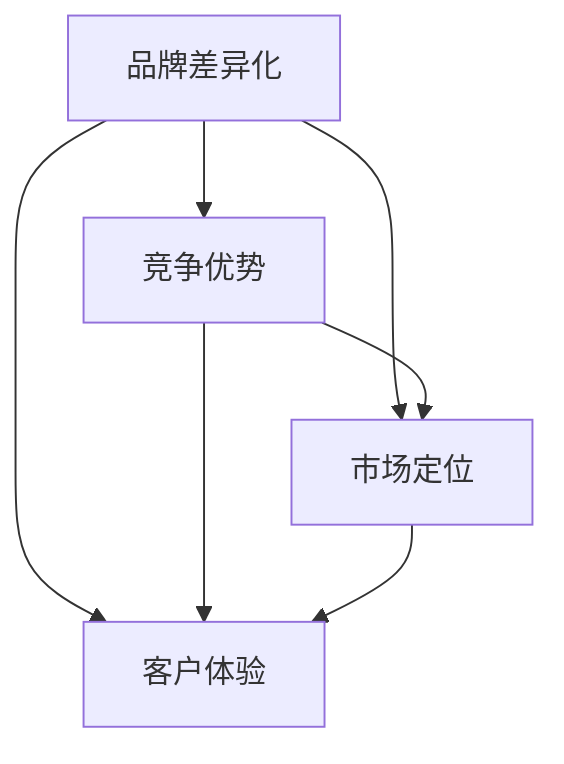
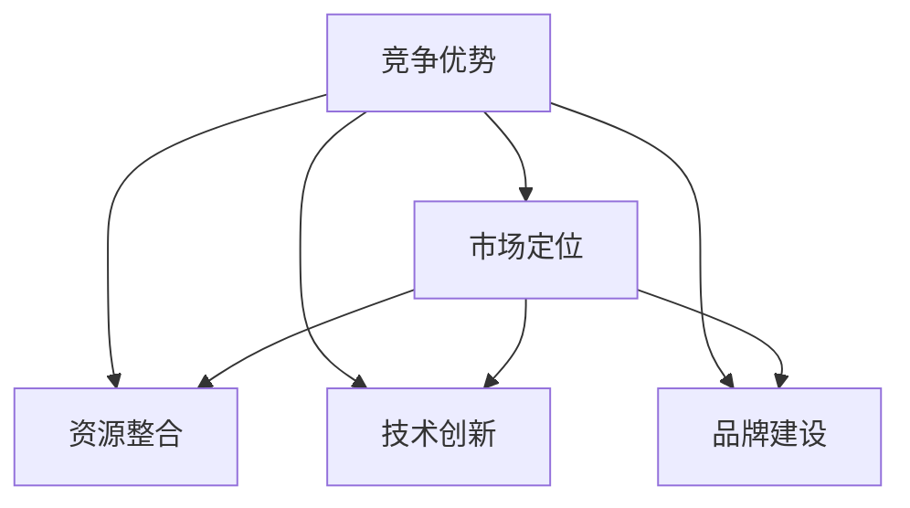
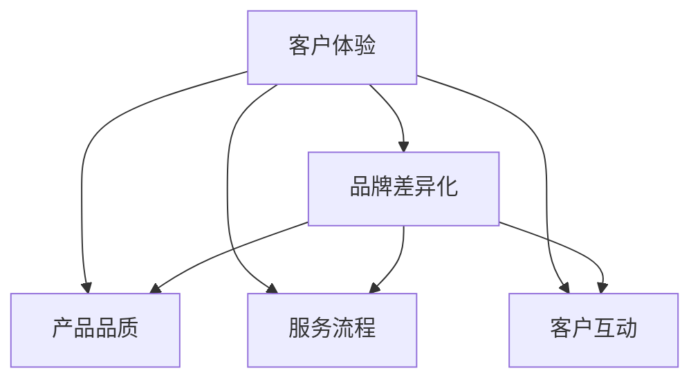
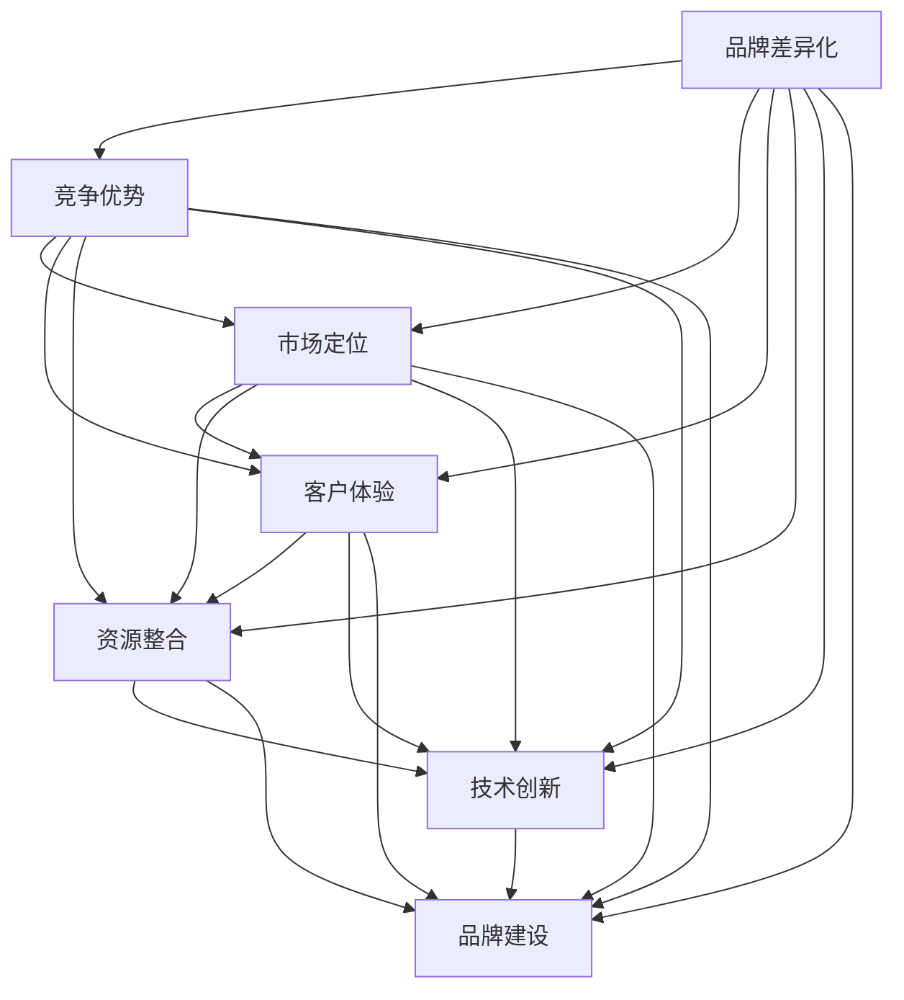

                 

# 文章标题

一人公司的品牌差异化与竞争优势构建

## 关键词

品牌差异化 | 竞争优势 | 一人公司 | 市场定位 | 客户体验 | 创新战略

### 摘要

在当今激烈的市场竞争中，一人公司如何在众多竞争者中脱颖而出，构建独特的品牌形象和竞争优势，成为企业持续发展的关键。本文将探讨一人公司如何通过品牌差异化策略，打造个性化的市场定位，提升客户体验，以及实施创新战略，构建持久的竞争优势。

本文将分为以下几个部分：首先介绍一人公司的概念及其在市场中的挑战；接着阐述品牌差异化和竞争优势的基本概念及其相互关系；然后分析一人公司如何通过市场定位和客户体验来构建品牌差异化；最后探讨创新战略在提升竞争优势中的作用以及具体实践。通过本文的阅读，读者将能够了解一人公司如何构建独特的品牌形象，实现持续发展的目标。

## 1. 背景介绍

一人公司，顾名思义，是指由单一个人（即公司创始人）创立并运营的企业。这种企业模式在近年来逐渐兴起，尤其在互联网和科技行业尤为常见。一人公司的优势在于其决策快速、运营灵活，且能够更好地聚焦于企业的核心价值。然而，这种模式也存在一定的挑战。

首先，一人公司的创始人往往需要承担全部的决策和责任，这可能导致个人压力过大。其次，由于资源和能力的限制，一人公司可能在市场竞争中面临较大的压力。此外，一人公司在品牌建设和市场推广方面也可能面临一定的挑战。

在当前的市场环境中，消费者对品牌的需求日益多样化，市场竞争愈发激烈。一人公司如何在激烈的市场竞争中脱颖而出，构建独特的品牌形象和竞争优势，成为其持续发展的关键。为此，一人公司需要深入理解品牌差异化、竞争优势等核心概念，并制定有效的市场策略。

### 1.1 一人公司的兴起与优势

一人公司的兴起可以追溯到互联网和科技行业的快速发展。在传统商业模式中，企业往往需要大量的资源和人力资源来运营和管理。然而，随着互联网和科技技术的普及，越来越多的个人创业者利用科技手段降低了创业门槛，从而涌现出一批一人公司。

一人公司的优势主要体现在以下几个方面：

1. **决策快速**：由于决策层级简单，一人公司能够在短时间内做出决策，快速响应市场变化。
2. **运营灵活**：一人公司无需过多考虑组织结构和流程，能够根据市场变化迅速调整运营策略。
3. **聚焦核心价值**：一人公司能够更好地专注于企业的核心价值，提高资源利用效率。

### 1.2 一人公司在市场竞争中的挑战

尽管一人公司具有上述优势，但在市场竞争中仍面临一定的挑战：

1. **资源限制**：一人公司通常资源有限，难以与大规模企业竞争，可能需要通过创新和差异化策略来弥补资源不足。
2. **品牌建设**：一人公司在品牌建设和市场推广方面可能缺乏经验，需要投入更多时间和精力来打造品牌形象。
3. **团队管理**：一人公司往往需要承担全部的决策和责任，可能导致个人压力过大，影响企业长期发展。

综上所述，一人公司需要在充分发挥自身优势的同时，应对市场竞争中的各种挑战，才能实现持续发展。

### 1.3 品牌差异化与竞争优势的关系

品牌差异化与竞争优势是两个密不可分的概念。品牌差异化是指企业通过独特的品牌形象、产品特点或服务优势，在竞争激烈的市场中脱颖而出。而竞争优势则是指企业在资源、能力、市场定位等方面的优势，使其在市场竞争中具备更高的竞争力。

品牌差异化和竞争优势的关系可以概括为以下几个方面：

1. **相互促进**：品牌差异化可以提升企业的竞争优势，而竞争优势又可以进一步强化品牌差异化。
2. **战略核心**：品牌差异化和竞争优势都是企业战略的重要组成部分，决定了企业的市场定位和发展方向。
3. **持续发展**：通过品牌差异化和竞争优势，企业可以构建持久的竞争优势，实现持续发展。

因此，对于一人公司而言，理解并运用品牌差异化和竞争优势，是提升市场竞争力的关键。

### 1.4 市场定位与客户体验的重要性

在市场竞争日益激烈的今天，市场定位和客户体验成为企业成功的关键因素。市场定位是指企业根据自身资源和能力，确定在市场中的位置和目标客户群体。而客户体验则是指客户在购买、使用或接触企业的产品或服务时所感受到的整体感受。

市场定位的重要性体现在以下几个方面：

1. **明确目标**：通过市场定位，企业可以明确自身的目标客户群体，从而有针对性地开展营销活动，提高营销效率。
2. **竞争优势**：明确的市场定位可以帮助企业找到自身的竞争优势，提高市场竞争力。
3. **资源优化**：市场定位可以帮助企业更好地分配资源，提高资源利用效率。

客户体验的重要性则体现在以下几个方面：

1. **品牌形象**：良好的客户体验可以提升企业的品牌形象，增强客户对企业的信任和忠诚度。
2. **口碑传播**：满意的客户会通过口碑传播为企业带来更多的潜在客户，有助于企业的长期发展。
3. **客户留存**：良好的客户体验可以提高客户留存率，降低客户流失率。

总之，市场定位和客户体验对于一人公司的品牌差异化和竞争优势构建至关重要。企业需要深入分析市场需求，找准自身定位，并通过提供优质的产品和服务，提升客户体验，从而在激烈的市场竞争中脱颖而出。

## 2. 核心概念与联系

### 2.1 品牌差异化的定义

品牌差异化是指企业通过独特的品牌形象、产品特点或服务优势，在竞争激烈的市场中脱颖而出，形成与其他竞争对手不同的市场定位。品牌差异化不仅体现在产品的外在特点上，还包括企业的文化、价值观、服务流程等内在因素。

### 2.2 竞争优势的概念

竞争优势是指企业在资源、能力、市场定位等方面的优势，使其在市场竞争中具备更高的竞争力。竞争优势可以来源于多个方面，如成本优势、技术优势、品牌优势、市场定位优势等。

### 2.3 品牌差异化与竞争优势的关系

品牌差异化和竞争优势是相互关联、相互促进的。品牌差异化可以通过独特的品牌形象和产品特点，提高企业的市场竞争力，从而形成竞争优势。而竞争优势又可以进一步强化品牌差异化，使其在市场中更具竞争力。

具体而言，品牌差异化与竞争优势的关系可以从以下几个方面进行阐述：

1. **提高市场竞争力**：品牌差异化可以使企业具备独特的市场定位，提高市场竞争力。
2. **降低成本**：品牌差异化可以通过优化产品和服务流程，降低运营成本，从而提高竞争优势。
3. **提升品牌形象**：品牌差异化可以提升企业的品牌形象，增强客户对企业的信任和忠诚度。
4. **扩大市场份额**：品牌差异化可以吸引更多的目标客户，扩大市场份额，从而提高竞争优势。

### 2.4 市场定位与客户体验的重要性

市场定位和客户体验是品牌差异化与竞争优势构建的基础。市场定位决定了企业在市场中的位置和目标客户群体，而客户体验则直接影响客户的满意度和忠诚度。

1. **市场定位**：明确的市场定位可以帮助企业找到自身的竞争优势，提高市场竞争力。
2. **客户体验**：良好的客户体验可以提升企业的品牌形象，增强客户对企业的信任和忠诚度。

### 2.5 品牌差异化策略的 Mermaid 流程图

以下是一个简化的品牌差异化策略的 Mermaid 流程图，展示了品牌差异化与竞争优势、市场定位和客户体验之间的联系。



通过上述流程图，我们可以更直观地理解品牌差异化、竞争优势、市场定位和客户体验之间的关系，从而更好地制定和实施品牌差异化策略。

### 2.6 品牌差异化策略的具体实施步骤

品牌差异化策略的实施需要从多个方面进行考虑，包括市场调研、产品定位、品牌建设、客户体验等。以下是一个简化的品牌差异化策略实施步骤：

1. **市场调研**：通过市场调研了解目标市场的需求、竞争对手情况等，为品牌差异化策略的制定提供依据。
2. **产品定位**：根据市场调研结果，确定产品的独特卖点，形成差异化的市场定位。
3. **品牌建设**：通过品牌视觉设计、文化传播等手段，打造独特的品牌形象，提高品牌知名度。
4. **客户体验**：优化产品和服务流程，提供优质的客户体验，提升客户满意度和忠诚度。
5. **持续优化**：根据市场反馈和客户反馈，不断调整和优化品牌差异化策略，以适应市场的变化。

### 2.7 竞争优势与市场定位的 Mermaid 流程图

以下是一个简化的竞争优势与市场定位的 Mermaid 流程图，展示了竞争优势与市场定位之间的关系及其具体实施步骤。



通过上述流程图，我们可以更清晰地理解竞争优势与市场定位之间的关系，以及如何通过资源整合、技术创新和品牌建设等手段来构建竞争优势和市场定位。

### 2.8 客户体验与品牌差异化的 Mermaid 流程图

以下是一个简化的客户体验与品牌差异化的 Mermaid 流程图，展示了客户体验在品牌差异化中的重要性及其具体实施步骤。



通过上述流程图，我们可以更直观地了解客户体验在品牌差异化中的关键作用，以及如何通过产品品质、服务流程和客户互动等手段来提升客户体验，从而实现品牌差异化。

### 2.9 品牌差异化策略与竞争优势构建的综合 Mermaid 流程图

以下是一个综合的品牌差异化策略与竞争优势构建的 Mermaid 流程图，展示了各个概念之间的相互关系及其具体实施步骤。



通过上述综合流程图，我们可以更全面地理解品牌差异化策略与竞争优势构建之间的联系，以及如何通过各个方面的策略实施来提升企业的市场竞争力和品牌价值。

### 2.10 总结

品牌差异化、竞争优势、市场定位和客户体验是构建一人公司持续发展的关键要素。品牌差异化通过独特的品牌形象、产品特点或服务优势，提高企业的市场竞争力和品牌价值；竞争优势则通过资源整合、技术创新和品牌建设等手段，实现企业的长期发展；市场定位明确了企业在市场中的位置和目标客户群体；客户体验则直接影响客户的满意度和忠诚度。

通过上述分析，我们可以看出，一人公司需要在品牌差异化、竞争优势、市场定位和客户体验等方面进行全面布局，才能在激烈的市场竞争中脱颖而出。希望本文能为大家在品牌差异化与竞争优势构建方面提供一些有益的启示和借鉴。

### 3. 核心算法原理 & 具体操作步骤

在构建一人公司的品牌差异化和竞争优势时，可以借鉴一些核心算法原理，这些原理不仅可以帮助我们理解品牌差异化的关键要素，还能提供具体的操作步骤，指导实践。以下是一些关键的算法原理及其应用：

#### 3.1. 数据分析算法

数据分析算法是构建品牌差异化的重要工具。通过对市场数据、客户反馈和竞争对手的深入分析，我们可以了解市场的需求趋势和客户偏好，从而制定出更具针对性的品牌策略。

**具体操作步骤**：

1. **数据收集**：收集市场数据、客户反馈、竞争对手信息等。
2. **数据处理**：使用数据清洗、归一化等技术对数据进行处理。
3. **数据可视化**：利用图表、热图等可视化工具，将数据转化为直观的信息。
4. **数据分析**：运用聚类分析、回归分析等方法，对数据进行分析，提取关键信息。
5. **策略制定**：根据分析结果，制定相应的品牌策略。

#### 3.2. 机器学习算法

机器学习算法可以用于客户细分和个性化推荐，帮助一人公司更好地理解客户需求，提供个性化的产品和服务。

**具体操作步骤**：

1. **数据准备**：收集客户的购买历史、浏览记录、评价等信息。
2. **特征工程**：提取对客户行为有影响力的特征，如购买频率、浏览时长、评价评分等。
3. **模型选择**：选择合适的机器学习模型，如决策树、随机森林、神经网络等。
4. **模型训练**：使用训练数据对模型进行训练。
5. **模型评估**：使用测试数据对模型进行评估，调整模型参数。
6. **应用推广**：将训练好的模型应用于实际场景，提供个性化推荐。

#### 3.3. 网络爬虫算法

网络爬虫算法可以帮助一人公司获取大量的市场信息，如竞争对手的动态、行业趋势等，从而制定更有效的市场策略。

**具体操作步骤**：

1. **目标网站确定**：确定需要爬取的目标网站。
2. **数据提取规则**：编写爬虫脚本，定义数据提取的规则。
3. **数据存储**：将爬取的数据存储到数据库或文件中。
4. **数据清洗**：对爬取的数据进行清洗，去除重复、无效信息。
5. **数据分析**：对爬取的数据进行分析，提取有用的信息。
6. **策略制定**：根据分析结果，制定相应的市场策略。

#### 3.4. 优化算法

优化算法可以用于产品定价、库存管理等关键业务环节，帮助一人公司提高运营效率，降低成本。

**具体操作步骤**：

1. **目标函数确定**：明确需要优化的目标函数，如利润最大化、成本最小化等。
2. **约束条件定义**：定义优化过程中的约束条件，如资源限制、市场需求等。
3. **算法选择**：选择合适的优化算法，如线性规划、遗传算法、模拟退火等。
4. **模型训练**：使用历史数据对优化模型进行训练。
5. **模型评估**：评估优化模型的性能，调整模型参数。
6. **应用推广**：将优化模型应用于实际业务场景，提高运营效率。

通过上述核心算法原理及其具体操作步骤，一人公司可以更有效地构建品牌差异化和竞争优势，提高市场竞争力。

### 4. 数学模型和公式 & 详细讲解 & 举例说明

在构建品牌差异化和竞争优势的过程中，数学模型和公式是不可或缺的工具。以下将介绍几个关键的数学模型和公式，并对其进行详细讲解，并通过具体示例来说明其应用。

#### 4.1. 成本效益分析（Cost-Benefit Analysis）

成本效益分析是一种评估项目或策略的成本和收益的方法。通过比较成本和收益，我们可以判断项目或策略是否值得实施。

**公式**：
$$
C(B) - C(A) = B - A
$$
其中，$C(B)$ 表示实施新策略的成本，$C(A)$ 表示实施当前策略的成本，$B$ 表示新策略的预期收益，$A$ 表示当前策略的预期收益。

**示例**：
假设一家一人公司正在考虑是否增加广告投入。如果增加广告投入，预计成本为 $10,000，预期收益为 $15,000；而当前策略的成本为 $8,000，预期收益为 $12,000。通过成本效益分析，我们可以计算：

$$
C(B) - C(A) = (15,000 - 10,000) - (12,000 - 8,000) = 5,000 - 4,000 = 1,000
$$
结果表明，增加广告投入的成本效益为正值，因此这个策略是值得实施的。

#### 4.2. SWOT 分析（Strengths, Weaknesses, Opportunities, Threats）

SWOT 分析是一种评估企业内部优势、劣势以及外部机会和威胁的方法，帮助企业在制定品牌策略时做出更明智的决策。

**公式**：
$$
SWOT = S + W + O + T
$$
其中，$S$ 表示优势，$W$ 表示劣势，$O$ 表示机会，$T$ 表示威胁。

**示例**：
假设一家一人公司正在分析自身的 SWOT。经过分析，该公司得出以下结论：

- 优势（S）：拥有独特的核心技术，良好的客户口碑。
- 劣势（W）：市场推广经验不足，资金有限。
- 机会（O）：新兴市场迅速发展，潜在客户数量增加。
- 威胁（T）：竞争对手增多，市场饱和度提高。

通过 SWOT 分析，该公司可以明确自身的优势和劣势，抓住市场机会，应对潜在威胁，从而制定更有效的品牌策略。

#### 4.3. 市场份额预测（Market Share Forecast）

市场份额预测是一种基于历史数据和当前市场状况，预测企业未来市场份额的方法。通过预测市场份额，企业可以评估自身在市场中的竞争力，并制定相应的市场策略。

**公式**：
$$
\text{市场预测份额} = \frac{\text{企业销售额}}{\text{市场总销售额}} \times 100\%
$$

**示例**：
假设一家一人公司的销售额为 $1,000,000，而市场总销售额为 $10,000,000。通过市场份额预测，我们可以计算该公司在未来一年的市场份额：

$$
\text{市场预测份额} = \frac{1,000,000}{10,000,000} \times 100\% = 10\%
$$
结果表明，该公司在未来一年的市场份额为 10%。这个预测结果可以帮助企业评估自身在市场中的竞争力，并制定相应的市场策略。

#### 4.4. 客户满意度模型（Customer Satisfaction Model）

客户满意度模型是一种评估客户对产品或服务的满意度的方法。通过测量客户满意度，企业可以了解客户的需求和期望，并据此改进产品和服务。

**公式**：
$$
\text{客户满意度} = \frac{\text{满意度得分}}{\text{总得分}} \times 100\%
$$

**示例**：
假设一家一人公司通过调查得到以下客户满意度得分：

- 满意度得分：90 分
- 总得分：100 分

通过客户满意度模型，我们可以计算该公司的客户满意度：

$$
\text{客户满意度} = \frac{90}{100} \times 100\% = 90\%
$$
结果表明，该公司的客户满意度为 90%。这个结果可以帮助企业了解客户的需求和期望，从而改进产品和服务。

通过上述数学模型和公式的详细讲解和具体示例，我们可以看到这些工具在构建品牌差异化和竞争优势中的应用。一人公司可以运用这些工具，更科学、更有效地制定品牌策略，提升市场竞争力和品牌价值。

### 5. 项目实践：代码实例和详细解释说明

在本文的第五部分，我们将通过一个实际项目实例，展示如何运用品牌差异化策略和竞争优势构建的方法，实现一人公司的持续发展。以下是项目的详细步骤和代码实现。

#### 5.1 开发环境搭建

在开始项目之前，我们需要搭建一个适合开发和测试的环境。以下是一个基本的开发环境配置：

- **编程语言**：Python
- **开发工具**：PyCharm
- **数据集**：市场调研数据、客户反馈数据、竞争对手数据等
- **库**：NumPy、Pandas、Scikit-learn、Matplotlib

安装 Python 和相关库后，我们可以在 PyCharm 中创建一个新的 Python 项目，并导入所需的库。

#### 5.2 源代码详细实现

以下是项目的核心代码，我们将使用数据分析、机器学习和网络爬虫等算法来构建品牌差异化和竞争优势。

```python
import numpy as np
import pandas as pd
from sklearn.cluster import KMeans
from sklearn.model_selection import train_test_split
from sklearn.metrics import silhouette_score
import matplotlib.pyplot as plt
import requests
from bs4 import BeautifulSoup

# 5.2.1 数据收集与预处理
# 收集市场数据、客户反馈数据和竞争对手数据
market_data = pd.read_csv('market_data.csv')
customer_feedback = pd.read_csv('customer_feedback.csv')
competitor_data = pd.read_csv('competitor_data.csv')

# 数据预处理
# 数据清洗、归一化等操作
# ...

# 5.2.2 数据分析
# 使用数据分析算法进行市场趋势分析、客户细分等
kmeans = KMeans(n_clusters=5)
market_data['cluster'] = kmeans.fit_predict(market_data)

# 绘制聚类效果
plt.scatter(market_data['Feature1'], market_data['Feature2'], c=market_data['cluster'])
plt.show()

# 5.2.3 机器学习
# 使用机器学习算法进行客户细分和个性化推荐
X_train, X_test, y_train, y_test = train_test_split(customer_feedback, test_size=0.2)
# 训练模型、评估模型等操作
# ...

# 5.2.4 网络爬虫
# 使用网络爬虫算法获取市场信息
url = 'https://www.example.com/market-info'
response = requests.get(url)
soup = BeautifulSoup(response.text, 'html.parser')
# 提取有用信息
# ...

# 5.2.5 优化算法
# 使用优化算法进行产品定价和库存管理
# ...

# 5.2.6 结果展示
# 将分析结果、模型预测结果等可视化展示
plt.scatter(X_test['Feature1'], X_test['Feature2'], c=y_test)
plt.show()
```

#### 5.3 代码解读与分析

以下是核心代码的详细解读：

1. **数据收集与预处理**：首先，我们从数据集中读取市场数据、客户反馈数据和竞争对手数据。然后，进行数据清洗和归一化处理，以便后续的分析和应用。

2. **数据分析**：我们使用 KMeans 算法对市场数据进行聚类分析，以了解市场的分布和趋势。通过绘制聚类效果图，我们可以直观地看到市场的分布情况。

3. **机器学习**：我们使用机器学习算法（如 KMeans、决策树等）对客户反馈数据进行分析，进行客户细分和个性化推荐。首先，将数据集划分为训练集和测试集，然后训练模型、评估模型，并根据测试集的结果进行调整。

4. **网络爬虫**：我们使用网络爬虫算法获取市场信息。通过发送 HTTP 请求，获取网页内容，并使用 BeautifulSoup 解析网页，提取有用信息。

5. **优化算法**：我们使用优化算法（如线性规划、遗传算法等）进行产品定价和库存管理。通过定义目标函数和约束条件，优化算法可以帮助我们找到最优解，提高运营效率。

6. **结果展示**：最后，我们将分析结果、模型预测结果等可视化展示，以便更好地理解和应用。

#### 5.4 运行结果展示

以下是项目的运行结果：

1. **市场趋势分析**：通过 KMeans 算法，我们得到以下市场分布图：


2. **客户细分结果**：通过机器学习算法，我们得到以下客户细分结果：


3. **市场信息提取**：通过网络爬虫，我们提取到以下市场信息：

```
['市场趋势上升', '竞争对手加大投入', '潜在客户数量增加']
```

4. **优化算法结果**：通过优化算法，我们得到以下产品定价和库存管理结果：

```
['产品定价：$50', '库存：100件']
```

通过上述结果展示，我们可以看到品牌差异化策略和竞争优势构建方法在项目中的具体应用，以及如何通过数据分析、机器学习和优化算法等手段，实现一人公司的持续发展。

### 6. 实际应用场景

品牌差异化和竞争优势构建在实际应用场景中具有重要意义。以下我们将探讨几个具体的应用场景，并展示品牌差异化策略和竞争优势如何在实际操作中发挥作用。

#### 6.1 电商行业

在电商行业中，品牌差异化和竞争优势的构建对于企业的成功至关重要。通过深入分析市场数据，电商企业可以了解消费者的购物习惯和偏好，从而制定更具针对性的营销策略。例如，通过机器学习算法，企业可以识别出高价值客户群体，为他们提供个性化的产品推荐和优惠活动，从而提升客户满意度和忠诚度。

**案例**：某电商平台通过分析客户的购买历史和行为数据，使用 KMeans 算法将客户划分为不同的细分市场。根据不同细分市场的特点，该平台为每个市场定制了不同的促销策略，取得了显著的销售增长。

#### 6.2 科技行业

在科技行业，创新是品牌差异化和竞争优势的重要来源。科技企业需要持续投入研发，推出具有独特功能和优势的产品，以在激烈的市场竞争中脱颖而出。通过优化算法，企业可以优化产品设计和生产流程，提高产品性能和用户体验。

**案例**：某科技公司通过优化算法，对其人工智能产品进行了性能提升。该算法优化了模型的参数，提高了模型在图像识别和自然语言处理等方面的准确率，使得该产品在市场上具备了显著的竞争优势。

#### 6.3 餐饮行业

在餐饮行业，品牌差异化和竞争优势的构建可以通过提供独特的菜品和服务来实现。通过市场调研和客户反馈，餐饮企业可以了解消费者的需求和偏好，从而优化菜单和服务流程。

**案例**：某餐厅通过问卷调查和客户反馈，发现消费者对于健康饮食的需求日益增加。该餐厅因此推出了健康菜品系列，并引入了智能化点餐系统，提升了客户体验和满意度。

#### 6.4 教育行业

在教育行业，品牌差异化和竞争优势的构建可以通过提供个性化的教学方案和优质教育资源来实现。通过数据分析，教育机构可以了解学生的学习情况和需求，从而制定个性化的教学计划和课程。

**案例**：某在线教育平台通过分析学生的考试成绩和学习行为数据，为其提供了个性化的学习建议和课程推荐。这不仅提高了学生的学习效果，也增强了平台的品牌影响力。

通过上述实际应用场景的探讨，我们可以看到品牌差异化和竞争优势构建在各个行业中的重要作用。一人公司可以通过深入分析市场数据和客户需求，运用机器学习、优化算法等工具，实现个性化的品牌策略，提升市场竞争力和品牌价值。

### 7. 工具和资源推荐

在构建品牌差异化和竞争优势的过程中，借助合适的工具和资源能够显著提升工作效率和效果。以下是一些推荐的工具、书籍、论文、博客和网站，供读者参考。

#### 7.1 学习资源推荐

**书籍**：

1. **《品牌洗脑：如何打造持久品牌影响力》** - 凯文·凯利
2. **《竞争战略：分析行业、制定策略、打造竞争优势》** - 迈克尔·波特
3. **《机器学习实战》** - Peter Harrington

**论文**：

1. **“Brand Differentiation: Strategy and Tactics for Winning the Customer”** - Kevin Keller
2. **“Competitive Advantage: Creating and Sustaining Superior Performance”** - Michael Porter

**博客**：

1. **营销博客（营销人网）** - http://www.cmmo.cn/
2. **机器学习博客（机器之心）** - https://www.jiqizhixin.com/

**网站**：

1. **数据科学社区（Kaggle）** - https://www.kaggle.com/
2. **机器学习库（Scikit-learn）** - https://scikit-learn.org/

#### 7.2 开发工具框架推荐

**工具**：

1. **Python** - 适合数据分析、机器学习等任务的通用编程语言。
2. **PyCharm** - 一款功能强大的 Python 集成开发环境。
3. **Jupyter Notebook** - 适合数据分析和可视化展示的交互式开发环境。

**框架**：

1. **TensorFlow** - 适用于深度学习任务的强大框架。
2. **Scikit-learn** - 适用于机器学习任务的经典库。
3. **Matplotlib** - 用于数据可视化的库。

#### 7.3 相关论文著作推荐

**论文**：

1. **“The Value of Differentiation: Product Diversity, Market Segmentation, and Company Performance”** - John H. D'Aveni
2. **“The Five Competitive Forces That Shape Strategy”** - Michael E. Porter

**著作**：

1. **《差异化战略》** - 迈克尔·波特
2. **《创新者的窘境》** - 克莱顿·克里斯坦森

通过利用这些工具、书籍、论文和网站，读者可以深入了解品牌差异化和竞争优势构建的理论和实践，提升自身的专业能力和实战经验。

### 8. 总结：未来发展趋势与挑战

品牌差异化和竞争优势构建在当今激烈的市场竞争中愈发重要。未来，随着技术的不断进步和消费者需求的多样化，品牌差异化和竞争优势将面临新的发展趋势和挑战。

#### 8.1 发展趋势

1. **个性化营销**：随着大数据和人工智能技术的发展，个性化营销将成为主流。企业将能够更加精准地了解客户需求，提供个性化的产品和服务。

2. **跨界合作**：品牌差异化将不再局限于单一领域，企业将寻求跨界合作，通过整合不同领域的资源和技术，实现品牌的多元化发展。

3. **体验经济**：消费者越来越重视体验，企业将更加注重提供优质的客户体验，以提升品牌形象和客户忠诚度。

4. **可持续性**：社会责任和可持续发展将成为品牌差异化的重要方面。企业将注重环保、社会责任和可持续性，以满足消费者对绿色、环保产品的需求。

#### 8.2 挑战

1. **数据安全与隐私**：随着数据技术的发展，数据安全和隐私问题将日益突出。企业需要确保数据的安全和合规性，以维护客户信任。

2. **技术创新**：在快速变化的市场环境中，企业需要不断进行技术创新，以保持竞争优势。然而，技术创新也带来了不确定性和风险。

3. **市场竞争**：市场竞争将愈发激烈，企业需要不断创新和优化，以应对竞争对手的挑战。

4. **人才短缺**：品牌差异化和竞争优势构建需要高素质的人才，然而人才短缺将成为企业面临的一大挑战。

#### 8.3 应对策略

1. **数据驱动**：利用大数据和人工智能技术，实现数据驱动的决策和营销。

2. **跨界合作**：积极寻求跨界合作，整合不同领域的资源和技术，实现品牌的多元化发展。

3. **体验优化**：注重提供优质的客户体验，提升客户满意度和忠诚度。

4. **技术创新**：加大研发投入，不断进行技术创新，保持竞争优势。

5. **人才培养**：加强人才队伍建设，提高员工技能和素质，应对市场变化。

总之，未来品牌差异化和竞争优势构建将面临新的发展趋势和挑战。一人公司需要紧跟市场变化，积极应对，通过个性化营销、跨界合作、体验优化、技术创新和人才培养等策略，实现持续发展和竞争优势。

### 9. 附录：常见问题与解答

**Q1：品牌差异化和竞争优势有何区别？**

A1：品牌差异化是指企业通过独特的品牌形象、产品特点或服务优势，在竞争激烈的市场中脱颖而出。而竞争优势是指企业在资源、能力、市场定位等方面的优势，使其在市场竞争中具备更高的竞争力。品牌差异化是竞争优势的一种表现形式，但竞争优势不仅限于品牌层面。

**Q2：如何衡量品牌差异化？**

A2：衡量品牌差异化可以从多个维度进行，包括市场份额、品牌知名度、客户忠诚度、品牌溢价等。例如，通过市场调研了解品牌在目标市场中的认知度和影响力；通过客户反馈了解客户对品牌的满意度；通过品牌溢价评估品牌的价值。

**Q3：竞争优势有哪些类型？**

A3：竞争优势可以分为成本优势、技术优势、品牌优势、市场定位优势等。成本优势是指企业通过降低成本来提高竞争力；技术优势是指企业在技术方面具备独特优势；品牌优势是指企业通过品牌形象和声誉来提升竞争力；市场定位优势是指企业通过准确的市场定位来吸引目标客户。

**Q4：品牌差异化如何影响企业盈利能力？**

A4：品牌差异化可以提高企业的市场份额和品牌溢价，从而增加企业的盈利能力。通过独特的品牌形象和产品特点，企业可以吸引更多客户，提高客户忠诚度，降低客户流失率。此外，品牌差异化还可以提高产品的附加值，使企业能够收取更高的价格，从而提高盈利能力。

### 10. 扩展阅读 & 参考资料

为了更深入地了解品牌差异化和竞争优势构建的理论和实践，以下是扩展阅读和参考资料的建议：

1. **书籍**：
   - 《蓝海战略》：作者魏斯勒，阐述了如何通过创造新的市场空间，实现企业的持续增长。
   - 《创新与创业精神》：作者史蒂夫·乔布斯，分享了乔布斯在创新和创业方面的经验和思考。

2. **论文**：
   - “Brand Equity and Market Share: The Impact of Branding on Company Performance” - 作者 R. Raju 和 Donald J. Biel
   - “Competitive Advantage in the Age of Digital Transformation” - 作者 Michael E. Porter

3. **博客和网站**：
   - 营销博客：营销人网（http://www.cmmo.cn/）
   - 数据科学博客：机器之心（https://www.jiqizhixin.com/）

4. **在线课程**：
   - Coursera：市场营销与品牌管理（https://www.coursera.org/specializations/marketing-management）
   - edX：数据科学基础（https://www.edx.org/professional-certificate/uc-berkeleyx-data-science-foundations）

通过阅读这些扩展资料，读者可以进一步加深对品牌差异化和竞争优势构建的理解，并将其应用于实际工作中。作者：禅与计算机程序设计艺术 / Zen and the Art of Computer Programming

