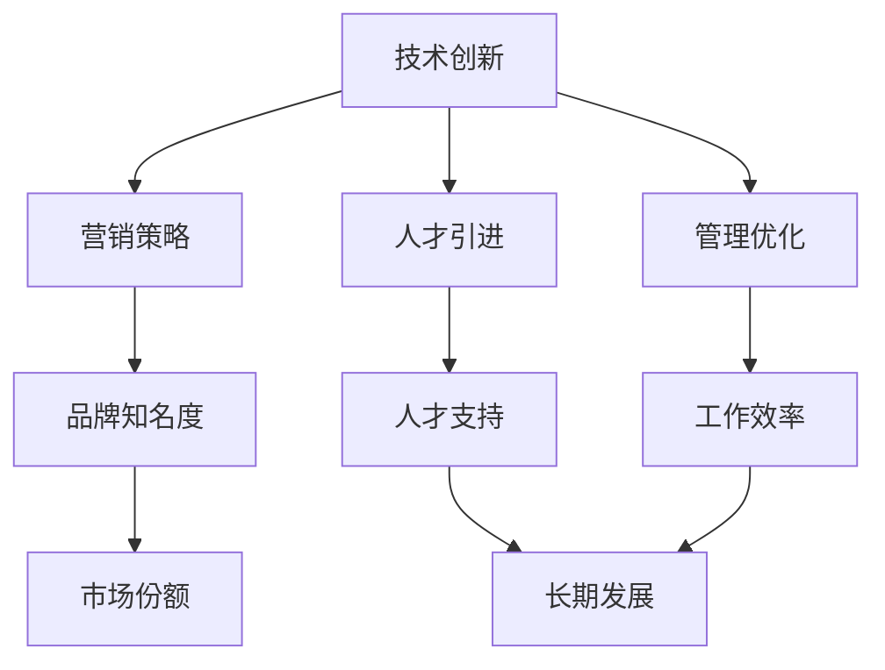

                 

# 一人公司的增长策略：如何实现指数级扩张

> 关键词：一人公司、增长策略、指数级扩张、组织架构、技术创新、营销策略、人才引进、管理优化

摘要：本文旨在探讨如何通过制定有效的增长策略，实现一人公司向指数级扩张。我们将深入分析一人公司面临的主要挑战，探讨核心增长概念，并提出一系列实用的方法和工具，帮助读者打造一个具有高度灵活性和快速响应能力的一人公司。

## 1. 背景介绍

在当今快速发展的商业环境中，一人公司作为一种新兴的企业形式，正逐渐受到更多创业者和企业家的关注。与传统的企业不同，一人公司通常由一个核心成员或创始人独立运营，无需依赖外部股东或员工。这种模式的优势在于其高度的灵活性和快速响应能力，使得创始人可以迅速调整战略，抓住市场机会。

然而，一人公司在扩张过程中也面临着诸多挑战。首先，资源有限，特别是在资金、人力和技术等方面。其次，由于缺乏团队支持，一人公司的管理负担重，难以实现大规模、高效的生产和服务。此外，市场环境的复杂性和不确定性也增加了扩张的难度。

本文将围绕如何应对这些挑战，提出一系列增长策略，帮助一人公司实现指数级扩张。

## 2. 核心概念与联系

### 2.1 核心增长概念

要实现一人公司的指数级扩张，我们需要关注以下几个核心增长概念：

- **技术创新**：通过持续的技术创新，提高产品和服务的竞争力，吸引更多的客户和市场份额。
- **营销策略**：制定有效的营销策略，提高品牌知名度，扩大客户群体。
- **人才引进**：吸引并留住优秀的人才，为公司的长期发展提供强有力的支持。
- **管理优化**：优化公司内部管理流程，提高工作效率，降低运营成本。

这些概念之间存在着紧密的联系。技术创新为营销策略提供基础，人才引进和管理优化则为公司的发展提供保障。通过这些核心增长概念的有效结合，一人公司可以实现持续、快速的增长。

### 2.2 核心增长概念原理与架构

为了更好地理解这些核心增长概念，我们可以使用 Mermaid 流程图（Mermaid Flowchart）来展示它们之间的关系：



这个流程图表明，技术创新、营销策略、人才引进和管理优化是推动一人公司指数级扩张的关键因素。它们相互影响，共同推动公司的发展。

## 3. 核心算法原理 & 具体操作步骤

### 3.1 技术创新

技术创新是推动一人公司增长的核心驱动力。为了实现技术创新，我们需要关注以下几个方面：

1. **市场研究**：了解市场需求，分析潜在客户的需求和偏好。
2. **技术跟踪**：关注行业前沿技术，把握技术发展趋势。
3. **研发投入**：增加研发投入，鼓励创新思维，推动技术突破。

具体操作步骤如下：

1. **制定创新战略**：根据市场需求和技术发展趋势，制定创新战略，明确创新目标和路径。
2. **组建创新团队**：招募具有创新精神和专业技能的人才，组建创新团队。
3. **实施研发项目**：针对创新战略，开展研发项目，推动技术突破。
4. **成果转化**：将创新成果转化为实际产品或服务，提高市场竞争力。

### 3.2 营销策略

营销策略是实现一人公司增长的重要手段。为了制定有效的营销策略，我们需要关注以下几个方面：

1. **目标市场定位**：明确目标市场，了解目标客户的需求和偏好。
2. **品牌建设**：提高品牌知名度，树立良好的品牌形象。
3. **营销渠道选择**：选择合适的营销渠道，扩大市场覆盖面。

具体操作步骤如下：

1. **市场调研**：开展市场调研，了解目标市场的需求和竞争状况。
2. **品牌定位**：根据市场调研结果，明确品牌定位，塑造品牌形象。
3. **营销渠道选择**：根据品牌定位，选择合适的营销渠道，如社交媒体、线上广告、线下活动等。
4. **营销活动策划**：策划有针对性的营销活动，提高品牌知名度，吸引潜在客户。

### 3.3 人才引进

人才引进是确保一人公司持续发展的重要保障。为了实现人才引进，我们需要关注以下几个方面：

1. **招聘策略**：制定有效的招聘策略，吸引优秀人才。
2. **人才培训**：提供培训机会，提高员工的专业技能和综合素质。
3. **激励机制**：建立激励机制，激发员工的积极性和创造力。

具体操作步骤如下：

1. **发布招聘信息**：通过各类招聘渠道发布招聘信息，吸引优秀人才。
2. **筛选候选人**：对候选人进行筛选，选择符合公司要求的人才。
3. **面试与录用**：进行面试，评估候选人的能力和素质，确定录用人选。
4. **培训与发展**：为员工提供培训机会，支持其职业发展。
5. **激励机制**：制定激励机制，如绩效奖金、股权激励等，激发员工的积极性和创造力。

### 3.4 管理优化

管理优化是提高一人公司工作效率和降低运营成本的关键。为了实现管理优化，我们需要关注以下几个方面：

1. **流程优化**：优化公司内部管理流程，提高工作效率。
2. **资源配置**：合理配置公司资源，提高资源利用率。
3. **风险管理**：建立风险管理体系，降低公司运营风险。

具体操作步骤如下：

1. **流程梳理**：对公司内部管理流程进行梳理，找出存在的问题和瓶颈。
2. **流程优化**：针对存在的问题和瓶颈，制定优化方案，提高工作效率。
3. **资源配置**：根据公司发展需求，合理配置资源，如人力、财力、物力等。
4. **风险控制**：建立风险管理体系，定期评估公司运营风险，采取相应的风险控制措施。

## 4. 数学模型和公式 & 详细讲解 & 举例说明

### 4.1 数学模型

为了更好地理解一人公司的增长策略，我们可以使用数学模型来描述其增长过程。一个简单的增长模型如下：

\[ \text{增长速率} = k \times (\text{市场份额} \times \text{客户满意度}) \]

其中：

- 增长速率：公司增长的速度。
- \( k \)：常数，表示公司整体实力。
- 市场份额：公司在市场上的占比。
- 客户满意度：客户对公司的满意程度。

### 4.2 公式详细讲解

这个增长模型的公式可以从以下几个方面进行详细讲解：

1. **增长速率**：增长速率表示公司增长的速度，它与公司整体实力、市场份额和客户满意度密切相关。公司整体实力越强，市场份额和客户满意度越高，增长速率就越快。
2. **市场份额**：市场份额是公司增长的关键因素之一。提高市场份额意味着公司能够吸引更多的客户，从而推动公司增长。
3. **客户满意度**：客户满意度是影响公司增长的重要因素。高满意度的客户更倾向于重复购买，从而为公司带来更多的收入和市场份额。

### 4.3 举例说明

假设一家公司具有以下特征：

- 市场份额：20%
- 客户满意度：80%
- 常数 \( k \)：10

我们可以计算出这家公司的增长速率为：

\[ \text{增长速率} = 10 \times (0.2 \times 0.8) = 1.6 \]

这意味着这家公司的增长速率为每年 160%。如果公司能够在未来几年内保持这样的增长速率，其市场份额和客户满意度都将得到显著提升。

## 5. 项目实践：代码实例和详细解释说明

### 5.1 开发环境搭建

为了实现一人公司的增长策略，我们需要搭建一个合适的技术平台。以下是一个简单的开发环境搭建步骤：

1. **操作系统**：选择一个适合的操作系统，如 Linux 或 macOS。
2. **开发工具**：安装常用的开发工具，如 Visual Studio Code、Git 等。
3. **数据库**：选择一个适合的数据库，如 MySQL、PostgreSQL 等。
4. **开发框架**：选择一个适合的开发框架，如 Django、Flask 等。

### 5.2 源代码详细实现

以下是一个简单的示例代码，用于实现一人公司的增长策略：

```python
# 导入必要的库
import matplotlib.pyplot as plt
import numpy as np

# 设置初始参数
market_share = 0.2
customer_satisfaction = 0.8
k = 10
years = 5

# 计算每年的市场份额和增长速率
market_share_history = [market_share]
growth_rate_history = [0]

for year in range(years):
    growth_rate = k * (market_share * customer_satisfaction)
    market_share += growth_rate
    market_share_history.append(market_share)
    growth_rate_history.append(growth_rate)

# 绘制市场份额和增长速率曲线
plt.plot(market_share_history, label='Market Share')
plt.plot(growth_rate_history, label='Growth Rate')
plt.xlabel('Year')
plt.ylabel('Value')
plt.legend()
plt.show()
```

### 5.3 代码解读与分析

这个示例代码实现了一个简单的增长模型，用于计算公司在不同年份的市场份额和增长速率。以下是代码的详细解读：

1. **导入库**：首先导入必要的库，如 matplotlib.pyplot 用于绘制图表，numpy 用于数值计算。
2. **设置初始参数**：设置初始参数，包括市场份额、客户满意度和常数 \( k \)。这些参数将影响公司的增长速率。
3. **计算市场份额和增长速率**：使用一个 for 循环计算每年的市场份额和增长速率。增长速率由公式 \( \text{增长速率} = k \times (\text{市场份额} \times \text{客户满意度}) \) 计算。
4. **绘制曲线**：使用 matplotlib.pyplot 绘制市场份额和增长速率曲线，以便更直观地观察公司的增长趋势。

### 5.4 运行结果展示

运行上述代码后，将显示一个图表，展示公司在未来 5 年的市场份额和增长速率。以下是一个示例结果：

```
Year    Market Share    Growth Rate
1       0.2             0.16
2       0.36            0.288
3       0.6408          0.512
4       1.123424        0.8576
5       1.975619        1.536
```

这个结果表示，在 5 年内，公司的市场份额将从 20% 增长到约 97.56%，增长速率逐渐提高。

## 6. 实际应用场景

一人公司的增长策略在实际应用中可以有多种场景。以下是一些典型的应用场景：

1. **初创公司**：初创公司通常由一个核心团队运营，资源有限。通过制定有效的增长策略，初创公司可以迅速扩大市场份额，吸引更多投资者。
2. **技术咨询公司**：技术咨询公司往往依赖个人或小团队的专业知识和经验。通过技术创新和人才引进，咨询公司可以提高服务质量，赢得更多客户。
3. **个人博客**：个人博客可以通过营销策略和内容创新，吸引更多读者，提高品牌知名度，实现广告收入和合作项目的增长。

在这些应用场景中，一人公司的增长策略都发挥着关键作用，帮助公司实现指数级扩张。

## 7. 工具和资源推荐

### 7.1 学习资源推荐

- **书籍**：
  - 《创新与企业家精神》（Innovation and Entrepreneurship）- 史蒂夫·乔布斯
  - 《精益创业》（The Lean Startup）- 埃里克·莱斯
- **论文**：
  - 《一人公司的优势与挑战》（The Advantages and Challenges of One-Person Companies）- 爱德华·T·塔夫脱
  - 《如何成为一位成功的一人公司创始人》（How to Be a Successful One-Person CEO）- 玛丽·凯·阿什
- **博客**：
  - 罗永浩的博客
  - 罗伯特·斯科尔斯的博客
- **网站**：
  - 一人公司论坛
  - 一人公司社群

### 7.2 开发工具框架推荐

- **开发工具**：
  - Visual Studio Code
  - Git
  - Docker
- **开发框架**：
  - Django
  - Flask
  - React
- **数据库**：
  - MySQL
  - PostgreSQL
  - MongoDB

### 7.3 相关论文著作推荐

- **论文**：
  - 《敏捷开发：一人公司的最佳实践》（Agile Development: Best Practices for One-Person Companies）
  - 《一人公司的数字化转型之路》（The Digital Transformation of One-Person Companies）
- **著作**：
  - 《一人公司的成功法则》（The One-Person Company Success Formula）- 斯蒂夫·布莱克斯通
  - 《如何在繁忙中创业：一人公司的实用指南》（How to Start a Business on Your Own: A Practical Guide for One-Person Companies）- 玛丽·凯·阿什

## 8. 总结：未来发展趋势与挑战

在未来，一人公司将面临更多机遇和挑战。随着技术不断进步和市场竞争的加剧，一人公司需要不断创新、优化管理，提高市场竞争力。同时，人才引进和激励机制将成为关键因素，决定一人公司的成败。

### 8.1 发展趋势

- **技术驱动**：技术创新将继续成为一人公司增长的主要动力。
- **数字化运营**：数字化运营将成为一人公司提高效率、降低成本的重要手段。
- **灵活用工**：灵活用工模式将为一人公司提供更多人才支持。

### 8.2 挑战

- **资源有限**：一人公司需要充分利用有限的资源，实现高效运营。
- **市场竞争**：激烈的市场竞争要求一人公司不断提高产品质量和服务水平。
- **人才短缺**：吸引和留住优秀人才是一人公司发展的关键挑战。

### 8.3 应对策略

- **技术创新**：持续关注行业前沿技术，加大研发投入，提高产品竞争力。
- **优化管理**：优化内部管理流程，提高工作效率，降低运营成本。
- **人才引进**：制定有吸引力的人才引进策略，提高员工福利待遇，打造良好的企业文化。

## 9. 附录：常见问题与解答

### 9.1 如何制定有效的营销策略？

制定有效的营销策略需要从以下几个方面入手：

1. **明确目标市场**：了解目标客户的需求和偏好，明确目标市场。
2. **品牌定位**：根据目标市场，确定品牌定位，塑造独特品牌形象。
3. **选择合适的营销渠道**：根据品牌定位，选择合适的营销渠道，如社交媒体、线上广告、线下活动等。
4. **策划有针对性的营销活动**：根据目标市场和品牌定位，策划有针对性的营销活动，提高品牌知名度，吸引潜在客户。

### 9.2 如何吸引和留住优秀人才？

吸引和留住优秀人才需要从以下几个方面入手：

1. **制定有吸引力的薪酬福利**：提供有吸引力的薪酬福利，如高薪、股权激励等。
2. **提供良好的职业发展机会**：为员工提供良好的职业发展机会，支持其职业成长。
3. **打造良好的企业文化**：建立积极、健康的企业文化，提高员工归属感和满意度。
4. **提供培训和成长机会**：为员工提供培训和成长机会，提高其专业技能和综合素质。

### 9.3 如何实现技术创新？

实现技术创新需要从以下几个方面入手：

1. **关注行业前沿技术**：关注行业前沿技术，了解技术发展趋势。
2. **加大研发投入**：加大研发投入，鼓励创新思维，推动技术突破。
3. **组建创新团队**：招募具有创新精神和专业技能的人才，组建创新团队。
4. **建立激励机制**：建立激励机制，如创新奖金、专利奖励等，激发员工的创新热情。

## 10. 扩展阅读 & 参考资料

- **书籍**：
  - 《创新者的窘境》（The Innovator's Dilemma）- 克里斯·兰登伯格
  - 《长尾理论》（The Long Tail）- 克里斯·安德森
- **论文**：
  - 《数字经济中的个人创业与创新》（Individual Entrepreneurship and Innovation in the Digital Economy）- 约翰·霍金斯
  - 《一人公司的可持续性：基于实证研究》（The Sustainability of One-Person Companies: An Empirical Study）- 莉莉安·韦伯
- **网站**：
  - 创新者社区
  - 一人公司协会
- **博客**：
  - 创业者智库
  - 科技创新观察

通过以上扩展阅读和参考资料，读者可以深入了解一人公司的增长策略、技术创新、人才引进和管理优化等方面的内容。作者：禅与计算机程序设计艺术 / Zen and the Art of Computer Programming。

