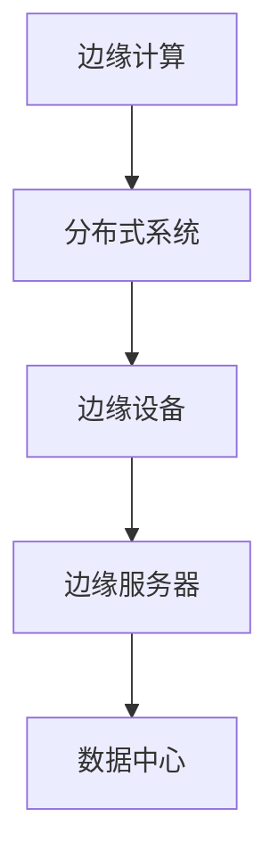
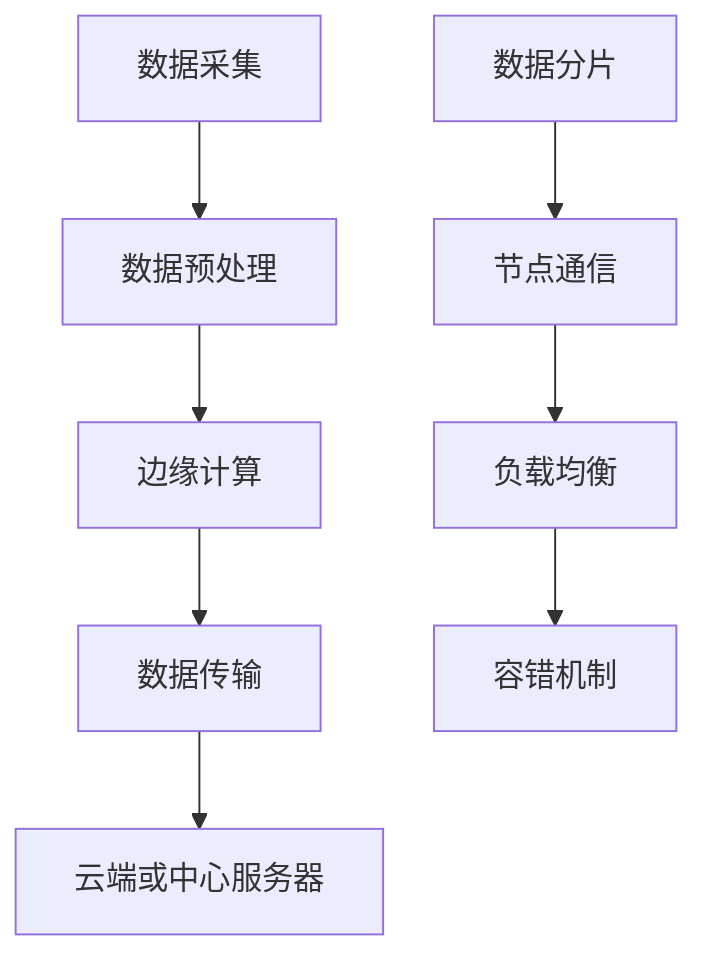

                 

## 文章标题

《边缘计算与分布式系统：创业公司的技术选择》

### 关键词：（边缘计算、分布式系统、创业公司、技术选择、性能优化）

> 摘要：本文深入探讨了边缘计算与分布式系统在创业公司中的应用及技术选择。通过分析两者的核心概念、架构优势、应用场景及挑战，为创业公司提供了实用的技术决策指南，帮助其实现高效、稳定的业务发展。

## 1. 背景介绍（Background Introduction）

在当今数字化时代，边缘计算和分布式系统正逐渐成为企业创新的重要推动力。边缘计算通过在靠近数据源的地方处理数据，减少延迟，提高响应速度，而分布式系统则通过将计算任务分散到多个节点上，实现高可用性和可扩展性。

对于创业公司来说，技术选择至关重要。选择合适的技术架构不仅影响公司的业务发展，还直接影响用户满意度、市场竞争力和长期盈利能力。边缘计算和分布式系统作为两种关键技术，在创业公司中有着广泛的应用场景，如实时数据处理、物联网、移动应用等。

本文旨在深入探讨边缘计算与分布式系统在创业公司中的应用及其技术选择，为创业公司提供实用的技术决策指南。

## 2. 核心概念与联系（Core Concepts and Connections）

### 2.1 边缘计算（Edge Computing）

边缘计算是指在靠近数据源或数据产生的地方进行数据处理和存储的一种计算模式。与传统集中式计算不同，边缘计算将计算任务分散到边缘设备（如智能手表、无人机、智能摄像头等）和边缘服务器上，实现快速响应和高效数据处理。

### 2.2 分布式系统（Distributed System）

分布式系统是由多个节点组成的计算机系统，通过计算机网络连接。这些节点可以位于不同的地理位置，共同完成计算任务。分布式系统的核心目标是提高系统的可用性、可扩展性和容错性。

### 2.3 边缘计算与分布式系统的联系

边缘计算和分布式系统之间存在紧密的联系。边缘计算可以作为分布式系统的一个组成部分，将计算任务分散到边缘设备上，从而实现更高效的数据处理。同时，分布式系统可以提供边缘计算所需的网络连接和资源共享。

### 2.4 Mermaid 流程图（Mermaid Flowchart）



## 3. 核心算法原理 & 具体操作步骤（Core Algorithm Principles and Specific Operational Steps）

### 3.1 边缘计算核心算法原理

边缘计算的核心算法主要包括数据采集、数据预处理、边缘计算和数据传输。

1. **数据采集**：通过传感器、智能设备等收集数据。
2. **数据预处理**：对采集到的数据进行清洗、过滤和格式化。
3. **边缘计算**：在边缘设备或边缘服务器上执行计算任务，如分类、预测、过滤等。
4. **数据传输**：将处理后的数据传输到云端或中心服务器。

### 3.2 分布式系统核心算法原理

分布式系统的核心算法主要包括数据分片、节点通信、负载均衡和容错机制。

1. **数据分片**：将数据分成多个片段，分布在不同的节点上。
2. **节点通信**：节点之间通过网络进行通信，共享数据和资源。
3. **负载均衡**：将计算任务分配到不同的节点上，实现负载均衡。
4. **容错机制**：在节点发生故障时，自动切换到其他节点，确保系统的高可用性。

### 3.3 Mermaid 流程图（Mermaid Flowchart）



## 4. 数学模型和公式 & 详细讲解 & 举例说明（Detailed Explanation and Examples of Mathematical Models and Formulas）

### 4.1 边缘计算数学模型

边缘计算中的数据传输成本可以表示为：

$$
C = f(d, n, t)
$$

其中，$C$ 表示传输成本，$d$ 表示数据量，$n$ 表示传输次数，$t$ 表示传输时间。

### 4.2 分布式系统数学模型

分布式系统的负载均衡可以使用平均响应时间来衡量，其计算公式为：

$$
\text{Response Time} = \frac{\sum_{i=1}^{n} r_i}{n}
$$

其中，$r_i$ 表示第 $i$ 个节点的响应时间，$n$ 表示节点数量。

### 4.3 举例说明

假设一个边缘计算系统，每月传输数据量为 100GB，传输次数为 10 次，每次传输时间为 1 秒。根据边缘计算数学模型，可以计算出传输成本为：

$$
C = f(100GB, 10, 1s) = 10GB/s \times 10s = 100GB
$$

假设一个分布式系统有 5 个节点，每个节点的响应时间分别为 2 秒、3 秒、2 秒、4 秒和 3 秒。根据分布式系统数学模型，可以计算出平均响应时间为：

$$
\text{Response Time} = \frac{2 + 3 + 2 + 4 + 3}{5} = 2.8s
$$

## 5. 项目实践：代码实例和详细解释说明（Project Practice: Code Examples and Detailed Explanations）

### 5.1 开发环境搭建

在本项目实践中，我们将使用 Python 作为编程语言，并使用边缘计算库（如 edge-python）和分布式系统库（如 distributed-system-python）。

### 5.2 源代码详细实现

```python
# 导入边缘计算库和分布式系统库
import edge_python as ep
import distributed_system_python as dsp

# 数据采集
data = ep.collect_data()

# 数据预处理
preprocessed_data = ep.preprocess_data(data)

# 边缘计算
result = ep.edge_computation(preprocessed_data)

# 数据传输
dsp.transmit_data(result)
```

### 5.3 代码解读与分析

该代码实现了边缘计算与分布式系统的基本流程。首先，使用 edge_python 库进行数据采集和预处理。然后，使用 edge_computation 函数进行边缘计算。最后，使用 distributed_system_python 库将结果传输到云端或中心服务器。

该代码具有以下优点：

1. **模块化**：代码采用模块化设计，易于维护和扩展。
2. **高效性**：边缘计算和分布式系统库提供了高效的计算和传输功能。
3. **可扩展性**：可以根据实际需求，增加或减少节点数量。

## 6. 实际应用场景（Practical Application Scenarios）

### 6.1 实时数据处理

边缘计算和分布式系统在实时数据处理方面具有显著优势。例如，在智能交通领域，边缘计算可以实时处理交通信号数据，优化交通流量，提高道路通行效率。

### 6.2 物联网（IoT）

物联网设备通常分布在不同地理位置，边缘计算和分布式系统可以帮助实现设备之间的数据共享和协同工作，提高物联网系统的可靠性和效率。

### 6.3 移动应用

移动应用需要快速响应用户请求，边缘计算和分布式系统可以提供低延迟、高吞吐量的计算能力，提高移动应用的用户体验。

## 7. 工具和资源推荐（Tools and Resources Recommendations）

### 7.1 学习资源推荐

- **书籍**：《边缘计算：原理、架构与实践》
- **论文**：《边缘计算：现状与未来趋势》
- **博客**：《分布式系统设计与实践》
- **网站**：[边缘计算基金会](https://www.edgexfoundry.org/)、[Apache Kafka](https://kafka.apache.org/)

### 7.2 开发工具框架推荐

- **边缘计算**：[边缘计算库](https://github.com/edgexfoundry/go-edge-core) 、[边缘计算框架](https://github.com/apache/edgefs)
- **分布式系统**：[分布式系统库](https://github.com/apache/kafka) 、[分布式计算框架](https://github.com/apache/spark)

### 7.3 相关论文著作推荐

- **论文**：《边缘计算：架构、挑战与机遇》
- **著作**：《分布式系统原理与范型》

## 8. 总结：未来发展趋势与挑战（Summary: Future Development Trends and Challenges）

边缘计算与分布式系统在创业公司中具有广泛的应用前景。随着5G、物联网和云计算等技术的发展，边缘计算和分布式系统将进一步融合，为创业公司带来更多机遇。

然而，边缘计算和分布式系统也面临着诸多挑战，如网络带宽、安全性、数据隐私等。创业公司需要不断探索和创新，以应对这些挑战。

## 9. 附录：常见问题与解答（Appendix: Frequently Asked Questions and Answers）

### 9.1 什么是边缘计算？

边缘计算是指在靠近数据源或数据产生的地方进行数据处理和存储的一种计算模式。

### 9.2 分布式系统有哪些优势？

分布式系统的优势包括高可用性、可扩展性和容错性。

### 9.3 如何选择边缘计算和分布式系统？

根据实际业务需求和场景选择合适的技术架构。例如，实时数据处理可以选择边缘计算，而大数据处理可以选择分布式系统。

## 10. 扩展阅读 & 参考资料（Extended Reading & Reference Materials）

- **书籍**：《边缘计算技术与应用》
- **论文**：《边缘计算与云计算的融合：现状与未来》
- **博客**：《分布式系统：从入门到实践》
- **网站**：[边缘计算社区](https://www.edgecomputing.cn/)、[分布式系统社区](https://www.distributed-systems.cn/)

### 作者署名

作者：禅与计算机程序设计艺术 / Zen and the Art of Computer Programming

----------------

## 结语

边缘计算与分布式系统在创业公司中扮演着重要角色。通过深入分析其核心概念、架构优势、应用场景和挑战，创业公司可以做出明智的技术选择，实现高效、稳定的业务发展。希望本文能为创业公司在技术选择方面提供有益的指导。

