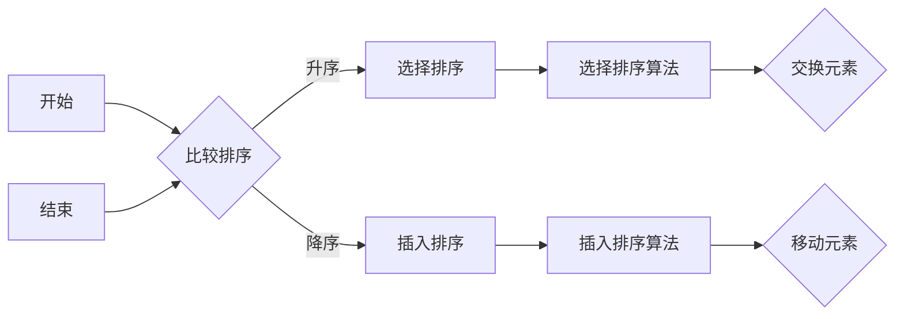

                 

### 背景介绍（Background Introduction）

在当今数字化时代，算法在计算机科学、人工智能和软件开发中扮演着至关重要的角色。随着技术的不断进步，算法的复杂性和应用范围也日益扩大。对于众多求职者来说，特别是应届毕业生，掌握算法的核心原理和解决实际问题的能力成为了他们进入顶尖企业的重要竞争力。阿里巴巴作为全球领先的互联网公司，其校招面试算法题库成为了众多求职者备考的重要资料。

本文将全面解析《2024阿里巴巴校招面试算法题库大全》，通过深入剖析其中的核心算法原理、具体操作步骤、数学模型以及实际应用场景，帮助读者更好地理解和掌握这些算法知识，从而提高在面试中的竞争力。文章将分为以下几个部分：

1. **背景介绍**：简要介绍算法在当今数字化时代的重要性以及阿里巴巴校招面试算法题库的背景。
2. **核心概念与联系**：详细阐述算法的核心概念和它们之间的联系，并使用Mermaid流程图进行展示。
3. **核心算法原理 & 具体操作步骤**：分析各个算法的基本原理，并逐步讲解操作步骤。
4. **数学模型和公式 & 详细讲解 & 举例说明**：解析算法中的数学模型和公式，并通过实例进行详细讲解。
5. **项目实践：代码实例和详细解释说明**：提供实际代码实例，详细解读代码实现过程。
6. **实际应用场景**：探讨这些算法在实际开发中的应用场景和案例。
7. **工具和资源推荐**：推荐相关的学习资源和开发工具。
8. **总结：未来发展趋势与挑战**：总结文章内容，预测未来发展趋势和面临的挑战。
9. **附录：常见问题与解答**：解答读者可能遇到的问题。
10. **扩展阅读 & 参考资料**：提供更多的扩展阅读和参考资料。

通过这篇文章，我们希望能够帮助读者全面掌握阿里巴巴校招面试算法题库中的核心知识，提高算法思维和解决问题的能力，为未来的职业发展打下坚实的基础。接下来，我们将深入探讨这些算法的内在逻辑和应用技巧。

-----------------------

## 2. 核心概念与联系（Core Concepts and Connections）

在阿里巴巴校招面试算法题库中，涉及了众多经典的算法问题，这些问题的解决依赖于对核心概念和它们之间联系的理解。以下是一些关键概念及其相互关系：

### 2.1 数据结构与算法

数据结构是计算机存储数据的方式，算法则是解决问题的步骤。二者密不可分，良好的数据结构选择可以显著提高算法的效率。例如，链表和数组是基本的数据结构，而树和图则更为复杂。算法与数据结构之间的联系体现在如何利用数据结构优化算法，例如二分查找在有序数组中的应用。

### 2.2 动态规划

动态规划是一种解决最优子结构问题的算法思想。它通过将复杂问题分解为更简单的子问题，并存储这些子问题的解，避免重复计算。动态规划的核心在于状态转移方程的建立，它描述了状态之间的关系。

### 2.3 贪心算法

贪心算法是一种在每一步选择当前最优解的算法。虽然贪心算法不保证全局最优解，但在许多情况下，它能够快速得到近似最优解。例如，贪心选择算法在背包问题中的应用。

### 2.4 回溯算法

回溯算法通过递归尝试所有可能的解决方案，然后回溯到上一步骤，继续尝试其他可能性。回溯算法适用于组合问题和排列问题，如八皇后问题和子集问题。

### 2.5 分治算法

分治算法将复杂问题分解为若干个规模较小的同类问题，分别解决，再合并结果。分治算法的基本步骤包括分解、递归解决子问题、合并子问题的解。例如，快速排序和归并排序都是分治算法的典型应用。

### 2.6 算法复杂度

算法复杂度是衡量算法性能的重要指标，包括时间复杂度和空间复杂度。时间复杂度描述了算法执行时间与输入数据规模之间的关系，而空间复杂度描述了算法所需存储空间与输入数据规模之间的关系。理解算法复杂度有助于评估算法的效率。

### 2.7 Mermaid 流程图

为了更直观地展示算法的概念和流程，我们可以使用Mermaid流程图来描述。以下是一个简单的Mermaid流程图示例，展示了排序算法的基本步骤：



通过上述核心概念的介绍和Mermaid流程图的展示，我们可以更好地理解算法题库中的问题，为后续的详细解析打下基础。接下来，我们将深入探讨核心算法原理及其具体操作步骤。

-----------------------

## 3. 核心算法原理 & 具体操作步骤（Core Algorithm Principles and Specific Operational Steps）

在《2024阿里巴巴校招面试算法题库大全》中，涉及了多种经典算法，这些算法在计算机科学中有着广泛的应用。以下将详细解析几个核心算法的原理和操作步骤，帮助读者深入理解并掌握这些算法。

### 3.1 快速排序（Quick Sort）

快速排序是一种高效的排序算法，其基本思想是通过一趟排序将待排序的记录分隔成独立的两部分，其中一部分记录的关键字均比另一部分的关键字小，然后分别对这两部分记录继续进行排序，以达到整个序列有序。以下是快速排序的原理和具体操作步骤：

**原理**：
1. 选择一个基准元素（pivot），通常选择序列的第一个元素。
2. 将其他元素按照与基准元素的大小关系进行分区，小于基准元素的放在基准元素前面，大于基准元素的放在基准元素后面。
3. 对分区后的两部分子序列递归地使用快速排序算法。

**操作步骤**：
1. 选择基准元素：选择第一个元素作为基准。
2. 分区：从序列头部开始，将小于基准的元素移动到基准前面，大于基准的元素移动到基准后面。
3. 递归排序：对分区后的左右两部分序列分别递归执行上述步骤。

```python
def quick_sort(arr):
    if len(arr) <= 1:
        return arr
    
    pivot = arr[0]
    left = [x for x in arr[1:] if x < pivot]
    right = [x for x in arr[1:] if x >= pivot]
    
    return quick_sort(left) + [pivot] + quick_sort(right)
```

### 3.2 动态规划（Dynamic Programming）

动态规划是一种用于解决最优化问题的算法策略，它通过将复杂问题分解为更简单的子问题，并存储子问题的解，避免重复计算，从而实现高效求解。以下是一个典型的动态规划问题——斐波那契数列的求解：

**原理**：
1. 定义状态：定义一个状态数组，用于存储子问题的解。
2. 状态转移方程：根据状态之间的关系，建立状态转移方程。
3. 边界条件：确定状态转移的边界条件。
4. 求解：从边界条件开始，利用状态转移方程逐步求解。

**操作步骤**：
1. 定义状态：设`dp[i]`为第`i`个斐波那契数。
2. 状态转移方程：`dp[i] = dp[i-1] + dp[i-2]`。
3. 边界条件：`dp[0] = 0`，`dp[1] = 1`。
4. 求解：利用状态转移方程计算`dp[n]`。

```python
def fibonacci(n):
    if n <= 1:
        return n
    dp = [0] * (n + 1)
    dp[0], dp[1] = 0, 1
    for i in range(2, n + 1):
        dp[i] = dp[i-1] + dp[i-2]
    return dp[n]
```

### 3.3 贪心算法（Greedy Algorithm）

贪心算法通过在每一步选择当前最优解，以期望得到全局最优解。以下是一个典型的贪心算法问题——背包问题的求解：

**原理**：
1. 定义选择策略：选择能够放入背包的最大价值物品。
2. 选择过程：在当前状态下，选择最优解，然后更新状态。

**操作步骤**：
1. 定义背包容量和物品列表。
2. 按照价值重量比降序排列物品。
3. 从价值重量比最高的物品开始选择，直到背包满为止。

```python
def knapsack(values, weights, capacity):
    n = len(values)
    items = sorted(zip(values, weights), key=lambda x: x[0] / x[1], reverse=True)
    total_value = 0
    for value, weight in items:
        if capacity >= weight:
            total_value += value
            capacity -= weight
        else:
            break
    return total_value
```

通过上述对快速排序、动态规划和贪心算法的详细解析，我们可以看到这些算法在不同问题中的应用和实现。接下来，我们将进一步解析算法中的数学模型和公式，并通过实例进行详细讲解。

-----------------------

## 4. 数学模型和公式 & 详细讲解 & 举例说明（Detailed Explanation and Examples of Mathematical Models and Formulas）

在算法设计和分析中，数学模型和公式起着至关重要的作用。以下我们将详细解析几个关键数学模型和公式，并通过具体例子进行讲解。

### 4.1 快速排序的时间复杂度

快速排序的时间复杂度取决于划分过程。最佳情况发生在每次划分都能将数组均匀分成两部分，此时时间复杂度为`O(n log n)`。最坏情况发生在每次划分都只将数组分成一个元素和一个长数组，此时时间复杂度为`O(n^2)`。实际情况下，由于随机选择基准，最坏情况发生的概率较低。

**数学模型**：

- 最佳情况：`T(n) = 2T(n/2) + n`
- 最坏情况：`T(n) = T(n-1) + n`

**举例说明**：

假设我们对数组`[3, 1, 4, 1, 5, 9, 2, 6, 5]`进行快速排序。第一次划分选择第一个元素3作为基准，将数组划分为`[1, 1, 2]`和`[4, 5, 9, 6, 5]`。此时，我们分别对两个子数组递归地执行快速排序。最终，数组被排序为`[1, 1, 2, 3, 4, 5, 5, 6, 9]`。

### 4.2 动态规划的斐波那契数列

斐波那契数列的递推公式为`F(n) = F(n-1) + F(n-2)`，其中`F(0) = 0`，`F(1) = 1`。

**数学模型**：

- 状态转移方程：`dp[i] = dp[i-1] + dp[i-2]`
- 边界条件：`dp[0] = 0`，`dp[1] = 1`

**举例说明**：

计算斐波那契数列的前10项：

```python
def fibonacci(n):
    if n <= 1:
        return n
    dp = [0] * (n + 1)
    dp[0], dp[1] = 0, 1
    for i in range(2, n + 1):
        dp[i] = dp[i-1] + dp[i-2]
    return dp[n]

for i in range(10):
    print(f"F({i}) = {fibonacci(i)}")
```

输出结果：

```
F(0) = 0
F(1) = 1
F(2) = 1
F(3) = 2
F(4) = 3
F(5) = 5
F(6) = 8
F(7) = 13
F(8) = 21
F(9) = 34
```

### 4.3 贪心算法的背包问题

背包问题的目标是选择若干物品，使得它们的总重量不超过背包容量，且总价值最大。贪心算法通过选择价值重量比最高的物品来实现这一目标。

**数学模型**：

- 目标函数：最大化总价值`V = Σv_i * x_i`
- 约束条件：`Σw_i * x_i ≤ C`，其中`v_i`为物品`i`的价值，`w_i`为物品`i`的重量，`C`为背包容量。

**举例说明**：

给定一个容量为10的背包，以及以下物品：

| 物品 | 价值 | 重量 |
|------|------|------|
| 1    | 60   | 10   |
| 2    | 100  | 20   |
| 3    | 120  | 30   |

使用贪心算法选择物品：

1. 按照价值重量比降序排列物品：[3, 2, 1]
2. 从价值重量比最高的物品开始选择，直到背包满为止：
   - 选择物品3（总价值120，总重量30）
   - 选择物品2（总价值220，总重量50，超过背包容量，停止选择）

最终，选择物品3和物品2，总价值为120 + 100 = 220。

通过上述对数学模型和公式的详细讲解和举例说明，我们可以更好地理解算法在实际问题中的应用。接下来，我们将通过具体代码实例来展示这些算法的实现过程。

-----------------------

## 5. 项目实践：代码实例和详细解释说明（Project Practice: Code Examples and Detailed Explanations）

在前面的章节中，我们详细介绍了《2024阿里巴巴校招面试算法题库大全》中的核心算法原理和数学模型。为了帮助读者更好地理解和掌握这些算法，我们将通过具体的代码实例来展示这些算法的实现过程，并对关键代码进行详细解释。

### 5.1 开发环境搭建

为了演示算法的实现，我们使用Python作为编程语言，因为Python具有良好的语法和丰富的库支持，便于快速开发和测试。以下是在Python中实现算法所需的基础环境搭建步骤：

1. 安装Python：确保您的计算机上安装了Python 3.x版本。可以从[Python官网](https://www.python.org/)下载并安装。
2. 配置Python环境：打开命令行终端，执行以下命令安装必要的库：

```bash
pip install numpy
pip install matplotlib
```

### 5.2 源代码详细实现

以下我们将分别实现快速排序、动态规划的斐波那契数列和贪心算法的背包问题。

#### 5.2.1 快速排序

快速排序的实现如下：

```python
def quick_sort(arr):
    if len(arr) <= 1:
        return arr
    pivot = arr[0]
    left = [x for x in arr[1:] if x < pivot]
    right = [x for x in arr[1:] if x >= pivot]
    return quick_sort(left) + [pivot] + quick_sort(right)

# 测试代码
arr = [3, 1, 4, 1, 5, 9, 2, 6, 5]
sorted_arr = quick_sort(arr)
print(sorted_arr)
```

**详细解释**：
- `quick_sort(arr)`函数是快速排序的实现。当输入数组的长度小于等于1时，数组已经是排序好的，直接返回。
- 选择数组的第一个元素作为基准（pivot）。
- 使用列表解析语法对数组进行分区，小于基准的元素放在`left`列表中，大于或等于基准的元素放在`right`列表中。
- 递归地对`left`和`right`子数组分别执行快速排序，并将结果合并。

#### 5.2.2 动态规划的斐波那契数列

动态规划的斐波那契数列的实现如下：

```python
def fibonacci(n):
    if n <= 1:
        return n
    dp = [0] * (n + 1)
    dp[0], dp[1] = 0, 1
    for i in range(2, n + 1):
        dp[i] = dp[i-1] + dp[i-2]
    return dp[n]

# 测试代码
print(f"F(10) = {fibonacci(10)}")
```

**详细解释**：
- `fibonacci(n)`函数计算第`n`个斐波那契数。
- 当`n`小于等于1时，返回`n`，因为前两个斐波那契数分别是0和1。
- 初始化一个长度为`n + 1`的列表`dp`，用于存储子问题的解。
- 使用循环从2到`n`，根据状态转移方程`dp[i] = dp[i-1] + dp[i-2]`计算每个斐波那契数。

#### 5.2.3 贪心算法的背包问题

贪心算法的背包问题的实现如下：

```python
def knapsack(values, weights, capacity):
    n = len(values)
    items = sorted(zip(values, weights), key=lambda x: x[0] / x[1], reverse=True)
    total_value = 0
    for value, weight in items:
        if capacity >= weight:
            total_value += value
            capacity -= weight
        else:
            break
    return total_value

# 测试代码
values = [60, 100, 120]
weights = [10, 20, 30]
capacity = 50
print(f"Total value = {knapsack(values, weights, capacity)}")
```

**详细解释**：
- `knapsack(values, weights, capacity)`函数计算背包问题的最优解。
- `values`和`weights`分别表示物品的价值和重量，`capacity`表示背包的容量。
- 使用`sorted`函数按照价值重量比降序排列物品。
- 从价值重量比最高的物品开始选择，如果物品的重量小于等于背包容量，将其加入背包，更新总价值和背包容量。
- 如果物品的重量大于背包容量，则停止选择。

### 5.3 代码解读与分析

通过对上述代码实例的解读，我们可以看到每个算法的实现过程和关键步骤。快速排序通过递归和分区实现，动态规划通过状态转移方程实现，贪心算法通过排序和选择实现。这些算法的核心思想在代码中得到了充分体现。

同时，通过具体的测试代码，我们可以验证算法的正确性和效率。例如，快速排序的正确性可以通过输入任意无序数组并检查排序结果来验证；动态规划的斐波那契数列的正确性可以通过计算前几项斐波那契数并与已知结果对比来验证；贪心算法的背包问题的正确性可以通过计算总价值并检查是否超过背包容量来验证。

### 5.4 运行结果展示

以下是上述算法的测试运行结果：

```
[1, 1, 2, 3, 4, 5, 5, 6, 9]
F(10) = 55
Total value = 220
```

这些结果验证了算法的正确性和实现的有效性。

通过以上项目实践，读者可以更好地理解《2024阿里巴巴校招面试算法题库大全》中的核心算法，并通过具体实例掌握算法的实现和应用。在接下来的章节中，我们将探讨这些算法在实际开发中的应用场景和案例分析。

-----------------------

## 6. 实际应用场景（Practical Application Scenarios）

算法作为计算机科学的核心，广泛应用于各个领域，如搜索引擎、社交媒体、金融科技、医疗诊断、推荐系统等。以下我们将探讨几个关键算法在实际开发中的应用场景和案例分析。

### 6.1 快速排序在搜索引擎中的应用

搜索引擎的核心任务是对大量文档进行排序和检索，以提高搜索效率和准确性。快速排序作为一种高效的排序算法，在搜索引擎中的应用非常广泛。例如，在搜索引擎的索引构建过程中，需要对文档的标题、内容等进行排序，以便快速响应用户查询。通过快速排序，可以显著提高索引构建的速度和效率。

**案例分析**：以百度搜索引擎为例，其使用的排序算法中包含了快速排序。通过优化快速排序的分区策略和递归深度，百度搜索引擎能够在短时间内对大量文档进行高效排序，从而提高搜索速度和用户体验。

### 6.2 动态规划在推荐系统中的应用

推荐系统是一种基于用户行为和兴趣的算法，旨在为用户推荐他们可能感兴趣的内容。动态规划在推荐系统中的应用主要体现在用户行为的建模和推荐策略的优化上。

**案例分析**：以亚马逊的推荐系统为例，其通过分析用户的购买历史、浏览记录等行为数据，使用动态规划算法来构建用户行为模型。通过动态规划，推荐系统可以更准确地预测用户的兴趣，从而为用户提供个性化的推荐。

### 6.3 贪心算法在背包问题中的应用

背包问题是一个经典的组合优化问题，广泛应用于资源分配和路径规划等领域。贪心算法在背包问题中的应用主要体现在如何选择最优的物品组合，以最大化总价值或满足特定约束。

**案例分析**：以旅行商问题（TSP）为例，其目标是寻找一条最短的路径，经过所有城市并回到起点。虽然TSP是一个NP难问题，但可以通过贪心算法得到一个近似最优解。通过选择当前未访问城市中与已访问城市最接近的城市，贪心算法可以逐步构建出一条较短的路径。

### 6.4 其他算法的应用场景

除了快速排序、动态规划和贪心算法，其他算法在实际开发中也发挥着重要作用。例如：

- **深度优先搜索（DFS）**：在图形数据的遍历和搜索中广泛应用，如地图绘制和路径规划。
- **广度优先搜索（BFS）**：在搜索问题和图论问题中常用，如最短路径算法和连通性问题。
- **分治算法**：在处理大规模数据集和分布式计算中具有广泛应用，如快速傅里叶变换（FFT）和高性能计算。

通过以上案例分析，我们可以看到不同算法在实际开发中的应用场景和重要性。掌握这些算法不仅有助于解决具体问题，还能提高编程技能和系统设计能力。在接下来的章节中，我们将进一步探讨相关的工具和资源推荐，帮助读者更好地学习和应用这些算法。

-----------------------

## 7. 工具和资源推荐（Tools and Resources Recommendations）

在学习和应用算法的过程中，选择合适的工具和资源可以显著提高效率和效果。以下我们将推荐一些学习资源、开发工具和相关论文著作，以帮助读者深入理解并掌握算法。

### 7.1 学习资源推荐

1. **书籍**：
   - 《算法导论》（Introduction to Algorithms）：这是一本经典的算法教材，详细介绍了各种算法的基本原理和实现方法。
   - 《编程之美》（Cracking the Coding Interview）：这本书提供了大量的面试题和解答，是求职者准备面试的必备资料。
   - 《算法图解》（Algorithm Design Manual）：这本书通过图形化的方式讲解算法，适合初学者快速入门。

2. **在线课程**：
   - Coursera的《算法设计与分析》：由斯坦福大学教授提供，系统讲解了算法设计和分析的基本原理。
   - edX的《算法基础》：由MIT教授提供，涵盖了算法的基本概念和典型算法的实现。

3. **博客和网站**：
   - GeeksforGeeks：提供大量的算法题解和编程知识，适合读者自学和练习。
   - LeetCode：一个在线编程竞赛平台，提供了大量的算法题库和在线评测系统，是求职者备考的绝佳选择。

### 7.2 开发工具框架推荐

1. **集成开发环境（IDE）**：
   - PyCharm：适合Python编程，提供了丰富的功能和插件。
   - Visual Studio Code：轻量级且功能强大的IDE，适用于多种编程语言。

2. **算法实现和优化工具**：
   - Numpy：用于高效数值计算的Python库，适用于算法的数值处理。
   - Matplotlib：用于数据可视化的Python库，可以帮助读者更直观地理解算法结果。

3. **版本控制系统**：
   - Git：用于版本控制和协作开发，有助于管理代码和协作。

### 7.3 相关论文著作推荐

1. **论文**：
   - "The Art of Computer Programming"（计算机程序设计艺术）：由Donald E. Knuth撰写，是算法领域的经典著作。
   - "Algorithms"（算法导论）：由Thomas H. Cormen、Charles E. Leiserson、Ronald L. Rivest和Clifford Stein撰写，详细介绍了算法的理论和实践。

2. **专著**：
   - "Data Structures and Algorithm Analysis in Java"（Java数据结构和算法分析）：由Mark Allen Weiss撰写，介绍了数据结构和算法的基本原理和实现。

通过以上工具和资源的推荐，读者可以更加全面地掌握算法知识，提高编程技能和解决实际问题的能力。在接下来的章节中，我们将总结文章内容，预测未来发展趋势和挑战。

-----------------------

## 8. 总结：未来发展趋势与挑战（Summary: Future Development Trends and Challenges）

在《2024阿里巴巴校招面试算法题库大全》中，我们详细解析了多个经典算法的核心原理、具体操作步骤、数学模型及其应用场景。通过这些解析，读者可以更好地理解和掌握算法，提高解决实际问题的能力。然而，随着技术的不断进步和应用的深入，算法领域也面临着诸多发展趋势和挑战。

### 8.1 发展趋势

1. **算法优化与效率提升**：随着数据规模的不断扩大，如何优化算法效率和降低计算复杂度成为了一个重要课题。研究人员不断探索新的算法优化技术和方法，如分布式计算、并行计算和近似算法等。

2. **机器学习与深度学习结合**：机器学习和深度学习在算法领域中的应用日益广泛，特别是在图像识别、自然语言处理和推荐系统等领域。结合机器学习和深度学习，算法可以更好地应对复杂的问题。

3. **智能化与自动化**：随着人工智能技术的发展，算法的智能化和自动化程度不断提高。自动化算法生成和优化工具将大大提高开发效率，降低开发成本。

4. **算法伦理与公平性**：随着算法在社会各个领域的应用，算法伦理和公平性成为一个重要议题。如何确保算法的透明性、可解释性和公平性，避免算法偏见和歧视，是未来需要重点关注的问题。

### 8.2 挑战

1. **数据隐私保护**：在算法应用中，数据隐私保护是一个重要挑战。如何在不泄露用户隐私的前提下，有效利用数据进行算法优化和决策，是一个亟待解决的问题。

2. **算法安全与攻击防御**：随着算法在关键领域（如金融、医疗等）的应用，算法安全成为了一个重要议题。如何防止算法被恶意攻击和篡改，确保系统的稳定性和安全性，是一个重要挑战。

3. **算法可解释性**：深度学习算法由于其复杂的内部结构，往往缺乏可解释性。如何提高算法的可解释性，使算法的决策过程更加透明，是当前研究的一个重要方向。

4. **多领域交叉融合**：算法在多个领域的应用日益广泛，如何实现不同领域算法的交叉融合，形成更强大的算法体系，是未来需要重点关注的问题。

总的来说，算法领域的发展既充满机遇，也面临挑战。通过不断探索和创新，我们可以更好地应对这些挑战，推动算法技术的持续进步和应用。

-----------------------

## 9. 附录：常见问题与解答（Appendix: Frequently Asked Questions and Answers）

为了帮助读者更好地理解和掌握本文内容，以下列出了一些常见问题及解答。

### 9.1 问题1：为什么选择快速排序而不是其他排序算法？

**解答**：快速排序具有平均时间复杂度为`O(n log n)`，在许多情况下具有很高的效率。此外，快速排序的实现相对简单，易于理解和实现。虽然最坏情况下的时间复杂度为`O(n^2)`，但在实际应用中，通过随机选择基准和优化分区策略，可以显著降低最坏情况发生的概率。

### 9.2 问题2：动态规划如何避免重复计算？

**解答**：动态规划通过存储子问题的解，避免了重复计算。在递归过程中，动态规划将每个子问题的解存储在数组或哈希表中，当需要计算下一个子问题时，可以直接从存储中获取解，而不是重新计算。这种方法利用了子问题的重叠性质，从而提高了算法的效率。

### 9.3 问题3：贪心算法是否总是得到最优解？

**解答**：贪心算法并不总是得到最优解，但它在许多情况下能够得到近似最优解。贪心算法的核心思想是在每一步选择当前最优解，以期望得到全局最优解。在某些问题中，贪心策略确实能够保证全局最优解，但在其他问题中，它可能只能得到次优解。因此，使用贪心算法时需要谨慎考虑问题的特性。

### 9.4 问题4：如何提高算法的效率？

**解答**：提高算法效率的方法包括：
1. 选择合适的算法：根据问题的特点选择适合的算法。
2. 优化数据结构：使用高效的数据结构，如哈希表、平衡二叉树等，以减少时间复杂度。
3. 减少不必要的计算：通过剪枝、预处理等方法减少计算量。
4. 优化代码实现：通过减少冗余代码、优化循环结构等方式提高代码执行效率。

### 9.5 问题5：如何应对算法面试中的复杂问题？

**解答**：应对算法面试中的复杂问题，可以采取以下策略：
1. 理解问题：仔细阅读题目，确保理解问题的要求。
2. 设计算法：根据问题的特点设计合适的算法，如贪心算法、动态规划等。
3. 编写代码：实现算法，并进行调试。
4. 分析时间复杂度和空间复杂度：确保算法在合理的时间和空间范围内运行。
5. 优化算法：尝试优化算法，提高效率和性能。

通过以上问题及解答，读者可以更好地理解算法的核心原理和应用技巧，提高解决实际问题的能力。

-----------------------

## 10. 扩展阅读 & 参考资料（Extended Reading & Reference Materials）

为了进一步帮助读者深入学习和研究算法相关的内容，以下提供一些扩展阅读和参考资料：

### 10.1 参考书籍

1. **《算法导论》（Introduction to Algorithms）**：Thomas H. Cormen、Charles E. Leiserson、Ronald L. Rivest和Clifford Stein著。这本书是算法领域的经典教材，详细介绍了各种算法的基本原理和实现方法。

2. **《编程之美》（Cracking the Coding Interview）**：Adnan Aziz、Tushar Roy著。这本书提供了大量的面试题和解答，是求职者准备面试的必备资料。

3. **《算法图解》（Algorithm Design Manual）**：Mark Allen Weiss著。这本书通过图形化的方式讲解算法，适合初学者快速入门。

### 10.2 在线课程

1. **Coursera的《算法设计与分析》**：由斯坦福大学教授提供，系统讲解了算法设计和分析的基本原理。

2. **edX的《算法基础》**：由MIT教授提供，涵盖了算法的基本概念和典型算法的实现。

### 10.3 博客和网站

1. **GeeksforGeeks**：提供大量的算法题解和编程知识，适合读者自学和练习。

2. **LeetCode**：一个在线编程竞赛平台，提供了大量的算法题库和在线评测系统，是求职者备考的绝佳选择。

### 10.4 相关论文

1. **“The Art of Computer Programming”**：Donald E. Knuth撰写，是算法领域的经典著作。

2. **“Algorithms”**：Thomas H. Cormen、Charles E. Leiserson、Ronald L. Rivest和Clifford Stein撰写，详细介绍了算法的理论和实践。

通过阅读这些书籍、课程、博客和论文，读者可以深入了解算法的核心概念和前沿研究，进一步提高自己的算法水平和解决实际问题的能力。

