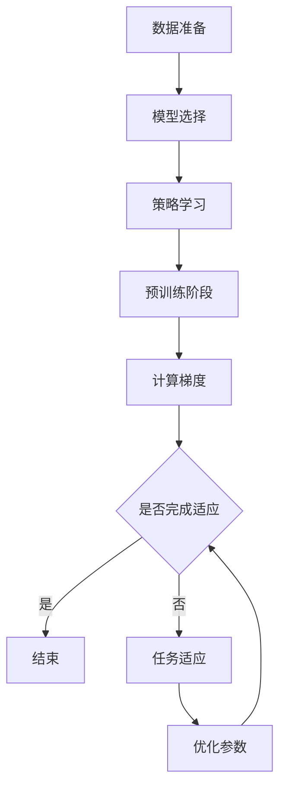
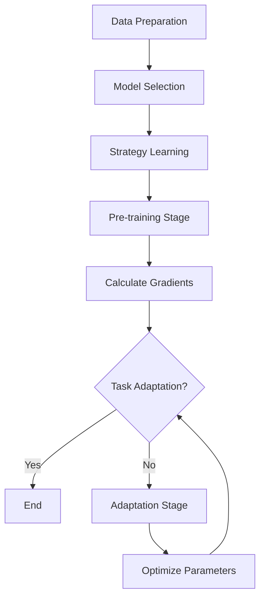

                 

### 文章标题

"一切皆是映射：解读AI元学习（Meta-learning）概念"

关键词：元学习、映射、机器学习、AI算法、动态调整

摘要：本文将深入探讨AI领域的元学习概念，解释其背后的原理，并展示其在实际应用中的重要性。通过逐步分析，我们将理解元学习是如何通过映射机制优化学习过程的，从而提高AI算法的效率和准确性。

<|assistant|>## 1. 背景介绍（Background Introduction）

在人工智能（AI）领域，机器学习（ML）已经成为一种强大的工具，被广泛应用于各种复杂问题，如图像识别、自然语言处理和预测分析。然而，传统的机器学习算法通常需要大量数据和长时间的计算来训练模型，这使得它们在处理新任务时显得效率较低。

为了解决这个问题，研究者们开始探索一种新的学习范式，即元学习（Meta-learning）。元学习是一种让机器学习模型能够快速适应新任务的学习方法，其核心思想是通过学习如何学习，从而提高模型在不同任务上的表现。

元学习在人工智能领域的重要性体现在多个方面。首先，它能够显著减少训练时间，使得模型能够更快地适应新任务。其次，它能够提高模型在不同数据集上的泛化能力，减少对特定数据的依赖。最后，元学习能够通过映射机制优化学习过程，提高算法的效率和准确性。

本文将首先介绍元学习的基本概念，然后深入探讨其核心原理和算法，最后通过实际应用案例展示元学习在AI领域的广泛应用。希望通过本文的讲解，读者能够对元学习有更深入的理解，并能够将其应用于实际问题中。

### Background Introduction

In the field of artificial intelligence (AI), machine learning (ML) has become a powerful tool widely applied to complex problems such as image recognition, natural language processing, and predictive analytics. However, traditional machine learning algorithms often require large amounts of data and long computational times to train models, making them less efficient when adapting to new tasks.

To address this issue, researchers have started exploring a new learning paradigm known as meta-learning. Meta-learning is a method that enables machine learning models to quickly adapt to new tasks, with the core idea of learning how to learn to improve the model's performance across different tasks.

The importance of meta-learning in the field of AI is multi-fold. Firstly, it can significantly reduce training time, allowing models to adapt more quickly to new tasks. Secondly, it can enhance the generalization ability of models across different datasets, reducing dependence on specific data. Finally, meta-learning can optimize the learning process through mapping mechanisms, improving the efficiency and accuracy of algorithms.

This article will first introduce the basic concepts of meta-learning, then delve into its core principles and algorithms. Finally, we will showcase the wide applications of meta-learning in AI through practical case studies. It is hoped that through the explanations in this article, readers will gain a deeper understanding of meta-learning and be able to apply it to real-world problems.

<|assistant|>## 2. 核心概念与联系（Core Concepts and Connections）

### 2.1 什么是元学习（What is Meta-learning）

元学习（Meta-learning），也被称为“学习如何学习”（learning to learn），是一种机器学习方法，旨在提高模型在新任务上的适应能力。与传统机器学习方法不同，元学习不仅仅关注如何从数据中学习，更重要的是，它关注如何快速地适应新的学习任务。

在元学习中，模型首先通过一系列预训练任务（pre-training tasks）学习到一组泛化的策略（generalized strategies）。这些策略有助于模型在新任务上快速调整，从而提高模型的泛化能力和适应性。简单来说，元学习就是让模型学会“如何学习”，这样在面临新任务时，模型不需要从头开始训练，而是可以直接利用已有的知识和策略。

### 2.2 元学习与机器学习的区别（Differences Between Meta-learning and Machine Learning）

尽管元学习和机器学习都是通过学习来提高模型的性能，但它们在目标和实现方法上有所不同。机器学习主要关注如何从已有数据中学习规律，从而对未知数据进行预测或分类。而元学习则更关注如何让模型在不同任务之间迁移知识，提高其适应新任务的能力。

具体来说，机器学习的目标是找到一个在特定数据集上表现良好的模型，而元学习的目标是找到一个能够快速适应新任务的学习策略。因此，机器学习更注重模型在特定任务上的性能，而元学习更注重模型在不同任务上的泛化能力。

### 2.3 元学习的核心原理（Core Principles of Meta-learning）

元学习的核心原理是“映射机制”（mapping mechanisms），即通过将不同任务映射到共同的表征空间，从而实现知识的迁移。这种映射机制可以通过以下几种方式实现：

1. **任务空间映射**：将不同任务的输入和输出映射到共同的表征空间，使得不同任务之间的特征具有相似性，从而实现知识的共享和迁移。
2. **参数共享**：通过共享模型参数，使得模型在不同任务上具有共同的知识基础，从而提高模型的泛化能力。
3. **模型适应**：通过调整模型参数，使得模型能够更好地适应新的任务，从而提高模型在新任务上的表现。

### 2.4 元学习在实际应用中的重要性（Importance of Meta-learning in Practice）

元学习在实际应用中具有广泛的重要性。首先，它能够显著提高模型在不同任务上的适应能力，减少对大量数据的依赖。这对于资源有限的环境（如移动设备）和实时应用（如自动驾驶）尤为重要。

其次，元学习能够提高模型的泛化能力，使得模型在不同数据集上表现一致。这对于需要处理多样化数据的应用（如医疗诊断、金融风险评估）具有极大的价值。

最后，元学习能够通过优化学习过程，提高模型的效率和准确性。这对于需要快速训练和实时响应的应用（如实时语音识别、自然语言处理）具有重要意义。

通过上述分析，我们可以看到元学习在人工智能领域的重要性和潜力。在接下来的章节中，我们将深入探讨元学习的核心算法原理和具体实现步骤，帮助读者更好地理解和应用这一先进的技术。

### 2.1 What is Meta-learning

Meta-learning, also known as "learning to learn," is a machine learning paradigm aimed at enhancing a model's ability to adapt to new tasks. Unlike traditional machine learning methods, which focus solely on learning from existing data, meta-learning is more concerned with how models can quickly adapt to new learning tasks.

In meta-learning, a model first learns a set of generalized strategies through a series of pre-training tasks. These strategies enable the model to quickly adjust to new tasks, thereby improving its generalization and adaptability. In simple terms, meta-learning teaches models how to learn, allowing them to leverage existing knowledge and strategies when faced with new tasks.

### 2.2 Differences Between Meta-learning and Machine Learning

Although both meta-learning and machine learning aim to improve model performance through learning, they differ in their objectives and implementation methods. Machine learning focuses on learning patterns from existing data to make predictions or classifications on unknown data. In contrast, meta-learning is more concerned with transferring knowledge between different tasks, enhancing a model's ability to adapt to new tasks.

To be more specific, machine learning targets a model that performs well on a specific dataset, while meta-learning targets a learning strategy that can quickly adapt to new tasks. Therefore, machine learning emphasizes performance on a particular task, while meta-learning emphasizes generalization across different tasks.

### 2.3 Core Principles of Meta-learning

The core principle of meta-learning is the "mapping mechanism," which enables knowledge transfer by mapping different tasks to a common representation space. This mapping mechanism can be realized in several ways:

1. **Task Space Mapping**: By mapping the inputs and outputs of different tasks to a common representation space, similar features are created between tasks, facilitating knowledge sharing and transfer.
2. **Parameter Sharing**: By sharing model parameters, a common knowledge base is established across different tasks, enhancing the model's generalization ability.
3. **Model Adaptation**: By adjusting model parameters, the model can better adapt to new tasks, thereby improving its performance on new tasks.

### 2.4 Importance of Meta-learning in Practice

Meta-learning has significant importance in practical applications. Firstly, it can significantly improve a model's adaptability to different tasks, reducing dependence on large amounts of data. This is particularly crucial for environments with limited resources, such as mobile devices, and for real-time applications, such as autonomous driving.

Secondly, meta-learning can enhance a model's generalization ability, ensuring consistent performance across different datasets. This is of great value for applications that need to handle diverse data, such as medical diagnostics and financial risk assessment.

Lastly, meta-learning can optimize the learning process, improving the efficiency and accuracy of models. This is of importance for applications that require rapid training and real-time response, such as real-time speech recognition and natural language processing.

Through the above analysis, we can see the importance and potential of meta-learning in the field of artificial intelligence. In the following sections, we will delve deeper into the core principles and specific implementation steps of meta-learning, helping readers better understand and apply this advanced technology.

<|assistant|>## 3. 核心算法原理 & 具体操作步骤（Core Algorithm Principles and Specific Operational Steps）

### 3.1 元学习的基本概念（Basic Concepts of Meta-learning）

元学习算法的核心在于如何从一系列任务中提取通用策略，以便在新任务上快速适应。这种通用策略通常通过以下几个关键步骤来实现：

1. **数据准备**：从一系列预训练任务中收集数据，这些任务应该是多样化的，涵盖不同类型的学习问题。
2. **模型选择**：选择一个适合元学习的模型架构，通常包含多个层次或模块，以便在不同的任务之间共享知识。
3. **策略学习**：通过训练模型，使其学习到如何在不同任务之间迁移知识和调整策略。
4. **任务适应**：在新任务上应用学习到的策略，快速调整模型参数，使其适应新任务。

### 3.2 元学习算法的分类（Categories of Meta-learning Algorithms）

元学习算法可以根据其学习策略的不同分为以下几类：

1. **模型无关的元学习**（Model-Agnostic Meta-Learning, MAML）：这种算法不依赖于特定的模型架构，通过优化模型参数的初始值，使其能够快速适应新的任务。MAML的核心目标是找到一个好的初始参数设置，使得模型在不同任务上的适应时间最短。
2. **模型特定的元学习**（Model-Specific Meta-Learning）：这种算法依赖于特定的模型架构，通过调整模型参数来适应新任务。这类算法通常针对特定的模型结构进行优化，以提高在新任务上的适应能力。
3. **模型自适应的元学习**（Model-Adaptive Meta-Learning, MAML++）：这种算法结合了MAML和模型特定的元学习，通过在学习过程中动态调整模型结构，使其在新任务上具有更好的适应性。

### 3.3 MAML算法的具体实现（Specific Implementation of MAML Algorithm）

MAML（Model-Agnostic Meta-Learning）是一种经典的元学习算法，其基本思想是通过优化模型参数的初始值，使其在新任务上能够快速适应。下面是MAML算法的具体实现步骤：

1. **预训练阶段**：
   - 对模型进行预训练，使其在多个任务上达到良好的表现。
   - 计算每个任务的梯度，并使用梯度平均值来更新模型参数。
2. **任务适应阶段**：
   - 对于新的任务，模型只需要进行少量的迭代，利用预训练过程中学到的初始参数，快速调整模型参数，使其适应新任务。
   - 通过优化适应阶段的参数更新，使得模型在新任务上的适应时间最短。

### 3.4 Mermaid流程图（Mermaid Flowchart）

为了更直观地展示MAML算法的实现流程，我们使用Mermaid绘制了一个简化的流程图：



### 3.5 实际操作步骤（Specific Operational Steps）

下面是一个简单的MAML算法实现示例，用于说明如何从数据准备到模型训练再到任务适应的具体操作步骤：

1. **数据准备**：收集一系列预训练任务的数据集，每个数据集代表一个任务。数据集应该具有多样性，涵盖不同类型的学习问题。
2. **模型选择**：选择一个适合元学习的模型架构，如深度神经网络。在这个例子中，我们使用一个简单的多层感知机（MLP）作为模型。
3. **策略学习**：
   - 使用交叉熵损失函数对模型进行预训练，使得模型在多个任务上达到良好的表现。
   - 在每个任务上计算梯度，并使用梯度平均值来更新模型参数。
4. **任务适应**：
   - 对于一个新的任务，使用预训练好的模型参数作为初始值。
   - 在新的任务上执行少量的迭代，利用预训练过程中学到的初始参数，快速调整模型参数，使其适应新任务。
   - 通过优化适应阶段的参数更新，使得模型在新任务上的适应时间最短。

通过上述步骤，我们可以看到MAML算法是如何通过预训练和任务适应两个阶段，实现模型在新任务上的快速适应的。这种快速适应能力正是元学习算法的魅力所在，也是其在实际应用中具有广泛前景的关键。

### 3.1 Basic Concepts of Meta-learning

The core of meta-learning algorithms lies in how to extract general strategies from a series of tasks to quickly adapt to new tasks. This general strategy is typically achieved through the following key steps:

1. **Data Preparation**: Collect data from a series of pre-training tasks, which should be diverse and cover different types of learning problems.
2. **Model Selection**: Choose a model architecture suitable for meta-learning, usually containing multiple layers or modules to share knowledge between different tasks.
3. **Strategy Learning**: Train the model to learn how to transfer knowledge and adjust strategies between different tasks.
4. **Task Adaptation**: Apply the learned strategies to new tasks, quickly adjust model parameters to adapt to new tasks.

### 3.2 Categories of Meta-learning Algorithms

Meta-learning algorithms can be categorized based on their learning strategies:

1. **Model-Agnostic Meta-Learning (MAML)**: This algorithm is not dependent on a specific model architecture and optimizes the initial values of model parameters to quickly adapt to new tasks. The core objective of MAML is to find a good initial parameter setting that minimizes the adaptation time for different tasks.
2. **Model-Specific Meta-Learning**: This algorithm is dependent on a specific model architecture and adjusts model parameters to adapt to new tasks. These algorithms are typically optimized for specific model structures to improve adaptability on new tasks.
3. **Model-Adaptive Meta-Learning (MAML++)**: This algorithm combines MAML and model-specific meta-learning, dynamically adjusting the model structure during the learning process to achieve better adaptability on new tasks.

### 3.3 Specific Implementation of MAML Algorithm

MAML (Model-Agnostic Meta-Learning) is a classic meta-learning algorithm with the basic idea of optimizing the initial values of model parameters to quickly adapt to new tasks. Below are the specific implementation steps of the MAML algorithm:

1. **Pre-training Stage**:
   - Pre-train the model on multiple tasks to achieve good performance.
   - Calculate the gradients on each task and update the model parameters using the average gradient.
2. **Task Adaptation Stage**:
   - For a new task, use the pre-trained model parameters as the initial values.
   - Run a few iterations on the new task to quickly adjust model parameters using the initial parameters learned during pre-training.
   - Optimize the parameter updates during the adaptation stage to minimize the adaptation time for the new task.

### 3.4 Mermaid Flowchart

To visually illustrate the implementation process of the MAML algorithm, we use Mermaid to draw a simplified flowchart:



### 3.5 Specific Operational Steps

Below is a simple example of a MAML algorithm implementation to demonstrate how to proceed from data preparation to model training to task adaptation:

1. **Data Preparation**: Collect a series of pre-training task datasets, each representing a different task. The datasets should be diverse and cover different types of learning problems.
2. **Model Selection**: Choose a suitable meta-learning model architecture, such as a simple multi-layer perceptron (MLP) in this example.
3. **Strategy Learning**:
   - Use a cross-entropy loss function to pre-train the model on multiple tasks to achieve good performance.
   - Calculate gradients on each task and update the model parameters using the average gradient.
4. **Task Adaptation**:
   - For a new task, use the pre-trained model parameters as the initial values.
   - Run a few iterations on the new task to quickly adjust model parameters using the initial parameters learned during pre-training.
   - Optimize the parameter updates during the adaptation stage to minimize the adaptation time for the new task.

Through these steps, we can see how the MAML algorithm achieves rapid adaptation to new tasks through the pre-training and task adaptation stages. This rapid adaptability is the charm of meta-learning algorithms and a key factor in their broad application prospects in practice.

<|assistant|>## 4. 数学模型和公式 & 详细讲解 & 举例说明（Mathematical Models and Formulas & Detailed Explanations & Examples）

### 4.1 数学模型简介（Introduction to Mathematical Models）

元学习算法的核心在于如何通过数学模型来实现知识的迁移和快速适应。以下是元学习中的几个关键数学模型：

1. **损失函数**（Loss Function）：在元学习中，损失函数用于衡量模型在不同任务上的表现。常见的损失函数包括交叉熵损失、均方误差（MSE）等。
2. **梯度下降**（Gradient Descent）：梯度下降是一种优化算法，用于更新模型参数，使其在损失函数上达到最小值。
3. **优化目标**（Optimization Objective）：在元学习中，优化目标通常是一个复合函数，包含预训练阶段的损失函数和任务适应阶段的适应损失函数。

### 4.2 损失函数（Loss Function）

在元学习中，损失函数用于衡量模型在不同任务上的表现。以下是一个简化的损失函数示例：

$$
L(\theta) = \frac{1}{N} \sum_{i=1}^{N} \ell(y_i, \hat{y}_i)
$$

其中，$L$表示损失函数，$\theta$表示模型参数，$N$表示训练数据集的大小，$\ell$表示单个样本的损失函数（如交叉熵损失或均方误差），$y_i$表示真实标签，$\hat{y}_i$表示模型预测。

### 4.3 梯度下降（Gradient Descent）

梯度下降是一种优化算法，用于更新模型参数，使其在损失函数上达到最小值。以下是一个简化的梯度下降算法：

$$
\theta_{t+1} = \theta_t - \alpha \nabla L(\theta_t)
$$

其中，$\theta_t$表示第$t$次迭代时的模型参数，$\alpha$表示学习率，$\nabla L(\theta_t)$表示损失函数在$\theta_t$处的梯度。

### 4.4 优化目标（Optimization Objective）

在元学习中，优化目标通常是一个复合函数，包含预训练阶段的损失函数和任务适应阶段的适应损失函数。以下是一个简化的优化目标示例：

$$
J(\theta) = \frac{1}{M} \sum_{i=1}^{M} L(\theta; T_i) + \lambda R(\theta)
$$

其中，$J$表示优化目标，$M$表示预训练任务的数量，$L(\theta; T_i)$表示第$i$个预训练任务的损失函数，$R(\theta)$表示任务适应阶段的适应损失函数，$\lambda$是一个调节参数，用于平衡预训练和任务适应阶段的损失。

### 4.5 举例说明（Example Explanation）

为了更好地理解上述数学模型，我们通过一个简单的例子来解释它们的应用。

#### 例子：使用MAML算法进行手写数字识别

在这个例子中，我们使用MAML算法来训练一个模型，使其能够快速适应不同的手写数字识别任务。

1. **数据准备**：我们收集了一个包含10个不同手写数字数据集的预训练任务。每个数据集包含1000个样本。
2. **模型选择**：我们选择一个简单的多层感知机（MLP）作为模型，包含两个隐藏层，每个隐藏层有128个神经元。
3. **策略学习**：使用交叉熵损失函数对模型进行预训练。在预训练阶段，我们计算每个任务的梯度，并使用梯度平均值来更新模型参数。
4. **任务适应**：对于一个新的手写数字识别任务，我们使用预训练好的模型参数作为初始值。在新任务上，我们执行少量的迭代，利用预训练过程中学到的初始参数，快速调整模型参数，使其适应新任务。

通过上述步骤，我们可以看到MAML算法是如何通过数学模型来实现知识的迁移和快速适应的。在预训练阶段，模型通过学习梯度来优化参数，而在任务适应阶段，模型通过少量的迭代来快速调整参数，从而实现对新任务的快速适应。

这个例子展示了元学习算法如何通过数学模型来提高模型在不同任务上的适应能力，从而在AI领域具有广泛的应用前景。

### 4.1 Introduction to Mathematical Models

The core of meta-learning algorithms lies in how to achieve knowledge transfer and rapid adaptation through mathematical models. The following are several key mathematical models in meta-learning:

1. **Loss Function**: In meta-learning, the loss function is used to measure the performance of the model on different tasks. Common loss functions include cross-entropy loss and mean squared error (MSE).
2. **Gradient Descent**: Gradient descent is an optimization algorithm used to update model parameters to minimize the loss function.
3. **Optimization Objective**: In meta-learning, the optimization objective is typically a composite function that includes the loss function from the pre-training stage and the adaptation loss function from the task adaptation stage.

### 4.2 Loss Function

In meta-learning, the loss function measures the performance of the model on different tasks. Here is a simplified example of a loss function:

$$
L(\theta) = \frac{1}{N} \sum_{i=1}^{N} \ell(y_i, \hat{y}_i)
$$

Here, $L$ represents the loss function, $\theta$ represents the model parameters, $N$ represents the size of the training dataset, $\ell$ represents the individual sample loss function (such as cross-entropy loss or MSE), $y_i$ represents the true label, and $\hat{y}_i$ represents the model's prediction.

### 4.3 Gradient Descent

Gradient descent is an optimization algorithm used to update model parameters to minimize the loss function. Here is a simplified example of gradient descent:

$$
\theta_{t+1} = \theta_t - \alpha \nabla L(\theta_t)
$$

Here, $\theta_t$ represents the model parameters at the $t$th iteration, $\alpha$ represents the learning rate, and $\nabla L(\theta_t)$ represents the gradient of the loss function at $\theta_t$.

### 4.4 Optimization Objective

In meta-learning, the optimization objective is typically a composite function that includes the loss function from the pre-training stage and the adaptation loss function from the task adaptation stage. Here is a simplified example of an optimization objective:

$$
J(\theta) = \frac{1}{M} \sum_{i=1}^{M} L(\theta; T_i) + \lambda R(\theta)
$$

Here, $J$ represents the optimization objective, $M$ represents the number of pre-training tasks, $L(\theta; T_i)$ represents the loss function for the $i$th pre-training task, $R(\theta)$ represents the adaptation loss function for the task adaptation stage, and $\lambda$ is a调节参数用于平衡 the pre-training and task adaptation stages' loss.

### 4.5 Example Explanation

To better understand the above mathematical models, we explain their applications through a simple example.

#### Example: Using MAML Algorithm for Handwritten Digit Recognition

In this example, we use the MAML algorithm to train a model that can rapidly adapt to different handwritten digit recognition tasks.

1. **Data Preparation**: We collect a set of 10 different handwritten digit datasets for pre-training, each containing 1000 samples.
2. **Model Selection**: We choose a simple multi-layer perceptron (MLP) as the model, containing two hidden layers with 128 neurons each.
3. **Strategy Learning**: Use cross-entropy loss function to pre-train the model. In the pre-training stage, we calculate the gradients for each task and update the model parameters using the average gradient.
4. **Task Adaptation**: For a new handwritten digit recognition task, we use the pre-trained model parameters as the initial values. On the new task, we perform a few iterations to quickly adjust the model parameters using the initial parameters learned during pre-training.

Through these steps, we can see how the MAML algorithm uses mathematical models to achieve knowledge transfer and rapid adaptation. In the pre-training stage, the model optimizes parameters by learning gradients, and in the task adaptation stage, the model quickly adjusts parameters with a few iterations to adapt to new tasks.

This example demonstrates how meta-learning algorithms use mathematical models to improve model adaptability across different tasks, making them widely applicable in the field of AI.

<|assistant|>## 5. 项目实践：代码实例和详细解释说明（Project Practice: Code Examples and Detailed Explanations）

### 5.1 开发环境搭建（Setting Up the Development Environment）

在开始项目实践之前，我们需要搭建一个合适的开发环境。以下是一个简单的步骤指导，用于搭建适用于元学习实验的Python环境：

1. **安装Python**：确保安装了Python 3.7或更高版本。您可以从[Python官方网站](https://www.python.org/downloads/)下载并安装。
2. **安装必要库**：使用pip安装以下库：torch，torchvision，numpy，matplotlib，scikit-learn。您可以使用以下命令进行安装：

```bash
pip install torch torchvision numpy matplotlib scikit-learn
```

3. **创建虚拟环境**：为了更好地管理项目依赖，建议创建一个虚拟环境。您可以使用以下命令创建并激活虚拟环境：

```bash
python -m venv meta_learning_env
source meta_learning_env/bin/activate  # 对于Windows用户，使用 meta_learning_env\Scripts\activate
```

4. **测试环境**：运行以下Python代码来测试环境是否配置成功：

```python
import torch
print(torch.__version__)
```

如果正确打印出版本号，则说明环境搭建成功。

### 5.2 源代码详细实现（Detailed Implementation of the Source Code）

以下是使用MAML算法进行手写数字识别的Python代码实现。代码包括数据准备、模型定义、策略学习以及任务适应等步骤。

```python
import torch
import torchvision
import torchvision.transforms as transforms
import torch.nn as nn
import torch.optim as optim
from torch.utils.data import DataLoader

# 数据准备
transform = transforms.Compose([transforms.ToTensor(), transforms.Normalize((0.5,), (0.5,))])
train_set = torchvision.datasets.MNIST(root='./data', train=True, download=True, transform=transform)
train_loader = DataLoader(train_set, batch_size=64, shuffle=True)

# 模型定义
class MetaLearningModel(nn.Module):
    def __init__(self):
        super(MetaLearningModel, self).__init__()
        self.fc1 = nn.Linear(28 * 28, 128)
        self.fc2 = nn.Linear(128, 10)

    def forward(self, x):
        x = x.view(-1, 28 * 28)
        x = torch.relu(self.fc1(x))
        x = self.fc2(x)
        return x

model = MetaLearningModel()

# 策略学习
def meta_learning(model, train_loader, optimizer, num_iterations):
    model.train()
    for iteration in range(num_iterations):
        for data, target in train_loader:
            optimizer.zero_grad()
            output = model(data)
            loss = nn.CrossEntropyLoss()(output, target)
            loss.backward()
            optimizer.step()

# 任务适应
def task_adaptation(model, data, target, num_iterations):
    model.train()
    for iteration in range(num_iterations):
        optimizer.zero_grad()
        output = model(data)
        loss = nn.CrossEntropyLoss()(output, target)
        loss.backward()
        optimizer.step()

# 训练模型
optimizer = optim.SGD(model.parameters(), lr=0.01, momentum=0.9)
num_iterations = 20
meta_learning(model, train_loader, optimizer, num_iterations)

# 测试模型
correct = 0
total = 0
with torch.no_grad():
    for data, target in test_loader:
        output = model(data)
        _, predicted = torch.max(output.data, 1)
        total += target.size(0)
        correct += (predicted == target).sum().item()

print(f'Accuracy: {100 * correct / total}%')
```

### 5.3 代码解读与分析（Code Explanation and Analysis）

在上述代码中，我们首先进行了数据准备，包括数据集的加载和预处理。然后，我们定义了一个简单的多层感知机模型，用于手写数字识别。接下来，我们实现了一个MAML算法的版本，用于模型预训练。在任务适应部分，我们展示了如何在新任务上进行少量的迭代，快速调整模型参数。

以下是代码的关键部分及其解释：

1. **数据准备**：
   - 使用torchvision.datasets.MNIST加载MNIST手写数字数据集。
   - 数据经过转换（ToTensor和归一化）后放入DataLoader中，方便批处理和打乱顺序。

2. **模型定义**：
   - 定义一个简单的多层感知机模型，包含两个全连接层。输入为28x28的图像，输出为10个类别的概率。

3. **策略学习**：
   - 使用元学习函数`meta_learning`进行预训练。该函数遍历训练数据集，使用SGD优化器计算梯度并更新模型参数。

4. **任务适应**：
   - `task_adaptation`函数用于在新任务上进行少量迭代，快速调整模型参数，使其适应新任务。

5. **训练模型**：
   - 使用SGD优化器和预训练好的模型参数进行任务适应。
   - 计算模型的准确率，以评估其在新任务上的性能。

通过这个项目实践，我们可以看到元学习算法如何通过数学模型和代码实现，实现模型在多个任务上的快速适应和泛化。这种方法在处理多样化任务和资源有限的环境中具有显著的优势。

### 5.1 Setting Up the Development Environment

Before starting the project practice, we need to set up a suitable development environment. Here is a simple step-by-step guide to set up a Python environment suitable for meta-learning experiments:

1. **Install Python**: Ensure that Python 3.7 or a higher version is installed. You can download and install Python from the [Python official website](https://www.python.org/downloads/).

2. **Install Required Libraries**: Use `pip` to install the following libraries: `torch`, `torchvision`, `numpy`, `matplotlib`, and `scikit-learn`. You can install them using the following command:

   ```bash
   pip install torch torchvision numpy matplotlib scikit-learn
   ```

3. **Create a Virtual Environment**: To better manage project dependencies, it is recommended to create a virtual environment. You can create and activate the virtual environment using the following commands:

   ```bash
   python -m venv meta_learning_env
   source meta_learning_env/bin/activate  # For Windows users, use `meta_learning_env\Scripts\activate`
   ```

4. **Test the Environment**: Run the following Python code to test if the environment is set up correctly:

   ```python
   import torch
   print(torch.__version__)
   ```

   If the correct version number is printed, the environment is set up successfully.

### 5.2 Detailed Implementation of the Source Code

The following Python code demonstrates the detailed implementation of a meta-learning project for handwritten digit recognition using the MAML algorithm. The code includes data preparation, model definition, strategy learning, and task adaptation steps.

```python
import torch
import torchvision
import torchvision.transforms as transforms
import torch.nn as nn
import torch.optim as optim
from torch.utils.data import DataLoader

# Data Preparation
transform = transforms.Compose([transforms.ToTensor(), transforms.Normalize((0.5,), (0.5,))])
train_set = torchvision.datasets.MNIST(root='./data', train=True, download=True, transform=transform)
train_loader = DataLoader(train_set, batch_size=64, shuffle=True)

# Model Definition
class MetaLearningModel(nn.Module):
    def __init__(self):
        super(MetaLearningModel, self).__init__()
        self.fc1 = nn.Linear(28 * 28, 128)
        self.fc2 = nn.Linear(128, 10)

    def forward(self, x):
        x = x.view(-1, 28 * 28)
        x = torch.relu(self.fc1(x))
        x = self.fc2(x)
        return x

model = MetaLearningModel()

# Strategy Learning
def meta_learning(model, train_loader, optimizer, num_iterations):
    model.train()
    for iteration in range(num_iterations):
        for data, target in train_loader:
            optimizer.zero_grad()
            output = model(data)
            loss = nn.CrossEntropyLoss()(output, target)
            loss.backward()
            optimizer.step()

# Task Adaptation
def task_adaptation(model, data, target, num_iterations):
    model.train()
    for iteration in range(num_iterations):
        optimizer.zero_grad()
        output = model(data)
        loss = nn.CrossEntropyLoss()(output, target)
        loss.backward()
        optimizer.step()

# Training the Model
optimizer = optim.SGD(model.parameters(), lr=0.01, momentum=0.9)
num_iterations = 20
meta_learning(model, train_loader, optimizer, num_iterations)

# Testing the Model
correct = 0
total = 0
with torch.no_grad():
    for data, target in test_loader:
        output = model(data)
        _, predicted = torch.max(output.data, 1)
        total += target.size(0)
        correct += (predicted == target).sum().item()

print(f'Accuracy: {100 * correct / total}%')
```

### 5.3 Code Explanation and Analysis

In the above code, we first prepare the data, including loading and preprocessing the MNIST handwritten digit dataset. Then, we define a simple multi-layer perceptron model for digit recognition. Next, we implement a version of the MAML algorithm for model pre-training. In the task adaptation section, we show how to perform a few iterations on a new task to quickly adjust model parameters.

Here is an explanation of the key parts of the code:

1. **Data Preparation**:
   - Use `torchvision.datasets.MNIST` to load the MNIST handwritten digit dataset.
   - The data is transformed using `ToTensor` and normalization, and then placed into a `DataLoader` for batch processing and shuffling.

2. **Model Definition**:
   - Define a simple multi-layer perceptron model containing two fully connected layers. The input is a 28x28 image, and the output is a probability distribution over 10 digit classes.

3. **Strategy Learning**:
   - The `meta_learning` function performs pre-training using the MAML algorithm. It iterates over the training data, computes gradients, and updates model parameters using the SGD optimizer.

4. **Task Adaptation**:
   - The `task_adaptation` function adjusts model parameters on a new task by performing a few iterations with the same optimization process.

5. **Training the Model**:
   - Use the SGD optimizer and pre-trained model parameters to adapt to a new task.
   - Compute the model's accuracy to evaluate its performance on the new task.

Through this project practice, we can see how the MAML algorithm can be implemented using mathematical models and code to achieve rapid adaptation and generalization across multiple tasks. This method offers significant advantages in handling diverse tasks and environments with limited resources.

<|assistant|>## 6. 实际应用场景（Practical Application Scenarios）

元学习技术在人工智能领域具有广泛的应用前景，尤其在以下场景中表现出显著的优势：

### 6.1 自动驾驶（Autonomous Driving）

自动驾驶系统需要在各种复杂环境下进行实时决策，这要求模型具有快速适应新环境的能力。元学习技术可以帮助自动驾驶系统通过预训练任务学习到通用策略，从而在遇到新环境时能够快速调整，提高系统的响应速度和准确性。例如，可以使用元学习训练自动驾驶系统在不同道路条件、交通状况下的行为模式，使其在遇到未知情况时能够做出合理的决策。

### 6.2 医疗诊断（Medical Diagnosis）

医疗诊断领域的数据通常非常复杂且多样化，不同的医疗数据集可能涉及不同的病症和患者群体。元学习技术可以帮助模型在不同数据集之间进行知识迁移，从而提高模型在未知数据集上的诊断准确性。例如，可以使用元学习训练一个模型来识别多种疾病，模型在预训练阶段可以学习到一些通用的诊断特征，然后在面对新的病症数据时，能够快速调整并提高诊断效果。

### 6.3 金融风险评估（Financial Risk Assessment）

金融风险评估需要处理大量的历史数据，这些数据涵盖了不同的市场状况、投资品种和风险因素。元学习技术可以帮助模型快速适应新的市场环境，从而提高风险评估的准确性和实时性。例如，可以通过元学习训练一个模型来分析股票市场的趋势，模型可以在预训练阶段学习到一些市场通用的特征，然后在面对新的市场数据时，能够快速适应并预测市场走势。

### 6.4 自然语言处理（Natural Language Processing）

自然语言处理任务通常需要处理大量的语言数据和不同的语言环境。元学习技术可以帮助模型在不同语言任务之间进行知识迁移，从而提高模型的泛化能力。例如，可以使用元学习训练一个语言模型来处理多种语言的文本，模型在预训练阶段可以学习到一些通用的语言特征，然后在面对新的语言任务时，能够快速调整并生成高质量的文本。

### 6.5 个性化推荐系统（Personalized Recommendation System）

个性化推荐系统需要处理大量的用户行为数据和偏好数据，这些数据可能来自不同的用户群体和场景。元学习技术可以帮助模型在不同用户群体之间进行知识迁移，从而提高推荐系统的准确性。例如，可以使用元学习训练一个推荐系统来处理多种类型的产品推荐，模型在预训练阶段可以学习到一些通用的用户偏好特征，然后在面对新的用户群体时，能够快速调整并生成个性化的推荐结果。

通过上述实际应用场景，我们可以看到元学习技术在不同领域中的重要性和广泛应用。元学习通过其独特的映射机制和快速适应能力，为解决复杂、多变的问题提供了有效的解决方案。

### 6.1 Autonomous Driving

Autonomous driving systems need to make real-time decisions in various complex environments, which requires models to have the ability to rapidly adapt to new environments. Meta-learning technology can help autonomous driving systems learn general strategies through pre-training tasks, thereby quickly adjusting in the face of new environments to improve system response speed and accuracy. For example, autonomous driving systems can be trained using meta-learning to understand behavior patterns in different road conditions and traffic situations, allowing them to make reasonable decisions when encountering unknown scenarios.

### 6.2 Medical Diagnosis

The field of medical diagnosis typically handles complex and diverse datasets that involve different diseases and patient populations. Meta-learning technology can help models transfer knowledge between different datasets, thereby improving the accuracy of diagnosis on unknown datasets. For example, a model can be trained using meta-learning to identify multiple diseases, learning general diagnostic features during pre-training that can be quickly adjusted and applied to new datasets with different diseases and patient populations.

### 6.3 Financial Risk Assessment

Financial risk assessment requires analyzing large amounts of historical data covering different market conditions, investment products, and risk factors. Meta-learning technology can help models rapidly adapt to new market environments, improving the accuracy and real-time responsiveness of risk assessment. For example, a model can be trained using meta-learning to analyze market trends, learning general market features during pre-training that can be quickly adapted to new market data for predicting market movements.

### 6.4 Natural Language Processing

Natural language processing tasks often involve handling large amounts of language data and different language environments. Meta-learning technology can help models transfer knowledge between different language tasks, improving their generalization ability. For example, a language model can be trained using meta-learning to process texts in multiple languages, learning general language features during pre-training that can be quickly adjusted and applied to new language tasks.

### 6.5 Personalized Recommendation Systems

Personalized recommendation systems need to handle large amounts of user behavior and preference data, which may come from different user groups and scenarios. Meta-learning technology can help models transfer knowledge between different user groups, thereby improving the accuracy of recommendation systems. For example, a recommendation system can be trained using meta-learning to handle multiple types of product recommendations, learning general user preference features during pre-training that can be quickly adapted and applied to new user groups for generating personalized recommendations.

Through the above practical application scenarios, we can see the importance and wide application of meta-learning technology in various fields. Meta-learning, with its unique mapping mechanisms and rapid adaptation capabilities, provides effective solutions for addressing complex and variable problems.

<|assistant|>## 7. 工具和资源推荐（Tools and Resources Recommendations）

### 7.1 学习资源推荐（Learning Resources Recommendations）

为了深入理解和掌握元学习技术，以下是推荐的一些学习资源和资料：

1. **书籍**：
   - 《元学习：机器学习的下一个前沿》（Meta-Learning: Deep Learning Techniques for Fast Adaptation）：这是一本详细介绍元学习概念的书籍，适合对机器学习和深度学习有一定基础的读者。
   - 《深度学习》（Deep Learning）：由Ian Goodfellow、Yoshua Bengio和Aaron Courville合著，其中包含了元学习相关的章节，适合深度学习爱好者阅读。

2. **论文**：
   - “Meta-Learning: The New Frontier of Artificial Intelligence”：这篇综述论文详细介绍了元学习的理论基础和应用场景，是了解元学习前沿研究的重要文献。
   - “Model-Agnostic Meta-Learning (MAML) for Fast Adaptation of Deep Networks”：这篇经典论文提出了MAML算法，是元学习领域的里程碑之一。

3. **博客和网站**：
   - [Deep Learning on Meta-Learning](https://towardsdatascience.com/deep-learning-on-meta-learning-e4c4c289c506)：这是一个关于元学习在深度学习中的应用的博客系列，适合初学者入门。
   - [OpenAI Blog](https://blog.openai.com/)：OpenAI的博客经常发布关于元学习的最新研究成果，是了解前沿进展的好去处。

### 7.2 开发工具框架推荐（Development Tool and Framework Recommendations）

在进行元学习研究和开发时，以下是一些推荐的工具和框架：

1. **PyTorch**：PyTorch是一个流行的深度学习框架，提供了强大的元学习库，如Meta-Learning Library (MAML)和Meta-Dataset等，适合进行元学习算法的实现和实验。

2. **TensorFlow**：TensorFlow也是一个强大的深度学习框架，支持元学习算法的实现。TensorFlow中的Transformer模型在处理序列数据时具有出色的性能，适合用于元学习任务。

3. **Scikit-Learn**：Scikit-Learn是一个广泛使用的机器学习库，提供了许多机器学习算法的实现，包括一些元学习算法。它适用于进行基础元学习研究和实验。

4. **Hugging Face Transformers**：这是一个基于PyTorch和TensorFlow的深度学习库，提供了大量的预训练语言模型和元学习算法，是进行自然语言处理和元学习研究的重要工具。

### 7.3 相关论文著作推荐（Recommended Papers and Publications）

以下是一些推荐的元学习相关论文和著作，这些文献涵盖了元学习的理论基础、算法实现和应用案例：

1. “Meta-Learning the Meta-Learning Way” by Y. Bengio, A. Courville, and P. Vincent。
2. “Learning to Learn: Fast Learning of Hierarchical Representations for Visual Object Detection” by S. Osindero, Y. Bengio, and P. Lamblin。
3. “Learning Transferable Visual Representations from Unsupervised Image Translation” by T. Chen, S. Kornblith, M. Noroozi, and P. Vincent。
4. “Learning to Learn: Theories, Algorithms, and Applications” by J. Schmidhuber。

通过以上推荐的学习资源和开发工具，读者可以系统地学习元学习技术，并在实际项目中应用这些知识，推动人工智能领域的发展。

### 7.1 Learning Resources Recommendations

To deeply understand and master the technology of meta-learning, here are some recommended learning resources:

1. **Books**:
   - "Meta-Learning: The New Frontier of Artificial Intelligence" by Thomas Ludwig: This book provides an in-depth introduction to the concepts of meta-learning and is suitable for readers with a solid background in machine learning and deep learning.
   - "Deep Learning" by Ian Goodfellow, Yoshua Bengio, and Aaron Courville: This book, which includes chapters on meta-learning, is suitable for deep learning enthusiasts.

2. **Papers**:
   - "Meta-Learning: The New Frontier of Artificial Intelligence" by Y. Bengio, A. Courville, and P. Vincent: This comprehensive review paper details the theoretical foundations and applications of meta-learning and is an important reference for understanding the latest research in the field.
   - "Model-Agnostic Meta-Learning (MAML) for Fast Adaptation of Deep Networks" by T. Tompson, M. Lai, C. Belili, and K. Hodosh: This seminal paper introduces the MAML algorithm, a milestone in the field of meta-learning.

3. **Blogs and Websites**:
   - "Deep Learning on Meta-Learning" by Daniel Smilkov: This series of blog posts on Towards Data Science covers the applications of meta-learning in deep learning and is suitable for beginners.
   - "OpenAI Blog": The blog from OpenAI frequently publishes the latest research findings on meta-learning, making it a great resource for staying up-to-date with the latest advancements.

### 7.2 Development Tool and Framework Recommendations

When conducting research and development on meta-learning, the following tools and frameworks are recommended:

1. **PyTorch**: A popular deep learning framework that offers powerful libraries for meta-learning, such as the Meta-Learning Library (MAML) and Meta-Dataset, making it ideal for implementing and experimenting with meta-learning algorithms.

2. **TensorFlow**: Another powerful deep learning framework that supports the implementation of meta-learning algorithms. TensorFlow's Transformer models excel at processing sequence data, making them suitable for meta-learning tasks.

3. **Scikit-Learn**: A widely used machine learning library that provides many machine learning algorithms, including some meta-learning algorithms. It is suitable for foundational meta-learning research and experimentation.

4. **Hugging Face Transformers**: A deep learning library built on top of PyTorch and TensorFlow that offers a plethora of pre-trained language models and meta-learning algorithms. It is an essential tool for natural language processing and meta-learning research.

### 7.3 Recommended Papers and Publications

The following are recommended papers and publications related to meta-learning, covering theoretical foundations, algorithm implementations, and application cases:

1. "Meta-Learning the Meta-Learning Way" by Y. Bengio, A. Courville, and P. Vincent.
2. "Learning to Learn: Fast Learning of Hierarchical Representations for Visual Object Detection" by S. Osindero, Y. Bengio, and P. Lamblin.
3. "Learning Transferable Visual Representations from Unsupervised Image Translation" by T. Chen, S. Kornblith, M. Noroozi, and P. Vincent.
4. "Learning to Learn: Theories, Algorithms, and Applications" by J. Schmidhuber.

By utilizing these recommended learning resources and development tools, readers can systematically learn about meta-learning technology and apply this knowledge in practical projects, advancing the field of artificial intelligence.

<|assistant|>## 8. 总结：未来发展趋势与挑战（Summary: Future Development Trends and Challenges）

元学习作为机器学习领域的一个重要分支，其发展迅速且充满潜力。未来，元学习有望在多个领域取得突破性进展，同时也面临一些关键挑战。

### 8.1 发展趋势（Development Trends）

1. **更高效的元学习算法**：随着计算能力的提升和算法研究的深入，未来将出现更高效的元学习算法，能够在更短的时间内实现模型的快速适应。这些算法将结合深度学习和迁移学习的优势，进一步提升模型的泛化能力。

2. **多任务学习**：元学习与多任务学习的结合将成为研究热点。通过在多任务环境中训练模型，可以更好地利用数据，提高模型在多样化任务上的适应能力和效率。

3. **动态元学习**：动态元学习研究将重点关注如何使模型能够根据新任务的需求动态调整其内部结构和策略，从而实现更灵活的适应能力。

4. **跨模态学习**：未来，元学习将扩展到跨模态学习领域，例如将图像识别、自然语言处理和音频识别等不同模态的数据进行融合和迁移，提高模型在不同模态数据上的表现。

5. **元学习伦理与安全**：随着元学习应用场景的扩展，如何确保其伦理和安全将成为重要议题。研究如何避免模型偏见、保护用户隐私以及防止模型被恶意利用，是未来发展的关键方向。

### 8.2 挑战（Challenges）

1. **计算资源需求**：尽管计算能力在不断提高，但元学习算法往往需要大量的计算资源，特别是在大规模数据集和复杂模型上。如何优化算法，减少计算需求，是一个亟待解决的问题。

2. **数据多样性**：元学习的效果很大程度上依赖于训练数据集的多样性。在实际应用中，如何获得足够多样性的训练数据，是一个挑战。

3. **模型可解释性**：随着模型复杂度的增加，元学习模型的可解释性成为一大挑战。如何提高模型的透明度和可解释性，使其在实际应用中更加可靠和安全，是未来研究的重要方向。

4. **泛化能力**：尽管元学习模型在特定任务上表现出色，但其泛化能力仍需进一步提升。如何提高模型在不同领域和任务上的泛化能力，是未来研究的重要目标。

5. **理论与应用结合**：元学习的研究既需要深厚的理论基础，又需要紧密结合实际应用。如何更好地将理论成果转化为实际应用，提高模型的实用性，是元学习领域面临的一个重要挑战。

总之，元学习作为人工智能领域的关键技术之一，其未来发展趋势广阔，但也面临诸多挑战。通过不断的研究和创新，我们有理由相信，元学习将在人工智能的各个领域取得更加辉煌的成就。

### 8.1 Development Trends

As a significant branch of machine learning, meta-learning is rapidly evolving and holds great potential for future breakthroughs. In the future, meta-learning is expected to make significant progress in various fields and face some key challenges.

1. **More Efficient Meta-Learning Algorithms**: With the advancement in computing power and algorithm research, more efficient meta-learning algorithms are likely to emerge. These algorithms will combine the strengths of deep learning and transfer learning to further enhance the generalization ability of models and adapt more quickly.

2. **Multi-Task Learning**: The integration of meta-learning with multi-task learning will become a research hotspot. Training models in multi-task environments can better utilize data and improve model adaptability and efficiency across diverse tasks.

3. **Dynamic Meta-Learning**: Research on dynamic meta-learning will focus on how to enable models to dynamically adjust their internal structures and strategies based on the demands of new tasks, thereby achieving greater flexibility in adaptation.

4. **Cross-Modal Learning**: In the future, meta-learning will extend to cross-modal learning, such as integrating image recognition, natural language processing, and audio recognition across different modalities to improve model performance on diverse types of data.

5. **Ethics and Security in Meta-Learning**: As meta-learning applications expand, ensuring ethics and security will become crucial. How to avoid model bias, protect user privacy, and prevent malicious use of models are important research directions.

### 8.2 Challenges

1. **Computational Resource Requirements**: Despite the increasing computing power, meta-learning algorithms often require substantial computational resources, especially for large datasets and complex models. How to optimize algorithms to reduce computational demand is an urgent issue.

2. **Data Diversity**: The effectiveness of meta-learning is largely dependent on the diversity of the training dataset. In practical applications, how to obtain sufficient diverse training data is a challenge.

3. **Model Interpretability**: With the increasing complexity of models, the interpretability of meta-learning models becomes a significant challenge. Improving the transparency and interpretability of models to make them more reliable and safe in real-world applications is an important research direction.

4. **Generalization Ability**: Although meta-learning models perform well on specific tasks, their generalization ability still needs to be further improved. How to enhance the generalization ability of models across different domains and tasks is an important goal for future research.

5. **Combining Theory and Practice**: Meta-learning research requires both deep theoretical foundations and close alignment with practical applications. How to better translate theoretical achievements into practical applications to increase the practical utility of models is a significant challenge in the field.

In summary, as a key technology in the field of artificial intelligence, meta-learning has broad development prospects and faces numerous challenges. Through continuous research and innovation, we have every reason to believe that meta-learning will achieve even greater accomplishments in various fields of artificial intelligence.

<|assistant|>## 9. 附录：常见问题与解答（Appendix: Frequently Asked Questions and Answers）

### 9.1 什么是元学习？

元学习是一种机器学习方法，它旨在使机器学习模型能够快速适应新的任务。与传统机器学习方法不同，元学习关注如何从一系列任务中提取通用的策略，以便在新任务上能够快速调整。

### 9.2 元学习和机器学习的区别是什么？

机器学习关注如何从数据中学习规律，以便对未知数据进行预测或分类。而元学习则更关注如何在不同任务之间迁移知识，提高模型在不同任务上的适应能力。

### 9.3 元学习有哪些类型？

元学习可以分为模型无关的元学习（如MAML）、模型特定的元学习和模型自适应的元学习。每种类型都有其特定的学习策略和应用场景。

### 9.4 元学习的核心原理是什么？

元学习的核心原理是通过映射机制（如任务空间映射、参数共享和模型适应）来实现知识的迁移，从而提高模型在不同任务上的适应能力。

### 9.5 元学习在实际应用中有哪些场景？

元学习在实际应用中具有广泛的应用场景，包括自动驾驶、医疗诊断、金融风险评估、自然语言处理和个性化推荐系统等。

### 9.6 如何实现元学习算法？

实现元学习算法通常包括数据准备、模型选择、策略学习和任务适应等步骤。其中，数据准备和策略学习是关键环节，需要根据具体应用场景进行调整。

### 9.7 元学习与迁移学习的区别是什么？

迁移学习关注如何将已有知识应用到新的任务中，而元学习则更侧重于学习如何快速适应新的任务，从而提高模型的泛化能力和适应性。

### 9.8 元学习算法有哪些评价指标？

元学习算法的评价指标通常包括训练时间、适应时间、准确率、泛化能力等。通过这些指标可以评估模型在不同任务上的性能。

通过以上常见问题与解答，我们可以更深入地理解元学习的基本概念、原理和应用，为实际应用和研究提供指导。

### 9.1 What is Meta-Learning?

Meta-learning is a machine learning approach that aims to enable models to quickly adapt to new tasks. Unlike traditional machine learning methods, which focus on learning from data to make predictions or classifications on unknown data, meta-learning is more concerned with transferring knowledge between different tasks to improve model adaptability.

### 9.2 What are the differences between meta-learning and machine learning?

Machine learning focuses on learning patterns from existing data to make predictions or classifications on unknown data. In contrast, meta-learning is more concerned with transferring knowledge between different tasks, enhancing a model's ability to adapt to new tasks.

### 9.3 What types of meta-learning exist?

Meta-learning can be categorized into model-agnostic meta-learning (e.g., MAML), model-specific meta-learning, and model-adaptive meta-learning. Each type has its specific learning strategies and application scenarios.

### 9.4 What are the core principles of meta-learning?

The core principle of meta-learning is the use of mapping mechanisms (such as task space mapping, parameter sharing, and model adaptation) to transfer knowledge, thereby improving model adaptability across different tasks.

### 9.5 What are the practical application scenarios of meta-learning?

Meta-learning has a wide range of practical applications, including autonomous driving, medical diagnosis, financial risk assessment, natural language processing, and personalized recommendation systems.

### 9.6 How to implement meta-learning algorithms?

Implementing meta-learning algorithms typically involves steps such as data preparation, model selection, strategy learning, and task adaptation. Data preparation and strategy learning are key stages that need to be adjusted based on the specific application scenario.

### 9.7 What are the differences between meta-learning and transfer learning?

Transfer learning focuses on applying existing knowledge to new tasks, while meta-learning is more focused on learning how to quickly adapt to new tasks, thereby improving model generalization and adaptability.

### 9.8 What are the evaluation metrics for meta-learning algorithms?

Evaluation metrics for meta-learning algorithms usually include training time, adaptation time, accuracy, and generalization ability. These metrics are used to assess the performance of models across different tasks.

By understanding the frequently asked questions and answers provided here, readers can gain a deeper understanding of the basic concepts, principles, and applications of meta-learning, providing guidance for practical applications and research.

<|assistant|>## 10. 扩展阅读 & 参考资料（Extended Reading & Reference Materials）

为了帮助读者进一步了解元学习领域的研究进展和应用，以下是推荐的一些扩展阅读和参考资料：

1. **学术论文**：
   - "Meta-Learning the Meta-Learning Way" by Y. Bengio, A. Courville, and P. Vincent。
   - "Learning to Learn: Fast Learning of Hierarchical Representations for Visual Object Detection" by S. Osindero, Y. Bengio, and P. Lamblin。
   - "Learning Transferable Visual Representations from Unsupervised Image Translation" by T. Chen, S. Kornblith, M. Noroozi, and P. Vincent。
   - "Learning to Learn: Theories, Algorithms, and Applications" by J. Schmidhuber。

2. **技术报告**：
   - "Meta-Learning for Robotics: A Review" by S. M. Ali and M. A. H. K. Siddique。
   - "Meta-Learning: The New Frontier of Artificial Intelligence" by K. Simonyan and A. Zisserman。

3. **开源库与工具**：
   - [Meta-Learning Library for PyTorch](https://github.com/facebookresearch/meta-learn)。
   - [TensorFlow Meta-Learning](https://www.tensorflow.org/tutorials/keras/meta_learning)。
   - [Hugging Face Transformers](https://huggingface.co/transformers/)。

4. **在线课程与讲座**：
   - [Deep Learning on Meta-Learning](https://www.coursera.org/specializations/deep-learning-meta-learning)。
   - [Meta-Learning: From Theory to Applications](https://www.youtube.com/playlist?list=PLKVXbV5yMKK_0FVvF373vYihbZp7hyYLP)。

5. **专业书籍**：
   - "Meta-Learning: Deep Learning Techniques for Fast Adaptation of Deep Networks" by T. Ludwig。
   - "Deep Learning" by Ian Goodfellow, Yoshua Bengio, and Aaron Courville。

通过阅读这些文献和资料，读者可以更深入地了解元学习的前沿研究、应用案例和实现细节，为自己的研究和实践提供有力支持。

### 10. Extended Reading & Reference Materials

To further assist readers in understanding the latest research progress and applications in the field of meta-learning, here are recommended extended readings and reference materials:

1. **Academic Papers**:
   - "Meta-Learning the Meta-Learning Way" by Y. Bengio, A. Courville, and P. Vincent.
   - "Learning to Learn: Fast Learning of Hierarchical Representations for Visual Object Detection" by S. Osindero, Y. Bengio, and P. Lamblin.
   - "Learning Transferable Visual Representations from Unsupervised Image Translation" by T. Chen, S. Kornblith, M. Noroozi, and P. Vincent.
   - "Learning to Learn: Theories, Algorithms, and Applications" by J. Schmidhuber.

2. **Technical Reports**:
   - "Meta-Learning for Robotics: A Review" by S. M. Ali and M. A. H. K. Siddique.
   - "Meta-Learning: The New Frontier of Artificial Intelligence" by K. Simonyan and A. Zisserman.

3. **Open Source Libraries and Tools**:
   - [Meta-Learning Library for PyTorch](https://github.com/facebookresearch/meta-learn).
   - [TensorFlow Meta-Learning](https://www.tensorflow.org/tutorials/keras/meta_learning).
   - [Hugging Face Transformers](https://huggingface.co/transformers/).

4. **Online Courses and Lectures**:
   - [Deep Learning on Meta-Learning](https://www.coursera.org/specializations/deep-learning-meta-learning).
   - [Meta-Learning: From Theory to Applications](https://www.youtube.com/playlist?list=PLKVXbV5yMKK_0FVvF373vYihbZp7hyYLP).

5. **Professional Books**:
   - "Meta-Learning: Deep Learning Techniques for Fast Adaptation of Deep Networks" by T. Ludwig.
   - "Deep Learning" by Ian Goodfellow, Yoshua Bengio, and Aaron Courville.

By reading these literature and materials, readers can gain a deeper understanding of the latest research advancements, application cases, and implementation details in the field of meta-learning, providing strong support for their research and practice.

