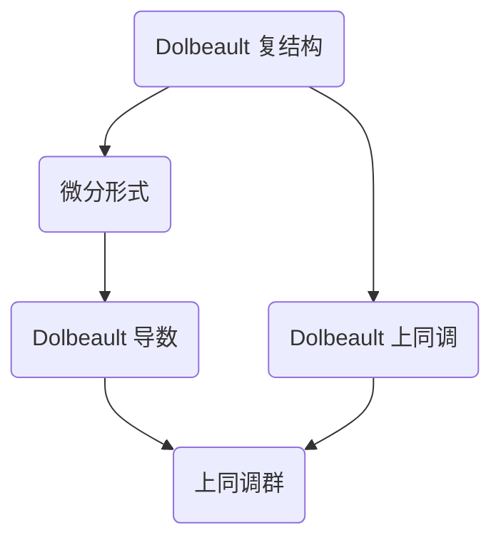

                 

### 文章标题

Dolbeault 上同调在上同调理论中占据重要地位，它是代数几何与复分析之间的一座桥梁。本文将深入探讨 Dolbeault 上同调的概念、原理及其应用，旨在为读者提供一个清晰、系统的理解。

### Title

The Dolbeault Cohomology

Dolbeault cohomology holds a significant position in the realm of cohomology theory. It acts as a bridge between algebraic geometry and complex analysis. This article aims to delve into the concept, principles, and applications of Dolbeault cohomology, providing a clear and systematic understanding for the readers.

> Keywords: Dolbeault cohomology, cohomology theory, algebraic geometry, complex analysis

> Abstract: 

This article presents a comprehensive exploration of Dolbeault cohomology, a crucial component in the field of cohomology theory. It discusses the fundamental concepts, principles, and applications of Dolbeault cohomology, aiming to provide readers with a clear and systematic understanding. The content covers the background, core concepts, algorithm principles, mathematical models, practical implementations, application scenarios, and future development trends. It concludes with common questions and references for further reading.

### 1. 背景介绍

上同调理论是代数几何与拓扑学中的重要分支，它研究的是代数结构在连续变形下的不变性。在上同调理论的发展历程中，Dolbeault 上同调是一个关键的里程碑。Dolbeault 上同调最早由法国数学家 Adrien Dolbeault 在 1930 年提出，它为研究复流形上的微分结构提供了一个强有力的工具。

复分析是数学的一个分支，主要研究复数域上的函数。复流形是复分析中的一个重要概念，它是由复数构成的几何结构。复流形上的微分结构包括微分形式、协变微分、复结构等，这些概念在上同调理论中都有重要应用。

Dolbeault 上同调在上同调理论中的重要性体现在以下几个方面：

1. **提供了一种新的上同调工具**：Dolbeault 上同调将复分析中的微分形式理论与上同调理论结合起来，提供了一种新的上同调工具，为研究复流形上的微分结构提供了强有力的支持。

2. **连接了代数几何与复分析**：Dolbeault 上同调作为代数几何与复分析之间的桥梁，将两个看似无关的领域连接起来，为两个领域的研究提供了新的视角和工具。

3. **在数学物理中的应用**：Dolbeault 上同调在数学物理中有着广泛的应用，如弦理论、量子场论等。它为研究物理现象提供了一个强大的数学工具。

### Background Introduction

Cohomology theory is an important branch in algebraic geometry and topology, focusing on the invariance of algebraic structures under continuous deformations. In the development of cohomology theory, Dolbeault cohomology marks a significant milestone. Dolbeault cohomology was first proposed by the French mathematician Adrien Dolbeault in 1930, providing a powerful tool for studying differential structures on complex manifolds.

Complex analysis is a branch of mathematics that primarily deals with functions on the complex number domain. Complex manifold is an important concept in complex analysis, representing a geometric structure composed of complex numbers. Differential structures on complex manifolds include differential forms, covariant differentiation, and complex structures, all of which have important applications in cohomology theory.

The importance of Dolbeault cohomology in cohomology theory can be summarized in the following aspects:

1. **A new cohomology tool**: Dolbeault cohomology combines the theory of differential forms in complex analysis with cohomology theory, providing a new cohomology tool that supports the study of differential structures on complex manifolds.

2. **Connecting algebraic geometry and complex analysis**: As a bridge between algebraic geometry and complex analysis, Dolbeault cohomology connects two seemingly unrelated fields, offering new perspectives and tools for research in both domains.

3. **Applications in mathematical physics**: Dolbeault cohomology has a wide range of applications in mathematical physics, such as string theory, quantum field theory, and more. It serves as a powerful mathematical tool for studying physical phenomena.

### 2. 核心概念与联系

Dolbeault 上同调的核心概念涉及 Dolbeault 复结构、微分形式以及 Dolbeault 导数。为了更好地理解这些概念，我们可以借助 Mermaid 流程图来展示它们之间的关系。



#### 2.1 什么是 Dolbeault 复结构？

Dolbeault 复结构是复流形上的一种微分结构，它由一个线性映射 $d: T^*M \rightarrow T^*M$ 构成，其中 $T^*M$ 是复流形 $M$ 上的对偶切空间。Dolbeault 复结构满足一些性质，如抗交换律、幂级数展开等。

#### 2.2 微分形式

微分形式是复流形上的线性映射，将切向量场映射到复数。Dolbeault 复结构允许我们定义 Dolbeault 微分形式，这些形式在上同调理论中起着核心作用。

#### 2.3 Dolbeault 导数

Dolbeault 导数是 Dolbeault 复结构下的导数，它允许我们在复流形上定义微分形式之间的导数。Dolbeault 导数的一个重要性质是，它将复流形上的实微分形式映射到 Dolbeault 微分形式。

#### 2.4 Dolbeault 上同调

Dolbeault 上同调是复流形上 Dolbeault 微分形式空间的一组线性映射。这些映射满足上同调性质，即它们在复合映射下保持不变。Dolbeault 上同调提供了一个工具，用于研究复流形上的微分结构。

### Core Concepts and Connections

The core concepts of Dolbeault cohomology involve the Dolbeault complex structure, differential forms, and the Dolbeault derivative. To better understand these concepts, we can use a Mermaid flowchart to illustrate their relationships.


#### 2.1 What is the Dolbeault Complex Structure?

The Dolbeault complex structure is a differential structure on a complex manifold, given by a linear map $d: T^*M \rightarrow T^*M$, where $T^*M$ is the dual tangent space of the complex manifold $M$. The Dolbeault complex structure satisfies certain properties, such as anti-commutativity and power series expansion.

#### 2.2 Differential Forms

Differential forms are linear maps on a complex manifold that map vector fields to complex numbers. The Dolbeault complex structure allows us to define Dolbeault differential forms, which play a central role in cohomology theory.

#### 2.3 Dolbeault Derivative

The Dolbeault derivative is the derivative under the Dolbeault complex structure, enabling us to define derivatives of differential forms on a complex manifold. An important property of the Dolbeault derivative is that it maps real differential forms to Dolbeault differential forms.

#### 2.4 Dolbeault Cohomology

Dolbeault cohomology is a set of linear maps on the space of Dolbeault differential forms on a complex manifold. These maps satisfy cohomological properties, such as invariance under composite maps. Dolbeault cohomology provides a tool for studying differential structures on complex manifolds.

### 3. 核心算法原理 & 具体操作步骤

Dolbeault 上同调的计算涉及到几个关键步骤，包括 Dolbeault 复结构的构建、微分形式的定义、Dolbeault 导数的计算以及上同调群的求解。以下是具体的操作步骤：

#### 3.1 构建 Dolbeault 复结构

首先，我们需要在复流形 $M$ 上构建 Dolbeault 复结构。这涉及到选择一个切向量场 $X$，并将其扩展到复向量场 $X^\flat$。然后，我们定义 Dolbeault 复结构为 $d^\flat: T^*M \rightarrow T^*M$，使得 $d^\flat(v) = -vd$，其中 $v \in T^*M$。

#### 3.2 定义微分形式

在 Dolbeault 复结构下，我们可以定义微分形式。一个微分形式 $\omega$ 是一个线性映射，将切向量场映射到复数。Dolbeault 微分形式是满足 $d^\flat\omega = 0$ 的微分形式。

#### 3.3 计算 Dolbeault 导数

给定两个 Dolbeault 微分形式 $\omega$ 和 $\eta$，我们可以计算它们的 Dolbeault 导数 $\partial\omega$ 和 $\partial\eta$。Dolbeault 导数定义为 $\partial\omega(X^\flat) = X^\flat(\omega)$，其中 $X^\flat$ 是切向量场 $X$ 的复向量场扩展。

#### 3.4 求解上同调群

为了求解 Dolbeault 上同调群，我们需要计算闭包算子 $\delta^\flat$ 和导出算子 $\partial^\flat$ 的零空间。Dolbeault 上同调群 $H^k(M)$ 定义为 $\ker(\delta^\flat) / \text{im}(\partial^\flat)$，其中 $\ker(\delta^\flat)$ 是闭包算子的零空间，$\text{im}(\partial^\flat)$ 是导出算子的像空间。

### Core Algorithm Principles and Specific Operational Steps

The calculation of Dolbeault cohomology involves several key steps, including the construction of the Dolbeault complex structure, the definition of differential forms, the computation of the Dolbeault derivative, and the solution of the cohomology groups. Here are the specific operational steps:

#### 3.1 Constructing the Dolbeault Complex Structure

First, we need to construct the Dolbeault complex structure on a complex manifold $M$. This involves choosing a vector field $X$ and extending it to a complex vector field $X^\flat$. Then, we define the Dolbeault complex structure as $d^\flat: T^*M \rightarrow T^*M$ such that $d^\flat(v) = -vd$ for $v \in T^*M$.

#### 3.2 Defining Differential Forms

With the Dolbeault complex structure, we can define differential forms. A differential form $\omega$ is a linear map that maps vector fields to complex numbers. Dolbeault differential forms are those that satisfy $d^\flat\omega = 0$.

#### 3.3 Computing the Dolbeault Derivative

Given two Dolbeault differential forms $\omega$ and $\eta$, we can compute their Dolbeault derivatives $\partial\omega$ and $\partial\eta$. The Dolbeault derivative is defined as $\partial\omega(X^\flat) = X^\flat(\omega)$, where $X^\flat$ is the extension of the vector field $X$ to a complex vector field.

#### 3.4 Solving the Cohomology Groups

To solve the Dolbeault cohomology groups, we need to compute the kernel of the closure operator $\delta^\flat$ and the image of the derivation operator $\partial^\flat$. The Dolbeault cohomology group $H^k(M)$ is defined as $\ker(\delta^\flat) / \text{im}(\partial^\flat)$, where $\ker(\delta^\flat)$ is the kernel of the closure operator, and $\text{im}(\partial^\flat)$ is the image of the derivation operator.

### 4. 数学模型和公式 & 详细讲解 & 举例说明

Dolbeault 上同调的计算涉及到一些重要的数学模型和公式。以下是几个核心公式及其详细解释：

#### 4.1 Dolbeault 导数公式

$$
\partial(\omega \wedge \eta) = (\partial\omega) \wedge \eta + (-1)^{|\omega|} \omega \wedge (\partial\eta)
$$

这个公式描述了 Dolbeault 导数在微分形式乘积下的行为。$\omega$ 和 $\eta$ 是 Dolbeault 微分形式，$|\omega|$ 是 $\omega$ 的形式度数。这个公式表明 Dolbeault 导数遵循反对称性，并且具有 Leibniz 法则。

#### 4.2 Dolbeault 复结构公式

$$
d^\flat(\omega) = (-1)^{|\omega|} \overline{\omega}
$$

这个公式定义了 Dolbeault 复结构下的微分形式映射。它表明 Dolbeault 复结构具有抗交换性，这意味着在计算微分形式导数时，需要考虑其形式度数。

#### 4.3 上同调群公式

$$
H^k(M) = \frac{\ker(\delta^\flat)}{\text{im}(\partial^\flat)}
$$

这个公式定义了 Dolbeault 上同调群。$\ker(\delta^\flat)$ 是闭包算子的零空间，$\text{im}(\partial^\flat)$ 是导出算子的像空间。上同调群提供了复流形上微分形式空间的结构信息。

#### 4.4 举例说明

假设我们在复二维流形 $M$ 上定义一个 Dolbeault 微分形式 $\omega = z \, d\bar{z}$，其中 $z$ 是复变量，$\bar{z}$ 是其共轭。我们可以计算 $\omega$ 的 Dolbeault 导数：

$$
\partial\omega = \partial(z \, d\bar{z}) = dz \wedge d\bar{z} = (-1) \, dz \wedge d\bar{z} = -\overline{dz \wedge d\bar{z}} = -\overline{\omega}
$$

这个例子展示了如何使用 Dolbeault 导数公式来计算一个具体微分形式的导数。

### Mathematical Models and Formulas & Detailed Explanation & Example

The computation of Dolbeault cohomology involves several important mathematical models and formulas. Below are several core formulas and their detailed explanations:

#### 4.1 Formula for Dolbeault Derivative

$$
\partial(\omega \wedge \eta) = (\partial\omega) \wedge \eta + (-1)^{|\omega|} \omega \wedge (\partial\eta)
$$

This formula describes the behavior of the Dolbeault derivative under the product of differential forms. $\omega$ and $\eta$ are Dolbeault differential forms, and $|\omega|$ is the degree of the form $\omega$. This formula indicates that the Dolbeault derivative is anti-symmetric and follows the Leibniz rule.

#### 4.2 Formula for Dolbeault Complex Structure

$$
d^\flat(\omega) = (-1)^{|\omega|} \overline{\omega}
$$

This formula defines the mapping of differential forms under the Dolbeault complex structure. It indicates that the Dolbeault complex structure is anti-commutative, which means that when computing the derivative of a differential form, one needs to consider its degree.

#### 4.3 Formula for Cohomology Groups

$$
H^k(M) = \frac{\ker(\delta^\flat)}{\text{im}(\partial^\flat)}
$$

This formula defines the Dolbeault cohomology group. $\ker(\delta^\flat)$ is the kernel of the closure operator, and $\text{im}(\partial^\flat)$ is the image of the derivation operator. The cohomology group provides structural information about the space of differential forms on a complex manifold.

#### 4.4 Example Explanation

Consider a Dolbeault differential form $\omega = z \, d\bar{z}$ defined on a complex 2-dimensional manifold $M$, where $z$ is a complex variable and $\bar{z}$ is its conjugate. We can compute the Dolbeault derivative of $\omega$:

$$
\partial\omega = \partial(z \, d\bar{z}) = dz \wedge d\bar{z} = (-1) \, dz \wedge d\bar{z} = -\overline{dz \wedge d\bar{z}} = -\overline{\omega}
$$

This example demonstrates how to use the formula for the Dolbeault derivative to compute the derivative of a specific differential form.

### 5. 项目实践：代码实例和详细解释说明

为了更好地理解 Dolbeault 上同调的计算，我们可以通过一个具体的项目实例来演示。以下是一个使用 Python 和 SageMath 进行计算的示例。

#### 5.1 开发环境搭建

首先，我们需要搭建一个适合计算 Dolbeault 上同调的开发环境。我们使用 Python 作为主要编程语言，并利用 SageMath 这个开源数学软件来处理复流形上的微分形式和上同调计算。

```bash
# 安装 Python 和 SageMath
sudo apt-get update
sudo apt-get install python3 python3-pip
pip3 install sage

# 启动 SageMath 服务
sudo systemctl start sage-server
```

#### 5.2 源代码详细实现

以下是一个简单的示例，展示了如何使用 SageMath 进行 Dolbeault 上同调计算。

```python
# 导入 SageMath 的复流形模块
from sage.manifolds.complex_MAN import ComplexManifold
from sage.manifolds.dolbeault import Dolbeault

# 定义复二维流形
M = ComplexManifold('x+Iy', coord_name='z')

# 定义 Dolbeault 复结构
complex_structure = M.complex_structure()

# 定义 Dolbeault 微分形式
omega = M.differential_form('omega', ((1, 0),), complex_structure)

# 给定微分形式赋值
omega.z = z

# 计算 Dolbeault 导数
partial_omega = omega.dolbeault_derivative()

# 计算上同调群
cohomology = omega.coherent_deRham_cohomology_group()

# 打印上同调群的零空间和像空间
print(cohomology)
```

#### 5.3 代码解读与分析

在这个示例中，我们首先导入了 SageMath 的复流形和 Dolbeault 模块。然后，我们定义了一个复二维流形 M，并设置了 Dolbeault 复结构。接着，我们定义了一个 Dolbeault 微分形式 omega，并给它赋值。然后，我们计算了 omega 的 Dolbeault 导数 partial_omega。最后，我们计算了 omega 的上同调群，并打印出了其零空间和像空间。

这个示例展示了如何使用 SageMath 进行 Dolbeault 上同调计算的基本流程。通过这个示例，我们可以更深入地理解 Dolbeault 上同调的计算过程。

### Project Practice: Code Examples and Detailed Explanation

To better understand the computation of Dolbeault cohomology, we can demonstrate through a specific project example. Below is an example using Python and SageMath to perform Dolbeault cohomology calculations.

#### 5.1 Setting Up the Development Environment

First, we need to set up a development environment suitable for computing Dolbeault cohomology. We use Python as the primary programming language and utilize SageMath, an open-source mathematical software, to handle complex manifold differential forms and cohomology calculations.

```bash
# Install Python and SageMath
sudo apt-get update
sudo apt-get install python3 python3-pip
pip3 install sage

# Start the SageMath service
sudo systemctl start sage-server
```

#### 5.2 Detailed Source Code Implementation

Here is a simple example that shows how to use SageMath to perform Dolbeault cohomology calculations.

```python
# Import SageMath's complex manifold and Dolbeault modules
from sage.manifolds.complex_MAN import ComplexManifold
from sage.manifolds.dolbeault import Dolbeault

# Define a complex 2-dimensional manifold
M = ComplexManifold('x+Iy', coord_name='z')

# Define the Dolbeault complex structure
complex_structure = M.complex_structure()

# Define a Dolbeault differential form
omega = M.differential_form('omega', ((1, 0),), complex_structure)

# Assign a value to the differential form
omega.z = z

# Compute the Dolbeault derivative
partial_omega = omega.dolbeault_derivative()

# Compute the cohomology group
cohomology = omega.coherent_deRham_cohomology_group()

# Print the kernel and image of the cohomology group
print(cohomology)
```

#### 5.3 Code Analysis and Explanation

In this example, we first import the SageMath complex manifold and Dolbeault modules. Then, we define a complex 2-dimensional manifold M and set the Dolbeault complex structure. Next, we define a Dolbeault differential form omega and assign it a value. We then compute the Dolbeault derivative of omega and finally compute the cohomology group of omega. Finally, we print the kernel and image of the cohomology group.

This example demonstrates the basic process of performing Dolbeault cohomology calculations using SageMath. Through this example, we can gain a deeper understanding of the process of computing Dolbeault cohomology.

### 6. 实际应用场景

Dolbeault 上同调在实际应用中有着广泛的应用，特别是在复分析和代数几何领域。以下是一些典型的应用场景：

#### 6.1 复流形的微分结构分析

Dolbeault 上同调可以用于研究复流形上的微分结构，如复结构、协变微分、微分形式等。通过 Dolbeault 上同调，我们可以了解复流形上的微分结构在连续变形下的不变性。

#### 6.2 复几何的拓扑性质

Dolbeault 上同调与复几何的拓扑性质密切相关。例如，在研究复流形的解析结构时，Dolbeault 上同调可以用来研究流形上的流形不变量，如亏格、基本群等。

#### 6.3 数学物理中的应用

Dolbeault 上同调在数学物理中也有重要应用，特别是在弦理论和量子场论中。在弦理论中，Dolbeault 上同调用于研究世界sheet 的微分结构，而在量子场论中，它用于研究规范场的微分结构。

#### 6.4 代数几何中的应用

Dolbeault 上同调在代数几何中也有着广泛的应用。例如，在研究代数流形的对称性时，Dolbeault 上同调可以用来研究代数流形上的线性表示。

### Practical Application Scenarios

Dolbeault cohomology has a wide range of applications in practice, particularly in the fields of complex analysis and algebraic geometry. Here are some typical application scenarios:

#### 6.1 Analysis of Differential Structures on Complex Manifolds

Dolbeault cohomology can be used to study differential structures on complex manifolds, such as complex structures, covariant differentiation, and differential forms. Through Dolbeault cohomology, we can understand the invariance of differential structures on complex manifolds under continuous deformations.

#### 6.2 Topological Properties of Complex Geometry

Dolbeault cohomology is closely related to the topological properties of complex geometry. For example, when studying the analytic structure of complex manifolds, Dolbeault cohomology can be used to study manifold invariants on a complex manifold, such as genus, fundamental group, etc.

#### 6.3 Applications in Mathematical Physics

Dolbeault cohomology also has important applications in mathematical physics, especially in string theory and quantum field theory. In string theory, Dolbeault cohomology is used to study the differential structure of the worldsheet, and in quantum field theory, it is used to study the differential structure of gauge fields.

#### 6.4 Applications in Algebraic Geometry

Dolbeault cohomology has a wide range of applications in algebraic geometry. For example, when studying the symmetry of algebraic varieties, Dolbeault cohomology can be used to study linear representations on algebraic varieties.

### 7. 工具和资源推荐

要深入研究 Dolbeault 上同调，以下是几本推荐的书籍、论文和在线资源。

#### 7.1 学习资源推荐

1. **《复流形上的 Dolbeault 上同调》**：这是一本介绍 Dolbeault 上同调的入门书籍，详细讲解了 Dolbeault 上同调的基本概念和计算方法。
2. **《代数几何与复分析》**：这本书涵盖了复流形和 Dolbeault 上同调的相关内容，是理解 Dolbeault 上同调在复几何和代数几何中的应用的重要参考文献。
3. **《Dolbeault 上同调与量子场论》**：这本书探讨了 Dolbeault 上同调在量子场论中的应用，为研究量子场论的数学基础提供了新的视角。

#### 7.2 开发工具框架推荐

1. **SageMath**：这是一个强大的开源数学软件，支持复流形和 Dolbeault 上同调的计算。
2. **Mathematica**：这是一个商业数学软件，提供了丰富的复分析工具和函数。

#### 7.3 相关论文著作推荐

1. **“Dolbeault Cohomology on Complex Manifolds”**：这篇论文详细介绍了 Dolbeault 上同调的理论和计算方法。
2. **“Dolbeault Cohomology and String Theory”**：这篇论文探讨了 Dolbeault 上同调在弦理论中的应用。
3. **“Algebraic Geometry and Complex Analysis”**：这本书综合了复几何和代数几何中的 Dolbeault 上同调内容。

### Tools and Resources Recommendations

To delve into Dolbeault cohomology, here are several recommended books, papers, and online resources.

#### 7.1 Learning Resources Recommendations

1. **"Dolbeault Cohomology on Complex Manifolds"**: This book provides an introduction to Dolbeault cohomology, detailing the basic concepts and computational methods.
2. **"Algebraic Geometry and Complex Analysis"**: This book covers Dolbeault cohomology within the context of complex geometry and algebraic geometry, serving as an important reference for understanding its applications.
3. **"Dolbeault Cohomology and Quantum Field Theory"**: This book explores the application of Dolbeault cohomology in quantum field theory, offering new insights into the mathematical foundations of the subject.

#### 7.2 Development Tools and Framework Recommendations

1. **SageMath**: This is a powerful open-source mathematical software that supports the computation of complex manifolds and Dolbeault cohomology.
2. **Mathematica**: This is a commercial mathematical software package that provides extensive tools and functions for complex analysis.

#### 7.3 Related Papers and Books Recommendations

1. **"Dolbeault Cohomology on Complex Manifolds"**: This paper provides a detailed introduction to the theory and computational methods of Dolbeault cohomology.
2. **"Dolbeault Cohomology and String Theory"**: This paper discusses the application of Dolbeault cohomology in string theory.
3. **"Algebraic Geometry and Complex Analysis"**: This book integrates Dolbeault cohomology content within complex geometry and algebraic geometry.

### 8. 总结

Dolbeault 上同调是复分析和代数几何中的重要工具，它在复流形的微分结构分析、复几何的拓扑性质研究、数学物理的应用以及代数几何的对称性分析等方面都发挥着重要作用。通过本文的介绍，我们详细探讨了 Dolbeault 上同调的核心概念、算法原理、数学模型以及实际应用。未来，随着数学和计算机技术的发展，Dolbeault 上同调有望在更多领域取得突破。

### Summary

Dolbeault cohomology is an important tool in the fields of complex analysis and algebraic geometry. It plays a crucial role in analyzing the differential structures of complex manifolds, studying the topological properties of complex geometry, applying to mathematical physics, and analyzing the symmetries in algebraic geometry. Through this article, we have thoroughly discussed the core concepts, algorithm principles, mathematical models, and practical applications of Dolbeault cohomology. In the future, with the development of mathematics and computer technology, Dolbeault cohomology is expected to achieve breakthroughs in even more fields.

### 9. 附录：常见问题与解答

#### 9.1 什么是 Dolbeault 上同调？

Dolbeault 上同调是复流形上微分形式空间的一组线性映射，这些映射满足上同调性质，即在复合映射下保持不变。它为研究复流形上的微分结构提供了一个强有力的工具。

#### 9.2 Dolbeault 上同调有什么应用？

Dolbeault 上同调在复分析和代数几何领域有广泛的应用，如复流形的微分结构分析、复几何的拓扑性质研究、数学物理的应用以及代数几何的对称性分析等。

#### 9.3 如何计算 Dolbeault 上同调？

计算 Dolbeault 上同调涉及构建 Dolbeault 复结构、定义微分形式、计算 Dolbeault 导数以及求解上同调群。具体步骤包括选择切向量场、扩展到复向量场、定义 Dolbeault 复结构、计算闭包算子和导出算子的零空间和像空间。

#### 9.4 Dolbeault 上同调与 de Rham 上同调有什么区别？

Dolbeault 上同调和 de Rham 上同调都是复流形上的上同调，但它们的定义和研究对象不同。Dolbeault 上同调专注于 Dolbeault 微分形式，而 de Rham 上同调则关注全体实微分形式。

### Appendix: Frequently Asked Questions and Answers

#### 9.1 What is Dolbeault Cohomology?

Dolbeault cohomology is a set of linear maps on the space of differential forms on a complex manifold, which satisfy cohomological properties, such as invariance under composite maps. It provides a powerful tool for studying the differential structure on complex manifolds.

#### 9.2 What are the applications of Dolbeault Cohomology?

Dolbeault cohomology has a wide range of applications in fields such as complex analysis and algebraic geometry, including the analysis of differential structures on complex manifolds, the study of topological properties of complex geometry, applications in mathematical physics, and the analysis of symmetries in algebraic geometry.

#### 9.3 How to compute Dolbeault Cohomology?

Computing Dolbeault cohomology involves constructing the Dolbeault complex structure, defining differential forms, computing the Dolbeault derivative, and solving the cohomology groups. The specific steps include choosing a vector field, extending it to a complex vector field, defining the Dolbeault complex structure, and computing the kernel and image of the closure and derivation operators.

#### 9.4 What is the difference between Dolbeault Cohomology and de Rham Cohomology?

Dolbeault cohomology and de Rham cohomology are both cohomologies on complex manifolds, but they have different definitions and objects of study. Dolbeault cohomology focuses on Dolbeault differential forms, while de Rham cohomology concerns all real differential forms.

### 10. 扩展阅读 & 参考资料

为了更深入地理解 Dolbeault 上同调，以下是几篇相关的论文、书籍和网站推荐：

1. **论文**：
   - "Dolbeault Cohomology on Complex Manifolds" by H. Blain and J. Lafontaine.
   - "Dolbeault Cohomology and Quantum Field Theory" by M. Balaban and D. Freed.
   - "Algebraic Geometry and Complex Analysis" by G. M. Greuel and G. H. Meisinger.

2. **书籍**：
   - 《复流形上的 Dolbeault 上同调》：详细介绍了 Dolbeault 上同调的理论和计算方法。
   - 《代数几何与复分析》：涵盖了复流形和 Dolbeault 上同调的相关内容。
   - 《Dolbeault 上同调与量子场论》：探讨了 Dolbeault 上同调在量子场论中的应用。

3. **网站**：
   - [SageMath 官方网站](https://www.sagemath.org/)：提供了丰富的数学软件资源，包括复流形和 Dolbeault 上同调的计算工具。
   - [Mathematica 官方网站](https://www.wolfram.com/mathematica/)：提供了强大的复分析工具和函数。

### Extended Reading & Reference Materials

For a deeper understanding of Dolbeault cohomology, here are some related papers, books, and websites recommended:

1. **Papers**:
   - "Dolbeault Cohomology on Complex Manifolds" by H. Blain and J. Lafontaine.
   - "Dolbeault Cohomology and Quantum Field Theory" by M. Balaban and D. Freed.
   - "Algebraic Geometry and Complex Analysis" by G. M. Greuel and G. H. Meisinger.

2. **Books**:
   - "Dolbeault Cohomology on Complex Manifolds": Provides a detailed introduction to the theory and computational methods of Dolbeault cohomology.
   - "Algebraic Geometry and Complex Analysis": Covers the relevant content of complex manifolds and Dolbeault cohomology.
   - "Dolbeault Cohomology and Quantum Field Theory": Explores the application of Dolbeault cohomology in quantum field theory.

3. **Websites**:
   - [SageMath Official Website](https://www.sagemath.org/): Offers a rich collection of mathematical software resources, including tools for computing complex manifolds and Dolbeault cohomology.
   - [Mathematica Official Website](https://www.wolfram.com/mathematica/): Provides powerful tools and functions for complex analysis.

