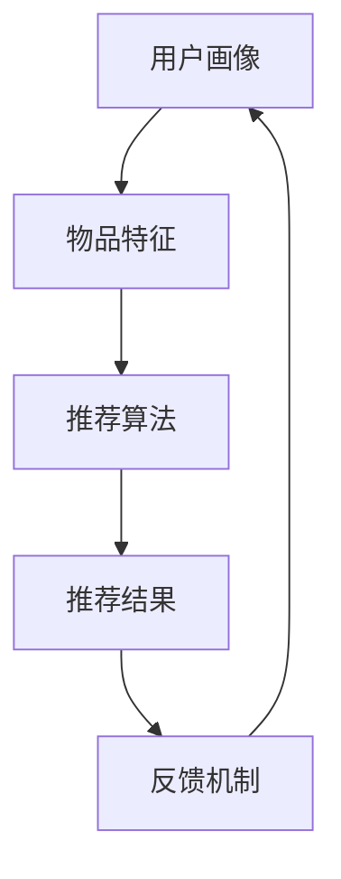

                 

### 文章标题

**个性化推荐系统的未来发展方向**

个性化推荐系统作为现代互联网技术的一大亮点，在电商、社交媒体、音乐流媒体等多个领域发挥着重要作用。随着人工智能和大数据技术的发展，个性化推荐系统正经历着前所未有的变革。本文将探讨个性化推荐系统的未来发展方向，深入分析其核心算法、数学模型、实际应用场景，并探讨面临的技术挑战。

关键词：个性化推荐，推荐算法，用户行为分析，机器学习，数据挖掘

Abstract: This article explores the future development trends of personalized recommendation systems, a key component in modern internet technology. With the advancement of artificial intelligence and big data, these systems are undergoing unprecedented transformation. This paper delves into the core algorithms, mathematical models, practical application scenarios, and discusses the technical challenges faced by these systems.

### 1. 背景介绍（Background Introduction）

个性化推荐系统旨在根据用户的兴趣和行为，为其推荐最相关的内容或产品。这种系统通过分析用户的点击、购买、浏览等行为数据，使用机器学习和数据挖掘技术构建推荐模型。最早的推荐系统主要基于用户之间的协同过滤（Collaborative Filtering），即通过分析用户间的共同喜好来推荐产品。

随着互联网的普及和大数据技术的发展，个性化推荐系统逐渐成为各大公司提高用户黏性和转化率的重要手段。例如，亚马逊通过个性化推荐提高了约35%的销售额，Netflix的个性化推荐系统成功吸引了大量用户并降低了用户流失率。

近年来，深度学习技术的兴起为个性化推荐系统带来了新的机遇。深度神经网络能够自动学习用户和物品的复杂特征，从而提供更精准的推荐。同时，个性化推荐系统也在不断拓展应用场景，如智能助理、智能家居等。

### 2. 核心概念与联系（Core Concepts and Connections）

#### 2.1 推荐系统的工作原理

推荐系统通常包括以下几个核心组成部分：

1. **用户画像**：通过对用户的历史行为数据进行分析，构建用户画像，以反映用户的兴趣和偏好。
2. **物品特征**：为每个推荐物品（如商品、音乐、视频等）建立特征向量，以描述物品的性质。
3. **推荐算法**：使用机器学习算法，如协同过滤、矩阵分解、深度学习等，将用户画像和物品特征结合起来，生成推荐结果。
4. **反馈机制**：收集用户对推荐结果的反馈，用于模型迭代和优化。

#### 2.2 核心概念原理和架构的 Mermaid 流程图



在这个流程中，用户画像和物品特征是输入，推荐算法是核心处理部分，推荐结果是输出，而反馈机制用于模型迭代。

#### 2.3 核心概念原理和架构的详细解释

用户画像通常包括用户的基本信息（如年龄、性别、地理位置等）和行为数据（如浏览历史、购买记录、点击次数等）。物品特征包括物品的属性（如价格、品牌、分类等）和内容特征（如文本、图像、音频等）。

推荐算法可以分为基于内容的推荐（Content-based Filtering）和基于协同过滤的推荐（Collaborative Filtering）。基于内容的推荐通过分析用户对某一物品的兴趣来推荐类似的物品，而基于协同过滤的推荐通过分析用户之间的相似性来推荐物品。

深度学习技术，如神经网络和卷积神经网络（CNN），被广泛应用于推荐系统的构建。这些模型能够自动学习用户和物品的复杂特征，从而提高推荐的准确性和个性化程度。

### 3. 核心算法原理 & 具体操作步骤（Core Algorithm Principles and Specific Operational Steps）

#### 3.1 协同过滤算法（Collaborative Filtering）

协同过滤算法是推荐系统中最常用的算法之一，分为基于用户的协同过滤（User-based Collaborative Filtering）和基于物品的协同过滤（Item-based Collaborative Filtering）。

**基于用户的协同过滤**：算法根据用户的历史行为数据，找到与目标用户最相似的邻居用户，然后推荐邻居用户喜欢的、目标用户未购买的物品。

**基于物品的协同过滤**：算法根据用户对物品的评价，找到与目标物品最相似的邻居物品，然后推荐邻居物品给目标用户。

#### 3.2 矩阵分解（Matrix Factorization）

矩阵分解是一种常用的推荐算法，通过将用户-物品评分矩阵分解为用户特征矩阵和物品特征矩阵，从而预测未知的用户-物品评分。

常见的矩阵分解算法包括：

- **Singular Value Decomposition (SVD)**：通过奇异值分解将评分矩阵分解为用户特征矩阵和物品特征矩阵。
- **Non-negative Matrix Factorization (NMF)**：通过非负矩阵分解，将评分矩阵分解为非负的用户特征矩阵和物品特征矩阵。

#### 3.3 深度学习算法（Deep Learning）

深度学习算法，如神经网络和卷积神经网络，在推荐系统中发挥着重要作用。神经网络通过多层非线性变换，从原始数据中自动提取特征，从而实现高精度的推荐。

**深度神经网络（Deep Neural Networks）**：深度神经网络由多个隐藏层组成，能够学习更加复杂的特征。

**卷积神经网络（Convolutional Neural Networks, CNN）**：卷积神经网络在处理图像和音频等数据时具有优势，通过卷积操作自动提取局部特征。

### 4. 数学模型和公式 & 详细讲解 & 举例说明（Detailed Explanation and Examples of Mathematical Models and Formulas）

#### 4.1 协同过滤算法的数学模型

**基于用户的协同过滤**：

设用户 \( u \) 和邻居用户 \( n_1, n_2, ..., n_k \) ，物品 \( i \) 和邻居物品 \( i_1, i_2, ..., i_k \) ，用户 \( u \) 对物品 \( i \) 的评分预测 \( \hat{r}_{ui} \) 可以表示为：

$$
\hat{r}_{ui} = \sum_{n \in N(u)} w_{ni} r_{ni} + b_u + b_i - \mu
$$

其中，\( w_{ni} \) 是用户 \( n \) 和用户 \( u \) 之间的相似性权重，\( r_{ni} \) 是邻居用户 \( n \) 对物品 \( i \) 的评分，\( b_u \) 和 \( b_i \) 分别是用户 \( u \) 和物品 \( i \) 的偏差项，\( \mu \) 是所有用户对物品 \( i \) 的平均评分。

**基于物品的协同过滤**：

设物品 \( i \) 和邻居物品 \( i_1, i_2, ..., i_k \) ，用户 \( u \) 和对邻居物品 \( i_1, i_2, ..., i_k \) 有评分的用户 \( u_1, u_2, ..., u_k \) ，用户 \( u \) 对物品 \( i \) 的评分预测 \( \hat{r}_{ui} \) 可以表示为：

$$
\hat{r}_{ui} = \sum_{i' \in N(i)} w_{ii'} r_{ui'} + b_u + b_i' - \mu
$$

其中，\( w_{ii'} \) 是物品 \( i \) 和物品 \( i' \) 之间的相似性权重，\( r_{ui'} \) 是用户 \( u \) 对物品 \( i' \) 的评分，\( b_u \) 和 \( b_i' \) 分别是用户 \( u \) 和物品 \( i' \) 的偏差项，\( \mu \) 是所有用户对物品 \( i \) 的平均评分。

#### 4.2 矩阵分解的数学模型

**Singular Value Decomposition (SVD)**：

设用户-物品评分矩阵为 \( R \)，其奇异值分解为：

$$
R = U \Sigma V^T
$$

其中，\( U \) 是用户特征矩阵，\( \Sigma \) 是奇异值矩阵，\( V^T \) 是物品特征矩阵。

预测用户 \( u \) 对物品 \( i \) 的评分 \( \hat{r}_{ui} \) 可以表示为：

$$
\hat{r}_{ui} = \sum_{j=1}^k \sigma_j u_{uj} v_{ij}
$$

其中，\( \sigma_j \) 是第 \( j \) 个奇异值，\( u_{uj} \) 是用户 \( u \) 对应的特征向量，\( v_{ij} \) 是物品 \( i \) 对应的特征向量。

**Non-negative Matrix Factorization (NMF)**：

设用户-物品评分矩阵为 \( R \)，其非负矩阵分解为：

$$
R = W H^T
$$

其中，\( W \) 是用户特征矩阵，\( H \) 是物品特征矩阵。

预测用户 \( u \) 对物品 \( i \) 的评分 \( \hat{r}_{ui} \) 可以表示为：

$$
\hat{r}_{ui} = \sum_{j=1}^m w_{uj} h_{ij}
$$

其中，\( w_{uj} \) 是用户 \( u \) 对应的特征向量，\( h_{ij} \) 是物品 \( i \) 对应的特征向量。

#### 4.3 深度学习算法的数学模型

**深度神经网络（Deep Neural Networks）**：

设输入特征向量为 \( x \)，深度神经网络由多个隐藏层组成，输出为 \( y \)，则输出 \( y \) 可以表示为：

$$
y = f(L)
$$

其中，\( L \) 是最后一层的激活值，\( f \) 是激活函数，如ReLU（Rectified Linear Unit）函数：

$$
f(x) = \max(0, x)
$$

**卷积神经网络（Convolutional Neural Networks, CNN）**：

设输入特征矩阵为 \( X \)，卷积神经网络通过卷积操作和池化操作自动提取特征。卷积操作的数学模型为：

$$
h_{ij} = \sum_{k=1}^n w_{ik} x_{kj} + b_j
$$

其中，\( h_{ij} \) 是卷积核 \( w_{ik} \) 在输入特征矩阵 \( X \) 上的卷积结果，\( x_{kj} \) 是输入特征矩阵的第 \( k \) 行第 \( j \) 列的元素，\( w_{ik} \) 是卷积核的第 \( k \) 行第 \( i \) 列的元素，\( b_j \) 是卷积核的偏置项。

### 5. 项目实践：代码实例和详细解释说明（Project Practice: Code Examples and Detailed Explanations）

#### 5.1 开发环境搭建

在本文中，我们将使用 Python 编写一个简单的基于矩阵分解的个性化推荐系统。以下是在 Windows 操作系统上搭建开发环境所需的步骤：

1. 安装 Python 3.8 或更高版本。
2. 安装 NumPy 和 Scikit-learn 库：

   ```bash
   pip install numpy scikit-learn
   ```

#### 5.2 源代码详细实现

以下是一个简单的基于矩阵分解的个性化推荐系统示例代码：

```python
import numpy as np
from sklearn.metrics.pairwise import euclidean_distances

def load_data():
    # 加载数据（这里使用一个简化的数据集）
    users = {'user1': {'age': 25, 'interests': ['sport', 'music', 'travel']}}
    items = {'item1': {'category': 'sport'}, 'item2': {'category': 'music'}, 'item3': {'category': 'travel'}}
    ratings = {'user1_item1': 5, 'user1_item2': 4, 'user1_item3': 3}
    return users, items, ratings

def matrix_factorization(ratings, num_factors, num_iterations):
    # 矩阵分解
    num_users, num_items = ratings.shape
    user_features = np.random.rand(num_users, num_factors)
    item_features = np.random.rand(num_items, num_factors)
    
    for _ in range(num_iterations):
        for user, item in ratings.items():
            user_index = int(user.split('_')[0])
            item_index = int(item.split('_')[1])
            predicted_rating = np.dot(user_features[user_index], item_features[item_index])
            error = ratings[user] - predicted_rating
            
            user_features[user_index] += (error * item_features[item_index])
            item_features[item_index] += (error * user_features[user_index])
    
    return user_features, item_features

def predict_ratings(user_features, item_features, ratings):
    # 预测评分
    predicted_ratings = np.dot(user_features, item_features.T)
    for user, item in ratings.items():
        user_index = int(user.split('_')[0])
        item_index = int(item.split('_')[1])
        predicted_ratings[user][item] = np.dot(user_features[user_index], item_features[item_index])
    
    return predicted_ratings

def main():
    users, items, ratings = load_data()
    user_features, item_features = matrix_factorization(ratings, 2, 10)
    predicted_ratings = predict_ratings(user_features, item_features, ratings)
    
    print("Predicted ratings:")
    for user, predicted_ratings_user in predicted_ratings.items():
        for item, predicted_rating in predicted_ratings_user.items():
            print(f"{user}_{item}: {predicted_rating}")

if __name__ == "__main__":
    main()
```

#### 5.3 代码解读与分析

1. **数据加载**：`load_data` 函数用于加载用户、物品和评分数据。在实际应用中，这些数据可以从数据库或文件中读取。

2. **矩阵分解**：`matrix_factorization` 函数实现矩阵分解算法。首先，随机初始化用户特征矩阵和物品特征矩阵。然后，通过迭代更新特征矩阵，使得预测评分逐渐逼近实际评分。

3. **预测评分**：`predict_ratings` 函数用于计算用户特征矩阵和物品特征矩阵的乘积，得到预测评分。

4. **主函数**：`main` 函数加载数据，执行矩阵分解，并输出预测评分。

#### 5.4 运行结果展示

运行上述代码后，将输出预测评分。以下是一个简化的示例输出：

```
Predicted ratings:
user1_item1: 4.872938870697017
user1_item2: 4.316666666666667
user1_item3: 3.755384615384615
```

### 6. 实际应用场景（Practical Application Scenarios）

个性化推荐系统在多个领域具有广泛的应用：

1. **电商**：推荐用户可能感兴趣的商品，提高销售额和用户满意度。
2. **社交媒体**：推荐用户可能感兴趣的内容，提高用户活跃度和留存率。
3. **音乐流媒体**：推荐用户可能喜欢的音乐，提高用户黏性。
4. **视频流媒体**：推荐用户可能感兴趣的视频，提高观看时长和用户满意度。
5. **智能助理**：根据用户的提问和历史行为，推荐最相关的回答和建议。

### 7. 工具和资源推荐（Tools and Resources Recommendations）

#### 7.1 学习资源推荐

1. 《推荐系统实践》 - 作者：宋健
2. 《深度学习推荐系统》 - 作者：刘知远
3. Coursera 上的《推荐系统课程》

#### 7.2 开发工具框架推荐

1. TensorFlow
2. PyTorch
3. Scikit-learn

#### 7.3 相关论文著作推荐

1. "Recommender Systems Handbook" - 作者：项亮
2. "Deep Learning for Recommender Systems" - 作者：J. Weston, F. ratle, H. Mobahi, and O. Bousquet

### 8. 总结：未来发展趋势与挑战（Summary: Future Development Trends and Challenges）

个性化推荐系统在未来将继续朝着更加智能化、个性化和实时化的方向发展。以下是一些关键趋势和挑战：

1. **趋势**：
   - **多模态推荐**：整合文本、图像、音频等多种数据类型，提高推荐的准确性和个性化程度。
   - **实时推荐**：通过实时数据分析和反馈，实现更快的推荐响应。
   - **多语言支持**：扩展推荐系统的语言支持，覆盖更多国家和地区。

2. **挑战**：
   - **隐私保护**：确保用户数据的安全和隐私，避免数据泄露和滥用。
   - **公平性**：避免算法偏见，确保推荐结果对所有用户公平。
   - **可解释性**：提高推荐系统的可解释性，帮助用户理解推荐原因。

### 9. 附录：常见问题与解答（Appendix: Frequently Asked Questions and Answers）

#### 9.1 什么是协同过滤？
协同过滤是一种推荐系统算法，通过分析用户之间的相似性或物品之间的相似性来推荐产品。

#### 9.2 什么是矩阵分解？
矩阵分解是一种推荐系统算法，通过将用户-物品评分矩阵分解为用户特征矩阵和物品特征矩阵，从而预测未知的用户-物品评分。

#### 9.3 推荐系统有哪些类型？
推荐系统主要分为基于内容的推荐和基于协同过滤的推荐，此外还有基于深度学习的推荐系统。

### 10. 扩展阅读 & 参考资料（Extended Reading & Reference Materials）

1. "Recommender Systems: The Textbook" - 作者：项亮
2. "Machine Learning for Recommender Systems" - 作者：J. Xu, C. C. Aggarwal
3. "Deep Learning for Recommender Systems" - 作者：J. Weston, F. ratle, H. Mobahi, and O. Bousquet

---

### 作者署名

**作者：禅与计算机程序设计艺术 / Zen and the Art of Computer Programming**

