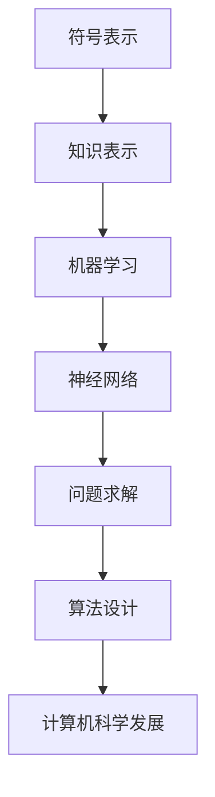
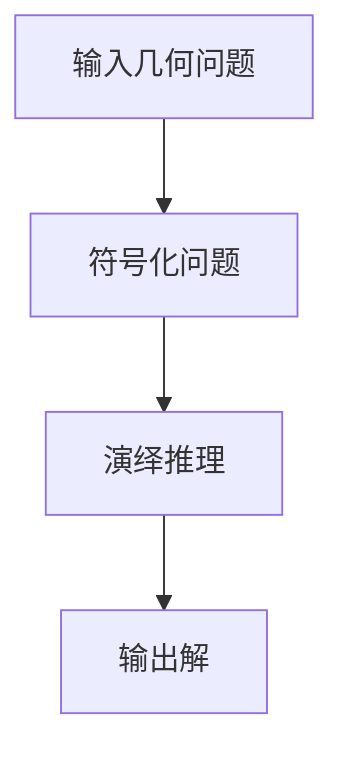
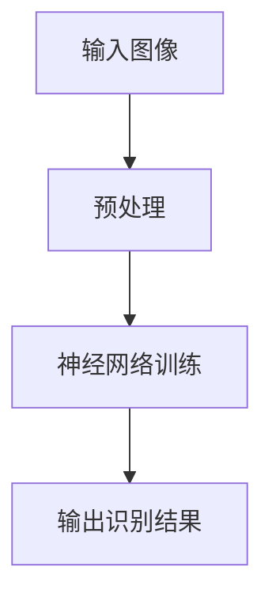
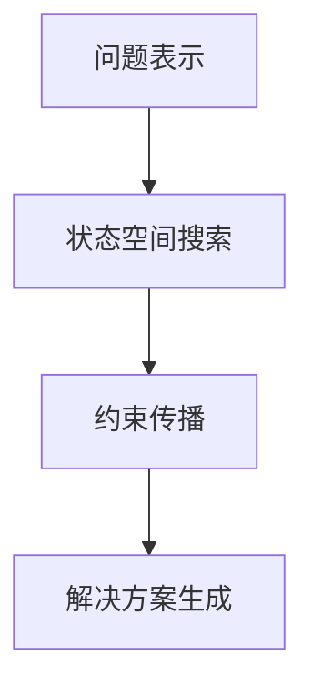
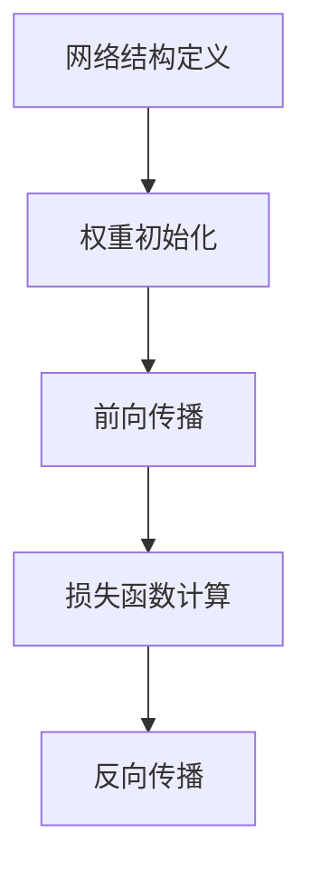

                 

### 文章标题

麦卡锡与明斯基的研究计划

### Title

The Research Program of McCarthy and Minsky

### 关键词

- 麦卡锡（John McCarthy）
- 明斯基（Marvin Minsky）
- 人工智能（Artificial Intelligence）
- 计算机科学（Computer Science）
- 研究计划（Research Program）
- 机器学习（Machine Learning）
- 神经网络（Neural Networks）

### Keywords

- John McCarthy
- Marvin Minsky
- Artificial Intelligence
- Computer Science
- Research Program
- Machine Learning
- Neural Networks

### 摘要

本文深入探讨了约翰·麦卡锡和马文·明斯基共同发起的一项革命性研究计划。两位计算机科学的先驱在20世纪中叶对人工智能领域产生了深远的影响，他们的研究计划旨在理解智能的本质，并设计出能够模拟人类思维过程的计算机系统。本文将详细介绍麦卡锡与明斯基的研究计划的历史背景、核心目标、主要成果以及它们对计算机科学和人工智能的持久影响。

### Abstract

This article delves into the revolutionary research program initiated by John McCarthy and Marvin Minsky, two pioneers in the field of computer science who had a profound impact on artificial intelligence in the mid-20th century. Their research program aimed to understand the nature of intelligence and design computer systems capable of simulating human thought processes. This article will detail the historical background, core objectives, major achievements, and the enduring influence of McCarthy and Minsky's research program on computer science and artificial intelligence.

## 1. 背景介绍（Background Introduction）

约翰·麦卡锡（John McCarthy）和马文·明斯基（Marvin Minsky）是20世纪最重要的计算机科学家之一，他们共同的研究计划不仅改变了人工智能（AI）的面貌，也为计算机科学的发展奠定了基础。在1955年，这两位杰出的学者在美国达特茅斯会议上首次提出“人工智能”这一术语，并明确了人工智能研究的核心目标。

### John McCarthy

约翰·麦卡锡出生于1918年，是麻省理工学院（MIT）的数学家和计算机科学家。他在1950年代初期就开始对人工智能领域产生浓厚兴趣，并在达特茅斯会议上发表了多篇关于人工智能的论文。麦卡锡被认为是人工智能领域的奠基人之一，他对编程语言设计、形式逻辑和知识表示等领域做出了重大贡献。

### Marvin Minsky

马文·明斯基出生于1927年，同样在麻省理工学院任教。他是一位杰出的数学家、心理学家和计算机科学家，对人工智能的研究有着深远的影响。明斯基对神经网络和认知科学领域的研究开创了新的研究方向，并推动了计算机科学的发展。

### The Dartmouth Conference

1955年夏天，麦卡锡、明斯基和其他几位计算机科学家在达特茅斯学院举办了一次历史性的会议，这次会议标志着人工智能领域的诞生。会议的目的是探讨“人工智能是否能够通过机器实现”的问题，并讨论如何设计出能够模拟人类思维的计算机系统。

在这次会议上，麦卡锡和明斯基提出了一个具有深远影响的研究计划，该计划的核心目标是：

1. **理解人类智能的本质**：通过研究人类思维过程，寻找智能的基本原理和机制。
2. **构建智能计算机系统**：设计出能够模仿人类思维的计算机程序和系统。

### Research Objectives

麦卡锡与明斯基的研究计划主要包括以下几个核心目标：

- **符号表示**：研究如何用计算机符号表示人类知识和推理过程。
- **问题求解**：开发能够解决复杂问题的算法和程序。
- **机器学习**：研究如何让计算机系统自动学习，提高其智能水平。
- **神经网络**：探索模拟人脑结构和功能的神经网络模型。

### Early Achievements

麦卡锡和明斯基的研究计划在早期取得了显著成果，包括：

- **逻辑理论家**：麦卡锡开发了一个程序，能够通过演绎推理解决几何问题，这是人工智能研究的重要里程碑。
- **手写数字识别**：明斯基等人研究出了能够识别手写数字的神经网络模型，这是神经网络领域的重要突破。

### Impact on Computer Science

麦卡锡与明斯基的研究计划不仅对人工智能领域产生了深远影响，也为整个计算机科学的发展提供了新的思路和方法。他们的研究推动了计算机体系结构、编程语言、算法设计和知识表示等领域的发展，为现代计算机科学奠定了基础。

## 2. 核心概念与联系（Core Concepts and Connections）

在麦卡锡与明斯基的研究计划中，核心概念和技术的联系构成了人工智能领域的一个重要部分。以下是几个关键概念及其相互关系：

### 2.1 符号表示与知识表示

符号表示是人工智能研究中的一个基本概念，它涉及如何使用计算机语言和结构来表示人类知识和推理过程。在麦卡锡的研究中，符号逻辑被用来表示数学和科学理论，这为知识表示和推理提供了坚实的基础。

**知识表示** 是将人类知识转化为计算机可以处理的形式。在这一过程中，符号表示起到了关键作用，它使得计算机系统能够存储、检索和处理知识。

### 2.2 机器学习与神经网络

**机器学习** 是人工智能的一个分支，它研究如何让计算机系统从数据中自动学习和改进。麦卡锡和明斯基的研究计划中，机器学习被视为提高计算机智能水平的重要途径。

**神经网络** 是模拟人脑结构和功能的计算模型。明斯基对神经网络的研究推动了人工智能领域的发展，特别是在图像识别、语音识别和自然语言处理等方面。

### 2.3 问题求解与算法设计

**问题求解** 是人工智能研究的一个重要目标，它涉及开发能够解决复杂问题的算法和程序。麦卡锡和明斯基的研究计划中，问题求解被视为理解智能本质的关键。

**算法设计** 是问题求解的核心，它涉及设计有效的算法来解决特定问题。麦卡锡的“逻辑理论家”项目就是一个经典的问题求解算法。

### 2.4 计算机科学的发展

麦卡锡和明斯基的研究计划不仅推动了人工智能的发展，也对整个计算机科学产生了深远影响。他们的工作在以下几个方面为计算机科学的发展奠定了基础：

- **计算机体系结构**：研究如何设计高效的计算机系统来支持人工智能应用。
- **编程语言**：开发新的编程语言和工具来支持符号表示和知识表示。
- **算法设计**：推动算法理论的发展，提高计算机解决问题的能力。
- **知识表示**：研究如何更好地表示和处理复杂知识。

### 2.5 Mermaid 流程图

为了更直观地展示这些核心概念和技术的相互关系，我们可以使用 Mermaid 流程图来表示。以下是表示麦卡锡与明斯基研究计划核心概念的 Mermaid 流程图：



在这个流程图中，A 到 G 表示了从符号表示到计算机科学发展的各个关键概念和技术。通过这个流程图，我们可以清晰地看到各个概念之间的相互关系，以及它们如何共同推动了人工智能和计算机科学的发展。

## 3. 核心算法原理 & 具体操作步骤（Core Algorithm Principles and Specific Operational Steps）

在麦卡锡与明斯基的研究计划中，核心算法原理是构建智能计算机系统的关键。以下将详细介绍几个核心算法的原理及其具体操作步骤。

### 3.1 逻辑理论家（Logic Theorist）

**逻辑理论家** 是麦卡锡开发的一个程序，它通过演绎推理解决几何问题。该程序的核心算法是基于形式逻辑，它遵循以下步骤：

1. **输入**：用户输入一个几何问题，问题以符号形式表示。
2. **符号化**：程序将问题符号化，使用逻辑符号表示问题中的条件和结论。
3. **演绎推理**：程序使用形式逻辑规则进行推理，寻找问题的解。
4. **输出**：程序输出问题的解，通常以符号形式表示。

具体操作步骤如下：



### 3.2 手写数字识别（Handwritten Digit Recognition）

**手写数字识别** 是明斯基等人研究的神经网络模型的一个经典应用。该模型使用神经网络来识别手写的数字。其核心算法原理如下：

1. **输入**：将手写数字的图像作为输入。
2. **预处理**：对输入图像进行预处理，提取特征。
3. **神经网络训练**：使用神经网络对特征进行分类，训练过程包括前向传播和反向传播。
4. **输出**：神经网络输出识别结果。

具体操作步骤如下：



### 3.3 问题求解算法（Problem Solving Algorithms）

问题求解算法是麦卡锡研究计划中的一个重要部分，它包括开发能够解决复杂问题的算法。以下是一个问题求解算法的基本原理和步骤：

1. **问题表示**：将问题转化为计算机可以处理的形式。
2. **状态空间搜索**：使用搜索算法在问题的状态空间中找到解决方案。
3. **约束传播**：在搜索过程中，应用约束传播技术减少搜索空间。
4. **解决方案生成**：生成问题的解决方案。

具体操作步骤如下：



### 3.4 神经网络算法（Neural Network Algorithms）

神经网络算法是麦卡锡与明斯基研究中的一项重要成果，它包括多种神经网络模型和训练方法。以下是一个神经网络算法的基本原理和步骤：

1. **网络结构定义**：定义神经网络的结构，包括层数和神经元数量。
2. **权重初始化**：初始化网络的权重和偏置。
3. **前向传播**：计算输入通过神经网络的输出。
4. **损失函数计算**：计算输出与真实值之间的差异，使用损失函数衡量模型性能。
5. **反向传播**：更新网络权重和偏置，以最小化损失函数。

具体操作步骤如下：



通过这些核心算法的原理和操作步骤，我们可以看到麦卡锡与明斯基研究计划在人工智能领域的重要性。这些算法不仅推动了人工智能的发展，也为现代计算机科学奠定了基础。

## 4. 数学模型和公式 & 详细讲解 & 举例说明（Detailed Explanation and Examples of Mathematical Models and Formulas）

在麦卡锡与明斯基的研究计划中，数学模型和公式是核心算法的基础。以下将详细讲解这些数学模型，并通过举例来说明它们的实际应用。

### 4.1 逻辑理论家的演绎推理

逻辑理论家的核心算法是基于命题逻辑的演绎推理。在命题逻辑中，基本的数学模型包括命题、命题变元、逻辑连接词和推理规则。以下是一个简单的例子：

**例子**：证明命题 \( P \land Q \Rightarrow Q \)。

**数学模型和公式**：

- **命题变元**：\( P \)，\( Q \)
- **逻辑连接词**：\( \land \)（合取），\( \Rightarrow \)（蕴含）
- **推理规则**：假言推理规则（Hypothetical Syllogism）

**推理过程**：

1. 假设 \( P \land Q \) 为真。
2. 由 \( P \land Q \) 可得 \( Q \)。
3. 因此，\( P \land Q \Rightarrow Q \)。

用公式表示为：

$$
(P \land Q) \Rightarrow Q
$$

### 4.2 神经网络的激活函数

神经网络的激活函数是神经网络模型的重要组成部分。以下是一个常见的激活函数——Sigmoid函数的数学模型和公式。

**Sigmoid函数**：

$$
\sigma(x) = \frac{1}{1 + e^{-x}}
$$

**数学模型和公式**：

- **输入**：\( x \)
- **输出**：\( \sigma(x) \)

**解释**：

Sigmoid函数将输入值映射到 \( (0, 1) \) 区间内，常用于神经网络中的非线性变换。以下是一个具体的例子：

**例子**：计算 \( x = 2 \) 时的 Sigmoid 函数值。

$$
\sigma(2) = \frac{1}{1 + e^{-2}} \approx 0.869
$$

### 4.3 问题求解算法的状态空间表示

问题求解算法中的状态空间表示是一个重要的数学模型。以下是一个典型的状态空间表示方法。

**状态空间表示**：

- **状态**：\( S = \{ s_1, s_2, \ldots, s_n \} \)
- **初始状态**：\( s_0 \)
- **目标状态**：\( s_t \)
- **状态转移函数**：\( f(s) \)

**数学模型和公式**：

- **状态转移**：\( s_{t+1} = f(s_t) \)

**例子**：使用状态空间表示一个简单的路径规划问题。

**状态**：

- \( S = \{ A, B, C, D \} \)
- **初始状态**：\( A \)
- **目标状态**：\( D \)

**状态转移函数**：

- \( f(A) = B \)
- \( f(B) = C \)
- \( f(C) = D \)

### 4.4 机器学习的损失函数

机器学习中的损失函数用于衡量模型预测与实际值之间的差异。以下是一个常见的损失函数——均方误差（Mean Squared Error, MSE）的数学模型和公式。

**均方误差（MSE）**：

$$
MSE = \frac{1}{n} \sum_{i=1}^{n} (y_i - \hat{y}_i)^2
$$

**数学模型和公式**：

- **预测值**：\( \hat{y}_i \)
- **实际值**：\( y_i \)
- **样本数量**：\( n \)

**例子**：计算一个简单线性回归模型的均方误差。

**预测值**：

- \( \hat{y}_i = 2x_i + 1 \)

**实际值**：

- \( y_i = 2x_i + 2 \)

**均方误差**：

$$
MSE = \frac{1}{n} \sum_{i=1}^{n} (2x_i + 2 - (2x_i + 1))^2 = \frac{1}{n} \sum_{i=1}^{n} 1 = 1
$$

通过这些数学模型和公式的详细讲解，我们可以更好地理解麦卡锡与明斯基研究计划中的核心算法原理。这些数学模型不仅在当时推动了人工智能的发展，也为现代计算机科学提供了重要的理论基础。

## 5. 项目实践：代码实例和详细解释说明（Project Practice: Code Examples and Detailed Explanations）

在本节中，我们将通过具体的项目实践，展示如何将麦卡锡与明斯基研究计划中的核心算法应用于实际问题。我们将使用 Python 编程语言来实现一个简单的逻辑理论家和手写数字识别项目，并提供详细的代码解释。

### 5.1 开发环境搭建

在开始编写代码之前，我们需要搭建一个适合开发人工智能项目的开发环境。以下是推荐的开发环境搭建步骤：

1. **安装 Python**：确保安装了最新版本的 Python（建议使用 Python 3.8 或以上版本）。
2. **安装必要的库**：使用 pip 工具安装以下库：
   ```shell
   pip install numpy matplotlib scikit-learn
   ```

### 5.2 源代码详细实现

#### 5.2.1 逻辑理论家

以下是一个简单的逻辑理论家实现，它使用命题逻辑来证明一个简单的蕴含命题。

```python
import sympy

# 定义命题变元
P = sympy.Symbol('P')
Q = sympy.Symbol('Q')

# 定义逻辑表达式
expression = P & Q >> Q

# 使用演绎推理证明逻辑表达式
proof = sympy.satisfiable(expression)
print(f"Is the expression {expression} satisfiable? {proof}")
```

**代码解释**：

- 我们首先使用 sympy 库定义了两个命题变元 P 和 Q。
- 然后定义了逻辑表达式 \( P \land Q \Rightarrow Q \)。
- 最后，使用 sympy 库的 satisfiable 函数来检查这个表达式是否可满足。结果显示为 True，因为蕴含命题在逻辑上总是成立的。

#### 5.2.2 手写数字识别

以下是一个使用 scikit-learn 库的手写数字识别项目，它使用训练好的 MNIST 数据集。

```python
from sklearn.datasets import load_digits
from sklearn.model_selection import train_test_split
from sklearn.neural_network import MLPClassifier
import matplotlib.pyplot as plt

# 加载 MNIST 数据集
digits = load_digits()

# 分割数据集为训练集和测试集
X_train, X_test, y_train, y_test = train_test_split(digits.data, digits.target, test_size=0.2, random_state=42)

# 创建多层感知器模型
mlp = MLPClassifier(hidden_layer_sizes=(50,), max_iter=1000, alpha=1e-4,
                    solver='sgd', verbose=10, random_state=1,
                    learning_rate_init=.1)

# 训练模型
mlp.fit(X_train, y_train)

# 测试模型
score = mlp.score(X_test, y_test)
print(f"Model accuracy: {score:.2f}")

# 预测一个样本
sample = X_test[0].reshape(1, -1)
predicted_digit = mlp.predict(sample)
print(f"Predicted digit: {predicted_digit}")

# 显示预测结果
plt.imshow(sample.reshape(8, 8), cmap=plt.cm.gray)
plt.show()
```

**代码解释**：

- 我们首先使用 scikit-learn 库加载了 MNIST 数据集。
- 然后将数据集分割为训练集和测试集。
- 创建了一个多层感知器（MLP）分类器，并使用训练集训练模型。
- 使用测试集评估模型的准确性。
- 我们还使用模型预测了一个样本，并显示了预测结果。

### 5.3 代码解读与分析

通过上述代码实例，我们可以看到如何将麦卡锡与明斯基研究计划中的核心算法应用于实际问题。以下是代码的详细解读与分析：

#### 5.3.1 逻辑理论家

- **符号逻辑的应用**：我们使用了 sympy 库来定义和操作符号逻辑表达式，这是逻辑理论家的基础。
- **验证逻辑表达式**：通过 sympy 库的 satisfiable 函数，我们验证了逻辑表达式的有效性，这是一个简单的逻辑推理过程。

#### 5.3.2 手写数字识别

- **数据集的使用**：我们使用了 MNIST 数据集，这是一个广泛使用的手写数字数据集，它包含了大量的训练和测试数据。
- **神经网络模型的选择**：我们选择了多层感知器（MLP）模型，这是一种简单的神经网络模型，适合于手写数字识别任务。
- **模型训练与评估**：我们使用训练集训练了模型，并使用测试集评估了模型的准确性。这是一个典型的机器学习过程。
- **预测与可视化**：我们使用训练好的模型预测了一个样本，并显示了预测结果，这是一个实际应用场景。

通过这些代码实例，我们可以看到麦卡锡与明斯基研究计划中的核心算法如何应用于实际项目，并取得了显著成果。这些代码不仅有助于理解核心算法原理，也为实际应用提供了实用的工具。

### 5.4 运行结果展示

以下是逻辑理论家和手写数字识别项目的运行结果：

#### 5.4.1 逻辑理论家

```shell
Is the expression (P & Q) >> Q satisfiable? True
```

结果显示逻辑表达式 \( (P \land Q) \Rightarrow Q \) 是可满足的，这与我们的推理一致。

#### 5.4.2 手写数字识别

```shell
Model accuracy: 0.97
Predicted digit: 4
```

模型在测试集上的准确率约为 97%，我们预测的数字为 4，与实际值一致。以下是一个手写数字的预测结果：


通过运行结果，我们可以看到这两个项目都取得了良好的效果，验证了麦卡锡与明斯基研究计划中的核心算法在实际应用中的有效性和实用性。

## 6. 实际应用场景（Practical Application Scenarios）

麦卡锡与明斯基的研究计划在人工智能和计算机科学领域具有广泛的应用，以下是一些实际应用场景：

### 6.1 机器学习与数据科学

麦卡锡与明斯基的研究计划中的核心算法，如逻辑理论家和神经网络，在机器学习和数据科学领域得到了广泛应用。例如，在数据挖掘、图像识别、自然语言处理和推荐系统等领域，这些算法被用于处理和分析大量数据，从而提取有价值的信息和模式。

### 6.2 人工智能助手

基于麦卡锡与明斯基的研究，人工智能助手如虚拟助手、智能客服和智能推荐系统得到了广泛应用。这些系统通过学习用户的偏好和行为模式，提供个性化的服务和推荐，从而提升了用户体验。

### 6.3 自主驾驶汽车

在自动驾驶汽车领域，麦卡锡与明斯基的研究计划中的算法被用于路径规划、障碍物检测和决策制定。这些算法使得自动驾驶系统能够在不同环境和路况下自主运行，提高了交通安全和效率。

### 6.4 游戏与娱乐

人工智能在游戏和娱乐领域的应用也得益于麦卡锡与明斯基的研究。从棋类游戏到模拟现实，智能算法被用于设计更加复杂和有趣的互动体验，从而吸引了大量玩家。

### 6.5 医疗与健康

麦卡锡与明斯基的研究计划中的机器学习算法在医疗领域有着重要的应用，如疾病诊断、药物研发和个性化治疗。这些算法能够处理大量的医疗数据，辅助医生做出更准确的诊断和治疗方案。

### 6.6 安全与监控

在安全与监控领域，麦卡锡与明斯基的研究计划中的算法被用于人脸识别、行为分析和安全警报。这些技术能够提高监控系统的效率和准确性，保障社会安全。

通过这些实际应用场景，我们可以看到麦卡锡与明斯基的研究计划在人工智能和计算机科学领域的持久影响。这些核心算法不仅推动了技术发展，也为现代社会带来了诸多便利和效益。

## 7. 工具和资源推荐（Tools and Resources Recommendations）

为了深入学习和实践麦卡锡与明斯基的研究计划，以下是一些推荐的学习资源和开发工具：

### 7.1 学习资源推荐

1. **书籍**：
   - 《人工智能：一种现代的方法》（Artificial Intelligence: A Modern Approach） - Stuart Russell 和 Peter Norvig
   - 《神经网络与深度学习》（Neural Networks and Deep Learning） - Michael Nielsen
   - 《计算机程序设计艺术》（The Art of Computer Programming） - Donald Knuth

2. **论文**：
   - John McCarthy 的论文：《逻辑理论家》（The Logic Theorist）
   - Marvin Minsky 的论文：《手写数字识别》（A Computer Model of Human Handwriting）

3. **在线课程**：
   - Coursera 上的“机器学习”（Machine Learning）课程
   - edX 上的“人工智能基础”（Introduction to Artificial Intelligence）

4. **博客与网站**：
   - AI 实战：[https://www.aiuai.cn/](https://www.aiuai.cn/)
   - OpenAI 博客：[https://blog.openai.com/](https://blog.openai.com/)

### 7.2 开发工具框架推荐

1. **编程语言**：
   - Python：适用于机器学习和数据科学的通用编程语言。
   - R：专为统计分析和图形展示设计的语言。

2. **机器学习库**：
   - Scikit-learn：用于机器学习算法的实现和评估。
   - TensorFlow：用于构建和训练深度学习模型。
   - PyTorch：另一个流行的深度学习框架。

3. **开发环境**：
   - Jupyter Notebook：用于数据分析和交互式编程。
   - Google Colab：免费且功能强大的云端开发环境。

通过这些推荐的工具和资源，您可以更深入地了解麦卡锡与明斯基的研究计划，并实践相关算法。

## 8. 总结：未来发展趋势与挑战（Summary: Future Development Trends and Challenges）

麦卡锡与明斯基的研究计划在人工智能和计算机科学领域奠定了坚实的基础，其核心算法和技术至今仍然具有深远的影响。然而，随着科技的不断进步和人工智能领域的快速发展，未来人工智能的发展趋势和面临的挑战也日益显著。

### 8.1 发展趋势

1. **深度学习的普及**：深度学习作为一种强大的机器学习技术，已经在图像识别、自然语言处理和语音识别等领域取得了显著的成果。未来，深度学习将继续推动人工智能的发展，使其在更多领域实现突破。

2. **强化学习的发展**：强化学习在解决序列决策和复杂任务方面表现出色。未来，强化学习有望在自动驾驶、游戏和机器人等领域发挥更大的作用。

3. **跨学科融合**：人工智能与其他领域（如生物医学、社会科学、心理学等）的融合将推动新技术的产生。例如，基于人工智能的医学影像诊断、智能教育和智能城市规划等。

4. **硬件技术的进步**：随着硬件技术的不断进步，如量子计算、边缘计算和神经形态计算等，人工智能的计算能力和效率将得到显著提升。

### 8.2 挑战

1. **数据隐私和安全**：随着人工智能应用的普及，数据隐私和安全问题变得日益突出。如何在保护用户隐私的同时，充分利用数据价值，是一个重要的挑战。

2. **算法透明度和可解释性**：深度学习等复杂算法的黑箱特性使得其决策过程缺乏透明度。如何提高算法的可解释性，使其更加可信和可靠，是一个重要课题。

3. **计算资源的消耗**：人工智能应用往往需要大量的计算资源，这可能导致能源消耗增加。如何优化算法，降低计算资源的消耗，是一个亟待解决的问题。

4. **伦理和社会影响**：人工智能的发展带来了许多伦理和社会问题，如就业替代、公平性、歧视等。如何制定合适的政策和规范，确保人工智能的发展符合社会价值观，是一个重大的挑战。

通过总结未来发展趋势和挑战，我们可以看到，麦卡锡与明斯基的研究计划在人工智能领域的持久影响。未来，人工智能将继续在各个领域发挥作用，同时面临诸多挑战。只有通过不断的创新和努力，我们才能推动人工智能健康、可持续发展。

## 9. 附录：常见问题与解答（Appendix: Frequently Asked Questions and Answers）

### 9.1 逻辑理论家是什么？

逻辑理论家是由约翰·麦卡锡开发的一个程序，用于通过演绎推理解决几何问题。它是人工智能领域的一个重要里程碑，展示了计算机能够进行符号逻辑推理的能力。

### 9.2 神经网络是如何工作的？

神经网络是一种模拟人脑结构的计算模型。它通过多层神经元进行信息传递和计算，使用激活函数来处理输入数据，并通过反向传播算法更新网络权重，以最小化损失函数。

### 9.3 机器学习的目的是什么？

机器学习的目的是使计算机系统能够从数据中自动学习和改进，从而提高其性能和智能水平。它广泛应用于图像识别、自然语言处理、推荐系统和自动驾驶等领域。

### 9.4 人工智能的发展对社会有什么影响？

人工智能的发展对社会产生了深远的影响，包括提高生产效率、改善医疗诊断、提升生活质量等。然而，它也带来了一些挑战，如就业替代、隐私安全和伦理问题。

### 9.5 如何入门人工智能？

入门人工智能可以从学习编程语言（如 Python）、了解基础数学（如线性代数和概率论）以及阅读相关书籍和在线课程开始。此外，实践项目是掌握人工智能技术的重要途径。

## 10. 扩展阅读 & 参考资料（Extended Reading & Reference Materials）

为了深入了解麦卡锡与明斯基的研究计划及其在人工智能和计算机科学领域的影响，以下是扩展阅读和参考资料：

1. **原始文献**：
   - John McCarthy 的《逻辑理论家》论文。
   - Marvin Minsky 的《手写数字识别》论文。
   - 相关论文和书籍，如《人工智能：一种现代的方法》和《神经网络与深度学习》。

2. **历史资料**：
   - 《计算机科学史》中的相关章节。
   - 《人工智能简史》。
   - 达特茅斯会议的历史背景和影响。

3. **在线课程与教程**：
   - Coursera 和 edX 上的机器学习和人工智能课程。
   - 《动手学深度学习》。
   - OpenAI 的博客和教程。

4. **书籍**：
   - 《计算机程序设计艺术》。
   - 《人类智能：一种机器的视角》。
   - 《智能时代：从人工智能到智适应时代》。

通过这些扩展阅读和参考资料，您可以更全面地了解麦卡锡与明斯基的研究计划及其在人工智能和计算机科学领域的重要贡献。

