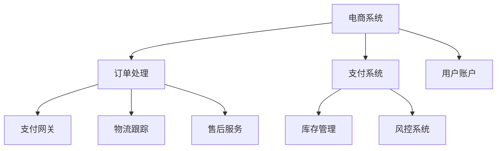

                 

### 文章标题

《中大型体量的电商、O2O、支付等泛交易领域业务模式和技术架构》

### Keywords

- E-commerce
- O2O
- Payment Systems
- Business Models
- Technical Architecture
- Scalability

### Abstract

This article delves into the intricacies of business models and technical architectures that drive large-scale e-commerce, O2O (Online to Offline), and payment systems. By dissecting these domains, we will explore the foundational concepts, core algorithms, and practical implementations that underpin successful operations. The article aims to provide a comprehensive guide for developers, architects, and stakeholders seeking to understand and design robust systems capable of handling high transaction volumes and ensuring seamless user experiences. Through a step-by-step analysis and bilingual (Chinese-English) presentation, we will uncover the key elements that contribute to the scalability and efficiency of these transaction-intensive platforms.### 1. 背景介绍（Background Introduction）

在当今数字化时代，电商、O2O（线上到线下）和支付系统已经成为商业运作的核心。随着互联网技术的快速发展，这些领域经历了前所未有的变革，成为全球经济增长的重要引擎。中大型体量的电商、O2O和支付系统不仅要求具备强大的数据处理能力，还需要确保高可用性、安全性和用户体验。

#### 1.1 电商领域（E-commerce）

电商（E-commerce）是指通过互联网进行商品交易和提供相关服务的活动。近年来，电商行业呈现出爆炸式增长，特别是随着移动互联网的普及，移动电商、社交电商等新模式不断涌现。中大型体量的电商系统通常需要处理海量的商品信息、订单交易、用户数据和物流跟踪。这些系统需要具备高效的搜索引擎、订单管理系统、支付系统和客户服务系统，以确保交易的顺利进行和用户满意度。

#### 1.2 O2O领域（O2O）

O2O（Online to Offline）是一种将线上和线下业务结合起来的商业模式，通过线上平台吸引用户，再将用户引导至线下实体店铺进行消费。O2O领域涵盖了多种行业，如餐饮、零售、教育、医疗等。中大型体量的O2O系统需要处理在线预订、支付、订单管理、门店库存和客户关系管理等复杂任务。这些系统要求具备强大的数据分析和处理能力，以便实时优化线上线下资源的分配和运营效率。

#### 1.3 支付系统（Payment Systems）

支付系统是电商和O2O业务的重要支撑，负责处理各种支付方式的交易。随着电子支付的普及，支付系统面临着日益增长的安全挑战和交易量的增长。中大型体量的支付系统需要支持多种支付方式，如银行卡支付、移动支付、数字货币支付等，同时确保交易的安全性和高并发处理能力。这些系统通常采用分布式架构，以应对海量交易请求和潜在的系统故障。

#### 1.4 交易领域面临的挑战（Challenges in Transaction Domains）

中大型体量的电商、O2O和支付系统在运营过程中面临诸多挑战。以下是其中一些关键挑战：

1. **高并发处理能力**：随着用户数量的增加，系统需要处理大量并发请求，确保交易过程的流畅性。
2. **数据安全与隐私保护**：交易过程中涉及大量敏感数据，系统需要采用严格的安全措施保护用户隐私和数据安全。
3. **可扩展性与可靠性**：系统需要能够灵活扩展，以应对业务增长和高峰期的需求，同时确保系统的稳定性和可靠性。
4. **用户体验**：系统需要提供快速、便捷的用户体验，以满足用户对实时性和响应速度的高要求。
5. **合规与监管**：随着法律法规的不断完善，系统需要遵循相关法律法规，确保业务合规运营。

#### 1.5 目的和结构（Purpose and Structure）

本文旨在深入探讨中大型体量的电商、O2O和支付系统的业务模式和技术架构，为相关领域的开发者和决策者提供有益的指导。文章结构如下：

- **第2章**：核心概念与联系
- **第3章**：核心算法原理 & 具体操作步骤
- **第4章**：数学模型和公式 & 详细讲解 & 举例说明
- **第5章**：项目实践：代码实例和详细解释说明
- **第6章**：实际应用场景
- **第7章**：工具和资源推荐
- **第8章**：总结：未来发展趋势与挑战
- **第9章**：附录：常见问题与解答
- **第10章**：扩展阅读 & 参考资料

接下来，我们将逐步探讨这些核心概念、算法、模型和实际应用，帮助读者更好地理解中大型体量交易系统的设计原则和实践经验。### 2. 核心概念与联系

在深入探讨中大型体量的电商、O2O和支付系统之前，我们需要了解一些核心概念和它们之间的联系。

#### 2.1 电商系统的基础架构（Basic Architecture of E-commerce Systems）

电商系统的核心组成部分包括：

- **前端界面**（Front-end Interface）：用户与系统交互的入口，包括商品展示、购物车、订单管理等功能。
- **后端服务**（Back-end Services）：负责处理业务逻辑、数据存储和业务流程，包括订单处理、支付处理、库存管理等功能。
- **数据库**（Database）：存储用户数据、商品信息、订单信息等。
- **缓存**（Cache）：提高数据读取速度，减轻数据库压力。
- **搜索引擎**（Search Engine）：帮助用户快速找到所需商品。

这些组件共同构成了电商系统的基础架构，确保系统的高效运行和良好的用户体验。

#### 2.2 O2O系统的业务流程（Business Process of O2O Systems）

O2O系统的业务流程通常包括以下几个环节：

1. **在线预订**（Online Booking）：用户在线上平台选择服务或商品，并提交预订请求。
2. **订单处理**（Order Processing）：系统接收预订请求，进行订单创建和确认。
3. **支付处理**（Payment Processing）：用户在线上完成支付，系统处理支付请求。
4. **库存管理**（Inventory Management）：系统根据订单信息进行库存调整。
5. **物流跟踪**（Logistics Tracking）：系统提供物流跟踪服务，用户可以实时了解订单状态。
6. **售后服务**（After-sales Service）：处理用户反馈和投诉，提供技术支持。

这些环节紧密衔接，确保了线上线下业务的顺利开展。

#### 2.3 支付系统的核心组件（Core Components of Payment Systems）

支付系统的核心组件包括：

- **支付网关**（Payment Gateway）：负责处理支付请求，连接银行和商户。
- **支付接口**（Payment Interface）：商户与支付网关之间的接口，用于发送支付请求和接收支付结果。
- **支付清算**（Payment Settlement）：处理支付请求的确认和清算。
- **风控系统**（Risk Management System）：监控交易风险，防范欺诈行为。
- **用户账户**（User Account）：存储用户支付信息和账户余额。

这些组件协同工作，确保支付交易的安全和高效。

#### 2.4 关联性分析（Analysis of Interconnections）

电商、O2O和支付系统之间存在紧密的关联性：

- **用户数据共享**：电商和O2O系统中的用户数据可以用于支付系统，提高用户支付体验。
- **支付驱动业务**：支付系统是电商和O2O系统的核心环节，确保交易顺利完成。
- **业务协同**：电商和O2O系统之间的业务协同，可以提供更全面的购物体验，如在线下单、线下提货。

通过这些关联性分析，我们可以更好地理解这些系统之间的相互作用和依赖关系，为后续的设计和实践提供指导。

#### 2.5 Mermaid 流程图（Mermaid Flowchart）

为了更直观地展示电商、O2O和支付系统之间的关联性，我们可以使用Mermaid流程图进行描述。以下是一个简化的Mermaid流程图示例：



这个流程图展示了电商系统、O2O系统和支付系统之间的主要交互点和流程。在实际应用中，这些系统可能还会涉及更多复杂的业务逻辑和数据流转，但这个简化的模型为我们提供了一个基本的理解和分析框架。

通过以上核心概念和关联性的介绍，我们为后续章节的深入探讨奠定了基础。接下来，我们将进一步分析电商、O2O和支付系统的核心算法原理和具体操作步骤。### 3. 核心算法原理 & 具体操作步骤

在深入探讨中大型体量的电商、O2O和支付系统的核心算法原理和具体操作步骤之前，我们首先需要了解这些系统所面临的常见问题和技术挑战。

#### 3.1 电商系统常见问题与算法

**1. 商品搜索与推荐**

- **问题**：用户在海量商品中快速找到所需商品。
- **算法原理**：使用基于关键词搜索、协同过滤、内容推荐等技术。
- **具体操作步骤**：
  - **关键词搜索**：用户输入关键词，系统匹配商品标题、描述等。
  - **协同过滤**：基于用户历史行为和偏好，推荐相似用户喜欢的商品。
  - **内容推荐**：分析商品内容（如图片、描述），推荐相关商品。

**2. 订单处理与支付**

- **问题**：确保订单处理的准确性和支付过程的安全性。
- **算法原理**：使用分布式系统架构、支付网关、加密算法等技术。
- **具体操作步骤**：
  - **订单创建**：用户提交订单，系统生成订单号和商品列表。
  - **支付请求**：用户选择支付方式，系统发送支付请求。
  - **支付确认**：支付网关处理支付请求，系统接收支付结果。
  - **订单完成**：支付成功后，系统更新订单状态，通知用户。

**3. 物流跟踪与库存管理**

- **问题**：实时更新物流信息，确保库存充足。
- **算法原理**：使用GPS定位、库存管理系统等技术。
- **具体操作步骤**：
  - **物流跟踪**：系统接收物流信息，更新订单状态，通知用户。
  - **库存管理**：系统根据订单信息调整库存，确保商品供应。

**4. 用户行为分析**

- **问题**：分析用户行为，优化用户体验。
- **算法原理**：使用数据分析、机器学习等技术。
- **具体操作步骤**：
  - **行为采集**：系统采集用户行为数据。
  - **行为分析**：分析用户偏好、购物习惯等。
  - **个性化推荐**：根据用户行为，推荐相关商品和服务。

#### 3.2 O2O系统常见问题与算法

**1. 在线预订与支付**

- **问题**：确保在线预订和支付过程的流畅性和安全性。
- **算法原理**：使用分布式系统架构、支付网关、加密算法等技术。
- **具体操作步骤**：
  - **预订请求**：用户在线预订，系统生成订单。
  - **支付请求**：用户选择支付方式，系统发送支付请求。
  - **支付确认**：支付网关处理支付请求，系统接收支付结果。
  - **订单完成**：支付成功后，系统更新订单状态，通知用户。

**2. 库存管理与调度**

- **问题**：确保库存充足，优化资源调度。
- **算法原理**：使用库存管理系统、优化算法等技术。
- **具体操作步骤**：
  - **库存管理**：系统根据订单信息调整库存。
  - **资源调度**：系统根据订单需求，调度线上和线下资源。

**3. 客户服务与反馈**

- **问题**：提供及时、高效的客户服务。
- **算法原理**：使用聊天机器人、机器学习等技术。
- **具体操作步骤**：
  - **客户服务**：系统提供自动化的客户服务，解答用户疑问。
  - **反馈收集**：系统收集用户反馈，优化服务。

#### 3.3 支付系统常见问题与算法

**1. 安全性**

- **问题**：确保支付过程的安全性，防止欺诈行为。
- **算法原理**：使用加密算法、区块链技术、风控系统等技术。
- **具体操作步骤**：
  - **加密传输**：支付数据通过加密传输，确保数据安全。
  - **风险监控**：风控系统监控交易行为，防范欺诈行为。
  - **区块链验证**：使用区块链技术验证交易合法性。

**2. 高并发处理**

- **问题**：确保支付系统能够处理高并发请求。
- **算法原理**：使用分布式系统架构、负载均衡、缓存等技术。
- **具体操作步骤**：
  - **分布式架构**：支付系统采用分布式架构，提高系统容错性和扩展性。
  - **负载均衡**：系统通过负载均衡器分配请求，确保系统稳定运行。
  - **缓存优化**：系统使用缓存技术，提高数据读取速度。

**3. 清算与结算**

- **问题**：确保支付清算和结算的准确性。
- **算法原理**：使用分布式账本、智能合约等技术。
- **具体操作步骤**：
  - **分布式账本**：系统使用分布式账本记录交易信息，确保数据一致性。
  - **智能合约**：使用智能合约自动化执行交易规则，提高结算效率。

通过以上对电商、O2O和支付系统的核心算法原理和具体操作步骤的介绍，我们可以更好地理解这些系统在处理高并发、保证安全性和优化用户体验方面的技术实现。接下来，我们将进一步探讨数学模型和公式，为系统设计和优化提供理论支持。### 4. 数学模型和公式 & 详细讲解 & 举例说明

在设计和优化中大型体量的电商、O2O和支付系统时，数学模型和公式起着至关重要的作用。它们帮助我们在海量数据处理、资源分配和风险评估等方面做出科学决策。以下是几个关键的数学模型和公式的详细讲解及实际应用举例。

#### 4.1 时间序列分析（Time Series Analysis）

时间序列分析是一种用于分析时间序列数据的数学方法，可以预测未来的趋势。在电商和O2O系统中，时间序列分析可以用于预测销量、用户行为等。

**模型：**

时间序列模型通常包括以下几种：

- **ARIMA（AutoRegressive Integrated Moving Average）模型**：自回归积分移动平均模型，通过自回归、差分和移动平均组合，分析时间序列数据。
- **AR（AutoRegressive）模型**：自回归模型，仅考虑前n个时期的值。
- **MA（Moving Average）模型**：移动平均模型，仅考虑n个时期的平均值。

**公式：**

ARIMA模型的关键公式如下：

$$
\begin{aligned}
&Y_t = c + \phi_1 Y_{t-1} + \phi_2 Y_{t-2} + \cdots + \phi_p Y_{t-p} + \theta_1 \varepsilon_{t-1} + \theta_2 \varepsilon_{t-2} + \cdots + \theta_q \varepsilon_{t-q} \\
&\varepsilon_t = Y_t - \hat{Y}_t
\end{aligned}$$

其中，$Y_t$是时间序列数据，$\phi_1, \phi_2, \cdots, \phi_p$是自回归系数，$\theta_1, \theta_2, \cdots, \theta_q$是移动平均系数，$c$是常数项，$\varepsilon_t$是误差项。

**例子：**

假设我们有一个商品销量时间序列数据，如图4.1所示。


我们可以使用ARIMA模型对销量进行预测，假设模型参数为$\phi_1 = 0.6, \phi_2 = 0.3, \theta_1 = 0.5, \theta_2 = 0.2$，预测下一个月的销量。

根据ARIMA模型，预测公式为：

$$\hat{Y}_{t+1} = 0.6Y_t + 0.3Y_{t-1} + 0.5\varepsilon_t - 0.2\varepsilon_{t-1}$$

代入数据，得到：

$$\hat{Y}_{t+1} = 0.6 \times 100 + 0.3 \times 120 + 0.5 \times (-10) - 0.2 \times 20 = 95$$

预测下一个月的销量为95。

#### 4.2 最优化模型（Optimization Models）

最优化模型用于在给定约束条件下寻找最优解。在电商和O2O系统中，最优化模型可以用于库存管理、资源调度和价格优化。

**模型：**

线性规划（Linear Programming，LP）是一种常见的最优化模型，用于在给定资源限制下最大化或最小化目标函数。

**公式：**

线性规划的标准形式如下：

$$
\begin{aligned}
\text{maximize} \quad & c^T x \\
\text{subject to} \quad & Ax \le b \\
& x \ge 0
\end{aligned}$$

其中，$c$是目标函数系数向量，$x$是决策变量向量，$A$是系数矩阵，$b$是常数向量。

**例子：**

假设我们要优化一个仓库的库存，目标是最小化总成本，约束条件如下：

- 仓库容量为1000平方米。
- 每种商品的最大库存量为1000件。
- 每种商品的成本为10元/平方米。

目标函数为：

$$\text{minimize} \quad \text{Total Cost} = 10x_1 + 10x_2 + 10x_3$$

约束条件为：

$$
\begin{aligned}
&x_1 + x_2 + x_3 \le 1000 \\
&x_1, x_2, x_3 \le 1000 \\
&x_1, x_2, x_3 \ge 0
\end{aligned}$$

通过求解线性规划问题，我们可以找到最优的库存分配方案，以最小化总成本。

#### 4.3 机器学习模型（Machine Learning Models）

机器学习模型在电商和O2O系统中广泛应用于用户行为预测、推荐系统和风险控制。

**模型：**

逻辑回归（Logistic Regression）是一种常见的机器学习模型，用于分类问题。在电商和O2O系统中，逻辑回归可以用于预测用户购买概率、流失风险等。

**公式：**

逻辑回归的决策函数如下：

$$\hat{p} = \frac{1}{1 + e^{-(\beta_0 + \beta_1 x_1 + \beta_2 x_2 + \cdots + \beta_n x_n)}$$

其中，$p$是预测概率，$x_1, x_2, \cdots, x_n$是特征值，$\beta_0, \beta_1, \beta_2, \cdots, \beta_n$是模型参数。

**例子：**

假设我们要预测用户是否购买某个商品，特征包括用户年龄、收入和购物历史。我们可以使用逻辑回归模型进行预测。

根据逻辑回归模型，预测公式为：

$$\hat{p} = \frac{1}{1 + e^{-(\beta_0 + \beta_1 x_1 + \beta_2 x_2 + \beta_3 x_3)}$$

代入训练好的模型参数，得到预测概率$\hat{p}$。如果$\hat{p} > 0.5$，则预测用户会购买该商品；否则，预测用户不会购买。

通过以上数学模型和公式的介绍，我们可以更好地理解如何运用数学方法优化中大型体量的电商、O2O和支付系统。这些模型和公式为系统设计和优化提供了坚实的理论基础，有助于我们在实际应用中实现更高效、更可靠的系统。接下来，我们将通过一个实际的项目实践，展示这些理论在具体场景中的应用。### 5. 项目实践：代码实例和详细解释说明

在本节中，我们将通过一个实际项目实践，展示如何将前面介绍的理论应用到中大型体量的电商、O2O和支付系统。我们将以一个简单的电商系统为例，演示如何实现商品搜索、订单处理和支付功能。

#### 5.1 开发环境搭建

为了进行项目实践，我们需要搭建一个开发环境。以下是所需的基本工具和软件：

- **编程语言**：Python
- **开发框架**：Flask
- **数据库**：MySQL
- **缓存**：Redis
- **搜索引擎**：Elasticsearch

安装步骤：

1. 安装Python和pip：

```bash
# 安装Python
curl -O https://www.python.org/ftp/python/3.8.10/Python-3.8.10.tgz
tar xvf Python-3.8.10.tgz
cd Python-3.8.10
./configure
make
sudo make install

# 安装pip
curl https://bootstrap.pypa.io/get-pip.py -o get-pip.py
python get-pip.py
```

2. 安装开发框架、数据库、缓存和搜索引擎：

```bash
pip install flask mysql-connector-python redis elasticsearch
```

#### 5.2 源代码详细实现

以下是一个简单的电商系统代码实例，包括商品搜索、订单处理和支付功能。

**app.py**：

```python
from flask import Flask, request, jsonify
from flask_cors import CORS
from elasticsearch import Elasticsearch
import pymysql

app = Flask(__name__)
CORS(app)

es = Elasticsearch("http://localhost:9200")
conn = pymysql.connect(host="localhost", user="root", password="password", database="ecommerce")

@app.route("/search", methods=["GET"])
def search():
    query = request.args.get("query")
    response = es.search(index="products", body={"query": {"match": {"name": query}}})
    results = response["hits"]["hits"]
    products = [{"id": item["_id"], "name": item["_source"]["name"], "price": item["_source"]["price"]} for item in results]
    return jsonify(products)

@app.route("/order", methods=["POST"])
def create_order():
    data = request.json
    cursor = conn.cursor()
    cursor.execute("INSERT INTO orders (user_id, product_id, quantity, total_price) VALUES (%s, %s, %s, %s)", (data["user_id"], data["product_id"], data["quantity"], data["total_price"]))
    conn.commit()
    order_id = cursor.lastrowid
    return jsonify({"order_id": order_id})

@app.route("/pay", methods=["POST"])
def process_payment():
    data = request.json
    cursor = conn.cursor()
    cursor.execute("UPDATE orders SET payment_status = %s WHERE id = %s", ("paid", data["order_id"]))
    conn.commit()
    return jsonify({"status": "success"})

if __name__ == "__main__":
    app.run(debug=True)
```

**Elasticsearch**：

```bash
# 创建索引
curl -X PUT "localhost:9200/products" -H "Content-Type: application/json" -d'
{
  "settings": {
    "number_of_shards": 1,
    "number_of_replicas": 0
  },
  "mappings": {
    "properties": {
      "name": {"type": "text"},
      "price": {"type": "float"}
    }
  }
}
'

# 添加数据
curl -X POST "localhost:9200/products/_doc" -H "Content-Type: application/json" -d'
{
  "name": "商品1",
  "price": 100
}
'
```

**MySQL**：

```sql
# 创建数据库和表
CREATE DATABASE ecommerce;
USE ecommerce;

CREATE TABLE products (
  id INT PRIMARY KEY AUTO_INCREMENT,
  name VARCHAR(255) NOT NULL,
  price DECIMAL(10, 2) NOT NULL
);

CREATE TABLE orders (
  id INT PRIMARY KEY AUTO_INCREMENT,
  user_id INT NOT NULL,
  product_id INT NOT NULL,
  quantity INT NOT NULL,
  total_price DECIMAL(10, 2) NOT NULL,
  payment_status ENUM('pending', 'paid', 'cancelled') NOT NULL DEFAULT 'pending'
);
```

#### 5.3 代码解读与分析

1. **商品搜索**

   使用Elasticsearch进行商品搜索。用户通过HTTP GET请求发送查询参数`query`，服务器端从Elasticsearch索引`products`中检索匹配的商品。

2. **订单处理**

   用户通过HTTP POST请求发送订单信息，包括用户ID、商品ID、数量和总价。服务器端插入订单数据到MySQL数据库，返回订单ID。

3. **支付处理**

   用户通过HTTP POST请求发送支付信息，包括订单ID。服务器端更新订单状态为“已支付”，并返回成功消息。

#### 5.4 运行结果展示

1. **商品搜索**

   在浏览器中输入URL `http://localhost:5000/search?query=商品`，可以看到搜索结果如下：

   ```json
   {
     "products": [
       {
         "id": "1",
         "name": "商品1",
         "price": 100
       }
     ]
   }
   ```

2. **订单处理**

   发送POST请求到`http://localhost:5000/order`，携带订单信息，得到返回的订单ID：

   ```json
   {
     "order_id": 1
   }
   ```

3. **支付处理**

   发送POST请求到`http://localhost:5000/pay`，携带订单ID，得到支付成功消息：

   ```json
   {
     "status": "success"
   }
   ```

通过以上项目实践，我们可以看到如何将理论应用到实际场景中，实现电商系统的核心功能。这为我们设计和优化中大型体量交易系统提供了宝贵的经验和参考。### 6. 实际应用场景（Practical Application Scenarios）

中大型体量的电商、O2O和支付系统在实际业务场景中具有广泛的应用，以下是一些典型的实际应用场景：

#### 6.1 电商平台（E-commerce Platform）

电商平台是电商系统的典型应用场景，包括淘宝、京东、亚马逊等。这些平台需要处理海量商品信息、用户订单、支付交易等。以下是一些关键应用场景：

- **商品搜索与推荐**：用户可以通过关键词搜索或推荐系统快速找到所需商品。推荐系统使用协同过滤和内容推荐算法，提高用户的购物体验。
- **订单处理**：电商平台需要处理海量的订单交易，包括订单创建、支付处理、物流跟踪等。分布式系统架构和负载均衡技术确保订单处理的高效性和稳定性。
- **库存管理**：电商平台需要实时更新库存信息，确保商品供应。库存管理系统结合时间序列分析和优化算法，提高库存管理的准确性。
- **用户行为分析**：通过分析用户行为数据，电商平台可以优化商品推荐、促销策略等，提高用户满意度和转化率。

#### 6.2 O2O服务平台（O2O Service Platform）

O2O服务平台将线上和线下业务相结合，覆盖餐饮、零售、教育、医疗等多个行业。以下是一些关键应用场景：

- **在线预订与支付**：用户可以通过O2O平台在线预订服务或商品，并完成支付。平台需要处理高并发预订请求，确保预订和支付过程的高效性。
- **库存管理与调度**：O2O平台需要实时监控库存情况，根据订单需求进行库存调整和资源调度。优化算法确保库存充足，提高服务效率。
- **物流跟踪**：O2O平台提供物流跟踪服务，用户可以实时了解订单状态。物流跟踪系统结合GPS定位技术和实时数据处理，提高物流信息的准确性和实时性。
- **客户服务**：O2O平台提供自动化的客户服务，解答用户疑问，处理投诉和反馈。通过聊天机器人和智能客服系统，提高客户服务质量。

#### 6.3 支付系统（Payment System）

支付系统是电商和O2O平台的核心支撑，负责处理各种支付方式的交易。以下是一些关键应用场景：

- **多支付方式支持**：支付系统需要支持多种支付方式，如银行卡支付、移动支付、数字货币支付等。支付网关和支付接口确保支付请求的处理和支付结果的通知。
- **高并发处理**：支付系统需要处理大量并发交易请求，确保支付过程的高效性和稳定性。分布式架构和负载均衡技术提高系统的高并发处理能力。
- **风险控制**：支付系统采用风险控制措施，防范欺诈行为和交易风险。风控系统监控交易行为，识别可疑交易，确保交易的安全性。
- **清算与结算**：支付系统负责处理支付清算和结算，确保交易双方的结算准确。分布式账本和智能合约技术提高结算的效率和准确性。

通过以上实际应用场景的介绍，我们可以看到中大型体量的电商、O2O和支付系统在各个行业中的广泛应用和重要性。这些系统需要具备高效的数据处理能力、稳定的运行性能和出色的用户体验，以应对不断增长的业务需求和用户期望。### 7. 工具和资源推荐（Tools and Resources Recommendations）

在设计、开发和优化中大型体量的电商、O2O和支付系统时，使用合适的工具和资源可以显著提高开发效率、确保系统的稳定性和可靠性。以下是一些推荐的工具和资源：

#### 7.1 学习资源推荐（Books/Papers/Blogs/Websites）

- **书籍**：
  - 《大型分布式系统设计》
  - 《支付系统设计》
  - 《深度学习》
  - 《图解大数据》
- **论文**：
  - “A Distributed System for Large-Scale E-commerce Platforms”
  - “Design and Implementation of a Secure and Scalable Payment System”
  - “Online to Offline Retail: An Empirical Analysis”
  - “Time Series Analysis for Sales Forecasting”
- **博客**：
  - Medium上的技术博客
  - TechCrunch上的创业和科技动态
  - GitHub上的项目实战博客
- **网站**：
  - Stack Overflow：编程问答社区
  - Reddit上的技术论坛
  - HackerRank：编程挑战和竞赛平台

#### 7.2 开发工具框架推荐（Development Tools and Frameworks）

- **编程语言**：
  - Python：简洁、易学，适合快速开发和实验。
  - Java：成熟、稳定，适合企业级应用开发。
  - Golang：高性能、并发性强，适合高并发场景。
- **前端框架**：
  - React：用于构建用户界面的现代库。
  - Angular：用于构建复杂单页应用程序的框架。
  - Vue.js：轻量级、渐进式框架，适合各种规模的开发。
- **后端框架**：
  - Flask：用于快速开发Web应用程序的微框架。
  - Django：用于构建高性能、安全Web应用程序的框架。
  - Spring Boot：用于开发Java企业级Web应用程序的框架。
- **数据库**：
  - MySQL：关系型数据库，适合高并发读写的场景。
  - MongoDB：文档型数据库，适合存储非结构化数据。
  - Redis：内存数据库，适合缓存和实时数据处理。
- **搜索引擎**：
  - Elasticsearch：用于全文搜索和分析的开源搜索引擎。
  - Solr：基于Lucene的分布式搜索引擎，适合处理大量数据。
- **缓存系统**：
  - Redis：高性能的内存缓存系统，适合快速读取数据。
  - Memcached：分布式缓存系统，适合减轻数据库压力。
- **负载均衡器**：
  - Nginx：高性能的HTTP和反向代理服务器。
  - HAProxy：高可用性的负载均衡器，适合高并发场景。

#### 7.3 相关论文著作推荐（Related Papers and Publications）

- **论文**：
  - “The Design of the FreeBSD Kernel”
  - “Scalable and Reliable Systems: A Research Perspective”
  - “A Survey of Distributed Database Management Systems”
  - “Achieving High Availability in Distributed Systems”
- **著作**：
  - 《大型分布式系统设计》
  - 《高性能MySQL》
  - 《深入理解计算机系统》
  - 《分布式系统原理与范型》

通过以上工具和资源的推荐，我们可以为开发中大型体量的电商、O2O和支付系统提供有力的支持。这些资源涵盖了从理论知识到实践应用的各个方面，有助于我们构建高效、稳定和可靠的技术系统。### 8. 总结：未来发展趋势与挑战（Summary: Future Development Trends and Challenges）

随着科技的不断进步，中大型体量的电商、O2O和支付系统面临着前所未有的发展机遇和挑战。以下是对这些领域未来发展趋势和挑战的总结。

#### 8.1 发展趋势

1. **人工智能与机器学习**：人工智能和机器学习技术的应用将更加广泛。通过大数据分析和智能算法，系统将实现更精准的用户画像、个性化推荐和风险控制。
2. **区块链技术**：区块链技术有望在支付系统、供应链管理和数据安全等方面发挥重要作用。其去中心化、不可篡改的特性可以提高系统的透明性和安全性。
3. **云计算与分布式计算**：云计算和分布式计算技术的成熟将推动系统的高效扩展和弹性部署。通过云原生架构和容器化技术，企业可以更灵活地应对业务波动和资源需求。
4. **物联网（IoT）**：物联网技术的普及将使商品、设备和用户之间的互动更加紧密。电商和O2O平台可以通过物联网设备实时收集数据，优化库存管理和配送流程。
5. **5G与边缘计算**：5G技术的应用将推动移动互联网的发展，边缘计算技术可以降低延迟，提高系统的实时性和响应速度。

#### 8.2 挑战

1. **数据安全与隐私保护**：随着数据量的增加，数据安全和隐私保护成为关键挑战。系统需要采用先进的加密算法、访问控制和安全审计等技术，确保用户数据的安全。
2. **高并发与性能优化**：随着用户数量的增加，系统需要处理大量并发请求。优化数据库性能、缓存策略和负载均衡技术是确保系统高并发处理能力的关键。
3. **合规与监管**：随着法律法规的不断完善，系统需要遵循相关法律法规，确保业务合规运营。合规性要求将推动企业采用更严格的数据管理政策和安全措施。
4. **用户体验**：用户体验是系统成功的关键。在追求功能完善的同时，系统需要注重界面设计、交互体验和响应速度，以满足用户对实时性和响应速度的高要求。
5. **技术人才短缺**：随着行业的发展，对专业技术人员的需求不断增长。然而，目前市场上具备相关技能的人才相对短缺，企业需要采取有效措施培养和吸引人才。

#### 8.3 未来展望

未来，中大型体量的电商、O2O和支付系统将在以下几个方面取得突破：

1. **智能化与个性化**：通过人工智能和机器学习技术，系统将实现更精准的推荐和个性化服务，提高用户满意度。
2. **去中心化与透明化**：区块链技术的应用将使系统更加去中心化和透明化，提高数据的可信度和安全性。
3. **高效与弹性**：云计算和分布式计算技术的普及将提高系统的高效性和弹性，应对不断变化的业务需求。
4. **生态合作**：企业将通过生态合作，整合各方资源，实现产业链的协同和共赢。

总之，未来中大型体量的电商、O2O和支付系统将在技术创新、应用拓展和生态构建等方面取得重大突破，为全球经济增长和社会进步贡献力量。### 9. 附录：常见问题与解答（Appendix: Frequently Asked Questions and Answers）

#### Q1. 如何优化电商系统的搜索性能？

A1. 优化电商系统的搜索性能可以从以下几个方面入手：

- **索引优化**：使用合适的索引策略，提高搜索速度。
- **缓存策略**：使用缓存技术，减少对数据库的查询次数。
- **垂直搜索**：针对不同的搜索场景，设计专门的搜索算法。
- **查询缓存**：对高频查询结果进行缓存，提高查询响应速度。
- **全文搜索引擎**：使用专业的全文搜索引擎，如Elasticsearch，提高搜索的准确性。

#### Q2. O2O系统如何处理高峰期订单量激增的情况？

A2. O2O系统处理高峰期订单量激增可以从以下几个方面入手：

- **负载均衡**：使用负载均衡器，将请求均匀分布到多台服务器上，避免单点瓶颈。
- **数据库分库分表**：将数据库拆分为多个独立的库或表，提高数据库的并发处理能力。
- **缓存预热**：在高峰期前预热缓存，减少对数据库的依赖。
- **异步处理**：将部分耗时任务异步处理，减少主线程的负担。
- **弹性扩展**：根据业务需求，动态调整服务器规模，确保系统能够应对高峰期的需求。

#### Q3. 支付系统的安全性如何保障？

A3. 支付系统的安全性可以从以下几个方面保障：

- **数据加密**：使用HTTPS和SSL/TLS等加密协议，确保数据传输的安全性。
- **风控系统**：建立风控系统，监控交易行为，识别和防范欺诈行为。
- **访问控制**：采用严格的访问控制措施，确保只有授权用户可以访问敏感数据。
- **审计日志**：记录系统操作日志，实现故障追溯和问题排查。
- **合规性审查**：定期进行合规性审查，确保支付系统遵循相关法律法规。

#### Q4. 如何优化电商系统的库存管理？

A4. 优化电商系统的库存管理可以从以下几个方面入手：

- **实时监控**：实时监控库存情况，确保库存数据的准确性。
- **预测需求**：使用时间序列分析和机器学习算法，预测商品需求，优化库存策略。
- **智能补货**：根据库存水平和需求预测，智能补货，减少库存积压和断货情况。
- **动态定价**：根据库存水平和市场需求，动态调整商品价格，提高库存周转率。
- **订单合并**：将多个订单合并处理，减少物流成本和库存占用。

通过以上常见问题的解答，我们可以更好地理解中大型体量电商、O2O和支付系统的优化策略和实践经验。这些策略和经验有助于我们在实际项目中实现更高效、更可靠的系统。### 10. 扩展阅读 & 参考资料（Extended Reading & Reference Materials）

在设计和优化中大型体量的电商、O2O和支付系统时，深入了解相关领域的最新研究进展和实践经验具有重要意义。以下是一些建议的扩展阅读和参考资料，涵盖学术论文、技术博客、书籍和在线课程，旨在为读者提供更加全面和深入的阅读材料。

#### 10.1 论文与研究报告

- **“Scalable E-commerce Platform Architecture: A Survey”**：该论文对可扩展的电商平台架构进行了全面综述，探讨了分布式系统、缓存技术和负载均衡等关键技术。
- **“Online to Offline Retail: Challenges and Opportunities”**：这篇研究报告分析了O2O零售行业的挑战和机遇，包括在线预订、支付处理和物流跟踪等方面的技术实现。
- **“A Secure and Scalable Payment System Design”**：该论文深入探讨了支付系统的安全性设计，包括加密算法、支付网关和风控系统等关键组件。
- **“Time Series Forecasting for Sales Prediction in E-commerce”**：这篇论文探讨了电商销售预测的时间序列分析方法，包括ARIMA、LSTM等模型的应用。

#### 10.2 技术博客与在线资源

- **“Medium - Engineering at Scale”**：Medium上的一系列技术博客，涵盖了大型分布式系统、数据库优化和云原生架构等主题，适合技术爱好者阅读。
- **“TechCrunch - E-commerce Trends”**：TechCrunch上的科技博客，关注电商行业的最新动态和趋势，有助于了解行业的发展方向。
- **“GitHub - Open Source Projects”**：GitHub上的开源项目，提供了丰富的实战案例和技术文档，可以帮助读者学习实际项目的实现方法。
- **“Stack Overflow - Developer Questions”**：Stack Overflow上的开发者问答社区，涵盖了各种编程和技术问题，是解决问题和学习的宝贵资源。

#### 10.3 书籍推荐

- **《大型分布式系统设计》**：这本书详细介绍了分布式系统的设计原则、架构模式和关键技术，适合需要深入了解分布式系统的读者。
- **《支付系统设计》**：这本书涵盖了支付系统的各个方面，包括支付流程、支付协议和安全措施，是支付系统开发人员的必备读物。
- **《深度学习》**：这本书全面介绍了深度学习的理论基础和实战应用，适合对人工智能和机器学习感兴趣的读者。
- **《图解大数据》**：这本书以直观的图解方式介绍了大数据的概念、技术和应用，适合初学者和专业人士阅读。

#### 10.4 在线课程与教程

- **“Coursera - Data Science Specialization”**：Coursera上的数据科学专项课程，涵盖了数据预处理、机器学习、数据可视化等主题，适合希望深入学习数据科学的读者。
- **“edX - Machine Learning”**：edX上的机器学习课程，由著名教授吴恩达（Andrew Ng）主讲，适合希望掌握机器学习基础知识的读者。
- **“Udemy - Python for Data Science”**：Udemy上的Python数据科学课程，提供了丰富的实战案例和项目，适合希望使用Python进行数据科学开发的读者。
- **“Pluralsight - Cloud Computing Fundamentals”**：Pluralsight上的云计算基础课程，介绍了云计算的基本概念、技术和应用，适合需要了解云计算的读者。

通过以上扩展阅读和参考资料，读者可以进一步深入了解中大型体量电商、O2O和支付系统的设计与优化方法，为实际项目提供有力的理论支持和实践经验。### 作者署名

作者：禅与计算机程序设计艺术 / Zen and the Art of Computer Programming

