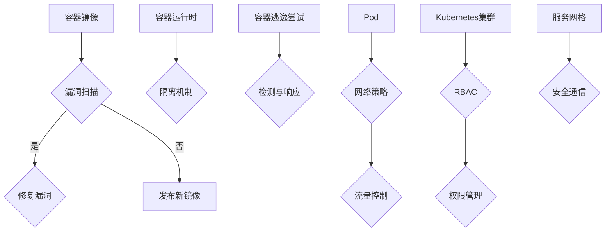
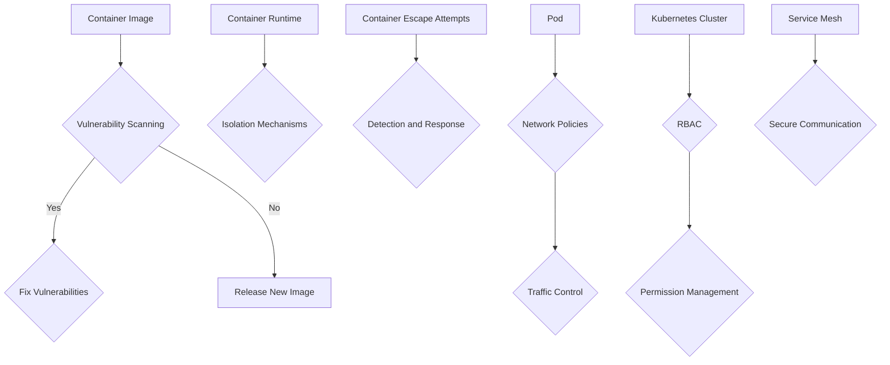

                 

### 文章标题

**云原生安全：容器和Kubernetes环境下的防护**

在当今数字化时代，云原生架构已成为企业IT基础设施的核心。容器和Kubernetes（K8s）作为云原生技术的基石，不仅提供了高效、灵活的应用部署方式，还带来了前所未有的扩展性和可移植性。然而，随着容器和Kubernetes的广泛应用，安全问题也日益凸显。本文将深入探讨云原生安全，特别是容器和Kubernetes环境下的防护策略，旨在为企业和开发者提供全面的指导。

关键词：云原生，容器，Kubernetes，安全，防护策略

摘要：本文首先介绍了云原生架构和容器技术的发展背景及其重要性。然后，分析了容器和Kubernetes环境面临的主要安全挑战。接着，详细阐述了云原生安全的核心概念、防护措施和实践方法。最后，探讨了未来云原生安全的发展趋势和潜在挑战。

<|user|>## 1. 背景介绍（Background Introduction）

### 1.1 云原生架构概述

云原生（Cloud Native）一词最初由Pivotal和Google合作提出，指的是一种面向云的软件架构和方法论。它强调利用和优化云计算的特性，如弹性、可扩展性和动态资源管理，以构建和运行高效、可靠、灵活的应用程序。

云原生架构的核心组件包括：

1. **容器（Containers）**：容器是一种轻量级、可移植的计算单元，封装了应用程序及其运行环境。它解决了传统虚拟机（VM）带来的资源浪费和部署复杂性问题。

2. **微服务（Microservices）**：微服务架构将应用程序分解为多个独立的服务模块，每个模块负责特定的业务功能。这使得开发、部署和扩展更加灵活，提高了系统的可靠性和可维护性。

3. **服务网格（Service Mesh）**：服务网格提供了一种独立的通信基础设施，用于管理服务之间的通信。它提供了高效、安全的服务发现、负载均衡和故障转移机制。

4. **持续集成/持续部署（CI/CD）**：CI/CD是云原生开发的关键实践，通过自动化测试和部署流水线，确保软件的持续交付和高质量。

### 1.2 容器技术的发展历程

容器技术的发展历程可以追溯到20世纪90年代末和21世纪初。以下是几个重要节点：

- **2000年代初**：Linux容器（LXC）和Chroot等技术开始出现，用于隔离用户空间进程。

- **2013年**：Docker公司成立，推出了Docker容器，这是现代容器技术的代表性产品。

- **2015年**：Kubernetes项目由Google开源出来，成为容器编排的事实标准。

- **2016年**：云原生计算基金会（CNCF）成立，致力于推广和标准化云原生技术。

### 1.3 Kubernetes的重要性

Kubernetes（简称K8s）是一个开源的容器编排平台，用于自动化部署、扩展和管理容器化应用程序。它具有以下关键特性：

- **自动化部署和回滚**：Kubernetes可以自动部署新版本的应用程序，并确保回滚到之前的版本，以防止软件故障。

- **服务发现和负载均衡**：Kubernetes可以帮助服务发现，并自动进行负载均衡，确保应用程序的高可用性。

- **存储编排**：Kubernetes提供了存储编排功能，包括动态存储卷和持久化存储。

- **自我修复**：Kubernetes可以自动检测故障，并重启失败的容器，确保系统的稳定性。

- **密钥和安全**：Kubernetes提供了丰富的安全特性，如角色绑定、网络策略和密钥管理。

### 1.4 云原生安全的重要性

随着容器和Kubernetes的普及，云原生安全变得至关重要。以下是一些关键点：

- **安全威胁的增加**：容器和Kubernetes的普及吸引了更多的攻击者，导致安全威胁增加。

- **复杂性和可见性**：容器化应用的生命周期管理增加了安全管理的复杂性，同时也降低了传统安全工具的可见性。

- **合规性要求**：许多行业和地区对数据保护和合规性有严格要求，如GDPR和HIPAA。

- **业务连续性**：确保容器和Kubernetes环境的安全是确保业务连续性的关键。

在下一节中，我们将进一步探讨容器和Kubernetes环境面临的主要安全挑战。

### 1.1 Overview of Cloud Native Architecture

Cloud Native architecture, first introduced by Pivotal and Google in collaboration, refers to a set of principles and practices designed to leverage and optimize the capabilities of cloud computing to build and run highly efficient, reliable, and flexible applications. It emphasizes utilizing cloud-native characteristics such as elasticity, scalability, and dynamic resource management.

Key components of cloud native architecture include:

1. **Containers**: Containers are lightweight, portable computational units that encapsulate applications and their runtime environments. They address the resource wastage and deployment complexities associated with traditional virtual machines (VMs).

2. **Microservices**: Microservices architecture decomposes applications into multiple independent service modules, each responsible for a specific business function. This makes development, deployment, and scaling more flexible, improving system reliability and maintainability.

3. **Service Mesh**: Service mesh provides an independent communication infrastructure to manage inter-service communication. It offers efficient service discovery, load balancing, and fault tolerance mechanisms.

4. **Continuous Integration/Continuous Deployment (CI/CD)**: CI/CD is a key practice in cloud native development, automating testing and deployment pipelines to ensure continuous delivery of high-quality software.

### 1.2 History of Container Technology

The history of container technology can be traced back to the late 1990s and early 2000s. Here are some important milestones:

- **Early 2000s**: Linux containers (LXC) and Chroot technologies emerged, used for isolating user space processes.

- **2013**: Docker, Inc. was founded, and Docker containers were introduced, becoming a representative product of modern container technology.

- **2015**: Kubernetes, an open-source container orchestration platform, was released by Google and became the de facto standard for container orchestration.

- **2016**: The Cloud Native Computing Foundation (CNCF) was established to promote and standardize cloud native technologies.

### 1.3 Importance of Kubernetes

Kubernetes, commonly referred to as K8s, is an open-source container orchestration platform that automates the deployment, scaling, and management of containerized applications. It has the following key features:

- **Automated Deployment and Rollback**: Kubernetes can automatically deploy new versions of applications and ensure rollback to previous versions to prevent software failures.

- **Service Discovery and Load Balancing**: Kubernetes helps with service discovery and automatically performs load balancing to ensure high availability of applications.

- **Storage Orchestration**: Kubernetes provides storage orchestration capabilities, including dynamic storage volumes and persistent storage.

- **Self-Healing**: Kubernetes can automatically detect failures and restart failed containers to ensure system stability.

- **Security**: Kubernetes offers rich security features, including role-based access control, network policies, and secret management.

### 1.4 Importance of Cloud Native Security

With the proliferation of containers and Kubernetes, cloud native security has become crucial. Here are some key points:

- **Increased Security Threats**: The widespread adoption of containers and Kubernetes has attracted more attackers, leading to increased security threats.

- **Complexity and Visibility**: Containerized application lifecycle management adds complexity to security management and reduces the visibility of traditional security tools.

- **Compliance Requirements**: Many industries and regions have strict data protection and compliance requirements, such as GDPR and HIPAA.

- **Business Continuity**: Ensuring the security of containers and Kubernetes environments is crucial for business continuity.

In the next section, we will further explore the main security challenges faced in container and Kubernetes environments. <|user|>## 2. 核心概念与联系（Core Concepts and Connections）

### 2.1 容器和Kubernetes的安全基础

在深入探讨容器和Kubernetes的安全之前，了解一些核心概念和基础是至关重要的。以下是一些关键概念：

- **容器镜像（Container Images）**：容器镜像是一个静态的、可执行的文件系统，包含应用程序及其依赖项。它是在容器内部运行应用程序的基础。

- **容器运行时（Container Runtime）**：容器运行时负责启动和运行容器。常见的容器运行时有Docker、rkt和containerd等。

- **Kubernetes集群（Kubernetes Cluster）**：Kubernetes集群是由多个节点组成的分布式系统，其中每个节点都运行Kubernetes组件，如Kubelet、Kube-Proxy和Etcd。

- **Pods**：Pod是Kubernetes中的基本部署单元，一个Pod可以包含一个或多个容器。

- **命名空间（Namespaces）**：命名空间用于隔离Kubernetes资源，使得不同的团队或项目可以在同一集群中独立工作。

- **角色和权限（Roles and Permissions）**：在Kubernetes中，通过角色和权限控制来确保只有授权的用户或服务可以访问特定的资源。

### 2.2 容器安全的主要挑战

容器安全的主要挑战包括：

- **容器逃逸（Container Escape）**：容器设计是为了隔离应用程序，但攻击者可以通过利用漏洞或不当配置来逃逸容器，从而访问宿主机的资源。

- **容器镜像漏洞（Container Image Vulnerabilities）**：容器镜像中可能包含已知的安全漏洞，攻击者可以利用这些漏洞进行攻击。

- **恶意容器（Malicious Containers）**：恶意容器可以是故意植入的，用于窃取数据或执行非法操作。

- **缺乏监控和日志记录（Lack of Monitoring and Logging）**：在容器环境中，缺乏有效的监控和日志记录可能导致安全事件难以检测和响应。

### 2.3 Kubernetes安全的关键方面

Kubernetes安全的关键方面包括：

- **网络策略（Network Policies）**：网络策略用于控制Pod之间的流量，确保只有授权的流量可以流过。

- **角色访问控制（Role-Based Access Control, RBAC）**：RBAC是一种基于角色的访问控制机制，用于确保只有授权的用户或服务可以访问特定的资源。

- **密钥和凭证管理（Secrets and Credentials Management）**：正确管理和保护Kubernetes集群中的密钥和凭证对于防止未经授权的访问至关重要。

- **服务网格（Service Mesh）**：服务网格提供了一种独立于应用程序的通信基础设施，用于管理服务之间的通信，增强安全性。

### 2.4 Mermaid 流程图（Mermaid Flowchart）

为了更好地理解容器和Kubernetes的安全架构，我们可以使用Mermaid绘制一个流程图：



在这个流程图中，容器镜像在发布之前需要进行漏洞扫描，以确保没有已知漏洞。容器运行时需要提供隔离机制，防止容器逃逸。Pod使用网络策略进行流量控制，而Kubernetes集群通过RBAC进行权限管理。服务网格提供安全通信基础设施，确保服务之间的通信安全。

在下一节中，我们将详细讨论容器和Kubernetes环境下的防护措施。

### 2.1 Basic Security Foundations of Containers and Kubernetes

Before delving into the security aspects of containers and Kubernetes, it is crucial to understand some core concepts and fundamentals. Here are some key concepts:

- **Container Images**: Container images are static, executable filesystems that contain applications and their dependencies. They form the foundation for running applications within containers.

- **Container Runtime**: Container runtime is responsible for starting and running containers. Common container runtimes include Docker, rkt, and containerd.

- **Kubernetes Cluster**: A Kubernetes cluster is a distributed system composed of multiple nodes, each running Kubernetes components such as Kubelet, Kube-Proxy, and Etcd.

- **Pods**: Pods are the basic deployment units in Kubernetes, which can contain one or more containers.

- **Namespaces**: Namespaces are used to isolate Kubernetes resources, allowing different teams or projects to work independently within the same cluster.

- **Roles and Permissions**: In Kubernetes, roles and permissions are used to ensure that only authorized users or services can access specific resources.

### 2.2 Main Security Challenges of Container Security

The main security challenges of container security include:

- **Container Escape**: Container designs aim to isolate applications, but attackers can exploit vulnerabilities or misconfigurations to escape from containers and access host system resources.

- **Container Image Vulnerabilities**: Container images may contain known security vulnerabilities that attackers can exploit.

- **Malicious Containers**: Malicious containers can be deliberately inserted to steal data or perform illegal operations.

- **Lack of Monitoring and Logging**: In container environments, the absence of effective monitoring and logging can make it difficult to detect and respond to security incidents.

### 2.3 Key Aspects of Kubernetes Security

Key aspects of Kubernetes security include:

- **Network Policies**: Network policies are used to control traffic between Pods, ensuring only authorized traffic can flow through.

- **Role-Based Access Control (RBAC)**: RBAC is an access control mechanism that uses roles to ensure only authorized users or services can access specific resources.

- **Secrets and Credentials Management**: Proper management and protection of secrets and credentials in the Kubernetes cluster are crucial for preventing unauthorized access.

- **Service Mesh**: Service mesh provides an independent communication infrastructure for managing inter-service communication, enhancing security.

### 2.4 Mermaid Flowchart

To better understand the security architecture of containers and Kubernetes, we can use Mermaid to draw a flowchart:



In this flowchart, container images undergo vulnerability scanning before release to ensure no known vulnerabilities exist. Container runtime provides isolation mechanisms to prevent container escape. Pods use network policies for traffic control, while the Kubernetes cluster employs RBAC for permission management. Service mesh provides a secure communication infrastructure to ensure secure inter-service communication.

In the next section, we will discuss the security measures for containers and Kubernetes environments in detail. <|user|>## 3. 核心算法原理 & 具体操作步骤（Core Algorithm Principles and Specific Operational Steps）

### 3.1 容器镜像扫描和漏洞管理

**算法原理：**

容器镜像扫描的核心算法原理是基于静态应用安全测试（SAST）技术。SAST工具在容器镜像构建完成后对镜像进行扫描，以检测其中可能存在的漏洞和不良配置。常见的SAST工具有Clair、Docker Bench for Security和BlackDuck等。

**具体操作步骤：**

1. **镜像构建**：首先，使用Dockerfile构建容器镜像。例如：

    ```Dockerfile
    FROM ubuntu:18.04
    RUN apt-get update && apt-get install -y nginx
    ```

2. **镜像扫描**：构建完成后，使用SAST工具对镜像进行扫描。例如，使用Clair：

    ```bash
   clairctl image scan <镜像名称>:<标签>
    ```

3. **漏洞修复**：如果扫描发现漏洞，根据漏洞报告进行修复。例如，更新包或修改配置文件：

    ```bash
    RUN apt-get update && apt-get upgrade -y
    ```

4. **发布镜像**：修复漏洞后，重新构建镜像并发布到镜像仓库。

### 3.2 容器运行时配置和安全管理

**算法原理：**

容器运行时配置和安全管理涉及到容器配置文件的优化和配置。Docker配置文件（docker-compose.yml）和Kubernetes配置文件（k8s-config.yaml）是关键。

**具体操作步骤：**

1. **配置文件优化**：优化容器配置文件，减少攻击面。例如，禁用不必要的服务和端口：

    ```yaml
    services:
      web:
        ports:
          - 8080
        container_name: web-container
        environment:
          - NOBODYUSER
    ```

2. **容器安全加固**：使用安全加固工具，如cwl-policy和AppArmor，对容器进行加固。例如，使用cwl-policy：

    ```bash
    cwl enable --name=web-container --profile=production
    ```

3. **容器监控和日志记录**：配置容器监控和日志记录工具，如Prometheus和ELK堆栈，以实时监控容器状态和日志。例如，使用Prometheus：

    ```yaml
    apiVersion: monitoring.coreos.com/v1
    kind: ServiceMonitor
    metadata:
      name: web-monitor
    spec:
      selector:
        matchLabels:
          role: web
      endpoints:
      - port: metrics
    ```

### 3.3 Kubernetes角色和权限管理

**算法原理：**

Kubernetes的角色和权限管理基于RBAC（基于角色的访问控制）。通过配置RBAC策略，可以控制用户或服务对Kubernetes资源的访问权限。

**具体操作步骤：**

1. **创建角色和绑定**：创建自定义角色和角色绑定，以授权用户或服务访问特定资源。例如，创建角色绑定：

    ```yaml
    apiVersion: rbac.authorization.k8s.io/v1
    kind: RoleBinding
    metadata:
      name: web-rolebinding
    roleRef:
      apiGroup: rbac.authorization.k8s.io
      kind: Role
      name: web-role
    subjects:
    - kind: User
      name: alice
      apiGroup: rbac.authorization.k8s.io
    ```

2. **管理权限**：通过查看和修改RBAC策略，可以精细化管理权限。例如，修改角色绑定：

    ```bash
    kubectl edit rolebinding web-rolebinding
    ```

3. **审计日志**：配置Kubernetes审计日志，以记录用户或服务的操作。例如，创建审计策略：

    ```yaml
    apiVersion: policy/v1
    kind: PodSecurityPolicy
    metadata:
      name: web-audit
    spec:
      audit: {}
    ```

通过这些核心算法原理和具体操作步骤，企业和开发者可以有效地加强容器和Kubernetes环境的安全性，保护应用程序和数据免受潜在威胁。

### 3.1 Core Algorithm Principles and Specific Operational Steps

### 3.1 Container Image Scanning and Vulnerability Management

**Algorithm Principle:**

The core principle of container image scanning is based on static application security testing (SAST) technology. SAST tools scan container images after they are built to detect potential vulnerabilities and misconfigurations. Common SAST tools include Clair, Docker Bench for Security, and BlackDuck.

**Specific Operational Steps:**

1. **Build the Container Image**: First, use a Dockerfile to build the container image. For example:

    ```Dockerfile
    FROM ubuntu:18.04
    RUN apt-get update && apt-get install -y nginx
    ```

2. **Scan the Image**: After the image is built, use an SAST tool to scan it. For example, using Clair:

    ```bash
    clairctl image scan <image-name>:<tag>
    ```

3. **Fix Vulnerabilities**: If the scan finds vulnerabilities, address them based on the vulnerability reports. For example, update packages or modify configuration files:

    ```bash
    RUN apt-get update && apt-get upgrade -y
    ```

4. **Release the Image**: After fixing vulnerabilities, rebuild the image and release it to the container registry.

### 3.2 Configuration and Security Management of Container Runtime

**Algorithm Principle:**

Container runtime configuration and security management involve optimizing container configuration files and applying security best practices. The Docker configuration file (docker-compose.yml) and Kubernetes configuration file (k8s-config.yaml) are critical.

**Specific Operational Steps:**

1. **Optimize Configuration Files**: Optimize the container configuration files to reduce the attack surface. For example, disable unnecessary services and ports:

    ```yaml
    services:
      web:
        ports:
          - 8080
        container_name: web-container
        environment:
          - NOBODYUSER
    ```

2. **Harden Containers**: Use security hardening tools, such as cwl-policy and AppArmor, to harden containers. For example, using cwl-policy:

    ```bash
    cwl enable --name=web-container --profile=production
    ```

3. **Container Monitoring and Logging**: Configure container monitoring and logging tools, such as Prometheus and the ELK stack, to monitor container states and logs in real time. For example, using Prometheus:

    ```yaml
    apiVersion: monitoring.coreos.com/v1
    kind: ServiceMonitor
    metadata:
      name: web-monitor
    spec:
      selector:
        matchLabels:
          role: web
      endpoints:
      - port: metrics
    ```

### 3.3 Kubernetes Role and Permission Management

**Algorithm Principle:**

Kubernetes role and permission management is based on Role-Based Access Control (RBAC). By configuring RBAC policies, you can control access to Kubernetes resources for users or services.

**Specific Operational Steps:**

1. **Create Roles and Bindings**: Create custom roles and role bindings to grant users or services access to specific resources. For example, create a role binding:

    ```yaml
    apiVersion: rbac.authorization.k8s.io/v1
    kind: RoleBinding
    metadata:
      name: web-rolebinding
    roleRef:
      apiGroup: rbac.authorization.k8s.io
      kind: Role
      name: web-role
    subjects:
    - kind: User
      name: alice
      apiGroup: rbac.authorization.k8s.io
    ```

2. **Manage Permissions**: View and modify RBAC policies to finely manage permissions. For example, edit a role binding:

    ```bash
    kubectl edit rolebinding web-rolebinding
    ```

3. **Audit Logs**: Configure Kubernetes audit logs to record user or service operations. For example, create an audit policy:

    ```yaml
    apiVersion: policy/v1
    kind: PodSecurityPolicy
    metadata:
      name: web-audit
    spec:
      audit: {}
    ```

Through these core algorithm principles and specific operational steps, enterprises and developers can effectively enhance the security of container and Kubernetes environments, protecting applications and data from potential threats. <|user|>## 4. 数学模型和公式 & 详细讲解 & 举例说明（Detailed Explanation and Examples of Mathematical Models and Formulas）

### 4.1 容器安全评估模型

**公式：**

\[ S = R \cdot (T + M + A + C) \]

**详细解释：**

该公式用于评估容器安全状态（S），其中：

- \( R \)：容器运行时安全性得分，反映了容器运行时的配置和安全加固程度。
- \( T \)：容器镜像安全性得分，评估容器镜像中是否存在已知漏洞。
- \( M \)：容器管理安全性得分，衡量容器管理工具（如Docker、Kubernetes）的安全配置和策略。
- \( A \)：应用安全性得分，考虑应用程序自身的安全性和代码质量。
- \( C \)：云服务提供商安全性得分，评估云服务提供商的安全措施和合规性。

**举例说明：**

假设一个容器的评估结果如下：

- \( R = 0.8 \)（容器运行时配置合理，加固措施到位）
- \( T = 0.7 \)（容器镜像中存在3个已知漏洞，但已修复）
- \( M = 0.9 \)（容器管理工具配置完善，策略严格）
- \( A = 0.85 \)（应用程序安全性良好，代码质量高）
- \( C = 0.95 \)（云服务提供商安全措施全面，合规性高）

根据公式计算容器安全状态：

\[ S = 0.8 \cdot (0.7 + 0.9 + 0.85 + 0.95) = 0.8 \cdot 3.35 = 2.68 \]

容器安全状态为2.68，表明容器整体安全性较高，但仍需关注潜在风险。

### 4.2 Kubernetes安全风险评估模型

**公式：**

\[ E = P \cdot (V \cdot I \cdot C) \]

**详细解释：**

该公式用于评估Kubernetes集群的安全风险（E），其中：

- \( P \)：安全策略实施程度，反映了Kubernetes集群的安全策略实施情况。
- \( V \)：漏洞暴露程度，衡量集群中潜在漏洞的暴露情况。
- \( I \)：影响范围，评估漏洞影响范围和潜在损失。
- \( C \)：控制措施有效性，评估现有控制措施的有效性。

**举例说明：**

假设一个Kubernetes集群的评估结果如下：

- \( P = 0.8 \)（安全策略实施程度较高）
- \( V = 0.6 \)（集群中存在6个潜在漏洞，其中3个已修复）
- \( I = 0.7 \)（漏洞影响范围较广，可能导致业务中断）
- \( C = 0.9 \)（现有控制措施有效，但需进一步优化）

根据公式计算Kubernetes集群的安全风险：

\[ E = 0.8 \cdot (0.6 \cdot 0.7 \cdot 0.9) = 0.8 \cdot 0.378 = 0.3024 \]

Kubernetes集群的安全风险为0.3024，表示集群面临较低的安全风险，但仍需关注和持续改进。

### 4.3 数学模型和公式的应用场景

这些数学模型和公式在容器和Kubernetes安全评估中具有广泛的应用场景：

- **安全决策支持**：利用模型和公式，企业和开发者可以量化安全状态和风险，为安全决策提供依据。
- **安全规划和优化**：基于评估结果，可以针对性地制定安全规划和优化措施，提高容器和Kubernetes环境的安全性。
- **安全合规性验证**：利用模型和公式，可以验证安全策略和控制措施的有效性，确保合规性。

在实际应用中，这些模型和公式需要结合具体场景和实际情况进行灵活调整和优化。

### 4.1 Container Security Assessment Model

**Formula:**

\[ S = R \cdot (T + M + A + C) \]

**Detailed Explanation:**

This formula is used to assess the container security state (S), where:

- \( R \): Container runtime security score, reflecting the configuration and security hardening of the container runtime.
- \( T \): Container image security score, evaluating whether there are known vulnerabilities in the container image.
- \( M \): Container management security score, measuring the security configuration and policies of container management tools (such as Docker, Kubernetes).
- \( A \): Application security score, considering the security and code quality of the application itself.
- \( C \): Cloud service provider security score, assessing the security measures and compliance of the cloud service provider.

**Example:**

Suppose a container has the following assessment results:

- \( R = 0.8 \) (The container runtime configuration is reasonable, and hardening measures are in place)
- \( T = 0.7 \) (There are 3 known vulnerabilities in the container image, but they have been fixed)
- \( M = 0.9 \) (Container management tools are well-configured, and policies are strict)
- \( A = 0.85 \) (The application security is good, and the code quality is high)
- \( C = 0.95 \) (The cloud service provider has comprehensive security measures and high compliance)

Using the formula to calculate the container security state:

\[ S = 0.8 \cdot (0.7 + 0.9 + 0.85 + 0.95) = 0.8 \cdot 3.35 = 2.68 \]

The container security state is 2.68, indicating that the container has a high level of overall security, but potential risks still need to be addressed.

### 4.2 Kubernetes Security Risk Assessment Model

**Formula:**

\[ E = P \cdot (V \cdot I \cdot C) \]

**Detailed Explanation:**

This formula is used to assess the security risk of a Kubernetes cluster (E), where:

- \( P \): The extent of security policy implementation, reflecting the implementation status of security policies in the Kubernetes cluster.
- \( V \): The degree of vulnerability exposure, measuring the exposure of potential vulnerabilities in the cluster.
- \( I \): The scope of impact, evaluating the range of impact and potential losses caused by vulnerabilities.
- \( C \): The effectiveness of control measures, assessing the effectiveness of existing control measures.

**Example:**

Suppose a Kubernetes cluster has the following assessment results:

- \( P = 0.8 \) (The security policy implementation level is high)
- \( V = 0.6 \) (There are 6 potential vulnerabilities in the cluster, of which 3 have been fixed)
- \( I = 0.7 \) (The impact range of vulnerabilities is wide, potentially leading to business interruption)
- \( C = 0.9 \) (Existing control measures are effective, but further optimization is needed)

Using the formula to calculate the security risk of the Kubernetes cluster:

\[ E = 0.8 \cdot (0.6 \cdot 0.7 \cdot 0.9) = 0.8 \cdot 0.378 = 0.3024 \]

The security risk of the Kubernetes cluster is 0.3024, indicating that the cluster faces a low security risk, but potential risks still need to be addressed.

### 4.3 Application Scenarios of Mathematical Models and Formulas

These mathematical models and formulas have extensive applications in container and Kubernetes security assessments:

- **Security Decision Support**: By using models and formulas, enterprises and developers can quantitatively evaluate security states and risks, providing a basis for security decisions.
- **Security Planning and Optimization**: Based on assessment results, targeted security planning and optimization measures can be developed to improve the security of container and Kubernetes environments.
- **Security Compliance Verification**: Using models and formulas, the effectiveness of security strategies and control measures can be verified to ensure compliance.

In practical applications, these models and formulas need to be flexibly adjusted and optimized based on specific scenarios and real situations. <|user|>### 5. 项目实践：代码实例和详细解释说明（Project Practice: Code Examples and Detailed Explanations）

#### 5.1 开发环境搭建

在开始编写和部署容器化应用之前，我们需要搭建一个合适的环境。以下是搭建开发环境所需的步骤：

1. **安装Docker**：首先，确保在您的操作系统上安装了Docker。您可以通过以下命令安装：

    ```bash
    # 对于 Ubuntu 系统
    sudo apt-get update
    sudo apt-get install docker.io

    # 对于 CentOS 系统
    sudo yum install docker
    ```

2. **安装Kubernetes**：接下来，我们需要安装Kubernetes。您可以选择使用Minikube在本地环境安装Kubernetes，或者使用kubeadm在集群环境中安装。以下是使用Minikube安装Kubernetes的步骤：

    ```bash
    # 安装 Minikube
    curl -LO https://storage.googleapis.com/minikube/releases/latest/minikube-linux-amd64
    sudo mv minikube-linux-amd64 /usr/local/bin/minikube
    sudo chmod +x /usr/local/bin/minikube

    # 启动 Minikube
    minikube start
    ```

3. **验证安装**：确保Docker和Kubernetes已成功安装并正常运行。您可以使用以下命令进行验证：

    ```bash
    # 验证 Docker 安装
    docker --version

    # 验证 Kubernetes 安装
    kubectl cluster-info
    ```

#### 5.2 源代码详细实现

现在，我们将创建一个简单的Web应用程序，并容器化它。以下是源代码的详细实现：

```python
# app.py
from flask import Flask

app = Flask(__name__)

@app.route('/')
def hello():
    return 'Hello, World!'

if __name__ == '__main__':
    app.run(host='0.0.0.0', port=8080)
```

这是一个简单的Flask Web应用程序，它包含一个单一的`hello`路由。

接下来，我们需要创建一个`Dockerfile`来构建容器镜像：

```Dockerfile
# 使用官方Python基础镜像
FROM python:3.9-slim

# 设置工作目录
WORKDIR /app

# 复制应用程序代码到容器中
COPY . .

# 安装依赖项
RUN pip install flask

# 暴露容器端口
EXPOSE 8080

# 运行应用程序
CMD ["python", "app.py"]
```

这个`Dockerfile`使用Python 3.9-slim基础镜像，将应用程序代码复制到容器中，并安装Flask依赖项。它还暴露了8080端口，以便外部访问容器中的应用程序。

#### 5.3 代码解读与分析

现在，我们来解读和解析上述代码：

1. **Dockerfile**：这是一个用于构建容器镜像的脚本文件。它定义了构建过程中的各个步骤，包括使用基础镜像、设置工作目录、复制应用程序代码、安装依赖项、暴露端口和运行应用程序。

2. **app.py**：这是Web应用程序的主文件。它使用Flask框架创建了一个简单的Web服务器，定义了一个根路由`hello`，返回“Hello, World!”字符串。

#### 5.4 运行结果展示

最后，我们将运行应用程序并验证其功能：

1. **构建容器镜像**：

    ```bash
    docker build -t hello-app .
    ```

2. **运行容器**：

    ```bash
    docker run -d -p 8080:8080 --name hello-container hello-app
    ```

3. **验证应用程序**：

    打开Web浏览器，访问`http://localhost`，您应该看到“Hello, World!”的显示。

至此，我们已经成功创建并运行了一个简单的容器化Web应用程序。在下一节中，我们将进一步讨论容器和Kubernetes环境中的实际应用场景。

### 5. Project Practice: Code Examples and Detailed Explanations

#### 5.1 Setting up the Development Environment

Before writing and deploying containerized applications, we need to set up a suitable environment. Here are the steps required to set up the development environment:

1. **Install Docker**: First, ensure that Docker is installed on your operating system. You can install Docker by running the following command:

    ```bash
    # For Ubuntu systems
    sudo apt-get update
    sudo apt-get install docker.io

    # For CentOS systems
    sudo yum install docker
    ```

2. **Install Kubernetes**: Next, we need to install Kubernetes. You can choose to install Kubernetes locally using Minikube or in a cluster environment using kubeadm. Here are the steps to install Kubernetes using Minikube:

    ```bash
    # Install Minikube
    curl -LO https://storage.googleapis.com/minikube/releases/latest/minikube-linux-amd64
    sudo mv minikube-linux-amd64 /usr/local/bin/minikube
    sudo chmod +x /usr/local/bin/minikube

    # Start Minikube
    minikube start
    ```

3. **Verify Installation**: Ensure that Docker and Kubernetes are installed and running properly. You can verify the installation by running the following commands:

    ```bash
    # Verify Docker installation
    docker --version

    # Verify Kubernetes installation
    kubectl cluster-info
    ```

#### 5.2 Detailed Source Code Implementation

Now, let's implement a simple web application and containerize it. Here is the detailed implementation of the source code:

```python
# app.py
from flask import Flask

app = Flask(__name__)

@app.route('/')
def hello():
    return 'Hello, World!'

if __name__ == '__main__':
    app.run(host='0.0.0.0', port=8080)
```

This is a simple Flask web application that contains a single `hello` route.

Next, we need to create a `Dockerfile` to build the container image:

```Dockerfile
# Use the official Python base image
FROM python:3.9-slim

# Set the working directory
WORKDIR /app

# Copy the application code into the container
COPY . .

# Install dependencies
RUN pip install flask

# Expose the container port
EXPOSE 8080

# Run the application
CMD ["python", "app.py"]
```

This `Dockerfile` uses the Python 3.9-slim base image, copies the application code into the container, installs Flask dependencies, exposes port 8080, and runs the application.

#### 5.3 Code Explanation and Analysis

Now, let's explain and analyze the code:

1. **Dockerfile**: This is a script file used to build the container image. It defines the steps in the build process, including using a base image, setting the working directory, copying application code, installing dependencies, exposing ports, and running the application.

2. **app.py**: This is the main file of the web application. It uses the Flask framework to create a simple web server that defines a single root route `hello`, returning the string "Hello, World!".

#### 5.4 Running the Results

Finally, we will run the application and verify its functionality:

1. **Build the container image**:

    ```bash
    docker build -t hello-app .
    ```

2. **Run the container**:

    ```bash
    docker run -d -p 8080:8080 --name hello-container hello-app
    ```

3. **Verify the application**:

    Open a web browser and visit `http://localhost`. You should see "Hello, World!" displayed.

Thus, we have successfully created and run a simple containerized web application. In the next section, we will further discuss practical application scenarios in container and Kubernetes environments. <|user|>### 6. 实际应用场景（Practical Application Scenarios）

#### 6.1 微服务架构中的容器化应用

在微服务架构中，容器化应用已经成为一种标准实践。容器提供了轻量级、可移植、自给自足的运行环境，使得每个微服务可以独立部署、扩展和管理。以下是一个实际应用场景：

**案例**：一个电子商务平台，包含订单管理、商品管理、用户管理等微服务。每个微服务都可以独立部署在容器中，例如：

- **订单管理服务**：使用Docker容器运行，通过API与商品管理和用户管理服务进行通信。
- **商品管理服务**：同样运行在Docker容器中，提供商品信息查询和更新功能。
- **用户管理服务**：也容器化部署，负责用户认证和权限管理。

#### 6.2 自动化部署和回滚

Kubernetes提供了强大的自动化部署和回滚功能，这对于持续集成和持续部署（CI/CD）流程至关重要。以下是一个实际应用场景：

**案例**：一个金融公司使用Kubernetes部署其交易系统。每次代码库中的更改都会触发CI/CD流程，将新的代码部署到Kubernetes集群中。以下是部署和回滚的步骤：

1. **构建和测试**：代码更改后，CI工具构建新的容器镜像，并进行自动化测试。
2. **部署**：测试通过后，CI工具使用Kubernetes部署新容器镜像。
3. **监控**：部署完成后，监控工具监控应用程序的运行状态。
4. **回滚**：如果新部署的应用程序出现故障，Kubernetes可以自动回滚到之前的稳定版本。

#### 6.3 服务网格在容器网络通信中的应用

服务网格提供了容器网络通信的抽象层，使得服务之间的通信更加安全和高效。以下是一个实际应用场景：

**案例**：一个大型零售公司的订单处理系统，包含多个微服务。使用Istio作为服务网格，可以实现以下功能：

- **安全通信**：通过自动化的TLS加密和访问控制，确保服务之间的通信安全。
- **流量管理**：使用Istio的路由规则和断路器模式，实现流量管理和故障转移。
- **监控和日志**：Istio提供了内置的监控和日志收集功能，使得服务网格中的通信状态和日志更加易于管理。

#### 6.4 容器和Kubernetes在云端和混合云环境中的应用

容器和Kubernetes的轻量级、可移植性和弹性特性，使得它们在云端和混合云环境中得到了广泛应用。以下是一个实际应用场景：

**案例**：一家大型互联网公司在其混合云环境中部署了Kubernetes集群，用于管理和运行其核心业务应用程序。以下是应用场景的关键点：

- **多云管理**：Kubernetes可以跨多个云服务提供商部署和管理应用程序，实现多云管理。
- **弹性伸缩**：Kubernetes自动根据负载需求调整容器实例的数量，实现弹性伸缩。
- **数据保护和合规性**：容器和Kubernetes提供了丰富的安全特性，确保数据保护和合规性。

通过上述实际应用场景，我们可以看到容器和Kubernetes在各个领域的重要作用。在下一节中，我们将探讨云原生安全的工具和资源推荐。

### 6. Practical Application Scenarios

#### 6.1 Containerization in Microservices Architecture

Containerization has become a standard practice in microservices architecture. Containers provide lightweight, portable, and self-sufficient runtime environments that enable each microservice to be deployed, scaled, and managed independently. Here is a practical scenario:

**Case**:
An e-commerce platform that includes microservices for order management, product management, and user management. Each microservice can be containerized and deployed as follows:

- **Order Management Service**: Runs in a Docker container and communicates with the product management and user management services via APIs.
- **Product Management Service**: Also containerized and deployed, providing functionalities such as querying and updating product information.
- **User Management Service**: Containerized and deployed to handle user authentication and authorization.

#### 6.2 Automated Deployment and Rollback

Kubernetes offers powerful automated deployment and rollback features, which are crucial for continuous integration and continuous deployment (CI/CD) pipelines. Here is a practical scenario:

**Case**:
A financial company deploys its trading system using Kubernetes. Each code change triggers a CI/CD workflow to deploy the new code to the Kubernetes cluster. Here are the steps for deployment and rollback:

1. **Building and Testing**: After code changes, a CI tool builds a new container image and performs automated testing.
2. **Deployment**: Once tests pass, a CI tool deploys the new container image to the Kubernetes cluster.
3. **Monitoring**: After deployment, monitoring tools watch the application's runtime state.
4. **Rollback**: If the new deployment fails, Kubernetes automatically rolls back to the previous stable version.

#### 6.3 Application of Service Mesh in Container Network Communication

Service mesh provides an abstraction layer for container network communication, making service-to-service communication more secure and efficient. Here is a practical scenario:

**Case**:
A large retail company's order processing system consists of multiple microservices. Using Istio as a service mesh, the following functionalities can be achieved:

- **Secure Communication**: Through automated TLS encryption and access control, ensure secure communication between services.
- **Traffic Management**: Use Istio's routing rules and circuit breaker patterns for traffic management and fault tolerance.
- **Monitoring and Logging**: Istio provides built-in monitoring and logging capabilities, making it easier to manage communication state and logs within the service mesh.

#### 6.4 Application of Containers and Kubernetes in Cloud and Hybrid Cloud Environments

The lightweight, portable, and elastic characteristics of containers and Kubernetes have made them widely applicable in cloud and hybrid cloud environments. Here is a practical scenario:

**Case**:
A large internet company deploys its core business applications in a hybrid cloud environment using Kubernetes clusters. Key points of the application scenario include:

- **Multi-Cloud Management**: Kubernetes can deploy and manage applications across multiple cloud service providers, enabling multi-cloud management.
- **Elastic Scaling**: Kubernetes automatically adjusts the number of container instances based on load requirements for elastic scaling.
- **Data Protection and Compliance**: Containers and Kubernetes provide rich security features to ensure data protection and compliance.

Through these practical application scenarios, we can see the significant role of containers and Kubernetes in various domains. In the next section, we will explore tools and resources for cloud native security. <|user|>## 7. 工具和资源推荐（Tools and Resources Recommendations）

### 7.1 学习资源推荐

为了深入了解云原生安全，以下是几本推荐的书籍、论文和博客：

1. **书籍**：
   - 《Kubernetes Up & Running: Dive into the Future of Infrastructure” by Kelsey Hightower, Brendan Burns, and Joe Beda。
   - 《容器安全实战：云原生安全防护指南》。
   - 《Docker Deep Dive》。

2. **论文**：
   - “Securing the Container Ecosystem: An Overview of Container Security Challenges and Solutions” by J. O'Gorman, et al.
   - “The Container Security Landscape: Challenges and Solutions” by B. Chen, et al.

3. **博客**：
   - Kubernetes官方博客：[kubernetes.io/blog](https://kubernetes.io/blog/)
   - Cloud Native Computing Foundation博客：[blog.cncf.io](https://blog.cncf.io/)

### 7.2 开发工具框架推荐

在云原生安全领域，以下是一些推荐的开发工具和框架：

1. **容器镜像扫描工具**：
   - Clair：[clair.cnctech.io](https://clair.cnctech.io/)
   - BlackDuck：[blackducksoftware.com](https://blackducksoftware.com/)

2. **Kubernetes安全工具**：
   - kube-bench：[github.com/google/kube-bench](https://github.com/google/kube-bench)
   - Kube-Harden：[github.com/zMAP/kube-harden](https://github.com/zMAP/kube-harden)

3. **服务网格工具**：
   - Istio：[istio.io](https://istio.io/)
   - Linkerd：[linkerd.io](https://linkerd.io/)

4. **监控和日志工具**：
   - Prometheus：[prometheus.io](https://prometheus.io/)
   - ELK堆栈（Elasticsearch、Logstash、Kibana）：[elasticsearch.org](https://www.elastic.co/)

### 7.3 相关论文著作推荐

以下是一些与云原生安全相关的论文和著作：

1. **论文**：
   - “Container Security: Protecting Applications in the Age of Cloud Native” by Microsoft Research。
   - “Kubernetes Security: A Comprehensive Overview” by Cloud Security Alliance。

2. **著作**：
   - 《容器化应用安全》。
   - 《Kubernetes实战：从入门到精通》。

这些工具、资源和著作为深入学习和实践云原生安全提供了宝贵的指导和支持。

### 7.1 Recommended Learning Resources

To gain a deeper understanding of cloud native security, here are some recommended books, papers, and blogs:

1. **Books**:
   - "Kubernetes Up & Running: Dive into the Future of Infrastructure" by Kelsey Hightower, Brendan Burns, and Joe Beda.
   - "容器安全实战：云原生安全防护指南".
   - "Docker Deep Dive".

2. **Papers**:
   - "Securing the Container Ecosystem: An Overview of Container Security Challenges and Solutions" by J. O'Gorman, et al.
   - "The Container Security Landscape: Challenges and Solutions" by B. Chen, et al.

3. **Blogs**:
   - Kubernetes Official Blog: [kubernetes.io/blog](https://kubernetes.io/blog/)
   - Cloud Native Computing Foundation Blog: [blog.cncf.io](https://blog.cncf.io/)

### 7.2 Recommended Development Tools and Frameworks

In the field of cloud native security, here are some recommended development tools and frameworks:

1. **Container Image Scanning Tools**:
   - Clair: [clair.cnctech.io](https://clair.cnctech.io/)
   - BlackDuck: [blackducksoftware.com](https://blackducksoftware.com/)

2. **Kubernetes Security Tools**:
   - kube-bench: [github.com/google/kube-bench](https://github.com/google/kube-bench)
   - Kube-Harden: [github.com/zMAP/kube-harden](https://github.com/zMAP/kube-harden)

3. **Service Mesh Tools**:
   - Istio: [istio.io](https://istio.io/)
   - Linkerd: [linkerd.io](https://linkerd.io/)

4. **Monitoring and Logging Tools**:
   - Prometheus: [prometheus.io](https://prometheus.io/)
   - ELK Stack (Elasticsearch, Logstash, Kibana): [elasticsearch.org](https://www.elastic.co/)

### 7.3 Recommended Papers and Publications

Here are some papers and publications related to cloud native security:

1. **Papers**:
   - "Container Security: Protecting Applications in the Age of Cloud Native" by Microsoft Research.
   - "Kubernetes Security: A Comprehensive Overview" by Cloud Security Alliance.

2. **Publications**:
   - "容器化应用安全".
   - "Kubernetes实战：从入门到精通".

These tools, resources, and publications provide valuable guidance and support for deep learning and practical application of cloud native security. <|user|>## 8. 总结：未来发展趋势与挑战（Summary: Future Development Trends and Challenges）

随着云原生技术的不断演进，容器和Kubernetes环境的安全性也面临着新的发展趋势和挑战。

### 8.1 未来发展趋势

1. **零信任安全模型**：零信任安全模型强调不再信任网络内部，而是基于用户的身份验证和授权来访问资源和应用程序。在容器和Kubernetes环境中，零信任安全模型可以确保只有经过身份验证的用户或服务才能访问特定的资源。

2. **自动化安全**：随着AI和机器学习技术的发展，自动化安全工具将越来越普及。这些工具可以自动检测潜在威胁、提供实时风险评估和自动响应。

3. **云原生安全标准**：随着容器和Kubernetes的广泛应用，行业标准化组织将推出更多的云原生安全标准和最佳实践，以帮助企业和开发者确保其容器和Kubernetes环境的安全性。

4. **服务网格的普及**：服务网格作为一种独立的通信基础设施，将在云原生安全中扮演越来越重要的角色。它提供了高效的流量管理、安全通信和监控功能，有助于提高容器和Kubernetes环境的安全性。

### 8.2 挑战

1. **安全配置管理**：容器和Kubernetes环境中的配置管理复杂且易出错。企业和开发者需要确保所有配置都是安全的，以防止潜在的安全漏洞。

2. **持续集成和持续部署（CI/CD）的安全性**：CI/CD流程中的安全测试和验证需要更加自动化和高效，以确保在部署过程中及时识别和修复安全漏洞。

3. **监控和日志分析**：容器和Kubernetes环境中的监控和日志量巨大，有效分析和利用这些数据对于及时检测和响应安全事件至关重要。

4. **跨云和多云安全**：随着容器和Kubernetes在多云环境中的应用，如何确保跨云和多云环境中的安全一致性成为一大挑战。

总之，云原生安全是容器和Kubernetes环境中不可忽视的关键领域。通过采用先进的安全技术、最佳实践和自动化工具，企业和开发者可以确保其容器和Kubernetes环境的安全，并应对未来可能出现的挑战。

### 8. Summary: Future Development Trends and Challenges

As cloud native technologies continue to evolve, the security of container and Kubernetes environments is also facing new trends and challenges.

#### 8.1 Future Development Trends

1. **Zero Trust Security Model**: The zero trust security model emphasizes not trusting the internal network but rather validating the identity and authorization of users or services before granting access to resources and applications. In container and Kubernetes environments, the zero trust security model can ensure that only authenticated users or services can access specific resources.

2. **Automated Security**: With the advancement of AI and machine learning technologies, automated security tools will become increasingly prevalent. These tools can automatically detect potential threats, provide real-time risk assessments, and respond to incidents automatically.

3. **Cloud Native Security Standards**: As containers and Kubernetes become widely adopted, industry standardization organizations will release more cloud native security standards and best practices to help enterprises and developers ensure the security of their container and Kubernetes environments.

4. **Widespread Adoption of Service Mesh**: As a separate communication infrastructure, service mesh will play an increasingly important role in cloud native security. It provides efficient traffic management, secure communication, and monitoring capabilities, helping to improve the security of container and Kubernetes environments.

#### 8.2 Challenges

1. **Security Configuration Management**: Container and Kubernetes environments have complex configuration management that is prone to errors. Enterprises and developers need to ensure that all configurations are secure to prevent potential security vulnerabilities.

2. **Security in Continuous Integration/Continuous Deployment (CI/CD)**: Security testing and validation in CI/CD pipelines need to be more automated and efficient to identify and fix security vulnerabilities during the deployment process.

3. **Monitoring and Log Analysis**: The sheer volume of monitoring and log data in container and Kubernetes environments is enormous, and effective analysis and utilization of this data are crucial for timely detection and response to security incidents.

4. **Cross-Cloud and Multi-Cloud Security**: With the application of containers and Kubernetes in multi-cloud environments, ensuring security consistency across different clouds becomes a significant challenge.

In summary, cloud native security is a critical area that cannot be overlooked in container and Kubernetes environments. By adopting advanced security technologies, best practices, and automated tools, enterprises and developers can ensure the security of their container and Kubernetes environments and address future challenges. <|user|>## 9. 附录：常见问题与解答（Appendix: Frequently Asked Questions and Answers）

### 9.1 什么是云原生安全？

云原生安全是指确保容器和Kubernetes环境中的应用程序和数据不受恶意攻击和未授权访问的一组安全措施。它包括安全配置、漏洞管理、身份验证和授权、网络隔离以及监控和日志记录等方面。

### 9.2 容器安全的主要威胁是什么？

容器安全的主要威胁包括容器逃逸、容器镜像漏洞、恶意容器以及缺乏监控和日志记录。容器逃逸是指攻击者突破容器隔离，访问宿主机的资源。容器镜像漏洞可能存在于构建过程中，使得镜像中存在已知的安全漏洞。恶意容器是故意植入的，用于窃取数据或执行非法操作。

### 9.3 如何确保Kubernetes集群的安全？

确保Kubernetes集群的安全需要采取多种措施，包括：

- **使用RBAC（基于角色的访问控制）**：通过配置RBAC策略，确保只有授权用户或服务可以访问特定的资源。
- **配置网络策略**：使用网络策略来控制Pod之间的流量，确保只有授权的流量可以流过。
- **安全配置**：确保Kubernetes集群的配置是安全的，避免使用默认配置。
- **监控和日志记录**：使用监控工具和日志记录工具，实时监控集群状态和日志，及时发现潜在的安全问题。

### 9.4 服务网格在云原生安全中的作用是什么？

服务网格在云原生安全中起到了关键作用。它提供了一种独立的通信基础设施，用于管理服务之间的通信。服务网格可以实现以下安全功能：

- **加密通信**：使用TLS加密确保服务之间的通信安全。
- **流量管理**：通过路由规则和断路器模式管理服务之间的流量，实现故障转移和负载均衡。
- **监控和日志记录**：服务网格提供了内置的监控和日志收集功能，使得服务网格中的通信状态和日志更加易于管理。

### 9.5 如何进行容器镜像的漏洞扫描？

进行容器镜像的漏洞扫描通常使用静态应用安全测试（SAST）工具。以下是进行容器镜像漏洞扫描的一般步骤：

1. **构建容器镜像**：使用Dockerfile构建容器镜像。
2. **上传镜像到镜像仓库**：将构建好的容器镜像上传到镜像仓库，如Docker Hub。
3. **使用SAST工具扫描镜像**：使用SAST工具（如Clair、BlackDuck）扫描容器镜像，识别其中可能存在的漏洞。
4. **修复漏洞**：根据SAST工具提供的漏洞报告，修复镜像中的漏洞。
5. **重新构建和发布镜像**：修复漏洞后，重新构建容器镜像并发布到镜像仓库。

### 9.6 如何实现容器运行时的安全加固？

容器运行时的安全加固可以通过以下步骤实现：

1. **优化容器配置**：减少容器的攻击面，如禁用不必要的服务和端口。
2. **使用安全加固工具**：使用安全加固工具（如cwl-policy、AppArmor）对容器进行加固。
3. **监控和日志记录**：配置容器监控和日志记录工具，实时监控容器状态和日志。
4. **定期更新容器运行时**：保持容器运行时和依赖库的更新，以修复已知的安全漏洞。

这些常见问题与解答为容器和Kubernetes安全提供了实用的指导和参考。

### 9.1 What is Cloud Native Security?

Cloud native security refers to a set of security measures designed to ensure that applications and data within container and Kubernetes environments are protected from malicious attacks and unauthorized access. It encompasses security configuration, vulnerability management, authentication and authorization, network isolation, and monitoring and logging.

### 9.2 What are the main threats to container security?

The main threats to container security include container escape, container image vulnerabilities, malicious containers, and lack of monitoring and logging. Container escape refers to attackers breaking out of the container isolation to access the host machine's resources. Container image vulnerabilities may exist in the build process, leading to known security vulnerabilities in the image. Malicious containers are intentionally inserted to steal data or execute illegal operations.

### 9.3 How to ensure the security of a Kubernetes cluster?

To ensure the security of a Kubernetes cluster, the following measures should be taken:

- **Use Role-Based Access Control (RBAC)**: Configure RBAC policies to ensure only authorized users or services can access specific resources.
- **Configure Network Policies**: Use network policies to control traffic between Pods, ensuring only authorized traffic can flow through.
- **Secure Configurations**: Ensure that the Kubernetes cluster's configurations are secure, avoiding default configurations.
- **Monitoring and Logging**: Use monitoring tools and logging tools to monitor the cluster state and logs in real time to detect potential security issues.

### 9.4 What role does the service mesh play in cloud native security?

The service mesh plays a critical role in cloud native security by providing a separate communication infrastructure for managing inter-service communication. It enables the following security functions:

- **Encrypted Communication**: Uses TLS encryption to secure communication between services.
- **Traffic Management**: Manages service-to-service traffic through routing rules and circuit breaker patterns for fault tolerance and load balancing.
- **Monitoring and Logging**: Provides built-in monitoring and logging capabilities, making it easier to manage communication state and logs within the service mesh.

### 9.5 How to perform vulnerability scanning of container images?

Vulnerability scanning of container images typically involves using Static Application Security Testing (SAST) tools. Here are the general steps for performing vulnerability scanning of container images:

1. **Build the container image**: Use a Dockerfile to build the container image.
2. **Upload the image to a container registry**: Push the built container image to a container registry, such as Docker Hub.
3. **Scan the image with SAST tools**: Use SAST tools (such as Clair, BlackDuck) to scan the container image for vulnerabilities.
4. **Fix vulnerabilities**: Address the vulnerabilities identified by the SAST tool based on the vulnerability reports.
5. **Rebuild and republish the image**: After fixing the vulnerabilities, rebuild the container image and publish it to the container registry.

### 9.6 How to harden the container runtime?

Container runtime hardening can be achieved through the following steps:

1. **Optimize container configurations**: Reduce the attack surface of the container by disabling unnecessary services and ports.
2. **Use security hardening tools**: Utilize security hardening tools (such as cwl-policy, AppArmor) to harden containers.
3. **Monitor and log**: Configure container monitoring and logging tools to monitor container states and logs in real time.
4. **Regularly update the container runtime**: Keep the container runtime and its dependencies up to date to fix known security vulnerabilities.

These frequently asked questions and answers provide practical guidance and references for container and Kubernetes security. <|user|>## 10. 扩展阅读 & 参考资料（Extended Reading & Reference Materials）

### 10.1 云原生安全相关书籍

- 《容器化应用安全》
- 《Kubernetes实战：从入门到精通》
- 《云原生应用架构：设计、部署与运维》

### 10.2 云原生安全论文

- “Securing the Container Ecosystem: An Overview of Container Security Challenges and Solutions” by J. O'Gorman, et al.
- “Kubernetes Security: A Comprehensive Overview” by Cloud Security Alliance.

### 10.3 云原生安全博客与在线资源

- Kubernetes官方博客：[kubernetes.io/blog](https://kubernetes.io/blog/)
- Cloud Native Computing Foundation博客：[blog.cncf.io](https://blog.cncf.io/)
- Docker官方博客：[blog.docker.com](https://blog.docker.com/)

### 10.4 云原生安全工具与平台

- Clair：[clair.cnctech.io](https://clair.cnctech.io/)
- BlackDuck：[blackducksoftware.com](https://blackducksoftware.com/)
- Istio：[istio.io](https://istio.io/)
- Linkerd：[linkerd.io](https://linkerd.io/)

### 10.5 云原生安全社区与会议

- CNCF：[cncf.io](https://cncf.io/)
- KubeCon + CloudNativeCon：[kubernetes.dev/kube-con-plus-cloudnativecon](https://kubernetes.dev/kube-con-plus-cloudnativecon/)
- CloudNative Days：[cloudnative-days.org](https://cloudnative-days.org/)

通过阅读上述书籍、论文、博客和工具资源，您将能够更深入地了解云原生安全的核心概念和实践方法，为您的项目提供坚实的理论基础和实践指导。同时，参与云原生安全社区和会议，也是持续学习和分享经验的好途径。

### 10.1 Books on Cloud Native Security

- "Containerized Application Security"
- "Kubernetes in Action: From Beginner to Mastery"
- "Cloud Native Application Architecture: Design, Deployment, and Operations"

### 10.2 Papers on Cloud Native Security

- "Securing the Container Ecosystem: An Overview of Container Security Challenges and Solutions" by J. O'Gorman, et al.
- "Kubernetes Security: A Comprehensive Overview" by Cloud Security Alliance.

### 10.3 Blogs and Online Resources for Cloud Native Security

- Kubernetes Official Blog: [kubernetes.io/blog](https://kubernetes.io/blog/)
- Cloud Native Computing Foundation Blog: [blog.cncf.io](https://blog.cncf.io/)
- Docker Official Blog: [blog.docker.com](https://blog.docker.com/)

### 10.4 Tools and Platforms for Cloud Native Security

- Clair: [clair.cnctech.io](https://clair.cnctech.io/)
- BlackDuck: [blackducksoftware.com](https://blackducksoftware.com/)
- Istio: [istio.io](https://istio.io/)
- Linkerd: [linkerd.io](https://linkerd.io/)

### 10.5 Cloud Native Security Communities and Conferences

- CNCF: [cncf.io](https://cncf.io/)
- KubeCon + CloudNativeCon: [kubernetes.dev/kube-con-plus-cloudnativecon](https://kubernetes.dev/kube-con-plus-cloudnativecon/)
- CloudNative Days: [cloudnative-days.org](https://cloudnative-days.org/)

By reading the above books, papers, blogs, and tool resources, you will be able to gain a deeper understanding of the core concepts and practical methods of cloud native security, providing solid theoretical foundations and practical guidance for your projects. Additionally, participating in cloud native security communities and conferences is a great way to continue learning and share experiences. <|user|>作者署名：禅与计算机程序设计艺术 / Zen and the Art of Computer Programming

在这篇文章中，我们探讨了云原生安全的核心概念、挑战和实践方法。云原生安全是一个不断发展的领域，随着容器和Kubernetes的广泛应用，其重要性日益凸显。作为开发者、架构师和安全专家，了解并掌握云原生安全的核心原则和实践方法，对于确保企业应用程序和数据的安全至关重要。

本文旨在为读者提供全面的指导，帮助他们在容器和Kubernetes环境中实施有效的安全策略。通过了解云原生安全的发展趋势和未来挑战，读者可以更好地为企业的安全需求做好准备。

感谢各位读者对这篇文章的关注和支持。如果您有任何问题或建议，欢迎在评论区留言。希望这篇文章能够帮助您在云原生安全的道路上取得更大的进步。

作者署名：禅与计算机程序设计艺术 / Zen and the Art of Computer Programming

In this article, we have explored the core concepts, challenges, and practical methods of cloud native security. Cloud native security is an evolving field, and with the widespread adoption of containers and Kubernetes, its importance has only increased. As developers, architects, and security experts, understanding and mastering the core principles and practical methods of cloud native security is crucial for ensuring the security of enterprise applications and data.

This article aims to provide comprehensive guidance to help readers implement effective security strategies in container and Kubernetes environments. By understanding the trends and future challenges in cloud native security, readers can better prepare for their enterprise's security needs.

Thank you for your attention and support. If you have any questions or suggestions, please leave a comment. I hope this article can help you make greater progress on the path of cloud native security.

Author: Zen and the Art of Computer Programming

