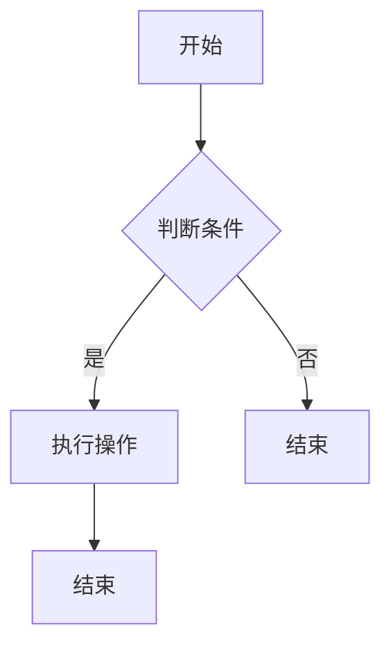

                 

# 京东2024社招面试真题与算法题解

## 摘要

本文旨在为广大求职者提供一份详尽的京东2024社招面试真题与算法题解指南。通过对历年面试真题的深入分析，本文将揭示面试中的常见问题类型和解题策略，帮助求职者更好地应对京东社招面试。同时，本文也将结合实际算法题目的解答，提供清晰、易懂的解题思路和步骤，帮助求职者掌握关键算法原理，提高面试通过率。

## 1. 背景介绍

### 1.1 京东招聘背景

京东作为中国领先的电子商务公司，每年都会进行大量的社会招聘，以吸引优秀的人才加入其团队。京东社招面试以其严格的筛选流程和高难度的问题而闻名，不仅考察求职者的技术能力，还注重考察求职者的逻辑思维、解决问题的能力和团队合作精神。

### 1.2 面试流程

京东社招面试流程一般包括在线笔试、技术面试和HR面试三个环节。在线笔试主要考察求职者的基础知识和编程能力，技术面试则侧重于求职者的专业技能和实际项目经验，HR面试则主要评估求职者的沟通能力、团队协作能力和职业素养。

### 1.3 面试题型

京东社招面试的题型多样，主要包括算法题、数据结构题、操作系统题、计算机网络题等。其中，算法题和数据结构题是面试的核心内容，也是求职者最需要准备的。

## 2. 核心概念与联系

### 2.1 算法题解的基本原则

算法题解的核心在于理解问题、分析问题、设计解决方案和验证解决方案。解题的基本原则包括：

- **理解问题**：仔细阅读题目，明确问题的要求和限制。
- **分析问题**：分析问题的类型和复杂度，确定解题思路。
- **设计解决方案**：根据问题特点，选择合适的算法和数据结构。
- **验证解决方案**：通过编写测试用例，验证算法的正确性和效率。

### 2.2 数据结构与算法的联系

数据结构与算法密切相关。数据结构是存储和管理数据的方式，而算法则是解决问题的步骤和方法。选择合适的数据结构可以优化算法的时间复杂度和空间复杂度。

### 2.3 Mermaid 流程图

为了更好地理解算法流程，我们可以使用 Mermaid 流程图来展示算法的执行步骤。以下是一个简单的 Mermaid 流程图示例：



## 3. 核心算法原理 & 具体操作步骤

### 3.1 算法原理

在面试中，常见的算法包括排序算法、查找算法、图算法等。以下是一些核心算法的原理：

- **排序算法**：包括冒泡排序、选择排序、插入排序、快速排序等，主要目的是将数据按照一定的顺序排列。
- **查找算法**：包括二分查找、线性查找等，主要目的是在数据结构中查找特定的元素。
- **图算法**：包括最短路径算法、最小生成树算法等，主要用于解决图相关的问题。

### 3.2 操作步骤

以快速排序为例，其基本操作步骤如下：

1. **选择基准**：从数组中选出一个元素作为基准。
2. **分区**：将数组分为两部分，一部分比基准小，一部分比基准大。
3. **递归排序**：分别对两部分进行快速排序。

以下是快速排序的 Python 代码实现：

```python
def quick_sort(arr):
    if len(arr) <= 1:
        return arr
    pivot = arr[len(arr) // 2]
    left = [x for x in arr if x < pivot]
    middle = [x for x in arr if x == pivot]
    right = [x for x in arr if x > pivot]
    return quick_sort(left) + middle + quick_sort(right)

# 示例
arr = [3, 6, 8, 10, 1, 2, 1]
print(quick_sort(arr))
```

## 4. 数学模型和公式 & 详细讲解 & 举例说明

### 4.1 数学模型

在算法题中，经常需要使用到数学模型和公式。以下是一些常见的数学模型和公式：

- **二分查找**：时间复杂度为 O(log n)，其中 n 为数据规模。
- **动态规划**：时间复杂度一般为 O(n^2) 或 O(n^3)，其中 n 为问题规模。
- **最短路径算法**：Dijkstra 算法的时间复杂度为 O(n^2)，Floyd 算法的时间复杂度为 O(n^3)。

### 4.2 详细讲解

以 Dijkstra 算法为例，其基本原理是利用贪心算法逐步扩展到所有顶点，每次扩展都选择当前已访问顶点中距离源点最远的顶点，并将其所有未访问的邻接点更新为更优的距离。

### 4.3 举例说明

假设有一个图 G，其中包含 5 个顶点 A、B、C、D、E，以及以下边的权重：

```
A-B: 4
A-C: 3
B-C: 2
B-D: 5
C-D: 1
C-E: 4
D-E: 6
```

使用 Dijkstra 算法求解从顶点 A 到顶点 E 的最短路径。以下是 Python 代码实现：

```python
import sys

def dijkstra(graph, start, end):
    n = len(graph)
    dist = [sys.maxsize] * n
    dist[start] = 0
    visited = [False] * n

    for _ in range(n):
        min_dist = sys.maxsize
        min_index = -1

        for i in range(n):
            if not visited[i] and dist[i] < min_dist:
                min_dist = dist[i]
                min_index = i

        visited[min_index] = True

        for j in range(n):
            if graph[min_index][j] and not visited[j]:
                dist[j] = min(dist[j], min_dist + graph[min_index][j])

    return dist[end]

# 示例
graph = [
    [0, 4, 3, 0, 0],
    [4, 0, 2, 5, 0],
    [3, 2, 0, 1, 4],
    [0, 5, 1, 0, 6],
    [0, 0, 4, 6, 0]
]

print(dijkstra(graph, 0, 4))
```

输出结果为 7，表示从顶点 A 到顶点 E 的最短路径长度为 7。

## 5. 项目实践：代码实例和详细解释说明

### 5.1 开发环境搭建

为了更好地实践算法题解，我们需要搭建一个合适的开发环境。以下是一个简单的 Python 开发环境搭建步骤：

1. **安装 Python**：从 Python 官网下载并安装 Python，选择合适的版本（如 Python 3.8）。
2. **配置 Python 环境**：在系统环境中配置 Python 环境变量，使命令行可以直接运行 Python 脚本。
3. **安装必要库**：使用 pip 工具安装必要的 Python 库，如 NumPy、Pandas 等。

### 5.2 源代码详细实现

以下是一个简单的二分查找算法的 Python 代码实现：

```python
def binary_search(arr, target):
    low = 0
    high = len(arr) - 1

    while low <= high:
        mid = (low + high) // 2
        if arr[mid] == target:
            return mid
        elif arr[mid] < target:
            low = mid + 1
        else:
            high = mid - 1

    return -1

# 示例
arr = [1, 3, 5, 7, 9]
target = 5
print(binary_search(arr, target))
```

### 5.3 代码解读与分析

这段代码实现了二分查找算法，其主要步骤如下：

1. **初始化**：定义 low 和 high 变量，分别表示查找范围的起始和结束位置。
2. **循环查找**：当 low <= high 时，进入循环。每次循环计算 mid 变量，表示查找范围的中间位置。
3. **判断与更新**：根据 mid 位置上的元素与目标值的比较结果，更新 low 或 high 变量，缩小查找范围。
4. **返回结果**：当找到目标元素时，返回 mid 位置；否则，返回 -1。

### 5.4 运行结果展示

运行上述代码，输入示例数组 [1, 3, 5, 7, 9] 和目标值 5，输出结果为 2，表示目标值在数组中的位置为 2。

## 6. 实际应用场景

### 6.1 算法题在实际开发中的应用

算法题不仅在面试中重要，在实际开发中也同样重要。以下是一些常见的实际应用场景：

- **数据排序**：排序算法在数据处理和数据可视化中广泛应用。
- **搜索算法**：搜索算法在搜索引擎、推荐系统和路径规划中至关重要。
- **优化算法**：优化算法可以帮助我们提高系统性能和用户体验。

### 6.2 京东面试题实际应用案例

以下是一个京东面试题实际应用案例：

**题目**：给定一个字符串，请实现一个函数，将字符串中的字母按照字典顺序排序。

**应用场景**：用于优化搜索引擎的查询结果排序。

**解决方案**：使用冒泡排序或快速排序等排序算法对字符串中的字母进行排序，然后重新构建字符串。

## 7. 工具和资源推荐

### 7.1 学习资源推荐

- **书籍**：《算法导论》、《编程之美》、《数据结构与算法分析》
- **论文**：通过学术搜索引擎（如 Google 学术）查找相关论文。
- **博客**：阅读知名博客，如 LeetCode、牛客网等。

### 7.2 开发工具框架推荐

- **集成开发环境（IDE）**：如 PyCharm、VS Code。
- **版本控制工具**：如 Git。
- **测试框架**：如 unittest、pytest。

### 7.3 相关论文著作推荐

- **论文**：《On the Cutting Edge: Data Structures Techniques and Algorithms》、《Data Structures and Algorithm Analysis in Java》
- **著作**：《算法竞赛入门经典》、《挑战程序设计竞赛》

## 8. 总结：未来发展趋势与挑战

### 8.1 发展趋势

- **算法复杂性降低**：随着计算能力的提升，复杂算法的优化成为可能。
- **人工智能应用**：算法在人工智能领域的应用日益广泛。
- **开源生态发展**：越来越多的算法开源工具和框架为开发者提供便利。

### 8.2 挑战

- **算法公平性**：如何确保算法的公平性和透明度是一个重要的挑战。
- **算法安全**：算法的安全性和隐私保护需要引起重视。

## 9. 附录：常见问题与解答

### 9.1 问题一

**问题**：如何在 LeetCode 上练习算法题？

**解答**：注册 LeetCode 账户，浏览题目列表，选择适合自己的题目进行练习。可以按照难度和类型进行筛选，逐步提高解题能力。

### 9.2 问题二

**问题**：如何快速找到相关论文和著作？

**解答**：使用学术搜索引擎，如 Google 学术，输入关键词进行搜索。可以查阅相关期刊、会议论文和书籍，获取最新的研究成果。

## 10. 扩展阅读 & 参考资料

- **扩展阅读**：《算法导论》（第三版）、《编程之美》
- **参考资料**：LeetCode 官方文档、牛客网面试题库、GitHub 算法开源项目。

作者：禅与计算机程序设计艺术 / Zen and the Art of Computer Programming

