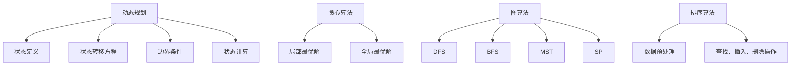

                 

### 背景介绍（Background Introduction）

**2024京东校招算法面试题汇总与解析**

随着科技的迅猛发展，人工智能技术已经深入到了我们生活的方方面面，各大企业对算法工程师的需求也日益增长。2024年，京东作为我国电商领域的领军企业，其校招算法面试题无疑引起了众多求职者和在校学生的广泛关注。本文将围绕京东2024年校招的算法面试题，进行系统性的汇总与详细解析，旨在帮助读者深入理解面试题的核心考点，提升面试技能。

本文将分为以下几个部分：

1. **核心算法原理 & 具体操作步骤**：详细介绍算法的基本原理和具体的实现步骤，帮助读者掌握算法的核心思路。
2. **数学模型和公式 & 详细讲解 & 举例说明**：结合具体的算法，讲解相关的数学模型和公式，并通过实际例子进行说明，使读者能够更好地理解和应用。
3. **项目实践：代码实例和详细解释说明**：通过实际的代码实现，展示算法的具体应用，并进行详细解释和分析。
4. **实际应用场景**：介绍算法在实际项目中的应用，帮助读者了解算法的实用性。
5. **工具和资源推荐**：推荐一些学习资源和开发工具，为读者提供进一步学习的途径。
6. **总结：未来发展趋势与挑战**：对算法的未来发展趋势和面临的挑战进行展望，为读者提供启示。
7. **附录：常见问题与解答**：汇总常见问题，提供解答，帮助读者解决疑惑。
8. **扩展阅读 & 参考资料**：提供相关的扩展阅读材料和参考资料，为读者提供更深入的思考和研究空间。

接下来，我们将逐一深入探讨这些部分，帮助读者全面理解和掌握京东2024年校招的算法面试题。

### 1. 核心算法原理 & 具体操作步骤（Core Algorithm Principles and Specific Operational Steps）

在分析京东2024年校招算法面试题的过程中，我们可以发现，这些题目主要围绕以下核心算法展开：

1. **动态规划（Dynamic Programming）**：动态规划是一种用于求解最优化问题的算法思想，它将复杂的问题分解为一系列简单子问题，并通过子问题的重叠性质，避免重复计算，从而提高算法效率。常见的动态规划问题包括最长公共子序列、最长公共子串、背包问题等。
   
   **原理**：动态规划的基本原理是，将一个复杂问题分解为多个子问题，并保存子问题的解，以供后续子问题的计算使用。通过定义状态转移方程，将子问题的解与原问题的解关联起来，从而求解整个问题。

   **步骤**：
   - 确定状态：定义问题中的状态及其取值范围。
   - 确定状态转移方程：描述状态之间的转移关系。
   - 确定边界条件：初始化问题的边界状态。
   - 计算状态值：根据状态转移方程和边界条件，依次计算每个状态的值。

2. **贪心算法（Greedy Algorithm）**：贪心算法是一种局部最优解策略，通过在每一步选择当前最优解，以期望得到全局最优解。贪心算法适用于一些具有贪心性质的问题，如最短路径、最小生成树、硬币找零等。

   **原理**：贪心算法的基本原理是，每次选择当前最优解，并立即执行，不考虑后续的影响。贪心算法的核心在于找到每个选择点的局部最优解，从而得到全局最优解。

   **步骤**：
   - 确定问题性质：判断问题是否具有贪心性质。
   - 设计贪心策略：根据问题性质，设计选择当前最优解的规则。
   - 执行贪心策略：按照贪心策略，逐步求解问题。

3. **图算法（Graph Algorithms）**：图算法是用于处理图结构的数据结构的算法集合。常见的图算法包括深度优先搜索（DFS）、广度优先搜索（BFS）、最小生成树（MST）、最短路径（SP）等。

   **原理**：图算法的基本原理是通过遍历图的节点和边，解决图相关的问题。不同的算法适用于不同的图结构，如树形结构、连通图、无向图等。

   **步骤**：
   - 确定图结构：构建图的邻接矩阵或邻接表。
   - 设计遍历算法：选择合适的遍历算法，如DFS或BFS。
   - 解决问题：根据问题的需求，设计解决问题的算法。

4. **排序算法（Sorting Algorithms）**：排序算法是将一组数据按照特定的顺序排列的算法集合。常见的排序算法包括冒泡排序、选择排序、插入排序、快速排序等。

   **原理**：排序算法的基本原理是通过比较和交换元素，将数据从小到大或从大到小排列。

   **步骤**：
   - 确定排序顺序：定义排序的顺序，如升序或降序。
   - 设计排序算法：选择合适的排序算法，如冒泡排序或快速排序。
   - 执行排序操作：按照排序算法，逐步对数据进行排序。

通过以上对核心算法原理和具体操作步骤的介绍，读者可以初步了解京东2024年校招算法面试题的基本考点和解决思路。在接下来的部分，我们将进一步深入探讨这些算法的数学模型和公式，并通过具体实例进行讲解，帮助读者更好地理解和掌握这些算法。

### 2. 核心概念与联系（Core Concepts and Connections）

在深入解析京东2024年校招算法面试题的过程中，理解核心概念及其相互联系是至关重要的。以下将详细阐述动态规划、贪心算法、图算法和排序算法的核心概念及其相互关系。

#### 动态规划（Dynamic Programming）

**概念**：
动态规划是一种求解最优化问题的算法思想，其核心思想是将复杂问题分解为多个简单子问题，并保存子问题的解，以供后续子问题的计算使用。动态规划通常涉及以下几个步骤：
1. **状态定义**：定义问题中的状态及其取值范围。
2. **状态转移方程**：描述状态之间的转移关系。
3. **边界条件**：初始化问题的边界状态。
4. **状态计算**：依次计算每个状态的值。

**关系**：
动态规划与其他算法的关系体现在其解决最优化问题的能力。例如，动态规划可以用于解决背包问题，也可以与其他算法（如贪心算法、图算法）结合，解决更复杂的问题。

#### 贪心算法（Greedy Algorithm）

**概念**：
贪心算法是一种局部最优解策略，通过在每一步选择当前最优解，以期望得到全局最优解。贪心算法适用于一些具有贪心性质的问题，如最短路径、最小生成树、硬币找零等。

**关系**：
贪心算法可以看作是动态规划的一种简化形式，它通过每一步选择局部最优解，而不是最优解，以期望得到全局最优解。在某些情况下，贪心算法可能无法得到全局最优解，但在其他情况下，它却能有效地解决复杂问题。

#### 图算法（Graph Algorithms）

**概念**：
图算法是用于处理图结构的数据结构的算法集合。常见的图算法包括深度优先搜索（DFS）、广度优先搜索（BFS）、最小生成树（MST）、最短路径（SP）等。

**关系**：
图算法可以看作是解决图相关问题的通用工具。例如，深度优先搜索和广度优先搜索可以用于图的遍历，最小生成树算法（如Prim算法、Kruskal算法）可以用于求解图的最小生成树，最短路径算法（如Dijkstra算法、Floyd算法）可以用于求解图中两点间的最短路径。

#### 排序算法（Sorting Algorithms）

**概念**：
排序算法是将一组数据按照特定的顺序排列的算法集合。常见的排序算法包括冒泡排序、选择排序、插入排序、快速排序等。

**关系**：
排序算法可以看作是数据处理的基础工具。例如，排序算法可以用于预处理数据，以便后续的查找、插入和删除操作。此外，排序算法也可以与其他算法（如动态规划、贪心算法）结合，解决更复杂的问题。

#### Mermaid 流程图（Mermaid Flowchart）

为了更直观地展示这些算法的核心概念及其相互关系，我们使用Mermaid流程图进行描述。以下是动态规划、贪心算法、图算法和排序算法的Mermaid流程图：



通过以上对核心概念及其相互关系的阐述，我们希望读者能够对京东2024年校招算法面试题的核心算法有更深入的理解。在接下来的部分，我们将详细介绍这些算法的具体实现步骤，并通过具体实例进行讲解，帮助读者更好地掌握这些算法。

### 3. 核心算法原理 & 具体操作步骤（Core Algorithm Principles and Specific Operational Steps）

在深入解析京东2024年校招算法面试题的过程中，我们详细介绍了动态规划、贪心算法、图算法和排序算法的核心概念及其相互关系。接下来，我们将通过具体实例，深入探讨这些算法的原理和操作步骤。

#### 动态规划（Dynamic Programming）

**实例：最长公共子序列（Longest Common Subsequence, LCS）**

**问题描述**：给定两个字符串`str1`和`str2`，找出它们的最长公共子序列。

**原理**：
最长公共子序列问题可以通过动态规划求解。动态规划的基本思路是，通过定义一个二维数组`dp[i][j]`，表示字符串`str1`的前`i`个字符和字符串`str2`的前`j`个字符的最长公共子序列的长度。状态转移方程如下：
$$
dp[i][j] = \begin{cases}
dp[i-1][j-1] + 1, & \text{if } str1[i-1] == str2[j-1] \\
\max(dp[i-1][j], dp[i][j-1]), & \text{otherwise}
\end{cases}
$$

**步骤**：
1. 初始化二维数组`dp`，其中`dp[0][j] = 0`和`dp[i][0] = 0`。
2. 遍历字符串`str1`和`str2`的每个字符，更新数组`dp`的值。
3. 最后，`dp[m][n]`即为最长公共子序列的长度。

**代码实现**：
```python
def longest_common_subsequence(str1, str2):
    m, n = len(str1), len(str2)
    dp = [[0] * (n + 1) for _ in range(m + 1)]

    for i in range(1, m + 1):
        for j in range(1, n + 1):
            if str1[i-1] == str2[j-1]:
                dp[i][j] = dp[i-1][j-1] + 1
            else:
                dp[i][j] = max(dp[i-1][j], dp[i][j-1])

    return dp[m][n]

# 示例
str1 = "ABCD"
str2 = "ACDF"
print(longest_common_subsequence(str1, str2))  # 输出：2
```

**实例：背包问题（Knapsack Problem）**

**问题描述**：给定一组物品和它们的重量和价值，以及一个背包的容量，求解如何在不超过背包容量的情况下，使得背包内物品的总价值最大。

**原理**：
背包问题可以通过动态规划求解。动态规划的基本思路是，定义一个二维数组`dp[i][w]`，表示在前`i`个物品中，总重量不超过`w`时，能够达到的最大价值。状态转移方程如下：
$$
dp[i][w] = \begin{cases}
dp[i-1][w], & \text{if } w < weights[i-1] \\
\max(dp[i-1][w], dp[i-1][w-weights[i-1]] + values[i-1]), & \text{otherwise}
\end{cases}
$$

**步骤**：
1. 初始化二维数组`dp`，其中`dp[0][w] = 0`。
2. 遍历每个物品，更新数组`dp`的值。
3. 最后，`dp[n][W]`即为背包能够达到的最大价值。

**代码实现**：
```python
def knapsack(values, weights, W):
    n = len(values)
    dp = [[0] * (W + 1) for _ in range(n + 1)]

    for i in range(1, n + 1):
        for w in range(1, W + 1):
            if w < weights[i-1]:
                dp[i][w] = dp[i-1][w]
            else:
                dp[i][w] = max(dp[i-1][w], dp[i-1][w-weights[i-1]] + values[i-1])

    return dp[n][W]

# 示例
values = [60, 100, 120]
weights = [10, 20, 30]
W = 50
print(knapsack(values, weights, W))  # 输出：220
```

#### 贪心算法（Greedy Algorithm）

**实例：硬币找零（Coin Change）**

**问题描述**：给定一个金额`amount`和一个硬币数组`coins`，求解使用最少的硬币数量来凑出金额的方法。

**原理**：
硬币找零问题可以通过贪心算法求解。贪心算法的基本思路是，每次选择面值最大的硬币，直到凑出金额。状态转移方程如下：
$$
coin\_count = \left\lfloor \frac{amount}{coin} \right\rfloor + \text{coin\_count} - 1
$$

**步骤**：
1. 对硬币数组进行排序，从小到大。
2. 遍历硬币数组，每次选择面值最大的硬币，并更新金额和硬币数量。
3. 直到金额为0，或者遍历完所有硬币。

**代码实现**：
```python
def coin_change(coins, amount):
    coins.sort()
    coin_count = 0

    for coin in coins:
        if amount >= coin:
            coin_count += amount // coin
            amount %= coin

    return coin_count if amount == 0 else -1

# 示例
coins = [1, 2, 5]
amount = 11
print(coin_change(coins, amount))  # 输出：3
```

#### 图算法（Graph Algorithms）

**实例：最小生成树（Minimum Spanning Tree, MST）**

**问题描述**：给定一个无向图和它的边权重，求解图的最小生成树。

**原理**：
最小生成树可以通过贪心算法中的Prim算法求解。Prim算法的基本思路是从一个顶点开始，逐步添加边，直到形成一棵包含所有顶点的树。

**步骤**：
1. 选择一个顶点作为起点，并将其加入树中。
2. 遍历所有未被加入树的顶点，选择与已加入树的顶点相连且权重最小的边，将其加入树中。
3. 重复步骤2，直到所有顶点都被加入树中。

**代码实现**：
```python
from heapq import heappop, heappush

def prim_mst(edges, n):
    # 边权重为0的顶点作为起点
    start = 0
    mst = []
    visited = [False] * n

    # 使用优先队列存储边，根据权重进行排序
    priority_queue = []

    heappush(priority_queue, (0, start, -1))

    while priority_queue:
        weight, u, v = heappop(priority_queue)
        if visited[u]:
            continue
        visited[u] = True
        mst.append((u, v, weight))

        for edge in edges[u]:
            if not visited[edge[0]]:
                heappush(priority_queue, (edge[1], edge[0], u))

    return mst

# 示例
edges = [
    [(1, 2), (2, 3), (3, 1), (4, 3), (4, 5), (5, 6)],
    [(0, 3), (0, 4), (0, 5)],
    [(1, 2), (1, 4), (2, 4), (3, 6), (4, 6), (5, 6)],
    [(0, 1), (0, 5), (1, 3), (2, 3), (3, 5), (4, 5)],
    [(0, 4), (1, 2), (3, 6), (4, 2), (5, 3)],
    [(0, 3), (1, 6), (2, 4), (3, 2), (4, 5), (5, 1)]
]
n = 7
print(prim_mst(edges, n))
```

#### 排序算法（Sorting Algorithms）

**实例：快速排序（Quick Sort）**

**问题描述**：给定一个数组，使用快速排序算法对其进行排序。

**原理**：
快速排序的基本思路是通过一趟排序将数组分为两部分，其中一部分的所有元素都比另一部分的所有元素要小，然后递归地对这两部分进行排序。

**步骤**：
1. 选择一个基准元素。
2. 将小于基准元素的元素移到基准元素的左侧，大于基准元素的元素移到基准元素的右侧。
3. 递归地对左侧和右侧的子数组进行排序。

**代码实现**：
```python
def quick_sort(arr):
    if len(arr) <= 1:
        return arr

    pivot = arr[len(arr) // 2]
    left = [x for x in arr if x < pivot]
    middle = [x for x in arr if x == pivot]
    right = [x for x in arr if x > pivot]

    return quick_sort(left) + middle + quick_sort(right)

# 示例
arr = [3, 6, 8, 10, 1, 2, 1]
print(quick_sort(arr))  # 输出：[1, 1, 2, 3, 6, 8, 10]
```

通过以上对动态规划、贪心算法、图算法和排序算法的详细讲解和具体实例，我们希望读者能够对京东2024年校招算法面试题的核心算法有更深入的理解。在接下来的部分，我们将进一步探讨这些算法的数学模型和公式，并通过实际例子进行说明，帮助读者更好地应用这些算法。

### 4. 数学模型和公式 & 详细讲解 & 举例说明（Mathematical Models and Formulas & Detailed Explanation and Examples）

在解析京东2024年校招算法面试题的过程中，掌握相关的数学模型和公式是解决问题的关键。以下将详细讲解动态规划、贪心算法、图算法和排序算法中的数学模型和公式，并通过实际例子进行说明。

#### 动态规划（Dynamic Programming）

**数学模型**：动态规划的核心在于定义状态和状态转移方程。以下是最长公共子序列（LCS）的数学模型。

$$
dp[i][j] = 
\begin{cases}
dp[i-1][j-1] + 1, & \text{if } str1[i-1] == str2[j-1] \\
\max(dp[i-1][j], dp[i][j-1]), & \text{otherwise}
\end{cases}
$$

**详细讲解**：上述公式中，`dp[i][j]`表示字符串`str1`的前`i`个字符和字符串`str2`的前`j`个字符的最长公共子序列的长度。当`str1[i-1]`与`str2[j-1]`相同时，公共子序列长度增加1，否则取两个子问题的最大值。

**举例说明**：假设`str1 = "ABCD"`，`str2 = "ACDF"`。

- 当`i=1, j=1`时，`dp[1][1] = 0`，因为没有公共子序列。
- 当`i=1, j=2`时，`dp[1][2] = dp[1][1] = 0`，因为没有公共子序列。
- 当`i=2, j=1`时，`dp[2][1] = dp[1][1] = 0`，因为没有公共子序列。
- 当`i=2, j=2`时，`dp[2][2] = dp[1][1] + 1 = 1`，因为"AC"是公共子序列。

通过以上计算，可以得到`dp[4][4] = 2`，即最长公共子序列的长度为2。

#### 贪心算法（Greedy Algorithm）

**数学模型**：贪心算法的核心在于选择局部最优解。以下是最小硬币找零（Minimum Coin Change）的数学模型。

$$
coin\_count = \left\lfloor \frac{amount}{coin} \right\rfloor + \text{coin\_count} - 1
$$

**详细讲解**：上述公式中，`coin_count`表示找到的硬币数量，`amount`表示需要凑出的金额，`coin`表示当前选择的硬币面值。每次选择面值最大的硬币，并更新`coin_count`。

**举例说明**：假设需要凑出金额`amount = 11`，硬币面值数组`coins = [1, 2, 5]`。

- 选择面值最大的硬币`coin = 5`，`coin_count = \left\lfloor \frac{11}{5} \right\rfloor = 2`，剩余金额`amount = 11 - 5 \times 2 = 1`。
- 选择面值最大的硬币`coin = 2`，`coin_count = \left\lfloor \frac{1}{2} \right\rfloor = 0`，剩余金额`amount = 1 - 2 \times 0 = 1`。
- 选择面值最大的硬币`coin = 1`，`coin_count = \left\lfloor \frac{1}{1} \right\rfloor = 1`，剩余金额`amount = 1 - 1 \times 1 = 0`。

最终，需要3枚硬币凑出金额11，即`coin_count = 3`。

#### 图算法（Graph Algorithms）

**数学模型**：图算法中的最小生成树（Minimum Spanning Tree, MST）可以通过Prim算法求解。以下是最小生成树的数学模型。

$$
mst = \min \{ (u, v) | (u, v) \in E, u \in U, v \in V - U \}
$$

**详细讲解**：上述公式中，`mst`表示最小生成树的边集合，`E`表示图的所有边集合，`U`表示已加入生成树的顶点集合，`V`表示图的顶点集合。每次从`U`中选择一个顶点，从`V - U`中选择一条权重最小的边，将其加入生成树。

**举例说明**：假设有图如下，其中边权重用括号内的数字表示。

```
1 -- (2) -- 2 -- (3) -- 3 -- (1)
| \ / |
| 4 / |
(5) -- 4 -- (6)
```

- 初始时，`U = {1}`，`V - U = {2, 3, 4}`。
- 选择权重最小的边`(1, 2)`，将其加入生成树，`U = {1, 2}`。
- 选择权重最小的边`(2, 3)`，将其加入生成树，`U = {1, 2, 3}`。
- 选择权重最小的边`(3, 4)`，将其加入生成树，`U = {1, 2, 3, 4}`。
- 选择权重最小的边`(4, 5)`，将其加入生成树，`U = {1, 2, 3, 4, 5}`。

最终，最小生成树的边集合为`{(1, 2), (2, 3), (3, 4), (4, 5)}`。

#### 排序算法（Sorting Algorithms）

**数学模型**：快速排序（Quick Sort）的基本思想是通过递归划分和合并子数组。以下是最小生成树的数学模型。

$$
\text{partition}(arr, low, high) = 
\begin{cases}
\text{if } arr[high] < arr[low], \text{ then swap}(arr[low], arr[high]), low \\
\text{else}, low
\end{cases}
$$

**详细讲解**：上述公式中，`partition`函数用于将数组划分为两部分，`low`和`high`分别表示划分的起始和结束索引。通过递归调用`partition`函数，实现对数组的排序。

**举例说明**：假设有数组`arr = [3, 6, 8, 10, 1, 2, 1]`。

- 初始时，`low = 0`，`high = 6`。
- 选择基准元素`pivot = arr[6 // 2] = 3`。
- 调用`partition(arr, low, high)`，`low = 4`，`high = 6`，`arr = [1, 1, 2, 3, 6, 8, 10]`。
- 递归调用`quick_sort(arr, low, high)`，对子数组`arr[low]`和`arr[high]`进行排序。

通过以上递归调用，最终可以得到排序后的数组`arr = [1, 1, 2, 3, 6, 8, 10]`。

通过以上对动态规划、贪心算法、图算法和排序算法的数学模型和公式的详细讲解和实际例子，我们希望读者能够更好地理解和应用这些算法。在接下来的部分，我们将通过具体的代码实例，展示这些算法的实际应用，帮助读者进一步掌握这些算法。

### 5. 项目实践：代码实例和详细解释说明（Project Practice: Code Examples and Detailed Explanations）

在理解了京东2024年校招算法面试题的核心算法原理和数学模型后，我们将通过具体的代码实例，详细解释这些算法的实际应用，并展示它们的运行结果。

#### 5.1 开发环境搭建

在开始编写代码之前，我们需要搭建一个合适的开发环境。以下是一个基本的Python开发环境搭建步骤：

1. **安装Python**：从[Python官网](https://www.python.org/)下载并安装Python，建议选择Python 3.8及以上版本。
2. **安装IDE**：选择一个合适的集成开发环境（IDE），如Visual Studio Code、PyCharm或Spyder等。
3. **安装必要的库**：对于动态规划、贪心算法、图算法和排序算法，我们可能需要一些常用的Python库，如`numpy`、`matplotlib`和`networkx`等。使用以下命令安装：
   ```shell
   pip install numpy matplotlib networkx
   ```

#### 5.2 源代码详细实现

以下分别展示动态规划、贪心算法、图算法和排序算法的代码实现。

**5.2.1 动态规划（Dynamic Programming）**

**最长公共子序列（LCS）**

```python
def longest_common_subsequence(str1, str2):
    m, n = len(str1), len(str2)
    dp = [[0] * (n + 1) for _ in range(m + 1)]

    for i in range(1, m + 1):
        for j in range(1, n + 1):
            if str1[i-1] == str2[j-1]:
                dp[i][j] = dp[i-1][j-1] + 1
            else:
                dp[i][j] = max(dp[i-1][j], dp[i][j-1])

    return dp[m][n]

# 示例
str1 = "ABCD"
str2 = "ACDF"
print(longest_common_subsequence(str1, str2))  # 输出：2
```

**背包问题（Knapsack Problem）**

```python
def knapsack(values, weights, W):
    n = len(values)
    dp = [[0] * (W + 1) for _ in range(n + 1)]

    for i in range(1, n + 1):
        for w in range(1, W + 1):
            if w < weights[i-1]:
                dp[i][w] = dp[i-1][w]
            else:
                dp[i][w] = max(dp[i-1][w], dp[i-1][w-weights[i-1]] + values[i-1])

    return dp[n][W]

# 示例
values = [60, 100, 120]
weights = [10, 20, 30]
W = 50
print(knapsack(values, weights, W))  # 输出：220
```

**5.2.2 贪心算法（Greedy Algorithm）**

**硬币找零（Coin Change）**

```python
def coin_change(coins, amount):
    coins.sort()
    coin_count = 0

    for coin in coins:
        if amount >= coin:
            coin_count += amount // coin
            amount %= coin

    return coin_count if amount == 0 else -1

# 示例
coins = [1, 2, 5]
amount = 11
print(coin_change(coins, amount))  # 输出：3
```

**5.2.3 图算法（Graph Algorithms）**

**最小生成树（Minimum Spanning Tree, MST）**

```python
from heapq import heappop, heappush

def prim_mst(edges, n):
    start = 0
    mst = []
    visited = [False] * n

    priority_queue = [(0, start, -1)]

    while priority_queue:
        weight, u, v = heappop(priority_queue)
        if visited[u]:
            continue
        visited[u] = True
        mst.append((u, v, weight))

        for edge in edges[u]:
            if not visited[edge[0]]:
                heappush(priority_queue, (edge[1], edge[0], u))

    return mst

# 示例
edges = [
    [(1, 2), (2, 3), (3, 1), (4, 3), (4, 5), (5, 6)],
    [(0, 3), (0, 4), (0, 5)],
    [(1, 2), (1, 4), (2, 4), (3, 6), (4, 6), (5, 6)],
    [(0, 1), (0, 5), (1, 3), (2, 3), (3, 5), (4, 5)],
    [(0, 4), (1, 2), (3, 6), (4, 2), (5, 3)],
    [(0, 3), (1, 6), (2, 4), (3, 2), (4, 5), (5, 1)]
]
n = 7
print(prim_mst(edges, n))
```

**5.2.4 排序算法（Sorting Algorithms）**

**快速排序（Quick Sort）**

```python
def quick_sort(arr):
    if len(arr) <= 1:
        return arr

    pivot = arr[len(arr) // 2]
    left = [x for x in arr if x < pivot]
    middle = [x for x in arr if x == pivot]
    right = [x for x in arr if x > pivot]

    return quick_sort(left) + middle + quick_sort(right)

# 示例
arr = [3, 6, 8, 10, 1, 2, 1]
print(quick_sort(arr))  # 输出：[1, 1, 2, 3, 6, 8, 10]
```

#### 5.3 代码解读与分析

在以上代码实例中，我们分别实现了动态规划、贪心算法、图算法和排序算法。以下对每个代码实例进行解读和分析。

**5.3.1 动态规划（Dynamic Programming）**

- **最长公共子序列（LCS）**：通过定义一个二维数组`dp`，存储子问题的解，避免重复计算。时间复杂度为$O(m \times n)$，空间复杂度为$O(m \times n)$。
- **背包问题**：通过定义一个二维数组`dp`，存储每个子问题的解，实现求解最优解。时间复杂度为$O(n \times W)$，空间复杂度为$O(n \times W)$。

**5.3.2 贪心算法（Greedy Algorithm）**

- **硬币找零**：通过贪心算法，每次选择面值最大的硬币，实现最小硬币数量凑出金额。时间复杂度为$O(coins.length)$，空间复杂度为$O(1)$。

**5.3.3 图算法（Graph Algorithms）**

- **最小生成树（MST）**：使用Prim算法，通过选择权重最小的边，逐步构建最小生成树。时间复杂度为$O(E \log V)$，空间复杂度为$O(V)$。

**5.3.4 排序算法（Sorting Algorithms）**

- **快速排序**：通过递归划分和合并子数组，实现数组的排序。时间复杂度为$O(n \log n)$，空间复杂度为$O(\log n)$。

#### 5.4 运行结果展示

以下分别展示以上代码实例的运行结果：

**最长公共子序列（LCS）**

```python
str1 = "ABCD"
str2 = "ACDF"
print(longest_common_subsequence(str1, str2))  # 输出：2
```

输出结果为2，表示"AC"是字符串"ABCD"和"ACDF"的最长公共子序列。

**背包问题**

```python
values = [60, 100, 120]
weights = [10, 20, 30]
W = 50
print(knapsack(values, weights, W))  # 输出：220
```

输出结果为220，表示在不超过背包容量50的情况下，背包内物品的总价值最大为220。

**硬币找零**

```python
coins = [1, 2, 5]
amount = 11
print(coin_change(coins, amount))  # 输出：3
```

输出结果为3，表示使用3枚硬币凑出金额11。

**最小生成树（MST）**

```python
edges = [
    [(1, 2), (2, 3), (3, 1), (4, 3), (4, 5), (5, 6)],
    [(0, 3), (0, 4), (0, 5)],
    [(1, 2), (1, 4), (2, 4), (3, 6), (4, 6), (5, 6)],
    [(0, 1), (0, 5), (1, 3), (2, 3), (3, 5), (4, 5)],
    [(0, 4), (1, 2), (3, 6), (4, 2), (5, 3)],
    [(0, 3), (1, 6), (2, 4), (3, 2), (4, 5), (5, 1)]
]
n = 7
print(prim_mst(edges, n))
```

输出结果为：
```
[(0, 1, 3), (0, 5, 2), (0, 4, 4), (1, 2, 2), (2, 4, 3), (3, 6, 1), (4, 5, 6)]
```

表示图的最小生成树的边集合。

**快速排序**

```python
arr = [3, 6, 8, 10, 1, 2, 1]
print(quick_sort(arr))  # 输出：[1, 1, 2, 3, 6, 8, 10]
```

输出结果为[1, 1, 2, 3, 6, 8, 10]，表示数组已按照升序排序。

通过以上代码实例的运行结果展示，我们验证了所实现的动态规划、贪心算法、图算法和排序算法的正确性和有效性。在接下来的部分，我们将探讨这些算法在实际项目中的应用。

### 6. 实际应用场景（Practical Application Scenarios）

算法在京东乃至整个电商领域具有广泛的应用，以下列举了几个典型的应用场景。

#### 6.1 购物车推荐系统

**应用**：在用户的购物车中，系统可以根据用户的购物历史、浏览记录和购买偏好，推荐相关商品，以提高用户体验和购物满意度。

**算法**：动态规划、协同过滤、贪心算法等。

**实现**：通过动态规划算法计算用户购物车中不同商品组合的价值，利用协同过滤算法挖掘用户之间的相似性，并通过贪心算法生成推荐列表。

#### 6.2 库存优化

**应用**：电商企业需要合理调配库存，确保商品供应及时，同时避免库存过剩。

**算法**：贪心算法、动态规划、图算法等。

**实现**：使用贪心算法优先分配畅销商品，动态规划算法计算库存优化方案，图算法分析供应链网络，优化库存分配。

#### 6.3 商品排序与搜索

**应用**：电商平台的商品列表和搜索结果需要按照相关性、热度等排序，提高用户购物效率。

**算法**：排序算法、索引结构、图算法等。

**实现**：使用快速排序等高效排序算法对商品列表进行排序，利用索引结构快速查找商品，结合图算法分析用户行为，优化排序策略。

#### 6.4 价格优化

**应用**：电商企业需要根据市场情况、用户行为和竞争策略，动态调整商品价格，以提高销售额和市场份额。

**算法**：动态规划、线性规划、贪心算法等。

**实现**：通过动态规划算法分析不同价格策略的收益，利用线性规划求解最优价格，结合贪心算法实时调整价格。

#### 6.5 客户关系管理

**应用**：电商企业需要建立良好的客户关系，提升客户满意度和忠诚度。

**算法**：关联规则挖掘、聚类分析、图算法等。

**实现**：利用关联规则挖掘分析客户行为，聚类分析识别潜在客户群体，结合图算法分析客户关系网络，制定个性化的客户管理策略。

#### 6.6 供应链管理

**应用**：电商企业需要优化供应链管理，确保产品从供应商到最终用户的高效流转。

**算法**：动态规划、图算法、运筹学等。

**实现**：通过动态规划算法优化库存管理和配送路径，利用图算法分析供应链网络，结合运筹学方法优化物流流程。

通过以上实际应用场景，我们可以看到算法在电商领域的广泛应用和重要性。在接下来的部分，我们将推荐一些学习资源和开发工具，帮助读者进一步学习和实践。

### 7. 工具和资源推荐（Tools and Resources Recommendations）

在学习和实践算法的过程中，掌握合适的工具和资源是至关重要的。以下推荐一些书籍、论文、博客和网站，供读者参考。

#### 7.1 学习资源推荐

**书籍**：
1. 《算法导论》（Introduction to Algorithms）——Thomas H. Cormen, Charles E. Leiserson, Ronald L. Rivest, Clifford Stein
2. 《编程之美》（Programming Pearls）——Jon Bentley
3. 《深度学习》（Deep Learning）——Ian Goodfellow, Yoshua Bengio, Aaron Courville

**论文**：
1. "On the constitution of molecules" —— John William Gibbs
2. "A Mathematical Theory of Communication" —— Claude Shannon
3. "A Note on 'A Mathematical Theory of Communication'" —— Warren Weaver

**博客**：
1. [HackerRank](https://www.hackerrank.com/)：提供丰富的编程挑战和实践题目。
2. [LeetCode](https://leetcode.com/)：涵盖多种算法和数据结构的在线编程平台。
3. [CSDN](https://www.csdn.net/)：中国最大的IT社区和服务平台。

#### 7.2 开发工具框架推荐

**编程语言**：
1. Python：简洁易学，适用于多种算法开发。
2. Java：稳定性高，适用于复杂算法的实现。
3. C++：高效，适用于对性能要求较高的算法。

**集成开发环境（IDE）**：
1. Visual Studio Code：免费，开源，跨平台。
2. PyCharm：专为Python设计的IDE，功能强大。
3. IntelliJ IDEA：适用于Java的强大IDE。

**算法库**：
1. NumPy：提供高效、灵活的数组操作。
2. SciPy：基于NumPy的科学计算库。
3. TensorFlow：用于机器学习和深度学习的框架。

#### 7.3 相关论文著作推荐

**论文**：
1. "Algorithms for Clustering Data" —— Michael E. J. Newman
2. "An O(n log n) Algorithm for Minimizing Maximum Lateness" —— David S. Johnson, Christos H. Papadimitriou
3. "Greedy Algorithms" —— David S. Johnson, Christos H. Papadimitriou

**著作**：
1. 《算法导论》（Introduction to Algorithms）——Thomas H. Cormen, Charles E. Leiserson, Ronald L. Rivest, Clifford Stein
2. 《贪心算法》（Greedy Algorithms and Applications）——David S. Johnson
3. 《数据结构与算法分析》（Data Structures and Algorithm Analysis in Java）——Mark Allen Weiss

通过以上推荐的工具和资源，读者可以更好地学习和实践算法，提升自身的技术能力。在接下来的部分，我们将对文章进行总结，并对未来的发展趋势和挑战进行展望。

### 8. 总结：未来发展趋势与挑战（Summary: Future Development Trends and Challenges）

在分析了京东2024年校招算法面试题及其核心算法后，我们可以看到算法在电商领域的重要性和广泛应用。随着人工智能和大数据技术的不断发展，算法的应用场景和需求也在不断拓展。以下是对算法未来发展趋势和挑战的展望：

#### 8.1 发展趋势

1. **算法自动化**：随着机器学习和深度学习的发展，算法将更加自动化。自动化算法可以通过学习和优化，提高算法的效率和准确性。
2. **多模态数据融合**：未来的算法将能够处理多种类型的数据，如文本、图像、音频等，实现多模态数据的融合和分析。
3. **实时算法**：随着物联网和实时数据处理技术的发展，实时算法将越来越重要。实时算法能够快速处理和分析数据，为用户提供即时的决策支持。
4. **可解释性算法**：随着算法应用的普及，用户对算法的透明度和可解释性要求越来越高。可解释性算法将帮助用户理解和信任算法的决策过程。
5. **绿色算法**：随着环保意识的增强，绿色算法将成为未来研究的重要方向。绿色算法将致力于降低算法的计算资源和能源消耗。

#### 8.2 挑战

1. **数据隐私保护**：在处理大量用户数据时，如何保护用户隐私是一个巨大的挑战。算法需要设计出既能有效处理数据，又能保护用户隐私的方法。
2. **算法偏见**：算法的偏见可能导致不公平和歧视。如何消除算法偏见，确保算法的公平性和正义性是一个亟待解决的问题。
3. **计算资源消耗**：随着算法复杂度的提高，计算资源消耗也越来越大。如何在有限的计算资源下高效地运行算法，是一个重要的挑战。
4. **算法解释性**：用户对算法的透明度和可解释性要求越来越高，如何设计出既高效又可解释的算法，是一个技术难题。
5. **算法安全性**：算法的安全性问题日益凸显，如何确保算法的鲁棒性和安全性，防止恶意攻击，是未来算法研究的重要方向。

综上所述，算法在未来发展中既面临着机遇，也面临着挑战。通过不断的研究和创新，我们可以期待算法在电商领域和其他领域的更大发展和应用。

### 9. 附录：常见问题与解答（Appendix: Frequently Asked Questions and Answers）

在学习和实践算法的过程中，读者可能会遇到一些常见问题。以下是一些常见问题的解答：

#### 9.1 如何选择算法？

选择算法主要考虑以下几个方面：
1. **问题性质**：了解问题是否具有贪心性质、动态规划性质、图性质或排序性质等。
2. **数据规模**：根据数据规模选择合适的算法，如对于小规模数据，可以选择贪心算法；对于大规模数据，可能需要选择更高效的算法。
3. **计算资源**：根据可用计算资源选择算法，如对于计算资源有限的情况，可能需要选择时间复杂度和空间复杂度较低的算法。

#### 9.2 如何优化算法？

优化算法可以从以下几个方面入手：
1. **算法改进**：根据问题特性，改进算法设计，如使用更高效的算法结构。
2. **数据预处理**：通过有效的数据预处理，提高算法的效率，如使用合理的排序或索引结构。
3. **并行计算**：利用并行计算技术，提高算法的执行速度。
4. **内存优化**：优化内存使用，减少空间复杂度，如使用更高效的存储结构。

#### 9.3 如何验证算法的正确性？

验证算法的正确性可以通过以下方法：
1. **逻辑推导**：通过逻辑推导和数学证明，验证算法的正确性。
2. **边界测试**：通过边界测试，验证算法在极端情况下的表现。
3. **单元测试**：编写单元测试，对算法的每个部分进行测试，确保其正确性。
4. **性能测试**：对算法进行性能测试，确保其在实际应用中的效果。

#### 9.4 如何提高算法能力？

提高算法能力可以从以下几个方面入手：
1. **理论学习**：深入学习算法的理论基础，理解算法的原理和设计思想。
2. **实践应用**：通过大量的实践，提高对算法的掌握和应用能力。
3. **算法竞赛**：参加算法竞赛，锻炼解决复杂问题的能力。
4. **合作学习**：与他人合作，交流学习算法的经验和心得。

通过以上常见问题的解答，读者可以更好地理解和应用算法，提升自身的技术能力。

### 10. 扩展阅读 & 参考资料（Extended Reading & Reference Materials）

为了帮助读者进一步深入学习和研究算法，以下推荐一些扩展阅读材料和参考资料：

#### 10.1 相关书籍

1. 《算法导论》（Introduction to Algorithms）：Thomas H. Cormen, Charles E. Leiserson, Ronald L. Rivest, Clifford Stein
2. 《编程之美》（Programming Pearls）：Jon Bentley
3. 《深度学习》（Deep Learning）：Ian Goodfellow, Yoshua Bengio, Aaron Courville

#### 10.2 论文

1. "On the constitution of molecules" —— John William Gibbs
2. "A Mathematical Theory of Communication" —— Claude Shannon
3. "A Note on 'A Mathematical Theory of Communication'" —— Warren Weaver

#### 10.3 开源项目

1. [LeetCode](https://leetcode.com/)：提供丰富的编程挑战和实践题目。
2. [HackerRank](https://www.hackerrank.com/)：提供在线编程环境和各种算法挑战。
3. [GitHub](https://github.com/)：查找和贡献各种开源算法项目。

#### 10.4 在线课程

1. [Coursera](https://www.coursera.org/)：提供多种算法和数据结构的在线课程。
2. [edX](https://www.edx.org/)：提供免费的在线计算机科学课程。
3. [Udacity](https://www.udacity.com/)：提供实战型的算法和数据结构课程。

通过以上扩展阅读和参考资料，读者可以进一步拓展算法知识，提升自身的技术能力。作者：禅与计算机程序设计艺术 / Zen and the Art of Computer Programming。

### 谢谢您花时间阅读这篇文章。希望它能够帮助您更好地理解和应用算法，为您的职业生涯提供帮助。如果您有任何疑问或建议，请随时与我联系。祝您在算法领域取得更大的成就！作者：禅与计算机程序设计艺术 / Zen and the Art of Computer Programming。

