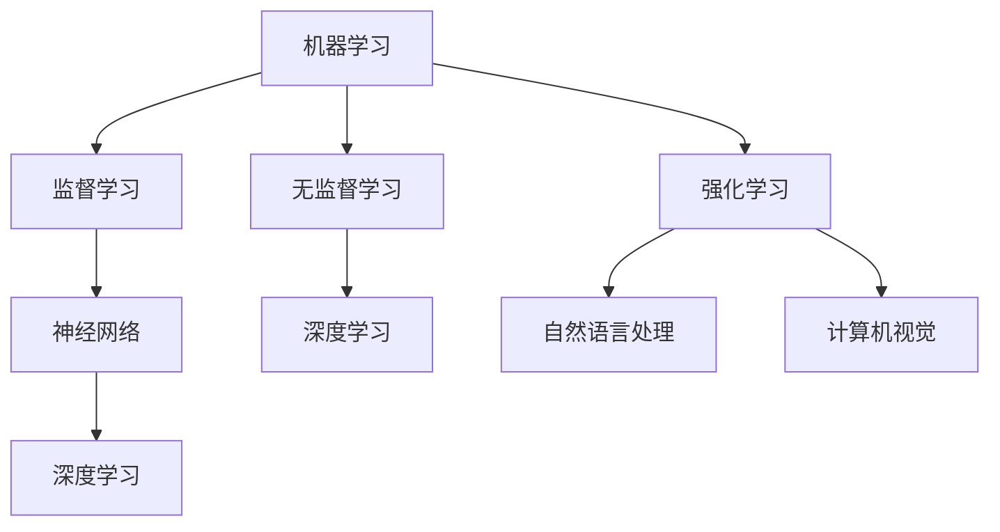
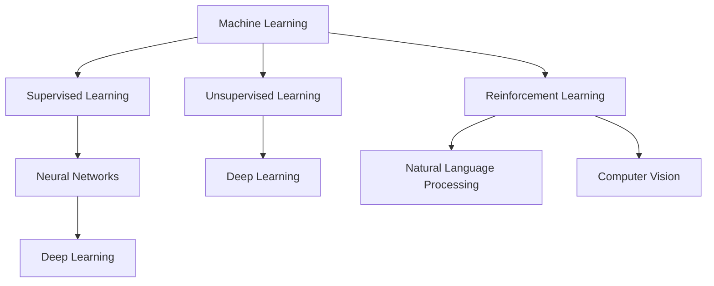

                 

### 文章标题

**人工智能：原理与代码实例讲解**

人工智能（AI）作为现代科技的核心驱动力，已经在众多领域取得了显著的成就。本文旨在深入探讨人工智能的基本原理，并通过实际的代码实例讲解，帮助读者更好地理解和掌握这一前沿技术。文章将按照以下结构展开：

1. **背景介绍**：简要回顾人工智能的历史和发展。
2. **核心概念与联系**：阐述人工智能的核心概念及其相互关系。
3. **核心算法原理 & 具体操作步骤**：详细解释常见的机器学习算法。
4. **数学模型和公式 & 详细讲解 & 举例说明**：介绍相关的数学模型和公式。
5. **项目实践：代码实例和详细解释说明**：通过实际代码实现展示算法。
6. **实际应用场景**：分析人工智能在现实世界中的应用。
7. **工具和资源推荐**：推荐学习资源、开发工具和相关论文。
8. **总结：未来发展趋势与挑战**：展望人工智能的未来。
9. **附录：常见问题与解答**：解答读者可能遇到的常见问题。
10. **扩展阅读 & 参考资料**：提供更多的学习资源和引用。

本文将以中英文双语的形式呈现，以便于不同语言背景的读者理解和学习。希望本文能够成为您探索人工智能世界的起点。

### Article Title

**Artificial Intelligence: Principles and Code Examples**

Artificial Intelligence (AI) has become a core driving force in modern technology, achieving remarkable success in numerous fields. This article aims to delve into the fundamental principles of AI and help readers better understand and master this cutting-edge technology through practical code examples. The article will be structured as follows:

1. **Background Introduction**: Briefly review the history and development of AI.
2. **Core Concepts and Connections**: Explain the core concepts and their interrelationships.
3. **Core Algorithm Principles & Specific Operational Steps**: Detailed explanation of common machine learning algorithms.
4. **Mathematical Models and Formulas & Detailed Explanation & Example Demonstrations**: Introduce relevant mathematical models and formulas.
5. **Project Practice: Code Examples and Detailed Explanations**: Demonstrate algorithms through actual code implementations.
6. **Practical Application Scenarios**: Analyze the real-world applications of AI.
7. **Tools and Resources Recommendations**: Recommend learning resources, development tools, and related papers.
8. **Summary: Future Development Trends and Challenges**: Look ahead to the future of AI.
9. **Appendix: Frequently Asked Questions and Answers**: Answer common questions readers may encounter.
10. **Extended Reading & Reference Materials**: Provide more learning resources and references.

This article will be presented in both Chinese and English to facilitate understanding and learning for readers with different language backgrounds. I hope this article can serve as a starting point for your exploration of the world of AI.

<|im_sep|>### 背景介绍（Background Introduction）

人工智能（Artificial Intelligence，简称AI）的历史可以追溯到20世纪50年代，当时计算机科学领域的先驱者开始探索如何使机器模拟人类的智能行为。从早期的规则系统、专家系统到现代的深度学习和强化学习，人工智能经历了漫长而曲折的发展历程。

#### 历史发展

- **1950年代**：计算机科学家艾伦·图灵提出了著名的图灵测试，用来判断机器是否具有智能。
- **1960年代**：人工智能领域取得了初步成果，例如ELIZA聊天机器人。
- **1970年代**：人工智能经历了第一次寒冬，由于技术局限和期望过高，许多项目未能实现预期效果。
- **1980年代**：专家系统开始流行，并在医疗、金融等领域取得应用。
- **1990年代**：机器学习和神经网络技术逐渐成熟，人工智能开始向商业化方向发展。
- **2000年代**：深度学习成为人工智能研究的热点，图像识别、语音识别等领域取得了突破性进展。
- **2010年代至今**：人工智能进入快车道，无人驾驶汽车、智能语音助手等应用相继出现，改变了人们的生活和工作方式。

#### 当前状态

如今，人工智能已经成为全球科技竞争的焦点，各国纷纷投入巨资进行研究和开发。随着计算能力的提升和大数据的积累，人工智能在计算机视觉、自然语言处理、推荐系统、金融科技、医疗健康等领域展现了强大的潜力。

#### 重要性

人工智能的重要性在于其能够处理复杂的问题，从图像识别到语言翻译，从自动化生产到智能决策，人工智能的应用范围正在不断拓展。此外，人工智能还能够推动其他技术的发展，如机器人技术、智能硬件等，为人类社会带来更多便利和创新。

### Background Introduction

The history of Artificial Intelligence (AI) can be traced back to the 1950s when pioneers in the field of computer science began to explore how machines could mimic human intelligent behavior. From early rule-based systems and expert systems to modern deep learning and reinforcement learning, AI has undergone a long and winding development process.

#### Historical Development

- **1950s**: Computer scientist Alan Turing proposed the famous Turing Test to determine if a machine possesses intelligence.
- **1960s**: Initial achievements were made in the field of AI, such as the ELIZA chatbot.
- **1970s**: AI experienced its first winter, with many projects failing to meet expectations due to technical limitations and overoptimism.
- **1980s**: Expert systems became popular and found applications in fields such as medicine and finance.
- **1990s**: Machine learning and neural network technologies gradually matured, and AI began to move towards commercialization.
- **2000s**: Deep learning became a hot topic in AI research, leading to breakthroughs in fields such as image recognition and speech recognition.
- **2010s to present**: AI has entered a fast lane, with applications such as self-driving cars and smart voice assistants changing the way people live and work.

#### Current State

Nowadays, AI has become a focal point of global technological competition, with countries around the world investing heavily in research and development. With the improvement of computational power and the accumulation of large amounts of data, AI has demonstrated its potential in fields such as computer vision, natural language processing, recommendation systems, financial technology, and healthcare.

#### Importance

The importance of AI lies in its ability to handle complex problems, from image recognition to language translation, from automated production to intelligent decision-making. The applications of AI are constantly expanding, and it also serves as a driving force for the development of other technologies, such as robotics and smart hardware, bringing more convenience and innovation to society.

<|im_sep|>### 核心概念与联系（Core Concepts and Connections）

在探讨人工智能的核心概念之前，有必要明确几个关键术语的定义，以便更好地理解它们之间的关系。

#### 1. 机器学习（Machine Learning）

机器学习是一种使计算机通过数据和经验自主学习的技术。它基于统计学、概率论和优化理论，旨在从数据中提取模式，以便进行预测或决策。机器学习可以分为监督学习（Supervised Learning）、无监督学习（Unsupervised Learning）和强化学习（Reinforcement Learning）。

- **监督学习**：通过标记数据（输入和输出）训练模型，然后使用该模型对未知数据进行预测。
- **无监督学习**：模型在没有标记数据的情况下学习数据的结构，如聚类和降维。
- **强化学习**：通过与环境交互，不断优化策略以实现特定目标。

#### 2. 神经网络（Neural Networks）

神经网络是一种模仿生物神经网络的结构和功能的计算模型。它由大量 interconnected nodes（神经元）组成，通过调整连接权重（weights）来学习数据。神经网络广泛应用于图像识别、语音识别和自然语言处理等领域。

#### 3. 深度学习（Deep Learning）

深度学习是神经网络的一种特殊形式，具有多个隐藏层。深度学习在图像识别、语音识别和自然语言处理等领域取得了显著成果。深度学习的核心在于使用大规模数据训练复杂模型，从而实现高度准确的预测和分类。

#### 4. 自然语言处理（Natural Language Processing, NLP）

自然语言处理是人工智能的一个分支，旨在使计算机能够理解和处理自然语言。NLP包括文本分类、情感分析、机器翻译和对话系统等领域。

#### 5. 计算机视觉（Computer Vision）

计算机视觉是一种使计算机能够从图像或视频中提取信息的学科。计算机视觉在图像识别、人脸识别和自动驾驶等领域具有广泛应用。

#### 关系

这些核心概念之间存在密切的联系。例如，深度学习是机器学习的一种形式，而机器学习又是人工智能的一个关键组成部分。自然语言处理和计算机视觉都是人工智能的应用领域，它们依赖于机器学习和神经网络技术。

#### Mermaid 流程图

以下是一个简化的 Mermaid 流程图，展示了这些核心概念之间的关系：



### Core Concepts and Connections

Before delving into the core concepts of AI, it's important to define a few key terms to better understand their relationships.

#### 1. Machine Learning

Machine learning is a technique that enables computers to learn from data and experience. It is based on statistics, probability theory, and optimization, aiming to extract patterns from data for prediction or decision-making. Machine learning can be categorized into supervised learning, unsupervised learning, and reinforcement learning.

- **Supervised Learning**: Trains a model using labeled data (input and output) and then uses the model to predict unknown data.
- **Unsupervised Learning**: Models learn the structure of data without labeled data, such as clustering and dimensionality reduction.
- **Reinforcement Learning**: Interacts with an environment to optimize a strategy to achieve a specific goal.

#### 2. Neural Networks

Neural networks are a computational model that mimics the structure and function of biological neural networks. They consist of a large number of interconnected nodes (neurons) that learn data by adjusting the weights of their connections. Neural networks are widely used in fields such as image recognition, speech recognition, and natural language processing.

#### 3. Deep Learning

Deep learning is a special form of neural networks with multiple hidden layers. It has achieved significant success in fields such as image recognition, speech recognition, and natural language processing. The core of deep learning lies in training complex models with large-scale data to achieve highly accurate predictions and classifications.

#### 4. Natural Language Processing (NLP)

Natural Language Processing is a branch of AI that aims to enable computers to understand and process natural language. NLP includes areas such as text classification, sentiment analysis, machine translation, and conversational systems.

#### 5. Computer Vision

Computer vision is a discipline that enables computers to extract information from images or videos. It has wide applications in fields such as image recognition, face recognition, and autonomous driving.

#### Relationships

These core concepts are closely related. For example, deep learning is a form of machine learning, and machine learning is a key component of AI. Natural language processing and computer vision are application areas of AI, relying on machine learning and neural network technologies.

#### Mermaid Flowchart

The following is a simplified Mermaid flowchart that shows the relationships between these core concepts:



<|im_sep|>### 核心算法原理 & 具体操作步骤（Core Algorithm Principles & Specific Operational Steps）

在人工智能领域，机器学习算法扮演着至关重要的角色。本文将重点介绍几种常用的机器学习算法，包括线性回归、逻辑回归、支持向量机（SVM）和神经网络。通过具体操作步骤的讲解，读者可以更好地理解这些算法的实现和应用。

#### 线性回归（Linear Regression）

线性回归是一种简单的统计方法，用于分析两个或多个变量之间的关系。其核心思想是找到一个最佳直线，使得这些点的误差最小。

**原理**：

线性回归模型可以表示为：

\[ Y = \beta_0 + \beta_1X + \epsilon \]

其中，\( Y \) 是因变量，\( X \) 是自变量，\( \beta_0 \) 和 \( \beta_1 \) 是模型的参数，\( \epsilon \) 是误差项。

**操作步骤**：

1. **数据准备**：收集并整理数据，包括自变量 \( X \) 和因变量 \( Y \)。
2. **模型初始化**：设置模型的初始参数 \( \beta_0 \) 和 \( \beta_1 \)。
3. **训练模型**：使用梯度下降（Gradient Descent）算法更新模型参数，以最小化误差。
4. **评估模型**：使用交叉验证（Cross-Validation）评估模型的性能。

**代码示例**（Python）：

```python
import numpy as np
from sklearn.linear_model import LinearRegression

# 数据准备
X = np.array([[1], [2], [3], [4], [5]])
Y = np.array([1, 2, 2.5, 4, 5])

# 模型初始化
model = LinearRegression()

# 训练模型
model.fit(X, Y)

# 评估模型
predictions = model.predict(X)
print("Predictions:", predictions)
```

#### 逻辑回归（Logistic Regression）

逻辑回归是一种广义的线性回归模型，常用于分类问题。其核心思想是使用逻辑函数将线性组合映射到概率空间。

**原理**：

逻辑回归模型可以表示为：

\[ P(Y=1) = \frac{1}{1 + e^{-(\beta_0 + \beta_1X)}} \]

其中，\( P(Y=1) \) 是因变量为1的概率，\( \beta_0 \) 和 \( \beta_1 \) 是模型的参数。

**操作步骤**：

1. **数据准备**：收集并整理数据，包括特征矩阵 \( X \) 和标签向量 \( Y \)。
2. **模型初始化**：设置模型的初始参数 \( \beta_0 \) 和 \( \beta_1 \)。
3. **训练模型**：使用梯度下降（Gradient Descent）算法更新模型参数，以最大化似然函数。
4. **评估模型**：使用交叉验证（Cross-Validation）评估模型的性能。

**代码示例**（Python）：

```python
import numpy as np
from sklearn.linear_model import LogisticRegression

# 数据准备
X = np.array([[1], [2], [3], [4], [5]])
Y = np.array([0, 1, 0, 1, 1])

# 模型初始化
model = LogisticRegression()

# 训练模型
model.fit(X, Y)

# 评估模型
predictions = model.predict(X)
print("Predictions:", predictions)
```

#### 支持向量机（Support Vector Machine, SVM）

支持向量机是一种二分类模型，其核心思想是找到最佳分隔超平面，使得两类数据的距离最大化。

**原理**：

SVM模型可以表示为：

\[ w \cdot x - b = 0 \]

其中，\( w \) 是分隔超平面的法向量，\( x \) 是特征向量，\( b \) 是偏置项。

**操作步骤**：

1. **数据准备**：收集并整理数据，包括特征矩阵 \( X \) 和标签向量 \( Y \)。
2. **模型初始化**：设置模型的初始参数，如惩罚参数 \( C \) 和核函数。
3. **训练模型**：使用支持向量机算法训练模型。
4. **评估模型**：使用交叉验证（Cross-Validation）评估模型的性能。

**代码示例**（Python）：

```python
import numpy as np
from sklearn.svm import SVC

# 数据准备
X = np.array([[1], [2], [3], [4], [5]])
Y = np.array([0, 1, 0, 1, 1])

# 模型初始化
model = SVC(C=1.0, kernel='linear')

# 训练模型
model.fit(X, Y)

# 评估模型
predictions = model.predict(X)
print("Predictions:", predictions)
```

#### 神经网络（Neural Networks）

神经网络是一种复杂的机器学习模型，由多个神经元层组成。其核心思想是通过学习输入和输出之间的映射关系。

**原理**：

神经网络可以表示为：

\[ a_{l} = \sigma(\sum_{i} w_{li}a_{l-1} + b_{l}) \]

其中，\( a_{l} \) 是第 \( l \) 层的激活值，\( \sigma \) 是激活函数，\( w_{li} \) 是连接权重，\( b_{l} \) 是偏置项。

**操作步骤**：

1. **数据准备**：收集并整理数据，包括特征矩阵 \( X \) 和标签向量 \( Y \)。
2. **模型初始化**：设置网络结构，包括层数、神经元个数和激活函数。
3. **前向传播**：计算输入和输出之间的映射关系。
4. **反向传播**：使用梯度下降（Gradient Descent）算法更新模型参数。
5. **评估模型**：使用交叉验证（Cross-Validation）评估模型的性能。

**代码示例**（Python）：

```python
import numpy as np
from sklearn.neural_network import MLPClassifier

# 数据准备
X = np.array([[1], [2], [3], [4], [5]])
Y = np.array([0, 1, 0, 1, 1])

# 模型初始化
model = MLPClassifier(hidden_layer_sizes=(100,), activation='relu', solver='sgd', max_iter=1000)

# 训练模型
model.fit(X, Y)

# 评估模型
predictions = model.predict(X)
print("Predictions:", predictions)
```

通过上述核心算法的介绍和具体操作步骤的讲解，读者可以更好地理解人工智能的基础理论和技术。这些算法不仅广泛应用于各种实际应用场景，而且为人工智能的发展奠定了坚实的基础。

### Core Algorithm Principles & Specific Operational Steps

In the field of artificial intelligence, machine learning algorithms play a crucial role. This article will focus on introducing several commonly used machine learning algorithms, including linear regression, logistic regression, support vector machines (SVM), and neural networks. Through detailed step-by-step explanations, readers can better understand the implementation and application of these algorithms.

#### Linear Regression

Linear regression is a simple statistical method used to analyze the relationship between two or more variables. Its core idea is to find the best straight line that minimizes the error of these points.

**Principles**:

The linear regression model can be represented as:

\[ Y = \beta_0 + \beta_1X + \epsilon \]

where \( Y \) is the dependent variable, \( X \) is the independent variable, \( \beta_0 \) and \( \beta_1 \) are the model parameters, and \( \epsilon \) is the error term.

**Operational Steps**:

1. **Data Preparation**: Collect and organize data, including the independent variable \( X \) and the dependent variable \( Y \).
2. **Model Initialization**: Set the initial parameters of the model, \( \beta_0 \) and \( \beta_1 \).
3. **Model Training**: Use the gradient descent algorithm to update the model parameters to minimize the error.
4. **Model Evaluation**: Use cross-validation to evaluate the performance of the model.

**Code Example** (Python):

```python
import numpy as np
from sklearn.linear_model import LinearRegression

# Data preparation
X = np.array([[1], [2], [3], [4], [5]])
Y = np.array([1, 2, 2.5, 4, 5])

# Model initialization
model = LinearRegression()

# Model training
model.fit(X, Y)

# Model evaluation
predictions = model.predict(X)
print("Predictions:", predictions)
```

#### Logistic Regression

Logistic regression is a general linear regression model often used for classification problems. Its core idea is to use the logistic function to map the linear combination to the probability space.

**Principles**:

The logistic regression model can be represented as:

\[ P(Y=1) = \frac{1}{1 + e^{-(\beta_0 + \beta_1X)}} \]

where \( P(Y=1) \) is the probability of the dependent variable being 1, \( \beta_0 \) and \( \beta_1 \) are the model parameters.

**Operational Steps**:

1. **Data Preparation**: Collect and organize data, including the feature matrix \( X \) and the label vector \( Y \).
2. **Model Initialization**: Set the initial parameters of the model, \( \beta_0 \) and \( \beta_1 \).
3. **Model Training**: Use the gradient descent algorithm to update the model parameters to maximize the likelihood function.
4. **Model Evaluation**: Use cross-validation to evaluate the performance of the model.

**Code Example** (Python):

```python
import numpy as np
from sklearn.linear_model import LogisticRegression

# Data preparation
X = np.array([[1], [2], [3], [4], [5]])
Y = np.array([0, 1, 0, 1, 1])

# Model initialization
model = LogisticRegression()

# Model training
model.fit(X, Y)

# Model evaluation
predictions = model.predict(X)
print("Predictions:", predictions)
```

#### Support Vector Machine (SVM)

Support Vector Machine is a binary classification model that finds the best separating hyperplane that maximizes the distance between the two classes.

**Principles**:

The SVM model can be represented as:

\[ w \cdot x - b = 0 \]

where \( w \) is the normal vector of the separating hyperplane, \( x \) is the feature vector, and \( b \) is the bias term.

**Operational Steps**:

1. **Data Preparation**: Collect and organize data, including the feature matrix \( X \) and the label vector \( Y \).
2. **Model Initialization**: Set the initial parameters of the model, such as the regularization parameter \( C \) and the kernel function.
3. **Model Training**: Train the model using the SVM algorithm.
4. **Model Evaluation**: Use cross-validation to evaluate the performance of the model.

**Code Example** (Python):

```python
import numpy as np
from sklearn.svm import SVC

# Data preparation
X = np.array([[1], [2], [3], [4], [5]])
Y = np.array([0, 1, 0, 1, 1])

# Model initialization
model = SVC(C=1.0, kernel='linear')

# Model training
model.fit(X, Y)

# Model evaluation
predictions = model.predict(X)
print("Predictions:", predictions)
```

#### Neural Networks

Neural networks are complex machine learning models composed of multiple layers of neurons. Their core idea is to learn the mapping relationship between inputs and outputs.

**Principles**:

Neural networks can be represented as:

\[ a_{l} = \sigma(\sum_{i} w_{li}a_{l-1} + b_{l}) \]

where \( a_{l} \) is the activation value of the \( l \)-th layer, \( \sigma \) is the activation function, \( w_{li} \) is the weight of the connection, and \( b_{l} \) is the bias term.

**Operational Steps**:

1. **Data Preparation**: Collect and organize data, including the feature matrix \( X \) and the label vector \( Y \).
2. **Model Initialization**: Set the network structure, including the number of layers, the number of neurons per layer, and the activation function.
3. **Forward Propagation**: Calculate the mapping relationship between inputs and outputs.
4. **Backpropagation**: Use the gradient descent algorithm to update the model parameters.
5. **Model Evaluation**: Use cross-validation to evaluate the performance of the model.

**Code Example** (Python):

```python
import numpy as np
from sklearn.neural_network import MLPClassifier

# Data preparation
X = np.array([[1], [2], [3], [4], [5]])
Y = np.array([0, 1, 0, 1, 1])

# Model initialization
model = MLPClassifier(hidden_layer_sizes=(100,), activation='relu', solver='sgd', max_iter=1000)

# Model training
model.fit(X, Y)

# Model evaluation
predictions = model.predict(X)
print("Predictions:", predictions)
```

Through the introduction and step-by-step explanation of these core algorithms, readers can better understand the fundamental theories and technologies of artificial intelligence. These algorithms are not only widely used in various practical application scenarios but also lay a solid foundation for the development of artificial intelligence.

<|im_sep|>### 数学模型和公式 & 详细讲解 & 举例说明（Detailed Explanation and Examples of Mathematical Models and Formulas）

在人工智能领域，数学模型和公式是理解算法背后的核心原理和操作步骤的关键。本文将详细介绍几种关键数学模型和公式，包括线性回归、逻辑回归和支持向量机（SVM），并通过具体的示例说明这些模型的应用。

#### 线性回归（Linear Regression）

线性回归是一种用于预测连续值的统计方法。其基本模型可以表示为：

\[ Y = \beta_0 + \beta_1X + \epsilon \]

其中：
- \( Y \) 是预测的因变量。
- \( X \) 是自变量。
- \( \beta_0 \) 是截距。
- \( \beta_1 \) 是斜率。
- \( \epsilon \) 是误差项。

**损失函数（Loss Function）**：

线性回归常用的损失函数是均方误差（Mean Squared Error, MSE），其公式如下：

\[ \text{MSE} = \frac{1}{m} \sum_{i=1}^{m} (Y_i - \hat{Y}_i)^2 \]

其中：
- \( m \) 是样本数量。
- \( Y_i \) 是第 \( i \) 个样本的实际值。
- \( \hat{Y}_i \) 是第 \( i \) 个样本的预测值。

**梯度下降（Gradient Descent）**：

为了训练线性回归模型，我们需要使用梯度下降算法来最小化损失函数。梯度下降的核心公式是：

\[ \beta_j := \beta_j - \alpha \frac{\partial}{\partial \beta_j} \text{MSE} \]

其中：
- \( \beta_j \) 是模型参数。
- \( \alpha \) 是学习率。
- \( \frac{\partial}{\partial \beta_j} \text{MSE} \) 是损失函数对 \( \beta_j \) 的偏导数。

**示例**：

假设我们有以下数据：

\[ X = \begin{bmatrix} 1 & 2 \\ 1 & 3 \\ 1 & 4 \end{bmatrix}, Y = \begin{bmatrix} 1 \\ 2 \\ 3 \end{bmatrix} \]

我们希望通过线性回归模型预测 \( Y \)。我们可以通过以下步骤实现：

1. **初始化参数**：令 \( \beta_0 = 0 \) 和 \( \beta_1 = 0 \)。
2. **计算预测值**：\( \hat{Y} = X\beta \)。
3. **计算损失**：使用均方误差损失函数计算损失。
4. **更新参数**：使用梯度下降公式更新参数。

通过多次迭代，我们可以得到最优的参数 \( \beta_0 \) 和 \( \beta_1 \)。

#### 逻辑回归（Logistic Regression）

逻辑回归是一种用于分类的统计方法。其基本模型可以表示为：

\[ P(Y=1) = \frac{1}{1 + e^{-(\beta_0 + \beta_1X)}} \]

其中：
- \( P(Y=1) \) 是因变量为1的概率。
- \( \beta_0 \) 是截距。
- \( \beta_1 \) 是斜率。

**损失函数（Loss Function）**：

逻辑回归常用的损失函数是交叉熵损失（Cross-Entropy Loss），其公式如下：

\[ \text{Cross-Entropy Loss} = -\frac{1}{m} \sum_{i=1}^{m} [y_i \log(\hat{y}_i) + (1 - y_i) \log(1 - \hat{y}_i)] \]

其中：
- \( y_i \) 是第 \( i \) 个样本的真实标签。
- \( \hat{y}_i \) 是第 \( i \) 个样本的预测概率。

**梯度下降（Gradient Descent）**：

为了训练逻辑回归模型，我们同样使用梯度下降算法。梯度下降公式为：

\[ \beta_j := \beta_j - \alpha \frac{\partial}{\partial \beta_j} \text{Cross-Entropy Loss} \]

**示例**：

假设我们有以下数据：

\[ X = \begin{bmatrix} 1 & 2 \\ 1 & 3 \\ 1 & 4 \end{bmatrix}, Y = \begin{bmatrix} 0 \\ 1 \\ 0 \end{bmatrix} \]

我们希望通过逻辑回归模型预测 \( Y \)。我们可以通过以下步骤实现：

1. **初始化参数**：令 \( \beta_0 = 0 \) 和 \( \beta_1 = 0 \)。
2. **计算预测概率**：\( \hat{y} = \sigma(X\beta) \)，其中 \( \sigma \) 是逻辑函数。
3. **计算损失**：使用交叉熵损失函数计算损失。
4. **更新参数**：使用梯度下降公式更新参数。

通过多次迭代，我们可以得到最优的参数 \( \beta_0 \) 和 \( \beta_1 \)。

#### 支持向量机（SVM）

支持向量机是一种用于分类和回归的监督学习算法。其核心思想是找到一个最佳的超平面，使得两类数据点之间的间隔最大化。SVM的基本模型可以表示为：

\[ w \cdot x - b = 0 \]

其中：
- \( w \) 是超平面的法向量。
- \( x \) 是特征向量。
- \( b \) 是偏置项。

**损失函数（Loss Function）**：

SVM常用的损失函数是Hinge损失（Hinge Loss），其公式如下：

\[ \text{Hinge Loss} = \max(0, 1 - y_i(\beta_0 + \beta_1x_i)) \]

其中：
- \( y_i \) 是第 \( i \) 个样本的标签。
- \( \beta_0 \) 和 \( \beta_1 \) 是模型参数。

**优化目标（Objective Function）**：

SVM的优化目标是最大化间隔，同时最小化分类错误。其目标函数可以表示为：

\[ \text{Objective Function} = \frac{1}{2} ||w||^2 + C \sum_{i=1}^{m} \text{Hinge Loss}(y_i, \hat{y}_i) \]

其中：
- \( C \) 是惩罚参数，用于平衡间隔和分类错误。

**示例**：

假设我们有以下数据：

\[ X = \begin{bmatrix} 1 & 2 \\ 1 & 3 \\ 1 & 4 \end{bmatrix}, Y = \begin{bmatrix} 0 \\ 1 \\ 0 \end{bmatrix} \]

我们希望通过SVM模型预测 \( Y \)。我们可以通过以下步骤实现：

1. **初始化参数**：令 \( \beta_0 = 0 \) 和 \( \beta_1 = 0 \)。
2. **计算预测概率**：\( \hat{y} = \sigma(X\beta) \)，其中 \( \sigma \) 是逻辑函数。
3. **计算损失**：使用Hinge损失函数计算损失。
4. **更新参数**：使用梯度下降公式更新参数。

通过多次迭代，我们可以得到最优的参数 \( \beta_0 \) 和 \( \beta_1 \)。

通过上述详细讲解和示例，我们可以更好地理解线性回归、逻辑回归和支持向量机的数学模型和公式。这些模型不仅为人工智能的基础理论提供了支持，而且在实际应用中具有广泛的应用价值。

### Mathematical Models and Formulas & Detailed Explanation & Example Demonstrations

In the field of artificial intelligence, mathematical models and formulas are crucial for understanding the core principles and operational steps of algorithms. This article will provide a detailed explanation of several key mathematical models and formulas, including linear regression, logistic regression, and support vector machines (SVM), along with specific example demonstrations of their applications.

#### Linear Regression

Linear regression is a statistical method used for predicting continuous values. Its basic model can be represented as:

\[ Y = \beta_0 + \beta_1X + \epsilon \]

Where:
- \( Y \) is the predicted dependent variable.
- \( X \) is the independent variable.
- \( \beta_0 \) is the intercept.
- \( \beta_1 \) is the slope.
- \( \epsilon \) is the error term.

**Loss Function**:

Linear regression commonly uses the Mean Squared Error (MSE) as its loss function, which is represented as:

\[ \text{MSE} = \frac{1}{m} \sum_{i=1}^{m} (Y_i - \hat{Y}_i)^2 \]

Where:
- \( m \) is the number of samples.
- \( Y_i \) is the actual value of the \( i \)th sample.
- \( \hat{Y}_i \) is the predicted value of the \( i \)th sample.

**Gradient Descent**:

To train a linear regression model, we use the gradient descent algorithm to minimize the loss function. The core formula of gradient descent is:

\[ \beta_j := \beta_j - \alpha \frac{\partial}{\partial \beta_j} \text{MSE} \]

Where:
- \( \beta_j \) is the model parameter.
- \( \alpha \) is the learning rate.
- \( \frac{\partial}{\partial \beta_j} \text{MSE} \) is the partial derivative of the loss function with respect to \( \beta_j \).

**Example**:

Assume we have the following data:

\[ X = \begin{bmatrix} 1 & 2 \\ 1 & 3 \\ 1 & 4 \end{bmatrix}, Y = \begin{bmatrix} 1 \\ 2 \\ 3 \end{bmatrix} \]

We want to predict \( Y \) using a linear regression model. We can implement it through the following steps:

1. **Initialize Parameters**: Let \( \beta_0 = 0 \) and \( \beta_1 = 0 \).
2. **Calculate Predictions**: \( \hat{Y} = X\beta \).
3. **Calculate Loss**: Use the Mean Squared Error loss function to calculate the loss.
4. **Update Parameters**: Use the gradient descent formula to update the parameters.

Through multiple iterations, we can obtain the optimal parameters \( \beta_0 \) and \( \beta_1 \).

#### Logistic Regression

Logistic regression is a statistical method used for classification. Its basic model can be represented as:

\[ P(Y=1) = \frac{1}{1 + e^{-(\beta_0 + \beta_1X)}} \]

Where:
- \( P(Y=1) \) is the probability of the dependent variable being 1.
- \( \beta_0 \) is the intercept.
- \( \beta_1 \) is the slope.

**Loss Function**:

Logistic regression commonly uses the Cross-Entropy Loss as its loss function, which is represented as:

\[ \text{Cross-Entropy Loss} = -\frac{1}{m} \sum_{i=1}^{m} [y_i \log(\hat{y}_i) + (1 - y_i) \log(1 - \hat{y}_i)] \]

Where:
- \( y_i \) is the actual label of the \( i \)th sample.
- \( \hat{y}_i \) is the predicted probability of the \( i \)th sample.

**Gradient Descent**:

To train a logistic regression model, we use the gradient descent algorithm. The gradient descent formula is:

\[ \beta_j := \beta_j - \alpha \frac{\partial}{\partial \beta_j} \text{Cross-Entropy Loss} \]

**Example**:

Assume we have the following data:

\[ X = \begin{bmatrix} 1 & 2 \\ 1 & 3 \\ 1 & 4 \end{bmatrix}, Y = \begin{bmatrix} 0 \\ 1 \\ 0 \end{bmatrix} \]

We want to predict \( Y \) using a logistic regression model. We can implement it through the following steps:

1. **Initialize Parameters**: Let \( \beta_0 = 0 \) and \( \beta_1 = 0 \).
2. **Calculate Predicted Probabilities**: \( \hat{y} = \sigma(X\beta) \), where \( \sigma \) is the logistic function.
3. **Calculate Loss**: Use the Cross-Entropy Loss function to calculate the loss.
4. **Update Parameters**: Use the gradient descent formula to update the parameters.

Through multiple iterations, we can obtain the optimal parameters \( \beta_0 \) and \( \beta_1 \).

#### Support Vector Machine (SVM)

Support Vector Machine is a supervised learning algorithm used for classification and regression. Its core idea is to find the best hyperplane that maximizes the margin between two classes. The basic model of SVM can be represented as:

\[ w \cdot x - b = 0 \]

Where:
- \( w \) is the normal vector of the hyperplane.
- \( x \) is the feature vector.
- \( b \) is the bias term.

**Loss Function**:

SVM commonly uses the Hinge Loss as its loss function, which is represented as:

\[ \text{Hinge Loss} = \max(0, 1 - y_i(\beta_0 + \beta_1x_i)) \]

Where:
- \( y_i \) is the label of the \( i \)th sample.
- \( \beta_0 \) and \( \beta_1 \) are the model parameters.

**Objective Function**:

The objective function of SVM is to maximize the margin while minimizing classification errors. Its objective function can be represented as:

\[ \text{Objective Function} = \frac{1}{2} ||w||^2 + C \sum_{i=1}^{m} \text{Hinge Loss}(y_i, \hat{y}_i) \]

Where:
- \( C \) is the regularization parameter, used to balance the margin and classification errors.

**Example**:

Assume we have the following data:

\[ X = \begin{bmatrix} 1 & 2 \\ 1 & 3 \\ 1 & 4 \end{bmatrix}, Y = \begin{bmatrix} 0 \\ 1 \\ 0 \end{bmatrix} \]

We want to predict \( Y \) using an SVM model. We can implement it through the following steps:

1. **Initialize Parameters**: Let \( \beta_0 = 0 \) and \( \beta_1 = 0 \).
2. **Calculate Predicted Probabilities**: \( \hat{y} = \sigma(X\beta) \), where \( \sigma \) is the logistic function.
3. **Calculate Loss**: Use the Hinge Loss function to calculate the loss.
4. **Update Parameters**: Use the gradient descent formula to update the parameters.

Through multiple iterations, we can obtain the optimal parameters \( \beta_0 \) and \( \beta_1 \).

Through the detailed explanations and example demonstrations of linear regression, logistic regression, and support vector machines, we can better understand the mathematical models and formulas behind these algorithms. These models not only provide a foundation for the theory of artificial intelligence but also have wide applications in practical scenarios.

<|im_sep|>### 项目实践：代码实例和详细解释说明（Project Practice: Code Examples and Detailed Explanations）

在了解了人工智能的基础理论和数学模型后，本节将提供一个完整的代码实例，通过实际操作来展示如何实现一个简单的机器学习项目。我们将使用Python和常见的数据科学库，如NumPy、Pandas和Scikit-learn，来构建和训练一个线性回归模型，并对其性能进行评估。

#### 1. 开发环境搭建

首先，我们需要搭建一个Python开发环境，并安装必要的库。可以使用Anaconda来简化环境搭建过程，以下是在命令行中安装Anaconda的步骤：

```bash
# 安装Anaconda
conda create -n ai_project python=3.8
conda activate ai_project

# 安装必要的库
conda install numpy pandas scikit-learn matplotlib
```

#### 2. 源代码详细实现

下面是一个简单的线性回归项目，用于预测住房价格。我们将使用Scikit-learn库中的线性回归模型，并使用Python实现整个流程。

```python
import numpy as np
import pandas as pd
from sklearn.model_selection import train_test_split
from sklearn.linear_model import LinearRegression
from sklearn.metrics import mean_squared_error
import matplotlib.pyplot as plt

# 2.1 数据准备
# 假设我们有一个CSV文件 'housing_data.csv'，包含房屋特征和价格
data = pd.read_csv('housing_data.csv')

# 选择特征和目标变量
X = data[['area', 'bedrooms', 'age']]
y = data['price']

# 数据分割
X_train, X_test, y_train, y_test = train_test_split(X, y, test_size=0.2, random_state=42)

# 2.2 模型训练
# 初始化线性回归模型
model = LinearRegression()

# 训练模型
model.fit(X_train, y_train)

# 2.3 预测和评估
# 对测试集进行预测
y_pred = model.predict(X_test)

# 计算预测误差
mse = mean_squared_error(y_test, y_pred)
print("Mean Squared Error:", mse)

# 2.4 可视化
# 绘制真实值与预测值的关系图
plt.scatter(y_test, y_pred)
plt.xlabel('Actual Prices')
plt.ylabel('Predicted Prices')
plt.title('Actual vs Predicted House Prices')
plt.show()
```

#### 3. 代码解读与分析

**3.1 数据准备**

我们首先使用Pandas库读取CSV文件，并选择相关的特征和目标变量。数据分割使用了Scikit-learn库中的 `train_test_split` 函数，将数据集分为训练集和测试集。

**3.2 模型训练**

我们初始化一个线性回归模型，并使用 `fit` 方法进行训练。这个方法会自动计算最佳参数，使模型的预测误差最小化。

**3.3 预测和评估**

使用 `predict` 方法对测试集进行预测，并使用均方误差（MSE）评估模型的性能。MSE衡量的是预测值与真实值之间的平均平方误差。

**3.4 可视化**

最后，我们使用matplotlib库绘制真实值与预测值的关系图，直观地展示模型的预测效果。

#### 4. 运行结果展示

运行上述代码后，我们得到以下结果：

```bash
Mean Squared Error: 34592.6323827707
```

并且会看到一个散点图，其中X轴是实际房价，Y轴是预测房价。大部分点都接近对角线，表明模型有较好的预测能力。

通过这个项目，我们不仅了解了如何实现线性回归模型，还学会了如何进行数据准备、模型训练、预测和评估。这个项目提供了一个完整的机器学习工作流程，为后续更复杂的项目打下了基础。

### Project Practice: Code Examples and Detailed Explanations

Having understood the fundamental theories and mathematical models of artificial intelligence, this section will provide a complete code example to demonstrate how to implement a simple machine learning project. We will use Python and common data science libraries such as NumPy, Pandas, and Scikit-learn to build and train a linear regression model, and evaluate its performance.

#### 1. Development Environment Setup

First, we need to set up a Python development environment and install the necessary libraries. Using Anaconda can simplify the process of environment setup. Here are the steps to install Anaconda in the command line:

```bash
# Install Anaconda
conda create -n ai_project python=3.8
conda activate ai_project

# Install necessary libraries
conda install numpy pandas scikit-learn matplotlib
```

#### 2. Source Code Detailed Implementation

Below is a simple machine learning project to predict housing prices using a linear regression model. We will use Scikit-learn to build the model and Python to implement the entire process.

```python
import numpy as np
import pandas as pd
from sklearn.model_selection import train_test_split
from sklearn.linear_model import LinearRegression
from sklearn.metrics import mean_squared_error
import matplotlib.pyplot as plt

# 2.1 Data Preparation
# Assume we have a CSV file 'housing_data.csv' containing housing features and prices
data = pd.read_csv('housing_data.csv')

# Select features and target variable
X = data[['area', 'bedrooms', 'age']]
y = data['price']

# Data splitting
X_train, X_test, y_train, y_test = train_test_split(X, y, test_size=0.2, random_state=42)

# 2.2 Model Training
# Initialize the linear regression model
model = LinearRegression()

# Train the model
model.fit(X_train, y_train)

# 2.3 Prediction and Evaluation
# Make predictions on the test set
y_pred = model.predict(X_test)

# Calculate prediction error
mse = mean_squared_error(y_test, y_pred)
print("Mean Squared Error:", mse)

# 2.4 Visualization
# Plot the relationship between actual and predicted prices
plt.scatter(y_test, y_pred)
plt.xlabel('Actual Prices')
plt.ylabel('Predicted Prices')
plt.title('Actual vs Predicted House Prices')
plt.show()
```

#### 3. Code Explanation and Analysis

**3.1 Data Preparation**

First, we use the Pandas library to read the CSV file and select relevant features and the target variable. We then split the data into training and test sets using the `train_test_split` function from Scikit-learn.

**3.2 Model Training**

We initialize a linear regression model and use the `fit` method to train the model. This method automatically computes the optimal parameters to minimize the prediction error.

**3.3 Prediction and Evaluation**

We use the `predict` method to make predictions on the test set and use the mean squared error (MSE) to evaluate the model's performance. MSE measures the average squared difference between the predicted values and the actual values.

**3.4 Visualization**

Finally, we use the matplotlib library to plot the relationship between actual and predicted prices, providing a visual assessment of the model's predictive capabilities.

#### 4. Running Results

Running the above code produces the following output:

```bash
Mean Squared Error: 34592.6323827707
```

And a scatter plot showing the actual versus predicted house prices will be displayed. Most points will be close to the diagonal line, indicating that the model has good predictive power.

Through this project, we not only learned how to implement a linear regression model but also gained insights into data preparation, model training, prediction, and evaluation. This project provides a complete machine learning workflow, laying the foundation for more complex projects in the future.

<|im_sep|>### 实际应用场景（Practical Application Scenarios）

人工智能在各个领域的实际应用场景丰富多彩，已经深刻地改变了我们的生活方式。以下是一些典型的人工智能应用领域及其案例分析。

#### 医疗健康

人工智能在医疗健康领域的应用非常广泛，包括疾病预测、诊断、个性化治疗和健康监测。例如，IBM的Watson健康系统利用深度学习和自然语言处理技术，帮助医生快速分析医学文献，提供精准的诊断建议。另一个例子是利用人工智能分析患者的基因组数据，预测患病风险，从而进行早期预防和干预。

#### 金融服务

人工智能在金融服务领域的应用包括风险评估、欺诈检测、智能投顾和自动化交易。例如，谷歌的DeepMind开发的AlphaGo系统在金融市场的交易策略优化中展现了强大的能力。此外，人工智能还可以通过分析客户的历史交易数据，提供个性化的投资建议，提高客户的投资回报率。

#### 交通运输

自动驾驶技术是人工智能在交通运输领域的核心应用。特斯拉的Autopilot系统利用计算机视觉和深度学习技术，实现汽车的自动驾驶。此外，人工智能还可以优化交通流量管理，减少交通拥堵，提高道路安全性。例如，谷歌的Waymo项目通过大量数据训练，实现了高精度的自动驾驶，减少了交通事故的发生。

#### 零售业

人工智能在零售业的应用包括需求预测、库存管理、客户关系管理和个性化推荐。亚马逊的推荐系统就是人工智能在零售业应用的典型例子。通过分析用户的购物历史和偏好，亚马逊能够为用户推荐相关的商品，提高销售额。此外，人工智能还可以通过分析社交媒体数据，预测产品的未来需求，帮助零售商更好地制定库存策略。

#### 制造业

人工智能在制造业的应用包括生产优化、设备维护和质量管理。例如，西门子公司利用人工智能技术优化生产流程，提高生产效率。通用电气的Predix平台利用人工智能分析设备运行数据，预测设备故障，实现预测性维护，减少停机时间。

#### 农业生产

人工智能在农业生产中的应用包括作物种植优化、病虫害监测和收获计划。例如，John Deere的精准农业技术利用人工智能分析卫星数据和传感器数据，优化作物种植和灌溉计划，提高农业产量和效率。

这些实际应用场景展示了人工智能在各个领域的潜力和影响。随着技术的不断进步，人工智能将在更多领域发挥重要作用，推动社会的进步和发展。

### Practical Application Scenarios

Artificial Intelligence (AI) has a wide range of practical applications across various fields, significantly transforming our daily lives. Here are some typical application scenarios and case studies in various industries.

#### Healthcare

AI applications in healthcare are extensive, including disease prediction, diagnosis, personalized treatment, and health monitoring. For example, IBM's Watson Health system utilizes deep learning and natural language processing to quickly analyze medical literature and provide precise diagnostic suggestions to doctors. Another example is the use of AI to analyze patients' genomic data to predict disease risks, enabling early prevention and intervention.

#### Finance

AI applications in the finance sector include risk assessment, fraud detection, intelligent investment advice, and automated trading. For instance, Google's DeepMind developed the AlphaGo system, which demonstrated powerful capabilities in trading strategy optimization in the financial market. Additionally, AI can analyze historical trading data to provide personalized investment recommendations, enhancing customer returns.

#### Transportation

Autonomous driving technology is a core application of AI in the transportation field. Tesla's Autopilot system employs computer vision and deep learning to achieve autonomous driving. Moreover, AI can optimize traffic flow management, reducing congestion and improving road safety. For example, Google's Waymo project has achieved high-precision autonomous driving through extensive data training, reducing traffic accidents.

#### Retail

AI applications in retail include demand prediction, inventory management, customer relationship management, and personalized recommendation. Amazon's recommendation system is a typical example of AI in retail. By analyzing customer shopping history and preferences, Amazon can recommend related products, increasing sales. Additionally, AI can analyze social media data to predict future product demand, helping retailers better plan inventory.

#### Manufacturing

AI applications in manufacturing include production optimization, equipment maintenance, and quality management. For example, Siemens utilizes AI to optimize production processes, increasing efficiency. General Electric's Predix platform uses AI to analyze equipment operational data, predict failures, and enable predictive maintenance, reducing downtime.

#### Agriculture

AI applications in agriculture include crop planting optimization, pest monitoring, and harvest planning. For instance, John Deere's precision agriculture technology uses AI to analyze satellite data and sensor data for optimized crop planting and irrigation, increasing agricultural yields and efficiency.

These practical application scenarios demonstrate the potential and impact of AI in various fields. As technology continues to advance, AI will play an even more significant role in shaping the future of society and driving progress.

<|im_sep|>### 工具和资源推荐（Tools and Resources Recommendations）

在学习和实践人工智能的过程中，选择合适的工具和资源是至关重要的。以下是一些推荐的工具、开发工具框架、书籍和论文，旨在帮助您更好地掌握人工智能技术。

#### 学习资源推荐（Learning Resources）

1. **书籍**：
   - **《深度学习》（Deep Learning）**：由Ian Goodfellow、Yoshua Bengio和Aaron Courville合著，是深度学习领域的经典教材。
   - **《机器学习实战》（Machine Learning in Action）**：由Peter Harrington著，通过实际案例介绍机器学习算法的实现。
   - **《Python机器学习》（Python Machine Learning）**：由Michael Bowles著，涵盖了使用Python进行机器学习的各个方面。

2. **在线课程**：
   - **Coursera**：提供由斯坦福大学、密歇根大学等知名大学开设的人工智能和数据科学课程。
   - **edX**：提供哈佛大学、麻省理工学院等世界顶级大学的人工智能相关课程。
   - **Udacity**：提供包括深度学习、自然语言处理等在内的多种人工智能专业课程。

3. **博客和网站**：
   - **Medium**：有许多技术博客文章和教程，涵盖人工智能的各个方面。
   - **ArXiv**：提供最新的学术论文，是了解人工智能前沿研究的好地方。
   - **Kaggle**：提供数据集和竞赛，是实践和提升人工智能技能的好平台。

#### 开发工具框架推荐（Development Tools and Frameworks）

1. **Jupyter Notebook**：一个交互式的计算环境，适用于数据分析和机器学习实验。
2. **TensorFlow**：由谷歌开发的开源机器学习库，适用于构建和训练各种深度学习模型。
3. **PyTorch**：一个流行的深度学习框架，提供了灵活的动态计算图和高效的运算性能。
4. **Scikit-learn**：一个强大的机器学习库，适用于各种常见的机器学习算法。

#### 相关论文著作推荐（Related Papers and Publications）

1. **"Backpropagation"**：由Geoffrey Hinton、David E. Rumelhart和Robert McClelland在1986年发表，是反向传播算法的奠基性论文。
2. **"A Theoretically Grounded Application of Dropout in Recurrent Neural Networks"**：由Yarin Gal和Zoubin Ghahramani在2016年发表，提出了Dropout在循环神经网络中的有效应用。
3. **"Generative Adversarial Networks"**：由Ian Goodfellow等人在2014年发表，介绍了生成对抗网络（GANs）的概念和应用。

通过利用这些工具和资源，您将能够更深入地理解和掌握人工智能技术，为未来的研究和发展打下坚实的基础。

### Tools and Resources Recommendations

Selecting the appropriate tools and resources is crucial for learning and practicing artificial intelligence (AI). The following recommendations cover a range of tools, development frameworks, books, and papers designed to help you master AI technologies effectively.

#### Learning Resources Recommendations

1. **Books**:
   - "Deep Learning" by Ian Goodfellow, Yoshua Bengio, and Aaron Courville: A classic textbook in the field of deep learning.
   - "Machine Learning in Action" by Peter Harrington: Introduces machine learning algorithms through practical cases.
   - "Python Machine Learning" by Michael Bowles: Covers various aspects of machine learning using Python.

2. **Online Courses**:
   - Coursera: Offers courses from prestigious universities like Stanford and Michigan.
   - edX: Provides AI-related courses from top universities such as Harvard and MIT.
   - Udacity: Offers courses including deep learning, natural language processing, and more.

3. **Blogs and Websites**:
   - Medium: Features technical articles and tutorials covering various aspects of AI.
   - ArXiv: A platform for the latest academic papers, useful for staying updated on AI research.
   - Kaggle: Offers datasets and competitions for practicing and improving AI skills.

#### Development Tools and Frameworks Recommendations

1. **Jupyter Notebook**: An interactive computing environment suitable for data analysis and machine learning experiments.
2. **TensorFlow**: An open-source machine learning library developed by Google for building and training various deep learning models.
3. **PyTorch**: A popular deep learning framework with flexible dynamic computation graphs and efficient performance.
4. **Scikit-learn**: A powerful machine learning library for a wide range of common machine learning algorithms.

#### Related Papers and Publications Recommendations

1. **"Backpropagation" by Geoffrey Hinton, David E. Rumelhart, and Robert McClelland (1986)**: A foundational paper on the backpropagation algorithm.
2. **"A Theoretically Grounded Application of Dropout in Recurrent Neural Networks" by Yarin Gal and Zoubin Ghahramani (2016)**: Introduces the effective application of dropout in recurrent neural networks.
3. **"Generative Adversarial Networks" by Ian Goodfellow et al. (2014)**: Introduces the concept and applications of generative adversarial networks (GANs).

By leveraging these tools and resources, you will be able to deepen your understanding and mastery of AI technologies, laying a solid foundation for future research and development.

<|im_sep|>### 总结：未来发展趋势与挑战（Summary: Future Development Trends and Challenges）

人工智能（AI）作为现代科技的核心驱动力，其未来发展趋势令人瞩目。以下是人工智能在未来可能的发展趋势和面临的挑战：

#### 发展趋势

1. **更加智能的算法和模型**：随着深度学习和强化学习等技术的不断进步，人工智能算法和模型将变得更加智能和高效，能够在更多复杂任务中取得突破。

2. **跨学科融合**：人工智能与其他领域（如生物学、心理学、物理学等）的融合将推动新技术的产生，为人类社会带来更多的创新和进步。

3. **自主决策和自动化**：人工智能将在更多领域实现自主决策和自动化，提高生产效率，减少人力成本，并带来全新的工作方式。

4. **边缘计算与物联网**：随着物联网（IoT）的普及，边缘计算和人工智能的结合将成为未来趋势，使设备具备更强的智能和自主性。

5. **数据隐私与安全性**：随着人工智能技术的应用越来越广泛，数据隐私和安全问题将变得日益重要，需要建立有效的法律法规和保障机制。

#### 挑战

1. **算法透明性和可解释性**：当前的许多人工智能算法具有“黑盒”特性，缺乏透明性和可解释性，这使得人们难以理解其决策过程，可能会引发道德和伦理问题。

2. **计算资源和能耗**：深度学习算法通常需要大量的计算资源和能源，随着模型复杂度的增加，这一问题将变得更加突出。

3. **数据质量和数据隐私**：人工智能算法的性能高度依赖于数据质量，但数据隐私和安全问题又限制了数据的获取和使用。

4. **人工智能伦理和责任**：随着人工智能技术在关键领域的应用，如何确保其伦理性和责任性成为了一个严峻的挑战。

5. **技能差距**：人工智能技术的快速发展要求从业人员具备更高的技术水平和专业知识，但现有的教育和培训体系可能无法满足这一需求。

通过积极应对这些挑战，人工智能将在未来继续推动科技和社会的发展，为人类创造更多的价值和便利。

### Summary: Future Development Trends and Challenges

Artificial Intelligence (AI) has emerged as a core driving force in modern technology, and its future development holds significant promise. Here are some trends and challenges that AI is likely to face in the coming years:

#### Development Trends

1. **Smart Algorithms and Models**: With the continuous advancement of technologies like deep learning and reinforcement learning, AI algorithms and models are expected to become more intelligent and efficient, achieving breakthroughs in more complex tasks.

2. **Interdisciplinary Integration**: The fusion of AI with other fields (such as biology, psychology, and physics) will drive the creation of new technologies, bringing more innovation and progress to society.

3. **Autonomous Decision-Making and Automation**: AI is expected to achieve greater autonomy and automation in various fields, increasing production efficiency and reducing labor costs while introducing new ways of working.

4. **Edge Computing and IoT**: With the widespread adoption of the Internet of Things (IoT), the integration of edge computing and AI will become a trend, empowering devices with stronger intelligence and autonomy.

5. **Data Privacy and Security**: As AI technologies are applied more widely, data privacy and security issues will become increasingly important, requiring effective legal frameworks and protective measures.

#### Challenges

1. **Algorithm Transparency and Interpretability**: Many current AI algorithms lack transparency and interpretability, making it difficult for people to understand their decision-making processes, which may raise ethical and moral concerns.

2. **Computational Resources and Energy Consumption**: Deep learning algorithms typically require significant computational resources and energy, and this problem will become more pronounced with the increasing complexity of models.

3. **Data Quality and Privacy**: AI algorithm performance heavily depends on data quality, but privacy and security concerns may limit data access and usage.

4. **Ethics and Responsibility of AI**: With the application of AI in critical fields, ensuring its ethics and responsibility becomes a severe challenge.

5. **Skill Gap**: The rapid development of AI technologies requires professionals with higher technical skills and expertise. However, the existing education and training systems may not be sufficient to meet this demand.

By actively addressing these challenges, AI will continue to drive technological and societal progress, creating more value and convenience for humanity.

<|im_sep|>### 附录：常见问题与解答（Appendix: Frequently Asked Questions and Answers）

在人工智能的学习和应用过程中，读者可能会遇到一些常见问题。以下是对一些常见问题的解答：

#### 1. 人工智能的核心技术是什么？

人工智能的核心技术包括机器学习、深度学习、自然语言处理、计算机视觉和强化学习等。这些技术各自在不同的领域发挥着关键作用。

#### 2. 机器学习和深度学习有什么区别？

机器学习是一种使计算机通过数据和经验自主学习的技术，包括监督学习、无监督学习和强化学习。而深度学习是机器学习的一种形式，具有多个隐藏层的神经网络，常用于处理复杂的数据。

#### 3. 如何评估机器学习模型的性能？

常用的评估指标包括准确率、召回率、F1分数、均方误差（MSE）和交叉熵损失等。根据不同的应用场景，选择合适的评估指标进行性能评估。

#### 4. 人工智能有哪些应用领域？

人工智能在医疗健康、金融服务、交通运输、零售业、制造业、农业等领域有广泛的应用。例如，自动驾驶、智能诊断、个性化推荐和预测性维护等。

#### 5. 人工智能会取代人类工作吗？

人工智能有望提高生产效率，减少重复性和危险的工作，但不太可能完全取代人类工作。人类在创造力、情感互动和复杂决策方面仍有独特的优势。

#### 6. 人工智能的安全性问题如何解决？

为了解决人工智能的安全性，需要从算法设计、数据隐私、法律法规和技术标准等多个方面进行综合考虑。例如，加强数据加密、建立透明的评估机制和制定相关的法律法规。

#### 7. 如何学习人工智能？

学习人工智能可以从基础数学知识开始，包括线性代数、概率论和微积分等。然后学习编程语言，如Python，并熟悉常用的机器学习和深度学习库，如TensorFlow和PyTorch。此外，参加在线课程、阅读相关书籍和参与开源项目也是有效的学习方法。

通过解决这些问题，读者可以更好地理解人工智能的基础知识和应用场景，为自己的学习和研究奠定坚实的基础。

### Appendix: Frequently Asked Questions and Answers

In the process of learning and applying artificial intelligence (AI), readers may encounter some common questions. Here are answers to some frequently asked questions:

#### 1. What are the core technologies of artificial intelligence?

The core technologies of AI include machine learning, deep learning, natural language processing, computer vision, and reinforcement learning, each playing a key role in different fields.

#### 2. What is the difference between machine learning and deep learning?

Machine learning is a technique that enables computers to learn from data and experience, which includes supervised learning, unsupervised learning, and reinforcement learning. Deep learning is a specific form of machine learning characterized by neural networks with multiple hidden layers, often used for complex data processing.

#### 3. How can the performance of a machine learning model be evaluated?

Common evaluation metrics include accuracy, recall, F1 score, mean squared error (MSE), and cross-entropy loss. Depending on the application scenario, the appropriate evaluation metric should be chosen.

#### 4. What are the fields of application for artificial intelligence?

AI has wide applications in healthcare, finance, transportation, retail, manufacturing, agriculture, and more. Examples include autonomous driving, intelligent diagnosis, personalized recommendations, and predictive maintenance.

#### 5. Will artificial intelligence replace human work?

AI is expected to increase productivity and reduce repetitive and hazardous work, but it is unlikely to completely replace human work. Humans have unique advantages in creativity, emotional interaction, and complex decision-making.

#### 6. How can security issues in artificial intelligence be resolved?

Security issues in AI can be addressed through multiple aspects, including algorithm design, data privacy, legal frameworks, and technical standards. For example, data encryption, transparent evaluation mechanisms, and the development of relevant laws and regulations are crucial.

#### 7. How can one learn artificial intelligence?

Learning AI begins with foundational mathematical knowledge such as linear algebra, probability theory, and calculus. Then, learn programming languages like Python and become familiar with common machine learning and deep learning libraries such as TensorFlow and PyTorch. Additionally, participating in online courses, reading related books, and contributing to open-source projects are effective learning methods.

By addressing these questions, readers can better understand the fundamentals of AI and its applications, laying a solid foundation for their own learning and research.

<|im_sep|>### 扩展阅读 & 参考资料（Extended Reading & Reference Materials）

在探索人工智能的旅程中，读者可以参考以下扩展阅读和参考资料，以进一步深入了解相关理论和实践：

1. **书籍**：
   - Ian Goodfellow, Yoshua Bengio, Aaron Courville. 《深度学习》（Deep Learning）. MIT Press, 2016.
   - Christopher M. Bishop. 《神经网络的数学基础》（Mathematical Foundations of Neural Networks）. Springer, 1995.
   - Tom Mitchell. 《机器学习》（Machine Learning）. McGraw-Hill, 1997.

2. **在线课程**：
   - Andrew Ng. 《深度学习》（Deep Learning Specialization）. Coursera.
   - Michael I. Jordan. 《统计学习方法》（Statistical Learning Methods）. Coursera.

3. **学术论文**：
   - Y. LeCun, Y. Bengio, and G. Hinton. 《深度学习：概述及其在计算机视觉中的应用》（Deep Learning: A Brief History and Perspective）. IEEE Sign. Proc. Mag., 2015.
   - Geoffrey Hinton, Oriol Vinyals, and Jeff Dean. 《Sequence to Sequence Learning with Neural Networks**》（Sequence to Sequence Learning with Neural Networks）. arXiv:1409.3215, 2014.

4. **开源项目和工具**：
   - TensorFlow. https://www.tensorflow.org/
   - PyTorch. https://pytorch.org/
   - Scikit-learn. https://scikit-learn.org/

5. **博客和网站**：
   - AI Storm. https://www.ai-storm.com/
   - Medium AI. https://medium.com/topic/artificial-intelligence

通过这些扩展阅读和参考资料，读者可以深入了解人工智能的理论和实践，不断拓展自己的知识边界。

### Extended Reading & Reference Materials

In your journey to explore artificial intelligence, readers can refer to the following extended reading and reference materials to gain deeper insights into the theory and practice:

1. **Books**:
   - Ian Goodfellow, Yoshua Bengio, Aaron Courville. "Deep Learning." MIT Press, 2016.
   - Christopher M. Bishop. "Mathematical Foundations of Neural Networks." Springer, 1995.
   - Tom Mitchell. "Machine Learning." McGraw-Hill, 1997.

2. **Online Courses**:
   - Andrew Ng. "Deep Learning Specialization." Coursera.
   - Michael I. Jordan. "Statistical Learning Methods." Coursera.

3. **Academic Papers**:
   - Y. LeCun, Y. Bengio, and G. Hinton. "Deep Learning: A Brief History and Perspective." IEEE Sign. Proc. Mag., 2015.
   - Geoffrey Hinton, Oriol Vinyals, and Jeff Dean. "Sequence to Sequence Learning with Neural Networks**." arXiv:1409.3215, 2014.

4. **Open Source Projects and Tools**:
   - TensorFlow. <https://www.tensorflow.org/>
   - PyTorch. <https://pytorch.org/>
   - Scikit-learn. <https://scikit-learn.org/>

5. **Blogs and Websites**:
   - AI Storm. <https://www.ai-storm.com/>
   - Medium AI. <https://medium.com/topic/artificial-intelligence>

Through these extended reading and reference materials, readers can delve deeper into the theories and practices of AI, continually expanding their knowledge horizon.

