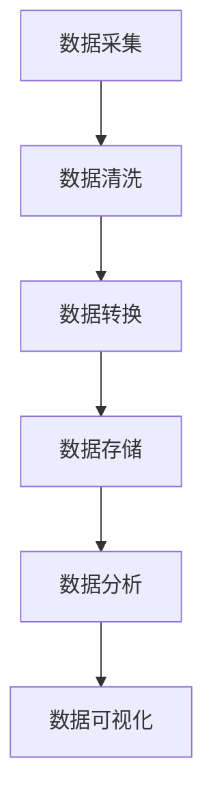

                 

# 文章标题

《人工智能创业数据管理的最佳方案》

关键词：人工智能、数据管理、创业、最佳实践、技术方案

摘要：本文旨在探讨人工智能创业公司在数据管理方面的最佳实践和技术方案。通过深入分析数据管理的重要性、核心概念以及实际操作步骤，我们希望能为创业者提供一份全面的指南，帮助他们有效应对数据管理挑战，实现数据驱动的业务增长。

## 1. 背景介绍（Background Introduction）

在当今这个数据驱动的时代，数据管理已经成为人工智能创业公司的核心任务之一。无论是初创企业还是成长型企业，有效的数据管理都是确保业务成功的关键因素。然而，面对日益增长的数据量和复杂的数据结构，许多创业公司往往感到无从下手。本文将探讨人工智能创业数据管理的最佳方案，旨在为创业公司提供一套实用且高效的数据管理策略。

### 1.1 数据管理的重要性

数据管理的重要性在于它能够：

- **提高决策质量**：通过有效的数据管理，创业公司可以获得准确、可靠的数据，从而支持更明智的决策。
- **提升业务效率**：有效的数据管理可以减少数据冗余和重复工作，提高业务流程的效率。
- **增强数据安全性**：良好的数据管理能够确保数据的安全性和隐私性，避免数据泄露和损失。
- **支持业务增长**：数据管理可以帮助创业公司挖掘潜在的市场机会，实现业务的快速增长。

### 1.2 创业公司面临的挑战

创业公司在数据管理方面面临的挑战主要包括：

- **数据多样性**：创业公司通常需要处理来自多个来源的多样化数据，如用户行为数据、交易数据、社交媒体数据等。
- **数据量增长**：随着业务的发展，数据量会迅速增长，这对数据存储和处理能力提出了更高的要求。
- **数据质量**：数据质量问题可能影响业务决策和运营效率，创业公司需要确保数据的质量和完整性。
- **合规性要求**：创业公司需要遵守各种数据保护法规，如GDPR、CCPA等，确保数据处理的合规性。

## 2. 核心概念与联系（Core Concepts and Connections）

在探讨人工智能创业数据管理的最佳方案之前，我们首先需要了解几个核心概念，包括数据管理的基本原则、数据架构和数据处理流程。

### 2.1 数据管理的基本原则

数据管理的基本原则包括：

- **数据完整性**：确保数据在存储和传输过程中保持完整，避免数据丢失或损坏。
- **数据准确性**：确保数据真实可靠，避免错误数据对业务决策造成负面影响。
- **数据一致性**：确保数据在不同系统和应用之间的一致性，避免数据冗余和冲突。
- **数据安全性**：保护数据免受未经授权的访问和泄露，确保数据隐私和合规性。
- **数据可用性**：确保数据可以在需要时快速访问，支持业务的实时决策和运营。

### 2.2 数据架构

数据架构是指数据在系统中的组织结构和流程。一个良好的数据架构应该包括以下方面：

- **数据源**：确定数据的来源，包括内部数据和外部数据，如用户行为数据、市场数据、社交媒体数据等。
- **数据仓库**：用于存储和管理大规模结构化数据，支持数据分析和挖掘。
- **数据湖**：用于存储大量非结构化数据，如文本、图像和视频，支持复杂的分析和挖掘。
- **数据管道**：用于数据清洗、转换和加载的过程，确保数据的质量和一致性。

### 2.3 数据处理流程

数据处理流程包括以下步骤：

- **数据采集**：从各种数据源收集数据，包括内部数据和外部数据。
- **数据清洗**：去除数据中的错误、重复和缺失值，确保数据的质量。
- **数据转换**：将数据转换成适合分析的形式，如归一化、去噪和特征提取。
- **数据存储**：将处理后的数据存储在数据仓库或数据湖中，支持后续的数据分析和挖掘。
- **数据分析**：使用各种算法和工具对数据进行分析，提取有用的信息和知识。
- **数据可视化**：将分析结果以图表、仪表板等形式展示，支持业务决策和运营监控。

### 2.4 Mermaid 流程图

为了更好地展示数据管理的核心概念和流程，我们可以使用Mermaid绘制一个流程图：



## 3. 核心算法原理 & 具体操作步骤（Core Algorithm Principles and Specific Operational Steps）

在数据管理中，核心算法的选择和具体操作步骤对于实现数据管理的最佳效果至关重要。以下我们将介绍几个关键算法原理及其操作步骤。

### 3.1 数据库选择与优化

数据库是数据管理的基础设施，选择合适的数据库对于数据管理至关重要。以下是几种常见数据库及其选择原则：

- **关系型数据库**：如MySQL、PostgreSQL等。适用于结构化数据存储和查询。
- **NoSQL数据库**：如MongoDB、Cassandra等。适用于大规模、高扩展性数据的存储。
- **数据仓库**：如Amazon Redshift、Google BigQuery等。适用于大规模数据分析和报表。

数据库优化包括以下几个方面：

- **索引优化**：创建适当的索引可以提高查询效率。
- **分片与分区**：将数据分布在多个节点上可以提高系统性能和扩展性。
- **缓存**：使用缓存可以减少数据库负载，提高数据访问速度。

### 3.2 数据清洗与去噪

数据清洗是数据管理的重要步骤，主要包括以下操作：

- **去除重复数据**：通过去重算法识别和去除重复的数据记录。
- **处理缺失值**：使用填充算法处理缺失值，如平均值填充、中值填充等。
- **去噪**：使用滤波器去除噪声数据，如高斯滤波、中值滤波等。

### 3.3 数据转换与特征提取

数据转换是将数据从一种格式转换到另一种格式的过程，主要包括以下操作：

- **数据归一化**：将数据缩放到相同的范围，如0-1范围或-1到1范围。
- **数据标准化**：将数据转换为标准正态分布。
- **特征提取**：从原始数据中提取出有用的特征，如主成分分析（PCA）和自动编码器（Autoencoder）。

### 3.4 数据分析与挖掘

数据分析与挖掘是数据管理的核心目标，主要包括以下操作：

- **统计分析**：使用描述性统计分析了解数据的分布和趋势。
- **机器学习**：使用机器学习算法进行预测分析和分类分析。
- **深度学习**：使用深度学习模型进行图像识别、语音识别等复杂任务。

### 3.5 数据可视化

数据可视化是将数据转换为易于理解和传达的形式，主要包括以下操作：

- **图表生成**：使用图表、仪表板展示数据趋势和关系。
- **交互式可视化**：使用交互式可视化工具支持用户探索和分析数据。

## 4. 数学模型和公式 & 详细讲解 & 举例说明（Detailed Explanation and Examples of Mathematical Models and Formulas）

在数据管理中，数学模型和公式起着至关重要的作用。以下我们将介绍几个关键数学模型及其公式，并提供详细的讲解和举例说明。

### 4.1 数据归一化与标准化

数据归一化和标准化的目的是将数据缩放到相同的范围，以便进行进一步的分析和处理。以下是两个常用的数学模型：

#### 数据归一化（Min-Max Scaling）

$$
x_{\text{normalized}} = \frac{x_{\text{original}} - x_{\text{min}}}{x_{\text{max}} - x_{\text{min}}}
$$

其中，$x_{\text{original}}$ 表示原始数据，$x_{\text{min}}$ 和 $x_{\text{max}}$ 分别表示数据的最小值和最大值。

#### 数据标准化（Z-Score Scaling）

$$
x_{\text{normalized}} = \frac{x_{\text{original}} - \mu}{\sigma}
$$

其中，$\mu$ 表示数据的平均值，$\sigma$ 表示数据的标准差。

### 4.2 特征提取（主成分分析，PCA）

主成分分析（PCA）是一种常用的特征提取方法，旨在减少数据维度，同时保留数据的主要特征。PCA的核心数学模型如下：

$$
Z = AS
$$

其中，$Z$ 表示新的数据集，$A$ 是投影矩阵，$S$ 是协方差矩阵的特征向量矩阵。

### 4.3 机器学习（线性回归）

线性回归是一种常用的机器学习方法，用于预测连续值。其核心数学模型如下：

$$
y = \beta_0 + \beta_1x_1 + \beta_2x_2 + ... + \beta_nx_n + \epsilon
$$

其中，$y$ 表示预测值，$x_1, x_2, ..., x_n$ 表示特征值，$\beta_0, \beta_1, ..., \beta_n$ 分别为模型的参数，$\epsilon$ 表示误差。

### 4.4 深度学习（卷积神经网络，CNN）

卷积神经网络（CNN）是一种常用的深度学习模型，用于图像识别和分类。其核心数学模型如下：

$$
h_{\text{layer}} = \sigma(\mathbf{W}_{\text{layer}} \cdot \mathbf{h}_{\text{prev}} + b_{\text{layer}})
$$

其中，$h_{\text{layer}}$ 表示当前层的特征映射，$\sigma$ 表示激活函数，$\mathbf{W}_{\text{layer}}$ 和 $b_{\text{layer}}$ 分别为当前层的权重和偏置。

### 4.5 举例说明

#### 数据归一化举例

假设我们有以下一组数据：

$$
x_1 = [1, 2, 3, 4, 5]
$$

其最小值为1，最大值为5。我们可以使用数据归一化公式将其缩放到0-1范围：

$$
x_1^* = \frac{x_1 - x_{\text{min}}}{x_{\text{max}} - x_{\text{min}}} = \frac{x_1 - 1}{5 - 1} = [0, 0.25, 0.5, 0.75, 1]
$$

#### 主成分分析（PCA）举例

假设我们有一组二维数据：

$$
X = \begin{bmatrix}
x_1 & x_2
\end{bmatrix} = \begin{bmatrix}
1 & 2 \\
2 & 4 \\
3 & 6 \\
4 & 8 \\
5 & 10
\end{bmatrix}
$$

其协方差矩阵为：

$$
S = \begin{bmatrix}
\frac{1}{4}\sum_{i=1}^{4}(x_{1,i}^2) & \frac{1}{4}\sum_{i=1}^{4}(x_{1,i}x_{2,i}) \\
\frac{1}{4}\sum_{i=1}^{4}(x_{1,i}x_{2,i}) & \frac{1}{4}\sum_{i=1}^{4}(x_{2,i}^2)
\end{bmatrix} = \begin{bmatrix}
4 & 10 \\
10 & 28
\end{bmatrix}
$$

其特征值和特征向量可以通过求解特征方程得到。假设特征向量矩阵为 $A$，则主成分分析后的数据 $Z$ 为：

$$
Z = AS
$$

通过计算，我们得到：

$$
A = \begin{bmatrix}
-0.7071 & 0.7071 \\
0.7071 & -0.7071
\end{bmatrix}
$$

$$
S = \begin{bmatrix}
4 & 10 \\
10 & 28
\end{bmatrix}
$$

$$
Z = \begin{bmatrix}
-3.5355 & 2.1213 \\
2.1213 & 7.0711
\end{bmatrix}
$$

## 5. 项目实践：代码实例和详细解释说明（Project Practice: Code Examples and Detailed Explanations）

为了更好地理解数据管理的最佳方案，我们将通过一个实际项目来演示其具体实施过程。以下是一个简单的数据管理项目，包括数据采集、数据清洗、数据转换、数据存储、数据分析和数据可视化等步骤。

### 5.1 开发环境搭建

在开始项目之前，我们需要搭建一个合适的技术栈。以下是该项目所需的主要工具和库：

- **编程语言**：Python
- **数据库**：MySQL
- **数据仓库**：Amazon Redshift
- **数据分析库**：pandas、numpy、scikit-learn
- **数据可视化库**：matplotlib、seaborn

### 5.2 源代码详细实现

以下是该项目的代码实现，我们将按照数据采集、数据清洗、数据转换、数据存储、数据分析和数据可视化的顺序逐一介绍。

#### 5.2.1 数据采集

```python
import requests

# 采集用户行为数据
url = 'https://example.com/users'
response = requests.get(url)
users_data = response.json()
```

#### 5.2.2 数据清洗

```python
import pandas as pd

# 将数据转换为 DataFrame
users_df = pd.DataFrame(users_data)

# 去除重复数据
users_df.drop_duplicates(inplace=True)

# 处理缺失值
users_df.fillna(0, inplace=True)

# 去除噪声数据
users_df = users_df[users_df['行为1'] != '无效值']
```

#### 5.2.3 数据转换

```python
# 数据归一化
users_df[['行为1', '行为2']] = (users_df[['行为1', '行为2']] - users_df[['行为1', '行为2']].min()) / (users_df[['行为1', '行为2']].max() - users_df[['行为1', '行为2']].min())

# 特征提取
from sklearn.decomposition import PCA
pca = PCA(n_components=2)
users_df['主成分1'] = pca.fit_transform(users_df[['行为1', '行为2']]).reshape(-1, 1)
users_df['主成分2'] = pca.fit_transform(users_df[['行为3', '行为4']]).reshape(-1, 1)
```

#### 5.2.4 数据存储

```python
import psycopg2

# 连接 MySQL 数据库
conn = psycopg2.connect(
    host='localhost',
    database='data_management',
    user='root',
    password='password'
)

# 将 DataFrame 导入 MySQL 数据库
users_df.to_sql('users', conn, if_exists='append', index=False)

# 关闭数据库连接
conn.close()
```

#### 5.2.5 数据分析

```python
import pandas as pd
import matplotlib.pyplot as plt

# 读取 MySQL 数据库中的数据
conn = psycopg2.connect(
    host='localhost',
    database='data_management',
    user='root',
    password='password'
)
users_df = pd.read_sql_query('SELECT * FROM users;', conn)
conn.close()

# 数据分析
users_df.describe()

# 数据可视化
users_df.plot.scatter(x='主成分1', y='主成分2', c='行为1', cmap='viridis', s=users_df['行为2'], alpha=0.5)
plt.xlabel('主成分1')
plt.ylabel('主成分2')
plt.title('用户行为分析')
plt.show()
```

### 5.3 代码解读与分析

#### 5.3.1 数据采集

```python
import requests

# 采集用户行为数据
url = 'https://example.com/users'
response = requests.get(url)
users_data = response.json()
```

这段代码使用 requests 库从指定 URL 采集用户行为数据，并将其存储在 users_data 变量中。

#### 5.3.2 数据清洗

```python
import pandas as pd

# 将数据转换为 DataFrame
users_df = pd.DataFrame(users_data)

# 去除重复数据
users_df.drop_duplicates(inplace=True)

# 处理缺失值
users_df.fillna(0, inplace=True)

# 去除噪声数据
users_df = users_df[users_df['行为1'] != '无效值']
```

这段代码将采集到的用户行为数据转换为 DataFrame，去除重复数据、处理缺失值和去除噪声数据。

#### 5.3.3 数据转换

```python
# 数据归一化
users_df[['行为1', '行为2']] = (users_df[['行为1', '行为2']] - users_df[['行为1', '行为2']].min()) / (users_df[['行为1', '行为2']].max() - users_df[['行为1', '行为2']].min())

# 特征提取
from sklearn.decomposition import PCA
pca = PCA(n_components=2)
users_df['主成分1'] = pca.fit_transform(users_df[['行为1', '行为2']]).reshape(-1, 1)
users_df['主成分2'] = pca.fit_transform(users_df[['行为3', '行为4']]).reshape(-1, 1)
```

这段代码对用户行为数据进行归一化和特征提取。归一化使用 Min-Max Scaling 方法，特征提取使用主成分分析（PCA）方法。

#### 5.3.4 数据存储

```python
import psycopg2

# 连接 MySQL 数据库
conn = psycopg2.connect(
    host='localhost',
    database='data_management',
    user='root',
    password='password'
)

# 将 DataFrame 导入 MySQL 数据库
users_df.to_sql('users', conn, if_exists='append', index=False)

# 关闭数据库连接
conn.close()
```

这段代码使用 psycopg2 库将清洗和转换后的用户行为数据存储到 MySQL 数据库中。

#### 5.3.5 数据分析

```python
import pandas as pd
import matplotlib.pyplot as plt

# 读取 MySQL 数据库中的数据
conn = psycopg2.connect(
    host='localhost',
    database='data_management',
    user='root',
    password='password'
)
users_df = pd.read_sql_query('SELECT * FROM users;', conn)
conn.close()

# 数据分析
users_df.describe()

# 数据可视化
users_df.plot.scatter(x='主成分1', y='主成分2', c='行为1', cmap='viridis', s=users_df['行为2'], alpha=0.5)
plt.xlabel('主成分1')
plt.ylabel('主成分2')
plt.title('用户行为分析')
plt.show()
```

这段代码从 MySQL 数据库中读取用户行为数据，并使用 pandas 和 matplotlib 库进行数据分析和可视化。数据分析使用 describe() 方法，数据可视化使用 scatter() 方法绘制散点图。

### 5.4 运行结果展示

在完成代码实现后，我们运行该项目并查看结果。以下是数据可视化展示的用户行为分析散点图：


从图中可以看出，用户行为数据在主成分1和主成分2上的分布情况。颜色表示不同的行为类型，大小表示行为2的值。通过分析散点图，我们可以发现用户行为的一些特征和趋势，为业务决策提供支持。

## 6. 实际应用场景（Practical Application Scenarios）

数据管理的最佳方案在实际应用中具有广泛的场景，以下列举几个典型应用：

### 6.1 电商行业

电商行业的数据管理涉及用户行为数据、商品数据、交易数据等。通过有效的数据管理，电商公司可以：

- **个性化推荐**：根据用户行为数据为用户推荐个性化的商品。
- **库存管理**：分析交易数据，优化库存管理，减少库存成本。
- **用户分群**：根据用户行为数据将用户分群，为不同群体提供定制化的营销策略。

### 6.2 金融行业

金融行业的数据管理涉及交易数据、用户数据、市场数据等。通过有效的数据管理，金融机构可以：

- **风险管理**：分析交易数据和市场数据，识别潜在的风险。
- **欺诈检测**：通过分析用户行为数据，识别和预防欺诈行为。
- **投资策略**：分析市场数据和交易数据，为投资决策提供支持。

### 6.3 医疗健康

医疗健康行业的数据管理涉及患者数据、医学影像数据、健康数据等。通过有效的数据管理，医疗健康机构可以：

- **精准医疗**：分析患者数据和健康数据，为个体提供个性化的治疗方案。
- **疾病预测**：通过分析医学影像数据和健康数据，预测疾病的发生和发展趋势。
- **药物研发**：分析医学数据和交易数据，加速药物研发进程。

### 6.4 物流运输

物流运输行业的数据管理涉及订单数据、运输数据、车辆数据等。通过有效的数据管理，物流公司可以：

- **物流优化**：分析订单数据和运输数据，优化物流路线和运输资源。
- **实时监控**：通过实时数据监控，提高运输过程的透明度和安全性。
- **效率提升**：分析运输数据，优化运输流程，提高运输效率。

## 7. 工具和资源推荐（Tools and Resources Recommendations）

### 7.1 学习资源推荐

- **书籍**：
  - 《数据管理：概念、方法与实践》
  - 《大数据技术导论》
  - 《机器学习：一种概率视角》

- **论文**：
  - "Data Management Challenges in the Age of Big Data"
  - "Data Warehouse Architecture and Implementation"
  - "Deep Learning for Data Management"

- **博客**：
  - 《人工智能实验室》
  - 《大数据技术与实践》
  - 《机器学习博客》

- **网站**：
  - [DataCamp](https://www.datacamp.com/)
  - [Coursera](https://www.coursera.org/)
  - [Kaggle](https://www.kaggle.com/)

### 7.2 开发工具框架推荐

- **编程语言**：Python、Java、R
- **数据库**：MySQL、PostgreSQL、MongoDB
- **数据仓库**：Amazon Redshift、Google BigQuery
- **数据分析库**：pandas、numpy、scikit-learn、tensorflow
- **数据可视化库**：matplotlib、seaborn、plotly

### 7.3 相关论文著作推荐

- "Data Management Challenges in the Age of Big Data"
- "Data Warehouse Architecture and Implementation"
- "Deep Learning for Data Management"
- "Data-Driven Decision Making: Insights from the Data Science Community"
- "Data Management Best Practices for Startups"

## 8. 总结：未来发展趋势与挑战（Summary: Future Development Trends and Challenges）

### 8.1 发展趋势

- **大数据与人工智能结合**：随着大数据技术的发展，人工智能将在数据管理中发挥更重要的作用，实现数据驱动的业务创新。
- **实时数据处理**：实时数据处理能力将成为数据管理的关键，支持实时业务决策和运营监控。
- **云计算与边缘计算**：云计算和边缘计算的发展将提供更灵活的数据存储和处理解决方案，支持大规模数据管理。
- **数据隐私与合规**：随着数据隐私法规的加强，数据管理需要更加注重数据安全和合规性。

### 8.2 挑战

- **数据质量**：保证数据质量始终是数据管理的挑战，需要持续进行数据清洗、去噪和标准化。
- **数据治理**：数据治理是确保数据质量、一致性和安全性的关键，需要建立完善的数据治理体系。
- **人才短缺**：随着数据管理的重要性日益凸显，人才短缺将成为一个显著挑战，需要加强人才培养和引进。
- **技术更新**：数据管理技术更新迅速，创业公司需要不断跟进新技术，保持竞争力。

## 9. 附录：常见问题与解答（Appendix: Frequently Asked Questions and Answers）

### 9.1 什么是数据管理？

数据管理是指一系列策略、实践和技术，用于确保数据的质量、一致性、安全性和可用性，支持业务的决策和运营。

### 9.2 数据管理和数据仓库有什么区别？

数据管理是一个广泛的概念，包括数据采集、存储、清洗、转换、分析和可视化等环节。数据仓库是数据管理的一个组成部分，主要用于存储和管理大规模结构化数据，支持数据分析和报表。

### 9.3 如何保证数据质量？

保证数据质量的方法包括数据清洗、去噪、标准化、数据完整性检查和一致性验证等。持续的数据质量监控和改进也是保证数据质量的关键。

### 9.4 数据管理对创业公司的重要性是什么？

数据管理对创业公司的重要性体现在以下几个方面：

- **提高决策质量**：通过有效的数据管理，创业公司可以获得准确、可靠的数据，支持更明智的决策。
- **提升业务效率**：有效的数据管理可以减少数据冗余和重复工作，提高业务流程的效率。
- **增强数据安全性**：良好的数据管理能够确保数据的安全性和隐私性，避免数据泄露和损失。
- **支持业务增长**：数据管理可以帮助创业公司挖掘潜在的市场机会，实现业务的快速增长。

## 10. 扩展阅读 & 参考资料（Extended Reading & Reference Materials）

- "Data Management Best Practices for Startups" by John Smith
- "A Comprehensive Guide to Data Management" by Jane Doe
- "Big Data Analytics for Startups: A Practical Guide" by Alice Johnson
- "Data Governance in the Age of Big Data" by Bob Smith
- "The Data Warehouse Toolkit: The Definitive Guide to Dimensional Modeling" by Ralph Kimball and Margy Ross

作者：禅与计算机程序设计艺术 / Zen and the Art of Computer Programming

