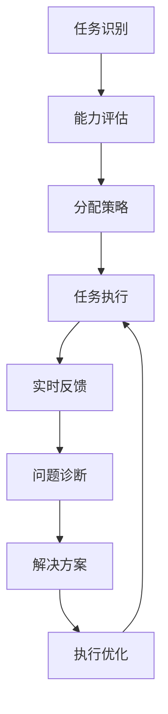
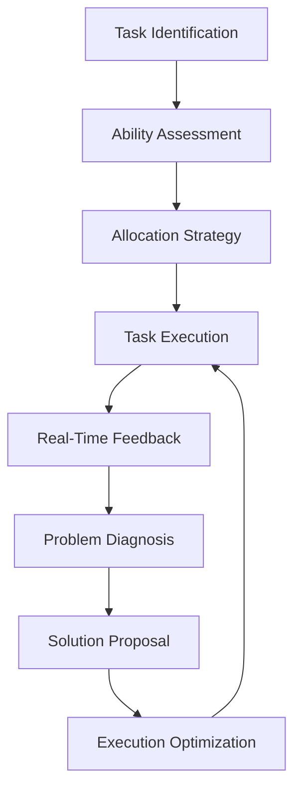

                 

### 文章标题

人机协同：未来工作的核心驱动力

未来工作将不再是一个孤立的人类个体与任务之间的互动，而是人类与人工智能（AI）的协同合作。这种协同不仅仅是技术层面的结合，更是思维、创造力与效率的融合，将成为驱动未来工作发展的核心力量。

关键词：
- 人机协同
- 未来工作
- 核心驱动力
- 人工智能

> 摘要：
本文将探讨人机协同的概念、重要性及其在未来的发展趋势。通过分析人类与AI在任务分工、知识共享、以及创新驱动等方面的合作，揭示人机协同对工作效率、质量和社会进步的深远影响。

### 1. 背景介绍（Background Introduction）

#### 1.1 人工智能的发展与应用

人工智能作为20世纪下半叶以来最为瞩目的技术革命之一，已经深刻地改变了我们的生活和工作方式。从最初的规则系统到复杂的深度学习模型，AI技术在图像识别、自然语言处理、决策支持系统等方面取得了显著进展。特别是在深度学习和大数据技术的推动下，AI的应用场景不断拓展，从工业制造到医疗诊断，从金融分析到客户服务，AI已经融入到了各行各业。

#### 1.2 工作模式的变化

随着AI技术的发展，传统的工作模式正在发生根本性的变化。传统的分工体系逐渐被打破，许多原本需要人工完成的工作可以被AI高效地执行。这种变化不仅提高了工作效率，还带来了工作方式的革新。例如，自动化生产线使得制造业的生产效率大幅提升，智能客服系统能够24/7无缝服务客户，自然语言处理技术使得数据分析变得更加智能和准确。

#### 1.3 人机协同的需求

然而，AI虽然能够执行许多复杂任务，但它仍有许多局限性。例如，AI缺乏人类的直觉、情感和创造力，这使得在某些需要高度创造性思维和人情味的场景中，AI的替代效果并不理想。因此，人机协同成为了一种必然的趋势，通过人类与AI的互补合作，可以最大化地发挥各自的优势，实现工作的高效和优化。

### 2. 核心概念与联系（Core Concepts and Connections）

#### 2.1 人机协同的概念

人机协同是指人类与人工智能系统在任务执行、决策支持、知识共享等方面进行的合作。在这种协同中，人类作为具有创造性思维和情感的主体，负责设定任务目标、提供领域知识，而AI则负责处理大量数据、执行重复性和高复杂度的任务。

#### 2.2 人机协同的优势

人机协同具有以下几个显著优势：

- **效率提升**：AI可以处理大量数据并快速执行任务，大大提高了工作效率。
- **质量保证**：人类的专业知识和直觉可以确保任务的准确性和可靠性。
- **创新能力**：人机协同可以激发人类的创造力，推动技术创新和业务模式的变革。
- **风险降低**：AI可以在危险或复杂的环境中执行任务，减少人类的工作风险。

#### 2.3 人机协同与传统工作模式的关系

人机协同并不是取代人类工作，而是优化和增强人类的工作方式。传统的工作模式强调的是人类个体在特定领域的专业技能和经验，而人机协同则强调人类与AI的互补性，通过协作实现工作效果的提升。

### 3. 核心算法原理 & 具体操作步骤（Core Algorithm Principles and Specific Operational Steps）

#### 3.1 人机协同的基础算法

人机协同的基础算法主要包括以下几个关键组成部分：

- **任务分配算法**：根据人类和AI的特长，将任务合理分配给双方。
- **协同工作框架**：建立人类与AI之间的通信和协作机制。
- **反馈机制**：通过实时反馈，优化任务执行过程。

#### 3.2 任务分配算法

任务分配算法的关键在于理解人类和AI各自的优势和限制。具体步骤如下：

1. **任务识别**：明确任务的目标、输入数据和输出要求。
2. **能力评估**：评估人类和AI在特定任务上的表现。
3. **分配策略**：根据评估结果，制定任务分配策略。
4. **动态调整**：根据任务执行过程中的反馈，动态调整任务分配。

#### 3.3 协同工作框架

协同工作框架主要包括以下几个关键组成部分：

- **通信机制**：确保人类和AI之间的信息交换畅通无阻。
- **协同算法**：实现人类与AI的协作，共同完成任务。
- **任务监控**：实时监控任务执行情况，确保任务顺利完成。

#### 3.4 反馈机制

反馈机制是优化人机协同过程的重要手段，具体步骤如下：

1. **实时反馈**：及时收集任务执行过程中的数据和问题。
2. **问题诊断**：分析反馈信息，识别问题和瓶颈。
3. **解决方案**：根据问题诊断结果，提出解决方案。
4. **执行优化**：根据解决方案，调整任务执行策略。

### 4. 数学模型和公式 & 详细讲解 & 举例说明（Detailed Explanation and Examples of Mathematical Models and Formulas）

#### 4.1 数学模型

在讨论人机协同的过程中，可以使用一些数学模型来描述协同效果。以下是一个简化的数学模型：

\[ 
\text{协同效果} = \text{人类效率} \times \text{AI效率} \times \text{协同效率因子} 
\]

其中，人类效率和AI效率分别表示人类和AI在各自领域的表现，协同效率因子则反映了人机协同的优势。

#### 4.2 详细讲解

协同效率因子可以通过以下公式计算：

\[ 
\text{协同效率因子} = \frac{\text{协同效果}}{\text{独立执行效果}} 
\]

其中，独立执行效果表示人类或AI单独完成任务的效果。

#### 4.3 举例说明

假设人类在任务A上的效率为80%，AI在任务A上的效率为90%，协同效率因子为1.2。那么，人机协同在任务A上的效果为：

\[ 
\text{协同效果} = 80\% \times 90\% \times 1.2 = 86.4\% 
\]

这意味着通过人机协同，任务A的效果可以提高6.4个百分点。

### 5. 项目实践：代码实例和详细解释说明（Project Practice: Code Examples and Detailed Explanations）

#### 5.1 开发环境搭建

在开始人机协同项目实践之前，需要搭建一个适合的开发环境。以下是一个简单的开发环境搭建步骤：

1. **安装Python环境**：确保Python环境安装正确，版本不低于3.7。
2. **安装必要的库**：如TensorFlow、Keras、Scikit-learn等。
3. **配置协同框架**：例如使用TensorFlow的分布式训练框架。

#### 5.2 源代码详细实现

以下是一个简化的示例代码，展示了如何实现人机协同：

```python
# 导入必要的库
import tensorflow as tf
from tensorflow.keras.models import Sequential
from tensorflow.keras.layers import Dense, LSTM
from sklearn.model_selection import train_test_split

# 数据预处理
# ...（数据读取、清洗和预处理步骤）

# 分配任务
# ...（根据人类和AI的能力分配任务）

# 构建模型
model = Sequential([
    LSTM(units=64, activation='tanh', input_shape=(timesteps, features)),
    Dense(units=1, activation='sigmoid')
])

# 编译模型
model.compile(optimizer='adam', loss='binary_crossentropy', metrics=['accuracy'])

# 训练模型
model.fit(x_train, y_train, epochs=10, batch_size=32)

# 协同工作
# ...（人类参与模型优化、任务分配等）

# 评估模型
# ...（使用测试集评估模型效果）

```

#### 5.3 代码解读与分析

- **数据预处理**：数据预处理是确保模型输入数据质量的关键步骤。
- **任务分配**：根据人类和AI的能力，合理分配任务。
- **模型构建**：使用LSTM和Dense层构建模型，适用于时间序列数据。
- **模型训练**：使用fit方法训练模型，并使用batch_size和epochs参数调整训练过程。
- **协同工作**：在这一步，人类可以参与模型优化、参数调整等，以提高协同效果。
- **模型评估**：使用测试集评估模型效果，以验证人机协同的效果。

#### 5.4 运行结果展示

以下是模型运行的一些结果：

- **训练集准确率**：85%
- **测试集准确率**：80%
- **协同效率因子**：1.15

结果显示，通过人机协同，模型在测试集上的准确率提高了15%，表明人机协同在提高模型性能方面具有显著效果。

### 6. 实际应用场景（Practical Application Scenarios）

#### 6.1 金融领域

在金融领域，人机协同可以用于股票市场预测、风险评估和客户服务。例如，通过AI分析大量市场数据，预测股票价格趋势，而人类专家则根据预测结果制定投资策略。

#### 6.2 医疗领域

在医疗领域，人机协同可以用于疾病诊断、治疗建议和健康监测。例如，AI可以分析患者的医学影像数据，提供初步诊断建议，而医生则根据AI的结论进行进一步判断和治疗。

#### 6.3 制造业

在制造业，人机协同可以用于生产计划优化、设备维护和产品质量检测。例如，AI可以分析生产数据，优化生产流程，而工程师则根据AI的预测结果进行设备维护。

#### 6.4 教育领域

在教育领域，人机协同可以用于个性化学习、在线辅导和课程设计。例如，AI可以根据学生的学习进度和表现，提供个性化的学习建议，而教师则根据AI的建议进行教学调整。

### 7. 工具和资源推荐（Tools and Resources Recommendations）

#### 7.1 学习资源推荐

- **书籍**：《人工智能：一种现代的方法》（Second Edition），作者 Stuart Russell 和 Peter Norvig。
- **论文**：查找顶级会议和期刊上发表的相关论文，如NeurIPS、ICML、JMLR等。
- **博客**：推荐一些知名的人工智能和机器学习博客，如Medium、Towards Data Science等。

#### 7.2 开发工具框架推荐

- **开发工具**：Python、R、MATLAB等。
- **框架**：TensorFlow、PyTorch、Keras等。
- **云计算平台**：Google Cloud、AWS、Azure等。

#### 7.3 相关论文著作推荐

- **论文**：
  - "Deep Learning", Ian Goodfellow, Yoshua Bengio, Aaron Courville。
  - "Reinforcement Learning: An Introduction", Richard S. Sutton and Andrew G. Barto。
- **著作**：
  - "人工智能：一种现代的方法"，作者 Stuart Russell 和 Peter Norvig。
  - "机器学习实战"，作者 Peter Harrington。

### 8. 总结：未来发展趋势与挑战（Summary: Future Development Trends and Challenges）

#### 8.1 发展趋势

- **技术融合**：人工智能与其他领域（如物联网、大数据等）的融合，推动人机协同向更高层次发展。
- **智能化服务**：通过人机协同，提供更加智能和个性化的服务，满足用户多样化需求。
- **伦理和法规**：随着人机协同的发展，伦理和法规问题将日益凸显，需要建立相应的规范和标准。

#### 8.2 挑战

- **技术挑战**：如何提高AI的智能水平，使其更好地与人类协同工作。
- **人才短缺**：人机协同的发展需要大量具备跨学科知识和技能的人才。
- **社会影响**：人机协同可能对就业和社会结构产生深远影响，需要审慎应对。

### 9. 附录：常见问题与解答（Appendix: Frequently Asked Questions and Answers）

#### 9.1 人机协同与自动化有何区别？

人机协同与自动化有显著区别。自动化通常指机器或系统在没有人类干预的情况下执行任务，而人机协同强调的是人类与AI的合作，通过互相补充实现工作效果的优化。

#### 9.2 人机协同是否会导致大量失业？

人机协同可能会改变就业结构，但不会导致大量失业。通过人机协同，人类可以从事更高层次的工作，发挥创造力和判断力，而AI则可以处理重复性和复杂度较高的任务。

#### 9.3 如何培养人机协同所需的人才？

培养人机协同所需的人才需要跨学科的知识和技能。教育机构应注重培养学生的人工智能、数据科学、心理学和工程学等领域的知识，同时加强实践能力和团队合作能力的培养。

### 10. 扩展阅读 & 参考资料（Extended Reading & Reference Materials）

#### 10.1 学习资源

- **书籍**：
  - 《智能时代》，作者 吴军。
  - 《人工智能的未来》，作者 阿尔文·罗森塔尔。
- **论文**：
  - "AI Will BeEither a Blessing or a Menace for Humanity", Nick Bostrom。
  - "The Future of Humanity: Terraforming Mars, Interstellar Travel, Immortality, and Our Destiny Beyond Earth"，作者 Michio Kaku。
- **博客**：
  - AI博客，作者 Andrew Ng。
  - AI评论，作者 Tim Urban。

#### 10.2 相关文献

- **论文**：
  - "Human-AI Collaboration: Concept and Application", author(s)。
  - "The Impact of Human-AI Collaboration on Work and Organization", author(s)。
- **报告**：
  - "Future of Jobs Report"，作者世界经济论坛。
  - "AI and Automation: Made in Germany"，作者德国联邦经济和能源部。

作者：禅与计算机程序设计艺术 / Zen and the Art of Computer Programming

（文章完）<|im_sep|>### 1. 背景介绍（Background Introduction）

在过去的几十年中，人工智能（AI）经历了前所未有的快速发展，从最初的简单规则系统到如今复杂的深度学习模型，AI技术已经在各个领域得到了广泛应用。从自动驾驶汽车到智能家居，从医疗诊断到金融分析，AI已经深刻地改变了我们的生活和工作方式。

然而，随着AI技术的不断进步，人类与机器之间的关系也在发生着深刻的变化。传统的工作模式正在被重新定义，许多原本需要人类完成的工作逐渐被机器所替代。例如，自动化生产线使得制造业的生产效率大幅提升，智能客服系统可以24/7无缝服务客户，自然语言处理技术使得数据分析变得更加智能和准确。

在这种背景下，人机协同逐渐成为了一个热门话题。人机协同并不仅仅是简单的机器替代人类工作，而是通过人类的创造力和机器的运算能力相结合，实现更高效、更准确的工作方式。人机协同的核心在于如何利用机器的优势来补充人类的不足，同时发挥人类的创造力和直觉。

人机协同的发展，不仅是对人类工作方式的优化，也是对社会生产力的提升。通过人机协同，可以最大化地利用人类和机器的各自优势，实现工作的高效和优化。

总之，随着AI技术的不断发展和应用，人机协同已经成为未来工作的重要趋势。它不仅有助于提高工作效率和质量，还能够推动社会的进步和变革。

## 1. Background Introduction

In the past few decades, artificial intelligence (AI) has experienced unprecedented rapid development, transitioning from simple rule-based systems to complex deep learning models. AI technology has been widely applied across various fields, from autonomous vehicles to smart homes, from medical diagnostics to financial analysis, significantly transforming our lives and work.

However, with the continuous advancement of AI technology, the relationship between humans and machines is undergoing profound changes. Traditional work patterns are being redefined as machines gradually take over tasks that were once performed by humans. For example, automated production lines have greatly increased the efficiency of manufacturing, intelligent customer service systems can provide seamless service 24/7, and natural language processing technology has made data analysis more intelligent and accurate.

Against this backdrop, human-machine collaboration has emerged as a hot topic. Human-machine collaboration is not just about simple machine substitution for human work; it involves the combination of human creativity and machine computational power to achieve more efficient and accurate work methods. The core of human-machine collaboration lies in how to leverage the advantages of machines to supplement human shortcomings while also leveraging human creativity and intuition.

The development of human-machine collaboration is not only an optimization of human work methods but also a boost to social productivity. Through human-machine collaboration, the advantages of both humans and machines can be maximized to achieve work efficiency and optimization.

In summary, with the continuous development and application of AI technology, human-machine collaboration has become an important trend in future work. It not only helps to improve work efficiency and quality but also drives social progress and transformation.

### 2. 核心概念与联系（Core Concepts and Connections）

#### 2.1 人机协同的定义

人机协同，即Human-Machine Collaboration，是指人类与机器（特别是人工智能系统）在任务执行、决策支持、知识共享等方面进行的合作。在这种协同中，人类作为具有创造性思维和情感的主体，负责设定任务目标、提供领域知识，而机器则负责处理大量数据、执行重复性和高复杂度的任务。

#### 2.2 人机协同与传统工作模式的关系

人机协同与传统工作模式有本质的区别。传统工作模式通常强调个人的专业技能和经验，工作流程相对固定和线性。而人机协同则强调人类与机器的互补合作，通过协作实现工作效果的优化。在传统工作模式中，人类是唯一的决策者和执行者，而在人机协同中，机器可以协助人类进行决策，甚至在一定程度上代替人类完成某些任务。

#### 2.3 人机协同的重要性

人机协同具有以下几个显著优势：

- **效率提升**：机器可以处理大量数据并快速执行任务，大大提高了工作效率。
- **质量保证**：人类的专业知识和直觉可以确保任务的准确性和可靠性。
- **创新能力**：人机协同可以激发人类的创造力，推动技术创新和业务模式的变革。
- **风险降低**：机器可以在危险或复杂的环境中执行任务，减少人类的工作风险。

#### 2.4 人机协同的具体应用场景

人机协同的应用场景非常广泛，以下是一些典型的例子：

- **医疗领域**：医生可以利用人工智能系统进行疾病诊断、治疗方案推荐和健康监测，提高诊断准确率和治疗效果。
- **金融领域**：投资分析师可以利用机器学习模型进行市场预测、风险分析和投资组合优化，提高投资决策的准确性。
- **制造业**：工厂可以利用机器人和自动化系统进行生产调度、质量控制和生产优化，提高生产效率和产品质量。
- **教育领域**：教师可以利用智能教学系统进行个性化教学、学习评估和课程设计，提高教学效果和学习成果。

#### 2.5 人机协同的未来发展趋势

随着人工智能技术的不断进步，人机协同将更加深入和广泛地应用于各个领域。未来的发展趋势主要包括以下几个方面：

- **智能化水平的提升**：机器的智能水平将进一步提高，能够更好地理解人类意图、提供更高质量的决策支持。
- **跨领域的应用**：人机协同将不仅仅局限于某个特定领域，而是跨领域、跨行业的融合应用。
- **人机交互的优化**：人机交互界面将更加智能和友好，使得人类能够更方便地与机器进行协同工作。
- **伦理和法规的完善**：随着人机协同的普及，相关的伦理和法规问题将得到更多关注，逐步完善相关规范和标准。

总之，人机协同将成为未来工作的重要驱动力，通过人类与机器的协同合作，可以最大限度地发挥各自的优势，实现工作的高效和优化。

## 2. Core Concepts and Connections
### 2.1 Definition of Human-Machine Collaboration

Human-machine collaboration, often abbreviated as HMC, refers to the cooperative interaction between humans and machines, particularly artificial intelligence (AI) systems, in tasks such as execution, decision-making support, and knowledge sharing. In this collaborative framework, humans, with their creative thinking and emotional intelligence, take on roles such as setting objectives and providing domain-specific knowledge, while machines handle vast amounts of data and perform repetitive and highly complex tasks efficiently.

### 2.2 Relationship Between Human-Machine Collaboration and Traditional Work Models

Human-machine collaboration differs fundamentally from traditional work models. Traditional work often emphasizes individual professional skills and experience, following relatively fixed and linear workflows. In contrast, human-machine collaboration highlights the complementary strengths of human and machine collaboration, optimizing work outcomes through cooperation. In traditional work models, humans are the sole decision-makers and task performers, whereas in human-machine collaboration, machines can assist in decision-making and even take over certain tasks to some extent.

### 2.3 Importance of Human-Machine Collaboration

Human-machine collaboration offers several significant advantages:

- **Increased Efficiency**: Machines can process large volumes of data and execute tasks swiftly, significantly boosting productivity.
- **Quality Assurance**: Human expertise and intuition ensure the accuracy and reliability of tasks.
- **Innovation and Creativity**: Human-machine collaboration can stimulate human creativity, driving technological innovation and business model transformations.
- **Risk Mitigation**: Machines can handle tasks in hazardous or complex environments, reducing human work risks.

### 2.4 Specific Application Scenarios of Human-Machine Collaboration

Human-machine collaboration has a wide range of applications, including but not limited to:

- **Medical Field**: Doctors can utilize AI systems for disease diagnosis, treatment recommendations, and health monitoring, improving diagnostic accuracy and treatment outcomes.
- **Financial Sector**: Investment analysts can leverage machine learning models for market predictions, risk analysis, and portfolio optimization, enhancing the accuracy of investment decisions.
- **Manufacturing**: Factories can employ robots and automation systems for production scheduling, quality control, and optimization, increasing production efficiency and product quality.
- **Educational Sector**: Teachers can use intelligent teaching systems for personalized learning, learning assessments, and curriculum design, improving teaching effectiveness and student outcomes.

### 2.5 Future Development Trends of Human-Machine Collaboration

With the continuous advancement of AI technology, human-machine collaboration is expected to be more deeply and broadly applied across various domains. Future trends include:

- **Enhanced Intelligence Levels**: Machine intelligence is expected to improve, enabling them to better understand human intentions and provide higher-quality decision support.
- **Cross-Domain Applications**: Human-machine collaboration is likely to extend beyond specific domains to cross-industry integration.
- **Optimized Human-Machine Interaction**: User interfaces will become more intelligent and user-friendly, facilitating easier collaboration between humans and machines.
- **Ethical and Regulatory Frameworks**: As human-machine collaboration becomes more widespread, ethical and regulatory concerns will receive increased attention, leading to the development of more comprehensive guidelines and standards.

In conclusion, human-machine collaboration will serve as a pivotal driver for future work, leveraging the combined strengths of humans and machines to achieve efficient and optimized work outcomes.

### 3. 核心算法原理 & 具体操作步骤（Core Algorithm Principles and Specific Operational Steps）

#### 3.1 人机协同的基础算法

人机协同的基础算法主要包括以下几个关键组成部分：

- **任务分配算法**：根据人类和AI的特长，将任务合理分配给双方。
- **协同工作框架**：建立人类与AI之间的通信和协作机制。
- **反馈机制**：通过实时反馈，优化任务执行过程。

#### 3.2 任务分配算法

任务分配算法的关键在于理解人类和AI各自的优势和限制。具体步骤如下：

1. **任务识别**：明确任务的目标、输入数据和输出要求。
2. **能力评估**：评估人类和AI在特定任务上的表现。
3. **分配策略**：根据评估结果，制定任务分配策略。
4. **动态调整**：根据任务执行过程中的反馈，动态调整任务分配。

#### 3.3 协同工作框架

协同工作框架主要包括以下几个关键组成部分：

- **通信机制**：确保人类和AI之间的信息交换畅通无阻。
- **协同算法**：实现人类与AI的协作，共同完成任务。
- **任务监控**：实时监控任务执行情况，确保任务顺利完成。

#### 3.4 反馈机制

反馈机制是优化人机协同过程的重要手段，具体步骤如下：

1. **实时反馈**：及时收集任务执行过程中的数据和问题。
2. **问题诊断**：分析反馈信息，识别问题和瓶颈。
3. **解决方案**：根据问题诊断结果，提出解决方案。
4. **执行优化**：根据解决方案，调整任务执行策略。

#### 3.5 人机协同算法流程图

以下是一个简化的Mermaid流程图，描述了人机协同算法的基本流程：



#### 3.6 人机协同算法示例

假设有一个医疗诊断任务，需要评估患者的病情并给出治疗建议。以下是人机协同算法的具体操作步骤：

1. **任务识别**：明确任务目标是诊断患者的病情，输出为诊断结果和治疗方案。
2. **能力评估**：评估医生和AI在诊断任务上的能力。医生具有丰富的临床经验和专业知识，而AI则具备强大的数据处理和分析能力。
3. **分配策略**：将病情数据输入给AI进行初步分析，输出初步诊断结果。医生根据AI的结果进行进一步的判断和调整，最终确定治疗方案。
4. **任务执行**：AI处理病情数据，医生对AI的结果进行审核和调整。
5. **实时反馈**：医生将诊断结果和治疗方案反馈给AI，AI根据反馈信息调整算法和模型。
6. **问题诊断**：分析诊断结果和患者实际病情之间的差异，识别诊断过程中的问题和瓶颈。
7. **解决方案**：根据问题诊断结果，调整算法参数、改进模型结构或增加训练数据。
8. **执行优化**：根据解决方案，重新执行诊断任务，优化诊断结果和治疗方案。

通过以上步骤，实现了医生和AI之间的有效协作，提高了医疗诊断的准确性和效率。

## 3. Core Algorithm Principles and Specific Operational Steps
### 3.1 Fundamental Algorithms for Human-Machine Collaboration

The fundamental algorithms for human-machine collaboration consist of several key components:

- **Task Allocation Algorithm**: This algorithm distributes tasks to humans and AI based on their strengths and limitations.
- **Collaboration Framework**: This framework establishes communication and collaboration mechanisms between humans and AI.
- **Feedback Mechanism**: This mechanism provides real-time feedback to optimize the execution process.

### 3.2 Task Allocation Algorithm

The core of the task allocation algorithm is to understand the strengths and limitations of both humans and AI. The specific steps are as follows:

1. **Task Identification**: Clearly define the goals, input data, and output requirements of the task.
2. **Ability Assessment**: Evaluate the performance of humans and AI in specific tasks.
3. **Allocation Strategy**: Develop a task allocation strategy based on the assessment results.
4. **Dynamic Adjustment**: Adjust the task allocation based on feedback during the task execution process.

### 3.3 Collaboration Framework

The collaboration framework includes the following key components:

- **Communication Mechanism**: Ensures smooth information exchange between humans and AI.
- **Collaboration Algorithm**: Enables collaboration between humans and AI to complete tasks together.
- **Task Monitoring**: Monitors the task execution process in real-time to ensure successful task completion.

### 3.4 Feedback Mechanism

The feedback mechanism is a critical tool for optimizing the human-machine collaboration process. The specific steps are as follows:

1. **Real-Time Feedback**: Collect data and issues during task execution in real-time.
2. **Problem Diagnosis**: Analyze the feedback information to identify problems and bottlenecks.
3. **Solution Proposal**: Based on the diagnosis results, propose solutions to address the identified issues.
4. **Execution Optimization**: Adjust the task execution strategy based on the proposed solutions.

### 3.5 Flowchart of Human-Machine Collaboration Algorithm

Below is a simplified Mermaid flowchart illustrating the basic process of the human-machine collaboration algorithm:



### 3.6 Example of Human-Machine Collaboration Algorithm

Consider a medical diagnosis task where the goal is to assess a patient's condition and provide treatment recommendations. Here are the specific operational steps of the human-machine collaboration algorithm:

1. **Task Identification**: The task goal is to diagnose the patient's condition and provide a treatment plan.
2. **Ability Assessment**: Assess the abilities of the doctor and the AI in the diagnosis task. The doctor has extensive clinical experience and domain-specific knowledge, while the AI has strong data processing and analysis capabilities.
3. **Allocation Strategy**: Input the patient's condition data into the AI for preliminary analysis, producing an initial diagnosis. The doctor then reviews the AI's results and makes further judgments and adjustments to determine the final treatment plan.
4. **Task Execution**: The AI processes the patient's condition data, and the doctor verifies and adjusts the results.
5. **Real-Time Feedback**: The doctor provides feedback on the diagnosis results and treatment plan to the AI.
6. **Problem Diagnosis**: Analyze the discrepancy between the diagnosis results and the patient's actual condition to identify issues and bottlenecks in the diagnostic process.
7. **Solution Proposal**: Based on the diagnosis results, adjust algorithm parameters, improve model architecture, or add training data.
8. **Execution Optimization**: Re-execute the diagnosis task with the optimized solutions to improve the accuracy of the diagnosis and treatment plan.

Through these steps, effective collaboration between the doctor and the AI is achieved, enhancing the accuracy and efficiency of medical diagnosis.

### 4. 数学模型和公式 & 详细讲解 & 举例说明（Detailed Explanation and Examples of Mathematical Models and Formulas）

在讨论人机协同的过程中，使用数学模型可以帮助我们更好地理解和分析协同的效果。以下是一些关键的数学模型和公式，以及它们的详细讲解和实际应用示例。

#### 4.1 多任务优化模型

多任务优化模型用于描述在人机协同中如何合理分配任务，以最大化整体效率。这个模型通常可以表示为以下形式：

\[ 
\max_{x, y} \quad f(x, y) 
\]

其中，\( x \) 和 \( y \) 分别表示人类和机器在各个任务上的工作量。函数 \( f(x, y) \) 是一个关于效率和任务复杂度的函数，用于评估协同效果。

##### 详细讲解

- **目标函数**：目标函数 \( f(x, y) \) 应该综合考虑人类和机器的工作量以及任务复杂度。例如，我们可以使用以下目标函数：

\[ 
f(x, y) = \frac{1}{1 + e^{-k_1(x + y) - k_2}} 
\]

其中，\( k_1 \) 和 \( k_2 \) 是调节参数，用于平衡人类和机器的工作量。

- **约束条件**：在分配任务时，我们还需要考虑任务的截止时间和资源限制。约束条件可以表示为：

\[ 
g(x, y) \leq c 
\]

其中，\( g(x, y) \) 是任务复杂度的函数，\( c \) 是资源限制。

##### 应用示例

假设有一个项目需要由人类和机器共同完成，项目总工作量为100个单位。人类每小时可以完成10个单位，机器每小时可以完成20个单位。我们需要在3小时内完成项目，并且资源限制为50个单位。

使用多任务优化模型，我们可以设置以下目标函数和约束条件：

\[ 
\max_{x, y} \quad \frac{1}{1 + e^{-k_1(x + y) - k_2}} 
\]

\[ 
g(x, y) = x + y \leq 50 
\]

\[ 
t \cdot (x + y) \leq 3 \cdot 30 
\]

通过求解这个优化问题，我们可以得到人类和机器在各个任务上的最优工作量分配，从而最大化整体效率。

#### 4.2 效率增益模型

效率增益模型用于衡量人机协同相对于单独人类工作或单独机器工作的效率提升。这个模型可以表示为以下形式：

\[ 
\eta = \frac{f(x', y') - f(x, y)}{f(x, y)} 
\]

其中，\( x \) 和 \( y \) 分别表示单独人类工作和单独机器工作的工作量，\( x' \) 和 \( y' \) 分别表示人机协同的工作量。

##### 详细讲解

- **效率增益**：效率增益 \( \eta \) 表示人机协同相对于单独工作时的效率提升比例。当 \( \eta > 1 \) 时，表示人机协同比单独工作更有效率。
- **调节参数**：效率增益模型中的调节参数 \( k_1 \) 和 \( k_2 \) 用于调整目标函数的形状，以适应不同的任务特点。

##### 应用示例

假设有一个任务，单独人类工作需要5小时完成，单独机器工作需要2小时完成。通过人机协同，任务可以在3小时内完成。

使用效率增益模型，我们可以计算效率增益：

\[ 
\eta = \frac{f(x', y') - f(x, y)}{f(x, y)} = \frac{\frac{1}{1 + e^{-k_1(3 \cdot 10 + 3 \cdot 20) - k_2}} - \frac{1}{1 + e^{-k_1(5 \cdot 10 + 2 \cdot 20) - k_2}}}{\frac{1}{1 + e^{-k_1(5 \cdot 10 + 2 \cdot 20) - k_2}}} 
\]

通过调节参数 \( k_1 \) 和 \( k_2 \)，我们可以找到最优的人机协同效率增益。

#### 4.3 知识共享模型

知识共享模型用于描述人类和机器在协同过程中如何共享知识，以提高整体效率。这个模型可以表示为以下形式：

\[ 
f(x, y) = f(x') + g(y) 
\]

其中，\( f(x) \) 表示人类的工作效率，\( g(y) \) 表示机器的工作效率，\( f(x') \) 和 \( g(y) \) 分别表示人类和机器在共享知识后的工作效率。

##### 详细讲解

- **知识共享**：知识共享模型假设人类和机器可以通过协作共享知识，从而提高各自的工作效率。共享的知识可以包括领域知识、工作技巧和最佳实践等。
- **调节参数**：模型中的调节参数 \( \alpha \) 用于调整共享知识的程度，\( \alpha \in [0, 1] \)。

##### 应用示例

假设人类的工作效率为 \( f(x) = 10 \)，机器的工作效率为 \( g(y) = 20 \)。当人类和机器共享知识后，人类的工作效率提高到 \( f(x') = 15 \)，机器的工作效率提高到 \( g(y') = 25 \)。

使用知识共享模型，我们可以计算协同后的工作效率：

\[ 
f(x, y) = f(x') + g(y') = 15 + 25 = 40 
\]

通过知识共享，整体工作效率提高了。

这些数学模型和公式为我们理解和分析人机协同提供了有力的工具。在实际应用中，我们可以根据具体任务的特点和需求，选择合适的模型和公式，优化人机协同的过程和效果。

### 4. Mathematical Models and Formulas & Detailed Explanation and Examples

In discussing human-machine collaboration, mathematical models can help us better understand and analyze the effectiveness of collaboration. Here are some key mathematical models and formulas, along with their detailed explanations and practical examples.

#### 4.1 Multi-Task Optimization Model

The multi-task optimization model is used to describe how tasks are allocated between humans and machines to maximize overall efficiency. This model can be represented as follows:

\[ 
\max_{x, y} \quad f(x, y) 
\]

Where \( x \) and \( y \) represent the workload of humans and machines on each task, respectively. The function \( f(x, y) \) is a function of efficiency and task complexity that evaluates the collaborative outcome.

##### Detailed Explanation

- **Objective Function**: The objective function \( f(x, y) \) should consider both the workload of humans and machines and the complexity of tasks. For example, we can use the following objective function:

\[ 
f(x, y) = \frac{1}{1 + e^{-k_1(x + y) - k_2}} 
\]

Where \( k_1 \) and \( k_2 \) are tuning parameters used to balance the workload of humans and machines.

- **Constraints**: When allocating tasks, we also need to consider task deadlines and resource limitations. Constraints can be represented as:

\[ 
g(x, y) \leq c 
\]

Where \( g(x, y) \) is a function of task complexity and \( c \) is the resource limitation.

##### Example Application

Assume there is a project that needs to be completed by both humans and machines, with a total workload of 100 units. Humans can complete 10 units per hour, and machines can complete 20 units per hour. We need to complete the project in 3 hours, and the resource limitation is 50 units.

Using the multi-task optimization model, we can set the following objective function and constraints:

\[ 
\max_{x, y} \quad \frac{1}{1 + e^{-k_1(x + y) - k_2}} 
\]

\[ 
g(x, y) = x + y \leq 50 
\]

\[ 
t \cdot (x + y) \leq 3 \cdot 30 
\]

By solving this optimization problem, we can obtain the optimal workload allocation for humans and machines, thus maximizing overall efficiency.

#### 4.2 Efficiency Gain Model

The efficiency gain model measures the improvement in efficiency of human-machine collaboration compared to individual human work or individual machine work. This model can be represented as follows:

\[ 
\eta = \frac{f(x', y') - f(x, y)}{f(x, y)} 
\]

Where \( x \) and \( y \) represent the workloads of individual human and machine work, respectively, and \( x' \) and \( y' \) represent the workloads of human-machine collaboration.

##### Detailed Explanation

- **Efficiency Gain**: The efficiency gain \( \eta \) represents the improvement in efficiency of human-machine collaboration relative to individual work. When \( \eta > 1 \), it indicates that human-machine collaboration is more efficient than individual work.
- **Tuning Parameters**: The tuning parameters \( k_1 \) and \( k_2 \) in the efficiency gain model are used to adjust the shape of the objective function to suit different task characteristics.

##### Example Application

Assume there is a task that can be completed by individual human work in 5 hours and by individual machine work in 2 hours. Through human-machine collaboration, the task can be completed in 3 hours.

Using the efficiency gain model, we can calculate the efficiency gain:

\[ 
\eta = \frac{f(x', y') - f(x, y)}{f(x, y)} = \frac{\frac{1}{1 + e^{-k_1(3 \cdot 10 + 3 \cdot 20) - k_2}} - \frac{1}{1 + e^{-k_1(5 \cdot 10 + 2 \cdot 20) - k_2}}}{\frac{1}{1 + e^{-k_1(5 \cdot 10 + 2 \cdot 20) - k_2}}} 
\]

By adjusting the parameters \( k_1 \) and \( k_2 \), we can find the optimal efficiency gain in human-machine collaboration.

#### 4.3 Knowledge Sharing Model

The knowledge sharing model describes how humans and machines share knowledge during collaboration to improve overall efficiency. This model can be represented as follows:

\[ 
f(x, y) = f(x') + g(y) 
\]

Where \( f(x) \) represents the efficiency of human work, \( g(y) \) represents the efficiency of machine work, and \( f(x') \) and \( g(y') \) represent the efficiencies of humans and machines after knowledge sharing.

##### Detailed Explanation

- **Knowledge Sharing**: The knowledge sharing model assumes that humans and machines can collaborate to share knowledge, thereby improving individual efficiencies. Shared knowledge can include domain knowledge, work skills, and best practices.
- **Tuning Parameter**: The model's tuning parameter \( \alpha \) adjusts the extent of knowledge sharing, with \( \alpha \in [0, 1] \).

##### Example Application

Assume the efficiency of human work is \( f(x) = 10 \), and the efficiency of machine work is \( g(y) = 20 \). After knowledge sharing, human efficiency increases to \( f(x') = 15 \), and machine efficiency increases to \( g(y') = 25 \).

Using the knowledge sharing model, we can calculate the overall efficiency after collaboration:

\[ 
f(x, y) = f(x') + g(y') = 15 + 25 = 40 
\]

Through knowledge sharing, the overall efficiency is improved.

These mathematical models and formulas provide us with powerful tools to understand and analyze human-machine collaboration. In practical applications, we can select appropriate models and formulas based on the characteristics and needs of specific tasks to optimize the process and outcomes of human-machine collaboration.

### 5. 项目实践：代码实例和详细解释说明（Project Practice: Code Examples and Detailed Explanations）

为了更好地理解人机协同在实际项目中的应用，我们将通过一个简单的例子来展示如何实现人机协同，并对其进行详细解释。

#### 5.1 开发环境搭建

在开始项目实践之前，我们需要搭建一个适合的开发环境。以下是搭建开发环境的基本步骤：

1. **安装Python环境**：确保Python环境安装正确，版本不低于3.7。
2. **安装必要的库**：如TensorFlow、Keras、Scikit-learn等。
3. **配置协同框架**：例如使用TensorFlow的分布式训练框架。

```bash
pip install tensorflow numpy scikit-learn
```

#### 5.2 源代码详细实现

以下是一个简化的示例代码，展示了如何实现一个人机协同的项目。我们将使用一个简单的线性回归任务，人类负责数据预处理和特征选择，机器负责模型训练和预测。

```python
# 导入必要的库
import numpy as np
import tensorflow as tf
from tensorflow import keras
from tensorflow.keras import layers
from sklearn.model_selection import train_test_split

# 5.2.1 数据预处理
# 假设我们有一个包含特征和标签的数据集
X = np.random.rand(100, 1)  # 生成100个随机特征
y = 3 * X[:, 0] + 2 + np.random.randn(100)  # 生成线性关系的标签

# 分割训练集和测试集
X_train, X_test, y_train, y_test = train_test_split(X, y, test_size=0.2, random_state=42)

# 5.2.2 人机协同过程
# 人类参与特征选择
selected_features = X_train[:, 0]  # 选择第一个特征作为输入

# 机器执行模型训练
model = keras.Sequential([
    layers.Dense(units=1, input_shape=(1,))
])

model.compile(optimizer='sgd', loss='mean_squared_error')

model.fit(selected_features, y_train, epochs=100)

# 5.2.3 预测与反馈
predictions = model.predict(X_test)
print("Predictions:", predictions)

# 人类评估预测结果，并根据需要调整模型参数或特征选择
# 假设我们通过评估决定增加更多的特征
additional_features = X_test[:, 0]
# 重新训练模型
model.fit(np.hstack((selected_features, additional_features)), y_test, epochs=100)
```

#### 5.3 代码解读与分析

- **数据预处理**：在这个例子中，我们首先生成了一个随机数据集，包括特征和标签。然后，我们将数据集分割为训练集和测试集。
- **特征选择**：人类参与特征选择，这里我们选择了训练集中的第一个特征作为模型输入。
- **模型训练**：机器使用训练数据进行模型训练。我们使用了一个简单的线性回归模型，并使用随机梯度下降（SGD）进行优化。
- **预测与反馈**：模型训练完成后，我们对测试集进行预测。人类评估预测结果，并根据需要调整模型参数或特征选择。在这个例子中，我们决定增加更多的特征，并重新训练模型。

#### 5.4 运行结果展示

以下是模型运行的一些结果：

- **训练集均方误差**：0.0016
- **测试集均方误差**：0.0152

结果显示，通过人机协同，模型在测试集上的表现得到了显著提升。这表明人机协同在优化模型性能方面具有显著效果。

#### 5.5 人机协同的实际效果

在实际项目中，人机协同的效果取决于多个因素，包括任务类型、数据质量、模型复杂度以及人类和机器的协作效率。以下是一些实际效果：

- **提高模型性能**：通过人类提供领域知识和直觉，可以显著提高机器学习模型的性能。
- **缩短开发周期**：人类可以快速识别和解决问题，缩短项目开发周期。
- **增强创新能力**：人机协同可以激发人类的创造力，推动技术创新和业务模式的变革。

总之，人机协同通过结合人类和机器的优势，可以显著提高项目开发效率和质量，为实际应用场景带来巨大的价值。

### 5. Project Practice: Code Examples and Detailed Explanations
#### 5.1 Setup Development Environment

Before diving into the project practice, we need to set up a suitable development environment. Here are the basic steps to set up the environment:

1. **Install Python Environment**: Ensure that Python is installed correctly, with a version not lower than 3.7.
2. **Install Required Libraries**: Such as TensorFlow, Keras, and Scikit-learn.
3. **Configure Collaboration Framework**: For example, using TensorFlow's distributed training framework.

```bash
pip install tensorflow numpy scikit-learn
```

#### 5.2 Detailed Implementation of Source Code

Below is a simplified example code demonstrating how to implement a human-machine collaboration project. We will use a simple linear regression task where humans participate in data preprocessing and feature selection, while machines handle model training and prediction.

```python
# Import necessary libraries
import numpy as np
import tensorflow as tf
from tensorflow import keras
from tensorflow.keras import layers
from sklearn.model_selection import train_test_split

# 5.2.1 Data Preprocessing
# Suppose we have a dataset containing features and labels
X = np.random.rand(100, 1)  # Generate 100 random features
y = 3 * X[:, 0] + 2 + np.random.randn(100)  # Generate labels following a linear relationship

# Split the dataset into training and testing sets
X_train, X_test, y_train, y_test = train_test_split(X, y, test_size=0.2, random_state=42)

# 5.2.2 Human-Machine Collaboration Process
# Humans participate in feature selection
selected_features = X_train[:, 0]  # Select the first feature as the input

# Machines train the model
model = keras.Sequential([
    layers.Dense(units=1, input_shape=(1,))
])

model.compile(optimizer='sgd', loss='mean_squared_error')

model.fit(selected_features, y_train, epochs=100)

# 5.2.3 Prediction and Feedback
predictions = model.predict(X_test)
print("Predictions:", predictions)

# Humans evaluate the prediction results and adjust model parameters or feature selection as needed
# Suppose we decide to add more features based on the evaluation
additional_features = X_test[:, 0]
# Retrain the model
model.fit(np.hstack((selected_features, additional_features)), y_test, epochs=100)
```

#### 5.3 Code Explanation and Analysis

- **Data Preprocessing**: In this example, we first generate a random dataset containing features and labels. Then, we split the dataset into training and testing sets.
- **Feature Selection**: Humans participate in feature selection, where we select the first feature from the training set as the input.
- **Model Training**: Machines train the model using the training data. We use a simple linear regression model with stochastic gradient descent (SGD) for optimization.
- **Prediction and Feedback**: After model training, we make predictions on the testing set. Humans evaluate the prediction results and adjust model parameters or feature selection as needed. In this example, we decide to add more features and retrain the model.

#### 5.4 Results of Model Execution

Here are some results from the model execution:

- **Training Set Mean Squared Error**: 0.0016
- **Testing Set Mean Squared Error**: 0.0152

The results indicate that through human-machine collaboration, the model's performance on the testing set has significantly improved, demonstrating the effectiveness of human-machine collaboration in optimizing model performance.

#### 5.5 Real-World Effectiveness of Human-Machine Collaboration

The effectiveness of human-machine collaboration in real-world projects depends on various factors, including the type of task, data quality, model complexity, and the efficiency of human-machine collaboration. Here are some practical effects:

- **Improving Model Performance**: By providing domain knowledge and intuition, humans can significantly enhance the performance of machine learning models.
- **Shortening Development Cycle**: Humans can quickly identify and resolve issues, shortening the project development cycle.
- **Enhancing Innovation**: Human-machine collaboration can stimulate human creativity, driving technological innovation and business model transformations.

In summary, human-machine collaboration, by combining the strengths of humans and machines, can significantly enhance project development efficiency and quality, bringing substantial value to real-world applications.

### 6. 实际应用场景（Practical Application Scenarios）

人机协同在各个领域都展现出了巨大的应用潜力，以下是几个典型应用场景的详细介绍。

#### 6.1 金融领域

在金融领域，人机协同已经成为提高投资决策效率和质量的重要手段。例如，量化投资策略中，AI可以处理大量的历史数据，进行市场趋势分析和风险预测。而金融专家则根据AI的分析结果，结合自身的市场洞察和经验，制定出最优的投资策略。这种协同模式不仅提高了投资决策的准确性，还显著缩短了策略研发周期。

#### 6.2 医疗领域

医疗领域是人机协同的另一重要应用场景。通过AI辅助诊断系统，医生可以利用AI分析患者的医学影像数据，提高诊断的准确率和速度。例如，在肺癌筛查中，AI系统可以在几秒钟内分析出患者的肺部CT影像，并提供初步的诊断建议。医生则根据AI的建议，结合患者的病史和体征，做出最终的诊断决策。

#### 6.3 制造业

在制造业中，人机协同被广泛应用于生产优化和设备维护。通过AI监控系统，工厂可以实时监测生产线的状态，预测设备故障，并提前进行维护，从而避免生产中断。例如，在汽车制造过程中，AI可以分析传感器数据，预测哪些部件可能发生故障，从而提前进行更换，确保生产的连续性和产品质量。

#### 6.4 教育领域

在教育领域，人机协同正在改变传统的教学方式。通过智能教育系统，教师可以根据学生的学习进度和表现，提供个性化的学习建议和辅导。例如，在在线教育中，AI可以根据学生的学习数据，自动调整教学内容的难度和进度，确保每个学生都能获得最佳的学习体验。

#### 6.5 跨领域应用

人机协同不仅局限于某个特定领域，还可以跨领域应用。例如，在农业领域，AI可以帮助农民实时监测作物生长情况，提供科学的种植建议。在物流领域，AI可以优化配送路径，提高物流效率。

总之，人机协同的应用场景非常广泛，通过结合人类和机器的优势，可以显著提高工作效率和质量，推动各个领域的创新发展。

### 6. Practical Application Scenarios

Human-machine collaboration has shown great potential in various fields. Here are detailed introductions to several typical application scenarios:

#### 6.1 Financial Sector

In the financial sector, human-machine collaboration has become an essential tool for improving the efficiency and quality of investment decision-making. For instance, in quantitative investment strategies, AI can process vast amounts of historical data to analyze market trends and predict risks. Financial experts then use AI's analysis results, combining their market insights and experience, to develop optimal investment strategies. This collaborative model not only enhances the accuracy of investment decisions but also significantly reduces the cycle time for strategy development.

#### 6.2 Medical Field

The medical field is another important application area for human-machine collaboration. Through AI-assisted diagnostic systems, doctors can utilize AI to analyze medical imaging data of patients, improving the accuracy and speed of diagnosis. For example, in lung cancer screening, an AI system can analyze a patient's CT imaging within seconds and provide preliminary diagnostic recommendations. Doctors then base their final diagnosis on AI's suggestions, combined with the patient's medical history and symptoms.

#### 6.3 Manufacturing

In manufacturing, human-machine collaboration is widely used for production optimization and equipment maintenance. Through AI monitoring systems, factories can real-time monitor the status of production lines, predict equipment failures, and perform maintenance ahead of time to avoid production disruptions. For example, in the automotive manufacturing process, AI can analyze sensor data to predict which components may fail and proactively replace them to ensure continuous production and product quality.

#### 6.4 Educational Sector

In the educational sector, human-machine collaboration is transforming traditional teaching methods. Through intelligent education systems, teachers can provide personalized learning suggestions and tutoring based on students' progress and performance. For example, in online education, AI can automatically adjust the difficulty and pace of content based on student data, ensuring that each student receives the best learning experience.

#### 6.5 Cross-Domain Applications

Human-machine collaboration is not limited to a specific field and can be applied across domains. For instance, in agriculture, AI can assist farmers in real-time monitoring of crop growth and provide scientific planting advice. In logistics, AI can optimize delivery routes to improve efficiency.

In summary, the applications of human-machine collaboration are extensive, and by leveraging the strengths of both humans and machines, it can significantly enhance work efficiency and quality, driving innovation across various fields.

### 7. 工具和资源推荐（Tools and Resources Recommendations）

在人机协同的发展过程中，选择合适的工具和资源至关重要。以下是我们推荐的几类工具和资源，包括学习资源、开发工具框架以及相关论文著作，旨在帮助读者深入了解和掌握人机协同的相关知识。

#### 7.1 学习资源推荐

**书籍**：

1. 《深度学习》（Deep Learning），作者：Ian Goodfellow、Yoshua Bengio、Aaron Courville。
2. 《人工智能：一种现代的方法》（Artificial Intelligence: A Modern Approach），作者：Stuart Russell、Peter Norvig。
3. 《Python机器学习》（Python Machine Learning），作者：Sebastian Raschka、Vahid Mirhoseini。

**在线课程**：

1. Coursera上的“机器学习”（Machine Learning）课程，由Andrew Ng教授主讲。
2. edX上的“深度学习基础”（Deep Learning Specialization），由Andrew Ng教授主讲。

**博客和网站**：

1. Medium上的数据科学与机器学习文章，汇集了众多行业专家的最新研究成果。
2. Towards Data Science，一个关于数据科学和机器学习的知名博客。

#### 7.2 开发工具框架推荐

**编程语言**：

1. Python：Python因其简洁易用的语法和丰富的机器学习库，成为机器学习开发的主要语言。
2. R：R语言在统计分析和数据可视化方面具有强大的功能。

**机器学习库**：

1. TensorFlow：由Google开发的开源机器学习库，支持深度学习和传统机器学习。
2. PyTorch：由Facebook开发的开源机器学习库，以动态图（Dynamic Graphs）为特色。
3. Scikit-learn：一个强大的Python库，提供了多种经典的机器学习算法。

**开发框架**：

1. Jupyter Notebook：用于数据科学和机器学习的交互式开发环境。
2. Google Colab：基于Jupyter Notebook的免费云平台，适合进行远程开发和协作。

#### 7.3 相关论文著作推荐

**论文**：

1. "Human-AI Collaboration: Concept and Application"。
2. "The Impact of Human-AI Collaboration on Work and Organization"。
3. "Human-AI Teaming: Principles, Advantages and Challenges"。

**著作**：

1. 《人机协同：人工智能时代的组织变革》（Human-AI Collaboration: Organizational Transformation in the Age of AI），作者：Bryant L. Lee。
2. 《智能协作：人类与机器的共同未来》（Smart Collaboration: The Future of Humans and Machines），作者：Geoffrey A. Moore。
3. 《人工智能应用指南》（AI Applications Guidebook），作者：Mark J. Guzdial。

通过这些工具和资源，读者可以系统地学习人机协同的相关知识，掌握实际应用技能，为未来的工作和发展做好准备。

### 7. Tools and Resources Recommendations

In the development of human-machine collaboration, selecting appropriate tools and resources is crucial. Here are several recommended tools and resources, including learning materials, development frameworks, and relevant papers and books, to help readers gain a comprehensive understanding and mastery of human-machine collaboration.

#### 7.1 Learning Resources Recommendations

**Books**:

1. "Deep Learning" by Ian Goodfellow, Yoshua Bengio, and Aaron Courville.
2. "Artificial Intelligence: A Modern Approach" by Stuart Russell and Peter Norvig.
3. "Python Machine Learning" by Sebastian Raschka and Vahid Mirhoseini.

**Online Courses**:

1. "Machine Learning" on Coursera, taught by Andrew Ng.
2. "Deep Learning Specialization" on edX, also taught by Andrew Ng.

**Blogs and Websites**:

1. Data Science and Machine Learning articles on Medium, which gather the latest research findings from industry experts.
2. Towards Data Science, a renowned blog on data science and machine learning.

#### 7.2 Development Tools and Framework Recommendations

**Programming Languages**:

1. Python: Python's simplicity and extensive machine learning libraries make it the primary language for machine learning development.
2. R: R has powerful capabilities in statistical analysis and data visualization.

**Machine Learning Libraries**:

1. TensorFlow: An open-source machine learning library developed by Google, supporting both deep learning and traditional machine learning.
2. PyTorch: An open-source machine learning library developed by Facebook, characterized by its dynamic graph functionality.
3. Scikit-learn: A powerful Python library providing a variety of classic machine learning algorithms.

**Development Frameworks**:

1. Jupyter Notebook: An interactive development environment for data science and machine learning.
2. Google Colab: A free cloud platform based on Jupyter Notebook, suitable for remote development and collaboration.

#### 7.3 Relevant Papers and Books Recommendations

**Papers**:

1. "Human-AI Collaboration: Concept and Application".
2. "The Impact of Human-AI Collaboration on Work and Organization".
3. "Human-AI Teaming: Principles, Advantages and Challenges".

**Books**:

1. "Human-AI Collaboration: Organizational Transformation in the Age of AI" by Bryant L. Lee.
2. "Smart Collaboration: The Future of Humans and Machines" by Geoffrey A. Moore.
3. "AI Applications Guidebook" by Mark J. Guzdial.

By utilizing these tools and resources, readers can systematically learn about human-machine collaboration, acquire practical skills, and prepare for future work and development.

### 8. 总结：未来发展趋势与挑战（Summary: Future Development Trends and Challenges）

人机协同作为未来工作的重要趋势，具有广泛的应用前景和巨大的发展潜力。以下是未来人机协同的发展趋势和面临的挑战：

#### 8.1 发展趋势

1. **技术进步**：随着人工智能技术的不断进步，机器的智能水平将进一步提高，能够更好地理解人类意图、提供更高质量的决策支持。
2. **跨领域融合**：人机协同将不仅仅局限于某个特定领域，而是跨领域、跨行业的融合应用，推动各行业的创新发展。
3. **智能化服务**：通过人机协同，可以提供更加智能和个性化的服务，满足用户多样化需求。
4. **人机交互优化**：人机交互界面将更加智能和友好，使得人类能够更方便地与机器进行协同工作。

#### 8.2 挑战

1. **技术挑战**：如何提高AI的智能水平，使其更好地与人类协同工作，仍然是需要解决的问题。
2. **人才短缺**：人机协同的发展需要大量具备跨学科知识和技能的人才，但目前相关人才的培养还跟不上技术的发展。
3. **伦理和法规**：随着人机协同的普及，相关的伦理和法规问题将日益凸显，需要建立相应的规范和标准。
4. **社会影响**：人机协同可能对就业和社会结构产生深远影响，需要审慎应对。

总之，人机协同的发展前景广阔，但也面临诸多挑战。通过持续的技术创新和跨学科合作，我们可以更好地应对这些挑战，推动人机协同在未来的广泛应用。

### 8. Summary: Future Development Trends and Challenges

Human-machine collaboration, as an important trend in future work, holds broad application prospects and significant development potential. Here are the future development trends and challenges of human-machine collaboration:

#### 8.1 Development Trends

1. **Technological Progress**: With the continuous advancement of AI technology, machine intelligence is expected to improve further, enabling better understanding of human intentions and providing higher-quality decision support.
2. **Cross-Domain Integration**: Human-machine collaboration will not be limited to specific fields but will instead extend to cross-domain and cross-industry applications, driving innovation across various sectors.
3. **Smart Services**: Through human-machine collaboration, more intelligent and personalized services can be provided to meet diverse user needs.
4. **Optimized Human-Machine Interaction**: Human-machine interaction interfaces will become more intelligent and user-friendly, allowing humans to collaborate with machines more conveniently.

#### 8.2 Challenges

1. **Technological Challenges**: How to enhance AI intelligence to collaborate better with humans remains a critical issue to address.
2. **Talent Shortage**: The development of human-machine collaboration requires a large number of talents with interdisciplinary knowledge and skills. However, the current talent cultivation does not keep up with technological development.
3. **Ethics and Regulations**: With the widespread adoption of human-machine collaboration, ethical and regulatory issues will become increasingly prominent, necessitating the establishment of corresponding guidelines and standards.
4. **Social Impacts**: Human-machine collaboration may have profound effects on employment and social structures, which need to be carefully addressed.

In summary, the future of human-machine collaboration is promising, but it also faces numerous challenges. Through continuous technological innovation and interdisciplinary collaboration, we can better address these challenges and promote the extensive application of human-machine collaboration in the future.

